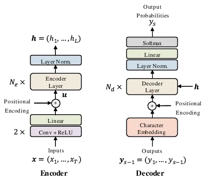
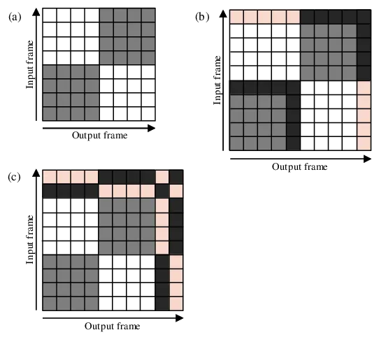
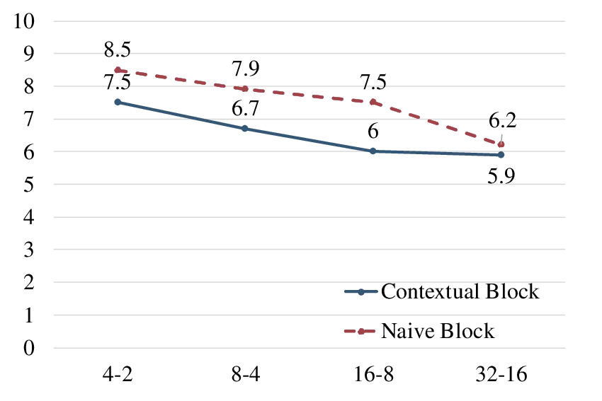
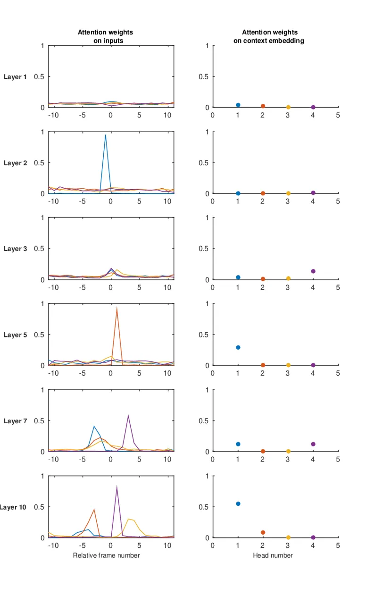

# Transformer ASR with Contextual Block Processing

Emiru Tsunoo    Yosuke Kashiwagi    Toshiyuki Kumakura    Shinji
Watanabe

###### Abstract

The Transformer self-attention network has recently shown promising
performance as an alternative to recurrent neural networks (RNNs) in
end-to-end (E2E) automatic speech recognition (ASR) systems. However,
the Transformer has a drawback in that the entire input sequence is
required to compute self-attention. In this paper, we propose a new
block processing method for the Transformer encoder by introducing a
context-aware inheritance mechanism. An additional context embedding
vector handed over from the previously processed block helps to encode
not only local acoustic information but also global linguistic, channel,
and speaker attributes. We introduce a novel mask technique to implement
the context inheritance to train the model efficiently. Evaluations of
the Wall Street Journal (WSJ), Librispeech, VoxForge Italian, and
AISHELL-1 Mandarin speech recognition datasets show that our proposed
contextual block processing method outperforms naive block processing
consistently. Furthermore, the attention weight tendency of each layer
is analyzed to clarify how the added contextual inheritance mechanism
models the global information.

###### Index Terms: 

Speech Recognition, End-to-end, Transformer, Self-attention Network,
Block Processing

^(†)^(†)address: ¹Sony Corporation, Japan  
²Johns Hopkins University, USA

## 1 Introduction

In speech, the phonetic events occur at a temporally local level,
whereas the speaker, channel, and long-range linguistic context exist
globally. Conventional automatic speech recognition (ASR) systems, such
as fully connected neural networks estimate hidden Markov model (HMM)
emission probabilities from only a locally selected audio chunk \[1\].
The recent success of recurrent neural networks (RNNs) in acoustic
modeling \[2, 3, 4\] can be attributed to exploiting the global context
simultaneously with local phonetic information.

End-to-end (E2E) models are currently attracting attention as methods of
directly integrating acoustic models (AMs) and language models (LMs)
because of their simple training procedure and decoding efficiency. In
recent years, various models have been studied, including connectionist
temporal classification (CTC) \[5, 6, 7\], attention-based
encoder–decoder models \[8, 9, 10, 11\], their hybrid models \[12, 13\],
and RNN transducer \[14, 15, 16\]. With thousands of hours of
speech-transcription parallel data, E2E ASR systems have become
comparable to conventional HMM-based ASR systems \[17, 18, 19, 20\].

Recently, Vaswani et al. \[21\] have proposed a new sequence model
without any recurrences, called the Transformer, which showed
state-of-the-art performance in a machine translation task. It has
multihead self-attention layers, which can leverage a combination of
information from completely different positions of the input. This
mechanism is suitable for exploiting both local and global information.
It also has the advantage of only requiring a single batch calculation
rather than the sequential computation of RNNs. Therefore, it can be
trained faster with parallel computing. The Transformer has been
successfully introduced into E2E ASR with and without CTC by replacing
RNNs \[22, 23, 24, 25, 26\].

However, similarly to bidirectional RNN models \[27\], the Transformer
has a drawback in that the entire utterance is required to compute
self-attention, making it difficult to utilize in online recognition
systems. Also, the memory and computational requirements of the
Transformer grow quadratically with the input sequence length, which
makes it difficult to apply to longer speech utterances. A simple
solution to these problems is block processing as in \[23, 25, 28\].
However, it loses the global context information and degrades
performance in general.

In this paper, we propose a new block processing of the Transformer
encoder by introducing a context-aware inheritance mechanism. To utilize
not only local acoustic information but also global
linguistic/channel/speaker attributes, we introduce an additional
context embedding vector, which is handed over from the previously
processed block to the following block. We also extend a mask technique
to cope with the context inheritance to realize efficient training.
Evaluations of the Wall Street Journal (WSJ), LibriSpeech, VoxForge
Italian, and AISHELL-1 Mandarin speech recognition datasets show that
our proposed contextual block processing method outperforms naive block
processing consistently. The attention weight tendency of each layer is
also analyzed to clarify how the added contextual inheritance mechanism
works.

## 2 Relation with prior work

The online processing of attention-based E2E ASR by window shifting
using the median \[8, 29\] or the monotonic energy function as in MoChA
\[30\], parametric Gaussian attention \[31\], and a trigger mechanism
for notifying the timing of the computation \[32\] has frequently been
investigated recently. Using the Transformer ASRs, several studies have
investigated online processing. Sperber et al. \[23\] pointed out that
the local context plays a crucial role in acoustic modeling. Therefore,
they tested attention biasing using local block masking and Gaussian
masking, where Gaussian masking was superior because it focused on
varying the granularity according to the layer. They found that not only
the local context but also the long-range channel and speaker properties
were also useful for acoustic modeling. However, Gaussian masking still
requires the entire input sequence. Dong et al. \[25\] introduced a
chunk hopping mechanism to the CTC-Transformer model to support online
recognition, which degraded the standard Transformer since it ignored
the global context.

For LMs, Transformer-XL was proposed to cope with longer-sequence
modeling \[33\]. The input sequence is split into fixed-length segments,
and by caching the previous segments, the context is extended
recurrently. Child et al. \[34\] applied the Transformer to
image/text/music generation with sparse attention masking, which was
similar to block processing, to generate long sequences.

In this paper, we explore the Transformer architecture for application
to online speech recognition. To prevent performance degradation due to
block processing, the contextual information is inherited in a simple
manner. We utilize an additional context embedding vector that is handed
over from the preceding block to the following one. The context
inheritance is performed via batch process using a mask function, rather
than recursively caching the whole state of the previous blocks as in
\[33\]. Thus, our model can be trained efficiently with parallel
computing.

## 3 Transformer ASR

The baseline Transformer ASR follows that in \[22\], which is based on
the encoder–decoder architecture in Fig. 1. An encoder transforms a
$`T`$-length speech feature sequence
$`{\mathbf{x}}=(x_{1},\dots,x_{T})`$ to an $`L`$-length intermediate
representation $`{\mathbf{h}}=(h_{1},\dots,h_{L})`$, where $`L\leq T`$
due to downsampling. Given $`{\mathbf{h}}`$ and previously emitted
character outputs $`{\mathbf{y}}_{s-1}=(y_{1},\dots,y_{s-1})`$, a
decoder estimates the next character $`y_{s}`$.



Figure 1: The model architecture of the Transformer ASR.

The encoder consists of two convolutional layers with stride $`2`$ for
downsampling, a linear projection layer, positional encoding, followed
by $`N_{e}`$ encoder layers and layer normalization. The positional
encoding is a $`d_{\mathrm{model}}`$-dimensional vector defined as

```math
\displaystyle\mathrm{PE}_{(pos,2i)}=\sin{(\frac{pos}{10000^{2i/d_{\mathrm{model}}}})}
```

```math
\displaystyle\mathrm{PE}_{(pos,2i+1)}=\cos{(\frac{pos}{10000^{2i/d_{\mathrm{model}}}})}, \tag{1}
```

which is added to the output of the linear projection of two-layer
convolutions. Each encoder layer has a multihead self-attention network
(SAN) followed by a position-wise feed-forward network, both of which
have residual connections. Layer normalization is also applied before
each module. In the SAN, the attention weights are formed from queries
($`\mathbf{Q}\in{\mathbb{R}}^{t_{q}\times d}`$) and keys
($`\mathbf{K}\in{\mathbb{R}}^{t_{k}\times d}`$), and applied to values
($`\mathbf{V}\in{\mathbb{R}}^{t_{v}\times d}`$) as

```math
\displaystyle\mathrm{Attention}({\mathbf{Q}},{\mathbf{K}},{\mathbf{V}})=\mathrm{softmax}\left(\frac{{\mathbf{Q}}{\mathbf{K}}^{T}}{\sqrt{d}}\right){\mathbf{V}}, \tag{2}
```

where typically $`d=d_{\mathrm{model}}/m`$. We utilized multihead
attention denoted as the $`\mathrm{MHD}(\cdot)`$ function as follows:

```math
\displaystyle\mathrm{MHD}({\mathbf{Q}},{\mathbf{K}},{\mathbf{V}})=\mathrm{Concat}(\mathrm{head}_{1},\dots,\mathrm{head}_{m}){\mathbf{W}}_{O}^{n}, \tag{3}
```

where $`\mathrm{head}_{i}`$ is concatenated ($`\mathrm{Concat}(\cdot)`$)
and linearly transformed with the projection matrix
$`{\mathbf{W}}_{O}^{n}`$. $`m`$ is the number of heads.
$`\mathrm{head}_{i}`$ is calculated with the
$`\mathrm{Attention}(\cdot)`$ function introduced in (2) as follows.

```math
\displaystyle\mathrm{head}_{i}=\mathrm{Attention}({\mathbf{Q}}{\mathbf{W}}_{Q,i}^{n},{\mathbf{K}}{\mathbf{W}}_{K,i}^{n},{\mathbf{V}}{\mathbf{W}}_{V,i}^{n}) \tag{4}
```

In (3) and (4), the $`n`$th layer is computed with the projection
matrices
$`{\mathbf{W}}_{Q,i}^{n}\in{\mathbb{R}}^{d_{\mathrm{model}}\times d}`$,
$`{\mathbf{W}}_{K,i}^{n}\in{\mathbb{R}}^{d_{\mathrm{model}}\times d}`$,
$`{\mathbf{W}}_{V,i}^{n}\in{\mathbb{R}}^{d_{\mathrm{model}}\times d}`$,
and
$`{\mathbf{W}}_{O}^{n}\in{\mathbb{R}}^{md\times d_{\mathrm{model}}}`$.
For all the SANs in the encoder, $`{\mathbf{Q}}`$, $`{\mathbf{K}}`$, and
$`{\mathbf{V}}`$ are the same matrices, which are the inputs of SAN. The
position-wise feed-forward network is a stack of linear layers.

The decoder predicts the probability of the following character from
previous output characters and the encoder output $`{\mathbf{h}}`$,
i.e., $`p(y_{s}|y_{1},\dots,y_{s-1},{\mathbf{h}})`$, similarly to that
in LMs. The character history sequence is converted to character
embeddings. Then, $`N_{d}`$ decoder layers are applied, followed by
linear projection and the Softmax function. The decoder layer consists
of two SANs followed by a position-wise feed-forward network. The first
SAN in each decoder layer applies attention weights to the input
character sequence, where the input sequence of the SAN is set as
$`{\mathbf{Q}}`$, $`{\mathbf{K}}`$, and $`{\mathbf{V}}`$. Then the
following SAN attends to the entire encoder output sequence by setting
$`{\mathbf{K}}`$ and $`{\mathbf{V}}`$ to be the encoder output
$`{\mathbf{h}}`$. By using a mask function as in \[21, 35\], the
decoding process is carried out without recurrence; thus, both the
encoder and the decoder are efficiently trained in an E2E manner.

## 4 Contextual block processing

### 4.1 Block encoding

In the applications of real-time ASR, which receive a speech data
stream, the recognition should be performed online. Most of the
state-of-the-art systems, such as the bidirectional LSTM (biLSTM) \[13\]
and Transformer \[22\], require the entire speech utterance for both
encoding and decoding; thus, they are processed only after the end of
the utterance, which is not suitable for online processing. Considering
that at least phonetic events occur in the local temporal region, the
encoder can be computed block-wise, as in \[23, 25, 28\]. In contrast,
the decoder follows a sequential process by its nature, since it emits
characters one by one using the output history. Although it should
require at least the part of the encoder output $`{\mathbf{h}}`$
corresponding to the processing character, estimating the optimal
alignment between the encoder output and the decoder is still difficult,
especially without any language dependence. Therefore, we leave the
online processing of the decoder for our future work, and the decoding
is performed only after the entire utterance is input.

Denoting downsampled input features, i.e., the output of two
convolutional layers, linear projection, and positional encoding, as
$`{\mathbf{u}}=(u_{1},\dots,u_{T/4})`$, the block size as
$`L_{\mathrm{block}}`$, and the hop size as $`L_{\mathrm{hop}}`$, the
$`b`$th block is processed using input features $`u_{t}`$ from
$`t=(b-1)\cdot L_{\mathrm{hop}}+1`$ to
$`t=(b-1)\cdot L_{\mathrm{hop}}+L_{\mathrm{block}}`$, which is denoted
as an $`L_{\mathrm{block}}`$-length subsequence $`{\mathbf{u}}_{b}`$,
i.e.,

```math
{\mathbf{u}}_{b}=(u_{(b-1)\cdot L_{\mathrm{hop}}+1},\dots,u_{(b-1)\cdot L_{\mathrm{hop}}+L_{\mathrm{block}}}) \tag{5}
```

Considering the overlap of the blocks, we utilize only the central
$`L_{\mathrm{hop}}`$ of the output of each block, which we denote as
$`{\mathbf{h}}_{b}`$. The first frames are included in the first block
$`{\mathbf{h}}_{1}`$ and the last frames are in the last block
$`{\mathbf{h}}_{B}`$. When $`L_{\mathrm{block}}=16`$ and
$`L_{\mathrm{hop}}=8`$, block encoding is performed using 64-frame
acoustic features with 32 frames overlap. The block encoding is depicted
in Fig. 2.


Figure 2: The context inheritance mechanism of the encoder.

### 4.2 Context inheritance mechanism

Global channel, speaker, and linguistic context are also important for
local phoneme classification. To utilize such context information, we
propose a new context inheritance mechanism by introducing an additional
context embedding vector. As shown in Fig. 2, the context embedding
vector is computed in each layer of each block and handed over to the
upper layer of the following block. Thus, the SAN in each layer is
applied to the block input sequence using the context embedding vector.

The proposed Transformer with the context embedding vector is
straightforwardly extended from the original formulation in Section 3.
The SAN computations (3) and (4) of layer $`n`$ of block $`b`$ are
rewritten as

```math
\displaystyle\mathrm{MHD}(\tilde{{\mathbf{Q}}}_{b}^{n},\tilde{{\mathbf{K}}}_{b}^{n},\tilde{{\mathbf{V}}}_{b}^{n})=\mathrm{Concat}(\tilde{\mathrm{head}}_{1},\dots,\tilde{\mathrm{head}}_{m}){\mathbf{W}}_{O}^{n}, \tag{6}
```

```math
\displaystyle\tilde{\mathrm{head}}_{i}=\mathrm{Attention}(\tilde{{\mathbf{Q}}}_{b}^{n}{\mathbf{W}}_{Q,i}^{n},\tilde{{\mathbf{K}}}_{b}^{n}{\mathbf{W}}_{K,i}^{n},\tilde{{\mathbf{V}}}_{b}^{n}{\mathbf{W}}_{V,i}^{n}), \tag{7}
```

where $`\tilde{\mbox{}}`$ denotes the augmented variables with the
context embedding vector. Denoting the context embedding vector as
$`\mathbf{c}_{b}^{n}`$, the augmented variables are defined as follows:

- •
  In the first layer ($`n=1`$),
  $`\tilde{{\mathbf{Q}}}_{b}^{1}=\tilde{{\mathbf{K}}}_{b}^{1}=\tilde{{\mathbf{V}}}_{b}^{1}=[{\mathbf{u}}_{b}\ c_{b}^{0}]`$
  is represented as an augmented feature matrix composed of the blocked
  input $`{\mathbf{u}}_{b}`$ as introduced in (5) and the additional
  initial context embedding vector $`c_{b}^{0}`$. The initialization of
  $`c_{b}^{0}`$ is discussed in Section 4.3.
- •
  In the succeeding layers ($`n>1`$),
  $`\tilde{{\mathbf{Q}}}_{b}^{n}=[{\mathbf{Z}}_{b}^{n-1}\ c_{b}^{n-1}]`$
  and
  $`\tilde{{\mathbf{K}}}_{b}^{n}=\tilde{{\mathbf{V}}}_{b}^{n}=[{\mathbf{Z}}_{b}^{n-1}\ c_{b-1}^{n-1}]`$
  are similarly augmented with the context embedding vector
  $`c_{b-1}^{n-1}`$ in the previous block $`(b-1)`$ of the previous
  layer $`(n-1)`$ and $`{\mathbf{Z}}_{b}^{n-1}`$.
  $`{\mathbf{Z}}_{b}^{n}`$ is the output of the $`n`$th encoder layer of
  block $`b`$, which is computed simultaneously with the context
  embedding vector $`c_{b}^{n}`$ as

  ```math
  \displaystyle\tilde{{\mathbf{Z}}}_{b}^{n} \displaystyle=[{\mathbf{Z}}_{b}^{n}\ c_{b}^{n}]
  ```

  ```math
  \displaystyle=\max(0,\tilde{{\mathbf{Z}}}_{b,\text{int.}}^{n}{\mathbf{W}}_{1}^{n}+v_{1}^{n}){\mathbf{W}}_{2}^{n}+v_{2}^{n}+\tilde{{\mathbf{Z}}}_{b,\text{int.}}^{n} \tag{8}
  ```

  ```math
  \displaystyle\tilde{{\mathbf{Z}}}_{b,\text{int.}}^{n} \displaystyle=\mathrm{MHD}(\tilde{{\mathbf{Q}}}_{b}^{n},\tilde{{\mathbf{K}}}_{b}^{n},\tilde{{\mathbf{V}}}_{b}^{n})+\tilde{{\mathbf{V}}}_{b}^{n}, \tag{9}
  ```

  where $`{\mathbf{W}}_{1}^{n}`$, $`{\mathbf{W}}_{2}^{n}`$,
  $`v_{1}^{n}`$ and $`v_{2}^{n}`$ are trainable matrices and biases.

Note that most of these calculations are closed within block $`b`$. Only
the context embedding part $`c_{b-1}^{n-1}`$ carries over the previous
block context information. Therefore, if SAN attends to the context
embedding vector $`c_{b-1}^{n-1}`$, the output of
$`\mathrm{MHD}(\cdot)`$ in (6) delivers the context information to the
succeeding layer as the tilted arrows in Figure 2.

This framework enables a deeper layer to hold longer context
information. For example, $`c_{b}^{n}`$ corresponds to an
$`(n-1)`$-block-length context, by expanding the above recursive
equation between $`c_{b}^{n}`$ and $`c_{b-1}^{n-1}`$ (denoted as
$`f(\cdot)`$) as follows:

```math
\displaystyle c_{b}^{n} \displaystyle=f({\mathbf{Z}}_{b}^{n-1},c_{b-1}^{n-1})=f({\mathbf{Z}}_{b}^{n-1},f({\mathbf{Z}}_{b-1}^{n-2},c_{b-2}^{n-2}))\cdots
```

```math
\displaystyle=g({\mathbf{Z}}_{b}^{n-1},\dots,{\mathbf{Z}}_{b-n+2}^{1},{\mathbf{u}}_{b-n+1}). \tag{10}
```

Thus, our proposed framework can include long context information while
keeping the basic block processing.

### 4.3 Context embedding initialization

For the initial context embedding vector for the first layer,
$`c_{b}^{0}`$, we propose three types of initialization as follows.

#### 4.3.1 Positional encoding

For the initial context embedding vector, a simple positional encoding
process (1) is adopted. The position ($`pos`$) is rearranged over the
blocks, starting from $`0`$.

```math
\displaystyle c_{(b,i)}^{0}=\mathrm{PE}_{(b-1,i)} \tag{11}
```

For the following layers, only the contextual output of each encoder
layer $`c_{b}^{n}`$ is handed over.

#### 4.3.2 Average input

We expect the context embedding to inherit global statistics from the
precedent blocks. Therefore, the average of the input sequence for the
block $`{\mathbf{u}}_{b}`$ is used as the initial context embedding
vector because it is a statistic that has already been obtained.

```math
\displaystyle c_{b}^{0}=\mathrm{Average}({\mathbf{u}}_{b}) \tag{12}
```

Positional encoding can also be added to the average to help identify
the sequence of blocks.

#### 4.3.3 Maximum values of input

Instead of taking the average, the maximum values are taken along the
temporal axis as

```math
\displaystyle c_{b}^{0}=\mathrm{Maxpool}({\mathbf{u}}_{b}). \tag{13}
```

This can also be combined with the positional encoding.

### 4.4 Implementation

One of the advantages of the Transformer is its efficiency in training.
Since the Transformer is not a recursive network, it can be trained in
parallel without waiting for preceding outputs. Even for the causal
process of the decoder, the training is performed at a single time using
a mask function as in \[21, 35\]. Our proposed contextual block
processing can also be implemented in a similar manner.

For the block encoding, the mask shown as (a) in Fig. 3 is designed to
confine the Softmax and output computation in (2) within a block. This
is an example of $`L_{block}=4`$, which narrows the frames used for
Softmax computation down to 1–4 for the output frame 1–4, and down to
5–8 for the output frame 5–8. The central frames of each block are
extracted after the last layer computation and stacked in the matrix
$`{\mathbf{h}}`$. In the case of overlapping, multiple masks are created
and applied individually. For instance, the case of half-overlapping
($`L_{\mathrm{hop}}=L_{\mathrm{block}}/2`$), two masks with
$`L_{\mathrm{hop}}`$ frame shifting are used.

Contextual inheritance requires additional vectors for context
embedding. Straightforwardly, the context embedding vectors are inserted
after each block, then the mask is extended as (b) in Fig. 3 for the
first layer, where colored regions correspond to the context embedding
vectors. Thus, for computing both the output of SAN $`Z_{b}^{1}`$ and
the context embedding vector $`c_{b}^{1}`$, both the input
$`{\mathbf{u}}_{b}`$ and the initial context embedding vector
$`c_{b}^{0}`$ are used. Masks for the succeeding layers are designed to
attend to the context embedding vectors of the preceding blocks.
However, the insertions of the context embedding vectors complicate the
implementation. Instead, we simply concatenate $`B=T/4L_{\mathrm{hop}}`$
frames of context embedding vectors to the end of the input sequence
$`{\mathbf{u}}`$ as

```math
\displaystyle{\mathbf{u}}_{\mathrm{ext}}=(u_{1},\dots,u_{T/4},c_{1}^{0},\dots,c_{B}^{0}). \tag{14}
```

Then, the mask shown as (c) in Fig. 3 is designed for the contextual
block processing to include the context embedding vector in the Softmax
computation and produce a new context embedding vector.

Technically, in our implementation, each layer normalization is applied
to the entire input sequence; thus, in each block, the statistics are
shared over all the blocks. However, we leave this unchanged for
efficiency, because our preliminary experiment showed this global
normalization was not significantly different from the normalization
within each block. Additionally, in the case of half-overlapping, the
context embedding vectors cannot be referred to across the different two
masks. Therefore, each block refers to the context embedding vector of
two blocks earlier; thus,
$`\tilde{{\mathbf{K}}}_{b}^{n}=\tilde{{\mathbf{V}}}_{b}^{n}=[{\mathbf{Z}}_{b}^{n-1}\ c_{b-2}^{n-1}]`$.



Figure 3: The design of masks used for block processing. (a) is for
naive block processing, (b) is an extension for contextual block
processing for the first layer, (c) is an alternate form of (b). Colored
regions are for context embedding vectors and all the darken regions
pass values.

## 5 Experiments

### 5.1 Experimental setup

We carried out experiments using the WSJ and LibriSpeech datasets \[36\]
for English ASRs. The models were trained on the SI-284 set and
evaluated on the eval92 set for the WSJ, and we used 960 hours of
training data and both clean and contaminated test data were evaluated
for the LibriSpeech. Also VoxForge¹¹ 1 VoxForge: http://www.voxforge.org
Italian corpus and AISHELL-1 Mandarin data \[37\] are trained and
evaluated. The input acoustic features were 80-dimensional filterbanks
and the pitch, extracted with a hop size of 10 ms and a window size of
25 ms, which were normalized with the mean and variance. For the WSJ
setup, the number of output classes was 52, including the 26 letters of
the alphabet, space, noise, symbols such as period, an unknown marker, a
start-of-sequence (SOS) token, and an end-of-sequence (EOS) token.
Similarly, we used 36 character classes for the VoxForge Italian and
4231 character classes for the AISHELL-1 Mandarin. For the LibriSpeech,
we adopted byte-pair encoding (BPE) subword tokenization \[38\], which
ended up with 5000 token classes.

For the training, we utilized multitask learning with CTC loss as in
\[13\] with a weight of 0.3. A linear layer was added onto the encoder
to project $`{\mathbf{h}}`$ to the character probability for the CTC.
The Transformer models were trained over 100 epochs for WSJ, 50 epochs
for LibriSpeech/AISHELL-1, and 300 epochs for VoxForge, with the Adam
optimizer and Noam learning rate decay as in \[21\], starting with a
learning rate of 5.0, and a mini-batch size of 32. The parameters of the
last 10 epochs were averaged and used for inference. The encoder had
$`N_{e}=12`$ layers with 2048 units and the decoder had $`N_{d}=6`$
layers with 2048 units, with both having a dropout rate of 0.1. For the
SAN, the output $`\tilde{\mathbf{Z}}_{b}^{n}`$ was a 256-dimensional
vector ($`d_{model}=256`$) with four heads ($`m=4`$). We trained three
types of the Transformer, the baseline Transformer without any block
processing, the Transformer with naive block processing as described in
Section 4.1, and the Transformer with our proposed contextual block
processing method as in Section 4.2. The training was carried out using
ESPNet²² 2 ESPNet: https://github.com/espnet/espnet/ \[39\] with the
PyTorch³³ 3 PyTorch: https://pytorch.org/ toolkit \[40\].

The decoding was performed alongside the CTC, whose probabilities were
added with a weight of 0.3 to those of the Transformer. We performed
decoding using a beam search with a beam size of 10. An external
word-level LM was used for rescoring using shallow-fusion \[41\] with a
weight of $`1.0`$ for WSJ, $`0.7`$ for LibriSpeech, and $`0.3`$ for
AISHELL-1; this model was a single-layer LSTM with 1000 units. We did
not use an external LM for the VoxForge dataset.

We also trained the biLSTM model \[13\] as baselines. The baseline
models consisted of an encoder with a VGG layer, followed by
bidirectional LSTM layers and a decoder. The numbers of the encoder
biLSTM layers were six, five, four, and three, with 320, 1024, 320, and
1024 units for WSJ, LibriSpeech, VoxForge, and AISHELL-1 respectively.
The decoders were an LSTM layer with 300 units for WSJ and VoxForge, and
two LSTM layers with 1024 units for the rest. For the online encoding,
it is a natural idea to utilize a unidirectional LSTM. Thus, for a
comparison, simple LSTM models, in which bidirectional LSTMs were
swapped with unidirectional LSTMs, were trained in the same conditions.

|                              | eval92 |
| ---------------------------- | ------ |
| Batch encoding               |        |
| biLSTM \[13\]                | 6.7    |
| Transformer                  | 5.0    |
| Online encoding              |        |
| LSTM                         | 8.4    |
| Block Transformer            | 7.5    |
| Contextual Block Transformer |        |
|    —PE                       | 6.0    |
|    —Avg. input               | 6.3    |
|    —Max input                | 10.9   |
|    —PE + Avg. input          | 5.7    |
|    —PE + Max input           | 7.9    |

Table 1: Word error rates (WERs) in the WSJ evaluation task with
$`L_{\mathrm{block}}=16`$ and $`L_{\mathrm{hop}}=8`$.

### 5.2 Results

#### 5.2.1 Comparison of recognition performance

We first carried out a word error rate (WER) comparison on the WSJ
dataset. The results are summarized in Table 1. For the batch encoding,
we observed that the Transformer outperformed the conventional biLSTM
model. It degraded when each biLSTM was swapped with a LSTM. When we
used naive online block processing for the encoding, as in Section 4.1,
the error rate decreased from that of the LSTM model. For our proposed
contextual block processing method, various context embedding vector
initializations were tested, initialization with positional encoding as
in Section 4.3.1 (PE), with the average input as in Section 4.3.2 (Avg.
input), with the maximum values of inputs as in Section 4.3.3 (Max
input), and their combinations (PE + Avg. input and PE + Max input). The
proposed contextual block processing methods using PE and Avg. input
improved the accuracy significantly, among which the combination (PE +
Avg. input) achieved the best result.

We also applied each model to the LibriSpeech, VoxForge Itallian, and
AISHELL-1 Mandarin datasets. Only the PE + Avg. input initialization was
adopted for the context embedding vector. The results shown in Table 2
have a similar tendency to those for the WSJ dataset. This indicates
that our proposed context inheritance mechanism is consistently useful
to leverage the global context information.

|                     |             |       |          |         |
| ------------------- | ----------- | ----- | -------- | ------- |
|                     | LibriSpeech |       | VoxForge | AISHELL |
|                     | (WER)       |       | (CER)    | (CER)   |
|                     | clean       | other |          |         |
| Batch encoding      |             |       |          |         |
| biLSTM \[13\]       | 4.2         | 13.1  | 10.5     | 9.2     |
| Transformer         | 4.5         | 11.2  | 9.3      | 6.4     |
| Online encoding     |             |       |          |         |
| LSTM                | 5.3         | 16.1  | 14.6     | 11.8    |
| Block               | 4.8         | 13.2  | 11.5     | 7.8     |
| Contextual Block    |             |       |          |         |
|    —PE + Avg. input | 4.6         | 13.1  | 10.3     | 7.6     |

Table 2: WERs/CERs for the LibriSpeech, VoxForge Italian, and AISHELL-1
Mandarin datasets ($`L_{\mathrm{block}}=16`$, $`L_{\mathrm{hop}}=8`$).

#### 5.2.2 Comparison of block size

We also evaluated WERs for various block sizes ($`L_{\mathrm{block}}`$),
i.e., 4, 8, 16, and 32, for the naive block Transformer and contextual
block Transformer on the WSJ dataset. The block processing was carried
out in the half-overlapping manner; thus,
$`L_{\mathrm{hop}}=L_{\mathrm{block}}/2`$. The results are shown in
Fig. 4. As the block size increased, the performance improved in both
types of block processing. The proposed processing method consistently
had better performance, especially with small block sizes. This result
also indicates that a block size of 16 is sufficient for contextual
block processing. Interestingly, this result also shows that a block
size of 32 is sufficient to acquire certain context information, where
the contextual block processing method improved only a small amount.



Figure 4: The WERs in the WSJ evaluation task for various block sizes
($`L_{\mathrm{block}}`$ – $`L_{\mathrm{hop}}`$).

#### 5.2.3 Interpretation of attention weight

We also looked at how the attention works in the proposed context
inheritance mechanism. We sampled an utterance in the WSJ evaluation
data to compute the statistics of the attention weights using the
Softmax in (2). Fig. 5 shows the attention weights in the layers that we
considered, which are used for computing the outputs of encoder layer
$`{\mathbf{Z}}_{b}^{n}`$, applied to the inputs
$`\mathbf{V}_{b}^{n}={\mathbf{Z}}_{b}^{n-1}`$ (left column) and to the
context embedding vector $`c_{b-2}^{n-1}`$ (right column). Each color
corresponds to the same head.

Looking at the left column, in the first layer, the attention weights
tended to evenly attend to the input sequence, while the context
embedding vector was not attended to. In deeper layers, the attention
weights started to develop peaks in the center, and the weights for the
context embedding vector (right column) started to increase from the
third layer. This indicates that the deeper layers rely on the context
information more. For instance, the first head of layer 5 (blue color)
did not strongly attend to the inputs of the SAN, whereas it attended to
the context embedding vector with a weight of 0.3. Interestingly, in the
seventh and tenth layer, the first and second heads (blue and orange)
used the inputs of a few frames earlier to encode each frame, with and
without the context information, and the fourth head (purple) attended
to the future. The first head of layer 10 integrated information over
the contexts of nine blocks, which consists of 576 frames (5.76 s), with
more attention weight than that of the input.



Figure 5: Attention weights used for computing outputs of self-attention
network (SAN) over a WSJ utterance sample in each layer, applied to the
inputs (left column) and to the context embedding vector (right column).
Each color corresponds to the same head.

## 6 Conclusion

We have proposed a new block processing method of the Transformer
encoder by introducing a context-aware inheritance mechanism. An
additional context embedding vector handed over from the previously
processed block helped to encode not only local acoustic information but
also global linguistic/channel/speaker attributes. We extended a mask
technique to realize efficient training with the context inheritance.
Evaluations of the WSJ, LibriSpeech, VoxForge Italian, and AISHELL-1
Mandarin speech recognition datasets showed that our proposed contextual
block processing method outperformed naive block processing
consistently. We also analyzed the attention weight tendency of each
layer to interpret the behavior of the added contextual inheritance
mechanism.

In this study, we used the original Transformer for decoding, which will
be alternated with online processing in our future work. We will also
investigate the computation cost and delay with the online decoding
implementation in a streaming recognition scenario.

## References

- \[1\] H. Bourlard and N. Morgan, Connectionist Speech Recognition,
  Kluwer Academic Publishers, 1994.
- \[2\] Alex Graves, Navdeep Jaitly, and Abdel-rahman Mohamed, “Hybrid
  speech recognition with deep bidirectional lstm,” in Proc. of IEEE
  Automatic Speech Recognition and Understanding (ASRU) Workshop, 2013,
  pp. 273–278.
- \[3\] C. Weng, D. Yu, S. Watanabe, and B. F. Juang, “Recurrent deep
  neural networks for robust speech recognition,” in Proc. of IEEE
  International Conference on Acoustics, Speech and Signal Processing
  (ICASSP), 2014, pp. 5532–5536.
- \[4\] Haşim Sak, Félix de Chaumont Quitry, Tara Sainath, Kanishka Rao,
  et al., “Acoustic modelling with CD-CTC-SMBR LSTM RNNs,” in Proc. of
  IEEE Automatic Speech Recognition and Understanding (ASRU) Workshop,
  2015, pp. 604–609.
- \[5\] Alex Graves, Santiago Fernández, Faustino Gomez, and Jürgen
  Schmidhuber, “Connectionist temporal classification: labelling
  unsegmented sequence data with recurrent neural networks,” in Proc. of
  the 23rd International Conference on Machine Learning. ACM, 2006, pp.
  369–376.
- \[6\] Alex Graves and Navdeep Jaitly, “Towards end-to-end speech
  recognition with recurrent neural networks,” in International
  Conference on Machine Learning, 2014, pp. 1764–1772.
- \[7\] Yajie Miao, Mohammad Gowayyed, and Florian Metze, “EESEN:
  End-to-end speech recognition using deep RNN models and WFST-based
  decoding,” in Proc. of IEEE Automatic Speech Recognition and
  Understanding (ASRU) Workshop, 2015, pp. 167–174.
- \[8\] Jan K. Chorowski, Dzmitry Bahdanau, Dmitriy Serdyuk, Kyunghyun
  Cho, and Yoshua Bengio, “Attention-based models for speech
  recognition,” in Advances in Neural Information Processing Systems,
  2015, pp. 577–585.
- \[9\] William Chan, Navdeep Jaitly, Quoc Le, and Oriol Vinyals,
  “Listen, attend and spell: A neural network for large vocabulary
  conversational speech recognition,” in Proc. of IEEE International
  Conference on Acoustics, Speech and Signal Processing (ICASSP), 2016,
  pp. 4960–4964.
- \[10\] Liang Lu, Xingxing Zhang, and Steve Renais, “On training the
  recurrent neural network encoder-decoder for large vocabulary
  end-to-end speech recognition,” in Proc. of IEEE International
  Conference on Acoustics, Speech and Signal Processing (ICASSP), 2016,
  pp. 5060–5064.
- \[11\] Albert Zeyer, Kazuki Irie, Ralf Schlüter, and Hermann Ney,
  “Improved training of end-to-end attention models for speech
  recognition,” in Proc. of Interspeech 2018, 2018, pp. 7–11.
- \[12\] Suyoun Kim, Takaaki Hori, and Shinji Watanabe, “Joint
  CTC-attention based end-to-end speech recognition using multi-task
  learning,” in Proc. of IEEE International Conference on Acoustics,
  Speech and Signal Processing (ICASSP), 2017, pp. 4835–4839.
- \[13\] Shinji Watanabe, Takaaki Hori, Suyoun Kim, John R Hershey, and
  Tomoki Hayashi, “Hybrid CTC/attention architecture for end-to-end
  speech recognition,” IEEE Journal of Selected Topics in Signal
  Processing, vol. 11, no. 8, pp. 1240–1253, 2017.
- \[14\] Alex Graves, “Sequence transduction with recurrent neural
  networks,” in ICML Representation Learning Workshop, 2012.
- \[15\] Alex Graves, Abdel-rahman Mohamed, and Geoffrey Hinton, “Speech
  recognition with deep recurrent neural networks,” in Proc. of IEEE
  International Conference on Acoustics, Speech and Signal Processing
  (ICASSP), 2013, pp. 6645–6649.
- \[16\] Kanishka Rao, Haşim Sak, and Rohit Prabhavalkar, “Exploring
  architectures, data and units for streaming end-to-end speech
  recognition with rnn-transducer,” in Proc. of IEEE Automatic Speech
  Recognition and Understanding (ASRU) Workshop, 2017, pp. 193–199.
- \[17\] Dario Amodei et al., “Deep speech 2: End-to-end speech
  recognition in english and mandarin,” in Proc. of the 33rd
  International Conference on Machine Learning, 2016, vol. 48, pp.
  173–182.
- \[18\] Rohit Prabhavalkar, Tara N Sainath, Bo Li, Kanishka Rao, and
  Navdeep Jaitly, “An analysis of ”attention” in sequence-to-sequence
  models,” in Proc. of Interspeech, 2017, pp. 3702–3706.
- \[19\] Jinyu Li, Guoli Ye, Rui Zhao, Jasha Droppo, and Yifan Gong,
  “Acoustic-to-word model without OOV,” in Proc. of IEEE Automatic
  Speech Recognition and Understanding (ASRU) Workshop, 2017, pp.
  111–117.
- \[20\] Chung-Cheng Chiu, Tara N Sainath, Yonghui Wu, Rohit
  Prabhavalkar, Patrick Nguyen, Zhifeng Chen, Anjuli Kannan, Ron J
  Weiss, Kanishka Rao, Ekaterina Gonina, et al., “State-of-the-art
  speech recognition with sequence-to-sequence models,” in Proc. of IEEE
  International Conference on Acoustics, Speech and Signal Processing
  (ICASSP), 2018, pp. 4774–4778.
- \[21\] Ashish Vaswani, Noam Shazeer, Niki Parmar, Jakob Uszkoreit,
  Llion Jones, Aidan N Gomez, Lukasz Kaiser, and Illia Polosukhin,
  “Attention is all you need,” in Advances in Neural Information
  Processing Systems, 2017, pp. 5998–6008.
- \[22\] Linhao Dong, Shuang Xu, and Bo Xu, “Speech-transformer: a
  no-recurrence sequence-to-sequence model for speech recognition,” in
  Proc. of IEEE International Conference on Acoustics, Speech and Signal
  Processing (ICASSP), 2018, pp. 5884–5888.
- \[23\] Matthias Sperber, Jan Niehues, Graham Neubig, Sebastian Stüker,
  and Alex Waibel, “Self-attentional acoustic models,” in Proc. of
  Interspeech, 2018, pp. 3723–3727.
- \[24\] Julian Salazar, Katrin Kirchhoff, and Zhiheng Huang,
  “Self-attention networks for connectionist temporal classification in
  speech recognition,” in Proc. of IEEE International Conference on
  Acoustics, Speech and Signal Processing (ICASSP), 2019, pp. 7115–7119.
- \[25\] Linhao Dong, Feng Wang, and Bo Xu, “Self-attention aligner: A
  latency-control end-to-end model for ASR using self-attention network
  and chunk-hopping,” in Proc. of IEEE International Conference on
  Acoustics, Speech and Signal Processing (ICASSP), 2019, pp. 5656–5660.
- \[26\] Yuanyuan Zhao, Jie Li, Xiaorui Wang, and Yan Li, “The
  Speechtransformer for large-scale Mandarin Chinese speech
  recognition,” in Proc. of IEEE International Conference on Acoustics,
  Speech and Signal Processing (ICASSP), 2019, pp. 7095–7099.
- \[27\] Mike Schuster and Kuldip K Paliwal, “Bidirectional recurrent
  neural networks,” IEEE Transactions on Signal Processing, vol. 45, no.
  11, pp. 2673–2681, 1997.
- \[28\] Navdeep Jaitly, David Sussillo, Quoc V Le, Oriol Vinyals, Ilya
  Sutskever, and Samy Bengio, “A neural transducer,” arXiv preprint
  arXiv:1511.04868, 2015.
- \[29\] William Chan and Ian Lane, “On online attention-based speech
  recognition and joint Mandarin character-Pinyin training,” in Proc. of
  Interspeech, 2016, pp. 3404–3408.
- \[30\] Chung-Cheng Chiu and Colin Raffel, “Monotonic chunkwise
  attention,” arXiv preprint arXiv:1712.05382, 2017.
- \[31\] Junfeng Hou, Shiliang Zhang, and Li-Rong Dai, “Gaussian
  prediction based attention for online end-to-end speech recognition,”
  in Proc. of Interspeech, 2017, pp. 3692–3696.
- \[32\] Niko Moritz, Takaaki Hori, and Jonathan Le Roux, “Triggered
  attention for end-to-end speech recognition,” in Proc. of IEEE
  International Conference on Acoustics, Speech and Signal Processing
  (ICASSP), 2019, pp. 5666–5670.
- \[33\] Zihang Dai, Zhilin Yang, Yiming Yang, William W Cohen, Jaime
  Carbonell, Quoc V Le, and Ruslan Salakhutdinov, “Transformer-XL:
  Attentive language models beyond a fixed-length context,” arXiv
  preprint arXiv:1901.02860, 2019.
- \[34\] Rewon Child, Scott Gray, Alec Radford, and Ilya Sutskever,
  “Generating long sequences with sparse transformers,” arXiv preprint
  arXiv:1904.10509, 2019.
- \[35\] Aaron Van den Oord, Nal Kalchbrenner, Lasse Espeholt, Oriol
  Vinyals, Alex Graves, et al., “Conditional image generation with
  PixelCNN decoders,” in Advances in Neural Information Processing
  Systems, 2016, pp. 4790–4798.
- \[36\] Vassil Panayotov, Guoguo Chen, Daniel Povey, and Sanjeev
  Khudanpur, “LibriSpeech: an ASR corpus based on public domain audio
  books,” in Proc. of IEEE International Conference on Acoustics, Speech
  and Signal Processing (ICASSP), 2015, pp. 5206–5210.
- \[37\] Xingyu Na Bengu Wu Hao Zheng Hui Bu, Jiayu Du, “AIShell-1: An
  open-source Mandarin speech corpus and a speech recognition baseline,”
  in Oriental COCOSDA, 2017, pp. 1–5.
- \[38\] Rico Sennrich, Barry Haddow, and Alexandra Birch, “Neural
  machine translation of rare words with subword units,” in Proc. of the
  Association for Computational Linguistics, 2016, vol. 1, pp.
  1715–1725.
- \[39\] Shinji Watanabe, Takaaki Hori, Shigeki Karita, Tomoki Hayashi,
  Jiro Nishitoba, Yuya Unno, Nelson Enrique Yalta Soplin, Jahn Heymann,
  Matthew Wiesner, Nanxin Chen, et al., “ESPnet: End-to-end speech
  processing toolkit,” in Proc. of Interspeech, 2019, pp. 2207–2211.
- \[40\] Adam Paszke, Sam Gross, Soumith Chintala, Gregory Chanan,
  Edward Yang, Zachary DeVito, Zeming Lin, Alban Desmaison, Luca Antiga,
  and Adam Lerer, “Automatic differentiation in PyTorch,” in NIPS
  Autodiff Workshop, 2017.
- \[41\] Anjuli Kannan, Yonghui Wu, Patrick Nguyen, Tara N Sainath,
  ZhiJeng Chen, and Rohit Prabhavalkar, “An analysis of incorporating an
  external language model into a sequence-to-sequence model,” in Proc.
  of IEEE International Conference on Acoustics, Speech and Signal
  Processing (ICASSP), 2018, pp. 5824–5828.
