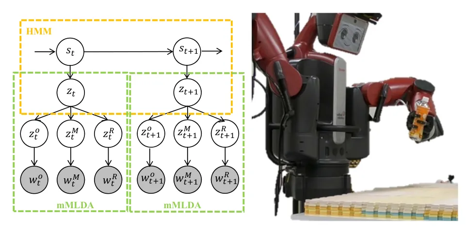
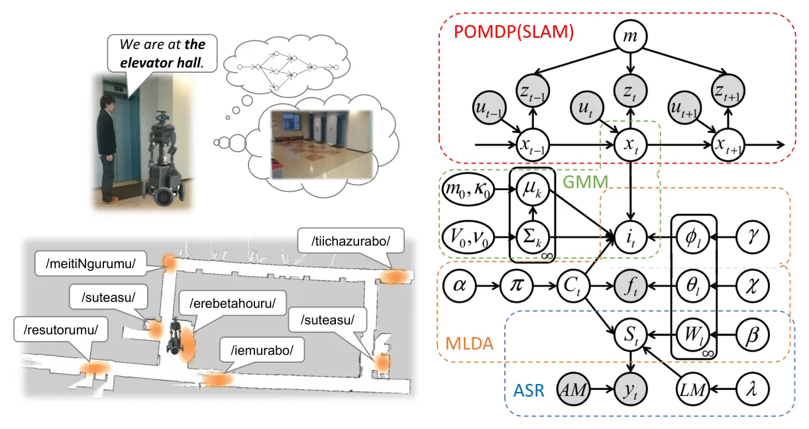
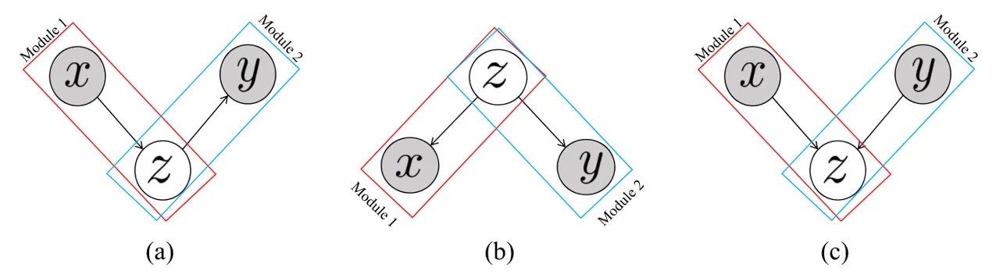
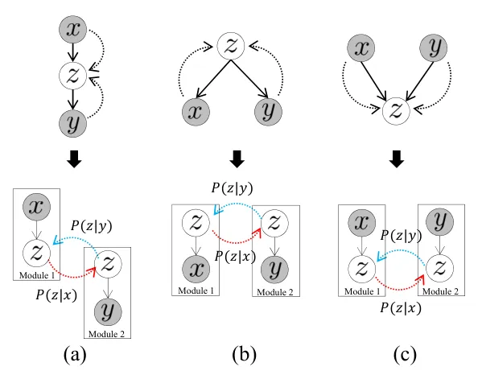
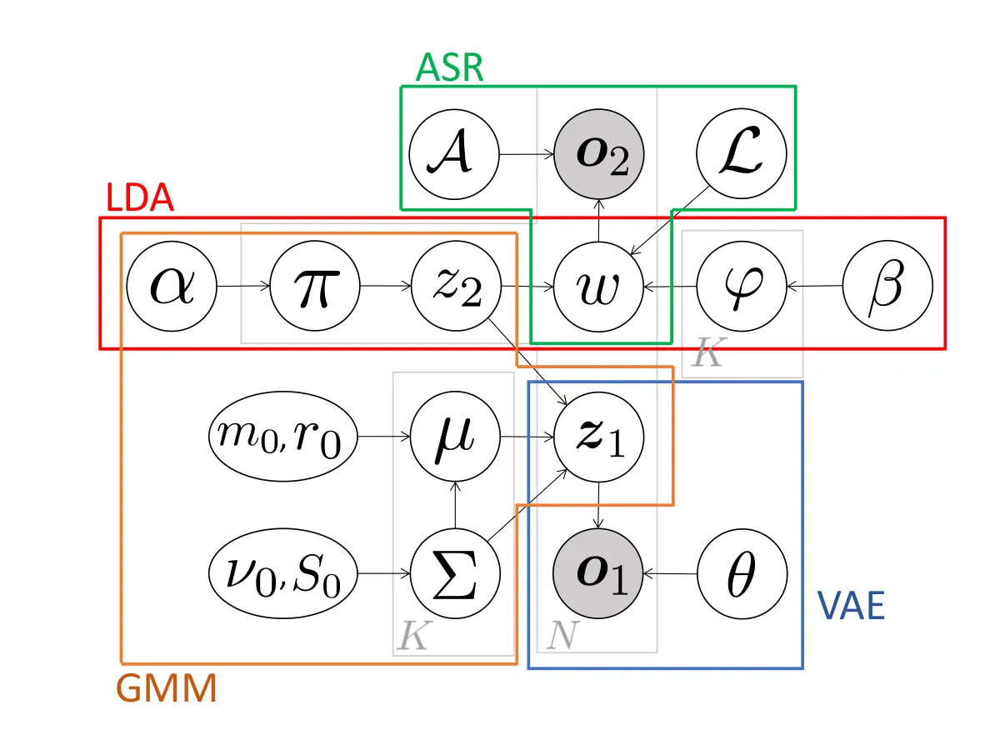
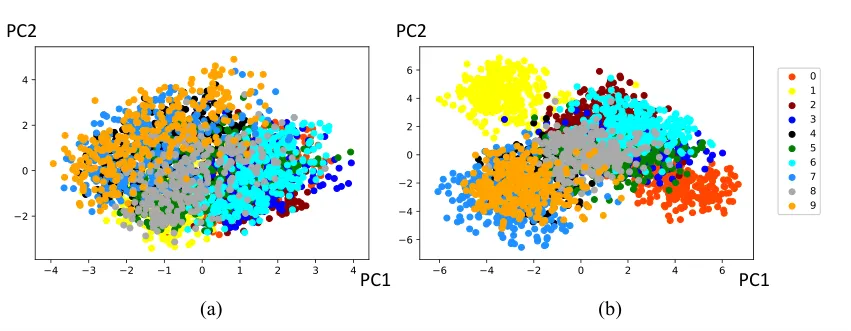

∎

# Neuro-SERKET: Development of Integrative Cognitive System through the Composition of Deep Probabilistic Generative Models

Tadahiro Taniguchi     
Tomoaki Nakamura    Masahiro Suzuki     
Ryo Kuniyasu    Kaede Hayashi     
Akira Taniguchi    Takato Horii     
Takayuki Nagai Affiliation: Ritsumeikan University, 1-1-1 Noji-higashi,
Kusatsu, Shiga  
Tel.: +81-77-561-5745  
Fax: +81-77-561-5745 E-mail: [{taniguchi, a.taniguchi,
k.hayashi}@em.ci.ritsumei.ac.jp](mailto:%7Btaniguchi,%20a.taniguchi,%20k.hayashi%7D@em.ci.ritsumei.ac.jp)
Affiliation: Osaka University, 1-3 Machikane-yama, Toyonaka, Osaka  
Tel.: +81-6-6850-6365  
Fax: +81-6-6850-6365 E-mail: [{nagai,
takato}@sys.es.osaka-u.ac.jp](mailto:%7Bnagai,%20takato%7D@sys.es.osaka-u.ac.jp)
Affiliation: The University of Electro-Communications, 1-5-1 Chofugaoka,
Chofu, Tokyo  
Tel.: +81-42-443-5215  
Fax.: +81-42-443-5215 E-mail: [{tnakamura@, r_kuniyasu@radish.ee.}
uec.ac.jp](mailto:%7Btnakamura@,%20r_kuniyasu@radish.ee.%7D%20uec.ac.jp%20)
Affiliation: The University of Tokyo, 7-3-1, Hongo,Bunkyo-ku, Tokyo  
Tel.: +81-3-3815-5411  
Fax: +81-3-3815-5411 E-mail: <masa@weblab.t.u-tokyo.ac.jp>

Received: date / Accepted: date

###### Abstract

This paper describes a framework for the development of an integrative
cognitive system based on probabilistic generative models (PGMs) called
Neuro-SERKET. Neuro-SERKET is an extension of SERKET, which can compose
elemental PGMs developed in a distributed manner and provide a scheme
that allows the composed PGMs to learn throughout the system in an
unsupervised way. In addition to the head-to-tail connection supported
by SERKET, Neuro-SERKET supports tail-to-tail and head-to-head
connections, as well as neural network-based modules, i.e., deep
generative models. As an example of a Neuro-SERKET application, an
integrative model was developed by composing a variational autoencoder
(VAE), a Gaussian mixture model (GMM), latent Dirichlet allocation
(LDA), and automatic speech recognition (ASR). The model is called
VAE+GMM+LDA+ASR. The performance of VAE+GMM+LDA+ASR and the validity of
Neuro-SERKET were demonstrated through a multimodal categorization task
using image data and a speech signal of numerical digits.

###### Keywords: 

cognitive models probabilistic generative models symbol emergence in
robotics deep generative models, machine learning

## 1 Introduction

The development of integrative cognitive systems that can form
perceptual and behavioral concepts using multimodal sensorimotor
information and learn and understand a language in a real-world
environment is a significant challenge in artificial intelligence (AI)
and robotics \[1\]. This paper describes a theoretical framework called
Neuro-SERKET for this purpose.

Numerous types of integrative cognitive systems, which are sometimes
called a cognitive architecture, have recently been developed for
building service robots and modeling human adaptive cognition \[2, 3, 4,
5, 6, 7, 8, 9, 10, 11\]. However, the cognitive systems for robots need
to handle a variety of types of sensorimotor modalities, e.g., image,
sound and actuation, and a variety of internal cognitive processes,
e.g., categorization and planning. Therefore, the size of the
computational models becomes large and the development requires
significant effort for each integrative cognitive system. For further
progress in this stream of research, we need to achieve an efficient way
to develop complex cognitive systems in a practical manner. In addition,
recent advancements in deep generative models (DGMs), for instance, a
variational auto-encoder (VAE)  \[12\], have boosted their utilization
in the development of cognitive systems.



Figure 1: A robot planning and conducting a multimodal object
categorization using a complex PGM \[7\]

This paper describes a novel framework enabling researchers and
developers to create elemental cognitive modules, i.e., image
recognition, automatic speech recognition, and syntax and clustering
models, independently, and compose them into a large cognitive system,
which can operate as a cognitive system and be consistently trained as a
single learning system. Neuro-SERKET is an extension of SERKET \[11\],
which was proposed as a framework for decomposing and composing PGMs. As
described later, SERKET does not support neural networks, i.e., deep
learning. A framework called Neuro-SERKET can also employ neural
network-based cognitive modules. In addition to that, SERKET only
supports head-to-tail connections for decomposition and composition. In
contrast, Neuro-SERKET supports head-to-head and tail-to-tail
connections in graphical models, as well.

The remainder of this paper is organized as follows. Section 2
introduces the background of Neuro-SERKET. Section 3 describes the
Neuro-SERKET framework. More concretely, the method for the
decomposition and composition of probabilistic generative models (PGMs),
including DGMs, is described. Section 4 describes a concrete example of
integrative cognitive systems developed using the Neuro-SERKET
framework. The integrative model was developed by combining VAE, a
Gaussian mixture model (GMM), a latent Dirichlet allocation (LDA), and
an automatic speech recognition system (ASR), and can form a multimodal
concept from row speech and image signals. This is an illustrative
example involving all types of elemental connections, i.e.,
head-to-tail, tail-to-tail, and head-to-head connections, and a neural
network. Finally, Section 5 provides some concluding remarks.



Figure 2: Graphical model of SpCoSLAM \[8\]

## 2 Backgrounds

During this decade, the complexities of cognitive systems that can learn
real-world knowledge and find the latent structure from multimodal
sensorimotor information obtained by the robot itself, i.e., an embodied
artificial cognitive system, have increased. Cognitive systems for
robots that learn the relationships among different types of multimodal
sensory information have been proposed using PGMs and neural networks
 \[2, 3, 4, 5, 6\]. Methods proposed in the studies enable robots to
infer the latent variables from their own observations, for instance,
the robot acquired object categories as latent variables from visual,
sound and tactile sensory signals in \[2\]. These enable robots to
acquire various knowledge by inferring the latent variables from their
own observations. A further advancement of such cognitive systems allows
the robots to find meanings of words by treating a linguistic input as
another modality \[13, 14, 15\]. Cognitive models have recently become
more complex in realizing various cognitive capabilities: grammar
acquisition \[16\], language model learning \[17\], hierarchical concept
acquisition \[18, 19\], spatial concept acquisition \[20\], motion
skills acquisition \[21\], and task planning \[7\] (see Figure 1). It
results in an increase in the development cost of each cognitive system.

Among them, it has been recognized that PGMs are extremely useful for
modeling an integrative cognitive system that deals with multimodal and
heterogeneous information and learns various functional concepts, i.e.,
internal representations, in an unsupervised manner because we can
design the relationships of latent variables as a graphical model for
introducing constraints to the data modeling. This can be interpreted
through an analogy of designing cortical connections in our brain.
Nakamura et al. proposed multimodal LDA (MLDA) for multimodal object
categorization \[14\]. They also developed a series of PGMs extending
this idea. Taniguchi et al. proposed a spatial concept formation with
simultaneous localization mapping (SpCoSLAM) for a spatial concept
formation and lexical acquisition \[8\] (see Figure 2). Such studies
have contributed to the field of symbol emergence in robotics \[9\].

A cognitive robot empowered by an integrative cognitive system can form
object and spatial concepts, learn behaviors, and become able to
understand human commands without explicit supervision differently from
a supervised learning-based approach, which has been widely used in
recent AI developments. However, the growing complexity of graphical
models has gradually increased barriers to entry into this research
field for numerous researchers. A framework for developing an
integrative cognitive system is required for further progress of this
field in the same way as applied in accelerated studies on various deep
learning frameworks around deep neural networks.

SERKET is a framework proposed for solving this problem \[11\]. SERKET
was designed to enable a distributed software development of extremely
large PGMs. In general, many pre-existing models for cognitive systems
used in robots can be considered as a composition of elemental cognitive
modules. For example, in Figures 1 and 2, the elemental modules in each
graphical model are shown \[7, 8\]. SERKET provides a theoretical
framework for decomposing and composing PGMs. Cognitive modules
developed in a distributive manner, namely, elemental PGMs, can be
composed into a PGM using the SERKET framework, and the composed PGM can
learn and work in the same manner as a PGM developed from scratch by a
single developer. However, SERKET has the following limitations.

- •
  SERKET only supports a head-to-tail connection, although in general,
  the graphical model can theoretically have tail-to-tail and
  head-to-head connections, as well.
- •
  SERKET implicitly assumes the inference method using the Markov chain
  with a Monte Carlo approach and does not assume the integration of
  neural networks.

The first limitation prevents us from a flexible, creative, and
efficient development of a variety of integrative cognitive systems. For
example, if we would like to develop an MLDA by integrating multiple
LDAs, the framework should support tail-to-tail connections.

The second limitation prevents us from the integration of DGMs, i.e.,
neural networks. As is widely known, DGMs can achieve representation
learning, i.e., feature extraction. For example, a VAE is a
probabilistic generative model having the capability of representation
learning and can be integrated with PGMs, e.g., a hidden Markov model
(HMM) and a GMM. However, SERKET does not support the integration of
VAEs.

The integration of conventional PGMs, e.g., HMM and GMM, with DGMs,
e.g., VAE, has received increasing attention, and such integrative PGMs
have been studied. In a VAE, the encoder models the intractable
posterior distribution of the latent representation, and the decoder
reconstructs the observation using its latent representation, which
usually assumes a single Gaussian prior. In recent studies, various PGMs
such as GMM and HMM are applied to its latent space, and are used for
semi-supervised learning\[22\], clustering\[23\]\[24\], and acoustic
unit discovery\[25\]. The structured VAE (SVAE) proposed in \[23\] is a
generalization of the VAE to general PGMs, including capturing the
correlation structure of sequential data, and in \[25\], it was extended
to an acoustic unit discovery. In \[24\], a two-layer latent
representation is composed that uniformly assumes a multi-modal prior
distribution for a latent space, although this model requires a specific
optimization to prevent an over-regularization. In\[26\], a generative
process is defined based on a GMM in a latent space, and achieves a
better performance.

Not only the composition of a conventional PGM and a DGM, but also
composition of DGMs should be explored. More structured DGMs that can
handle multimodal data are also gaining attention. Whereas vanilla VAEs
can only take unimodal data, in\[27\] and \[28\], conditional VAEs have
been proposed that can handle another modality. These models can
generate a modality corresponding to another modality data, e.g.,
generating images from captions \[29\]. However, these models cannot
generate multimodal data bi-directionally, i.e., both generating images
from captions and generating captions from images, and also cannot
obtain a representation that integrates their multimodal information. In
\[30\], a joint multimodal VAE is proposed, which not only has a
multimodal inference model that embeds multimodal data into a joint
representation but also unimodal inferences learned to approximate such
multimodal data. The authors showed that, in the case of two modalities,
this model can appropriately generate modalities bidirectionally and can
infer a good joint representation. In \[31\], the authors extended this
multimodal inference model by introducing the idea of a product of
experts \[32\], and proposed a multimodal VAE (MVAE) that can handle any
number of modalities. Moreover, \[33\] showed that a model whose
association networks connect the latent variables of modality-specific
VAEs can apply a cross-modal generation among multiple modalities. This
line of studies clearly shows that DGMs become more and more structured
and complex in the same way as conventional PGMs. Efficient way of
developing complex cognitive systems by integrating DGMs should be
explored.

Considering the advancement of DGMs and recognizing the limitations of
SERKET, in this study, we extend the application of SERKET and propose
an updated version called Neuro-SERKET. Table 1 shows a list of modules
implemented in Neuro-SERKET library as examples. Developers can build a
variety of integrative cognitive systems by composing these modules
following the Neuro-SERKET framework.

| Module              | Description                                                 |
| ------------------- | ----------------------------------------------------------- |
| Observation         | Module to deal with observations as messages                |
| CNNFeatureExtractor | Feature extractor from images based on CNN                  |
| HACFeatureExtractor | Feature extractor from audio files based on HAC \[34\]      |
| VAE                 | Module to learn feature representations based on VAE \[12\] |
| MVAE                | Module to learn features based on multinomial VAE \[35\]    |
| GMM                 | Unsupervised clustering based on GMM                        |
| MLDA                | Unsupervised clustering based on MLDA \[14\]                |
| MM                  | Module to learn transition of discrete variables            |
| TtoT                | Module to construct the tail to tail connection             |

Table 1: Examples of modules implemented in current Neuro-SERKET
library.

## 3 Neuro-SERKET

### 3.1 Generation: Decomposition of Complex Graphical Model



Figure 3: Elemental graphical models: (a) head-to-tail, (b)
tail-to-tail, and (c) head-to-head

#### 3.1.1 Overview

Neuro-SERKET is an extension of SERKET. Therefore, it basically follows
the approach of SERKET. SERKET provides a theoretical way to achieve a
decomposition and composition of PGMs. A decomposition is mainly related
to the generative process, i.e., a generative model, and a composition
is mainly related to the inference process, i.e., an inference model. In
SERKET, decomposition and composition are conducted by following three
rules.

1.  1.  A node, a latent variable $`z`$, in an integrated model is shared by
        two elemental modules.
2.  2.  A module regards $`z`$ as an observable, and the parameter
        $`\Theta`$ of the probabilistic distribution $`P(z|\Theta)`$ is
        estimated.
3.  3.  The other module estimates $`z`$ by taking a prior $`P(z|\Theta)`$
        with a fixed parameter $`\Theta`$, which is estimated in 2.

Numerous types of PGMs can be described as graphical models. Directed
graphs representing PGMs, i.e., graphical models, have three types of
elemental connections, i.e., head-to-tail, head-to-head, and
tail-to-tail (see Figure 3).

The important feature of SERKET is that an integrated PGM developed by
composing sub-modules following the SERKET framework can operate in
almost the same way as a PGM developed from scratch, and uses an
inference procedure developed for the PGM, in a reasonably approximate
manner. Neuro-SERKET also has this feature.

In addition to a conventional SERKET framework, Neuro-SERKET provides
two additional features.

- •
  Neuro-SERKET supports tail-to-tail and head-to-head connections in
  addition to head-to-tail connections.
- •
  Neuro-SERKET supports deep probabilistic generative models, e.g.,
  VAEs. Therefore PGMs using Neuro-SERKET can make use of the
  representation learning capability of neural networks.

First, we describe how to decompose complex graphical models with the
Neuro-SERKET framework. As is widely known, probabilistic graphical
models have three types of elemental connections, as shown in Figure 3.
Note that each generative process, e.g., $`P(x|z)`$, has global
parameters, e.g., $`\theta`$ for $`P(x|z,\theta)`$, although these are
omitted from the graphical model for the sake of simplicity. Each
generative process can have other latent variables as well. A systematic
approach to a decomposition is also described herein.

#### 3.1.2 Head-to-tail decomposition

In the Neuro-SERKET framework, a complex graphical model is
systematically decomposed. First, we take a head-to-tail connection,
shown in Figure 3 (a), as an example. The joint distribution
$`P(x,y,z)`$ can be written as follows because of a conditional
dependency indicated by the graphical model.

```math
\displaystyle P(x,y,z)=P(y|z)P(z|x)P(x) \tag{1}
```

The generative process of the latent variable $`z`$ is described as
$`P(x,z)=P(z|x)P(x)`$. Next, when looking at the generative process of
$`y`$, it can be seen that the generative process of $`y`$ can be
described as $`P(y,z|x=X)=P(y|z)P(z|x=X)`$, where $`X`$ is an instance
of $`x`$. Here, note that $`P(y,z|x=X)`$ does not depend on the variable
$`x`$ when $`x`$ is fixed, i.e., $`x=X`$. This means the probabilistic
generative model can be decomposed into two modules.

The discussion above is reconfirmed from the viewpoint of factorization.
The joint probability can be factorized in two ways.

```math
\displaystyle P(x,y,z) \displaystyle= \displaystyle P(y|z)\underbrace{P(z,x)}_{\mbox{Module 1}} \tag{2}
```

```math
\displaystyle= \displaystyle\underbrace{P(y,z|x)}_{\mbox{Module 2}}P(x) \tag{3}
```

The first and second modules correspond to the generative model for
$`z`$ and $`y`$, respectively.

If a joint distribution can be factorized in two ways when sharing a
latent variable, e.g., $`z`$ in Equations 2 and 3, the PGM can be
decomposed into two modules.

We introduce an operator $`\otimes`$ representing a composition
operation of PGMs for illustrative purposes.

```math
\displaystyle P(x,y,z)\Rightarrow P(z,x)\otimes P(y,z) \tag{4}
```

This shows that PGM $`P(x,y,z)`$ can be decomposed into $`P(z,x)`$ and
$`P(y,z)`$, which are two elemental modules.

#### 3.1.3 Tail-to-tail decomposition

Another elemental connection is a tail-to-tail (see Figure 3 (b))
connection, which is also called a “fork.” The joint distribution of
$`x,y`$, and $`z`$ can be described as follows using an assumed
conditional independence.

```math
\displaystyle P(x,y,z)=P(x|z)P(y|z)P(z) \tag{5}
```

In the same way as the discussion regarding a head-to-tail connection,
the joint distribution can be factorized in the following two ways.

```math
\displaystyle P(x,y,z) \displaystyle= \displaystyle\underbrace{P(x,z)}_{\mbox{Module 1}}P(y|z) \tag{6}
```

```math
\displaystyle= \displaystyle P(x|z)\underbrace{P(y,z)}_{\mbox{Module 2}} \tag{7}
```

Each module obtained through a decomposition corresponds to a generative
process of $`x`$ and $`y`$. Following the usage of symbol $`\otimes`$,
which we introduced in the previous subsection, the PGM $`P(x,y,z)`$ can
be decomposed into two modules, i.e., joint distributions, $`P(x,z)`$
and $`P(y,z)`$, as follows.

```math
\displaystyle P(x,y,z)\Rightarrow P(x,z)\otimes P(y,z) \tag{8}
```

#### 3.1.4 Head-to-head decomposition

The other elemental connection is a head-to-head (see Figure 3 (c))
connection. The joint distribution of $`x,y`$, and $`z`$ under a
head-to-head connection can be decomposed when considering the following
conditional independence.

```math
\displaystyle P(x,y,z)=P(z|x,y)P(x)P(y) \tag{9}
```

If we apply the systematic rule for a decomposition in the same way as a
head-to-tail and tail-to-tail connection, we will obtain the following
decomposition.

```math
\displaystyle P(x,y,z) \displaystyle= \displaystyle\underbrace{P(x,z|y)}_{\mbox{Module 1}}P(y) \tag{10}
```

```math
\displaystyle= \displaystyle\underbrace{P(y,z|x)}_{\mbox{Module 2}}P(x) \tag{11}
```

However, differing from the previous decomposition, i.e., head-to-tail
and tail-to-tail connections, both modules represent the generative
process of $`z`$, and involve $`x`$ and $`y`$. This prevents us from
taking a SERKET-based approach for inferring $`z`$ in each module
because both of the modules involve $`x`$ and $`y`$. The SERKET
framework requires that a latent variable $`z`$ be inferred within a
module using one of $`x`$ or $`y`$ after decomposition. In other words,
$`z`$ should be regarded as an observable, i.e., a given variable, in
another module. Therefore, SERKET does not provide the way of
decomposition for a head-to-head connection. However, the decomposition
of a head-to-head connection is important in building further complex
cognitive systems. For example, SpCoSLAM assumes that a generated
sentence $`S_{t}`$ is conditioned by the spatial concept $`C_{t}`$,
i.e., “where the robot is,” and syntactic and lexical information, i.e.,
a language model $`LM`$ and the set of parameters of topic-dependent
word distributions $`\{W_{l}\}`$ (see Figrue 2) \[8\].

Therefore, in Nuero-SERKET, we introduce a new way to achieve an
approximate decomposition for $`P(z|x,y)`$.

```math
\displaystyle P(z|x,y)\approx\hat{P}(z|x,y)\propto P(z|x)P(z|y), \tag{12}
```

where $`\hat{P}(z|x,y)`$ is an approximately decomposed distribution.
This approximation consists of two steps. The first approximation is
that $`P(z|x,y)`$ is decomposed into distributions including $`P(z|x)`$,
$`P(z|y)`$ and $`P(z)`$. This approximate decomposition can have two
ways of interpretation: a product of expert (PoE), i.e.,
$`\hat{P}(z|x,y)=P(z)P(z|x)P(z|y)`$  \[32\], and a uni-gram re-scaling,
i.e., $`\hat{P}(z|x,y)=\frac{P(z|x)P(z|y)}{P(z)}`$ \[36\]. In both
cases, a prior $`P(z)`$ is considered to be a uniform distribution. This
means that the prior in the distribution $`\hat{P}`$ can be ignored,
i.e., $`\hat{P}(z|x,y)\propto P(z|x)P(z|y)`$.

Using this approximation, we can obtain the following modules.

```math
\displaystyle P(x,y,z) \displaystyle= \displaystyle P(z|x,y)P(x)P(y) \tag{13}
```

```math
\displaystyle\approx\propto \displaystyle P(z|x)P(z|y)P(x)P(y) \tag{14}
```

```math
\displaystyle= \displaystyle\underbrace{P(x,z)}_{\mbox{Module 1}}\underbrace{P(y,z)}_{\mbox{Module 2}} \tag{15}
```

where $`\approx\propto`$ represents the terms ‘‘approximation’’ and
‘‘proportion to’’¹¹ 1 $`P(x)\approx\propto f(x)`$ is an abbreviation of
$`P(x)\approx\hat{P}(x)\propto f(x)`$. .

The decomposition is described as follows.

```math
\displaystyle P(x,y,z)\Rightarrow P(x,z)\otimes P(y,z) \tag{16}
```

The appropriateness of the approximation is evaluated empirically in
Section 4 based on an experiment.

For example, SpCoSLAM (Figure 2) has a head-to-head connection at
approximately $`S_{t}`$, i.e., a sentence recognized by an ASR system.
When we pick up related variables for illustrative purposes, we can
start with the following joint distribution.

```math
\displaystyle P(y_{t},LM,S_{t},C_{t}|AM)=P(y_{t}|AM,S_{t})P(S_{t}|C_{t},LM)P(LM)P(C_{t}) \tag{17}
```

where $`y_{t}`$ and $`AM`$ are a speech signal and acoustic model in an
ASR system, respectively.

In practical terms, $`AM`$ and $`LM`$ are implemented in an ASR system,
i.e., packaged software, and $`C_{t}`$ is a part of a multimodal
categorization module. Therefore, calculating a generative probability
and drawing samples theoretically are extremely difficult. Therefore,
Neuro-SERKET introduces the following approximation²² 2 Note that the
original study on SpCoSLAM does not use this method of approximation. A
uni-gram rescaling approximation alone was employed instead..

```math
\displaystyle P(S_{t}|C_{t},LM)\approx\propto P(S_{t}|LM)P(S_{t}|C_{t}) \tag{18}
```

This allows developing a graphical model with two parts, i.e., an ASR
(including a lexical acquisition) module and a multimodal categorization
module³³ 3 Note that, for illustrative purposes, the other variables and
hyperparameters are ignored from the equations..

```math
\displaystyle P(y_{t},LM,S_{t},C_{t}|AM)\approx\propto\underbrace{P(y|AM,S_{t})P(S_{t}|LM)P(LM)}_{\mbox{ASR module}}\underbrace{P(S_{t}|C_{t})P(C_{t})}_{\shortstack{Multimodal\\
 categorization\\
 module}} \tag{19}
```

### 3.2 Inference: Composition of Complex Graphical Model

In the SERKET framework, each module is developed by a different
researcher or developer in a distributed manner. After the development
of the modules, they are integrated into an integrative cognitive
system. Integrated modules learn together and work together as a single
cognitive system.

In the context of PGMs, prediction, estimation, and learning are simply
regarded as an inference of latent variables. Therefore, the composition
of the modules corresponds to an inference procedure combining multiple
modules. This section provides a method of composition for each
elemental connection. Figure 4 summarizes the three types of elemental
connections, message passing, and the decomposition method used in our
framework, Neuro-SERKET. In each graphical model, the black-dotted
arrows indicate the calculation of a posterior distribution, which is
necessary for an inference procedure. Note that the two dotted arrows in
each graphical model form head-to-head relationships.



Figure 4: Graphical models and their Neuro-SERKET implementations of (a)
head-to-tail, (b) tail-to-tail, and (c) head-to-head. The black-dotted
arrows represent conditional probabilities used in the inference.

Figure 4 (a) shows the method of message passing between two modules in
the case of a head-to-tail connection. Conventional SERKET mainly
introduced two methods for achieving a head-to-tail composition.

The first is called the message passing (MP) approach, and its procedure
is as follows⁴⁴ 4 As a variation to the MP approach, module 1 can send
samples, i.e., the data distribution,
$`z^{l}\sim P(z|x)(l=\{1,\ldots,L\})`$, as a Monte Carlo approximation
of $`P(z|x)`$. As a special case of this, module 1 can send a sample
$`z^{\star}\sim P(z|x)`$ to module 2. In Section 4, as an example, the
VAE module sends a recognition result to another module..

1.  1.  In module 1, $`P(z|x)`$ is computed.
2.  2.  $`P(z|x)`$ is sent to module 2.
3.  3.  In module 2, the probability distribution $`P(z|y)`$, which
        represents the relationships between $`x`$ and $`y`$, is estimated
        using $`P(z|x)`$.
4.  4.  $`P(z|y)`$ is sent to module 1.
5.  5.  In module 1, the latent variable $`z`$ is estimated, and the
        parameters of $`P(x|z)`$ are updated.

The other is called a sampling importance resampling (SIR) approach, the
procedure of which is as follows.

1.  1.  Generate $`L`$ samples $`z^{(l)}\sim P(z|x)`$ in module 1.
2.  2.  Send $`\{z^{(1)},\ldots,z^{(L)}\}`$ to module 2.
3.  3.  Select sample $`z^{\star}`$ among $`\{z^{(1)},\ldots,z^{(L)}\}`$ by
        calculating their importance using $`P(z|y)`$ and update the
        parameters of $`P(z|y)`$.
4.  4.  Send the selected sample $`z^{\star}`$ to module 1.
5.  5.  Update the parameters of $`P(x|z)`$.

This approach involves a Monte Carlo approximation. However, many
off-the-shelf modules do not support the calculation of a posterior
distribution $`P(z|x)`$ itself. Therefore, the SIR approach allow us to
use various off-the-shelf modules, e.g., ASR and image recognition
systems, that provide only samples, i.e., estimated results.

With this inference procedure, SERKET employs a PoE approximation, i.e.,
$`P(z|x,y)\approx\propto P(z|x)P(z|y)`$ in the same way as a
head-to-head decomposition. For further details, please refer to the
original study \[11\].

Differing from the decomposition part, there are no structural
differences among the three elemental connections. The dotted line in
Figure 4 shows the inference process for each elemental connection. We
can see that all pairs of dotted arrows have head-to-head connections.
This means that, in the inference process, i.e., composition, we can use
the same procedure as a head-to-tail composition in the cases of
tail-to-tail and head-to-head compositions.

However, we need to develop a special treatment for the implementation
of a tail-to-tail composition. SERKET requires connecting latent
variables of modules in a hierarchical manner \[11\], and we cannot
connect module 1, i.e., $`P(x|z)`$, and module 2, i.e., $`P(y|z)`$,
directly in a tail-to-tail composition (Figure 4 (c)). Therefore, we
introduce an auxiliary module called a tail-to-tail (TtoT) module, which
connects modules 1 and 2 and transfers the probability distribution
between the two modules.

In this way, Neuro-SERKET also makes use of a PoE and uniform
distribution prior approximation\[32\] in the composition, and achieves
an inference of the integrative PGMs. Differing from these assumptions,
description, and discussion in the original study on SERKET \[11\],
Neuro-SERKET does not assume any specifics for the implementation and
inference procedure of each module⁵⁵ 5 In the original study on SERKET,
the authors mentioned that they “employed a sampling-based method
because of its simpler implementation.” This means that they excluded
modules that are trained using other inference procedures, e.g.,
gradient-based methods. In general, a sampling-based approach is
unsuitable for the training of neural networks. This means that SERKET
fails to involve neural network-based modules, which have recently been
widely used, into SERKET-based cognitive systems.. Therefore,
Neuro-SERKET can integrate neural network-based generative models, i.e.,
DGMs such as VAEs.

## 4 Example: Concept Formation using VAE+GMM+LDA+ASR

This section describes an illustrative example of a cognitive system
that can be developed following the Neuro-SERKET framework by
integrating pre-existing modules. For illustrative purposes, this model
involves all of the elemental connections, i.e., head-to-tail,
tail-to-tail, and head-to-head. A neural network-based module, i.e.,
VAE, is also included as an elemental module. The developed PGM for
multimodal categorization is a composition of a VAE, GMM, LDA \[37\],
and ASR. We empirically validated Neuro-SERKET through an experiment
using image data and speech signals.

### 4.1 Model

Figure 5 shows a graphical model of the PGM developed using the
Neuro-SERKET framework. This PGM receives two types of observations,
i.e., pairs of an image $`\mbox{\boldmath$o$}_{1}`$ and speech signal
$`\mbox{\boldmath$o$}_{2}`$ corresponding to the image. The PGM is for
an unsupervised multimodal categorization, including representation
learning of the image data. Image $`\mbox{\boldmath$o$}_{1}`$ is
expected to be encoded into the latent variable
$`\mbox{\boldmath$z$}_{1}`$ using VAE. The speech signal
$`\mbox{\boldmath$o$}_{2}`$ is recognized, and word $`w`$ is estimated
using a language model parameterized by $`\cal L`$, which can also be
learned from the data. The obtained word $`w`$ is clustered using LDA,
and the estimated representation of image $`\mbox{\boldmath$z$}_{1}`$ is
clustered using GMM. Note that the latent variable
$`\mbox{\boldmath$z$}_{2}`$ representing the class of the input pair of
data is shared by the LDA and GMM. This means that an estimation of
$`\mbox{\boldmath$z$}_{2}`$ corresponds to a multimodal categorization.
A list of parameters of the PGM is enumerated in Table 2.

| Parameter                                           | Description                                                         |
| --------------------------------------------------- | ------------------------------------------------------------------- |
| $`\theta`$                                          | Parameter of VAE decoder (generative network)                       |
| $`\mbox{\boldmath$o$}_{1},\mbox{\boldmath$o$}_{2}`$ | Observations, image data and speech signal                          |
| $`\mbox{\boldmath$z$}_{1}`$                         | Latent variable of VAE extracted from $`\mbox{\boldmath$o$}_{1}`$   |
| $`\mbox{\boldmath$z$}_{2}`$                         | Index of classes the observations are categorized into              |
| $`w`$                                               | Word recognized by the ASR system                                   |
| $`\mbox{\boldmath$\mu$},\mbox{\boldmath$\Sigma$}`$  | Mean vector and variance-covariance matrix of Gaussian distribution |
| $`r_{0},m_{0},S_{0},\nu_{0}`$                       | Parameters of Gauss-Wishart distribution                            |
| $`\pi,\varphi`$                                     | Parameters of multinomial distribution                              |
| $`\alpha,\beta`$                                    | Parameters of Dirichlet distribution                                |
| $`N`$                                               | The number of observations                                          |
| $`K`$                                               | The number of classes in LDA and GMM                                |

Table 2: Model parameters of the integrative PGM (VAE+GMM+LDA+ASR).



Figure 5: The original graphical model of the integrative PGM
(VAE+GMM+LDA+ASR). Each block shows each module.

Figure 6: Decomposed modules and communication between them following
the Neuro-SERKET framework.

Figure 6 shows the elemental cognitive modules and communication between
them. The communication conducted during the inference procedure, i.e.,
the composition, is summarized as follows.

VAE module  
The VAE module extracts a representation, i.e., latent variable,
$`\mbox{\boldmath$z$}_{1}`$, from the image data
$`\mbox{\boldmath$o$}_{1}`$, and sends $`\mbox{\boldmath$z$}_{1}`$ to
the GMM module. The GMM module sends $`\mbox{\boldmath$\mu$}_{z_{2}}`$,
which is a mean vector of the Gaussian distribution that
$`\mbox{\boldmath$z$}_{1}`$ was categorized into, back to the VAE
module. VAE uses $`\mbox{\boldmath$\mu$}_{z_{2}}`$ and updates the
parameters of the encoder and decoder of the VAE to maximize the
evidence lower bound (ELBO).

```math
\displaystyle{\cal L}(\mbox{\boldmath$\theta$},\mbox{\boldmath$\phi$};\mbox{\boldmath$o$}_{1})=-D(q_{\phi}(\mbox{\boldmath$z$}_{1}|\mbox{\boldmath$o$}_{1})||{\cal N}(\mbox{\boldmath$\mu$}_{z_{2}},\mbox{\boldmath$I$}))+E_{q_{\phi}(\mbox{\boldmath$z$}_{1}|\mbox{\boldmath$o$}_{1})}[\log p_{\theta}(\mbox{\boldmath$o$}_{1}|\mbox{\boldmath$z$}_{1})] \tag{20}
```

This allows the VAE to learn a representation appropriate for
categorization by the GMM module.

GMM module  
The GMM module sends
$`P(\mbox{\boldmath$z$}_{2}|\mbox{\boldmath$z$}_{1})`$, which is
obtained by categorizing $`\mbox{\boldmath$z$}_{1}`$ received from the
VAE module, to the TtoT module . This module shares
$`\mbox{\boldmath$z$}_{2}`$ with the LDA module (Figure 5). Therefore,
the inference of $`bz_{2}`$ is affected by the LDA module. The TtoT
module mediates the information between the GMM and LDA modules. When
the GMM module applies an inference, i.e., a categorization, the GMM
module uses $`P(\mbox{\boldmath$z$}_{2}|\mbox{\boldmath$w$})`$, which is
received from the TtoT module.

```math
\displaystyle\mbox{\boldmath$z$}_{2}\sim P(\mbox{\boldmath$z$}_{2}|\mbox{\boldmath$z$}_{1},\mbox{\boldmath$w$})\approx\propto P(\mbox{\boldmath$z$}_{2}|\mbox{\boldmath$z$}_{1})P(\mbox{\boldmath$z$}_{2}|\mbox{\boldmath$w$}) \tag{21}
```

ASR module  
The ASR module represents an off-the-shelf speech recognition system⁶⁶ 6
Julius: Open-Source Large Vocabulary Continuous Speech Recognition
Engine: https://github.com/julius-speech/julius. The ASR module sends
the $`L`$-best speech recognition results of $`\mbox{\boldmath$o$}_{2}`$
to the LDA module. The $`L`$-best results are regarded as an
approximation of $`L`$ samples from the posterior distribution
$`P(w|\mbox{\boldmath$o$}_{2})`$. The LDA module calculates the
importance of each word $`P(w^{(l)}|\mbox{\boldmath$z$}_{2})`$, and
re-samples the word using the importance weight (SIR approach) as
follows.

```math
\displaystyle w^{(l)} \displaystyle\sim \displaystyle P(w|\mbox{\boldmath$o$}_{2}) \tag{22}
```

```math
\displaystyle w^{*} \displaystyle\sim \displaystyle\hat{P}(w)\propto\sum_{l}P(w^{(l)}|\mbox{\boldmath$z$}_{2})\delta_{w^{(l)}}(w), \tag{23}
```

where $`\delta_{w^{(l)}}(w)`$ is a probability mass function.

LDA module  
The LDA module receives a set of words
$`\mbox{\boldmath$w$}=\{w^{(1)},\cdots,w^{(L)}\}`$ and clusters them. As
a result, the LDA module calculates
$`P(\mbox{\boldmath$z$}_{2}|\mbox{\boldmath$w$})`$ and sends it to the
TtoT module. Note that $`\mbox{\boldmath$z$}_{2}`$ is shared with the
GMM module (see Figure 5), and in the clustering, i.e., inference, the
process is affected by the categorization by the GMM module. Therefore,
the LDA module uses
$`P(\mbox{\boldmath$z$}_{2}|\mbox{\boldmath$z$}_{1})`$ received from the
TtoT module when it clusters words.

```math
\displaystyle\mbox{\boldmath$z$}_{2}\sim P(\mbox{\boldmath$z$}_{2}|\mbox{\boldmath$z$}_{1})P(\mbox{\boldmath$z$}_{2}|\mbox{\boldmath$w$}) \tag{24}
```

TtoT module  
The TtoT module simply transfers
$`P(\mbox{\boldmath$z$}_{2}|\mbox{\boldmath$w$})`$ from the LDA module
to the GMM module, and
$`P(\mbox{\boldmath$z$}_{2}|\mbox{\boldmath$z$}_{1})`$ from the GMM
module to the LDA module.

Following the communication procedure shown above, the total PGM can be
trained by optimizing each module locally under the influence of
neighboring modules.

### 4.2 Code

Figure 7: Source code of main part of the implementation example.

Figure 7 shows the source code of the main part of the implementation.
The observations are loaded from files in lines 1-2, the modules to be
used are defined in lines 4-8, the connections between the modules are
defined in lines 10-13, and the parameters are estimated in lines 15-21.
The total number of lines is less than 80, including other parts such as
import syntax and the definition of the structure of VAE. Note that even
more complicated models can also be implemented in a few hundreds of
lines, and we believe the current Neuro-SERKET has scalability with
regard to programmatic implementation.

### 4.3 Conditions

| Number | Japanese pronunciation |
| ------ | ---------------------- |
| 0      | ze ro                  |
| 1      | i chi                  |
| 2      | ni                     |
| 3      | sa n                   |
| 4      | yo n                   |
| 5      | go                     |
| 6      | ro ku                  |
| 7      | na na                  |
| 8      | ha chi                 |
| 9      | kyu u                  |

Table 3: Pronunciation of Japanese numbers used in the experiment.

During the experiment, we used a hand-written digit dataset,
MNIST\[38\], and a spoken Japanese number dataset \[39\], as the image
data and speech signals, respectively. Each pair of data consist of
image data and a spoken audio signal corresponding to a number among
$`\{0,\ldots,9\}`$. In total, 3,000 pairs are used. The pronunciation of
Japanese digits is shown in Table 3.

We used VAE, whose encoder and decoder have a middle layer with 128
nodes and a hidden layer with ten nodes, i.e., the dimension of the
latent space was $`10`$. The number of classes of GMM and LDA was
$`K=10`$. We used Julius for the ASR module. We used a standard
GMM-based acoustic model preset in Julius, and a language model in which
all syllables have the same probability as an initial language model.
The number of samples obtained from the ASR module was $`L=10`$.

During the experiment, we compared the following four models.

VAE GMM LDA ASR  
No communication among the modules

VAE GMM LDA+ASR  
Communication between LDA and ASR

VAE+GMM LDA+ASR  
Communication between VAE and GMM and between LDA and ASR

VAE+GMM+LDA+ASR  
Communication among all modules

In the name of each model, ‘+’ represents the existence of communication
between the two modules, and ‘ ’(white space) indicates no communication
between the two neighboring modules. Note that none of the three
connections were not supported in SERKET framework.

In the learning process, the model is trained in an off-line manner.
Posterior probabilities for all data points are calculated and were
given to the neighbor modules. When a module is updated, the global
parameters of the module was reset once and trained using the received
data and messages. In each update, VAE was trained 200 epochs with batch
size $`=500`$, and GMM and LDA were trained with Gibbs sampling
procedure with $`50`$ and $`100`$ times sampling, respectively. VAE+GMM,
LDA+ASR, and VAE+GMM+LDA+ASR were updated 50 times, i.e., until they
converged. The order of the update were ASR$`\rightarrow`$ LDA (from LDA
to GMM)$`\rightarrow`$ TtoT$`\rightarrow`$ VAE$`\rightarrow`$
GMM$`\rightarrow`$ TtoT (from LDA to GMM)$`\rightarrow`$ ASR.

The average of accuracy was calculated by referring to the ground-truth
category of the digits for each condition.

### 4.4 Result

| model           | Accuracy (%) |      | Features introduced in Neuro-SERKET |              |            |
| --------------- | ------------ | ---- | ----------------------------------- | ------------ | ---------- |
|                 | GMM          | LDA  | Head-to-head                        | Tail-to-tail | Neural net |
| VAE GMM LDA ASR | 62.0         | 27.4 |                                     |              |            |
| VAE GMM LDA+ASR | 62.0         | 91.8 | ✓                                   |              |            |
| VAE+GMM LDA+ASR | 63.7         | 91.8 | ✓                                   |              | ✓          |
| VAE+GMM+LDA+ASR | 91.0         | 93.7 | ✓                                   | ✓            | ✓          |

Table 4: Classification accuracy in the GMM and LDA modules.

Table 4 shows the average level of accuracy for each clustering module,
i.e., GMM and LDA modules.

The performance of the GMM module is slightly increased by introducing
communication with a VAE. In contrast, the performance of the LDA module
is significantly increased from 27.5% to 92.7% by updating both modules
by introducing head-to-head communication, which is newly introduced in
Neuro-SERKET, between the LDA and ASR modules. The language model in the
ASR is updated by referring to the probabilistic clustering result of
the LDA module, and it is thought that the ASR outputs words that are
relatively easy for the LDA module to cluster. In addition, by sharing
information between the GMM and LDA modules using the tail-to-tail
module, which is also newly introduced in Neuro-SERKET, the performance
of the GMM module was also significantly increased by approximately 25%.
The performance of the LDA module is also slightly increased.

Figure 8: Transition of classification accuracy.

Figure 8 shows the transition of the classification accuracy of
VAE+GMM+LDA+ASR. It shows that the performances of the LDA and GMM
modules gradually increased.



Figure 9: Latent space of VAE learned using (a) VAE GMM LDA ASR and (b)
VAE+GMM+LDA+ASR. Proportion of variance for \[PC1, PC2\] are
$`[0.15,0.13]`$ and $`[0.24,0.20]`$ for (a) and (b), respectively.

Figure 9 shows the representations learned by the VAE. The
ten-dimensional latent space of the VAE is compressed into a
two-dimensional space using a principal component analysis (PCA) for
visualization. Each color represents a digit. Figure 9 (a) and (b) show
the results of embedding without and with communication, i.e., without
SERKET and with Neuro-SERKET, respectively. This result shows that
VAE+GMM+LDA+ASR formed an appropriate latent space for clustering using
the GMM module.

Next, we observed clustered words. Each cluster involves numerous words
having recognition errors. To check if each cluster corresponds to a
digit, we picked up a stereotypical word, i.e., a syllable sequence,
$`\bar{\mbox{\boldmath$s$}}_{c}`$, by using the following equations.

```math
\displaystyle\bar{j}_{c} \displaystyle= \displaystyle{\rm argmin}_{j}\frac{1}{I_{c}}\sum_{i}^{I_{c}}D(\mbox{\boldmath$s$}_{cj},\mbox{\boldmath$s$}_{ci}) \tag{25}
```

```math
\displaystyle\bar{\mbox{\boldmath$s$}}_{c} \displaystyle= \displaystyle\mbox{\boldmath$s$}_{c\bar{j}} \tag{26}
```

where $`I_{c}`$ is the number of words classified into class $`c`$;
$`\mbox{\boldmath$s$}_{ci}`$ is the $`i`$-th word, i.e., the syllable
sequence, classified into class $`c`$; and $`D(\cdot,\cdot)`$ represents
the edit distance between the two-syllable sequence. This procedure
selects a word that is nearest to the center of the set of words in
terms of the edit distance. Therefore, we can consider
$`\bar{\mbox{\boldmath$s$}}_{c}`$ as a stereotype of class $`c`$. The
determined stereotypes of each class are shown in Table 5. Compared with
Table 3, we can see that unsupervised learning using VAE+GMM+LDA+ASR can
acquire an appropriate syllable sequence for each number.

| Number | Japanese pronunciation |
| ------ | ---------------------- |
| 0      | ze ro                  |
| 1      | i chi i                |
| 2      | ni n i                 |
| 3      | sa n                   |
| 4      | yo n                   |
| 5      | go o                   |
| 6      | ro ku                  |
| 7      | na n na a              |
| 8      | ha chi                 |
| 9      | kyu u                  |

Table 5: Stereotypical word in each class. The italic characters denote
errors.

## 5 Conclusion

To develop an integrative cognitive system using PGMs more efficiently,
we require a useful framework that allow us to reuse elemental cognitive
modules developed by other researchers and developers. This paper
described Neuro-SERKET, which is a framework for developing a complex
cognitive system by composing elemental PGMs. Neuro-SERKET is an
extension of SERKET, which can compose elemental PGMs developed in a
distributed manner. Although SERKET only supports a head-to-tail
connection, Neuro-SERKET supports tail-to-tail and head-to-head
connections. In addition, Neuro-SERKET supports neural network-based
modules, e.g., deep generative models such as VAEs, which are not
supported by conventional SERKET. As an example application of
Neuro-SERKET, an integrative model called VAE+GMM+LDA+ASR was developed
by composing VAE, GMM, LDA, and ASR. The performance of VAE+GMM+LDA+ASR
and the validity of Neuro-SERKET are demonstrated through a multimodal
categorization task using image data and the speech signal of numerical
digits.

In this paper, we showed only one example, i.e., VAE+GMM+LDA+ASR, and
demonstrated the validity of Neuro-SERKET. Further application of
Neuro-SERKET and the development of cognitive systems that enable a
robot to form concepts, learn behaviors, and acquire language in a
real-world environment is our future challenge. In particular, it has
become clear that language learning in a real-world environment requires
a wide range of cognitive capabilities \[40\]. For this reason, at least
two additional approaches should be applied for Neuro-SERKET.

The first one is the development of a software environment, i.e.,
software libraries. Nakamura et al. has been developing SERKET⁷⁷ 7
SERKET: http://serket.naka-lab.org/. As described in this paper, the
Neuro-SERKET framework fully includes the conventional SERKET framework.
Therefore, the SERKET software environment should be naturally extended
to the Neuro-SERKET software environment. To involve DGMs into the
SERKET framework, making use of a pre-existing software library for the
DGMs may be a reasonable solution. In addition, Suzuki et al. have been
developing Pixyz⁸⁸ 8 Pixyz: https://github.com/masa-su/pixyz, which is a
framework for DGMs. We are now working on an efficient utilization of
Pixyz for Neuro-SERKET. We consider it is important to combine
unsupervised learning by probabilistic models and representation
learning by NNs such as VAEs, i.e., DGMs. As shown in this paper, the
latent space suitable for classification can be learned by the
interaction between them. We have also proposed the method for motion
segmentation where GP-HSMM, which is a probabilistic model, and VAE,
which can extract features from motions, are connected and we showed
that low dimensional features suitable for segmentation can be learned
by the interaction between them. We consider such a composed model of
unsupervised learning and representation learning has the potential to
solve the various problem and it is possible to construct these models
easily by Neuro-SERKET

The second is an exploration of the applicability of Neuro-SERKET. In
the current version, the Neuro-SERKET framework heavily relies on a PoE
approximation. The limitation of a PoE approximation should be
investigated both theoretically and empirically. A series of studies
forming the background of Neuro-SERKET are developing cognitive systems
that can perform life-long learning in a real-world environment. Such a
learning process involves behavioral learning and language acquisition.
For this purpose, the system will receive unstructured sensorimotor
data. Theoretical and empirical validations should be applied for
further applications. So far, many researchers, including the authors,
have proposed a lot of cognitive models for robots: object concept
formation based on its appearance, usage and functions \[41\], formation
of integrated concept of objects and motions \[42\], grammar learning
\[43\], language understanding \[44\], spatial concept formation and
lexical acquisition\[20, 8, 45\], simultaneous phoneme and word
discovery \[46, 47, 48\] and cross-situational learning \[49, 50\].
These models are regarded as an integrative model that are constructed
by combining small-scale models. Therefore, they can be also
re-implemented by using Neuro-SERKET more efficiently.

The computational efficiency needs to be improved as well. The most of
modules are implemented using pure python without parallel computation
in current Neuro-SERKET except for VAE, which is implemented using
TensorFlow. Therefore, parameter estimation is not so fast. The
parameter estimation in independent modules can be parallelized, and it
might be faster by implementing using C language and TensorFlow. We plan
to improve these drawbacks in the future. Regarding an optimization
policy, we manually set the order of modules to be updated in the
experiment. However, we also found that the performance of the whole
model changed depending on the order of modules to be updated.
Therefore, we will study and create the guideline about the order of the
models to be updated for the practical use of SERKET.

Neuro-SERKET allows us to focus on the integration and exploration of
complex cognitive systems. Recently, multimodal learning with DGMs has
been gaining attention. However, as the cerebral cortex in our human
brain demonstrates, the human cognitive system is based on mutually
connected cortical areas, which are considered to have respective
functions and modality-dependent information processing. Doya
hypothesized that the cerebral cortex is trained simply through
unsupervised learning \[51\]. In general, unsupervised learning is
modeled by PGMs. Neuro-SERKET enables us to explore a constructive model
of the cerebral cortex using PGMs. Such exploration and the development
of a brain-inspired whole-brain cognitive architecture are also future
challenges. We believe that Neuro-SERKET will be a key framework for the
future constructive studies on general intelligence and symbol emergence
in natural and artificial cognitive systems \[9, 1\].

###### Acknowledgements.

This research was supported by MEXT/JSPS KAKENHI, Grant Nos. 16H06569 in
\#4805 (Correspondence and Fusion of Artificial Intelligence and Brain
Science) and 18H03308, and JST CREST (JPMJCR15E3).

## References

- (1) T. Taniguchi, E. Ugur, M. Hoffmann, L. Jamone, T. Nagai,
  B. Rosman, T. Matsuka, N. Iwahashi, E. Oztop, J. Piater, et al., IEEE
  Transactions on Cognitive and Developmental Systems (2018)
- (2) T. Nakamura, T. Nagai, N. Iwahashi, in _IEEE/RSJ International
  Conference on Intelligent Robots and Systems_ (2007), pp. 2415–2420
- (3) N. Shun, O. Tetsuya, T. Jun, K. Kazunori, O.G. Hiroshi, Advanced
  Robotics 22(5), 527 (2008)
- (4) T. Ogata, S. Nishide, H. Kozima, K. Komatani, H. Okuno, Pattern
  Recognition Letters 31(12), 1560 (2010)
- (5) O. Mangin, D. Filliat, L. Ten Bosch, P.Y. Oudeyer, PloS one 10,
  e0140732(10) (2015)
- (6) J. Sinapov, C. Schenck, K. Staley, V. Sukhoy, A. Stoytchev,
  Robotics and Autonomous Systems 62(5), 632 (2014)
- (7) K. Miyazawa, T. Aoki, C. Hieida, K. Iwata, T. Nakamura, T. Nagai,
  in _IROS2017: Workshop on Machine Learning Methods for High-Level
  Cognitive Capabilities in Robotics_ (2017)
- (8) A. Taniguchi, Y. Hagiwara, T. Taniguchi, T. Inamura, in _2017
  IEEE/RSJ International Conference on Intelligent Robots and Systems
  (IROS)_ (IEEE, 2017), pp. 811–818
- (9) T. Taniguchi, T. Nagai, T. Nakamura, N. Iwahashi, T. Ogata,
  H. Asoh, Advanced Robotics 30(11-12), 706 (2016)
- (10) J. Tani, _Exploring robotic minds: actions, symbols, and
  consciousness as self-organizing dynamic phenomena_ (Oxford University
  Press, 2016)
- (11) T. Nakamura, T. Nagai, T. Taniguchi, arXiv preprint
  arXiv:1712.00929 (2017)
- (12) D.P. Kingma, M. Welling, International Conference on Learning
  Representations (2014)
- (13) D. Roy, A. Pentland, Cognitive Science 26(1), 113 (2002)
- (14) T. Nakamura, T. Araki, T. Nagai, N. Iwahashi, Advanced Robotics
  25, 2189 (2012)
- (15) T. Yamada, H. Matsunaga, T. Ogata, IEEE Robotics and Automation
  Letters 3(4), 3441–3448 (2018)
- (16) M. Attamimi, Y. Ando, T. Nakamura, T. Nagai, D. Mochihashi,
  I. Kobayashi, H. Asoh, Advanced Robotics 30(11-12), 806 (2016)
- (17) J. Nishihara, T. Nakamura, T. Nagai, IEEE Transactions on
  Cognitive and Developmental Systems 9(3), 255 (2017)
- (18) Y. Ando, T. Nakamura, T. Araki, T. Nagai, in _IEEE/RSJ
  International Conference on Intelligent Robots and Systems_ (2013),
  pp. 2272–2279
- (19) Y. Hagiwara, M. Inoue, H. Kobayashi, T. Taniguchi, Frontiers in
  neurorobotics 12, 11 (2018)
- (20) A. Taniguchi, T. Taniguchi, T. Inamura, IEEE Transactions on
  Cognitive and Developmental Systems 8(4), 285 (2016)
- (21) K. Iwata, T. Aoki, T. Horii, T. Nakamura, T. Nagai, in _IEEE/RSJ
  International Conference on Intelligent Robots and Systems_ (2018),
  pp. 8184–8191
- (22) D.P. Kingma, S. Mohamed, D.J. Rezende, M. Welling, in _Advances
  in neural information processing systems_ (2014), pp. 3581–3589
- (23) M. Johnson, D.K. Duvenaud, A. Wiltschko, R.P. Adams, S.R. Datta,
  in _Advances in neural information processing systems_ (2016), pp.
  2946–2954
- (24) N. Dilokthanakul, P.A. Mediano, M. Garnelo, M.C. Lee,
  H. Salimbeni, K. Arulkumaran, M. Shanahan, arXiv preprint
  arXiv:1611.02648 (2016)
- (25) J. Ebbers, J. Heymann, L. Drude, T. Glarner, R. Haeb-Umbach,
  B. Raj, in _INTERSPEECH_ (2017), pp. 488–492
- (26) Z. Jiang, Y. Zheng, H. Tan, B. Tang, H. Zhou, arXiv preprint
  arXiv:1611.05148 (2016)
- (27) K. Sohn, H. Lee, X. Yan, in _Advances in neural information
  processing systems_ (2015), pp. 3483–3491
- (28) G. Pandey, A. Dukkipati, in _2017 International Joint Conference
  on Neural Networks (IJCNN)_ (IEEE, 2017), pp. 308–315
- (29) E. Mansimov, E. Parisotto, J.L. Ba, R. Salakhutdinov, arXiv
  preprint arXiv:1511.02793 (2015)
- (30) M. Suzuki, K. Nakayama, Y. Matsuo, arXiv preprint
  arXiv:1611.01891 (2016)
- (31) M. Wu, N. Goodman, in _Advances in Neural Information Processing
  Systems_ (2018), pp. 5575–5585
- (32) G.E. Hinton, Neural computation 14(8), 1771 (2002)
- (33) D.U. Jo, B. Lee, J. Choi, H. Yoo, J.Y. Choi, arXiv preprint
  arXiv:1905.12867 (2019)
- (34) A.V. Hamme, in _Annual Conference of the International Speech
  Communication Association_ (2008), pp. 2554–2557
- (35) A. Srivastava, C. Sutton, in _International Conference on
  Learning Representations_ (2017)
- (36) D. Gildea, T. Hofmann, in _In Proceedings of the 6th European
  Conference on Speech Communication and Technology (EUROSPEECH)_ (1999)
- (37) D.M. Blei, A.Y. Ng, M.I. Jordan, Journal of Machine Learning
  Research 3, 993 (2003)
- (38) Y. LeCun, C. Cortes, C. Burges. Mnist handwritten digit database.
  URL http://yann.lecun.com/exdb/mnist
- (39) Reverberant speech recognition evaluation environment
  (censrec-4). URL http://research.nii.ac.jp/src/en/CENSREC-4.html
- (40) T. Tangiuchi, D. Mochihashi, T. Nagai, S. Uchida, N. Inoue,
  I. Kobayashi, T. Nakamura, Y. Hagiwara, N. Iwahashi, T. Inamura,
  Advanced Robotics 33(15-16), 700 (2019). DOI
  10.1080/01691864.2019.1632223. URL
  https://doi.org/10.1080/01691864.2019.1632223
- (41) T. Nakamura, T. Nagai, in _IEEE/RSJ International Conference on
  Intelligent Robots and Systems_ (IEEE, 2010), pp. 5410–5415
- (42) M. Fadlil, K. Ikeda, K. Abe, T. Nakamura, T. Nagai, in _IEEE/RSJ
  International Conference on Intelligent Robots and Systems_ (IEEE,
  2013), pp. 2256–2263
- (43) M. Attamimi, Y. Ando, T. Nakamura, T. Nagai, D. Mochihashi,
  I. Kobayashi, H. Asoh, Advanced Robotics 30(11-12), 806 (2016)
- (44) T. Kobori, T. Nakamura, M. Nakano, T. Nagai, N. Iwahashi,
  K. Funakoshi, M. Kaneko, Advanced Robotics 30(24), 1530 (2016)
- (45) S. Ishibushi, A. Taniguchi, T. Takano, Y. Hagiwara, T. Taniguchi,
  in _IECON 2015 - 41st Annual Conference of the IEEE Industrial
  Electronics Society_ (2015), pp. 001,369–001,375. DOI
  10.1109/IECON.2015.7392291
- (46) T. Taniguchi, S. Nagasaka, R. Nakashima, IEEE Transactions on
  Cognitive and Developmental Systems 8(3), 171 (2016)
- (47) T. Taniguchi, R. Nakashima, H. Liu, S. Nagasaka, Advanced
  Robotics 30(11-12), 770 (2016)
- (48) R. Nakashima, R. Ozaki, T. Taniguchi, Frontiers in Robotics and
  AI 6, 92 (2019)
- (49) A. Taniguchi, T. Taniguchi, A. Cangelosi, Frontiers in
  neurorobotics 11, 66 (2017)
- (50) A. Aly, A. Taniguchi, T. Taniguchi, in _2017 Joint IEEE
  International Conference on Development and Learning and Epigenetic
  Robotics (ICDL-EpiRob)_ (2017), pp. 376–383. DOI
  10.1109/DEVLRN.2017.8329833
- (51) K. Doya, Neural networks 12(7-8), 961 (1999)
