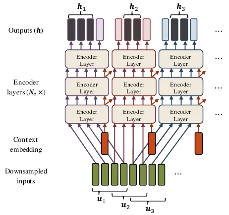
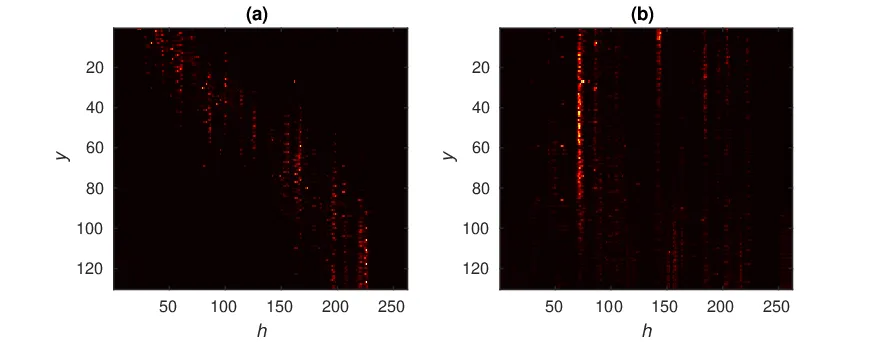
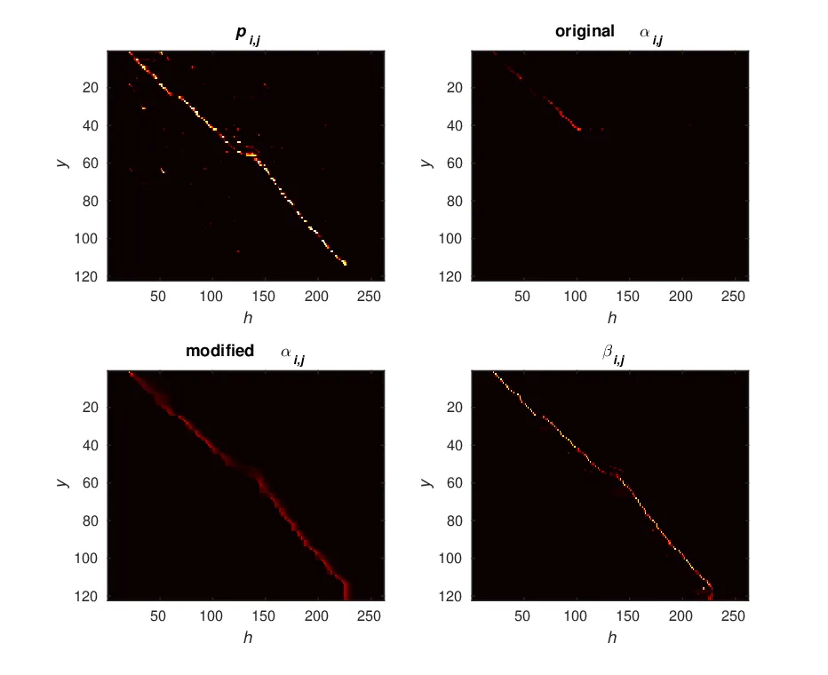

# TOWARDS ONLINE END-TO-END TRANSFORMER AUTOMATIC SPEECH RECOGNITION

Emiru Tsunoo    Yosuke Kashiwagi    Toshiyuki Kumakura    Shinji
Watanabe

###### Abstract

The Transformer self-attention network has recently shown promising
performance as an alternative to recurrent neural networks in end-to-end
(E2E) automatic speech recognition (ASR) systems. However, Transformer
has a drawback in that the entire input sequence is required to compute
self-attention. We have proposed a block processing method for the
Transformer encoder by introducing a context-aware inheritance
mechanism. An additional context embedding vector handed over from the
previously processed block helps to encode not only local acoustic
information but also global linguistic, channel, and speaker attributes.
In this paper, we extend it towards an entire online E2E ASR system by
introducing an online decoding process inspired by monotonic chunkwise
attention (MoChA) into the Transformer decoder. Our novel MoChA training
and inference algorithms exploit the unique properties of Transformer,
whose attentions are not always monotonic or peaky, and have multiple
heads and residual connections of the decoder layers. Evaluations of the
Wall Street Journal (WSJ) and AISHELL-1 show that our proposed online
Transformer decoder outperforms conventional chunkwise approaches.

###### Index Terms: 

Speech Recognition, End-to-end, Transformer, Self-attention Network,
Monotonic Chunkwise Attention

^(†)^(†)address: ¹Sony Corporation, Japan  
²Johns Hopkins University, USA

## 1 Introduction

End-to-end (E2E) automatic speech recognition (ASR) has been attracting
attention as a method of directly integrating acoustic models (AMs) and
language models (LMs) because of the simple training and efficient
decoding procedures. In recent years, various models have been studied,
including connectionist temporal classification (CTC) \[1, 2, 3, 4\],
attention-based encoder–decoder models \[5, 6, 7, 8, 9\], their hybrid
models \[10, 11\], and the RNN-transducer \[12, 13, 14\]. Transformer
\[15\] has been successfully introduced into E2E ASR by replacing RNNs
\[16, 17, 18, 19, 20\], and it outperforms bidirectional RNN models in
most tasks \[21\]. Transformer has multihead self-attention network
(SAN) layers, which can leverage a combination of information from
completely different positions of the input.

However, similarly to bidirectional RNN models \[22\], Transformer has a
drawback in that the entire utterance is required to compute
self-attention, making it difficult to utilize in online recognition
systems. Also, the memory and computational requirements of Transformer
grow quadratically with the input sequence length, which makes it
difficult to apply to longer speech utterances. A simple solution to
these problems is block processing as in \[17, 19, 23\]. However, it
loses global context information and its performance is degraded in
general.

We have proposed a block processing method for the encoder–decoder
Transformer model by introducing a context-aware inheritance mechanism,
where an additional context embedding vector handed over from the
previously processed block helps to encode not only local acoustic
information but also global linguistic, channel, and speaker attributes
\[24\]. Although it outperforms naive blockwise encoders, the block
processing method can only be applied to the encoder because it is
difficult to apply to the decoder without knowing the optimal chunk
step, which depends on the token unit granularity and the language.

For the attention decoder, various online processes have been proposed.
In \[5, 25, 26\], the chunk window is shifted from an input position
determined by the median or maximum of the attention distribution.
Monotonic chunkwise attention (MoChA) uses a trainable monotonic energy
function to shift the chunk window \[27\]. MoChA has also been extended
to make it stable while training \[28\] and to be able to change the
chunk size adaptively to the circumstances \[29\]. \[30\] proposed a
unique approach that uses a trigger mechanism to notify the timing of
the attention computation. However, to the best of our knowledge, such
monotonic chunkwise approaches have not yet been applied to Transformer.

In this paper, we extend our previous context block approach towards an
entire online E2E ASR system by introducing an online decoding process
inspired by MoChA into the Transformer decoder. Our contributions are as
follows. 1) Triggers for shifting chunks are estimated from the
source–target attention (STA), which uses queries and keys, 2) all the
past information is utilized according to the characteristics of the
Transformer attentions that are not always monotonic or locally peaky,
and 3) a novel training algorithm of MoChA is proposed, which extends to
train the trigger function by dealing with multiple attention heads and
residual connections of the decoder layers. Evaluations of the Wall
Street Journal (WSJ) and AISHELL-1 show that our proposed online
Transformer decoder outperforms conventional chunkwise approaches.

## 2 Transformer ASR

The baseline Transformer ASR follows that in \[21\], which is based on
the encoder–decoder architecture. An encoder transforms a $`T`$-length
speech feature sequence $`{\mathbf{x}}=(x_{1},\dots,x_{T})`$ to an
$`L`$-length intermediate representation
$`{\mathbf{h}}=(h_{1},\dots,h_{L})`$, where $`L\leq T`$ due to
downsampling. Given $`{\mathbf{h}}`$ and previously emitted character
outputs $`{\mathbf{y}}_{i-1}=(y_{1},\dots,y_{i-1})`$, a decoder
estimates the next character $`y_{i}`$.

The encoder consists of two convolutional layers with stride $`2`$ for
downsampling, a linear projection layer, positional encoding, followed
by $`N_{e}`$ encoder layers and layer normalization. Each encoder layer
has a multihead SAN followed by a position-wise feedforward network,
both of which have residual connections. Layer normalization is also
applied before each module. In the SAN, attention weights are formed
from queries ($`\mathbf{Q}\in{\mathbb{R}}^{t_{q}\times d}`$) and keys
($`\mathbf{K}\in{\mathbb{R}}^{t_{k}\times d}`$), and applied to values
($`\mathbf{V}\in{\mathbb{R}}^{t_{v}\times d}`$) as

```math
\displaystyle\mathrm{Attention}({\mathbf{Q}},{\mathbf{K}},{\mathbf{V}})=\mathrm{softmax}\left(\frac{{\mathbf{Q}}{\mathbf{K}}^{T}}{\sqrt{d}}\right){\mathbf{V}}, \tag{1}
```

where typically $`d=d_{\mathrm{model}}/M`$ for the number of heads
$`M`$. We utilized multihead attention denoted, as the
$`\mathrm{MHD}(\cdot)`$ function, as follows:

```math
\displaystyle\mathrm{MHD}({\mathbf{Q}},{\mathbf{K}},{\mathbf{V}})=\mathrm{Concat}(\mathrm{head}_{1},\dots,\mathrm{head}_{M}){\mathbf{W}}_{O}^{n}, \tag{2}
```

```math
\displaystyle\mathrm{head}_{m}=\mathrm{Attention}({\mathbf{Q}}{\mathbf{W}}_{Q,m}^{n},{\mathbf{K}}{\mathbf{W}}_{K,m}^{n},{\mathbf{V}}{\mathbf{W}}_{V,m}^{n}). \tag{3}
```

In (2) and (3), the $`n`$th layer is computed with the projection
matrices
$`{\mathbf{W}}_{Q,m}^{n}\in{\mathbb{R}}^{d_{\mathrm{model}}\times d}`$,
$`{\mathbf{W}}_{K,m}^{n}\in{\mathbb{R}}^{d_{\mathrm{model}}\times d}`$,
$`{\mathbf{W}}_{V,m}^{n}\in{\mathbb{R}}^{d_{\mathrm{model}}\times d}`$,
and
$`{\mathbf{W}}_{O}^{n}\in{\mathbb{R}}^{Md\times d_{\mathrm{model}}}`$.
For all the SANs in the encoder, $`{\mathbf{Q}}`$, $`{\mathbf{K}}`$, and
$`{\mathbf{V}}`$ are the same matrices, which are the inputs of the SAN.
The position-wise feedforward network is a stack of linear layers.

The decoder predicts the probability of the following character from
previous output characters $`{\mathbf{y}}_{i-1}`$ and the encoder output
$`{\mathbf{h}}`$, i.e., $`p(y_{i}|{\mathbf{y}}_{i-1},{\mathbf{h}})`$.
The character history sequence is converted to character embeddings.
Then, $`N_{d}`$ decoder layers are applied, followed by the linear
projection and Softmax function. The decoder layer consists of a SAN and
a STA, followed by a position-wise feedforward network. The first SAN in
each decoder layer applies attention weights to the input character
sequence, where the input sequence of the SAN is set as
$`{\mathbf{Q}}`$, $`{\mathbf{K}}`$, and $`{\mathbf{V}}`$. Then, the
following STA attends to the entire encoder output sequence by setting
$`{\mathbf{K}}`$ and $`{\mathbf{V}}`$ to be the encoder output
$`{\mathbf{h}}`$.

The SAN can leverage a combination of information from completely
different positions of the input. This is due to the multiple heads and
residual connections of the layers that complement each other, i.e.,
some attend monotonically and locally while others attend globally.
Transformer requires the entire speech utterance for both the encoder
and decoder; thus, they are processed only after the end of the
utterance, which causes a huge delay. To realize an online ASR system,
both the encoder and decoder are processed online.



Figure 1: Context inheritance mechanism of the encoder.

## 3 Contextual Block Processing of Encoder

A simple way to process the encoder online is blockwise computation, as
in \[17, 19, 23\]. However, the global channel, speaker, and linguistic
context are also important for local phoneme classification. We have
proposed a context inheritance mechanism for block processing by
introducing an additional context embedding vector\[24\]. As shown in
the tilted arrows in Fig. 1, the context embedding vector is computed in
each layer of each block and handed over to the upper layer of the
following block. Thus, the SAN in each layer is applied to the block
input sequence using the context embedding vector.

The context embedding vector is introduced into the original formulation
in Sec. 2. Denoting the context embedding vector as
$`\mathbf{c}_{b}^{n}`$, the augmented variables satisfy
$`\tilde{{\mathbf{Q}}}_{b}^{n}=[{\mathbf{Z}}_{b}^{n-1}\ c_{b}^{n-1}]`$
and
$`\tilde{{\mathbf{K}}}_{b}^{n}=\tilde{{\mathbf{V}}}_{b}^{n}=[{\mathbf{Z}}_{b}^{n-1}\ c_{b-1}^{n-1}]`$,
where the context embedding vector of the previous block $`(b-1)`$ of
the previous layer $`(n-1)`$ is used. $`{\mathbf{Z}}_{b}^{n}`$ is the
output of the $`n`$th encoder layer of block $`b`$, which is computed
simultaneously with the context embedding vector $`c_{b}^{n}`$ as

```math
\displaystyle[{\mathbf{Z}}_{b}^{n}\ c_{b}^{n}] \displaystyle=\max(0,\tilde{{\mathbf{Z}}}_{b,\text{int.}}^{n}{\mathbf{W}}_{1}^{n}+v_{1}^{n}){\mathbf{W}}_{2}^{n}+v_{2}^{n}+\tilde{{\mathbf{Z}}}_{b,\text{int.}}^{n} \tag{4}
```

```math
\displaystyle\tilde{{\mathbf{Z}}}_{b,\text{int.}}^{n} \displaystyle=\mathrm{MHD}(\tilde{{\mathbf{Q}}}_{b}^{n},\tilde{{\mathbf{K}}}_{b}^{n},\tilde{{\mathbf{V}}}_{b}^{n})+\tilde{{\mathbf{V}}}_{b}^{n}, \tag{5}
```

where $`{\mathbf{W}}_{1}^{n}`$, $`{\mathbf{W}}_{2}^{n}`$, $`v_{1}^{n}`$,
and $`v_{2}^{n}`$ are trainable matrices and biases. The output of the
SAN does not only encode input acoustic features but also delivers the
context information to the succeeding layer as shown by the tilted red
arrows in Fig. 1.

## 4 Online Process for Decoder

### 4.1 Online Transformer Decoder based on MoChA

The decoder of Transformer ASR is incremental at test time, especially
for the first SAN of each decoder layer. However, the second STA
requires the entire sequence of the encoded features $`{\mathbf{h}}`$.
Blockwise attention mechanisms cannot be simply applied with a fixed
step size, because the step size depends on the output token granularity
(grapheme, character, (sub-)word, and so forth) and language. In
addition, not all the STAs are monotonic, because the other heads and
layers complement each other. Typically, in the lower layer of the
Transformer decoder, some heads attend wider areas, and some attend a
certain area constantly, as shown in Fig. 2. Therefore, chunk shifting
and the chunk size should be adaptive.

For RNN models, the median or maximum of the attention distribution is
used as a cue for shifting a fixed-length chunk, where the parameters of
the original batch models are reused \[5, 25, 26\]. MoChA further
introduces the probability distribution of chunking to train the
monotonic chunking mechanism. In this paper, we propose a novel online
decoding method inspired by MoChA.



Figure 2: Examples of attentions in a Transformer decoder layer. (a) is
a head having wider attentions, and (b) is a head attending a certain
area of $`{\mathbf{h}}`$.

MoChA \[27\] splits the input sequence into small chunks over which soft
attention is computed. It learns a monotonic alignment between the
encoder features $`{\mathbf{h}}`$ and the output sequence
$`{\mathbf{y}}`$, with $`w`$-length chunking. “Soft” attention is
efficiently utilized with backpropagation to train chunking parameters.
At the test time, online “hard” chunking is used to realize online ASR,
which achieves almost the same performance as the soft attention model.

0:  encoder features $`{\mathbf{h}}`$, length $`L`$, chunk size $`w`$

1:  Initialize: $`y_{0}=\langle sos\rangle`$, $`t_{m,0}=1`$, $`i=1`$

2:  while $`y_{i-1}\neq\langle eos\rangle`$ do

3:   for $`m=1`$ to $`M`$ do

4:    for $`j=t_{m,i-1}`$ to $`L`$ do

5:
    $`p_{m,i,j}=\sigma({\color[rgb]{1,0,0}\mathrm{Energy}_{m}}(z_{\mathrm{SAN},i},h_{j}))`$

6:     if $`p_{m,i,j}\geq 0.5`$ then

7:      $`t_{m,i}=j`$

8:      break

9:     end if

10:    end for

11:    if $`p_{m,i,j}<0.5,\forall j\in\{t_{m,i-1},\dots,L\}`$ then

12:     $`t_{m,i}=t_{m,i-1}`$

13:    end if

14:    $`r=t_{m,i}-w+1`$ // or $`r=1`$

15:    for $`k=r`$ to $`t_{i}`$ do

16:
    $`u_{m,i,k}={\color[rgb]{1,0,0}\mathrm{ChunkEnergy}_{m}}(z_{\mathrm{SAN},i},h_{k})`$

17:    end for

18:
   $`\mathrm{head}_{m,i}=\sum_{k=r}^{t_{i}}\frac{\exp(u_{i,k})}{\sum_{l=r}^{t_{i}}\exp(u_{i,l})}v_{m,k}`$

19:   end for

20:
  $`z_{\mathrm{STA},i}={\color[rgb]{1,0,0}\mathrm{STA}({\mathbf{y}}_{i-1},\mathrm{head}_{1,i},\dots,\mathrm{head}_{M,i})}`$,
$`i=i+1`$

21:  end while

Algorithm 1 MoChA Inference for $`n`$-th Transformer Decoder Layer

Since Transformer has unique properties, the conventional MoChA cannot
be simply applied. One property is that the STA is computed using
queries and keys, while MoChA is formulated on the basis of the
attention using a hidden vector of the RNN and $`\tanh`$. Another
property is that not all the STAs are monotonic, because the other heads
and layers complement each other, as examples shown in Fig. 2. We modify
the training algorithm of MoChA to deal with these characteristics.

### 4.2 Inference Algorithm

The inference process for decoder layer $`n`$ is shown in Algorithm 1.
The differences from the original MoChA are highlighted in red color. In
our case, MoChA decoding is introduced into the second STA of each
decoder layer; the vector $`z_{\mathrm{SAN},i}`$ in Algorithm 1 is the
output of the first SAN in the decoder layer. $`\mathrm{STA}(\cdot)`$ in
line 20 concatenates and computes an output of the STA network,
$`z_{\mathrm{STA},i}`$, in each decoder layer, as in (2). MoChA can be
applied independently to each head; thus, we added line 3. In line 18,
the attention weight is applied to the selected values
$`v_{m,k}=h_{k}W_{V,m}`$ to compute $`\mathrm{head}_{m}`$ in (3), and
the chunk of selection shifts monotonically.

$`p_{m,i,j}`$ in line 5 is regarded as a trigger function at head $`m`$
to move the computing chunk, which is estimated from an
$`\mathrm{Energy}`$ function. For the $`\mathrm{Energy}`$ and
$`\mathrm{ChunkEnergy}`$ (in line 16) functions, the original MoChA
utilizes $`\tanh`$ because it is used as a nonlinear function in RNNs.
However, in Transformer, attentions are computed using queries and keys
as in (1). Therefore, we modify them for the head $`m`$ as

```math
\displaystyle\mathrm{Energy}_{m}(z_{\mathrm{SAN},i},h_{j}) \displaystyle=g_{m}\frac{q_{i,m}k_{j,m}^{T}}{\sqrt{d}||q_{i,m}||}+r_{m}, \tag{6}
```

```math
\displaystyle\mathrm{ChunkEnergy}_{m}(z_{\mathrm{SAN},i},h_{j}) \displaystyle=\frac{q_{i,m}k_{j,m}^{T}}{\sqrt{d}}, \tag{7}
```

where $`g_{m}`$ and $`r_{m}`$ are trainable scalar parameters,
$`q_{i,m}=z_{\mathrm{SAN},i}W_{Q,m}`$, and $`k_{j,m}=h_{j}W_{K,m}`$ as
in (3).

Note that, the exception in lines 11–13, where the trigger never ignites
in frame $`i`$, sets $`\mathrm{head}_{m,i}`$ as $`\mathbf{0}`$ in the
original MoChA. However, we compute $`\mathrm{head}_{m,i}`$ using the
previous $`t_{m,i-1}`$ (line 12) because the exception often occurs in
Transformer. Also, for online processing, all the past frames of encoded
features $`{\mathbf{h}}`$ are also available without any latency, while
the original MoChA computes attentions within the fixed-length chunk.
Taking into account the property that Transformer attentions tend to be
distributed widely and are not always monotonic, we also consider
utilizing the past frames. We optionally modify line 14 by setting
$`r=1`$ and test both cases in Sec. 5.

### 4.3 Training Algorithm

MoChA strongly relies on the monotonicity of the attentions, and it also
forces attentions to be monotonic, while Transformer has a flexible
attention mechanism that may be able to integrate information of various
positions without the monotonicity. Further more, the Transformer
decoder has both multihead and residual connections. Therefore,
typically, not all the attentions become monotonic, as in Fig. 2.

0:  encoder features $`{\mathbf{h}}`$, length $`L`$, chunk size $`w`$,
Gauss. noise $`\epsilon`$

1:  Initialize: $`y_{0}=\langle sos\rangle`$, $`\alpha_{0,0}=1`$,
$`\alpha_{0,k}=0(k\neq 0)`$, $`i=1`$

2:  while $`y_{i-1}\neq\langle eos\rangle`$ do

3:   for $`m=1`$ to $`M`$ do

4:    for $`j=1`$ to $`L`$ do

5:
    $`p_{m,i,j}=\sigma({\color[rgb]{1,0,0}\mathrm{Energy}_{m}}(z_{\mathrm{SAN},i},h_{j})+\epsilon)`$

6:     $`q_{m,i,j}=\prod_{k=j+1}^{L}(1-p_{m,i,k})`$

7:
    $`\alpha_{m,i,j}=p_{m,i,j}\sum_{k=1}^{j}\left(\alpha_{m,i-1,k}\prod_{l=k}^{j-1}(1-p_{m,i,l})\right)`$
$`{\color[rgb]{1,0,0}+q_{m,i,j}\alpha_{m,i-1,j}}`$

8:    end for

9:    for $`j=1`$ to $`L`$ do

10:
    $`u_{m,i,k}={\color[rgb]{1,0,0}\mathrm{ChunkEnergy}_{m}}(z_{\mathrm{SAN},i},h_{k})`$

11:
    $`\beta_{m,i,j}=\sum_{k=j}^{j+w-1}\frac{\alpha_{m,i,j}\exp(u_{m,i,k})}{\sum_{l=k-w+1}^{k}\exp(u_{m,i,l})}`$

12:    end for

13:    $`\mathrm{head}_{m,i}=\sum_{j=1}^{L}\beta_{m,i,j}v_{j}`$

14:   end for

15:
  $`z_{\mathrm{STA},i}={\color[rgb]{1,0,0}\mathrm{STA}(y_{i-1},\mathrm{head}_{1,i},\dots,\mathrm{head}_{M,i})}`$,
$`i=i+1`$

16:  end while

Algorithm 2 MoChA Training for $`n`$-th Transformer Decoder Layer

The original MoChA training computes a variable $`\alpha_{i,j}`$, which
is a cumulative probability of computing the local chunk attention at
$`t_{i}=j`$, defined as

```math
\displaystyle\alpha_{i,j}=p_{i,j}\sum_{k=1}^{j}\left(\alpha_{i-1,k}\prod_{l=k}^{j-1}(1-p_{i,l})\right). \tag{8}
```

When $`p_{i,j}\approx 0`$ for all $`j`$, which occurs frequently in
Transformer because the other heads and layers complement each other for
this frame, $`\alpha_{i,j}`$ rapidly decays after $`i`$. An example is
shown in Fig. 3. The top left shows $`p_{m,i,j}`$ in Algorithm 1, which
has monotonicity. The top right is the original $`\alpha_{i,j}`$ in (8),
in which the value decreases immediately after around frame 50 of the
target $`y`$ and does not recover.

Therefore, we introduce a probability of the trigger not igniting as
$`q_{m,i,j}`$ into computation of $`\alpha_{m,i,j}`$. Thus, the new
training algorithm for Transformer is shown in Algorithm 2, which
encourages MoChA to exploit the flexibility of the SAN in Transformer
(colored lines are new to the original MoChA). An example of our
modified $`\alpha_{m,i,j}`$ is shown in the bottom left of Fig. 3, which
maintains the monotonicity. The bottom right shows the expected
attention $`\beta_{m,i,j}`$.



Figure 3: Example of expected attention in the Transformer decoder. Top
left: $`p_{i,j}`$ in Algorithm 2; top right: original $`\alpha_{i,j}`$
in (8); bottom left: our modified $`\alpha_{i,j}`$ in Algorithm 2;
bottom right: expected attention $`\beta_{i,j}`$. Head index $`m`$ is
omitted for simplicity.

## 5 Experiments

### 5.1 Experimental Setup

We carried out experiments using the WSJ English and AISHELL-1 Mandarin
data \[31\]. The input acoustic features were 80-dimensional filter
banks and the pitch, extracted with a hop size of 10 ms and a window
size of 25 ms, which were normalized with the global mean and variance.
For the WSJ English setup, the number of output classes was 52,
including symbols. We used 4,231 character classes for the AISHELL-1
Mandarin setup.

For the training, we utilized multitask learning with CTC loss as in
\[11, 21\] with a weight of 0.1. A linear layer was added onto the
encoder to project $`{\mathbf{h}}`$ to the character probability for the
CTC. The Transformer models were trained over 100 epochs for WSJ and 50
epochs for AISHELL-1, with the Adam optimizer and Noam learning rate
decay as in \[15\]. The learning rate was set to 5.0 and the minibatch
size to 20. SpecAugment \[park19\] was applied to only WSJ.

The parameters of the last 10 epochs were averaged and used for
inference. The encoder had $`N_{e}=12`$ layers with 2048 units and the
decoder had $`N_{d}=6`$ layers with 2048 units, with both having a
dropout rate of 0.1. We set $`d_{model}=256`$ and $`M=4`$ for the
multihead attentions. We trained three types of Transformer, namely,
baseline Transformer \[21\], Transformer with the contextual block
processing encoder (CBP Enc. + Batch Dec.) \[24\], and the proposed
entire online model with the online decoder (CBP Enc. + Proposed Dec.).
The training was carried out using ESPNet \[32\] with the PyTorch
backend. The median based chunk shifting \[5\] with a window of 16
frames was also applied to the Batch Dec. with and without past frames
for the fair comparison (CBP Enc. + Median Dec.).

For the CBP Enc. models, we set the parameters as
$`L_{\mathrm{block}}=16`$ and $`L_{\mathrm{hop}}=8`$. For the
initialization of context embedding, we utilized the average of the
input features to simplify the implementation. The decoder was trained
with the proposed MoChA architecture using $`w=8`$. The STA were
computed within each chunk, or using all the past frames of encoded
features as described in Sec. 4.2.

The decoding was performed alongside the CTC, whose probabilities were
added with weights of 0.3 for WSJ and 0.7 for AISHELL-1 to those of
Transformer. We performed decoding using a beam search with a beam size
of 10. An external word-level LM, which was a single-layer LSTM with
1000 units, was used for rescoring using shallow fusion \[33\] with a
weight of $`1.0`$ for WSJ. A character-level LM with the same structure
was fused with a weight of $`0.5`$ for AISHELL-1.

For comparison, unidirectional and bidirectional LSTM models were also
trained as in \[11\]. The models consisted of an encoder with a VGG
layer, followed by LSTM layers and a decoder. The numbers of encoder
layers were six and three, with 320 and 1024 units for WSJ and
AISHELL-1, respectively. The decoders were an LSTM layer with 300 units
for WSJ and two LSTM layers with 1024 units for AISHELL-1.

|                              | WSJ (WER) | AISHELL-1 (CER) |
| ---------------------------- | --------- | --------------- |
| Batch processing             |           |                 |
| biLSTM \[11\]                | 6.7       | 9.2             |
| uniLSTM                      | 8.4       | 11.8            |
| Transformer \[21\]           | 4.9       | 6.7             |
| CBP Enc. + Batch Dec. \[24\] | 6.0       | 7.6             |
| Online processing            |           |                 |
| CBP Enc. + median Dec. \[5\] | 9.9       | 25.0            |
|    —with past frames         | 7.9       | 24.2            |
| CBP Enc. + Proposed Dec.     | 8.8       | 18.7            |
|    —with past frames         | 6.6       | 9.7             |

Table 1: Word error rates (WERs) in the WSJ and AISHELL-1 evaluation
task.

### 5.2 Results

Experimental results are summarized in Table 1. The chunk hopping using
the median of attention worked well in the English task but poorly in
the Chinese task. This was because Chinese requires a wider area of the
encoded features to emit each character. On the other hand, our proposed
decoder prevented the degradation of performance. In particular, using
all the past frames of encoded features, our proposed decoder achieved
the highest accuracy among the online processing methods. This indicated
that the new decoding algorithm was able to exploit the wider attentions
of Transformer.

## 6 Conclusion

We extended our previous Transformer, which adopted a contextual block
processing encoder, towards an entirely online E2E ASR system by
introducing an online decoding process inspired by MoChA into the
Transformer decoder. The MoChA training and inference algorithms were
extended to cope with the unique properties of Transformer whose
attentions are not always monotonic or peaky and have multiple heads and
residual connections of the decoder layers. Evaluations of WSJ and
AISHELL-1 showed that our proposed online Transformer decoder
outperformed conventional chunkwise approaches. Thus, we realize the
entire online processing of Transformer ASR with reasonable performance.

## References

- \[1\] Alex Graves, Santiago Fernández, Faustino Gomez, and Jürgen
  Schmidhuber, “Connectionist temporal classification: labelling
  unsegmented sequence data with recurrent neural networks,” in Proc. of
  the 23rd International Conference on Machine Learning, 2006, pp.
  369–376.
- \[2\] Alex Graves and Navdeep Jaitly, “Towards end-to-end speech
  recognition with recurrent neural networks,” in International
  Conference on Machine Learning, 2014, pp. 1764–1772.
- \[3\] Yajie Miao, Mohammad Gowayyed, and Florian Metze, “EESEN:
  End-to-end speech recognition using deep RNN models and WFST-based
  decoding,” in Proc. of IEEE Automatic Speech Recognition and
  Understanding (ASRU) Workshop, 2015, pp. 167–174.
- \[4\] Dario Amodei et al., “Deep Speech 2: End-to-end speech
  recognition in English and Mandarin,” in Proc. of the 33rd
  International Conference on Machine Learning, 2016, vol. 48, pp.
  173–182.
- \[5\] Jan K. Chorowski, Dzmitry Bahdanau, Dmitriy Serdyuk, Kyunghyun
  Cho, and Yoshua Bengio, “Attention-based models for speech
  recognition,” in Advances in Neural Information Processing Systems,
  2015, pp. 577–585.
- \[6\] William Chan, Navdeep Jaitly, Quoc Le, and Oriol Vinyals,
  “Listen, attend and spell: A neural network for large vocabulary
  conversational speech recognition,” in Proc. of IEEE International
  Conference on Acoustics, Speech and Signal Processing (ICASSP), 2016,
  pp. 4960–4964.
- \[7\] Liang Lu, Xingxing Zhang, and Steve Renais, “On training the
  recurrent neural network encoder-decoder for large vocabulary
  end-to-end speech recognition,” in Proc. of IEEE International
  Conference on Acoustics, Speech and Signal Processing (ICASSP), 2016,
  pp. 5060–5064.
- \[8\] Albert Zeyer, Kazuki Irie, Ralf Schlüter, and Hermann Ney,
  “Improved training of end-to-end attention models for speech
  recognition,” in Proc. of Interspeech 2018, 2018, pp. 7–11.
- \[9\] Chung-Cheng Chiu, Tara N. Sainath, Yonghui Wu, Rohit
  Prabhavalkar, Patrick Nguyen, Zhifeng Chen, Anjuli Kannan, Ron J.
  Weiss, Kanishka Rao, Ekaterina Gonina, et al., “State-of-the-art
  speech recognition with sequence-to-sequence models,” in Proc. of IEEE
  International Conference on Acoustics, Speech and Signal Processing
  (ICASSP), 2018, pp. 4774–4778.
- \[10\] Suyoun Kim, Takaaki Hori, and Shinji Watanabe, “Joint
  CTC-attention based end-to-end speech recognition using multi-task
  learning,” in Proc. of IEEE International Conference on Acoustics,
  Speech and Signal Processing (ICASSP), 2017, pp. 4835–4839.
- \[11\] Shinji Watanabe, Takaaki Hori, Suyoun Kim, John R. Hershey, and
  Tomoki Hayashi, “Hybrid CTC/attention architecture for end-to-end
  speech recognition,” IEEE Journal of Selected Topics in Signal
  Processing, vol. 11, no. 8, pp. 1240–1253, 2017.
- \[12\] Alex Graves, “Sequence transduction with recurrent neural
  networks,” in ICML Representation Learning Workshop, 2012.
- \[13\] Alex Graves, Abdel-Rahman Mohamed, and Geoffrey Hinton, “Speech
  recognition with deep recurrent neural networks,” in Proc. of IEEE
  International Conference on Acoustics, Speech and Signal Processing
  (ICASSP), 2013, pp. 6645–6649.
- \[14\] Kanishka Rao, Haşim Sak, and Rohit Prabhavalkar, “Exploring
  architectures, data and units for streaming end-to-end speech
  recognition with RNN-transducer,” in Proc. of IEEE Automatic Speech
  Recognition and Understanding (ASRU) Workshop, 2017, pp. 193–199.
- \[15\] Ashish Vaswani, Noam Shazeer, Niki Parmar, Jakob Uszkoreit,
  Llion Jones, Aidan N. Gomez, Lukasz Kaiser, and Illia Polosukhin,
  “Attention is all you need,” in Advances in Neural Information
  Processing Systems, 2017, pp. 5998–6008.
- \[16\] Linhao Dong, Shuang Xu, and Bo Xu, “Speech-transformer: a
  no-recurrence sequence-to-sequence model for speech recognition,” in
  Proc. of IEEE International Conference on Acoustics, Speech and Signal
  Processing (ICASSP), 2018, pp. 5884–5888.
- \[17\] Matthias Sperber, Jan Niehues, Graham Neubig, Sebastian Stüker,
  and Alex Waibel, “Self-attentional acoustic models,” in Proc. of
  Interspeech, 2018, pp. 3723–3727.
- \[18\] Julian Salazar, Katrin Kirchhoff, and Zhiheng Huang,
  “Self-attention networks for connectionist temporal classification in
  speech recognition,” in Proc. of IEEE International Conference on
  Acoustics, Speech and Signal Processing (ICASSP), 2019, pp. 7115–7119.
- \[19\] Linhao Dong, Feng Wang, and Bo Xu, “Self-attention aligner: A
  latency-control end-to-end model for ASR using self-attention network
  and chunk-hopping,” in Proc. of IEEE International Conference on
  Acoustics, Speech and Signal Processing (ICASSP), 2019, pp. 5656–5660.
- \[20\] Yuanyuan Zhao, Jie Li, Xiaorui Wang, and Yan Li, “The
  Speechtransformer for large-scale Mandarin Chinese speech
  recognition,” in Proc. of IEEE International Conference on Acoustics,
  Speech and Signal Processing (ICASSP), 2019, pp. 7095–7099.
- \[21\] Shigeki Karita, Nanxin Chen, Tomoki Hayashi, Takaaki Hori,
  Hirofumi Inaguma, Ziyan Jiang, Masao Someki, Nelson Enrique Yalta
  Soplin, Ryuichi Yamamoto, Xiaofei Wang, et al., “A comparative study
  on transformer vs RNN in speech applications,” arXiv preprint
  arXiv:1909.06317, 2019.
- \[22\] Mike Schuster and Kuldip K. Paliwal, “Bidirectional recurrent
  neural networks,” IEEE Transactions on Signal Processing, vol. 45, no.
  11, pp. 2673–2681, 1997.
- \[23\] Navdeep Jaitly, David Sussillo, Quoc V. Le, Oriol Vinyals, Ilya
  Sutskever, and Samy Bengio, “A neural transducer,” arXiv preprint
  arXiv:1511.04868, 2015.
- \[24\] Emiru Tsunoo, Yosuke Kashiwagi, Toshiyuki Kumakura, and Shinji
  Watanabe, “Transformer ASR with contextual block processing,” arXiv
  preprint arXiv:1910.07204, 2019.
- \[25\] William Chan and Ian Lane, “On online attention-based speech
  recognition and joint Mandarin character-Pinyin training,” in Proc. of
  Interspeech, 2016, pp. 3404–3408.
- \[26\] André Merboldt, Albert Zeyer, Ralf Schlüter, and Hermann Ney,
  “An analysis of local monotonic attention variants,” Proc. of
  Interspeech 2019, pp. 1398–1402, 2019.
- \[27\] Chung-Cheng Chiu and Colin Raffel, “Monotonic chunkwise
  attention,” arXiv preprint arXiv:1712.05382, 2017.
- \[28\] Haoran Miao, Gaofeng Cheng, Pengyuan Zhang, Ta Li, and Yonghong
  Yan, “Online hybrid CTC/attention architecture for end-to-end speech
  recognition,” Proc. of Interspeech 2019, pp. 2623–2627, 2019.
- \[29\] Ruchao Fan, Pan Zhou, Wei Chen, Jia Jia, and Gang Liu, “An
  online attention-based model for speech recognition,” Proc. of
  Interspeech 2019, pp. 4390–4394, 2019.
- \[30\] Niko Moritz, Takaaki Hori, and Jonathan Le Roux, “Triggered
  attention for end-to-end speech recognition,” in Proc. of IEEE
  International Conference on Acoustics, Speech and Signal Processing
  (ICASSP), 2019, pp. 5666–5670.
- \[31\] Hui Bu, Jiayu Du, Xingyu Na, Bengu Wu, and Hao Zheng,
  “AIShell-1: An open-source Mandarin speech corpus and a speech
  recognition baseline,” in Oriental COCOSDA, 2017, pp. 1–5.
- \[32\] Shinji Watanabe, Takaaki Hori, Shigeki Karita, Tomoki Hayashi,
  Jiro Nishitoba, Yuya Unno, Nelson Enrique Yalta Soplin, Jahn Heymann,
  Matthew Wiesner, Nanxin Chen, et al., “ESPnet: End-to-end speech
  processing toolkit,” in Proc. of Interspeech, 2019, pp. 2207–2211.
- \[33\] Anjuli Kannan, Yonghui Wu, Patrick Nguyen, Tara N Sainath,
  ZhiJeng Chen, and Rohit Prabhavalkar, “An analysis of incorporating an
  external language model into a sequence-to-sequence model,” in Proc.
  of IEEE International Conference on Acoustics, Speech and Signal
  Processing (ICASSP), 2018, pp. 5824–5828.
