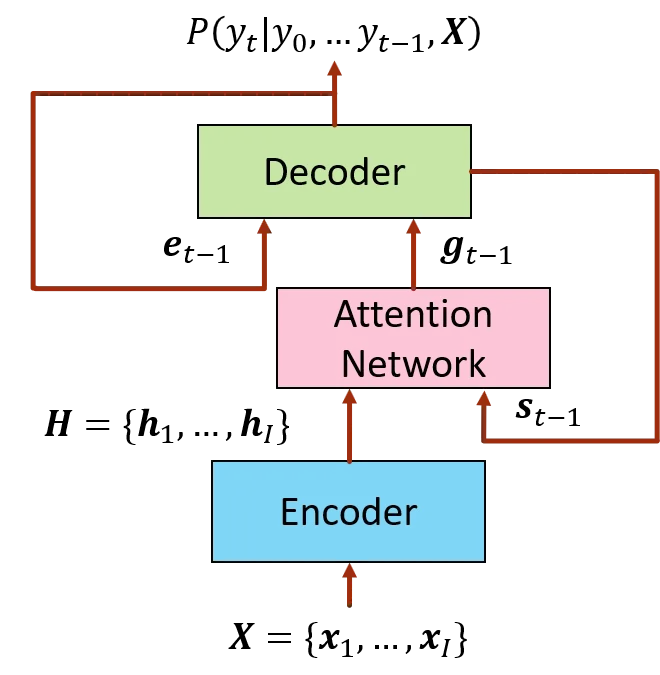
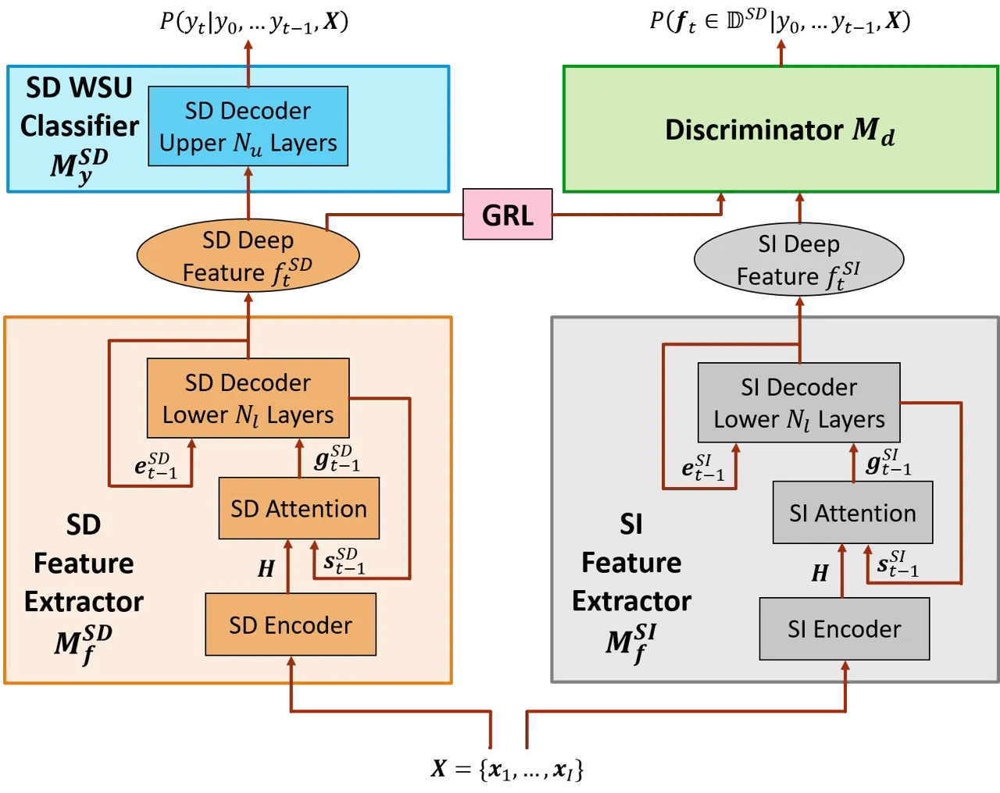
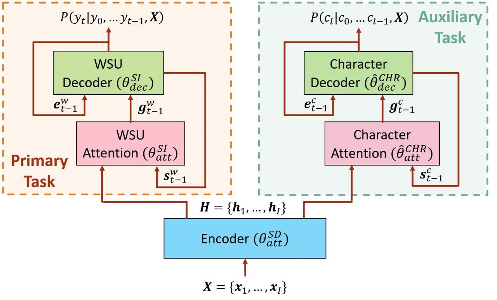

# Speaker Adaptation for Attention-Based End-to-End Speech Recognition

###### Abstract

We propose three regularization-based speaker adaptation approaches to
adapt the attention-based encoder-decoder (AED) model with very limited
adaptation data from target speakers for end-to-end automatic speech
recognition. The first method is Kullback-Leibler divergence (KLD)
regularization, in which the output distribution of a speaker-dependent
(SD) AED is forced to be close to that of the speaker-independent (SI)
model by adding a KLD regularization to the adaptation criterion. To
compensate for the asymmetric deficiency in KLD regularization, an
adversarial speaker adaptation (ASA) method is proposed to regularize
the deep-feature distribution of the SD AED through the adversarial
learning of an auxiliary discriminator and the SD AED. The third
approach is the multi-task learning, in which an SD AED is trained to
jointly perform the primary task of predicting a large number of output
units and an auxiliary task of predicting a small number of output units
to alleviate the target sparsity issue. Evaluated on a Microsoft short
message dictation task, all three methods are highly effective in
adapting the AED model, achieving up to 12.2% and 3.0% word error rate
improvement over an SI AED trained from 3400 hours data for supervised
and unsupervised adaptation, respectively.

Zhong Meng, Yashesh Gaur, Jinyu Li, Yifan Gong

Microsoft Corporation, Redmond, WA, USA

{zhme,yagaur,jinyli,ygong}@microsoft.com

Index Terms: speaker adaptation, end-to-end, attention, encoder-decoder,
speech recognition

## 1 Introduction

Recently, remarkable progress has been made in end-to-end (E2E)
automatic speech recognition (ASR) with the advance of deep learning.
E2E ASR aims to directly map a sequence of input speech signal to a
sequence of corresponding output labels as the transcription by
incorporating the acoustic model, pronunciation model and language model
in traditional ASR system into a single deep neural network (DNN). Three
dominant approaches to achieve E2E ASR include: connectionist temporal
classification (CTC) \[1, 2\], recurrent neural network transducer \[3\]
and attention-based encoder-decoder (AED) \[4, 5, 6\].

However, the performance of E2E ASR degrades when a speaker-independent
(SI) model is tested with the speech of an unseen speaker. A natural
solution is to adapt the SI E2E model to the speech from the target
speaker. The major difficulty for speaker adaptation is that the
speaker-dependent (SD) model with a large number of parameters can
easily get overfitted to very limited speaker-specific data.

Many methods have been proposed for speaker adaption in traditional
DNN-hidden Markov model hybrid systems such as regularization-based \[7,
8, 9, 10, 11\], transformation-based \[12, 13\], singular value
decomposition-based \[14, 15\], subspace-based \[16, 17\] and
adversarial learning-based \[18, 19\] approaches. Despite the broad
success of these methods in hybrid systems, there has been limited
investigation in speaker adaptation for the E2E ASR. In \[20\], two
regularization-based approaches are shown to be effective for CTC-based
E2E ASR. In \[21\], constrained re-training \[22\] is applied to update
a part of the parameters in a multi-channel AED model.

In this work, we propose three regularization-based speaker adaptation
approaches for AED-based E2E ASR to overcome the adaptation data
sparsity. We work on the AED model predicting word or subword units
(WSUs) since WSUs have shown to yield better performance than characters
as the output units \[23, 24\]. The first method is a Kullback-Leibler
divergence (KLD) regularization in which we minimize the KLD between the
output distributions of the SD and SI AED models while optimizing the
adaptation criterion. To offset the deficiency of KLD as an _asymmetric_
distribution-similarity measure \[25\], we further propose an
adversarial speaker adaptation (ASA) method in which an auxiliary
discriminator network is jointly trained with the SD AED to keep the
deep-feature distribution of the SD AED decoder not far away from that
of the SI AED. Finally, to address the sparsity of WSU targets in the
adaptation data, we propose a multi-task learning (MTL) speaker
adaptation in which an SD AED is trained to simultaneously perform the
primary task of predicting a large number of WSU units and an auxiliary
task of predicting a small number of character units to improve the
major task.

We evaluate the three speaker adaptation methods on a Microsoft short
message dictation (SMD) task with 3400 hours live US English training
data and 100-200 adaptation utterances for each speaker. All three
approaches significantly improve over a strong SI AED model. In
particular, ASA achieves up to 12.2% and 3.0% relative word error rate
(WER) gain over the SI baseline for supervised and unsupervised
adaptation, respectively, consistently outperforming the KLD
regularization.

## 2 Speaker Adaptation for Attention-Based Encoder-Decoder (AED) Model

We first briefly describe the AED model used in this work and then
elaborate three speaker adaptation methods for AED-based E2E ASR. The SD
AED model is always initialized with a well-trained SI AED predicting
WSUs in all three methods.

### 2.1 AED Model for E2E ASR

In this work, we investigate the speaker adaptation methods for the AED
models \[4, 5, 6\] with WSUs as the output units. AED model is first
introduced in \[26, 27\] for neural machine translation. With the
advantage of no conditional independence assumption over CTC criterion
\[1\], AED is introduced, for the first time, to speech area in \[4\]
for E2E phoneme recognition. In \[5, 6\], AED is further applied to
large vocabulary speech recognition and has recently achieved superior
performance to conventional hybrid systems in \[24\].

To achieve E2E ASR, AED directly maps a sequence of speech frames to an
output sequence of WSU labels via an encoder, a decoder and an attention
network as shown in Fig. 1.



Figure 1: The architecture of AED model for E2E ASR.

The encoder is an RNN which encodes the sequence of input speech frames
$`\mathbf{X}`$ into a sequence of high-level features
$`\mathbf{H}=\{\mathbf{h}_{1},\ldots,\mathbf{h}_{T}\}`$. AED models the
conditional probability distribution $`P(\mathbf{Y}|\mathbf{X})`$ over
sequences of output WSU labels $`\mathbf{Y}=\{y_{1},\ldots,y_{T}\}`$
given a sequence of input speech frames
$`\mathbf{X}=\{\mathbf{x}_{1},\ldots,\mathbf{x}_{I}\}`$ and, with the
encoded features $`\mathbf{H}`$, we have

```math
\displaystyle P(\mathbf{Y}|\mathbf{X})=P(\mathbf{Y}|\mathbf{H})=\prod_{t=1}^{T}P(y_{t}|\mathbf{Y}_{0:t-1},\mathbf{H}) \tag{1}
```

A decoder is used to model $`P(\mathbf{Y}|\mathbf{H})`$. To capture the
conditional dependence on $`\mathbf{H}`$, an attention network is used
to determine which encoded features in $`\mathbf{H}`$ should be attended
to predict the output label $`y_{t}`$ and to generate a context vector
$`\mathbf{g}_{t}`$ as a linear combination of $`\mathbf{H}`$ \[4\].

At each time step $`t`$, the decoder RNN takes the sum of the previous
WSU embedding $`\mathbf{e}_{t-1}`$ and the context vector
$`\mathbf{g}_{t-1}`$ as the input to predict the conditional probability
of each WSU, i.e.,
$`P(u|\mathbf{Y}_{0:t-1},\mathbf{H}),u\in\mathbbm{U}`$, at time $`t`$,
where $`\mathbbm{U}`$ is the set of all the WSUs:

```math
\displaystyle\mathbf{s}_{t} \displaystyle=\text{RNN}^{\text{dec}}(\mathbf{s}_{t-1},\mathbf{e}_{t-1}+\mathbf{g}_{t-1}) \tag{2}
```

```math
\displaystyle\left[P(u|\mathbf{Y}_{0:t-1},\mathbf{H})\right]_{u\in\mathbbm{U}} \displaystyle=\text{softmax}\left[W_{y}(\mathbf{s}_{t}+\mathbf{g}_{t})+\mathbf{b}_{y}\right] \tag{3}
```

where $`\mathbf{s}_{t}`$ is the hidden state of the decoder RNN. bias
$`\mathbf{b}_{y}`$ and the matrix $`W_{y}`$ are learnable parameters.

A WSU-based SI AED model is trained to minimize the following loss on
the training corpus $`\mathbbm{T_{r}}`$.

```math
\displaystyle\hskip-5.0pt\mathcal{L}^{\text{WSU}}_{\text{AED}}(\theta^{\text{SI}},\mathbbm{T_{r}}) \displaystyle=-\hskip-10.0pt\sum_{(\mathbf{X},\mathbf{Y})\in\mathbbm{T_{r}}}\sum_{t=1}^{|\mathbf{Y}|}\log P(y_{t}|\mathbf{Y}_{0:t-1},\mathbf{H};\theta^{\text{SI}}) \tag{4}
```

where $`\theta^{\text{SI}}`$ denotes all the model parameters in the SI
AED and $`|\mathbf{Y}|`$ represents the number of elements in the label
sequence $`\mathbf{Y}`$.

### 2.2 KLD Regularization for Speaker Adaptation

Given very limited speech from a target speaker, the SD AED model,
usually with a large number of parameters, can easily get overfitted to
the adaptation data. To tackle this problem, one solution is to minimize
the KLD between the output distributions of the SI and SD AED models
while training the SD AED with the adaptation data. We compute the
WSU-level KLD between the output distributions of the SI and SD AED
models below

```math
\displaystyle\hskip-7.0pt\sum_{t=1}^{T}\sum_{u\in\mathbbm{U}}P(u|\mathbf{Y}_{0:t-1},\mathbf{X};\mathbf{\theta}^{\text{SI}})\log\left[\frac{P(u|\mathbf{Y}_{0:t-1},\mathbf{X};\mathbf{\theta}^{\text{SI}})}{P(u|\mathbf{Y}_{0:t-1},\mathbf{X};\mathbf{\theta}^{\text{SD}})}\right] \tag{5}
```

where $`\mathbf{\theta}^{\text{SI}}`$ denote the all the parameters in
SI AED model.

We add only the $`\mathbf{\theta}^{\text{SD}}`$-related terms to the AED
loss as the KLD regularization since $`\mathbf{\theta}^{\text{SI}}`$ are
not updated during training. Therefore, the regularized loss function
for KLD adaptation of AED is computed below on the adaptation set
$`\mathbbm{A}`$

```math
\displaystyle\mathcal{L}_{\text{KLD}}(\mathbf{\theta}^{\text{SI}},\mathbf{\theta}^{\text{SD}},\mathbbm{A})=-(1-\rho)\mathcal{L}^{\text{WSU}}_{\text{AED}}(\mathbf{\theta}^{\text{SD}},\mathbbm{A})
```

```math
\displaystyle\hskip 18.49988pt\hskip 18.49988pt\hskip 9.24994pt-\rho\sum_{(\mathbf{X},\mathbf{Y})\in\mathbbm{A}}\sum_{t=1}^{|\mathbf{Y}|}\sum_{u\in\mathbbm{U}}P(u|\mathbf{Y}_{0:t-1},\mathbf{X};\mathbf{\theta}^{\text{SI}})
```

```math
\displaystyle\hskip 18.49988pt\hskip 18.49988pt\hskip 18.49988pt\hskip 18.49988pt\hskip 18.49988pt\hskip 18.49988pt\;\log P(u|\mathbf{Y}_{0:t-1},\mathbf{X};\mathbf{\theta}^{\text{SD}})
```

```math
\displaystyle=-\sum_{(\mathbf{X},\mathbf{Y})\in\mathbbm{A}}\sum_{t=1}^{|\mathbf{Y}|}\sum_{u\in\mathbbm{U}}\Bigr\{(1-\rho)\mathbbm{1}[u=y_{t}]\Bigr.
```

```math
\displaystyle\hskip 9.24994pt\;\Bigl.+\rho P(u|\mathbf{Y}_{0:t-1},\mathbf{X};\mathbf{\theta}^{\text{SI}})\Bigr\}P(u|\mathbf{Y}_{0:t-1},\mathbf{X};\mathbf{\theta}^{\text{SD}}), \tag{6}
```

```math
\displaystyle\hat{\mathbf{\theta}}^{\text{SD}}=\argmin_{\mathbf{\theta}^{\text{SD}}}\mathcal{L}_{\text{KLD}}(\mathbf{\theta}^{\text{SI}},\mathbf{\theta}^{\text{SD}},\mathbbm{A}), \tag{7}
```

where $`\rho\in[0,1]`$ is the regularization weight and
$`\mathbbm{1}[\cdot]`$ is the indicator function and
$`\hat{\mathbf{\theta}}^{\text{SD}}`$ denote the optimized parameters.
Therefore, KLD regularization for AED is equivalent to using the linear
interpolation between the hard WSU one-hot label and the soft WSU
posteriors from SI AED as the new target for standard cross-entropy
training.

### 2.3 Adversarial Speaker Adaptation (ASA)

As an _asymmetric_ metric, KLD is not a perfect similarity measure
between distributions \[25\] since the minimization of
$`\mathcal{KL}\left(P_{SI}||P_{SD}\right)`$ does not guarantee that
$`\mathcal{KL}\left(P_{SD}||P_{SI}\right)`$ is also minimized.
Adversarial learning serves as a much better solution since it
guarantees that the global optimum is achieved if and only if the SD and
SI AEDs share exactly the same hidden-unit distribution at a certain
layer \[28\]. Initially proposed for image generation \[28\],
adversarial learning has recently been widely applied to many aspects of
speech area including domain adaptation \[29, 30, 31, 32\], noise-robust
ASR \[33, 34, 32\], domain-invariant training \[19, 35, 36\], speech
enhancement \[37, 38, 39\] and speaker verification \[40\]. ASA is
proposed in \[18\] for hybrid system, and in this work, we adapt it to
AED-based E2E ASR.

As in Fig. 2, we view the encoder, the attention network and the first
few layers of the decoder of the SI AED as an SI feature extractor
$`M_{f}^{\text{SI}}`$ with parameters $`\theta_{f}^{\text{SI}}`$ that
maps $`\mathbf{X}`$ to a sequence of deep hidden features
$`\mathbf{F}^{\text{SI}}=\{\mathbf{f}_{1}^{\text{SI}},\ldots,\mathbf{f}_{T}^{\text{SI}}\}`$
and the rest layers of the SI AED decoder as a SI WSU classifier
$`M_{y}^{\text{SI}}`$ with parameters $`\theta_{y}^{\text{SI}}`$ (i.e.,
$`\theta^{\text{SI}}=\{\theta_{f}^{\text{SI}},\theta_{y}^{\text{SI}}\}`$).
Similarly, we divide the SD AED into an SD feature extractor
$`M_{f}^{\text{SD}}`$ and an SD WSU classifier $`M_{y}^{\text{SD}}`$ in
exactly the same way as the SI AED and use $`\theta_{f}^{\text{SI}}`$
and $`\theta_{y}^{\text{SI}}`$ to initialize $`\theta_{f}^{\text{SD}}`$
and $`\theta_{y}^{\text{SD}}`$, respectively (i.e.,
$`\theta^{\text{SD}}=\{\theta_{f}^{\text{SD}},\theta_{y}^{\text{SD}}\}`$).
$`M_{f}^{\text{SD}}`$ extracts SD deep features
$`\mathbf{F}^{\text{SD}}`$ from $`\mathbf{X}`$.



Figure 2: Adversarial speaker adaptation (ASA) of AED model for E2E ASR.

We then introduce an auxiliary discriminator $`M_{d}`$ with parameters
$`\theta_{d}`$ taking $`\mathbf{F}^{\text{SI}}`$ and
$`\mathbf{F}^{\text{SD}}`$ as the input to predict the posterior
$`P(\mathbf{f}_{t}\in\mathbbm{D}^{\text{SD}}|\mathbf{Y}_{0:t-1},\mathbf{X})`$
that the input deep feature $`\mathbf{f}_{t}`$ is generated by the SD
AED with the discrimination loss below.

```math
\displaystyle\mathcal{L}_{\text{DISC}}(\theta^{\text{SD}}_{f},\theta^{\text{SI}}_{f},\theta_{d},\mathbbm{A})=
```

```math
\displaystyle-\sum_{(\mathbf{X},\mathbf{Y})\in\mathbbm{A}}\sum_{t=1}^{|\mathbf{Y}|}\left[\log P(\mathbf{f}_{t}^{\text{SD}}\in\mathbbm{D}^{\text{SD}}|\mathbf{Y}_{0:t-1},\mathbf{X};\theta^{\text{SD}}_{f},\theta_{d})\right.
```

```math
\displaystyle\hskip 18.49988pt\hskip 18.49988pt\hskip 18.49988pt\left.+\log P(\mathbf{f}_{t}^{\text{SI}}\in\mathbbm{D}^{\text{SI}}|\mathbf{Y}_{0:t-1},\mathbf{X};\theta^{\text{SI}}_{f},\theta_{d})\right], \tag{8}
```

where $`\mathbbm{D}^{\text{SD}}`$ and $`\mathbbm{D}^{\text{SI}}`$ are
the sets of SD and SI deep features, respectively.

With ASA, our goal is to make the distribution of
$`\mathbf{F}^{\text{SD}}`$ similar to that of $`\mathbf{F}^{\text{SI}}`$
through adversarial training. Therefore, we minimize
$`\mathcal{L}_{\text{DISC}}`$ with respect to $`\theta_{d}`$ and
maximize $`\mathcal{L}_{\text{DISC}}`$ with respect to
$`\theta^{\text{SD}}_{f}`$. This minimax competition will converge to
the point where $`M_{f}^{\text{SD}}`$ generates extremely confusing
$`\mathbf{F}^{\text{SD}}`$ that $`M_{d}`$ is unable to distinguish
whether they are generated by $`M_{f}^{\text{SD}}`$ or
$`M_{f}^{\text{SI}}`$. At the same time, we minimize the AED loss in Eq.
(4) to make $`\mathbf{F}^{\text{SD}}`$ WSU-discriminative. The entire
adversarial MTL procedure of ASA for AED model is formulated below:

```math
\displaystyle\hskip-4.0pt(\hat{\mathbf{\theta}}_{f}^{\text{SD}},\hat{\mathbf{\theta}}_{y}^{\text{SD}}) \displaystyle=\argmin_{\mathbf{\theta}_{f}^{\text{SD}},\mathbf{\theta}_{y}^{\text{SD}}}\left[\mathcal{L}^{\text{WSU}}_{\text{AED}}(\mathbf{\theta}_{f}^{\text{SD}},\mathbf{\theta}_{y}^{\text{SD}},\mathbbm{A})\right.
```

```math
\displaystyle\hskip 18.49988pt\hskip 18.49988pt\hskip 18.49988pt\left.-\lambda\mathcal{L}_{\text{DISC}}(\mathbf{\theta}_{f}^{\text{SD}},\theta^{\text{SI}}_{f},\hat{\mathbf{\theta}}_{d},\mathbbm{A})\right], \tag{9}
```

```math
\displaystyle(\hat{\mathbf{\theta}}_{d}) \displaystyle=\argmin_{\mathbf{\theta}_{d}}\mathcal{L}_{\text{DISC}}(\hat{\mathbf{\theta}}_{f}^{\text{SD}},\theta^{\text{SI}}_{f},\mathbf{\theta}_{d},\mathbbm{A}), \tag{10}
```

where $`\lambda`$ controls the trade-off between
$`\mathcal{L}^{\text{WSU}}_{\text{AED}}`$ and
$`\mathcal{L}_{\text{DISC}}`$. Note that the SI AED serves only as a
reference network and $`\mathbf{\theta}^{\text{SI}}`$ is not updated
during training. After ASA, only the SD AED with adapted parameters
$`\hat{\theta}^{\text{SD}}=\{\hat{\theta}_{f}^{\text{SD}},\hat{\theta}_{y}^{\text{SD}}\}`$
are used for decoding while the auxiliary discriminator $`M_{d}`$ is
discarded.

### 2.4 Multi-Task Learning (MTL) for Speaker Adaptation

One difficulty of adapting AED models is that the WSUs in the adaptation
data are sparsely distributed since the very few adaptation samples are
assigned to a huge number of WSU labels (about 30k). A large proportion
of WSUs are unseen during the adaptation, overfitting the SD AED to a
small space of observed WSU sequences. Inspired by \[41, 20\], to
alleviate this target sparsity issue, we augment the primary task of
predicting a large number of WSU output units with an auxiliary task of
predicting a small number of character output units (around 30) to
improve the primary task via MTL. The adaptation data, though with a
small size, covers a much higher percentage (usually 100%) of the
character set than that of the WSU set. Predicting the fully-covered
character labels as a secondary task exposes the SD AED to a enlarged
acoustic space and effectively regularizes the major task of WSU
prediction.

We first introduce an auxiliary AED (parameters $`\theta^{\text{CHR}}`$)
with character output units and initialize its encoder with the encoder
parameters of the WSU-based SI AED $`\theta^{\text{SI}}_{\text{enc}}`$.
Then we train the decoder (parameters
$`\theta^{\text{CHR}}_{\text{dec}}`$) and the attention network
(parameters $`\theta^{\text{CHR}}_{\text{att}}`$) of the character-based
AED using all the training data $`\mathbbm{T_{r}}`$ to minimize the
character-level AED loss below while keeping its encoder fixed:

```math
\displaystyle\hskip-1.0pt\mathcal{L}^{\text{CHR}}_{\text{AED}}(\theta^{\text{CHR}},\mathbbm{T_{r}})=-\hskip-11.0pt\sum_{(\mathbf{X},\mathbf{C})\in\mathbbm{T_{r}}}\sum_{l=1}^{|\mathbf{C}|}P(c_{l}|\mathbf{C}_{0:l-1},\mathbf{X};\theta^{\text{CHR}}) \tag{11}
```

```math
\displaystyle(\hat{\theta}^{\text{CHR}}_{\text{dec}},\hat{\theta}^{\text{CHR}}_{\text{att}})=\argmin_{\theta^{\text{CHR}}_{\text{dec}},\theta^{\text{CHR}}_{\text{att}}}\mathcal{L}^{\text{CHR}}_{\text{AED}}(\theta^{\text{SI}}_{\text{enc}},\theta^{\text{CHR}}_{\text{dec}},\theta^{\text{CHR}}_{\text{att}},\mathbbm{T_{r}}), \tag{12}
```

where $`\mathbf{C}=\{c_{1},\ldots,c_{L}\}`$ is the sequence of character
labels corresponding to $`\mathbf{X}`$ and $`\mathbf{Y}`$.

Then we construct an MTL network comprised of the WSU-based SI AED with
initial parameters
$`\theta^{\text{SI}}=\{\theta^{\text{SI}}_{\text{enc}},\theta^{\text{SI}}_{\text{dec}},\theta^{\text{SI}}_{\text{att}}\}`$,
a well-trained character-based decoder with parameters
$`\hat{\theta}^{\text{CHR}}_{\text{dec}}`$ and its attention network
with parameters $`\hat{\theta}^{\text{CHR}}_{\text{att}}`$ as in Fig. 3.
The latter two take the encoded features $`\mathbf{H}`$ from the encoder
of the SI AED as the input.



Figure 3: MTL speaker adaptation of AED model for E2E ASR.

Finally, we jointly minimize the WSU-level and character-level AED
losses on the adaptation data by updating only the encoder parameters
$`\theta^{\text{SD}}_{\text{enc}}`$ of the MTL network as follows:

```math
\displaystyle\hat{\theta}^{\text{SD}}_{\text{enc}} \displaystyle=\argmin_{\theta^{\text{SD}}_{\text{enc}}}\left[\beta\mathcal{L}^{\text{WSU}}_{\text{AED}}(\theta^{\text{SD}}_{\text{enc}},\theta^{\text{SI}}_{\text{dec}},\theta^{\text{SI}}_{\text{att}},\mathbbm{A})\right.
```

```math
\displaystyle\hskip 18.49988pt\hskip 18.49988pt\hskip 9.24994pt\;\left.+(1-\beta)\mathcal{L}^{\text{CHR}}_{\text{AED}}(\theta^{\text{SD}}_{\text{enc}},\hat{\theta}^{\text{CHR}}_{\text{dec}},\hat{\theta}^{\text{CHR}}_{\text{att}},\mathbbm{A})\right] \tag{13}
```

where $`\beta`$ is the interpolation weight for WSU-level AED loss
ranging from 0 to 1. After the MTL, only the adapted WSU-based SD AED
with parameters
$`\hat{\theta}^{\text{SD}}=\{\hat{\theta}^{\text{SD}}_{\text{enc}},\theta^{\text{SI}}_{\text{dec}},\theta^{\text{SI}}_{\text{att}}\}`$
is used for decoding. The character-based decoder and attention network
are discarded.

## 3 Experiments

We evaluate the three speaker adaptation methods for AED-based E2E ASR
on the Microsoft Windows phone SMD task.

### 3.1 Data Preparation

The training data consists of 3400 hours Microsoft internal live US
English Cortana utterances collected via various deployed speech
services including voice search and SMD. The test set consists of 7
speakers with a total number of 20,203 words. Two adaptation sets of 100
and 200 utterances per speaker are used for acoustic model adaptation,
respectively. We extract 80-dimensional log Mel filter bank (LFB)
features from the speech signal in both the training and test sets every
10 ms over a 25 ms window. We stack 3 consecutive frames and stride the
stacked frame by 30 ms to form 240-dimensional input speech frames as in
\[24\]. Following \[42\], we first generate 33755 mixed units as the set
of WSUs based on the training transcription and then produce mixed-unit
label sequences as training targets.

### 3.2 SI AED Baseline System

We train a WSU-based AED model as described in Section 2.1 for E2E ASR
using 3400 hours training data. The encoder is a bi-directional gated
recurrent units (GRU)-RNN \[26, 43\] with $`6`$ hidden layers, each with
512 hidden units. Layer normalization \[44\] is applied for each hidden
layer. Each WSU label is represented by a 512-dimensional embedding
vector. The decoder is a uni-directional GRU-RNN with 2 hidden layers,
each with 512 hidden units, and an output layer predicting posteriors of
the 33k WSU. We use GRU instead of long short-term memory (LSTM) \[22,
45\] for RNN because it has less parameters and is trained faster than
LSTM with no loss of performance. We use PyTorch as the tool \[46\] for
building, training and evaluating the neural networks. As shown in Table
1, the baseline SI AED achieves 14.32% WER on the test set.

| System | Adapt Param | Weight         | Supervised |       | Unsupervised |       |
| ------ | ----------- | -------------- | ---------- | ----- | ------------ | ----- |
|        |             |                | 100        | 200   | 100          | 200   |
| SI     | -           | -              | 14.32      |       |              |       |
| KLD    | All         | $`\rho=0.0`$   | 14.09      | 13.30 | 14.14        | 14.04 |
|        |             | $`\rho=0.2`$   | 13.97      | 13.14 | 14.04        | 14.01 |
|        |             | $`\rho=0.5`$   | 14.14      | 13.92 | 14.17        | 14.00 |
|        |             | $`\rho=0.8`$   | 14.31      | 14.23 | 14.81        | 14.14 |
| ASA    | All         | $`\alpha=0.2`$ | 13.29      | 12.58 | 13.99        | 13.92 |
|        |             | $`\alpha=0.5`$ | 13.37      | 12.66 | 13.95        | 13.89 |
|        |             | $`\alpha=0.8`$ | 13.20      | 12.76 | 13.98        | 13.94 |
| MTL    | Enc         | $`\beta=0.2`$  | 13.3       | 12.71 | 13.93        | 13.87 |
|        |             | $`\beta=0.5`$  | 13.26      | 12.73 | 13.86        | 13.83 |
|        |             | $`\beta=0.8`$  | 13.27      | 12.76 | 13.80        | 13.77 |

Table 1: The WERs (%) of speaker adaptation using KLD, ASA and MTL for
AED E2E ASR on Microsoft SMD task with 3400 hours training data. Each of
the 7 test speakers has 100 or 200 adaptation utterances. In KLD and ASA
adaptation, all the parameters of the AED (“All”) are updated while, in
MTL adaptation, only the AED encoder (“Enc”) is updated.

### 3.3 KLD Adaptation of AED

We first perform KLD adaptation of the SI AED with different $`\rho`$ by
updating all the parameters in the SD AED. Direct re-training is
performed with on regularization when $`\rho=0`$. As shown in Table 1,
for supervised adaptation, KLD achieves the best WERs, 13.97% and
13.14%, at $`\rho=0.2`$ for both 100 and 200 adaptation utterances with
2.4% and 8.2% relative WER improvements over the SI baseline. The WER
increases as $`\rho`$ continues to grow. For unsupervised adaptation,
KLD achieves the best WERs, 14.04% $`(\rho=0.2)`$ and 14.00%
$`(\rho=0.5)`$, for 100 and 200 adaptation utterances, which improve the
SI AED by 2.0% and 2.2% relatively. More adaptation utterances
significantly improves the supervised adaptation but only slightly
reduces the WER in unsupervised adaptation since the decoded one-best
path is not as accurate as the forced alignment.

### 3.4 Adversarial Speaker Adaptation (ASA) of AED

To perform ASA of AED, we construct the SI feature extractor
$`M_{f}^{\text{SI}}`$ as the first 2 hidden layers of the decoder, the
encoder and the attention network of the SI AED model. The SI senone
classifier $`M_{y}^{\text{SI}}`$ is the decoder output layer.
$`M_{f}^{\text{SD}}`$ and $`M_{y}^{\text{SD}}`$ are initialized with
$`M_{f}^{\text{SI}}`$ and $`M_{y}^{\text{SI}}`$. The discriminator
$`M_{d}`$ is a feedforward DNN with 2 hidden layers and 512 hidden units
for each layer. The output layer of $`M_{d}`$ has 1 unit predicting the
posteriors of $`\mathbf{f}_{t}\in\mathbbm{D}^{\text{SD}}`$.
$`M_{f}^{\text{SD}}`$, $`M_{y}^{\text{SD}}`$ and $`M_{d}`$ are jointly
trained with an adversarial MTL objective as in Eq. (10). We update all
the parameters in the SD AED.

As shown in Table 1, for supervised adaptation, ASA achieves the best
WERs, 13.20% $`(\alpha=0.8)`$ and 12.58% $`(\alpha=0.2)`$, with 100 and
200 adaptation utterances, which are 7.8% and 12.2% relative
improvements over the SI AED baseline, respectively. For unsupervised
adaptation, ASA achieves the best WERs, 13.95% and 13.89%, both at
$`\alpha=0.5`$ with 100 and 200 adaptation utterances, which improves
the SI AED baseline by 2.6% and 3.0% relatively. ASA consistently and
significantly outperforms KLD for both supervised and unsupervised
adaptation and for adaptation data of different sizes. Especially, for
supervised adaptation, ASA achieves 5.5% and 4.3% relative improvements
over KLD with 100 and 200 adaptation utterances, respectively.

### 3.5 MTL Adaptation of AED

In MTL, we first train an auxiliary AED with 30 character units as the
output using the training data and then adapt the SI WSU AED by
simultaneously performing WSU and character prediction tasks. The
character-based AED share the same encoder as the WSU-based AED and has
a GRU decoder with 2 hidden layers, each with 512 hidden units.

Table 1 shows that, for supervised adaptation, MTL achieves best WERs,
13.26% $`(\beta=0.5)`$ and 12.71% $`(\beta=0.2)`$, with 100 and 200
adaptation utterances, which improves the SI AED baseline by 7.4% and
11.2%, respectively. For unsupervised adaptation, MTL achieves best
WERs, 13.80% and 13.77%, both at $`\beta=0.8`$, which are 3.6% and 3.8%
relative improvements over the SI AED baseline, respectively. Note that
the performance of MTL adaptation is not comparable with that of KLD and
ASA since in MTL, only the encoder (consisting of 32.4% of the whole AED
model parameters) is updated while in KLD and ASA, the whole AED model
is adapted. The KLD and ASA performance can be remarkably improved by
updating only a portion of the entire model parameters.

## 4 Conclusion

In this work, we propose KLD, ASA and MTL approaches for speaker
adaptation in AED-based E2E ASR system. In KLD, we minimize the KLD
between the output distributions of the SD and SI AED models in addition
to the AED loss to avoid overfitting. In ASA, adversarial learning is
used to force the deep features of the SD AED to have similar
distribution with those of the SI AED to offset the asymmetric
deficiency of KLD. In MTL, an additional task of predicting character
units is performed in addition to the primary task of WSU-based AED to
resolve the target sparsity issue.

Evaluated on Microsoft SMD task, all three methods achieve significant
improvements over a strong SI AED baseline for both supervised and
unsupervised adaptation. ASA improves consistently over KLD by updating
all the AED parameters. By adapting only the encoder with 32.4% of the
full model parameters, the performance of MTL is not comparable with
that of KLD and ASA. Potentially, much larger improvements can be
achieved by KLD and ASA by adapting a subset of entire model parameters.

## References

- \[1\] A. Graves, S. Fernández, F. Gomez, and J. Schmidhuber,
  “Connectionist temporal classification: labelling unsegmented sequence
  data with recurrent neural networks,” in _ICML_. ACM, 2006.
- \[2\] A. Graves and N. Jaitly, “Towards end-to-end speech recognition
  with recurrent neural networks,” in _International Conference on
  Machine Learning_, 2014, pp. 1764–1772.
- \[3\] A. Graves, “Sequence transduction with recurrent neural
  networks,” _arXiv preprint arXiv:1211.3711_, 2012.
- \[4\] J. K. Chorowski, D. Bahdanau, D. Serdyuk _et al._,
  “Attention-based models for speech recognition,” in _NIPS_, 2015, pp.
  577–585.
- \[5\] D. Bahdanau, J. Chorowski, D. Serdyuk _et al._, “End-to-end
  attention-based large vocabulary speech recognition,” in _Proc.
  ICASSP_. IEEE, 2016, pp. 4945–4949.
- \[6\] W. Chan, N. Jaitly, Q. Le, and O. Vinyals, “Listen, attend and
  spell: A neural network for large vocabulary conversational speech
  recognition,” in _Proc. ICASSP_. IEEE, 2016, pp. 4960–4964.
- \[7\] D. Yu, K. Yao, H. Su, G. Li, and F. Seide, “Kl-divergence
  regularized deep neural network adaptation for improved large
  vocabulary speech recognition,” in _Proc. ICASSP_, May 2013, pp.
  7893–7897.
- \[8\] H. Liao, “Speaker adaptation of context dependent deep neural
  networks,” in _Proc. ICASSP_, May 2013.
- \[9\] Z. Meng, J. Li, Y. Zhao, and Y. Gong, “Conditional
  teacher-student learning,” in _Proc. ICASSP_, 2019.
- \[10\] Z. Huang, J. L, S. Siniscalchi. _et al._, “Rapid adaptation for
  deep neural networks through multi-task learning,” in
  _Interspeech_, 2015.
- \[11\] L. Tóth and G. Gosztolya, “Adaptation of dnn acoustic models
  using kl-divergence regularization and multi-task training,” in
  _International Conference on Speech and Computer_, 2016.
- \[12\] F. Seide, G. Li, X. Chen, and D. Yu, “Feature engineering in
  context-dependent deep neural networks for conversational speech
  transcription,” in _Proc. ASRU_, Dec 2011, pp. 24–29.
- \[13\] P. Swietojanski, J. Li, and S. Renals, “Learning hidden unit
  contributions for unsupervised acoustic model adaptation,” _IEEE/ACM
  Transactions on Audio, Speech, and Language Processing_, vol. 24,
  no. 8, pp. 1450–1463, Aug 2016.
- \[14\] J. Xue, J. Li, and Y. Gong, “Restructuring of deep neural
  network acoustic models with singular value decomposition.” in
  _Interspeech_, 2013, pp. 2365–2369.
- \[15\] Y. Zhao, J. Li, and Y. Gong, “Low-rank plus diagonal adaptation
  for deep neural networks,” in _Proc. ICASSP_, March 2016, pp.
  5005–5009.
- \[16\] S. Xue, O. Abdel-Hamid, H. Jiang, L. Dai, and Q. Liu, “Fast
  adaptation of deep neural network based on discriminant codes for
  speech recognition,” _in TASLP_, vol. 22, no. 12, pp. 1713–1725,
  Dec 2014.
- \[17\] L. Samarakoon and K. C. Sim, “Factorized hidden layer
  adaptation for deep neural network based acoustic modeling,” _IEEE/ACM
  Transactions on Audio, Speech, and Language Processing_, vol. 24,
  no. 12, pp. 2241–2250, Dec 2016.
- \[18\] Z. Meng, J. Li, and Y. Gong, “Adversarial speaker adaptation,”
  in _Proc. ICASSP_, 2019.
- \[19\] Z. Meng, J. Li, Z. Chen _et al._, “Speaker-invariant training
  via adversarial learning,” in _Proc. ICASSP_, 2018.
- \[20\] J. Li, R. Zhao, Z. Chen _et al._, “Developing far-field speaker
  system via teacher-student learning,” in _Proc. ICASSP_, 2018.
- \[21\] T. Ochiai, S. Watanabe, S. Katagiri, T. Hori, and J. Hershey,
  “Speaker adaptation for multichannel end-to-end speech recognition,”
  in _2018 IEEE International Conference on Acoustics, Speech and Signal
  Processing (ICASSP)_. IEEE, 2018, pp. 6707–6711.
- \[22\] H. Erdogan, T. Hayashi, J. R. Hershey _et al._, “Multi-channel
  speech recognition: Lstms all the way through,” in _CHiME-4 workshop_,
  2016, pp. 1–4.
- \[23\] Y. Gaur, J. Li, Z. Meng, and Y. Gong, “Acoustic-to-phrase
  end-to-end speech recognition,” in _submitted to INTERSPEECH
  2019_. IEEE, 2019.
- \[24\] C.-C. Chiu, T. N. Sainath, Y. Wu _et al._, “State-of-the-art
  speech recognition with sequence-to-sequence models,” in _Proc.
  ICASSP_. IEEE, 2018, pp. 4774–4778.
- \[25\] S. Kullback and R. A. Leibler, “On information and
  sufficiency,” _The annals of mathematical statistics_, vol. 22, no. 1,
  pp. 79–86, 1951.
- \[26\] K. Cho, B. Van Merriënboer, D. Bahdanau, and Y. Bengio, “On the
  properties of neural machine translation: Encoder-decoder approaches,”
  _arXiv preprint arXiv:1409.1259_, 2014.
- \[27\] D. Bahdanau, K. Cho, and Y. Bengio, “Neural machine translation
  by jointly learning to align and translate,” _arXiv preprint
  arXiv:1409.0473_, 2014.
- \[28\] I. Goodfellow, J. Pouget-Adadie _et al._, “Generative
  adversarial nets,” in _Proc. NIPS_, 2014, pp. 2672–2680. \[Online\].
  Available:
  http://papers.nips.cc/paper/5423-generative-adversarial-nets.pdf
- \[29\] Y. Ganin and V. Lempitsky, “Unsupervised domain adaptation by
  backpropagation,” in _Proc. ICML_, vol. 37. Lille, France: PMLR, 2015,
  pp. 1180–1189.
- \[30\] S. Sun, B. Zhang, L. Xie _et al._, “An unsupervised deep domain
  adaptation approach for robust speech recognition,” _Neurocomputing_,
  vol. 257, pp. 79 – 87, 2017.
- \[31\] Z. Meng, Z. Chen, V. Mazalov, J. Li, and Y. Gong, “Unsupervised
  adaptation with domain separation networks for robust speech
  recognition,” in _Proc. ASRU_, 2017.
- \[32\] Z. Meng, J. Li, Y. Gong, and B.-H. Juang, “Adversarial
  teacher-student learning for unsupervised domain adaptation,” in
  _Proc. ICASSP_. IEEE, 2018, pp. 5949–5953.
- \[33\] Y. Shinohara, “Adversarial multi-task learning of deep neural
  networks for robust speech recognition.” in _INTERSPEECH_, 2016, pp.
  2369–2372.
- \[34\] D. Serdyuk, K. Audhkhasi, P. Brakel, B. Ramabhadran _et al._,
  “Invariant representations for noisy speech recognition,” in _NIPS
  Workshop_, 2016.
- \[35\] Z. Meng, J. Li, and Y. Gong, “Attentive adversarial learning
  for domain-invariant training,” in _Proc. ICASSP_, 2019.
- \[36\] Z. Meng, “Discriminative and adaptive training for robust
  speech recognition and understanding,” Ph.D. dissertation, Georgia
  Institute of Technology, 2018.
- \[37\] S. Pascual, A. Bonafonte, and J. Serrà, “Segan: Speech
  enhancement generative adversarial network,” in _Interspeech_, 2017.
- \[38\] Z. Meng, J. Li, and Y. Gong, “Adversarial feature-mapping for
  speech enhancement,” _Interspeech_, 2018.
- \[39\] ——, “Cycle-consistent speech enhancement,” _Interspeech_, 2018.
- \[40\] Z. Meng, Y. Zhao, J. Li, and Y. Gong, “Adversarial speaker
  verification,” in _Proc. ICASSP_, 2019.
- \[41\] Z. Huang, S. Siniscalchi, I. Chen _et al._, “Maximum a
  posteriori adaptation of network parameters in deep models,” in _Proc.
  Interspeech_, 2015.
- \[42\] J. Li, G. Ye, A. Das _et al._, “Advancing acoustic-to-word ctc
  model,” in _Proc. ICASSP_. IEEE, 2018, pp. 5794–5798.
- \[43\] J. Chung, C. Gulcehre, K. Cho, and Y. Bengio, “Empirical
  evaluation of gated recurrent neural networks on sequence modeling,”
  _arXiv preprint arXiv:1412.3555_, 2014.
- \[44\] J. L. Ba, J. R. Kiros, and G. E. Hinton, “Layer normalization,”
  _arXiv preprint arXiv:1607.06450_, 2016.
- \[45\] Z. Meng, S. Watanabe, J. R. Hershey _et al._, “Deep long
  short-term memory adaptive beamforming networks for multichannel
  robust speech recognition,” in _ICASSP_. IEEE, 2017, pp. 271–275.
- \[46\] A. Paszke, S. Gross, S. Chintala _et al._, “Automatic
  differentiation in pytorch,” 2017.
