# Hearing Lips: Improving Lip Reading by Distilling Speech Recognizers

Ya Zhao Email: <houpeng.hp@alibaba-inc.com>    Rui Xu
Affiliation: Zhejiang University Email: <piaoxue@taobao.com>    Xinchao
Wang Affiliation: Zhejiang University    Peng Hou Affiliation: Stevens
Institute of Technology    Haihong Tang Affiliation: Alibaba
Group{yazhao, ruixu, brooksong}@zju.edu.cn, xinchao.wang@stevens.edu,   
Mingli Song Affiliation: Zhejiang University Affiliation: Alibaba
Group{yazhao, ruixu, brooksong}@zju.edu.cn, xinchao.wang@stevens.edu,

###### Abstract

Lip reading has witnessed unparalleled development in recent years
thanks to deep learning and the availability of large-scale datasets.
Despite the encouraging results achieved, the performance of lip
reading, unfortunately, remains inferior to the one of its counterpart
speech recognition, due to the ambiguous nature of its actuations that
makes it challenging to extract discriminant features from the lip
movement videos. In this paper, we propose a new method, termed as Lip
by Speech (LIBS), of which the goal is to strengthen lip reading by
learning from speech recognizers. The rationale behind our approach is
that the features extracted from speech recognizers may provide
complementary and discriminant clues, which are formidable to be
obtained from the subtle movements of the lips, and consequently
facilitate the training of lip readers. This is achieved, specifically,
by distilling multi-granularity knowledge from speech recognizers to lip
readers. To conduct this cross-modal knowledge distillation, we utilize
an efficacious alignment scheme to handle the inconsistent lengths of
the audios and videos, as well as an innovative filtering strategy to
refine the speech recognizer’s prediction. The proposed method achieves
the new state-of-the-art performance on the CMLR and LRS2 datasets,
outperforming the baseline by a margin of 7.66% and 2.75% in character
error rate, respectively.

## Introduction

Lip reading, also known as visual speech recognition, aims at predicting
the sentence being spoken, given a muted video of a talking face. Thanks
to the recent development of deep learning and the availability of big
data for training, lip reading has made unprecedented progress with much
performance enhancement \[\citeauthoryearAssael et al.2016,
\citeauthoryearChung et al.2017, \citeauthoryearZhao, Xu, and
Song2019\].

In spite of the promising accomplishments, the performance of the
video-based lip reading remains considerably lower than its counterpart,
the audio-based speech recognition, for which the goal is also to decode
the spoken text and therefore can be treated as a heterogeneous modality
sharing the same underlying distribution as lip reading. Given the same
amount of training data and model architecture, the performance
discrepancy is as large as 10.4% vs. 39.5% in terms of character error
rate for speech recognition and lip reading,
respectively \[\citeauthoryearChung et al.2017\]. This is due to the
intrinsically ambiguous nature of lip actuations: several
seemingly-identical lip movements may produce different words, making it
highly challenging to extract discriminant features from the video of
interest and to further dependably predict the text output.

In this paper, we propose a novel scheme, Lip by Speech (LIBS), that
utilizes speech recognition, for which the performances are in most
cases gratifying, to facilitate the training of the more challenging lip
reading. We assume a pre-trained speech recognizer is given, and attempt
to distill knowledge concealed in the speech recognizer to the target
lip reader to be trained.

The rationale for exploiting knowledge
distillation \[\citeauthoryearHinton, Vinyals, and Dean2015\] for this
task lies in that, acoustic speech signals embody information
complementary to that of the visual ones. For example, utterances with
subtle movements, which are challenging to be distinguished visually,
are in most cases handy to be recognized
acoustically \[\citeauthoryearWolff et al.1994\]. By imitating the
acoustic speech features extracted by the speech recognizer, the lip
reader is expected to enhance its capability to extract discriminant
visual features. To this end, LIBS is designed to distill knowledge at
multiple temporal scales including sequence-level, context-level, and
frame-level, so as to encode the multi-granularity semantics from the
input sequence.

Nevertheless, distilling knowledge from a heterogeneous modality, in
this case the audio sequence, confronts two major challenges. The first
lies in the fact that, the two modalities may feature different sampling
rates and are thus asynchronous, while the second concerns the imperfect
speech-recognition predictions. To this end, we employ a cross-modal
alignment strategy to synchronize the audio and video data by finding
the correspondence between them, so as to conduct the fine-grained
knowledge distillation from audio features to visual ones. To enhance
the speech predictions, on the other hand, we introduce a filtering
technique to refine the distilled features, so that useful features can
be filtered for knowledge distillation.

Experimental results on two large-scale lip reading datasets, CMLR
\[\citeauthoryearZhao, Xu, and Song2019\] and LRS2
\[\citeauthoryearAfouras et al.2018\], show that the proposed approach
outperforms the state of the art. We achieve a character error rate of
31.27%, a 7.66% enhancement over the baseline on the CMLR dataset, and
one of 45.53% with 2.75% improvement on LRS2. It is noteworthy that when
the amount of training data shrinks, the proposed approach tends to
yield an even greater performance gain. For example, when only 20% of
the training samples are used, the performance against the baseline has
an 9.63% boost on the CMLR dataset.

Our contribution is therefore an innovative and effective approach to
enhancing the training of lip readers, achieved by distilling
multi-granularity knowledge from speech recognizers. This is to our best
knowledge the first attempt along this line and, unlike existing
feature-level knowledge distillation methods that work on Convolutional
Neural Networks \[\citeauthoryearRomero et al.2014,
\citeauthoryearGupta, Hoffman, and Malik2016, \citeauthoryearHou et
al.2019\], our strategy handles Recurrent Neural Networks. Experiments
on several datasets show that the proposed method leads to the new state
of the art.

## Related Work

### Lip Reading

\[\citeauthoryearAssael et al.2016\] proposes the first deep
learning-based, end-to-end sentence-level lipreading model. It applies a
spatiotemporal CNN with Gated Recurrent Unit (GRU) \[\citeauthoryearCho
et al.2014\] and Connectionist Temporal Classification (CTC)
\[\citeauthoryearGraves et al.2006\]. \[\citeauthoryearChung et
al.2017\] introduces the WLAS network utilizing a novel dual attention
mechanism that can operate over visual input only, audio input only, or
both. \[\citeauthoryearAfouras et al.2018\] presents a seq2seq and a CTC
architecture based on self-attention transformer models, and are
pre-trained on a non-publicly available dataset.
\[\citeauthoryearShillingford et al.2018\] designs a lipreading system
that uses a network to output phoneme distributions and is trained with
CTC loss, followed by finite state transducers with language model to
convert the phoneme distributions into word sequences. In
\[\citeauthoryearZhao, Xu, and Song2019\], a cascade
sequence-to-sequence architecture (CSSMCM) is proposed for Chinese
Mandarin lip reading. CSSMCM explicitly models tones when predicting
characters.

### Speech Recognition

Sequence-to-sequence models are gaining popularity in the automatic
speech recognition (ASR) community, since it folds separate components
of a conventional ASR system into a single neural network.
\[\citeauthoryearChorowski et al.2014\] combines sequence-to-sequence
with attention mechanism to decide which input frames be used to
generate the next output element. \[\citeauthoryearChan et al.2016\]
proposes a pyramid structure in the encoder, which reduces the number of
time steps that the attention model has to extract relevant information
from.

### Knowledge Distillation

Knowledge distillation is originally introduced for a smaller student
network to perform better by learning from a larger teacher network
\[\citeauthoryearHinton, Vinyals, and Dean2015\]. The teacher network
has previously been trained, and the parameters of the student network
are going to be estimated. In \[\citeauthoryearRomero et al.2014\], the
knowledge distillation idea is applied in image classification, where a
student network is required to learn the intermediate output of a
teacher network. In \[\citeauthoryearGupta, Hoffman, and Malik2016\],
knowledge distillation is used to teach a new CNN for a new image
modality (like depth images), by teaching the network to reproduce the
mid-level semantic representations learned from a well-labeled image
modality. \[\citeauthoryearKim and Rush2016\] propose a sequence-level
knowledge distillation method for neural machine translation at the
output level. Different from these work, we perform feature-level
knowledge distillation on Recurrent Neural Networks.

## Background

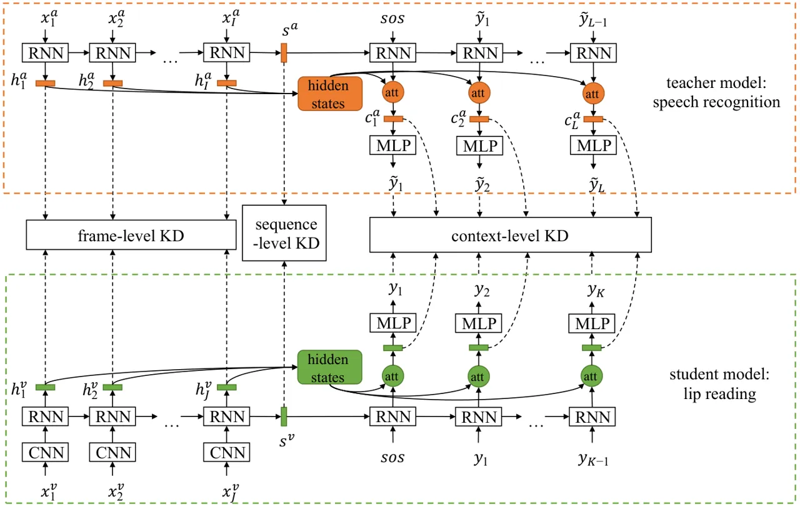

Figure 1: The framework of LIBS. The student network deals with lip
reading, and the teacher handles speech recognition. Knowledge is
distilled at sequence-, context-, and frame-level to enable the features
of multi-granularity to be transferred from teacher network to student.
KD is short for knowledge distillation.

Here we briefly review the attention-based sequence-to-sequence model
\[\citeauthoryearBahdanau, Cho, and Bengio2015\].

Let $`\textbf{x}=[x_{1},...,x_{I}]`$, $`\textbf{y}=[y_{1},...,y_{K}]`$
be the input and target sequence with a length of $`I`$ and $`K`$
respectively. Sequence-to-sequence model parameterizes the probability
$`p(\textbf{y}|\textbf{x})`$ with an encoder neural network and a
decoder neural network. The encoder transforms the input sequence
$`x_{1},...,x_{I}`$ into a sequence of hidden state
$`h^{x}_{1},...,h^{x}_{I}`$ and produces the fixed-dimensional state
vector $`s^{x}`$, which contains the semantic meaning of the input
sequence. We also called $`s^{x}`$ the sequence vector in this paper.

```math
h^{x}_{i}={\rm RNN}(x_{i},h^{x}_{i-1}), \tag{1}
```

```math
s^{x}=h^{x}_{I}. \tag{2}
```

The decoder computes the probability of the target sequence conditioned
on the outputs of the encoder. Specifically, given the input sequence
and previously generated target sequence $`y_{<k}`$, the conditional
probability of generating the target $`y_{k}`$ at timestep $`k`$ is
decided by:

```math
\begin{split}p(y_{k}|y_{<k},\textbf{x})=g(y_{k-1},h^{d}_{k},c^{x}_{k}),\\
h^{d}_{k}={\rm RNN}(h^{d}_{k-1},y_{k-1},c^{x}_{k}),\end{split} \tag{3}
```

where $`g`$ is the softmax function, $`h^{d}_{k}`$ is the hidden state
of decoder RNN at timestep $`k`$, and $`c^{x}_{k}`$ is the context
vector calculated by an attention mechanism. Attention mechanism allows
the decoder to attend to different parts of the input sequence at each
step of output generation.

Concretely, the context vector is calculated by weighting each encoder
hidden state $`h^{x}_{i}`$ according to the similarity distribution
$`\alpha_{k}`$:

```math
c^{x}_{k}=\sum^{I}_{i=1}\alpha_{ki}h^{x}_{i}, \tag{4}
```

The similarity distribution $`\alpha_{k}`$ signifies the proximity
between $`h^{d}_{k-1}`$ and each $`h^{x}_{i}`$, and is calculated by:

```math
\alpha_{ki}=\frac{exp(f(h^{d}_{k-1},h^{x}_{i}))}{\sum^{I}_{j=1}exp(f(h^{d}_{k-1},h^{x}_{j}))}. \tag{5}
```

$`f`$ calculates the unnormalized similarity between $`h^{d}_{k-1}`$ and
$`h^{x}_{i}`$, usually in the following ways:

```math
f(h^{d}_{k-1},h^{x}_{i})=\left\{\begin{array}[]{ll}(h^{d}_{k-1})^{T}h^{x}_{i},&{\rm dot}\\
(h^{d}_{k-1})^{T}Wh^{x}_{i},&{\rm general}\\
v^{t}{\rm tanh}(W[h^{d}_{k-1},h^{x}_{i}]),&{\rm concat}\end{array}\right. \tag{6}
```

## Proposed Method

The framework of LIBS is illustrated in Figure 1. Both the speech
recognizer and the lip reader are based on the attention-based
sequence-to-sequence architecture. For an input video,
$`\textbf{x}^{v}=[x^{v}_{1},...,x^{v}_{J}]`$ represents its video frame
sequence, $`\textbf{y}=[y_{1},...,y_{K}]`$ is the target character
sequence. The corresponding audio frame sequence is
$`\textbf{x}^{a}=[x^{a}_{1},...,x^{a}_{I}]`$. A pre-trained speech
recognizer reads in the audio frame sequence $`\textbf{x}^{a}`$, and
outputs the predicted character sequence
$`\tilde{\textbf{y}}=[\tilde{y}_{1},...,\tilde{y}_{L}]`$. It should be
noted that the sentence predicted by speech recognizer is imperfect, and
$`L`$ may not equal to $`K`$. At the same time, the encoder hidden
states $`\textbf{h}^{a}=[h^{a}_{1},...,h^{a}_{I}]`$, sequence vector
$`s^{a}`$, and context vectors
$`\textbf{c}^{a}=[c^{a}_{1},...,c^{a}_{L}]`$ can also be obtained. They
are used to guide the training of the lip reader.

The basic lip reader is trained to maximize conditional probability
distribution $`p(\textbf{y}|\textbf{x}^{v})`$, which equals to minimize
the loss function:

```math
L_{base}=-\sum^{K}_{k=1}\log p(y_{k}|y_{<k},\textbf{x}^{v}). \tag{7}
```

The encoder hidden states, sequence vector and context vectors of the
lip reader are denoted as $`\textbf{h}^{v}=[h^{v}_{1},...,h^{v}_{J}]`$,
$`s^{v}`$, and $`\textbf{c}^{v}=[c^{v}_{1},...,c^{v}_{K}]`$,
respectively.

The proposed method LIBS aims to minimize the loss function:

```math
L=L_{base}+\lambda_{1}L_{KD1}+\lambda_{2}L_{KD2}+\lambda_{3}L_{KD3}, \tag{8}
```

where $`L_{KD1}`$, $`L_{KD2}`$, and $`L_{KD3}`$ constitute the
multi-granularity knowledge distillation, and work at sequence-level,
context-level and frame-level respectively. $`\lambda_{1},\lambda_{2}`$
and $`\lambda_{3}`$ are the corresponding balance weights. Details are
described below.

### Sequence-Level Knowledge Distillation

As mentioned before, the sequence vector $`s^{x}`$ contains the semantic
information of the input sequence. For a video frame sequence
$`\textbf{x}^{v}`$ and its corresponding audio frame sequence
$`\textbf{x}^{a}`$, their sequence vectors $`s^{a}`$ and $`s^{v}`$
should be the same, because they are different expressions of the same
thing.

Therefore, the sequence-level knowledge distillation is denoted as :

```math
L_{KD1}=\left\|s^{a}-t(s^{v})\right\|_{2}^{2}. \tag{9}
```

$`t`$ is a simple transformation function (for example a linear or
affine function), which embeds features into a space with the same
dimension.

### Context-Level Knowledge Distillation

When decoder predicting a character at a certain timestep, the attention
mechanism uses context vector to summarize the input information that is
most relevant to the current output. Therefore, if the lip reader and
speech recognizer predict the same character at $`j`$-th timestep, the
context vectors $`c^{v}_{j}`$ and $`c^{a}_{j}`$ should contain the same
information. Naturally, the context-level knowledge distillation should
push $`c^{v}_{j}`$ and $`c^{a}_{j}`$ to be the same.

However, due to the imperfect speech-recognition predictions, it’s
possible that $`\tilde{y}_{j}`$ and $`y_{j}`$ may not be the same.
Simply making $`c^{v}_{j}`$ and $`c^{a}_{j}`$ similar would hinder the
performance of lip reader. This requires choosing the correct characters
from the speech-recognition predictions, and using the corresponding
context vectors for knowledge distillation. Besides, in current
attention mechanism, the context vectors are built upon the RNN hidden
state vectors, which act as representations of prefix substrings of the
input sentences, given the sequential nature of RNN computation
\[\citeauthoryearWu et al.2018\]. Thus, even if there are same
characters in the predicted sentence, their corresponding context
vectors are different because of their different positions.

Based on these findings, a Longest Common Subsequence (LCS) ¹¹ 1
https://en.wikipedia.org/wiki/Longest˙common˙subsequence˙problem based
filtering method is proposed to refine the distilled features. LCS is
used to compare two sequences. Common subsequences with same order in
the two sequences are found, and the longest sequence is selected. The
most important aspects of LCS are that the common subsequence is not
necessary to be contiguous, and it retains the relative position
information between characters. Formally speaking, LCS computes the
common subsequence between
$`\tilde{\textbf{y}}=[\tilde{y}_{1},...,\tilde{y}_{L}]`$ and
$`\textbf{y}=[y_{1},...,y_{K}]`$, and obtains the subscripts of the
corresponding characters in $`\tilde{\textbf{y}}`$ and y:

```math
\displaystyle{I}^{a}_{1},...,{I}^{a}_{M},{I}^{v}_{1},...,{I}^{v}_{M} \displaystyle={\rm LCS}(\tilde{y}_{1},...,\tilde{y}_{L},y_{1},...,y_{K}), \tag{10}
```

```math
\displaystyle M \displaystyle\leq\min(L,K),
```

where $`{I}^{a}_{1},...,{I}^{a}_{M}`$ and
$`{I}^{v}_{1},...,{I}^{v}_{M}`$ are the subscripts in the sentence
predicted by speech recognizer and the ground truth sentence,
respectively. Please refer to the supplementary material for details.
It’s worth noting that when the sentence is Chinese, two characters are
defined to be the same if they have the same Pinyin. Pinyin is the
phonetic symbol of Chinese character, and homophones account for more
than 85% among all Chinese characters.

Context-level knowledge distillation only calculate on these common
characters:

```math
L_{KD2}=\frac{1}{M}\sum^{M}_{i=1}\left\|c^{a}_{{I}^{a}_{i}}-t(c^{v}_{{I}^{v}_{i}})\right\|_{2}^{2}. \tag{11}
```

### Frame-Level Knowledge Distillation

Furthermore, we hope that the speech recognizer can teach the lip reader
more finely and explicitly. Specifically, knowledge is distilled at
frame-level to enhance the discriminability of each video frame feature.

If the correspondence between video and audio is known, then it is
sufficient to directly match the video frame feature with the
corresponding audio feature. However, due to the different sampling
rates, video sequence and audio sequence have inconsistent length.
Besides, since blanks may appear at the beginning or end of the data,
there is no guarantee that video and audio are strictly synchronized.
Therefore, it is impossible to specify the correspondence artificially.
This problem is solved by first learning the correspondence between
video and audio, then performing the frame-level knowledge distillation.

As the hidden states of RNN providing higher-level semantics and are
easier to correlated than the original input feature
\[\citeauthoryearSterpu, Saam, and Harte2018\], the alignment between
audio and video is learned on the hidden states of the audio encoder and
video encoder. Formally speaking, for each audio hidden state
$`h^{a}_{i}`$, the most similar video frame feature is calculated by a
way similar to the attention mechanism:

```math
\tilde{h}^{v}_{i}=\sum^{J}_{j=1}\beta_{ji}h^{v}_{j}, \tag{12}
```

$`\beta_{ji}`$ is the normalized similarity between $`h^{a}_{i}`$ and
video encoder hidden states $`h^{v}_{j}`$:

```math
\beta_{ji}=\frac{exp((h^{v}_{j})^{T}Wh^{a}_{i})}{\sum^{J}_{k=1}exp((h^{v}_{k})^{T}Wh^{a}_{i})}. \tag{13}
```

Since $`\tilde{h}^{v}_{i}`$ contains the most similar information to
audio feature $`h^{a}_{i}`$ and the acoustic speech signals embody
information complementary to the visual ones, making
$`\tilde{h}^{v}_{i}`$ and $`h^{a}_{i}`$ the same enhances lip reader’s
capability to extract discriminant visual feature. Thus, the frame-level
knowledge distillation is defined as:

```math
L_{KD3}=\frac{1}{I}\sum^{I}_{i=1}\left\|h^{a}_{i}-\tilde{h}^{v}_{i}\right\|_{2}^{2}. \tag{14}
```

The audio and video modalities can have two-way interactions. However,
in the preliminary experiment, we found that video attending audio leads
to inferior performance. So, only audio attending video is chosen to
perform the frame-level knowledge distillation.

## Experiments

### Datasets

CMLR²² 2 https://www.vipazoo.cn/CMLR.html \[\citeauthoryearZhao, Xu, and
Song2019\]: it is currently the largest Chinese Mandarin lip reading
dataset. It contains over 100,000 natural sentences from China Network
Television website, including more than 3,000 Chinese characters and
20,000 phrases.  
LRS2³³ 3
http://www.robots.ox.ac.uk/˜vgg/data/lip˙reading/lrs2.html \[\citeauthoryearAfouras
et al.2018\]: it contains more than 45,000 spoken sentences from BBC
television. LRS2 is divided into development (train/val) and test sets
according to the broadcast date. The dataset has a ”pre-train” set that
contains sentences annotated with the alignment boundaries of every
word.

We follow the provided dataset partition in experiments.

### Evaluation Metrics

For experiments on LRS2 dataset, we report the Character Error Rate
(CER), Word Error Rate (WER) and BLEU \[\citeauthoryearPapineni et
al.2002\]. The CER and WER are defined as $`ErrorRate=(S+D+I)/N`$, where
$`S`$ is the number of substitutions, $`D`$ is the number of deletions,
$`I`$ is the number of insertions to get from the reference to the
hypothesis and $`N`$ is the number of characters (words) in the
reference. BLEU is a modified form of n-gram precision to compare a
candidate sentence to one or more reference sentences. Here, the unigram
BLEU is used. For experiments on CMLR dataset, only CER and BLEU are
reported, since the Chinese sentence is presented as a continuous string
of characters without demarcation of word boundaries.

### Training Strategy

Same as \[\citeauthoryearChung et al.2017\], curriculum learning is
employed to accelerate training and reduce over-fitting. Since the
training sets of CMLR and LRS2 are not annotated with the word
boundaries, the sentences are grouped into subsets according to the
length. We start training on short sentences and then make the sequence
length grow as the network trains. Scheduled sampling
\[\citeauthoryearBengio et al.2015\] is used to eliminate the
discrepancy between training and inference. The sampling rate from the
previous output is selected from 0.7 to 1 for CMLR dataset, and from 0
to 0.25 for LRS2 dataset. For fair comparisons, decoding is performed
with beam search of width 1 for CMLR and 4 for LRS2, in a similar way to
\[\citeauthoryearChan et al.2016\].

However, preliminary experimental results show that the
sequence-to-sequence based model is hard to achieve reasonable results
on the LRS2 dataset. This is because even the shortest English sentence
contains 14 characters, which is still difficult for the decoder to
extract relevant information from all input steps at the beginning of
the training. Therefore, a pre-training stage is added for LRS2 dataset
as in \[\citeauthoryearAfouras et al.2018\]. When pre-training, the CNN
pre-trained on word excerpts from the MV-LRS \[\citeauthoryearChung and
Zisserman2017\] dataset is used to extract visual features for the
pre-train set. The lip reader is trained on these frozen visual
features. Pre-training starts with a single word, then gradually
increases to a maximum length of 16 words. After that, the model is
trained end-to-end on the training set.

### Implementation Details

### Lip Reader

CMLR: The input images are 64 $`\times`$ 128 in dimension. VGG-M
model\[\citeauthoryearChatfield et al.2014\] is used to extract visual
features. Lip frames are transformed into gray-scale, and the VGG-M
network takes every 5 lip frames as an input, moving 2 frames at each
timestep. We use a two-layer bi-directional GRU \[\citeauthoryearCho et
al.2014\] with a cell size of 256 for the encoder and a two-layer
uni-directional GRU with a cell size of 512 for the decoder. For
character vocabulary, characters that appear more than 20 times are
kept. \[sos\], \[eos\] and \[pad\] are also included. The final
vocabulary size is 1,779. The initial learning rate was 0.0003 and
decreased by 50% every time the training error did not improve for 4
epochs. Warm-up \[\citeauthoryearHe et al.2016\] is used to prevent
over-fitting.  
LRS2: The input images are 112 $`\times`$ 112 pixels covering the region
around the mouth. The CNN used to extract visual features is based on
\[\citeauthoryearStafylakis and Tzimiropoulos2017\], with a filter width
of 5 frames in 3D convolutions. The encoder contains 3 layers of
bi-directional LSTM \[\citeauthoryearHochreiter and Schmidhuber1997\]
with a cell size of 256, and the decoder contains 3 layers of
uni-directional LSTM with a cell size of 512. The output size of lip
reader is 29, containing 26 letters and tokens for \[sos\], \[eos\],
\[pad\]. The initial learning rate was 0.0008 for pre-training, 0.0001
for training, and decreased by 50% every time the training error did not
improve for 3 epochs.

The balance weights used in both datasets are shown in Table 1. The
values are obtained by conducting a grid search.

| Dataset | $`\lambda_{1}`$ | $`\lambda_{2}`$ | $`\lambda_{3}`$ |
| ------- | --------------- | --------------- | --------------- |
| CMLR    | 10              | 40              | 10              |
| LRS2    | 2               | 10              | 10              |

Table 1: The balance weights employed in CMLR and LRS2 datasets.

### Speech Recognizer

The datasets used to train speech recognizers are the audio of the CMLR
and LRS2 datasets, plus additional speech data: aishell
\[\citeauthoryearBu et al.2017\] for CMLR, and LibriSpeech
\[\citeauthoryearPanayotov et al.2015\] for LRS2. The 240-dimensional
fbank feature is used as the speech feature, sampled at 16kHz and
calculated over 25ms windows with a step size 10ms. For LRS2 dataset,
the speech recognizer and lip reader have the same architecture. For
CMLR dataset, specifically, three different speech recognizer
architectures are considered to verify the generalization of LIBS.  
Teacher 1: It contains 2 layers of bi-directional GRU for encoder with a
cell size of 256, 2 layers of uni-directional GRU for decoder with a
cell size 512. In other words, it has the same architecture as lip
reader.  
Teacher 2: The cell size of both encoder and decoder is 512. Others
remain the same as Teacher 1.  
Teacher 3: The encoder contains 3 layers of pyramid bi-directional GRU
\[\citeauthoryearChan et al.2016\]. Others remain the same as Teacher

1.  It’s worth noting that Teacher 2 and the lip reader have different
    feature dimensions, and Teacher 3 reduces the audio time resolution by 8
    times.

### Experimental Results

#### Effect of different teacher models.

| Model     | BLEU  | CER    |
| --------- | ----- | ------ |
| WAS       | 64.13 | 38.93% |
| Teacher 1 | 90.36 | 9.83%  |
| LIBS      | 69.99 | 31.27% |
| Teacher 2 | 90.95 | 9.23%  |
| LIBS      | 66.66 | 34.94% |
| Teacher 3 | 87.73 | 12.40% |
| LIBS      | 66.58 | 34.76% |

Table 2: The performance of LIBS when using different teacher models on
the CMLR dataset.

To evaluate the generalization of the proposed multi-granularity
knowledge distillation method, we compare the effects of LIBS on the
CMLR dataset under different teacher models. Since WAS
\[\citeauthoryearChung et al.2017\] and the baseline lip reader (trained
without knowledge distillation) have the same sequence-to-sequence
architecture, WAS is trained using the same training strategy as LIBS,
and is used interchangeably with baseline in the paper. As can be seen
from Table 2, LIBS substantially exceeds the baseline under different
teacher model architectures. It is worth noting that although the
performance of Teacher 2 is better than that of Teacher 1, the
corresponding student network is not. This is because the feature
dimensions of Teacher 2 speech recognizer and lip reader are different.
This implies that distill knowledge directly in the same dimensional
feature space can achieve better results. In the following experiments,
we analyze the lip reader learned from Teacher 1 on the CMLR dataset.

#### Effect of the multi-granularity knowledge distillation.

|                          |       |        |        |
| ------------------------ | ----- | ------ | ------ |
| Methods                  | BLEU  | CER    | WER    |
| CMLR                     |       |        |        |
| WAS                      | 64.13 | 38.93% | -      |
| WAS $`+L_{KD1}`$         | 67.23 | 34.42% | -      |
| WAS $`+L_{KD2}`$         | 68.24 | 33.17% | -      |
| WAS $`+L_{KD3}`$         | 66.31 | 35.30% | -      |
| WAS $`+L_{KD1}+L_{KD2}`$ | 68.53 | 32.95% | -      |
| LIBS                     | 69.99 | 31.27% | -      |
| LRS2                     |       |        |        |
| WAS                      | 39.72 | 48.28% | 68.19% |
| WAS $`+L_{KD1}`$         | 41.00 | 46.04% | 66.59% |
| WAS $`+L_{KD2}`$         | 41.23 | 46.01% | 66.31% |
| WAS $`+L_{KD3}`$         | 41.18 | 46.91% | 66.65% |
| WAS $`+L_{KD1}+L_{KD2}`$ | 41.55 | 45.97% | 65.93% |
| LIBS                     | 41.91 | 45.53% | 65.29% |

Table 3: Effect of the proposed multi-granularity knowledge
distillation.

Table 3 shows the effect of the multi-granularity knowledge distillation
on CMLR and LRS2 datasets. Comparing WAS, WAS $`+L_{KD1}`$, WAS
$`+L_{KD1}+L_{KD2}`$ and LIBS, all metrics are increasing along with
adding different granularity of knowledge distillation. The increasing
results show that each granularity of knowledge distillation is able to
contribute to the performance of LIBS. However, the smaller and smaller
extent of the increase does not indicate that the sequence-level
knowledge distillation has greater influence than the frame-level
knowledge distillation. When only one granularity of knowledge
distillation is added, WAS $`+L_{KD2}`$ shows the best performance. This
is due to the design that the context-level knowledge distillation is
directly acting on the features used to predict characters.

On the CMLR dataset, LIBS exceeds WAS by a margin of 7.66% in CER.
However, the margin is not that large on the LRS2 dataset, only 2.75%.
This may be caused by the differences in the training strategy. On LRS2
dataset, CNN is first pre-trained on the MV-LRS dataset. Pre-training
gives CNN a good initial value so that better video frame feature can be
extracted during the training process. To verify this, we compare WAS
and LIBS trained without the pre-training stage. The CER of WAS and LIBS
are 67.64% and 62.91% respectively, with a larger margin of 4.73%. This
confirms the hypothesis that LIBS can help to extract more effective
visual features.

#### Effect of different amount of training data.

[TABLE]

Table 4: The performance of LIBS when trained with different amount of
training data on the CMLR dataset.

Compared with lip video data, the speech data is easier to collect. We
evaluate the effect of LIBS in the case of limited lip video data on
CMLR dataset. As mentioned before, the sentences are grouped into
subsets according to the length, and only the first subset is used to
train the lip reader. The first subset is about 20% of the full training
set, which contains 27,262 sentences, and the number of characters in
each sentence does not exceed 11. It can be seen from the Table 4, when
the training data is limited, LIBS tends to yield an even greater
performance gain: the improvement on CER increases from 7.66% to 9.63%,
and from 5.86 to 7.96 on BLEU.

#### Comparison with state-of-the-art methods.

|               |       |        |        |
| ------------- | ----- | ------ | ------ |
| Methods       | BLEU  | CER    | WER    |
| CMLR          |       |        |        |
| WAS           | 64.13 | 38.93% | -      |
| CSSMCM        | -     | 32.48% | -      |
| LIBS          | 69.99 | 31.27% | -      |
| LRS2          |       |        |        |
| WAS           | 39.72 | 48.28% | 68.19% |
| TM-seq2seq    | -     | -      | 49.8%  |
| CTC/Attention | -     | 42.1%  | 63.5%  |
| LIBS          | 41.91 | 45.53% | 65.29% |

Table 5: Performance comparison with other existing frameworks on the
CMLR and LRS2 datasets.

(a) WAS

(b) WAS $`+L_{KD1}`$

(c) WAS $`+L_{KD1}+L_{KD2}`$

(d) LIBS

Figure 2: Alignment between the video frames and the predicted
characters with different levels of the proposed multi-granularity
knowledge distillation. The vertical axis represents the video frames
and the horizontal axis represents the predicted characters. The ground
truth sentence is set up by the government.

|                                                           |                                                           |                                                           |                                                           |                                                           |                                                           |                                                           |                                                           |                                                            |                                                            |                                                            |                                                            |                                                            |
| --------------------------------------------------------- | --------------------------------------------------------- | --------------------------------------------------------- | --------------------------------------------------------- | --------------------------------------------------------- | --------------------------------------------------------- | --------------------------------------------------------- | --------------------------------------------------------- | ---------------------------------------------------------- | ---------------------------------------------------------- | ---------------------------------------------------------- | ---------------------------------------------------------- | ---------------------------------------------------------- |
| 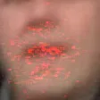 | 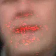 | 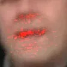 | 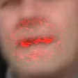 | 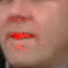 | 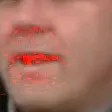 | 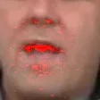 | 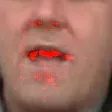 |  | 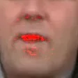 | 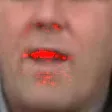 | 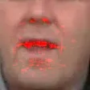 | 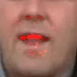 |

(a) WAS

|                                                            |                                                            |                                                            |                                                            |                                                            |                                                            |                                                            |                                                            |                                                            |                                                            |                                                            |                                                            |                                                            |
| ---------------------------------------------------------- | ---------------------------------------------------------- | ---------------------------------------------------------- | ---------------------------------------------------------- | ---------------------------------------------------------- | ---------------------------------------------------------- | ---------------------------------------------------------- | ---------------------------------------------------------- | ---------------------------------------------------------- | ---------------------------------------------------------- | ---------------------------------------------------------- | ---------------------------------------------------------- | ---------------------------------------------------------- |
| 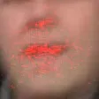 | 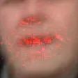 | 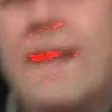 | 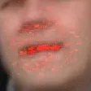 | 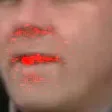 | 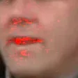 | 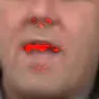 | 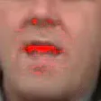 | 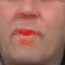 |  | 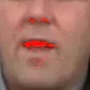 | 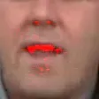 | 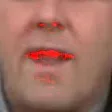 |

(b) LIBS

Figure 3: Saliency maps for WAS and LIBS. The places where the lip
reader has learned to attend are highlighted in red .

Table 5 shows the experimental results compared with other frameworks:
WAS \[\citeauthoryearChung et al.2017\], CSSMCM \[\citeauthoryearZhao,
Xu, and Song2019\], TM-seq2seq \[\citeauthoryearAfouras et al.2018\] and
CTC/attention \[\citeauthoryearPetridis et al.2018\]. TM-seq2seq
achieves the lowest WER on the LRS2 dataset due to its transformer
self-attention architecture \[\citeauthoryearVaswani et al.2017\]. Since
LIBS is designed for the sequence-to-sequence architecture, performance
may be improved by replacing RNN with transformer self-attention block.
Note that, despite the excellent performance of CSSMCM, which is
designed for Chinese Mandarin lip reading, LIBS still exceeds it by a
margin of 1.21% in CER.

### Visualization

#### Attention visualization.

The attention mechanism generates explicit alignment between the input
video frames and the generated character outputs. Since the
correspondence between the input video frames and the generated
character outputs is monotonous in time, whether alignment has a
diagonal trend is a reflection of the performance of the model
\[\citeauthoryearWang et al.2017\]. Figure 2 visualizes the alignment of
the video frames and the corresponding outputs with different
granularities of knowledge distillation on the test set of LRS2 dataset.
Comparing Figure 2(a) with Figure 2(b), adding sequence-level knowledge
distillation improves the quality of the end part of the generated
sentence. This indicates that the lip reader enhances its understanding
of the semantic information of the whole sentence. Adding context-level
knowledge distillation (Figure 2(c)) allows the attention at each
decoder step to be concentrated around the corresponding video frames,
reducing the focus on unrelated frames. This also makes the predicted
characters more accurate. Finally, the frame-level knowledge
distillation (Figure 2(d)) further improves the discriminability of the
video frame features, making the attention more focused. The quality and
the comprehensibility of the generated sentence is increased along with
adding different levels of knowledge distillation.

#### Saliency maps.

Saliency visualization technique is employed to verify that LIBS
enhances lip reader’s ability to extract discriminant visual features,
by showing areas in the video frames the model concentrated most when
predicting. Figure 3 shows saliency visualisations for the baseline
model and LIBS respectively, based on \[\citeauthoryearSmilkov et
al.2017\]. Both the baseline model and LIBS can correctly focus on the
area around the mouth, but the salient regions for baseline model are
more scattered compared with LIBS.

## Conclusion

In this paper, we propose LIBS, an innovative and effective approach to
training lip reading by learning from a pre-trained speech recognizer.
LIBS distills speech-recognizer knowledge of multiple granularities,
from sequence-, context-, and frame-level, to guide the learning of the
lip reader. Specifically, this is achieved by introducing a novel
filtering strategy to refine the features from the speech recognizer,
and by adopting a cross-modal alignment-based method for frame-level
knowledge distillation to account for the sampling-rate inconsistencies
between the two sequences. Experimental results demonstrate that the
proposed LIBS yields a considerable improvement over the state of the
art, especially when the training samples are limited. In our future
work, we look forward to adopting the same framework to other modality
pairs such as speech and sign language.

## Acknowledgements

This work is supported by National Key Research and Development Program
(2016YFB1200203) , National Natural Science Foundation of China
(61976186), Key Research and Development Program of Zhejiang Province
(2018C01004), and the Major Scientifc Research Project of Zhejiang Lab
(No. 2019KD0AC01) .

## References

- \[\citeauthoryearAfouras et al.2018\] Afouras, T.; Chung, J. S.;
  Senior, A. W.; Vinyals, O.; and Zisserman, A. 2018. Deep audio-visual
  speech recognition. IEEE Transactions on Pattern Analysis and Machine
  Intelligence.
- \[\citeauthoryearAssael et al.2016\] Assael, Y. M.; Shillingford, B.;
  Whiteson, S.; and de Freitas, N. 2016. Lipnet: Sentence-level
  lipreading. arXiv preprint.
- \[\citeauthoryearBahdanau, Cho, and Bengio2015\] Bahdanau, D.; Cho,
  K.; and Bengio, Y. 2015. Neural machine translation by jointly
  learning to align and translate. International Conference on Learning
  Representations.
- \[\citeauthoryearBengio et al.2015\] Bengio, S.; Vinyals, O.; Jaitly,
  N.; and Shazeer, N. M. 2015. Scheduled sampling for sequence
  prediction with recurrent neural networks. In International Conference
  on Neural Information Processing Systems - Volume 1.
- \[\citeauthoryearBu et al.2017\] Bu, H.; Du, J.; Na, X.; Wu, B.; and
  Zheng, H. 2017. Aishell-1: An open-source mandarin speech corpus and
  a speech recognition baseline. In 2017 20th Conference of the Oriental
  Chapter of the International Coordinating Committee on Speech
  Databases and Speech I/O Systems and Assessment.
- \[\citeauthoryearChan et al.2016\] Chan, W.; Jaitly, N.; Le, Q.; and
  Vinyals, O. 2016. Listen, attend and spell: A neural network for
  large vocabulary conversational speech recognition. In IEEE
  International Conference on Acoustics, Speech and Signal Processing.
- \[\citeauthoryearChatfield et al.2014\] Chatfield, K.; Simonyan, K.;
  Vedaldi, A.; and Zisserman, A. 2014. Return of the devil in the
  details: Delving deep into convolutional nets. arXiv preprint
  arXiv:1405.3531.
- \[\citeauthoryearCho et al.2014\] Cho, K.; van Merrienboer, B.;
  Gulcehre, C.; Bahdanau, D.; Bougares, F.; Schwenk, H.; and Bengio, Y. 2014. Learning phrase representations using rnn encoder–decoder for
  statistical machine translation. In Conference on Empirical Methods in
  Natural Language Processing.
- \[\citeauthoryearChorowski et al.2014\] Chorowski, J.; Bahdanau, D.;
  Cho, K.; and Bengio, Y. 2014. End-to-end continuous speech
  recognition using attention-based recurrent nn: First results. arXiv
  preprint arXiv:1412.1602.
- \[\citeauthoryearChung and Zisserman2017\] Chung, J. S., and
  Zisserman, A. 2017. Lip reading in profile. In Procedings of the
  British Machine Vision Conference 2017.
- \[\citeauthoryearChung et al.2017\] Chung, J. S.; Senior, A. W.;
  Vinyals, O.; and Zisserman, A. 2017. Lip reading sentences in the
  wild. In Proceedings of the IEEE conference on computer vision and
  pattern recognition.
- \[\citeauthoryearGraves et al.2006\] Graves, A.; Fernández, S.; Gomez,
  F.; and Schmidhuber, J. 2006. Connectionist temporal classification:
  labelling unsegmented sequence data with recurrent neural networks. In
  International Conference on Machine learning.
- \[\citeauthoryearGupta, Hoffman, and Malik2016\] Gupta, S.; Hoffman,
  J.; and Malik, J. 2016. Cross modal distillation for supervision
  transfer. In Proceedings of the IEEE conference on computer vision and
  pattern recognition.
- \[\citeauthoryearHe et al.2016\] He, K.; Zhang, X.; Ren, S.; and
  Sun, J. 2016. Deep residual learning for image recognition. In
  Proceedings of the IEEE conference on computer vision and pattern
  recognition.
- \[\citeauthoryearHinton, Vinyals, and Dean2015\] Hinton, G. E.;
  Vinyals, O.; and Dean, J. 2015. Distilling the knowledge in a neural
  network. arXiv preprint arXiv:1503.02531.
- \[\citeauthoryearHochreiter and Schmidhuber1997\] Hochreiter, S., and
  Schmidhuber, J. 1997. Long short-term memory. Neural computation
  9(8).
- \[\citeauthoryearHou et al.2019\] Hou, Y.; Ma, Z.; Liu, C.; and Loy,
  C. C. 2019. Learning to steer by mimicking features from
  heterogeneous auxiliary networks. In AAAI Conference on Artificial
  Intelligence.
- \[\citeauthoryearKim and Rush2016\] Kim, Y., and Rush, A. M. 2016.
  Sequence-level knowledge distillation. In Conference on Empirical
  Methods in Natural Language Processing.
- \[\citeauthoryearPanayotov et al.2015\] Panayotov, V.; Chen, G.;
  Povey, D.; and Khudanpur, S. 2015. Librispeech: an asr corpus based
  on public domain audio books. In 2015 IEEE International Conference on
  Acoustics, Speech and Signal Processing.
- \[\citeauthoryearPapineni et al.2002\] Papineni, K.; Roukos, S.; Ward,
  T.; and Zhu, W.-J. 2002. Bleu: a method for automatic evaluation of
  machine translation. In Annual Meeting of the Association for
  Computational Linguistics.
- \[\citeauthoryearPetridis et al.2018\] Petridis, S.; Stafylakis, T.;
  Ma, P.; Tzimiropoulos, G.; and Pantic, M. 2018. Audio-visual speech
  recognition with a hybrid ctc/attention architecture. In 2018 IEEE
  Spoken Language Technology Workshop (SLT), 513–520. IEEE.
- \[\citeauthoryearRomero et al.2014\] Romero, A.; Ballas, N.; Kahou,
  S. E.; Chassang, A.; Gatta, C.; and Bengio, Y. 2014. Fitnets: Hints
  for thin deep nets. arXiv preprint arXiv:1412.6550.
- \[\citeauthoryearShillingford et al.2018\] Shillingford, B.; Assael,
  Y.; Hoffman, M. W.; Paine, T.; Hughes, C.; Prabhu, U.; Liao, H.; Sak,
  H.; Rao, K.; Bennett, L.; et al. 2018. Large-scale visual speech
  recognition. arXiv preprint arXiv:1807.05162.
- \[\citeauthoryearSmilkov et al.2017\] Smilkov, D.; Thorat, N.; Kim,
  B.; Viégas, F.; and Wattenberg, M. 2017. Smoothgrad: removing noise
  by adding noise. arXiv preprint arXiv:1706.03825.
- \[\citeauthoryearStafylakis and Tzimiropoulos2017\] Stafylakis, T.,
  and Tzimiropoulos, G. 2017. Combining residual networks with lstms
  for lipreading. Proc. Interspeech 2017.
- \[\citeauthoryearSterpu, Saam, and Harte2018\] Sterpu, G.; Saam, C.;
  and Harte, N. 2018. Attention-based audio-visual fusion for robust
  automatic speech recognition. In Proceedings of the 2018 on
  International Conference on Multimodal Interaction.
- \[\citeauthoryearVaswani et al.2017\] Vaswani, A.; Shazeer, N.;
  Parmar, N.; Uszkoreit, J.; Jones, L.; Gomez, A. N.; Kaiser, Ł.; and
  Polosukhin, I. 2017. Attention is all you need. In Advances in neural
  information processing systems, 5998–6008.
- \[\citeauthoryearWang et al.2017\] Wang, Y.; Skerry-Ryan, R.; Stanton,
  D.; Wu, Y.; Weiss, R. J.; Jaitly, N.; Yang, Z.; Xiao, Y.; Chen, Z.;
  Bengio, S.; et al. 2017. Tacotron: Towards end-to-end speech
  synthesis. Proc. Interspeech 2017 4006–4010.
- \[\citeauthoryearWolff et al.1994\] Wolff, G. J.; Prasad, K. V.;
  Stork, D. G.; and Hennecke, M. 1994. Lipreading by neural networks:
  Visual preprocessing, learning, and sensory integration. In Advances
  in neural information processing systems.
- \[\citeauthoryearWu et al.2018\] Wu, L.; Tian, F.; Zhao, L.; Lai, J.;
  and Liu, T.-Y. 2018. Word attention for sequence to sequence text
  understanding. In Thirty-Second AAAI Conference on Artificial
  Intelligence.
- \[\citeauthoryearZhao, Xu, and Song2019\] Zhao, Y.; Xu, R.; and
  Song, M. 2019. A cascade sequence-to-sequence model for chinese
  mandarin lip reading. arXiv preprint arXiv:1908.04917.
