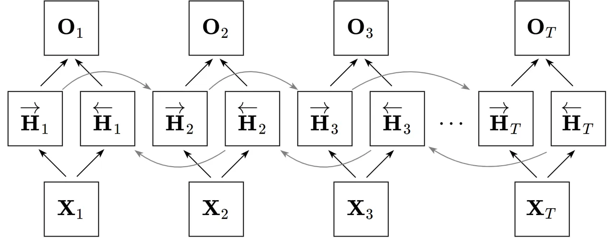
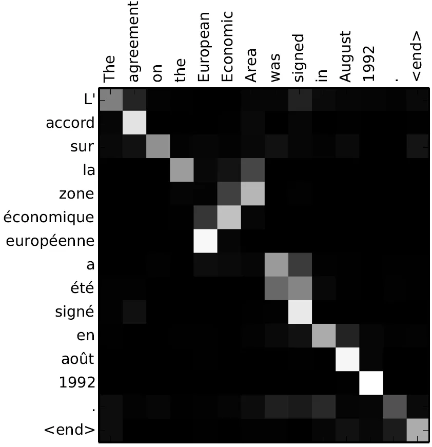
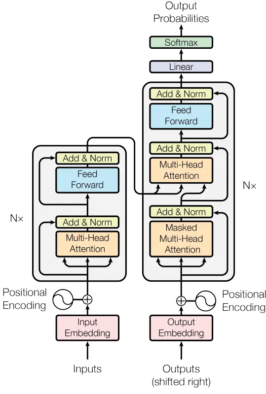
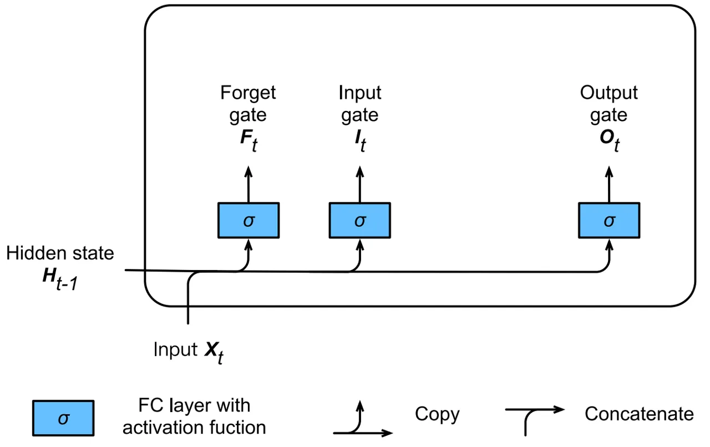
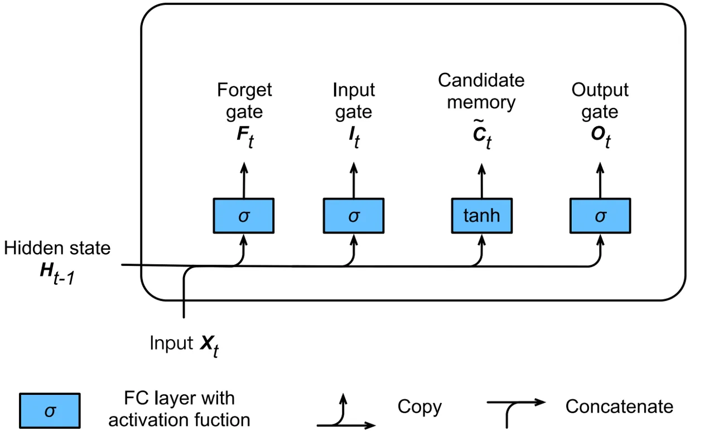
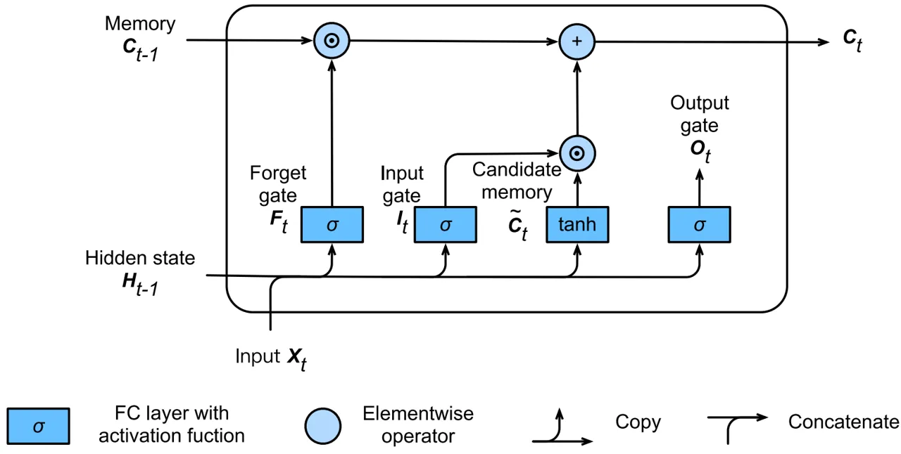
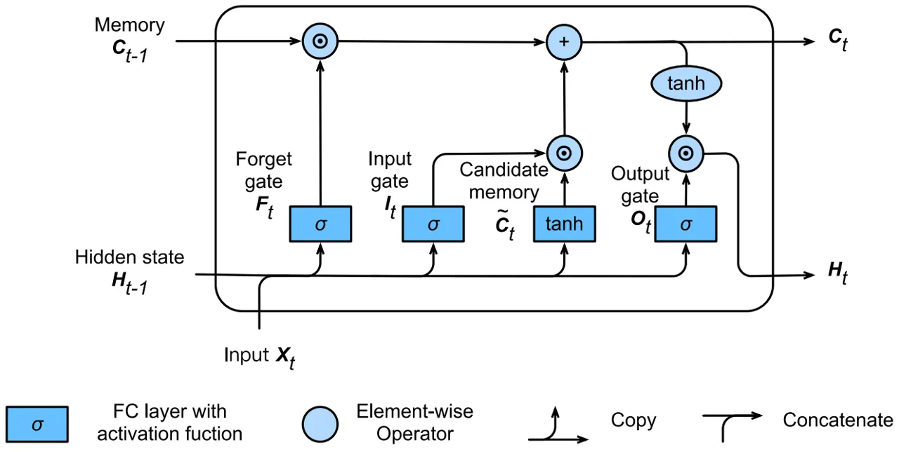
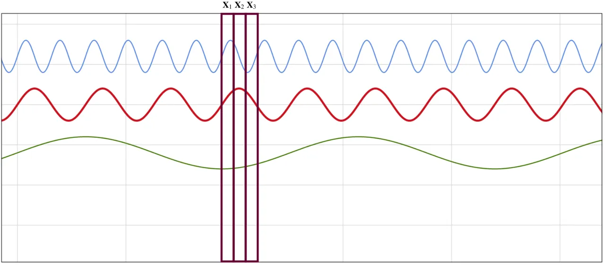

# Recurrent Neural Networks (RNNs): A gentle Introduction and Overview

Robin M. Schmidt Affiliation: Department of Computer Science
Affiliation: Eberhard-Karls-University Tübingen Affiliation: Tübingen,
Germany Email: [rob.schmidt@student.uni-tuebingen.de](mailto:)

###### Abstract

State-of-the-art solutions in the areas of “Language Modelling &
Generating Text”, “Speech Recognition”, “Generating Image Descriptions”
or “Video Tagging” have been using Recurrent Neural Networks as the
foundation for their approaches. Understanding the underlying concepts
is therefore of tremendous importance if we want to keep up with recent
or upcoming publications in those areas. In this work we give a short
overview over some of the most important concepts in the realm of
Recurrent Neural Networks which enables readers to easily understand the
fundamentals such as but not limited to “Backpropagation through Time”
or “Long Short-Term Memory Units” as well as some of the more recent
advances like the “Attention Mechanism” or “Pointer Networks”. We also
give recommendations for further reading regarding more complex topics
where it is necessary.

## 1 Introduction & Notation

Recurrent Neural Networks (RNNs) are a type of neural network
architecture which is mainly used to detect patterns in a sequence of
data. Such data can be handwriting, genomes, text or numerical time
series which are often produced in industry settings (e.g. stock markets
or sensors) Chung et al., 2015; Nicholson, 2019. However, they are also
applicable to images if these get respectively decomposed into a series
of patches and treated as a sequence Nicholson, 2019. On a higher level,
RNNs find applications in Language Modelling & Generating Text, Speech
Recognition, Generating Image Descriptions or Video Tagging. What
differentiates Recurrent Neural Networks from Feedforward Neural
Networks also known as Multi-Layer Perceptrons (MLPs) is how information
gets passed through the network. While Feedforward Networks pass
information through the network without cycles, the RNN has cycles and
transmits information back into itself. This enables them to extend the
functionality of Feedforward Networks to also take into account previous
inputs $`\mathbf{X}_{0:t-1}`$ and not only the current input
$`\mathbf{X}_{t}`$. This difference is visualised on a high level in
Figure 1. Note, that here the option of having multiple hidden layers is
aggregated to one Hidden Layer block $`\mathbf{H}`$. This block can
obviously be extended to multiple hidden layers.

Figure 1: Visualisation of differences between Feedfoward NNs und
Recurrent NNs

We can describe this process of passing information from the previous
iteration to the hidden layer with the mathematical notation proposed in
Zhang et al., 2019. For that, we denote the hidden state and the input
at time step $`t`$ respecively as
$`\mathbf{H}_{t}\in\mathbb{R}^{n\times h}`$ and
$`\mathbf{X}_{t}\in\mathbb{R}^{n\times d}`$ where $`n`$ is number of
samples, $`d`$ is the number of inputs of each sample and $`h`$ is the
number of hidden units. Further, we use a weight matrix
$`\mathbf{W}_{xh}\in\mathbb{R}^{d\times h}`$,
hidden-state-to-hidden-state matrix
$`\mathbf{W}_{hh}\in\mathbb{R}^{h\times h}`$ and a bias parameter
$`\mathbf{b}_{h}\in\mathbb{R}^{1\times h}`$. Lastly, all these
informations get passed to a activation function $`\phi`$ which is
usually a logistic sigmoid or tanh function to prepair the gradients for
usage in backpropagation. Putting all these notations together yields
Equation 1 as the hidden variable and Equation 2 as the output variable.

```math
\mathbf{H}_{t}=\phi_{h}\left(\mathbf{X}_{t}\mathbf{W}_{xh}+\mathbf{H}_{t-1}\mathbf{W}_{hh}+\mathbf{b}_{h}\right) \tag{1}
```

```math
\mathbf{O}_{t}=\phi_{o}\left(\mathbf{H}_{t}\mathbf{W}_{ho}+\mathbf{b}_{o}\right) \tag{2}
```

Since $`\mathbf{H}_{t}`$ recursively includes $`\mathbf{H}_{t-1}`$ and
this process occurs for every time step the RNN includes traces of all
hidden states that preceded $`\mathbf{H}_{t-1}`$ as well as
$`\mathbf{H}_{t-1}`$ itself.

If we compare that notation for RNNs with similar notation for
Feedforward Neural Networks we can clearly see the difference we
described earlier. In Equation 3 we can see the computation for the
hidden variable while Equation 4 shows the output variable.

```math
\mathbf{H}=\phi_{h}\left(\mathbf{X}\mathbf{W}_{xh}+\mathbf{b}_{h}\right) \tag{3}
```

```math
\mathbf{O}=\phi_{o}\left(\mathbf{HW}_{ho}+\mathbf{b}_{o}\right) \tag{4}
```

If you are familiar with training techniques for Feedforward Neural
Networks such as backpropagation one question which might arise is how
to properly backpropagate the error through a RNN. Here, a technique
called Backpropagation Through Time (BPTT) is used which gets described
in detail in the next section.

## 2 Backpropagation Through Time (BPTT) & Truncated BPTT

Backpropagation Through Time (BPTT) is the adaption of the
backpropagation algorithm for RNNs Zhang et al., 2019. In theory, this
unfolds the RNN to construct a traditional Feedfoward Neural Network
where we can apply backpropagation. For that, we use the same notations
for the RNN as proposed before.

When we forward pass our input $`\mathbf{X}_{t}`$ through the network we
compute the hidden state $`\mathbf{H}_{t}`$ and the output state
$`\mathbf{O}_{t}`$ one step at a time. We can then define a loss
function $`\mathcal{L}\left(\mathbf{O},\mathbf{Y}\right)`$ to describe
the difference between all outputs $`\mathbf{O}_{t}`$ and target values
$`\mathbf{Y}_{t}`$ as shown in Equation 5. This basically sums up every
loss term $`\ell_{t}`$ of each update step so far. This loss term
$`\ell_{t}`$ can have different definitions based on the specific
problem (e.g. Mean Squared Error, Hinge Loss, Cross Entropy Loss, etc.).

```math
\mathcal{L}\left(\mathbf{O},\mathbf{Y}\right)=\sum_{t=1}^{T}\ell_{t}\left(\mathbf{O}_{t},\mathbf{Y}_{t}\right) \tag{5}
```

Since we have three weight matrices $`\mathbf{W}_{xh}`$,
$`\mathbf{W}_{hh}`$ and $`\mathbf{W}_{ho}`$ we need to compute the
partial derivative w.r.t. to each of these weight matrices. With the
chain rule which is also used in normal backpropagation we get to the
result for $`\mathbf{W}_{ho}`$ shown in Equation 6.

```math
\frac{\partial\mathcal{L}}{\partial\mathbf{W}_{ho}}=\sum_{t=1}^{T}\frac{\partial\ell_{t}}{\partial\mathbf{O}_{t}}\cdot\frac{\partial\mathbf{O}_{t}}{\partial\phi_{o}}\cdot\frac{\partial\phi_{o}}{\mathbf{W}_{ho}}=\sum_{t=1}^{T}\frac{\partial\ell_{t}}{\partial\mathbf{O}_{t}}\cdot\frac{\partial\mathbf{O}_{t}}{\partial\phi_{o}}\cdot\mathbf{H_{t}} \tag{6}
```

For the partial derivative with respect to $`\mathbf{W}_{hh}`$ we get
the result shown in Equation 7.

```math
\frac{\partial\mathcal{L}}{\partial\mathbf{W}_{hh}}=\sum_{t=1}^{T}\frac{\partial\ell_{t}}{\partial\mathbf{O}_{t}}\cdot\frac{\partial\mathbf{O}_{t}}{\partial\phi_{o}}\cdot\frac{\partial\phi_{o}}{\partial\mathbf{H}_{t}}\cdot\frac{\partial\mathbf{H}_{t}}{\partial\phi_{h}}\cdot\frac{\partial\phi_{h}}{\partial\mathbf{W}_{hh}}=\sum_{t=1}^{T}\frac{\partial\ell_{t}}{\partial\mathbf{O}_{t}}\cdot\frac{\partial\mathbf{O}_{t}}{\partial\phi_{o}}\cdot\mathbf{W}_{ho}\cdot\frac{\partial\mathbf{H}_{t}}{\partial\phi_{h}}\cdot\frac{\partial\phi_{h}}{\partial\mathbf{W}_{hh}} \tag{7}
```

For the partial derivative with respect to $`\mathbf{W}_{xh}`$ we get
the result shown in Equation 8.

```math
\frac{\partial\mathcal{L}}{\partial\mathbf{W}_{xh}}=\sum_{t=1}^{T}\frac{\partial\ell_{t}}{\partial\mathbf{O}_{t}}\cdot\frac{\partial\mathbf{O}_{t}}{\partial\phi_{o}}\cdot\frac{\partial\phi_{o}}{\partial\mathbf{H}_{t}}\cdot\frac{\partial\mathbf{H}_{t}}{\partial\phi_{h}}\cdot\frac{\partial\phi_{h}}{\partial\mathbf{W}_{xh}}=\sum_{t=1}^{T}\frac{\partial\ell_{t}}{\partial\mathbf{O}_{t}}\cdot\frac{\partial\mathbf{O}_{t}}{\partial\phi_{o}}\cdot\mathbf{W}_{ho}\cdot\frac{\partial\mathbf{H}_{t}}{\partial\phi_{h}}\cdot\frac{\partial\phi_{h}}{\partial\mathbf{W}_{xh}} \tag{8}
```

Since each $`\mathbf{H}_{t}`$ depends on the previous time step we can
substitute the last part from above equations to get Equation 9 and
Equation 10.

```math
\frac{\partial\mathcal{L}}{\partial\mathbf{W}_{hh}}=\sum_{t=1}^{T}\frac{\partial\ell_{t}}{\partial\mathbf{O}_{t}}\cdot\frac{\partial\mathbf{O}_{t}}{\partial\phi_{o}}\cdot\mathbf{W}_{ho}\sum_{k=1}^{t}\frac{\partial\mathbf{H}_{t}}{\partial\mathbf{H}_{k}}\cdot\frac{\partial\mathbf{H}_{k}}{\partial\mathbf{W}_{hh}} \tag{9}
```

```math
\frac{\partial\mathcal{L}}{\partial\mathbf{W}_{xh}}=\sum_{t=1}^{T}\frac{\partial\ell_{t}}{\partial\mathbf{O}_{t}}\cdot\frac{\partial\mathbf{O}_{t}}{\partial\phi_{o}}\cdot\mathbf{W}_{ho}\sum_{k=1}^{t}\frac{\partial\mathbf{H}_{t}}{\partial\mathbf{H}_{k}}\cdot\frac{\partial\mathbf{H}_{k}}{\partial\mathbf{W}_{xh}} \tag{10}
```

The adapted part can then further be written as shown in Equation 11 and
Equation 12.

```math
\frac{\partial\mathcal{L}}{\partial\mathbf{W}_{hh}}=\sum_{t=1}^{T}\frac{\partial\ell_{t}}{\partial\mathbf{O}_{t}}\cdot\frac{\partial\mathbf{O}_{t}}{\partial\phi_{o}}\cdot\mathbf{W}_{ho}\sum_{k=1}^{t}\left(\mathbf{W}_{hh}^{\top}\right)^{t-k}\cdot\mathbf{H}_{k} \tag{11}
```

```math
\frac{\partial\mathcal{L}}{\partial\mathbf{W}_{xh}}=\sum_{t=1}^{T}\frac{\partial\ell_{t}}{\partial\mathbf{O}_{t}}\cdot\frac{\partial\mathbf{O}_{t}}{\partial\phi_{o}}\cdot\mathbf{W}_{ho}\sum_{k=1}^{t}\left(\mathbf{W}_{hh}^{\top}\right)^{t-k}\cdot\mathbf{X}_{k} \tag{12}
```

From here, we can see that we need to store powers of
$`\mathbf{W}_{hh}^{k}`$ as we proceed through each loss term
$`\ell_{t}`$ of the overall loss function $`\mathcal{L}`$ which can
become very large. For these large values this method becomes
numerically unstable since eigenvalues smaller than $`1`$ vanish and
eigenvalues larger than $`1`$ diverge Bengio et al., 1994. One method of
solving this problem is truncate the sum at a computationally convenient
size Zhang et al., 2019. When you do this, you’re using Truncated BPTT
Williams & Peng, 1990. This basically establishes an upper bound for the
number of time steps the gradient can flow back to Sutskever, 2013. One
can think of this upper bound as a moving window of past time steps
which the RNN considers. Anything before the cut-off time step doesn’t
get taken into account. Since BPTT basically unfolds the RNN to create a
new layer for each time step we can also think of this procedure as
limiting the number of hidden layers.

## 3 Problems of RNNs: Vanishing & Exploding Gradients

As in most neural networks, vanishing or exploding gradients is a key
problem of RNNs Nicholson, 2019. In Equation 9 and Equation 10 we can
see $`\frac{\partial\mathbf{H}_{t}}{\partial\mathbf{H}_{k}}`$ which
basically introduces matrix multiplication over the (potentially very
long) sequence, if there are small values ($`<1`$) in the matrix
multiplication this causes the gradient to decrease with each layer (or
time step) and finally vanish Chen, 2016. This basically stops the
contribution of states that happened far earlier than the current time
step towards the current time step Chen, 2016. Similarly, this can
happen in the opposite direction if we have large values ($`>1`$) during
matrix multiplication causing an exploding gradient which in result
values each weight too much and changes it heavily Chen, 2016.

This problem motivated the introduction of the long short term memory
units (LSTMs) to particularly handle the vanishing gradient problem.
This approach was able to outperform traditional RNNs on a variety of
tasks Chen, 2016. In the next section we want to go deeper on the
proposed structure of LSTMs.

## 4 Long Short-Term Memory Units (LSTMs)

Long Short-Term Memory Units (LSTMs) Hochreiter & Schmidhuber, 1997 were
designed to properly handle the vanishing gradient problem. Since they
use a more constant error, they allow RNNs to learn over a lot more time
steps (way over $`1000`$) Nicholson, 2019. To achieve that, LSTMs store
more information outside of the traditional neural network flow in
structures called gated cells Chen, 2016; Nicholson, 2019. To make
things work in an LSTM we use an output gate $`\mathbf{O}_{t}`$ to read
entries of the cell, an input gate $`\mathbf{I}_{t}`$ to read data into
the cell and a forget gate $`\mathbf{F}_{t}`$ to reset the content of
the cell. The computations for these gates are shown in Equation 13,
Equation 14 and Equation 15. For a more visual approach please see
Figure 8 in Appendix A.

```math
\mathbf{O}_{t}=\sigma\left(\mathbf{X}_{t}\mathbf{W}_{xo}+\mathbf{H}_{t-1}\mathbf{W}_{ho}+\mathbf{b}_{o}\right) \tag{13}
```

```math
\mathbf{I}_{t}=\sigma\left(\mathbf{X}_{t}\mathbf{W}_{xi}+\mathbf{H}_{t-1}\mathbf{W}_{hi}+\mathbf{b}_{i}\right) \tag{14}
```

```math
\mathbf{F}_{t}=\sigma\left(\mathbf{X}_{t}\mathbf{W}_{xf}+\mathbf{H}_{t-1}\mathbf{W}_{hf}+\mathbf{b}_{f}\right) \tag{15}
```

The shown equations use
$`\mathbf{W}_{xi},\mathbf{W}_{xf},\mathbf{W}_{xo}\in\mathbb{R}^{d\times h}`$
and
$`\mathbf{W}_{hi},\mathbf{W}_{hf},\mathbf{W}_{ho}\in\mathbb{R}^{h\times h}`$
as weight matrices while
$`\mathbf{b}_{i},\mathbf{b}_{f},\mathbf{b}_{o}\in\mathbb{R}^{1\times h}`$
are their respective biases. Further, they use the sigmoid activation
function $`\sigma`$ to transform the output $`\in(0,1)`$ which each
results in a vector with entries $`\in(0,1)`$.

Next, we need a candidate memory cell
$`\tilde{\mathbf{C}}_{t}\in\mathbb{R}^{n\times h}`$ which has a similar
computation as the previously mentioned gates but instead uses a tanh
activation function to have an output $`\in(-1,1)`$. Further, it again
has its own weights $`\mathbf{W}_{xc}\in\mathbb{R}^{d\times h}`$,
$`\mathbf{W}_{hc}\in\mathbb{R}^{h\times h}`$ and biases
$`\mathbf{b}_{c}\in\mathbb{R}^{1\times h}`$. The respective computation
is shown in Equation 16. See Figure 9 in Appendix A for a visualisation
of this enhancement.

```math
\tilde{\mathbf{C}}_{t}=\tanh\left(\mathbf{X}_{t}\mathbf{W}_{xc}+\mathbf{H}_{t-1}\mathbf{W}_{hc}+\mathbf{b}_{c}\right) \tag{16}
```

To plug some things together we introduce old memory content
$`\mathbf{C}_{t-1}\in\mathbb{R}^{n\times h}`$ which together with the
introduced gates controls how much of the old memory content we want to
preserve to get to the new memory content $`\mathbf{C}_{t}`$. This is
shown in Equation 17 where $`\odot`$ denotes element-wise
multiplication. The structure so far can be seen in Figure 10 in
Appendix A.

```math
\mathbf{C}_{t}=\mathbf{F}_{t}\odot\mathbf{C}_{t-1}+\mathbf{I}_{t}\odot\tilde{\mathbf{C}}_{t} \tag{17}
```

The last step is to introduce the computation for the hidden states
$`\mathbf{H}_{t}\in\mathbb{R}^{n\times h}`$ into the framework. This can
be seen in Equation 18.

```math
\mathbf{H}_{t}=\mathbf{O}_{t}\odot\tanh\left(\mathbf{C}_{t}\right) \tag{18}
```

With the tanh function we ensure that each element of $`\mathbf{H}_{t}`$
is $`\in(-1,1)`$. The full LSTM framework can be seen in Figure 11 in
Appendix A.

## 5 Deep Recurrent Neural Networks (DRNNs)

Deep Recurrent Neural Networks (DRNNs) are in theory a really easy
concept. To construct a deep RNN with $`L`$ hidden layers we simply
stack ordinary RNNs of any type on top of each other. Each hidden state
$`\mathbf{H}_{t}^{(\ell)}\in\mathbb{R}^{n\times h}`$ is passed to the
next time step of the current layer $`\mathbf{H}_{t+1}^{(\ell)}`$ as
well as the current time step of the next layer
$`\mathbf{H}_{t}^{(\ell+1)}`$. For the first layer we compute the hidden
state as proposed in the previous models shown shown in Equation 19
while for the subsequent layer we use Equation 20 where the hidden state
from the previous layer is treated as input.

```math
\mathbf{H}_{t}^{(1)}=\phi_{1}\left(\mathbf{X}_{t},\mathbf{H}_{t-1}^{(1)}\right) \tag{19}
```

```math
\mathbf{H}_{t}^{(\ell)}=\phi_{\ell}\left(\mathbf{H}_{t}^{(\ell-1)},\mathbf{H}_{t-1}^{(\ell)}\right) \tag{20}
```

The output $`\mathbf{O}_{t}\in\mathbb{R}^{n\times o}`$ where $`o`$ is
the number of outputs is then computed as shown in Equation 21 where we
only use the hidden state of layer $`L`$.

```math
\mathbf{O}_{t}=\phi_{o}\left(\mathbf{H}_{t}^{(L)}\mathbf{W}_{ho}+\mathbf{b}_{o}\right) \tag{21}
```

## 6 Bidirectional Recurrent Neural Networks (BRNNs)

Lets take an example of language modeling for now. Based on our current
models we are able to reliably predict the next sequence element (i.e.
the next word) based on what we have seen so far. However, there
scenarios where we might want to fill in a gap in a sentence and the
part of the sentence after the gap conveys significant information. This
information is necessary to take into account to perform well on this
kind of task Zhang et al., 2019. On a more generalised level we want to
incorporate a look-ahead property for sequences.



Figure 2: Architecture of a bidirectional recurrent neural network

To achieve this look-ahead property Bidirectional Recurrent Neural
Networks (BRNNs) Schuster & Paliwal, 1997 got introduced which basically
add another hidden layer which run the sequence backwards starting from
the last element Zhang et al., 2019. An architectural overview can is
visualised in Figure 2. Here, we introduce a forward hidden state
$`\overrightarrow{\mathbf{H}}_{t}\in\mathbb{R}^{n\times h}`$ and a
backward hidden state
$`\overleftarrow{\mathbf{H}}_{t}\in\mathbb{R}^{n\times h}`$. Their
respective calculations are shown in Equation 22 and Equation 23.

```math
\overrightarrow{\mathbf{H}}_{t}=\phi\left(\mathbf{X}_{t}\mathbf{W}_{xh}^{(f)}+\overrightarrow{\mathbf{H}}_{t-1}\mathbf{W}_{hh}^{(f)}+\mathbf{b}_{h}^{(f)}\right) \tag{22}
```

```math
\overleftarrow{\mathbf{H}}_{t}=\phi\left(\mathbf{X}_{t}\mathbf{W}_{xh}^{(b)}+\overleftarrow{\mathbf{H}}_{t+1}\mathbf{W}_{hh}^{(b)}+\mathbf{b}_{h}^{(b)}\right) \tag{23}
```

For that, we have similar weight matrices as in definitions before but
now they are seperated into two sets. One set of weight matrices is for
the forward hidden states
$`\mathbf{W}_{xh}^{(f)}\in\mathbb{R}^{d\times h}`$ and
$`\mathbf{W}_{hh}^{(f)}\in\mathbb{R}^{h\times h}`$ while the other one
is for the backward hidden states
$`\mathbf{W}_{xh}^{(b)}\in\mathbb{R}^{d\times h}`$ and
$`\mathbf{W}_{hh}^{(b)}\in\mathbb{R}^{h\times h}`$. They also have their
respective biases $`\mathbf{b}_{h}^{(f)}\in\mathbb{R}^{1\times h}`$ and
$`\mathbf{b}_{h}^{(b)}\in\mathbb{R}^{1\times h}`$. With that, we can
compute the output $`\mathbf{O}_{t}\in\mathbb{R}^{n\times o}`$ with
$`o`$ being the number of outputs and $`\frown`$ denoting the
concatenation of the two matrices on axis $`0`$ (stacking them on top of
each other).

```math
\mathbf{O}_{t}=\phi\left(\left[\overrightarrow{\mathbf{H}}_{t}^{\frown}\overleftarrow{\mathbf{H}}_{t}\right]\mathbf{W}_{ho}+\mathbf{b}_{o}\right) \tag{24}
```

Again, we have weight matrices
$`\mathbf{W}_{ho}\in\mathbb{R}^{2h\times o}`$ and bias parameters
$`\mathbf{b}_{o}\in\mathbb{R}^{1\times o}`$. Keep in mind that the two
directions can have different number of hidden units.

## 7 Encoder-Decoder Architecture & Sequence to Sequence (seq2seq)

The Encoder-Decoder architecture is a type of neural network
architecture where the network is twofold. It consists of encoder
network and a decoder network whose respective roles are to encode the
input into a state and decode the state to an output. This state usually
has shape of a vector or a tensor Zhang et al., 2019. A visualisation of
this structure is shown in Figure 3.

Figure 3: Encoder-Decoder Architecture Overview alternated from: Zhang
et al., 2019

Based on this Encoder-Decoder architecture a model called Sequence to
Sequence (seq2seq) Sutskever et al., 2014 got proposed for generating a
sequence output based on a sequence input. This model uses RNNs for the
encoder as well as the decoder where the hidden state of the encoder
gets passed to the hidden state of the decoder. Common applications of
the model are Google Translate Sutskever et al., 2014; Wu et al., 2016,
voice-enabled devices Prabhavalkar et al., 2017 or labeling video data
Venugopalan et al., 2015. It mainly focuses on mapping a fixed length
input sequence of size $`n`$ to an fixed length output sequence of size
$`m`$ where $`n\neq m`$ can be true but isn’t a necessity.

A de-rellod visualisation of the proposed architecture is shown in
Figure 4. Here, we have a encoder which consists of a RNN accepting a
single element of the sequence $`\mathbf{X}_{t}`$ where $`t`$ is the
order of the sequence element. These RNNs can be LSTMs or Gated
Recurrent Units (GRUs) to further improve performance Sutskever et al., 2014. Further, the hidden states $`\mathbf{H}_{t}`$ are computed
according to the definition of the hidden states in the used RNN type
(e.g. LSTM or GRU). The Encoder Vector (context) is a representation of
the last hidden state of the encoder network which aims to aggregate all
information from all previous input elements. This functions as initial
hidden state of the decoder network of the model and enables the decoder
to make accurate predictions. The decoder network again is built of a
RNN which predicts an output $`\mathbf{Y}_{t}`$ at a time step $`t`$.
The produced output is again a sequence where each $`\mathbf{Y}_{t}`$ is
a sequence element with order $`t`$. At each time step the RNN accepts a
hidden state from the previous unit and itself produces an output as
well as a new hidden state.

Figure 4: Visualisation of the Sequence to Sequence (seq2seq) Model

The Encoder Vector (context) was shown to be a bottleneck for these type
of models since it needed to contain all all the necessary information
of a source sentence in a fixed-length vector which was particularly
problematic for long sequences. There have been approaches to solve this
problem by introducing Attention in for example Bahdanau et al., 2015 or
Luong et al., 2015. In the next section, we take a closer look at the
proposed solutions.

## 8 Attention Mechanism & Transformer

The Attention Mechanism for RNNs is partly motivated by human visual
focus and the peripheral perception Weng, 2018. It allows humans to
focus on a certain region to achieve high resolution while adjacent
objects are perceived with a rather low resolution. Based on these focus
points and adjacent perception, we can make inference about what we
expect to perceive when shifting our focus point. Similarly, we can
transfer this method on our sequence of words where we are able to
perform inference based on observed words. For example, if we perceive
the word eating in the sequence “She is eating a green apple” we assume
to observe a food object in the near future Weng, 2018.

Generally, Attention takes two sentences and transforms them into a
matrix where each sequence element (i.e. a word) corresponds to a row or
column. Based on this matrix layout we can fill in the entries to
identify relevant context or correlations between them. An example of
this process can be seen in Figure 5 where white denotes high
correlation while black denotes low correlation. This method isn’t
limited to two sentences of a different languages as seen the example
but can also be applied to the same sentence which is then called
self-attention.



Figure 5: Example of an Alignment matrix of “L’accord sur la zone
économique européen a été signé en août 1992” (French) and its English
translation “The agreement on the European Economic Area was signed in
August 1992”: Bahdanau et al., 2015

### 8.1 Definition

To help the seq2seq model to better deal with long sequences the
attention mechanism got introduced. Instead of constructing the Encoder
Vector out of the last hidden state of the encoder network, attention
introduces shortcuts between context vector and the entire source input.
A visualisation of this process can be seen in Figure 6. Here, we have
source sequence $`\mathbf{X}`$ of length $`n`$ and try to output a
target sequence $`\mathbf{Y}`$ of size $`m`$. In that regard the
formulation is rather similar to the one we described before in Section 7. We have an overall hidden state $`\mathbf{H}_{t^{\prime}}`$ which is
the concatenated version of the forward and backward pass as shown in
Equation 25. Also, the hidden state of the decoder network is denoted as
$`\mathbf{S}_{t}`$ while the encoder vector (context vector) is denoted
as $`\mathbf{C}_{t}`$. Both of these are shown in Equation 26 and
Equation 27 respectively.

```math
\mathbf{H}_{t^{\prime}}=\left[\overrightarrow{\mathbf{H}}_{t^{\prime}}^{\frown}\overleftarrow{\mathbf{H}}_{t^{\prime}}\right] \tag{25}
```

```math
\mathbf{S}_{t}=\phi_{d}\left(\mathbf{S}_{t-1},\mathbf{Y_{t-1},\mathbf{C}_{t}}\right) \tag{26}
```

The context vector $`\mathbf{C}_{t}`$ is a sum of hidden states of the
input sequence each weighted with an alignment score
$`\alpha_{t,t^{\prime}}`$ where
$`\sum_{t^{\prime}=1}^{T}\alpha_{t,t^{\prime}}=1`$. This is shown in
Equation 27 as well as Equation 28.

```math
\mathbf{C}_{t}=\sum_{t^{\prime}=1}^{T}\alpha_{t,t^{\prime}}\cdot\mathbf{H}_{t^{\prime}} \tag{27}
```

```math
\alpha_{t,t^{\prime}}=\operatorname{align}(\mathbf{Y}_{t},\mathbf{X}_{t^{\prime}})=\frac{\operatorname{exp}\left(\operatorname{score}(\mathbf{S}_{t-1},\mathbf{H}_{t^{\prime}})\right)}{\sum_{t^{\prime}=1}^{T}\operatorname{exp}(\operatorname{score}(\mathbf{S}_{t-1},\mathbf{H}_{t^{\prime}}))} \tag{28}
```

The alignment $`\alpha_{t,t^{\prime}}`$ connects an alignment score for
the input at position $`t^{\prime}`$ and the output at position $`t`$.
This score is based on how well this pair matches Weng, 2018. The set of
all alignment scores defines how much each source hidden state should be
considered for each output Weng, 2018. Please see Appendix B for a more
easy and visual explanation of the attention mechanism in the seq2seq
model.

Figure 6: Encoder-Decoder architecture with additive attention mechanism
alternated from: Bahdanau et al., 2015

### 8.2 Different types of score functions

Generally, there are different implementations for this score function
which have been used in various works. Table 1 gives an overview over
their respective name, equation and the usage in publications. Here, we
have two trainable weight matrices in the alignment model denoted as
$`\mathbf{v}_{a}`$ and $`\mathbf{W}_{a}`$.

|                    |                                                                                        |                      |
| ------------------ | -------------------------------------------------------------------------------------- | -------------------- |
| Name               | Equation for: $`\operatorname{score}(\mathbf{S}_{t},\mathbf{H}_{t^{\prime}})`$         | Used In              |
| Content-base       | $`\operatorname{cosine}[\mathbf{S}_{t},\mathbf{H}_{t^{\prime}}]`$                      | Graves et al.,2014   |
| Additive           | $`\mathbf{v}_{a}^{\top}\tanh{\mathbf{W}_{a}[\mathbf{S}_{t};\mathbf{H}_{t^{\prime}}]}`$ | Bahdanau et al.,2014 |
| Location-Base      | $`\operatorname{softmax}(\mathbf{W}_{a}\mathbf{S}_{t})`$                               | Luong et al.,2015a   |
| General            | $`\mathbf{S}_{t}^{\top}\mathbf{W}_{a}\mathbf{H}_{t^{\prime}}`$                         | Luong et al.,2015a   |
| Dot-Product        | $`\mathbf{S}_{t}^{\top}\mathbf{H}_{t^{\prime}}`$                                       | Luong et al.,2015a   |
| Scaled Dot-Product | $`\frac{\mathbf{S}_{t}^{\top}\mathbf{H}_{t^{\prime}}}{\sqrt{n_{source}}}`$             | Vaswani et al.,2017  |

Table 1: Different score functions with their respective equations and
usage alternated from: Weng, 2018

The Scaled-Dot-Product used in Vaswani et al., 2017 scales the
dot-product by the number of characters of the current word which is
motivated by the problem that when the input is large, the softmax
function may have an extremely small gradient which is a problem for
efficient learning.

### 8.3 Transformer

By encorporating this Attention Mechanism the Transformer Vaswani et
al., 2017 got introduced which achieves parallelization by capturing
recurrence sequence with attention but at the same time encoding each
item’s position in the sequence based on the encoder-decoder
architecture Zhang et al., 2019. In fact, for that it doesn’t use any
recurrent network units and entirely relies on the self-attention
mechanism to improve performance. The encoding part of the architecture
is made out of several encoders (e.g. six encoders in Vaswani et al., 2017) while the decoder part consists out of decoders with the same
amount as the encoders. A general overview over the architecture is
illustrated in Figure 7.

Here, each encoder component consists out of two sub-layers which are
Self-Attention and a Feed Forward Neural Network. Similarly, those two
sub-layers are found in each decoder component but with a
Encoder-Decoder Attention sub-layer in between them which works
similarly to the Attention used in the seq2seq model. The deployed
Attention layers are not your ordinary attention layers but a method
called Multi-Headed Attention which improves performance of the
attention layer. This allows the model to jointly attend to information
from different representation subspaces at different positions which in
easier terms runs different chunks in parallel and concatenates the
results Vaswani et al., 2017. Unfortunately, explaining the design
choices and mathematical formulations contained in multi-headed
attention would be to much details at this point. Please refer to the
original paper Vaswani et al., 2017 for more information. The
architecture shown in Figure 7 also deploys skip connections and layer
normalisation for each sub-layer of the encoder as well as the decoder.
One thing to note is that the input as well as the output get embedded
and a positional encoding is applied which represents the proximity of
sequence elements (see Appendix C).



Figure 7: Model Architecture of the Transformer: Vaswani et al., 2017

The final linear and softmax layer turn the vector of floats which is
the output of the decoder stack into a word. This is done by
transforming the vector through the linear layer into a much larger
vector called a logits vector Alammar, 2018. This logits vector has the
size of the learned vocabulary from the training dataset where each cell
corresponds to the score of a unique word Alammar, 2018. By applying a
softmax function we turn those scores into probabilities which sum up to
$`1`$ and therefore we can choose the cell (i.e. the word) with the
highest probability as output for this particular time step.

## 9 Pointer Networks (Ptr-Nets)

Pointer Networks (Ptr-Nets) Vinyals et al., 2015 adapt the seq2seq model
with attention to improve it by not fixing the discrete categories (i.e.
elements) of the output dictionary a priori. Instead of yielding an
output sequence generated from an input sequence, a pointer network
creates a succession of pointers to the elements of the input series
Zygmunt, 2017. In Vinyals et al., 2015 they show that by using Pointer
Networks they can solve combinatorial optimization problems such as
computing planar convex hulls, Delaunay triangulations and the symmetric
planar Travelling Salesman Problem (TSP).

Generally, we apply additive attention (from Table 1) between states and
then normalize it by applying the softmax function to model the output
conditional probability as seen in Equation 29.

```math
\mathbf{Y}_{t}=\operatorname{softmax}\left(\operatorname{score}\left(\mathbf{S}_{t},\mathbf{H}_{t^{\prime}}\right)\right)=\operatorname{softmax}\left(\mathbf{v}_{a}^{\top}\tanh{\mathbf{W}_{a}[\mathbf{S}_{t};\mathbf{H}_{t^{\prime}}]}\right) \tag{29}
```

The attention mechanism is simplified, as Ptr-Net does not blend the
encoder states into the output with attention weights. In this way, the
output only responds to the positions but not the input content Weng, 2018.

## 10 Conlusion & Outlook

In this work we gave an introduction into fundamentals for Recurrent
Neural Networks (RNNs). This includes the general framework for RNNs,
Backpropagation through time, problems of traditional RNNs, LSTMS, Deep
and Bidirectional RNNs as well as more recent advances such as the
Encoder-Decoder Architecture, seq2seq model, Attention, Transformer and
Pointer Networks. Most topics are only covered conceptionally and don’t
go too deep into implementation specifications. To get a broader
understanding of the covered topics, we recommend looking into some of
the cited original papers. Additionally, most recent publications use
some of the presented concepts so we recommend taking a look at such
papers.

One recent publication which uses many of the presented concepts is
“Grandmaster level in StarCraft II using multi-agent reinforcement
learning” by Vinyals et al. Vinyals et al., 2019. Here, they present
their approach to train agents to play the real-time strategy game
Starcraft II with great success. If the presented concepts were a little
too theoretical for you we recommend reading that paper to see LSTMs,
the Transformer or Pointer Networks in a setting which can be deployed
in a more practical environment.

## References

- Alammar (2018) Jay Alammar “The Illustrated Transformer”, 2018 URL:
  [http://jalammar.github.io/illustrated-transformer/](http://jalammar.github.io/illustrated-transformer/)
- Alammar (2018a) Jay Alammar “Visualizing A Neural Machine Translation
  Model (Mechanics of Seq2seq Models With Attention)”, 2018 URL:
  [https://jalammar.github.io/visualizing-neural-machine-translation-mecverbhanics-of-seq2seq-models-with-attention/](https://jalammar.github.io/visualizing-neural-machine-translation-mecverbhanics-of-seq2seq-models-with-attention/)
- Bahdanau et al. (2014) Dzmitry Bahdanau, Kyunghyun Cho and Yoshua
  Bengio “Neural Machine Translation by Jointly Learning to Align and
  Translate”, 2014 arXiv:[1409.0473
  \[cs.CL\]](https://arxiv.org/abs/1409.0473)
- Bahdanau et al. (2015) Dzmitry Bahdanau, Kyunghyun Cho and Yoshua
  Bengio “Neural Machine Translation by Jointly Learning to Align and
  Translate” In _3rd International Conference on Learning
  Representations, ICLR 2015, San Diego, CA, USA, May 7-9, 2015,
  Conference Track Proceedings_, 2015 URL:
  [http://arxiv.org/abs/1409.0473](http://arxiv.org/abs/1409.0473)
- Bengio et al. (1994) Y. Bengio, Patrice Simard and Paolo Frasconi
  “Learning long-term dependencies with gradient descent is difficult”
  In _IEEE transactions on neural networks / a publication of the IEEE
  Neural Networks Council_ 5, 1994, pp. 157–66 DOI:
  [10.1109/72.279181](https://dx.doi.org/10.1109/72.279181)
- Chen (2016) Gang Chen “A Gentle Tutorial of Recurrent Neural Network
  with Error Backpropagation”, 2016 arXiv:[1610.02583
  \[cs.LG\]](https://arxiv.org/abs/1610.02583)
- Chung et al. (2015) Junyoung Chung, Caglar Gulcehre, Kyunghyun Cho and
  Yoshua Bengio “Gated Feedback Recurrent Neural Networks” In
  _Proceedings of the 32Nd International Conference on International
  Conference on Machine Learning - Volume 37_, ICML’15 Lille, France:
  JMLR.org, 2015, pp. 2067–2075 URL:
  [http://dl.acm.org/citation.cfm?id=3045118.3045338](http://dl.acm.org/citation.cfm?id=3045118.3045338)
- Graves et al. (2014) Alex Graves, Greg Wayne and Ivo Danihelka “Neural
  Turing Machines”, 2014 arXiv:[1410.5401
  \[cs.NE\]](https://arxiv.org/abs/1410.5401)
- Hochreiter & Schmidhuber (1997) Sepp Hochreiter and J\\urgen
  Schmidhuber “Long Short-term Memory” In _Neural computation_ 9, 1997,
  pp. 1735–80 DOI:
  [10.1162/neco.1997.9.8.1735](https://dx.doi.org/10.1162/neco.1997.9.8.1735)
- Luong et al. (2015) Minh-Thang Luong, Hieu Pham and Christopher.
  Manning “Effective Approaches to Attention-based Neural Machine
  Translation”, 2015 arXiv:[1508.04025
  \[cs.CL\]](https://arxiv.org/abs/1508.04025)
- Luong et al. (2015a) Thang Luong, Hieu Pham and Christopher. Manning
  “Effective Approaches to Attention-based Neural Machine Translation”
  In _Proceedings of the 2015 Conference on Empirical Methods in Natural
  Language Processing_ Lisbon, Portugal: Association for Computational
  Linguistics, 2015, pp. 1412–1421 DOI:
  [10.18653/v1/D15-1166](https://dx.doi.org/10.18653/v1/D15-1166)
- Nicholson (2019) Chris Nicholson “A Beginner’s Guide to LSTMs and
  Recurrent Neural Networks” Accessed: 06 November 2019,
  [https://skymind.ai/wiki/lstm](https://skymind.ai/wiki/lstm), 2019
- Prabhavalkar et al. (2017) Rohit Prabhavalkar et al. “A Comparison of
  Sequence-to-Sequence Models for Speech Recognition” In _INTERSPEECH_,
  2017
- Schuster & Paliwal (1997) Mike Schuster and Kuldip. Paliwal
  “Bidirectional recurrent neural networks” In _IEEE Trans. Signal
  Processing_ 45, 1997, pp. 2673–2681
- Sutskever (2013) Ilya Sutskever “Training Recurrent Neural Networks”
  AAINS22066 Toronto, Ont., Canada: University of Toronto, 2013
- Sutskever et al. (2014) Ilya Sutskever, Oriol Vinyals and Quoc Le
  “Sequence to Sequence Learning with Neural Networks” In _Advances in
  Neural Information Processing Systems 27_ Curran Associates, Inc.,
  2014, pp. 3104–3112 URL:
  [http://papers.nips.cc/paper/5346-sequence-to-sequence-learning-with-nverbeural-networks.pdf](http://papers.nips.cc/paper/5346-sequence-to-sequence-learning-with-nverbeural-networks.pdf)
- Vaswani et al. (2017) Ashish Vaswani et al. “Attention is All you
  Need” In _Advances in Neural Information Processing Systems 30_ Curran
  Associates, Inc., 2017, pp. 5998–6008 URL:
  [http://papers.nips.cc/paper/7181-attention-is-all-you-need.pdf](http://papers.nips.cc/paper/7181-attention-is-all-you-need.pdf)
- Venugopalan et al. (2015) S. Venugopalan et al. “Sequence to Sequence
  – Video to Text” In _2015 IEEE International Conference on Computer
  Vision (ICCV)_, 2015, pp. 4534–4542 DOI:
  [10.1109/ICCV.2015.515](https://dx.doi.org/10.1109/ICCV.2015.515)
- Vinyals et al. (2015) Oriol Vinyals, Meire Fortunato and Navdeep
  Jaitly “Pointer Networks” In _Advances in Neural Information
  Processing Systems 28_ Curran Associates, Inc., 2015, pp. 2692–2700
  URL:
  [http://papers.nips.cc/paper/5866-pointer-networks.pdf](http://papers.nips.cc/paper/5866-pointer-networks.pdf)
- Vinyals et al. (2019) Oriol Vinyals et al. “Grandmaster level in
  StarCraft II using multi-agent reinforcement learning” In _Nature_
  575.7782 Springer ScienceBusiness Media LLC, 2019, pp. 350–354 DOI:
  [10.1038/s41586-019-1724-z](https://dx.doi.org/10.1038/s41586-019-1724-z)
- Weng (2018) Lilian Weng “Attention? Attention!” Accessed: 09 November
  2019 In _lilianweng.github.io/lil-log_, 2018 URL:
  [http://lilianweng.github.io/lil-log/2018/06/24/attention-attention.htverbml](http://lilianweng.github.io/lil-log/2018/06/24/attention-attention.htverbml)
- Williams & Peng (1990) R.. Williams and J. Peng “An Efficient
  Gradient-Based Algorithm for On-Line Training of Recurrent Network
  Trajectories” In _Neural Computation_ 2.4, 1990, pp. 490–501 DOI:
  [10.1162/neco.1990.2.4.490](https://dx.doi.org/10.1162/neco.1990.2.4.490)
- Wu et al. (2016) Yonghui Wu et al. “Google’s Neural Machine
  Translation System: Bridging the Gap between Human and Machine
  Translation”, 2016 arXiv:[1609.08144
  \[cs.CL\]](https://arxiv.org/abs/1609.08144)
- Zhang et al. (2019) Aston Zhang, Zachary. Lipton, Mu Li and Alexander.
  Smola “Dive into Deep Learning”
  [http://www.d2l.ai](http://www.d2l.ai), 2019
- Zygmunt (2017) Z. Zygmunt “Introduction to pointer networks” Accessed:
  22 November 2019, 2017 URL:
  [http://fastml.com/introduction-to-pointer-networks/](http://fastml.com/introduction-to-pointer-networks/)

## Appendix A Visual Representation of LSTMs

In this section we consecutively construct the full architecture of Long
Short-Term Memory Units (LSTMs) explained in Section 4. For a
description what is changing between each step please read Section 4 or
refer to the source of the illustrations Zhang et al., 2019.



Figure 8: Calculation of input, forget, and output gates in an LSTM:
Zhang et al., 2019



Figure 9: Computation of candidate memory cells in LSTM: Zhang et al.,
2019



Figure 10: Computation of memory cells in an LSTM: Zhang et al., 2019



Figure 11: Computation of the hidden state in an LSTM: Zhang et al.,
2019

## Appendix B Visual Representation of seq2seq with Attention

The seq2seq model with attention passes a lot more data from the encoder
to the decoder than the regular seq2seq model. Instead of passing the
last hidden state of the encoding stage, the encoder passes all the
hidden states to the decoder. The first step of the decoder part in the
seq2seq model with attention is illustrated in Figure 12 where we pass
“I am a student” to the encoder and expect a translation to french
producing “je suis un étudiant”. Here, all the hidden states of the
encoder $`\mathbf{H}_{1}`$, $`\mathbf{H}_{2}`$, $`\mathbf{H}_{3}`$ are
passed to the attention decoder as well as the embedding from the
$`<End>`$ token and an initial decoder hidden state
$`\mathbf{H}_{init}`$.

Figure 12: Seq2Seq Model with Attention Mechanism Step 1 alternated
from: Alammar, 2018a

Next, we produce an output and a new hidden state vector
$`\mathbf{H}_{4}`$. However, the output is discarded. This can be seen
in Figure 13.

Figure 13: Seq2Seq Model with Attention Mechanism Step 2 alternated
from: Alammar, 2018a

For the attention step we use this produced hidden state vector
$`\mathbf{H}_{4}`$ and the hidden states from the encoder
$`\mathbf{H}_{1}`$, $`\mathbf{H}_{2}`$, $`\mathbf{H}_{3}`$ to produce a
context vector $`\mathbf{C}_{4}`$ (blue). This process can be seen in
Figure 14. Each encoder hidden state is most associated with a certain
word in the input sentence Alammar, 2018a. When we give these hidden
states scores and apply a softmax to it we generate probability values.
These probabilities are represented with by the three-element pink
vector where light values stand for high probabilities while dark values
denote low probabilities. Next, we apply each hidden state vector
$`\mathbf{H}_{1}`$, $`\mathbf{H}_{2}`$, $`\mathbf{H}_{3}`$ by its
softmaxed score which increases hidden states with high scores, and
decreases hidden states with low scores. This is visualised by graying
out the hidden states $`\mathbf{H}_{2}`$ and $`\mathbf{H}_{3}`$ while
keeping $`\mathbf{H}_{1}`$ in solid color.

Figure 14: Seq2Seq Model with Attention Mechanism Step 4 alternated
from: Alammar, 2018a

After that, we concatenate this produced context vector
$`\mathbf{C}_{4}`$ with the produced hidden state $`\mathbf{H}_{4}`$.
One can see this process in Figure 15. This process just stacks the two
vectors on top of each other.

Figure 15: Seq2Seq Model with Attention Mechanism Step 5 alternated
from: Alammar, 2018a

This concatenated version of hidden state $`\mathbf{H}_{4}`$ and context
vector $`\mathbf{C}_{4}`$ is then passed into a jointly trained
Feedforward Neural Network. This network is visualised by the red box
with round edges in Figure 16. The output of this network then
represents the output of the current time step $`t`$ which in this case
represents the word “I”. This basically concludes all the steps needed
at each iteration step.

Figure 16: Seq2Seq Model with Attention Mechanism Step 6 alternated
from: Alammar, 2018a

If we take a look at the next iteration step in Figure 17 we can see
that the output from the previous hidden state $`\mathbf{H}_{4}`$ is
passed instead of the $`<END>`$ token. All the other steps are equal
from the previous iteration. However, we can see that the hidden state
$`\mathbf{H}_{2}`$ has the best score during the attention stage. Again,
this is represented by the lightest shade of pink in the score vector.
By multiplying the scores with the hidden states we achieve two reduced
hidden states $`\mathbf{H}_{1}`$ and $`\mathbf{H}_{3}`$ while keeping
$`\mathbf{H}_{2}`$ as the most active hidden state. This results in the
word “am” being produced as the output of the Feedforward Neural Network
for this time step.

Figure 17: Seq2Seq Model with Attention Mechanism Step 7 alternated
from: Alammar, 2018a

Obviously, there are still two more attention decoder time steps which
are omitted here for illustration purposes. The functionality of each of
those steps however would still be equivalent to the already seen time
steps.

## Appendix C Visual Representation of Positional Encodings used in the Transformer

On example of a positional encoding used inside the transformer is
applying trigonometric functions as seen in Figure 18. Here, we have
multiple trigonometric functions with different frequency. We also show
the encoding for three words i.e. $`\mathbf{X}_{1}`$,
$`\mathbf{X}_{2}`$, $`\mathbf{X}_{3}`$.



Figure 18: Positional Encoding Example based on trigonometric functions

In principal the encoding for $`\mathbf{X}_{1}`$ is therefore high for
the first curve (blue), mid for the second curve (red) and low for the
last curve (green). Similarly, this applies for the other words as well.
What we can see here is that close words have closer encodings while
distant words have more different encodings. Generally, this is a method
for binary encoding the position of a given sequence.

The choice of such a positional encoding algorithm definitely is not the
main contribution of Vaswani et al., 2017 but it is a relevant concept
to at least understand in theory since this boosts performance.
