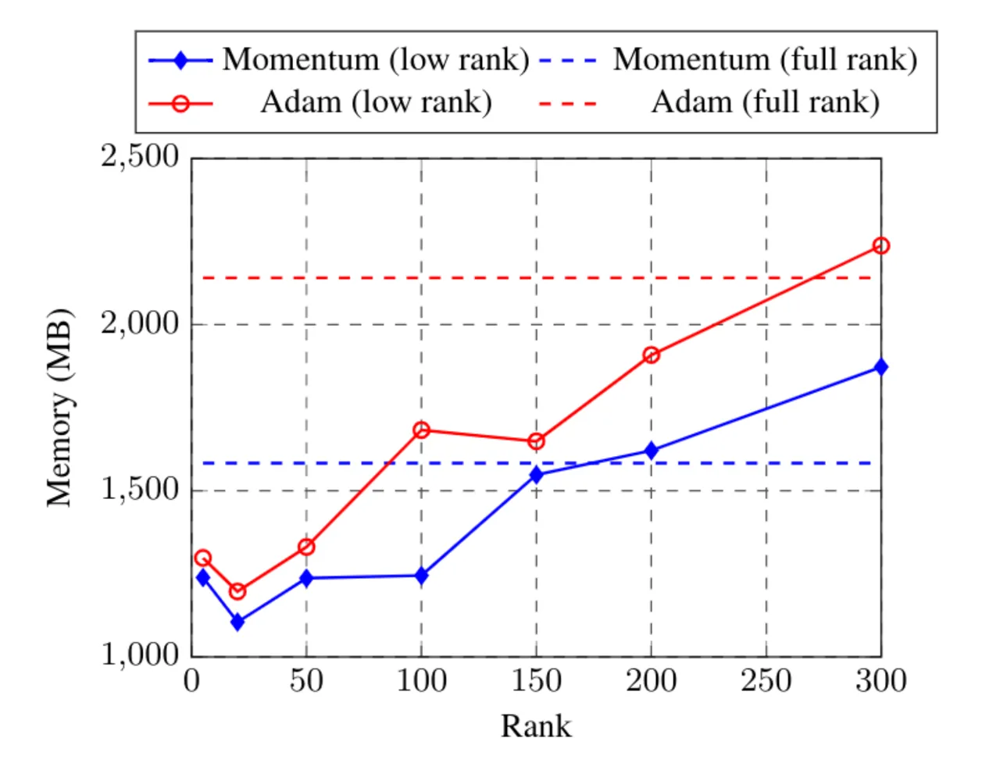
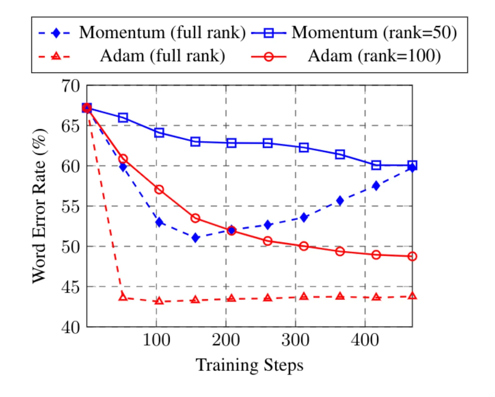
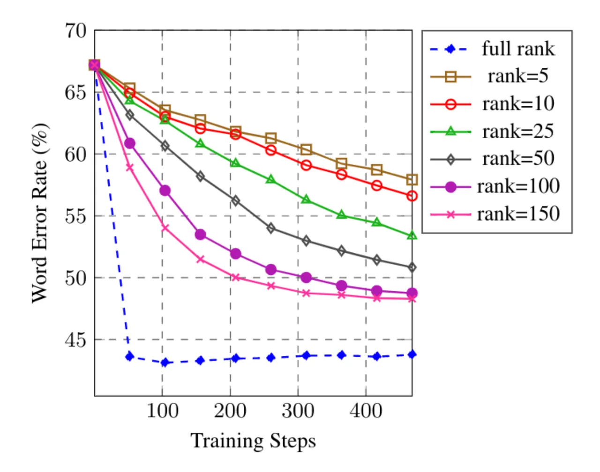
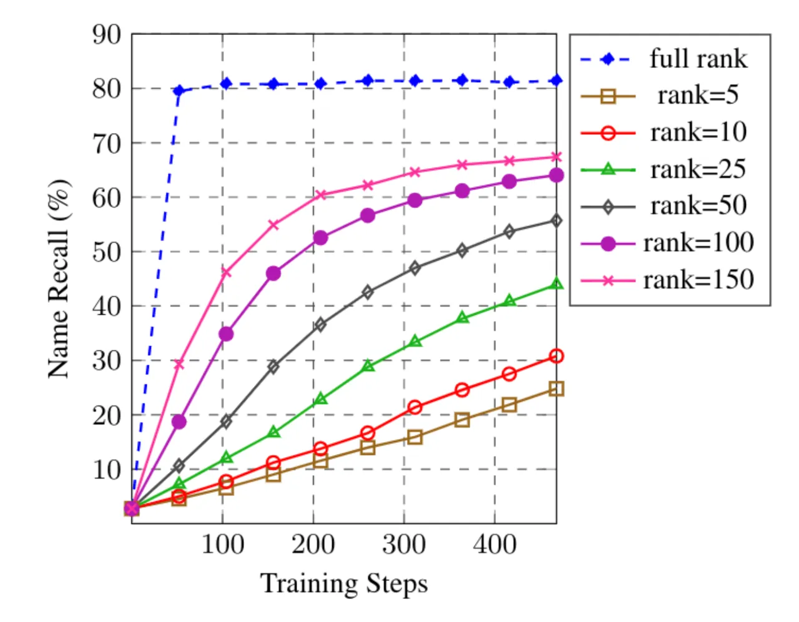

# LOW-RANK GRADIENT APPROXIMATION FOR MEMORY-EFFICIENT ON-DEVICE TRAINING OF DEEP NEURAL NETWORK

Mary Gooneratne\sthanksWork performed as an intern at Google    Khe Chai
Sim    Petr Zadrazil    Andreas Kabel    Françoise Beaufays    Giovanni
Motta

###### Abstract

Training machine learning models on mobile devices has the potential of
improving both privacy and accuracy of the models. However, one of the
major obstacles to achieving this goal is the memory limitation of
mobile devices. Reducing training memory enables models with
high-dimensional weight matrices, like automatic speech recognition
(ASR) models, to be trained on-device. In this paper, we propose
approximating the gradient matrices of deep neural networks using a
low-rank parameterization as an avenue to save training memory. The
low-rank gradient approximation enables more advanced, memory-intensive
optimization techniques to be run on device. Our experimental results
show that we can reduce the training memory by about 33.0% for Adam
optimization. It uses comparable memory to momentum optimization and
achieves a 4.5% relative lower word error rate on an ASR personalization
task.

###### Index Terms: 

on-device learning, low-rank gradient, memory reduction

^(†)^(†)address: Google, USA  
mary.gooneratne@duke.edu  
{khechai,binus,aka,fsb,giovannimotta}@google.com

## 1 Introduction

State-of-the-art speech-recognition models are based on deep neural
networks \[1\] with weight matrices of dimensions in the order of
thousands. We have shown that such models can be deployed offline on
mobile devices \[2\]. Decentralizing the training of these models to be
on-device can improve personalization and security. However, the
advanced optimization techniques used to train models require additional
memory proportional in size to the model parameters. Therefore, one of
the major obstacles to achieving high-accuracy on-device models is the
memory limitation of devices for training. Previous explorations to
reduce training memory included training only on part of the model
and/or splitting the gradient computation into multiple steps \[3, 4\].

In this paper, we propose using low-rank gradient approximation to
reduce the training memory needed for advanced optimization techniques.
Note that there are already methods in the literature that use low-rank
structure to reduce model size \[5, 6, 7\]. This proposal does not apply
the low-rank approximation to the weight matrices but rather to the
gradients, as to retain the full modeling power of the model. The
approach we take is less computationally expensive than Singular Value
Decomposition (SVD) \[8\] and, again, does not constrain the model
parameters by using the approximation exclusively as a vehicle for
gradient computation.

The remainder of the paper is organized as follows. Section 2 describes
several optimization techniques and their associated training memory.
Section 3 presents the proposed low-rank gradient optimization method.
Section 4 analyses the effects of low-rank gradient approximation on
training speed and convergence. Section 5 presents the experimental
results on a personalization tasks for on-device speech recognition.

## 2 Parameter Optimization

Deep neural networks are optimized by minimizing a loss function, which
is a nonlinear function of the model parameters. This is done
iteratively by updating the parameters in a direction that reduces the
loss function. Let’s denote the loss by
$`{\cal L}(\mbox{\boldmath{$W$}})`$, where $`W`$ is the weight matrix to
be updated. The update formula can be computed as:

```math
\mbox{\boldmath{$W$}}_{t+1}\leftarrow\mbox{\boldmath{$W$}}_{t}+\delta\mbox{\boldmath{$W$}}_{t} \tag{1}
```

where $`\mbox{\boldmath{$W$}}_{t}`$ and
$`\delta\mbox{\boldmath{$W$}}_{t}`$ are the weight matrix and the
corresponding update at training step $`t`$. For gradient descent
optimization, the update direction is given by the negative of the
gradient of the loss with respect to the weight matrix:

```math
\delta\mbox{\boldmath{$W$}}_{t}=-\lambda\nabla{\cal L}(\mbox{\boldmath{$W$}}_{t}) \tag{2}
```

where $`\lambda`$ is the learning rate and
$`\nabla{\cal L}(\mbox{\boldmath{$W$}}_{t})`$ is the gradient at
$`\mbox{\boldmath{$W$}}_{t}`$, which can be computed using error back
propagation \[9\]. There are more advanced optimization techniques that
compute a better update direction to improve training convergence. For
example, the update direction for momentum optimization \[10\] is
recursively computed as follows:

```math
\delta\mbox{\boldmath{$W$}}_{t}=\mu\delta\mbox{\boldmath{$W$}}_{t-1}-\lambda\nabla{\cal L}(\mbox{\boldmath{$W$}}_{t}) \tag{3}
```

where $`\mu\in[0,1]`$ is the momentum coefficient. Additional memory is
required to save $`\delta\mbox{\boldmath{$W$}}_{t-1}`$ (same size as
$`W`$) for the subsequent training step (doubling the model size). For
Adam optimization \[11\], the update direction is given by:

```math
\delta\mbox{\boldmath{$W$}}_{t}=-\lambda\frac{\sqrt{1-\beta_{1}^{t}}}{1-\beta_{2}^{t}}\mbox{\boldmath{$M$}}_{t}\oslash\left(\sqrt{\mbox{\boldmath{$V$}}_{t}}-\epsilon\right) \tag{4}
```

where $`\beta_{1}`$, $`\beta_{2}`$ and $`\epsilon`$ are scalar
parameters. The first and second momentum terms,
$`\mbox{\boldmath{$M$}}_{t}`$ and $`\mbox{\boldmath{$V$}}_{t}`$, are
computed recursively as:

```math
\displaystyle\mbox{\boldmath{$M$}}_{t} \displaystyle= \displaystyle\beta_{1}\mbox{\boldmath{$M$}}_{t-1}+(1-\beta_{1})\nabla{\cal L}(\mbox{\boldmath{$W$}}_{t}) \tag{5}
```

```math
\displaystyle\mbox{\boldmath{$V$}}_{t} \displaystyle= \displaystyle\beta_{2}\mbox{\boldmath{$V$}}_{t-1}+(1-\beta_{2})\nabla{\cal L}(\mbox{\boldmath{$W$}}_{t})\odot\nabla{\cal L}(\mbox{\boldmath{$W$}}_{t}) \tag{6}
```

The symbols $`\odot`$ and $`\oslash`$ denote the element-wise
multiplication and division operators. Two additional terms are
introduced, which results in a memory requirement that is 3 times the
size of the original model.

## 3 Low-rank Gradient Approximation

As shown in the previous section, advanced optimization techniques
require more memory to store additional terms. To reduce the total
amount of memory required, we propose using low-rank gradient
approximation. Although low-rank approximation can be achieved using
Singular Value Decomposition (SVD) \[8\], applying SVD to the gradients
for each training step is computationally expensive. Instead, we propose
to re-parameterize the weight matrix into two parts:

```math
\mbox{\boldmath{$W$}}=\tilde{\mbox{\boldmath{$W$}}}+\mbox{\boldmath{$U$}}\mbox{\boldmath{$V$}}^{\top} \tag{7}
```

where $`\tilde{\mbox{\boldmath{$W$}}}`$ is an unconstrained matrix with
the same size as $`W`$, and
$`\mbox{\boldmath{$U$}}\mbox{\boldmath{$V$}}^{\top}`$ is a low-rank
matrix of rank $`R`$. If $`W`$ is a $`M\times N`$ matrix, then $`U`$ and
$`V`$ are matrices of sizes $`M\times R`$ and $`N\times R`$,
respectively ($`M\gg R`$, $`N\gg R`$). With the re-parameterization in
Eq. 7, we can reduce training memory by keeping
$`\tilde{\mbox{\boldmath{$W$}}}`$ fixed and updating only $`U`$ and
$`V`$. However, this leads to a low-rank model, where the model
parameter space is constrained to be low rank. In order to keep the
model parameters unconstrained, we treat
$`\tilde{\mbox{\boldmath{$W$}}}`$ as the actual model parameters, and
use $`U`$ and $`V`$ only for the purpose of gradient computation.
Therefore, the update of $`W`$ is constrained to be low-rank by those of
$`U`$ and $`V`$ such that the effective gradient of $`W`$ is given by:

```math
\hat{\nabla{\cal L}(\mbox{\boldmath{$W$}})}\approx\mbox{\boldmath{$U$}}\nabla{\cal L}(\mbox{\boldmath{$V$}})^{\top}+\nabla{\cal L}(\mbox{\boldmath{$U$}})\mbox{\boldmath{$V$}}^{\top} \tag{8}
```

The gradients of $`U`$ and $`V`$ can be computed from the gradient of
$`W`$ as follows:

```math
\displaystyle\nabla{\cal L}(\mbox{\boldmath{$U$}}) \displaystyle= \displaystyle\nabla{\cal L}(\mbox{\boldmath{$W$}})\mbox{\boldmath{$V$}} \tag{9}
```

```math
\displaystyle\nabla{\cal L}(\mbox{\boldmath{$V$}}) \displaystyle= \displaystyle\nabla{\cal L}(\mbox{\boldmath{$W$}})^{\top}\mbox{\boldmath{$U$}} \tag{10}
```

By substituting Eq. 9 and 10 into Eq. 8 we can rewrite the effective
gradient of $`W`$ as:

```math
\hat{\nabla{\cal L}(\mbox{\boldmath{$W$}})}\approx\mbox{\boldmath{$U$}}\mbox{\boldmath{$U$}}^{\top}\nabla{\cal L}(\mbox{\boldmath{$W$}})+\nabla{\cal L}(\mbox{\boldmath{$W$}})\mbox{\boldmath{$V$}}\mbox{\boldmath{$V$}}^{\top} \tag{11}
```

where $`\mbox{\boldmath{$U$}}\mbox{\boldmath{$U$}}^{\top}`$ and
$`\mbox{\boldmath{$V$}}\mbox{\boldmath{$V$}}^{\top}`$ are the low-rank
projections of the rows and columns of $`W`$, respectively.

It is useful to note that we can compute
$`\nabla{\cal L}(\mbox{\boldmath{$W$}})`$ from the original model and
then compute the gradients for $`U`$ and $`V`$ using Eq. 9 and 10. The
re-parameterization in Eq. 7 needs not be explicitly applied to the
model (i.e. no need to modify the model computational graph). Instead,
it can be applied by post-processing the gradient. This makes it easy to
apply low-rank gradient training to existing models.

For the case of gradient descent, the update direction is given by the
negative of the gradient scaled by the learning rate (Eq. 2). From
Eq. 8, we get

```math
\delta\mbox{\boldmath{$W$}}\approx\mbox{\boldmath{$U$}}\delta\mbox{\boldmath{$V$}}^{\top}+\delta\mbox{\boldmath{$U$}}\mbox{\boldmath{$V$}}^{\top} \tag{12}
```

and the corresponding change in the loss function (ignoring the
higher-order terms):

```math
\displaystyle\delta{\cal L} \displaystyle\approx \displaystyle-\lambda\tr\left(\mbox{\boldmath{$U$}}\mbox{\boldmath{$U$}}^{\top}\mbox{\boldmath{$G$}}\mbox{\boldmath{$G$}}^{\top}+\mbox{\boldmath{$V$}}\mbox{\boldmath{$V$}}^{\top}\mbox{\boldmath{$G$}}^{\top}\mbox{\boldmath{$G$}}\right) \tag{13}
```

```math
\displaystyle= \displaystyle-\lambda\tr\left(\mbox{\boldmath{$U$}}^{\top}\mbox{\boldmath{$G$}}\mbox{\boldmath{$G$}}^{\top}\mbox{\boldmath{$U$}}+\mbox{\boldmath{$V$}}^{\top}\mbox{\boldmath{$G$}}^{\top}\mbox{\boldmath{$G$}}\mbox{\boldmath{$V$}}\right)
```

where we define
$`\mbox{\boldmath{$G$}}=\nabla{\cal L}(\mbox{\boldmath{$W$}})`$ for
clarity. With the cyclic invariance of the trace, we can express the
terms inside the trace as positive semi-definite $`R\times R`$ matrices.
This will result in a non-positive change to the loss
($`\delta{\cal L}\leq 0`$), as $`\lambda>0`$ and the trace of a positive
semi-definite matrix is non-negative. Note that in the unrestricted case
(without low-rank projection), the change in loss is given by:

```math
\delta{\cal L}=-\lambda\frac{1}{2}\tr\left(\mbox{\boldmath{$G$}}\mbox{\boldmath{$G$}}^{\top}+\mbox{\boldmath{$G$}}^{\top}\mbox{\boldmath{$G$}}\right) \tag{14}
```

In the special case where $`U`$ and $`V`$ are orthogonal matrices, the
projection matrices
$`\mbox{\boldmath{$P$}}_{u}=\mbox{\boldmath{$U$}}\mbox{\boldmath{$U$}}^{\top}`$
and
$`\mbox{\boldmath{$P$}}_{v}=\mbox{\boldmath{$V$}}\mbox{\boldmath{$V$}}^{\top}`$
are diagonal matrices with elements 1 or 0. In fact, they are rank-$`R`$
matrices with exactly $`R`$ entries of 1’s on the leading diagonal. A
smaller $`R`$ will result in a smaller trace term in Eq. 13, and
therefore a smaller reduction in loss. As a result, we expect low-rank
approximation to slow down training convergence.

### 3.1 Random Gradient Projection

From Eq. 9 and 10, if $`U`$ and $`V`$ are zero matrices, their gradients
will also be zero. Therefore, we need to assign non-zero values to $`U`$
and $`V`$ at each training step so that they can be updated. Ideally, we
want to choose $`U`$ and $`V`$ to maximize the magnitude of
$`\delta{\cal L}`$ in Eq. 13 using SVD. However, this will be
computationally expensive. Instead, we assign them with random values.
It can be shown that by drawing random values from a zero-mean normal
distribution with standard deviations of $`\frac{1}{\sqrt{N}}`$ and
$`\frac{1}{\sqrt{M}}`$ for $`U`$ and $`V`$, respectively,
$`\mbox{\boldmath{$U$}}^{\top}\mbox{\boldmath{$U$}}`$ and
$`\mbox{\boldmath{$U$}}^{\top}\mbox{\boldmath{$U$}}`$ are close to an
$`R\times R`$ identity matrix ($`U`$ and $`V`$ are approximately
orthogonal). Furthermore, by comparing between Eq. 13 and 14, it is
desirable to choose $`U`$ and $`V`$ such that the eigenvalues of
$`\mbox{\boldmath{$U$}}\mbox{\boldmath{$U$}}^{\top}`$ and
$`\mbox{\boldmath{$V$}}\mbox{\boldmath{$V$}}^{\top}`$ are close to
$`\frac{1}{2}`$. This can be accomplished by drawing the values of $`U`$
and $`V`$ from
$`{\cal N}\left(\mbox{\boldmath{$0$}}^{M\times R},\frac{1}{\sqrt{2M}}\mbox{\boldmath{$I$}}^{M\times R}\right)`$
and
$`{\cal N}\left(\mbox{\boldmath{$0$}}^{N\times R},\frac{1}{\sqrt{2N}}\mbox{\boldmath{$I$}}^{N\times R}\right)`$,
respectively.

### 3.2 Implementations

The low-rank gradient approximation method described above can be
implemented by adding new variables $`U`$ and $`V`$ for each weight
matrix in the model. Note that constraining the gradient of $`W`$ to be
low-rank (using Eq. 11) does not necessarily yield a low-rank momentum
term (e.g Eq. 6). Instead, it is easier to keep track of the momentum
terms by updating $`U`$ and $`V`$ separately and use the updated $`U`$
and $`V`$ to update $`W`$ using Eq. 7. If $`U`$ and $`V`$ are updated by
$`\delta\mbox{\boldmath{$U$}}`$ and $`\delta\mbox{\boldmath{$V$}}`$
respectively, the effective update of $`W`$ is given by

```math
\displaystyle\mbox{\boldmath{$W$}}_{t+1} \displaystyle\leftarrow\tilde{\mbox{\boldmath{$W$}}}+\left(\mbox{\boldmath{$U$}}_{t}+\delta\mbox{\boldmath{$U$}}_{t}\right)\left(\mbox{\boldmath{$V$}}_{t}+\delta\mbox{\boldmath{$V$}}_{t}\right)^{\top} \tag{15}
```

```math
\displaystyle=\mbox{\boldmath{$W$}}_{t}+\underbrace{\mbox{\boldmath{$U$}}_{t}\delta\mbox{\boldmath{$V$}}_{t}^{\top}+\delta\mbox{\boldmath{$U$}}_{t}\mbox{\boldmath{$V$}}_{t}^{\top}+\delta\mbox{\boldmath{$U$}}_{t}\delta\mbox{\boldmath{$V$}}_{t}^{\top}}_{\delta\mbox{\boldmath{$W$}}_{t}} \tag{16}
```

Note the additional second-order term
($`\delta\mbox{\boldmath{$U$}}\delta\mbox{\boldmath{$V$}}^{\top}`$) in
Eq. 16 compared to Eq. 12. This way, we are able to combine low-rank
gradient approximation with existing advanced optimization techniques.
In fact, $`\delta\mbox{\boldmath{$W$}}`$ in Eq. 16 can be rewritten as:

```math
\delta\mbox{\boldmath{$W$}}=\mbox{\boldmath{$U$}}_{t+1}\mbox{\boldmath{$V$}}_{t+1}^{\top}-\mbox{\boldmath{$U$}}_{t}\mbox{\boldmath{$V$}}_{t}^{\top} \tag{17}
```

That is, the update direction is given by the difference between the new
and old low-rank matrix,
$`\mbox{\boldmath{$U$}}\mbox{\boldmath{$V$}}^{\top}`$.

1: procedure
LowRankUpate($`\mbox{\boldmath{$W$}}_{t},\nabla{\cal L}(\mbox{\boldmath{$W$}}_{t}),R`$)

2:    \# Randomize $`U`$ and $`V`$.

3:
  $`\mbox{\boldmath{$U$}}\sim{\cal N}\left(\mbox{\boldmath{$0$}}^{M\times R},\frac{1}{\sqrt{2M}}\mbox{\boldmath{$I$}}^{M\times R}\right)`$.

4:
  $`\mbox{\boldmath{$V$}}\sim{\cal N}\left(\mbox{\boldmath{$0$}}^{N\times R},\frac{1}{\sqrt{2N}}\mbox{\boldmath{$I$}}^{N\times R}\right)`$.

5:    \# Compute gradients.

6:
  $`\nabla{\cal L}(\mbox{\boldmath{$U$}}_{t})\leftarrow\nabla{\cal L}(\mbox{\boldmath{$W$}}_{t})\mbox{\boldmath{$V$}}_{t}`$
(using Eq. 9)

7:
  $`\nabla{\cal L}(\mbox{\boldmath{$V$}}_{t})\leftarrow\nabla{\cal L}(\mbox{\boldmath{$W$}}_{t})^{\top}\mbox{\boldmath{$U$}}_{t}`$
(using Eq. 10)

8:    \# Update $`U`$ and $`V`$.

9:
  $`\mbox{\boldmath{$U$}}_{t+1}\leftarrow\mbox{\boldmath{$U$}}_{t}+\delta\mbox{\boldmath{$U$}}_{t}`$

10:
  $`\mbox{\boldmath{$V$}}_{t+1}\leftarrow\mbox{\boldmath{$V$}}_{t}+\delta\mbox{\boldmath{$V$}}_{t}`$

11:    \# Update $`W`$

12:
  $`\mbox{\boldmath{$W$}}_{t+1}\leftarrow\mbox{\boldmath{$W$}}_{t}+\mbox{\boldmath{$U$}}_{t+1}\mbox{\boldmath{$V$}}_{t+1}^{\top}-\mbox{\boldmath{$U$}}_{t}\mbox{\boldmath{$V$}}_{t}^{\top}`$
(using Eq. 17)

Algorithm 1 Low-rank Gradient Approximation Algorithm

The algorithm for computing the low-rank gradients is shown in
Algorithm 1. For each training step, we first assign random values to
$`U`$ and $`V`$ (lines 3 and 4). Next, we compute the gradients for
$`U`$ and $`V`$ (lines 6 and 7) and updates $`U`$ and $`V`$ using
standard optimization techniques, such as gradient descent, momentum,
and Adam (lines 9 or 10). Finally, in line 12, we update $`W`$ using
Eq. 17.

## 4 Analysis

We set up a simple problem to analyze and understand the behaviour of
the proposed low-rank gradient method. The goal is to learn a matrix
$`W`$ to match a target matrix, $`\hat{\mbox{\boldmath{$W$}}}`$. The
following mean squared error loss function is used:

```math
{\cal L}(\mbox{\boldmath{$W$}})=\frac{1}{D^{2}}\sum_{i,j}\left(\exp(w_{i,j})-\exp(\hat{w}_{i,j})\right)^{2} \tag{18}
```

where $`W`$ and $`\hat{\mbox{\boldmath{$W$}}}`$ are matrices of size
$`D\times D`$. The $`(i,j)`$-th element of $`W`$ and
$`\hat{\mbox{\boldmath{$W$}}}`$ are denoted by $`w_{i,j}`$ and
$`\hat{w}_{i,j}`$, respectively. We use $`\exp(\cdot)`$ to introduce
non-linearity to the function. We compared using different optimization
methods and low-rank projection methods. none means that there is no
low-rank gradient approximation, random refers to the case where $`U`$
and $`V`$ are randomly set per training step and svd means that $`U`$
and $`V`$ are estimated by approximating the gradient of $`W`$ using
SVD. We performed 50,000 training steps for each configuration.

|                  |            |         |               |
| ---------------- | ---------- | ------- | ------------- |
| Optimization     | Projection |   Loss  | Training time |
| Method           | Method     |         | (seconds)     |
| Gradient Descent | none       | 0.00510 | 22.4          |
|                  | random     | 1.73146 | 24.0          |
|                  | svd        | 0.44033 | 329.2         |
| Momentum         | none       | 0.00059 | 20.2          |
|                  | random     | 1.72933 | 29.5          |
|                  | svd        | 0.31221 | 347.2         |
| Adam             | none       | 0.00026 | 28.0          |
|                  | random     | 0.00008 | 33.2          |
|                  | svd        | 0.00028 | 317.6         |

Table 1: Comparing loss and training time after 50,000 training steps
for different optimization methods ($`D=100`$, $`R=5`$).

Table 1 shows the loss and training time after 50,000 training steps. In
general, svd approximation yields a much better loss value after 50,000
training steps across different optimization methods, except for Adam
optimization where all methods converged to a loss value of less than
$`10^{-3}`$. On the other hand, the random method is only slightly
slower than the standard method while the svd method takes an order
magnitude longer time to train (due to the need to computed SVD every
training step).

## 5 Experimental Results

We collected a dataset we called Wiki-Names \[4\] to evaluate the
performance of speech personalization algorithms. The text prompts are
sentences extracted from English Wikipedia pages that contain repeated
occurrences of politician and artist names that are unique and difficult
to recognize (we selected them by synthesizing speech for these names
and verifying that our baseline recognizer recognizes them incorrectly).

The dataset aggregates speech data from 100 participants. Each
participant provided 50 utterances (on average 4.6 minutes) of training
data and 20 utterances (on average 1.9 minutes) of test data. The
prompts for each user covered five names, each with 10 training
utterances and 4 test utterances, with each name potentially appearing
multiple times per utterance. The dataset includes accented and
disfluent speech.

We used the Wiki-Names dataset for personalization experiments. The
baseline ASR model is a recurrent neural network transducer
(RNN-T) \[12\] as described in \[2\]. The models were trained using the
efficient implementation \[13\] in TensorFlow \[14\]. We measured the
success of the modified model using the word error rate (WER) metric as
well as the name recall rate \[4\] as described below:

```math
\text{recall}=\frac{\text{retrieved}\cap\text{relevant}}{\text{relevant}} \tag{19}
```

where retrieved is the number of times names are present in the
hypotheses and relevant refers to the number of times names appear in
the reference transcripts. retrieved $`\cap`$ relevant indicates the
number of relevant names that are correctly retrieved.

In addition to tracking quality metrics, we also quantify the impact of
the algorithms on training memory by running on-device benchmarks.
Comparisons were made between different parameterization ranks,
different optimizers, and full-rank, baseline model.

### 5.1 Memory Benchmark



Figure 1: Comparison of peak training memory (in megabytes) used for
Momentum and Adam optimizers with different ranks.

The low-rank gradient model saved a significant amount of memory.
Figure 1 shows the training memory with low-rank gradient projection
versus the baseline (full rank) models, for both the momentum and Adam
optimization methods. We adjusted the rank of the gradient projection
matrix across experiments to observe the impact on memory. Figure 1
shows that the low-rank model uses less memory than the full-rank model
using the momentum optimizer for a projection of rank 100. Any
projection of a lower rank would continue to save memory. Similarly, the
modified model was able to save training memory with the Adam optimizer
for a projection of up to rank 200. Additionally, the graph illustrates
that the training memory increases about linearly with rank.
Furthermore, with rank 100 and 150, low-rank gradient projection with
Adam optimization consumes about the same memory as full rank momentum
optimization.

### 5.2 Speech Recognition Performance



Figure 2: Comparison of word error rate performance for Momentum and
Adam optimization with and without low-rank approximation.

The results in Figures 2 and 3 show how the speech recognition quality
varies with increasing training steps for different settings. Figure 2
compares the WER for the momentum and Adam optimization methods with and
without low-rank projection. Comparing the low-rank and full-rank
models, Figure 2 shows that low-rank models converge slower for both
momentum and Adam optimization. The latter achieved a better
performance, indicating that we are able to take advantage of the
benefit of Adam optimization by using it to update $`U`$ and $`V`$.



Figure 3: Comparison of word error rate performance for Adam
optimization with different ranks.

Figure 3 shows that the word error rate decreases faster and to a lower
rate as the rank of the gradient approximation is increased. Training
the model using Adam with a gradient projection matrix of rank 150
reached a word error rate of 47.1% while the baseline model converges at
a word error rate about 43.8%.



Figure 4: Comparison of name recall rate performance for Adam
optimization with different ranks.

Similarly, Figure 4 shows that the name recall rate increases faster and
to a higher rate with the higher rank models, as expected.

## 6 Summary

The experiments detailed above sought to explore an opportunity to save
training memory for deep neural network models, such as those used for
speech recognition. Approximating the gradient computation using
low-rank parameters saves memory up to a rank of about 100 and 200 for
the momentum and Adam optimization, respectively. These results are
promising.

To observe the impact of the new training method on the effectiveness of
the model, we did experiments on Wiki-Names, a dataset with accented
speech and difficult-to-recognize names. The most important metrics from
these experiments are the word error rate and the recall for the names
in the dataset. We compared how models of different ranks and different
optimizers trained and how their training compared to the baseline
model. For the model using the momentum optimizer, the rank did not
impact training significantly. Furthermore, the low-rank model for
momentum performed worse than the baseline momentum model. Predictably,
the low-rank model with the Adam optimizer performed much better.
Additionally, rank had an observable impact on training.

Using a low-rank approximation of the gradient computation for deep
neural network models provides an opportunity to save memory without a
significant increase in error rate or decrease in recall rate. This
opportunity is most promising for on device training with more advanced
optimizers, like Adam, that traditionally use multiple high-dimensional
parameters for gradient computation.

## References

- \[1\] Geoffrey Hinton, Li Deng, Dong Yu, George E Dahl, Abdel-rahman
  Mohamed, Navdeep Jaitly, Andrew Senior, Vincent Vanhoucke, Patrick
  Nguyen, Tara N Sainath, et al., “Deep neural networks for acoustic
  modeling in speech recognition: The shared views of four research
  groups,” IEEE Signal Processing Magazine, vol. 29, no. 6, pp.
  82–97, 2012.
- \[2\] Yanzhang He, Tara N Sainath, Rohit Prabhavalkar, Ian McGraw,
  Raziel Alvarez, Ding Zhao, David Rybach, Anjuli Kannan, Yonghui Wu,
  Ruoming Pang, et al., “Streaming end-to-end speech recognition for
  mobile devices,” in IEEE International Conference on Acoustics, Speech
  and Signal Processing (ICASSP). IEEE, 2019, pp. 6381–6385.
- \[3\] Khe Chai Sim, Petr Zadrazil, and Françoise Beaufays, “An
  investigation into on-device personalization of end-to-end automatic
  speech recognition models,” in Interspeech, 2019.
- \[4\] Khe Chai Sim, Françoise Beaufays, Arnaud Benard, Dhruv Guliani,
  Andreas Kabel, Nikhil Khare, Tamar Lucassen, Petr Zadrazil, Harry
  Zhang, Leif Johnson, Giovanni Motta, and Lillian Zhou,
  “Personalization of end-to-end speech recognition on mobile devices
  for named entities,” to appear in ASRU, 2019.
- \[5\] Jian Xue, Jinyu Li, Dong Yu, Mike Seltzer, and Yifan Gong,
  “Singular value decomposition based low-footprint speaker adaptation
  and personalization for deep neural network,” in Proc. ICASSP. IEEE,
  2014, pp. 6359–6363.
- \[6\] Yong Zhao, Jinyu Li, and Yifan Gong, “Low-rank plus diagonal
  adaptation for deep neural networks,” in Proc. ICASSP. IEEE, 2016, pp.
  5005–5009.
- \[7\] Lahiru Samarakoon and Khe Chai Sim, “Factorized hidden layer
  adaptation for deep neural network based acoustic modeling,” IEEE/ACM
  Transactions on Audio, Speech, and Language Processing, vol. 24, no.
  12, pp. 2241–2250, 2016.
- \[8\] JC Nash, “The singular-value decomposition and its use to solve
  least-squares problems,” Compact Numerical Methods for Computers:
  Linear Algebra and Function Minimisation, pp. 30–48, 1990.
- \[9\] James L McClelland, David E Rumelhart, PDP Research Group,
  et al., Parallel distributed processing, vol. 2, MIT press Cambridge,
  MA:, 1987.
- \[10\] Ilya Sutskever, James Martens, George Dahl, and Geoffrey
  Hinton, “On the importance of initialization and momentum in deep
  learning,” in International conference on machine learning, 2013, pp.
  1139–1147.
- \[11\] Diederik P. Kingma and Jimmy Ba, “Adam: A method for stochastic
  optimization,” in 3rd International Conference on Learning
  Representations, ICLR 2015, San Diego, CA, USA, May 7-9, 2015,
  Conference Track Proceedings, 2015.
- \[12\] Alex Graves, “Sequence transduction with recurrent neural
  networks,” arXiv preprint arXiv:1211.3711, 2012.
- \[13\] Tom Bagby, Kanishka Rao, and Khe Chai Sim, “Efficient
  implementation of recurrent neural network transducer in TensorFlow,”
  in 2018 IEEE Spoken Language Technology Workshop (SLT). IEEE, 2018,
  pp. 506–512.
- \[14\] Martín Abadi, Ashish Agarwal, Paul Barham, Eugene Brevdo,
  Zhifeng Chen, Craig Citro, Gregory S. Corrado, Andy Davis, Jeffrey
  Dean, Matthieu Devin, Sanjay Ghemawat, Ian J. Goodfellow, Andrew Harp,
  Geoffrey Irving, Michael Isard, Yangqing Jia, Rafal Józefowicz, Lukasz
  Kaiser, Manjunath Kudlur, Josh Levenberg, Dan Mané, Rajat Monga,
  Sherry Moore, Derek Gordon Murray, Chris Olah, Mike Schuster, Jonathon
  Shlens, Benoit Steiner, Ilya Sutskever, Kunal Talwar, Paul A. Tucker,
  Vincent Vanhoucke, Vijay Vasudevan, Fernanda B. Viégas, Oriol Vinyals,
  Pete Warden, Martin Wattenberg, Martin Wicke, Yuan Yu, and Xiaoqiang
  Zheng, “Tensorflow: Large-scale machine learning on heterogeneous
  distributed systems,” CoRR, vol. abs/1603.04467, 2016.
