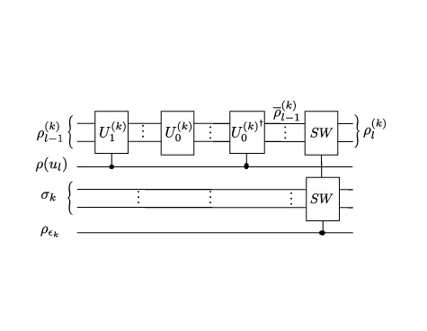
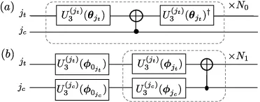
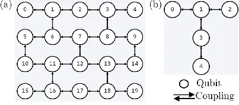
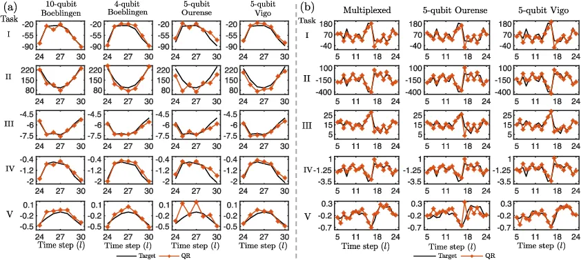
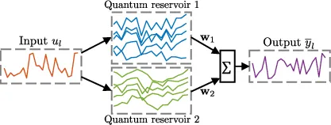

# Temporal information processing on noisy quantum computers

Jiayin Chen Affiliation: School of Electrical Engineering and
Telecommunications, The University of New South Wales (UNSW), Sydney NSW
2052, Australia. Affiliation: Quantum Computing Center, Keio University,
Hiyoshi 3-14-1, Kohoku, Yokohama 223-8522, Japan.    Hendra I. Nurdin
Email: <h.nurdin@unsw.edu.au> Affiliation: School of Electrical
Engineering and Telecommunications, The University of New South Wales
(UNSW), Sydney NSW 2052, Australia.    Naoki Yamamoto
Affiliation: Quantum Computing Center, Keio University, Hiyoshi 3-14-1,
Kohoku, Yokohama 223-8522, Japan. Affiliation: Department of Applied
Physics and Physico-Informatics, Keio University, Hiyoshi 3-14-1,
Kohoku, Yokohama 223-8522, Japan.

###### Abstract

The combination of machine learning and quantum computing has emerged as
a promising approach for addressing previously untenable problems.
Reservoir computing is an efficient learning paradigm that utilizes
nonlinear dynamical systems for temporal information processing, i.e.,
processing of input sequences to produce output sequences. Here we
propose quantum reservoir computing that harnesses complex dissipative
quantum dynamics. Our class of quantum reservoirs is universal, in that
any nonlinear fading memory map can be approximated arbitrarily closely
and uniformly over all inputs by a quantum reservoir from this class. We
describe a subclass of the universal class that is readily implementable
using quantum gates native to current noisy gate-model quantum
computers. Proof-of-principle experiments on remotely accessed
cloud-based superconducting quantum computers demonstrate that small and
noisy quantum reservoirs can tackle high-order nonlinear temporal tasks.
Our theoretical and experimental results pave the path for attractive
temporal processing applications of near-term gate-model quantum
computers of increasing fidelity but without quantum error correction,
signifying the potential of these devices for wider applications
including neural modeling, speech recognition and natural language
processing, going beyond static classification and regression tasks.

## I Introduction

The ingenious use of quantum effects has led to a significant number of
quantum machine learning algorithms that offer computational speed-ups
\[1, 2\]. While awaiting the demonstration of these quantum algorithms
on full-fledge quantum computers equipped with quantum error correction,
quantum computing has transitioned from theoretical ideas to the noisy
intermediate-scale quantum (NISQ) technology era \[3\]. Hybrid
quantum-classical algorithms using short-depth circuits are particularly
suitable for implementation on NISQ devices. Many notable experimental
demonstrations of NISQ devices employ hybrid algorithms for data
classification \[4\] and quantum chemistry \[5\]. An on-going quest is
to find interesting applications on quantum computers with increasingly
lower noise profile but not reaching a low enough threshold to enable
continuous quantum error correction.

Here we propose a hybrid quantum-classical algorithm that utilizes
dissipative quantum dynamics as reservoir computers (RC) for temporal
information processing on gate-model NISQ quantum computers. The goal
for temporal information processing tasks, such as speech processing and
natural language processing \[6, 7\], is to learn the relationship
between input sequences and output sequences. The RC framework uses an
arbitrary but fixed dynamical system (in this case systems with dynamics
described by state-space difference equation), the “reservoir”, to map
sequential inputs into its high-dimensional state-space. Only a simple
linear regression algorithm is required to optimize the parameters of a
readout function to approximate target outputs. The use of a simple
linear readout has connections to the biological concept of mixed
selectivity, as demonstrated in monkeys \[8\]. The attractiveness of the
RC scheme is that naturally occurring dynamical systems (with some
desired properties) in physics and engineering can be exploited for
temporal information processing without precise tuning of its
parameters, circumventing the expensive training cost in alternative
schemes such as recurrent neural networks with tunable internal weights
\[9\]. The ease of RC implementation has brought forward many successful
hardware implementations of classical (i.e., non-quantum) RC schemes
\[10, 11, 12\]. A spintronic RC achieved state-of-the-art performance on
a spoken digit recognition task \[13\] and a photonic RC demonstrated
high-speed speech classification with a low error \[14\]. For
theoretical developments, \[15\] derives an approximation error upper
bound for certain classical RCs on learning a class of input-output maps
(not necessarily fading memory maps considered here). Information
processing capacity of various RC schemes has been investigated \[16,
17\]. See \[18, 19\] for further interests and developments of RCs.

In this work, we employ dissipative quantum systems as quantum
reservoirs (QRs) to approximate nonlinear input-output maps with fading
memory. A map has fading memory if its outputs depend increasingly less
on inputs from earlier times. These maps are important in a broad class
of real-world problems including spoken digit recognition \[13\] and
neural modeling \[20\]. The use of quantum systems as QRs was initially
proposed in \[21, 22\] to harness disordered-ensemble quantum dynamics
for temporal information processing. This QR class is suitable for
ensemble quantum systems and a static (non-temporal) version of \[21\]
was demonstrated in NMR to approximate static maps \[23\]. However, it
remained an open problem to show this QR class has the properties
required for reservoir computing. Chen and Nurdin \[24\] addressed this
problem by demonstrating that a variation of the scheme proposed in
\[21, 22\] is universal for nonlinear fading memory maps, meaning that
given any target nonlinear fading memory map, there exists a member in
the universal QR class whose outputs approximate the target map’s
outputs arbitrarily closely and uniformly over the input sequences. This
is a quantum analogue of the universal function approximation property
feed-forward neural networks enjoy \[25, 26\], but for nonlinear fading
memory mappings from input sequences to output sequences. The notion of
universality we adopt here was previously established for classical RC
schemes \[27, 28, 20\] and the Volterra series \[29\]. In particular,
\[28\] proves this universality property for a form of recurrent neural
networks called echo-state networks \[30\]. However, realizing these
previous QR proposals in the quantum gate-model remains challenging due
to the large number of quantum gates required to implement the dynamics
via Trotterization.

The contribution of this work is twofold. Firstly, we propose a new
class of QRs endowed with the fading memory and universality properties
that is not implemented by Ising Hamiltonians, circumventing the need
for Trotterization required in previous proposals. Secondly, we propose
a realization of a subclass of the universal QR class on NISQ devices
and present proof-of-principle experiments on remotely accessed IBM
superconducting quantum processors \[31\], i.e., NISQ devices not yet
equipped with quantum error correction. The QR dynamics in this subclass
can be implemented using arbitrary but fixed quantum circuits, as long
as they generate non-trivial dynamics. This could be, for instance,
quantum circuits that are classically intractable to simulate. The
quantum circuits can be of short lengths and can be implemented using
parametrized single-qubit and multi-qubit quantum gates native to the
quantum hardware, without the need for precise tuning of their gate
parameters. Our proof-of-principle experiments show that QRs with a
small number of qubits operating in a noisy environment can tackle
complex nonlinear temporal tasks, even under current hardware
limitations and in the absence of readout and process error mitigation
techniques. This work serves as the first theoretical and experimental
realization of applying near-term gate-model quantum computers to
nonlinear temporal information processing tasks, opening an avenue for
time series modeling and signal processing applications of these
devices.

The rest of this paper is organized as follows. In Sec. II we introduce
fading memory maps and describe two temporal information processing
tasks for these maps. Sec. III introduces the RC framework and explains
conditions for which a RC defines a fading memory map. Sec. IV presents
our QR proposal and the universality result. We then propose a subclass
of the universal class suitable for implementation on current noisy
gate-model quantum computers. We conclude the section by discussing
invariance properties of the universal class under certain hardware
imperfections. Sec. V details two hardware realizations of the
aforementioned subclass of the universal one and presents more efficient
versions of both schemes that could enable QR’s potential for more
scalable temporal processing on gate-model quantum devices. Sec. VI
details our proof-of-principle experiments performed on cloud-based IBM
superconducting quantum devices. We provide concluding remarks in
Sec. VII. Detailed mathematical derivations and experimental settings
are provided in the Appendix.

## II Temporal information processing

We consider a input-output (I/O) map $`M`$ that maps infinite input
sequences $`u=\{\ldots,u_{-1},u_{0},u_{1},\ldots\}`$ to infinite output
sequences $`y=\{\ldots,y_{-1},y_{0},y_{1},\ldots\}`$, where
$`u_{l},y_{l}\in\mathbb{R}`$ for $`l\in\mathbb{Z}`$ and
$`y_{l}=M(u)_{l}`$ is the output at time $`l`$. We write
$`u\rvert_{L:L^{\prime}}=\{u_{L},\ldots,u_{L^{\prime}}\}`$ and
$`y\rvert_{L:L^{\prime}}=\{y_{L},\ldots,y_{L^{\prime}}\}`$ to denote the
inputs and outputs during time $`l=L,\ldots,L^{\prime}`$. In practice,
such I/O maps can be realized by convergent dynamical systems, that is,
systems that forget their initial condition (see Appendix A.1 for
details). If such a dynamical system with state $`\textbf{x}_{l}`$ is
initialized at time $`l_{0}`$ at the state $`\textbf{x}_{l_{0}}`$ and
given an input sequence $`\{u_{l_{0}},u_{l_{0}+1},\ldots\}`$ and the
system outputs the sequence $`\{y_{l_{0}},y_{l_{0}+1},\ldots\}`$, then
it realizes an I/O map $`M`$ for any initial condition
$`\textbf{x}_{l_{0}}`$ as $`l_{0}\rightarrow-\infty`$.

Two challenging temporal information processing problems are posed to
learn the I/O relationship given by $`M`$ based on the I/O pair $`u,y`$.
The first is the multi-step ahead prediction problem, in which we are
given inputs $`u\rvert_{1:L}`$ and the corresponding outputs
$`y\rvert_{1:L}`$. The first $`L_{T}<L`$ input-output data pair
($`u\rvert_{1:L_{T}},y\rvert_{1:L_{T}}`$) is the train data. In the
sequel, we use the input-output train data during $`l=5,\ldots,L_{T}`$.
The reason for this is to remove the transient response in the data, see
Sec. VI.2 for a discussion. The goal is to use the train data to
optimize the parameters w of another I/O map
$`\overline{M}_{\textbf{w}}`$, so that the outputs
$`\overline{y}\rvert_{L_{T}+1:L}=\{\overline{y}_{L_{T}+1},\ldots\overline{y}_{L}\}`$,
where $`\overline{y}_{l}=\overline{M}_{\textbf{w}}(u)_{l}`$, approximate
the target outputs $`y\rvert_{L_{T}+1:L}`$. The second problem is the
map emulation problem, that is to optimize w of
$`\overline{M}_{\textbf{w}}`$ to emulate $`M`$ using $`k=1,\ldots,K`$
different I/O train data pairs
$`(u^{k}\rvert_{1:L^{\prime}},y^{k}\rvert_{1:L^{\prime}})`$, so that the
total number of train data is $`KL^{\prime}`$ (we will again use train
data during $`l=5,\ldots,l=L^{\prime}`$ in Sec.  VI.2). When given a
previously unseen input $`u^{K+1}\rvert_{1:L^{\prime}}`$, the task is
for $`\overline{y}^{K+1}\rvert_{1:L^{\prime}}`$ to approximate
$`y^{K+1}\rvert_{1:L^{\prime}}`$.

If an I/O map $`M`$ has fading memory, then its output at time
$`l^{\prime}`$ becomes increasingly less dependent on input samples
$`u_{l}`$ from much earlier times $`l\ll l^{\prime}`$; see Appendix A.2.
In this work, we approximate nonlinear fading memory I/O maps using RCs
implemented by quantum dynamical systems. We will introduce conditions
for which a reservoir dynamical system defines a fading memory I/O map
in the next section.

## III Reservoir computing

To approximate fading memory maps, RC exploits nonlinear dynamical
systems to project the input $`u_{l}`$ into a reservoir state
$`\textbf{x}_{l}`$ at time $`l`$. A RC is governed by a dynamics $`f`$
with state evolution $`\textbf{x}_{l}=f(\textbf{x}_{l-1},u_{l})`$. The
dynamics of the reservoir can be arbitrary but fixed as long as it
satisfies some required properties, and never requires training. We
require the RC to satisfy the echo-state property \[30\] or the
convergence property \[32\], so that the RC asymptotically forgets its
initial condition. The tunable parameters w appear in a readout function
$`h_{\textbf{w}}`$, which combines the elements of $`\textbf{x}_{l}`$
into an output $`\overline{y}_{l}=h_{\textbf{w}}(\textbf{x}_{l})`$. For
a sufficiently long input sequence
$`\{u_{l_{0}},u_{l_{0}+1},\ldots,u_{0}\}`$, the effect of the RC’s
initial condition can be washed-out. As discussed in Sec. II, as
$`l_{0}\rightarrow-\infty`$, the combination of a convergent RC dynamics
$`f`$ and the readout function $`h_{\textbf{w}}`$ produces an I/O map
$`\overline{M}_{(f,h_{\textbf{w}})}`$. After the washout, the readout
parameters w can be optimized using linear regression to minimize an
empirical mean squared-error between $`y_{1:L_{T}}`$ and
$`\overline{y}_{1:L_{T}}`$. As in previous works \[29, 20, 27, 28\], we
consider $`\overline{M}_{(f,h_{\textbf{w}})}`$ that has the fading
memory property.

Echo-state networks, one of the pioneering classical RC schemes, have
been numerically demonstrated to achieve state-of-the-art performance in
chaotic system modeling \[30\]. Subsequent hardware realizations of RC
proposals exploit classical dynamical systems for real-time temporal
processing tasks that demand less energy or computational memory \[10,
11, 12, 13, 14\]. These experiments also suggest empirically that for
certain tasks, such as spoken digit recognition, the reservoir state
dimension plays a role in the RC’s task performance.

## IV Universal quantum reservoir computers

We propose to use a QR, with a view towards possibly taking advantage of
fast quantum dynamics and its exponentially large state space. A QR
consists of $`N`$ non-interacting subsystems, each subsystem $`k`$ has
$`n_{k}`$ number of qubits so that the QR has $`n=\sum_{k=1}^{N}n_{k}`$
qubits. The QR density operator $`\rho_{l}`$ at time $`l`$ evolves
according to

```math
\rho_{l}=T(u_{l})\rho_{l-1}=\bigotimes_{k=1}^{N}T^{(k)}(u_{l})\rho^{(k)}_{l-1}, \tag{1}
```

and the $`k`$-th subsystem density operator $`\rho^{(k)}_{l}`$ undergoes
the evolution

```math
\begin{split}&T^{(k)}(u_{l})\rho^{(k)}_{l-1}\\
&=(1-\epsilon_{k})\left(u_{l}T^{(k)}_{0}+(1-u_{l})T^{(k)}_{1}\right)\rho^{(k)}_{l-1}+\epsilon_{k}\sigma_{k},\end{split} \tag{2}
```

for input $`0\leq u_{l}\leq 1`$. Here, $`0<\epsilon_{k}\leq 1`$,
$`\sigma_{k}`$ is an arbitrary but fixed density operator, and
$`T^{(k)}_{0}`$ and $`T^{(k)}_{1}`$ are two arbitrary but fixed
completely positive trace-preserving (CPTP) maps. Examples of such maps
include some naturally occurring noisy quantum channels, such as
dephasing or amplitude damping channels; see \[33\]. No precise tuning
or engineering of the CPTP maps $`T^{(k)}_{0},T^{(k)}_{1}`$ is required
for the QR scheme and it should not generate trivial dynamics (i.e., we
should not choose $`T^{(k)}_{0}=T^{(k)}_{1}`$). They could potentially
be classically intractable to simulate CPTP maps. The QR dynamics
Eq. (1)–(2) is convergent, meaning that it will asymptotically forget
its initial condition; see Appendix A.1 for the proof. Given inputs
$`\{u_{l_{0}},u_{l_{0}+1},\ldots,u_{0}\}`$ and
$`l_{0}\rightarrow-\infty`$, the convergence property ensures the QR
state $`\rho_{0}`$ evolves according to Eqs. (1)–(2) is determined by
$`\{u_{l_{0}},u_{l_{0}+1},\ldots,u_{0}\}`$ and
$`T^{(k)}_{0},T^{(k)}_{1}`$, but not by its initial state
$`\rho_{l_{0}}`$.

We obtain partial information about $`\rho_{l}`$ by measuring each qubit
in the Pauli $`Z`$ basis to obtain
$`\langle Z^{(i)}\rangle_{l}={\rm Tr}(\rho_{l}Z^{(i)})`$ for
$`i=1,\ldots,n`$, where $`Z^{(i)}`$ acts on qubit $`i`$. We associate
the readout function Eq. (3) to the QR dynamics Eq. (1). The readout
function Eq. (3) is a multivariate polynomial of degree $`R`$ in the
variables $`\langle Z^{(i_{j})}\rangle_{l}`$. A simple linear form
($`R=1`$) is employed in our proof-of-principle experiments in Sec. VI.
The tunable readout parameters
$`\textbf{w}=\{\textbf{w}_{i_{1},\ldots,i_{n}}^{r_{i_{1}},\ldots,r_{i_{n}}},\textbf{w}_{c}\}`$
can be optimized via linear regression. Eqs. (1) and (3) define a QR
implementing an I/O map $`\overline{M}_{(T,h_{\textbf{w}})}`$ that
depends on the QR dynamics $`T`$ and the readout function
$`h_{\textbf{w}}`$. We show in Appendix A.2 that
$`\overline{M}_{(T,h_{\textbf{w}})}`$ has the fading memory property.
Now consider the class $`\mathcal{M}`$ of I/O maps
$`\overline{M}_{(T,h_{\textbf{w}})}`$ arising from differing numbers of
subsystems $`N`$, numbers of qubits $`n`$, QR dynamics $`T(u_{l})`$,
readout parameters w and degree $`R`$ of $`h_{\textbf{w}}`$. Our main
result shows that the class $`\mathcal{M}`$ is universal for
approximating nonlinear fading memory maps.

###### Theorem 1 (Universality).

Let $`K([0,1])`$ be the set of input sequences $`\{u_{l}\}`$ with
$`0\leq u_{l}\leq 1`$ for $`l\in\mathbb{Z}`$. For any nonlinear fading
memory map $`M`$ and any $`\delta>0`$, there exists
$`\overline{M}_{(T,h_{\textbf{w}})}\in\mathcal{M}`$ implemented by some
QR such that for all $`u\in K([0,1])`$,
$`\sup_{l\in\mathbb{Z}}\left|M(u)_{l}-\overline{M}_{(T,h_{\textbf{w}})}(u)_{l}\right|<\delta`$.

We remark that universality is a property of the QR class
$`\mathcal{M}`$ and not of an individual member of $`\mathcal{M}`$. The
universality proof employs the Stone-Weierstrass Theorem \[34,
Theorem 7.3.1\], see Appendix A.3 for the proof. Besides the
universality property, our proposed universal QR class exhibits
invariance properties under certain hardware imperfections; see
Sec. IV.2 below.

```math
\vskip-35.00005pt\overline{y}_{l}=h_{\textbf{w}}(\rho_{l})=\sum_{d=1}^{R}\sum_{i_{1}=1}^{n}\cdots\sum_{i_{n}=i_{n-1}+1}^{n}\sum_{r_{i_{1}}+\cdots+r_{i_{n}}=d}\textbf{w}_{i_{1},\ldots,i_{n}}^{r_{i_{1}},\ldots,r_{i_{n}}}\langle Z^{(i_{1})}\rangle_{l}^{r_{i_{1}}}\cdots\langle Z^{(i_{n})}\rangle_{l}^{r_{i_{n}}}+\textbf{w}_{c}, \tag{3}
```



Figure 1: Quantum circuit interpretation of the QR universal subclass
described in Sec. IV.1. Here $`\rho^{(k)}_{l-1}`$ and $`\sigma_{k}`$ are
two quantum registers (i.e., groups of qubits) whereas $`\rho(u_{l})`$
and $`\rho_{\epsilon_{k}}`$ are two single-qubit states. The unitaries
$`U^{(k)}_{1},U^{{(k)}^{\dagger}}_{0}`$ act on $`\rho^{(k)}_{l-1}`$,
controlled by $`\rho(u_{l})`$. The right-most operation ($`SW`$’s) swaps
the states of $`\overline{\rho}^{(k)}_{l-1}`$ and $`\sigma_{k}`$,
controlled by $`\rho_{\epsilon_{k}}`$.

### IV.1 A subclass implementable on noisy gate-model quantum devices

With a limited number of qubits and other current quantum hardware
restrictions, not all QR dynamics of the form Eqs. (1)–(2) can be
efficiently implemented. Here we describe a subclass of the universal QR
class implementable on current gate-model quantum devices.

QRs in this subclass are governed by Eqs. (1)–(2) with unitary
evolutions
$`T^{(k)}_{j}(\rho^{(k)}_{l-1})=U^{(k)}_{j}\rho^{(k)}_{l-1}U^{(k)^{\dagger}}_{j}`$
($`j=0,1`$), where the unitaries $`U^{(k)}_{0}`$ and $`U^{(k)}_{1}`$ are
arbitrary but fixed. In practice, $`U^{(k)}_{j}`$ can be implemented by
native quantum gates of the NISQ devices, possibly composed of
single-qubit and multi-qubit gates each parameterized by some gate
parameter. These gate parameters can be chosen arbitrarily but fixed and
should not generate trivial dynamics (e.g., we should not have
$`U^{(k)}_{0}=U^{(k)}_{1}`$), thus precise tuning of these parameters is
not required. In Sec. VI.1, we suggest some natural choices of
$`U^{(k)}_{j}`$ tailored for the cloud-based IBM quantum devices \[31\].
The QR dynamics in this subclass has a natural quantum circuit
interpretation, see Fig. 1. The state $`\rho(u_{l})`$ encodes the input
$`u_{l}`$ as a classical mixture
$`\rho(u_{l})=u_{l}|0\rangle\langle 0|+(1-u_{l})|1\rangle\langle 1|`$,
meaning that we apply
$`U^{(k)}_{0}\rho^{(k)}_{l-1}U^{(k)^{\dagger}}_{0}`$ with probability
$`u_{l}`$, and apply
$`U^{{(k)}^{\dagger}}_{0}U^{(k)}_{0}U^{(k)}_{1}\rho^{(k)}_{l-1}U^{{(k)}^{\dagger}}_{1}U^{{(k)}^{\dagger}}_{0}U^{(k)}_{0}=U^{(k)}_{1}\rho^{(k)}_{l-1}U^{{(k)}^{\dagger}}_{1}`$
with probability $`1-u_{l}`$. Let $`\overline{\rho}^{(k)}_{l-1}`$ denote
the QR’s $`k`$-th subsystem state after these operations. The state
$`\rho_{\epsilon_{k}}`$ is a classical mixture
$`\rho_{\epsilon_{k}}=(1-\epsilon_{k})|0\rangle\langle 0|+\epsilon_{k}|1\rangle\langle 1|`$
that encodes the rate $`\epsilon_{k}`$ at which the $`k`$-th subsystem
forgets its initial conditions. That is, with probability
$`\epsilon_{k}`$, the states $`\overline{\rho}^{(k)}_{l-1}`$ and
$`\sigma_{k}`$ are exchanged, equivalent to resetting the state
$`\overline{\rho}^{(k)}_{l-1}`$ to the fixed density operator
$`\sigma_{k}`$; otherwise the state $`\overline{\rho}^{(k)}_{l-1}`$ is
unchanged with probability $`1-\epsilon_{k}`$. We again associate the
readout function Eq. (3) to this QR subclass.

### IV.2 Invariance under stationary Markovian hardware noise and time-invariant readout error

The QR dynamics Eq. (1) is invariant under stationary Markovian noise. A
stationary Markovian noise process acting on the $`k`$-th subsystem
during some time interval $`\tau(l-1)\leq t\leq\tau l`$, where $`l`$ is
the time step and $`\tau>0`$, can be modeled as a CPTP map
$`\mathcal{T}^{(k)}`$ for all $`l\geq 0`$. The $`k`$-th subsystem’s
dynamics Eq.(2) under this noise process is

```math
\begin{split}&\rho^{(k)}_{l}=(1-\epsilon_{k})\left(u_{l}\mathcal{T}^{(k)}\circ T^{(k)}_{0}+(1-u_{l})\mathcal{T}^{(k)}\circ T^{(k)}_{1}\right)\rho^{(k)}_{l-1}\\
&\hskip 30.00005pt+\epsilon_{k}\mathcal{T}^{(k)}(\sigma_{k}),\end{split}
```

where $`\mathcal{T}^{(k)}\circ T^{(k)}_{j}`$ is again some CPTP for
$`j=0,1`$ and $`\mathcal{T}^{(k)}(\sigma_{k})=\sigma^{\prime}_{k}`$ is
again some fixed density operator. The resulting noisy dynamics again
has the form Eq. (2) and the form of QR dynamics Eq. (1) also remains
unchanged. That is, the universal family $`\mathcal{M}`$ is invariant
and remains universal under stationary Markovian noise. For hardware
implementation of the QR subclass described in Sec. IV.1, if the
hardware noise is stationary and Markovian, then it acts to replace
$`U^{(k)}_{j}\rho^{(k)}_{l-1}U^{{(k)}^{\dagger}}_{j}`$ with another CPTP
map $`\overline{T}^{(k)}_{j}(\rho^{(k)}_{l-1})`$. The resulting noisy QR
dynamics is again of the form Eq. (1).

Stationary Markovian noise model is the noise model adopted in the IBM
Qiskit simulator \[35, 36\]. The Qiskit noisy simulation approximates
the hardware noise as a CPTP map being applied after the application of
a unitary gate. The noise parameters are estimated during periodic
calibrations on the hardware. Between two calibrations, the calibrated
noise parameters remain unchanged and the noisy simulation approximates
the hardware noise by a stationary Markovian noise model. However,
during the experiments, the underlying hardware noise could potentially
be time-varying. Considering these factors, the agreement between our
experimental and Qiskit noisy simulation results (see Appendix E.4 for
the data) indicate the underlying hardware noise approximately preserves
the QR dynamics of the form Eq. (1) during the experiments. If the
underlying noise is non-stationary but changes slowly, the QR output
weights can be re-trained periodically using most recently gathered
data. This remains challenging to be demonstrated on current
cloud-accessed only NISQ devices but can be possible on future NISQ
machines.

Furthermore, QR predicted outputs remain unchanged under time-invariant
readout error whenever a linear readout function is used (i.e., $`R=1`$
in Eq. (3), which is often employed in practice and in our
proof-of-principle experiments). This is because time-invariant readout
error introduces a time-invariant linear transformation of the
measurement data and if the output weights
$`\textbf{w}_{i_{1},\ldots,i_{n}}^{r_{i_{1}},\ldots,r_{i_{n}}}`$ and
$`\textbf{w}_{c}`$ are optimized via linear regression, the resulting QR
predicted outputs $`\overline{y}_{l}`$ remain unchanged; see Appendix B
for the derivation.

## V Realization of a subclass on current quantum hardware

We present two implementation schemes of the subclass described in
Sec. IV.1 on current gate-model quantum computers, such as on the IBM
superconducting quantum devices. The first scheme takes into account
limitations of some current hardware, and the second scheme employs
quantum non-demolition (QND) measurements to substantially reduce the
number of circuit runs required. We further show that QR’s convergence
property leads to more efficient versions of both schemes. Here, we
focus on $`n`$-qubit QRs with a single subsystem ($`N=1`$ in Eq. (1))
and drop the subsystem index $`k`$ in Eq. (2). The case with multiple
subsystems ($`N>1`$) is a straightforward extension. We may choose
$`\sigma=|\psi\rangle\langle\psi|`$ with an easy to prepare pure state
$`|\psi\rangle`$. In all schemes, we initialize the QR circuits in
$`|0\rangle^{\otimes n}`$.

The first implementation follows from an earlier work \[37, Sec. III\]
and is employed in our proof-of-principle experiments (see Sec. VI). We
consider NISQ devices that allow pure state preparation. Instead of
realizing Fig. 1 that requires mixed state preparation, we efficiently
implement QRs through Monte Carlo sampling. We construct $`N_{m}`$
circuits, such that for each circuit and at each timestep $`l`$, we
apply $`U_{0}`$ and $`U_{1}`$ with probabilities $`(1-\epsilon)u_{l}`$
and $`(1-\epsilon)(1-u_{l})`$, respectively; otherwise the circuit is
set in $`|\psi\rangle`$ with probability $`\epsilon`$. Therefore, for
each $`N_{m}`$ circuits and each time $`l`$, implementing the
input-dependent QR dynamics $`T(u_{l})`$ in Eq. (1) amounts to applying
the gate sequence realizing $`U_{0}`$ or $`U_{1}`$, or resetting the
circuit in $`|\psi\rangle`$. As $`N_{m}`$ is increased, the average of
all measurements gives a more accurate estimate of the true expectation
$`\langle Z^{(i)}\rangle_{l}`$. Furthermore, some current NISQ devices
do not allow qubit reset, meaning that once a qubit is measured, it
cannot be re-used for computation. To estimate
$`\langle Z^{(i)}\rangle_{l}`$, we re-initialize $`N_{m}`$ circuits in
$`|0\rangle^{\otimes n}`$ and re-apply $`T(u_{k})`$ from time $`k=1`$ to
time $`k=l`$, and only measuring $`Z^{(i)}`$ at the final time $`l`$.
Each of the $`N_{m}`$ circuits is run for $`S`$ shots at each time
$`l`$. To process a length-$`L`$ input sequence under the pure state and
qubit re-set limitations requires $`N_{m}SL`$ circuit runs and
$`N_{m}S(1+\cdots+L)=N_{m}S(L+1)L/2`$ applications of $`T(u_{l})`$.

If qubit reset is available, a more efficient scheme using QND
measurements \[38\] can be realized, see Appendix C for the details. We
no longer need to re-run the $`N_{m}`$ circuits from time $`1`$ to
estimate $`\langle Z^{(i)}\rangle_{l}`$. Instead we just run each of the
$`N_{m}`$ circuits $`S`$ shots, meaning that for each circuit we perform
a QND measurement of $`Z^{(i)}`$ at time $`l`$, continue running the
circuit until the next measurement, and so forth. QND measurements
ensure information encoded in $`\rho_{l}`$ is retained from one timestep
to the next. This scheme requires $`N_{m}SL`$ applications of
$`T(u_{l})`$ but only $`N_{m}S`$ circuit runs as opposed to $`N_{m}SL`$
runs in the first scheme. We remark that a recent noisy quantum device
is equipped with the qubit reset functionality \[39\], and it will be
interesting to implement this scheme in such a device in a future work.

The QR’s convergence property (see Appendix A.1) leads to more efficient
versions of both schemes. Let $`M\geq 1`$ be a fixed integer and suppose
that we want to estimate $`\langle Z^{(i)}\rangle_{l}`$ at a
sufficiently large time $`l`$ (that depends on $`\epsilon`$, i.e., the
rate of forgetting the initial condition). Suppose we initialize
$`N_{m}`$ circuits in $`|0\rangle^{\otimes n}`$, re-apply and re-run
$`T(u_{k})`$ from $`k=1`$ as before. We then obtain the QR states
$`\rho_{l-M}`$ at time $`l-M`$ and $`\rho_{l}`$ at time $`l`$. Thanks to
the convergence property, we can instead re-initialize the $`N_{m}`$
circuits in $`|0\rangle^{\otimes n}`$ at time $`l-M`$ and from this time
onwards re-apply and re-run $`T(u_{k})`$ according to inputs
$`\{u_{l-M+1},\ldots,u_{l}\}`$. At time $`l`$, we have the corresponding
QR state $`\tilde{\rho}_{l}`$. By the convergence property (see
Appendix C for the derivation), we can make the difference between
$`\rho_{l}`$ and $`\tilde{\rho}_{l}`$ negligible by choosing $`M`$
appropriately based on $`\epsilon`$. If we perform repeated measurements
on $`\rho_{l}`$ and $`\tilde{\rho}_{l}`$, the estimates of
$`\langle Z^{(i)}\rangle_{l}`$ and
$`\langle\widetilde{Z^{(i)}}\rangle_{l}={\rm Tr}(\tilde{\rho}_{l}Z^{(i)})`$
will also be close; see Appendix .

The convergence property can be readily exploited on current NISQ
machines, leading to efficient versions of both schemes. The first
scheme now requires $`N_{m}SL`$ circuit runs but only $`N_{m}SM`$
applications of $`T(u_{l})`$. The second scheme now only needs
$`N_{m}S`$ circuit runs and $`N_{m}SM`$ applications of $`T(u_{l})`$,
both are independent of the input length $`L`$, enabling QR’s potential
for fast and scalable temporal processing. In all schemes, it is
possible and perhaps advantageous to set $`S=1`$ and run $`N_{m}`$
circuits (possibly in parallel if multiple copies of the same hardware
are available), for a sufficiently large $`N_{m}`$. The average of
$`N_{m}`$ measurements estimates $`\langle Z^{(i)}\rangle`$, whose
estimation accuracy increases as $`N_{m}`$ increases; see Appendix  for
the analysis. Since qubit reset is not yet available on the IBM
superconducting quantum devices, we employ the first implementation
scheme in our proof-of-principle experiments. It will be a future work
of interest to realize these more efficient protocols on gate-model
quantum hardware.

## VI Proof-of-principle experiments

Five nonlinear tasks are chosen to carefully test different
computational aspects of the QR proposal. Tasks I-IV have the fading
memory property. Tasks I and II test the QR’s ability to learn
high-dimensional nonlinear maps. Both tasks are governed by linear
dynamics determined by some matrix $`A`$ and have the same form of
nonlinear output. The maximum singular value $`\sigma_{\max}(A)`$
determines the rate at which the dynamics forgets its initial condition
while the sparsity of $`A`$ reflects the pairwise correlation of the
reservoir state elements. Task I is described by a dense matrix $`A`$
with $`\sigma_{\max}(A)=0.5`$ and Task II is governed by $`A`$ with
$`95\%`$ sparsity with $`\sigma_{\max}(A)=0.99`$. Task III tests the
QR’s ability to learn nonlinear maps governed by a highly nonlinear
dynamics. Task IV tests the short-term memory ability and Task V is a
long-term memory map for testing the capability of the QR beyond its
theoretical guarantee. For all experimental and numerical details, see
Appendix E.

We implement four distinct QRs from the subclass described in Sec. IV.1
on three IBM superconducting quantum processors \[31\]. Each QR consists
of a single subsystem ($`N=1`$ in Eq. (1)) with a linear output function
($`R=1`$ in Eq. (3)). Hereafter, we drop the subsystem index $`k`$. A
4-qubit and a 10-qubit QRs are implemented on the 20-qubit Boeblingen
device; qubits with lower gate errors and longer coherence times are
chosen. The 5-qubit Ourense and Vigo devices are used for two distinct
5-qubit QRs. These 5-qubit quantum devices admit simpler qubit couplings
but lower gate errors than the 20-qubit Boeblingen device; see
Appendix E.5 for hardware specifications. Through comparison among the
four QRs, we can investigate the impact of the size of QRs, the
complexity of quantum circuits implementing the QR dynamics and the
intrinsic hardware noise on the QRs’ approximation performance.

### VI.1 Quantum circuits for QRs

We require the QRs to forget initial conditions for approximating fading
memory maps. Traditionally, initial conditions are washed-out with a
sufficiently long input sequence until reaching a steady state. Here we
bypass the washout by choosing
$`\sigma=(|0\rangle\langle 0|)^{\otimes n}`$ and $`U_{0}`$ so that
$`|0\rangle^{\otimes n}`$ is the steady state of Eq. (1) under
$`u_{l}=1`$, meaning that we can initialize the QR circuits in
$`|0\rangle^{\otimes n}`$. Furthermore, $`U_{0}`$ and $`U_{1}`$ should
be different and hardware-efficient but sufficiently complex to produce
non-trivial quantum dynamics. We choose a circuit schematics (also see
Fig. 2(a) and (b)),

```math
\begin{split}U_{0}(\boldsymbol{\theta})&=\prod_{j=1}^{N_{0}}\left(U^{(j_{t})}_{3}(\boldsymbol{\theta}_{j_{t}}){\rm CX}_{j_{c}j_{t}}U^{(j_{t})}_{3}(\boldsymbol{\theta}_{j_{t}})^{\dagger}\right),\\
U_{1}(\boldsymbol{\phi})&=\bigotimes_{i=1}^{n}U^{(i)}_{3}(\boldsymbol{\phi}_{0_{i}})\prod_{j=1}^{N_{1}}\left(\bigotimes_{i=1}^{n}U^{(i)}_{3}(\boldsymbol{\phi}_{j_{i}}){\rm CX}_{j_{c}j_{t}}\right),\end{split} \tag{4}
```

where
$`\boldsymbol{\theta}_{j_{t}}=(\boldsymbol{\theta}^{0}_{j_{t}},\boldsymbol{\theta}^{1}_{j_{t}},\boldsymbol{\theta}^{2}_{j_{t}})`$
and
$`\boldsymbol{\phi}_{j_{i}}=(\boldsymbol{\phi}^{0}_{j_{i}},\boldsymbol{\phi}^{1}_{j_{i}},\boldsymbol{\phi}^{2}_{j_{i}})`$
are gate parameters, each independently and uniformly randomly sampled
from $`[-2\pi,2\pi]`$. Here $`U^{(i)}_{3}`$ is an arbitrary rotation on
single qubit $`i`$ \[40\] with inverse
$`U^{(j_{t})}_{3}(\boldsymbol{\theta}_{j_{t}})^{\dagger}=U^{(j_{t})}_{3}(-\boldsymbol{\theta}^{0}_{j_{t}},-\boldsymbol{\theta}^{2}_{j_{t}},-\boldsymbol{\theta}^{1}_{j_{t}})`$,
and $`{\rm CX}_{j_{c}j_{t}}`$ is the CNOT gate with control qubit
$`j_{c}`$ and target qubit $`j_{t}`$. These quantum gates are native to
the aforementioned IBM superconducting quantum processors, meaning that
no further decomposition into simpler gates is required to implement
these chosen gates \[31\]. The numbers of layers $`N_{0}`$ and $`N_{1}`$
are sufficiently large to couple all qubits linearly while respecting
the coherence limits of these devices. Owing to the more flexible qubit
couplings in the Boeblingen device, circuits implementing the 4-qubit
and 10-qubit QRs have more gate and random parameters than the 5-qubit
QRs’.



Figure 2: Quantum circuit schematics for (a)
$`U_{0}(\boldsymbol{\theta})`$ and (b) $`U_{1}(\boldsymbol{\phi})`$
employed in proof-of-principle experiments, described by Eq. (4) in
Sec. VI.1. Here $`j_{t}`$ and $`j_{c}`$ are the target and control
qubits, respectively. The unitaries
$`U_{0}(\boldsymbol{\theta}),U_{1}(\boldsymbol{\phi})`$ consist of
$`N_{0},N_{1}`$ layers of highlighted gate operations, with each layer
acting on a different qubit pair ($`j_{t},j_{c}`$).



Figure 3: Qubit coupling maps of the IBM superconducting quantum
processors. (a) The 20-qubit Boeblingen device. (b) Both the 5-qubit
Ourense and Vigo devices.

For the 4-qubit and 10-qubit QRs on the Boeblingen device, we choose the
number of layers $`N_{0}=N_{1}=5`$ in Eq. (4). For the 5-qubit Ourense
QR, we implement a simpler form of Eq. (4), given by

```math
U_{0}=\prod_{j=1}^{4}{\rm CX}_{j_{c}j_{t}},\quad U_{1}(\boldsymbol{\phi})=\bigotimes_{i=1}^{5}U^{(i)}_{3}(\boldsymbol{\phi}_{i}).
```

To implement a different QR dynamics on the 5-qubit Vigo device, we
choose

```math
\begin{split}&U_{0}(\boldsymbol{\theta})=\prod_{j=1}^{3}\left(R^{(j_{t})}_{y}(\boldsymbol{\theta}_{j_{t}}){\rm CX}_{j_{c}j_{t}}R^{(j_{t})}_{y}(\boldsymbol{\theta}_{j_{t}})^{\dagger}\right),\\
&U_{1}(\boldsymbol{\phi})=\bigotimes_{i=1}^{5}R^{(i)}_{x}(\boldsymbol{\phi}_{i}).\end{split}
```

Here $`R^{(i)}_{y}`$ and $`R^{(i)}_{x}`$ are rotational $`Y`$ and $`X`$
gates on qubit $`i`$, respectively. Both gates are special instances of
the arbitrary single-qubit rotational gate $`U^{(i)}_{3}`$ with one
(free) gate parameter while the other two being fixed constants. For all
QRs, natively coupled control and target qubits for the CNOT gates are
chosen, meaning that a CNOT gate can be directly applied to the qubit
pair without additional gate operations. See Fig. 3 for the device qubit
coupling maps and Appendix E.2 for the QR quantum circuit details.

### VI.2 Experimental implementation

In this section we report on experiments demonstrating the first
implementation scheme described in Sec. V. We choose a sufficiently
large $`N_{m}=1024`$ and $`\epsilon=0.1`$ for a moderate short-term
memory. To estimate $`\langle Z^{(i)}\rangle_{l}`$ at time $`l`$, each
of the $`N_{m}`$ circuits implementing the QRs on the Boeblingen device
and the 5-qubit QRs are run for $`S=1024`$ and $`S=8192`$ shots,
respectively. These shot numbers are chosen according to circuit
execution times of the devices.



Figure 4: (a) Shows the QRs’ predicted outputs for the multi-step
prediction problem, rows and columns correspond to different tasks and
QRs, respectively. (d) Shows the QRs’ predicted outputs for the map
emulation problem, first column corresponds to the multiplexed QR.

We apply the four QRs to the five nonlinear tasks on the multi-step
ahead prediction and map emulation problems. To implement the same
washout as for the QRs for each target map, we inject a constant input
sequence $`u_{l}=1`$ of length $`50`$ followed by train and test inputs
uniformly randomly sampled from $`u_{l}\in[0,1]`$. This change in the
input statistics leads to a transitory target output response. We remove
the associated transients by discarding the first four target
input-output data and the corresponding QR experimental data, see
Appendix E.3 for all data. For the multi-step ahead problem, train and
test time steps run from $`l=5`$ to $`L_{T}=23`$ and $`L_{T}+1=24`$ to
$`L=30`$, respectively. For the map emulation problem, $`K=2`$ train
input-output pairs running from $`l=5`$ to $`L^{\prime}=24`$ are used,
followed by one unseen test input-output pair with the same time steps.
The number of train and test data in our proof-of-principle experiments
is limited by the length of quantum circuits allowed on the IBM quantum
processors. Furthermore, these cloud-based quantum processors are shared
among users, making continuous experiments infeasible and durations of
experiments lengthy. Yet our work indicates that despite these current
limitations, NISQ devices can demonstrate learning of input-output maps
and supports QR as a viable intermediate application of NISQ machines on
the road to full-fledged quantum devices equipped with quantum error
correction.

To harness the flexibility of the QR approach, a multi-tasking technique
is used, in which the four QRs are evolved and the estimates of
$`\langle Z^{(i)}\rangle_{l}`$ for all time steps are recorded once,
whereas the readout parameters w are optimized independently for each
task. That is a fixed QR dynamics, with fixed gate parameter values, is
exploited for multiple tasks simultaneously. We evaluate and compare the
task performance of QRs using the normalized mean-squared error between
prediction $`\overline{y}\rvert_{L_{T}+1:L}`$ and target
$`y\rvert_{L_{T}+1:L}`$, computed as

```math
{\rm NMSE}=\sum_{l=L_{T}+1}^{L}|y_{l}-\overline{y}_{l}|^{2}/\Delta_{y}^{2},\vskip-5.0pt
```

where $`\mu=\frac{1}{L-L_{T}}\sum_{l=L_{T}+1}^{L}y_{l}`$,
$`\Delta^{2}_{y}=\sum_{l=L_{T}+1}^{L}(y_{l}-\mu)^{2}`$. While the
success of experimental demonstration of hybrid quantum-classical
algorithms often requires error mitigation techniques to reduce the
effect of decoherence \[41, 42\], we remark that our results are
obtained without any process or readout error mitigation.

### VI.3 QR task performance

As the number of qubits increases, the 10-qubit Boeblingen QR is
expected to perform better than other QRs. For the multi-step ahead
prediction problem, we observe that two qubits in the 10-qubit
Boeblingen QR experienced significant time-varying deviations between
the experimental data and simulation results on the Qiskit simulator;
see Appendix E.4 for a discussion. To remedy this issue, we set the
corresponding elements of w to be zeros. The resulting 10-qubit
Boeblingen QR (with NMSE$`<`$0.08) outperforms other QRs with a smaller
number of qubits on the first four tasks, and achieves an almost
two-fold performance improvement on Tasks II and III; see Table 1 for
all NMSEs on the multi-step ahead prediction problem. The 10-qubit
Boeblingen QR predicted outputs follow the target outputs relatively
closely as shown in Fig. 4(a). The 5-qubit Ourense QR admits very simple
dynamics, whereas the 5-qubit Vigo QR has more gate operations and gate
parameters. The 5-qubit Ourense QR is outperformed by the 5-qubit Vigo
QR in all tasks. Considering that the Ourense and Vigo devices have
similar noise characteristics and the same qubit coupling map, this
suggests the QR performance can be improved by choosing a more complex
quantum circuit, in the sense of having a longer gate sequence.

| Task | 10-qubit   | 4-qubit    | 5-qubit | 5-qubit |
| ---- | ---------- | ---------- | ------- | ------- |
|      | Boeblingen | Boeblingen | Ourense | Vigo    |
| I    | 0.051      | 0.088      | 0.24    | 0.070   |
| II   | 0.072      | 0.12       | 0.68    | 0.22    |
| III  | 0.043      | 0.10       | 0.25    | 0.081   |
| IV   | 0.079      | 0.092      | 0.34    | 0.11    |
| V    | 0.47       | 0.41       | 2.3     | 0.20    |

Table 1: NMSEs on the multi-step ahead prediction.

| Task | Multiplexed | 5-qubit | 5-qubit |
| ---- | ----------- | ------- | ------- |
|      | QR          | Ourense | Vigo    |
| I    | 0.20        | 0.26    | 0.32    |
| II   | 0.13        | 0.27    | 0.23    |
| III  | 0.16        | 0.46    | 0.26    |
| IV   | 0.25        | 0.30    | 0.36    |
| V    | 0.20        | 1.1     | 0.17    |

Table 2: NMSEs on the map emulation.



Figure 5: The spatial multiplexing schematic. The same input sequence is
injected into two distinct 5-qubit QRs. The internal states
$`{\rm Tr}(\rho_{l}Z^{(i)})`$ of the two QRs are linearly combined to
form a single output.

The 10-qubit Boeblingen QR performs better on all tasks than the 5-qubit
QRs except on Task V. This could be due to the impact of the higher
noise level in the Boeblingen device and the fact that the output
sequence is generated by a map that is not known to be fading memory,
see Appendix E.5 for the hardware specifications. Our universal class of
QRs can exploit the property of spatial multiplexing as initially
proposed in Ref. \[22\]; also see \[24\] and Fig. 5 for an illustration.
Outputs of distinct and non-interacting 5-qubit QRs can be combined
linearly to harness the computational features of both members. Since
the combined Ourense and Vigo devices have 10 qubits overall as with the
10-qubit Boeblingen QR but with lower noise levels, it would be
meaningful to combine the 5-qubit Vigo and Ourense QRs via spatial
multiplexing on the map emulation problem. The results of this
multiplexing is summarized in Table 2.

The combination of two 5-qubit QRs as discussed above achieves
$`{\rm NMSE}=0.20,0.13,0.16,0.25,0.20`$ for the five tasks without any
readout or process error mitigation. The predicted multiplexed QR
outputs corresponding to the unseen inputs follow the target outputs
relatively closely as shown in Fig. 4(b). Without spatial multiplexing,
the 5-qubit Ourense or the 5-qubit Vigo QR show a worse performance in
the first four tasks; see Table 2. The spatial multiplexed 5-qubit QR
combines computational features from the constituent QRs and can achieve
comparable performance to the individual members as well as gaining an
almost two-fold performance boost on Tasks II and III. We anticipate
that spatial multiplexing of QRs with more complex circuit structures
and a larger number of qubits can lead to further performance
improvements.

## VII Conclusion

We propose a novel class of quantum reservoir computers endowed with
universality property that is implementable on available noisy
gate-model quantum hardware for temporal information processing. Our
approach can harness arbitrary but fixed quantum circuits native to
noisy quantum processors, without precise tuning of the circuit
parameters. Our theoretical analysis is supported by proof-of-concept
experiments on current superconducting quantum devices, demonstrating
that small-scale noisy quantum reservoirs can perform non-trivial
nonlinear temporal processing tasks under current hardware limitations,
in the absence of readout and process error mitigation techniques. We
also detail more efficient implementation schemes of our QR proposal
that could enable QR’s potential for fast and scalable temporal
processing. It is a future work of interest to realize these more
efficient protocols on quantum hardware. Our work indicates that quantum
reservoir computing can serve as a viable intermediate application of
NISQ devices on the road to full-fledged quantum computers.

Our approach is scalable in the number of qubits by offloading
exponentially costly computations to noisy quantum systems and utilizing
classical algorithms with a linear (in the number of qubits)
computational cost to process sequential data. Moreover, when
implemented on NISQ devices, the micro-second timescale for the
evolution of the quantum reservoir suggests its potential for real-time
fast signal processing tasks. Guided by our theory, we applied the
spatial multiplexing technique initially proposed in \[22\], and
demonstrate experimentally that exploiting distinct computational
features of multiple small noisy quantum reservoirs can lead to a
computational boost. As NISQ hardware becomes increasingly accessible
and the noise level is continually reduced, we anticipate that the
quantum reservoir approach will find useful applications in a broad
range of scientific disciplines that employ time series modeling and
analysis. We are also optimistic for useful applications to be possible
even with a noise level above the threshold for continuous quantum error
correction.

## VIII Acknowledgments

The authors thank Keisuke Fujii for an insightful discussion. NY is
supported by the MEXT Quantum Leap Flagship Program Grant Number
JPMXS0118067285.

## Appendix A Universality for approximating nonlinear fading memory maps

We first define notation for the rest of this section. Let $`K([0,1])`$
be the set of infinite sequences
$`u=\{\ldots,u_{-1},u_{0},u_{1},\ldots\}`$ such that $`u_{l}\in[0,1]`$
for all $`l\in\mathbb{Z}`$. Let $`K^{+}([0,1])`$ and $`K^{-}([0,1])`$ be
subsets of $`K([0,1])`$ for which the indices are restricted to
$`\mathbb{Z}^{+}=\{1,2,\ldots\}`$ and
$`\mathbb{Z}^{-}=\{\ldots,-2,-1,0\}`$, respectively. For any complex
matrix $`A`$, $`\|A\|_{p}={\rm Tr}(\sqrt{A^{\dagger}A}^{p})^{1/p}`$ is
the Schatten $`p`$-norm for some $`p\in[1,\infty)`$. For any operator
$`T`$, the induced operator norm is
$`\|T\|_{p-p}=\sup_{A\in\mathbb{C}^{n\times n},\|A\|_{p}=1}\|T(A)\|_{p}`$.
Let $`\mathcal{D}(2^{n})`$ denotes the set of $`2^{n}\times 2^{n}`$
density operators.

Consider an input-output map $`M`$ that maps an infinite input sequence
$`u\in K([0,1])`$ to a real infinite output sequence
$`y\in K(\mathbb{R})`$. We say that $`M`$ is $`w`$-fading memory if
there exists a decreasing sequence $`w=\{w_{0},w_{1},\ldots\}`$ with
$`\lim_{l\rightarrow\infty}w_{l}=0`$, such that for any
$`u,v\in K^{-}([0,1])`$, we have $`|M(u)_{0}-M(v)_{0}|\rightarrow 0`$
whenever
$`\sup_{l\in\mathbb{Z}^{-}}|w_{-l}(u_{l}-v_{l})|\rightarrow 0`$. Here
$`M(u)_{l}=y_{l}`$ is the output sequence at time $`l`$. We also require
$`M`$ to be causal and time-invariant as in Ref. \[24\], meaning that
the output of $`M`$ at time $`l`$ only depends on the input up to and
including time $`l`$, and its outputs are invariant under time-shifts.
Now we are interested in approximating $`M`$ with a time-invariant
fading memory map $`\overline{M}`$ produced by a quantum reservoir
computer.

### A.1 The convergence property

Since $`M`$ is fading memory, the map $`\overline{M}`$ must also forget
its initial condition $`\rho_{0}`$. This is the convergence property
\[32\] or the echo-state property \[30\]. We give a precise definition
here.

###### Definition 1 (Convergence).

An input-dependent CPTP map $`T`$ is convergent with respect to input
$`u\in K([0,1])`$ if there exists a sequence $`\{\delta_{l};l\geq 0\}`$
with $`\delta_{l}>0`$ and $`\lim_{l\rightarrow\infty}\delta_{l}=0`$ such
that for all $`u\in K^{+}([0,1])`$, for any two density operators
$`\rho_{j,l}`$ $`(j=1,2)`$ satisfying
$`\rho_{j,l}=T(u_{l})\rho_{j,l-1}`$, it holds that
$`\|\rho_{1,l}-\rho_{2,l}\|_{1}\leq\delta_{l}`$. If a QR dynamic $`T`$
is convergent, we call the QR a convergent system.

###### Lemma 1.

The QR dynamics given by Eqs. (1) and (2) is convergent with respect to
inputs $`u\in K([0,1])`$.

###### Proof.

First we show each subsystem governed by Eq. (2) is convergent. For any
$`\rho,\sigma\in\mathcal{D}(2^{n})`$, $`u_{l}\in[0,1]`$ and
$`\epsilon_{k}\in(0,1]`$, we have

```math
\begin{split}&\quad\|T^{(k)}(u_{l})(\rho-\sigma)\|_{1}\\
&=(1-\epsilon_{k})\left\|\left(u_{l}T^{(k)}_{0}+(1-u_{l})T^{(k)}_{1}\right)(\rho-\sigma)\right\|_{1}\\
&\leq(1-\epsilon_{k})\|\rho-\sigma\|_{1}\leq 2(1-\epsilon_{k}),\end{split} \tag{5}
```

where the first inequality follows from \[33, Theorem 9.2\] and the
convex combination $`u_{l}T^{(k)}_{0}+(1-u_{l})T^{(k)}_{1}`$ is again a
CPTP map. Now let $`\rho_{1,0}`$ and $`\rho_{2,0}`$ be two arbitrary
initial density operators, using the inequality Eq. (5) $`L`$ times, we
have

```math
\begin{split}&\|\rho_{1,L}-\rho_{2,L}\|_{1}\\
&=\left\|\left(\overleftarrow{\prod}_{l=1}^{L}T^{(k)}(u_{l})\right)(\rho_{1,0}-\rho_{2,0})\right\|_{1}\\
&\leq(1-\epsilon_{k})^{L}\left\|\rho_{1,0}-\rho_{2,0}\right\|_{1}\leq 2(1-\epsilon_{k})^{L},\end{split}
```

where $`\overleftarrow{\prod}_{l=1}^{L}T^{(k)}(u_{l})`$ is the
time-composition of $`T^{(k)}(u_{l})`$ from right to left.

Secondly, we show that the QR dynamics Eq. (1) is convergent by showing
that $`T(u_{l})=\bigotimes_{k=1}^{N}T^{(k)}(u_{l})`$ is again convergent
when the subsystems are initialized in a product state. We apply the
same argument as in \[43, Lemma 5\]. Consider two CPTP maps
$`T^{(1)}(u_{l})`$ and $`T^{(2)}(u_{l})`$ of the form Eq. (2). Let
$`\rho_{1,0}\otimes\sigma_{1,0}`$ and $`\rho_{2,0}\otimes\sigma_{2,0}`$
be two arbitrary initial product states. Then
$`T^{(1)}(u_{l})\otimes T^{(2)}(u_{l})`$ is again convergent with
respect to all $`u\in K([0,1])`$, as shown in the following,

```math
\begin{split}&\ \|\rho_{1,L}\otimes\sigma_{1,L}-\rho_{2,L}\otimes\sigma_{2,L}\|_{1}\\
&\hskip-10.00002pt\leq\left\|\left(\overleftarrow{\prod}_{l=1}^{L}T^{(1)}(u_{l})\otimes T^{(2)}(u_{l})\right)(\rho_{1,0}\otimes\sigma_{1,0}-\rho_{2,0}\otimes\sigma_{1,0})\right\|_{1}\\
&\hskip-6.99997pt+\left\|\left(\overleftarrow{\prod}_{l=1}^{L}T^{(1)}(u_{l})\otimes T^{(2)}(u_{l})\right)(\rho_{2,0}\otimes\sigma_{1,0}-\rho_{2,0}\otimes\sigma_{2,0})\right\|_{1}\\
&\hskip-10.00002pt=\left\|\left(\overleftarrow{\prod}_{l=1}^{L}T^{(1)}(u_{l})\right)(\rho_{1,0}-\rho_{2,0})\right\|_{1}\left\|\sigma_{1,L}\right\|_{1}\\
&\hskip-6.99997pt+\left\|\left(\overleftarrow{\prod}_{l=1}^{L}T^{(2)}(u_{l})\right)(\sigma_{1,0}-\sigma_{2,0})\right\|_{1}\left\|\rho_{2,L}\right\|_{1}\\
&\hskip-10.00002pt\leq 2(1-\epsilon_{1})^{L}+2(1-\epsilon_{2})^{L}.\end{split}
```

Repeating this argument $`N`$ times shows the QR dynamics
$`T(u_{l})=\bigotimes_{k=1}^{N}T^{(k)}(u_{l})`$ is again convergent. ∎

### A.2 The fading memory property

Associate the readout function Eq. (3) to the QR dynamics Eqs. (1) and
(2). This defines an input-output (I/O) map
$`\overline{M}_{(T,h_{\textbf{w}})}`$.This I/O map is causal, meaning
that the its output $`\overline{y}_{l}`$ only depends on
$`u_{l^{\prime}}`$ for $`l^{\prime}\leq l`$. Furthermore, it is
time-invariant, meaning that TODO:DEFN HERE.

$`\overline{y}_{\tau+l}=\overline{M}_{(T,h_{\textbf{w}})}(S_{\tau}(u))_{l}`$
for all $`\tau\in\mathbb{Z}`$, where
$`S_{\tau}(u)=\{\ldots,u_{\tau-1},u_{\tau},u_{\tau+1}\ldots\}`$ shifts
the input sequence by $`\tau`$. By causality and time-invariance, it
suffices to consider the outputs $`\overline{y}_{l}`$ of
$`\overline{M}_{(T,h_{\textbf{w}})}(u)_{l}`$ for $`l\leq 0`$ and
left-infinite inputs $`u\in K^{-}([0,1])`$; see \[29, 27, 24\] for
details.

For any $`u\in K^{-}([0,1])`$ and any initial condition
$`\rho_{-\infty}`$,

```math
\overline{M}_{(T,h_{\textbf{w}})}(u)_{0}=h_{\textbf{w}}\left(\left(\overrightarrow{\prod}_{j=0}^{\infty}T(u_{-j})\right)\rho_{-\infty}\right),
```

where
$`\overrightarrow{\prod}_{j=0}^{\infty}T(u_{-j})=\lim_{N\rightarrow\infty}T(u_{0})\cdots T(u_{l-N})`$
and the limit is point-wise. We can restate the fading memory property
in terms of continuity of $`\overline{M}_{(T,h_{\textbf{w}})}`$ with
respect to a certain norm. Given a null sequence $`w`$ (i.e., a
decreasing sequence $`w`$ with $`\lim_{l\rightarrow\infty}w_{l}=0`$) and
any $`u\in K^{-}([0,1])`$, define a weighted norm
$`\|u\|_{w}=\sup_{l\in\mathbb{Z}^{-}}|u_{l}|w_{-l}`$. The map
$`\overline{M}_{(T,h_{\textbf{w}})}`$ is $`w`$-fading memory if it is
continuous in $`(K^{-}([0,1]),\|\cdot\|_{w})`$.

###### Definition 2 (Fading memory).

Given a null sequence $`w`$, the set of $`w`$-fading memory maps is the
set of all continuous functions $`C(K^{-}([0,1]),\|\cdot\|_{w})`$
defined on $`(K^{-}([0,1]),\|\cdot\|_{w})`$.

###### Lemma 2.

For any null sequence $`w`$, $`\overline{M}_{(T,h_{\textbf{w}})}`$
induced by QR described by Eqs. (1)–(3) is $`w`$-fading memory.

###### Proof.

Using the same argument in \[24, Lemma 3\], it follows that
$`\overline{M}_{(T,h_{\textbf{w}})}`$ is $`w`$-fading memory if each
$`k`$-th subsystem dynamics $`T^{(k)}(u_{l})`$ is continuous with
respect to the inputs $`u_{l}\in[0,1]`$ for all $`k=1,\ldots,N`$. If
fact, we show that $`T^{(k)}(u_{l})`$ is uniformly continuous. Let
$`x,y\in[0,1]`$ and $`A\in\mathbb{C}^{2^{n_{k}}\times 2^{n_{k}}}`$,

```math
\vskip 1.00006pt\begin{split}&\hskip 15.00002pt\|T^{(k)}(x)-T^{(k)}(y)\|_{1-1}\\
&=\sup_{A\in\mathbb{C}^{2^{n_{k}}\times 2^{n_{k}}},\|A\|_{1}=1}\left\|\left(T^{(k)}(x)-T^{(k)}(y)\right)A\right\|_{1}\\
&=(1-\epsilon_{k})|x-y|\sup_{A\in\mathbb{C}^{2^{n_{k}}\times 2^{n_{k}}},\|A\|_{1}=1}\left\|T_{0}^{(k)}(A)-T_{1}^{(k)}(A)\right\|_{1}\\
&\leq(1-\epsilon_{k})|x-y|\left(\left\|T^{(k)}_{0}\right\|_{1-1}+\left\|T^{(k)}_{1}\right\|_{1-1}\right)\\
&\leq 2(1-\epsilon_{k})|x-y|,\end{split}
```

where the last inequality follows from \[44, Theorem 2.1\]. We remark
that \[24, Lemma 3\] is stated with respect to the Schatten $`p=2`$
norm, but the same argument holds for Schatten $`p=1`$ norm. ∎

### A.3 The universality property

Now consider the family $`\mathcal{M}`$ of maps
$`\overline{M}_{(T,h_{\textbf{w}})}`$. We state our main universality
result.

###### Theorem 2 (Universality).

For any null sequence $`w`$, the QR class $`\mathcal{M}`$ is dense in
$`C(K^{-}([0,1]),\|\cdot\|_{w})`$. That is, given any $`w`$-fading
memory map $`M\in C(K^{-}([0,1]),\|\cdot\|_{w})`$ and any $`\delta>0`$,
there exists $`\overline{M}_{(T,h_{\textbf{w}})}\in\mathcal{M}`$ such
that for all $`u\in K^{-}([0,1])`$,
$`\sup_{l\in\mathbb{Z}^{-}}|M(u)_{l}-\overline{M}_{(T,h_{\textbf{w}})}(u)_{l}|<\delta`$.

We apply the Stone-Weierstrass Theorem to show that $`\mathcal{M}`$ is
dense in $`C(K^{-}([0,1]),\|\cdot\|_{w})`$ . It has been shown that the
space $`(K^{-}([0,1]),\|\cdot\|_{w})`$ is a compact metric space \[27,
Lemma 2\]. We now state the Stone-Weierstrass Theorem.

###### Theorem 3 (Stone-Weierstrass).

Let $`E`$ be a compact metric space and $`C(E)`$ be the set of
real-valued continuous functions defined on $`E`$. If a subalgebra $`A`$
of $`C(E)`$ contains the constant functions and separates points of
$`E`$, then $`A`$ is dense in $`C(E)`$.

###### Proof of Theorem 2.

The family $`\mathcal{M}`$ forms a polynomial algebra follows from \[24,
Lemma 5\] and the observation that for any QR dynamics
$`T_{1}(u_{l})=\bigotimes_{k=1}^{N_{1}}T_{1}^{(k)}(u_{l})`$ and
$`T_{2}(u_{l})=\bigotimes_{k=1}^{N_{2}}T_{2}^{(k)}(u_{l})`$, where each
$`T_{1}^{(k)},T^{(k)}_{2}`$ has the form Eq. (2), we again have
$`T(u_{l})(\rho_{1}\otimes\rho_{2})=T_{1}(u_{l})\rho_{1}\otimes T_{2}(u_{l})\rho_{2}`$
is of the form Eq. (1). Furthermore,
$`T(u_{l})=T_{1}(u_{l})\otimes T_{2}(u_{l})`$ is again convergent when
initialized in a product state of the subsystems. Therefore, the family
$`\mathcal{M}`$ forms a polynomial algebra consisting of $`w`$-fading
memory maps.

Constant functions can be obtained by setting
$`\textbf{w}_{i_{1},\ldots,i_{n}}^{r_{i_{1}},\ldots,r_{i_{n}}}=0`$ in
Eq. (3). It remains to show that $`\mathcal{M}`$ separates points in
$`K^{-}([0,1])`$. That is, for any distinct $`u,v\in K^{-}([0,1])`$ with
$`u_{l}\neq v_{l}`$ for at least one $`l`$, we need to find a map
$`\overline{M}_{(T,h_{\textbf{w}})}\in\mathcal{M}`$ such that
$`\overline{M}_{(T,h_{\textbf{w}})}(u)_{0}\neq\overline{M}_{(T,h_{\textbf{w}})}(v)_{0}`$.
We show that we can construct a single-qubit quantum reservoir with this
property.

```math
\overline{T}(u_{l})=|00\rangle\langle 00|+(1-\epsilon)\begin{pmatrix}0&0&0&0\\
\sin^{2}(2J)(2u_{l}-1)&\cos^{2}(2J)&0&0\\
0&0&\cos(2J)\cos(2\alpha)&-\cos(2J)\sin(2\alpha)\\
0&0&\cos(2J)\sin(2\alpha)&\cos(2J)\cos(2\alpha)\end{pmatrix} \tag{6}
```

Consider a single-qubit quantum reservoir with a linear readout function
($`n=1,R=1,N=1`$). For the rest of this proof, we drop the subsystem
index. This quantum reservoir consists of one system qubit and one
ancilla qubit denoted as $`\rho_{a}`$. Choose the dynamics

```math
\begin{split}\hskip-6.99997pt\rho_{l}&=T(u_{l})\rho_{l-1}\\
&=(1-\epsilon)\left(u_{l}{\rm Tr}_{a}\left(e^{-iH}(\rho_{l-1}\otimes\rho^{0}_{a})e^{iH}\right)\right.\\
&\qquad\left.+(1-u_{l}){\rm Tr}_{a}\left(e^{-iH}(\rho_{l-1}\otimes\rho^{1}_{a})e^{iH}\right)\right)+\epsilon K_{\frac{I}{2}},\end{split} \tag{7}
```

where $`\rho^{j}_{a}=|j\rangle\langle j|`$ for $`j=0,1`$,
$`{\rm Tr}_{a}`$ denotes the partial trace over ancilla $`\rho_{a}`$ and
$`\epsilon\in(0,1)`$. The map $`K_{\frac{I}{2}}`$ is a CPTP map defined
as $`K_{\frac{I}{2}}(X)={\rm Tr}(X)\frac{I}{2}`$ for any
$`X\in\mathbb{C}^{2\times 2}`$. The Hamiltonian $`H`$ is of the Ising
type $`H=J(X^{(0)}X^{(1)}+Y^{(0)}Y^{(1)})+\alpha\sum_{j=0}^{1}Z^{(j)}`$,
where $`X^{(j)},Y^{(j)}`$ and $`Z^{(j)}`$ are the Pauli $`X,Y`$ and
$`Z`$ operators on qubit $`j`$, with $`j=0`$ being the ancilla qubit.

We order an orthogonal basis for $`\mathbb{C}^{2\times 2}`$ as
$`\{I,Z,X,Y\}`$. The matrix representation of the CPTP map Eq. (7) is
given by Eq. (6). Since Eq. (7) is convergent, we can choose any initial
condition $`\rho_{-\infty}=|0\rangle\langle 0|`$ with the corresponding
vector representation
$`\overline{\rho}_{\infty}=\frac{1}{2}\begin{pmatrix}1&1&0&0\end{pmatrix}`$.
Taking a linear readout function, for $`u\in K^{-}([0,1])`$, the quantum
reservoir implements

```math
\overline{M}_{(T,h_{\textbf{w}})}(u)_{0}=2\textbf{w}_{1}\left[\left(\overrightarrow{\prod}_{j=0}^{\infty}\overline{T}(u_{-j})\right)\overline{\rho}_{-\infty}\right]_{2}+\textbf{w}_{c},
```

where $`[\cdot]_{2}`$ is the second element of the vector corresponding
to $`{\rm Tr}(Z\rho_{0})/2`$.

Now given two distinct inputs $`u,v\in K^{-}([0,1])`$, suppose that
$`u_{0}\neq v_{0}`$. Then choose $`J`$ such that $`\cos^{2}(2J)=0`$ and
therefore,

```math
\overline{M}_{(T,h_{\textbf{w}})}(u)_{0}-\overline{M}_{(T,h_{\textbf{w}})}(v)_{0}=2\textbf{w}_{1}(1-\epsilon)(u_{0}-v_{0})\neq 0.
```

Suppose $`u_{0}=v_{0}`$, note that in general

```math
\begin{split}&\overline{M}_{(T,h_{\textbf{w}})}(u)_{0}\\
&=\textbf{w}_{1}\sin^{2}(2J)(1-\epsilon)\sum_{j=0}^{\infty}\left((1-\epsilon)\cos^{2}(2J)\right)^{j}(2u_{-j}-1).\end{split}
```

Choose $`\epsilon\in(0,1)`$ and $`J`$ such that
$`(1-\epsilon)\cos^{2}(2J)\in(0,1-\epsilon)`$. Then the above is a
convergent power series and the subtraction is well-defined:

```math
\begin{split}&\overline{M}_{(T,h_{\textbf{w}})}(u)_{0}-\overline{M}_{(T,h_{\textbf{w}})}(v)_{0}\\
&=2\textbf{w}_{1}\sin^{2}(2J)(1-\epsilon)\sum_{j=0}^{\infty}\left((1-\epsilon)\cos^{2}(2J)\right)^{j}(u_{-j}-v_{-j}).\end{split}
```

The above is a power series of the form

```math
f(\theta)=2\textbf{w}_{1}\sin^{2}(2J)(1-\epsilon)\sum_{j=0}^{\infty}\theta^{j}(u_{-j}-v_{-j}),
```

where $`f(\theta)`$ has a nonzero radius of convergence and is
non-constant since $`\theta=(1-\epsilon)\cos^{2}(2J)\in(0,1-\epsilon)`$,
$`(1-\epsilon)\sin^{2}(2J)\in(0,1-\epsilon)`$ and $`u,v`$ are assumed to
be distinct. Furthermore, since we assume that $`u_{0}=v_{0}`$, we have
$`f(0)=0`$. Invoking \[45, Theorem 3.2\], there exists $`\beta>0`$ such
that $`f(\theta)\neq 0`$ for all $`|\theta|\leq\beta,\theta\neq 0`$.
This concludes the proof for separation of points. The universality of
$`\mathcal{M}`$ now follows from the Stone-Weierstrass Theorem. ∎

## Appendix B Invariance under time-invariant readout error

The QR outputs are invariant under time-invariant readout error whenever
a linear readout function is used. That is when $`R=1`$ in Eq. (3), the
QR predicted outputs $`\overline{y}_{l}`$ remain unchanged under
time-invariant readout error. Let $`\mathcal{B}=\{|i\rangle\}`$ be the
computational basis for an $`n`$-qubit system, with
$`i=1,\ldots,2^{n}`$. The readout error is characterized by a
measurement calibration matrix $`A`$ whose $`i,j`$-th element
$`A_{i,j}={\rm Pr}(i|j)`$ is the probability of measuring the state
$`|i\rangle\in\mathcal{B}`$ given that the state is prepared in the
state $`|j\rangle\in\mathcal{B}`$.

We employ the readout error correction method described in Ref. \[4\].
For an $`n`$-qubit QR, at each time step $`l`$, we execute $`2^{n}`$
calibration circuits with each circuit initialized in one of the
$`2^{n}`$ computational basis elements. The outcomes are used to create
the measurement calibration matrix $`A_{l}`$. The readout error at time
step $`l`$ is corrected by applying the pseudo-inverse of $`A_{l}`$ to
the measured outcomes from the experiments.

For all experiments, the measurement outcomes are stored as the count of
measuring each basis elements in $`\mathcal{B}`$. Let
$`\textbf{v}_{l}=\begin{pmatrix}\textbf{v}^{1}_{l}&\cdots&\textbf{v}^{2^{n}}_{l}&1\end{pmatrix}`$,
where $`\textbf{v}^{i}_{l}`$ is the count of measuring
$`|i\rangle\in\mathcal{B}`$ at time step $`l`$. Let
$`\textbf{z}_{l}=\begin{pmatrix}\overline{\langle Z^{(1)}\rangle}_{l}&\cdots&\overline{\langle Z^{(n)}\rangle}_{l}&1\end{pmatrix}`$,
where $`\overline{\langle Z^{(i)}\rangle}_{l}`$ is the finite-sampled
approximation of $`\langle Z^{(i)}\rangle_{l}`$ for $`i=1,\ldots,n`$.
Then we have $`\textbf{z}_{l}=\textbf{v}_{l}B`$, where $`B`$ is a linear
transformation. After applying readout error correction, we have
$`\textbf{z}^{\prime}_{l}=\textbf{v}_{l}A^{+}_{l}B`$, where
$`A_{l}^{+}`$ is the pseudo-inverse of $`A_{l}`$. To optimize the
readout function parameters w, collect all measurement data in a matrix
$`\textbf{v}=\begin{pmatrix}\textbf{v}_{1}^{\top}&\cdots&\textbf{v}_{L}^{\top}\end{pmatrix}^{\top}`$
so that
$`\textbf{z}=\begin{pmatrix}\textbf{z}_{1}^{\top}&\cdots&\textbf{z}_{L}^{\top}\end{pmatrix}^{\top}=\textbf{v}B`$,
where $`L`$ is the sequence length. The linear output of the quantum
reservoir computer is $`\overline{\textbf{y}}=\textbf{v}B\textbf{w}`$,
where w includes the bias term $`\textbf{w}_{c}`$. Append a
corresponding row and column to $`A^{\dagger}_{l}`$ to account for the
bias term. Suppose the readout error is time-invariant, then
$`A^{+}=A^{+}_{l}`$ for $`l=1,\ldots,L`$. The quantum reservoir computer
output after readout error correction is
$`\overline{\textbf{y}^{\prime}}=\textbf{v}A^{+}B\textbf{w}^{\prime}`$.
Assume that $`A^{+}`$ has all rows linearly independent, then ordinary
least squares yields $`B\textbf{w}^{\prime}=AB\textbf{w}`$. Now given
test data $`\textbf{v}_{\rm test}`$ with readout error correction
applied,
$`\textbf{v}_{\rm test}A^{+}B\textbf{w}^{\prime}=\textbf{v}_{\rm test}A^{+}AB\textbf{w}=\textbf{v}_{\rm test}B\textbf{w}.`$
Therefore, the QR predicted outputs are invariant under time-invariant
readout error.

## Appendix C Efficient implementations of a subclass on gate-model quantum computers

We detail the second (more efficient) implementation scheme described in
Sec. V and show how the QR’s convergence property leads to more
efficient versions of both schemes in Sec. V.

If qubit reset is available, we can implement the second scheme in
Sec. V based on quantum non-demolition (QND) measurements \[38\]. In
this scheme, to estimate $`\langle Z^{(i)}\rangle_{l}`$, we no longer
need to re-initialize and re-run the $`N_{m}`$ circuits from time $`1`$.
Instead, for each $`N_{m}`$ circuits we perform a QND measurement of
$`Z^{(i)}`$ at time $`l`$, continue running the circuit until the next
QND measurement, and so forth. QND measurements ensure the information
encoded in $`\rho_{l}`$ is retained from one timestep to the next. To
process a length-$`L`$ input sequence, each $`N_{m}`$ circuits is run
$`S`$ shots so that the average of $`N_{m}S`$ measurements at time $`l`$
estimates $`\langle Z^{(i)}\rangle_{l}`$. That is, this scheme needs
$`N_{m}SL`$ applications of $`T(u_{l})`$, but only $`N_{m}S`$ circuit
runs compared to $`N_{m}LS`$ runs in the first scheme (see Sec. V). This
presents a substantial saving as the number of circuit runs is
independent of the input sequence length $`L`$.

To explain QND measurements, we first show that direct measurement of
$`Z`$ on a “system” qubit is equivalent to coupling the qubit with an
ancilla qubit via CNOT and measuring $`Z_{\rm a}`$, the Pauli $`Z`$
operator acting on the ancilla qubit “a” \[33\]. To see this, let
$`|\psi\rangle_{\rm sys}=\alpha|0\rangle_{\rm sys}+\beta|1\rangle_{\rm sys}`$
be the state of the system qubit. Prepare the ancilla qubit at the
ground state $`|0\rangle_{\rm a}`$. We write

```math
{\rm CNOT}=|0\rangle\langle 0|_{\rm sys}\otimes I_{\rm a}+|1\rangle\langle 1|_{\rm sys}\otimes X_{\rm a},
```

where $`I_{\rm a}`$ and $`X_{\rm a}`$ are the identity and Pauli $`X`$
operators acting on the ancilla qubit. The system and ancilla state
after applying CNOT is

```math
|\Psi\rangle={\rm CNOT}|\psi\rangle_{\rm sys}\otimes|0\rangle_{\rm a}=\alpha|00\rangle+\beta|11\rangle.
```
