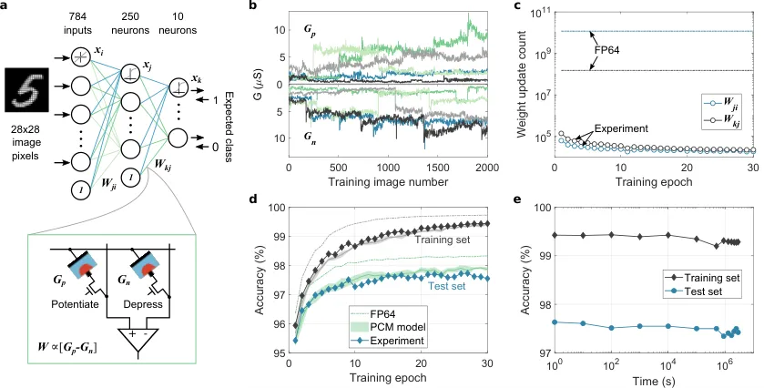
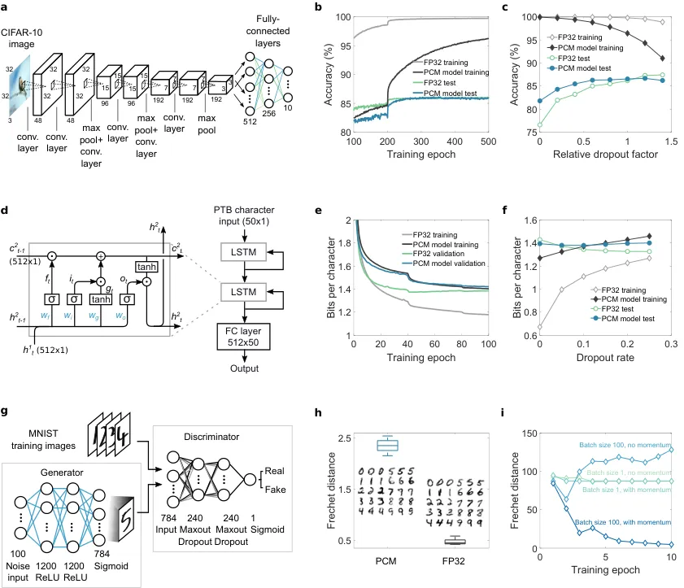

# Mixed-precision deep learning based on computational memory

S. R. Nandakumar Affiliation: IBM Research - Zurich, 8803 Rüschlikon,
Switzerland Affiliation: New Jersey Institute of Technology (NJIT),
Newark, NJ 07102, USA    Manuel Le Gallo Email: <anu@zurich.ibm.com>
Affiliation: IBM Research - Zurich, 8803 Rüschlikon, Switzerland   
Christophe Piveteau Affiliation: IBM Research - Zurich, 8803 Rüschlikon,
Switzerland Affiliation: ETH Zurich, 8092 Zurich, Switzerland    Vinay
Joshi Affiliation: IBM Research - Zurich, 8803 Rüschlikon, Switzerland
Affiliation: New Jersey Institute of Technology (NJIT), Newark, NJ
07102, USA    Giovanni Mariani Affiliation: IBM Research - Zurich, 8803
Rüschlikon, Switzerland    Irem Boybat Affiliation: IBM Research -
Zurich, 8803 Rüschlikon, Switzerland Affiliation: Ecole Polytechnique
Federale de Lausanne (EPFL), 1015 Lausanne, Switzerland    Geethan
Karunaratne Affiliation: IBM Research - Zurich, 8803 Rüschlikon,
Switzerland Affiliation: ETH Zurich, 8092 Zurich, Switzerland    Riduan
Khaddam-Aljameh Affiliation: IBM Research - Zurich, 8803 Rüschlikon,
Switzerland Affiliation: ETH Zurich, 8092 Zurich, Switzerland    Urs
Egger Affiliation: IBM Research - Zurich, 8803 Rüschlikon, Switzerland
   Anastasios Petropoulos Affiliation: IBM Research - Zurich, 8803
Rüschlikon, Switzerland Affiliation: University of Patras, 26504 Rio
Achaia, Greece    Theodore Antonakopoulos Affiliation: University of
Patras, 26504 Rio Achaia, Greece    Bipin Rajendran
Email: <bipin@njit.edu> Affiliation: New Jersey Institute of Technology
(NJIT), Newark, NJ 07102, USA    Abu Sebastian
Email: <ase@zurich.ibm.com> Affiliation: IBM Research - Zurich, 8803
Rüschlikon, Switzerland    Evangelos Eleftheriou Affiliation: IBM
Research - Zurich, 8803 Rüschlikon, Switzerland

August 24, 2026

###### Abstract

Deep neural networks (DNNs) have revolutionized the field of artificial
intelligence and have achieved unprecedented success in cognitive tasks
such as image and speech recognition. Training of large DNNs, however,
is computationally intensive and this has motivated the search for novel
computing architectures targeting this application. A computational
memory unit with nanoscale resistive memory devices organized in
crossbar arrays could store the synaptic weights in their conductance
states and perform the expensive weighted summations in place in a
non-von Neumann manner. However, updating the conductance states in a
reliable manner during the weight update process is a fundamental
challenge that limits the training accuracy of such an implementation.
Here, we propose a mixed-precision architecture that combines a
computational memory unit performing the weighted summations and
imprecise conductance updates with a digital processing unit that
accumulates the weight updates in high precision. A combined
hardware/software training experiment of a multilayer perceptron based
on the proposed architecture using a phase-change memory (PCM) array
achieves 97.73% test accuracy on the task of classifying handwritten
digits (based on the MNIST dataset), within 0.6% of the software
baseline. The architecture is further evaluated using accurate
behavioral models of PCM on a wide class of networks, namely
convolutional neural networks, long-short-term-memory networks, and
generative-adversarial networks. Accuracies comparable to those of
floating-point implementations are achieved without being constrained by
the non-idealities associated with the PCM devices. A system-level study
demonstrates 173$`\times`$ improvement in energy efficiency of the
architecture when used for training a multilayer perceptron compared
with a dedicated fully digital 32-bit implementation.

## I Introduction

Loosely inspired by the adaptive parallel computing architecture of the
brain, deep neural networks (DNNs) consist of layers of neurons and
weighted interconnections called synapses. These synaptic weights can be
learned using known real-world examples to perform a given
classification task on new unknown data. Gradient descent based
algorithms for training DNNs have been successful in achieving
human-like accuracy in several cognitive tasks. The training typically
involves three stages. During forward propagation, training data is
propagated through the DNN to determine the network response. The final
neuron layer responses are compared with the desired outputs to compute
the resulting error. The objective of the training process is to reduce
this error by minimizing a cost function. During backward propagation,
the error is propagated throughout the network layers to determine the
gradients of the cost function with respect to all the weights. During
the weight update stage, the weights are updated based on the gradient
information. This sequence is repeated several times over the entire
dataset, making training a computationally intensive task\[1\].
Furthermore, when training is performed on conventional von Neumann
computing systems that store the large weight matrices in off-chip
memory, constant shuttling of data between memory and processor occurs.
These aspects make the training of large DNNs very time-consuming, in
spite of the availability of high-performance computing resources such
as general purpose graphical processing units (GPGPUs). Also, the
high-power consumption of this training approach is prohibitive for its
widespread application in emerging domains such as the internet of
things and edge computing, motivating the search for new architectures
for deep learning.

In-memory computing is a non-von Neumann concept that makes use of the
physical attributes of memory devices organized in a computational
memory unit to perform computations in-place \[2\]. Recent
demonstrations include the execution of bulk bit-wise operations\[3\],
detection of temporal correlations \[4\], and matrix-vector
multiplications\[5, 6, 7, 8, 9, 10\]. The matrix-vector multiplications
can be performed in constant computational time complexity using
crossbar arrays of resistive memory (memristive) devices \[11, 5, 2\].
If the network weights are stored as the conductance states of the
memristive devices at the crosspoints, then the weighted summations (or
matrix-vector multiplications) necessary during the data-propagation
stages (forward and backward) of training DNNs can be performed in-place
using the computational memory, with significantly reduced data movement
\[12, 13, 14, 15, 16, 17\]. However, realizing accurate and gradual
modulations of the conductance of the memristive devices for the weight
update stage has posed a major challenge in utilizing computational
memory to achieve accurate DNN training \[18\].

The conductance modifications based on atomic rearrangement in nanoscale
memristive devices are stochastic, nonlinear, and asymmetric as well as
of limited granularity \[19, 20\]. This has led to significantly reduced
classification accuracies compared with software baselines in training
experiments using existing memristive devices\[12\]. There have been
several proposals to improve the precision of synaptic devices. A
multi-memristive architecture uses multiple devices per synapse and
programs one of them chosen based on a global selector during weight
update\[21\]. Another approach, which uses multiple devices per synapse,
further improves the precision by assigning significance to the devices
as in a positional number system such as base two. The smaller updates
are accumulated in the least significant synaptic device and
periodically carried over to higher significant analog memory devices
accurately\[22\]. Hence, all devices in the array must be reprogrammed
every time the carry is performed, which brings additional time and
energy overheads. A similar approach uses a 3T1C (3 transistor 1
capacitor) cell to accumulate smaller updates and transfer them to PCM
periodically using closed-loop iterative programming\[23\]. So far, the
precision offered by these more complex and expensive synaptic
architectures has only been sufficient to demonstrate
software-equivalent accuracies in end-to-end training of multi-layer
perceptrons for MNIST image classification. All these approaches use a
parallel weight update scheme by sending overlapping pulses from the
rows and columns, thereby implementing an approximate outer product and
potentially updating all the devices in the array in parallel. Each
outer product needs to be applied to the arrays one at a time (either
after every training example or one by one after a batch of examples),
leading to a large number of pulses applied to the devices. This has
significant ramifications for device endurance, and the requirements on
the number of conductance states to achieve accurate training\[14, 18\].
Hence, this weight update scheme is best suited for fully-connected
networks trained one sample at a time and is limited to training with
stochastic gradient descent without momentum, which is a severe
constraint on its applicability to a wide range of DNNs. The use of
convolution layers, weight updates based on a mini-batch of samples as
opposed to a single one, optimizers such as ADAM\[24\], and techniques
such as batch normalization\[25\] have been crucial for achieving high
learning accuracy in recent DNNs.

Meanwhile, there is a significant body of work in the conventional
digital domain using reduced precision arithmetic for accelerating DNN
training\[26, 27, 28, 29, 30\]. Recent studies show that it is possible
to reduce the precision of the weights used in the multiply-accumulate
operations (during the forward and backward propagations) to even 1 bit,
as long as the weight gradients are accumulated in high-precision
\[27\]. This indicates the possibility of accelerating DNN training
using programmable low-precision computational memory, provided that we
address the challenge of reliably maintaining the high-precision
gradient information. Designing the optimizer in the digital domain
rather than in the analog domain permits the implementation of complex
learning schemes that can be supported by general-purpose computing
systems, as well as maintaining the high-precision in the gradient
accumulation, which is necessary to be as high as 32-bit for training
state-of-the-art networks \[31\]. However, in contrast to the fully
digital mixed-precision architectures which uses statistically accurate
rounding operations to convert high-precision weights to low precision
weights and subsequently make use of error-free digital computation, the
weight updates in analog memory devices using programming pulses are
highly inaccurate and stochastic. Moreover, the weights stored in the
computational memory are affected by noise and temporal conductance
variations. Hence, it is not evident if the digital mixed-precision
approach translates successfully to a computational memory based deep
learning architecture.

Building on these insights, we present a mixed-precision computational
memory architecture (MCA) to train DNNs. First, we experimentally
demonstrate the efficacy of the architecture to deliver performance
close to equivalent floating-point simulations on the task of
classifying handwritten digits from the MNIST dataset. Subsequently, we
validate the approach through simulations to train a convolutional
neural network (CNN) on the CIFAR-10 dataset, a long-short-term-memory
(LSTM) network on the Penn Treebank dataset, and a
generative-adversarial network (GAN) to generate MNIST digits.

## II Results

### II.1 Mixed-precision computational memory architecture

Figure 1: Mixed-precision computational memory architecture for deep
learning. a A neural network consisting of layers of neurons with
weighted interconnects. During forward propagation, the neuron response,
$`x_{i}`$, is weighted according to the connection strengths,
$`W_{ji}`$, and summed. Subsequently, a non-linear function, $`f`$, is
applied to determine the next neuron layer response, $`x_{j}`$. During
backward propagation, the error, $`\delta_{j}`$, is back-propagated
though the weight layer connections, $`W_{ji}`$, to determine the error,
$`\delta_{i}`$, of the preceding layer. b The mixed-precision
architecture consisting of a computational memory unit and a
high-precision digital unit. The computational memory unit has several
crossbar arrays whose device conductance values $`G_{ji}`$ represent the
weights $`W_{ji}`$ of the DNN layers. The crossbar arrays perform the
weighted summations during the forward and backward propagations. The
resulting $`x`$ and $`\delta`$ values are used to determine the weight
updates, $`\Delta W`$, in the digital unit. The $`\Delta W`$ values are
accumulated in the variable, $`\chi`$. The conductance values are
updated using $`p=\lfloor\chi/\epsilon\rfloor`$ number of pulses applied
to the corresponding devices in the computational memory unit, where
$`\epsilon`$ represents the device update granularity.

A schematic illustration of the MCA for training DNNs is shown in
Fig. 1. It consists of a computational memory unit comprising several
memristive crossbar arrays, and a high-precision digital computing unit.
If the weights $`W_{ji}`$ in any layer of a DNN (Fig. 1a) are mapped to
the device conductance values $`G_{ji}`$ in the computational memory
with an optional scaling factor, then the desired weighted summation
operation during the data-propagation stages of DNN training can be
implemented as follows. For the forward propagation, the neuron
activations, $`x_{i}`$, are converted to voltages, $`V_{x_{i}}`$, and
applied to the crossbar rows. Currents will flow through individual
devices based on their conductance and the total current through any
column, $`I_{j}=\Sigma_{i}G_{ji}V_{x_{i}}`$, will correspond to
$`\Sigma_{i}W_{ji}x_{i}`$, that becomes the input for the next neuron
layer. Similarly, for the backward propagation through the same layer,
the voltages $`V_{\delta_{j}}`$ corresponding to the error
$`\delta_{j}`$ are applied to the columns of the same crossbar array and
the weighted sum obtained along the rows,
$`\Sigma_{j}W_{ji}\delta_{j}`$, can be used to determine the error
$`\delta_{i}`$ of the preceding layer.

The desired weight updates are determined as
$`\Delta W_{ji}=\eta\delta_{j}x_{i}`$, where $`\eta`$ is the learning
rate. We accumulate these updates in a variable $`\chi`$ in the
high-precision digital unit. The accumulated weight updates are
transferred to the devices by applying single-shot programming pulses,
without using an iterative read-verify scheme. Let $`\epsilon`$ denote
the average conductance change that can be reliably programmed into the
devices in the computation memory unit using a given pulse. Then, the
number of programming pulses $`p`$ to be applied can be determined by
rounding $`\chi/\epsilon`$ towards zero. The programming pulses are
chosen to increase or decrease the device conductance depending on the
sign of $`p`$, and $`\chi`$ is decremented by $`p\epsilon`$ after
programming. Effectively, we are transferring the accumulated weight
update to the device when it becomes comparable to the device
programming granularity. Note that the conductances are updated by
applying programming pulses blindly without correcting for the
difference between the desired and observed conductance change. In spite
of this, the achievable accuracy of DNNs trained with MCA is extremely
robust to the nonlinearity, stochasticity, and asymmetry of conductance
changes originating from existing nanoscale memristive devices \[32\].

### II.2 Characterization and modeling of PCM devices

Figure 2: Phase-change memory characterization experiments and model
response. a The mean and standard deviation of device conductance values
(and the corresponding model response) as a function of the number of
SET pulses of 90 $`\mu`$A amplitude and 50 ns duration. The 10,000 PCM
devices used for the measurement were initialized to a distribution
around $`0.06\,\mu`$S. b The distribution of conductance values compared
to that predicted by the model after the application of 15 SET pulses. c
The average conductance drift of the states programmed after each SET
pulse. The corresponding model fit is based on the relation,
$`G(t)=G(t_{0})(t/t_{0})^{-\nu}`$, that relates the conductance $`G`$
after time $`t`$ from programming to the conductance measurement at time
$`t_{0}`$ and drift exponent $`\nu`$. d Experimentally measured
conductance evolution from 5 devices upon application of successive SET
pulses compared to that predicted by the model. These measurements are
based on 50 reads that follow each of the 20 programming instances.

Phase-change memory (PCM) devices are used to realize the computational
memory for the experimental validation of MCA. PCM is arguably the most
advanced memristive technology that has found applications in the space
of storage-class memory\[33\] and novel computing paradigms such as
neuromorphic computing \[34, 35, 36\] and computational memory \[37, 4,
7\]. A PCM device consists of a nanometric volume of a chalcogenide
phase-change alloy sandwiched between two electrodes. The phase-change
material is in the crystalline phase in an as-fabricated device. By
applying a current pulse of sufficient amplitude (typically referred to
as the RESET pulse) an amorphous region around the narrow bottom
electrode is created via melt-quench process. The resulting
“mushroom-type” phase configuration is schematically shown in Fig. 2a.
The device will be in a high resistance state if the amorphous region
blocks the conductance path between the two electrodes. This amorphous
region can be partially crystallized by a SET pulse that heats the
device (via Joule heating) to its crystallization temperature
regime\[38\]. With the successive application of such SET pulses, there
is a progressive increase in the device conductance. This analog storage
capability and the accumulative behavior arising from the
crystallization dynamics are central to the application of PCM in
training DNNs.

We employ a prototype chip fabricated in 90 nm CMOS technology
integrating an array of doped Ge₂Sb₂Te₅ (GST) PCM devices (see methods).
To characterize the gradual conductance evolution in PCM, 10,000 devices
are initialized to a distribution around 0.06 $`\mu`$S and are
programmed with a sequence of 20 SET pulses of amplitude 90 $`\mu`$A and
duration 50 ns. The conductance changes show significant randomness,
which is attributed to the inherent stochasticity associated with the
crystallization process \[39\], together with device-to-device
variability \[21, 35\]. The statistics of cumulative conductance
evolution are shown in Fig. 2a. The conductance evolves in a
state-dependent manner and tends to saturate with the number of
programming pulses, hence exhibiting a nonlinear accumulative behavior.
We analyzed the conductance evolution due to the SET pulses, and
developed a comprehensive statistical model capturing the accumulative
behavior that shows remarkable agreement with the measured data\[40\]
(See Fig. 2a,b and Supplementary Note 1). Note that, the conductance
response curve is unidirectional and hence asymmetric as we cannot
achieve a progressive decrease in the conductance values with the
application of successive RESET pulses of the same amplitude.

The devices also exhibit a drift behavior attributed to the structural
relaxation of the melt-quenched amorphous phase \[41\]. The mean
conductance evolution after each programming event as a function of time
is plotted in Fig. 2c. Surprisingly, we find that the drift re-initiates
every time a SET pulse is applied\[40\] (see Supplementary Note 1),
which could be attributed to the creation of a new unstable glass state
due to the atomic rearrangement that is triggered by the application of
each SET pulse. In addition to the conductance drift, there are also
significant fluctuations in the conductance values (read noise) mostly
arising from the $`1/f`$ noise exhibited by amorphous phase-change
materials \[42\]. The statistical model response from a few instances
incorporating the programming non-linearity, stochasticity, drift, and
instantaneous read noise along with actual device measurements are shown
in Fig. 2d, indicating the similar trend in conductance evolution
between the model and the experiment at an individual device level.

### II.3 Training experiment for handwritten digit classification



Figure 3: MCA training experiment using on-chip PCM devices for
handwritten digit classification. a Network structure used for the
on-chip mixed-precision training experiment for MNIST data
classification. Each weight, $`W`$, in the network is realized as the
difference in conductance values of two PCM devices, $`G_{p}`$ and
$`G_{n}`$. b Stochastic conductance evolution during training of
$`G_{p}`$ and $`G_{n}`$ values corresponding to 5 arbitrarily chosen
synaptic weights from the second layer. c The number of device updates
per epoch from the two weight layers in mixed-precision training
experiment and high-precision software training (FP64), showing the
highly sparse nature of weight update in MCA. d Classification
accuracies on the training and test set from the mixed-precision
training experiment. The maximum experimental test set accuracy, 97.73%,
is within 0.57% of that obtained in the FP64 training . The experimental
behavior is closely matched by the training simulation using the PCM
model. e Inference performed using the trained PCM weights on-chip on
the training and test dataset as a function of time elapsed after
training showing negligible accuracy drop over a period of one month.

We experimentally demonstrate the efficacy of the MCA by training a
two-layer perceptron to perform handwritten digit classification
(Fig. 3a). Each weight of the network, $`W`$, is realized using two PCM
devices in a differential configuration ($`W\propto(G_{p}-G_{n})`$). The
198,760 weights in the network are mapped to 397,520 PCM devices in the
hardware platform (see methods). The network is trained using 60,000
training images from the MNIST dataset for 30 epochs. The devices are
initialized to a conductance distribution with mean $`1.6\,\mu`$S and
standard deviation of $`0.83\,\mu`$S. These device conductance values
are read from hardware, scaled to the network weights, and used for the
data-propagation stages. The resulting weight updates are accumulated in
the variable $`\chi`$. When the magnitude of $`\chi`$ exceeds
$`\epsilon`$ (= 0.096, corresponding to an average conductance change of
$`0.77\,\mu`$S per programming pulse), a $`50\,`$ns pulse with an
amplitude of $`90\,\mu`$A is applied to $`G_{p}`$ to increase the weight
if $`\chi>0`$ or to $`G_{n}`$ to decrease the weight if $`\chi<0`$;
$`|\chi|`$ is then reduced by $`\epsilon`$. These device updates are
performed using blind single-shot pulses without a read-verify operation
and the device states are not used to determine the number or shape of
programming pulses. Since the continuous SET programming could cause
some of the devices to saturate during training, a weight refresh
operation is performed every 100 training images to detect and reprogram
the saturated synapses. After each training example involving a device
update, all the devices in the second layer and 785 pairs of devices
from the first layer are read along with the updated conductance values
to use for the subsequent data-propagation step (see Methods). A
separate validation experiment confirms that near identical results are
obtained when the read voltage is varied in accordance with the neuron
activations and error vectors for every matrix-vector multiplication
during training and testing (see Supplementary Note 2). The resulting
evolution of conductance pairs, $`G_{p}`$ and $`G_{n}`$, for five
arbitrarily chosen synapses from the second layer is shown in Fig. 3b.
It illustrates the stochastic conductance update, drift between multiple
training images, and the read noise experienced by the neural network
during training. Also, due to the accumulate-and-program nature of the
mixed-precision training, only a few devices are updated after each
image. In Fig. 3c, the number of weight updates per epoch in each layer
during training is shown. Compared to the high-precision training where
all the weights are updated after each image, there are more than three
orders of magnitude reduction in the number of updates in the
mixed-precision scheme, thereby reducing the device programming
overhead.

At the end of each training epoch, all the PCM conductance values are
read from the array and are used to evaluate the classification
performance of the network on the entire training set and on a disjoint
set of 10,000 test images (Fig. 3d). The network achieved a maximum test
accuracy of $`97.73\%`$, only $`0.57\%`$ lower than the equivalent
classification accuracy of $`98.30\%`$ achieved in the high-precision
training. The high-precision comparable training performance achieved by
the MCA, where the computational memory comprises noisy non-linear
devices with highly stochastic behavior, demonstrates the existence of a
solution to these complex deep learning problems in the device-generated
weight space. And even more remarkably, it highlights the ability of the
MCA to successfully find such solutions. We used the PCM model to
validate the training experiment using simulations and the resulting
training and test accuracies are plotted in Fig. 3d. The model was able
to predict the experimental classification accuracies on both the
training and the test sets within 0.3 %, making it a valuable tool to
evaluate the trainability of PCM-based computational memory for more
complex deep learning applications. The model was also able to predict
the distribution of synaptic weights across the two layers remarkably
well (see Supplementary Note 3). It also indicated that the accuracy
drop from the high-precision baseline training observed in the
experiment is mostly attributed to PCM programming stochasticity (see
Supplementary Note 4). After training, the network weights in the PCM
array were read repeatedly over time and the classification performance
(inference) was evaluated (Fig. 3e). It can be seen that the
classification accuracy drops by a mere 0.3 % over a time period
exceeding a month. This clearly illustrates the feasibility of using
trained PCM based computational memory as an inference engine (see
Methods).

The use of PCM devices in a differential configuration necessitates the
refresh operation. Even though experiments show that the training
methodology is robust to a range of refresh schemes (see Supplementary
Note 5), it does lead to additional complexity. But remarkably, the
mixed-precision scheme can deal with even highly asymmetric conductance
responses such as in the case where a single PCM device is used to
represent the synaptic weights. We performed such an experiment
realizing potentiation via SET pulses while depression was achieved
using a RESET pulse. To achieve a bipolar weight distribution, a
reference conductance level was introduced (see Methods). By using
different values of $`\epsilon`$ for potentiation and depression, a
maximum test accuracy of $`97.47\%`$ was achieved within 30 training
epochs (see Supplementary Figure 1). These results conclusively show the
efficacy of the mixed-precision training approach and provide a pathway
to overcome the stringent requirements on the device update precision
and symmetry hitherto thought to be necessary to achieve high
performance from memristive device based learning systems\[12, 14, 43,
23\].

### II.4 Training simulations of larger networks



Figure 4: MCA training validation on complex networks. a Convolutional
neural network for image classification on CIFAR-10 dataset used for MCA
training simulations. The two convolution layers followed by maxpooling
and dropout are repeated thrice, and are followed by three
fully-connected layers. b The classification performance on the training
and the test datasets during training. It can be seen that the test
accuracy corresponding to MCA-based training eventually exceeds that
from the high-precision (FP32) training. c The maximal training and test
accuracies obtained as a function of the dropout rates. In the absence
of dropout, MCA-based training significantly outperforms FP32-based
training. d The LSTM network used for MCA training simulations. Two LSTM
cells with 512 hidden units followed by a fully-connected (FC) layer are
used. e The BPC as a function of the epoch number on training and
validation sets shows that after 100 epochs, the validation BPC is
comparable between the MCA and FP32 approaches. The network uses a
dropout rate of 0.15 between non-recurring connections. f The best BPC
obtained after training as a function of the dropout rate indicates that
without any dropout, MCA-based training delivers better test performance
(lower BPC) than FP32 training. g The GAN network used for MCA training
simulations. The generator and discriminator networks are
fully-connected. The discriminator and the generator are trained
intermittently using real images from the MNIST dataset and the
generated images from the generator. h The Frechet distance obtained
from MCA training and the generated images are compared to that obtained
from the FP32 training. i The performance measured in terms of the
Frechet distance as a function of the number of epochs obtained for
different mini-batch sizes and optimizers for FP32 training. To obtain
convergence, mini-batch size greater than 1 and the use of momentum are
necessary in the training of the GAN.

The applicability of the MCA training approach to a wider class of
problems is verified by performing simulation studies based on the PCM
model described in Section II.2. The simulator is implemented as an
extension to the TensorFlow deep learning framework. Custom TensorFlow
operations are implemented that take into account the various attributes
of the PCM devices such as stochastic and nonlinear conductance update,
read noise, and conductance drift as well as the characteristics of the
data converters (see Methods and Supplementary Note 6). This simulator
is used to evaluate the efficacy of the MCA on three networks: a CNN for
classifying CIFAR-10 dataset images, an LSTM network for character level
language modeling, and a GAN for image synthesis based on the MNIST
dataset.

CNNs have become a central tool for many domains in computer vision and
also for other applications such as audio analysis in the frequency
domain. Their power stems from the translation-invariant weight sharing
that significantly reduces the number of parameters needed to extract
relevant features from images. As shown in Fig. 4a, the investigated
network consists of three sets of two convolution layers with ReLU
(rectified linear unit) activation followed by max-pooling and dropout,
and three fully-connected layers at the end. This network has
approximately 1.5 million trainable parameters in total (see methods and
Supplementary Note 7). The convolution layer weights are mapped to the
PCM devices of the computational memory crossbar arrays by unrolling the
filter weights and stacking them to form a 2D matrix \[44\]. The network
is trained on the CIFAR-10 benchmark dataset using stochastic gradient
descent (SGD) with a minibatch of 51 images and light data augmentation.
The training and test classification accuracies as a function of
training epochs are shown in Fig. 4b. The maximal test accuracy of the
network trained via MCA ($`86.46\pm 0.25\%`$) is similar to that
obtained from equivalent high-precision training using 32-bit
floating-point precision (FP32) ($`86.24\pm 0.19\%`$). However, this is
achieved while having a significantly lower training accuracy for MCA,
which is suggestive of some beneficial regularization effects arising
from the use of stochastic PCM devices to represent synaptic weights. To
understand this regularization effect further, we investigated the
maximal training and test accuracies as a function of the dropout rates
(see Fig. 4c)(see methods for more details). It was found that the
optimal dropout rate for the network trained via MCA is lower than that
for the network trained in FP32. Indeed, if the dropout rate is tuned
properly, the test accuracy of the network trained in FP32 could
marginally outperform that of the one trained with MCA. Without any
dropout, the MCA-trained network outperforms the one trained via FP32
which suffers from significant overfitting.

LSTM networks are a class of recurrent neural networks used mainly for
language modeling and temporal sequence learning. The LSTM cells are a
natural fit for crossbar arrays, as they basically consist of
fully-connected layers \[45\]. We use a popular benchmark dataset called
Penn Treebank (PTB)\[46\] for training the LSTM network (Fig. 4d) using
MCA. The network consists of two LSTM modules, stacked with a final
fully-connected layer, and has a total of 3.3 million trainable
parameters (see Supplementary Note 7). The network is trained using
sequences of text from the PTB dataset to predict the next character in
the sequence. The network response is a probability distribution for the
next character in the sequence. The performance in a character level
language modeling task is commonly measured using bits-per-character
(BPC), which is a measure of how well the model is able to predict
samples from the true underlying probability distribution of the
dataset. A lower BPC corresponds to a better model. The MCA based
training and validation curves are shown in Fig. 4e (see methods for
details). While the validation BPC from MCA and FP32 at the end of
training are comparable, the difference between training and validation
BPC is significantly smaller in MCA. The BPC obtained on the test set
after MCA and FP32 training for different dropout rates are shown in
Fig. 4f. The optimal dropout rate that gives the lowest BPC for MCA is
found to be lower than that for FP32, indicating regularization effects
similar to those observed in the case of the CNN.

GANs are neural networks trained using an recently proposed adversarial
training method\[47\]. The investigated network has two parts: a
generator network that receives random noise as input and attempts to
replicate the distribution of the training dataset and a discriminator
network that attempts to distinguish between the training (real) images
and the generated (fake) images. The network is deemed converged when
the discriminator is no longer able to distinguish between the real and
the fake images. Using the MNIST dataset, we successfully trained the
GAN network shown in Fig. 4g with MCA (see methods for details). The
performance of the generator to replicate the training dataset
distribution is often evaluated using the Frechet distance (FD)\[48\].
Even though the FD achieved by MCA training is slightly higher than that
of FP32 training, the resulting generated images appear quite similar
(see Fig. 4h). The training of GANs is particularly sensitive to the
mini-batch size and the choice of optimizers, even when training in
FP32. As shown in Fig. 4i, the solution converges to an optimal value
only in the case of a mini-batch size of 100 and when stochastic
gradient descent with momentum is used; we observed that the solution
diverges in the other cases. Compared to alternate in-memory computing
approaches where both the propagation and weight updates are performed
in the analog domain \[23\], a significant advantage of the proposed MCA
approach is its ability to seamlessly incorporate these more
sophisticated optimizers as well as the use of mini-batch sizes larger
than one during training.

## III Discussion

We demonstrated via experiments and simulations that the MCA can train
PCM based analog synapses in DNNs to achieve accuracies comparable to
those from the floating-point software training baselines. Here, we
assess the overall system efficiency of the MCA for an exemplary problem
and discuss pathways for achieving performance superiority as a general
deep learning accelerator. We designed an application specific
integrated circuit (ASIC) in 14 nm low power plus (14LPP) technology to
perform the digital computations in the MCA and estimated the training
energy per image, including that spent in the computational memory and
the associated peripheral circuits (designed in 14LPP as well). The
implementation was designed for the two-layer perceptron performing
MNIST handwritten digit classification used in the experiments of
Section II.3. For reference, an equivalent high-precision ASIC training
engine was designed in 14LPP using 32-bit fixed-point format for data
and computations with an effective throughput of 43k images/s at 0.62 W
power consumption (see Methods and Supplementary Note 8 for details). In
both designs, all the memory necessary for training was implemented with
on-chip static random-access memory. The MCA design resulted in
271$`\times`$ improvement in energy consumption for the forward and
backward stages of training. Since the high-precision weight update
computation and accumulation are the primary bottleneck for
computational efficiency in the MCA, we implemented the outer-products
for weight update computation using low-precision versions of the neuron
activations and back-propagated errors \[30, 29, 49\], achieving
comparable test accuracy with respect to the experiment of Section II.3
(see Supplementary Note 8). Activation and error vectors were
represented using signed 3-bit numbers and shared scaling factors. The
resulting weight update matrices were sparse with less than 1% non-zero
entries on average. This proportionally reduced accesses to the 32-bit
$`\chi`$ memory allocated for accumulating the weight updates. Necessary
scaling operations for the non-zero entries were implemented using
bit-shifts \[50, 49\], thereby reducing the computing time and hardware
complexity. Additional device programming overhead was negligible, since
on average only 1 PCM device was programmed every 2 training images.
This resulted in 139$`\times`$ improvement in the energy consumption for
the weight update stage in MCA with respect to the 32-bit design.
Combining the three stages, the MCA achieved a 11.5$`\times`$ higher
throughput at 173$`\times`$ lower energy consumption with respect to the
32-bit implementation (see Table 1). We also compared the MCA with a
fully digital mixed-precision ASIC in 14LPP, which uses 4-bit weights
and 8-bit activations/errors for the data propagation stages. This
design uses the same weight update implementation as the MCA design, but
replaces the computational memory by a digital multiply-accumulate unit.
The MCA achieves an overall energy efficiency gain of 23$`\times`$ with
respect to this digital mixed-precision design (see Methods).

| Architecture                            | Parameter | Forward propagation | Backward propagation | Weight update  | Total          |
| --------------------------------------- | --------- | ------------------- | -------------------- | -------------- | -------------- |
| 32-bit design                           | Energy    | 5.62 $`\mu`$J       | 0.09 $`\mu`$J        | 8.64 $`\mu`$J  | 14.35 $`\mu`$J |
|                                         | Time      | 7.31 $`\mu`$s       | 0.59 $`\mu`$s        | 15.36 $`\mu`$s | 23.27 $`\mu`$s |
| Fully digital mixed-precision design    | Energy    | 1.78 $`\mu`$J       | 0.016 $`\mu`$J       | 0.076 $`\mu`$J | 1.87 $`\mu`$J  |
| 4-bit weights, 8-bit activations/errors | Time      | 6.41 $`\mu`$s       | 0.13 $`\mu`$s        | 0.79 $`\mu`$s  | 7.33 $`\mu`$s  |
| MCA – computational memory              | Energy    | 7.27 nJ             | 2.15 nJ              | 0.05 nJ        |                |
|                                         | Time      | 0.26 $`\mu`$s       | 0.13 $`\mu`$s        | –              |                |
| MCA – digital unit                      | Energy    | 8.91 nJ             | 2.73 nJ              | 61.98 nJ       |                |
|                                         | Time      | 0.34 $`\mu`$s       | 0.09 $`\mu`$s        | 1.19 $`\mu`$s  |                |
| MCA – total                             | Energy    | 16.18 nJ            | 4.88 nJ              | 62.03 nJ       | 83.08 nJ       |
|                                         | Time      | 0.61 $`\mu`$s       | 0.22 $`\mu`$s        | 1.19 $`\mu`$s  | 2.01 $`\mu`$s  |

Table 1: Energy and time estimated based on application specific
integrated circuit (ASIC) designs for processing one training image in
MCA and corresponding fully digital 32-bit and mixed-precision designs.
The numbers are for a specific two-layer perceptron with 785 input
neurons, 250 hidden neurons, and 10 output neurons.

While the above study was limited to a simple two-layer perceptron, deep
learning with MCA could generally have the following benefits over fully
digital implementations. For larger networks, digital deep learning
accelerators as well as the MCA will have to rely on dynamic
random-access memory (DRAM) to store the model parameters, activations,
and errors, which will significantly increase the cost of access to
those variables compared with on-chip SRAM. Hence, implementing DNN
weights in nanoscale memory devices could enable large neural networks
to be fit on-chip without expensive off-chip communication during the
data propagations. Analog crossbar arrays implementing matrix-vector
multiplications in $`\mathcal{O}(1)`$ time permit orders of magnitude
computational acceleration of the data-propagation stages\[51, 10, 14\].
Analog in-memory processing is a desirable trade-off of numerical
precision for computational energy efficiency, as a growing number of
DNN architectures are being demonstrated to support low precision
weights\[27, 52\]. In contrast to digital mixed-precision ASIC
implementations, where the same resources are shared among all the
computations, the dedicated weight layers in MCA permit more efficient
inter and intra layer pipelines\[53, 54\]. Handling the control of such
pipelines for training various network topologies adequately with
optimized array-to-array communication, which is a non-trivial task,
will be crucial in harnessing the efficiency of the MCA for deep
learning. Compared with the fully analog accelerators being
explored\[22, 23, 43\], the MCA requires an additional high-precision
digital memory of same size as the model, and the need to access that
memory during the weight update stage. However, the digital
implementation of the optimizer in the MCA provides high-precision
gradient accumulation and the flexibility to realize a wide class of
optimization algorithms, which are highly desirable in a general deep
learning accelerator. Moreover, the MCA significantly relaxes the analog
synaptic device requirements, particularly those related to linearity,
variability, and update precision to realize high-performance learning
machines. In contrast to the periodic carry approach\[22, 23\], it
avoids the need of reprogramming all the weights at specific intervals
during training. Instead, single-shot blind pulses are applied to chosen
synapses at every weight update, resulting in sparse device programming.
This relaxes the overall reliability and endurance requirements of the
nanoscale devices and reduces the time and energy spent to program them.

In summary, we proposed a mixed-precision computational memory
architecture for training DNNs and experimentally demonstrated its
ability to deliver performance close to equivalent 64-bit floating-point
simulations. We used a prototype phase-change memory (PCM) chip to
perform the training of a two-layer perceptron containing 198,760
synapses on the MNIST dataset. We further validated the approach by
training a CNN on the CIFAR-10 dataset, an LSTM network on the Penn
Treebank dataset, and a GAN to generate MNIST digits. The training of
these larger networks was performed through simulations using a PCM
behavioral model that matches the characteristics of our prototype
array, and achieved accuracy close to 32-bit software training in all
the three cases. We also showed evidence for inherent regularization
effects originating from the non-linear and stochastic behavior of these
devices that is indicative of futuristic learning machines exploiting
rather than overcoming the underlying operating characteristics of
nanoscale devices. These results show that the proposed architecture can
be used to train a wide range of DNNs in a reliable and flexible manner
with existing memristive devices, offering a pathway towards more
energy-efficient deep learning than with general-purpose computing
systems.

## Methods

### PCM-based hardware platform

The experimental hardware platform is built around a prototype
phase-change memory (PCM) chip that contains 3 million PCM
devices\[55\]. The PCM devices are based on doped Ge₂Sb₂Te₅ (GST) and
are integrated into the chip in 90 nm CMOS baseline technology. In
addition to the PCM devices, the chip integrates the circuitry for
device addressing, on-chip ADC for device readout, and voltage- or
current-mode device programming. The experimental platform comprises a
high-performance analog-front-end (AFE) board that contains a number of
digital-to-analog converters (DACs) along with discrete electronics such
as power supplies, voltage and current reference sources. It also
comprises an FPGA board that implements the data acquisition and the
digital logic to interface with the PCM device under test and with all
the electronics of the AFE board. The FPGA board also contains an
embedded processor and ethernet connection that implement the overall
system control and data management as well as the interface with the
host computer. The embedded microcode allows the execution of the
multi-device programming and readout experiments that implement the
matrix-vector multiplications and weight updates on the PCM chip. The
hardware modules implement the interface with the external DACs used to
provide various voltages to the chip for programming and readout, as
well as the interface with the memory device under test, i.e., the
addressing interface, the programming-mode or read-mode interfaces, etc.

The PCM device array is organized as a matrix of 512 word lines (WL) and
2048 bit lines (BL). Each individual device along with its access
transistor occupies an area of 50 F² (F is the technology feature size,
$`\text{F}=90`$ nm). The PCM devices were integrated into the chip in
90 nm CMOS technology using a sub-lithographic key-hole transfer
process\[56\]. The bottom electrode has a radius of $`\sim`$ 20 nm and a
length of $`\sim`$ 65 nm. The phase change material is $`\sim 100`$ nm
thick and extends to the top electrode, whose radius is $`\sim 100`$ nm.
The selection of one PCM device is done by serially addressing a WL and
a BL. The addresses are decoded and they then drive the WL driver and
the BL multiplexer. The single selected device can be programmed by
forcing a current through the BL with a voltage-controlled current
source. For reading a PCM device, the selected BL is biased to a
constant voltage of 300 mV by a voltage regulator via a voltage
$`V_{\mathrm{read}}`$ generated off-chip. The sensed current,
$`I_{\mathrm{read}}`$, is integrated by a capacitor, and the resulting
voltage is then digitized by the on-chip 8-bit cyclic ADC. The total
time of one read is $`1`$ $`\mu`$s. The readout characteristic is
calibrated via the use of on-chip reference polysilicon resistors. For
programming a PCM device, a voltage $`V_{\mathrm{prog}}`$ generated
off-chip is converted on-chip into a programming current,
$`I_{\mathrm{prog}}`$. This current is then mirrored into the selected
BL for the desired duration of the programming pulse. Each programming
pulse is a box-type rectangular pulse with duration of 10 ns to 400 ns
and amplitude varying between 0 and 500 $`\mu`$A. The access-device gate
voltage (WL voltage) is kept high at 2.75 V during programming.
Iterative programming, which is used for device initialization in our
experiments, is achieved by applying a sequence of programming
pulses\[57\]. After each programming pulse, a verify step is performed
and the value of the device conductance programmed in the preceding
iteration is read at a voltage of 0.2 V. The programming current applied
to the PCM device in the subsequent iteration is adapted according to
the sign of the value of the error between the target level and read
value of the device conductance. The programming sequence ends when the
error between the target conductance and the programmed conductance of
the device is smaller than a desired margin or when the maximum number
of iterations (20) has been reached. The total time of one
program-and-verify step is approximately $`2.5`$ $`\mu`$s.

### Mixed-precision training experiment

Network details: The network used in the experiment had 784 inputs and 1
bias at the input layer, 250 sigmoid neurons and 1 bias at the hidden
layer, and 10 sigmoid neurons at the output layer. The network was
trained by minimizing the mean square error loss function with
stochastic gradient descent (SGD). The network was trained with a batch
size of 1, meaning that the weight updates were computed after every
training example. We used a fixed learning rate of 0.4. We used the full
MNIST training dataset of 60,000 images for training the network, and
the test dataset of 10,000 images for computing the test accuracy. The
order of the images was randomized for each training epoch. Apart from
normalizing the gray-scale images, no additional pre-processing was
performed on the training and test sets.

Differential PCM experiment: 397,520 devices were used from the PCM
hardware platform to represent the two-layer network (Fig. 3a) weights
in a differential configuration. The devices were initialized to a
conductance distribution with mean of $`1.6\,\mu`$S and standard
deviation of $`0.83\,\mu`$S via iterative programming. Since the
platform allowed only serial access to the devices, all the conductance
values were read from hardware and reported to the software that
performed the forward and backward propagations. The weight updates were
computed and accumulated in the $`\chi`$ memory in software. When the
magnitude of $`\chi`$ exceeded $`\epsilon`$ for a particular weight, a
$`50\,`$ns pulse with an amplitude of $`90\,\mu`$A was applied to the
corresponding device ($`G_{p}`$ or $`G_{n}`$, depending on the sign of
$`\chi`$) of the PCM chip. The synaptic conductance to weight conversion
was performed by a linear mapping between \[-8$`\,\mu`$S, 8$`\,\mu`$S\]
in the conductance domain and \[-1, 1\] in the weight domain.

The PCM devices exhibit temporal variations in the conductance values
such as conductance drift and read noise. As a result, each matrix
multiplication in every layer will see a slightly different weight
matrix even in the absence of any weight update. However, the cost of
re-reading the entire conductance array for every matrix-vector
multiplication in our experiment was prohibitively large due to the
serial interface. Therefore, after each programming event to the PCM
array, we read the conductance values of a subset of all the PCM devices
along with the programmed device. Specifically, we read all the devices
in the second layer and a set of 785 pairs of devices from the first
layer in a round robin fashion after every device programming event.
This approach faithfully captures the effects of PCM hardware noise and
drift in the network propagations during training. For the weight
refresh operation, the conductance pairs in software were verified every
100 training examples and if one of the device conductance values was
above 8 $`\mu`$S and if their difference was less than 6 $`\mu`$S, both
the devices were RESET using 500 ns, 360 $`\mu`$A pulses and their
difference was converted to a number of SET pulses based on an average
observed conductance change per pulse. During this weight refresh, the
maximum number of pulses was limited to 3 and the pulses were applied to
$`G_{p}`$ or $`G_{n}`$ depending on the sign of their initial
conductance difference.

Inference after training: After training, all the PCM conductance values
realizing the weights of the two-layer perceptron are read at different
time intervals and used to evaluate the classification accuracy on the
60,000 MNIST training images and 10,000 test images. Despite the
conductance drift, there was only negligible accuracy drop over a month.
The following factors might be contributing to this drift tolerance.
During on-chip training, different devices are programmed at different
times and are drifting during the training process. The training
algorithm could compensate for the error created by the conductance
drift and could eventually generate a more drift resilient solution.
Furthermore, the perceptron weights are implemented using the
conductance difference of two PCM devices. This differential
configuration partially compensates the effect of drift \[58\]. Also,
from the empirical relation for the conductance drift, we have
$`\frac{dG}{dt}\approx G(t_{0})\times t_{0}^{\nu}\frac{(-\nu)}{t}\propto\frac{1}{t}`$,
which means that the conductance decay over time decreases as we advance
in time. Drift compensation strategies such as using a global scaling
factor\[7\] could also be used in more complex deep learning models to
maintain the accuracy over extended periods of time.

Non-differential PCM experiment: A non-differential PCM configuration
for the synapse was tested in the mixed-precision training architecture
to implement both weight increment and decrement by programming the same
device in either direction and hence avoid the conductance saturation
and the associated weight refresh overhead. The non-accumulative RESET
behavior of the PCM device makes its conductance potentiation and
depression highly asymmetric and hence this experiment also validates
tolerance of the mixed-precision training architecture to such
programming asymmetry. We conducted the same training experiment as
before for the MNIST digit classification, except that now each synapse
was realized using a single PCM with a reference level to realize
bipolar weights. The experiment requires 198,760 PCM devices.
Potentiation is implemented by $`90\,\mu`$A, $`50\,`$ns SET pulses and
depression is implemented using $`400\,\mu`$A, $`50\,`$ns RESET pulses.
In the mixed-precision architecture, this asymmetric conductance update
behavior is compensated for by using different $`\epsilon`$s for
potentiation and depression. We used $`\epsilon_{P}`$ corresponding to
$`0.77\,\mu`$S for weight increment and $`\epsilon_{D}`$ corresponding
to $`8\,\mu`$S for weight decrement.

Ideally, the reference levels could be fabricated using any resistive
device which is one time programmed to the necessary conductance level.
In the case of PCM devices, due to their conductance drift, it is more
suitable to implement the reference levels using the PCM technology
which follows the same average drift behavior of the devices that
represent the synapses. In this experiment, we used the average
conductance of all the PCM devices read from the array to represent the
reference conductance level ($`G_{ref}`$), and hence the network weights
$`W\propto(G-G_{ref})`$. For the experiment, the devices are initialized
to a distribution with mean conductance of $`4.5\,\mu`$S and standard
deviation of $`1.25\,\mu`$S. While a narrower distribution was
desirable\[59\], it was difficult to achieve in the chosen
initialization range. However, this was compensated by mapping the
conductance values to a narrower weight range at the beginning of the
training. This weight range is progressively relaxed over the next few
epochs. The conductance range \[0.1, 8\]$`\,\mu`$S is mapped to \[-0.7,
0.7\] during epoch 1. Thereafter, the range is incremented in uniform
steps/epoch to \[-1, 1\] by epoch 3 and is held constant thereafter.
Also, the mean value of the initial conductance distribution was chosen
to be slightly higher than the midpoint of the conductance range to
compensate for the conductance drift. Irrespective of the conductance
change asymmetry, the training in MCA achieves a maximum training
accuracy of 98.77% and a maximum test accuracy of 97.47% in 30 epochs
(see Supplementary Figure 1).

### Training simulations of larger networks with PCM model

Simulator: The simulator is implemented as an extension to the
Tensorflow deep learning framework. The Tensorflow operations that can
be implemented on computational memory are replaced with custom
implementations. For example, the Ohm’s law and Kirchhoff’s circuit laws
replace the matrix-vector multiplications and are implemented based on
the PCM model described in Section II.2. The various non-idealities
associated with the PCM devices such as limited conductance range, read
noise and conductance drift as well as the quantization effects arising
from the data converters (with 8-bit quantization) are incorporated
while performing the matrix-vector multiplications. The synaptic weight
update routines are also replaced with custom ones that implement the
mixed-precision weight update accumulation and stochastic conductance
update using the model of the PCM described in Section II.2. In the
matrix-vector multiplication operations, the weight matrix represented
using stochastic PCM devices is multiplied by 8-bit fixed-point neuron
activations or normalized 8-bit fixed-point error vectors. Since the
analog current accumulation along the wires in the computational memory
unit can be assumed to have arbitrary precision, the matrix-vector
multiplication between the noisy modeled PCM weights and quantized
inputs is computed in 32-bit floating-point. In order to model the
peripheral analog to digital conversion, the matrix-vector
multiplication results are quantized back to 8-bit fixed-point. We
evaluated the effect of ADC precision on DNN training performance based
on the MNIST handwritten digit classification problem\[32\]. The
accuracy loss due to quantization was estimated to be approximately 0.1%
in MCA for 8-bit ADC, which progressively increases with reduced
precision. It is possible to reduce the ADC precision down to 4-bit at
the cost of a few percentage drop in accuracy for reduced circuit
complexity. However, we chose to maintain an 8-bit ADC precision for the
training of networks to maintain comparable accuracies with the 32-bit
precision baseline. The remaining training operations such as
activations, dropout, pooling, and weight update computations use 32-bit
floating-point precision.

Hence, these operations use original Tensorflow implementations in the
current simulations and can be performed in the digital unit of the MCA
in its eventual hardware implementation. Additional details on the
simulator can be found in Supplementary Note 6.

CNN: The CNN used for the simulation study has 9 layers - 6 convolution
layers and 3 fully-connected layers \[60\]. A pooling layer is inserted
after every two convolution layers. Together, the network has
approximately 1.5 million parameters. ReLU activation is used at all
convolution and fully-connected layers and softmax activation is used at
the output layer. Dropout regularization technique is employed after the
pooling layers and in-between the fully-connected layers. Light data
augmentation is also employed in the form of random image flipping and
random adjustments of brightness and contrast. To map the convolution
kernels to crossbar arrays, the filters are stretched out to 1D arrays
and horizontally stacked on the memristive crossbar \[44\]. The
different image patches are extracted from the input image, stretched
out and finally rearranged to form the columns of a large matrix. The
convolution can now be computed by performing the matrix-matrix
multiplication between these two matrices and subsequently, reordering
the output. In other words, the forward propagation of neuron
activations and the backward propagation of the errors can be
implemented as matrix-vector multiplications. The weight update for a
single image patch can be computed as the outer product of activation
and error vectors, and the weight updates arising from all image patches
are averaged to obtain the total weight update corresponding to the
entire input image. During the extraction process of the image patches,
the original image is padded with zero pixels at the border, to ensure
that the output of the convolution layer has the same image size as the
input. Considering an input image of size $`n\times n`$ and $`d`$
channels and $`m`$ convolution kernels of size $`k\times k`$, the
dimensions of the input matrix is $`dk^{2}\times n^{2}`$ and the
dimensions of the matrix on the crossbar array is $`dk^{2}\times m`$.
The convolution operation can therefore be performed in $`n^{2}`$
matrix-vector multiplication cycles. The pooling operations of the CNN
are performed in the conventional digital domain. The weight updates
computed from all the weight layers are accumulated in $`\chi`$ and are
subsequently transferred to the modeled PCM devices organized in
crossbar arrays. SGD with cross-entropy loss function is used for
training (for additional details see Supplementary Note 7).

Testing of the regularization effect observed during training of the
CNN: We observed that MCA achieves higher test accuracy with lower
training accuracy compared to the FP32 training. This is a desirable
effect referred to as regularization and techniques such as dropout are
typically employed to achieve this. We suspected that the stochastic
nature of the synaptic device prevents an over-fitting in this
architecture and hence allows to generalize better. To test this
hypothesis, we ran both FP32 and MCA training simulations using varying
dropout factors while keeping the other hyperparameters to be the same.
We scale both dropout rates ($`0.5`$ between the fully-connected and
$`0.25`$ after the pooling layers) with a scaling factor which takes the
values $`0.0,0.2,0.4,0.8,1.0,1.2,`$ and $`1.4`$. The resulting maximal
test accuracies are depicted in Fig. 4c. As dropout rates are reduced,
MCA training achieves higher test accuracies compared with FP32
training, indicating the inherent regularization achieved via MCA.

LSTM: The LSTM network trained using MCA for the task of character-level
language modelling contains roughly 3.3 million parameters (Fig. 4d). An
LSTM cell takes as input a hidden state from the previous time step
$`h^{l}_{t-1}`$ and the training data $`x_{t}`$ or the hidden state from
the previous layer $`h^{l-1}_{t}`$ and generates a new hidden state
$`h^{l}_{t}`$ and updates a cell state $`c^{l}`$ using the weights
$`w_{f}^{l}`$, $`w_{i}^{l}`$, $`w_{g}^{l}`$, $`w_{o}^{l}`$, for
$`l=1,2`$ according to the following relations:

```math
\displaystyle\begin{pmatrix}i_{t}\\
f_{t}\\
o_{t}\\
g_{t}\end{pmatrix} \displaystyle=\begin{pmatrix}\sigma\\
\sigma\\
\sigma\\
tanh\end{pmatrix}\left[W\begin{pmatrix}x_{t}\text{ or }h_{t}^{l-1}\\
h_{t-1}^{l}\end{pmatrix}+b^{l}\right] \tag{1}
```

```math
\displaystyle c_{t}^{l} \displaystyle=f_{t}\odot c_{t-1}^{l}+i_{t}\odot g_{t} \tag{3}
```

```math
\displaystyle h_{t}^{l} \displaystyle=o_{t}\odot tanh(c_{t}^{l}) \tag{4}
```

where $`sigmoid`$ ($`\sigma`$) and $`tanh`$ are applied element-wise and
$`\odot`$ is the element-wise multiplication. $`W`$ is obtained by
stacking $`w_{f}^{l}`$, $`w_{i}^{l}`$, $`w_{g}^{l}`$, $`w_{o}^{l}`$.
$`i_{t}`$, $`f_{t}`$, $`o_{t}`$, $`g_{t}`$, $`h_{t}^{l}`$, and
$`c_{t}^{l}`$ are of dimension $`n=512`$ and $`x_{t}`$ is of dimension
$`m=50`$. The weight matrix, $`W`$, is of dimension $`4n\times(n+m)`$ in
the first layer and $`4n\times 2n`$ in the second layer. $`b^{l}`$ is a
$`4n`$-dimensional bias vector. Dropout is applied to the non-recurrent
connections (i.e. at the output of each LSTM cell) \[61\]. The output of
the second LSTM cell is fed through a fully-connected layer with 50
output neurons and then through a softmax activation unit. The weights
in all the layers are represented and trained using PCM device models
organized in crossbar arrays (see Supplementary Note 7). The remaining
gating operations are performed in the conventional digital domain.

The PTB dataset has 5.1 million characters for training, 400k characters
for validation, and 450k character for testing. The vocabulary contains
50 different characters and the data is fed into the network as one-hot
encoded vectors of dimension ($`50\times 1`$), without any embedding.
Each vector has a single distinct location marked as 1 and the rest are
all zeros. We used SGD with cross-entropy loss function for training.
The training performance is evaluated using the bits-per-character (BPC)
metric, which is the average cross-entropy loss evaluated with base 2
logarithm.

Testing the regularization effect during training of the LSTM: To study
the regularization effect, the LSTM network was trained with different
dropout rates, from 0.0 to 0.25 in steps of 0.05. The resulting minimal
training and test BPC can be seen in Fig. 4f. The performance on the
test dataset was less sensitive to the dropout rate in MCA and it
achieved lower BPC without any dropout compared to FP32 based training.
This result is also consistent with previously reported studies of
training LSTMs using memristive crossbars \[62\]. Considering the rather
low number of parameters in the network, the test BPC results compare
favorably with the current state-of-the-art methods \[63\].

GAN: A multi-layer perceptron (MLP) implementation of GAN\[47\] was
employed with approximately 4 million trainable parameters. The
generator has 2 hidden layers with ReLU activations and an output layer
of sigmoid activation. The discriminator has 2 hidden layers with Maxout
activations (maximum out of its five inputs) and a sigmoid output layer.
Due to the large number of parameters in the discriminator, we used
dropout regularization with dropout rates 20% and 30% respectively after
its first and second hidden layers. The GAN is trained using 50,000
images from the MNIST dataset and its performance is evaluated using
10,000 test images. $`G_{\text{LOSS}}`$ and $`D_{\text{LOSS}}`$, which
represent the loss functions minimized to train the generator and
discriminator respectively, are as follows:

```math
\displaystyle G_{\text{LOSS}} \displaystyle=\sum log(D(G(z)) \tag{5}
```

```math
\displaystyle D_{\text{LOSS}} \displaystyle=\sum(log(D(x))+log(1-D(G(z)))) \tag{6}
```

where, $`x`$ and $`z`$ respectively are the MNIST images and the random
input noise. $`G(.)`$ and $`D(.)`$ represent the generator and the
discriminator networks and summation is over the training samples. Both
the networks are trained with SGD using a learning rate of 0.1 and a
momentum of 0.5. The weights in all the layers are represented and
trained using PCM device models organized in crossbar arrays (see
Supplementary Note 7 for more details on training).

The training performance of the GAN is evaluated using the Frechet
distance (FD), a metric that is robust even in the presence of common
failure modes in GAN\[64, 65, 66\]. FD makes use of features extracted
from a particular layer in a CNN trained to classify the training
dataset\[67\].

```math
FD=||\mu_{X}-\mu_{G}||_{2}^{2}+Tr(C_{X}+C_{G}-2(C_{X}\times C_{G})^{1/2}) \tag{7}
```

$`\mu_{X}`$ and $`\mu_{G}`$ denote the mean values of features computed
for the train/test dataset and the generated dataset, respectively.
$`C_{X}`$ and $`C_{G}`$ are covariance matrices of features computed for
the train/test dataset and the generated dataset, respectively. $`Tr`$
is the trace operator over a matrix and $`||.||_{2}`$ is the 2-norm
operator.

Study of batch size and optimizer for GAN: To study the sensitivity of
training GANs to the mini-batch size and the choice of optimizer used
for training, we trained FP32 (baseline) GAN implementation with two
mini-batch sizes of 1 and 100 and with two different optimizer types:
SGD without momentum and SGD with momentum while keeping all the other
hyper-parameters the same. Fig. 4i compares results in these cases.
Non-unity batch size with momentum was necessary to train the GAN
successfully in our case. In all the other cases the solution seems to
diverge; the discriminator loss goes to zero and the generator loss
diverges. Similar behavior is observed frequently in generative
networks\[68\].

### Energy estimation of MCA and comparison

The energy efficiency of the MCA compared with a conventional 32-bit
fixed-point digital design and a digital mixed-precision design for
training was evaluated using respective ASIC implementations in 14LPP
technology (see Supplementary Note 8). The three designs were customized
to perform the training operations of a two-layer perceptron trained to
classify MNIST handwritten digits. They also accommodated all the
necessary SRAM memory on-chip, avoiding the cost of off-chip memory
access. The network had 784 inputs, 250 hidden neurons, and 10 output
neurons as in the training experiment presented in Section II.3. For
simplicity of the ASIC design, we used ReLU activations for the hidden
layer neurons and L2SVM\[69\] for the error computation at the output
layer. The network was trained using SGD with a batch size of 1.

Cycle-accurate register transfer level (RTL) models of the 32-bit
all-digital design, digital mixed-precision design, and the digital unit
of the MCA were developed. A testbench infrastructure was then built to
verify the correct behavior of the models using the Cadence NCsim
simulator. Once the behavior was verified, the RTL models were
synthesized in Samsung 14LPP technology using Cadence Genus Synthesis
Solution software. The synthesized netlists were then imported to
Cadence Innovus software where the netlists were subjected to backend
physical design steps of placing, clock tree synthesis, and routing. At
the end of routing, the post route netlists were exported with which
post route simulations were carried out in NCsim simulator. During each
simulation, an activity file is generated which contain toggle count
data for all the nets in the netlist. The activity data along with the
parasitics extracted from the netlist were used to perform an accurate
power estimation on the post route design for each stage of operation
(forward propagation, backward propagation, weight update), with the
Innovus software. For power estimation, a supply voltage of 0.72 V was
used in the designs while an operating frequency of 500 MHz was used to
clock the fully digital designs and the digital unit of MCA. Power
numbers were then converted to energy by multiplying by respective time
windows. The energy estimations from the digital unit were combined with
those from the computational memory to determine the overall performance
of the MCA implementation. The computational memory unit of the MCA was
designed separately with the necessary peripheral circuits to integrate
it with the digital unit of the MCA. Note that most of the memristive
device technologies including PCM are amenable to back end of line
(BEOL) integration, thus enabling their integration with mainstream
front end CMOS technology. This allows the crossbar array peripheral
circuits to be designed in 14LPP. To support the device programming, a
separate power supply line might be necessary. Larger currents where
necessary can be supported by fabricating wider or a parallel
combination of transistors. Operating at 2 GHz, the computational memory
unit used 16-bit wide bus for data transfer, pulse width modulators to
apply digital variables as analog voltages to the input of the crossbar
array, and ADCs to read the resulting output currents. The time and
energy consumption of the peripheral circuits were obtained from circuit
simulations in 14LPP technology. The energy consumption of the analog
computation was estimated assuming the average device conductance of
2.32 $`\mu`$S observed from the hardware training experiment. The
average programming energy for the PCM conductance updates in the
computational memory unit was estimated based on the SET and RESET (for
weight refresh) pulse statistics from the training experiment. The
device programming was executed in parallel to the weight update
computation in the digital unit. In contrast to the hardware experiment,
the weight refresh operation was distributed across training examples as
opposed to periodically refreshing the whole array during training,
which allowed it to be performed in parallel with the weight update
computation in the digital unit (see Supplementary Note 8).

The details on the design of the three training architectures and the
corresponding energy estimations can be found in Supplementary Note 8. A
summary of energy and computing time for the forward and backward data
propagations and the weight update stages for the designs are listed in
Table 1. The energy and time are reported as average numbers for a
single training example. Since the designs are operating at a different
precision, throughput is reported as training examples processed per
second. The baseline 32-bit implementation consumed 14.35 $`\mu`$J with
a throughput of 43k images per second. Computational memory enabled an
average energy gain of $`271`$ and an acceleration of $`9.61`$ for the
forward and backward propagation stages with respect to the 32-bit
design. The low-precision implementation of the outer product led to
reduced precision multipliers (3-bit compared to 32-bit) and sparse
access to the 32-bit $`\chi`$ memory. These factors led to 139$`\times`$
improvement in energy consumption for the digital weight update
accumulation stage in MCA, with 2130 non-zero updates to the $`\chi`$
memory being performed per training image. We verified via training
simulations using the PCM model that the low-precision outer product
optimization of the weight update could maintain comparable test
accuracy as that from the PCM hardware training experiment (see
Supplementary Note 8). Energy consumption due to the PCM programming in
the computational memory was negligible compared with the energy spent
in the digital unit of MCA for the weight update stage. Overall, the MCA
consumed 83.08 nJ per image and achieved 496k images/s throughput. The
digital mixed-precision design followed a similar architecture as that
of the MCA. However, the computational memory was replaced by a
multiply-accumulate unit for the data propagation stages, optimized to
use 4-bit weights and 8-bit activations or errors. Note that activations
and error vectors have additional bit-shift based scaling factors to
represent their actual magnitude. The digital mixed-precision design had
the same reduced precision weight update scheme as the MCA, and hence a
similar energy efficiency for weight updates. However, for the data
propagation stages, the 4-bit weights were obtained from the 32-bit
weights read from the on-chip SRAM. The requirement to read a
high-precision memory for the data propagations is avoided in the
in-memory computing architecture. As a result, MCA maintained an energy
efficiency gain of 85$`\times`$ during the data propagation stages, and
23$`\times`$ overall with respect to the digital mixed-precision design.
The fully digital mixed-precision design consumed $`1.87\,\mu`$J per
training example with a throughput of 136k images per second.

## References

## References

- \[1\] Y. LeCun, Y. Bengio, and G. Hinton, “Deep learning,” Nature 521,
  436–444 (2015).
- \[2\] D. Ielmini and H.-S. P. Wong, “In-memory computing with
  resistive switching devices,” Nature Electronics 1, 333 (2018).
- \[3\] V. Seshadri, D. Lee, T. Mullins, H. Hassan, A. Boroumand,
  J. Kim, M. A. Kozuch, O. Mutlu, P. B. Gibbons, and T. C. Mowry,
  “Buddy-ram: Improving the performance and efficiency of bulk bitwise
  operations using DRAM,” arXiv preprint arXiv:1611.09988 (2016).
- \[4\] A. Sebastian, T. Tuma, N. Papandreou, M. Le Gallo, L. Kull,
  T. Parnell, and E. Eleftheriou, “Temporal correlation detection using
  computational phase-change memory,” Nature Communications 8, 1115
  (2017).
- \[5\] M. Hu, J. P. Strachan, Z. Li, E. M. Grafals, N. Davila,
  C. Graves, S. Lam, N. Ge, J. J. Yang, and R. S. Williams, “Dot-product
  engine for neuromorphic computing: programming 1T1M crossbar to
  accelerate matrix-vector multiplication,” in _53nd ACM/EDAC/IEEE
  Design Automation Conference (DAC)_ (IEEE, 2016) pp. 1–6.
- \[6\] P. M. Sheridan, F. Cai, C. Du, W. Ma, Z. Zhang, and W. D. Lu,
  “Sparse coding with memristor networks.” Nature Nanotechnology 12, 784
  (2017).
- \[7\] M. Le Gallo, A. Sebastian, G. Cherubini, H. Giefers, and
  E. Eleftheriou, “Compressed sensing with approximate message passing
  using in-memory computing,” [IEEE Transactions on Electron Devices 65,
  4304–4312 (2018)](https://doi.org/10.1109/TED.2018.2865352).
- \[8\] M. Le Gallo, A. Sebastian, R. Mathis, M. Manica, H. Giefers,
  T. Tuma, C. Bekas, A. Curioni, and E. Eleftheriou, “Mixed-precision
  in-memory computing,” Nature Electronics 1, 246 (2018a).
- \[9\] G. W. Burr, R. M. Shelby, A. Sebastian, S. Kim, S. Kim,
  S. Sidler, K. Virwani, M. Ishii, P. Narayanan, A. Fumarola, _et al._,
  “Neuromorphic computing using non-volatile memory,” Advances in
  Physics: X 2, 89–124 (2017).
- \[10\] C. Li, M. Hu, Y. Li, H. Jiang, N. Ge, E. Montgomery, J. Zhang,
  W. Song, N. Dávila, C. E. Graves, _et al._, “Analogue signal and image
  processing with large memristor crossbars,” Nature Electronics 1, 52
  (2018a).
- \[11\] H. S. P. Wong and S. Salahuddin, “Memory leads the way to
  better computing,” Nature Nanotechnology 10, 191–194 (2015).
- \[12\] G. W. Burr, R. M. Shelby, S. Sidler, C. Di Nolfo, J. Jang,
  I. Boybat, R. S. Shenoy, P. Narayanan, K. Virwani, E. U. Giacometti,
  _et al._, “Experimental demonstration and tolerancing of a large-scale
  neural network (165 000 synapses) using phase-change memory as the
  synaptic weight element,” IEEE Transactions on Electron Devices 62,
  3498–3507 (2015).
- \[13\] M. Prezioso, F. Merrikh-Bayat, B. Hoskins, G. C. Adam, K. K.
  Likharev, and D. B. Strukov, “Training and operation of an integrated
  neuromorphic network based on metal-oxide memristors,” Nature 521, 61
  (2015).
- \[14\] T. Gokmen and Y. Vlasov, “Acceleration of deep neural network
  training with resistive cross-point devices: design considerations,”
  Frontiers in Neuroscience 10, 333 (2016).
- \[15\] C. Li, D. Belkin, Y. Li, P. Yan, M. Hu, N. Ge, H. Jiang,
  E. Montgomery, P. Lin, Z. Wang, _et al._, “Efficient and self-adaptive
  in-situ learning in multilayer memristor neural networks,” Nature
  communications 9, 2385 (2018b).
- \[16\] P. Yao, H. Wu, B. Gao, S. B. Eryilmaz, X. Huang, W. Zhang,
  Q. Zhang, N. Deng, L. Shi, H.-S. P. Wong, _et al._, “Face
  classification using electronic synapses,” Nature communications 8,
  15199 (2017).
- \[17\] X. Sun, P. Wang, K. Ni, S. Datta, and S. Yu, “Exploiting hybrid
  precision for training and inference: A 2T-1FeFET based analog
  synaptic weight cell,” in [_2018 IEEE International Electron Devices
  Meeting (IEDM)_](https://doi.org/10.1109/IEDM.2018.8614611) (2018) pp.
  3.1.1–3.1.4.
- \[18\] S. Yu, “Neuro-inspired computing with emerging nonvolatile
  memory,” [Proceedings of the IEEE 106, 260–285
  (2018)](https://doi.org/10.1109/JPROC.2018.2790840).
- \[19\] D. J. Wouters, R. Waser, and M. Wuttig, “Phase-Change and
  Redox-Based Resistive Switching Memories,” [Proceedings of the IEEE
  103, 1274–1288 (2015)](https://doi.org/10.1109/JPROC.2015.2433311).
- \[20\] S. Nandakumar, S. R. Kulkarni, A. V. Babu, and B. Rajendran,
  “Building Brain-Inspired Computing Systems: Examining the Role of
  Nanoscale Devices,” [IEEE Nanotechnology Magazine 12, 19–35
  (2018a)](https://doi.org/10.1109/MNANO.2018.2845078).
- \[21\] I. Boybat, M. Le Gallo, S. Nandakumar, T. Moraitis, T. Parnell,
  T. Tuma, B. Rajendran, Y. Leblebici, A. Sebastian, and E. Eleftheriou,
  “Neuromorphic computing with multi-memristive synapses,” Nature
  communications 9, 2514 (2018a).
- \[22\] S. Agarwal, R. B. J. Gedrim, A. H. Hsia, D. R. Hughart, E. J.
  Fuller, A. A. Talin, C. D. James, S. J. Plimpton, and M. J. Marinella,
  “Achieving ideal accuracies in analog neuromorphic computing using
  periodic carry,” in [_2017 Symposium on VLSI
  Technology_](https://doi.org/10.23919/VLSIT.2017.7998164) (IEEE, 2017)
  pp. T174–T175.
- \[23\] S. Ambrogio, P. Narayanan, H. Tsai, R. M. Shelby, I. Boybat,
  C. Nolfo, S. Sidler, M. Giordano, M. Bodini, N. C. Farinha, _et al._,
  “Equivalent-accuracy accelerated neural-network training using
  analogue memory,” Nature 558, 60 (2018).
- \[24\] D. P. Kingma and J. Ba, “Adam: A method for stochastic
  optimization,” arXiv preprint arXiv:1412.6980 (2014).
- \[25\] S. Ioffe and C. Szegedy, “Batch normalization: Accelerating
  deep network training by reducing internal covariate shift,” arXiv
  preprint arXiv:1502.03167 (2015).
- \[26\] S. Gupta, A. Agrawal, K. Gopalakrishnan, and P. Narayanan,
  “Deep learning with limited numerical precision,” in _Proceedings of
  the 32nd International Conference on Machine Learning
  (ICML-15)_ (2015) pp. 1737–1746.
- \[27\] M. Courbariaux, Y. Bengio, and J.-P. David, “Binaryconnect:
  Training deep neural networks with binary weights during
  propagations,” in _Advances in Neural Information Processing
  Systems_ (2015) pp. 3123–3131.
- \[28\] P. Merolla, R. Appuswamy, J. Arthur, S. K. Esser, and D. Modha,
  “Deep neural networks are robust to weight binarization and other
  non-linear distortions,” arXiv preprint arXiv:1606.01981 (2016).
- \[29\] H. Zhang, J. Li, K. Kara, D. Alistarh, J. Liu, and C. Zhang,
  “ZipML: Training linear models with end-to-end low precision, and a
  little bit of deep learning,” in _Proceedings of the 34th
  International Conference on Machine Learning (ICML)_, Vol. 70
  (PMLR, 2017) pp. 4035–4043.
- \[30\] I. Hubara, M. Courbariaux, D. Soudry, R. El-Yaniv, and
  Y. Bengio, “Quantized neural networks: Training neural networks with
  low precision weights and activations,” The Journal of Machine
  Learning Research 18, 6869–6898 (2017).
- \[31\] P. Micikevicius, S. Narang, J. Alben, G. Diamos, E. Elsen,
  D. Garcia, B. Ginsburg, M. Houston, O. Kuchaiev, G. Venkatesh,
  _et al._, “Mixed precision training,” arXiv preprint arXiv:1710.03740
  (2017).
- \[32\] S. Nandakumar, M. Le Gallo, I. Boybat, B. Rajendran,
  A. Sebastian, and E. Eleftheriou, “Mixed-precision architecture based
  on computational memory for training deep neural networks,” in
  _International Symposium on Circuits and Systems (ISCAS)_ (IEEE, 2018)
  pp. 1–5.
- \[33\] G. W. Burr, M. J. Brightsky, A. Sebastian, H.-Y. Cheng, J.-Y.
  Wu, S. Kim, N. E. Sosa, N. Papandreou, H.-L. Lung, H. Pozidis,
  _et al._, “Recent progress in phase-change memory technology,” IEEE
  Journal on Emerging and Selected Topics in Circuits and Systems 6,
  146–162 (2016).
- \[34\] D. Kuzum, R. G. Jeyasingh, B. Lee, and H.-S. P. Wong,
  “Nanoelectronic programmable synapses based on phase change materials
  for brain-inspired computing,” Nano letters 12, 2179–2186 (2011).
- \[35\] T. Tuma, A. Pantazi, M. Le Gallo, A. Sebastian, and
  E. Eleftheriou, “Stochastic phase-change neurons,” Nature
  Nanotechnology 11, 693–699 (2016).
- \[36\] A. Sebastian, M. Le Gallo, G. W. Burr, S. Kim, M. BrightSky,
  and E. Eleftheriou, “Tutorial: Brain-inspired computing using
  phase-change memory devices,” Journal of Applied Physics 124, 111101
  (2018).
- \[37\] M. Cassinerio, N. Ciocchini, and D. Ielmini, “Logic computation
  in phase change materials by threshold and memory switching,” Advanced
  Materials 25, 5975–5980 (2013).
- \[38\] A. Sebastian, M. Le Gallo, and D. Krebs, “Crystal growth within
  a phase change memory cell,” Nature Communications 5, 4314 (2014).
- \[39\] M. Le Gallo, T. Tuma, F. Zipoli, A. Sebastian, and
  E. Eleftheriou, “Inherent stochasticity in phase-change memory
  devices,” in _46th European Solid-State Device Research Conference
  (ESSDERC)_ (IEEE, 2016) pp. 373–376.
- \[40\] S. Nandakumar, M. Le Gallo, I. Boybat, B. Rajendran,
  A. Sebastian, and E. Eleftheriou, “A phase-change memory model for
  neuromorphic computing,” Journal of Applied Physics 124, 152135
  (2018c).
- \[41\] M. Le Gallo, D. Krebs, F. Zipoli, M. Salinga, and A. Sebastian,
  “Collective structural relaxation in phase-change memory devices,”
  Advanced Electronics Materials (2018b).
- \[42\] M. Nardone, V. Kozub, I. Karpov, and V. Karpov, “Possible
  mechanisms for 1/f noise in chalcogenide glasses: A theoretical
  description,” Physical Review B 79, 165206 (2009).
- \[43\] S. Kim, T. Gokmen, H. Lee, and W. E. Haensch, “Analog
  CMOS-based resistive processing unit for deep neural network
  training,” in [_2017 IEEE 60th International Midwest Symposium on
  Circuits and Systems
  (MWSCAS)_](https://doi.org/10.1109/MWSCAS.2017.8052950) (2017) pp.
  422–425, [1706.06620](http://arxiv.org/abs/1706.06620) .
- \[44\] T. Gokmen, M. Onen, and W. Haensch, “Training Deep
  Convolutional Neural Networks with Resistive Cross-Point Devices,”
  [Frontiers in Neuroscience 11, 1–22
  (2017)](https://doi.org/10.3389/fnins.2017.00538),
  [1705.08014](http://arxiv.org/abs/1705.08014) .
- \[45\] C. Li, Z. Wang, M. Rao, D. Belkin, W. Song, H. Jiang, P. Yan,
  Y. Li, P. Lin, M. Hu, _et al._, “Long short-term memory networks in
  memristor crossbar arrays,” Nature Machine Intelligence 1, 49 (2019).
- \[46\] M. P. Marcus, M. A. Marcinkiewicz, and B. Santorini, “Building
  a large annotated corpus of English: The Penn Treebank,”
  [Computational Linguistics 19, 313–330
  (1993)](http://dl.acm.org/citation.cfm?id=972470.972475).
- \[47\] I. J. Goodfellow, J. Pouget-Abadie, M. Mirza, B. Xu,
  D. Warde-Farley, S. Ozair, A. Courville, and Y. Bengio, “Generative
  adversarial nets,” in [_Proceedings of the 27th International
  Conference on Neural Information Processing Systems - Volume
  2_](http://dl.acm.org/citation.cfm?id=2969033.2969125), NIPS’14 (MIT
  Press, Cambridge, MA, USA, 2014) pp. 2672–2680.
- \[48\] S. Liu, Y. Wei, J. Lu, and J. Zhou, “An improved evaluation
  framework for generative adversarial networks,” [arXiv abs/1803.07474
  (2018a)](http://arxiv.org/abs/1803.07474),
  [arXiv:1803.07474](http://arxiv.org/abs/1803.07474) .
- \[49\] S. Wu, G. Li, F. Chen, and L. Shi, “Training and inference with
  integers in deep neural networks,” arXiv preprint arXiv:1802.04680
  (2018).
- \[50\] Z. Lin, M. Courbariaux, R. Memisevic, and Y. Bengio, “Neural
  networks with few multiplications,” arXiv preprint arXiv:1510.03009
  (2015).
- \[51\] F. Merrikh-Bayat, X. Guo, M. Klachko, M. Prezioso, K. K.
  Likharev, and D. B. Strukov, “High-performance mixed-signal
  neurocomputing with nanoscale floating-gate memory cell arrays,” IEEE
  Transactions on Neural Networks and Learning Systems 29, 4782–4790
  (2018).
- \[52\] J. Choi, P. I.-J. Chuang, Z. Wang, S. Venkataramani,
  V. Srinivasan, and K. Gopalakrishnan, “Bridging the Accuracy Gap for
  2-bit Quantized Neural Networks (QNN),” arXiv preprint
  arXiv:1807.06964 (2018).
- \[53\] A. Shafiee, A. Nag, N. Muralimanohar, R. Balasubramonian, J. P.
  Strachan, M. Hu, R. S. Williams, and V. Srikumar, “ISAAC: A
  convolutional neural network accelerator with in-situ analog
  arithmetic in crossbars,” in [_2016 ACM/IEEE 43rd Annual International
  Symposium on Computer Architecture
  (ISCA)_](https://doi.org/10.1109/ISCA.2016.12) (2016) pp. 14–26.
- \[54\] L. Song, X. Qian, H. Li, and Y. Chen, “Pipelayer: A pipelined
  ReRAM-based accelerator for deep learning,” in [_2017 IEEE
  International Symposium on High Performance Computer Architecture
  (HPCA)_](https://doi.org/10.1109/HPCA.2017.55) (2017) pp. 541–552.
- \[55\] G. Close, U. Frey, M. Breitwisch, H. Lung, C. Lam,
  C. Hagleitner, and E. Eleftheriou, “Device, circuit and system-level
  analysis of noise in multi-bit phase-change memory,” in _2010 IEEE
  International Electron Devices Meeting (IEDM)_ (IEEE, 2010) pp. 29–5.
- \[56\] M. Breitwisch, T. Nirschl, C. Chen, Y. Zhu, M. Lee, M. Lamorey,
  G. Burr, E. Joseph, A. Schrott, J. Philipp, _et al._, “Novel
  lithography-independent pore phase change memory,” in _Proc. IEEE
  Symposium on VLSI Technology_ (2007) pp. 100–101.
- \[57\] N. Papandreou, H. Pozidis, A. Pantazi, A. Sebastian,
  M. Breitwisch, C. Lam, and E. Eleftheriou, “Programming algorithms for
  multilevel phase-change memory,” in _IEEE International Symposium on
  Circuits and Systems (ISCAS)_ (IEEE, 2011) pp. 329–332.
- \[58\] I. Boybat, S. R. Nandakumar, M. L. Gallo, B. Rajendran,
  Y. Leblebici, A. Sebastian, and E. Eleftheriou, “Impact of conductance
  drift on multi-PCM synaptic architectures,” in [_2018 Non-Volatile
  Memory Technology Symposium
  (NVMTS)_](https://doi.org/10.1109/NVMTS.2018.8603100) (IEEE, 2018) pp.
  1–4.
- \[59\] X. Glorot and Y. Bengio, “Understanding the difficulty of
  training deep feedforward neural networks,” in _Proceedings of the
  Thirteenth International Conference on Artificial Intelligence and
  Statistics_, Proceedings of Machine Learning Research, Vol. 9, edited
  by Y. W. Teh and M. Titterington (PMLR, 2010) pp. 249–256.
- \[60\] P. Kaur, “Convolutional neural networks (CNN) for CIFAR-10
  dataset,”
  [http://parneetk.github.io/blog/cnn-cifar10/](http://parneetk.github.io/blog/cnn-cifar10/)
  (2017).
- \[61\] W. Zaremba, I. Sutskever, and O. Vinyals, “Recurrent neural
  network regularization,” arXiv preprint arXiv:1409.2329 (2014).
- \[62\] T. Gokmen, M. Rasch, and W. Haensch, “Training LSTM networks
  with resistive cross-point devices,” Frontiers in neuroscience 12, 745
  (2018).
- \[63\] S. Merity, N. S. Keskar, and R. Socher, “An analysis of neural
  language modeling at multiple scales,” arXiv preprint arXiv:1803.08240
  (2018).
- \[64\] M. Lucic, K. Kurach, M. Michalski, S. Gelly, and O. Bousquet,
  “Are GANs Created Equal? A Large-Scale Study,” ArXiv e-prints (2017),
  [arXiv:1711.10337 \[stat.ML\]](http://arxiv.org/abs/1711.10337) .
- \[65\] M. Heusel, H. Ramsauer, T. Unterthiner, B. Nessler, and
  S. Hochreiter, “GANs trained by a two time-scale update rule converge
  to a local nash equilibrium,” in _Advances in Neural Information
  Processing Systems_ (2017) pp. 6626–6637.
- \[66\] S. Liu, Y. Wei, J. Lu, and J. Zhou, “An improved evaluation
  framework for generative adversarial networks,” arXiv preprint
  arXiv:1803.07474 (2018b).
- \[67\] J. Shor, “TFGAN,”
  [https://github.com/tensorflow/models/tree/master/research/gan/mnist/data](https://github.com/tensorflow/models/tree/master/research/gan/mnist/data)
  (2017).
- \[68\] M. Arjovsky, S. Chintala, and L. Bottou, “Wasserstein GAN,”
  arXiv preprint arXiv:1701.07875 (2017).
- \[69\] Y. Tang, “Deep learning using linear support vector
  machines,” (2013) [arXiv:1306.0239](http://arxiv.org/abs/1306.0239) .

## Acknowledgments

We thank C. Malossi, N. Papandreou and C. Bekas for discussions, M.
Braendli and M. Stanisavljevic for help with digital design tools, and
our colleagues in IBM TJ Watson Research Center, in particular M.
BrightSky, for help with fabricating the PCM prototype chip used in this
work. A.S. acknowledges funding from the European Research Council (ERC)
under the European Union’s Horizon 2020 research and innovation
programme (grant agreement number 682675).

## Author Contributions

S.R.N., M.L.G., I.B., A.S. and E.E. conceived the mixed-precision
computational memory architecture for deep learning. S.R.N. developed
the PCM model and performed the hardware experiments with the support of
M.L.G. and I.B.. C.P., V.J. and G.M. developed the TensorFlow simulator
and performed the training simulations of the large networks. G.K.
designed the 32-bit digital training ASIC and the digital unit of the
MCA, and performed their energy estimations. R.K.A. designed the
computational memory unit of the MCA and performed its energy
estimation. U.E., A.P. and T.A. designed, built, and developed the
software of the hardware platform hosting the prototype PCM chip used in
the experiments. S.R.N., M.L.G. and A.S. wrote the manuscript with input
from all authors. M.L.G., B.R. A.S. and E.E. supervised the project.

## Conflict of Interest Statement

S.R.N., M.L.G., C.P., V.J., G.M., I.B., G.K., R.K.A., U.E., A.P., A.S.
and E.E. were employed by the company IBM Research - Zurich. The
remaining authors declare that the research was conducted in the absence
of any commercial or financial relationships that could be construed as
a potential conflict of interest.
