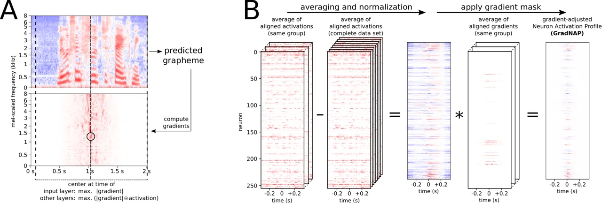
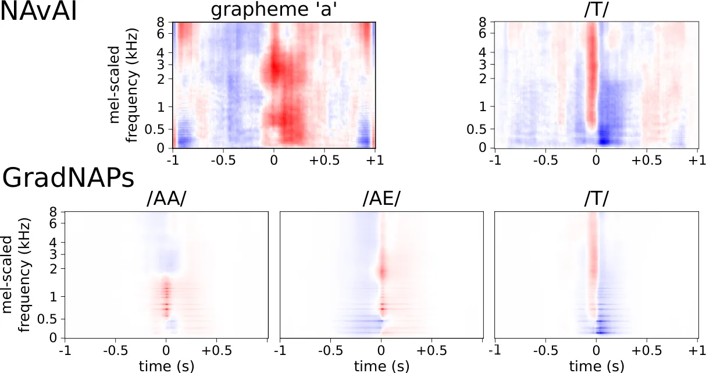
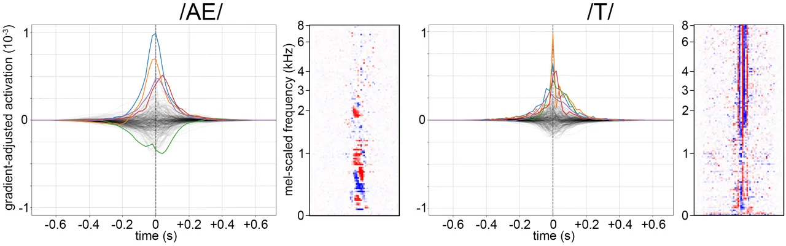
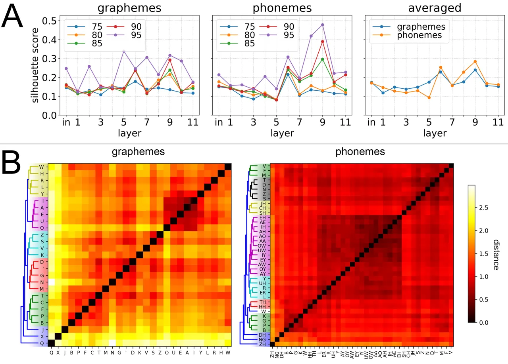

# Gradient-Adjusted Neuron Activation Profiles for Comprehensive Introspection of Convolutional Speech Recognition Models

Andreas Krug    Sebastian Stober

###### Abstract

Deep Learning based Automatic Speech Recognition (ASR) models are very
successful, but hard to interpret. To gain better understanding of how
Artificial Neural Networks (ANNs) accomplish their tasks, introspection
methods have been proposed. Adapting such techniques from computer
vision to speech recognition is not straight-forward, because speech
data is more complex and less interpretable than image data. In this
work, we introduce Gradient-adjusted Neuron Activation Profiles
(GradNAPs) as means to interpret features and representations in Deep
Neural Networks. GradNAPs are characteristic responses of ANNs to
particular groups of inputs, which incorporate the relevance of neurons
for prediction. We show how to utilize GradNAPs to gain insight about
how data is processed in ANNs. This includes different ways of
visualizing features and clustering of GradNAPs to compare embeddings of
different groups of inputs in any layer of a given network. We
demonstrate our proposed techniques using a fully-convolutional ASR
model.

###### Index Terms: 

speech recognition, convolutional neural networks, model introspection,
feature visualization

^(†)^(†)address: Otto von Guericke University Magdeburg, Germany

## 1 Introduction

ANN have become a very popular tool for solving challenging tasks across
various fields of application. Performance gains are often achieved
through increasing their complexity in terms of types of architectures
or the number of neurons \[1\]. At the same time, larger computational
models become harder to interpret \[2\]. This complicates detecting
erroneous behavior and thus can be risky in critical applications.
Introspection techniques have been proposed to get insight into ANN \[3,
4\]. However, these methods are often designed for certain applications
or architectures. In particular, many introspection techniques focus on
images, as features are easy to interpret visually.

The complexity of ANN is becoming closer to that of real brains. Those
have been studied in neuroscience for over 50 years. Well-established
methods in this field can be adapted to analyze ANN \[5\]. Our work is
inspired by a popular technique from neuroscience, the ERP (ERP). The
ERP technique is used for analyzing brain activity through EEG (EEG)
\[6\]. ERP aim to measure brain activity for a particular fixed event
(stimulus). As the event is consistent across all EEG measurements,
aligning the data at this stimulus and averaging the signals yields
event-specific information \[7\]. This way, in ERP, variations in brain
activity are averaged out. We analyze ANN similarly, but as their
responses are deterministic, we average out data variations. For
example, in a speech recognition model, activity can be observed for a
particular phoneme in audio recordings of different speakers and
articulations.

In our work, we present GradNAP as an ERP-inspired analysis of ANN,
which combines and extends our previous work. GradNAP allow for a
comprehensive analysis of features and representations in any layer of
the network, as well as identification of neurons which respond to a
particular group of inputs. We demonstrate multiple ways to examine
network responses of a fully-convolutional ASR (ASR) model using
GradNAP.



Figure 1: (A) Alignment procedure and (B) GradNAP computation from
aligned activations for a layer.

## 2 Background

### 2.1 Convolutional speech recognition

CNN are not uncommon in ASR \[8\]. Here, we demonstrate our model using
a simple, fully-convolutional architecture based on Wav2Letter \[9\].
This architecture is useful for low-resource ASR model training and
transfer learning \[10\]. Moreover, introspection methods from computer
vision can easily be adapted to it \[11\]. For comparability, we use a
pre-trained model from our previous work \[12\]. The 11-layer
1D-convolutional network predicts graphemes from spectrograms. The model
was trained on z-normalized spectrograms, which were scaled to 128
mel-frequency bins. Whole sequence audio recordings from the LibriSpeech
corpus \[13\] were used as training data. The acoustic model predicts
sequences of graphemes, which are decoded by a CTC (CTC) beam search
decoder.

### 2.2 Model introspection for deep neural networks

Introspection describes the process of analyzing or visualizing internal
structures or processes of computational models. This is of particular
interest in DL (DL) models, as these work as black-boxes \[2\]. Several
introspection techniques have been proposed, mostly in the field of
computer vision \[3, 4, 14\]. A common way of explaining ANN is to
visualize learned features by optimizing the input to maximally activate
certain neurons or sets of neurons \[2, 15, 16\]. Optimal inputs do not
always look natural. This problem can be tackled by regularizing the
optimization. Another typical introspection strategy is to determine
parts of the input, which are relevant for a certain prediction \[3, 4,
15\]. Those techniques visualize saliency maps on top of the input,
which are easy to interpret. However, as those methods work on single
examples, it is hard to assess the model comprehensively. Moreover, one
has to choose such introspection techniques carefully, as some can be
misleading \[17\]. More comprehensive insight into ANN is provided by
analyzing representations of different classes using the complete data
set. This can be done by training linear classifiers on intermediate
representations \[18\], through CCA (CCA) of representations or by
clustering class-specific neuron activations \[19\]. In speech, the
latter type of analysis was conducted for MLP for speech-to-phoneme
prediction \[19, 20\] and for convolutional ASR \[11, 12\].

## 3 Methods

### 3.1 Model & data set

For comparability with our previous work \[12\], we use the same model
and data set. The architecture is based on Wav2Letter \[9\] and was
trained on the LibriSpeech corpus \[13\]. This data set does not contain
phoneme mappings. Therefore, in our earlier work, we obtained them
through a grapheme-to-phoneme translation model using an attention-based
encoder-decoder architecture, trained on the CMUDict (CMUDict) \[21\].

### 3.2 Gradient-adjusted Neuron Activation Profiles

We introduce GradNAP as a way to compute characteristic neuron responses
of an ANN to groups of inputs. GradNAP are an adaptation of the ERP
technique to ANN. Our method combines and extends two of our previously
described introspection methods for ASR: NAvAI (NAvAI) \[11\] and NAP
\[12\]. We will first describe, how GradNAP analysis differs from our
previous work. Afterwards, we explain our technique in detail.

As in our previous work, we adopt normalized averaging to obtain
group-specific network responses. To preserve more information than NAP,
we do not create time-independence by sorting on the time axis, but by
sensitivity-based alignment like in NAvAI. Different to NAvAI, we
incorporate the activation strength into the alignment, as predictions
can be highly sensitive to changes in inactive neurons. On top of that,
we mask out activations of low relevance for the prediction. As these
improvements utilize gradients, we call our method Gradient-adjusted NAP
(GradNAP).

To properly apply an averaging approach, it is necessary that the
different recordings are temporally aligned, similar to time-locked data
in ERP analysis. To achieve this, we first center each layer’s
activations and the spectrogram frames at the time of highest importance
for the prediction. We refer to this step as “alignment” (Figure 1A). We
compute neuron activations and sensitivity values in every layer for
each spectrogram frame. Sensitivity is the gradient of a one-hot-vector
for the predicted grapheme with respect to each layer’s activations. We
identify importance for a prediction by strong activation with high
absolute sensitivity value. Hence, we center activations at time point
$`t`$ of maximum $`(|\mathrm{gradient}|\odot\mathrm{activation})`$. As
zeros in z-normalized spectrograms do not represent absence of the
corresponding frequency, we center spectrogram inputs at time $`t`$ of
maximum $`|\mathrm{gradient}|`$, The centering is implemented by
cropping. Equivalently, we center the gradients, so they remain aligned
to the activations.

Figure 1B visualizes how to obtain a GradNAP in a layer. We average
aligned activations and gradients over a group to obtain a
group-specific profile. As some neurons show baseline activations and
some information are common to all inputs, we normalize activations by
subtracting the average over the complete data set. We do not normalize
gradients this way, because zero-gradients would lose their meaning.
Instead, we scale them to a range of $`[0,1]`$. Finally, we apply this
gradient mask to the normalized averaged activations to obtain a
GradNAP. Input layer GradNAP are computed using spectrogram frames
instead of activations.

### 3.3 Visualization of group-specific features

Here, we visualize GradNAP as line plots, inspired by typical action
potential plots of real neurons. We compute group-responsiveness $`r`$
of neurons as the neuron-wise sum of absolute values in the
corresponding GradNAP. A neuron $`n`$ can be positively or negatively
responsive to a group. Hence, we multiply $`r`$ by the sign of the sum
of GradNAP values (Equation 1).

```math
r_{n}=\mathrm{sign}\left(\sum_{i}{\mathrm{GradNAP}_{n}[i]}\right)\cdot\sum_{i}\left|\mathrm{GradNAP}_{n}[i]\right| \tag{1}
```

We obtain the 5 most responsive neurons in terms of $`|r_{n}|`$ and
compute a common optimal input. The optimization target is the joint
pre-activation of those neurons at a single time point. Pre-activations
of positively and negatively responsive neurons are maximized and
minimized, respectively (Equation 2). We did not optimize for each
responsive neuron separately, as class-specificity is distributed across
multiple neurons \[22\].

```math
loss=-\sum_{n,r_{n}>0}{preact_{n}}+\sum_{n,r_{n}<0}{preact_{n}} \tag{2}
```

We apply L1 and L2 regularization on the input values, scaled depending
on the receptive field size $`RF`$ in the respective layer $`l`$. We
scale L1 regularization by $`15/RF_{l}`$ and L2 by $`0.1/RF_{l}`$. This
dependence on $`RF`$ avoids that regularization becomes stronger for
deeper layers. Optimization is performed using Adam \[23\] with learning
rate $`0.05`$ for 16 steps, initializing the input with random values
from a normal distribution with $`\mu=0`$ and $`\sigma=0.001`$.

### 3.4 Representation power of layers for different groups

We apply hierarchical clustering with Euclidean distance and complete
linkage to GradNAP of graphemes and phonemes, like in our previous work
\[12\]. Differently, instead of using a fixed distance threshold for
emergence of clusters, we apply different distance thresholds using
percentiles 75% to 95% in steps of 5%. We evaluate the resulting
clusterings by computing their Silhouette score \[24\]. This score is
based on the difference between distances within clusters compared to
the nearest other cluster. Moreover, we average Silhouette scores over
those 5 thresholds in each layer. This ensures that the information is
not specific to a particular parameter choice. We compare those results
between graphemes and phonemes.

## 4 Results & Discussion

### 4.1 Per-layer GradNAP



Figure 2: NAvAI patterns compared to input layer GradNAPs.

GradNAP in the input layer are an improvement of NAvAI \[11\]. Examples
of GradNAP in the input layer compared to exemplary NAvAI results are
shown in Figure 2. GradNAP in the input layer are directly
interpretable. They show how the intensity of frequencies differs from
the average over the complete data set. The gradient-based masking
guarantees that the GradNAP only shows regions, which are important for
the prediction. This advantage over NAvAI is demonstrated for /T/ in
Figure 2 (right). While NAvAI shows a pattern over the whole receptive
field size, the corresponding GradNAP also identified
prediction-relevant parts of it.

We observe phoneme-typical patterns in input layer GradNAP (Figure 2
bottom). Phonemes /AA/ and /AE/ share a high intensity formant at around
700 Hz. A second formant is identified at around 1200 Hz and 1900 Hz for
/AA/ and /AE/, respectively. The input pattern for /T/ (right) shows a
change of high to low intensities of all frequencies at the alignment
time. Those patterns match the expectation well. However, identified
formants are spreading a wider range of frequencies. This is probably
due to speaker variation. The grapheme-specific NAvAI result for a (as
in \[11\]) is most similar to the input GradNAP for /AE/. This indicates
that grapheme a was pronounced as /AE/ in the majority of the data.

In deeper layers, neuron order does not have a meaning. Therefore,
corresponding GradNAP cannot be interpreted by visual inspection. An
example can be seen in Figure 1B (rightmost). Instead, we visualize
features by optimizing inputs for the most responsive neurons. Those
results are shown in Section 4.2.

In all layers, we observed that GradNAP values become smaller and drop
to 0 the further away from the alignment time. This indicates that the
model did not use the complete receptive field for prediction. Thus,
compressing the model in terms of choosing smaller kernel sizes, fewer
filters or layers is possible.

### 4.2 Visualizing group-specific features

Again inspired by neuroscience, we visualize GradNAP as neuron action
potentials. Figure 3 shows GradNAP of exemplary phonemes /AE/ and /T/ in
the 2^(nd) layer as action potential plots.



Figure 3: Neuron action potentials and feature visualization in the
second layer for phonemes /AE/ and /T/.

The plots show phoneme-specific neuron activations for all neurons in
the same layer superimposed. The 5 most responsive neurons are
highlighted with different colors (those do not represent the identity
of the neuron). We observed that neuron responses to both the vowel
phoneme /AE/ and the plosive /T/ are close to the center. This indicates
that the network focuses on acoustic features of the phoneme, instead of
correlating features in their context. Next to each action potential
plot in Figure 3, the optimal input to the set of 5 most responsive
neurons is shown. The optimal input for neurons which are responsive to
/AE/ shows high intensities for frequencies around 700 Hz and 1900 Hz.
This corresponds to the /AE/-typical formants (also in agreement with
Figure 2). The visualized features for /T/-responsive neurons show
several quick transitions from high to low intensities of most
frequencies. As no neuron peaks twice, it is likely that the multiple
occurrence of the plosive pattern is related to detecting it in
different contexts. Because optimal inputs are not aligned, it is
reasonable that features occur at more than one time point. This also
causes repetitive patterns in optimal inputs for deeper layers, which
are distinguishable but not natural. We omit them here, because
unnatural feature visualization is not easily interpretable. This
problem could be tackled with stronger regularization, but could also
lead to misleading interpretations.

### 4.3 Analysis of grapheme and phoneme encoding

We analyze, which layers represent graphemes and phonemes best by
clustering of GradNAP. In each layer, we compute Silhouette scores for
cluster assignments using different distance thresholds. Higher scores
correspond to more distinct clusters, indicating better representation
of the respective group. Figure 4 (top) shows Silhouette scores for
graphemes (left), phonemes (center) and the averages over distance
thresholds for both groupings (right). Higher percentiles mostly lead to
higher Silhouette scores. This is reasonable, as we expect a hierarchy
of similar phonemes rather than large clusters. Surprisingly,
representation quality does not consistently increase from lower to
deeper layers. Silhouette scores even decrease for phonemes from the
input layer to the 5^(th) layer. Deeper layers of the network show
better clustering for phonemes than for graphemes over all distance
thresholds. The highest Silhouette score can be observed for phonemes in
the 9^(th) layer. However, the corresponding clusters are large and do
not separate phonemic categories. Layers 10 and 11 have a much larger
number of neurons than the others. This results in differently
distributed distance matrices, which probably causes the drop of cluster
quality from layer 9 to layer 10.



Figure 4: Silhouette scores at different distance thresholds (A) and
75^(th) percentile clustering of GradNAPs in layer 10 (B).

Silhouette scores indicate that in higher layers, phonemes are better
represented than graphemes. However, they are not suitable for detecting
the exact layer, where clusters of meaningful phonemic categories
emerge. This indicates that phoneme similarity is not the strongest
factor for distinguishing neuron responses. Nevertheless, we observe
similar phonemic categories in clusterings from the 10^(th) layer on,
which is shown in Figure 4 (bottom). In an earlier work, we performed
clustering analysis of NAP \[12\]. We confirm the prior finding, that
phonemic categories are represented well from the 10^(th) layer on and
that the phoneme clustering is identifying more sub-categories. However,
the differences between grapheme and phoneme clustering are smaller than
in our earlier work. Most likely, this is an effect of gradient masking,
which scales down a lot of prediction-irrelevant values.

## 5 Conclusion

GradNAP are a promising tool to gain insight into ANN. We combined
strengths of existing introspection techniques, extended them and
applied more comprehensive analyses. With our method, introspection is
not limited to the predicted classes, but can be performed for any
grouping of inputs. Moreover, model introspection is possible for
different parts of the network (inputs, any layer, subsets of neurons).
We presented per-layer clustering of GradNAP for different groups and
action potentials with feature visualization on the individual-neuron
level. Our method is generally applicable to any type of data and is not
limited to CNN. If there are too many groups, the clustering overview
can become cluttered. This can be circumvented by choosing higher-level
groups or only a subset of interest. Future work will utilize our method
to analyze the network during training. This could shed light on when
and how the network learns to detect features for particular groups.

## 6 Acknowledgements

This research has been funded by the Federal Ministry of Education and
Research of Germany (BMBF) and supported by the donation of a GeForce
GTX Titan X graphics card from the NVIDIA Corporation.

## References

- \[1\] Christian Szegedy, Wei Liu, Yangqing Jia, Pierre Sermanet, Scott
  Reed, Dragomir Anguelov, Dumitru Erhan, Vincent Vanhoucke, and Andrew
  Rabinovich, “Going deeper with convolutions,” in Proceedings of the
  IEEE conference on computer vision and pattern recognition, 2015, pp.
  1–9.
- \[2\] Jason Yosinski, Jeff Clune, Anh Nguyen, Thomas Fuchs, and Hod
  Lipson, “Understanding neural networks through deep visualization,”
  arXiv preprint arXiv:1506.06579, 2015.
- \[3\] Matthew D Zeiler and Rob Fergus, “Visualizing and understanding
  convolutional networks,” in European conference on computer vision.
  Springer, 2014, pp. 818–833.
- \[4\] Ramprasaath R. Selvaraju, Abhishek Das, Ramakrishna Vedantam,
  Michael Cogswell, Devi Parikh, and Dhruv Batra, “Grad-CAM: Visual
  explanations from deep networks via gradient-based localization,”
  arXiv preprint arXiv:1610.02391, 2016.
- \[5\] Andreas Krug and Sebastian Stober, “Adaptation of the
  event-related potential technique for analyzing artificial neural
  networks,” in Cognitive Computational Neuroscience (CCN), 2017.
- \[6\] Scott Makeig, Julie Onton, et al., “ERP features and EEG
  dynamics: an ICA perspective,” in Oxford handbook of event-related
  potential components, pp. 51–87. Oxford, 2009.
- \[7\] Steven J. Luck, “An Introduction to the Event-Related Potential
  Technique,” Monographs of the Society for Research in Child
  Development, vol. 78, no. 3, pp. 388, 2005.
- \[8\] Ossama Abdel-Hamid, Abdel-rahman Mohamed, Hui Jiang, Li Deng,
  Gerald Penn, and Dong Yu, “Convolutional neural networks for speech
  recognition,” IEEE/ACM Transactions on audio, speech, and language
  processing, vol. 22, no. 10, pp. 1533–1545, 2014.
- \[9\] Ronan Collobert, Christian Puhrsch, and Gabriel Synnaeve,
  “Wav2letter: an end-to-end convnet-based speech recognition system,”
  arXiv preprint arXiv:1609.03193, 2016.
- \[10\] Julius Kunze, Louis Kirsch, Ilia Kurenkov, Andreas Krug, Jens
  Johannsmeier, and Sebastian Stober, “Transfer learning for speech
  recognition on a budget,” in Proceedings of the 2nd Workshop on
  Representation Learning for NLP. 2017, pp. 168–177, Association for
  Computational Linguistics.
- \[11\] Andreas Krug and Sebastian Stober, “Introspection for
  convolutional automatic speech recognition,” in Proceedings of the
  2018 EMNLP Workshop BlackboxNLP: Analyzing and Interpreting Neural
  Networks for NLP, 2018, pp. 187–199.
- \[12\] Andreas Krug, René Knaebel, and Sebastian Stober, “Neuron
  activation profiles for interpreting convolutional speech recognition
  models,” in Proceedings of the 2018 NeurIPS Workshop IRASL:
  Interpretability and Robustness for Audio, Speech, and Language, 2018.
- \[13\] Vassil Panayotov, Guoguo Chen, Daniel Povey, and Sanjeev
  Khudanpur, “Librispeech: an ASR corpus based on public domain audio
  books,” in Acoustics, Speech and Signal Processing (ICASSP), 2015 IEEE
  International Conference on. IEEE, 2015, pp. 5206–5210.
- \[14\] Sebastian Bach, Alexander Binder, Grégoire Montavon, Frederick
  Klauschen, Klaus-Robert Müller, and Wojciech Samek, “On pixel-wise
  explanations for non-linear classifier decisions by layer-wise
  relevance propagation,” PloS one, vol. 10, no. 7, pp. e0130140, 2015.
- \[15\] Dumitru Erhan, Yoshua Bengio, Aaron Courville, and Pascal
  Vincent, “Visualizing higher-layer features of a deep network,”
  University of Montreal, vol. 1341, no. 3, pp. 1, 2009.
- \[16\] Alexander Mordvintsev, Christopher Olah, and Mike Tyka,
  “Inceptionism: Going deeper into neural networks,” Google Research
  Blog. Retrieved June, vol. 20, no. 14, pp. 5, 2015.
- \[17\] Julius Adebayo, Justin Gilmer, Michael Muelly, Ian Goodfellow,
  Moritz Hardt, and Been Kim, “Sanity checks for saliency maps,” in
  Advances in Neural Information Processing Systems, 2018, pp.
  9525–9536.
- \[18\] Guillaume Alain and Yoshua Bengio, “Understanding intermediate
  layers using linear classifier probes,” arXiv preprint
  arXiv:1610.01644, 2016.
- \[19\] Tasha Nagamine, Michael L Seltzer, and Nima Mesgarani,
  “Exploring how deep neural networks form phonemic categories,” in
  Sixteenth Annual Conference of the International Speech Communication
  Association, 2015.
- \[20\] Tasha Nagamine and Nima Mesgarani, “Understanding the
  representation and computation of multilayer perceptrons: A case study
  in speech recognition,” in International Conference on Machine
  Learning, 2017, pp. 2564–2573.
- \[21\] Kevin Lenzo, “The CMU pronouncing dictionary,” Carnegie Melon
  University, 2007.
- \[22\] Ari S Morcos, David GT Barrett, Neil C Rabinowitz, and Matthew
  Botvinick, “On the importance of single directions for
  generalization,” arXiv preprint arXiv:1803.06959, 2018.
- \[23\] Diederik P Kingma and Jimmy Ba, “Adam: A method for stochastic
  optimization,” arXiv preprint arXiv:1412.6980, 2014.
- \[24\] Peter J Rousseeuw, “Silhouettes: a graphical aid to the
  interpretation and validation of cluster analysis,” Journal of
  computational and applied mathematics, vol. 20, pp. 53–65, 1987.
