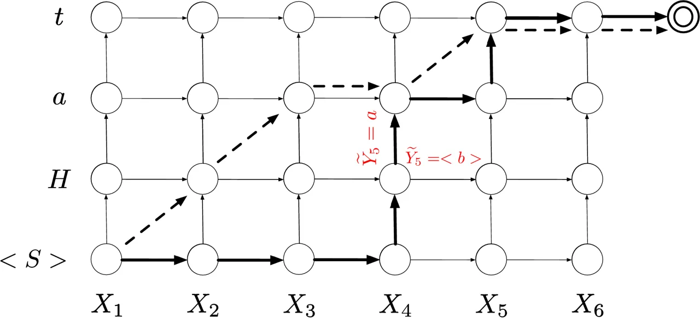
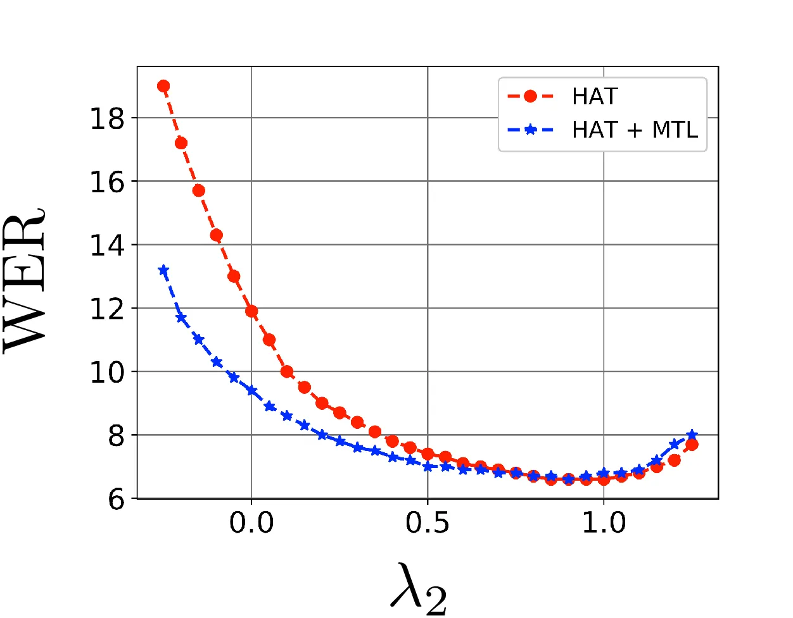
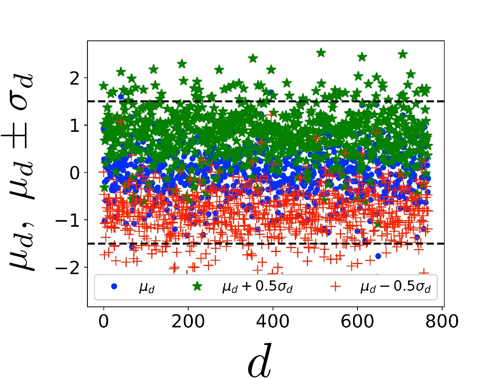
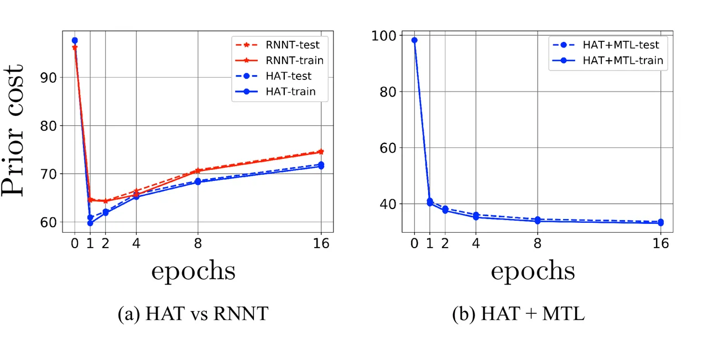

# Hybrid Autoregressive Transducer (HAT)

Ehsan Variani    David Rybach    Cyril Allauzen    Michael Riley
^(†)^(†)thanks: equal contribution

###### Abstract

This paper proposes and evaluates the hybrid autoregressive transducer
(HAT) model, a time-synchronous encoder-decoder model that preserves the
modularity of conventional automatic speech recognition systems. The HAT
model provides a way to measure the quality of the internal language
model that can be used to decide whether inference with an external
language model is beneficial or not. This article also presents a finite
context version of the HAT model that addresses the exposure bias
problem and significantly simplifies the overall training and inference.
We evaluate our proposed model on a large-scale voice search task. Our
experiments show significant improvements in WER compared to the
state-of-the-art approaches .

###### Index Terms: 

ASR, Encoder-decoder, Beam Search

^(†)^(†)address: $`\{`$variani, rybach, allauzen, riley$`\}`$@google.com

## 1 Introduction

The automatic speech recognition (ASR) problem is probabilistically
formulated as a maximum a posteriori decoding \[1, 2\]:

```math
\displaystyle\hat{W}=\argmax_{W}P(W|X)=\argmax_{W}P(X|W)\cdot P(W) \tag{1}
```

where $`X`$ is a sequence of acoustic features and $`W`$ is a candidate
word sequence. In conventional modeling, the posterior probability is
factorized as a product of an acoustic likelihood and a prior language
model (LM) via Bayes’ rule. The acoustic likelihood is further
factorized as a product of conditional distributions of acoustic
features given a phonetic sequence, the acoustic model (AM), and
conditional distributions of a phonetic sequence given a word sequence,
the pronunciation model. The phonetic model structure, pronunciations
and LM are commonly represented and combined as weighted finite-state
transducers (WFSTs) \[3, 4\].

The probabilistic factorization of ASR allows a modular design that
provides practical advantages for training and inference. The modularity
permits training acoustic and language models independently and on
different data sets. A decent acoustic model can be trained with a
relatively small amount of transcribed audio data whereas the LM can be
trained on text-only data, which is available in vast amounts for many
languages. Another advantage of the modular modeling approach is it
allows dynamic modification of the component models in well proven,
principled methods such as vocabulary augmentation \[5\], LM adaptation
and contextual biasing \[6\].

From a modeling perspective, the modular factorization of the posterior
probability has the drawback that the parameters are trained separately
with different objective functions. In conventional ASR this has been
addressed to some extent by introducing discriminative approaches for
acoustic modeling \[7, 8, 9\] and language modeling \[10, 11\]. These
optimize the posterior probability by varying the parameters of one
model while the other is frozen.

Recent developments in the neural network literature, particularly
sequence-to-sequence (Seq2Seq) modeling \[12, 13, 14, 15, 16\], have
allowed the full optimization of the posterior probability, learning a
direct mapping between feature sequences and orthographic-based
(so-called character-based) labels, like graphemes or wordpieces. One
class of these models uses a recurrent neural network (RNN) architecture
such as the long short-term memory (LSTM) model \[17\] followed by a
softmax layer to produce label posteriors. All the parameters are
optimized at the sequence level using, e.g., the connectionist temporal
classification (CTC) \[18\] criterion. The letter models \[19, 20, 21\]
and word model \[22\] are examples of this neural model class. Except
for the modeling unit, these models are very similar to conventional
acoustic models and perform well when combined with an external LM
during decoding (beam search). \[23, 24\].

Another category of direct models are the encoder-decoder networks.
Instead of passing the encoder activations to a softmax layer for the
label posteriors, these models use a decoder network to combine the
encoder information with an embedding of the previously-decoded label
history that provides the next label posterior. The encoder and decoder
parameters are optimized together using a time-synchronous objective
function as with the RNN transducer (RNNT) \[25\] or a label-synchronous
objective as with listen, attend, and spell (LAS) \[26\]. These models
are usually trained with character-based units and decoded with a basic
beam search. There has been extensive efforts to develop decoding
algorithms that can use external LMs, so-called fusion methods \[27, 28,
29, 30, 31\]. However, these methods have shown relatively small gains
on large-scale ASR tasks \[32\]. In the current state of encoder-decoder
ASR models, the general belief is that encoder-decoder models with
character-based units outperform the corresponding phonetic-based
models. This has led some to conclude a lexicon or external LM is
unnecessary \[33, 34, 35\].

This paper proposes the hybrid autoregressive transducer (HAT), a
time-synchronous encoder-decoder model which couples the powerful
probabilistic capability of Seq2Seq models with an inference algorithm
that preserves modularity and external lexicon and LM integration. The
HAT model allows an internal LM quality measure, useful to decide if an
external language model is beneficial. The finite-history version of the
HAT model is also presented and used to show how much label-context
history is needed to train a state-of-the-art ASR model on a large-scale
training corpus.

## 2 Time-Synchronous Estimation of Posterior: Previous Work



Figure 1: Lattice encoding all the eligible alignment paths. Each
alignment path starts from bottom-left corner and ends in top-right
corner. The path can traverse horizontal, vertical or diagonal edges.

For an acoustic feature sequence $`X=X_{1:T}`$ corresponding to a word
sequence $`W`$, assume $`Y=Y_{1:U}`$ is a tokenization of $`W`$ where
$`Y_{i}\in V`$, is either a phonetic unit or a character-based unit from
a finite-size alphabet $`V`$. The character tokenization of transcript
\<S\> Hat and the corresponding acoustic feature sequence $`X_{1:6}`$
are depicted in the vertical and the horizontal axis of Figure 1,
respectively. Define an alignment path $`\widetilde{Y}`$ as a sequence
of edges $`{\widetilde{Y}}_{1:|\widetilde{Y}|}`$ where
$`|\widetilde{Y}|`$, the path length, is the number of edges in the
path. Each path passes through sequence of nodes
$`\left(X_{t_{i}},Y_{u_{i}}\right)`$ where $`0\leq t_{i}\leq T`$,
$`0\leq u_{i}\leq U`$ and $`t_{i}\geq t_{i-1}`$, $`u_{i}\geq u_{i-1}`$.
The dotted path and the bold path in Figure 1 are two left-to-right
alignment paths between $`X_{1:6}`$ and $`Y_{0:3}`$. For any sequence
pairs $`X`$ and $`Y`$, there are an exponential number of alignment
paths. Each time-synchronous model typically defines a subset of these
paths as the permitted path inventory, which is usually referred to as
the path lattice. Denote by $`B:\widetilde{Y}\rightarrow{Y}`$ the
function that maps permitted alignment paths to the corresponding label
sequence. For most models, this is many-to-one. Besides the definition
of the lattice, time-synchronous models usually differ on how they
define the alignment path posterior probability $`P(\widetilde{Y}|X)`$.
Once defined, the posterior probability for a time-synchronous model is
calculated by marginalizing over these alignment path posteriors:

```math
\displaystyle P\left(Y|X\right)=\sum_{\widetilde{Y}:{B}(\widetilde{Y})=Y}P(\widetilde{Y}|X) \tag{2}
```

The model parameters are optimized by maximizing $`P\left(Y|X\right)`$.

Cross-Entropy (CE): In the cross-entropy models, the alignment lattice
contains only one path which is derived by a pre-processing step known
as forced alignment. These models encode the feature sequence $`X`$ via
a stack of RNN layers to output activations
$`{\bf f\left(X\right)}={\bf f_{1:T}}`$. The activations are then passed
to a linear layer (aka logits layer) to produce the unnormalized
class-level scores, $`S({\widetilde{Y}}_{t}={\tilde{y}}_{t}|X)`$. The
conditional posterior $`P({\widetilde{Y}}_{t}|X)`$ is derived by
normalizing the class-level scores using the softmax function

```math
P({\widetilde{Y}}_{t}=y|X)=\frac{\exp(S({\widetilde{Y}}_{t}={\tilde{y}}_{t}|X))}{\sum_{{{\tilde{y}}^{\prime}}_{t}}\exp(S({\widetilde{Y}}_{t}={{\tilde{y}}^{\prime}}_{t}|X))}
```

The alignment path posterior is derived by imposing the conditional
independence assumption between label sequence $`Y`$ given feature
sequence $`X`$:

```math
P\left(Y|X\right)=P(\widetilde{Y}|X)=\prod_{t=1}^{T}P({\widetilde{Y}}_{t}={\tilde{y}}_{t}|X)
```

For inference with an external LM, the search is defined as:

```math
\displaystyle{\tilde{y}}^{\ast}=\argmax_{\tilde{y}}\,\,\lambda_{1}\phi(x|\tilde{y})+\log P_{LM}(B(\tilde{y})) \tag{3}
```

where $`\lambda_{1}`$ is a scalar and
$`\phi(x|\tilde{y})=\log(\prod_{t=1}^{T}P(x_{t}|{\tilde{y}}_{t}))`$ is a
pseudo-likelihood sequence-level score derived by applying Bayes’ rule
on the time posteriors:
$`P(x_{t}|{\tilde{y}}_{t})\propto P({\tilde{y}}_{t}|x_{t})/P({\tilde{y}}_{t})`$
where $`P({\tilde{y}}_{t})`$ is a label prior \[36\].

Connectionist Temporal Classification (CTC): The CTC model \[18\]
augments the label alphabet with a blank symbol, \<b\>, and defines the
alignment lattice to be the grid of all paths with edit distance of
$`0`$ to the ground truth label sequence after removal of all blank
symbols and consecutive repetitions. The dotted path in Figure 1 is a
valid CTC path. Similar to the CE models, the CTC models also use a
stack of RNNs followed by a logits layer and softmax layer to produce
local posteriors. The sequence-level alignment posterior is then
calculated by making a similar conditional independence assumption
between the alignment label sequence given $`X`$,
$`P(\widetilde{Y}|X)=\prod_{t=1}^{T}P({\widetilde{Y}}_{t}={\tilde{y}}_{t}|X)`$.
Finally $`P(Y|X)`$ is calculated by marginalizing over the alignment
posteriors with Eq 2.

Recurrent Neural Network Transducer (RNNT): The RNNT lattice encodes all
the paths of length $`T+U-1`$ edges starting from the bottom-left corner
of the lattice in Figure 1 and ending in the top-right corner. Unlike
CE/CTC lattice, RNNT allows staying in the same time frame and emitting
multiple labels, like the two consecutive vertical edges in the bold
path in Figure 1. Each alignment path $`\widetilde{Y}`$ can be denoted
by a sequence of labels $`{\widetilde{Y}}_{k}`$, $`1\leq k\leq T+U-1`$
prepended by $`{\widetilde{Y}}_{0}=\texttt{<S>}`$. Here
$`{\widetilde{Y}}_{k}`$ is a random variable representing the edge label
corresponding to time frame
$`t=h({\widetilde{Y}}_{1:k-1})\triangleq\sum_{i=1}^{k-1}{\mathbbm{1}}_{{\widetilde{Y}}_{i}=\texttt{<b>}}`$
while the previous
$`u=v({\widetilde{Y}}_{1:k-1})\triangleq\sum_{i=1}^{k-1}{\mathbbm{1}}_{{\widetilde{Y}}_{i}\neq\texttt{<b>}}`$
labels have been already emitted. The indicator function
$`{\mathbbm{1}}_{{\widetilde{Y}}_{i}=\texttt{<b>}}`$ returns $`1`$ if
$`{\widetilde{Y}}_{i}=\texttt{<b>}`$ and $`0`$ otherwise. For the bold
path in Figure 1,
$`\widetilde{Y}=\texttt{<S>},\texttt{<b>},\texttt{<b>},\texttt{<b>},\texttt{H},\texttt{a},\texttt{<b>},\texttt{t},\texttt{<b>}`$.

The local posteriors in RNNT are calculated under the assumption that
their value is independent of the path prefix, i.e., if
$`{B}({\widetilde{Y}}_{1:k-1})={B}({\widetilde{Y}^{\prime}}_{1:k-1})`$ ,
then
$`P({\widetilde{Y}}_{k}|X,{\widetilde{Y}}_{1:k-1})=P({\widetilde{Y}}^{\prime}_{k}|X,{\widetilde{Y^{\prime}}}_{1:k-1})`$.
The local posterior is calculated using the encoder-decoder
architecture. The encoder accepts input $`X`$ and outputs $`T`$ vectors
$`{\bf f\left(X\right)}={\bf f_{1:T}}`$. The decoder takes the label
sequence $`Y`$ and outputs $`U+1`$ vectors
$`{\bf g\left(Y\right)}={\bf g_{0:U}}`$ , where the $`0^{th}`$ vector
corresponds to the \<S\> symbol. The unnormalized score of the next
label $`{\widetilde{Y}}_{k}`$ corresponding to position
$`\left(t,u\right)`$ is defined as:
$`S({\widetilde{Y}}_{k}={\tilde{y}}_{k}|X,{\widetilde{Y}}_{1:k-1})={\bf J}\left({\bf f_{t}+g_{u}}\right)`$.
The joint network $`{\bf J}`$ is usually a multi-layer non-recurrent
network. The local posterior
$`P({\widetilde{Y}}_{k}={\tilde{y}}_{k}|X,{\widetilde{Y}}_{1:k-1})`$ is
calculated by normalizing the above score over all labels
$`{\tilde{y}}_{k}\in V\cup\texttt{<b>}`$ using the softmax function. The
alignment path posterior is derived by chaining the above quantity over
the path,

```math
P({\widetilde{Y}}|X)=\prod_{k=1}^{T+U-1}P({\widetilde{Y}}_{k}|X,{\widetilde{Y}}_{1:k-1})
```

For the CTC and RNNT models, the inference with an external LM is
usually formulated as the following search problem:

```math
\displaystyle{\tilde{y}}^{\ast}=\argmax_{\tilde{y}}\,\,\lambda_{1}\log P^{\prime}(\tilde{y}|x)+\log P_{LM}(B(\tilde{y}))+\lambda_{2}v({\tilde{y}})
```

where $`P^{\prime}`$ is derived by scaling the blank posterior in $`P`$
followed by re-normalization \[37\], $`\lambda_{1}`$ is a scalar weight,
and $`\lambda_{2}`$ is a coverage penalty scalar which weights non-blank
labels $`v({\tilde{y}})`$ \[28\].

## 3 Hybrid Autoregressive Transducer

The Hybrid Autoregressive Transducer (HAT) model is a time-synchronous
encoder-decoder model which distinguishes itself from other
time-synchronous models by 1) formulating the local posterior
probability differently, 2) providing a measure of its internal language
model quality, and 3) offering a mathematically-justified inference
algorithm for external LM integration.

### 3.1 Formulation

The RNNT lattice definition is used for the HAT model Alternative
lattice functions can be explored, this choice is merely selected to
provide fair comparison of HAT and RNNT models in the experimental
section. To calculate the local conditional posterior, the HAT model
differentiates between horizontal and vertical edges in the lattice. For
edge $`k`$ corresponding to position $`\left(t,u\right)`$, the posterior
probability to take a horizontal edge and emitting \<b\> is modeled by a
Bernoulli distribution $`b_{t,u}`$ which is a function of the entire
past history of labels and features. The vertical move is modeled by a
posterior distribution $`P_{t,u}(y_{u+1}|X,y_{0:u})`$, defined over
labels in $`V`$. The alignment posterior
$`P({\widetilde{Y}}_{k}={\tilde{y}}_{k}|X,{\widetilde{Y}}_{1:k-1})`$ is
formulated as:

```math
\displaystyle\begin{cases}b_{t,u}&${\tilde{y}}_{k}=<b>$\\
\left(1-b_{t,u}\right)P_{t,u}\left({{y}}_{u+1}|X,y_{0:u}\right)&${\tilde{y}}_{k}={{y}}_{u+1}$\end{cases} \tag{4}
```

Blank (Duration) distribution: The input feature sequence $`X`$ is fed
to a stack of RNN layers to output $`T`$ encoded vectors
$`{\bf{f^{1}}\left(X\right)={f}^{1}_{1:T}}`$. The label sequence is also
fed to a stack of RNN layers to output
$`{\bf{g}^{1}\left(Y\right)={g}^{1}_{1:U}}`$. The conditional Bernoulli
distribution $`b_{t,u}`$ is then calculated as:

```math
\displaystyle b_{t,u}=\sigma\left({\bf w}\bullet({\bf{f}^{1}_{t}+{g}^{1}_{u}})+{\bf b}\right) \tag{5}
```

where $`\sigma(\cdot)`$ is the sigmoid function, $`{\bf w}`$ is a weight
vector, $`\bullet`$ is the dot-product and $`{\bf b}`$ is a bias term.

Label distribution: The encoder function
$`{\bf{f^{2}}\left(X\right)={f}^{2}_{1:T}}`$ encodes input features
$`X`$ and the function $`{\bf{g}^{2}\left(Y\right)={g}^{2}_{1:U}}`$
encodes label embeddings. At each time position $`\left(t,u\right)`$,
the joint score is calculated over all $`y\in V`$:

```math
\displaystyle S_{t,u}(y|X,y_{0:u})={\bf J}\left({\bf{f}^{2}_{t}+{g}^{2}_{u}}\right) \tag{6}
```

where $`{\bf J(\cdot)}`$ can be any function that maps
$`{\bf{f}^{2}_{t}+{g}^{2}_{u}}`$ to a $`|V|`$-dim score vector. The
label posterior distribution is derived by normalizing the score
functions across all labels in $`V`$:

```math
\displaystyle P_{t,u}\left(y_{u+1}|X,y_{0:u}\right)=\frac{\exp\left(S_{t,u}(y_{u+1}|X,y_{0:u})\right)}{\sum_{y\in V}\exp\left(S_{t,u}(y|X,y_{0:u})\right)} \tag{7}
```

The alignment path posterior of the HAT model is computed by chaining
the local edge posteriors of Eq 4,
$`P(\widetilde{Y}|X)=\prod_{k=1}^{T+U-1}P({\widetilde{Y}}_{k}|X,{\widetilde{Y}}_{1:k-1})`$.
The posterior of the bold path is:

```math
\displaystyle b_{1,0}b_{2,0}b_{3,0}(1-b_{4,0})P_{4,0}(H|X,\texttt{<S>})\cdots b_{5,3}
```

Like any other time-synchronous model, the total posterior is derived by
marginalizing the alignment path posteriors using Eq 2.

### 3.2 Internal Language Model Score

The separation of blank and label posteriors allows the HAT model to
produce a local and sequence-level internal LM score. The local score at
each label position $`u`$ is defined as:
$`S(y|y_{0:u})\triangleq{\bf J}\left({\bf{g}^{2}_{u}}\right)`$. In other
words, this is exactly the posterior score of Eq 6 but eliminating the
effect of the encoder activations, $`{\bf{f}^{2}_{t}}`$. The intuition
here is that a language-model quality measure at label $`u`$ should be
only a function of the $`u`$ previous labels and not the time frame
$`t`$ or the acoustic features. Furthermore, this score can be
normalized to produce a prior distribution for the next label
$`P\left(y|y_{0:u}\right)=\text{softmax}(S(y|y_{0:u}))`$. The
sequence-level internal LM score is:

```math
\displaystyle\log P_{ILM}(Y)=\sum_{u=0}^{U-1}\log P(y_{u+1}|y_{0:u}) \tag{8}
```

Note that the most accurate way of calculating the internal language
model is by
$`P\left(y|y_{0:u}\right)=\sum_{x}P(y|X=x,y_{0:u})P(X=x|y_{0:u})`$.
However, the exact sum is not easy to derive, thus some approximation
like Laplace’s methods for integrals \[38\] is needed. Meanwhile, the
above definition can be justified for the special cases when
$`{\bf J}\left({\bf{f}^{2}_{t}+{g}^{2}_{u}}\right)\approx{\bf J}\left({\bf{f}^{2}_{t}}\right)+{\bf J}\left({\bf{g}^{2}_{u}}\right)`$
(proof in Appendix A.).

### 3.3 Decoding

The HAT model inference search for $`{\tilde{y}}^{\ast}`$ that
maximizes:

```math
\displaystyle\lambda_{1}\log P(\tilde{y}|x)-\lambda_{2}\log P_{ILM}(B({\tilde{y}}))+\log P_{LM}({\tilde{y}}) \tag{9}
```

where $`\lambda_{1}`$ and $`\lambda_{2}`$ are scalar weights.
Subtracting the internal LM score, prior, from the path posterior leads
to a pseudo-likelihood (Bayes’ rule), which is justified for combining
with an external LM score. We use a conventional FST decoder with a
decoder graph encoding the phone context-dependency (if any),
pronunciation dictionary and the (external) n-gram LM. The partial path
hypotheses are augmented with the corresponding state of the model. That
is, a hypothesis consists of the time frame $`t`$, a state in the
decoder graph FST, and a state of the model. Paths with equivalent
history, i.e. an equal label sequence without blanks, are merged and the
corresponding hypotheses are recombined.

## 4 Experiments

The training set, $`40`$ M utterances, development set, $`8`$ k
utterances, and test set, $`25`$ hours, are all anonymized,
hand-transcribed, representative of Google traffic queries. The training
examples are $`256`$-dim. log Mel features extracted from a $`64`$ ms
window every $`30`$ ms \[39\] . The training examples are noisified with
$`25`$ different noise styles as detailed in \[40\]. Each training
example is forced-aligned to get the frame level phoneme alignment. All
models (baselines and HAT) are trained to predict $`42`$ phonemes and
are decoded with a lexicon and an n-gram language model that cover a
$`4`$ M words vocabulary. The LM was trained on anonymized audio
transcriptions and web documents. A maximum entropy LM \[41\] is applied
using an additional lattice re-scoring pass. The decoding
hyper-parameters are swept on separate development set.

Three time-synchronous baselines are presented. All models use $`5`$
layers of LSTMs with $`2048`$ cells per layer for the encoder. For the
models with a decoder network (RNNT and HAT), each label is embedded by
a $`128`$-dim. vector and fed to a decoder network which has $`2`$
layers of LSTMs with $`256`$ cells per layer. The encoder and decoder
activations are projected to a $`768`$-dim. vector and their sum is
passed to the joint network. The joint network is a tanh layer followed
by a linear layer of size $`42`$ and a softmax as in \[42\]. The encoder
and decoder networks are shared for the blank and the label posterior in
the HAT model such that it has exactly the same number of parameters as
the RNNT baseline. The CE and CTC models have $`112`$M float parameters
while RNNT and HAT models have $`115`$M parameters.

| WER           | 1st-pass          |                   | 2nd-pass          |
| ------------- | ----------------- | ----------------- | ----------------- |
| (del/ins/sub) | 1st best          | 10-best Oracle    |                   |
| CE            | 8.9 (1.8/1.6/5.5) | 4.0 (0.8/0.5/2.6) | 8.3 (1.7/1.6/5.0) |
| CTC           | 8.9 (1.8/1.6/5.5) | 4.1 (0.8/0.6/2.6) | 8.4 (1.8/1.6/5.0) |
| RNNT          | 8.0 (1.1/1.5/5.4) | 2.1 (0.2/0.4/1.6) | 7.5 (1.2/1.4/4.9) |
| HAT           | 6.6 (0.8/1.5/4.3) | 1.5 (0.1/0.4/1.0) | 6.0 (0.8/1.3/3.9) |

Table 1: WER for the baseline and HAT models.



Figure 2: WER \[$`\%`$\] vs internal language model score weight
$`\lambda_{2}`$, for $`\lambda_{1}=2.5`$ for the HAT
($`\color[rgb]{1,0,0}\bullet`$) and HAT + MTL
($`\color[rgb]{0,0,1}\ast`$) models.



Figure 3: The mean ($`\pm`$ standard deviation) of $`{\bf f_{t}+g_{u}}`$
falls within linear range of tanh (horizontal dotted lines).



Figure 4: Prior cost vs epochs for HAT, RNNT, and HAT + MTL.

HAT model performance: For the inference algorithm of Eq 9, we
empirically observed that $`\lambda_{1}\in(2.0,3.0)`$ and
$`\lambda_{2}\approx 1.0`$ lead to the best performance. Figure 3 plots
the WER for different values of $`\lambda_{2}`$, for baseline HAT model
and HAT model trained with multi-task learning (MTL). The best WER at
$`\lambda_{2}=0.95`$ on the convex curve shows that significantly
down-weighting the internal LM and relying more on the external LM
yields the best decoding quality. The HAT model outperforms the baseline
RNNT model by $`1.4\%`$ absolute WER ($`17.5\%`$ relative gain),
Table 1. Furthermore, using a 2nd-pass LM gives an extra $`10\%`$ gain
which is expected for the low oracle WER of $`1.5\%`$. Comparing the
different types of errors, it seems that the HAT model error pattern is
different from all baselines. In all baselines, the deletion and
insertion error rates are in the same range, whereas the HAT model makes
two times more insertion than deletion errors.¹¹ 1 We are examining this
behavior and hoping to have some explanation for it in the final version
of the paper.

Internal language model: The internal language model score proposed in
subsection 3.2 can be analytically justified when
$`{\bf J}\left({\bf{f}^{2}_{t}+{g}^{2}_{u}}\right)\approx{\bf J}\left({\bf{f}^{2}_{t}}\right)+{\bf J}\left({\bf{g}^{2}_{u}}\right)`$.
The joint function $`{\bf J}`$ is usually a tanh function followed by a
linear layer \[42\]. The approximation holds iff
$`{\bf{f}^{2}_{t}+\bf{g}^{2}_{u}}`$ falls in the linear range of the
tanh function. Figure 3 presents the statistics of this $`768`$-dim.
vector, $`\mu_{d}`$ ($`{\color[rgb]{0,0,1}\bullet}`$),
$`\mu_{d}+\sigma_{d}`$ ($`{\color[rgb]{0,1,0}\star}`$), and
$`\mu_{d}-\sigma_{d}`$ ($`{\color[rgb]{1,0,0}+}`$) for
$`1\leq d\leq 768`$ which are accumulated on the test set. The linear
range of tanh function is specified by the two dotted horizontal lines
in Figure 3. The means and large portion of one standard deviation
around the means fall within the linear range of the tanh, which
suggests that the decomposition of the joint function into a sum of two
joint functions is plausible.

Figure 4(a) shows the prior cost,
$`\frac{-1}{|\mathcal{D}|}\sum_{y\in\mathcal{D}}\log P_{ILM}(y)`$,
during the first $`16`$ epochs of training with $`\mathcal{D}`$ being
either the train or test set. The curves are plotted for both the HAT
and RNNT models. Note that in case of RNNT, since blank and label
posteriors are mixed together, a softmax is applied to normalize the
non-blank scores to get the label posteriors, thus it just serves as an
approximation. At the early steps of training, the prior cost is going
down, which suggests that the model is learning an internal language
model. However, after the first few epochs, the prior cost starts
increasing, which suggests that the decoder network deviates from being
a language model. Note that both train and test curves behave like this.
One explanation of this observation can be: in maximizing the posterior,
the model prefers not to choose parameters that also maximize the prior.
We evaluated the performance of the HAT model when it further
constrained with a cross-entropy multi-task learning (MTL) criterion
that minimizes the prior cost. Applying this criterion results in
decreasing the prior cost, Figure 4(b). However, this did not impact the
WER. After sweeping $`\lambda_{2}`$, the WER for the HAT model with MTL
loss is as good as the baseline HAT model, blue curve in Figure 3. Of
course this might happen because the internal language model is still
weaker than the external language model used for inference.

This observation might also be explained by Bayes’ rule:
$`\log P(X|Y)\propto\log P(Y|X)-\log P(Y)`$. The observation that the
posterior cost $`-\log P(Y|X)`$ goes down while the prior cost
$`-\log P(Y)`$ goes up suggests that the model is implicitly maximizing
the log likelihood term in the left-side of the above equation. This
might be why subtracting the internal language model log-probability
from the log-posterior and replacing it with a strong external language
model during inference led to superior performance.

Limited vs Infinite Context: Assuming that the decoder network is not
taking advantage of the full label history, a natural question is how
much of the label history actually is needed to achieve peak
performance. The HAT model performance for different context sizes is
shown in Table 2. A context size of $`0`$ means feeding no label history
to the decoder network, which is similar to making a conditional
independence assumption for calculating the posterior at each time-label
position. The performance of this model is on a par with the performance
of the CE and CTC baseline models, c.f. Table 1. The HAT model with
context size of $`1`$ shows $`12\%`$ relative WER degradation compared
to the infinite history HAT model. However, the HAT models with contexts
$`2`$ and $`4`$ are matching the performance of the baseline HAT model.

While the posterior cost of the HAT model with context size of $`2`$ is
about $`10\%`$ worse than the baseline HAT model loss, the WER of both
models is the same. One reason for this behavior is that the external LM
has compensated for any shortcoming of the model. Another explanation
can be the problem of exposure bias \[43\], which refers to the mismatch
between training and inference for encoder-decoder models. The error
propagation in an infinite context model can be much severe than a
finite context model with context $`c`$, simply because the finite
context model has a chance to reset its decision every $`c`$ labels.

| Context        | 0    | 1   | 2   | 4   | $`\infty`$ |
| -------------- | ---- | --- | --- | --- | ---------- |
| 1st-pass WER   | 8.5  | 7.4 | 6.6 | 6.6 | 6.6        |
| posterior cost | 34.6 | 5.6 | 5.2 | 4.7 | 4.6        |

Table 2: Effect of limited context history.

Since the finite context of $`2`$ is sufficient to perform as well as an
infinite context, one can simply replace all the expensive RNN kernels
in the decoder network with a $`|V|^{2}`$ embedding vector corresponding
to all the possible permutations of a finite context of size $`2`$. In
other words, trading computation with memory, which can significantly
reduce total training and inference cost.

## 5 Conclusion

The HAT model is a step toward better acoustic modeling while preserving
the modularity of a speech recognition system. One of the key advantages
of the HAT model is the introduction of an internal language model
quantity that can be measured to better understand encoder-decoder
models and decide if equipping them with an external language model is
beneficial. According to our analysis, the decoder network does not
behave as a language model but more like a finite context model. We
presented a few explanations for this observation. Further in-depth
analysis is needed to confirm the exact source of this behavior and how
to construct models that are really end-to-end, meaning the prior and
posterior models behave as expected for a language model and acoustic
model.

## References

- \[1\] Frederick Jelinek, “Continuous speech recognition by statistical
  methods,” Proceedings of the IEEE, vol. 64, no. 4, pp. 532–556, 1976.
- \[2\] Lalit R Bahl, Frederick Jelinek, and Robert L Mercer, “A maximum
  likelihood approach to continuous speech recognition,” IEEE
  Transactions on Pattern Analysis & Machine Intelligence, , no. 2, pp.
  179–190, 1983.
- \[3\] Mehryar Mohri, Fernando Pereira, and Michael Riley, “Weighted
  finite-state transducers in speech recognition,” Computer Speech &
  Language, vol. 16, no. 1, pp. 69–88, 2002.
- \[4\] Mehryar Mohri, Fernando Pereira, and Michael Riley, “Speech
  recognition with weighted finite-state transducers,” in Handbook of
  Speech Processing, Jacob Benesty, M. Sondhi, and Yiteng Huang, Eds.,
  chapter 28, pp. 559–582. Springer, 2008.
- \[5\] Cyril Allauzen and Michael Riley, “Rapid vocabulary addition to
  context-dependent decoder graphs,” in Interspeech 2015, 2015.
- \[6\] Keith Hall, Eunjoon Cho, et al., “Composition-based on-the-fly
  rescoring for salient n-gram biasing,” in Interspeech 2015,
  International Speech Communications Association, 2015.
- \[7\] Lalit R Bahl, Peter F Brown, et al., “Maximum mutual information
  estimation of hidden markov model parameters for speech recognition,”
  in proc. icassp, 1986, vol. 86, pp. 49–52.
- \[8\] Daniel Povey, Discriminative training for large vocabulary
  speech recognition, Ph.D. thesis, University of Cambridge, 2005.
- \[9\] Brian Kingsbury, “Lattice-based optimization of sequence
  classification criteria for neural-network acoustic modeling,” in 2009
  IEEE International Conference on Acoustics, Speech and Signal
  Processing. IEEE, 2009, pp. 3761–3764.
- \[10\] Zheng Chen, Kai-Fu Lee, and Ming-jing Li, “Discriminative
  training on language model,” in Sixth International Conference on
  Spoken Language Processing, 2000.
- \[11\] Hong-Kwang Jeff Kuo, Eric Fosler-Lussier, et al.,
  “Discriminative training of language models for speech recognition,”
  in 2002 IEEE International Conference on Acoustics, Speech, and Signal
  Processing. IEEE, 2002, vol. 1, pp. I–325.
- \[12\] Michael Auli, Michel Galley, et al., “Joint language and
  translation modeling with recurrent neural networks,” 2013.
- \[13\] Nal Kalchbrenner and Phil Blunsom, “Recurrent continuous
  translation models,” in Proceedings of the 2013 Conference on
  Empirical Methods in Natural Language Processing, 2013, pp. 1700–1709.
- \[14\] Kyunghyun Cho, Bart Van Merriënboer, et al., “Learning phrase
  representations using rnn encoder-decoder for statistical machine
  translation,” arXiv preprint arXiv:1406.1078, 2014.
- \[15\] Kyunghyun Cho, Bart Van Merriënboer, et al., “On the properties
  of neural machine translation: Encoder-decoder approaches,” arXiv
  preprint arXiv:1409.1259, 2014.
- \[16\] Ilya Sutskever, Oriol Vinyals, and Quoc V Le, “Sequence to
  sequence learning with neural networks,” in Advances in neural
  information processing systems, 2014, pp. 3104–3112.
- \[17\] Sepp Hochreiter and Jürgen Schmidhuber, “Long short-term
  memory,” Neural computation, vol. 9, no. 8, pp. 1735–1780, 1997.
- \[18\] Alex Graves, Santiago Fernández, et al., “Connectionist
  temporal classification: labelling unsegmented sequence data with
  recurrent neural networks,” in Proceedings of the 23rd international
  conference on Machine learning. ACM, 2006, pp. 369–376.
- \[19\] Florian Eyben, Martin Wöllmer, et al., “From speech to
  letters-using a novel neural network architecture for grapheme based
  asr,” in 2009 IEEE Workshop on Automatic Speech Recognition &
  Understanding. IEEE, 2009, pp. 376–380.
- \[20\] Awni Hannun, Carl Case, et al., “Deep speech: Scaling up
  end-to-end speech recognition,” arXiv preprint arXiv:1412.5567, 2014.
- \[21\] Ronan Collobert, Christian Puhrsch, and Gabriel Synnaeve,
  “Wav2letter: an end-to-end convnet-based speech recognition system,”
  arXiv preprint arXiv:1609.03193, 2016.
- \[22\] Hagen Soltau, Hank Liao, and Hasim Sak, “Neural speech
  recognizer: Acoustic-to-word lstm model for large vocabulary speech
  recognition,” arXiv preprint arXiv:1610.09975, 2016.
- \[23\] Thomas Zenkel, Ramon Sanabria, et al., “Comparison of decoding
  strategies for ctc acoustic models,” arXiv preprint
  arXiv:1708.04469, 2017.
- \[24\] Eric Battenberg, Jitong Chen, et al., “Exploring neural
  transducers for end-to-end speech recognition,” in 2017 IEEE Automatic
  Speech Recognition and Understanding Workshop (ASRU). IEEE, 2017, pp.
  206–213.
- \[25\] Alex Graves, “Sequence transduction with recurrent neural
  networks,” arXiv preprint arXiv:1211.3711, 2012.
- \[26\] William Chan, Navdeep Jaitly, et al., “Listen, attend and
  spell: A neural network for large vocabulary conversational speech
  recognition,” in 2016 IEEE International Conference on Acoustics,
  Speech and Signal Processing (ICASSP). IEEE, 2016, pp. 4960–4964.
- \[27\] Caglar Gulcehre, Orhan Firat, et al., “On using monolingual
  corpora in neural machine translation,” arXiv preprint
  arXiv:1503.03535, 2015.
- \[28\] Jan Chorowski and Navdeep Jaitly, “Towards better decoding and
  language model integration in sequence to sequence models,” arXiv
  preprint arXiv:1612.02695, 2016.
- \[29\] Anuroop Sriram, Heewoo Jun, et al., “Cold fusion: Training
  seq2seq models together with language models,” arXiv preprint
  arXiv:1708.06426, 2017.
- \[30\] Takaaki Hori, Jaejin Cho, and Shinji Watanabe, “End-to-end
  speech recognition with word-based rnn language models,” in 2018 IEEE
  Spoken Language Technology Workshop (SLT). IEEE, 2018, pp. 389–396.
- \[31\] Changhao Shan, Chao Weng, et al., “Component fusion: Learning
  replaceable language model component for end-to-end speech recognition
  system,” in ICASSP 2019-2019 IEEE International Conference on
  Acoustics, Speech and Signal Processing (ICASSP). IEEE, 2019, pp.
  5361–5635.
- \[32\] Anjuli Kannan, Yonghui Wu, et al., “An analysis of
  incorporating an external language model into a sequence-to-sequence
  model,” in 2018 IEEE International Conference on Acoustics, Speech and
  Signal Processing (ICASSP). IEEE, 2018, pp. 1–5828.
- \[33\] Tara N Sainath, Rohit Prabhavalkar, et al., “No need for a
  lexicon? evaluating the value of the pronunciation lexica in
  end-to-end models,” in 2018 IEEE International Conference on
  Acoustics, Speech and Signal Processing (ICASSP). IEEE, 2018, pp.
  5859–5863.
- \[34\] Shiyu Zhou, Linhao Dong, et al., “A comparison of modeling
  units in sequence-to-sequence speech recognition with the transformer
  on mandarin chinese,” in International Conference on Neural
  Information Processing. Springer, 2018, pp. 210–220.
- \[35\] Kazuki Irie, Rohit Prabhavalkar, et al., “Model unit
  exploration for sequence-to-sequence speech recognition,” arXiv
  preprint arXiv:1902.01955, 2019.
- \[36\] Nelson Morgan and Herve Bourlard, “Continuous speech
  recognition using multilayer perceptrons with hidden markov models,”
  in International conference on acoustics, speech, and signal
  processing. IEEE, 1990, pp. 413–416.
- \[37\] Haşim Sak, Andrew Senior, et al., “Fast and accurate recurrent
  neural network acoustic models for speech recognition,” arXiv preprint
  arXiv:1507.06947, 2015.
- \[38\] Pierre Simon Laplace, “Memoir on the probability of the causes
  of events,” Statistical Science, vol. 1, no. 3, pp. 364–378, 1986.
- \[39\] Ehsan Variani, Tom Bagby, et al., “End-to-end training of
  acoustic models for large vocabulary continuous speech recognition
  with tensorflow,” 2017.
- \[40\] Chanwoo Kim, Ehsan Variani, et al., “Efficient implementation
  of the room simulator for training deep neural network acoustic
  models,” arXiv preprint arXiv:1712.03439, 2017.
- \[41\] Fadi Biadsy, Mohammadreza Ghodsi, and Diamantino Caseiro,
  “Effectively building tera scale maxent language models incorporating
  non-linguistic signals,” 2017.
- \[42\] Yanzhang He, Tara N Sainath, et al., “Streaming end-to-end
  speech recognition for mobile devices,” in ICASSP 2019-2019 IEEE
  International Conference on Acoustics, Speech and Signal Processing
  (ICASSP). IEEE, 2019, pp. 6381–6385.
- \[43\] Marc’Aurelio Ranzato, Sumit Chopra, et al., “Sequence level
  training with recurrent neural networks,” arXiv preprint
  arXiv:1511.06732, 2015.

## Appendix A Internal Language Model Score

###### Lemma 1.

The softmax function is invertible up to an additive constant. In other
words, for any two real valued vectors
$`{\bf v=v_{1:d}},{\bf w=w_{1:d}}`$, and real constant $`c`$,

```math
v_{i}=w_{i}+c\Longleftrightarrow\frac{\exp(v_{i})}{\sum_{j}\exp(v_{j})}=\frac{\exp(w_{i})}{\sum_{j}\exp(w_{j})}
```

for $`1\leq i\leq d`$.

###### Proof.

If $`\forall i:\,\,v_{i}=w_{i}+c\,`$, then

```math
\displaystyle\frac{\exp(v_{i})}{\sum_{j}\exp(v_{j})} \displaystyle= \displaystyle\frac{\exp(w_{i}+c)}{\sum_{j}\exp(w_{j}+c)} \tag{10}
```

```math
\displaystyle= \displaystyle\frac{\exp(w_{i})\exp(c)}{\sum_{j}\exp(w_{j})\exp(c)}
```

```math
\displaystyle= \displaystyle\frac{\exp(w_{i})}{\sum_{j}\exp(w_{j})}
```

which proves the if condition. For the other side of condition, the
proof goes as follow:

```math
\frac{\exp(v_{i})}{\sum_{j}\exp(v_{j})}=\frac{\exp(w_{i})}{\sum_{j}\exp(w_{j})}
```

taking logarithm from both sides:

```math
v_{i}-\log\sum_{j}\exp(v_{j})=w_{i}-\log\sum_{j}\exp(w_{j})
```

which implies:

```math
v_{i}-w_{i}=\log\sum_{j}\exp(v_{j})-\log\sum_{j}\exp(w_{j})
```

this completes the proof since the right-hand-side (RHS) of above
equation is constant for any $`i`$. ∎

###### Corollary 1.

For any two random variables $`X`$ and $`Y`$ and some real valued
function $`S(y,x)`$, if the posterior distribution of $`Y`$ given $`X`$
be

```math
P(Y=y|X=x)=\frac{\exp(S(y,x))}{\sum_{y^{\prime}}\exp S(y^{\prime},x)}
```

then $`S(y,x)=\log P(Y=y,x)+c\,`$, for some constant value
$`c\in\mathbbm{R}`$.

###### Proof.

The proof is straight-forward following Lemma 1. ∎

###### Proposition 1.

For the label distribution of Eq 7 with the score function of Eq 6, if
$`{\bf J}\left({\bf{f}^{2}_{t}+{g}^{2}_{u}}\right)\approx{\bf J}\left({\bf{f}^{2}_{t}}\right)+{\bf J}\left({\bf{g}^{2}_{u}}\right)`$
for any $`t`$ and $`u`$, then:

```math
\displaystyle P(y|y_{0:u})\propto\exp\left({\bf J}\left({\bf{g}^{2}_{u}}\right)\right) \tag{11}
```

###### Proof.

According to Eq 7

```math
\displaystyle P\left(y|X=x,y_{0:u}\right)=\frac{\exp\left(S_{t,u}(y|X=x,y_{0:u})\right)}{\sum_{y^{\prime}\in V}\exp\left(S_{t,u}(y|X=x,y_{0:u})\right)} \tag{12}
```

which implies:

```math
\displaystyle S_{t,u}(y|X=x,y_{0:u}) \displaystyle= \displaystyle\log P\left(y,X=x,y_{0:u}\right)+c_{1}
```

```math
\displaystyle= \displaystyle\log P\left(X=x|y,y_{0:u}\right)+\log P\left(y,y_{0:u}\right)
```

for some real valued constant $`c_{1}`$. The first equality holds from
Corollary 1, and the second equality holds by Bayes’ rule.

Applying exponential function and marginalizing over $`X`$ results in:

```math
\displaystyle\sum_{X}\exp(S_{t,u}(y|X=x,y_{0:u})) \displaystyle\propto \displaystyle\sum_{x}P\left(X=x|y,y_{0:u}\right)P\left(y,y_{0:u}\right) \tag{14}
```

```math
\displaystyle= \displaystyle P\left(y,y_{0:u}\right)
```

note that $`\exp(c_{1})`$ is dropped which make the left-hand-side (LHS)
be proportional to the RHS of first equation. The second equation holds
since $`P\left(X=x|y,y_{0:u}\right)`$ is a distribution over $`X`$.

Finally note that

```math
\displaystyle S_{t,u}(y|X,y_{0:u}) \displaystyle= \displaystyle{\bf J}\left({\bf{f}^{2}_{t}+{g}^{2}_{u}}\right) \tag{15}
```

```math
\displaystyle= \displaystyle{\bf J}\left({\bf{f}^{2}_{t}}\right)+{\bf J}\left({\bf{g}^{2}_{u}}\right)
```

where the first equality comes from the definition and the second one is
the assumption made in the statement of the proposition. Applying
exponential function and marginalizing over $`X`$:

```math
\displaystyle\sum_{X}\exp(S_{t,u}(y|X,y_{0:u})) \displaystyle= \displaystyle\sum_{X}\exp\left({\bf J}\left({\bf{f}^{2}_{t}}\right)+{\bf J}\left({\bf{g}^{2}_{u}}\right)\right) \tag{16}
```

```math
\displaystyle= \displaystyle\exp\left({\bf J}\left({\bf{g}^{2}_{u}}\right)\right){\sum_{X}\exp\left({\bf J}\left({\bf{f}^{2}_{t}}\right)\right)}
```

```math
\displaystyle\propto \displaystyle\exp\left({\bf J}\left({\bf{g}^{2}_{u}}\right)\right)
```

since the second term will be a constant and will not be function of
$`y`$. Comparing Eq 14 and Eq 16:

```math
P\left(y,y_{0:u}\right)\propto\exp\left({\bf J}\left({\bf{g}^{2}_{u}}\right)\right)
```

Finally note that
$`P\left(y|y_{0:u}\right)=P\left(y,y_{0:u}\right)/P\left(y_{0:u}\right)`$,
thus:

```math
P\left(y|y_{0:u}\right)\propto\exp\left({\bf J}\left({\bf{g}^{2}_{u}}\right)\right)
```

which completes the proof. ∎
