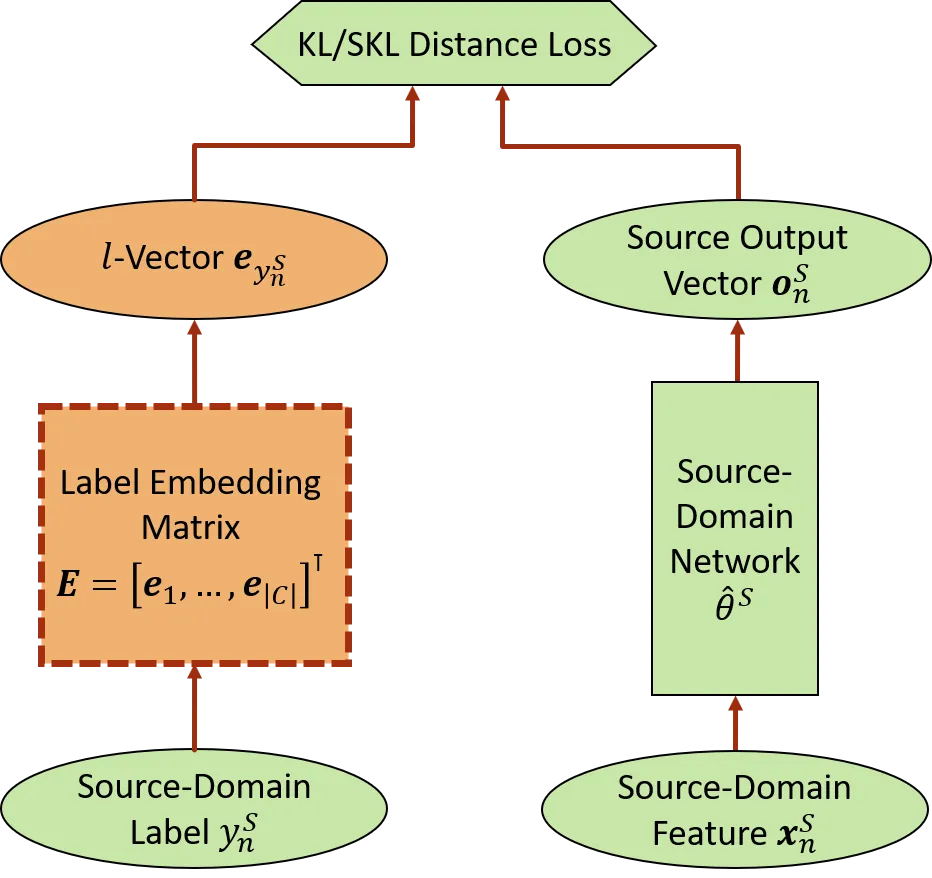
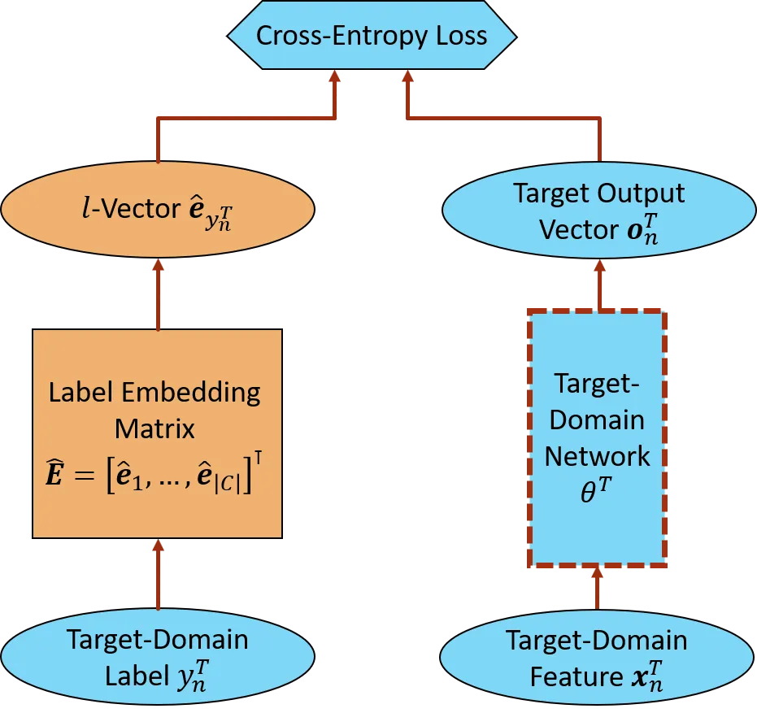

# L-Vector: Neural Label Embedding for Domain Adaptation

Zhong Meng    Hu Hu\sthanksWork performed during an internship at
Microsoft    Jinyu Li    Changliang Liu    Yan Huang    Yifan Gong   
Chin-Hui Lee

###### Abstract

We propose a novel neural label embedding (NLE) scheme for the domain
adaptation of a deep neural network (DNN) acoustic model with _unpaired_
data samples from source and target domains. With NLE method, we distill
the knowledge from a powerful source-domain DNN into a dictionary of
label embeddings, or _l_-vectors, one for each senone class. Each
_l_-vector is a representation of the senone-specific output
distributions of the source-domain DNN and is learned to minimize the
average $`L_{2}`$, Kullback-Leibler (KL) or symmetric KL distance to the
output vectors with the same label through simple averaging or standard
back-propagation. During adaptation, the _l_-vectors serve as the soft
targets to train the target-domain model with cross-entropy loss.
Without parallel data constraint as in the teacher-student learning, NLE
is specially suited for the situation where the paired target-domain
data cannot be simulated from the source-domain data. We adapt a 6400
hours multi-conditional US English acoustic model to each of the 9
accented English (80 to 830 hours) and kids’ speech (80 hours). NLE
achieves up to 14.1% relative word error rate reduction over direct
re-training with one-hot labels.

###### Index Terms: 

deep neural network, label embedding, domain adaptation, teacher-student
learning, speech recognition

^(†)^(†)address: ¹ Microsoft Corporation, Redmond, WA, USA  
² Georgia Institute of Technology, Atlanta, GA, USA

## 1 Introduction

Deep neural networks (DNNs) \[1, 2, 3\] have greatly advanced the
performance of automatic speech recognition (ASR) with a large amount of
training data. However, the performance degrades when test data is from
a new domain. Many DNN adaptation approaches were proposed to compensate
for the acoustic mismatch between training and testing. In \[4, 5, 6\],
regularization-based approaches restrict the neuron output distributions
or the model parameters to stay not too far away from the source-domain
model. In \[7, 8\], transformation-based approaches reduce the number of
learnable parameters by updating only the transform-related parameters.
In \[9, 10\], the trainable parameters are further reduced by singular
value decomposition of weight matrices of a neural network. In addition,
i-vector \[11\] and speaker-code \[12, 13\] are used as auxiliary
features to a neural network for model adaptation. In \[14, 15\], these
adaptation methods were further investigated in end-to-end ASR \[16,
17\]. However, all these methods focus on addressing the overfitting
issue given very limited adaptation data in the target-domain.

Teacher-student (T/S) learning \[18, 19, 20, 21\] has shown to be
effective for large-scale unsupervised domain adaptation by minimizing
the Kullback-Leibler (KL) divergence between the output distributions of
the teacher and student models. The input to the teacher and student
models needs to be _parallel_ source- and target-domain adaptation data,
respectively, since the output vectors of a teacher network need to be
frame-by-frame aligned with those of the student network to construct
the KL divergence between two distributions. Compared to one-hot labels,
the use of frame-level senone (tri-phone states) posteriors from the
teacher as the soft targets to train the student model well preserves
the relationships among different senones at the output of the teacher
network. However, the parallel data constraint of T/S learning restricts
its application to the scenario where the _paired_ target-domain data
can be easily simulated from the source domain data (e.g. from clean to
noisy speech). Actually, in many scenarios, the generation of parallel
data in a new domain is almost impossible, e.g., to simulate paired
accented or kids’ speech from standard adults’ speech.

Recently, adversarial learning \[22, 23\] was proposed for
domain-invariant training \[24, 25, 26\], speaker adaptation \[27\],
speech enhancement \[28, 29, 30\] and speaker verification \[31, 32\].
It was also shown to be effective for unsupervised domain adaptation
_without_ using parallel data \[33, 34\]. In adversarial learning, an
auxiliary domain classifier is jointly optimized with the source model
to mini-maximize an adversarial loss. A deep representation is learned
to be invariant to domain shifts and discriminative to senone
classification. However, adversarial learning does not make use of the
target-domain labels which carry important class identity information
and is only suitable for the situation where neither parallel data nor
target-domain labels are available.

How to perform effective domain adaptation using _unpaired_ source- and
target-domain data with labels? We propose a neural label embedding
(NLE) method: instead of frame-by-frame knowledge transfer in T/S
learning, we distill the knowledge of a source-domain model to a fixed
set of _label embeddings_, or _l-vectors_, one for each senone class,
and then transfer the knowledge to the target-domain model via these
senone-specific _l_-vectors. Each $`l`$-vector is a condensed
representation of the DNN output distributions given all the features
aligned with the same senone at the input. A simple DNN-based method is
proposed to learn the $`l`$-vectors by minimizing the average $`L_{2}`$,
Kullback-Leibler (KL) and symmetric KL distance to the output vectors
with the same senone label. During adaptation, the _l_-vectors are used
in lieu of their corresponding one-hot labels to train the target-domain
model with cross-entropy loss.

NLE can be viewed as a knowledge quantization \[35\] in form of
output-distribution vectors where each $`l`$-vector is a code-vector
(centroid) corresponding to a senone codeword. With the NLE method,
knowledge is transferred from the source-domain model to the
target-domain through a fixed codebook of _senone-specific_ _l_-vectors
instead of variable-length _frame-specific_ output-distribution vectors
in T/S learning. These distilled _l_-vectors decouple the target-domain
model’s output distributions from those of the source-domain model and
thus enable a more flexible and efficient _senone-level_ knowledge
transfer using _unpaired_ data. When parallel data is available,
compared to the T/S learning, NLE significantly reduces the
computational cost during adaptation by replacing the
forward-propagation of each source-domain frame through the
source-domain model with a fast look-up in $`l`$-vector codebook. In the
experiments, we adapt a multi-conditional acoustic model trained with
6400 hours of US English to each of the 9 different accented English
(120 hours to 830 hours) and kids’ speech (80 hours), the proposed NLE
method achieves 5.4% to 14.1% and 6.0% relative word error rate (WER)
reduction over one-hot label baseline on 9 accented English and kids’
speech, respectively.

## 2 Neural Label Embedding (NLE) for Domain Adaptation

In this section, we present the NLE method for domain adaptation without
using parallel data. Initially, we have a well-trained source-domain
network $`M^{S}`$ with parameters $`\theta^{S}`$ predicting a set of
senones $`\mathbbm{C}`$ and source-domain speech frames
$`\mathbf{X}^{S}=\{\mathbf{x}^{S}_{1},\ldots,\mathbf{x}^{S}_{N_{S}}\}`$
with senone labels
$`\mathbf{Y}^{S}=\{y^{S}_{1},\ldots,y^{S}_{N_{S}}\}`$. We distill the
knowledge of this powerful source-domain model into a dictionary of
_l_-vectors, one for each senone label (class) predicted at the output
layer. Each _l_-vector has the same dimentionality as the number of
senone classes. Before training the target-domain model $`M^{T}`$ with
parameters $`\theta^{T}`$, we query the dictionary with the ground-truth
one-hot senone labels
$`\mathbf{Y}^{T}=\{y^{T}_{1},\ldots,y^{T}_{N_{T}}\}`$ of the
target-domain speech frames
$`\mathbf{X}^{T}=\{\mathbf{x}^{T}_{1},\ldots,\mathbf{x}^{T}_{N_{T}}\}`$
to get their corresponding _l_-vectors. During adaptation, in place of
the one-hot labels, the _l_-vectors are used as the soft targets to
train the target-domain model. For NLE domain adaptation, the
source-domain data $`\mathbf{X}^{S}`$ does not have to be parallel to
the target-domain speech frames $`\mathbf{X}^{T}`$, i.e.,
$`\mathbf{X}^{S}`$ and $`\mathbf{X}^{T}`$ do not have to be
frame-by-frame synchronized and the number of frames $`N_{S}`$ does not
have to be equal to $`N_{T}`$.

The key step of the NLE method is to learn _l_-vectors from the
source-domain model and data. As the carrier of knowledge transferred
from the source-domain to the target-domain, the _l_-vector
$`\mathbf{e}_{c}`$ of a senone class $`c`$ should be a representation of
the output distributions (senone-posterior distributions) of the
source-domain DNN given features aligned with senone $`c`$ at the input,
encoding the dependency between senone $`c`$ and all the other senones
$`\mathbbm{C}\setminus c`$. A reasonable candidate is the _centroid_
vector that minimizes the average distance to the output vectors
generated from all the frames aligned with senone $`c`$. Therefore, we
need to learn a dictionary of $`|\mathbbm{C}|`$ $`l`$-vectors
corresponding to $`|\mathbbm{C}|`$ senones in the complete set
$`\mathbbm{C}`$, with each $`l`$-vector being
$`|\mathbbm{C}|`$-dimensional. To serve as the training target of the
target-domain model, the $`l`$-vector $`\mathbf{e}_{c}`$ needs to be
normalized such that its elements satisfy

```math
\displaystyle e_{c,i}>0,\quad\sum_{i=1}^{|\mathbbm{C}|}e_{c,i}=1. \tag{1}
```

### 2.1 NLE Based on $`L_{2}`$ Distance Minimization (NLE-L2)

To compute the senone-specific centroid, the most intuitive solution is
to minimize the average $`L_{2}`$ distance between the centroid and all
the output vectors with the same senone label, which is equivalent to
calculating the arithmetic mean of the output vectors aligned with the
senone. Let $`\mathbf{o}^{S}_{n}`$ denote a
$`|\mathbbm{C}|`$-dimensional output vector of $`M^{S}`$ given the input
frame $`\mathbf{x}^{S}_{n}`$. $`o^{S}_{n,i}`$ equals to the posterior
probability of senone $`i`$ given $`\mathbf{x}^{S}_{n}`$, i.e.,
$`o^{S}_{n,i}=P(i|\mathbf{x}^{S}_{n};\mathbf{\theta}^{S}),i\in\mathbbm{C}`$.
For senone $`c`$, the _l_-vector $`\mathbf{e}_{c}`$ based on $`L_{2}`$
distance minimization is computed as

```math
\displaystyle\mathbf{\hat{e}}_{c}=\frac{1}{N_{S,c}}\sum_{n=1}^{N_{S}}\mathbf{o}^{S}_{n}\mathbbm{1}[\mathbf{x}^{S}_{n}\in\text{senone}\;c],\;\;c\in\mathbbm{C}, \tag{2}
```

where $`N_{S,c}`$ is the number of source-domain frames aligned with
senone $`c`$ and $`N_{S}=\sum_{c\in\mathbbm{C}}N_{S,c}`$. The
_l_-vectors under NLE-L2 are automatically normalized since each
posterior vector $`\mathbf{o}^{S}_{n}`$ in the mean computation satisfy
Eq. (1).

### 2.2 NLE Based on KL Distance Minimization (NLE-KL)

KL divergence is an effective metric to measure the distance between two
distributions. In NLE framework, the _l_-vector $`\mathbf{e}_{c}`$ can
be learned as a centroid with a minimum average KL distance to the
output vectors of senone $`c`$. Many methods have been proposed to
iteratively compute the centroid of KL distance \[36, 37, 38\].



Figure 1: The diagram of learning neural label embeddings
($`l`$-vectors) through KL or SKL minimization. Only modules with red
dotted lines are updated.

In this paper, we propose a simple DNN-based solution to compute this
KL-based centroid. As shown in Fig. 1, we have an initial
$`|\mathbbm{C}|\times|\mathbbm{C}|`$ embedding matrix $`\mathbf{E}`$
consisting of all the $`l`$-vectors, i.e.,
$`\mathbf{E}=[\mathbf{e}_{1},\ldots,\mathbf{e}_{|\mathbbm{C}|}]^{\top}`$.
For each source-domain sample, we look up the senone label $`y^{S}_{n}`$
in $`\mathbf{E}`$ to get its $`l`$-vector $`\mathbf{e}_{y^{S}_{n}}`$ and
forward-propagate $`\mathbf{x}^{S}_{n}`$ through $`M^{S}`$ to obtain the
output vector $`\mathbf{o}^{S}_{n}`$. The KL distance between
$`\mathbf{o}^{S}_{n}`$ and its corresponding centroid $`l`$-vector
$`\mathbf{e}_{y^{S}_{n}}`$ is

```math
\displaystyle\mathcal{KL}(\mathbf{e}_{y^{S}_{n}}||\mathbf{o}^{S}_{n})=\sum_{i=1}^{|\mathbbm{C}|}e_{y^{S}_{n},i}\log\frac{e_{y^{S}_{n},i}}{o^{S}_{n,i}}. \tag{3}
```

We sum up all the KL distances and get the KL distance loss below

```math
\displaystyle\mathcal{L}_{\text{NLE-KL}}(\mathbf{E})=\frac{1}{N_{S}}\sum_{n=1}^{N_{S}}\mathcal{KL}(\mathbf{e}_{y^{S}_{n}}||\mathbf{o}^{S}_{n}). \tag{4}
```

To ensure each $`l`$-vector is normalized to satisfy Eq. (1), we perform
a softmax operation over a logit vector
$`\mathbf{z}_{c}\in\mathbbm{R}^{|\mathbbm{C}|}`$ to obtain
$`\mathbf{e}_{c}`$ below

```math
\displaystyle e_{c,i}=\frac{\exp(z_{c,i})}{\sum_{j=1}^{|\mathbbm{C}|}\exp{(z_{c,j})}},\quad c\in\mathbbm{C}. \tag{5}
```

For fast convergence, $`\mathbf{z}_{c}`$ is initialized with the
arithmetic mean of the pre-softmax logit vectors of the source-domain
network aligned with senone $`c`$. The embedding matrix $`\mathbf{E}`$
is trained to minimize $`\mathcal{L}_{\text{NLE-KL}}(\mathbf{E})`$ by
updating $`\mathbf{z}_{1},\ldots,\mathbf{z}_{|\mathbbm{C}|}`$ through
standard back-propagation while the parameters $`\mathbf{\theta}^{S}`$
of $`M^{S}`$ are fixed.

### 2.3 NLE Based on Symmetric KL Distance Minimization (NLE-SKL)

One shortcoming of KL distance is that it is asymmetric: the
minimization of
$`\mathcal{KL}(\mathbf{e}_{y^{S}_{n}}||\mathbf{o}^{S}_{n})`$ does not
guarantee $`\mathcal{KL}(\mathbf{o}^{S}_{n}||\mathbf{e}_{y^{S}_{n}})`$
is also minimized. SKL compensates for this by adding up the two KL
terms together and is thus a more robust distance metric for clustering.
Therefore, for each senone, we learn a centroid $`l`$-vector with a
minimum average SKL distance to the output vectors of $`M^{S}`$ aligned
with that senone by following the same DNN-based method in Section 2.2
except for replacing the KL distance loss with an SKL one.

The SKL distance between an $`l`$-vector $`\mathbf{e}_{y^{S}_{n}}`$ and
an output vector $`\mathbf{o}_{n}`$ is defined as

```math
\displaystyle\mathcal{SKL}(\mathbf{e}_{y^{S}_{n}}||\mathbf{o}^{S}_{n})=\sum_{i=1}^{|\mathbbm{C}|}\left(e_{y^{S}_{n},i}-o^{S}_{n,i}\right)\log\frac{e_{y^{S}_{n},i}}{o^{S}_{n,i}}, \tag{6}
```

and the SKL distance loss is computed by summing up all pairs of SKL
distances between output vectors and their centroids as follows

```math
\displaystyle\mathcal{L}_{\text{NLE-SKL}}(\mathbf{E})=\frac{1}{N_{S}}\sum_{n=1}^{N_{S}}\mathcal{SKL}(\mathbf{e}_{y^{S}_{n}}||\mathbf{o}^{S}_{n}). \tag{7}
```

### 2.4 Train Target-Domain Model with NLE

As the condensed knowledge distilled from a large amount of
source-domain data, the $`l`$-vectors serve at the soft targets for
training the target-domain model $`M^{T}`$.



Figure 2: Train target-domain model using label embeddings
($`l`$-vectors). Only modules with red dotted lines are updated.

As shown in Fig. 2, we look up target-domain label $`y^{T}_{n}`$ in the
optimized label embedding matrix $`\mathbf{\hat{E}}`$ for its
$`l`$-vector $`\mathbf{\hat{e}}_{y^{T}_{n}}`$ and forward-propagate
$`\mathbf{x}^{T}_{n}`$ through $`M^{T}`$ to get the output vector
$`\mathbf{o}^{T}_{n}`$. We construct a cross-entropy loss using
$`l`$-vectors $`\mathbf{\hat{e}}^{T}_{y_{n}}`$ as the soft targets below

```math
\displaystyle\mathcal{L}_{\text{CE}}(\mathbf{\theta}^{T}) \displaystyle=\frac{1}{N_{T}}\sum_{n=1}^{N_{T}}\sum_{i=1}^{|\mathbbm{C}|}\hat{e}_{y^{T}_{n},i}\log o^{T}_{n,i}, \tag{8}
```

where
$`o^{T}_{n,i}=P(i|\mathbf{x}^{T}_{n},\mathbf{\theta}^{T}),i\in\mathbbm{C}`$
is the posterior of senone $`i`$ given $`\mathbf{x}^{T}_{n}`$. We train
$`M^{T}`$ to minimize $`\mathcal{L}_{\text{CE}}(\mathbf{\theta}^{T})`$
by updating only $`\mathbf{\theta}^{T}`$. The optimized $`M^{T}`$ with
$`\hat{\theta}^{T}`$ is used for decoding.

Compared with the traditional one-hot training targets that convey only
class identities, the soft $`l`$-vectors transfer additional quantized
knowledge that encodes the probabilistic relationships among different
senone classes. Benefiting from this, the NLE-adapted acoustic model is
expected to achieve higher ASR performance than using one-hot labels on
target-domain test data. The steps of NLE for domain adaptation are
summarized in Algorithm 1.

0:  Source-domain model $`M^{S}`$, data $`\mathbf{X}^{S}`$, and labels
$`\mathbf{Y}^{S}`$.    Target-domain data $`\mathbf{X}^{T}`$ and labels
$`\mathbf{Y}^{T}`$.

0:  Target-domain model $`M^{T}`$ with parameters $`\hat{\theta}^{T}`$

1:   Forward-propagate $`\mathbf{X}^{S}`$ through $`M^{S}`$ to generate
output vectors $`\mathbf{O}^{S}`$.

2:  Learn label embedding matrix $`\mathbf{E}_{L_{2}}`$ by computing
_senone-specific_ arithmetic means of $`\mathbf{O}^{S}`$ as in Eq. (2).

3:  repeat

4:   Forward-propagate $`\mathbf{X}^{S}`$ through $`M^{S}`$ to generate
$`\mathbf{O}^{S}`$.

5:    Look up each $`y^{S}_{n}`$ in $`\mathbf{E}_{\text{KL}}`$ or
$`\mathbf{E}_{\text{SKL}}`$ for $`l`$-vector $`\mathbf{e}_{y^{S}_{n}}`$.

6:   Compute and back-propagate the error signal of loss
$`\mathcal{L}_{\text{NLE-KL}}`$ in Eq. (4) or
$`\mathcal{L}_{\text{NLE-SKL}}`$ in Eq. (7) by updating
$`\mathbf{E}_{\text{KL}}`$ or $`\mathbf{E}_{\text{SKL}}`$, respectively.

7:  until convergence

8:  repeat

9:    Forward-propagate $`\mathbf{X}^{T}`$ through $`M^{T}`$ to generate
output vectors $`\mathbf{O}^{T}`$.

10:    Look up each $`y^{T}_{n}`$ in $`\mathbf{\hat{E}}_{L_{2}}`$,
$`\mathbf{\hat{E}}_{\text{KL}}`$ or $`\mathbf{\hat{E}}_{\text{KL}}`$ for
$`l`$-vector $`\hat{\mathbf{e}}_{y^{T}_{n}}`$.

11:   Compute and back-propagate the error signal of loss
$`\mathcal{L}_{\text{CE}}`$ in Eq. (8) by updating
$`\mathbf{\theta}^{T}`$.

12:  until convergence

Algorithm 1 Neural Label Embedding (NLE) for Domain Adaptation

|       |     |     |     |     |     |     |     |     |     |      |
| ----- | --- | --- | --- | --- | --- | --- | --- | --- | --- | ---- |
| Task  | A1  | A2  | A3  | A4  | A5  | A6  | A7  | A8  | A9  | Kids |
| Adapt | 160 | 140 | 190 | 120 | 150 | 830 | 250 | 330 | 150 | 80   |
| Test  | 11  | 8   | 11  | 7   | 11  | 11  | 11  | 11  | 13  | 3    |

Table 1: Durations (hours) of adaptation and test data for each of the 9
accented English (A1-A9) and kids’ speech.

|               |       |       |       |       |       |       |       |       |      |       |
| ------------- | ----- | ----- | ----- | ----- | ----- | ----- | ----- | ----- | ---- | ----- |
| Adapt. Method | A1    | A2    | A3    | A4    | A5    | A6    | A7    | A8    | A9   | Kids  |
| Unadapted     | 26.98 | 15.27 | 25.23 | 34.62 | 22.48 | 14.65 | 13.19 | 14.91 | 9.80 | 27.83 |
| One-Hot       | 20.37 | 14.46 | 20.14 | 19.99 | 15.06 | 12.50 | 11.73 | 13.90 | 9.71 | 26.99 |
| NLE-L2        | 18.39 | 12.91 | 18.54 | 18.39 | 14.14 | 12.04 | 10.54 | 12.55 | 9.48 | 25.93 |
| NLE-KL        | 18.30 | 12.86 | 18.74 | 18.42 | 14.25 | 11.90 | 10.39 | 12.52 | 9.43 | 25.83 |
| NLE-SKL       | 17.97 | 12.42 | 17.82 | 17.94 | 13.81 | 11.56 | 10.15 | 12.21 | 9.19 | 25.36 |

Table 2: ASR WERs (%) of adapting a multi-conditional BLSTM acoustic
model trained with 6400 hours US English to each of the 9 accented
English and kids’ speech with one-hot label and the proposed NLE
methods.

## 3 Experiments

We perform two domain adaptation tasks where parallel source- and
target-domain data is not accessible through data simulation: 1) adapt a
US English acoustic model to accented English from 9 areas of the world; 2) adapt the same acoustic model to kids’ speech. In both tasks, the
source-domain training data is 6400 hours of multi-conditional Microsoft
US English production data, including Cortana, xBox and Conversation
data. The data is collected from mostly adults from all over the US. It
is a mixture of close-talk and far-field utterances from a variety of
devices.

For the first task, the adaptation data consists of 9 different types of
accented English A1-A9 in which A1, A2, A3, A8 are from Europe, A4, A5,
A6 are from Asia, A7 is from Oceania, A9 is from North America. A7-A9
are native accents because they are from countries where most people use
English as their first language. On the contrary, A1-A6 are non-native
accents. Each English accent forms a specific target domain. For the
second task, the adaptation data is 80 hours of US English speech
collected from kids. The durations of different adaptation and test data
are listed in Table 1. The training and adaptation data is transcribed.
All data is anonymized with personally identifiable information removed.

### 3.1 Baseline System

We train a source-domain bi-directional long short-term memory
(BLSTM)-hidden Markov model acoustic model \[39, 40, 41\] with 6400
hours of training data. This teacher model has 6 hidden layers with 600
units in each layer. 80-dimensional log Mel filterbank features are
extracted from training, adaptation and test data. The output layer has
9404 units representing 9404 senone labels. The BLSTM is trained to
minimize the frame-level cross-entropy criterion. There is no frame
stacking or skipping. A 5-gram LM is used for decoding with around 148M
n-grams. Table 2 (Row 1) shows the WERs of the multi-conditional BLSTM
on different accents. This well-trained source-domain model is used as
the initialization for all the subsequent re-training and adaptation
experiments.

For accent adaptation, we train an accent-dependent BLSTM for each
accented English using one-hot label with cross-entropy loss. Each
accent-dependent model is trained with the speech of only one accent. As
shown in Table 2, the one-hot re-training achieves 9.71% to 20.37% WERs
on different accents. For kids adaptation, we train a kids-dependent
BLSTM using kids’ speech with one-hot labels. In Table 2, we see that
one-hot re-training achieves 26.99% WER on kids test data. We use these
results as the baseline.

Note that, in this work, we do not compare NLE with KLD adaptation \[4\]
since the effectiveness of KLD regularization reduces as the adaptation
data increases and it is normally used when the adaptation data is very
small (10 min or less).

### 3.2 NLE for Accent Adaptation

It is hard to simulate parallel accented speech from US English. We
adapt the 6400 hours BLSTM acoustic model to 9 different English accents
using NLE. We learn 9404-dimensional $`l`$-vectors using NLE-L2, NLE-KL,
and NLE-SKL as described in Sections 2.2 and 2.3 with the source-domain
data and acoustic model. These $`l`$-vectors are used as the soft
targets to train the accent-dependent models with cross-entropy loss as
in Section 2.4.

As shown in Table 2, NLE-L2, NLE-KL, and NLE-SKL achieve 9.48% to
18.54%, 9.43% to 18.74%, and 9.19% to 17.97% WERs, respectively, on
different accents. NLE-SKL performs the best among the three NLE
adaptation methods, with 11.8%, 14.1%, 11.5%, 10.3%, 8.3%, 7.5%, 13.5%,
12.2%, and 5.4% relative WER reductions over the one-hot label baseline
on A1 to A9, respectively. NLE-SKL consistently outperforms NLE-L2 and
NLE-KL on all the accents, with up to 4.0% and 4.9% relative WER
reductions over NLE-L2 and NLE-KL, respectively. The relative reductions
for native and non-native accents are similar except for A9. NLE-KL
performs slightly better than NLE-L2 on 6 out of 9 accents, but slightly
worse than NLE-L2 on the other 3. All the three NLE methods achieve much
smaller relative WER reductions (about 5%) on A9 than the other accents
(about 10%). This is reasonable because North American English is much
more similar to the source-domain US English than the other accents. The
source-domain model is not adapted much to the accent of the
target-domain speech.

### 3.3 NLE for Kid Adaptation

Parallel kids’ speech cannot be obtained through data simulation either.
We adapt the 6400 hours BLSTM acoustic model to the collected real kids’
speech using NLE. We use the same $`l`$-vectors learned in Section 3.2
as the soft targets to train the kid-dependent BLSTM acoustic model by
minimizing the cross-entropy loss. As shown in Table 2, NLE-L2, NLE-KL,
and NLE-SKL achieve 25.93%, 25.83%, and 25.36% WERs on kids’ test set,
respectively. NLE-SKL outperforms the other two NLE methods with a 6.0%
relative WER reduction over the one-hot baseline. We find that NLE is
more effective for accent adaptation than kids adaptation. One possible
reason is that a portion of kids are at the age of teenagers whose
speech is very similar to that of the adults’ in the 6400 hours
source-domain data. Note that all the kids speech is collected in US and
no accent adaptation is involved.

## 4 Conclusion

We propose a novel neural label embedding method for domain adaptation.
Each senone label is represented by an $`l`$-vector that minimizes the
average $`L_{2}`$, KL or SKL distances to all the source-domain output
vectors aligned with the same senone. $`l`$-vectors are learned through
a simple average or a proposed DNN-based method. During adaptation,
$`l`$-vectors serve as the soft targets to train the target-domain
model. Without parallel data constraint as in T/S learning, NLE is
specially suited for the situation where paired target-domain data
samples cannot be simulated from the source-domain ones. Given parallel
data, NLE has significantly lower computational cost than T/S learning
during adaptation since it replaces the DNN forward-propagation with a
fast dictionary lookup.

We adapt a multi-conditional BLSTM acoustic model trained with 6400
hours US English to 9 different accented English and kids’ speech. NLE
achieves 5.4% to 14.1% and 6.0% relative WER reductions over one-hot
label baseline. NLE-SKL consistently outperforms NLE-L2 and NLE-KL on
all adaptation tasks by up to relatively 4.0% and 4.9%, respectively. As
a simple arithmetic mean, NLE-L2 performs similar to NLE-KL with
dramatically reduced computational cost for $`l`$-vector learning.

## References

- \[1\] G. Hinton, L. Deng, D. Yu, et al., “Deep neural networks for
  acoustic modeling in speech recognition: The shared views of four
  research groups,” IEEE Signal Processing Magazine, vol. 29, no. 6, pp.
  82--97, 2012.
- \[2\] T. Sainath, B. Kingsbury, B. Ramabhadran, et al., “Making deep
  belief networks effective for large vocabulary continuous speech
  recognition,” in Proc. ASRU, 2011, pp. 30–35.
- \[3\] L. Deng, J. Li, J. Huang, et al., “Recent advances in deep
  learning for speech research at Microsoft,” in ICASSP, 2013.
- \[4\] D. Yu, K. Yao, H. Su, et al., “Kl-divergence regularized deep
  neural network adaptation for improved large vocabulary speech
  recognition,” in Proc. ICASSP, May 2013.
- \[5\] Z. Huang, S. Siniscalchi, I. Chen, et al., “Maximum a posteriori
  adaptation of network parameters in deep models,” in Proc.
  Interspeech, 2015.
- \[6\] H. Liao, “Speaker adaptation of context dependent deep neural
  networks,” in Proc. ICASSP, May 2013.
- \[7\] R. Gemello, F. Mana, S. Scanzio, et al., “Linear hidden
  transformations for adaptation of hybrid ann/hmm models,” Speech
  Communication, vol. 49, no. 10, pp. 827 – 835, 2007.
- \[8\] F. Seide, G. Li, X. Chen, and D. Yu, “Feature engineering in
  context-dependent deep neural networks for conversational speech
  transcription,” in Proc. ASRU, Dec 2011, pp. 24–29.
- \[9\] J. Xue, J. Li, and Y. Gong, “Restructuring of deep neural
  network acoustic models with singular value decomposition.,” in
  Interspeech, 2013.
- \[10\] J. Xue, J. Li, D. Yu, et al., “Singular value decomposition
  based low-footprint speaker adaptation and personalization for deep
  neural network,” in Proc. ICASSP, May 2014.
- \[11\] G. Saon, H. Soltau, et al., “Speaker adaptation of neural
  network acoustic models using i-vectors,” in ASRU, 2013.
- \[12\] O. Abdel-Hamid and H. Jiang, “Fast speaker adaptation of hybrid
  nn/hmm model for speech recognition based on discriminative learning
  of speaker code,” in Proc. ICASSP, May 2013.
- \[13\] S. Xue, O. Abdel-Hamid, H. Jiang, et al., “Fast adaptation of
  deep neural network based on discriminant codes for speech
  recognition,” in TASLP, vol. 22, no. 12, Dec 2014.
- \[14\] F. Weninger, J. Andrés-Ferrer, X. Li, et al., “Listen, attend,
  spell and adapt: Speaker adapted sequence-to-sequence asr,” Proc.
  Interspeech, 2019.
- \[15\] Z. Meng, Y. Gaur, J. Li, et al., “Speaker adaptation for
  attention-based end-to-end speech recognition,” Proc.
  Interspeech, 2019.
- \[16\] Jan K Chorowski, Dzmitry Bahdanau, Dmitriy Serdyuk, et al.,
  “Attention-based models for speech recognition,” in NIPS, 2015, pp.
  577–585.
- \[17\] Z. Meng, Y. Gaur, J. Li, and Y. Gong, “Character-aware
  attention-based end-to-end speech recognition,” in Proc. ASRU.
  IEEE, 2019.
- \[18\] J. Li, R. Zhao, J.-T. Huang, et al., “Learning small-size DNN
  with output-distribution-based criteria.,” in Proc. INTERSPEECH, 2014,
  pp. 1910–1914.
- \[19\] J. Li, M. L Seltzer, X. Wang, et al., “Large-scale domain
  adaptation via teacher-student learning,” in INTERSPEECH, 2017.
- \[20\] Z. Meng, J. Li, Y. Zhao, et al., “Conditional teacher-student
  learning,” in Proc. ICASSP, 2019.
- \[21\] Z. Meng, J. Li, Y. Gaur, et al., “Domain adaptation via
  teacher-student learning for end-to-end speech recognition,” in Proc.
  ASRU. IEEE, 2019.
- \[22\] I. Goodfellow, J. Pouget-Adadie, et al., “Generative
  adversarial nets,” in Proc. NIPS, pp. 2672–2680. 2014.
- \[23\] Yaroslav Ganin and Victor Lempitsky, “Unsupervised domain
  adaptation by backpropagation,” in Proc. ICML, Lille, France, 2015,
  vol. 37, pp. 1180–1189, PMLR.
- \[24\] Yusuke Shinohara, “Adversarial multi-task learning of deep
  neural networks for robust speech recognition.,” in INTERSPEECH, 2016,
  pp. 2369–2372.
- \[25\] Z. Meng, J. Li, Z. Chen, et al., “Speaker-invariant training
  via adversarial learning,” in Proc. ICASSP, 2018.
- \[26\] Z. Meng, J. Li, Y. Gong, et al., “Adversarial teacher-student
  learning for unsupervised domain adaptation,” in Proc. ICASSP. IEEE,
  2018, pp. 5949–5953.
- \[27\] Z. Meng, J. Li, and Y. Gong, “Adversarial speaker adaptation,”
  in Proc. ICASSP, 2019.
- \[28\] S. Pascual, A. Bonafonte, et al., “Segan: Speech enhancement
  generative adversarial network,” in Interspeech, 2017.
- \[29\] Z. Meng, J. Li, and Y. Gong, “Cycle-consistent speech
  enhancement,” Interspeech, 2018.
- \[30\] Z. Meng, J. Li, and Y. Gong, “Adversarial feature-mapping for
  speech enhancement,” Interspeech, 2018.
- \[31\] Q. Wang, W. Rao, S. Sun, et al., “Unsupervised domain
  adaptation via domain adversarial training for speaker recognition,”
  ICASSP, 2018.
- \[32\] Z. Meng, Y. Zhao, J. Li, and Y. Gong, “Adversarial speaker
  verification,” in Proc. ICASSP, 2019.
- \[33\] S. Sun, B. Zhang, L. Xie, et al., “An unsupervised deep domain
  adaptation approach for robust speech recognition,” Neurocomputing,
  vol. 257, pp. 79 – 87, 2017.
- \[34\] Z. Meng, Z. Chen, V. Mazalov, J. Li, and Y. Gong, “Unsupervised
  adaptation with domain separation networks for robust speech
  recognition,” in Proc. ASRU, 2017.
- \[35\] Robert Gray, “Vector quantization,” IEEE Assp Magazine, vol. 1,
  no. 2, pp. 4–29, 1984.
- \[36\] K. Chaudhuri and A. McGregor, “Finding metric structure in
  information theoretic clustering.,” in COLT. Citeseer, 2008, vol. 8,
  p. 10.
- \[37\] R. Veldhuis, “The centroid of the symmetrical kullback-leibler
  distance,” IEEE Signal Processing Letters, vol. 9, 2002.
- \[38\] M. Das Gupta, S. Srinivasa, M. Antony, et al., “Kl divergence
  based agglomerative clustering for automated vitiligo grading,” in
  Proc. CVPR, 2015, pp. 2700–2709.
- \[39\] H. Sak, A. Senior, and F. Beaufays, “Long short-term memory
  recurrent neural network architectures for large scale acoustic
  modeling,” in Interspeech, 2014.
- \[40\] H. Erdogan, T. Hayashi, J. R. Hershey, et al., “Multi-channel
  speech recognition: Lstms all the way through,” in CHiME-4 workshop,
  2016, pp. 1–4.
- \[41\] Z. Meng, S. Watanabe, J. R. Hershey, et al., “Deep long
  short-term memory adaptive beamforming networks for multichannel
  robust speech recognition,” in ICASSP, 2017, pp. 271–275.
