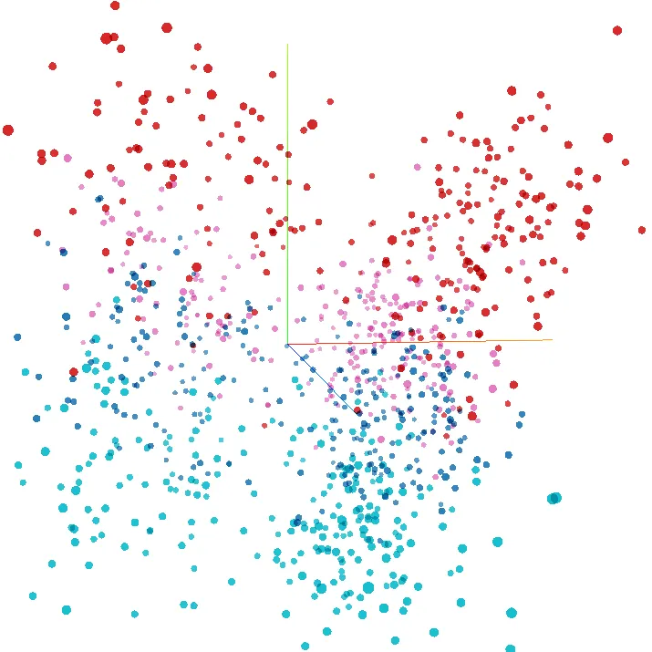
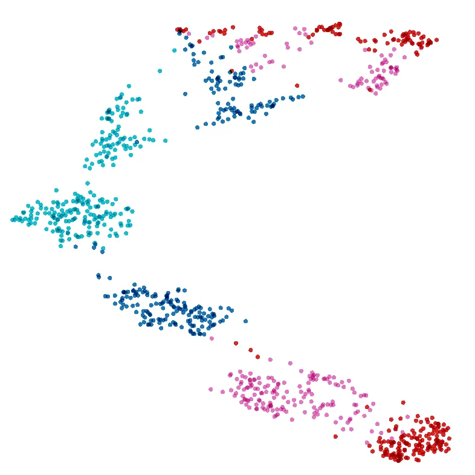
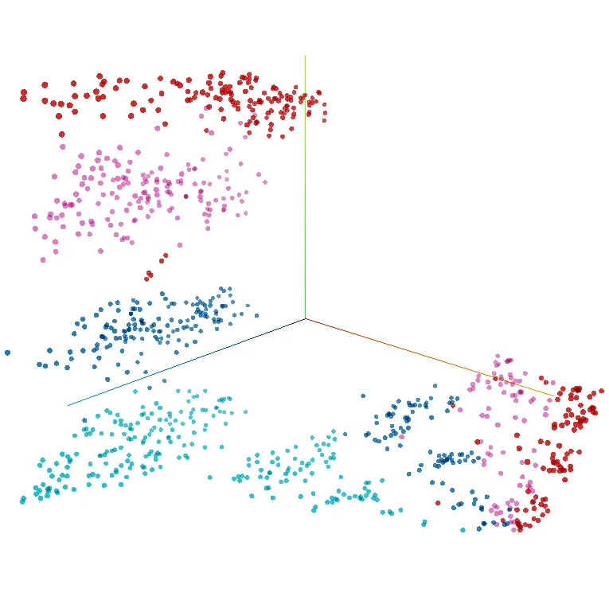
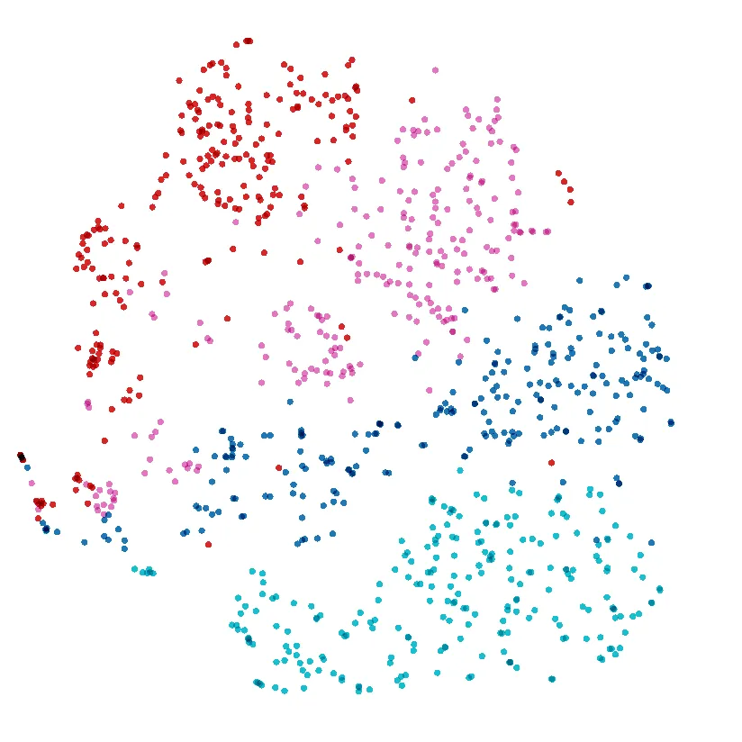
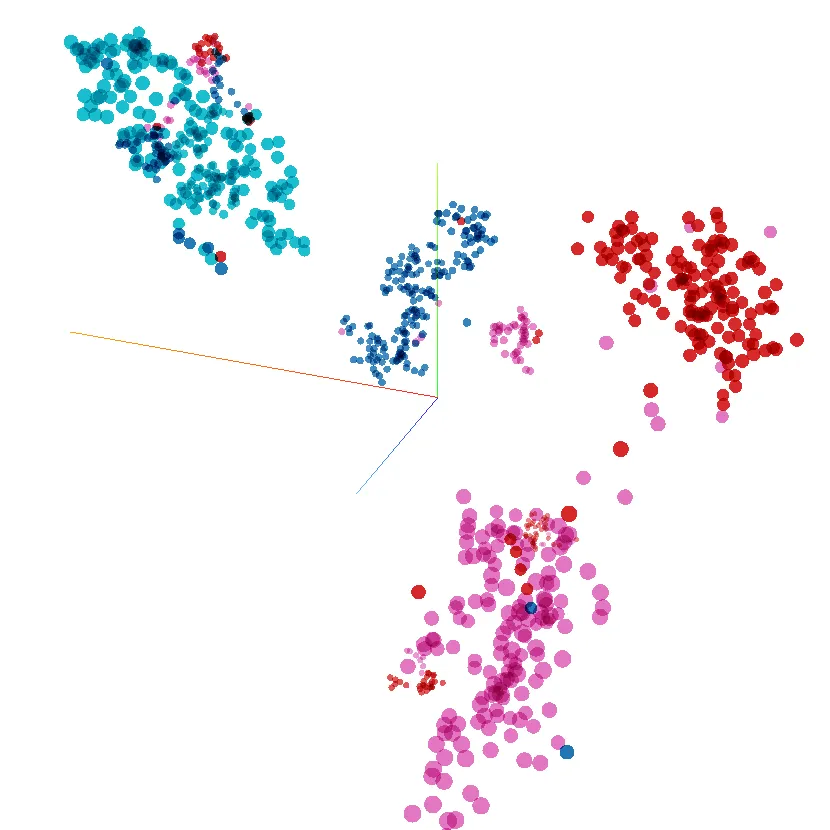
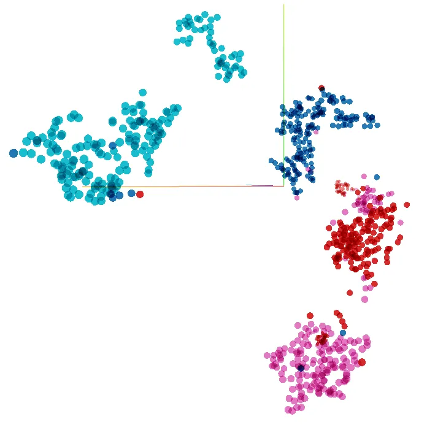

# AccentDB: A Database of Non-Native English Accents to Assist Neural Speech Recognition

\* denotes equal contribution from the authors.† currently at Google.

###### Abstract

Modern Automatic Speech Recognition (ASR) technology has evolved to
identify the speech spoken by native speakers of a language very well.
However, identification of the speech spoken by non-native speakers
continues to be a major challenge for it. In this work, we first spell
out the key requirements for creating a well-curated database of speech
samples in non-native accents for training and testing robust ASR
systems. We then introduce AccentDB, one such database that contains
samples of 4 Indian-English accents collected by us, and a compilation
of samples from 4 native-English, and a metropolitan Indian-English
accent. We also present an analysis on separability of the collected
accent data. Further, we present several accent classification models
and evaluate them thoroughly against human-labelled accent classes. We
test the generalization of our classifier models in a variety of setups
of seen and unseen data. Finally, we introduce the task of accent
neutralization of non-native accents to native accents using autoencoder
models with task-specific architectures. Thus, our work aims to aid ASR
systems at every stage of development with a database for training,
classification models for feature augmentation, and neutralization
systems for acoustic transformations of non-native accents of English.

Keywords: Speech Resource/Database, Prosody, Speech
Recognition/Understanding

|                                                          |
| -------------------------------------------------------- |
| Afroz Ahamad^(\*†),  Ankit Anand^(\*),  Pranesh Bhargava |
| BITS Pilani, India                                       |
| {afrozsahamad, ankit0905anand}@gmail.com                 |
| pranesh@hyderabad.bits-pilani.ac.in                      |

Abstract content

## 1. Introduction

In Sociolinguistics, accent is a manner of pronouncing a language.
Anyone who speaks a language, does so in an accent. The way the native
speakers of a language speak that language defines the standard
pronunciation, and is generally considered to be the standard or
reference accent for that language. When the non-native speakers of a
language speak that language, say an Indian person speaking English, the
phonological requirement of the non-native language, in this case
English, interacts with the phonological knowledge of their first
language, say Hindi. This influences their manner of speaking, giving
rise to what is considered as the non-native accent.

Accents per se are interesting because they refer to a wide variety of
social issues such as the acceptance of speakers into a community,
indication of class in society, and linguistic issues such as those
pertaining to the phonology of languages. This in itself warrants a
better understanding of accents. However, there is another fundamental
reason for studying accents. Speakers always have a manner of speaking
and the speech always has accent. Since spoken communication is an
important form of communication, studying accents becomes important to
design technologies built to interact with human speech.

### 1.1. Indian Accents in English

Internet has led to English language becoming the linguafranca for
conveying information about science, culture, sports and society in the
world. The continued advancements in technologies supporting speech, in
the form of audio and video media, has led to an increase in the usage
of spoken English on the web. Since these speakers come from various
different linguistic backgrounds, English language happens to be spoken
in many different accents across the world.

English has become an important language of communication among the
younger generation of India because of its status as the language of
formal education. A large number of young Indians is bilingual, i.e.
they speak one of the 22 Indian languages as their first language,
alongside English. An implication of this is that when speaking English,
the intervention from the phonology of their first language, e.g.
Malayalam, gives rise to an accent in the speech of Indian speakers of
English. This accent is generally very distinct and is readily
identifiable, for example, as the Malayalam English accent, the Telugu
English accent, the Bangla English accent, etc.

Interestingly, this younger generation of India is also a large and
growing group of users of speech-based technology through hand-held
devices and voice assistants. These voice assistants have become very
good at identifying English spoken in a native accent. However,
non-native accented speech continues to be a challenge for them. If the
automatic speech recognition (ASR) systems of the voice assistants have
apriori knowledge that the speaker is going to speak with a certain
accent, the voice assistant may be primed to listen to certain features
in the voice, which would lead to a greater performance accuracy. For
the success of this technology, it becomes pertinent then to identify
and process accents, apart from the semantic content of the speech. Due
to the large number of speakers, and vast varieties of accent, English
spoken within India is an excellent resource for creating and testing
technology whose success is contingent on detecting, identifying and
understanding the native and non-native accents.

## 2. The Database

A key requirement for developing speech-based technology is the access
to a well-curated database of speech samples. Some of the widely used
datasets for specific ASR tasks are very well labelled, either manually
or through automation. For example, Google AudioSet \[audioset\] is a
massive dataset for audio event detection, that includes more than 2
million manually-labelled 10-second sound clips belonging to over 600
classes. Similarly, VoxCeleb \[voxceleb\] is a speaker identification
dataset which contains audio clips extracted from interviews of
celebrities.

In this section, we first establish certain key requirements for
constructing an accent database that could be well-suited for ASR tasks.
Then we survey a few existing accent datasets. Further, we discuss our
approach and setup for collecting our database, AccentDB¹¹ 1
[https://accentdb.github.io/](https://accentdb.github.io/). Finally, we
present an analysis of the distribution of speech samples that
constitute AccentDB.

### 2.1. Key Requirements

The following are some of the key requirements for an accent database
suitable for ASR systems.

i\. Variety of Speakers: In order to represent the speaker differences,
the database should ideally contain spoken material from a wide range of
speakers.

ii\. Words vs. Sentences: The pronunciation patterns for words spoken in
isolation are different from when they appear in connected speech, due
to the suprasegmental phenomena such as elision and assimilation
\[Ladefoged\]. Therefore, for the purposes pertaining to the processing
of spoken sentences, the database should contain sentence-length
material.

iii\. Uniformity of Content: For the sake of isolating and identifying
accents, it is necessary to have uniformity in the speech material
across speakers. One way to address this is to have all the speakers
speak the same sentences, preferably at the same speed. A related
requirement is for the speech material to be phonetically balanced, so
that no specific phonemes get over-represented in the database.

iv\. Semantic Requirement: If the sentences are meaningful, it avoids
semantic factors affecting the pronunciation of the sentences.

### 2.2. Existing Accent Databases

Various attempts have been made in the past at creating accent focused
speech databases with varied data sources, speakers, accents and
corpora. ?) created a word database with 20 speakers for each accent
from a total of 6 countries. They used a small corpus of around 200
isolated English words spoken twice in a row by each speaker. ?)
presented a collection of British and American accents in the form of
utterances from non-playable characters of the video game, ”Dragon Age:
Origins (BioWare 2009)”, with manual labelling of the accents done by
three individuals.  
Two of the most popular datasets used for accent-related tasks are: the
Foreign Accented English (FAE) corpus \[foreign-accented-english\], and
the Speech Accent Archive \[please-call-stella\]. FAE data comprises
4925 telephonic utterances by native English speakers of 22 different
languages. The subjects spoke about themselves for 20 seconds and the
recordings were rated on a 4-point scale to determine the strength of
accent. The Speech Accent Archive is a crowd-sourced collection of
speech recordings of readings of a passage (colloquially referred to as
”Please call Stella.”) in English. Information about speakers’
demographic and linguistic background is publicly available ²² 2 [Speech
Accent Archive, George Mason
University.](http://accent.gmu.edu/browse_language.php). The passage has
been spoken by more than 2000 speakers covering over 100 accents and 30
languages, but a significant number of samples are not tagged with the
correct accent. This is because the database is crowd sourced, and there
is no independent supervision on the accent label that is assigned to a
recorded audio sample. For instance, a speaker whose first language is
Bengali/Bangla, might mark his samples as belonging to the Bangla
accent, even if his Bangla accent is neutralized after living in the UK
for many years. Another drawback of using such crowd sourcing approaches
for collection of accent data is that neither the recording environment,
nor the recording hardware are consistent across speakers. This leads to
the introduction of significant noise in samples. The lack of correct
label for each sample adds to the difficulty of using any supervised
learning algorithm for speech recognition tasks.

|                                             |
| ------------------------------------------- |
| The birch canoe slid on the smooth planks.  |
| Glue the sheet to the dark blue background. |
| It’s easy to tell the depth of a well.      |
| These days a chicken leg is a rare dish.    |
| Rice is often served in round bowls.        |

Table 1: First 5 sentences of the Harvard Sentences dataset.

|              |            |                   |                   |                    |
| ------------ | ---------- | ----------------- | ----------------- | ------------------ |
|              | Accent     | Number of Samples | Duration          | Number of Speakers |
| AccentDB     | Bangla     | $`1528`$          | $`2`$h $`13`$min  | $`2`$              |
|              | Malayalam  | $`2393`$          | $`3`$h $`32`$min  | $`3`$              |
|              | Odiya      | $`748`$           | $`1`$h $`11`$min  | $`1`$              |
|              | Telugu     | $`1515`$          | $`2`$h $`10`$min  | $`2`$              |
|              | Total      | $`6184`$          | $`9`$h $`06`$min  | $`8`$              |
| Amazon Polly | American   | $`5760`$          | $`5`$h $`44`$min  | $`8`$              |
|              | Australian | $`1440`$          | $`1`$h $`21`$min  | $`2`$              |
|              | British    | $`1440`$          | $`1`$h $`26`$min  | $`2`$              |
|              | Indian     | $`1440`$          | $`1`$h $`29`$min  | $`2`$              |
|              | Welsh      | $`720`$           | $`0`$h $`43`$min  | $`1`$              |
|              | Total      | $`10\,800`$       | $`10`$h $`43`$min | $`15`$             |
| Total        |            | $`16\,984`$       | $`19`$h $`49`$min | $`23`$             |

Table 2: The details of total $`9\text{\,}`$ accents: $`4\text{\,}`$
collected by the authors and $`5\text{\,}`$ compiled using Amazon Polly.

The CMU Festvox Project has a dataset titled CMU-Arctic \[cmu-arctic\]
which contains speech samples in native English accents. In CMU-Indic,
another dataset in the Festvox project, the content across the samples
is not uniform as they are spoken not in one language with different
accents, rather in different languages altogether. The samples here
incorporate certain manifestations of an accent as well, as is evident
from samples in any Indian language such as Gujarati, but the task of
accent classification now entails modelling two attributes - the
difference in utterances and the accent itself.

### 2.3. Introducing AccentDB

| Speaker | Native    | Age of  | Highest       | English   |
| ------- | --------- | ------- | ------------- | --------- |
| Code    | Language  | Speaker | Qualification | Usage     |
| Ban-1   | Bangla    | $`24`$  | Masters       | $`19`$yrs |
| Ban-2   | Bangla    | $`25`$  | Masters       | $`21`$yrs |
| Mal-1   | Malayalam | $`25`$  | Masters       | $`20`$yrs |
| Mal-2   | Malayalam | $`25`$  | Masters       | $`20`$yrs |
| Mal-3   | Malayalam | $`26`$  | Masters       | $`21`$yrs |
| Odi-1   | Odiya     | $`33`$  | Ph.D.         | $`28`$yrs |
| Tel-1   | Telugu    | $`26`$  | Masters       | $`21`$yrs |
| Tel-2   | Telugu    | $`32`$  | Ph.D.         | $`17`$yrs |

Table 3: Demographic details of the speakers of speech samples in
AccentDB database.

To fulfill the aforementioned key requirements and to avoid the issues
faced by some existing databases, we created a multiple-pair parallel
corpus of well structured and labelled data of accents. The database,
AccentDB, contains speech recordings in 9 accents, split across 4
non-native accents of Bangla, Malayalam, Odiya and Telugu; 1
metropolitan Indian accent referred as ”Indian” and 4 native accents
namely American, Australian, British and Welsh. The number of samples,
duration of all samples and the number of speakers per accent are listed
in Table 2.

AccentDB is collected by employing the Harvard Sentences
\[harvard-sentences\] which are phonetically balanced sentences that use
specific phonemes at the same frequency as they appear in English
language. The sentences in this dataset are neither too short nor too
long, making them suitable for proper manifestation of accents in
sentence-level speech. Harvard Sentences dataset contains 72 sets, each
consisting of 10 sentences. The first five sentences from this dataset
are listed in Table 1. We ensure that the corpus is also parallel by
recording a minimum of the same 25 sets across all 4 of the non-native
accents. Additionally, we compile recordings of all the 72 sets across
rest of the 5 accents.

### 2.4. Collection of Speech Data

The data for the $`4\text{\,}`$ non-native accents, namely Bangla,
Malayalam, Odiya and Telugu, was collected by the authors. For the task
of recording speech samples, we recruited volunteers whom we identified
to have strong non-native English accents in their daily conversations.
Another requirement for these speakers was for them to be the native
speakers of at least one Indian language since childhood. The
demographics of the speakers can be found in Table 3.

The data was collected in the form of audio recordings made inside a
professionally-designed soundproof booth. The text of the sentences was
presented to the participants on a computer screen through a web-app³³ 3
[http://speech-recorder.herokuapp.com/](http://speech-recorder.herokuapp.com/)
designed specifically for this purpose. The participants were asked to
read the text of the sentences aloud. The speech samples were recorded
using the following equipment:

- •
  Microphone : Audio Technica AT2005USB Cardioid Dynamic Microphone
- •
  Recorder: Tascam DR-05 Linear PCM Recorder

Each set was repeated thrice to account for the speech variations in
each sentence spoken by the same speaker.

For the 4 native accents, namely British, Welsh, American and
Australian, and the metropolitan Indian accent, we generated speech
samples by using Amazon Polly’s Text-to-Speech API ⁴⁴ 4
[https://aws.amazon.com/polly/](https://aws.amazon.com/polly/). The API
was used with a special speech synthesis markup formatted file⁵⁵ 5
[HarvardSentences.ssml](http://enigmaeth.github.io/about/HarvardSentences.ssml)
containing the Harvard Sentences.

(a) PCA transformation in $`3\text{\,}`$-dims

(b) UMAP with $`20\text{\,}`$ neighbours

(c) UMAP with $`50\text{\,}`$ neighbours

(d) t-SNE (ρ: 5, ν: 1, ε: 400)

(e) t-SNE (ρ: 40, ν: 10, ε: 1600)

(f) t-SNE (ρ: 40, ν: 10, ε: 4000)

Figure 1: Projection of MFCC features for 4 non-native Indian Accents;
1(a)(3D): Principal Component Analysis (PCA) of feature vectors in
3-dimensions; 1(b)(2D), 1(c)(3D): Uniform Manifold Approximation and
Projection (UMAP) with $`20\text{\,}`$ and $`50\text{\,}`$ neighbours;
and 1(d)(2D), 1(e)(3D), and 1(f)(3D): t-distributed Stochastic Neighbor
Embedding (t-SNE) projections with different perplexity(ρ), learning
rate(ν) and number of epochs(ε).

### 2.5. Cleaning and Post-processing

Any noise or other unwanted events (sneeze, giggle etc.) that were
introduced while recording were sliced out using Audacity \[audacity\]
software. The cleaned audio files consisting of more than an hour-long
recordings from each speaker were split on a pre-computed silence
threshold to make one audio file per sentence. A split was created
wherever the energy level was below $`1.0\text{\,}\%`$ for a duration of
atleast $`2\text{\,}\mathrm{s}`$econds. We then also trimmed silence
slices at the beginning and the end of each sample to create richer
data. These processed audio files were structured into directories
tagged with the accent of the speaker.

### 2.6. Separability of AccentDB: An Analysis

Understanding the distribution of AccentDB speech recordings provides
more insight into the quality of the collected data. To use the speech
samples for any computational task or mathematical representation, they
must first be converted to feature vectors. Mel-Frequency Cepstral
Coefficient (MFCC) extraction is a very widely used technique to
represent audio files as vectors. The MFCC extraction of audio clips
generally produces very high-dimensional vectors (for example, ?) use 40
MFCC dimensions per audio frame). We concatenated the MFCC features of
each frame to obtain high-dimensional acoustic vectors for the
full-length of a clip. Since modelling the distribution of high
dimensional data is difficult, we performed dimensionality reduction to
obtain a set of principal variables and reduce the number of random
variables under consideration. Dimensionality reduction techniques, when
used for speech, learn projections of high-dimensional acoustic spaces
into lower dimensional spaces.  
The Principal Component Analysis on the acoustic vectors shows that the
recordings from each accent in our collected database follows a definite
convexity (Fig. 1(a)). We also performed Uniform Manifold Approximation
and Projection with 20 and 50 neighbours to show that the speech samples
from an accent are closer to each other (Fig. 1(b) & Fig. 1(c)).
Further, t-SNE projections of the data (Figures 1(d), 1(e) & 1(f)) show
the separability of the accents, establishing that the speech samples
collected in AccentDB model their respective accents distinctively and
are well-suited for use in machine learning tasks.

## 3. Accent Classification

|      |      |
| ---- | ---- |
| Task | Type |
