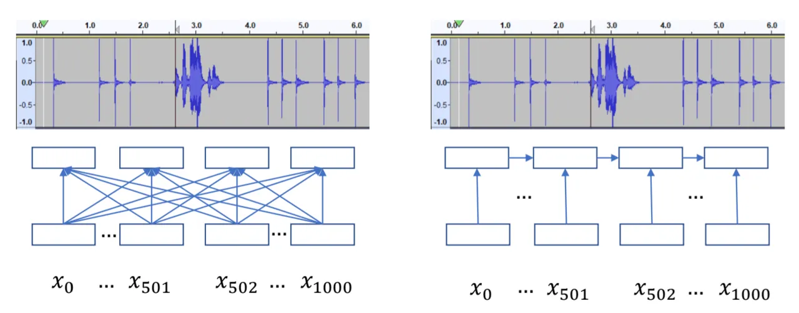

# Relative Positional Encoding for Speech Recognition and Direct Translation

###### Abstract

Transformer models are powerful sequence-to-sequence architectures that
are capable of directly mapping speech inputs to transcriptions or
translations. However, the mechanism for modeling positions in this
model was tailored for text modeling, and thus is less ideal for
acoustic inputs. In this work, we adapt the relative position encoding
scheme to the Speech Transformer, where the key addition is relative
distance between input states in the self-attention network. As a
result, the network can better adapt to the variable distributions
present in speech data. Our experiments show that our resulting model
achieves the best recognition result on the Switchboard benchmark in the
non-augmentation condition, and the best published result in the MuST-C
speech translation benchmark. We also show that this model is able to
better utilize synthetic data than the Transformer, and adapts better to
variable sentence segmentation quality for speech translation.

Ngoc-Quan Pham¹  Thanh-Le Ha¹  Tuan-Nam Nguyen¹  Thai-Son
Nguyen¹  Elizabeth Salesky² Sebastian Stueker¹  Jan Niehues³  Alex
Waibel^(1,4)

¹Interactive Systems Lab, Karlsruhe Institute of Technology, Karlsruhe,
Germany  
²Johns Hopkins University, Baltimore, Maryland  
³Department of Data Science and Knowledge Engineering (DKE), Maastricht
University  
⁴Carnegie Mellon University, Pittsburgh PA, USA

ngoc.pham@kit.edu, thanh-le.ha@kit.edu, tuan.nguyen@kit.edu,
thai.nguyen@kit.edu  
esalesky@jhu.edu, sebastian.stueker@kit.edu,
jan.niehues@maastrichtuniversity.nl, waibel@cs.cmu.edu

Index Terms: speech recognition, speech translation, transformer,
relative position encodings

## 1 Introduction

It is now evident that neural sequence-to-sequence models \[1\] are
capable of directly transcribing or translate speech in an end-to-end
approach. A single neural model which directly maps speech inputs to
text outputs advantageously eliminates the individual components in non
end-to-end or cascaded approaches, while yielding competitive
performance \[2, 3\]. The hybrid approach for speech recognition and the
cascaded approach for speech translation may still give the best
accuracy in many conditions, but as neural architectures continue to
develop, the gap is closing \[4\].

The Transformer \[5\] is a popular architecture choice which has
achieved state-of-the-art performance for many sequence learning tasks,
particularly machine translation \[6\]. When applied to speech
recognition and direct speech translation, this architecture also stands
out as the highest performing option for several datasets \[7, 8, 9\].

The disadvantage of the Transformer is that, its core function –
self-attention – does not have an inherent mechanism to model sequential
positions. The original work \[5\] added position information to the
word embeddings via a trigonometric position encoding. Specifically,
each element in the sequence is assigned an absolute position with a
corresponding encoding (a vector similar to embeddings of the discrete
variables, but not updated during training). Recent adaptation to speech
recognition  \[8\]¹¹ 1 This is the closest speech adaptation that does
not change or introduce additional layers (e.g. LSTM  \[10\] or
TDNN \[11\]). showed that the base model, extended in depth, is already
sufficient for competitive performance compared to other architecture
approaches.

However, this absolute position scheme is far from ideal for acoustic
modeling. First, text sequences may have a stricter correlation with
position; for example, in English the “Five Ws” words often appear at
the beginning of the sentences, while there may be larger variation in
the absolute position of phones in speech signals and utterances.
Second, speech sequences are often $`10-60`$ times (in terms of frames)
longer than their transcript character sequence, which can be
exacerbated by surrounding noises or silences. Figure 1 shows an
illustration in which the speech (at $`\approx`$ frame 500) is between
applause, which changes absolute positions, but should not affect the
resulting transcript. Ideally, we want to keep positional information
time-shift invariant.

Recently, relative positional encoding has become popularized as a
consistent reinforcement for the self-attention. Originally proposed
by \[12\] to replace absolute positions by taking into account the
relative positions between the states in self-attention, this method has
also been formalized to adapt into language modeling \[13\], which
allows the models to capture very long dependency between paragraphs.

In this work, we bring the advantages of relative position encoding to
the Deep Transformer \[8\] for both speech recognition (ASR) and direct
speech translation (ST). The resulting novel model maintains the
trigonometric position encodings to better scale with longer speech
sequences, and is able to model bidirectional positions as well. On
speech recognition, we show that this model consistently improves the
Transformer on the standard English Switchboard and Fisher benchmarks
(on both 300h and 2000h conditions), and, to the best of our knowledge,
is the best published end-to-end model without augmentation on these
datasets. More impressively, for speech translation, a single model is
able to improve the previous best on the MuST-C benchmark \[14\] by
$`7.2`$ BLEU points. While extending to the IWSLT speech translation
task, which is very challenging because it requires of generating audio
segmentations, we find that the relative model scales much better with
the segmentation quality than the absolute counterpart, and can
challenge a very strong cascaded model, which has the advantage of
additional model parameters, an intermediate re-segmentation component,
and more data.



Figure 1: Speech utterance with applauses at the start and end.
Positions have large variation, which is harmful for Transformer with
absolute positions and more computation. LSTMs (right) can alleviate
this with the forgetting mechanism.

## 2 Model Description

A speech-to-text model for either automatic speech recognition or direct
translation transforms a source speech input with $`N`$ frames
$`X={x_{1},x_{2},\dots,x_{N}}`$ into a target text sequence with $`M`$
tokens $`Y={y_{1},y_{2},\dots,y_{M}}`$. The encoder transforms the
speech inputs into hidden representations $`h^{X}_{1\dots N}`$. The
decoder firsts generates a language model style hidden representation
$`h^{Y}_{i}`$ given the previous inputs, then uses the attention
mechanism \[15\] to generate the relevant context $`c_{i}`$ from the
encoder states, which is then combined and generate the output
distribution $`o_{i}`$.

```math
\displaystyle h^{X}_{1\dots N} \displaystyle=ENCODER(x_{1}\dots x_{N}) \tag{1}
```

```math
\displaystyle h^{Y}_{i} \displaystyle=DECODER(y_{i},y_{1\dots{i-1}}) \tag{2}
```

```math
\displaystyle c_{i} \displaystyle=\text{ATTENTION}(h^{Y}_{i},h_{1\dots N}) \tag{3}
```

```math
\displaystyle o_{i} \displaystyle=\text{SOFTMAX}(c_{i}+h^{Y}_{i}) \tag{4}
```

```math
\displaystyle y_{i+1} \displaystyle=sample(o_{i}) \tag{5}
```

### 2.1 Transformer

The Transformer \[5\] uses attention as the main network component to
learn encoder and decoder hidden representations. Given three sequences
of vectorized states consisting of queries
$`Q\in R^{\left|{Q}\right|\times D}`$,
$`K,V\in R^{\left|{K}\right|\times D}`$, attention computes an energy
function $`e_{ij}`$ between each query $`Q_{i}`$ and each key $`K_{j}`$.
These energy terms are then normalized with a softmax function, and then
used to take the weighted average of the values $`V`$. The energy
function can be modeled with neural networks \[16\] or as simple as
projected (with thre additional weight matrices) dot-product between two
vectors $`e_{ij}=Q_{i}K^{T}_{j}`$ or as parallelized
matrix-multiplication in Equation 6.

```math
\displaystyle\hat{Q}=QW_{Q};\hat{K}=KW_{K};\hat{V}=VW_{V} \tag{6}
```

```math
\displaystyle\text{Attention}(Q,K,V)=\text{softmax}(\hat{Q}\hat{K}^{T})V
```

\[5\] also improved the attention above through the concept of
multi-head attention (MAH), which splits the transformed term
$`\hat{Q},\hat{K},\hat{V}`$ to $`H`$ different heads. The same
dot-product operation is applied on each of the $`H`$ query, key and
values heads, and finally the result is the concatenation of the $`H`$
outcomes.

The Transformer encoder and decoder are constructed based through
stacked layers that have identical components. Each encoder layer has
one self-attention (MAH) sub-layer, which is followed by a position-wise
feed-forward neural network with ReLU activation function.²² 2 It is a
sub-layer from the top-down perspective, analyzing the network, but as a
neural network itself, it has two hidden layers of its own Each decoder
layer is quite similar to the encoder counterpart, with the
self-attention sub-layer to connect the decoder states, and the
feed-forward network. There is an addition encoder-decoder attention
layer in between to extract the context vectors from the top encoder
states. Furthermore, the Transformer uses residual connections boost
information from bottom layers (e.g. the input embeddings) to the top
layers. Layer normalization \[17\] plays a supportive role, keeping the
norms of the outputs in check, when used after each residual connection.

### 2.2 Relative Position Encoding in Transformer

Equation 6 suggests that attention is position-invariant, i.e if the key
and value states change their order, the output remains the same. In
order to alleviate this problem for this content-based model, positional
information within the input sequence is represented in a similar manner
with the word embeddings. The positions are treated as discrete
variables and then transformed to embeddings either using a look-up
table with learnable parameters \[18\] or with fixed encodings in a
trigonometric form:

```math
\displaystyle P{i,2k} \displaystyle=sin(\frac{i}{10000^{2k/D}}) \tag{7}
```

```math
\displaystyle P{i,2k+1} \displaystyle=cos(\frac{i}{10000^{2k/D}})
```

When applied to speech input, this encoding is then added to speech
input features \[8\]. The periodic property of the encodings allow the
model to generalize to unseen input length. Following the factorization
in \[13\], we can rewrite the energy function in Equation 6 for
self-attention between two encoder hidden states $`H_{i}`$ and $`H_{j}`$
to decompose into 4 different terms:

```math
\displaystyle\text{Energy}_{ij} \displaystyle=Energy(H_{i}+P_{i},H_{j}+P_{j}) \tag{8}
```

```math
\displaystyle=H_{i}W_{Q}W_{K}^{T}H_{j}^{T}+H_{i}W_{Q}W_{K}^{T}P_{j}^{T}
```

```math
\displaystyle+P_{i}W_{Q}W_{K}^{T}H_{j}^{T}+P_{i}W_{Q}W_{K}^{T}P_{j}^{T}
```

```math
\displaystyle=A+B+C+D
```

Equation 8 gives us an interpretation of the function: in which term A
is purely content-based comparison between two hidden states (i.e speech
feature comparison), term D gives a bias between two absolute positions.
The other terms represent the specific content and position addressing.

The extension proposed by previously \[12\] and later \[13\] changed the
terms B, C, D so that only the relative positions are taken into
account:

```math
\displaystyle\text{Energy}_{ij} \displaystyle=Energy(H_{i},H_{j}+P_{i-j}) \tag{9}
```

```math
\displaystyle=H_{i}W_{Q}W_{K}^{T}H_{j}^{T}+H_{i}W_{Q}W_{R}^{T}P_{i-j}^{T}
```

```math
\displaystyle+~uW_{K}^{T}H_{j}^{T}+~vW_{R}^{T}P_{i-j}^{T}
```

```math
\displaystyle=A+\tilde{B}+\tilde{C}+\tilde{D}
```

The new term $`\tilde{B}`$ computes the relevance between the input
query and the relative distance between $`Q`$ and $`K`$. Term
$`\tilde{C}`$ introduces an additional bias $`v`$ to the content of the
key state $`H_{j}`$, while term $`\tilde{D}`$ represents the bias to the
global distance. Terms $`\tilde{B}`$ and $`\tilde{D}`$ also have an
additional linear projection $`W_{R}`$ so that the positions and
embeddings have different projections.

With this relative position scheme, when the two inputs $`H_{i}`$ and
$`H_{j}`$ are shifted (for example, having extra noise or silent in the
utterance), the energy function stays the same (for the first layer of
the network). Moreover, it can also establish certain inductive bias in
the data; for example, the average length of silence or applauses, given
the global and local bias terms.

### 2.3 Adaptation to speech inputs

For relative position encodings with speech inputs, should we use
learnable embeddings or fixed encodings to represent the distance
$`P_{i}`$? The latter has the clear advantage that it already has the
periodic property, and given that speech input can be as long as
thousands of frames, the former approach would require a necessary
cut-off \[12\] to adapt to longer input sequences. These reasons make
sinusoidal encodings a logical choice.

Importantly, the relative position scheme above was proposed for
autoregressive language models, in which the attention has only one
direction. For speech encoders, each state can attend to both left and
right directions, thus we propose to use positive distance when the keys
are to the left ($`j<i`$) and negative distance otherwise. As a result,
the encodings for $`P_{k}`$ and $`P_{-k}`$ will have the same $`sin`$
terms while the $`cos`$ terms will have opposite signs, which gives the
model a hint to assign different biases to different directions.
Implementation wise, it is able to efficiently compute terms
$`\tilde{B}`$ and $`\tilde{D}`$ with the minimal amount of matrix
operations. It is necessary to compute $`2K-1`$ terms
$`H_{i}W_{Q}W_{R}^{T}P_{k}^{T}`$ with $`-K<k<K`$ for each query
$`H_{i}`$ (For a sequence with $`K`$ states, the distance between one
state to another $`k`$ is always in that range).³³ 3 \[13\] only needs
to compute $`K`$ terms as it has only one direction This is followed by
the shifting trick \[13\] to achieve the required energy terms.

## 3 Experiments

### 3.1 Datasets

ASR. For ASR tasks, our experiments were conducted on the standard
English Switchboard and Fisher data under both benchmark conditions:
$`300`$ hours and $`2000`$ hours of training data. Our reported test
results are for the Hub5 testset with two subsets Switchboard and
CallHome. Target transcripts are segmented with byte-pair encoding
\[19\] using $`10`$k merges.

SLT. We split our SLT task into two different subtasks. Many SLT
datasets require an auto-segmentation component to splits the audio into
sentence-like segments.⁴⁴ 4 This is commonly seen in IWSLT evaluation
campaigns \[4\]. For end-to-end models, this step is crucial due to the
lack of incremental decoding and higher GPU memory requirements. The
recent *MuST-C* \[14\] corpus contains segmentations for both training
and testset, requiring no extra segmentation component, and so we use
its English-German pair serves as our first experimental benchmark. We
further carry out experiments on the IWSLT 2019 evaluation campaign
data, a superset of MuST-C, where segmentation is not given; here we can
compare the effects of variable-quality segmentation on different
end2end models, and also compare models to highly competitive tuned
cascades. We use the MuST-C validation data for both tasks.

### 3.2 Setup

Our baselines for all experiments use the Deep Stochastic
Transformer \[8\]. We use the relative encoding scheme above for both
encoder and decoder to yield relative Transformers.

For ASR, both our baseline Transformer and relative Transformer have
$`36`$ encoder and $`12`$ decoder layers with the model size $`D=512`$
and the feed-forward networks have the hidden layer size of $`2048`$.
Dropout is applied with the same mask across time steps \[20\] with
$`P_{drop}=0.35`$ and also directly at the discrete decoder inputs with
$`P_{drop}=0.1`$. All models are trained for at most $`120000`$ steps
and the reported model parameters are the average of the 10 checkpoints
with lowest perplexities on the cross-validation data.

For SLT, the models and the training process are identical to ASR, with
the exception that we use $`32`$ encoder layers.⁵⁵ 5 The SLT data
sequences are longer and thus need more memory Following the curriculum
learning intuition that SLT models benefit from pre-training the speech
encoder with ASR \[21\], we first pre-trained the model for ASR with the
parallel English transcripts from MuST-C, and then fine-tune the encoder
weights and re-initialize the decoder for SLT. This approach enabled us
to consistently train our SLT models without divergence (which may
happen when the learning rate is too aggressive or the half-precision
GPU mode is used).

For all models, the batch size is set to fit the models to a single
GPU ⁶⁶ 6 Titan V and Titan RTX with 12 and 24 GB respectively and
accumulate gradients to update every $`12000`$ target tokens. We used
the same learning rate schedule as the Transformer translation
model \[5\] with $`4096`$ warmup steps for the Adam \[22\] optimizer.

### 3.3 Speech Recognition Results

Models SWB w/ SA CH w/ SA Hyb. \[23\] BLSTM+LFMMI 9.6 – 19.3 – \[24\]
Hybrid+LSTMLM 8.3 – 17.3 – End-to-End \[25\] LAS (LSTM-based) 11.2 7.3
21.6 14.4 \[26\] Shallow Transformer 16.0 11.2 30.5 22.7 \[26\]
LSTM-based 11.9 9.9 23.7 21.5 \[3\]   LSTM-based 12.1 9.5 22.7 18.6
+SpecAugment +Stretching – 8.8 – 17.2 Ours Deep Transformer (Ours) 10.9
9.4 19.9 18.0 +SpeedPerturb – 9.1 – 17.1 Deep Relative Transformer
(Ours) 10.2 8.9 19.1 17.3 +SpeedPerturb – 8.8 – 16.4

Table 1: ASR: Comparing our best models to other hybrid and end-to-end
systems on the 300h SWB training set and Hub5’00 test sets. Absolute
best is bolded, our best is italicized. WER$`\downarrow`$ .

We present ASR results on the Switchboard-300 benchmark in Table 1. It
is important to clarify that spectral augmentation (dubbed as
SpecAugment) is a recently proposed augmentation method that
tremendously improved the regularization ability of seq2seq models for
speech recognition \[25\]. In better demonstrate the effect of relative
attention, we conduct experiments with and without augmentation.

Compared to the Deep Stochastic model \[8\], using relative attention is
able to reduce our WER from $`10.9`$ to $`10.2`$ and $`19.9`$ to
$`19.1`$ on SWB and CH, without any augmentation. Compared to other
works under this condition, our results are second to none among the
published end2end models, and can rival the LFMMI hybrid model \[23\]
that has an external language model utilizing extra monolingual data.

With spectral augmentation, the improvement from relative attention is
still noticeable, further reducing WER from $`9.4`$ to $`8.9`$, and
$`18.0`$ to $`17.3`$ from the baseline (the relative gain on CallHome is
kept at $`4\%`$). This is second only to \[25\], the state-of-the-art on
this benchmark at $`7.3`$ and $`14.4`$; however their models use an
aggressively regularized training regime on multiple TPUs for 20 days.
Other end-to-end models \[26, 3\] using single GPUs showed similar
behavior to ours with SpecAugment. Finally, with additional speed
augmentation, relative attention is still additive, with further gains
of 0.3 and 0.7 compared to our strong baseline.

|            |                                  |     |      |
| ---------- | -------------------------------- | --- | ---- |
|            | Models                           | SWB | CH   |
| Hybrid     | \[23\] Hybrid                    | 8.5 | 15.3 |
|            | \[27\] Hybrid w/ BiLSTM          | 7.7 | 13.9 |
|            | \[28\] Dense TDNN-LSTM           | 6.1 | 11.0 |
| End-to-End | \[29\] CTC                       | 8.8 | 13.9 |
|            | \[3\]   LSTM-based               | 7.2 | 13.9 |
|            | Deep Transformer (Ours)          | 6.5 | 11.9 |
|            | Deep Relative Transformer (Ours) | 6.2 | 11.4 |

Table 2: ASR: Comparison on 2000h SWB+Fisher training set and Hub5’00
test sets. Absolute best is bolded, our best is italicized.
WER$`\downarrow`$ .

The experiments on the larger dataset with 2000h follow the above
results for 300h, continuing to show positive effects from that relative
position encodings. The error rates on those SWB and CH decrease from
$`6.5`$ and $`11.9`$ to $`6.2`$ and $`11.4`$ (Table 2). Our best model
is significantly better than previously published CTC \[29\] and
LSTM-based \[3\] models, and approaches the heavily tuned hybrid
system \[28\] with dense TDNN-LSTM. It is likely possible to reach
better error rates, with the help of ensembled models, further data
augmentation, and language models. Our experiments here, however, show
that the novel relative model is consistently better than the baseline,
regardless of the data size and augmentation conditions.

### 3.4 Speech Translation Results

Our first SLT models were trained only on the MuST-C training data and
the results are reported on the COMMON testset⁷⁷ 7 MuST-C is a
multilingual dataset and this testset is the commonly shared utterances
between the languages.. Note that in this testset, we are provided with
the segmentation of each utterance which has a corresponding
translation. For each utterance, we can directly translate with the
end2end model, and the final score can be obtained using standard BLEU
scorers such as SacreBLEU \[30\] because the output and the reference
are already sentence-aligned in a standardized way.

As shown in Table 3, our Deep Transformer baseline achieves an
impressive $`24.2`$ BLEU score compared to the ST-Transformer \[9\],
which is a Transformer model specifically adapted for speech
translation. However, using relative position information makes
self-attention more robust and effective still, as our BLEU score
increases to $`25.2`$.

To try to maximize the performance of an end-to-end speech translation
model, we also add the Speech-Translation TED corpus ⁸⁸ 8 Available from
the evaluation campaign at
https://sites.google.com/view/iwslt-evaluation-2019/speech-translation
and follow the method from \[9\] to add synthetic data for speech
translation, where a cascaded system is used to generate translations
for the TEDLIUM-3 data \[31\]. Our cascade system is built based on the
procedure from the winning system in the 2019 IWSLT ST evaluation
campaign \[32\].

With these additional corpora, we observe a considerable boost in
translation performance (similarly observed in \[9\]). More importantly,
the relative model further enlarges the performance gap between two
models to now $`1.4`$ BLEU points. We hypothesize that the model is able
to more effectively use the additional data, with data patterns more
easily captured when the model considers relative rather than absolute
distance between speech features. More concretely, each training corpus
has a different segmentation method, which leads to large variation in
spoken patterns, which is difficult to capture using absolute position
encodings.

To verify our hypothesis, we compare these two models and the cascaded
system on the TEDTalk testsets without a provided segmentation. These
talks are available as long audio files and require an external audio
segmentation step to make translation feasible. It is important to note
that the cascaded model has a separate text re-segmentation
component \[33\] which takes ASR output and reorganizes it into logical
sentences, which is a considerable advantage compared to the end2end
models. We experimented with several audio segmentation methods and see
that the cascade is less affected by the segmentation quality than the
end-to-end models.

The results in Table 4 compare two different segmentation methods,
LIUM \[34\] and VAD \[35\], and four different testsets. The relative
Transformer unsurprisingly consistently outperforms the Transformer,
regardless of segmentation. Moreover, comparing between the segmenters,
the relative model more effectively uses higher segmentation quality,
yielding a larger BLEU difference. While the base Transformer only
increases up to $`0.5`$ BLEU with better segmentation, this figure
becomes up to $`2.4`$ BLEU points for the relative counterpart. In the
end, the cascade model still shows that heavily tuned separated
components, together with an explicit text segmentation module, is an
advantage over end-to-end models, but this gap is closing with more
efficient architectures.

| Models                                     | BLEU |
| ------------------------------------------ | ---- |
| \[9\] ST-Transformer                       | 18.0 |
| +SpecAugment                               | 19.3 |
| +Additional Data \[36\]                    | 23.0 |
| Deep Transformer (w/ SpecAugment)          | 24.2 |
| +Additional Data                           | 29.4 |
| Deep Relative Transformer (w/ SpecAugment) | 25.2 |
| +Additional Data                           | 30.6 |

Table 3: ST: Translation performance in BLEU$`\uparrow`$ on the COMMON
testset (no segmentation required)

Testset    $`\rightarrow`$ Transformer Relative Cascade Segmenter
$`\rightarrow`$ LIUM VAD LIUM VAD LIUM VAD tst2010 22.04 22.53 23.29
24.27 25.92 26.68 tst2013 25.74 26.00 27.33 28.13 27.67 28.60 tst2014
22.23 22.39 23.00 25.46 24.53 25.64 tst2015 20.20 20.77 21.00 21.82
23.55 24.95

Table 4: ST: Translation performance in BLEU$`\uparrow`$ on IWSLT
testsets (re-segmentation required)

## 4 Conclusion

Speech recognition and translation with end-to-end models have become
active research areas. In this work, we adapted the relative position
encoding scheme to speech Transformers for these two tasks. We showed
that the resulting novel network provides consistent and significant
improvement through different tasks and data conditions, given the
properties of acoustic modeling. Inevitably, audio segmentation remains
a barrier to end-to-end speech translation; we look forward to future
neural solutions.

## References

- \[1\] I. Sutskever, O. Vinyals, and Q. V. Le, “Sequence to sequence
  learning with neural networks,” in _Advances in neural information
  processing systems_, 2014, pp. 3104–3112.
- \[2\] M. Sperber, G. Neubig, J. Niehues, and A. Waibel,
  “Attention-passing models for robust and data-efficient end-to-end
  speech translation,” _Transactions of the Association for
  Computational Linguistics (TACL)_, 2019.
- \[3\] T.-S. Nguyen, S. Stueker, J. Niehues, and A. Waibel, “Improving
  sequence-to-sequence speech recognition training with on-the-fly data
  augmentation,” _arXiv preprint arXiv:1910.13296_, 2019.
- \[4\] J. Niehues, R. Cattoni, S. Stüker, M. Negri, M. Turchi,
  E. Salesky, R. Sanabria, L. Barrault, L. Specia, and M. Federico, “The
  IWSLT 2019 evaluation campaign,” in _16th International Workshop on
  Spoken Language Translation 2019_. Zenodo, Nov. 2019.
- \[5\] A. Vaswani, N. Shazeer, N. Parmar, J. Uszkoreit, L. Jones, A. N.
  Gomez, Ł. Kaiser, and I. Polosukhin, “Attention is all you need,” in
  _Advances in Neural Information Processing Systems_, 2017, pp.
  5998–6008.
- \[6\] N. Ng, K. Yee, A. Baevski, M. Ott, M. Auli, and S. Edunov,
  “Facebook FAIR’s WMT19 news translation task submission.” Florence,
  Italy: Association for Computational Linguistics, Aug. 2019.
- \[7\] M. Sperber, J. Niehues, G. Neubig, S. Stüker, and A. Waibel,
  “Self-attentional acoustic models,” _arXiv preprint
  arXiv:1803.09519_, 2018.
- \[8\] N.-Q. Pham, T.-S. Nguyen, J. Niehues, M. Müller, and A. Waibel,
  “Very Deep Self-Attention Networks for End-to-End Speech Recognition,”
  in _Proc. Interspeech 2019_, 2019, pp. 66–70.
- \[9\] M. A. Di Gangi, M. Negri, and M. Turchi, “Adapting transformer
  to end-to-end spoken language translation,” in _INTERSPEECH
  2019_, 2019.
- \[10\] S. Hochreiter and J. Schmidhuber, “Long short-term memory,”
  _Neural computation_, vol. 9, no. 8, pp. 1735–1780, 1997.
- \[11\] A. Waibel, T. Hanazawa, G. Hinton, K. Shikano, and K. J. Lang,
  “Phoneme recognition using time-delay neural networks,” _IEEE
  Transactions on Acoustics, Speech, and Signal Processing_, vol. 37,
  no. 3, pp. 328–339, March 1989.
- \[12\] P. Shaw, J. Uszkoreit, and A. Vaswani, “Self-attention with
  relative position representations,” in _Proceedings of the Conference
  of the North American Chapter of the Association for Computational
  Linguistics (NAACL)_, Jun. 2018.
- \[13\] Z. Dai, Z. Yang, Y. Yang, J. Carbonell, Q. Le, and
  R. Salakhutdinov, “Transformer-XL: Attentive language models beyond a
  fixed-length context,” in _Proceedings of the 57th Annual Meeting of
  the Association for Computational Linguistics (ACL)_, Jul. 2019.
- \[14\] M. A. Di Gangi, R. Cattoni, L. Bentivogli, M. Negri, and
  M. Turchi, “MuST-C: a Multilingual Speech Translation Corpus,” in
  _Proceedings of the Conference of the North American Chapter of the
  Association for Computational Linguistics (NAACL)_, Jun. 2019.
- \[15\] D. Bahdanau, K. Cho, and Y. Bengio, “Neural machine translation
  by jointly learning to align and translate,” _arXiv preprint
  arXiv:1409.0473_, 2014.
- \[16\] M.-T. Luong, H. Pham, and C. D. Manning, “Effective approaches
  to attention-based neural machine translation,” _arXiv preprint
  arXiv:1508.04025_, 2015.
- \[17\] J. L. Ba, J. R. Kiros, and G. E. Hinton, “Layer normalization,”
  _arXiv preprint arXiv:1607.06450_, 2016.
- \[18\] S. Sukhbaatar, J. Weston, R. Fergus _et al._, “End-to-end
  memory networks,” in _Advances in neural information processing
  systems_, 2015, pp. 2440–2448.
- \[19\] R. Sennrich, B. Haddow, and A. Birch, “Neural machine
  translation of rare words with subword units,” in _Proceedings of the
  54th Annual Meeting of the Association for Computational Linguistics
  (ACL)_, 2016.
- \[20\] Y. Gal and Z. Ghahramani, “A theoretically grounded application
  of dropout in recurrent neural networks,” in _Advances in neural
  information processing systems_, 2016, pp. 1019–1027.
- \[21\] S. Bansal, H. Kamper, K. Livescu, A. Lopez, and S. Goldwater,
  “Pre-training on high-resource speech recognition improves
  low-resource speech-to-text translation,” _arXiv preprint
  arXiv:1809.01431_, 2018.
- \[22\] D. P. Kingma and J. Ba, “Adam: A method for stochastic
  optimization,” _Proc. of ICLR_, 2015, arXiv:1412.6980.
- \[23\] D. Povey, V. Peddinti, D. Galvez, P. Ghahremani, V. Manohar,
  X. Na, Y. Wang, and S. Khudanpur, “Purely sequence-trained neural
  networks for ASR based on lattice-free MMI.” in _Interspeech_, 2016,
  pp. 2751–2755.
- \[24\] A. Zeyer, K. Irie, R. Schlüter, and H. Ney, “Improved training
  of end-to-end attention models for speech recognition,” _Proc.
  Interspeech 2018_, pp. 7–11, 2018.
- \[25\] D. S. Park, W. Chan, Y. Zhang, C.-C. Chiu, B. Zoph, E. D.
  Cubuk, and Q. V. Le, “SpecAugment: A simple data augmentation method
  for automatic speech recognition,” _arXiv preprint
  arXiv:1904.08779_, 2019.
- \[26\] A. Zeyer, P. Bahar, K. Irie, R. Schlüter, and H. Ney, “A
  comparison of transformer and lstm encoder decoder models for asr,” in
  _IEEE Automatic Speech Recognition and Understanding Workshop,
  Sentosa, Singapore_, 2019.
- \[27\] G. Saon, G. Kurata, T. Sercu, K. Audhkhasi, S. Thomas,
  D. Dimitriadis, X. Cui, B. Ramabhadran, M. Picheny, L.-L. Lim
  _et al._, “English conversational telephone speech recognition by
  humans and machines,” _arXiv preprint arXiv:1703.02136_, 2017.
- \[28\] K. J. Han, A. Chandrashekaran, J. Kim, and I. Lane, “The capio
  2017 conversational speech recognition system,” _arXiv preprint
  arXiv:1801.00059_, 2017.
- \[29\] K. Audhkhasi, B. Kingsbury, B. Ramabhadran, G. Saon, and
  M. Picheny, “Building competitive direct acoustics-to-word models for
  english conversational speech recognition,” in _2018 IEEE
  International Conference on Acoustics, Speech and Signal Processing
  (ICASSP)_. IEEE, 2018, pp. 4759–4763.
- \[30\] M. Post, “A call for clarity in reporting BLEU scores,” in
  _Proceedings of the Third Conference on Machine Translation: Research
  Papers_. Belgium, Brussels: Association for Computational Linguistics,
  Oct. 2018, pp. 186–191. \[Online\]. Available:
  https://www.aclweb.org/anthology/W18-6319
- \[31\] F. Hernandez, V. Nguyen, S. Ghannay, N. Tomashenko, and
  Y. Estève, “Ted-lium 3: twice as much data and corpus repartition for
  experiments on speaker adaptation,” in _International Conference on
  Speech and Computer_. Springer, 2018, pp. 198–208.
- \[32\] N.-Q. Pham, T.-S. Nguyen, T.-L. Ha, J. Hussain, J. Niehues,
  S. Stüker, and A. Waibel, “The IWSLT 2019 kit speech translation
  system,” in _16th International Workshop on Spoken Language
  Translation 2019_. Zenodo, Nov. 2019.
- \[33\] E. Cho, J. Niehues, and A. Waibel, “Nmt-based segmentation and
  punctuation insertion for real-time spoken language translation.” in
  _INTERSPEECH_, 2017.
- \[34\] M. Rouvier, G. Dupuy, P. Gay, E. Khoury, T. Merlin, and
  S. Meignier, “An open-source state-of-the-art toolbox for broadcast
  news diarization,” 2013.
- \[35\] J. Wiseman, “python-webrtcvad,”
  https://github.com/wiseman/py-webrtcvad, 2016.
- \[36\] M. Di Gangi, M. Negri, V. N. Nguyen, A. Tebbifakhr, and
  M. Turchi, “Data augmentation for end-to-end speech translation:
  FBK@IWSLT’19,” in _Proceedings of the 16th International Workshop on
  Spoken Language Translation (IWSLT)_, 2019.
