# FrugalML: How to Use ML Prediction APIs More Accurately and Cheaply

Lingjiao Chen    Matei Zaharia    James Zou Affiliation: Stanford
University

###### Abstract

Prediction APIs offered for a fee are a fast-growing industry and an
important part of machine learning as a service. While many such
services are available, the heterogeneity in their price and performance
makes it challenging for users to decide which API or combination of
APIs to use for their own data and budget. We take a first step towards
addressing this challenge by proposing FrugalML, a principled framework
that jointly learns the strength and weakness of each API on different
data, and performs an efficient optimization to automatically identify
the best sequential strategy to adaptively use the available APIs within
a budget constraint. Our theoretical analysis shows that natural
sparsity in the formulation can be leveraged to make FrugalML efficient.
We conduct systematic experiments using ML APIs from Google, Microsoft,
Amazon, IBM, Baidu and other providers for tasks including facial
emotion recognition, sentiment analysis and speech recognition. Across
various tasks, FrugalML can achieve up to 90% cost reduction while
matching the accuracy of the best single API, or up to 5% better
accuracy while matching the best API’s cost.

## 1 Introduction

Machine learning as a service (MLaaS) is a rapidly growing industry. For
example, one could use Google prediction API \[9\] to classify an image
for \$0.0015 or to classify the sentiment of a text passage for
\$0.00025. MLaaS services are appealing because using such APIs reduces
the need to develop one’s own ML models. The MLaaS market size was
estimated at \$1 billion in 2019, and it is expected to grow to \$8.4
billion by 2025 \[1\].

Third-party ML APIs come with their own challenges, however. A major
challenge is that different companies charge quite different amounts for
similar tasks. For example, for image classification, Face++ charges
\$0.0005 per image \[6\], which is 67% cheaper than Google \[9\], while
Microsoft charges \$0.0010 \[11\]. Moreover, the prediction APIs of
different providers perform better or worse on different types of
inputs. For example, accuracy disparities in gender classification were
observed for different skin colors \[22, 33\]. As we will show later in
the paper, these APIs’ performance also varies by class—for example, we
found that on the FER+ dataset, the Face++ API had the best accuracy on
_surprise_ images while the Microsoft API had the best performance on
_neutral_ images. The more expensive APIs are not uniformly better; and
APIs tend to have specific classes of inputs where they perform better
than alternatives. This heterogeneity in price and in performance makes
it challenging for users to decide which API or combination of APIs to
use for their own data and budget.

In this paper, we propose FrugalML, a principled framework to address
this challenge. FrugalML jointly learns the strength and weakness of
each API on different data, then performs an efficient optimization to
automatically identify the best adaptive strategy to use all the
available APIs given the user’s budget constraint. FrugalML leverages
the modular nature of APIs by designing adaptive strategies that can
call APIs sequentially. For example, we might first send an input to API
A. If A returns the label “dog” with high confidence—and we know A tends
to be accurate for dogs—then we stop and report “dog”. But if A returns
“hare” with lower confidence, and we have learned that A is less
accurate for “hare,” then we might adaptively select a second API B to
make additional assessment.

FrugalML optimizes such adaptive strategies to substantially improve
prediction performance over simpler approaches such as model cascades
with a fixed quality threshold (Figure 1). Through experiments with real
commercial ML APIs on diverse tasks, we observe that FrugalML typically
reduces costs more than 50% and sometimes up to 90%. Adaptive strategies
are challenging to learn and optimize, because the choice of the 2^(nd)
predictor, if one is chosen, could depend on the prediction and
confidence of the first API, and because FrugalML may need to allocate
different fractions of its budget to predictions for different classes.
We prove that under quite general conditions, there is natural sparsity
in this problem that we can leverage to make FrugalML efficient.

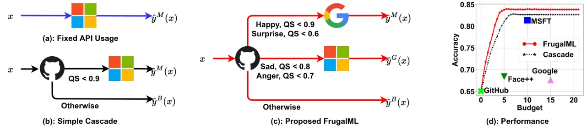

Figure 1: Comparison of different approaches to use ML APIs. Naively
calling a fixed API in (a) provides a fixed cost and accuracy. The
simple cascade in (b) uses the quality score (QS) from a low-cost open
source model to decide whether to call an additional service. Our
proposed FrugalML approach, in (c), exploits both the quality score and
predicted label to select APIs. Figure (d) shows the benefits of
FrugalML on FER+, a facial emotion dataset.

Contributions To sum up, our contributions are:

1.  1.  We formulate and study the problem of learning to optimally use
        commercial ML APIs given a budget. This is a growing area of
        importance and is under-explored.
2.  2.  We propose FrugalML, a framework that jointly learns the strength
        and weakness of each API, and performs an optimization to identify
        the best strategy for using those APIs within a budget constraint.
        By leveraging natural sparsity in this optimization problem, we
        design an efficient algorithm to solve it with provable guarantees.
3.  3.  We evaluate FrugalML using real-world APIs from diverse providers
        (e.g., Google, Microsoft, Amazon, and Baidu) for classification
        tasks including facial emotion recognition, text sentiment analysis,
        and speech recognition. We find that FrugalML can match the accuracy
        of the best individual API with up to 90% lower cost, or
        significantly improve on this accuracy, up to 5%, with the the same
        cost.
4.  4.  We release our dataset of 612,139 samples annotated by commercial
        APIs as a broad resource to further investigate differences across
        APIs and improve usage.

#### Related Work.

MLaaS: With the growing importance of MLaaS APIs \[2, 3, 6, 9, 10, 11\],
existing research has largely focused on evaluating individual API for
their performance \[51\], robustness \[27\], and applications \[22, 28,
40\]. On the other hand, FrugalML aims at finding strategies to select
from or use multiple APIs to reduce costs and increase accuracy.

Mixtures of Experts: A natural approach to exploiting multiple
predictors is mixture of experts \[31, 30, 52\], which uses a gate
function to decide which expert to use. Substantial research has focused
on developing gate function models, such as SVMs \[24, 50\], Gaussian
Process \[25, 49\], and neutral networks \[42, 41\]. However, applying
mixture of experts for MLaaS would result in fixed cost and thus would
not allow users to specify a budget constraint as in FrugalML. As we
will show later, sometimes FrugalML with a budget constraint can even
outperform mixture of experts algorithms while using less budget.

Model Cascades: Cascades consisting of a sequence of models are useful
to balance the quality and runtime of inference \[44, 45, 23, 32, 43,
46, 48, 34\]. While model cascades use predicted quality score alone to
avoid calling computationally expensive models, FrugalML’ strategies can
utilize both quality score and predicted class to select a downstream
expensive add-on service. Designing such strategies requires solving a
significantly harder optimization problem, e.g., choosing how to divide
the available budget between classes (§3), but also improves performance
substantially over using the quality score alone (§4).

## 2 Preliminaries

#### Notation.

In our exposition, we denote matrices and vectors in bold, and scalars,
sets, and functions in standard script. We let $`\mathbf{1}_{m}`$ denote
the $`m\times 1`$ all ones vector, while $`\mathbf{1}_{n\times m}`$
denotes the all ones $`n\times m`$ matrix. We define
$`\mathbf{0}_{m},\mathbf{0}_{n\times m}`$ analogously. The subscripts
are omitted when clear from context. Given a matrix
$`\mathbf{A}\in\mathbb{R}^{n\times m}`$, we let $`\mathbf{A}_{i,j}`$
denote its entry at location $`(i,j)`$,
$`\mathbf{A}_{i,\cdot}\in\mathbb{R}^{1\times m}`$ denote its $`i`$th
row, and $`\mathbf{A}_{\cdot,j}\in\mathbb{R}^{n\times 1}`$ denote its
$`j`$th column. Let $`[n]`$ denote $`\{1,2,\cdots,n\}`$. Let
$`\mathbbm{1}`$ represent the indicator function.

#### ML Tasks.

Throughout this paper, we focus on (multiclass) classification tasks,
where the goal is to classify a data point $`x`$ from a distribution
$`D`$ into $`L`$ label classes. Many real world ML APIs aim at such
tasks, including facial emotion recognition, where $`x`$ is a face image
and label classes are emotions (happy, sad, etc), and text sentiment
analysis, where $`x`$ is a text passage and the label classes are
attitude sentiment (either positive or negative).

#### MLaaS Market.

Consider a MLaaS market consisting of $`K`$ different ML services which
aim at the same classification task. Taken a data point $`x`$ as input,
the $`k`$th service returns to the user a predicted label
$`y_{k}(x)\in[L]`$ and its quality score $`q_{k}(x)\in[0,1]`$, where
larger score indicates higher confidence of its prediction. This is
typical for many popular APIs. There is also a unit cost associated with
each service. Let the vector $`\mathbf{c}\in\mathbb{R}^{K}`$ denote the
unit cost of all services. Then $`\mathbf{c}_{k}=0.005`$ simply means
that users need to pay $`0.005`$ every time they call the $`k`$th
service. We use $`y(x)`$ to denote $`x`$’s true label, and let
$`r^{k}(x)\triangleq\mathbbm{1}_{y_{k}(x)=y(x)}`$ be the reward of using
the $`k`$ service on $`x`$.

## 3 FrugalML: a Frugal Approach to Adaptively Leverage ML Services

Figure 2: In FrugalML, a base service is first selected and called. If
its quality score is smaller than the threshold for its predicted label,
FrugalML chooses an add-on service to invoke and returns its prediction.
Otherwise, the base service’s prediction is returned.

In this section, we present FrugalML, a formal framework for API calling
strategies to obtain accurate and cheap predictions from a MLaaS market.
All proofs are left to the appendix. We generalize the scheme in Figure
1 (c) to $`K`$ ML services and $`L`$ label classes. Let a tuple
$`s\triangleq(\mathbf{p}^{[1]},\mathbf{Q},\mathbf{P}^{[2]})`$ represent
a calling strategy produced by FrugalML. Given an input data $`x`$,
FrugalML first calls a base service, denoted by $`A^{[1]}_{s}`$, which
with probability $`\mathbf{p}^{[1]}_{i}`$ is the $`i`$th service and
returns quality score $`q_{i}(x)`$ and label $`y_{i}(x)`$. Let $`D_{s}`$
be the indicator of whether the quality score is smaller than the
threshold value $`\mathbf{Q}_{i,y_{i}(x)}`$. If $`D_{s}=1`$, then
FrugalML invokes an add-on service, denoted by $`A^{[2]}_{s}`$, with
probability $`\mathbf{P}^{[2]}_{i,y_{i}(x),j}`$ being the $`j`$th
service and producing $`y_{j}(x)`$ as the predicted label
$`\hat{y}^{s}(x)`$. Otherwise, FrugalML simply returns label
$`\hat{y}^{s}(x)=y_{i}(x)`$ from the base service. This process is
summarized in Figure 2. Note that the strategy is adaptive: the choice
of the add-on API can depend on the predicted label and quality score of
the base model.

The set of possible strategies can be parametrized as
$`S\triangleq\{(\mathbf{p}^{[1]},\mathbf{Q},\mathbf{P}^{[2]})|\mathbf{p}^{[1]}\succcurlyeq\mathbf{0}\in\mathbb{R}^{K},\mathbf{1}^{T}\mathbf{p}^{[1]}=1,\mathbf{Q}\in\mathbb{R}^{K\times L},\mathbf{0}\preccurlyeq\mathbf{Q}\preccurlyeq\mathbf{1},\mathbf{P}^{[2]}\in\mathbb{R}^{K\times L\times K},\mathbf{P}^{[2]}\succcurlyeq\mathbf{0},\mathbf{1}^{T}\mathbf{P}^{[2]}_{k,\ell,\cdot}=1\}`$.
Our goal is to choose the optimal strategy $`s^{*}`$ that maximizes the
expected accuracy while satisfies the user’s budget constraint $`b`$.
This is formally stated as below.

###### Definition 1.

Given a user budget $`b`$, the optimal FrugalML strategy
$`s^{*}=(\mathbf{p}^{[1]*},\mathbf{Q}^{*},\mathbf{P}^{[2]*})`$ is

```math
s^{*}\triangleq\arg\max_{s\in S}\mathbb{E}[{r}^{s}(x)]\textit{ s.t. }\mathbb{E}[\eta^{[s]}(x,\mathbf{c})]\leq b, \tag{3.1}
```

where $`r^{s}(x)\triangleq\mathbbm{1}_{\hat{y}^{s}(x)=y(x)}`$ is the
reward and $`\eta^{[s]}(x,\mathbf{c})`$ the total cost of strategy $`s`$
on $`x`$.

###### Remark 1.

The above definition can be generalized to wider settings. For example,
instead of 0-1 loss, the reward can be negative square loss to handle
regression tasks. We pick the concrete form for demonstration purposes.
The cost of strategy $`s`$, $`\eta^{[s]}(x,\mathbf{c})`$, is the sum of
all services called on $`x`$. For example, if service $`1`$ and $`2`$
are called for predicting $`x`$, then $`\eta^{[s]}(x,\mathbf{c})`$
becomes $`\mathbf{c}_{1}+\mathbf{c}_{2}`$.

Given the above formulation, a natural question is how to solve it
efficiently. In the following, We first highlight an interesting
property of the optimal strategy, sparsity, which inspires the design of
the efficient solver, and then present the algorithm for the solver.

### 3.1 Sparsity Structure in the Optimal Strategy

We show that if problem 3.1 is feasible and has unique optimal solution,
then we must have $`\|\mathbf{p}^{[1]*}\|\leq 2`$. In other words, the
optimal strategy should only choose the base service from at most two
services (instead of $`K`$) in the MLaaS market. This is formally stated
in Lemma 1.

###### Lemma 1.

If problem 3.1 is feasible, then there exists one optimal solution
$`s^{*}=(\mathbf{p}^{[1]*},\mathbf{Q}^{*},\mathbf{P}^{[2]*})`$ such that
$`\|\mathbf{p}^{[1]*}\|\leq 2`$.

To see this, let us first expand $`\mathbb{E}[r^{s}(x)]`$ and
$`\mathbb{E}[\eta^{s}(x)]`$ by the law of total expectation.

###### Lemma 2.

The expected accuracy is
$`\mathbb{E}[r^{s}(x)]=\sum_{i=1}^{K}\Pr[A^{[1]}_{s}=i]\Pr[D_{s}=0|A^{[1]}_{s}=i]\mathbb{E}[r^{i}(x)|D_{s}=0,A^{[1]}_{s}=i]+\sum_{i,j=1}^{K}\Pr[A^{[1]}_{s}=i]\Pr[D_{s}=1|A^{[1]}_{s}=i]\Pr[A_{s}^{[2]}=j|D_{s}=1,A_{s}^{[1]}=i]\mathbb{E}[r^{j}(x)|D_{s}=1,A_{s}^{[1]}=i)]`$.
The expected cost is
$`\mathbb{E}[\eta^{s}(x)]=\sum_{i=1}^{K}\Pr[A_{s}^{[1]}=i]\Pr[D_{s}=0|A_{s}^{[1]}=i]\mathbf{c}_{i}+\sum_{i,j=1}^{K}\Pr[A_{s}^{[1]}=i]\Pr[D_{s}=1|A_{s}^{[1]}=i]\Pr[A_{s}^{[2]}=j|D_{s}=1,A_{s}^{[1]}=i]\left(\mathbf{c}_{i}+\mathbf{c}_{j}\right)`$.

Note that both $`\mathbb{E}[r^{s}(x)]`$ and $`\mathbb{E}[\eta^{s}(x)]`$
are linear in $`\Pr[A_{s}^{[1]}=i]`$, which by definition equals
$`\mathbf{p}^{[1]}_{i}`$. Thus, fixing $`\mathbf{Q}`$ and
$`\mathbf{P}^{[2]}`$, problem 3.1 becomes a linear programming in
$`\mathbf{p}^{[1]}`$. Intuitively, the corner points of its feasible
region must be 2-sparse, since except $`\mathbb{E}[\eta^{s}(x)]\leq b`$
and $`\mathbf{1}^{T}\mathbf{p}^{[1]}\leq 1`$ , all other constraints
($`\mathbf{p}^{[1]}\succcurlyeq\mathbf{0}`$) force sparsity. As the
optimal solution of a linear programming should be a corner point,
$`\mathbf{p}^{[2]}`$ must also be 2-sparse.

This sparsity structure helps reduce the computational complexity for
solving problem 3.1. In fact, the sparsity structure implies problem 3.1
becomes equivalent to a master problem

```math
\max_{(i_{1},i_{2},p_{1},p_{2},b_{1},b_{2})\in\mathit{C}}\textit{ }p_{1}g_{i_{1}}(b_{1}/p_{1})+p_{2}g_{i_{2}}(b_{2}/p_{2})\textit{ }s.t.b_{1}+b_{2}\leq b \tag{3.2}
```

where
$`\mathit{c}=\{(i_{1},i_{2},p_{1},p_{2},b_{1},b_{2})|i_{1},i_{2}\in[K],p_{1},p_{2}\geq 0,p_{1}+p_{2}=1,b_{1},b_{2}\geq 0\}`$,
and $`g_{i}(b^{\prime})`$ is the optimal value of the subproblem

```math
\begin{split}&\max_{\mathbf{Q},\mathbf{P}^{[2]}:s=(\mathbf{e}_{i},\mathbf{Q},\mathbf{P}^{[2]})\in S}\mathbb{E}[r^{s}(x)\textit{ }s.t.\textit{ }\mathbb{E}[\eta^{s}(x)]\leq b^{\prime}\\
\end{split} \tag{3.3}
```

Here, the master problem decides which two services ($`i_{1},i_{2}`$)
can be the base service, how often ($`p_{1},p_{2}`$) they should be
invoked, and how large budgets ($`b_{1},b_{2}`$) are assigned, while for
a fixed base service $`i`$ and budget $`b^{\prime}`$, the subproblem
maximizes the expected reward.

### 3.2 A Practical Algorithm

Now we are ready to give the sparsity-inspired algorithm for generating
an approximately optimal strategy $`\hat{s}`$, summarized in Algorithm

1.

Input : $`K,M,\mathbf{c},b`$,
$`\{y(x_{i}),\{q_{k}(x_{i}),y_{k}(x_{i})\}_{k=1}^{K}\}_{i=1}^{N}`$

Output : FrugalML strategy tuple
$`\hat{s}=\left(\hat{\mathbf{p}}^{[1]},\hat{\mathbf{Q}},\hat{\mathbf{P}}^{[2]}\right)`$

1:  Estimate $`\mathbb{E}[r_{i}(x)|D_{s},A_{s}^{[1]}]`$ from the
training data
$`\{y(x_{i}),\{q_{k}(x_{i}),y_{k}(x_{i})\}_{k=1}^{K}\}_{i=1}^{N}`$

2:  For $`i\in[K]`$,
$`b^{\prime}_{m}\in[0,\frac{\|\mathbf{2c}\|_{\infty}}{M},\cdots,\|2\mathbf{c}\|_{\infty}]`$,
solve problem 3.3 to find optimal value $`g_{i}(b^{\prime}_{m})`$

3:  For $`i\in[K]`$, construct function $`g_{i}(\cdot)`$ by linear
interpolation on
$`b^{\prime}_{0},b^{\prime}_{1},\cdots,b^{\prime}_{M}`$.

4:  Solve problem 3.2 to find optimal solution
$`i_{1}^{*},i_{2}^{*},p_{1}^{*},p_{2}^{*},b_{1}^{*},b_{2}^{*}`$

5:  For $`t\in[2]`$, let $`i=i_{t}^{*},b^{\prime}=b_{t}^{*}/p_{t}^{*}`$,
solve problem 3.3 to find the optimal solution
$`\mathbf{Q}_{[i_{t}^{*}]},\mathbf{P}^{[2]}_{[i_{t}^{*}]}`$

6:
 $`\hat{\mathbf{p}}^{[1]}=p_{1}^{*}\mathbf{e}_{i_{1}^{*}}+p_{2}^{*}\mathbf{e}_{i_{2}^{*}},\hat{\mathbf{Q}}=\mathbf{Q}_{[i_{1}^{*}]}+\mathbf{Q}_{[i_{2}^{*}]},\hat{\mathbf{P}}^{[2]}=\mathbf{P}^{[2]}_{[i_{1}^{*}]}+\mathbf{P}^{[2]}_{[i_{2}^{*}]}`$

7:  Return
$`\hat{s}=\left(\hat{\mathbf{p}}^{[1]},\hat{\mathbf{Q}},\hat{\mathbf{P}}^{[2]}\right)`$

Algorithm 1 FrugalML Strategy Training.

Algorithm 1 consists of three main steps. First, the conditional
accuracy $`\mathbb{E}[r_{i}(x)|D_{s},A_{s}^{[i]}]`$ is estimated from
the training data (line 1). Next (line 2 to line 4), we find the optimal
solution $`i_{1}^{*},i_{2}^{*},p_{1}^{*},p_{2}^{*},b_{1}^{*},b_{2}^{*}`$
to problem 3.2. To do so, we first evaluate $`g_{i}(b^{\prime})`$ for
$`M+1`$ different budget values (line 2), and then construct the
functions $`g_{i}(\cdot)`$ via linear interpolation (line 3) while
enforce $`g_{i}(b^{\prime})=0,\forall b^{\prime}\leq\mathbf{c}_{i}`$.
Given (piece-wise linear) $`g_{i}(\cdot)`$, problem 3.2 can be solved by
enumerating a few linear programming (line 4). Finally, the algorithm
seeks to find the optimal solution in the original domain of the
strategy, by solving subproblem 3.3 for base service being $`i_{1}^{*}`$
and $`i_{2}^{*}`$ separately (line 5), and then align those solutions
appropriately (line 6). We leave the details of solving subproblem 3.3
to the supplement material due to space constraint. Theorem 3 provides
the performance analysis of Algorithm 1.

###### Theorem 3.

Suppose $`\mathbb{E}[r_{i}(x)|D_{s},A_{s}^{[1]}]`$ is Lipschitz
continuous with constant $`\gamma`$ w.r.t. each element in
$`\mathbf{Q}`$. Given $`N`$ i.i.d. samples
$`\{y(x_{i}),\{(y_{k}(x_{i}),q_{k}(x_{i}))\}_{k=1}^{K}\}_{i=1}^{N}`$,
the computational cost of Algorithm 1 is
$`O\left(NMK^{2}+K^{3}M^{3}L+M^{L}K^{2}\right)`$. With probability
$`1-\epsilon`$, the produced strategy $`\hat{s}`$ satisfies
$`\mathbb{E}[r^{\hat{s}}(x)]-\mathbb{E}[r^{s^{*}}(x)]\geq-O\left(\sqrt{\frac{\log\epsilon+\log M+\log K+\log L}{N}}+\frac{\gamma}{M}\right)`$,
and $`\mathbb{E}[\eta^{[\hat{s}]}(x,\mathbf{c})]\leq b`$.

As Theorem 3 suggests, the parameter $`M`$ is used to balance between
computational cost and accuracy drop of $`\hat{s}`$.

For practical cases where $`K`$ and $`L`$ (the number of classes) are
around ten and $`N`$ is more than a few thousands, we have found
$`M=10`$ is a good value for good accuracy and small computational cost.
Note that the coefficient of the $`K^{L}`$ terms is small: in
experiments, we observe it takes only a few seconds for $`L=31,M=40`$.
For datasets with very large number of possible labels, we can always
cluster those labels into a few ”supclasses”, or adopt approximation
algorithms to reduce $`O(M^{L})`$ to $`O(M^{2})`$ (see details in the
supplemental materials). In addition, slight modification of $`\hat{s}`$
can satisfy strict budget constraint: if budgets allows, use $`\hat{s}`$
to pick APIs; otherwise, switch to the cheapest API.

## 4 Experiments

We compare the accuracy and incurred costs of FrugalML to that of real
world ML services for various tasks. Our goal is four-fold: (i)
understanding when and why FrugalML can reduce cost without hurting
accuracy, (ii) evaluating the cost savings by FrugalML, (iii)
investigating the trade-offs between accuracy and cost achieved by
FrugalML, and (iv) measuring the effect of training data size on
FrugalML’s performance.

#### Tasks, ML services, and Datasets.

We focus on three common ML tasks in different application domains:
facial emotion recognition (FER) in computer vision, sentiment analysis
(SA) in natural langauge processing), and speech to text (STT) in speech
recognition. The ML services used for each task as well as their prices
are summarized in Table 1. For each task we also found a small open
source model from GitHub, which is much less expensive to execute per
data point than the commercial APIs.

| Tasks | ML service          | Price | ML service       | Price | ML service        | Price |
| ----- | ------------------- | ----- | ---------------- | ----- | ----------------- | ----- |
| FER   | Google Vision \[9\] | 15    | MS Face \[11\]   | 10    | Face++ \[6\]      | 5     |
| SA    | Google NLP \[7\]    | 2.5   | AMZN Comp \[2\]  | 0.75  | Baidu NLP \[3\]   | 3.5   |
| STT   | Google Speech \[8\] | 60    | MS Speech \[12\] | 41    | IBM Speech \[10\] | 25    |

Table 1: ML services used for each task. Price unit: USD/10,000 queries.
A publicly available (and thus free) GitHub model is also used per task:
a convolutional neural network (CNN) \[13\] pretrained on FER2013 \[26\]
for FER , a rule based tool (Bixin \[4\] for Chinese and Vader \[16,
29\] for English ) for SA, and a recurrent neural network (DeepSpeech)
\[14, 19\] pretrained on Librispeech \[39\] for STT.

Table 2 lists the statistics for all the datasets used for different
tasks. More details can be found in the appendix.

| Dataset       | Size  | \# Classes | Dataset           | Size   | \# Classes | Tasks |
| ------------- | ----- | ---------- | ----------------- | ------ | ---------- | ----- |
| FER+ \[20\]   | 6358  | 7          | RAFDB \[35\]      | 15339  | 7          | FER   |
| EXPW \[53\]   | 31510 | 7          | AFFECTNET \[38\]  | 287401 | 7          |       |
| YELP \[18\]   | 20000 | 2          | SHOP \[15\]       | 62774  | 2          | SA    |
| IMDB \[37\]   | 25000 | 2          | WAIMAI \[17\]     | 11987  | 2          |       |
| DIGIT \[5\]   | 2000  | 10         | AUDIOMNIST \[21\] | 30000  | 10         | STT   |
| FLUENT \[36\] | 30043 | 31         | COMMAND \[47\]    | 64727  | 31         |       |

Table 2: Datasets sample size and number of classes.

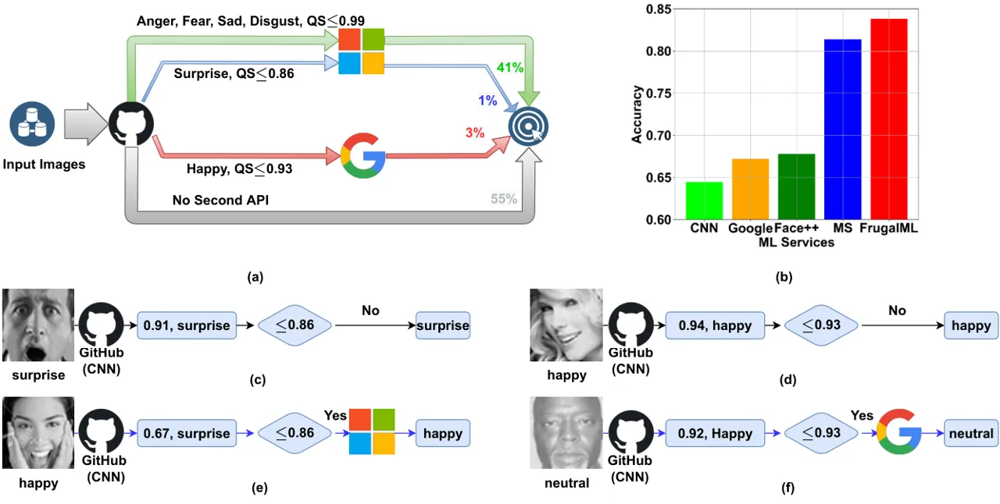

Figure 3: A FrugalML strategy learned on the dataset FER+. (a): data
flow. (b): accuracy of all ML services and FrugalML which matches the
cost of the cheapest API (FACE++). (c-f): FrugalML prediction process on
a few testing data. As shown in (a), on most data (55%), calling the
cheap open source CNN from GitHub is sufficient. Thus, FrugalML incurs
\<50% cost than the most accurate API (Microsoft). Note that unique
quality score thresholds for different labels predicted by the base
service are learned: e.g.,, given label, ”surprise“, 0.86 is used to
determine whether (e) or not (c) to call Microsoft, while for label
“happy”, the learned threshold is 0.93 ((d) and (f)). Such unique
thresholds are critical for both accuracy improvement and cost
reduction: universally using 0.86 leads to misclassification on (f),
while globally adopting 0.93 creates extra cost by called unnecessary
add-on service on (c).

#### Facial Emotion Recognition: A Case Study.

Let us start with facial emotion recognition on the FER+ dataset. We set
budget $`b=5`$, the price of FACE++, the cheapest API (except the open
source CNN model from GitHub) and obtain a FrugalML strategy by training
on half of FER+. Figure 3 demonstrates the learned FrugalML strategy.
Interestingly, as shown in Figure 3(b), FrugalML’s accuracy is higher
than that of the best ML service (Microsoft Face), while its cost is
much lower. This is because base service’s quality score, utilized by
FrugalML, is a better signal than raw image to identify if its
prediction is trustworthy. Furthermore, the quality score threshold,
produced by FrugalML also depends on label predicted by the base
service. This flexibility helps to increase accuracy as well as to
reduce costs. For example, using a universal threshold $`0.86`$ leads to
misclassfication on Figure 3(f), while $`0.93`$ causes unnecessary
add-on service call on Figure 3 (c).

For comparison, we also train a mixture of experts strategy with a
softmax gating network and the majority voting ensemble method. The
learned mixture of experts always uses Microsoft API, leading to the
same accuracy (81%) and same cost (\$10). The accuracy of majority
voting on the test data is slightly better at 82%, but substantially
worse than the performance of FrugalML using a small budget of $`\$5`$.
Majority vote, and other standard ensemble methods, needs to collect the
prediction of all services, resulting in a cost (\$30) which is 6 times
the cost of FrugalML. Moreover, both mixture of experts and ensemble
method require fixed cost, while FrugalML gives the users flexibility to
choose a budget.

| Dataset | Acc  | Price | Cost | Save | Dataset    | Acc  | Price | Cost | Save |
| ------- | ---- | ----- | ---- | ---- | ---------- | ---- | ----- | ---- | ---- |
| FER+    | 81.4 | 10    | 3.3  | 67%  | RAFDB      | 71.7 | 10    | 4.3  | 57%  |
| EXPW    | 72.7 | 10    | 5.0  | 50%  | AFFECTNET  | 72.2 | 10    | 4.7  | 53%  |
| YELP    | 95.7 | 2.5   | 1.9  | 24%  | SHOP       | 92.1 | 3.5   | 1.9  | 46%  |
| IMDB    | 86.4 | 2.5   | 1.9  | 24%  | WAIMAI     | 88.9 | 3.5   | 1.4  | 60%  |
| DIGIT   | 82.6 | 41    | 23   | 44%  | COMMAND    | 94.6 | 41    | 15   | 63%  |
| FLUENT  | 97.5 | 41    | 26   | 37%  | AUDIOMNIST | 98.6 | 41    | 3.9  | 90%  |

Table 3: Cost savings achieved by FrugalML that reaches same accuracy as
the best commercial API.

#### Analysis of Cost Savings.

Next, we evaluate how much cost can be saved by FrugalML to reach the
highest accuracy produced by a single API on different tasks, to obtain
some qualitative sense of FrugalML. As shown in Table 3, FrugalML can
typically save more than half of the cost. In fact, the cost savings can
be as high as 90% on the AUDIOMNIST dataset. This is likely because the
base service’s quality score is highly correlated to its prediction
accuracy, and thus FrugalML only needs to call expensive services for a
few difficult data points. A relatively small saving is reached for SA
tasks (e.g., on IMDB). This might be that the quality score of the rule
based SA tool is not highly reliable. Another possible reason is that SA
task has only two labels (positive and negative), limiting the power of
FrugalML.

#### Accuracy and Cost Trade-offs.

Now we dive deeply into the accuracy and cost trade-offs achieved by
FrugalML, shown in Figure 4. Here we also compare with two oblations to
FrugalML, “Base=GH”, where the base service is forced to be the GitHub
model, and “QS only”, which further forces a universal quality score
threshold across all labels.

While using any single ML service incurs a fixed cost, FrugalML allows
users to pick any point in its trade-off curve, offering substantial
flexibility. In addition to cost saving, FrugalML sometimes can achieve
higher accuracy than any ML services it calls. For example, on FER+ and
AFFECTNET, more than 2% accuracy improvement can be reached with small
cost, and on RAFDB, when a large cost is allowed, more than 5% accuracy
improvement is gained. It is also worthy noting that each component in
FrugalML helps improve the accuracy. On WAIMAI, for instance, “Base=GH”
and ”QS only” lead to significant accuracy drops. For speech datasets
such as COMMAND, the drop is negligible, as there is no significant
accuracy difference between different labels (utterance). Another
interesting observation is that there is no universally “best” service
for a fixed task. For SA task, Baidu NLP achieves the highest accuracy
for WAIMAI and SHOP datasets, but Google NLP has best performance on
YELP and IMDB. Fortunately, FrugalML adaptively learns the optimal
strategy.

(a) FER+

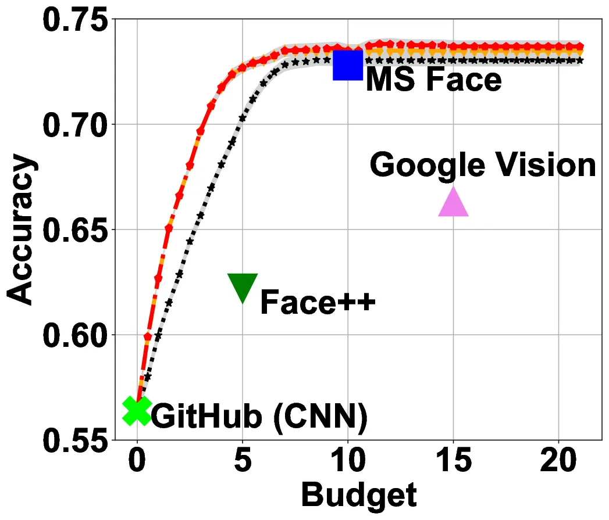

(b) EXPW

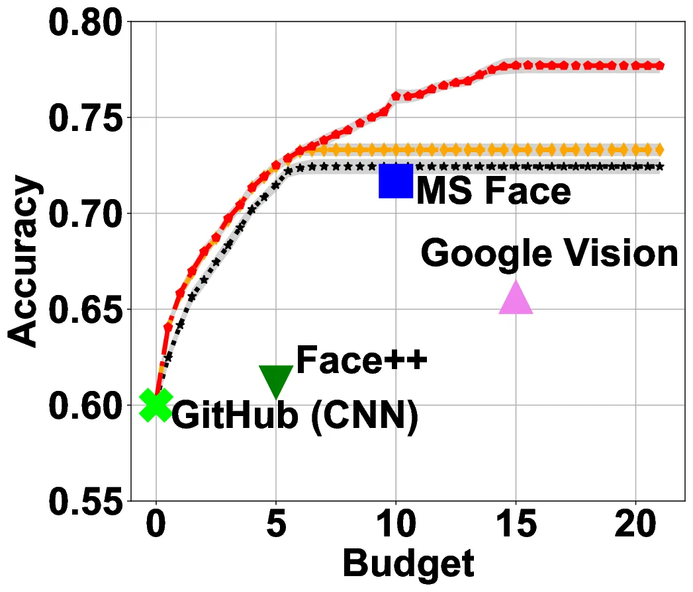

(c) RAFDB

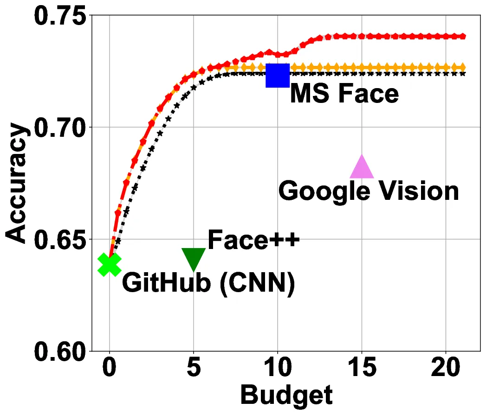

(d) AFFECTNET

(e) YELP

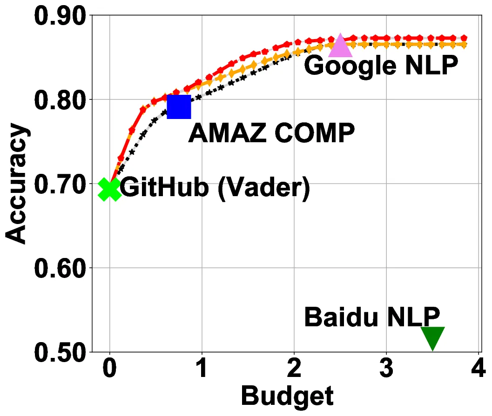

(f) IMDB

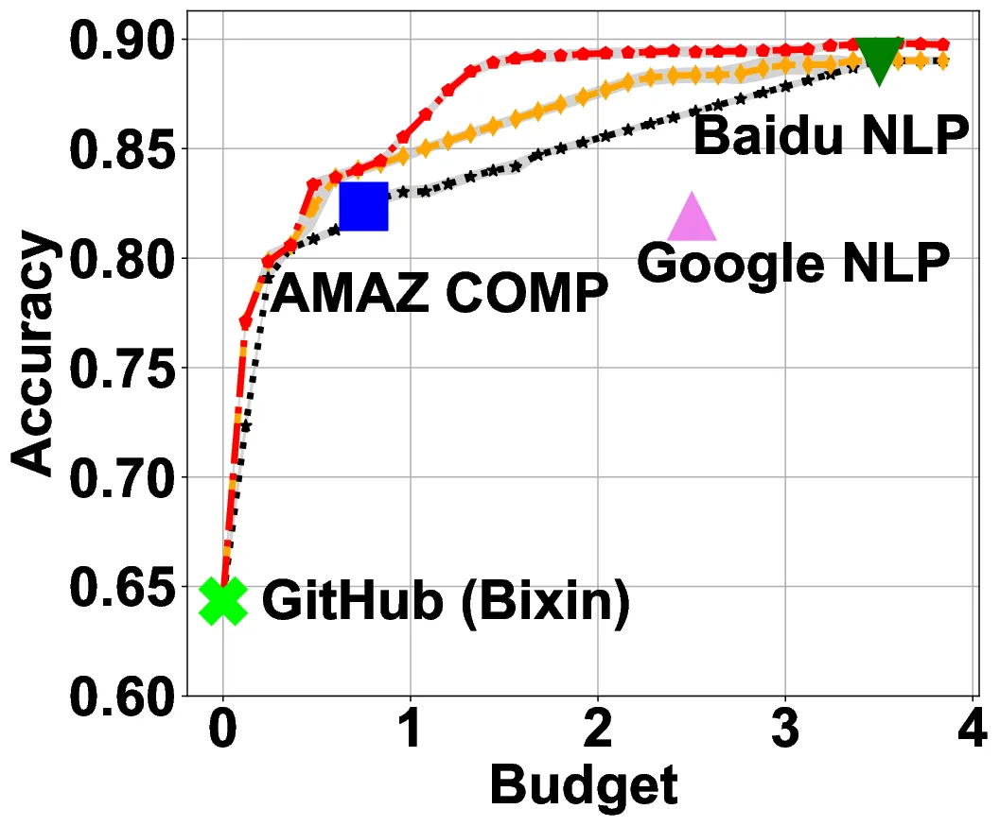

(g) WAIMAI

(h) SHOP

(i) DIGIT

(j) AUDIOMNIST

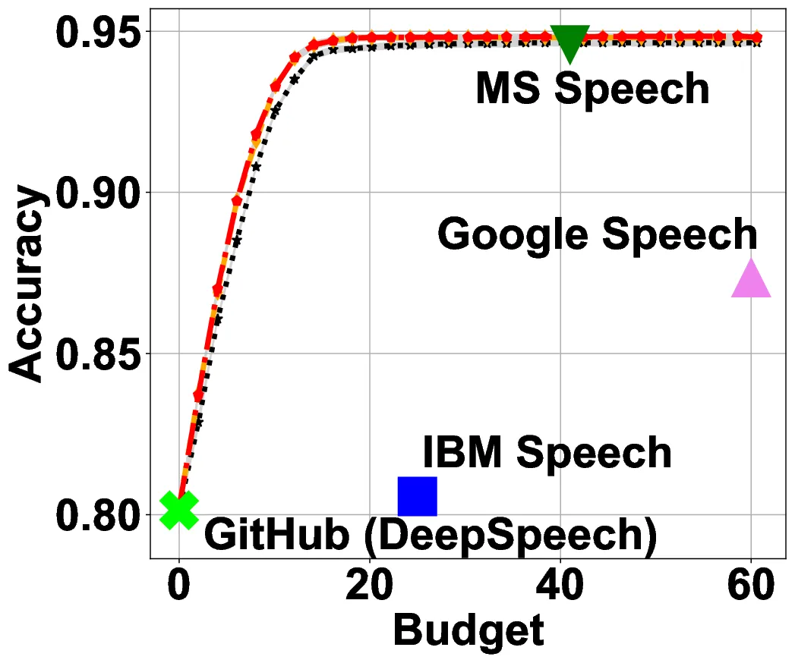

(k) COMMAND

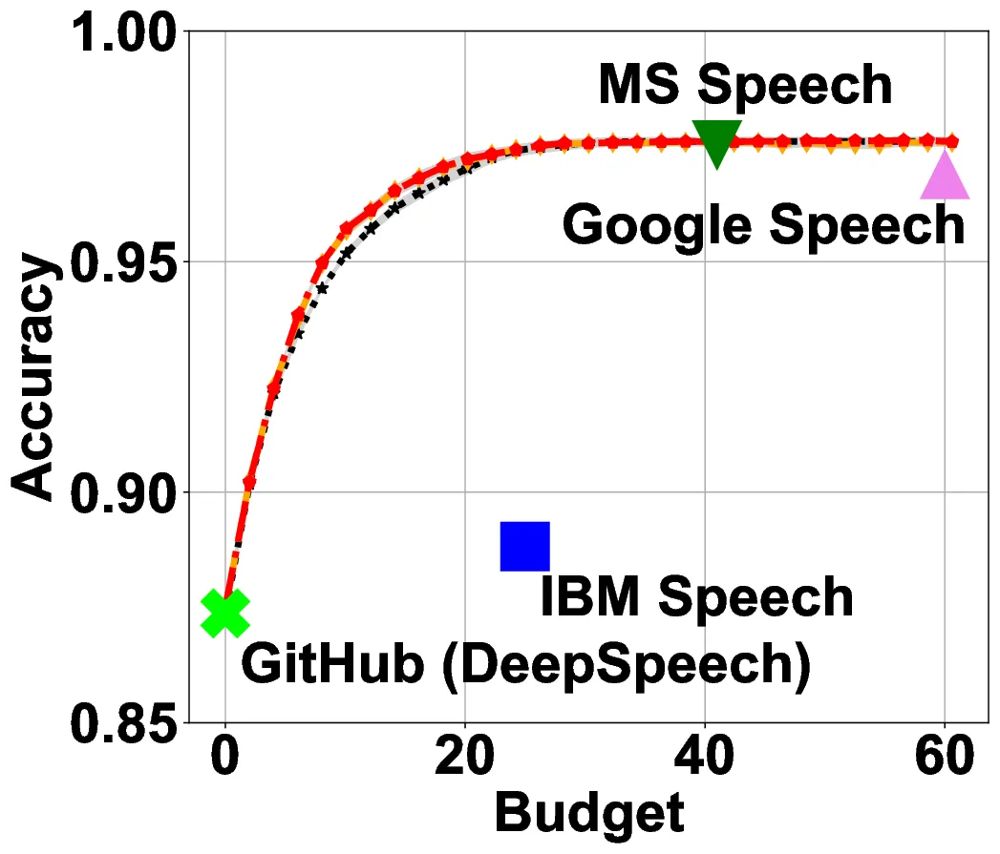

(l) FLUENT

Figure 4: Accuracy cost trade-offs. Base=GH simplifies FrugalML by
fixing the free GitHub model as base service, and QS only further uses a
universal quality score threshold for all labels. The task of row 1, 2,
3 is FER, SA, and STT, respectively.

#### Effects of Training Sample Size

Finally we evaluate how the training sample size affects FrugalML’s
performance, shown in Figure 5. Overall, while larger number of classes
need more samples, we observe 3000 labeled samples are enough across all
datasets.

(a) FER+ (# label:7)

(b) WAIMAI (# label: 2)

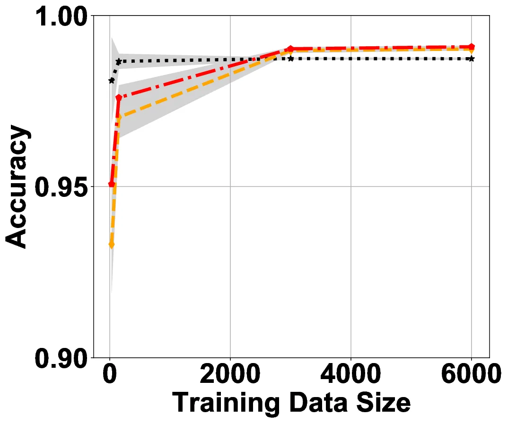

(c) AUDIOMNIST (# label: 10)

Figure 5: Testing accuracy v.s.training data size. The fixed budget is
5, 1.2, 20, separately.

## 5 Conclusion and Open Problems

In this work we proposed FrugalML, a formal framework for identifying
the best strategy to call ML APIs given a user’s budget. Both
theoretical analysis and empirical results demonstrate that FrugalML
leads to significant cost reduction and accuracy improvement. FrugalML
is also efficient to learn: it typically takes a few minutes on a modern
machine. Our research characterized the substantial heterogeneity in
cost and performance across available ML APIs, which is useful in its
own right and also leveraged by FrugalML. Extending FrugalML to produce
calling strategies for ML tasks beyond classification (e.g., object
detection and language translation) is an interesting future direction.
As a resource to stimulate further research in MLaaS, we will also
release a dataset used to develop FrugalML, consisting of 612,139
samples annotated by the APIs, and our code.

## References

- \[1\] Machine Learning as a Service Market Report .
  [https://www.mordorintelligence.com/industry-reports/global-machine-learning-as-a-service-mlaas-market](https://www.mordorintelligence.com/industry-reports/global-machine-learning-as-a-service-mlaas-market).
- \[2\] Amazon Comprehend API.
  [https://aws.amazon.com/comprehend](https://aws.amazon.com/comprehend).
  \[Accessed March-2020\].
- \[3\] Baidu API. [https://ai.baidu.com/](https://ai.baidu.com/).
  \[Accessed March-2020\].
- \[4\] Bixin, a Chinese Sentiment Analysis tool from GitHub.
  [https://github.com/bung87/bixin](https://github.com/bung87/bixin).
  \[Accessed March-2020\].
- \[5\] DIGIT dataset,
  [https://github.com/Jakobovski/free-spoken-digit-dataset](https://github.com/Jakobovski/free-spoken-digit-dataset).
- \[6\] Face++ Emotion API.
  [https://www.faceplusplus.com/emotion-recognition/](https://www.faceplusplus.com/emotion-recognition/).
  \[Accessed March-2020\].
- \[7\] Google NLP API.
  [https://cloud.google.com/natural-language](https://cloud.google.com/natural-language).
  \[Accessed March-2020\].
- \[8\] Google Speech API.
  [https://cloud.google.com/speech-to-text](https://cloud.google.com/speech-to-text).
  \[Accessed March-2020\].
- \[9\] Google Vision API.
  [https://cloud.google.com/vision](https://cloud.google.com/vision).
  \[Accessed March-2020\].
- \[10\] IBM Speech API.
  [https://cloud.ibm.com/apidocs/speech-to-text](https://cloud.ibm.com/apidocs/speech-to-text).
  \[Accessed March-2020\].
- \[11\] Microsoft computer vision API.
  [https://azure.microsoft.com/en-us/services/cognitive-services/computer-vision](https://azure.microsoft.com/en-us/services/cognitive-services/computer-vision).
  \[Accessed March-2020\].
- \[12\] Microsoft speech API.
  [https://azure.microsoft.com/en-us/services/cognitive-services/speech-to-text](https://azure.microsoft.com/en-us/services/cognitive-services/speech-to-text).
  \[Accessed March-2020\].
- \[13\] Pretrained facial emotion model from GitHub.
  [https://github.com/WuJie1010/Facial-Expression-Recognition.Pytorch](https://github.com/WuJie1010/Facial-Expression-Recognition.Pytorch).
  \[Accessed March-2020\].
- \[14\] Pretrained speech to text model from GitHub.
  [https://github.com/SeanNaren/deepspeech.pytorch](https://github.com/SeanNaren/deepspeech.pytorch).
  \[Accessed March-2020\].
- \[15\] SHOP dataset,
  [https://github.com/SophonPlus/ChineseNlpCorpus/tree/master/datasets/online_shopping_10_cats](https://github.com/SophonPlus/ChineseNlpCorpus/tree/master/datasets/online_shopping_10_cats).
- \[16\] Vader, an English Sentiment Analysis tool from GitHub.
  [https://github.com/cjhutto/vaderSentiment](https://github.com/cjhutto/vaderSentiment).
  \[Accessed March-2020\].
- \[17\] WAIMAI dataset,
  [https://github.com/SophonPlus/ChineseNlpCorpus/tree/master/datasets/waimai_10k](https://github.com/SophonPlus/ChineseNlpCorpus/tree/master/datasets/waimai_10k).
- \[18\] YELP dataset,
  [https://www.kaggle.com/yelp-dataset/yelp-dataset](https://www.kaggle.com/yelp-dataset/yelp-dataset).
- \[19\] Dario Amodei, Sundaram Ananthanarayanan, Rishita Anubhai,
  Jingliang Bai, Eric Battenberg, Carl Case, Jared Casper, Bryan
  Catanzaro, Jingdong Chen, Mike Chrzanowski, Adam Coates, Greg Diamos,
  Erich Elsen, Jesse H. Engel, Linxi Fan, Christopher Fougner, Awni Y.
  Hannun, Billy Jun, Tony Han, Patrick LeGresley, Xiangang Li, Libby
  Lin, Sharan Narang, Andrew Y. Ng, Sherjil Ozair, Ryan Prenger, Sheng
  Qian, Jonathan Raiman, Sanjeev Satheesh, David Seetapun, Shubho
  Sengupta, Chong Wang, Yi Wang, Zhiqian Wang, Bo Xiao, Yan Xie, Dani
  Yogatama, Jun Zhan, and Zhenyao Zhu. Deep speech 2 : End-to-end speech
  recognition in english and mandarin. In ICML 2016.
- \[20\] Emad Barsoum, Cha Zhang, Cristian Canton Ferrer, and Zhengyou
  Zhang. Training deep networks for facial expression recognition with
  crowd-sourced label distribution. In ICMI 2016.
- \[21\] Sören Becker, Marcel Ackermann, Sebastian Lapuschkin,
  Klaus-Robert Müller, and Wojciech Samek. Interpreting and explaining
  deep neural networks for classification of audio signals. CoRR,
  abs/1807.03418, 2018.
- \[22\] Joy Buolamwini and Timnit Gebru. Gender shades: Intersectional
  accuracy disparities in commercial gender classification. In FAT 2018.
- \[23\] Zhaowei Cai, Mohammad J. Saberian, and Nuno Vasconcelos.
  Learning complexity-aware cascades for deep pedestrian detection. In
  ICCV 2015.
- \[24\] Ronan Collobert, Samy Bengio, and Yoshua Bengio. A parallel
  mixture of SVMs for very large scale problems. Neural Computation,
  14(5):1105–1114, 2002.
- \[25\] Marc Peter Deisenroth and Jun Wei Ng. Distributed gaussian
  processes. In ICML 2015.
- \[26\] Ian J. Goodfellow, Dumitru Erhan, Pierre Luc Carrier, Aaron C.
  Courville, Mehdi Mirza, Benjamin Hamner, William Cukierski, Yichuan
  Tang, David Thaler, Dong-Hyun Lee, Yingbo Zhou, Chetan Ramaiah,
  Fangxiang Feng, Ruifan Li, Xiaojie Wang, Dimitris Athanasakis, John
  Shawe-Taylor, Maxim Milakov, John Park, Radu Tudor Ionescu, Marius
  Popescu, Cristian Grozea, James Bergstra, Jingjing Xie, Lukasz
  Romaszko, Bing Xu, Zhang Chuang, and Yoshua Bengio. Challenges in
  representation learning: A report on three machine learning contests.
  Neural Networks, 64:59–63, 2015.
- \[27\] Hossein Hosseini, Baicen Xiao, and Radha Poovendran. Google’s
  cloud vision API is not robust to noise. In ICMLA 2017.
- \[28\] Hossein Hosseini, Baicen Xiao, and Radha Poovendran. Studying
  the live cross-platform circulation of images with computer vision
  API: An experiment based on a sports media event. International
  Journal of Communication, 13:1825–1845, 2019.
- \[29\] Clayton J. Hutto and Eric Gilbert. VADER: A parsimonious
  rule-based model for sentiment analysis of social media text. In ICWSM 2014.
- \[30\] Robert A. Jacobs, Michael I. Jordan, Steven J. Nowlan, and
  Geoffrey E. Hinton. Adaptive mixtures of local experts. Neural
  Computation, 3(1):79–87, 1991.
- \[31\] Michael I. Jordan and Robert A. Jacobs. Hierarchical mixtures
  of experts and the EM algorithm. Neural Computation,
  6(2):181–214, 1994.
- \[32\] Daniel Kang, John Emmons, Firas Abuzaid, Peter Bailis, and
  Matei Zaharia. Noscope: Optimizing deep cnn-based queries over video
  streams at scale. PVLDB, 10(11):1586–1597, 2017.
- \[33\] Michael P Kim, Amirata Ghorbani, and James Zou. Multiaccuracy:
  Black-box post-processing for fairness in classification. In AIES 2019.
- \[34\] Haoxiang Li, Zhe Lin, Xiaohui Shen, Jonathan Brandt, and Gang
  Hua. A convolutional neural network cascade for face detection. In
  CVPR 2015.
- \[35\] Shan Li, Weihong Deng, and JunPing Du. Reliable crowdsourcing
  and deep locality-preserving learning for expression recognition in
  the wild. In CVPR 2017.
- \[36\] Loren Lugosch, Mirco Ravanelli, Patrick Ignoto, Vikrant Singh
  Tomar, and Yoshua Bengio. Speech model pre-training for end-to-end
  spoken language understanding. In Interspeech 2019.
- \[37\] Andrew L. Maas, Raymond E. Daly, Peter T. Pham, Dan Huang,
  Andrew Y. Ng, and Christopher Potts. Learning word vectors for
  sentiment analysis. In Human Language Technologies, ACL 2011.
- \[38\] Ali Mollahosseini, Behzad Hasani, and Mohammad H. Mahoor.
  Affectnet: A database for facial expression, valence, and arousal
  computing in the wild. IEEE Trans. Affect. Comput., 10(1):18–31, 2019.
- \[39\] Vassil Panayotov, Guoguo Chen, Daniel Povey, and Sanjeev
  Khudanpur. Librispeech: an asr corpus based on public domain audio
  books. In ICASSP 2015.
- \[40\] Arsénio Reis, Dennis Paulino, Vítor Filipe, and João Barroso.
  Using online artificial vision services to assist the blind - an
  assessment of microsoft cognitive services and google cloud vision. In
  WorldCIST 2018.
- \[41\] Patrick Schwab, Djordje Miladinovic, and Walter Karlen.
  Granger-causal attentive mixtures of experts: Learning important
  features with neural networks. In AAAI 2019.
- \[42\] Noam Shazeer, Azalia Mirhoseini, Krzysztof Maziarz, Andy Davis,
  Quoc V. Le, Geoffrey E. Hinton, and Jeff Dean. Outrageously large
  neural networks: The sparsely-gated mixture-of-experts layer. In ICLR 2017.
- \[43\] Yi Sun, Xiaogang Wang, and Xiaoou Tang. Deep convolutional
  network cascade for facial point detection. In CVPR 2013.
- \[44\] Paul Viola and Michael Jones. Robust real-time object
  detection. In International Journal of Computer Vision, 2001.
- \[45\] Paul A. Viola and Michael J. Jones. Fast and robust
  classification using asymmetric adaboost and a detector cascade. In
  NIPS 2001.
- \[46\] Lidan Wang, Jimmy J. Lin, and Donald Metzler. A cascade ranking
  model for efficient ranked retrieval. In SIGIR 2011.
- \[47\] Pete Warden. Speech commands: A dataset for limited-vocabulary
  speech recognition. CoRR, abs/1804.03209, 2018.
- \[48\] Zhixiang Eddie Xu, Matt J. Kusner, Kilian Q. Weinberger, Minmin
  Chen, and Olivier Chapelle. Classifier cascades and trees for
  minimizing feature evaluation cost. J. Mach. Learn. Res.,
  15(1):2113–2144, 2014.
- \[49\] Yan Yang and Jinwen Ma. An efficient EM approach to parameter
  learning of the mixture of gaussian processes. In ISNN 2011.
- \[50\] Bangpeng Yao, Dirk B. Walther, Diane M. Beck, and Fei-Fei Li.
  Hierarchical mixture of classification experts uncovers interactions
  between brain regions. In NIPS 2009.
- \[51\] Yuanshun Yao, Zhujun Xiao, Bolun Wang, Bimal Viswanath, Haitao
  Zheng, and Ben Y. Zhao. Complexity vs. performance: empirical analysis
  of machine learning as a service. In IMC 2017.
- \[52\] Seniha Esen Yuksel, Joseph N. Wilson, and Paul D. Gader. Twenty
  years of mixture of experts. IEEE Trans. Neural Networks Learn. Syst.,
  23(8):1177–1193, 2012.
- \[53\] Zhanpeng Zhang, Ping Luo, Chen Change Loy, and Xiaoou Tang.
  Learning social relation traits from face images. In ICCV 2015.

## Appendix A Extra Notations

Here we introduce a few more notations.

We first let $`\cdot,\odot,\otimes`$ denote inner, element-wise, and
Kronecker product, respectively. Next, Let us introduce a few notations:
a matrix $`\mathbf{A}\in\mathbb{R}^{K\times L}`$, a scalar function
$`F_{k,\ell}(\cdot):\mathbb{R}\mapsto\mathbb{R}`$ for
$`k\in[K],\ell\in[L]`$, a scalar function
$`\psi_{k_{1},k_{2},\ell}(\cdot):\mathbb{R}\mapsto\mathbb{R}`$ for
$`k_{1},k_{2}\in[K],\ell\in[L]`$, matrix to matrix functions
$`\mathbf{r}^{a}(\cdot):\mathbb{R}^{K\times L}\mapsto\mathbb{R}^{K\times KL}`$,
$`\mathbf{r}^{b}(\cdot):\mathbb{R}^{K\times L}\mapsto\mathbb{R}^{K\times L}`$,
and
$`\mathbf{r}^{[-]}(\cdot):\mathbb{R}^{K\times L}\mapsto\mathbb{R}^{K\times KL}`$.
$`\mathbf{A}`$ is given by
$`\mathbf{A}_{k,\ell}\triangleq\Pr[y_{k}(x)=\ell]`$, which represents
the probability of $`k`$th service producing label $`\ell`$. The scalar
function $`F_{k,\ell}(X)\triangleq\Pr[q_{k}(x)\leq X|y(x)=\ell]`$ is the
probability of the produced quality score from the $`k`$th service less
than a threshold $`X`$ conditional on that its predicted label is
$`\ell`$. The scalar function $`\psi_{k_{1},k_{2},\ell}(\cdot)`$ is
defined as
$`\psi_{k_{1},k_{2},\ell}(\alpha)\triangleq\mathbb{E}\left[r_{k_{1}}(x)|y_{k_{1}}(x)=\ell,q_{k_{1}}(x)\leq F^{-1}_{k_{1},\ell}(\alpha)\right]`$,
i.e., the executed accuracy of the $`k_{2}`$ service conditional on that
the $`k_{1}`$ services produces a label $`\ell`$ and quality score that
is less than $`F_{k,\ell}^{-1}(\boldsymbol{\rho}_{k_{1},\ell})`$. Then
those matrix to matrix functions are given by
$`{\mathbf{r}}^{a}_{k_{1},K(\ell-1)+k_{2}}(\boldsymbol{\rho})\triangleq\psi_{k_{1},k_{2},\ell}(\boldsymbol{\rho}_{k_{1},\ell})`$,
$`{\mathbf{r}}^{b}_{k,\ell}(\boldsymbol{\rho})\triangleq\psi_{k,k,\ell}(\boldsymbol{\rho}_{k,\ell})`$,
and
$`{\mathbf{r}}^{[-]}(\boldsymbol{\rho})\triangleq{\mathbf{r}}^{a}(\boldsymbol{\rho})-\mathbf{r}^{b}(\boldsymbol{\rho})\otimes\mathbf{1}^{T}_{K}`$.

## Appendix B Algorithm Subroutines

In this section we provide the details of the subroutines used in the
training algorithm for FrugalML. There are in total four components: (i)
estimating parameters, (ii) solving subproblem 3.3 to obtain its optimal
value and solution, (iii) constructing the function $`g_{i}(\cdot)`$,
and (iv) solving the master problem 3.2.

#### Estimating Parameters.

Instead of directly estimating
$`\mathbb{E}[r_{i}(x)|D_{s},A_{s}^{[i]}]`$, we estimate
$`\mathbf{A},{\mathbf{r}}^{b}(\mathbf{1}_{K\times L})`$, and
$`{\mathbf{r}}^{[-]}(\cdot)`$ as defined in Section A, which are
sufficient for the subroutines to solve the subproblem 3.3. Let
$`\hat{\mathbf{A}},\hat{\mathbf{r}}^{b}(\mathbf{1}_{K\times L})`$, and
$`\hat{\mathbf{r}}^{[-]}(\cdot)`$ be the corresponding estimation from
the training datasets. Now we describe how to obtain them from a dataset
$`\{y(x_{i}),\{q_{k}(x_{i}),y_{k}(x_{i})\}_{k=1}^{K}\}_{i=1}^{N}`$.

To estimate $`\mathbf{A}`$, we simply apply the empirical mean estimator
and obtain
$`\hat{\mathbf{A}}_{k,\ell}\triangleq\frac{1}{N}\sum_{i=1}^{N}\mathbbm{1}_{\{y_{k}(x_{i})=\ell\}}`$.
To estimate $`{\mathbf{r}}^{b}(\mathbf{1}_{K\times L})`$, and
$`{\mathbf{r}}^{[-]}(\cdot)`$, we first compute
$`\hat{\psi}_{k_{1},k_{2},\ell}(\alpha_{m})\triangleq\frac{\sum_{i=1}^{N}\mathbbm{1}_{\{y_{k_{1}}(x_{i})=\ell,\hat{q}_{m,k_{1},\ell}\geq q_{k_{1}}(x_{i}),y_{k_{2}}(x_{i})=y(x_{i})\}}}{\sum_{i=1}^{N}\mathbbm{1}_{\{y_{k_{1}}(x_{i})=\ell,\hat{q}_{m,k_{1},\ell}\geq q_{k_{1}}(x_{i})\}}}`$,
for $`\alpha_{m}=\frac{m}{M},m\in\{0\}\cup[M]`$, where
$`\hat{q}_{m,k,\ell}\triangleq Quantile(\{q_{k}(x_{i})|y_{k}(x_{i})=\ell,i\in[N]\},\alpha_{m})`$
is the empirical $`\alpha_{m}`$-quantile of the quality score of the
$`k`$th service conditional on its predicted label being $`\ell`$. Next
we estimate $`\psi_{k_{1},k_{2},\ell}(\cdot)`$ by linear interpolation,
i.e., generating
$`\hat{\psi}_{k_{1},k_{2},\ell}(\alpha)\triangleq\frac{\hat{\psi}_{k_{1},k_{2},\ell}(\alpha_{m})-\hat{\psi}_{k_{1},k_{2},\ell}(\alpha_{m+1})}{\alpha_{m}-\alpha_{m+1}}(\alpha-\alpha_{m})+\hat{\psi}_{k_{1},k_{2},\ell}(\alpha_{m}),\alpha\in[\alpha_{m},\alpha_{m+1}]`$.
We can now estimate
$`\hat{{\mathbf{r}}}^{a}_{k_{1},K(\ell-1)+k_{2}}(\boldsymbol{\rho})\triangleq\psi_{k_{1},k_{2},\ell}(\boldsymbol{\rho}_{k_{1},\ell})`$,
$`\hat{{\mathbf{r}}}^{b}_{k,\ell}(\boldsymbol{\rho})\triangleq\hat{\psi}_{k,k,\ell}(\boldsymbol{\rho}_{k,\ell})`$,
and finally compute
$`\hat{{\mathbf{r}}}^{b}(\mathbf{1}_{K\times L})_{k,\ell}`$ and
$`\hat{\mathbf{r}}^{[-]}(\boldsymbol{\rho})\triangleq\hat{\mathbf{r}}^{a}(\boldsymbol{\rho})-\hat{\mathbf{r}}^{b}(\boldsymbol{\rho})\otimes\mathbf{1}^{T}_{K}`$.

#### Solving subproblem 3.3.

Input : $`\beta,k,\ell,\hat{\mathbf{r}}^{b}(\mathbf{1}_{K\times L})`$,
$`\hat{\mathbf{r}}^{[-]}(\cdot)`$

Output : the optimal solution
$`\hat{\rho}^{k,\ell}(\beta),\hat{\boldsymbol{\Pi}}^{k,\ell}(\beta)`$,
and the optimal value $`\hat{h}^{k,\ell}(\beta)`$

1:  Construct
$`\tilde{\mathbf{r}}^{kl}(\rho)\triangleq\left[\hat{\mathbf{r}}^{[-]}_{k,K(\ell-1)+1:K\ell}(\rho\mathbf{1}_{K\times L})\right]^{T}`$.

2:  Construct
$`\phi_{i}(\mu)\triangleq\hat{\mathbf{r}}^{b}_{k,\ell}(\mathbf{1}_{K\times L})+\min\{\frac{\beta}{\mathbf{c}_{i}},\mu\}\tilde{\mathbf{r}}^{k,\ell}_{i}(\mu)`$

3:  Construct
$`\phi_{i,j}(\mu)\triangleq\hat{\mathbf{r}}^{b}_{k,\ell}(\mathbf{1}_{K\times L})+\frac{\beta-\mu\mathbf{c}_{j}}{\mathbf{c}_{i}-\mathbf{c}_{j}}\tilde{\mathbf{r}}^{k,\ell}_{i}(\mu)+\frac{\mu\mathbf{c}_{i}-\beta}{\mathbf{c}_{i}-\mathbf{c}_{j}}\tilde{\mathbf{r}}^{k,\ell}_{j}(\mu)`$

4:  Compute
$`(\mu_{1},i_{1})=\arg\max_{\mu\in[0,1],i\in[K]}\phi_{i}(\mu)`$

5:  Compute
$`(\mu_{2},i_{2},j_{2})=\arg\max_{\mu\in[\frac{\beta}{\mathbf{c}_{i}},\min\{\frac{\beta}{\mathbf{c}_{j}},1\}],i,j\in[K],\mathbf{c}_{i}>\mathbf{c}_{j}}\phi_{i,j}(\mu)`$.

6:  if $`\phi_{i_{1}}(\mu_{1})\geq\phi_{i_{2},j_{2}}(\mu_{2})`$ then

7:   $`\hat{\rho}^{k,\ell}(\beta)=\mu_{1}`$,
$`\hat{\boldsymbol{\Pi}}^{k,\ell}(\beta)=\left[\mathbbm{1}_{\mu_{1}<\frac{\beta}{\mathbf{c}_{i_{1}}}}+\frac{\beta}{\mathbf{c}_{i}}\mathbbm{1}_{\mu_{1}\geq\frac{\beta}{\mathbf{c}_{i_{1}}}}\right]\mathbf{e}_{i_{1}}`$,
$`\hat{h}_{k,\ell}(\beta)=\phi_{i_{1}}(\mu_{1})`$

8:  else

9:   $`\hat{\rho}^{k,\ell}(\beta)=\mu_{2}`$,
$`\hat{\boldsymbol{\Pi}}^{k,\ell}(\beta)=\frac{\beta/\mu_{2}-\mathbf{c}_{j_{2}}}{\mathbf{c}_{j_{2}}-\mathbf{c}_{j_{2}}}\mathbf{e}_{i_{2}}+\frac{\mathbf{c}_{i_{2}}-\beta/\mu_{2}}{\mathbf{c}_{i_{2}}-\mathbf{c}_{i_{2}}}\mathbf{e}_{j_{2}}`$,
$`\hat{h}_{k,\ell}(\beta)=\phi_{i_{1}}(\mu_{1})`$.

Return
$`\hat{\rho}^{k,\ell}(\beta),\hat{\boldsymbol{\Pi}}^{k,\ell}(\beta),\hat{h}_{k,\ell}(\beta)`$

Algorithm 2 Solver for Problem B.1.

There are 3 steps for solving problem 3.3. First, for
$`k=i,\ell\in[L]`$, invoke Algorithm 2 to compute
$`\hat{\rho}^{k,\ell}(\beta_{m}),\hat{\boldsymbol{\Pi}}^{k,\ell}(\beta_{m}),\hat{h}_{k,\ell}(\beta_{m})`$
where
$`\beta_{m}=\frac{m}{M}(b^{\prime}-\mathbf{c}_{k}),m=0,1,\cdots,M`$.
Next compute
$`t_{1}^{*},t_{2}^{*},\cdots,t_{L}^{*}=\arg\max_{t_{1},\cdots,t_{L}\in[L]\cup\{0\}}\textit{ }\sum_{\ell=1}^{L}\hat{\mathbf{A}}_{k,\ell}\hat{h}_{k,\ell}(\beta_{t_{\ell}})\textit{ s.t. }\sum_{\ell=1}^{L}t_{\ell}=M`$.
Finally return
$`\hat{g}_{i}(b^{\prime})\triangleq\sum_{\ell=1}^{L}\hat{\mathbf{A}}_{k,\ell}\hat{h}_{k,\ell}(\beta_{t_{\ell}^{*}})`$
as an approximation to the de facto optimal value $`g_{i}(b^{\prime})`$,
and the approximately optimal solution
$`\hat{\mathbf{Q}}_{i}(b^{\prime})`$ and
$`\hat{\mathbf{P}^{[2]}}_{i}(b^{\prime})`$, where for
$`\ell\in[L],j\in[K]`$,
$`[\hat{\mathbf{P}}^{[2]}_{i}(b^{\prime})]_{i,\ell,j}\triangleq\hat{\boldsymbol{\Pi}}^{i,\ell}_{j}(\beta_{t_{\ell}^{*}})`$,
$`[\hat{\mathbf{P}}^{[2]}_{i}(b^{\prime})]_{i^{\prime},\ell,j}\triangleq 0,i^{\prime}\not=i`$,
$`[\hat{\mathbf{Q}}_{i}(b^{\prime})]_{i,\ell}\triangleq Quantile(\{q_{i}(x_{i})|y_{i}(x_{j})=\ell,j\in[N]\},\hat{\rho}^{i,\ell}(\beta_{t_{\ell}^{*}}))`$,
and
$`[\hat{\mathbf{Q}}_{i}(b^{\prime})]_{i^{\prime},\ell}]=0,i^{\prime}\not=i`$.

###### Remark 2.

Algorithm 2 effectively solves the problem

```math
\begin{split}\max_{\rho,\boldsymbol{\Pi}\in\Omega_{2}}\textit{ }&\hat{\mathbf{r}}^{b}_{k,\ell}(\mathbf{1}_{K\times L})+\rho\boldsymbol{\Pi}^{T}\cdot\tilde{\mathbf{r}}^{k,\ell}(\rho)\\
\textit{s.t. }&\rho(\boldsymbol{\Pi}-\boldsymbol{\Pi}\odot\mathbf{e}_{k})^{T}\mathbf{c}\leq\beta,\end{split} \tag{B.1}
```

where
$`\Omega_{2}=\{(\boldsymbol{\rho},\boldsymbol{\Pi})|\boldsymbol{\rho}\in[0,1],\boldsymbol{\Pi}\in\mathbb{R}^{K},\mathbf{0}\preccurlyeq\boldsymbol{\Pi}\preccurlyeq\mathbf{1},\boldsymbol{\Pi}^{T}\cdot\mathbf{1}_{K}=1\}`$
and $`\tilde{\mathbf{r}}^{kl}(\rho):\mathbb{R}\mapsto\mathbb{R}^{K}`$ is
the transpose of
$`\hat{\mathbf{r}}^{[-]}_{k,K(\ell-1)+1:K\ell}(\rho\mathbf{1}_{K\times L})`$.
Observe that the function $`\hat{\mathbf{r}}^{[-]}(\cdot)`$ by
construction is piece wise linear, and thus
$`\tilde{\mathbf{r}}^{k\ell}(\rho)`$ is also piece wise linear. Thus,
$`\psi_{i}(\cdot)`$ and $`\psi_{i,j}(\cdot)`$ are piece wise quadratic
functions. Thus, the optimization problems in Algorithm 2 (line 4 and
line 5) can be efficiently solved, simply by optimizing a quadratic
function for each piece.

#### Constructing $`g_{i}(\cdot)`$.

We construct an approximation to $`g_{i}(\cdot)`$, denoted by
$`\hat{g}^{LI}_{i}(\cdot)`$. The construction is based on linear
interpolation using $`\hat{g}_{i}(\theta_{m})`$ as well as
$`\hat{g}_{i}(\mathbf{c}_{i})`$ which by definition is 0. More
precisely,
$`\hat{g}^{LI}_{i}(\theta)\triangleq 0,\theta\leq\mathbf{c}_{i}`$,
$`\hat{g}^{LI}_{i}(\theta)\triangleq\frac{\hat{g}_{i}(\theta_{m})-\hat{g}_{i}(\theta_{m+1})}{\theta_{m}-\theta_{m+1}}(\theta-\theta_{m+1})+\hat{g}_{i}(\theta_{m+1}),\theta_{m+1}\geq\theta\geq\theta_{m}\geq\mathbf{c}_{i}`$,
and
$`\hat{g}^{LI}_{i}(\theta)\triangleq\frac{\hat{g}_{i}(\theta_{m})}{\theta_{m}}\theta,\theta_{m}\geq\theta\geq\mathbf{c}_{i}\geq\theta_{m-1}`$.
Here,
$`\theta_{m}\triangleq b^{\prime}_{m}=\frac{\|2\mathbf{c}\|_{\infty}}{M}`$.

#### Solving Master Problem 3.2.

To solve Problem 3.2, let us first denote
$`\Omega_{3}=\{\mathbf{x}\in\mathbb{R}^{4}|x\succcurlyeq 0,\mathbf{x}_{1}+\mathbf{x}_{2}=1\}`$
and
$`\Omega_{3,m_{1},m_{2}}\triangleq\{\mathbf{x}\in\Omega_{3}|\theta_{m_{i}-1}\mathbf{x}_{i}\leq\mathbf{x}_{i+3}\leq\theta_{m_{i}}\mathbf{x}_{i+3},i=1,2\}`$,
for $`m_{1}\in[M],m_{2}\in[M]`$. For each $`i_{1},i_{2},m_{1},m_{2}`$,
first compute
$`\hat{g}^{\sum}(i_{1},i_{2},m_{1},m_{2})\triangleq\max_{(p_{1},p_{2},b_{1},b_{2})\in\Omega_{3,m_{1},m_{2}}}\textit{ }p_{1}\hat{g}^{LI}_{i_{1}}(b_{1}/p_{1})+p_{2}\hat{g}^{LI}_{i_{2}}(b_{2}/p_{2})\textit{ s.t. }b_{1}+b_{2}=b`$,
a linear programming by construction. Next compute
$`i_{1}^{*},i_{2}^{*},m_{1}^{*},m_{2}^{*}\triangleq\arg\max_{i_{1},i_{2},m_{1},m_{2}}\hat{g}^{\sum}(i_{1},i_{2},m_{1},m_{2})`$
and
$`(p_{1}^{*},p_{2}^{*},b_{1}^{*},b_{2}^{*})\triangleq\max_{(p_{1},p_{2},b_{1},b_{2})\in\Omega_{3,m_{1}^{*},m_{2}^{*}}}\textit{ }p_{1}\hat{g}^{LI}_{i_{1}^{*}}(b_{1}/p_{1})+p_{2}\hat{g}^{LI}_{i_{2}^{*}}(b_{2}/p_{2})\textit{ s.t. }b_{1}+b_{2}=b`$.
Finally return the corresponding solution
$`i_{1}^{*},i_{2}^{*},p_{1}^{*},p_{2}^{*},b_{1}^{*},b_{2}^{*}`$.

## Appendix C Missing Proofs

### C.1 Helpful Lemmas

We first provide some useful lemmas throughout this section.

###### Lemma 4.

Suppose the linear optimization problem

```math
\begin{split}\max_{\mathbf{z}\in\mathbb{R}^{K}}\textit{ }&\mathbf{u}^{T}\mathbf{z}\\
s.t.\textit{ }&\mathbf{v}^{T}\mathbf{z}\leq w,\mathbf{1}^{T}\mathbf{z}\leq 1,\mathbf{z}\geq 0\end{split}
```

is feasible. Then there exists one optimal solution $`\mathbf{z}^{*}`$
such that $`\|\mathbf{z}^{*}\|_{0}\leq 2`$.

###### Proof.

Let $`\mathbf{z}^{*}`$ be one solution. If
$`\|\mathbf{z}^{*}\|_{0}\leq 2`$, then the statement holds. Suppose
$`\|\mathbf{z}^{*}\|_{0}=\textit{nnz}>2`$ (and thus $`K\geq 3`$).
W.l.o.g., let the first nnz elements in $`\mathbf{z}^{*}`$ be the
nonzero elements. Let
$`i_{\min}=\arg\min_{i:i\leq\textit{nnz}}\mathbf{v}_{i}`$ and
$`i_{\max}=\arg\max_{i:i\leq\textit{nnz}}\mathbf{v}_{i}`$. If
$`\mathbf{v}_{i_{\max}}>\mathbf{v}_{i_{\min}}`$, construct
$`\mathbf{z}^{\prime}`$ by

```math
\begin{split}\mathbf{z}_{i}^{\prime}=\begin{cases}\mathbf{z}^{*}_{i}(=0),&\textit{if $i>\text{nnz}$}\\
\frac{\mathbf{v}^{T}_{1:\text{nnz}}\mathbf{z}^{*}_{1:\textit{nnz}}-\mathbf{v}_{i_{\min}}\mathbf{1}^{T}\mathbf{z}_{1:\textit{nnz}}}{\mathbf{v}_{i_{\max}}-\mathbf{v}_{i_{\min}}},&\textit{if $i=i_{\max}$}\\
\frac{-\mathbf{v}^{T}_{1:\textit{nnz}}\mathbf{z}^{*}_{1:\textit{nnz}}+\mathbf{v}_{i_{\max}}\mathbf{1}^{T}\mathbf{z}_{1:\textit{nnz}}}{\mathbf{v}_{i_{\max}}-\mathbf{v}_{i_{\min}}},&\textit{if $i=i_{\min}$}\\
0,&\textit{otherwise}\end{cases}\end{split}
```

Otherwise, construct $`\mathbf{z}^{\prime}`$ by

```math
\begin{split}\mathbf{z}_{i}^{\prime}=\begin{cases}\mathbf{z}^{*}_{i}(=0),&\textit{if $i>\text{nnz}$}\\
\mathbf{1}^{T}\mathbf{z}_{1:\textit{nnz}}^{*},&\textit{if $i=i_{\max}$}\\
0,&\textit{otherwise}\end{cases}\end{split}
```

Now our goal is to prove that $`\mathbf{z}^{\prime}`$ is one optimal
solution and $`\|\mathbf{z}^{\prime}\|_{0}\leq 2`$.

(i) We first show that $`\mathbf{z}^{\prime}`$ is a feasible solution.

(1) $`\mathbf{v}_{i_{\max}}>\mathbf{v}_{i_{\min}}`$: If
$`i\not\in\{i_{\max},i_{\min}\}`$, clearly
$`\mathbf{z}^{\prime}_{i}=0\geq 0`$. Since $`\mathbf{z}^{*}`$ is
feasible, $`\mathbf{z}^{*}_{1:\textit{nnz}}\geq 0`$. By definition,
$`\mathbf{z}^{\prime}_{i_{\max}}=\frac{\mathbf{v}^{T}_{1:\text{nnz}}\mathbf{z}^{*}_{1:\textit{nnz}}-\mathbf{v}_{i_{\min}}\mathbf{1}^{T}\mathbf{z}_{1:\textit{nnz}}}{\mathbf{v}_{i_{\max}}-\mathbf{v}_{i_{\min}}}=\frac{1}{\mathbf{v}_{i_{\max}}-\mathbf{v}_{i_{\min}}}\sum_{j=1}^{\textit{nnz}}(\mathbf{v}_{j}-\mathbf{v}_{i_{\min}})\mathbf{z}^{*}_{j}\geq 0`$,
and similarly $`\mathbf{z}_{i_{\min}}^{\prime}\geq 0`$. Thus, we have
$`\mathbf{z}^{\prime}\geq 0`$.

In addition,

```math
\begin{split}\mathbf{v}^{T}\mathbf{z}^{\prime}&=\frac{\mathbf{v}^{T}_{1:\text{nnz}}\mathbf{z}^{*}_{1:\textit{nnz}}-\mathbf{v}_{i_{\min}}\mathbf{1}^{T}\mathbf{z}_{1:\textit{nnz}}}{\mathbf{v}_{i_{\max}}-\mathbf{v}_{i_{\min}}}\mathbf{v}_{i_{\max}}+\frac{-\mathbf{v}^{T}_{1:\textit{nnz}}\mathbf{z}^{*}_{1:\textit{nnz}}+\mathbf{v}_{i_{\max}}\mathbf{1}^{T}\mathbf{z}_{1:\textit{nnz}}}{\mathbf{v}_{i_{\max}}-\mathbf{v}_{i_{\min}}}\mathbf{v}_{i_{min}}\\
&=\mathbf{v}^{T}_{1:\text{nnz}}\mathbf{z}^{*}_{1:\textit{nnz}}=\mathbf{v}^{T}\mathbf{z}^{*}\leq w\end{split}
```

where the last equality is due to the fact that
$`\mathbf{z}_{i}=0,\forall i>\textit{nnz}`$. Similiarly, we have

```math
\begin{split}\mathbf{1}^{T}\mathbf{z}^{\prime}&=\frac{\mathbf{v}^{T}_{1:\text{nnz}}\mathbf{z}^{*}_{1:\textit{nnz}}-\mathbf{v}_{i_{\min}}\mathbf{1}^{T}\mathbf{z}_{1:\textit{nnz}}}{\mathbf{v}_{i_{\max}}-\mathbf{v}_{i_{\min}}}+\frac{-\mathbf{v}^{T}_{1:\textit{nnz}}\mathbf{z}^{*}_{1:\textit{nnz}}+\mathbf{v}_{i_{\max}}\mathbf{1}^{T}\mathbf{z}_{1:\textit{nnz}}}{\mathbf{v}_{i_{\max}}-\mathbf{v}_{i_{\min}}}\\
&=\mathbf{1}^{T}_{1:\text{nnz}}\mathbf{z}^{*}_{1:\textit{nnz}}=\mathbf{1}^{T}\mathbf{z}^{*}\leq 1.\end{split}
```

(2) $`\mathbf{v}_{i_{\max}}=\mathbf{v}_{i_{\min}}`$: It is clear that
$`\mathbf{z}^{\prime}\geq 0`$ and $`\mathbf{1}^{T}\mathbf{z}\leq 1`$ by
definition. Note that by definition
$`\mathbf{v}^{T}\mathbf{z}^{\prime}=\mathbf{v}_{i_{\max}}\mathbf{1}^{T}\mathbf{z}^{*}_{1:\textit{nnz}}`$.
$`\mathbf{v}_{i_{\max}}=\mathbf{v}_{i_{\min}}`$ implies that for
$`i=1,2,\cdots,\textit{nnz},\mathbf{v}_{i}=\mathbf{v}_{i_{\max}}`$, and
thus
$`\mathbf{v}_{i_{\max}}\mathbf{1}^{T}\mathbf{z}^{*}_{1:\textit{nnz}}=\mathbf{v}^{T}_{1:\textit{nnz}}\mathbf{z}^{*}_{1:\textit{nnz}}`$.
Note that only the first nnz elements in $`\mathbf{z}^{*}`$ are
nonzeros, we have
$`\mathbf{v}^{T}_{1:\textit{nnz}}\mathbf{z}^{*}_{1:\textit{nnz}}=\mathbf{v}^{T}\mathbf{z}^{*}`$.
That is to say,

```math
\mathbf{v}^{T}\mathbf{z}^{\prime}=\mathbf{v}^{T}\mathbf{z}^{*}\leq w
```

Hence, we have shown that
$`\mathbf{v}^{T}\mathbf{z}^{\prime}\leq w,\mathbf{1}^{T}\mathbf{z}^{\prime}\leq 1,\mathbf{z}^{\prime}\geq 0`$
always hold, i.e., $`\mathbf{z}^{\prime}`$ is a feasible solution to the
linear optimization problem.

(ii) Now we show that $`\mathbf{z}^{\prime}`$ is one optimal solution,
i.e.,
$`\mathbf{u}^{T}\mathbf{z}^{\prime}=\mathbf{u}^{T}\mathbf{z}^{*}`$.

The Lagrangian function of the linear optimization problem is

```math
\begin{split}\mathcal{L}(\mathbf{z},\boldsymbol{\mu})=\mathbf{u}^{T}\mathbf{z}+\boldsymbol{\mu}_{1}(\mathbf{v}^{T}\mathbf{z}-w)+\boldsymbol{\mu}_{2}(\mathbf{1}^{T}\mathbf{z})+\sum_{i=1}^{K}\boldsymbol{\mu}_{i+2}(-\mathbf{z}_{i})\end{split}
```

Since $`\mathbf{z}^{*}`$ is one optimal solution and clearly LCQ
(linearity constraint qualification) is satisfied, KKT conditions must
hold. That is, there exists $`\boldsymbol{\mu}`$ such that

```math
\begin{split}&\frac{\partial\mathcal{L}(\mathbf{z}^{*},\boldsymbol{\mu})}{\partial\mathbf{z}_{i}}=\mathbf{u}_{i}+\boldsymbol{\mu}_{1}\mathbf{v}_{i}+\boldsymbol{\mu}_{2}-\boldsymbol{\mu}_{i+2}=0,\forall i\\
&\boldsymbol{\mu}_{1}(\mathbf{v}^{T}\mathbf{z}^{*}-w)=0,\boldsymbol{\mu}_{2}(\mathbf{1}^{T}\mathbf{z}^{*})=0,\boldsymbol{\mu}_{i+2}\mathbf{z}^{*}_{i}=0,\forall i\\
&\boldsymbol{\mu}\geq 0\\
&\mathbf{v}^{T}\mathbf{z}^{*}\leq w,\mathbf{1}^{T}\mathbf{z}^{*}\leq 1,\mathbf{z}\geq 0\end{split}
```

For ease of exposition, denote
$`\hat{\boldsymbol{\mu}}=[\boldsymbol{\mu}_{3},\boldsymbol{\mu}_{4},\cdots,\boldsymbol{\mu}_{K+2}]^{T}`$.
The first condition implies
$`\mathbf{u}_{i}=-\boldsymbol{\mu}_{1}\mathbf{v}_{i}-\boldsymbol{\mu}_{2}+\boldsymbol{\mu}_{i+2},\forall i`$,
which is equivalent to
$`\mathbf{u}=-\boldsymbol{\mu}_{1}\mathbf{v}-\boldsymbol{\mu}_{2}\mathbf{1}+\hat{\boldsymbol{\mu}}`$.
Thus, we have

```math
\begin{split}\mathbf{u}^{T}\mathbf{z}^{\prime}=-\boldsymbol{\mu}_{1}\mathbf{v}^{T}\mathbf{z}^{\prime}-\boldsymbol{\mu}_{2}\mathbf{1}^{T}\mathbf{z}^{\prime}+\hat{\boldsymbol{\mu}}^{T}\mathbf{z}^{\prime}\end{split}
```

```math
\begin{split}\mathbf{u}^{T}\mathbf{z}^{*}=-\boldsymbol{\mu}_{1}\mathbf{v}^{T}\mathbf{z}^{*}-\boldsymbol{\mu}_{2}\mathbf{1}^{T}\mathbf{z}^{*}+\hat{\boldsymbol{\mu}}^{T}\mathbf{z}^{*}\end{split}
```

The condition $`\boldsymbol{\mu}_{i+2}\mathbf{z}^{*}_{i}=0`$ implies
that at least one of the terms must be 0. Since it holds for every
$`i`$, the summation over $`i`$ is also 0, i.e.,
$`\hat{\boldsymbol{\mu}}^{T}\mathbf{z}^{*}=\sum_{i=1}^{K}\boldsymbol{\mu}_{i+2}\mathbf{z}^{*}_{i}=0`$.
Noting that the first nnz elements in $`\mathbf{z}^{*}`$ are nonzeros,
we must have $`\boldsymbol{\mu}_{i+2}=0,i\leq\textit{nnz}`$, and in
particular,
$`\boldsymbol{\mu}_{i_{\max}+2}=\boldsymbol{\mu}_{i_{\min}+2}=0`$.
Hence,
$`\hat{\boldsymbol{\mu}}^{T}\mathbf{z}^{\prime}=\sum_{i=1}^{K}\boldsymbol{\mu}_{i+2}\mathbf{z}^{\prime}_{i}=\boldsymbol{\mu}_{i_{\max}+2}\mathbf{z}^{\prime}_{i_{\max}}+\boldsymbol{\mu}_{i_{\min}+2}\mathbf{z}_{i_{\min}}^{\prime}=0`$.
Thus, we have

```math
\begin{split}\mathbf{u}^{T}\mathbf{z}^{\prime}=-\boldsymbol{\mu}_{1}\mathbf{v}^{T}\mathbf{z}^{\prime}-\boldsymbol{\mu}_{2}\mathbf{1}^{T}\mathbf{z}^{\prime}\end{split}
```

```math
\begin{split}\mathbf{u}^{T}\mathbf{z}^{*}=-\boldsymbol{\mu}_{1}\mathbf{v}^{T}\mathbf{z}^{*}-\boldsymbol{\mu}_{2}\mathbf{1}^{T}\mathbf{z}^{*}\end{split}
```

In part (i), it is shown that
$`\mathbf{v}^{T}\mathbf{z}^{*}=\mathbf{v}^{T}\mathbf{z}^{\prime}`$ and
$`\mathbf{1}^{T}\mathbf{z}^{*}=\mathbf{1}^{T}\mathbf{z}^{\prime}`$.
Hence, we must have

```math
\begin{split}\mathbf{u}^{T}\mathbf{z}^{*}=\mathbf{u}^{T}\mathbf{z}^{\prime}\end{split}
```

In other words, $`\mathbf{z}^{\prime}`$ has the same objective function
value as $`\mathbf{z}^{*}`$. Since $`\mathbf{z}^{*}`$ is one optimal
solution, $`\mathbf{z}^{\prime}`$ must also be one optimal solution
(since it is also feasible as shown in part (i)). By definition,
$`\|\mathbf{z}^{\prime}\|_{0}\leq 2`$, which finishes the proof. ∎

###### Lemma 5.

Let $`F(w)`$ be the optimal value of the linear optimization problem

```math
\begin{split}\max_{\mathbf{z}\in\mathbb{R}^{K}}\textit{ }&\mathbf{u}^{T}\mathbf{z}\\
s.t.\textit{ }&\mathbf{v}^{T}\mathbf{z}\leq w,\mathbf{z}\geq 0,\mathbf{C}\mathbf{z}\leq\mathbf{d}\end{split}
```

where $`\mathbf{u},\mathbf{C},\mathbf{v}\geq\mathbf{0}`$,
$`\mathbf{d}>0`$. Then $`F(w)`$ is Lipschitz continuous.

###### Proof.

Note that since $`\mathbf{d}>\mathbf{0}`$, there exists some $`w^{*}`$,
such that its corresponding optimal $`\mathbf{z}^{*}`$ satisfies
$`\mathbf{C}\mathbf{z}^{*}<d`$. Thus, $`\mathbf{z}^{*}`$ must also be
the optimal solution to

```math
\begin{split}\max_{\mathbf{z}\in\mathbb{R}^{K}}\textit{ }&\mathbf{u}^{T}\mathbf{z}\\
s.t.\textit{ }&\mathbf{v}^{T}\mathbf{z}\leq w^{*},\mathbf{z}\geq 0\end{split} \tag{C.1}
```

If $`\mathbf{v}^{T}\mathbf{z}^{*}<w^{*}`$, then
$`\hat{\mathbf{z}}=\frac{w^{*}}{\mathbf{v}^{T}\mathbf{z}}\mathbf{z}^{*}`$
is also a feasible solution, but
$`\mathbf{u}^{T}\hat{\mathbf{z}}=\frac{w^{*}}{\mathbf{v}^{T}\mathbf{z}}\mathbf{u}^{T}\mathbf{z}^{*}>\mathbf{u}^{T}\mathbf{z}^{*}`$,
a contradiction. Thus, we must have
$`\mathbf{v}^{T}\mathbf{z}^{*}=w^{*}`$. Now we claim that
$`\mathbf{z}^{\prime}=\frac{w^{\prime}}{w^{*}}\mathbf{z}^{*}`$ is one
optimal solution to

```math
\begin{split}\max_{\mathbf{z}\in\mathbb{R}^{K}}\textit{ }&\mathbf{u}^{T}\mathbf{z}\\
s.t.\textit{ }&\mathbf{v}^{T}\mathbf{z}\leq w^{\prime},\mathbf{z}\geq 0\end{split} \tag{C.2}
```

Suppose not. Then there exists another optimal solution
$`\mathbf{z}^{\prime\prime}`$. Since $`\mathbf{z}^{\prime}`$ is not
optimal, we must have
$`\mathbf{u}^{T}\mathbf{z}^{\prime\prime}>\mathbf{u}^{T}\mathbf{z}^{\prime}=\frac{w^{\prime}}{w^{*}}\mathbf{u}^{T}\mathbf{z}^{*}`$.
Now let
$`\mathbf{z}^{\prime\prime\prime}=\frac{w^{*}}{w^{\prime}}\mathbf{z}^{\prime\prime}`$.
Then by definition, we must have $`\mathbf{z}^{\prime\prime\prime}`$ is
a solution to problem C.1, since
$`\mathbf{z}^{\prime\prime\prime}\geq 0`$ and
$`\mathbf{v}^{T}\mathbf{z}^{\prime\prime\prime}=\mathbf{v}^{T}\frac{w^{*}}{w^{\prime}}\mathbf{z}^{\prime\prime}\leq\frac{w^{*}}{w^{\prime}}\mathbf{v}^{T}\mathbf{z}^{\prime\prime}\leq\frac{w^{*}}{w^{\prime}}w^{\prime}=w^{*}`$.
However,
$`\mathbf{u}^{T}\mathbf{z}^{\prime\prime\prime}=\mathbf{u}^{T}\frac{w^{*}}{w^{\prime}}\mathbf{z}^{\prime\prime}=\frac{w^{*}}{w^{\prime}}\mathbf{u}^{T}\mathbf{z}^{\prime\prime}>\frac{w^{*}}{w^{\prime}}\mathbf{u}^{T}\mathbf{z}^{\prime}=\frac{w^{*}}{w^{\prime}}\frac{w^{\prime}}{w^{*}}\mathbf{u}^{T}\mathbf{z}^{*}=\mathbf{u}^{T}\mathbf{z}^{*}`$.
That is to say, $`\mathbf{z}^{\prime\prime\prime}`$ is a feasible
solution to problem C.1 but also have a objective value that is strictly
higher than that of the optimal solution. A contradiction.

Thus we must have that $`\mathbf{z}^{\prime}`$ is one optimal solution
to problem C.2.

Now we consider $`0\leq w^{\prime}\leq w^{*}`$ and
$`w^{\prime}\geq w^{*}`$ separately.

case (i): Suppose $`0\leq w^{\prime}\leq w^{*}`$. Note that
$`\mathbf{v}^{T}\mathbf{z}^{*}\leq w^{*}`$ since $`\mathbf{z}^{*}`$ is a
feasible solution to problem C.1 and by assumption
$`\mathbf{C}\mathbf{z}^{*}<\mathbf{d}`$. Hence, we must have
$`\mathbf{C}\mathbf{z}^{\prime}=\frac{w^{\prime}}{w^{*}}\mathbf{C}\mathbf{z}^{\prime}<\mathbf{d}`$.
That is to say, adding a constraint
$`\mathbf{C}\mathbf{z}\leq\mathbf{d}`$ to problem C.2 does not change
the optimal solution. Thus, $`\mathbf{z}^{\prime}`$ is also an optimal
solution to

```math
\begin{split}\max_{\mathbf{z}\in\mathbb{R}^{K}}\textit{ }&\mathbf{u}^{T}\mathbf{z}\\
s.t.\textit{ }&\mathbf{v}^{T}\mathbf{z}\leq w^{*},\mathbf{z}\geq 0,\mathbf{C}\mathbf{z}\leq\mathbf{d}\end{split}
```

Hence, we have
$`F(w^{\prime})=\mathbf{u}^{T}\mathbf{z}^{\prime}=\mathbf{u}^{T}\frac{w^{\prime}}{w^{*}}\mathbf{z}^{*}=\frac{w^{\prime}}{w^{*}}F(w^{*})`$.
That is to say, if $`w^{\prime}\leq w`$, then $`F(w^{\prime})`$ is a
linear function of $`w^{\prime}`$ and thus must be Lipschitz continuous.

case (ii): Suppose $`w^{\prime}\geq w^{*}`$. Note that we have just
shown that $`\mathbf{z}^{\prime}`$ is one optimal solution to problem
C.2. Adding a constraint to problem problem C.2 only leads to smaller
objective value. That is to say,
$`\mathbf{u}^{T}\mathbf{z}^{\prime}\geq F(w^{\prime})`$, which is the
optimal value to

```math
\begin{split}\max_{\mathbf{z}\in\mathbb{R}^{K}}\textit{ }&\mathbf{u}^{T}\mathbf{z}\\
s.t.\textit{ }&\mathbf{v}^{T}\mathbf{z}\leq w^{*},\mathbf{z}\geq 0,\mathbf{C}\mathbf{z}\leq\mathbf{d}\end{split}
```

On the other hand, by definition, we have
$`\mathbf{u}^{T}\mathbf{z}^{\prime}=\mathbf{u}^{T}\frac{w^{\prime}}{w^{*}}\mathbf{z}^{*}=\frac{w^{\prime}}{w^{*}}F(w^{*})`$,
and thus we have

```math
\begin{split}\frac{w^{\prime}}{w^{*}}F(w^{*})\geq F(w^{\prime})\end{split} \tag{C.3}
```

Now let us consider $`w^{1}\geq w^{1}\geq w^{*}`$. Let
$`\mathbf{z}^{1},\mathbf{z}^{2}`$ be their corresponding solutions.
Since $`w^{2}\geq w^{1}`$, we have $`F(w^{2})\geq F(w^{1})`$. Let
$`\mathbf{z}^{3}=\frac{w^{1}}{w^{2}}\mathbf{z}^{2}`$. Then
$`\mathbf{v}^{T}\mathbf{z}^{3}=\mathbf{v}^{T}\frac{w^{1}}{w^{2}}\mathbf{z}^{2}\leq\frac{w^{1}}{w^{2}}w^{2}=w^{1}`$
and
$`\mathbf{C}\mathbf{z}^{3}=\mathbf{C}\frac{w^{1}}{w^{2}}\mathbf{z}^{2}\leq\frac{w^{1}}{w^{2}}\mathbf{d}\leq\mathbf{d}`$.
That is to say, $`\mathbf{z}^{3}`$ is also a solution to

```math
\begin{split}\max_{\mathbf{z}\in\mathbb{R}^{K}}\textit{ }&\mathbf{u}^{T}\mathbf{z}\\
s.t.\textit{ }&\mathbf{v}^{T}\mathbf{z}\leq w^{1},\mathbf{z}\geq 0,\mathbf{C}\mathbf{z}\leq\mathbf{d}\end{split}
```

Thus, the objective value must be smaller than the optimal one, i.e.,
$`\mathbf{u}^{T}\mathbf{z}^{3}\leq F(w^{1})`$. Noting that
$`\mathbf{u}^{T}\mathbf{z}^{3}=\mathbf{u}^{T}\frac{w^{1}}{w^{2}}\mathbf{z}^{2}=\frac{w^{1}}{w_{2}}F(w^{2})`$,
we have $`\frac{w^{1}}{w_{2}}F(w^{2})\leq F(w^{1})`$. which is
$`F(w^{2})-F(w^{1})\leq\frac{w_{2}-w_{1}}{w_{1}}F(w^{1})`$. Note that we
have proved $`\frac{w^{\prime}}{w^{*}}F(w^{*})\geq F(w^{\prime})`$ in
C.3, i.e.,
$`\frac{F(w^{\prime})}{w^{\prime}}\leq\frac{F(w^{*})}{w^{*}}`$, for any
$`w^{\prime}\geq w^{*}`$. Thus, we have
$`F(w^{1})/w^{1}\leq\frac{F(w^{*})}{w^{*}}`$. That implies
$`F(w^{2})-F(w^{1})\leq\frac{w_{2}-w_{1}}{w_{1}}F(w^{1})\leq(w^{2}-w^{1})\frac{F(w^{*})}{w^{*}}`$.
We also have $`F(w^{1})\leq F(w^{2})`$. That is to say, for any
$`w^{2}\geq w^{1}\geq w^{*}`$, we have
$`-(w^{2}-w^{1})\frac{F(w^{*})}{w^{*}}\leq 0\leq F(w^{2})-F(w^{1})\leq(w^{2}-w^{1})\frac{F(w^{*})}{w^{*}}`$
and thus we have just proved that $`f(w^{\prime})`$ is Lipschitz
continuous for $`w^{\prime}\geq w^{*}`$.

Now let us consider all $`w`$. We have shown that $`F(w)`$ is Lipschitz
continuous when $`w\leq w^{*}`$ and when $`w\geq w^{*}`$. Let
$`\gamma_{1}`$ and $`\gamma_{2}`$ denote the Lipschitz constant for both
case. Now we can prove that $`F(w)`$ is Lipschitz continuous with
constant $`\gamma_{1}+\gamma_{2}`$ for any $`w\geq 0`$.

Let us consider any two $`w_{1},w_{2}`$. If they are both smaller than
$`w^{*}`$ or larger than $`w^{*}`$, then clearly we must have
$`|F(w_{1})-F(w_{2})|\leq(\gamma_{1}+\gamma_{2})|w_{1}-w_{2}|`$. We only
need to consider when $`w_{1}\leq w^{*}`$ and $`w_{2}\geq w^{*}`$. As
$`F(w)`$ is Lipschitz continuous on each side, we have

```math
\begin{split}|F(w_{1})-F(w_{2})|&=|F(w_{1})-F(w^{*})+F(w^{*})-F(w_{2})|\\
&\leq|F(w_{1})-F(w^{*})|+|F(w^{*})-F(w_{2})|\\
&\leq\gamma_{1}|w_{1}-w^{*}|+\gamma_{2}|w_{2}-w^{*}|\\
&\leq\gamma_{1}|w_{1}-w_{2}|+\gamma|w_{2}-w_{1}|=(\gamma_{1}+\gamma_{2})|w_{1}-w_{2}|\end{split}
```

where the first inequality is by triangle inequality, the second
ineuqaltiy is by the Lipschitz continuity of $`F(w)`$ on each side, and
the last inequality is due to the assumption that $`w_{1}\leq w^{*}`$
and $`w_{2}\geq w^{*}`$. Thus, we can conclude that $`F(w)`$ must be
Lipschitz continuous on for any $`w\geq 0`$.

∎

###### Lemma 6.

Suppose function $`f(x)`$ is a Lipschitz continuous with constant
$`\Delta^{1}`$ on the interval $`[a,b]`$. Let
$`x_{i}=\frac{i}{M}(b-a),i=0,1,\cdots,M`$. Assume for all $`i`$,
$`|\hat{f}(x_{i})-f(x_{i})|\leq\Delta^{2}`$. Let $`\hat{f}^{LI}(x)`$ be
the linear interpolation using $`\hat{f}(x_{i})`$, i.e.,
$`\hat{f}^{LI}(x)\triangleq\frac{\hat{f}(x_{i})-\hat{f}(x_{i-1})}{x_{i}-x_{i-1}}(x-x_{i})+\hat{f}(x_{i}),x_{i-1}\leq x\leq x_{i},\forall i\in[M]`$.
Then we have
$`|f(x)-\hat{f}^{LI}(x)|\leq 3\Delta^{2}+\frac{2\Delta_{1}(b-a)}{M}`$

###### Proof.

For simplicity, let $`\mu=\frac{b-a}{M}`$. Suppose
$`x_{i-1}\leq x\leq x_{i}`$. By construction of $`\hat{f}^{LI}(x)`$, we
must have

```math
\begin{split}|\hat{f}^{LI}(x_{i})-\hat{f}^{LI}(x)|\leq&|\hat{f}^{LI}(x_{i})-\hat{f}^{LI}(x_{i-1})|=|\hat{f}(x_{i})-\hat{f}(x_{i-1})|\\
=&|\hat{f}(x_{i})-f(x_{i})+f(x_{i})-f(x_{i-1})+f(x_{i-1})-\hat{f}(x_{i-1})|\\
\leq&|\hat{f}(x_{i})-f(x_{i})|+|f(x_{i})-f(x_{i-1})|+|f(x_{i-1})-\hat{f}(x_{i-1})|\\
\leq&\Delta^{2}+\Delta^{1}|x_{i}-x_{i-1}|+\Delta^{2}=2\Delta^{2}+\Delta^{1}\mu\end{split}
```

where the last inequality is due to the Lipschitz continuity and
assumption $`|\hat{f}(x_{i})-f(x_{i})|\leq\Delta^{2}`$. Since function
$`f(x)`$ is Lipschitz continuous with constant $`\Delta^{1}`$, we have

```math
\begin{split}|f(x)-f(x_{i})|\leq\Delta^{1}|x-x_{i}|\leq\Delta^{1}|x_{i}-x_{i-1}|=\Delta^{1}\mu\end{split}
```

By assumption, we have $`|\hat{f}(x_{i})-f(x_{i})|\leq\Delta^{2}`$.

Combining the above, we have

```math
\begin{split}|f(x)-\hat{f}^{LI}(x)|&=|f(x)-f(x_{i})+f(x_{i})-\hat{f}^{LI}(x_{i})+\hat{f}^{LI}(x_{i})-\hat{f}^{LI}(x)|\\
&\leq|f(x)-f(x_{i})|+|f(x_{i})-\hat{f}^{LI}(x_{i})|+|\hat{f}^{LI}(x_{i})-\hat{f}^{LI}(x)|\\
&=|f(x)-f(x_{i})|+|f(x_{i})-\hat{f}(x_{i})|+|\hat{f}^{LI}(x_{i})-\hat{f}^{LI}(x)|\\
&\leq\Delta^{1}\mu+\Delta^{2}+2\Delta^{2}+\Delta^{1}\mu=3\Delta^{2}+2\Delta^{1}\mu=3\Delta^{2}+\frac{2\Delta_{1}(b-a)}{M}\end{split}
```

where the first inequality is due to triangle inequality, and the second
inequality is simply applying what we have just shown. Note that this
holds regardless of the value of $`i`$. Thus, this holds for any $`x`$,
which completes the proof. ∎

###### Lemma 7.

Let $`f,f^{\prime},g,g^{\prime}`$ be functions defined on
$`\Omega_{\mathbf{z}}`$, such that
$`\max_{\mathbf{z}\in\Omega_{\mathbf{z}}}|(f\mathbf{z})-f^{\prime}(\mathbf{z})|\leq\Delta_{1}`$
and
$`\max_{\mathbf{z}\in\Omega_{\mathbf{z}}}|g(\mathbf{z})-g^{\prime}(\mathbf{z})|\leq\Delta_{2}`$.
If

```math
\begin{split}\mathbf{z}^{*}=\arg\max_{\mathbf{z}\in\Omega_{\mathbf{z}}}&f(\mathbf{z})\\
s.t.&g(\mathbf{z})\leq 0\end{split}
```

and

```math
\begin{split}\mathbf{z}^{\prime}=\arg\max_{\mathbf{z}\in\Omega_{\mathbf{z}}}&f^{\prime}(\mathbf{z})\\
s.t.&g^{\prime}(\mathbf{z})\leq\Delta_{2},\end{split}
```

then we must have

```math
\begin{split}f(\mathbf{z}^{\prime})&\geq f(\mathbf{z}^{*})-2\Delta_{1}\\
g(\mathbf{z}^{\prime})&\leq 2\Delta_{2}.\end{split}
```

###### Proof.

Note that
$`\max_{\mathbf{z}\in\Omega_{\mathbf{z}}}|(f\mathbf{z})-f^{\prime}(\mathbf{z})|\leq\Delta_{1}`$
implies $`f(\mathbf{z})\geq f^{\prime}(\mathbf{z})-\Delta_{1}`$ for any
$`\mathbf{z}\in\Omega_{\mathbf{z}}`$. Specifically,

```math
f(\mathbf{z}^{\prime})\geq f^{\prime}(\mathbf{z}^{\prime})-\Delta_{1}
```

Noting
$`\max_{\mathbf{z}\in\Omega_{\mathbf{z}}}|g(\mathbf{z})-g^{\prime}(\mathbf{z})|\leq\Delta_{2}`$,
we have
$`g^{\prime}(\mathbf{z}^{*})\leq g(\mathbf{z}^{*})+\Delta_{2}\leq\Delta_{2}`$,
where the last inequality is due to $`g(\mathbf{z}^{*})\leq 0`$ by
definition. Since, $`\mathbf{z}^{*}`$ is a feasible solution to the
second optimization problem, and the optimal value must be no smaller
than the value at $`\mathbf{z}^{*}`$. That is to say,

```math
\begin{split}f^{\prime}(\mathbf{z}^{\prime})\geq f^{\prime}(\mathbf{z}^{*})\end{split}
```

Hence we have

```math
f(\mathbf{z}^{\prime})\geq f^{\prime}(\mathbf{z}^{\prime})-\Delta_{1}\geq f^{\prime}(\mathbf{z}^{*})-\Delta_{1}
```

In addition,
$`\max_{\mathbf{z}\in\Omega_{\mathbf{z}}}|(f\mathbf{z})-f^{\prime}(\mathbf{z})|\leq\Delta_{1}`$
implies $`f^{\prime}(\mathbf{z})\geq f(\mathbf{z})-\Delta_{1}`$ for any
$`\mathbf{z}\in\Omega_{\mathbf{z}}`$. Thus, we have
$`f^{\prime}(\mathbf{z}^{*})\geq f(\mathbf{z})^{*}-\Delta_{1}`$ and thus

```math
f(\mathbf{z}^{\prime})\geq f^{\prime}(\mathbf{z}^{*})-\Delta_{1}\geq f(\mathbf{z}^{*})-2\Delta_{1}
```

By
$`\max_{\mathbf{z}\in\Omega_{\mathbf{z}}}|g(\mathbf{z})-g^{\prime}(\mathbf{z})|\leq\Delta_{2}`$,
we have
$`g(\mathbf{z}^{\prime})\leq g^{\prime}(\mathbf{z}^{\prime})+\Delta_{2}\leq 2\Delta_{2}`$,
where the last inequality is by definition of $`\mathbf{z}^{\prime}`$. ∎

### C.2 Proof of Lemma 1

###### Proof.

Given the expected accuracy and cost provided by Lemma 2, the problem
3.1 becomes a linear programming over
$`\Pr[A_{s}^{[1]}=i]=\mathbf{p}^{[1]}_{i}`$, where the constraints are
$`\mathbf{p}^{[1]}\geq 0,\mathbf{1}^{T}\mathbf{p}^{[1]}=1`$ and another
linear constraint on $`\mathbf{p}^{[1]}`$. Note that all items in the
optimization are positive, and thus changing the constraint to
$`\mathbf{p}^{[1]}=1`$ to $`\mathbf{p}^{[1]}\leq 1`$ does not change the
optimal solution. Now, given the constraint
$`\mathbf{p}^{[1]}\geq 0,\mathbf{1}^{T}\mathbf{p}^{[1]}\leq 1`$ and one
more constraint on $`\mathbf{p}^{[2]}`$ for the linear programing
problem over $`\mathbf{p}^{[1]}`$, we can apply Lemma 4, and conclude
that there exists an optimal solution where
$`\|\mathbf{p}^{[1]*}\|\leq 2`$. ∎

### C.3 Proof of Lemma 2

###### Proof.

Let us first consider the expected accuracy. By law of total
expectation, we have

```math
\mathbb{E}[r^{s}(x)]=\sum_{i=1}^{K}\Pr[A_{s}^{[1]}=i]\mathbb{E}[r^{s}(x)|A_{s}^{[1]}=i]
```

And we can further expand the conditional expectation by

```math
\begin{split}&\mathbb{E}[r^{s}(x)|A^{[1]}_{s}=i]\\
=&\Pr[D_{s}=0|A^{[1]}_{s}=i,]\mathbb{E}[r^{s}(x)|A^{[1]}_{s}=i,D_{s}=0]+\Pr[D_{s}=1|A^{[1]}_{s}=i,]\mathbb{E}[r^{s}(x)|A^{[1]}_{s}=i,D_{s}=1]\\
=&\Pr[D_{s}=0|A^{[1]}_{s}=i,]\mathbb{E}[r^{i}(x)|A^{[1]}_{s}=i,D_{s}=0]+\Pr[D_{s}=1|A^{[1]}_{s}=i,]\mathbb{E}[r^{s}(x)|A^{[1]}_{s}=i,D_{s}=1]\end{split}
```

where the last equality is because when $`D_{s}=0`$, i.e., no add-on
service is called, the strategy always uses the base service’s
prediction and thus $`r^{s}(x)=r^{i}(x)`$. For the second term, we can
bring in $`A_{s}^{[2]}`$ and apply law of total expectation, to obtain

```math
\begin{split}\mathbb{E}[r^{s}(x)|A^{[1]}_{s}=i,D_{s}=1]&=\sum_{j=1}^{K}\Pr[A_{s}^{[2]}=j|A^{[1]}_{s}=i,D_{s}=1]\mathbb{E}[r^{s}(x)|A^{[1]}_{s}=i,D_{s}=1,A_{s}^{[2]}=j]\\
&=\sum_{j=1}^{K}\Pr[A_{s}^{[2]}=j|A^{[1]}_{s}=i,D_{s}=1]\mathbb{E}[r^{j}(x)|A^{[1]}_{s}=i,D_{s}=1,A_{s}^{[2]}=j]\end{split}
```

where the last equality is by observing that given the second add-on
service is $`j`$, the reward simply becomes $`r^{j}(x)`$. Combining the
above, we have
$`\mathbb{E}[r^{s}(x)]=\sum_{i=1}^{K}\Pr[A^{[1]}_{s}=i]\Pr[D_{s}=0|A^{[1]}_{s}=i]\mathbb{E}[r^{i}(x)|D_{s}=0,A^{[1]}_{s}=i]+\sum_{i,j=1}^{K}\Pr[A^{[1]}_{s}=i]\Pr[D_{s}=1|A^{[1]}_{s}=i]\Pr[A_{s}^{[2]}=j|D_{s}=1,A_{s}^{[1]}=i]\mathbb{E}[r^{j}(x)|D_{s}=1,A_{s}^{[1]}=i)]`$,
which is the desired property.

Similarly, we can expand the expected cost by law of total expectation

```math
\mathbb{E}[\eta^{s}(x)]=\sum_{i=1}^{K}\Pr[A_{s}^{[1]}=i]\mathbb{E}[\eta^{s}(x)|A_{s}^{[1]}=i]
```

And we can further expand the conditional expectation by

```math
\begin{split}&\mathbb{E}[\eta^{s}(x)|A^{[1]}_{s}=i]\\
=&\Pr[D_{s}=0|A^{[1]}_{s}=i,]\mathbb{E}[\eta^{i}(x)|A^{[1]}_{s}=i,D_{s}=0]+\Pr[D_{s}=1|A^{[1]}_{s}=i,]\mathbb{E}[\eta^{s}(x)|A^{[1]}_{s}=i,D_{s}=1]\\
=&\Pr[D_{s}=0|A^{[1]}_{s}=i,]\mathbf{c}_{i}+\Pr[D_{s}=1|A^{[1]}_{s}=i,]\mathbb{E}[\eta^{s}(x)|A^{[1]}_{s}=i,D_{s}=1]\end{split}
```

where the last equality is because when $`D_{s}=0`$, i.e., no add-on
service is called, the strategy always uses the base service’s
prediction and incurs the base service’s cost
$`\eta^{s}(x)=\mathbf{c}_{i}`$. For the second term, we can bring in
$`A_{s}^{[2]}`$ and apply law of total expectation, to obtain

```math
\begin{split}\mathbb{E}[\eta^{s}(x)|A^{[1]}_{s}=i,D_{s}=1]&=\sum_{j=1}^{K}\Pr[A_{s}^{[2]}=j|A^{[1]}_{s}=i,D_{s}=1]\mathbb{E}[\eta^{s}(x)|A^{[1]}_{s}=i,D_{s}=1,A_{s}^{[2]}=j]\\
&=\sum_{j=1}^{K}\Pr[A_{s}^{[2]}=j|A^{[1]}_{s}=i,D_{s}=1](\mathbf{c}_{i}+\mathbf{c}_{j})\end{split}
```

where the last equality is because given the base service is $`i`$ and
add-on service is $`j`$, the cost is simply the sum of their cost
$`\mathbf{c}_{i}+\mathbf{c}_{j}`$. Combining all the above equations, we
have the expected cost
$`\mathbb{E}[\eta^{s}(x)]=\sum_{i=1}^{K}\Pr[A_{s}^{[1]}=i]\Pr[D_{s}=0|A_{s}^{[1]}=i]\mathbf{c}_{i}+\sum_{i,j=1}^{K}\Pr[A_{s}^{[1]}=i]\Pr[D_{s}=1|A_{s}^{[1]}=i]\Pr[A_{s}^{[2]}=j|D_{s}=1,A_{s}^{[1]}=i]\left(\mathbf{c}_{i}+\mathbf{c}_{j}\right)`$,
which is the desired term. Thus, we have shown a form of expected
accuracy and cost which is exactly the same as in Lemma 2, which
completes the proof. ∎

### C.4 Proof of Theorem 3

###### Proof.

To prove Theorem 3, we need a few new definitions and lemmas, which are
stated below.

###### Definition 2.

Let $`\hat{\mathbb{E}}[r^{s}(x)]`$ and
$`\hat{\mathbb{E}}[\eta^{[s]}(x,\mathbf{c})]`$ denote the empirically
estimated accuracy and cost for the strategy $`s`$. More precisely, let
the empirically estimated accuracy be
$`\hat{\mathbb{E}}[r^{s}(x)]\triangleq\sum_{i=1}^{K}\Pr[A^{[1]}_{s}=i]\hat{\Pr}[D_{s}=0|A^{[1]}_{s}=i]\hat{\mathbb{E}}[r^{i}(x)|D_{s}=0,A^{[1]}_{s}=i]+\sum_{i,j=1}^{K}\Pr[A^{[1]}_{s}=i]\hat{\Pr}[D_{s}=0|A^{[1]}_{s}=i]\Pr[A_{s}^{[2]}=j|D_{s}=1,A_{s}^{[1]}=i]\hat{\mathbb{E}}[r^{j}(x)|D_{s}=1,A_{s}^{[1]}=i)]`$,
and the empirically estimated cost be
$`\hat{\mathbb{E}}[\eta^{s}(x)]=\sum_{i=1}^{K}\Pr[A_{s}^{[1]}=i]\hat{\Pr}[D_{s}=0|A_{s}^{[1]}=i]\mathbf{c}_{i}+\sum_{i,j=1}^{K}\Pr[A_{s}^{[1]}=i]\hat{\Pr}[D_{s}=0|A_{s}^{[1]}=i]\Pr[A_{s}^{[2]}=j|D_{s}=1,A_{s}^{[1]}=i]\left(\mathbf{c}_{i}+\mathbf{c}_{j}\right)`$.

###### Definition 3.

Let
$`s^{\prime}=(\mathbf{p}^{[1]^{\prime}},\mathbf{Q}^{\prime},\mathbf{P}^{[2]^{\prime}})`$
be the optimal solution to

```math
\begin{split}\max_{s\in S}&\hat{\mathbb{E}}[r^{s}(x)]s.t.\hat{\mathbb{E}}[\eta^{[s]}(x,\mathbf{c})]\leq b\end{split}
```

Note that $`s^{*}`$ is the optimal strategy, and $`s^{\prime}`$ is the
optimal strategy when the data distribution is unknown and estimated
from $`N`$ samples, and $`\hat{s}`$ is the strategy we actually generate
with finite computational complexity by Algorithm 1.

The following lemma shows the computational complexity of Algorithm 1.

###### Lemma 8.

The complexity of Algorithm 1 is
$`O\left(NMK^{2}+K^{3}M^{3}L+M^{L}K^{2}\right)`$.

###### Proof.

Estimating $`\mathbf{A}`$ requires a pass of all the training data,
which gives a $`O(NK)`$ cost. For each $`k_{1},k_{2},\alpha_{m}`$, we
need a pass over training data for the $`k_{1}`$th and $`k_{2}`$th
services to estimate $`\psi_{k_{1},k_{2},\ell}(\alpha_{M})`$. There are
in total $`K`$ services, and thus this takes $`O(NMK^{2})`$
computational cost.

Algorithm 2 has a complexity of $`O(K^{2})`$. Solving Problem 3.3
invokes Algorithm 2 for each $`\ell\in L`$ and $`m\in[M]`$, and thus
takes $`O(K^{2}ML)`$. Computing $`t^{*}_{i}`$ takes $`{M\choose L}`$,
which is $`O(M^{L-1})`$. That is to say, solving the subproblem 3.3 once
requires $`O(K^{2}ML+M^{L-1})`$ computational cost. Solving the master
problem 3.2 requires invoking the subproblem $`MK`$ times, where $`K`$
times stands for each service, and $`M`$ stands for the linear
interpolation. Thus, the total computational cost for optimization
process takes $`O(K^{3}M^{3}LM^{L}K^{2})`$. Combining this with the
estimation cost $`O(NMK^{2})`$ completes the proof. ∎

Next we evaluate how far the estimated accuracy and cost can be from the
true expected accuracy and cost for each strategy, which is stated in
Lemma 9.

###### Lemma 9.

With probability $`1-\epsilon`$, we have for all $`s\in S`$,

```math
\begin{split}\left|\hat{\mathbb{E}}[r^{s}(x)]-{\mathbb{E}}[r^{s}(x)]\right|&\leq O\left(\sqrt{\frac{\log\epsilon+\log M+\log K+\log L}{N}}+\frac{\gamma}{M}\right)\\
\left|\hat{\mathbb{E}]}[\eta^{[s]}(x,\mathbf{c})]-\mathbb{E}[\eta^{[s]}(x,\mathbf{c})]\right|&\leq O\left(\sqrt{\frac{\log\epsilon+\log K+\log L}{N}}\right)\\
\end{split} \tag{C.4}
```

and also

```math
\begin{split}\left|\mathbb{E}[r^{s^{\prime}}(x)]-{\mathbb{E}}[r^{s^{*}}(x)]\right|&\leq O\left(\sqrt{\frac{\log\epsilon+\log M+\log K+\log L}{N}}+\frac{\gamma}{M}\right)\\
\left|\mathbb{E}[\eta^{[s^{\prime}]}(x,\mathbf{c})]-\mathbb{E}[\eta^{[s^{*}]}(x,\mathbf{c})]\right|&\leq O\left(\sqrt{\frac{\log\epsilon+\log K+\log L}{N}}\right)\end{split} \tag{C.5}
```

###### Proof.

For each element in $`\mathbf{A}`$, we simply use a sample mean
estimator. Thus, by Chernoff bound, we have
$`|\hat{\mathbf{A}}_{i,\ell}-\mathbf{A}_{i,\ell}|\geq O(\sqrt{\frac{\log\epsilon}{N}})`$
w.p. at most $`\epsilon`$. For each
$`\psi_{k_{1},k_{2},\ell}(\alpha_{m})`$, we again use a sample mean
estimator for the true conditional expected accuracy. We again apply the
Chernoff bound, and obtain that for each of
$`k_{1},k_{2},\ell,\alpha_{m}`$,
$`|\psi_{k_{1},k_{2},\ell}(\alpha_{m})-\hat{\psi}_{k_{1},k_{2},\ell}(\alpha_{m})|\geq O(\sqrt{\frac{\log\epsilon}{N}})`$
w.p. at most $`\epsilon`$. Now applying the union bound, we have w.p.
$`1-\epsilon`$,
$`|\hat{\mathbf{A}}_{i,\ell}-\mathbf{A}_{i,\ell}|\leq O(\sqrt{\frac{\log\epsilon+\log K+\log L}{N}})`$
and
$`|\psi_{k_{1},k_{2},\ell}(\alpha_{m})-\hat{\psi}_{k_{1},k_{2},\ell}(\alpha_{m})|\leq O(\sqrt{\frac{\log\epsilon+\log M+\log K+\log L}{N}})`$,
for all $`\ell,i,k_{1},k_{2},m`$.

Recall that the function $`\hat{\phi}_{k_{1},k_{2},\ell}(\cdot)`$ is
estimated by linear interpolation over
$`\alpha_{1},\alpha_{2},\cdots,\alpha_{M}`$. By assumption,
$`\phi_{k_{1},k_{2},\ell}(\cdot)`$ is Lipschitz continuous, and
$`\alpha\in[0,1]`$. Now applying Lemma 6, we have that the estimated
function $`\hat{\phi}_{k_{1},k_{2},\ell}(\cdot)`$ cannot be too far away
from its true value, i.e.,

```math
|\hat{\phi}_{k_{1},k_{2},\ell}(\alpha)-{\phi}_{k_{1},k_{2},\ell}(\alpha)|\leq O(\sqrt{\frac{\log\epsilon+\log M+\log K+\log L}{N}}+\frac{\gamma}{M})
```

Recall the definition
$`\hat{{\mathbf{r}}}^{a}_{k_{1},K(\ell-1)+k_{2}}(\boldsymbol{\rho})\triangleq\psi_{k_{1},k_{2},\ell}(\boldsymbol{\rho}_{k_{1},\ell})`$,
$`\hat{{\mathbf{r}}}^{b}_{k,\ell}(\boldsymbol{\rho})\triangleq\hat{\psi}_{k,k,\ell}(\boldsymbol{\rho}_{k,\ell})`$,
and
$`\hat{\mathbf{r}}^{[-]}(\boldsymbol{\rho})\triangleq\hat{\mathbf{r}}^{a}(\boldsymbol{\rho})-\hat{\mathbf{r}}^{b}(\boldsymbol{\rho})\otimes\mathbf{1}^{T}_{K}`$.
Then we know that for each element in those matrix function, its
estimated value can be at most
$`O(\sqrt{\frac{\log\epsilon+\log M+\log K+\log L}{N}}+\frac{\gamma}{M})`$
away from its true value. Since the true accuracy is the (weighted)
average over those functions, its estimated difference is also
$`O(\sqrt{\frac{\log\epsilon+\log M+\log K+\log L}{N}}+\frac{\gamma}{M})`$.
The expected cost can be viewed as a (weighted) average over elements in
the matrix $`\mathbf{A}_{i,\ell}`$, and thus the estimation difference
is at most $`O(\sqrt{\frac{\log\epsilon+\log K+\log L}{N}})`$, which
completes the proof.

∎

Then we need to bound how much error is incurred due to our
computational approximation. In other words, the difference between
$`s^{\prime}`$ and $`\hat{s}`$, which is given in Lemma 10.

###### Lemma 10.

```math
\begin{split}\left|\hat{\mathbb{E}}[r^{\hat{s}}(x)]-\hat{\mathbb{E}}[r^{s^{\prime}}(x)]\right|&\leq O\left(\frac{\gamma}{M}\right)\\
\hat{\mathbb{E}}[\eta^{[\hat{s}]}(x,\mathbf{c})]-\hat{\mathbb{E}}[\eta^{[s^{\prime}]}(x,\mathbf{c})]&\leq 0\end{split} \tag{C.6}
```

###### Proof.

This lemma requires a few steps. The first step is to show that the
subroutine to solve subproblem gives a good approximation. Then we can
show that subroutine for solving the master problem gives a good
approximation. Finally combing those two, we can prove this lemma.

Let us start by showing that the subroutine to solve subproblem gives a
good approximation.

###### Lemma 11.

For any $`b^{\prime}`$, The subroutine for solving problem 3.3 produces
a strategy
$`s(i,b^{\prime})\triangleq(\mathbf{e}_{i},\hat{\mathbf{Q}}_{i}(b^{\prime}),\hat{\mathbf{P}^{[2]}}_{i}(b^{\prime}))`$
with the empirical accuracy $`\hat{g}_{i}(b^{\prime})`$ s.t. the
empirical accuracy is within $`O(\frac{\gamma L}{M})`$ from the optimal,
i.e.,
$`|\hat{g}_{i}(b^{\prime})-g^{\prime}_{i}(b^{\prime})|\leq O(\frac{\gamma}{M})`$,
and the cost constraint is satisfied, i.e.,
$`\hat{\mathbb{E}}[\gamma^{s(i,b^{\prime})(x)}]\leq b^{\prime}`$ .

###### Proof.

This requires two lemmas.

###### Lemma 12.

For any input, Algorithm 2 gives the exact optimal solution and optimal
value to problem B.1.

###### Proof.

To prove this lemma, we simply note that the problem B.1 also has a
sparse structure, which is stated below.

###### Lemma 13.

For any constant $`\eta`$, function
$`\phi(\cdot):\mathbb{R}\mapsto\mathbb{R}^{K}`$, and
$`\Omega_{2}=\{\rho,\boldsymbol{\Pi}|0\leq\rho\leq 1,\boldsymbol{\Pi}^{T}\mathbf{1}=1,\boldsymbol{\Pi}\succcurlyeq 0\}`$.
Suppose the following optimization problem

```math
\begin{split}\max_{\rho,\boldsymbol{\Pi}\in\Omega_{2}}\textit{ }&\eta+\rho\boldsymbol{\Pi}^{T}\cdot\phi(\rho)\\
\textit{s.t. }&\rho(\boldsymbol{\Pi}-\boldsymbol{\Pi}\odot\mathbf{e}_{k})^{T}\mathbf{c}\leq\beta,\end{split}
```

is feasible. Then there exists one optimal solution
$`(\rho^{*},\boldsymbol{\Pi}^{*})`$, such that $`\boldsymbol{\Pi}^{*}`$
is sparse and $`\|\boldsymbol{\Pi}^{*}\|_{0}\leq 2`$. More specifically,
one of the following must hold:

- •
  $`\boldsymbol{\Pi}^{*}_{i}=1`$ for some $`i`$, and
  $`\boldsymbol{\Pi}^{*}_{k^{\prime}}=0`$, for all $`k^{\prime}\not=i`$
- •
  $`\boldsymbol{\Pi}^{*}_{i}=\frac{\beta}{\rho\mathbf{c}_{i}}`$ for some
  $`i`$,
  $`\boldsymbol{\Pi}^{*}_{k}=1-\frac{\beta}{\rho\mathbf{c}_{i}}`$and
  $`\boldsymbol{\Pi}^{*}_{k^{\prime}}=0`$, for all
  $`k^{\prime}\not\in\{i,k\}`$
- •
  $`\boldsymbol{\Pi}^{*}_{i}=\frac{\beta/\rho-\mathbf{c}_{j}}{\mathbf{c}_{i}-\mathbf{c}_{j}},\boldsymbol{\Pi}^{*}_{j}=\frac{\mathbf{c}_{i}-\beta/\rho}{\mathbf{c}_{i}-\mathbf{c}_{j}}`$,
  for some distinct $`i,j`$, and
  $`\boldsymbol{\Pi}^{*}_{k^{\prime}}=0`$, for all
  $`k^{\prime}\not=i,j`$

###### Proof.

Let $`(p^{*},\boldsymbol{\Pi}^{\prime})`$ be one solution. Our goal is
to show that there exists a solution $`(p^{*},\boldsymbol{\Pi}^{*})`$
which satistfies the above conditions.

(i) $`p^{*}=0`$: the optimal value does not depend on
$`\boldsymbol{\Pi}^{\prime}`$, and thus any $`(p^{*},\boldsymbol{\Pi})`$
is a solution. In particular, $`(p^{*},\boldsymbol{\Pi}^{*})`$ is a
solution where $`\boldsymbol{\Pi}^{*}`$ satisfies the first condition in
the statement.

(ii) $`p^{*}\not=0`$: According to Lemma 4, the following linear
optimization problem

```math
\begin{split}\max_{\boldsymbol{\Pi}\in\mathbb{R}^{K}}\textit{ }&\sum_{i=1}^{K}\boldsymbol{\Pi}_{i}\bar{r}_{i,p^{*}}\\
s.t.\textit{ }&\sum_{i=1}^{K}\mathbf{c}_{i}\boldsymbol{\Pi}_{i}\leq\frac{B}{p^{*}},\sum_{i=1}^{K}\boldsymbol{\Pi}_{i}\leq 1,\boldsymbol{\Pi}_{i}\geq 0\end{split} \tag{C.7}
```

has a solution $`\boldsymbol{\Pi}^{*}`$ such that
$`\|\boldsymbol{\Pi}^{*}\|_{0}\leq 2`$.

We first show that $`(p^{*},\boldsymbol{\Pi}^{*})`$ is one optimal
solution to the confidence score approach. By definition, it is clear
that $`(p^{*},\boldsymbol{\Pi}^{*})`$ is a feasible solution. All that
is needed is to show the solution is optimal. Suppose not. We must have

```math
\begin{split}\bar{r}_{0}+p^{*}\left[\sum_{i=1}^{K}\boldsymbol{\Pi}^{\prime}_{i}\bar{r}_{i,p}-\bar{r}_{0,p}\right]&>\bar{r}_{0}+p^{*}\left[\sum_{i=1}^{K}\boldsymbol{\Pi}^{*}_{i}\bar{r}_{i,p}-\bar{r}_{0,p}\right]\\
\sum_{i=1}^{K}\boldsymbol{\Pi}^{\prime}_{i}\bar{r}_{i,p}&>\sum_{i=1}^{K}\boldsymbol{\Pi}^{*}_{i}\bar{r}_{i,p}\\
\end{split}
```

But noting that $`\boldsymbol{\Pi}^{\prime}`$ by definition is also a
feasible solution to the problem C.7, this inequality implies that the
objective function achieved by $`\boldsymbol{\Pi}^{\prime}`$ is strictly
larger than that achieved by one optimal solution to C.7. A
contradiction. Hence, $`(p^{*},\boldsymbol{\Pi}^{*})`$ is one optimal
solution.

Next we show that $`\boldsymbol{\Pi}^{*}`$ must follow the presented
form. Since $`\|\boldsymbol{\Pi}^{*}\|_{0}\leq 2`$, we can consider the
cases separately.

(i) $`\|\boldsymbol{\Pi}^{*}\|_{0}=1`$: Assume
$`\boldsymbol{\Pi}^{*}_{i}\not=0`$. Then problem C.7 becomes

```math
\begin{split}\max_{\boldsymbol{\Pi}_{i}\in\mathbb{R}^{+}}\textit{ }&\boldsymbol{\Pi}_{i}\bar{r}_{i,p^{*}}\\
s.t.\textit{ }&\mathbf{c}_{i}\boldsymbol{\Pi}_{i}\leq\frac{B}{p^{*}},\boldsymbol{\Pi}_{i}\leq 1\end{split}
```

Since the objective function is monotonely increasing w.r.t.
$`\boldsymbol{\Pi}_{i}`$, we must have
$`\boldsymbol{\Pi}^{*}_{i}=\min\{\frac{B}{p^{*}\mathbf{c}},1\}`$

(ii) $`\|\boldsymbol{\Pi}^{*}\|_{0}=2`$: Assume
$`\boldsymbol{\Pi}^{*}_{i}\not=0,\boldsymbol{\Pi}^{*}_{j}\not=0`$. Then
problem C.7 becomes

```math
\begin{split}\max_{\boldsymbol{\Pi}_{i}\in\mathbb{R}^{+},\boldsymbol{\Pi}_{j}\in\mathbb{R}^{+}}\textit{ }&\boldsymbol{\Pi}_{i}\bar{r}_{i,p^{*}}+\boldsymbol{\Pi}_{j}\bar{r}_{j,p^{*}}\\
s.t.\textit{ }&\mathbf{c}_{i}\boldsymbol{\Pi}_{i}+\mathbf{c}_{j}\boldsymbol{\Pi}_{j}\leq\frac{B}{p^{*}},\boldsymbol{\Pi}_{i}+\boldsymbol{\Pi}_{j}\leq 1\end{split}
```

As a linear programming, if it has a solution, then there must exist one
solution on the corner point. Since
$`\boldsymbol{\Pi}^{*}_{i}\not=0,\boldsymbol{\Pi}^{*}_{j}\not=0`$, the
two constraints must be satisfied to achieve a corner point. The two
constraints form a system of linear equations, and solving it gives
$`\boldsymbol{\Pi}^{*}_{i}=\frac{B/p-\mathbf{c}_{j}}{\mathbf{c}_{i}-\mathbf{c}_{j}},\boldsymbol{\Pi}^{*}_{j}=\frac{\mathbf{c}_{i}-B/p}{\mathbf{c}_{i}-\mathbf{c}_{j}}`$,
which completes the proof. ∎

Now we are ready to prove Lemma 12. Recall that in Algorithm 2, we
compute $`(\mu_{1},i_{1})=\arg\max_{\mu\in[0,1],i\in[K]}\phi_{i}(\mu)`$
and
$`(\mu_{2},i_{2},j_{2})=\arg\max_{\mu\in[\frac{\beta}{\mathbf{c}_{i}},\min\{\frac{\beta}{\mathbf{c}_{j}},1\}],i,j\in[K],\mathbf{c}_{i}>\mathbf{c}_{j}}\phi_{i,j}(\mu)`$.
If $`\phi_{i_{1}}(\mu_{1})\geq\phi_{i_{2},j_{2}}(\mu_{2})`$, let
$`\rho=\mu_{1}`$ and
$`\boldsymbol{\Pi}=\left[\mathbbm{1}_{\mu_{1}<\frac{\beta}{\mathbf{c}_{i_{1}}}}+\frac{\beta}{\mathbf{c}_{i}}\mathbbm{1}_{\mu_{1}\geq\frac{\beta}{\mathbf{c}_{i_{1}}}}\right]\mathbf{e}_{i_{1}}`$.
Otherwise, let $`\rho=\mu_{2}`$ and
$`\boldsymbol{\Pi}=\frac{\beta/\mu_{2}-\mathbf{c}_{j_{2}}}{\mathbf{c}_{j_{2}}-\mathbf{c}_{j_{2}}}\mathbf{e}_{i_{2}}+\frac{\mathbf{c}_{i_{2}}-\beta/\mu_{2}}{\mathbf{c}_{i_{2}}-\mathbf{c}_{i_{2}}}\mathbf{e}_{j_{2}}`$.
Recall that
$`\phi_{i}(\mu)\triangleq\bar{\mathbf{r}}_{k,\ell}(\mathbf{1}_{K\times L})+\min\{\frac{\beta}{\mathbf{c}_{i}},\mu\}\tilde{\mathbf{r}}^{k,\ell}_{i}(\mu)`$
and
$`\phi_{i,j}(\mu)\triangleq\bar{\mathbf{r}}_{k,\ell}(\mathbf{1}_{K\times L})+\frac{\beta-\mu\mathbf{c}_{j}}{\mathbf{c}_{i}-\mathbf{c}_{j}}\tilde{\mathbf{r}}^{k,\ell}_{i}(\mu)+\frac{\mu\mathbf{c}_{i}-\beta}{\mathbf{c}_{i}-\mathbf{c}_{j}}\tilde{\mathbf{r}}^{k,\ell}_{j}(\mu)`$.

Let us consider the two cases separately.

(i): $`\phi_{i_{1}}(\mu_{1})\geq\phi_{i_{2},j_{2}}(\mu_{2})`$, and thus
$`\rho=\mu_{1}`$ and
$`\boldsymbol{\Pi}=\left[\mathbbm{1}_{\mu_{1}<\frac{\beta}{\mathbf{c}_{i_{1}}}}+\frac{\beta}{\mathbf{c}_{i}}\mathbbm{1}_{\mu_{1}\geq\frac{\beta}{\mathbf{c}_{i_{1}}}}\right]\mathbf{e}_{i_{1}}`$.

According to Lemma 13, there exists a solution
$`\check{\rho}^{*},\check{\boldsymbol{\Pi}}^{*}`$ to the above problem,
such that

- •
  $`\check{\boldsymbol{\Pi}}^{*}_{i}=1`$ for some $`i`$, and
  $`\check{\boldsymbol{\Pi}}^{*}_{k}=0`$, for all $`k\not=i`$
- •
  $`\check{\boldsymbol{\Pi}}^{*}_{i}=\frac{\beta}{\rho\mathbf{c}_{i}}`$
  for some $`i`$, and $`\check{\boldsymbol{\Pi}}^{*}_{k}=0`$, for all
  $`k\not=i`$
- •
  $`\check{\boldsymbol{\Pi}}^{*}_{i}=\frac{\beta/\rho-\mathbf{c}_{j}}{\mathbf{c}_{i}-\mathbf{c}_{j}},\check{\boldsymbol{\Pi}}^{*}_{j}=\frac{\mathbf{c}_{i}-\beta/\rho}{\mathbf{c}_{i}-\mathbf{c}_{j}}`$,
  for some distinct $`i,j`$, and $`\check{\boldsymbol{\Pi}}^{*}_{k}=0`$,
  for all $`k\not=i,j`$

If the first or second condition happens, the objective then becomes
$`\phi_{i}(\check{\rho}^{*})`$. If the third condition happens, then the
objective becomes $`\phi_{i,j,}(\check{\rho}^{*})`$. Since
$`\phi_{i_{1}}(\mu_{1})\geq\phi_{i_{2},j_{2}}(\mu_{2})`$, we must have
$`\phi_{i}(\check{\rho}^{*})\geq\phi_{i,j,}(\check{\rho}^{*})`$ and thus
it must be either first or second condition. By construction of
$`\mu_{1}`$, we must have $`\mu_{1}=\hat{\rho}^{*}`$. If
$`\check{\rho}^{*}=\mu_{1}<\frac{\beta}{\mathbf{c}_{i_{1}}}`$, i.e.,
$`\frac{\beta}{\mathbf{c}_{i_{1}}\check{\rho}^{*}}>1`$, and thus second
case cannot happen, and it has to be the first case and thus
$`\check{\boldsymbol{\Pi}}^{*}_{i_{1}}=1`$. By definition, we also have
$`\boldsymbol{\Pi}=\mathbf{e}_{i_{1}}`$. And thus, we have
$`\check{\boldsymbol{\Pi}}^{*}=\boldsymbol{\Pi}`$. If
$`\check{\rho}^{*}=\mu_{1}\geq\frac{\beta}{\mathbf{c}_{i_{1}}}`$, i.e.,
$`\frac{\beta}{\mathbf{c}_{i_{1}}\check{\rho}^{*}}\leq 1`$, then the
second case must happen. Thus, we must have
$`\check{\boldsymbol{\Pi}}^{*}_{i_{1}}=\frac{\beta}{\rho\mathbf{c}}`$.
Meanwhile, by definition, we have
$`\boldsymbol{\Pi}=\frac{\beta}{\mathbf{c}_{i}\rho}\mathbf{e}_{i_{1}}=\check{\boldsymbol{\Pi}}^{*}`$.

(ii): $`\phi_{i_{1}}(\mu_{1})\geq\phi_{i_{2},j_{2}}(\mu_{2})`$, and thus
$`\rho=\mu_{2}`$ and
$`\boldsymbol{\Pi}=\frac{\beta/\mu_{2}-\mathbf{c}_{j_{2}}}{\mathbf{c}_{j_{2}}-\mathbf{c}_{j_{2}}}\mathbf{e}_{i_{2}}+\frac{\mathbf{c}_{i_{2}}-\beta/\mu_{2}}{\mathbf{c}_{i_{2}}-\mathbf{c}_{i_{2}}}\mathbf{e}_{j_{2}}`$.
We can use a similar argument to show that
$`\boldsymbol{\Pi}=\check{\boldsymbol{\Pi}}^{*}`$.

That is to say, no matter which case we are in, the optimal solution is
always returned. ∎

###### Lemma 14.

The function $`\hat{h}_{k,\ell}(\beta)`$ is Lipschitz continuous with
constant $`O(\gamma)`$ for $`\beta\geq 0`$.

###### Proof.

Let us use $`\phi_{k,\ell}()`$ to denote $`\hat{h}_{k,\ell}()`$ for
notation simplification. Consider $`\beta`$ and $`\beta+\Delta`$, and
our goal is to bound
$`\phi_{k,\ell}(\beta+\Delta)-\phi_{k,\ell}(\beta)`$. Let
$`\rho^{\beta+\Delta},\boldsymbol{\Pi}^{\beta+\Delta}`$ be the
corresponding solution to $`\beta+\Delta`$, i.e., the solution to

```math
\begin{split}\max_{\rho,\boldsymbol{\Pi}\in\Omega_{2}}\textit{ }&\bar{\mathbf{r}}_{k,\ell}(\mathbf{1}_{K\times L})+\rho\boldsymbol{\Pi}^{T}\cdot\tilde{\mathbf{r}}^{k,\ell}(\rho)\\
\textit{s.t. }&\rho(\boldsymbol{\Pi}-\boldsymbol{\Pi}\odot\mathbf{e}_{k})^{T}\mathbf{c}\leq\beta+\Delta.\end{split}
```

Let $`\rho^{\prime}=\frac{\beta}{\beta+\Delta}\rho^{\beta+\Delta}`$. It
is clear that $`\rho^{\prime},\boldsymbol{\Pi}^{\beta+\Delta}`$ is one
solution to

```math
\begin{split}\max_{\rho,\boldsymbol{\Pi}\in\Omega_{2}}\textit{ }&\bar{\mathbf{r}}_{k,\ell}(\mathbf{1}_{K\times L})+\rho\boldsymbol{\Pi}^{T}\cdot\tilde{\mathbf{r}}^{k,\ell}(\rho)\\
\textit{s.t. }&\rho(\boldsymbol{\Pi}-\boldsymbol{\Pi}\odot\mathbf{e}_{k})^{T}\mathbf{c}\leq\beta.\end{split}
```

Thus,
$`\bar{\mathbf{r}}_{k,\ell}(\mathbf{1}_{K\times L})+\rho^{\prime}\boldsymbol{\Pi}^{(\beta+\Delta)T}\cdot\tilde{\mathbf{r}}^{k,\ell}(\rho^{\prime})`$
must be smaller or equal to $`\phi_{k,\ell}(\beta)`$, which is the
optimal solution. Thus we must have

```math
\begin{split}\phi_{k,\ell}(\beta+\Delta)-\phi_{k,\ell}(\beta)&\leq\phi_{k,\ell}(\beta+\Delta)-\bar{\mathbf{r}}_{k,\ell}(\mathbf{1}_{K\times L})-\rho^{\prime}\boldsymbol{\Pi}^{(\beta+\Delta)T}\cdot\tilde{\mathbf{r}}^{k,\ell}(\rho^{\prime})\\
\end{split}
```

Note that by definition,

```math
\begin{split}\phi_{k,\ell}(\beta+\Delta)=\bar{\mathbf{r}}_{k,\ell}(\mathbf{1}_{K\times L})+\rho^{\beta+\Delta}\boldsymbol{\Pi}^{(\beta+\Delta)T}\cdot\tilde{\mathbf{r}}^{k,\ell}(\rho^{\beta+\Delta})\end{split}
```

The above inequality becomes

```math
\begin{split}\phi_{k,\ell}(\beta+\Delta)-\phi_{k,\ell}(\beta)&\leq\rho^{\beta+\Delta}\boldsymbol{\Pi}^{(\beta+\Delta)T}\cdot\tilde{\mathbf{r}}^{k,\ell}(\rho^{\beta+\Delta})-\rho^{\prime}\boldsymbol{\Pi}^{(\beta+\Delta)T}\cdot\tilde{\mathbf{r}}^{k,\ell}(\rho^{\prime})\\
&=\rho^{\beta+\Delta}\boldsymbol{\Pi}^{(\beta+\Delta)T}\cdot\tilde{\mathbf{r}}^{k,\ell}(\rho^{\beta+\Delta})-\rho^{\prime}\boldsymbol{\Pi}^{(\beta+\Delta)T}\cdot\tilde{\mathbf{r}}^{k,\ell}(\rho^{\beta+\Delta})\\
&+\rho^{\prime}\boldsymbol{\Pi}^{(\beta+\Delta)T}\cdot\tilde{\mathbf{r}}^{k,\ell}(\rho^{\beta+\Delta})-\rho^{\prime}\boldsymbol{\Pi}^{(\beta+\Delta)T}\cdot\tilde{\mathbf{r}}^{k,\ell}(\rho^{\prime})\\
&=\rho^{\beta+\Delta}\boldsymbol{\Pi}^{(\beta+\Delta)T}\cdot\tilde{\mathbf{r}}^{k,\ell}(\rho^{\beta+\Delta})-\frac{\beta}{\beta+\Delta}\rho^{\beta+\Delta}\boldsymbol{\Pi}^{(\beta+\Delta)T}\cdot\tilde{\mathbf{r}}^{k,\ell}(\rho^{\beta+\Delta})\\
&+\rho^{\prime}\boldsymbol{\Pi}^{(\beta+\Delta)T}\cdot\tilde{\mathbf{r}}^{k,\ell}(\rho^{\beta+\Delta})-\rho^{\prime}\boldsymbol{\Pi}^{(\beta+\Delta)T}\cdot\tilde{\mathbf{r}}^{k,\ell}(\rho^{\prime})\\
&=\frac{\Delta}{\beta+\Delta}\rho^{\beta+\Delta}\boldsymbol{\Pi}^{(\beta+\Delta)T}\cdot\tilde{\mathbf{r}}^{k,\ell}(\rho^{\beta+\Delta})\\
&+\rho^{\prime}\boldsymbol{\Pi}^{(\beta+\Delta)T}\cdot\tilde{\mathbf{r}}^{k,\ell}(\rho^{\beta+\Delta})-\rho^{\prime}\boldsymbol{\Pi}^{(\beta+\Delta)T}\cdot\tilde{\mathbf{r}}^{k,\ell}(\rho^{\prime})\\
\end{split}
```

where the first equality is by adding and subtracting
$`\rho^{\prime}\boldsymbol{\Pi}^{(\beta+\Delta)T}\cdot\tilde{\mathbf{r}}^{k,\ell}(\rho^{\beta+\Delta})`$,
and the second equality is simply plugging in the value of
$`\rho^{\prime}`$. According to Lemma 13,
$`\boldsymbol{\Pi}^{\beta+\Delta}`$ must be sparse.

(i) If $`\boldsymbol{\Pi}^{\beta+\Delta}_{k}=1`$, then only the base
service ($`k`$th service) is used when budget is $`\beta+\Delta`$ When
the budget becomes smaller, i.e., becomes $`\beta`$, it is always
possible to always use the base service. Hence, we must have
$`\phi_{k,\ell}(\beta+\Delta)-\phi_{k,\ell}(\beta)=0`$.

(ii) Otherwise, since $`\|\boldsymbol{\Pi}^{\beta+\Delta}\|\leq 2`$,
there are at most two elements in $`\boldsymbol{\Pi}^{\beta+\Delta}`$
that are not zeros. Let $`k_{1},k_{2}\not=k`$ denote the indexes. Then
the constraint gives

```math
\rho^{\beta+\Delta}\boldsymbol{\Pi}^{\beta+\Delta}_{k_{1}}\mathbf{c}_{k_{1}}+\rho^{\beta+\Delta}\boldsymbol{\Pi}^{\beta+\Delta}_{k_{2}}\mathbf{c}_{k_{2}}\leq\beta+\Delta
```

```math
(\rho^{\beta+\Delta}\boldsymbol{\Pi}^{\beta+\Delta}_{k_{1}}+\rho^{\beta+\Delta}\boldsymbol{\Pi}^{\beta+\Delta}_{k_{2}})\min_{j\not=k}\mathbf{c}_{j}\leq\rho^{\beta+\Delta}\boldsymbol{\Pi}^{\beta+\Delta}_{k_{1}}\mathbf{c}_{k_{1}}+\rho^{\beta+\Delta}\boldsymbol{\Pi}^{\beta+\Delta}_{k_{2}}\mathbf{c}_{k_{2}}\leq\beta+\Delta
```

That is to say,

```math
\rho^{\beta+\Delta}(\boldsymbol{\Pi}^{\beta+\Delta}_{k_{1}}+\boldsymbol{\Pi}^{\beta+\Delta}_{k_{2}})\leq(\beta+\Delta)/(\min_{j\not=k}\mathbf{c}_{j})
```

Thus we have

```math
\begin{split}\frac{\Delta}{\beta+\Delta}\rho^{\beta+\Delta}\boldsymbol{\Pi}^{(\beta+\Delta)T}\cdot\tilde{\mathbf{r}}^{k,\ell}(\rho^{\beta+\Delta})&=\frac{\Delta}{\beta+\Delta}\rho^{\beta+\Delta}(\boldsymbol{\Pi}^{(\beta+\Delta)T}_{k_{1}}\cdot\tilde{\mathbf{r}}_{k_{1}}^{k,\ell}(\rho^{\beta+\Delta})+\boldsymbol{\Pi}^{(\beta+\Delta)T}_{k_{1}}\cdot\tilde{\mathbf{r}}_{k_{1}}^{k,\ell}(\rho^{\beta+\Delta}))\\
&\leq\frac{\Delta}{\beta+\Delta}\rho^{\beta+\Delta}(\boldsymbol{\Pi}^{(\beta+\Delta)T}_{k_{1}}+\boldsymbol{\Pi}^{(\beta+\Delta)T}_{k_{1}})\\
&\leq\frac{\Delta}{\beta+\Delta}(\beta+\Delta)/(\min_{j\not=k}\mathbf{c}_{j})\\
&=\frac{\Delta}{\min_{j\not=k}\mathbf{c}_{j}}\end{split}
```

In addition, note that by assumption,
$`\tilde{\mathbf{r}}^{k,\ell}(\rho)`$ is Lipschitz continuous with
constant $`\gamma`$. Hence, we must have

```math
\begin{split}\tilde{\mathbf{r}}_{j}^{k,\ell}(\rho^{\prime})\geq\tilde{\mathbf{r}}_{j}^{k,\ell}(\rho^{\beta+\Delta})-\gamma|(\rho^{\prime}-\rho^{\beta+\Delta}|)=\tilde{\mathbf{r}}_{j}^{k,\ell}(\rho^{\beta+\Delta})-\gamma\frac{\Delta}{\beta+\Delta}\rho^{\beta+\Delta}\\
\end{split}
```

And thus

```math
\begin{split}&\rho^{\prime}\boldsymbol{\Pi}^{(\beta+\Delta)T}\cdot\tilde{\mathbf{r}}^{k,\ell}(\rho^{\beta+\Delta})-\rho^{\prime}\boldsymbol{\Pi}^{(\beta+\Delta)T}\cdot\tilde{\mathbf{r}}^{k,\ell}(\rho^{\prime})\\
\leq&\rho^{\prime}\boldsymbol{\Pi}^{(\beta+\Delta)T}\cdot\tilde{\mathbf{r}}^{k,\ell}(\rho^{\beta+\Delta})-\rho^{\prime}\boldsymbol{\Pi}^{(\beta+\Delta)T}\cdot\tilde{\mathbf{r}}^{k,\ell}(\rho^{\beta+\Delta})+\rho^{\prime}\boldsymbol{\Pi}^{(\beta+\Delta)T}\cdot\mathbf{1}\gamma\frac{\Delta}{\beta+\Delta}\rho^{\beta+\Delta}\\
=&\rho^{\prime}(\boldsymbol{\Pi}^{(\beta+\Delta)T}_{k_{1}}+\boldsymbol{\Pi}^{(\beta+\Delta)T}_{k_{2}})\gamma\frac{\Delta}{\beta+\Delta}\rho^{\beta+\Delta}\\
=&\rho^{\beta+\Delta}\frac{\beta}{\beta+\Delta}(\boldsymbol{\Pi}^{(\beta+\Delta)T}_{k_{1}}+\boldsymbol{\Pi}^{(\beta+\Delta)T}_{k_{2}})\gamma\frac{\Delta}{\beta+\Delta}\rho^{\beta+\Delta}\end{split}
```

Now plugging in

```math
\rho^{\beta+\Delta}(\boldsymbol{\Pi}^{\beta+\Delta}_{k_{1}}+\boldsymbol{\Pi}^{\beta+\Delta}_{k_{2}})\leq(\beta+\Delta)/(\min_{j\not=k}\mathbf{c}_{j})
```

We can further have

```math
\begin{split}&\rho^{\prime}\boldsymbol{\Pi}^{(\beta+\Delta)T}\cdot\tilde{\mathbf{r}}^{k,\ell}(\rho^{\beta+\Delta})-\rho^{\prime}\boldsymbol{\Pi}^{(\beta+\Delta)T}\cdot\tilde{\mathbf{r}}^{k,\ell}(\rho^{\prime})\\
\leq&\rho^{\beta+\Delta}\frac{\beta}{\beta+\Delta}(\boldsymbol{\Pi}^{(\beta+\Delta)T}_{k_{1}}+\boldsymbol{\Pi}^{(\beta+\Delta)T}_{k_{2}})\gamma\frac{\Delta}{\beta+\Delta}\rho^{\beta+\Delta}\\
\leq&\frac{\beta}{\beta+\Delta}(\beta+\Delta)/(\min_{j\not=k}\mathbf{c}_{j})\gamma\frac{\Delta}{\beta+\Delta}\rho^{\beta+\Delta}\\
\leq&\Delta\gamma/(\min_{j\not=k}\mathbf{c}_{j})\end{split}
```

Combining it with

```math
\begin{split}\frac{\Delta}{\beta+\Delta}\rho^{\beta+\Delta}\boldsymbol{\Pi}^{(\beta+\Delta)T}\cdot\tilde{\mathbf{r}}^{k,\ell}(\rho^{\beta+\Delta})&\leq\frac{\Delta}{\min_{j\not=k}\mathbf{c}_{j}}\end{split}
```

we have

```math
\begin{split}\phi_{k,\ell}(\beta+\Delta)-\phi_{k,\ell}(\beta)&\leq\frac{\Delta}{\beta+\Delta}\rho^{\beta+\Delta}\boldsymbol{\Pi}^{(\beta+\Delta)T}\cdot\tilde{\mathbf{r}}^{k,\ell}(\rho^{\beta+\Delta})\\
&+\rho^{\prime}\boldsymbol{\Pi}^{(\beta+\Delta)T}\cdot\tilde{\mathbf{r}}^{k,\ell}(\rho^{\beta+\Delta})-\rho^{\prime}\boldsymbol{\Pi}^{(\beta+\Delta)T}\cdot\tilde{\mathbf{r}}^{k,\ell}(\rho^{\prime})\\
&\leq\Delta/(\min_{j\not=k}\mathbf{c}_{j})+\Delta\gamma/(\min_{j\not=k}\mathbf{c}_{j})\\
&=\frac{\Delta(1+\gamma)}{\min_{j\not=k}\mathbf{c}_{j}}\end{split}
```

Thus, no matter which case, we always have

```math
\begin{split}\phi_{k,\ell}(\beta+\Delta)-\phi_{k,\ell}(\beta)&\leq\frac{1+\gamma}{\min_{j\not=k}\mathbf{c}_{j}}\cdot\Delta\end{split}
```

In addition, since $`\phi_{k,\ell}(\beta)`$ must be monotone, we have

```math
\begin{split}\phi_{k,\ell}(\beta+\Delta)-\phi_{k,\ell}(\beta)&\geq 0\geq-\frac{1+\gamma}{\min_{j\not=k}\mathbf{c}_{j}}\cdot\Delta\end{split}
```

That is to say, $`\phi_{k,\ell}(\beta)`$ is Lipschitz continuous with
constant $`\frac{1+\gamma}{\min_{j\not=k}\mathbf{c}_{j}}`$, which
finishes the proof. ∎

Now we are ready to prove Lemma 11. By definition, there must exist a
$`\boldsymbol{\lambda}^{\prime}`$, such that
$`g^{\prime}_{i}(b^{\prime})=\sum_{\ell=1}^{L}\hat{\mathbf{A}}_{i,\ell}\hat{h}_{k,\ell}(\boldsymbol{\lambda}^{\prime}_{\ell}(b^{\prime}-\mathbf{c}_{i}))`$.
Let
$`\Lambda_{M}=\{\boldsymbol{\lambda}\in\mathbb{R}^{L}|\boldsymbol{\lambda}\geq 0,\mathbf{1}^{T}\boldsymbol{\lambda}=1,\boldsymbol{\lambda}_{\ell}M\in[M]\cup\{0\}\}`$.
Then there must exists a $`\hat{\boldsymbol{\lambda}}\in\Lambda_{M}`$
such that
$`|\boldsymbol{\lambda}^{\prime}_{\ell}-\hat{\boldsymbol{\lambda}}_{\ell}|\leq\frac{1}{M}`$.
By Lemma 14, we have
$`|\hat{h}_{k,\ell}(\boldsymbol{\lambda}^{\prime}_{\ell}(b^{\prime}-\mathbf{c}_{i})))-\hat{h}_{k,\ell}(\hat{\boldsymbol{\lambda}}_{\ell}(b^{\prime}-\mathbf{c}_{i}))|\leq O(\frac{\gamma}{M})`$.
Note that $`\hat{\mathbf{A}}`$ is empirical probability matrix, by
construction, $`\sum_{\ell}^{L}\hat{\mathbf{A}_{i,\ell}}=1`$ and each
$`\mathbf{A}_{i,\ell}`$ is non-negative. Thus, we must have
$`|\sum_{\ell=1}^{L}\hat{\mathbf{A}}_{i,\ell}\hat{h}_{k,\ell}(\hat{\boldsymbol{\lambda}}_{\ell}(b^{\prime}-\mathbf{c}_{i}))-g^{\prime}_{i}(b^{\prime})|=|\sum_{\ell=1}^{L}\hat{\mathbf{A}}_{i,\ell}\hat{h}_{k,\ell}(\hat{\boldsymbol{\lambda}}_{\ell}(b^{\prime}-\mathbf{c}_{i}))-\sum_{\ell=1}^{L}\hat{\mathbf{A}}_{i,\ell}\hat{h}_{k,\ell}(\boldsymbol{\lambda}^{\prime}_{\ell}(b^{\prime}-\mathbf{c}_{i}))|\leq O(\frac{\gamma}{M})`$.
On the other hand, by construction, $`\hat{g}_{i}(b^{\prime})`$ produced
by the subroutine to solve problem 3.3 is
$`\sum_{\ell=1}^{L}\hat{\mathbf{A}}_{i,\ell}\hat{h}_{k,\ell}(\beta_{t_{\ell}^{*}})=\max_{t_{1},t_{2},\cdots,t_{L}}\sum_{\ell=1}^{L}\hat{\mathbf{A}}_{i,\ell}\hat{h}_{k,\ell}(\beta_{t_{\ell}})=\max_{t_{1},t_{2},\cdots,t_{L}}\sum_{\ell=1}^{L}\mathbf{A}_{i,\ell}\hat{h}_{k,\ell}(\frac{t_{\ell}^{*}}{M}(b^{\prime}-\mathbf{c}_{i}))\geq\sum_{\ell=1}^{L}\mathbf{A}_{i,\ell}\hat{h}_{k,\ell}(\hat{\boldsymbol{\lambda}}_{\ell}(b^{\prime}-\mathbf{c}_{i}))`$.
Combing this with
$`\sum_{\ell=1}^{L}\hat{\mathbf{A}}_{i,\ell}\hat{h}_{k,\ell}(\hat{\boldsymbol{\lambda}}_{\ell}(b^{\prime}-\mathbf{c}_{i}))-g^{\prime}_{i}(b^{\prime})\geq-O(\frac{\gamma}{M})`$,
we immediately obtain
$`\hat{g}_{i}(b^{\prime})-g_{i}^{\prime}(b^{\prime})\geq-O(\frac{\gamma}{M})`$.
Since by definition $`g^{\prime}_{i}(b^{\prime})`$ must be the optimal
solution and thus we have
$`\hat{g}_{i}(b^{\prime})-g_{i}^{\prime}(b^{\prime})\leq 0`$. Thus, we
have
$`|\hat{g}_{i}(b^{\prime})-g_{i}^{\prime}(b^{\prime})|\leq O(\frac{\gamma}{M})`$.
By Lemma 12, the produced solution to problem B.1 is exactly the optimal
solution. That is to say, for the generated solution
$`\hat{\rho}^{i,\ell}(\beta_{t^{*}_{\ell}}),\hat{\boldsymbol{\Pi}}^{i,\ell}(\beta_{t^{*}_{\ell}})`$,
at most $`\beta_{t_{\ell}^{*}}`$ budget might be used. Since the total
budget is
$`\sum_{\ell=1}^{L}\beta_{t_{\ell}^{*}}=b^{\prime}-\mathbf{c}_{i}`$, at
most $`b^{\prime}-\mathbf{c}_{i}`$ budget might be used. Calling the
base service requires $`\mathbf{c}_{i}`$ cost, and thus the total cost
is at most $`b^{\prime}`$. As a result, we must have
$`\hat{\mathbb{E}}[\gamma^{s(i,b^{\prime})(x)}]\leq b^{\prime}`$, which
completes the proof. ∎

###### Lemma 15.

$`|\hat{g}_{i}^{LI}(b^{\prime})-{g}^{\prime}_{i}(b^{\prime})|\leq O(\frac{\gamma L}{M})`$
for all $`b^{\prime}`$ and $`i`$.

###### Proof.

Let us consider three cases separately.

Case 1: $`b^{\prime}\leq\mathbf{c}_{i}`$. By definition,
$`g_{i}^{\prime}(b^{\prime})=0`$. By construction,
$`\hat{g}_{i}^{LI}(b^{\prime})=0`$, and thus
$`|\hat{g}_{i}^{LI}(b^{\prime})-{g}^{\prime}_{i}(b^{\prime})|\leq O(\frac{\gamma}{M})`$.

Case 2: $`\theta_{m+1}\geq b^{\prime}\geq\theta_{m}\geq\mathbf{c}_{i}`$.

We first note that $`g_{i}^{\prime}(b^{\prime})`$ by definition, is

```math
\begin{split}\max_{s=(\mathbf{e}_{1}),\mathbf{Q},\mathbf{P}\in S}&\hat{\mathbb{E}}[r^{s}(x)|A^{[1]}_{s}=i]\\
\textit{ s.t. }&\hat{\mathbb{E}}[\eta^{s}(x)]\leq b^{\prime}\end{split}
```

Abusing the notation a little bit, let us use $`\mathbb{E}`$ to denote
$`\hat{\mathbb{E}}`$ for simplicity (as well as $`\Pr`$ for
$`\hat{\Pr}`$). We can expand the objective function by

```math
\begin{split}&\mathbb{E}[r^{s}(x)|A^{[1]}_{s}=i]\\
=&\sum_{\ell=1}^{L}\Pr[y_{i}(x)=\ell]\mathbb{E}[r^{s}(x)|A^{[1]}_{s}=i,y_{i}(x)=\ell]\\
=&\sum_{\ell=1}^{L}\Pr[D_{s}=0|A^{[1]}_{s}=i,y_{i}(x)=\ell]\Pr[y_{i}(x)=\ell]\mathbb{E}[r^{s}(x)|A^{[1]}_{s}=i,y_{i}(x)=\ell,D_{s}=0]+\\
&\sum_{\ell=1}^{L}\Pr[D_{s}=1|A^{[1]}_{s}=i,y_{i}(x)=\ell]\Pr[y_{i}(x)=\ell]\mathbb{E}[r^{s}(x)|A^{[1]}_{s}=i,y_{i}(x)=\ell,D_{s}=1]\\
=&\sum_{\ell=1}^{L}\Pr[D_{s}=0|A^{[1]}_{s}=i,y_{i}(x)=\ell]\Pr[y_{i}(x)=\ell]\mathbb{E}[r^{i}(x)|A^{[1]}_{s}=i,y_{i}(x)=\ell,D_{s}=0]+\\
&\sum_{\ell=1}^{L}\Pr[D_{s}=1|A^{[1]}_{s}=i,y_{i}(x)=\ell]\Pr[y_{i}(x)=\ell]\Pr[A^{[2]}_{s}=j|A^{[1]}_{s}=i,y_{i}(x)=\ell,D_{s}=1]\cdot\\
&\mathbb{E}[r^{s}(x)|A^{[1]}_{s}=i,y_{i}(x)=\ell,D_{s}=1,A^{[2]}_{s}=j]\\
=&\sum_{\ell=1}^{L}\Pr[D_{s}=0|A^{[1]}_{s}=i,y_{i}(x)=\ell]\Pr[y_{i}(x)=\ell]\mathbb{E}[r^{i}(x)|A^{[1]}_{s}=i,y_{i}(x)=\ell,D_{s}=0]+\\
&\sum_{\ell=1}^{L}\Pr[D_{s}=1|A^{[1]}_{s}=i,y_{i}(x)=\ell]\Pr[y_{i}(x)=\ell]\mathbf{P}_{i,\ell,j}\cdot\\
&\mathbb{E}[r^{s}(x)|A^{[1]}_{s}=i,y_{i}(x)=\ell,D_{s}=1,A^{[2]}_{s}=j]\\
\end{split}
```

where all qualities are simply by applying the conditional expectation
formula. That is to say, conditional on the quality score
$`\mathbf{Q}`$, the objective function is a linear function over
$`\mathbf{P}`$ where all coefficients are positive. Similarly, we can
expand the budget constraint by

```math
\begin{split}&\mathbb{E}[\eta^{s}(x)|A^{[1]}_{s}=i]\\
=&\sum_{\ell=1}^{L}\Pr[y_{i}(x)=\ell]\mathbb{E}[\eta^{s}(x)|A^{[1]}_{s}=i,y_{i}(x)=\ell]\\
=&\sum_{\ell=1}^{L}\Pr[D_{s}=0|A^{[1]}_{s}=i,y_{i}(x)=\ell]\Pr[y_{i}(x)=\ell]\mathbb{E}[\eta^{s}(x)|A^{[1]}_{s}=i,y_{i}(x)=\ell,D_{s}=0]+\\
&\sum_{\ell=1}^{L}\Pr[D_{s}=1|A^{[1]}_{s}=i,y_{i}(x)=\ell]\Pr[y_{i}(x)=\ell]\mathbb{E}[\eta^{s}(x)|A^{[1]}_{s}=i,y_{i}(x)=\ell,D_{s}=1]\\
=&\sum_{\ell=1}^{L}\Pr[D_{s}=0|A^{[1]}_{s}=i,y_{i}(x)=\ell]\Pr[y_{i}(x)=\ell]\mathbb{E}[\eta^{i}(x)|A^{[1]}_{s}=i,y_{i}(x)=\ell,D_{s}=0]+\\
&\sum_{\ell=1}^{L}\sum_{j=1}^{K}\Pr[D_{s}=1|A^{[1]}_{s}=i,y_{i}(x)=\ell]\Pr[y_{i}(x)=\ell]\Pr[A^{[2]}_{s}=j|A^{[1]}_{s}=i,y_{i}(x)=\ell,D_{s}=1]\cdot\\
&\mathbb{E}[\eta^{s}(x)|A^{[1]}_{s}=i,y_{i}(x)=\ell,D_{s}=1,A^{[2]}_{s}=j]\\
=&\sum_{\ell=1}^{L}\Pr[D_{s}=0|A^{[1]}_{s}=i,y_{i}(x)=\ell]\Pr[y_{i}(x)=\ell]\mathbf{c}_{i}+\\
&\sum_{\ell=1}^{L}\sum_{j=1}^{K}\Pr[D_{s}=1|A^{[1]}_{s}=i,y_{i}(x)=\ell]\Pr[y_{i}(x)=\ell]\mathbf{P}_{i,\ell,j}\mathbf{c}_{j}\end{split}
```

which is also linear in $`\mathbf{P}`$ conditional on $`\mathbf{Q}`$.
Let
$`(\mathbf{e}_{i},\mathbf{Q}^{*}(b^{\prime}),\mathbf{P}^{*}(b^{\prime}))`$
be the optimal solution that leads to $`g_{i}^{\prime}(b^{\prime})`$.
Now let us consider

```math
\begin{split}\max_{s=(\mathbf{e}_{1},\mathbf{Q}^{*}(b^{\prime}),\mathbf{P})\in S}&\hat{\mathbb{E}}[r^{s}(x)|A^{[1]}_{s}=i]\\
\textit{ s.t. }&\hat{\mathbb{E}}[\eta^{s}(x)]\leq b^{\prime\prime}\end{split}
```

which is a linear programming over $`\mathbf{P}`$ which satisfies all
conditions in Lemma 5. Let us denote its optimal value by
$`g^{{}^{\prime}b^{\prime}}_{i}(b^{\prime\prime})`$. When
$`b^{\prime\prime}=b^{\prime}`$, its optimal value must be
$`g_{i}^{\prime}(b^{\prime})`$, i,e.,
$`g_{i}^{\prime}(^{\prime}b^{\prime})=g_{i}^{{}^{\prime}b^{\prime}}(b^{\prime})`$.
By Lemma 5, we have $`g^{b^{\prime}}_{i}(\cdot)`$ is Lipschitz
continuous. In other words, we have
$`|g^{{}^{\prime}b^{\prime}}_{i}(b^{1})-g^{{}^{\prime}b^{\prime}}_{i}(b^{2})|\leq O(b_{1}-b_{2})`$
for any $`b_{1},b_{2},b^{\prime}`$. On the other hand, note that the
optimal solution corresponding to
$`g_{i}^{{}^{\prime}b^{\prime}}(b^{\prime\prime})`$ is also a feasible
solution to the original optimization without fixing
$`\mathbf{Q}=\mathbf{Q}^{*}(b^{\prime})`$. Hence, for any
$`b^{\prime\prime}`$, we must have
$`g_{i}^{\prime}(b^{\prime})\geq g_{i}^{{}^{\prime}b^{\prime\prime}}(b^{\prime})`$.
Thus, for any $`b_{1}\leq b_{2}`$, we have

```math
\begin{split}g_{i}^{\prime}(b^{2})-g_{i}^{\prime}(b^{1})&=g_{i}^{\prime}(b^{2})-g_{i}^{b^{2}}(b^{2})+g_{i}^{b^{2}}(b^{2})-g_{i}^{b^{2}}(b^{1})+g_{i}^{b^{2}}(b^{1})-g_{i}^{\prime}(b^{1})\\
&=g_{i}^{b^{2}}(b^{2})-g_{i}^{b^{2}}(b^{1})+g_{i}^{b^{2}}(b^{1})-g_{i}^{\prime}(b^{1})\\
&\leq O(b_{1}-b_{2})\\
\end{split}
```

In addition,by definition
$`g_{i}^{\prime}(b^{2})-g_{i}^{\prime}(b^{1})\geq 0`$. Hence, we have
just shown that
$`|g_{i}^{\prime}(b^{2})-g_{i}^{\prime}(b^{1})|\leq O(b_{1}-b_{2})`$,
which implies $`g^{\prime}(b^{\prime})`$ is a Lipschitz continuous
function. Lemma 11 implies that
$`|\hat{g}_{\theta_{m}}-g^{\prime}(\theta_{m})|\leq O(\frac{\gamma}{M})`$
for every $`m`$. Now by Lemma 6, we obtain that

```math
\begin{split}|\hat{g}^{LI}(b^{\prime})-g^{\prime}(b^{\prime})|\leq O(\frac{\gamma}{M})+O(\frac{1}{M})\end{split}
```

Case 3: $`\theta_{m}\geq b^{\prime}\geq\mathbf{c}_{i}\geq\theta_{m-1}`$.
Exactly the same argument from case 2 can be applied, while noting that
we use $`\mathbf{c}_{i}`$ as the interpolation point.

Thus, we have just proved that on three separate intervals, we have
$`|\hat{g}^{LI}(b^{\prime})-g^{\prime}(b^{\prime})|\leq O(\frac{\gamma}{M})+O(\frac{1}{M})`$.
Therefore, for any $`b^{\prime},i`$, we must have
$`|\hat{g}^{LI}(b^{\prime})-g^{\prime}(b^{\prime})|\leq O(\frac{\gamma}{M})+O(\frac{1}{M})`$,
which completes the proof. ∎

Now we are ready to prove Lemma 10.

Note that by definition,
$`s^{\prime}\triangleq(\mathbf{p}^{[1]^{\prime}},\mathbf{Q}^{\prime},\mathbf{P}^{[2]^{\prime}})`$
is the optimal solution to the empirical accuracy and cost joint
optimization problem. By Lemma 1, $`\mathbf{p}^{[1]^{\prime}}`$ should
also be 2-sparse. Let $`i_{1}^{\prime}`$ and $`i_{2}^{\prime}`$ be the
corresponding indexes of the nonzero components,
$`p_{1}^{\prime},p_{2}^{\prime}`$ are the probability of using them as
the base service, and $`b_{1}^{\prime},b_{2}^{\prime}`$ be the budget
allocated to them in strategy $`s^{\prime}`$. Then this must be the
optimal solution to the master problem

```math
\max_{(i_{1},i_{2},p_{1},p_{2},b_{1},b_{2})\in\mathit{C}}\textit{ }p_{1}g_{i_{1}}^{\prime}(b_{1}/p_{1})+p_{2}g_{i_{2}}^{\prime}(b_{2}/p_{2})\textit{ }s.t.b_{1}+b_{2}\leq b \tag{C.8}
```

On the other hand, due to the linear interpolation, the subroutine to
solve master problem 3.2 in Algorithm 1 is effectively solving

```math
\max_{(i_{1},i_{2},p_{1},p_{2},b_{1},b_{2})\in\mathit{C}}\textit{ }p_{1}g_{i_{1}}^{LI}(b_{1}/p_{1})+p_{2}g_{i_{2}}^{LI}(b_{2}/p_{2})\textit{ }s.t.b_{1}+b_{2}\leq b \tag{C.9}
```

and returns its optimal solution
$`\hat{i}_{1},\hat{i}_{2},\hat{p}_{1},\hat{p}_{2},\hat{b}_{1},\hat{b}_{2}`$.
By Lemma 15, we have
$`|g_{i}^{\prime}(b^{\prime})-g_{i}^{LI}(b^{\prime})|\leq O(\frac{\gamma L}{M})`$
for all $`b^{\prime}`$ and $`i`$, and thus for any
$`i_{1},i_{2},b_{1},b_{2},p_{1},p_{2}\in C`$, we must have
$`|p_{1}g_{i_{1}}^{\prime}(b_{1}/p_{1})+p_{2}g_{i_{2}}^{\prime}(b_{2}/p_{2})-(p_{1}g_{i_{1}}^{LI}(b_{1}/p_{1})+p_{2}g_{i_{2}}^{LI}(b_{2}/p_{2}))|\leq O(\frac{\gamma L}{M})`$,
since $`p_{1}+p_{2}=1`$. Note that the constraints of the above two
optimization are the same. Now we can apply Lemma 7, and obtain

```math
\hat{p}_{1}g_{\hat{i}_{1}}^{\prime}(\hat{b}_{1}/\hat{p}_{1})+\hat{p}_{2}g_{\hat{i}_{2}}^{\prime}(\hat{b}_{2}/\hat{p}_{2})\geq p_{1}^{\prime}g_{i_{1}^{\prime}}^{\prime}(b_{1}^{\prime}/p_{1}^{\prime})+p_{2}^{\prime}g_{i_{2}^{\prime}}^{\prime}(b_{2}^{\prime}/p_{2}^{\prime})-O(\frac{\gamma L}{M}) \tag{C.10}
```

By definition, we have
$`\mathbb{E}[r^{s^{\prime}}(x)]=p_{1}^{\prime}g_{i_{1}^{\prime}}^{\prime}(b_{1}^{\prime}/p_{1}^{\prime})+p_{2}^{\prime}g_{i_{2}^{\prime}}^{\prime}(b_{2}^{\prime}/p_{2}^{\prime})`$,
and thus the above simply becomes

```math
\hat{p}_{1}g_{\hat{i}_{1}}^{\prime}(\hat{b}_{1}/\hat{p}_{1})+\hat{p}_{2}g_{\hat{i}_{2}}^{\prime}(\hat{b}_{2}/\hat{p}_{2})\geq\mathbb{E}[r^{s^{\prime}}(x)]-O(\frac{\gamma L}{M}) \tag{C.11}
```

Next note that the final strategy is produced by calling subproblem 3.3
solver for $`b^{\prime}=\hat{b}_{j}/\hat{p}_{j}`$ and $`i=\hat{i}_{j}`$,
where $`j=1,2`$, and then aligning those two solutions. Thus, the
empirical accuracy is simply
$`\mathbb{E}[r^{\hat{s}}(x)]=\hat{p}_{1}\hat{g}_{\hat{i}_{1}}(\hat{b}_{1}/\hat{p}_{1})+\hat{p}_{2}\hat{g}_{\hat{i}_{2}}(\hat{b}_{2}/\hat{p}_{2})`$.
By Lemma 11, we have

```math
|\hat{p}_{1}\hat{g}_{\hat{i}_{1}}(\hat{b}_{1}/\hat{p}_{1})-\hat{p}_{1}{g}^{\prime}_{\hat{i}_{1}}(\hat{b}_{1}/\hat{p}_{1})|\leq O(\frac{\gamma L}{M})
```

and

```math
|\hat{p}_{2}\hat{g}_{\hat{i}_{2}}(\hat{b}_{2}/\hat{p}_{2})-\hat{p}_{2}{g}^{\prime}_{\hat{i}_{2}}(\hat{b}_{1}/\hat{p}_{2})|\leq O(\frac{\gamma L}{M})
```

Adding those two terms we have

```math
\hat{p}_{1}\hat{g}_{\hat{i}_{1}}(\hat{b}_{1}/\hat{p}_{1})-\hat{p}_{1}{g}^{\prime}_{\hat{i}_{1}}(\hat{b}_{1}/\hat{p}_{1})+\hat{p}_{2}\hat{g}_{\hat{i}_{2}}(\hat{b}_{2}/\hat{p}_{2})-\hat{p}_{2}{g}^{\prime}_{\hat{i}_{2}}(\hat{b}_{1}/\hat{p}_{2})\geq-O(\frac{\gamma L}{M})
```

That is to say,

```math
\mathbb{E}[r^{\hat{s}}(x)]-\hat{p}_{1}{g}^{\prime}_{\hat{i}_{1}}(\hat{b}_{1}/\hat{p}_{1})-\hat{p}_{2}{g}^{\prime}_{\hat{i}_{2}}(\hat{b}_{1}/\hat{p}_{2})\geq-O(\frac{\gamma L}{M})
```

Adding the inequality C.11, we have

```math
\mathbb{E}[r^{\hat{s}}(x)]-\mathbb{E}[r^{s^{\prime}}(x)]\geq-O(\frac{\gamma L}{M})
```

which completes the proof. ∎

Now let us prove Theorem 16, a slightly weaker version of Theorem 3.

###### Theorem 16.

Suppose $`\mathbb{E}[r_{i}(x)|D_{s}=0,A_{s}^{[1]}=i]`$ is Lipschitz
continuous with constant $`\gamma`$ w.r.t. each element in
$`\mathbf{Q}`$. Given $`N`$ i.i.d. samples
$`\{y(x_{i}),\{(y_{k}(x_{i}),q_{k}(x_{i}))\}_{k=1}^{K}\}_{i=1}^{N}`$,
the computational cost of Algorithm 1 is
$`O\left(NMK^{2}+K^{3}M^{3}L+M^{L}K^{2}\right)`$. With probability
$`1-\epsilon`$, the produced strategy $`\hat{s}`$ satisfies
$`\mathbb{E}[r^{\hat{s}}(x)]-\mathbb{E}[r^{s^{*}}(x)]\geq-O\left(\sqrt{\frac{\log\epsilon+\log M+\log K+\log L}{N}}+\frac{\gamma L}{M}\right)`$,
and
$`\mathbb{E}[\gamma^{[\hat{s}]}(x,\mathbf{c})]\leq b+O\left(\sqrt{\frac{\log\epsilon+\log M+\log K+\log L}{N}}\right)`$.

###### Proof.

There are three main parts: (i) the computational complexity, (ii) the
accuracy drop, and (iii) the excessive cost. Let us handle them
sequentially.

(i) Computational Complexity: Lemma 8 directly gives the computational
complexity bound.

(ii) Accuracy Loss: By Lemma 9, with probability $`1-\epsilon`$, we have

```math
\begin{split}\mathbb{E}[\mathbbm{1}_{\hat{y}^{\hat{s}}(x)=y(x)}]-\hat{\mathbb{E}}[\mathbbm{1}_{\hat{y}^{\hat{s}}(x)=y(x)}]&\geq-O\left(\sqrt{\frac{\log\epsilon+\log M+\log K+\log L}{N}}+\frac{\gamma}{M}\right)\\
\hat{\mathbb{E}}[\mathbbm{1}_{\hat{y}^{s^{\prime}}(x)=y(x)}]-\mathbb{E}[\mathbbm{1}_{\hat{y}^{s^{\prime}}(x)=y(x)}]&\geq-O\left(\sqrt{\frac{\log\epsilon+\log M+\log K+\log L}{N}}\right)\end{split}
```

and also

```math
\begin{split}\mathbb{E}[\mathbbm{1}_{\hat{y}^{s^{\prime}}(x)=y(x)}]-{\mathbb{E}}[\mathbbm{1}_{\hat{y}^{s^{*}}(x)=y(x)}]&\geq-O\left(\sqrt{\frac{\log\epsilon+\log M+\log K+\log L}{N}++\frac{\gamma}{M}}\right)\end{split}
```

By Lemma 10, we have

```math
\begin{split}\hat{\mathbb{E}}[\mathbbm{1}_{\hat{y}^{\hat{s}}(x)=y(x)}]-\hat{\mathbb{E}}[\mathbbm{1}_{\hat{y}^{s^{\prime}}(x)=y(x)}]&\geq-O\left(\frac{\gamma}{M}\right)\end{split}
```

Combining those four inequalities, we have

```math
\begin{split}&\mathbb{E}[\mathbbm{1}_{\hat{y}^{\hat{s}}(x)=y(x)}]-\mathbb{E}[\mathbbm{1}_{\hat{y}^{s^{*}}(x)=y(x)}]\\
=&\mathbb{E}[\mathbbm{1}_{\hat{y}^{\hat{s}}(x)=y(x)}]-\hat{\mathbb{E}}[\mathbbm{1}_{\hat{y}^{\hat{s}}(x)=y(x)}]+\hat{\mathbb{E}}[\mathbbm{1}_{\hat{y}^{\hat{s}}(x)=y(x)}]-\hat{\mathbb{E}}[\mathbbm{1}_{\hat{y}^{s^{\prime}}(x)=y(x)}]\\
+&\hat{\mathbb{E}}[\mathbbm{1}_{\hat{y}^{s^{\prime}}(x)=y(x)}]-\mathbb{E}[\mathbbm{1}_{\hat{y}^{s^{\prime}}(x)=y(x)}]+\mathbb{E}[\mathbbm{1}_{\hat{y}^{s^{\prime}}(x)=y(x)}]-\mathbb{E}[\mathbbm{1}_{\hat{y}^{s^{*}}(x)=y(x)}]\\
\geq&-O\left(\sqrt{\frac{\log\epsilon+\log M+\log K+\log L}{N}}\right)-O\left(\frac{\gamma L}{M}\right)\\
-&O\left(\sqrt{\frac{\log\epsilon+\log M+\log K+\log L}{N}}\right)-O\left(\sqrt{\frac{\log\epsilon+\log M+\log K+\log L}{N}}\right)\\
\geq&-O\left(\sqrt{\frac{\log\epsilon+\log M+\log K+\log L}{N}}+\frac{\gamma L}{M}\right)\end{split}
```

(iii) Excessive Cost: Similar to (ii), by Lemma 9, with probability
$`1-\epsilon`$, we have

```math
\begin{split}\mathbb{E}[\tau^{[\hat{s}]}(x,\mathbf{c})]-\hat{\mathbb{E}}[\tau^{[\hat{s}]}(x,\mathbf{c})]&\leq O\left(\sqrt{\frac{\log\epsilon+\log K+\log L}{N}}\right)\\
\hat{\mathbb{E}}[\tau^{[s^{\prime}]}(x,\mathbf{c})]-\mathbb{E}[\tau^{[s^{\prime}]}(x,\mathbf{c})]&\leq O\left(\sqrt{\frac{\log\epsilon+\log K+\log L}{N}}\right)\end{split}
```

and also

```math
\begin{split}\mathbb{E}[\tau^{[s^{\prime}]}(x,\mathbf{c})]-\mathbb{E}[\tau^{[s^{*}]}(x,\mathbf{c})]&\leq O\left(\sqrt{\frac{\log\epsilon+\log K+\log L}{N}}\right)\end{split}
```

By Lemma 10, we have

```math
\begin{split}\hat{\mathbb{E}}[\tau^{[\hat{s}]}(x,\mathbf{c})]-\hat{\mathbb{E}}[\tau^{[s^{\prime}]}(x,\mathbf{c})]&\leq 0\end{split}
```

Combining those four inequalities, we have

```math
\begin{split}&\mathbb{E}[\tau^{[\hat{s}]}(x,\mathbf{c})]-\mathbb{E}[\tau^{[s^{*}]}(x,\mathbf{c})]\\
=&\mathbb{E}[\tau^{[\hat{s}]}(x,\mathbf{c})]-\hat{\mathbb{E}}[\tau^{[\hat{s}]}(x,\mathbf{c})]+\hat{\mathbb{E}}[\tau^{[\hat{s}]}(x,\mathbf{c})]-\hat{\mathbb{E}}[\tau^{[s^{\prime}]}(x,\mathbf{c})]\\
+&\hat{\mathbb{E}}[\tau^{[s^{\prime}]}(x,\mathbf{c})]-\mathbb{E}[\tau^{[s^{\prime}]}(x,\mathbf{c})]+\mathbb{E}[\tau^{[s^{\prime}]}(x,\mathbf{c})]-\mathbb{E}[\tau^{[s^{*}]}(x,\mathbf{c})]\\
\leq&O\left(\sqrt{\frac{\log\epsilon+\log K+\log L}{N}}\right)+0\\
+&O\left(\sqrt{\frac{\log\epsilon+\log K+\log L}{N}}\right)+O\left(\sqrt{\frac{\log\epsilon+\log K+\log L}{N}}\right)\\
\leq&O\left(\sqrt{\frac{\log\epsilon+\log K+\log L}{N}}\right)\end{split}
```

which completes the proof. ∎

###### Lemma 17.

Let
$`s^{\Delta b}\triangleq\arg\max_{s\in S}\mathbb{E}[r^{s}(x)]\textit{ s.t. }\mathbb{E}[\gamma^{[s]}(x)]\leq b-\Delta b`$.
If $`b-\Delta b\geq 0`$, then
$`\mathbb{E}[r^{s^{\Delta b}}(x)]-\mathbb{E}[r^{s^{*}}(x)]\geq-O(\Delta b)`$.

###### Proof.

We simply need to show that $`\mathbb{E}[r^{s^{\Delta b}}(x)]`$ is
Lipschitz continuous in $`\Delta b`$. To see this, let us expand
$`s^{\Delta b}=(\mathbf{p}^{\Delta b},\mathbf{Q}^{\Delta b},\mathbf{P}^{\Delta b})`$
and consider the following optimization problem

```math
\begin{split}\max_{s=(\mathbf{p}^{0},\mathbf{Q}^{\Delta b},\mathbf{P})\in S}\mathbb{E}[r^{s}(x)]\textit{ s.t. }\mathbb{E}[\gamma^{[s]}(x)]\leq a.\end{split} \tag{C.12}
```

By law of total expectation, we have

```math
\mathbb{E}[r^{s}(x)]=\sum_{i=1}^{K}\Pr[A_{s}^{[1]}=i]\mathbb{E}[r^{s}(x)|A_{s}^{[1]}=i]
```

And we can further expand the conditional expectation by

```math
\begin{split}&\mathbb{E}[r^{s}(x)|A^{[1]}_{s}=i]\\
=&\sum_{\ell=1}^{L}\Pr[y_{i}(x)=\ell]\mathbb{E}[r^{s}(x)|A^{[1]}_{s}=i,y_{i}(x)=\ell]\\
=&\sum_{\ell=1}^{L}\Pr[D_{s}=0|A^{[1]}_{s}=i,y_{i}(x)=\ell]\Pr[y_{i}(x)=\ell]\mathbb{E}[r^{s}(x)|A^{[1]}_{s}=i,y_{i}(x)=\ell,D_{s}=0]+\\
&\sum_{\ell=1}^{L}\Pr[D_{s}=1|A^{[1]}_{s}=i,y_{i}(x)=\ell]\Pr[y_{i}(x)=\ell]\mathbb{E}[r^{s}(x)|A^{[1]}_{s}=i,y_{i}(x)=\ell,D_{s}=1]\\
\end{split}
```

Note that

```math
\begin{split}&\mathbb{E}[r^{s}(x)|A^{[1]}_{s}=i,y_{i}(x)=\ell,D_{s}=0]=\mathbb{E}[r^{i}(x)|A^{[1]}_{s}=i,y_{i}(x)=\ell,D_{s}=0]\end{split}
```

and

```math
\begin{split}&\mathbb{E}[r^{s}(x)|A^{[1]}_{s}=i,y_{i}(x)=\ell,D_{s}=1]\\
=&\sum_{j=1}^{K}\Pr[A^{[2]}_{s}=j|A^{[1]}_{s}=i,y_{i}(x)=\ell,D_{s}=1]\mathbb{E}[r^{s}(x)|A^{[1]}_{s}=i,y_{i}(x)=\ell,D_{s}=1,A^{[2]}_{s}=j]\\
=&\sum_{j=1}^{K}\mathbf{Q}_{i,\ell,j}\mathbb{E}[r^{s}(x)|A^{[1]}_{s}=i,y_{i}(x)=\ell,D_{s}=1,A^{[2]}_{s}=j]\end{split}
```

where all qualities are simply by applying the conditional expectation
formula. That is to say, conditional on the quality score
$`\mathbf{Q}`$, the objective function is a linear function over
$`\mathbf{P}`$ where all coefficients are positive. Similarly, we can
expand the budget constraint, which turns out to be also linear in
$`\mathbf{P}`$ conditional on $`\mathbf{Q}`$.

Thus, problem C.12 is a linear programming in $`\mathbf{P}`$. Therefore,
its optimal value, denoted by $`F(a|\Delta_{b})`$, must also be
Lipschitz continuous in $`a`$, according to Lemma 5. In other words, we
have $`|F(a_{2}|\Delta_{b})-F(a_{1}|\Delta_{b})|\leq O(|a_{1}-a_{2}|)`$
for any $`a_{1},a_{2},\Delta b`$. When $`a=b-\Delta b`$, its optimal
value must be $`\mathbb{E}[r^{s^{\Delta b}}(x)]`$, i,e.,
$`\mathbb{E}[r^{s^{\Delta b}}(x)]=F(b-\Delta b|\Delta_{b})`$. On the
other hand, note that the optimal solution corresponding to
$`F(b-\Delta_{b}|0)`$ is also a feasible solution to the original
optimization without fixing
$`\mathbf{p}^{=}\mathbf{p}^{0},\mathbf{Q}=\mathbf{Q}^{0}`$. Hence, we
must have $`\mathbb{E}[r^{s^{\Delta b}}(x)]\geq F(b-\Delta b|0)`$ since
the former is the optimal solution and the latter is only a feasible
solution. Thus, we have

```math
\begin{split}&\mathbb{E}[r^{s^{0}}(x)]-\mathbb{E}[r^{s^{\Delta b}}(x)]\\
=&\mathbb{E}[r^{s^{0}}(x)]-F(b|0)+F(b|0)-F(b-\Delta b|0)+F(b-\Delta b|0)-\mathbb{E}[r^{s^{\Delta b}}(x)]\\
=&F(b|0)-F(b-\Delta b|0)+F(b-\Delta b|0)-\mathbb{E}[r^{s^{\Delta b}}(x)]\\
\leq&O(b-(b-\Delta b))=O(\Delta b)\\
\end{split}
```

Note that $`\mathbb{E}[r^{s^{0}}(x)]=\mathbb{E}[r^{s^{*}}(x)]`$, we have
proved the statement. ∎

Now we can relax Theorem 16 to Theorem 3 by slightly modifying the
subroutines in Algorithm 1. First, we can compute the excessive part in
the cost given in Lemma 9, denoted by $`b_{e}`$. Next, for all the
subroutines in Algorithm 1, replace $`b`$ by $`b-b_{e}`$ whenever
applicable. Thus, the produced solution with high probability has
$`\mathbb{E}[\gamma^{[s]}(x)]\leq b`$, since we already remove the
$`b_{e}`$ term. However, noting that by subtracting this $`b_{e}`$, we
effective change the optimization problem by allowing a smaller budget,
which is a conservative approach. Now by Lemma 17, this incurs at most
$`O(b_{e})`$ accuracy drop. By Lemma 9,
$`b_{e}=O(\sqrt{(\log\epsilon+\log K+\log L)/N})`$, which is subsumed by
the accuracy drop in Theorem 16, which finishes the proof. 17

∎

## Appendix D Experimental Details

We provide missing experimental details here.

#### Experimental Setup.

All experiments were run on a machine with 20 Intel Xeon E5-2660 2.6 GHz
cores, 160 GB RAM, and 200GB disk with Ubuntu 16.04 LTS as the OS. Our
code is implemented in python 3.7.

#### ML tasks and services.

Recall that We focus on three main ML tasks, namely, facial emotion
recognition (FER), sentiment analysis (SA), and speech to text (STT).

FER is a computer vision task, where give a face image, the goal is to
give its emotion (such as happy or sad). For FER, we use 3 different ML
cloud services, Google Vision \[9\], Microsoft Face (MS Face) \[11\],
and Face++\[6\]. We also use a pretrained convolutional neural network
(CNN) freely available from github \[13\]. Both Microsoft Face and
Face++ APIs provide a numeric value in \[0,1\] as the quality score for
their predictions, while Google API gives a value in five categories,
namely, “very unlikely”, “unlikely”, “possible”, “likely”, and “very
likely”. We transform this categorical value into numerical value by
linear interpolation, i.e., the five values correspond to 0.2, 0.4, 0.6,
0.8, 1, respectively.

SA is a natural language processing (NLP) task, where the goal is to
predict if the attitude of a given text is positive or negative. For SA,
the ML services used in the experiments are Google Natural Language
(Google NLP) \[7\], Amazon Comprehend (AMZN Comp) \[2\], and Baidu
Natural Language Processing (Baidu NLP) \[3\]. For English datasets, we
use Vader \[29\], a rule-based sentiment analysis engine. For Chinese
datasets, we use another rule-based sentiment analysis tool Bixin \[4\].

STT is a speech recognition task where the goal is to transform an
utterance into its corresponding text. for STT, we use three common
APIs: Google Speech \[8\], Microsoft Speech (MS Speech) \[12\], and IBM
speech \[10\]. a deepspeech model\[14, 19\] from github is also used.
Given the returned text from a API, we determine the API’s predicted
label as the label with smallest edit distance to the returned text. For
example, if IBM API produces “for” for a sample in AUDIOMNIST, then its
label becomes “four”, since all other numbers have larger distance from
the predicted text “for”.

#### Datasets.

The experiments were conducted on 12 datasets. The first four datasets,
FER+\[20\], RAFDB\[35\], EXPW\[53\], and AFFECTNET\[38\] are FER
datasets. The images in FER+ was originally from the FER dataset for the
ICML 2013 Workshop on Challenges in Representation, and the label was
recreated by crowdsourcing. We only use the testing portion of FER+,
since the CNN model from github was pretrained on its training set. For
RAFDB and AFFECTNET, we only use the images for basic emotions since
commercial APIs cannot work for compound emotions. For EXPW, we use the
true bounding box associated with the dataset to create aligned faces
first, and only pick the images that are faces with confidence larger
than 0.6.

For SA, we use four datasets, YELP \[18\], IMDB \[37\], SHOP \[15\], and
WAIMAI \[17\]. YELP and IMDB are both English text datasets. YELP is
from the YELP review challenge. Each review is associated with a rating
from 1,2,3,4,5. We transform rating 1 and 2 into negative, and rating 4
and 5 into positive. Then we randomly select 10,000 positive and
negative reviews, respectively. IMDB is already polarized and
partitioned into training and testing parts; we use its testing part
which has 25,000 images. SHOP and WAIMAI are two Chinese text datasets.
SHOP contains polarized labels for reviews for various purchases (such
as fruits, hotels, computers). WAIMAI is a dataset for polarized
delivery reviews. We use all samples from SHOP and WAIMAI.

Finally, we use the other four datasets for STT, namely, DIGIT \[5\],
AUDIOMNIST\[21\], COMMAND \[47\] and FLUENT \[36\]. Each utterance in
DIGIT and AUDIOMNIST is a spoken digit (i.e., 0-9). The sampling rate is
8 kHz for DIGIT and 48 kHz for AUDIOMNIST. Each sample in COMMAND is a
spoken command such as “go”, “left”, “right”, “up”, and “down”, with a
sampling rate of 16 kHz. In total, there are 30 commands and a few white
noise utterances. FLUENT is another recently developed dataset for
speech command. The commands in FLUENT are typically a phrase (e.g.,
“turn on the light” or “turn down the music”). There are in total 248
possible phrases, which are mapped to 31 unique labels. The sampling
rate is also 16 kHz.

(a) Task: FER.

(b) Task: SA.

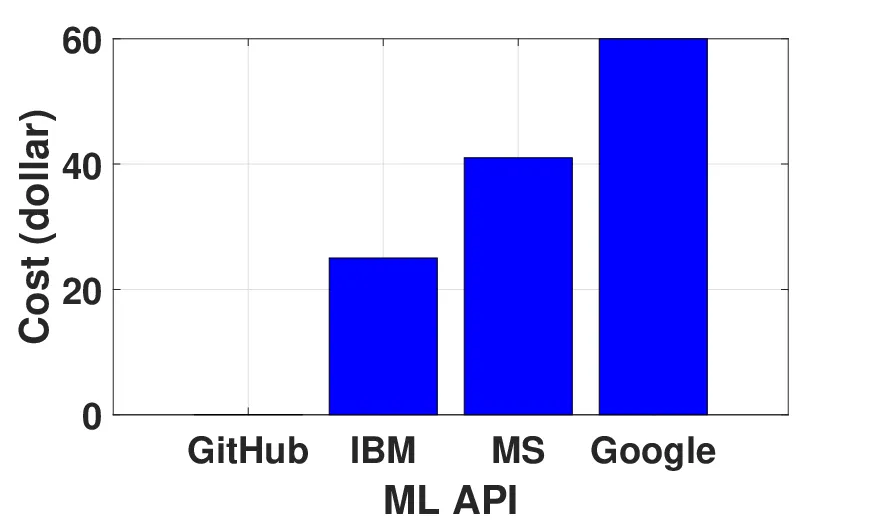

(c) Task: STT.

Figure 6: TCost per 10,000 queries of different ML APIs. GitHub refers
to the CNN Model \[13\] in FER, Vader \[16\] and Bixin \[4\] in SA , and
DeepSpeech \[14\] in STT.

#### GitHub Model Cost.

We evaluate the inference time of all GitHub models on an Amazon EC2
t2.micro instance, which is \$0.0116 per hour. The CNN model needs at
most 0.016 seconds per 480 x 480 grey image, Bixin and Vader require at
most 0.005 seconds for each text with less than 300 words, and
DeepSpeech takes at most 0.5 seconds for each less than 15 seconds
utterance. Hence, their equivalent price is \$0.0005, \$0.00016, and
\$0.016 per 10,000 data points. As shown in Figure 6, the services from
GitHub are much less expensive than the commercial ML services.

#### Case Study Details.

For comparison purposes, we also evaluate the performance of a mixture
of experts, a simple majority vote, and a simple cascade approach on
FER+ dataset. For the mixture of experts, we use softmax for the gating
network, and linear model on the domain space for the feature
generation. This results in a strategy that ends up with always calling
the best expert Microsoft. For the simple majority vote, we first
transforms each API’s confidence score $`q`$ and predicted label
$`\ell`$ into its probability vector $`\mathbf{v}\in\mathbb{R}^{L}`$, by
$`\mathbf{v}_{\ell}=q,\mathbf{v}_{j}=(1-q)/(L-1),j\not=\ell`$. This can
be viewed as that the API gives a distribution of all labels for the
input data point. Assuming independence, we simply sum all APIs’
distributions and then produce the label with highest estimated
probability. We also use a simple majority vote, where we simply return
the label on which most API agrees on. For example, if GitHub (CNN),
Google, and Face++ all give a label “surprise”, the no matter what
Microsoft produces, we choose “surprise ” as the label. We break ties
randomly.

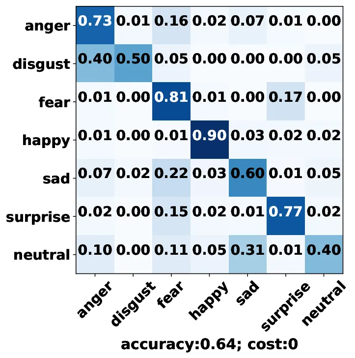

(a) GitHub (CNN) model

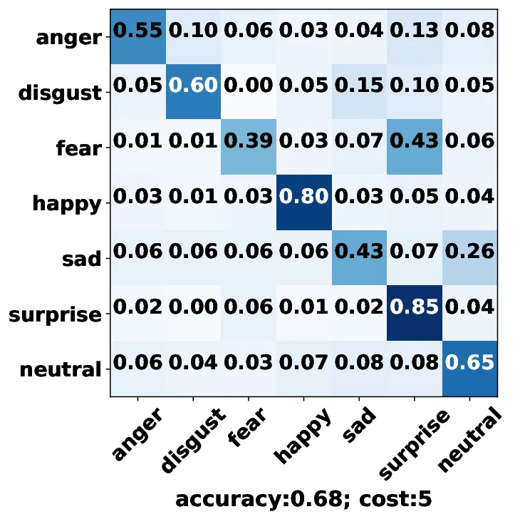

(b) Face++

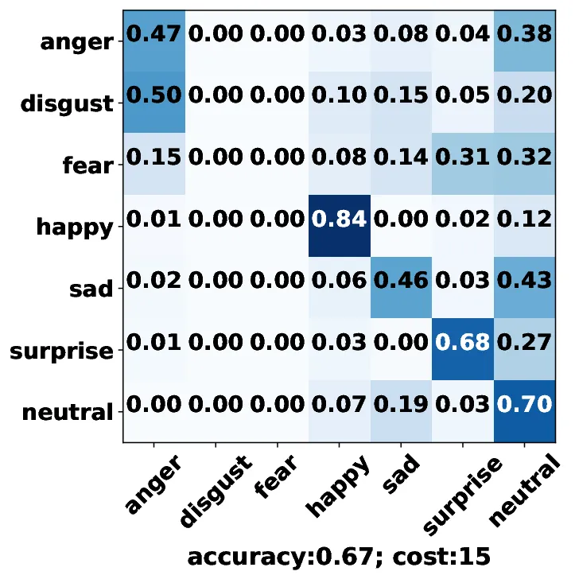

(c) Google

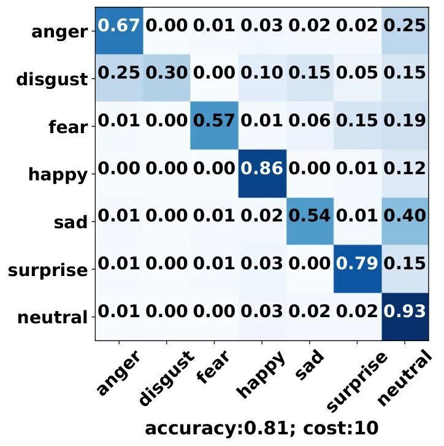

(d) Microsoft


(e) Mix Experts

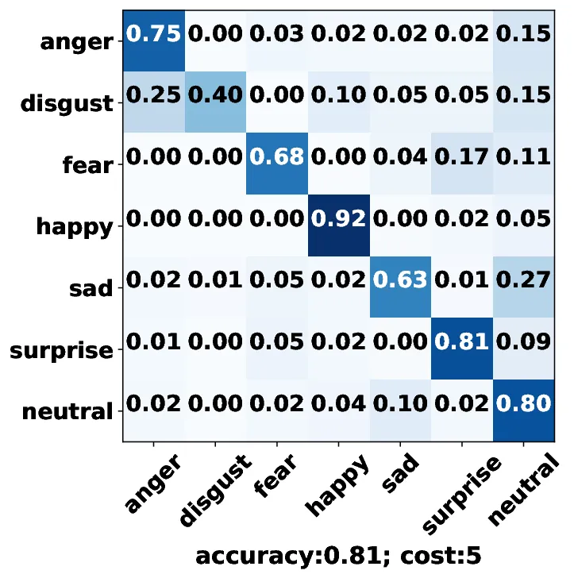

(f) Simple Cascade

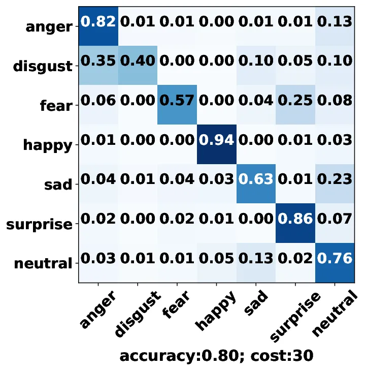

(g) (Simple) Majority Vote

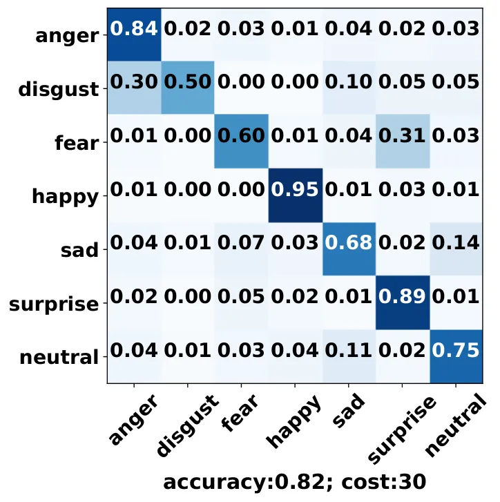

(h) Majority Vote

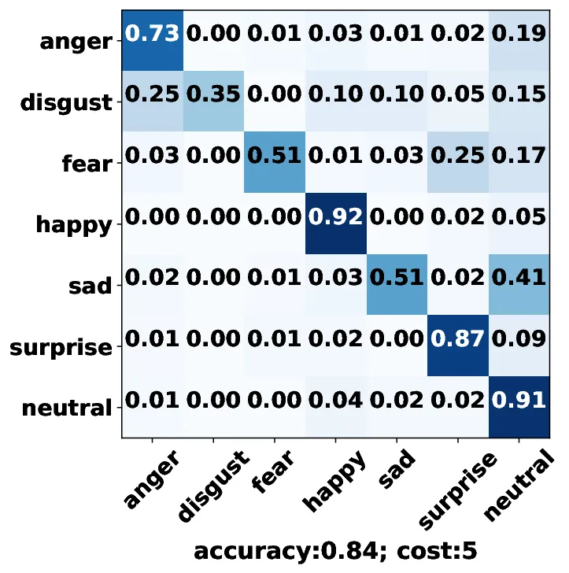

(i) FrugalML

Figure 7: Confusion matrix annotated with overall accuracy and cost on
FER+ testing. The y-axis corresponds to the true label and x-axis
represents the predicted label. Each entry in a confusion matrix is the
likelihood that its corresponding label in x-axis is predicted given the
corresponding true label in y-axis. For example, the 0.87 in (i) means
that for all surprise images, FrugalML correctly predicts 87% of them as
surprise,

Figure 7 shows the confusion matrix of FrugalML, along with all ML
services and the other approaches (namely, mixture of experts, simple
cascade, (simple majority vote), and majority vote). Among all the four
services, we first note that there is an accuracy disparity for
different facial emotions. In fact, GitHub (CNN) gives the highest
accuracy on anger images (0.73%), fear (0.81%), happy (0.90%) and sad
(0.60%), Face++ is best at disgust emotion (0.60%) and surprise (0.85%),
while Microsoft is best at neutral (90%). Meanwhile, GitHub (CNN) gives
a poor performance for neutral images, Face++ can hardly tell the
differences between fear and surprise, and Google has a hard time
distinguishing between anger and disgust images. This implies bias (and
thus strength and weakness) from each ML API, leading to opportunities
for optimization. We would also like to note that such biases may be of
independent interest and explored for fairness study in the future.

We notice that the mixture of expert approach has the same confusion
matrix as the Microsoft API. This is because the simple mixture of
experts simply learns to always use the Microsoft API. Noting that we
use a simple linear gating on the raw image space, this probably implies
that Microsoft API has the best performance on any subspace in the raw
image space produced by any hyperplane. More complicated mixture of
experts approaches may lead to better performance, but requires more
training complexity. Again, unlike FrugalML, mixture of experts does not
allow users to specify their own budget/accuracy constraints.

Simple cascade approach allows accuracy cost trade-offs. As shown in
Figure 6(f), while reaching the same accuracy as the best commercial API
(Microsoft), it only asks for half of the cost. In fact, simple cascade
uses GitHub (CNN) and Microsoft as the base service and add-on service
with a fixed threshold for all labels. As a result, compared to
Microsoft API, the prediction accuracy of neutral images drops
significantly, while the accuracy on all the other labels increases, and
thus resulting in the same accuracy.

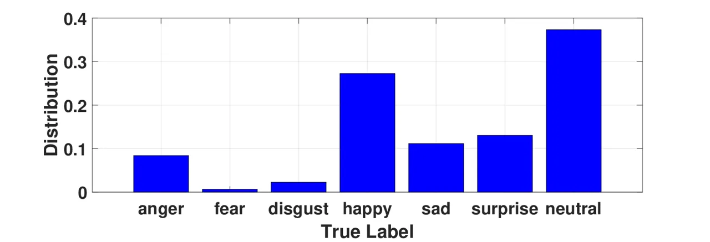

Figure 8: Label distribution on dataset FER+. Most of the facial images
are neutral and happy faces, and only a few are fear and disgust.

FrugalML, also with half of the cost of Microsoft API, actually gives an
accuracy (84%) even higher than that of Microsoft API (81%). In fact,
FrugalML identifies that only a vert small portion of images are
disgust, and thus slightly sacrifices the accuracy on disgust images to
improve the accuracy on all the other images. Compared to the simple
cascade approach in Figure 6 (f), FrugalML, as shown in Figure 6 (i),
produces higher accuracy on all classes of images except disgust images.
Compared to Microsoft API (Figure 6), FrugalML slightly hurts the
accuracy on fear, sad, and neutral images, but significantly improve the
accuracy on happy and other images. Note that the strategy learned by
FrugalML depends on the data distribution. As shown in Figure 8, most
images are neutral and happy, and thus a slight drop on neutral images
is worthy in exchange of a large improvement on happy images. Depending
on the training data distribution, FrugalML may have learned different
strategies as well.

Finally we note that while (simple) majority vote gives a poor accuracy
(80% in Figure 7 (g)), the majority vote approach does lead to an
accuracy (82%) higher than Microsoft API, although it is still lower
than FrugalML’s accuracy (84%). In addition, ensemble methods like
majority vote need access to all ML APIs, and thus requires a cost of
30\$, which is 5 times as large as the cost of FrugalML. Hence, they may
not help reduce the cost effectively.
