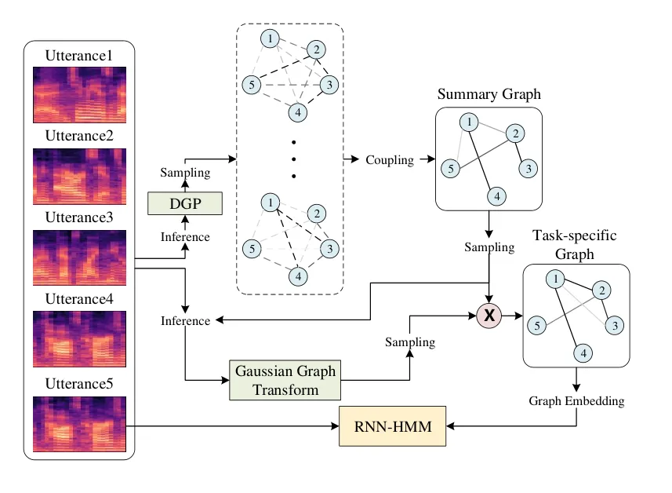

# Deep Graph Random Process for Relational-Thinking-Based Speech Recognition

Hengguan Huang Affiliation: National University of Singapore    Fuzhao
Xue Affiliation: National University of Singapore    Hao Wang
Affiliation: Massachusetts Institute of Technology    Ye Wang
Affiliation: National University of Singapore Correspondence to:
<wangye@comp.nus.edu.sg>

###### Abstract

Lying at the core of human intelligence, relational thinking is
characterized by initially relying on innumerable unconscious percepts
pertaining to relations between new sensory signals and prior knowledge,
consequently becoming a recognizable concept or object through coupling
and transformation of these percepts. Such mental processes are
difficult to model in real-world problems such as in conversational
automatic speech recognition (ASR), as the percepts (if they are
modelled as graphs indicating relationships among utterances) are
supposed to be innumerable and not directly observable. In this paper,
we present a Bayesian nonparametric deep learning method called deep
graph random process (DGP) that can generate an infinite number of
probabilistic graphs representing percepts. We further provide a
closed-form solution for coupling and transformation of these percept
graphs for acoustic modeling. Our approach is able to successfully infer
relations among utterances without using any relational data during
training. Experimental evaluations on ASR tasks including CHiME-2 and
CHiME-5 demonstrate the effectiveness and benefits of our method.

###### Keywords: 

Bayesian deep learning, Bayesian nonparametric deep learning, Graph
random process, Relational thinking

## 1 Introduction

Relational thinking is believed to be a fundamental human learning
process. In this type of thinking, people obtain sensory signals such as
sounds, sights, and smells without consciously perceiving them, but
those signals nonetheless lead to thought outcomes. For example, take
the process of a baby learning to listen or speak (Alexander, 2016).
This learning process is characterized by initially relying on
innumerable unconscious percepts pertaining to relations between current
sensory signals and prior knowledge (Malmberg & Annis, 2012; Murai &
Yotsumoto, 2018), then subsequently discovering recognizable concepts or
objects through coupling and transformation of these percepts
(Alexander, 2016). In contrast, relational reasoning is a higher-level
learning process that intentionally or consciously reasons about
relations among objects or concepts. While relational reasoning has
inspired perspectives of artificial intelligence (Hudson & Manning,
2019; Smolensky, 1987), relational thinking is largely unexplored in
solving machining learning problems.

Human conversation is essentially a process of exchanging thoughts
between two or more talkers. Speech processing (or, specifically, speech
recognition) is one of the critical components of this highly complex
process, and neurobiology research acknowledges that this component is
connected to human thinking (Hickok & Poeppel, 2007; Birjandi & Sabah,
2015). In contrast, automatic speech recognition (ASR) has long been
treated as a typical pattern matching problem in the machine learning
area (Rabiner, 1989; Hinton et al., 2012; Amodei et al., 2016).
Ironically, this task is generally decomposed into two parts, namely
acoustic modeling and linguistic decoding, and the essential relational
thinking process is ignored (Alexander, 2016). This process is difficult
to incorporate into a traditional speech recognition system because the
percepts (e.g. mental impressions formed while hearing sounds) involved
in relational thinking are supposed to be innumerable and not directly
observable. However, the dialogue history during the conversation might
reflect such underlying mental processes, allowing an indirect way of
modeling speech processing (Derix et al., 2014). Even when only using
one previous dialogue embedding as an additional input to an acoustic
model, the proposed framework in (Moses et al., 2019) achieves
significantly better results on a spoken Q&A dataset. More powerful
representation learning might be achieved by weighting over multiple
context inputs (e.g. utterances) (Palm et al., 2018; Chen et al., 2016;
Pundak et al., 2018; Zoph & Knight, 2016; Kim & Metze, 2018).

Despite recent advances, it is still challenging to explicitly modeling
the percept of relational thinking for acoustic modeling due to
percept’s unconscious nature. Currently, the hybrid acoustic recurrent
neural network hidden Markov model (RNN-HMM) still outperforms
end-to-end encoder-decoder approaches for acoustic modeling in many
aspects (Lüscher et al., 2019), even though the former is getting more
popular. Generally, RNNs do a good job of capturing long-term temporal
dependencies of sequential inputs but a poor job at representing complex
relationships. Therefore, when handling tasks that require relational
thinking, the first-order dependencies between adjacent hidden states
imposed by RNNs may hinder the extraction of complex structural
information. One option to get around this problem is to process such
data, which has a highly complex structure, with some members from the
family of graph neural networks. However, most existing techniques
either require the input to be graph data (Kipf & Welling, 2016b; Kipf &
Welling, 2016a; Bojchevski et al., 2018), or to be supervised toward
training targets of graph structure (Samanta et al., 2018). As such,
they are not applicable for a task such as ours that marries relational
thinking with acoustic modeling, in that the relations involved in
percepts are difficult to obtain.

To alleviate these deficiencies in acoustic modeling, we propose a new
Bayesian nonparametric deep learning method called deep graph random
process (DGP) that can model percepts involved in relational thinking as
probabilistic graphs without using any relational data during training.
Specifically, a percept in our work is modeled as relations between a
current utterance and its history. We assume the probability of the
existence of such a relation to be close to zero due to the
unconsciousness of the percept. Given an utterance and its history, we
generate an infinite number of percepts represented by probabilistic
graphs contained in the DGP, in which each node depicts a representation
of an utterance and each edge corresponds to relation between two nodes.
We assume that the edge of percept graph is distributed according to a
Bernoulli distribution with the probability of edge existence being
close to zero.

It is computationally intractable to combine innumerable graphs by
simply summing over their adjacency matrix. We therefore find an
analytical solution by creating an equivalent new graph where the edge
is represented by a Binomial variable. Since Binomial distribution of
such variable involves an infinity as one of its parameters, we further
find a close form solution for inference and sampling of such Binomial
distribution via an approximate Gaussian distribution with bounded
approximation errors. To transform the new graph to be “conscious” or
task-specific, we weight each edge of the new graph using another
Gaussian variable conditioned on the edge drawn from the Binomial
variable. Subsequently, we calculate the graph embedding (Kipf et al., 2018) over the transformed graph and using it as an additional input for
acoustic modeling. To jointly optimize above components, we adopt
variational inference framework and successfully derive an effective
evidence lower bound (ELBO).

The experiments on CHiME-2 (Vincent et al., 2013) and CHiME-5 (Barker
et al., 2018) show that our new model consistently outperforms baseline
models for the speech recognition task. Notably, we demonstrate the
effectiveness of our method in learning relations among utterances via
both qualitative and quantitative studies on synthetic relational
SWitchBoard (Godfrey et al., 1992) data.

## 2 Related Work

### 2.1 Bayesian Deep Learning of Graphs

Several Bayesian deep learning models for graphs have recently been
proposed. For example, relational stacked denoising auto-encoders
(RSDAE) (Wang et al., 2015) were developed as a principled model to
incorporate graph structures into probabilistic auto-encoders,
significantly improving representation learning. As a follow-up work,
relational deep learning (RDL) (Wang et al., 2017) is a supervised and
fully Bayesian version of RSDAE to directly tackle the task of link
prediction. Along a different line of research, graph auto-encoders
(GAEs) (Kipf & Welling, 2016b) were proposed to learn real-world graph
data in an unsupervised training manner. Different from RSDAE and RDL,
they employ a graph convolutional networks (GCN) (Kipf & Welling, 2016a)
encoder to represent nodes using low-dimensional vectors, and use a
decoder to reconstruct the adjacency matrix. These models have found
applications in discovering chemical molecules (Samanta et al., 2018),
modeling citation networks (Kipf & Welling, 2016b), and constructing
knowledge graphs (Chen et al., 2018).

Regularized Graph Variational Autoencoders (RGVAE) (Pan et al., 2018)
improve upon GAEs through regularizing the output distribution of the
decoder with an adversarial regularization framework. (Bojchevski
et al., 2018) further extends this approach with a random-walk-based
generator. However, these approaches assume the model data to be a
static graph, limiting their model generalizability in handling
real-world problems with dynamic graphs. Variational graph RNN (VGRNN)
(Hajiramezanali et al., 2019) attempts to mitigate this problem by
combining GCN, RNN, and GAEs, allowing the evolution of dynamic graphs
to be captured. Though these existing works are successful in generating
graphs, static or dynamic, they require graph annotations. Therefore,
they are not applicable to our task in which the annotations of
relations among utterances are not available during training.

### 2.2 Variational Acoustic Modeling

An RNN-HMM acoustic model is a major component of a hybrid RNN-HMM ASR
system (Graves et al., 2013). It can be viewed as an “HMM states
classifier”. Specifically, given $`M`$ training utterances
$`\{U_{i}\}_{i=1}^{M}`$, where $`U_{i}`$ involves a sequence of acoustic
features
$`\mathbf{X}_{i}=\{\mathbf{x}_{i,1},\mathbf{x}_{i,2},...,\mathbf{x}_{i,T}\}`$
and training labels
$`\mathbf{Y}_{i}=\{\mathbf{y}_{i,1},\mathbf{y}_{i,2},...,\mathbf{y}_{i,T}\}`$.
An RNN taking as input the acoustic feature $`\mathbf{x}_{i,t}`$ is
adopted to estimate posterior probabilities for $`K`$ HMM states of
context-dependent phones:

```math
\hat{\mathbf{y}}_{i,t}=\mathrm{softmax}(\mathrm{RNN}(\mathbf{x}_{i,t})) \tag{1}
```

where $`\hat{\mathbf{y}}_{i,t}`$ is the HMM state prediction. Such a
model can be optimized by minimizing the negative log-likelihood or
cross-entropy: $`\sum_{i}^{M}-\log P(\mathbf{Y}_{i}|\mathbf{X}_{i})`$.

Many uncertainties can be encountered when modeling speech signals using
a RNN-HMM acoustic model. For instance, the background noise has a
complicated influence on the speech signal. The RNN-HMM acoustic model
is limited in handling such uncertainties because an RNN is essentially
a deterministic function. A variational RNN (VRNN) (Chung et al., 2015)
has been developed to cope with this limitation. It introduces a latent
variable $`\mathbf{z}_{i,t}`$ to capture the uncertainty of acoustic
features at time $`t`$. Such a latent variable is assumed to have a
Gaussian prior distribution $`p(\mathbf{z}_{i,t}|\mathbf{h}_{i,t-1})`$
dependent on the previous RNN hidden state $`\mathbf{h}_{i,t-1}`$. Its
posterior distribution is approximated by a variational distribution
$`q(\mathbf{z}_{i,t}|\mathbf{x}_{i,t},\mathbf{h}_{i,t-1})`$, allowing
the use of the evidence lower bound (ELBO) for joint learning and
inference. It can be written as:

```math
\begin{split}\sum_{i=1}^{M}\{&\mathrm{KL}(q(\mathbf{Z}_{i}|\mathbf{X}_{i},\mathbf{H}_{i})||p(\mathbf{Z}_{i}|\mathbf{H}_{i}))\\
&-\mathbb{E}_{\mathbf{Z}_{i}}[\log P(\mathbf{Y}_{i}|\mathbf{X}_{i},\mathbf{Z}_{i})]\}\end{split} \tag{2}
```

where latent variables
$`\mathbf{Z}_{i}=\{\mathbf{z}_{i,1},\mathbf{z}_{i,2},...,\mathbf{z}_{i,T}\}`$
and hidden states
$`\mathbf{H}_{i}=\{\mathbf{h}_{i,0},\mathbf{h}_{i,1},...,\mathbf{h}_{i,T-1}\}`$.
The sampling from the posterior distribution is achieved by using
re-parameterization based Monte Carlo (MC) estimation (Kingma & Welling,
2013). This model can then be trained via stochastic gradient descent.
It has been observed that the gradient obtained using this technique is
more stable than that of the score function estimator (Glynn, 1990).

One major limitation of the VRNN-HMM acoustic model is that the learned
latent distribution exhibits non-interpretable representations because
the approximating distributions are assumed to take a general form which
are lacking in expressive power. For instance, frame-level latent
variables adopted by VRNN are not powerful enough to describe the
relational structure among utterances. Addressing this issue is one of
our model’s focuses.

## 3 Relational Thinking Modelling

### 3.1 Problem Formulation and Preliminary



Figure 1: Architecture of RTN for acoustic modeling

In a natural conversation, there is a relational structure among
consecutive utterances which depends on the speaker’s intention in
producing those utterances. For instance, such a structure may contains
some discourse relations, such as question-answer-pair, contrast,
comment and so on. One common way of representing such a structure is a
graph in which a node corresponds to an utterance embedding and an edge
corresponds to the relationship between the two connected nodes, e.g.
the co-occurrence of dialogue acts (Stolcke et al., 2000b) of two
utterances. According to relational thinking (Alexander, 2016; Malmberg
& Annis, 2012; Murai & Yotsumoto, 2018), before producing such complex
relational data among utterances, the listener is assumed to
unconsciously generate an infinite amount of similar data except that
the probability of edge existence is very small. These data are not
recognizable until they are somehow combined and transformed for a
specific task, e.g. speech recognition.

Suppose we are given an utterance $`U_{i}`$ involving a sequence of
acoustic features
$`\mathbf{X}_{i}=\{\mathbf{x}_{i,1},\mathbf{x}_{i,2},...,\mathbf{x}_{i,T}\}`$
and training labels
$`\mathbf{Y}_{i}=\{\mathbf{y}_{i,1},\mathbf{y}_{i,2},...,\mathbf{y}_{i,T}\}`$
as well as $`o`$ previous utterances $`U_{i-o:i-1}`$. We aim to simulate
relational thinking by initially constructing an infinite number of
graphs $`\{G^{(k)}\}_{k=1}^{+\infty}`$, where
$`G^{(k)}(V^{(k)},E^{(k)})`$ is a graph representing the $`k`$-th
percept, with $`V^{(k)}`$ and $`E^{(k)}`$ as the node and edge sets.
Consequently, these percept graphs are combined and further transformed
via a graph transform $`\mathbf{S}`$. In this paper, a node
$`v^{(k)}_{i}`$ corresponds to the embedding of utterance $`U_{i}`$ for
the $`k`$-th percept , and an element $`\alpha^{(k)}_{i,j}`$ of the
adjacency matrix $`\mathbf{A}^{(k)}`$ indicates an edge between node
$`i`$ and node $`j`$. It is worth noting that we assume that the
probability of edge existence in such graphs is close to zero. Our
ultimate goal is to model the distribution of training labels
conditioned on acoustic features and these graphs as well as a graph
transform, i.e.
$`P(\mathbf{Y}_{i}|\mathbf{X}_{i},\{G^{(k)}\}_{k=1}^{+\infty},\mathbf{S})`$,
with a closed-form solution.

### 3.2 Deep Graph Random Process

Deep graph random process (DGP) is a stochastic process designed to
describe the latent mechanisms governing the generation of an infinite
number of probabilistic graphs representing percepts. A DGP contains a
fixed number of nodes that are shared among percept graphs. Such nodes
may represent sensory input from multiple sensory modalities such as
olfaction, vision and audition, depending on the specific problem of
interest. For example, in acoustic modeling, each node represents an
utterance whose embedding is calculated by a neural network encoding a
sequence of acoustic features for the $`i`$-th utterance:

```math
\mathbf{v}_{i}=f_{\theta}(\mathbf{X}_{i}) \tag{3}
```

where $`f_{\theta}`$ is a neural network.

At DGP’s core are a series of deep Bernoulli processes (DBP) as building
blocks, each being responsible to generate edges between two nodes of
DGP. DBP is a special type of Bernoulli process we propose in which the
probability of the existence of the edge is assumed to be close to zero
due to the unconsciousness of the percept. Specifically, by considering
an infinite number of edges $`\{\alpha^{(k)}_{i,j}\}_{k=1}^{+\infty}`$
sampled from the DBP between node $`i`$ and node $`j`$, we have:

```math
\{\alpha^{(k)}_{i,j}\}_{k=1}^{+\infty}\sim\mathrm{DBP}(\mbox{Bern}(\lambda_{i,j})) \tag{4}
```

where $`\mbox{Bern}(\lambda_{i,j})`$ is the Bernoulli distribution with
the probability of the edge existence $`\lambda_{i,j}`$. As a result,
our DGP is capable of generating innumerable probabilistic graphs:

```math
\{G^{(k)}\}_{k=1}^{+\infty}\sim\mathrm{DGP}(\mathbf{v}_{i-o:i},\{\mathrm{DBP}(\mbox{Bern}(\lambda_{*,*}))\}) \tag{5}
```

where $`\{\mathrm{DBP}(\mbox{Bern}(\lambda_{*,*}))\}`$ refers to a
collection of DBP involved in DGP.

#### 3.2.1 Coupling of innumerable probabilistic graphs

Coupling is one of the key steps of relational thinking. The goal of
coupling is to obtain a summary of an infinite number of percepts.
However, it is computationally intractable to combine innumerable
percept graphs by simply summing over $`\mathbf{A}^{(k)}`$ for each
graph generated by DGP. We seek to construct an equivalent graph that
can serve as a summary or representation of the original innumerable
graphs. We refer to such graph as summary graph. They keep the original
node set and update each edge by sampling from a Binomial distribution:

```math
\tilde{\alpha}_{i,j}=\sum_{k=1}^{+\infty}\alpha_{i,j}^{(k)},~~~~~~~~\tilde{\alpha}_{i,j}\sim\mathcal{B}(n,\lambda_{i,j}), \tag{6}
```

where $`n\rightarrow+\infty`$ and $`\lambda_{i,j}\rightarrow 0`$.

#### 3.2.2 Inference and sampling of edges of summary graph

We assume the edge $`(i,j)`$ of summary graph is distributed according
to a Binomial distribution $`\mathcal{B}(n,\lambda_{i,j})`$, with
$`n\rightarrow+\infty`$ and $`\lambda_{i,j}\rightarrow 0`$. Drawing
inspiration from VRNN (Chung et al., 2015), the parameters of the
approximate posteriors are estimated from an RNN encoding acoustic
features. However, unlike VRNN, DGP contains the approximate posterior
$`q(\tilde{\alpha}_{i,j}|\mathbf{X}_{i-o:i})`$, whose inference and
sampling cannot be directly solved in a computationally tractable manner
due to the infinity $`n`$.

###### Theorem 1.

Let $`\mathcal{N}(\mu,\sigma^{2})`$ denotes a Gaussian distribution with
$`\mu<1/2`$, and let $`\mathcal{B}(n,\lambda)`$ denotes a Binomial
distribution with $`n\rightarrow+\infty`$ and $`\lambda\rightarrow 0`$,
where $`n`$ is increasing while $`\lambda`$ is decreasing. There exists
a real constant $`m`$ such that if $`m=n\lambda`$ and if we define:

```math
\displaystyle f_{1}(x) \displaystyle=\mathrm{KL}(\mathcal{N}(x,x(1-x))||\mathcal{N}(\mu,\sigma^{2}))
```

```math
\displaystyle f_{2}(x) \displaystyle=\mathrm{KL}(\mathcal{N}(x,x(1-x))||\mathcal{N}(n\lambda,n\lambda(1-\lambda))
```

```math
\displaystyle f_{2}^{*} \displaystyle=\min_{x}f_{2}(x),\ where\ x\in(0,1)
```

we have that: $`f_{1}(x)`$ attains its minimum on the interval $`(0,1)`$
and $`f_{2}(x)-f_{2}^{*}`$ is bounded on the interval
$`(0,\sqrt{2}/2-1/2)`$, with:

```math
x=m=\frac{1+l-\sqrt{1+l^{2}}}{2},\ where\ l=\frac{2\sigma^{2}}{1-2\mu}
```

Suppose we are given a Gaussian distribution
$`\mathcal{N}(\tilde{\mu}_{i,j},\tilde{\sigma}_{i,j}^{2})`$, whose
parameter $`\tilde{\mu}_{i,j}`$ is specifically parameterized by the
neural network that can guarantee that $`\tilde{\mu}_{i,j}<1/2`$. By De
Moivre–Laplace theorem (Sheynin, 1977), we have that
$`\mathcal{N}(n\lambda_{i,j},n\lambda_{i,j}(1-\lambda_{i,j})`$ is a good
approximation for $`\mathcal{B}(n,\lambda_{i,j})`$. They are
asymptotically equivalent as $`n`$ increases. Let
$`m_{i,j}=n\lambda_{i,j}`$, with Theorem 1 (see Supplement for the Proof
of Theorem 1), direct parameterization of both the infinite parameter
$`n`$ and the near-zero parameter $`\lambda_{i,j}`$ can be avoided,
which in turn allows for the re-parametrization trick of (Kingma &
Welling, 2013) to be used. This trick draws samples from such Binomial
distribution via its Gaussian proxy
$`\mathcal{N}(m_{i,j},m_{i,j}(1-m_{i,j}))`$.

### 3.3 Application of DGP for Acoustic Modelling

Another essential aspect of relational thinking is that it transforms
innumerable unconscious percepts into a recognisable notion of
knowledge. Here, we aim to extract an informative representation from
the summary graph representing innumerable percept graphs for our
downstream task: acoustic modelling. This is achieved by transforming
the summary graph through weighting each edge with a Gaussian variable
$`s_{i,j}`$:

```math
\bar{\alpha}_{i,j}=s_{i,j}*\tilde{\alpha}_{i,j} \tag{7}
```

We further assume such Gaussian variable to be conditioned on the edge
$`\tilde{\alpha}_{i,j}`$ of the summary graph, in avoiding the
distribution of such Gaussian variable (if it is independent of the edge
$`\tilde{\alpha}_{i,j}`$) behaves randomly when some sample values of
the edge $`\tilde{\alpha}_{i,j}`$ are close to zero. It is defined as:

```math
s_{i,j}|\tilde{\alpha}_{i,j}\sim\mathcal{N}(\tilde{\alpha}_{i,j}*\mu_{i,j},\tilde{\alpha}_{i,j}*\sigma^{2}_{i,j}) \tag{8}
```

We refer to such operations as a Gaussian graph transform. The resultant
graph is called a task-specific graph.

We then follow (Kipf et al., 2018) to extract the graph embedding
$`\mathbf{e}_{i}`$ from the transformed graph with node
$`\mathbf{v}_{i}`$ corresponding to the current utterance. It can be
written as:

```math
\mathbf{e}_{i}=\sum_{(j,k)\in\left\{(j,k)|j<k\leq i,(j,k)\in\bar{E}\right\}}\bar{\alpha}_{j,k}\bar{f_{\theta}}([\mathbf{v}_{j},\mathbf{v}_{k}]) \tag{9}
```

where $`\bar{f_{\theta}}`$ is a neural network and $`\bar{E}`$ is the
edge set of the transformed graph.

Next, we use the generated graph embedding as an additional input of our
acoustic model. We refer to the whole framework as a relational thinking
network (RTN) (Figure 1). In this paper, we adopt the simple recurrent
unit (Lei & Zhang, 2017) as the basic building block of the RTN. The SRU
simplifies the architecture of LSTM and dramatically increases
computational speed with nearly no ASR performance drop. The updating
formulas of our RTN are:

```math
\displaystyle\left[\hat{\mathbf{r}}_{i,t},\hat{\mathbf{f}}_{i,t},\hat{\mathbf{c}}_{i,t}\right]=\mathbf{W}_{x}\left[\mathbf{x}_{i,t},\mathbf{e}_{i}\right]+\mathbf{b} \tag{10}
```

```math
\displaystyle\mathbf{r}_{i,t}=\sigma(\hat{\mathbf{r}}_{i,t}) \tag{11}
```

```math
\displaystyle\mathbf{f}_{i,t}=\sigma(\hat{\mathbf{f}}_{i,t}) \tag{12}
```

```math
\displaystyle\mathbf{c}_{i,t}=\mathbf{f}_{i,t}\odot\mathbf{c}_{i,t-1}+(1-\mathbf{f}_{i,t})\odot\hat{\mathbf{c}}_{i,t} \tag{13}
```

```math
\displaystyle\mathbf{h}_{i,t}=\mathbf{r}_{i,t}\odot\mathbf{c}_{i,t}+(1-\mathbf{r}_{i,t})\odot W_{h}\left[\mathbf{x}_{i,t},\mathbf{e}_{i}\right] \tag{14}
```

where $`\mathbf{r}_{i,t}`$ is the reset gate output,
$`\mathbf{f}_{i,t}`$ is the forget gate output, $`\mathbf{c}_{i,t}`$ is
the memory cell output, $`{\bf W}_{x}`$ and $`{\bf W}_{h}`$ are the
weight matrices, $`{\bf b}`$ is the gate bias vector,
$`\mathbf{h}_{i,t}`$ is the hidden state output, any quantity with a
‘hat’ (e.g. $`\hat{\mathbf{c}}_{i,t}`$) is the activation value of the
quantity before an activation function is applied, $`\odot`$ is the
element-wise multiplication operation, and $`\sigma`$ is the sigmoid
function.

### 3.4 Learning

We adopt variational inference to jointly optimise DGP, the Gaussian
graph transform, and the acoustic model. DGP can be equivalently
represented as two type of random variables: Bernoulli variables related
to edges of the percept graph and Binomial variables related to edges of
the summary graph. Although these two random variables take different
forms in terms of probability distributions, we can use these different
random variables to describe the same random process data. Therefore,
specifying the Binomial variables of a DGP completely determines the
graph random process as a whole. The resulting objective is to maximize
the evidence lower bound (ELBO):

```math
\begin{split}\sum_{i=1}^{M}\{&\mathrm{KL}(q(\tilde{\mathbf{A}},\mathbf{S}|\mathbf{X}_{i-o:i})||p(\tilde{\mathbf{A}},\mathbf{S}|\mathbf{X}_{i-o:i}))\\
&-\mathbb{E}_{\tilde{\mathbf{A}},\mathbf{S}}[\log P(\mathbf{Y}_{i}|\mathbf{X}_{i},\tilde{\mathbf{A}},\mathbf{S})]\}\end{split} \tag{15}
```

where the adjacency matrix of the summary graph
$`\tilde{\mathbf{A}}=[\tilde{\alpha}_{i,j}]`$; the Gaussian graph
transform matrix $`\mathbf{S}=[\tilde{s}_{i,j}]`$. (see Section 3.5 for
the parameterization of the approximate posterior
$`q(\tilde{\mathbf{A}},\mathbf{S}|\mathbf{X}_{i-o:i})`$ and the prior
$`p(\tilde{\mathbf{A}},\mathbf{S}|\mathbf{X}_{i-o:i})`$) Since each
element of the Gaussian graph transform matrix is conditioned on the
Binomial variable for the same edge of the summary graph, the
$`\mathrm{KL}`$ term can be further written as:

```math
\begin{split}\sum_{(i,j)\in\tilde{E}}\{&\mathrm{KL}(\mathcal{B}(n,\tilde{\lambda}_{i,j})||\mathcal{B}(n,\tilde{\lambda}_{i,j}^{(0)})\\
&+\mathbb{E}_{\tilde{\alpha}_{i,j}}[\mathrm{KL}(\mathcal{N}(\tilde{\alpha}_{i,j}*\mu_{i,j},\tilde{\alpha}_{i,j}*\sigma^{2}_{i,j})\\
&||\ \mathcal{N}(\tilde{\alpha}_{i,j}*\mu_{i,j}^{(0)},\tilde{\alpha}_{i,j}*{\sigma_{i,j}^{(0)}}^{2})]\ \}\end{split} \tag{16}
```

Unfortunately, while calculation of the second term is straightforward,
the first $`\mathrm{KL}`$ term is computationally intractable as
$`n\rightarrow+\infty`$.

###### Theorem 2.

Suppose we are given two Binomial distributions,
$`\mathcal{B}(n,\lambda)`$ and $`\mathcal{B}(n,\lambda^{0})`$ with
$`n\rightarrow+\infty`$, $`\lambda^{0}\rightarrow 0`$ and
$`\lambda\rightarrow 0`$ , where $`n`$ is increasing while $`\lambda`$
and $`\lambda^{0}`$ are decreasing. There exists a real constant $`m`$
and another real constant $`m^{(0)}`$, such that if $`m=n\lambda`$ and
$`m^{(0)}=n\lambda^{(0)}`$ and if $`\lambda>\lambda^{(0)}`$, we have:

```math
\begin{split}\mathrm{KL}(\mathcal{B}(n,\lambda)||&\mathcal{B}(n,\lambda^{0}))<m\log\frac{m}{{m}^{(0)}}\\
&+(1-m)\log\frac{1-m+m^{2}/2}{1-m^{(0)}+{m^{(0)}}^{2}/2}\end{split}
```

By Theorem 2 (the proofs are provided in the supplementary material), we
have a closed-form solution that is irrelevant to $`n`$ for the ELBO.

### 3.5 Detailed Implementation of RTN

##### Node Embedding of DGP

In our following experiments, we adopt the neural network $`f_{\theta}`$
to calculate the node embedding of DGP. The architecture of such a
neural network has 6 SRU layers (each with 1024 hidden states), which is
firstly followed by a max-pooling layer and then a single-layer
multi-Layer perceptron (MLP). Here we show the detailed formulation:

```math
\displaystyle\mathbf{H}_{i} \displaystyle=\mathrm{SRU}(\mathbf{X}_{i})
```

```math
\displaystyle\tilde{\mathbf{v}}_{i} \displaystyle=\max\limits_{t}(\mathbf{H}_{i})
```

```math
\displaystyle\mathbf{v}_{i} \displaystyle=\mathrm{ReLU}(\mathrm{MLP}(\tilde{\mathbf{v}}_{i}))
```

where SRU has 6 stacked layers; $`\max`$ is an element-wise max
operation over the frames in the utterance; the input and output size of
the MLP is 1024 and 128 respectively.

##### Inference of Binomial Edge Variables of DGP

For approximate posterior on the Binomial edge variable, before
calculation of $`m_{i,j}`$, theorem 1 requires a Gaussian distribution
$`\mathcal{N}(\tilde{\mu}_{i,j},\tilde{\sigma}_{i,j}^{2})`$ with
$`\tilde{\mu}_{i,j}<1/2`$. We adopted two three-layer MLP (with 128
hidden nodes per layer) taking as input node embeddings
$`\mathbf{v}_{i-9:i}`$ and compute $`\tilde{\mu}_{i,j}`$ and
$`\tilde{\sigma}_{i,j}`$ respectively. To avoid the explosion of
$`\frac{1}{1-2\tilde{\mu}_{i,j}}`$, we introduce another variable
$`n_{i,j}`$ and define it as:

```math
n_{i,j}=\frac{1}{1-2\tilde{\mu}_{i,j}}=\mathrm{softplus}(\tilde{\mu}_{i,j})+\epsilon \tag{17}
```

such that $`n_{i,j}`$ is lower bounded by $`\epsilon`$. In our
experiments, $`\epsilon`$ was set to 0.01 (such hyperparameter can be
tuned to further improve performance). Then $`m_{i,j}`$ can be
calculated as:

```math
m_{i,j}=\frac{1+2n_{i,j}\tilde{\sigma}_{i,j}^{2}-\sqrt{1+4n_{i,j}^{2}\tilde{\sigma}_{i,j}^{4}}}{2} \tag{18}
```

The bound variable $`n_{i,j}`$ helps to avoid the explosion of
$`\log(m_{i,j})`$ involved in our final objective. For the prior on the
Binomial edge variable, the parameter $`m_{i,j}^{(0)}`$ is learned by a
three-layer MLP (with 128 hidden nodes per layer) taking as input node
embeddings $`\mathbf{v}_{i-9:i}`$.

##### Gaussian Graph Transform

To compute the parameters of the approximate posterior
$`\mathcal{N}(\tilde{\alpha}_{i,j}*\mu_{i,j},\tilde{\alpha}_{i,j}*\sigma^{2}_{i,j})`$
involved in Gaussian graph transform, two three-layer MLP (with 128
hidden nodes per layer) taking as input node embeddings
$`\mathbf{v}_{i-9:i}`$ was adopted to calculate $`\mu_{i,j}`$ and
$`\sigma_{i,j}`$ respectively. The parameters of the corresponding prior
is obtained in a similar way.

## 4 Experiments

We perform the preliminary experiments for the proposed RTN on a reading
speech recognition corpus, CHiME-2 (Vincent et al., 2013). We then
evaluate our method on CHiME-5 (Barker et al., 2018), a more challenging
conversational speech recognition dataset where the data is collected
from everyday home environments. We finally investigate the
interpretability of our model on a synthetic relational speech dataset:
synthetic relational SWitchBoard (Godfrey et al., 1992) (RelationalSWB).

|                            |     |      |      |      |
| -------------------------- | --- | ---- | ---- | ---- |
| Model                      | L   | N    | P    | T    |
| LSTM (Huang et al., 2019)  | 3   | 2048 | 130M | 0.71 |
| SRU (Huang et al., 2019)   | 12  | 2048 | 156M | 0.32 |
| RPPU (Huang et al., 2019)  | 12  | 1024 | 142M | 0.37 |
| Our SRU (Lei et al., 2017) | 12  | 1280 | 63M  | 0.09 |
| VSRU (Chung et al., 2015)  | 9   | 1024 | 66M  | 0.09 |
| RRN (Palm et al., 2018)    | 9   | 1024 | 64M  | 0.09 |
| RTN (Ours)                 | 9   | 1024 | 70M  | 0.11 |

Table 1: Model configuraions for all datasets and the training time for
CHiME-2. L: number of layers; N: number of hidden states per layer; P:
number of model parameters; T: Training time per epoch (hr).

### 4.1 Datasets

#### 4.1.1 CHiME-2

CHiME-2 corpus is designed for noise-robust speech recognition tasks. It
was generated by convolving clean Wall Street Journal (WSJ0) (Garofalo
et al., 2007) utterances with binaural room impulse responses (BRIRs)
and real background noises at signal-to-noise ratios (SNRs) in the range
\[-6,9\] dB. The training set contains 7138 simulated noisy utterances.
The transcriptions are based on those of the WSJ0 training set. The
development and test sets contain 2460 and 1980 simulated noisy
utterances respectively. The WSJ0 text corpus is used to train a trigram
language model with a vocabulary size of 5k.

| Model                           | WER  |
| ------------------------------- | ---- |
| Kaldi DNN (Povey et al., 2011b) | 29.1 |
| LSTM (Huang et al., 2019)       | 26.1 |
| SRU (Huang et al., 2019)        | 26.2 |
| RPPU (Huang et al., 2019)       | 24.4 |
| Our SRU (Lei et al., 2017)      | 25.8 |
| VSRU (Chung et al., 2015)       | 25.8 |
| RRN (Palm et al., 2018)         | 24.8 |
| RTN (Ours)                      | 23.9 |

Table 2: WER (%) on test set of CHiME-2.

#### 4.1.2 CHiME-5

CHiME-5 is the first large-scale corpus of real multi-speaker
conversational speech in everyday home environments. It was originally
designed for the CHiME 2018 challenge (Barker et al., 2018). Note that
only the audio data recorded by binaural microphones is employed for
training and evaluation in this experiment. The training dataset,
development dataset and test dataset includes about 40 hours, 4 hours,
and 5 hours of real conversational speech respectively. The evaluation
was performed with a trigram language model trained from the
transcription of CHiME-5.

#### 4.1.3 RelationalSWB

RelationalSWB is a manually generated speech dataset based on the
SWitchBoard (SWB) (Godfrey et al., 1992) conversational speech corpus,
for which graph annotations among utterances are derived from the
SWitchBoard dialogue act (SwDA) corpus (Jurafsky, 1997). SWB training
set includes about 260K utterances. SwDA extends it with dialogue act
tags which are utterance-wise labels indicating the function of
utterance in the dialog.

The training set of RelationalSWB contains 30K SWB training utterances.
It is obtained by running the official script on Kaldi S5b (Povey
et al., 2011a). We then select 1155 conversations that appear in both
SwDA and SWB (not including Relational SWB training utterances) to
construct the test set of RelationalSWB. This results in about 110K
utterances. Since SwDA only provides the utterance-wise dialogue act
tags, we manually generated another dataset that contains binary
relation labels between utterances. In doing so, we first generated the
dialogue act tag pairs when the difference between two utterance indices
is not more than 10. Then we ranked them by their frequencies. We used
the top 20% pairs as positive pairs and the remaining as negative pairs.
Note that the segmentation scheme of utterances in SWB differs from that
of SwDA. Therefore, we first detected the most similar utterance in SwDA
for each utterance of SWB per dialogue using difflib¹¹ 1
https://docs.python.org/3/library/difflib.html; after that, the
ground-truth relations of utterances on the test set could be obtained.

### 4.2 Feature Extraction and Preprocessing

The speech data in both CHiME-2 and CHiME-5 is pre-processed as
40-dimensional Mel-filterbank coefficients (Biem et al., 2001) (for all
neural-network-based models ), while it is 36-dimensional Mel-filterbank
coefficients for RelationalWSB. All acoustic features are calculated
every 10ms. Input of all neural networks consists of the current frame
together with its 4 future contextual frames. We performed speaker-level
mean and variance normalization for the input to all models.

### 4.3 Training Procedure

All GMM-HMMs for CHiME-2 are trained using the standard Kaldi s5 recipe
(Povey et al., 2011b). Note that the training recipe of CHiME-5 is
modified from that of CHiME-2 as we only employed single-channel audio
data for GMM-HMM training. They were then used to derive the state
targets for subsequent RNN training through forced alignment for CHiME-2
and CHiME-5. Specifically, the state targets of CHiME-2 and CHiME-5 were
obtained by aligning the training data with the DNN acoustic model
through the iterative procedure outlined in (Dahl et al., 2012). All
RNNs were trained by optimizing the categorical cross-entropy using BPTT
and SGD. We applied a dropout rate of 0.1 to the connections between
recurrent layers.

##### Models

We adopted SRU as the building block to construct all RNNs. For example,
our VRNN implemented with SRU is called VSRU. We compare our proposed
model with the following baseline models: (i) SRU with 12 stacked
layers; (ii) VSRU with 9 stacked layers in the decoder and 6 stacked
layers in the encoder; (iii) RRN (Palm et al., 2018) with 9 stacked
layers.

Figure 2: Frame Accuracy on CHiME-2 over multiple iterations

Among the baselines, RRN uses the same context information, i.e.,
multiple utterances, as our RTN. Other baselines use only one single
utterance due to their model limitations. To ensure similar numbers of
model parameters for different models, we set the number of hidden
states per layer to 1280 for SRU and 1024 for VSRU, RRN, and RTN.
Training with the original ELBO for VSRU and our RTN produces unstable
results. Therefore, we follow the training strategy of $`\beta`$-VAE
(Higgins et al., 2017) to reweight the importance of $`\mathrm{KL}`$
terms. The size of the latent vector of VSRU is set as 4 for CHiME-5 and
16 for CHiME-2 and RelationalSWB. Theoretically, our RTN can handle a
very large pool of historical utterances. Considering the computational
overhead, we set the number of historical utterances $`o`$ as 9, meaning
that RTN can sequentially generate a relational structure for 10
utterances at a time, though it can be tuned to further improve
performance. The size of node embedding $`\mathbf{v}_{i}`$ and graph
embedding $`\mathbf{e}_{i}`$ are set as 128.

### 4.4 Results and Analysis

#### 4.4.1 Preliminary study on CHiME-2

Table 1 shows the configurations of baseline models and the new RTN
model for all datasets. The training time per epoch for CHiME-2 is also
reported. In our experiments, the timing experiments used the PyTorch
package and were performed on a machine running the Ubuntu operating
system with a single Intel Xeon Silver 4214 CPU and a GTX 2080Ti GPU.
Each model took around 25 iterations, and their average running time is
reported. We can see that our SRU runs much faster than all models
reported in (Huang et al., 2019) including SRU, due to the hardware
optimization of SRU being adopted (Lei et al., 2017). Besides, our RTN
runs almost as fast as baseline models while having a similar number of
parameters.

Figure 3: WER on the development set of CHiME-2 by varying the weight of
the regularization term.

Table 2 shows the word recognition performance of the baseline models
and the new RTN model for CHiME-2. First, we can see that SRUs, LSTM and
VSRU achieve similar WERs. These baselines perform much better than the
DNN baseline from Kaldi s5. Our RTN performs the best among all models
in terms of WER, outperforming the RNNs by about 2.0%. Compare with the
state-of-the-art acoustic RRN and RPPU models, our RTN achieves 0.9% and
0.5% absolute WER reduction respectively. It is worth noting that our
experimental configuration for all models is different from that of
(Wang & Wang, 2016), e.g. their system requires the clean data from WSJ0
to train an extra speech separation and to estimate training targets. We
also report the detailed WERs as a function of the SNR in CHiME-2 in our
supplemental materials.

To validate the effectiveness of the $`\mathrm{KL}`$ regularization term
in RTN on CHiME-2, we varied its weight to find the best configuration
(Figure 3). We obtained the best performance in the development set when
the weight is about 0.0005. We therefore set it to 0.0005 as our final
configuration based on this observation. These results demonstrate the
effectiveness of our proposed objective function.

To evaluate the performance of the acoustic model by itself (i.e.,
without taking into account the language model’s performance), we report
the frame accuracy of VSRU and our RTN on CHiME-2. It is displayed in
Figure 2. Though two models achieve almost the same accuracy on training
data set, note that RTN outperforms VSRU on Dev data set, yielding 0.8%
absolute frame accuracy improvement. This suggests that our RTN model
can generalize significantly better than VSRU (see more details on the
significance test in the Supplement).

#### 4.4.2 Evaluation on Large-scale Real Conversational ASR

| Model                           | WER  |
| ------------------------------- | ---- |
| Kaldi DNN (Povey et al., 2011b) | 64.5 |
| SRU (Lei et al., 2017)          | 62.6 |
| VSRU (Chung et al., 2015)       | 61.6 |
| RTN (Ours)                      | 57.4 |

Table 3: WER (%) on eval of CHiME-5.

We then conducted experiments on the first large-scale real conversation
speech recognition dataset, CHiME-5. The recognition results are shown
in Table 3. We can see that our best baseline VSRU achieves a WER of
62.6%, while our RTN has the lowest WER of 57.4%. Overall, the RTN
achieves 5.2% and 4.2% absolute WER reductions over SRU and VSRU
respectively.

| Graph Type          | Err  |
| ------------------- | ---- |
| Random Graph        | 50.0 |
| Summary Graph       | 28.6 |
| Task-specific Graph | 28.7 |

Table 4: Error rate(%) of relation prediction on test set of
RelationalSWB.

#### 4.4.3 Quantitative evaluation of DGP on RelationalSWB

To quantitatively study the latent variables involved in DGP and
Gaussian graph transform, we conducted analysis using the RTN acoustic
model trained on RelationalSWB training set. We generated both summary
graphs and task-specific graphs on the test set and then evaluated how
well the edges of graphs match the ground-truth relations on
RelationalSWB.

To perform binary classification of the edges of the two graphs, we
ranked the edges by their sample values and classified the top 20% edges
as ‘positive’. We report the error rate of such binary classification in
Table 4. We can see that our summary graph achieved an error rate of
28.6%, which dramatically outperforms the baseline random graph by
21.4%. This demonstrates our DGP’s ability of generating meaningful
relations among utterances without using any relational data during
training. It marginally outperforms our task-specific graph. This is
reasonable because after being transformed to fit with our downstream
ASR task, it might lose information. We further perform a case study on
the two graphs and seek to better understand such phenomena.

| Model                           | WER  |
| ------------------------------- | ---- |
| Kaldi DNN (Povey et al., 2011b) | 26.8 |
| SRU (Lei et al., 2017)          | 22.8 |
| VSRU (Chung et al., 2015)       | 22.6 |
| RTN (Ours)                      | 20.8 |

Table 5: WER (%) on eval2000.

The ASR performance of the RelationalSWB RTN is also reported. Table 5
gives the WER comparison of all neural network models on eval2000
(Stolcke et al., 2000a). We can observe that RNN baseline systems
achieve better WER than Kaldi DNN. Our RTN achieves the best WER of
20.8%, yielding 8.8% relative performance gain over the SRU baseline
system.

Figure 4: Visualization of graphs generated by RTN

#### 4.4.4 Qualitative evaluation of DGP on SWB and SwDA

We randomly selected ten sequential utterances from
”sw02061-A_008048-008171” to ”sw02061-A_010117-010354” in the
RelationalSWB dataset. We then generated both the summary graph and
task-specific graph (Figure 4). For simplicity, the edge is removed when
the difference between two node indices of the edge is more than 2. The
bottom utterance is the current one which the acoustic model is
processing. We use min-max normalization to scale samples drawn from
latent variables involved in the two graphs between 0 and 1. We color
each edge according to such value.

We can clearly see that the summary graph shown on the right is more
densely connected than the left one. Indeed, less meaningful edges tend
to be assigned with much smaller sample values, e.g. the edge between
$`10`$-th utterance and $`8`$-th utterance. Interestingly, the first
utterance labeled with “Wh-question” and the second one labeled with
”Statement-non-opinion” exhibit “strong” relations; these “strong”
relations are captured by both graphs. Again, this demonstrates that our
model can generate complex relational structure among utterances.(see
more examples of generated graphs in the Supplement)

## 5 Conclusion

We propose a novel graph learning approach called deep graph random
process (DGP) for relational thinking modelling. We show that our model
can generate graphs representing complex relationships among utterances
without using any relational data during training. We demonstrate that
our DGP can be conveniently combined with a neural network model for a
downstream task such as speech recognition via the graph Gaussian
transform. Our experiments on CHiME-2 and CHiME-5 show that our method
outperforms other RNN models in ASR.

## Acknowledgements

The authors would like to thank the anonymous reviewers for their
insightful comments and suggestions, Dr. Vincent Y. F. Tan, Dr. David
Grunberg and Dr. Graham Percival for their assistance in proofreading
the initial manuscript. This project was partially funded by research
grant R-252-000-A56-114 from the Ministry of Education, Singapore.

## References

- Alexander (2016) Alexander, P. A. Relational thinking and relational
  reasoning: harnessing the power of patterning. _NPJ science of
  learning_, 1:16004, 2016.
- Amodei et al. (2016) Amodei, D., Ananthanarayanan, S., Anubhai, R.,
  Bai, J., Battenberg, E., Case, C., Casper, J., Catanzaro, B., Cheng,
  Q., Chen, G., et al. Deep speech 2: End-to-end speech recognition in
  english and mandarin. In _International conference on machine
  learning_, pp. 173–182, 2016.
- Barker et al. (2018) Barker, J., Watanabe, S., Vincent, E., and
  Trmal, J. The fifth’chime’speech separation and recognition challenge:
  dataset, task and baselines. _arXiv preprint arXiv:1803.10609_, 2018.
- Biem et al. (2001) Biem, A., Katagiri, S., McDermott, E., and Juang,
  B.-H. An application of discriminative feature extraction to
  filter-bank-based speech recognition. _IEEE Transactions on Speech and
  Audio Processing_, 9(2):96–110, 2001.
- Birjandi & Sabah (2015) Birjandi, P. and Sabah, S. A review of the
  language-thought debate: Multivariant perspectives. _BRAIN. Broad
  Research in Artificial Intelligence and Neuroscience_,
  3(4):56–68, 2015.
- Bojchevski et al. (2018) Bojchevski, A., Shchur, O., Zügner, D., and
  Günnemann, S. Netgan: Generating graphs via random walks. _arXiv
  preprint arXiv:1803.00816_, 2018.
- Chen et al. (2018) Chen, W., Xiong, W., Yan, X., and Wang, W.
  Variational knowledge graph reasoning. _arXiv preprint
  arXiv:1803.06581_, 2018.
- Chen et al. (2016) Chen, Y.-N., Hakkani-Tür, D., Tür, G., Gao, J., and
  Deng, L. End-to-end memory networks with knowledge carryover for
  multi-turn spoken language understanding. In _Interspeech_, pp.
  3245–3249, 2016.
- Chung et al. (2015) Chung, J., Kastner, K., Dinh, L., Goel, K.,
  Courville, A. C., and Bengio, Y. A recurrent latent variable model for
  sequential data. In _Advances in neural information processing
  systems_, pp. 2980–2988, 2015.
- Dahl et al. (2012) Dahl, G. E., Yu, D., Deng, L., and Acero, A.
  Context-dependent pre-trained deep neural networks for
  large-vocabulary speech recognition. _IEEE Transactions on audio,
  speech, and language processing_, 20(1):30–42, 2012.
- Derix et al. (2014) Derix, J., Iljina, O., Weiske, J.,
  Schulze-Bonhage, A., Aertsen, A., and Ball, T. From speech to thought:
  the neuronal basis of cognitive units in non-experimental, real-life
  communication investigated using ecog. _Frontiers in human
  neuroscience_, 8:383, 2014.
- Garofalo et al. (2007) Garofalo, J., Graff, D., Paul, D., and
  Pallett, D. Csr-i (wsj0) complete. _Linguistic Data Consortium,
  Philadelphia_, 2007.
- Glynn (1990) Glynn, P. W. Likelihood ratio gradient estimation for
  stochastic systems. _Communications of the ACM_, 33(10):75–84, 1990.
- Godfrey et al. (1992) Godfrey, J. J., Holliman, E. C., and
  McDaniel, J. Switchboard: Telephone speech corpus for research and
  development. In _\[Proceedings\] ICASSP-92: 1992 IEEE International
  Conference on Acoustics, Speech, and Signal Processing_, volume 1, pp.
  517–520. IEEE, 1992.
- Graves et al. (2013) Graves, A., r. Mohamed, A., and Hinton, G. Speech
  recognition with deep recurrent neural networks. In _Proceedings of
  the IEEE International Conference on Acoustics, Speech, and Signal
  Processing_, pp. 6645–6649, May 2013.
- Hajiramezanali et al. (2019) Hajiramezanali, E., Hasanzadeh, A.,
  Narayanan, K., Duffield, N., Zhou, M., and Qian, X. Variational graph
  recurrent neural networks. In _Advances in Neural Information
  Processing Systems_, pp. 10700–10710, 2019.
- Hickok & Poeppel (2007) Hickok, G. and Poeppel, D. The cortical
  organization of speech processing. _Nature reviews neuroscience_,
  8(5):393, 2007.
- Higgins et al. (2017) Higgins, I., Matthey, L., Pal, A., Burgess, C.,
  Glorot, X., Botvinick, M., Mohamed, S., and Lerchner, A. beta-vae:
  Learning basic visual concepts with a constrained variational
  framework. _Iclr_, 2(5):6, 2017.
- Hinton et al. (2012) Hinton, G., Deng, L., Yu, D., Dahl, G. E.,
  Mohamed, A.-r., Jaitly, N., Senior, A., Vanhoucke, V., Nguyen, P.,
  Sainath, T. N., et al. Deep neural networks for acoustic modeling in
  speech recognition: The shared views of four research groups. _IEEE
  Signal processing magazine_, 29(6):82–97, 2012.
- Huang et al. (2019) Huang, H., Wang, H., and Mak, B. Recurrent poisson
  process unit for speech recognition. In _Proceedings of the AAAI
  Conference on Artificial Intelligence_, volume 33, pp.
  6538–6545, 2019.
- Hudson & Manning (2019) Hudson, D. and Manning, C. D. Learning by
  abstraction: The neural state machine. In _Advances in Neural
  Information Processing Systems_, pp. 5901–5914, 2019.
- Jurafsky (1997) Jurafsky, D. Switchboard swbd-damsl
  shallow-discourse-function annotation coders manual. _Institute of
  Cognitive Science Technical Report_, 1997.
- Kim & Metze (2018) Kim, S. and Metze, F. Dialog-context aware
  end-to-end speech recognition. In _2018 IEEE Spoken Language
  Technology Workshop (SLT)_, pp. 434–440. IEEE, 2018.
- Kingma & Welling (2013) Kingma, D. P. and Welling, M. Auto-encoding
  variational bayes. _arXiv preprint arXiv:1312.6114_, 2013.
- Kipf et al. (2018) Kipf, T., Fetaya, E., Wang, K.-C., Welling, M., and
  Zemel, R. Neural relational inference for interacting systems. _arXiv
  preprint arXiv:1802.04687_, 2018.
- Kipf & Welling (2016a) Kipf, T. N. and Welling, M. Semi-supervised
  classification with graph convolutional networks. _arXiv preprint
  arXiv:1609.02907_, 2016a.
- Kipf & Welling (2016b) Kipf, T. N. and Welling, M. Variational graph
  auto-encoders. _arXiv preprint arXiv:1611.07308_, 2016b.
- Lei & Zhang (2017) Lei, T. and Zhang, Y. Training RNNs as fast as
  CNNs. _arXiv preprint arXiv:1709.02755_, 2017.
- Lei et al. (2017) Lei, T., Zhang, Y., Wang, S. I., Dai, H., and
  Artzi, Y. Simple recurrent units for highly parallelizable recurrence.
  _arXiv preprint arXiv:1709.02755_, 2017.
- Lüscher et al. (2019) Lüscher, C., Beck, E., Irie, K., Kitza, M.,
  Michel, W., Zeyer, A., Schlüter, R., and Ney, H. Rwth asr systems for
  librispeech: Hybrid vs attention-w/o data augmentation. _arXiv
  preprint arXiv:1905.03072_, 2019.
- Malmberg & Annis (2012) Malmberg, K. J. and Annis, J. On the
  relationship between memory and perception: Sequential dependencies in
  recognition memory testing. _Journal of Experimental Psychology:
  General_, 141(2):233, 2012.
- Moses et al. (2019) Moses, D. A., Leonard, M. K., Makin, J. G., and
  Chang, E. F. Real-time decoding of question-and-answer speech dialogue
  using human cortical activity. _Nature communications_,
  10(1):1–14, 2019.
- Murai & Yotsumoto (2018) Murai, Y. and Yotsumoto, Y. Optimal
  multisensory integration leads to optimal time estimation. _Scientific
  reports_, 8(1):1–11, 2018.
- Palm et al. (2018) Palm, R., Paquet, U., and Winther, O. Recurrent
  relational networks. In _Advances in Neural Information Processing
  Systems_, pp. 3368–3378, 2018.
- Pan et al. (2018) Pan, S., Hu, R., Long, G., Jiang, J., Yao, L., and
  Zhang, C. Adversarially regularized graph autoencoder for graph
  embedding. _arXiv preprint arXiv:1802.04407_, 2018.
- Povey et al. (2011a) Povey, D., Ghoshal, A., Boulianne, G., Burget,
  L., Glembek, O., Goel, N., Hannemann, M., Motlicek, P., Qian, Y.,
  Schwarz, P., et al. The kaldi speech recognition toolkit. In _IEEE
  2011 workshop on automatic speech recognition and understanding_,
  number CONF. IEEE Signal Processing Society, 2011a.
- Povey et al. (2011b) Povey, D. et al. The Kaldi speech recognition
  toolkit. In _Proceedings of the IEEE Automatic Speech Recognition and
  Understanding Workshop_, 2011b.
- Pundak et al. (2018) Pundak, G., Sainath, T. N., Prabhavalkar, R.,
  Kannan, A., and Zhao, D. Deep context: end-to-end contextual speech
  recognition. In _2018 IEEE spoken language technology workshop (SLT)_,
  pp. 418–425. IEEE, 2018.
- Rabiner (1989) Rabiner, L. R. A tutorial on hidden markov models and
  selected applications in speech recognition. _Proceedings of the
  IEEE_, 77(2):257–286, 1989.
- Samanta et al. (2018) Samanta, B., De, A., Ganguly, N., and
  Gomez-Rodriguez, M. Designing random graph models using variational
  autoencoders with applications to chemical design. _arXiv preprint
  arXiv:1802.05283_, 2018.
- Sheynin (1977) Sheynin, O. B. Laplace’s theory of errors. _Archive for
  history of exact sciences_, 17(1):1–61, 1977.
- Smolensky (1987) Smolensky, P. Connectionist ai, symbolic ai, and the
  brain. _Artificial Intelligence Review_, 1(2):95–109, 1987.
- Stolcke et al. (2000a) Stolcke, A., Bratt, H., Butzberger, J., Franco,
  H., Gadde, V. R., Plauché, M., Richey, C., Shriberg, E., Sönmez, K.,
  Weng, F., et al. The sri march 2000 hub-5 conversational speech
  transcription system. In _Proc. NIST Speech Transcription Workshop_,
  2000a.
- Stolcke et al. (2000b) Stolcke, A., Ries, K., Coccaro, N., Shriberg,
  E., Bates, R., Jurafsky, D., Taylor, P., Martin, R., Meteer, M., and
  Van Ess-Dykema, C. Dialogue act modeling for automatic tagging and
  recognition of conversational speech. _Computational Linguistics_,
  26(3):339–371, 2000b.
- Vincent et al. (2013) Vincent, E., Barker, J., Watanabe, S., Le Roux,
  J., Nesta, F., and Matassoni, M. The second CHiME speech separation
  and recognition challenge: Datasets, tasks and baselines. In
  _Proceedings of the IEEE International Conference on Acoustics,
  Speech, and Signal Processing_, pp. 126–130, 2013.
- Wang et al. (2015) Wang, H., Shi, X., and Yeung, D. Relational stacked
  denoising autoencoder for tag recommendation. In _Proceedings of the
  AAAI Conference on Artificial Intelligence_, pp. 3052–3058, 2015.
- Wang et al. (2017) Wang, H., Shi, X., and Yeung, D. Relational deep
  learning: A deep latent variable model for link prediction. In
  _Proceedings of the AAAI Conference on Artificial Intelligence_, pp.
  2688–2694, 2017.
- Wang & Wang (2016) Wang, Z.-Q. and Wang, D. A joint training framework
  for robust automatic speech recognition. _IEEE/ACM Transactions on
  Audio, Speech, and Language Processing_, 24(4):796–806, 2016.
- Zoph & Knight (2016) Zoph, B. and Knight, K. Multi-source neural
  translation. _arXiv preprint arXiv:1601.00710_, 2016.

langley00
