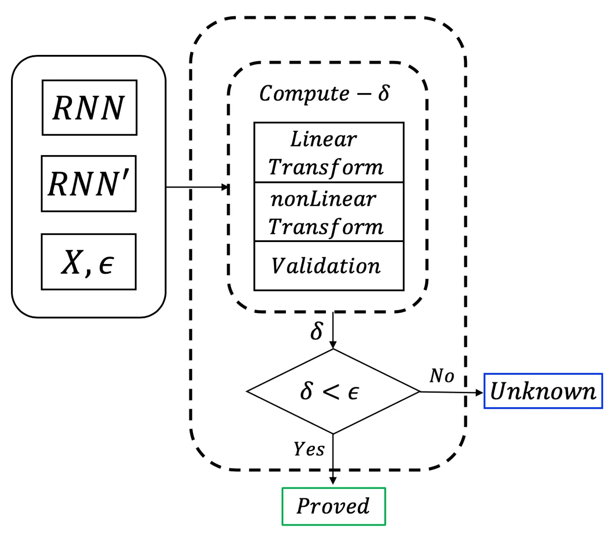
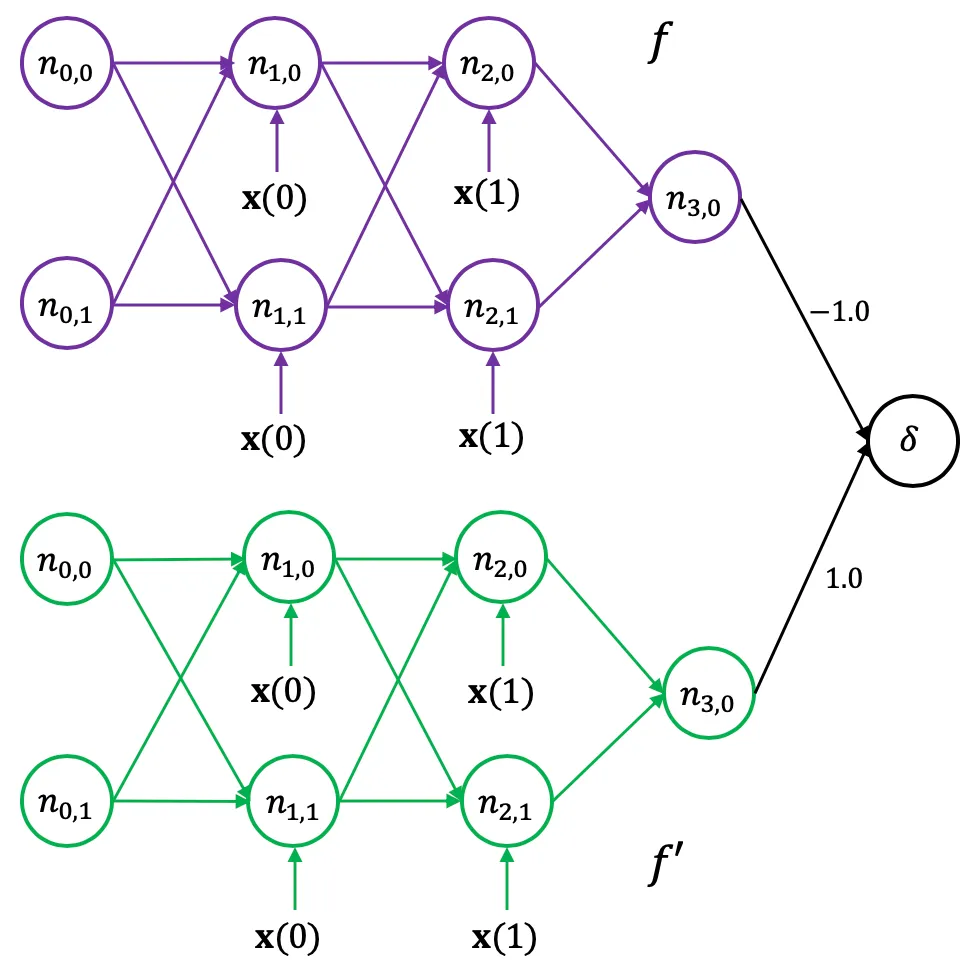
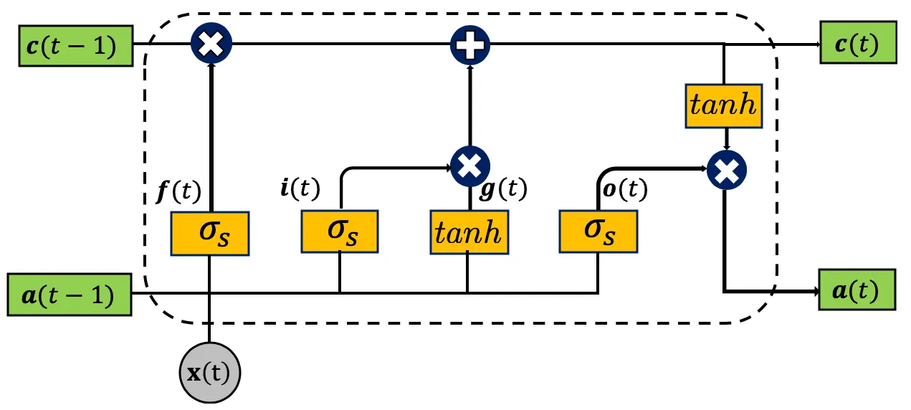
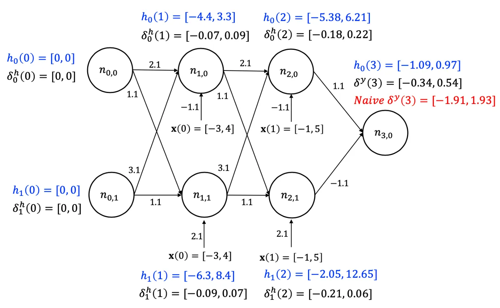
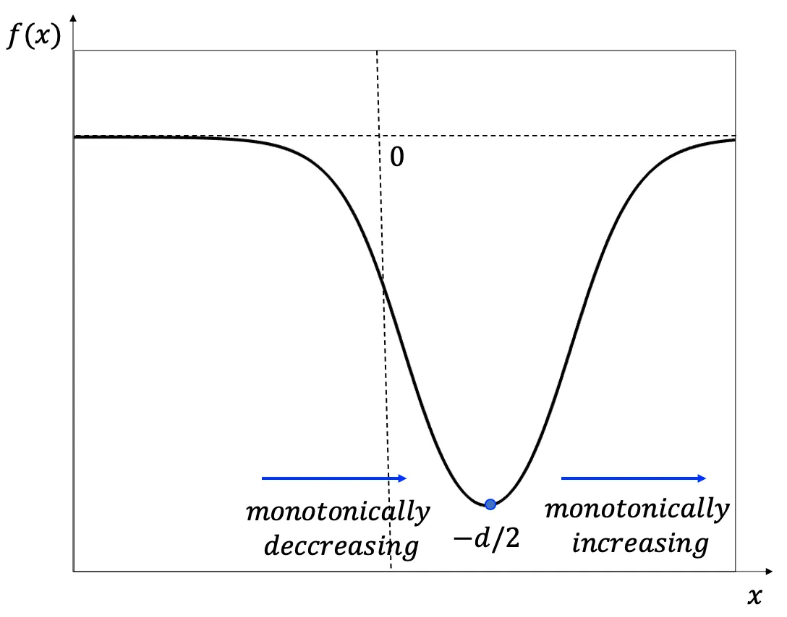
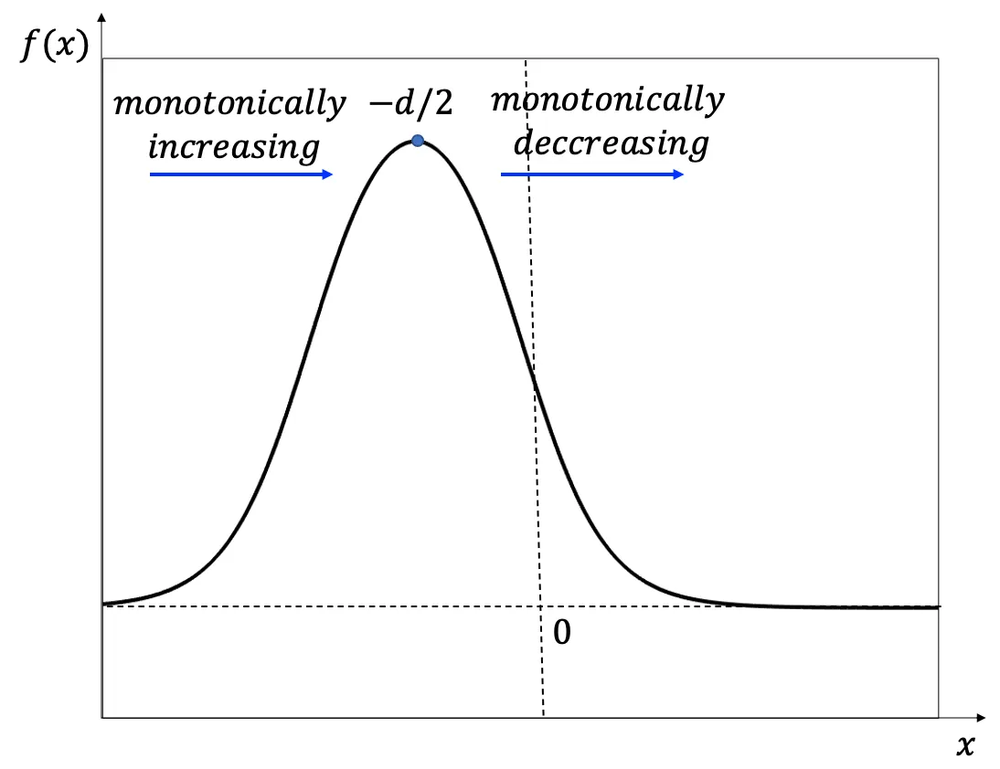
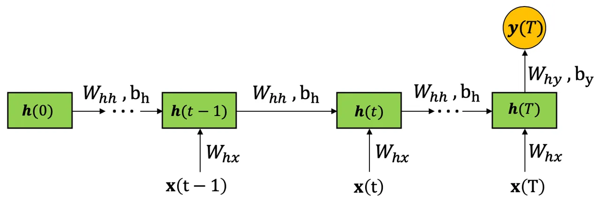

# DiffRNN: Differential Verification of Recurrent Neural Networks

Sara Mohammadinejad Affiliation: University of Southern California
Email: [saramoha@usc.edu](mailto:)    Brandon Paulsen
Affiliation: University of Southern California
Email: [bpaulsen@usc.edu](mailto:)    Chao Wang Affiliation: University
of Southern California Email: [wang626@usc.edu](mailto:)    Jyotirmoy V.
Deshmukh Affiliation: University of Southern California
Email: [jdeshmuk@usc.edu](mailto:)

###### Abstract

Recurrent neural networks (RNNs) such as Long Short Term Memory (LSTM)
networks have become popular in a variety of applications such as image
processing, data classification, speech recognition, and as controllers
in autonomous systems. In practical settings, there is often a need to
deploy such RNNs on resource-constrained platforms such as mobile phones
or embedded devices. As the memory footprint and energy consumption of
such components become a bottleneck, there is interest in compressing
and optimizing such networks using a range of heuristic techniques.
However, these techniques do not guarantee the safety of the optimized
network, e.g., against adversarial inputs, or equivalence of the
optimized and original networks. To address this problem, we propose
DiffRNN, the first differential verification method for RNNs to certify
the equivalence of two structurally similar neural networks. Existing
work on differential verification for _ReLU_-based feed-forward neural
networks does not apply to RNNs where nonlinear activation functions
such as _Sigmoid_ and _Tanh_ cannot be avoided. RNNs also pose unique
challenges such as handling sequential inputs, complex feedback
structures, and interactions between the gates and states. In DiffRNN,
we overcome these challenges by bounding nonlinear activation functions
with linear constraints and then solving constrained optimization
problems to compute tight bounding boxes on non-linear surfaces in a
high-dimensional space. The soundness of these bounding boxes is then
proved using the _dReal_ SMT solver. We demonstrate the practical
efficacy of our technique on a variety of benchmarks and show that
DiffRNN outperforms state-of-the-art RNN verification tools such as
Popqorn.

   

A Preprint

|     |
| --- |
|     |

August 24, 2026

## 1 Introduction

Deep neural networks, and in particular, recurrent neural networks
(RNNs), have been successfully used in a wide range of applications
including image classification, speech recognition, and natural language
processing. However, their rapid growth in safety-critical applications
such as autonomous driving \[1\] and aircraft collision avoidance \[2\]
is accompanied by safety concerns \[3\]. For example, neural networks
are known to be vulnerable to adversarial inputs \[4, 5\], which are
security exploits designed to fool the neural networks \[6, 7, 8, 9\].

In addition, trained neural networks typically go through changes before
deployment, thus raising concerns that the changes may introduce new
behaviors. Specifically, since neural networks are computationally and
memory intense, they are difficult to deploy on resource-constrained
devices \[10, 11\]. Network compression techniques (such as edge
pruning, weight quantization, and neuron removal) are often needed to
reduce the network’s size \[11\]. Compression techniques typically use
mean-squared error over sampled inputs as a performance measure to test
equivalence. Such a measure is statistical, and does not provide formal
worst-case guarantees on the deviation between behaviors of two
networks.

While there are recent efforts on applying differential testing \[12,
13, 14\] and fuzzing \[15, 16, 17\] techniques to neural networks, they
can only increase the confidence that the networks behave as expected
for some of the inputs. However, they cannot prove the equivalence of
the networks for all inputs. To the best of our knowledge,
ReluDiff \[18\] is the only tool that aims to prove the equivalence of
two neural networks for all inputs. ReluDiff takes as input two
feed-forward neural networks with piecewise linear activation functions
known as rectified linear units ( _ReLU_). The _ReLU_ activation
essentially allows the neural network to be treated as a piecewise
linear (PWL) function (with possibly many facets/pieces).

ReluDiff exploits the PWL nature of activations, and hence cannot
natively handle non-PWL activation functions like _Sigmoid_, _Tanh_, and
_ELU_, let alone the more complex operations of LSTMs, which take the
_product_ of these non-linear functions, e.g. _Sigmod_$`\times`$_Tanh_.
This poses significant limitations because popular libraries “hardcode”
_Tanh_ and _Sigmoid_ for some, or all of the activation functions in the
network. For example, Fig. 3 shows the LSTM structure hardcoded into
Tensorflow. Thus, for RNNs, we need a technique that can handle these
challenging and arbitrary nonlinearities. In addition, we face several
other unique challenges when considering RNNs, including how to _soundly
and efficiently_ handle (1) sequential inputs, (2) the complex feedback
structures, and (3) interactions between the gates and states.

To overcome these challenges, we propose DiffRNN, the first differential
verification technique for bounding the difference of two structurally
similar RNNs. Formally, given two RNNs that only differ in numerical
values of their edge weights, denoted $`\mathbf{y}=f(\mathbf{x})`$ and
$`\mathbf{y}^{\prime}=f^{\prime}(\mathbf{x})`$, where
$`\mathbf{x}\in X`$ is an input, $`X`$ is an input region of interest,
and $`\mathbf{y},\mathbf{y}^{\prime}`$ are the outputs, DiffRNN aims to
prove that
$`\forall\mathbf{x}\in X~.~|f^{\prime}(\mathbf{x})-f(\mathbf{x})|<\epsilon`$,
where $`\epsilon`$ is a reasonably small number.



Figure 1: The differential verification flow of DiffRNN. $`\delta`$ is
the difference interval, and $`\epsilon`$ is the bound on the output
differences of the compressed and original networks.

Fig. 1 shows the high-level flow of DiffRNN, whose input consists of two
networks, $`RNN`$ and $`RNN^{\prime}`$, an input region, $`X`$, and a
small difference bound $`\epsilon`$. It produces two possible outcomes:
Proved, or Unknown. Internally, DiffRNN uses symbolic interval
arithmetic to compute linear bounds on both the output values of each
network’s neurons and the _differences_ between the neurons of the two
networks. We compute these linear bounds _efficiently_ in a
layer-by-layer fashion, that is, using the bounds of the previous layer
to compute the bounds of the current layer. If the bounds on the final
output difference satisfy $`\epsilon`$, DiffRNN returns _Proved_,
otherwise it returns _Unknown_.

To compute the output difference _accurately_, we bound nonlinear
activation functions with linear constraints and then solve constrained
optimization problems to obtain tight bounding boxes on nonlinear
surfaces in a high-dimensional space. We also prove the soundness of
these bounding boxes using *dReal* \[19\], which is an off-the-shelf
_delta-sat_ SMT solver¹¹ 1 _dReal_ is implemented based on
delta-complete decision procedures; it returns either unsat or delta-sat
on the given input formulas, where delta is a user-defined error bound
\[19\]. that supports nonlinear constraints.

While one could try and adapt an existing single-network verification
tool to solve our problem, in practice, the bounds computed by this
approach are too loose, since existing tools are not designed to exploit
the relationships between neurons in two RNNs. To confirm this
observation, we constructed the following experiment. We took two
_identical_ networks $`f(\mathbf{x})`$ and $`f^{\prime}(\mathbf{x})`$,
i.e., with the same network topology and edge weights. We then
constructed a new network
$`f^{\prime\prime}(\mathbf{x})=f^{\prime}(\mathbf{x})-f(\mathbf{x})`$,
illustrated in Fig. 2. Then, we took Popqorn, a state-of-the-art RNN
verification tool, and attempted to prove
$`f^{\prime\prime}(\mathbf{x})<\epsilon`$ for all $`\mathbf{x}`$. While
Popqorn could not prove this for any $`\epsilon<2.0`$, DiffRNN could
prove it easily for any $`\epsilon>0`$.



Figure 2: Naïve differential verification of RNNs.

We have implemented our proposed method and evaluated it on a variety of
differential verification tasks involving networks for handwritten digit
recognition (MNIST) \[20\] and human activity recognition \[21\]. Our
results show that DiffRNN is efficient and effective in certifying the
functional equivalence of RNNs after compression techniques are applied.
We also compared DiffRNN with Popqorn \[22\], the state-of-the-art RNN
verification tool. Our results show that DiffRNN significantly
outperforms Popqorn \[22\]: On average DiffRNN is 2.73X more accurate
and $`60\%`$ faster.

To summarize, our main contributions are as follows:

- •
  We propose DiffRNN, a differential verification method for proving the
  functional equivalence of two structurally similar RNNs.
- •
  We develop techniques to handle the recursive nature of RNNs and
  nonlinear functions such as _Sigmoid_ and _Tanh_.
- •
  We develop techniques to handle both Vanilla RNNs and the more complex
  LSTMs.
- •
  We formally verify the soundness of our linear approximation
  techniques using _dReal_ \[19\].
- •
  We experimentally demonstrate that our method significantly
  outperforms the state-of-the-art techniques.

## 2 Background

In this section, we review the basics of recurrent neural networks
(RNNs), including Vanilla RNNs and LSTMs²² 2 Gated recurrent units
(GRUs) are structurally very similar to LSTMs, and differential
verification hurdles for GRUs are the same as LSTMs; thus, we omit
explaining GRUs in this paper for brevity., and interval bound
propagation (IBP), a technique for bounding the network’s output values
for all input values.

### 2.1 Recurrent Neural Networks

#### 2.1.1 Vanilla RNNs

A vanilla recurrent neural network is a function that maps time-indexed
input sequences to output sequences. Let $`X`$ be a compact subset of
$`\mathbb{R}^{m}`$, where $`m`$ is the number of input values at each
time step. An input sequence $`\mathbf{x}`$ is a function from time
$`\{0,1,\ldots,T\}`$ to input space $`X`$, where $`T\in\mathbb{N}`$, and
$`\mathbf{x}(j)\in X`$ denotes the $`j^{th}`$ entry in the time-indexed
input sequence. An output sequence is a similar function that maps to an
output space $`Y\subseteq\mathbb{R}^{p}`$.

The structure of a vanilla RNN is as follows. It consists of a single
layer of $`\ell`$ neurons, and its output $`\mathbf{h}`$ at time $`t`$
depends on (a) the output $`\mathbf{h}`$ at time $`t-1`$, and (b) the
input $`\mathbf{x}`$ at time $`t`$, as shown below:

```math
\displaystyle\mathbf{a}(t) \displaystyle= \displaystyle W_{\mathbf{h}\mathbf{h}}\cdot\mathbf{h}(t-1)+W_{\mathbf{h}\mathbf{x}}\cdot\mathbf{x}(t)+\mathbf{b}_{\mathbf{h}} \tag{1}
```

```math
\displaystyle\mathbf{h}(t) \displaystyle= \displaystyle\mathbf{\sigma}(\mathbf{a}(t)) \tag{2}
```

```math
\displaystyle\mathbf{y}(t) \displaystyle= \displaystyle W_{\mathbf{h}\mathbf{y}}\cdot\mathbf{h}(t)+\mathbf{b}_{\mathbf{y}} \tag{3}
```

Here, $`\mathbf{a}(t)`$ is an intermediate variable that we introduce to
represent the affine transformation of the current input
$`\mathbf{x}(t)`$ and previous state $`\mathbf{h}(t-1)`$. The weight
matrices $`W_{\mathbf{h}\mathbf{h}}`$ and $`W_{\mathbf{h}\mathbf{x}}`$
have dimensions $`\ell\times\ell`$ and $`\ell\times m`$ respectively.
The bias term $`\mathbf{b}_{\mathbf{h}}`$ is an $`\ell\times 1`$ matrix.
$`\mathbf{\sigma}`$ is the nonlinear component-wise activation function
from $`\mathbb{R}^{\ell}`$ to $`\mathbb{R}^{\ell}`$. We assume that
$`\mathbf{h}(0)`$ is a fixed initial state of the RNN at time $`0`$; it
is a vector of size $`\ell\times 1`$. Finally, the output of the RNN at
time $`t`$, $`\mathbf{y}(t)`$ is defined as a linear transformation of
$`\mathbf{h}(t)`$, using the weight matrix $`W_{\mathbf{h}\mathbf{y}}`$
and bias term $`\mathbf{b}_{\mathbf{y}}`$.

Thus, each multiplication above is a matrix multiplication, and for all
time steps $`t`$, $`\mathbf{h}(t)`$ and $`\mathbf{x}(t)`$ are $`\ell`$-
and $`m`$-length vectors, respectively. The activation function
$`\mathbf{\sigma}`$ may be the sigmoid activation
($`\mathit{\sigma_{\mathcal{S}}}`$) or the hyperbolic tangent activation
($`\tanh`$)³³ 3 For a scalar input $`u`$,
$`\mathit{\sigma_{\mathcal{S}}}(u)=\frac{e^{u}}{1+e^{u}}`$, and
$`\tanh(u)=\frac{e^{u}-e^{-u}}{e^{u}+e^{-u}}`$..

In differential verification, there is a second RNN whose parameters are
denoted by $`\mathbf{a}^{\prime}`$, $`\mathbf{h}^{\prime}`$,
$`\mathbf{y}^{\prime}`$, $`W_{\mathbf{h}\mathbf{h}}^{\prime}`$,
$`W_{\mathbf{h}\mathbf{x}}^{\prime}`$,
$`W_{\mathbf{h}\mathbf{y}}^{\prime}`$,
$`\mathbf{b}_{\mathbf{h}}^{\prime}`$ and
$`\mathbf{b}_{\mathbf{y}}^{\prime}`$ respectively. The two RNNs under
comparison are structurally similar, i.e., they only differ in the
values of the edge weights, and have the same activation functions.

We also introduce $`\bm{\delta}^{\mathbf{a}}`$,
$`\bm{\delta}^{\mathbf{h}}`$, and $`\bm{\delta}^{\mathbf{y}}`$ to
represent the differences:
$`\bm{\delta}^{\mathbf{a}}(t)=\mathbf{a}^{\prime}(t)-\mathbf{a}(t)`$,
$`\bm{\delta}^{\mathbf{h}}(t)=\mathbf{h}^{\prime}(t)-\mathbf{h}(t)`$,
and
$`\bm{\delta}^{\mathbf{y}}(t)=\mathbf{y}^{\prime}(t)-\mathbf{y}(t)`$.

A many-to-one vanilla RNN differs from the vanila RNN model shown above
in one small way. For an input sequence of length $`T`$, the output is
computed only at time $`T`$, i.e., the final output of the network is
defined as $`\mathbf{y}(T)`$ (see Fig. 6 in Appendix).

#### 2.1.2 LSTMs

Long short-term memory networks (LSTMs) were introduced to overcome the
limitation of Vanilla RNNs in learning long term sequential dependencies
\[23\]. Therefore, an LSTM is a special kind of RNN, where each LSTM
cell has four neurons that interact with each other. As shown in Fig. 3,
each LSTM cell at time step $`t`$ takes $`\mathbf{c}(t-1)`$,
$`\mathbf{h}(t-1)`$ and $`\mathbf{x}(t)`$ as input, and returns
$`\mathbf{c}(t)`$ and $`\mathbf{h}(t)`$ as output. The input
$`\mathbf{x}(t)`$, the cell state $`\mathbf{c}(t)`$, and the hidden
state $`\mathbf{h}(t)`$ are all vectors of real values. Thus, the four
_gates_ and two _states_ within each LSTM cell are evaluated as follows:

```math
\displaystyle Input\;gate:\mathbf{i}(t) \displaystyle=\mathit{\sigma_{\mathcal{S}}}(W_{\mathbf{i}\mathbf{h}}\cdot\mathbf{h}(t-1)+W_{\mathbf{i}\mathbf{x}}\cdot\mathbf{x}(t)+\mathbf{b}_{\mathbf{i}})
```

```math
\displaystyle Forget\;gate:\mathbf{f}(t) \displaystyle=\mathit{\sigma_{\mathcal{S}}}(W_{\mathbf{f}\mathbf{h}}\cdot\mathbf{h}(t-1)+W_{\mathbf{f}\mathbf{x}}\cdot\mathbf{x}(t)+\mathbf{b}_{\mathbf{f}})
```

```math
\displaystyle Cell\;gate:\mathbf{g}(t) \displaystyle=\tanh(W_{\mathbf{g}\mathbf{h}}\cdot\mathbf{h}(t-1)+W_{\mathbf{g}\mathbf{x}}\cdot\mathbf{x}(t)+\mathbf{b}_{\mathbf{g}})
```

```math
\displaystyle Output\;gate:\mathbf{o}(t) \displaystyle=\mathit{\sigma_{\mathcal{S}}}(W_{\mathbf{o}\mathbf{h}}\cdot\mathbf{h}(t-1)+W_{\mathbf{o}\mathbf{x}}\cdot\mathbf{x}(t)+\mathbf{b}_{\mathbf{o}})
```

```math
\displaystyle Cell\;state:\mathbf{c}(t) \displaystyle=\mathbf{f}(t)\odot\mathbf{c}(t-1)+\mathbf{i}(t)\odot\mathbf{g}(t)
```

```math
\displaystyle Hidden\;state:\mathbf{h}(t) \displaystyle=\mathbf{o}(t)\odot\tanh(\mathbf{c}(t))
```

```math
\displaystyle Output:\mathbf{y}(t) \displaystyle=W_{\mathbf{h}\mathbf{y}}\cdot\mathbf{h}(t)+\mathbf{b}_{\mathbf{y}}
```

Here, $`\odot`$ stands for Hadamard product (element-wise
multiplication). Weight matrices $`W_{\mathbf{i}\mathbf{h}}`$,
$`W_{\mathbf{f}\mathbf{h}}`$, $`W_{\mathbf{g}\mathbf{h}}`$ and
$`W_{\mathbf{o}\mathbf{h}}`$ have dimensions $`\ell\times\ell`$. Weight
matrices $`W_{\mathbf{i}\mathbf{x}}`$, $`W_{\mathbf{f}\mathbf{x}}`$,
$`W_{\mathbf{g}\mathbf{x}}`$ and $`W_{\mathbf{o}\mathbf{x}}`$ have
dimensions $`\ell\times m`$. Bias terms $`\mathbf{b}_{\mathbf{i}}`$,
$`\mathbf{b}_{\mathbf{f}}`$, $`\mathbf{b}_{\mathbf{g}}`$ and
$`\mathbf{b}_{\mathbf{o}}`$ are $`\ell\times 1`$ matrices. As before,
$`\mathit{\sigma_{\mathcal{S}}}`$ and $`\tanh`$ are the component-wise
activation functions from $`\mathbb{R}^{\ell}`$ to
$`\mathbb{R}^{\ell}`$. The input $`\mathbf{x}(t)`$ is an $`m`$-length
vector, while $`\mathbf{i}(t)`$, $`\mathbf{f}(t)`$, $`\mathbf{g}(t)`$,
$`\mathbf{o}(t)`$, $`\mathbf{c}(t)`$ and $`\mathbf{h}(t)`$ are all
$`\ell`$-length vectors.

Similarly, we use $`\mathbf{i}^{\prime}`$, $`\mathbf{f}^{\prime}`$,
$`\mathbf{g}^{\prime}`$, $`\mathbf{o}^{\prime}`$,
$`\mathbf{c}^{\prime}`$, $`\mathbf{h}^{\prime}`$ and
$`\mathbf{y}^{\prime}`$ to represent parameters of the second LSTM. We
also introduce the differences $`\bm{\delta}^{\mathbf{i}}(t)`$,
$`\bm{\delta}^{\mathbf{f}}(t)`$, $`\bm{\delta}^{\mathbf{g}}(t)`$,
$`\bm{\delta}^{\mathbf{o}}(t)`$, $`\bm{\delta}^{\mathbf{c}}(t)`$ and
$`\bm{\delta}^{\mathbf{h}}(t)`$ as vectors of size $`\ell\times 1`$: For
each
$`\mathbf{v}\in{\mathbf{i},\mathbf{f},\mathbf{g},\mathbf{o},\mathbf{c},\mathbf{h}}`$,
we have
$`\bm{\delta}^{\mathbf{v}}(t)=\mathbf{v}^{\prime}(t)-\mathbf{v}(t)`$.



Figure 3: An LSTM cell.

### 2.2 Interval Bound Propagation (IBP)

To soundly compute the output values of a neural network for all input
values, we represent these values as intervals, and use interval
arithmetic to compute their bounds.

#### 2.2.1 Linear Operations

Given two intervals, e.g., $`p\in[a,b]`$ and $`q\in[c,d]`$, the
resulting intervals of linear operations such as addition ($`p+q`$),
subtraction ($`p-q`$), and scaling ($`p\cdot c`$, where $`c`$ is a
constant) are well defined. That is,

```math
\displaystyle[a,b]+[c,d]=[a+c,b+d]
```

```math
\displaystyle[a,b]-[c,d]=[a-d,b-c]
```

```math
\displaystyle[a,b]\cdot c=\begin{cases}[a\cdot c,b\cdot c],&c\geq 0\\
[b\cdot c,a\cdot c],&c<0\end{cases}
```

While the results are sound over-approximations, they may be overly
conservative. For example, when $`p=5x`$, $`q=4x`$ and $`x\in[-1,1]`$,
since $`p-q=5x-4x=x`$, we know that $`(p-q)\in[-1,1]`$, but interval
subtraction returns $`(p-q)=[-5,5]-[-4,4]=[-5-4,5-(-4)]=[-9,9]`$.

A technique for improving accuracy is the use of symbolic inputs. For
example, instead of using the concrete intervals $`p\in[-5,5]`$ and
$`q\in[-4,4]`$, we may use the symbolic upper and lower bounds
$`p\in[5x,5x]`$ and $`q\in[4x,4x]`$, leading to
$`(p-q)=[5x-4x,5x-4x]=[x,x]`$. As a result, we have $`(p-q)=[-1,1]`$
after concertizing the symbolic bounds.

In this work, we represent the _symbolic_ lower and upper bounds of
$`p`$ as $`L(p)`$ and $`U(p)`$, and the concrete lower and upper bounds
as $`\underline{p}`$ and $`\overline{p}`$, respectively.

#### 2.2.2 Non-linear Operations

Sound intervals may also be defined for outputs of _Sigmoid_
($`\mathit{\sigma_{\mathcal{S}}}`$) and _Tanh_ ($`\tanh`$) activation
functions. Since both functions are _monotonically increasing_, given a
concrete input interval $`p=[a,b]`$, we have
$`\sigma(p)\in[\sigma(a),\sigma(b)]`$. However, for a symbolic input
interval, soundly approximating the output is challenging. In an
existing verification tool named Crown \[24\], e.g., this is solved by
computing linear bounds on the output of each activation function. For
LSTMs, the problem is even more challenging because it involves the
_product_ of nonlinear operations, such as
$`z=\mathit{\sigma_{\mathcal{S}}}(x)\cdot\tanh(y)`$ and
$`z=x\cdot\mathit{\sigma_{\mathcal{S}}}(y)`$. In Popqorn \[22\], for
example, the output is bounded by searching for linear bounding planes
of the form $`\alpha x+\beta y+\gamma`$, where $`\alpha,\beta`$ and
$`\gamma`$ are computed using gradient descent.

In this work, we build upon techniques from Crown and Popqorn for
bounding the output _values_ of network $`f`$’s neurons, to solve the
new problem of bounding the differences between two networks $`f`$ and
$`f^{\prime}`$.

## 3 Overview

In this section, we use an example to illustrate the high-level idea of
our method and the shortcomings of state-of-the-art single-network
verification techniques for differential verification.



Figure 4: Interval analysis of a recurrent neural network with Sigmoid
activation function.

Fig. 4 shows a _many-to-1_ Vanilla RNN, $`f`$, where all neurons use the
_Sigmoid_ activation. The entire RNN has 1 hidden layer of 2 neurons,
receives a sequence of 2 inputs, and returns a single output. For ease
of presentation, the unrolled version of this RNN is shown in Fig. 4 for
an input sequence of length 2. Thus, $`n_{t,i}`$ denotes the $`i^{th}`$
node in the $`t^{th}`$ sequence (time step). The initial values in
$`\mathbf{h}(0)`$ and $`\bm{\delta}^{\mathbf{h}}(0)`$ are set to 0. The
goal is to bound $`\bm{\delta}^{\mathbf{y}}(3)`$, the difference between
outputs of the original RNN $`f`$ and a modified RNN $`f^{\prime}`$;
here,
$`\bm{\delta}^{\mathbf{y}}(3)=|f^{\prime}(\mathbf{x}(0),\mathbf{x}(1))-f(\mathbf{x}(0),\mathbf{x}(1))|`$.
In this example, the second RNN, $`f^{\prime}`$, is derived from the
original RNN $`f`$ by rounding its edge weights to the nearest whole
numbers.

The naïve approach is to leverage an existing verification tool such as
Popqorn \[22\], originally designed to quantify the robustness of a
single RNN. As shown for the network in Fig.  2, we can use Popqorn to
bound the output of the combined network. For our running example, the
bounds computed by Popqorn are
$`\bm{\delta}^{\mathbf{y}}(3)=[-1.91,1.93]`$. However, as our analysis
shows in this paper, the bounds are overly conservative. The reason is
because, to soundly compute the difference
$`\bm{\delta}^{\mathbf{y}}(3)=[f^{\prime}_{low},f^{\prime}_{up}]-[f_{low},f_{up}]=[f^{\prime}_{low}-f_{up},f^{\prime}_{up}-f_{low}]`$,
Popqorn has to introduce significant approximation error.

DiffRNN, in contrast, overcomes this problem by pairing neurons and
edges of the first network with their counterparts of the second
network, and directly computing the difference intervals layer by layer.
By directly computing the differences as opposed to the output bounds of
the corresponding neurons, we hope to obtain much tighter bounds.
However, there are unique challenges in directly bounding the
differences. While bounding the non-linear activation function
$`y=\sigma(x)`$ for a single neuron is relatively easy \[24\], doing so
for a pair of neurons at the same time is more difficult because we must
bound $`z=\sigma(x^{\prime})-\sigma(x)`$, which involves two variables.
While we could bound the individual terms $`\sigma(x^{\prime})`$ and
$`\sigma(x)`$, and then subtract their bounds, doing so introduces too
much approximation error.

To solve the problem, we propose the following new technique. First, we
rewrite the difference as $`z=\sigma(x+\delta_{x})-\sigma(x)`$, where
$`x`$ is the value of neuron’s output in network $`f`$ and
$`\delta_{x}=(x^{\prime}-x)`$ is the difference between the outputs of
two corresponding neurons in $`f`$ and $`f^{\prime}`$. Given the
intervals of $`x`$ and $`\delta_{x}`$, we then examine all possible
combinations of their upper and lower bounds, and match these
combinations with a set of pre-defined patterns, to soundly compute the
interval of $`z`$.

For LSTMs, directly bounding the difference
$`z=x^{\prime}\cdot\mathit{\sigma_{\mathcal{S}}}(x^{\prime})-x\cdot\mathit{\sigma_{\mathcal{S}}}(x)`$
or
$`z=\tanh(x^{\prime})\cdot\mathit{\sigma_{\mathcal{S}}}(x^{\prime})-\tanh(x)\cdot\mathit{\sigma_{\mathcal{S}}}(x)`$
is even more challenging. To the best of our knowledge, no existing
verification tool for neural networks can compute tight linear bounds
for such functions. Our solution is to formulate them as constrained
optimization problems and solve these problems using global optimization
tools \[25\]. In addition, we prove the soundness of these bounds using
_dReal_, an off-the-shelf _delta-sat_ SMT solver that supports nonlinear
constraints.

For the running example, our method would be able to compute the bounds
$`\bm{\delta}^{\mathbf{y}}(3)=[-0.34,0.54]`$, which is more than 3X
tighter than the bounds computed by Popqorn. The complete results of our
experimental comparison with Popqorn will be presented in Section .

## 4 Directly Computing the Difference Interval

Our method for verifying Vanilla RNNs is shown in Algorithm 1. It takes
two networks $`f`$ and $`f^{\prime}`$, the input region $`X`$, and a
small $`\epsilon`$ as input. After initializing the hidden state and the
difference interval, it computes $`\mathbf{h}(t)`$ and
$`\bm{\delta}^{\mathbf{h}}(t)`$ of the subsequent layers by applying the
affine transformation (i.e., multiplying by the edge weights) followed
by performing the non-linear transformation, whose details will be
presented in Algo. 2. This is repeated layber by layer, until the output
layer is reached. In the end, it computes the final difference interval
from $`\bm{\delta}^{\mathbf{h}}(T)`$ and $`\mathbf{h}(T)`$. As mentioned
earlier, we leverage the existing tool Popqorn \[22\] to compute the
intervals $`\mathbf{h}(t)`$, while focusing on computing tight bounds on
the differences $`\bm{\delta}^{\mathbf{a}}(t)`$ and
$`\bm{\delta}^{\mathbf{h}}(t)`$.

Input: network f, network $`f^{\prime}`$, input region X

Output: $`\bm{\delta}^{\mathbf{y}}(T)`$

1 Init: Initialize $`[L(\mathbf{h}(0)),U(\mathbf{h}(0))]`$ and
$`[\underline{\bm{\delta}^{\mathbf{h}}}(0),\overline{\bm{\delta}^{\mathbf{h}}}(0)]`$
to 0

2 for _$`t`$ : 1 to $`T`$_ do

   // affine transformer

    3 Compute $`[L(\mathbf{a}(t)),U(\mathbf{a}(t))]`$ and
$`[\underline{\bm{\delta}^{\mathbf{a}}}(t),\overline{\bm{\delta}^{\mathbf{a}}}(t)]`$;

   // nonlinear transformer (Algo. 2)

    4 Compute $`[L(\mathbf{h}(t)),U(\mathbf{h}(t))]`$ and
$`[\underline{\bm{\delta}^{\mathbf{h}}}(t),\overline{\bm{\delta}^{\mathbf{h}}}(t)]`$;

5 Compute
$`[\underline{\bm{\delta}^{\mathbf{y}}}(T),\overline{\bm{\delta}^{\mathbf{y}}}(T)]`$;

Algorithm 1 Differential Verification of Vanilla RNNs.

### 4.1 Affine Transformer

For Vanilla RNNs, the affine transformation computes each
$`\bm{\delta}^{\mathbf{a}}(t)`$ in two parts. The first part is caused
by the differences between the edge weights in
$`W_{\mathbf{h}\mathbf{x}}`$, denoted
$`W_{\mathbf{h}\mathbf{x}}^{\Delta}`$, for edges connecting the current
input to neurons:

```math
\displaystyle\bm{\delta_{t}}(W_{\mathbf{h}\mathbf{x}}) \displaystyle=W_{\mathbf{h}\mathbf{x}}^{\prime}\cdot\mathbf{x}(t)-W_{\mathbf{h}\mathbf{x}}\cdot\mathbf{x}(t)
```

```math
\displaystyle=W_{\mathbf{h}\mathbf{x}}^{\Delta}\cdot\mathbf{x}(t)
```

The second part is caused by the differences between the edge weigths in
$`W_{\mathbf{h}\mathbf{h}}`$, denoted
$`W_{\mathbf{h}\mathbf{h}}^{\Delta}`$, for edges connecting the previous
hidden states to current hidden states, as well as the differences
included in the previous hidden states, denoted
$`\bm{\delta}^{\mathbf{h}}(t-1)`$.

```math
\displaystyle\bm{\delta_{t}}(W_{\mathbf{h}\mathbf{h}}) \displaystyle=W_{\mathbf{h}\mathbf{h}}^{\prime}\cdot\mathbf{h}^{\prime}(t-1)-W_{\mathbf{h}\mathbf{h}}\cdot\mathbf{h}(t-1)
```

Adding $`W_{\mathbf{h}\mathbf{h}}^{\prime}\cdot\mathbf{h}(t-1)`$ to the
first term and subtracting it from the second term, we get:

```math
\displaystyle\bm{\delta_{t}}(W_{\mathbf{h}\mathbf{h}}) \displaystyle=W_{\mathbf{h}\mathbf{h}}^{\prime}\cdot\mathbf{h}^{\prime}(t-1)-W_{\mathbf{h}\mathbf{h}}\cdot\mathbf{h}(t-1)
```

```math
\displaystyle+({\color[rgb]{1,0,0}W_{\mathbf{h}\mathbf{h}}^{\prime}\cdot\mathbf{h}(t-1)-W_{\mathbf{h}\mathbf{h}}^{\prime}\cdot\mathbf{h}(t-1)})
```

```math
\displaystyle=(W_{\mathbf{h}\mathbf{h}}^{\prime}\cdot\mathbf{h}^{\prime}(t-1)-{\color[rgb]{1,0,0}W_{\mathbf{h}\mathbf{h}}^{\prime}\cdot\mathbf{h}(t-1)})
```

```math
\displaystyle+({\color[rgb]{1,0,0}W_{\mathbf{h}\mathbf{h}}^{\prime}\cdot\mathbf{h}(t-1)}-W_{\mathbf{h}\mathbf{h}}\cdot\mathbf{h}(t-1))
```

```math
\displaystyle=W_{\mathbf{h}\mathbf{h}}^{\prime}\cdot\bm{\delta}^{\mathbf{h}}(t-1)+W_{\mathbf{h}\mathbf{h}}^{\Delta}\cdot\mathbf{h}(t-1)
```

$`\bm{\delta}^{\mathbf{a}}(t)`$ is then the sum of these two parts:

```math
\displaystyle\bm{\delta}^{\mathbf{a}}(t) \displaystyle=\bm{\delta_{t}}(W_{\mathbf{h}\mathbf{x}})+\bm{\delta_{t}}(W_{\mathbf{h}\mathbf{h}})
```

For LSTMs, the high-level verification procedure is similar to Algo. 1
and is formalized in Algo. 3 in Appendix. The differences for gate
$`\bm{v}\in\{\mathbf{i},\mathbf{f},\mathbf{g},\mathbf{o}\}`$ within each
LSTM cell is computed as follows:
$`\bm{\delta}^{\bm{v}}(t)=\bm{\delta_{t}}(W_{\bm{v}\mathbf{x}})+\bm{\delta_{t}}(W_{\bm{v}\mathbf{h}})`$.

### 4.2 Nonlinear Transformer

Vanilla RNN. Here, we define the activation function transformations to
compute $`\bm{\delta}^{\mathbf{h}}(t)`$ from
$`\bm{\delta}^{\mathbf{a}}(t)`$. We do so by rewriting the following
equation, using the definition of $`\bm{\delta}^{\mathbf{h}}(t)`$:

```math
\displaystyle\bm{\delta}^{\mathbf{h}}(t) \displaystyle=\mathbf{h}^{\prime}(t)-\mathbf{h}(t)
```

```math
\displaystyle=\sigma(\mathbf{a}^{\prime}(t))-\sigma(\mathbf{a}(t))
```

```math
\displaystyle=\sigma(\mathbf{a}(t)+\bm{\delta}^{\mathbf{a}}(t))-\sigma(\mathbf{a}(t))
```

where $`\sigma`$ is the nonlinear activation function. While
ReluDiff \[18\] solves this problem for $`\sigma=ReLU`$, by exploiting
the piece-wise linearity of $`ReLU`$, we propose new techniques for
$`\sigma=Sigmoid`$ or $`Tanh`$, as well as composite nonlinear
operations built upon them. Note that the technique can be used for
other types of monotonic functions as well.

To obtain the tightest linear bounds on $`\bm{\delta}^{\mathbf{h}}(t)`$,
we formulate this problem as two optimization problems:

```math
\displaystyle\underline{\bm{\delta}^{\mathbf{h}}}(t)= \displaystyle\underset{\mathbf{a}(t),\bm{\delta}^{\mathbf{a}}(t)}{\text{minimize}} \displaystyle\mathit{\sigma_{\mathcal{S}}}(\mathbf{a}(t)+\bm{\delta}^{\mathbf{a}}(t))-\mathit{\sigma_{\mathcal{S}}}(\mathbf{a}(t))
```

```math
\displaystyle\text{subject to} \displaystyle\mathbf{a}(t)\in[\underline{\mathbf{a}}(t),\overline{\mathbf{a}}(t)],\;\bm{\delta}^{\mathbf{a}}(t)\in[\underline{\bm{\delta}^{\mathbf{a}}}(t),\overline{\bm{\delta}^{\mathbf{a}}}(t)]
```

```math
\displaystyle\overline{\bm{\delta}^{\mathbf{h}}}(t)= \displaystyle\underset{\mathbf{a}(t),\bm{\delta}^{\mathbf{a}}(t)}{\text{maximize}} \displaystyle\mathit{\sigma_{\mathcal{S}}}(\mathbf{a}(t)+\bm{\delta}^{\mathbf{a}}(t))-\mathit{\sigma_{\mathcal{S}}}(\mathbf{a}(t))
```

```math
\displaystyle\text{subject to} \displaystyle\mathbf{a}(t)\in[\underline{\mathbf{a}}(t),\overline{\mathbf{a}}(t)],\;\bm{\delta}^{\mathbf{a}}(t)\in[\underline{\bm{\delta}^{\mathbf{a}}}(t),\overline{\bm{\delta}^{\mathbf{a}}}(t)]
```

These are two-variable optimization problems of the form
$`f(x,d)=\mathit{\sigma_{\mathcal{S}}}(x+d)-\mathit{\sigma_{\mathcal{S}}}(x)`$,
which are expensive to solve at run time. To reduce the computational
cost, we propose to reduce them first to single-variable optimization
problems, by leveraging the fact that $`f(x,d)`$ is monotonic with
respect to $`d`$. Our goal is to compute the maximum and minimum of
$`f(x,d)=\mathit{\sigma_{\mathcal{S}}}(x+d)-\mathit{\sigma_{\mathcal{S}}}(x)`$,
where $`x\in[x_{l},x_{u}]`$ and $`d\in[d_{l},d_{u}]`$. Due to the
monotonicity of $`f(x,d)`$ with respect to $`d`$, we know that the
minimum always occurs when $`d=d_{l}`$ and the maximum occurs when
$`d=d_{u}`$. Thus, the problem is reduced to finding the maximum and
minimum of $`f(x,d)`$ for a fixed $`d=d_{l}`$ or $`d=d_{u}`$.

Depending on the actual value of $`d`$ being either positive or
negative, the function $`f(x,d)`$ will be one of the two forms
illustrated in Fig. 5.



(a) $`d<0`$



(b) $`d\geq 0`$

Figure 5:
$`f(x)=\mathit{\sigma_{\mathcal{S}}}(x+d)-\mathit{\sigma_{\mathcal{S}}}(x)`$.
(5(a)) shows $`f(x)`$ for $`d<0`$ and (5(b)) shows $`f(x)`$ for
$`d\geq 0`$.

Thus, to compute the minimum of $`f(x,d)`$, there are three cases to
consider when $`d_{l}`$ is positive, and another three cases to consider
when $`d_{l}`$ is negative. For instance, when $`d_{l}\leq 0`$
(Fig. 5(a)), if $`x_{l}\leq x_{u}\leq-d_{l}/2`$, since $`f(x,d_{l})`$ is
monotonically decreasing in this region, we have
$`\min(f(x,d_{l}))=f(x_{u},d_{l})`$; if $`x_{l}\leq-d_{l}/2\leq x_{u}`$,
we have $`\min(f(x,d_{l}))=f(-d_{l}/2,d_{l})`$; and if
$`-d_{l}/2\leq x_{l}\leq x_{u}`$ (monotonically increasing), we have
$`\min(f(x,d_{l}))=f(x_{l},d_{l})`$. The main advantage is that, by
plugging in the bounds of $`x`$ and $`d`$, we get the bounds of
$`f(x,d)`$ immediately, without the need to solve any optimization
problem at run time.

To compute $`\underline{\bm{\delta}^{\mathbf{h}}}(t)`$ and
$`\overline{\bm{\delta}^{\mathbf{h}}}(t)`$, there are 12 cases in total,
the details of which are formalized in Algo. 2. For $`Tanh`$
($`\tanh`$), the 12 cases are exactly the same as those for $`Sigmoid`$
($`\mathit{\sigma_{\mathcal{S}}}`$); thus, we omit them for brevity⁴⁴ 4
For non-monotonic activation functions we can compute the maximum and
minimum using off-the-shelf global optimization tools and then validate
the computed bounds using SMT solvers..

Input: value $`[L(\mathbf{a}(t)),U(\mathbf{a}(t))]`$, difference
$`[\underline{\bm{\delta}^{\mathbf{a}}}(t),\overline{\bm{\delta}^{\mathbf{a}}}(t)]`$

Output: value $`[L(\mathbf{h}(t)),U(\mathbf{h}(t))]`$, difference
$`[\underline{\bm{\delta}^{\mathbf{h}}}(t),\overline{\bm{\delta}^{\mathbf{h}}}(t)]`$

// Computing $`\mathbf{h}(t)`$

// Using a previous work Popqorn

1 $`[L(\mathbf{h}(t)),U(\mathbf{h}(t))]`$ =
Popqorn.NonLinearTransformer($`[L(\mathbf{a}(t)),U(\mathbf{a}(t))]`$);
// Computing $`\underline{\bm{\delta}^{\mathbf{h}}}(t)`$

2 if _$`\underline{\bm{\delta}^{\mathbf{a}}}(t)\geq 0`$_ then

3     4

    5 if
_$`\overline{\mathbf{a}}(t)\leq-\underline{\bm{\delta}^{\mathbf{a}}}(t)/2`$_
then

6        7
$`\underline{\bm{\delta}^{\mathbf{h}}}(t)=\mathit{\sigma_{\mathcal{S}}}(\underline{\mathbf{a}}(t)+\underline{\bm{\delta}^{\mathbf{a}}}(t))-\mathit{\sigma_{\mathcal{S}}}(\underline{\mathbf{a}}(t))`$;

    8 else if
_$`\underline{\mathbf{a}}(t)\geq-\underline{\bm{\delta}^{\mathbf{a}}}(t)/2`$_
then

       9
$`\underline{\bm{\delta}^{\mathbf{h}}}(t)=\mathit{\sigma_{\mathcal{S}}}(\overline{\mathbf{a}}(t)+\underline{\bm{\delta}^{\mathbf{a}}}(t))-\mathit{\sigma_{\mathcal{S}}}(\overline{\mathbf{a}}(t))`$;

    10 else

       11
$`a=\mathit{\sigma_{\mathcal{S}}}(\overline{\mathbf{a}}(t)+\underline{\bm{\delta}^{\mathbf{a}}}(t))-\mathit{\sigma_{\mathcal{S}}}(\overline{\mathbf{a}}(t))`$;

       12
$`b=\mathit{\sigma_{\mathcal{S}}}(\underline{\mathbf{a}}(t)+\underline{\bm{\delta}^{\mathbf{a}}}(t))-\mathit{\sigma_{\mathcal{S}}}(\underline{\mathbf{a}}(t))`$;

       13 $`\underline{\bm{\delta}^{\mathbf{h}}}(t)=\min(a,b)`$;

14 else

15     16

    17 if
_$`\overline{\mathbf{a}}(t)\leq-\underline{\bm{\delta}^{\mathbf{a}}}(t)/2`$_
then

18        19
$`\underline{\bm{\delta}^{\mathbf{h}}}(t)=\mathit{\sigma_{\mathcal{S}}}(\overline{\mathbf{a}}(t)+\underline{\bm{\delta}^{\mathbf{a}}}(t))-\mathit{\sigma_{\mathcal{S}}}(\overline{\mathbf{a}}(t))`$;

    20 else if
_$`\underline{\mathbf{a}}(t)\geq-\underline{\bm{\delta}^{\mathbf{a}}}(t)/2`$_
then

       21
$`\underline{\bm{\delta}^{\mathbf{h}}}(t)=\mathit{\sigma_{\mathcal{S}}}(\underline{\mathbf{a}}(t)+\underline{\bm{\delta}^{\mathbf{a}}}(t))-\mathit{\sigma_{\mathcal{S}}}(\underline{\mathbf{a}}(t))`$;

    22 else

       23
$`\underline{\bm{\delta}^{\mathbf{h}}}(t)=\mathit{\sigma_{\mathcal{S}}}(-\underline{\bm{\delta}^{\mathbf{a}}}(t)/2+\underline{\bm{\delta}^{\mathbf{a}}}(t))-\mathit{\sigma_{\mathcal{S}}}(-\underline{\bm{\delta}^{\mathbf{a}}}(t)/2)`$;

// Computing $`\overline{\bm{\delta}^{\mathbf{h}}}(t)`$

24 if _$`\overline{\bm{\delta}^{\mathbf{a}}}(t)\geq 0`$_ then

25     26

    27 if
_$`\overline{\mathbf{a}}(t)\leq-\overline{\bm{\delta}^{\mathbf{a}}}(t)/2`$_
then

28        29
$`\overline{\bm{\delta}^{\mathbf{h}}}(t)=\mathit{\sigma_{\mathcal{S}}}(\overline{\mathbf{a}}(t)+\overline{\bm{\delta}^{\mathbf{a}}}(t))-\mathit{\sigma_{\mathcal{S}}}(\overline{\mathbf{a}}(t))`$;

    30 else if
_$`\underline{\mathbf{a}}(t)\geq-\overline{\bm{\delta}^{\mathbf{a}}}(t)/2`$_
then

       31
$`\overline{\bm{\delta}^{\mathbf{h}}}(t)=\mathit{\sigma_{\mathcal{S}}}(\underline{\mathbf{a}}(t)+\overline{\bm{\delta}^{\mathbf{a}}}(t))-\mathit{\sigma_{\mathcal{S}}}(\underline{\mathbf{a}}(t))`$;

    32 else

       33
$`\overline{\bm{\delta}^{\mathbf{h}}}(t)=\mathit{\sigma_{\mathcal{S}}}(-\overline{\bm{\delta}^{\mathbf{a}}}(t)/2+\overline{\bm{\delta}^{\mathbf{a}}}(t))-\mathit{\sigma_{\mathcal{S}}}(-\overline{\bm{\delta}^{\mathbf{a}}}(t)/2)`$;

34 else

35     36

    37 if
_$`\overline{\mathbf{a}}(t)\leq-\overline{\bm{\delta}^{\mathbf{a}}}(t)/2`$_
then

38        39
$`\overline{\bm{\delta}^{\mathbf{h}}}(t)=\mathit{\sigma_{\mathcal{S}}}(\underline{\mathbf{a}}(t)+\overline{\bm{\delta}^{\mathbf{a}}}(t))-\mathit{\sigma_{\mathcal{S}}}(\underline{\mathbf{a}}(t))`$;

    40 else if
_$`\underline{\mathbf{a}}(t)\geq-\overline{\bm{\delta}^{\mathbf{a}}}(t)/2`$_
then

       41
$`\overline{\bm{\delta}^{\mathbf{h}}}(t)=\mathit{\sigma_{\mathcal{S}}}(\overline{\mathbf{a}}(t)+\overline{\bm{\delta}^{\mathbf{a}}}(t))-\mathit{\sigma_{\mathcal{S}}}(\overline{\mathbf{a}}(t))`$;

    42 else

       43
$`a=\mathit{\sigma_{\mathcal{S}}}(\overline{\mathbf{a}}(t)+\overline{\bm{\delta}^{\mathbf{a}}}(t))-\mathit{\sigma_{\mathcal{S}}}(\overline{\mathbf{a}}(t))`$;

       44
$`b=\mathit{\sigma_{\mathcal{S}}}(\underline{\mathbf{a}}(t)+\overline{\bm{\delta}^{\mathbf{a}}}(t))-\mathit{\sigma_{\mathcal{S}}}(\underline{\mathbf{a}}(t))`$;

       45 $`\overline{\bm{\delta}^{\mathbf{h}}}(t)=\max(a,b)`$;

Algorithm 2 Over-approximating Non-linear Activation.

The final difference interval for Vanilla RNNs is computed from
$`\bm{\delta}^{\mathbf{h}}(T)`$ and $`\mathbf{h}(T)`$ as follows:

```math
\bm{\delta}^{\mathbf{y}}=W_{\mathbf{h}\mathbf{y}}^{\prime}\cdot\bm{\delta}^{\mathbf{h}}(T)+W_{\mathbf{h}\mathbf{y}}^{\Delta}\cdot\mathbf{h}(T)
```

LSTM. Next, we consider computing $`\bm{\delta}^{\mathbf{h}}(t)`$ for
LSTMs. First, we need to compute $`\bm{\delta}^{\mathbf{c}}(t)`$. In the
following computations, we add underscore “$`in`$” to denote the value
of each variable after the affine transform but before the nonlinear
activation. Based on the definition of $`\bm{\delta}^{\mathbf{c}}(t)`$,
we have

```math
\displaystyle\bm{\delta}^{\mathbf{c}}(t)=\mathbf{c}^{\prime}(t)-\mathbf{c}(t) \tag{4}
```

,where $`\mathbf{c}^{\prime}(t)`$ and $`\mathbf{c}(t)`$ are intervals of
the cell states for $`t^{th}`$ sequence. Based on the definition of the
cell state, we have

```math
\displaystyle\mathbf{c}^{\prime}(t) \displaystyle=\mathit{\sigma_{\mathcal{S}}}(\mathbf{f}^{\prime}_{\bm{in}}(t))\odot\mathbf{c}^{\prime}(t-1)+\mathit{\sigma_{\mathcal{S}}}(\mathbf{i}^{\prime}_{\bm{in}}(t))\odot\tanh(\mathbf{g}^{\prime}_{\bm{in}}(t))
```

```math
\displaystyle\mathbf{c}(t) \displaystyle=\mathit{\sigma_{\mathcal{S}}}(\mathbf{f}_{\bm{in}}(t))\odot\mathbf{c}(t-1)+\mathit{\sigma_{\mathcal{S}}}(\mathbf{i}_{\bm{in}}(t))\odot\tanh(\mathbf{g}_{\bm{in}}(t))
```

After replacing the above equation for $`\mathbf{c}^{\prime}(t)`$ and
$`\mathbf{c}(t)`$ in (4) and simplification, we have

```math
\displaystyle\bm{\delta}^{\mathbf{c}}(t) \displaystyle=\mathit{\sigma_{\mathcal{S}}}(\mathbf{f}^{\prime}_{\bm{in}}(t))\odot\mathbf{c}^{\prime}(t-1)-\mathit{\sigma_{\mathcal{S}}}(\mathbf{f}_{\bm{in}}(t))\odot\mathbf{c}(t-1)
```

```math
\displaystyle+\mathit{\sigma_{\mathcal{S}}}(\mathbf{i}^{\prime}_{\bm{in}}(t))\odot\tanh(\mathbf{g}^{\prime}_{\bm{in}}(t))-\mathit{\sigma_{\mathcal{S}}}(\mathbf{i}_{\bm{in}}(t))\odot\tanh(\mathbf{g}_{\bm{in}}(t)),
```

where each variable is an interval. Since the above equation contains
eight variables, manually enumerating all possible solutions at the
design time is practically infeasible. Thus, we have to compute them at
run time. To make the problem tractable, we divide
$`\bm{\delta}^{\mathbf{c}}(t)`$ into two parts, each with four
variables, and optimize them independently. We define the two parts as
follows:

```math
\displaystyle\bm{\delta}^{\mathbf{c}}_{1}(t) \displaystyle=\mathit{\sigma_{\mathcal{S}}}(\mathbf{f}^{\prime}_{\bm{in}}(t))\odot\mathbf{c}^{\prime}(t-1)-\mathit{\sigma_{\mathcal{S}}}(\mathbf{f}_{\bm{in}}(t))\odot\mathbf{c}(t-1)
```

```math
\displaystyle\bm{\delta}^{\mathbf{c}}_{2}(t) \displaystyle=\mathit{\sigma_{\mathcal{S}}}(\mathbf{i}^{\prime}_{\bm{in}}(t))\odot\tanh(\mathbf{g}^{\prime}_{\bm{in}}(t))-\mathit{\sigma_{\mathcal{S}}}(\mathbf{i}_{\bm{in}}(t))\odot\tanh(\mathbf{g}_{\bm{in}}(t))
```

Since
$`\mathbf{f}^{\prime}_{\bm{in}}(t)=\mathbf{f}_{\bm{in}}(t)+\bm{\delta}^{\mathbf{f}}_{\bm{in}}(t)`$,
$`\mathbf{i}^{\prime}_{\bm{in}}(t)=\mathbf{i}_{\bm{in}}(t)+\bm{\delta}^{\mathbf{i}}_{\bm{in}}(t)`$,
$`\mathbf{g}^{\prime}_{\bm{in}}(t)=\mathbf{g}_{\bm{in}}(t)+\bm{\delta}^{\mathbf{g}}_{\bm{in}}(t)`$
and
$`\mathbf{c}^{\prime}(t-1)=\mathbf{c}(t-1)+\bm{\delta}^{\mathbf{c}}_{\bm{in}}(t-1)`$,
we can rewrite $`\bm{\delta}^{\mathbf{c}}_{1}(t)`$ and
$`\bm{\delta}^{\mathbf{c}}_{2}(t)`$ as follows:

```math
\displaystyle\bm{\delta}^{\mathbf{c}}_{1}(t) \displaystyle= \displaystyle\mathit{\sigma_{\mathcal{S}}}(\mathbf{f}_{\bm{in}}(t)+\bm{\delta}^{\mathbf{f}}_{\bm{in}}(t)))\odot(\mathbf{c}(t-1)+\bm{\delta}^{\mathbf{c}}_{\bm{in}}(t-1))
```

```math
\displaystyle-\mathit{\sigma_{\mathcal{S}}}(\mathbf{f}_{\bm{in}}(t))\odot\mathbf{c}(t-1)
```

```math
\displaystyle\bm{\delta}^{\mathbf{c}}_{2}(t) \displaystyle= \displaystyle\mathit{\sigma_{\mathcal{S}}}(\mathbf{i}_{\bm{in}}(t)+\bm{\delta}^{\mathbf{i}}_{\bm{in}}(t))\odot\tanh(\mathbf{g}_{\bm{in}}(t)+\bm{\delta}^{\mathbf{g}}_{\bm{in}}(t))
```

```math
\displaystyle-\mathit{\sigma_{\mathcal{S}}}(\mathbf{i}_{\bm{in}}(t))\odot\tanh(\mathbf{g}_{\bm{in}}(t))
```

```math
\displaystyle\overline{\bm{\delta}^{\mathbf{c}}}(t) \displaystyle= \displaystyle\overline{\bm{\delta}^{\mathbf{c}}_{1}}(t)+\overline{\bm{\delta}^{\mathbf{c}}_{2}}(t)
```

```math
\displaystyle\underline{\bm{\delta}^{\mathbf{c}}}(t) \displaystyle= \displaystyle\underline{\bm{\delta}^{\mathbf{c}}_{1}}(t)+\underline{\bm{\delta}^{\mathbf{c}}_{2}}(t)
```

To reduce notational complexity, we rewrite the above equations as
$`f_{1}(x,d_{x},y,d_{y})=\mathit{\sigma_{\mathcal{S}}}(x+d_{x})\cdot(y+d_{y})-\mathit{\sigma_{\mathcal{S}}}(x)\cdot y`$
and
$`f_{2}(x,d_{x},y,d_{y})=\mathit{\sigma_{\mathcal{S}}}(x+d_{x})\cdot\tanh(y+d_{y})-\mathit{\sigma_{\mathcal{S}}}(x)\cdot\tanh(y)`$.
Observing that both equations are monotonic with respect to $`d_{y}`$,
we convert the four-variable optimization problems to three variables.
We first rewrite $`f_{1}`$ as:

```math
\displaystyle f_{1}(x,d_{x},y,d_{y}) \displaystyle=\mathit{\sigma_{\mathcal{S}}}(x+d_{x})\cdot y+\mathit{\sigma_{\mathcal{S}}}(x+d_{x})\cdot d_{y}-\mathit{\sigma_{\mathcal{S}}}(x)\cdot y
```

```math
\displaystyle=(\mathit{\sigma_{\mathcal{S}}}(x+d_{x})-\mathit{\sigma_{\mathcal{S}}}(x))\cdot y+\mathit{\sigma_{\mathcal{S}}}(x+d_{x})\cdot d_{y}
```

Now, since $`\mathit{\sigma_{\mathcal{S}}}(x+d_{x})\geq 0`$, the maximum
of $`f_{1}`$ occurs when $`d_{y}=\overline{d_{y}}`$ and the minimum of
$`f_{1}`$ happens at $`d_{y}=\underline{d_{y}}`$, we can treat $`d_{y}`$
as a constant. Similarly, for $`f_{2}`$, since
$`\mathit{\sigma_{\mathcal{S}}}(x+d_{x})\geq 0`$ and $`\tanh(y+d_{y})`$
is monotonically increasing, the maximum and minimum of $`f_{2}`$
happens when $`d=\overline{d_{y}}`$ and $`d=\underline{d_{y}}`$,
respectively. Finally, to obtain $`\bm{\delta}^{\mathbf{h}}(t)`$, we
solve two 4-variable optimization problems:

```math
\displaystyle\bm{\delta}^{\mathbf{h}}(t) \displaystyle= \displaystyle\mathit{\sigma_{\mathcal{S}}}(\mathbf{o}_{\bm{in}}(t)+\bm{\delta}^{\mathbf{o}}_{\bm{in}}(t))\odot\tanh(\mathbf{c}(t)+\bm{\delta}^{\mathbf{c}}(t))
```

```math
\displaystyle-\mathit{\sigma_{\mathcal{S}}}(\mathbf{o}_{\bm{in}}(t))\odot\tanh(\mathbf{c}(t))
```

```math
\displaystyle\overline{\bm{\delta}^{\mathbf{h}}}(t) \displaystyle= \displaystyle\max(\bm{\delta}^{\mathbf{h}}(t))
```

```math
\displaystyle\underline{\bm{\delta}^{\mathbf{h}}}(t) \displaystyle= \displaystyle\min(\bm{\delta}^{\mathbf{h}}(t))
```

These functions are again of the form
$`f_{2}(x,d_{x},y,d_{y})=\mathit{\sigma_{\mathcal{S}}}(x+d_{x})\cdot\tanh(y+d_{y})-\mathit{\sigma_{\mathcal{S}}}(x)\cdot\tanh(y)`$
and thus can be converted to 3-variable optimization problems. We use
off-the-shelf global optimization tools, which are written in Python and
based on differential evolution (DE) \[25\], to solve these optimization
problems. In evolutionary computation, DE is a method that optimizes a
problem by iteratively trying to improve a candidate solution with
regard to a given measure of quality. After that, we use _dReal_ \[19\],
which is a _delta-sat_ SMT solver with support for nonlinear functions,
to validate the computed bounds. If the bounds are not yet sound
according to _dReal_, we slightly increase the maximum or decrease the
minimum until they are proved to be sound (see Algo. 4 in Appendix). The
final difference interval for LSTMs is derived in a way that is similar
to Vanilla RNNs. The details are formalized in Algo. 3 and Algo. 4 in
Appendix.

## 5 Experiments

Benchmarks. Our benchmarks are 12 feed forward neural networks with
$`Sigmoid`$ and $`Tanh`$ activations ⁵⁵ 5 One of our evaluation
objectives is to extend the results of ReluDiff to general activation
functions instead of _ReLUs_. This also allows us to validate our
methodology in the relatively simpler world of feedforward networks
before tackling RNNs., 12 Vanilla RNNs, and 6 LSTMs trained using the
MNIST \[20\] and Human Activity Recognition (HAR) \[21\] data sets. From
each network $`f`$, we produce $`f^{\prime}`$ by rounding the edge
weights of $`f`$ from 32-bit floats to 16-bit floats. We generate the
input regions for differential verification using global
perturbation \[26\] or targeted pixel perturbation \[27\]. We randomly
take 100 test inputs, and for each one, we allow each of the inputs to
be perturbed $`-/+1\%`$ of the whole range (_global_ perturbation), or
we randomly pick _3 inputs_ and set their range to the whole range
(targeted perturbation). Given an input region, the goal is to verify
the difference of at most $`\epsilon`$ between the outputs of $`f`$ and
$`f^{\prime}`$. The value of $`\epsilon`$ is specified for each
benchmark separately.

MNIST. MNIST is one of the most popular data sets for handwritten digits
recognition, consisting of 60,000 and 10,000 images corresponding to
training and test data. The images are 28x28 = 784 pixels, and each
pixel has a grayscale value in the range \[0, 255\] which is usually
scaled to \[-1, 1\]. The neural networks trained on this data set
generate 10 outputs typically in the range \[-10, 10\] and the digit
with the highest score is the chosen classifcation.

Human Activity recognition. HAR is a labeled time-series data set used
to train models for human activity recognition. The data is recorded
from accelerometer and gyroscope sensors in waist-mounted smartphones.
In total, 561 input statistics are computed from these two sensors
including max, min, mean, etc., which are normalized to the range \[-1,
1\]. This data is obtained from the recordings of 30 subjects performing
six activities: walking, walking upstairs, walking downstairs, sitting,
standing, and laying down. The network trained on this data set takes
561 inputs and generates 6 outputs typically in the range \[-20, 20\].
The output with the maximum value is the predicted class.

Experimental Evaluation. We run the experiments on an Intel Core-i7
Macbook Pro with 2.7 GHz processors and 16 GB RAM. Timeout for each
verifcation problem is set to 30 minutes. We compare the results of
feed-forward networks with Crown \[24\] which is the state-of-the-art
verification tool for a single feed-forward neural network.

Among the existing tools for verifying a single RNN \[28, 29\], we find
empirically that Popqorn is significantly more accurate than those
from \[28, 29\]: the bounds computed by \[28, 29\] often have too much
approximation error, and hence would give too many false positives for
the differential verification problem. Therefore, we compare our
experimental results on RNNs with Popqorn, which leverages gradient
descent techniques to compute linear bounds on nonlinear surfaces
$`x\cdot\mathit{\sigma_{\mathcal{S}}}(y)`$ and
$`\mathit{\sigma_{\mathcal{S}}}(x)\cdot\tanh(y)`$. As Popqorn evaluates
bounds using numerical tools based on gradient descent, while the
approach is sound in theory, it is susceptible to numerical precision
issues. Hence, we added an extra validation step using _dReal_ to ensure
numerical precision of the bounds computed by Popqorn.

Results. In the 3000 differential verification problems that we
consider, DiffRNN can verify 2887 out of 3000 problems and is faster
than Crown and Popqorn in more than $`93\%`$ of the cases. Crown and
Popqorn in total can verify only 1140 out of 3000 problems. DiffRNN
returns _Unknown_ for other 123 verification problems that cannot
verify.

Table. 1 shows the results of differential verification of feed-forward
neural networks with $`Sigmoid`$ activation trained on MNIST data set.
The networks have 3 structures $`3\times 128`$ (3 hidden layers of 128
neurons), $`2\times 512`$ (2 hidden layers of 512 neurons) and
$`4\times 1024`$ (4 hidden layers of 1024 neurons). Thus, the networks
have 2, 3 and 4 layers in addition to input and output layers. The goal
is to verify the difference of at most 1 ($`\epsilon=1`$) between the
outputs of $`f`$ and $`f^{\prime}`$. Among the 600 verification problems
shown in Table. 1, DiffRNN verified all of them while Crown verified
only 224.

Table. 2 shows the results of differential verification of feed-forward
neural networks with $`Tanh`$ activation and three types of structures:
$`3\times 128`$, $`2\times 1024`$ and $`4\times 512`$ on the HAR data
set. DiffRNN verified 591 of the 600 cases for $`\epsilon=2`$ as apposed
to the 282 cases verified by Crown.

Table. 3 shows the results of verifying Vanilla RNNs with $`\epsilon=1`$
on the MNIST data set. The network structures are $`4\times 128`$ (4
sequences of 128 neurons), $`7\times 32`$ (7 sequences of 32 neurons)
and $`14\times 8`$ (14 sequences of 8 neurons). Among the 600
verification problems, DiffRNN verified 502 while Popqorn only verified 156.

Table. 4 shows the results of verifying Vanilla RNNs on the HAR data
set. The networks are $`3\times 32`$, $`3\times 128`$ and $`11\times 8`$
and $`\epsilon=2`$. DiffRNN was faster than Popqorn in all cases and
also verified more properties (598/600), while Popqorn only verified 478
properties.

Finally, Table. 5 shows the results of verifying LSTMs trained on the
HAR data set for structures $`3\times 32`$, $`3\times 64`$ and
$`11\times 8`$ and $`\epsilon=0.1`$. The results again show that DiffRNN
was better: it verified all 600 cases while Popqorn can verify none of
them.

| Benchmark           | DIFFRNN (New)   | CROWN          | Avg. Speedup |
| ------------------- | --------------- | -------------- | ------------ |
| dnn-3x128-global    | 100/100, 22.7s  | 1/100, 25.9s   | 1.14         |
| dnn-2x512-global    | 100/100, 52.4s  | 7/100, 61.9s   | 1.18         |
| dnn-4x1024-global   | 100/100, 207.8s | 0/100, 246.9s  | 1.27         |
| dnn-3x128-3-inputs  | 100/100, 16.5s  | 79/100, 18.9   | 1.14         |
| dnn-2x512-3-inputs  | 100/100, 44.5s  | 100/100, 49.8s | 1.11         |
| dnn-4x1024-3-inputs | 100/100, 197.6s | 37/100, 204.9s | 1.03         |

Table 1: Verified problems, totall verification problems and Avg
verification time (seconds) $`(\cdot/\cdot),\cdot`$ of DIFFRNN and CROWN
on MNIST for DNN with Sigmoid activation and $`\epsilon=1`$.

| Benchmark           | DIFFRNN(New)    | CROWN           | Avg. Speedup |
| ------------------- | --------------- | --------------- | ------------ |
| dnn-3x128-global    | 100/100, 18.4s  | 51/100, 22.2s   | 1.20         |
| dnn-2x1024-global   | 100/100,118.5s  | 33/100, 147.4s  | 1.24         |
| dnn-4x512-global    | 91/100, 160.2s  | 0/100, 218.2s   | 1.36         |
| dnn-3x128-3-inputs  | 100/100, 16.0s  | 98/100, 19.0s   | 1.19         |
| dnn-2x1024-3-inputs | 100/100, 96.1s  | 100/100, 122.1s | 1.27         |
| dnn-4x512-3-inputs  | 100/100, 123.2s | 0/100, 162.3s   | 1.31         |

Table 2: Verified problems, totall verification problems and Avg
verification time (seconds) $`(\cdot/\cdot),\cdot`$ of DIFFRNN and CROWN
on HAR for DNN with Tanh activation and $`\epsilon=2`$.

| Benchmark          | DIFFRNN (New)   | POPQORN         | Avg. Speedup |
| ------------------ | --------------- | --------------- | ------------ |
| rnn-4x128-global   | 100/100, 562.9s | 0/100, 1148.7s  | 2.04         |
| rnn-7x32-global    | 57/100, 75.1s   | 0/100,136.1s    | 1.81         |
| rnn-14x8-global    | 50/100, 14.1s   | 15/100, 24.4s   | 1.72         |
| rnn-4x128-3-inputs | 100/100, 571.8s | 54/100, 1121.9s | 1.96         |
| rnn-7x32-3-inputs  | 100/100, 74.2s  | 15/100, 128.3s  | 1.72         |
| rnn-14x8-3-inputs  | 95/100, 16.2s   | 57/100, 24.3s   | 1.49         |

Table 3: Verified problems, totall verification problems and Avg
verification time (seconds) $`(\cdot/\cdot),\cdot`$ of DIFFRNN and
POPQORN on MNIST for Vanilla RNN with Tanh activation and
$`\epsilon=1`$.

| Benchmark          | DIFFRNN (New)   | POPQORN        | Avg. Speedup |
| ------------------ | --------------- | -------------- | ------------ |
| rnn-3x32-global    | 100/100, 28.4s  | 60/100, 58.5s  | 2.05         |
| rnn-3x128-global   | 100/100, 424.8s | 74/100, 849.0s | 1.99         |
| rnn-11x8-global    | 100/100, 11.6s  | 62/100, 18.0s  | 1.54         |
| rnn-3x32-3-inputs  | 100/100, 29.0s  | 99/100, 57.8s  | 1.98         |
| rnn-3x128-3-inputs | 100/100, 424.8s | 98/100, 825.5s | 1.94         |
| rnn-11x8-3-inputs  | 98/100, 11.6s   | 85/100, 17.3s  | 1.48         |

Table 4: Verified problems, totall verification problems and Avg
verification time (seconds) $`(\cdot/\cdot),\cdot`$ of DIFFRNN and
POPQORN on HAR for Vanilla RNN with Tanh activation and $`\epsilon=2`$.

| Benchmark          | DIFFRNN (New)     | POPQORN         | Avg. Speedup |
| ------------------ | ----------------- | --------------- | ------------ |
| lstm-3x32-global   | 100/100, 15512.6s | 0/100, 16020.2s | 1.03         |
| lstm-3x64-global   | 100/100, 23602.9s | 0/100, 18828.5s | 0.79         |
| lstm-11x8-global   | 100/100, 34766.3s | 0/100, 35519.1s | 1.02         |
| lstm-3x32-3-inputs | 100/100, 11820.0s | 0/100, 14716.0s | 1.24         |
| lstm-3x64-3-inputs | 100/100, 18789.0s | 0/100, 17868.7s | 0.95         |
| lstm-11x8-3-inputs | 100/100, 23224.1s | 0/100, 33398.0s | 1.43         |

Table 5: Verified problems, totall verification problems and Avg
verification time (seconds) $`(\cdot/\cdot),\cdot`$ of DIFFRN and
POPQORN on HAR for LSTM and $`\epsilon=0.1`$.

We also applied differential verification to 3 LSTM structures
$`4\times 128`$, $`7\times 32`$ and $`14\times 8`$ on the MNIST data
set. Neither DiffRNN nor Popqorn could verify any of these problems. The
reason behind the failure of DiffRNN is that, after 2 sequences of
propagation, the difference intervals start to get loose, resulting in
poor performance of the _dReal_ SMT solver. As _dReal_ is an interval
constraint based solver, bigger intervals requires _dReal_ to reason
over bigger regions of space. While Popqorn was actually faster than
DiffRNN in this experiment, the final differences it computed are too
loose and cannot verify the equivalence of any two networks for
$`\epsilon\leq 20`$. Thus, the results point to directions for future
research.

While in general DiffRNN achieves a significant performance gain
compared to the state-of-the-art verification tools for a single RNN,
such as Popqorn, it can only tightly bound similarity of two 1-layer
RNNs with up to 20 input sequences. To the best of our knowledge, there
is no existing technique based on IBP that can certify multi-layer RNNs
with long input sequences. Popqorn, \[28\] and \[29\] that are tools for
quantifying the robustness of a single RNN can only certify the
robustness for 1-layer RNNs. The reason is because IBP starts to get
loose as the number of sequences or layers increases. In DiffRNN, we are
dealing with two RNNs at the same time, thus, the problem is twice
harder. For example, 2-variable optimization problems in Popqorn
correspond to 4-variable optimization problems in DiffRNN.

## 6 Related work

ReluDiff \[18\] is currently the only tool that can verify neural
networks in the differential setting. However, unlike our approach,
ReluDiff does not solve the many challenges that are unique to RNNs.
More generally, our work falls into the category of techniques for
improving safety, security, and reliability in deep learning. Along this
line, there has been a significant amount of research that we can
classify into two broad categories: (1) techniques for discovering
misbehaviors, and (2) techniques for proving the absence of
misbehaviors, like DiffRNN. We review a representative set of these
works here.

Techniques along the first line are often geared towards finding
*adversarial examples* \[5, 6\]. There have been many works using
machine learning techniques such as gradient-based optimization and even
generative adversarial networks \[4, 8, 9, 7\]. In addition, other
techniques use white-box heuristics \[30, 15, 13, 14, 12, 31\] such as
neuron coverage or various black-box techniques \[16, 17, 32\]. While
useful for discovering misbehavior they do not guarantee the absence of
misbehavior, which we do.

Techniques along the second line usually aim to _prove the absence of_
adversarial examples. For example, many works have developed exact and
complete techniques that are guaranteed to _eventually_ terminate with
the correct result. They have used LP solvers \[33, 34, 35, 36, 37,
38\], built specialized solvers for neural networks \[39, 40, 27\], or
combined approximation techniques with refinement \[41, 42, 43\].

Others have focused solely on approximation techniques \[24, 44, 3, 26,
45\], which often use abstract domains \[46\], such as intervals \[47\],
zonotopes \[48\], and polyhedra \[49\]. Only very recent works have
attempted to verify RNNs \[22, 28, 29\], but, as we have shown, they do
not perform well in the differential setting.

In addition, these techniques have been integrated into the training
process to produce more robust and verifiable networks \[50, 51, 52, 53,
54\]. We believe a similar approach could be taken to produce networks
more amenable to differential verification. We leave this as future
work.

## 7 Conclusion

We have presented DiffRNN, the first method for differential
verification of two closely related recurrent neural networks. By
reasoning about general nonlinear activiation functions, our work goes
beyond previous approaches for differential verification such as
ReluDiff (that used only _RelU_ activiations). More crucially, we show
how we can extend our approach to a more general class of NNs, known as
recurrent neural networks. DiffRNN leverages interval analysis to
directly and more accurately compute difference in the values of neurons
of the two networks from the input layer to output layer. At each step,
the soundness of the computed differences is validated using a nonlinear
_delta-sat_ SMT solver. Our experimental comparison of DiffRNN with
state-of-the-art verification tools such as Crown and Popqorn show that
the proposed method not only is faster but also can verify significantly
more properties.

## References

- \[1\] Mariusz Bojarski, Davide Del Testa, Daniel Dworakowski, Bernhard
  Firner, Beat Flepp, Prasoon Goyal, Lawrence D Jackel, Mathew Monfort,
  Urs Muller, Jiakai Zhang, et al. End to end learning for self-driving
  cars. arXiv preprint arXiv:1604.07316, 2016.
- \[2\] Kyle D Julian, Mykel J Kochenderfer, and Michael P Owen. Deep
  neural network compression for aircraft collision avoidance systems.
  Journal of Guidance, Control, and Dynamics, 42(3):598–608, 2019.
- \[3\] Zhaoyang Lyu, Ching-Yun Ko, Zhifeng Kong, Ngai Wong, Dahua Lin,
  and Luca Daniel. Fastened crown: Tightened neural network robustness
  certificates. arXiv preprint arXiv:1912.00574, 2019.
- \[4\] Ian J. Goodfellow, Jonathon Shlens, and Christian Szegedy.
  Explaining and harnessing adversarial examples. In International
  Conference on Learning Representations, 2015.
- \[5\] Christian Szegedy, Wojciech Zaremba, Ilya Sutskever, Joan Bruna,
  Dumitru Erhan, Ian Goodfellow, and Rob Fergus. Intriguing properties
  of neural networks. arXiv preprint arXiv:1312.6199, 2013.
- \[6\] Alexey Kurakin, Ian J. Goodfellow, and Samy Bengio. Adversarial
  examples in the physical world. In International Conference on
  Learning Representations, 2017.
- \[7\] Seyed-Mohsen Moosavi-Dezfooli, Alhussein Fawzi, and Pascal
  Frossard. DeepFool: A simple and accurate method to fool deep neural
  networks. In IEEE Conference on Computer Vision and Pattern
  Recognition, pages 2574–2582, 2016.
- \[8\] Anh Mai Nguyen, Jason Yosinski, and Jeff Clune. Deep neural
  networks are easily fooled: High confidence predictions for
  unrecognizable images. In IEEE Conference on Computer Vision and
  Pattern Recognition, pages 427–436, 2015.
- \[9\] Weilin Xu, Yanjun Qi, and David Evans. Automatically evading
  classifiers: A case study on PDF malware classifiers. In Network and
  Distributed System Security Symposium, 2016.
- \[10\] Song Han, Huizi Mao, and William J. Dally. Deep compression:
  Compressing deep neural network with pruning, trained quantization and
  huffman coding. In International Conference on Learning
  Representations, 2016.
- \[11\] Yu Cheng, Duo Wang, Pan Zhou, and Tao Zhang. A survey of model
  compression and acceleration for deep neural networks. arXiv preprint
  arXiv:1710.09282, 2017.
- \[12\] Lei Ma, Felix Juefei-Xu, Fuyuan Zhang, Jiyuan Sun, Minhui Xue,
  Bo Li, Chunyang Chen, Ting Su, Li Li, Yang Liu, et al. Deepgauge:
  Multi-granularity testing criteria for deep learning systems. In
  IEEE/ACM International Conference On Automated Software Engineering,
  pages 120–131. ACM, 2018.
- \[13\] Kexin Pei, Yinzhi Cao, Junfeng Yang, and Suman Jana.
  Deepxplore: Automated whitebox testing of deep learning systems. In
  ACM symposium on Operating Systems Principles, pages 1–18, 2017.
- \[14\] Yuchi Tian, Kexin Pei, Suman Jana, and Baishakhi Ray. Deeptest:
  Automated testing of deep-neural-network-driven autonomous cars. In
  International Conference on Software Engineering, pages 303–314, 2018.
- \[15\] Augustus Odena and Ian Goodfellow. Tensorfuzz: Debugging neural
  networks with coverage-guided fuzzing. arXiv preprint
  arXiv:1807.10875, 2018.
- \[16\] Xiaofei Xie, Lei Ma, Felix Juefei-Xu, Minhui Xue, Hongxu Chen,
  Yang Liu, Jianjun Zhao, Bo Li, Jianxiong Yin, and Simon See.
  Deephunter: a coverage-guided fuzz testing framework for deep neural
  networks. In Proceedings of the 28th ACM SIGSOFT International
  Symposium on Software Testing and Analysis, pages 146–157, 2019.
- \[17\] Xiaofei Xie, Lei Ma, Haijun Wang, Yuekang Li, Yang Liu, and
  Xiaohong Li. Diffchaser: Detecting disagreements for deep neural
  networks. In Proceedings of the 28th International Joint Conference on
  Artificial Intelligence, pages 5772–5778. AAAI Press, 2019.
- \[18\] Brandon Paulsen, Jingbo Wang, and Chao Wang. Reludiff:
  Differential verification of deep neural networks. arXiv preprint
  arXiv:2001.03662, 2020.
- \[19\] Sicun Gao, Soonho Kong, and Edmund M Clarke. dreal: An smt
  solver for nonlinear theories over the reals. In International
  conference on automated deduction, pages 208–214. Springer, 2013.
- \[20\] Yann LeCun and Corinna Cortes. MNIST handwritten digit
  database. 2010.
- \[21\] Davide Anguita, Alessandro Ghio, Luca Oneto, Xavier Parra, and
  Jorge Luis Reyes-Ortiz. A public domain dataset for human activity
  recognition using smartphones. In Esann, 2013.
- \[22\] Ching-Yun Ko, Zhaoyang Lyu, Tsui-Wei Weng, Luca Daniel, Ngai
  Wong, and Dahua Lin. Popqorn: Quantifying robustness of recurrent
  neural networks. arXiv preprint arXiv:1905.07387, 2019.
- \[23\] Tristan Stérin, Nicolas Farrugia, and Vincent Gripon. An
  intrinsic difference between vanilla rnns and gru models. COGNTIVE
  2017, page 84, 2017.
- \[24\] Huan Zhang, Tsui-Wei Weng, Pin-Yu Chen, Cho-Jui Hsieh, and Luca
  Daniel. Efficient neural network robustness certification with general
  activation functions. In Annual Conference on Neural Information
  Processing Systems, pages 4939–4948, 2018.
- \[25\] Kenneth Price, Rainer M Storn, and Jouni A Lampinen.
  Differential evolution: a practical approach to global optimization.
  Springer Science & Business Media, 2006.
- \[26\] Gagandeep Singh, Timon Gehr, Markus Püschel, and Martin T.
  Vechev. An abstract domain for certifying neural networks. ACM
  SIGACT-SIGPLAN Symposium on Principles of Programming Languages, pages
  41:1–41:30, 2019.
- \[27\] Divya Gopinath, Guy Katz, Corina S. Pasareanu, and Clark W.
  Barrett. DeepSafe: A data-driven approach for assessing robustness of
  neural networks. In Automated Technology for Verification and
  Analysis - 16th International Symposium, ATVA 2018, Los Angeles, CA,
  USA, October 7-10, 2018, Proceedings, pages 3–19, 2018.
- \[28\] Robin Jia, Aditi Raghunathan, Kerem Göksel, and Percy Liang.
  Certified robustness to adversarial word substitutions. arXiv preprint
  arXiv:1909.00986, 2019.
- \[29\] Zhouxing Shi, Huan Zhang, Kai-Wei Chang, Minlie Huang, and
  Cho-Jui Hsieh. Robustness verification for transformers. arXiv
  preprint arXiv:2002.06622, 2020.
- \[30\] Shiqing Ma, Yingqi Liu, Wen-Chuan Lee, Xiangyu Zhang, and
  Ananth Grama. MODE: automated neural network model debugging via state
  differential analysis and input selection. In Proceedings of the 2018
  ACM Joint Meeting on European Software Engineering Conference and
  Symposium on the Foundations of Software Engineering, ESEC/SIGSOFT FSE
  2018, Lake Buena Vista, FL, USA, November 04-09, 2018, pages
  175–186, 2018.
- \[31\] Youcheng Sun, Min Wu, Wenjie Ruan, Xiaowei Huang, Marta
  Kwiatkowska, and Daniel Kroening. Concolic testing for deep neural
  networks. In Proceedings of the 33rd ACM/IEEE International Conference
  on Automated Software Engineering, ASE 2018, Montpellier, France,
  September 3-7, 2018, pages 109–119, 2018.
- \[32\] Matthew Wicker, Xiaowei Huang, and Marta Kwiatkowska.
  Feature-guided black-box safety testing of deep neural networks. In
  International Conference on Tools and Algorithms for Construction and
  Analysis of Systems, pages 408–426, 2018.
- \[33\] Xiaowei Huang, Marta Kwiatkowska, Sen Wang, and Min Wu. Safety
  verification of deep neural networks. In International Conference on
  Computer Aided Verification, pages 3–29, 2017.
- \[34\] Wenjie Ruan, Xiaowei Huang, and Marta Kwiatkowska. Reachability
  analysis of deep neural networks with provable guarantees. In
  International Joint Conference on Artificial Intelligence, pages
  2651–2659, 2018.
- \[35\] Nicholas Carlini and David A. Wagner. Towards evaluating the
  robustness of neural networks. In IEEE Symposium on Security and
  Privacy, pages 39–57, 2017.
- \[36\] Osbert Bastani, Yani Ioannou, Leonidas Lampropoulos, Dimitrios
  Vytiniotis, Aditya V. Nori, and Antonio Criminisi. Measuring neural
  net robustness with constraints. In Annual Conference on Neural
  Information Processing Systems, pages 2613–2621, 2016.
- \[37\] Krishnamurthy Dvijotham, Robert Stanforth, Sven Gowal,
  Timothy A. Mann, and Pushmeet Kohli. A dual approach to scalable
  verification of deep networks. In International Conference on
  Uncertainty in Artificial Intelligence, pages 550–559, 2018.
- \[38\] Rüdiger Ehlers. Formal verification of piece-wise linear
  feed-forward neural networks. In Automated Technology for Verification
  and Analysis - 15th International Symposium, ATVA 2017, Pune, India,
  October 3-6, 2017, Proceedings, pages 269–286, 2017.
- \[39\] Guy Katz, Clark W. Barrett, David L. Dill, Kyle Julian, and
  Mykel J. Kochenderfer. Reluplex: An efficient SMT solver for verifying
  deep neural networks. In International Conference on Computer Aided
  Verification, pages 97–117, 2017.
- \[40\] Guy Katz, Derek A. Huang, Duligur Ibeling, Kyle Julian,
  Christopher Lazarus, Rachel Lim, Parth Shah, Shantanu Thakoor, Haoze
  Wu, Aleksandar Zeljic, David L. Dill, Mykel J. Kochenderfer, and
  Clark W. Barrett. The Marabou framework for verification and analysis
  of deep neural networks. In International Conference on Computer Aided
  Verification, pages 443–452, 2019.
- \[41\] Gagandeep Singh, Timon Gehr, Markus Püschel, and Martin T.
  Vechev. Boosting robustness certification of neural networks. In
  International Conference on Learning Representations, 2019.
- \[42\] Shiqi Wang, Kexin Pei, Justin Whitehouse, Junfeng Yang, and
  Suman Jana. Formal security analysis of neural networks using symbolic
  intervals. In USENIX Security Symposium, pages 1599–1614, 2018.
- \[43\] Shiqi Wang, Kexin Pei, Justin Whitehouse, Junfeng Yang, and
  Suman Jana. Efficient formal safety analysis of neural networks. In
  Annual Conference on Neural Information Processing Systems, pages
  6369–6379, 2018.
- \[44\] Timon Gehr, Matthew Mirman, Dana Drachsler-Cohen, Petar
  Tsankov, Swarat Chaudhuri, and Martin T. Vechev. AI2: safety and
  robustness certification of neural networks with abstract
  interpretation. In IEEE Symposium on Security and Privacy, pages
  3–18, 2018.
- \[45\] Tsui-Wei Weng, Huan Zhang, Hongge Chen, Zhao Song, Cho-Jui
  Hsieh, Luca Daniel, Duane S. Boning, and Inderjit S. Dhillon. Towards
  fast computation of certified robustness for relu networks. In
  International Conference on Machine Learning, pages 5273–5282, 2018.
- \[46\] Patrick Cousot and Radhia Cousot. Abstract interpretation: A
  unified lattice model for static analysis of programs by construction
  or approximation of fixpoints. In ACM SIGACT-SIGPLAN Symposium on
  Principles of Programming Languages, pages 238–252, 1977.
- \[47\] Ramon E Moore, R Baker Kearfott, and Michael J Cloud.
  Introduction to interval analysis, volume 110. Siam, 2009.
- \[48\] Khalil Ghorbal, Eric Goubault, and Sylvie Putot. The zonotope
  abstract domain taylor1+. In International Conference on Computer
  Aided Verification, pages 627–633. Springer, 2009.
- \[49\] Patrick Cousot and Nicolas Halbwachs. Automatic discovery of
  linear restraints among variables of a program. In ACM SIGACT-SIGPLAN
  Symposium on Principles of Programming Languages, pages 84–96, 1978.
- \[50\] Aditi Raghunathan, Jacob Steinhardt, and Percy Liang. Certified
  defenses against adversarial examples. In International Conference on
  Learning Representations, 2018.
- \[51\] Eric Wong and J. Zico Kolter. Provable defenses against
  adversarial examples via the convex outer adversarial polytope. In
  International Conference on Machine Learning, pages 5283–5292, 2018.
- \[52\] Aleksander Madry, Aleksandar Makelov, Ludwig Schmidt, Dimitris
  Tsipras, and Adrian Vladu. Towards deep learning models resistant to
  adversarial attacks. International Conference on Learning
  Representations, 2018.
- \[53\] Marc Fischer, Mislav Balunovic, Dana Drachsler-Cohen, Timon
  Gehr, Ce Zhang, and Martin T. Vechev. DL2: training and querying
  neural networks with logic. In International Conference on Machine
  Learning, pages 1931–1941, 2019.
- \[54\] Matthew Mirman, Timon Gehr, and Martin T. Vechev.
  Differentiable abstract interpretation for provably robust neural
  networks. In International Conference on Machine Learning, pages
  3575–3583, 2018.

## Appendix

### 7.1 Many-to-one vanilla RNN

Fig. 6 describes the structure of a many-to-one vanilla RNN. It consists
of a single hidden layer, and at each time step $`t`$ operates on input
$`\mathbf{x}(t)`$ and computes the output $`\mathbf{h}(t)`$. At time
$`T`$, it produces the output
$`\mathbf{y}(T)=W_{\mathbf{h}\mathbf{y}}\cdot\mathbf{h}(T)+\mathbf{b}_{\mathbf{y}}`$.



Figure 6: A many-to-one Vanilla RNN

### 7.2 Algorithm for differential verification of LSTMs

This appendix provides the algorithm for differential verification of
LSTMs (Algo. 3), and describes the nonlinear transformer for LSTMs in
Algo. 4.

Input: network f, network $`f^{\prime}`$, input region X

Output: $`\bm{\delta}^{\mathbf{y}}`$

1 Init: Initialize $`[L(\mathbf{h}(0)),U(\mathbf{h}(0))]`$ and
$`[\underline{\bm{\delta}^{\mathbf{h}}}(0),\overline{\bm{\delta}^{\mathbf{h}}}(0)]`$
to 0

2 for _$`t`$ : 1 to $`T`$_ do

   // affine transformer

   // symbolic values

    3 Compute
$`[L(\mathbf{i}_{\bm{in}}(t)),U(\mathbf{i}_{\bm{in}}(t))]`$;

    4 Compute
$`[L(\mathbf{f}_{\bm{in}}(t)),U(\mathbf{f}_{\bm{in}}(t))]`$;

    5 Compute
$`[L(\mathbf{g}_{\bm{in}}(t)),U(\mathbf{g}_{\bm{in}}(t))]`$;

    6 Compute
$`[L(\mathbf{o}_{\bm{in}}(t)),U(\mathbf{o}_{\bm{in}}(t))]`$;

   // concrete differences

    7 Compute
$`[\underline{\bm{\delta}^{\mathbf{i}}}(t),\overline{\bm{\delta}^{\mathbf{i}}}(t)]`$;

    8 Compute
$`[\underline{\bm{\delta}^{\mathbf{f}}}(t),\overline{\bm{\delta}^{\mathbf{f}}}(t)]`$;

    9 Compute
$`[\underline{\bm{\delta}^{\mathbf{g}}}(t),\overline{\bm{\delta}^{\mathbf{g}}}(t)]`$;

    10 Compute
$`[\underline{\bm{\delta}^{\mathbf{o}}}(t),\overline{\bm{\delta}^{\mathbf{o}}}(t)]`$;

   // nonlinear transformer (Algo. 4)

    11 Compute $`[L(\mathbf{h}(t)),U(\mathbf{h}(t))]`$; // Popqorn

    12 Compute
$`[\underline{\bm{\delta}^{\mathbf{h}}}(t),\overline{\bm{\delta}^{\mathbf{h}}}(t)]`$;
// DiffRNN

13    

14 Compute
$`[\underline{\bm{\delta}^{\mathbf{y}}}(T),\overline{\bm{\delta}^{\mathbf{y}}}(T)]`$;
// final difference interval

Algorithm 3 Differential verification of LSTMs.

Input: value intervals $`\mathbf{i}_{\bm{in}}(t)`$,
$`\mathbf{f}_{\bm{in}}(t)`$, $`\mathbf{g}_{\bm{in}}(t)`$,
$`\mathbf{o}_{\bm{in}}(t)`$, difference intervals
$`\bm{\delta}^{\mathbf{i}}_{\bm{in}}(t)`$,
$`\bm{\delta}^{\mathbf{f}}_{\bm{in}}(t)`$,
$`\bm{\delta}^{\mathbf{g}}_{\bm{in}}(t)`$,
$`\bm{\delta}^{\mathbf{o}}_{\bm{in}}(t)`$, $`adjust`$=0.01

Output: value $`[L(\mathbf{h}(t)),U(\mathbf{h}(t))]`$, difference
$`[\underline{\bm{\delta}^{\mathbf{h}}}(t),\overline{\bm{\delta}^{\mathbf{h}}}(t)]`$

1 Compute $`[L(\mathbf{c}(t)),U(\mathbf{c}(t))]`$; // Popqorn

2 Compute
$`\overline{\bm{\delta}^{\mathbf{c}}_{1}}(t)=\max[\bm{\delta}^{\mathbf{c}}_{1}(t)]`$;
// global optimizer

// dReal validation

3
$`sat=dReal.CheckSat(\overline{\bm{\delta}^{\mathbf{c}}_{1}}(t)<\bm{\delta}^{\mathbf{c}}_{1}(t))`$;

4 while _sat == True_ do

    5
$`\overline{\bm{\delta}^{\mathbf{c}}_{1}}(t)=\overline{\bm{\delta}^{\mathbf{c}}_{1}}(t)+adjust`$;

    6
$`sat=dReal.CheckSat(\overline{\bm{\delta}^{\mathbf{c}}_{1}}(t)<\bm{\delta}^{\mathbf{c}}_{1}(t))`$;

7 Compute
$`\underline{\bm{\delta}^{\mathbf{c}}_{1}}(t)=\min[\bm{\delta}^{\mathbf{c}}_{1}(t)]`$;
// global optimizer

// dReal validation

8
$`sat=dReal.CheckSat(\underline{\bm{\delta}^{\mathbf{c}}_{1}}(t)>\bm{\delta}^{\mathbf{c}}_{1}(t))`$;

9 while _sat == True_ do

    10
$`\underline{\bm{\delta}^{\mathbf{c}}_{1}}(t)=\underline{\bm{\delta}^{\mathbf{c}}_{1}}(t)-adjust`$;

    11
$`sat=dReal.CheckSat(\underline{\bm{\delta}^{\mathbf{c}}_{1}}(t)>\bm{\delta}^{\mathbf{c}}_{1}(t))`$;

// Using global optimizer and dReal validation

12 Compute
$`[\underline{\bm{\delta}^{\mathbf{c}}_{2}}(t),\overline{\bm{\delta}^{\mathbf{c}}_{2}}(t)]`$;

// add up the computed bounds

13
$`[\underline{\bm{\delta}^{\mathbf{c}}}(t),\overline{\bm{\delta}^{\mathbf{c}}}(t)]=[\underline{\bm{\delta}^{\mathbf{c}}_{1}}(t),\overline{\bm{\delta}^{\mathbf{c}}_{1}}(t)]+[\underline{\bm{\delta}^{\mathbf{c}}_{2}}(t),\overline{\bm{\delta}^{\mathbf{c}}_{2}}(t)]`$;

14 Compute $`[L(\mathbf{h}(t)),U(\mathbf{h}(t))]`$; // Popqorn

// Using global optimizer and dReal validation

15 Compute
$`[\underline{\bm{\delta}^{\mathbf{h}}}(t),\overline{\bm{\delta}^{\mathbf{h}}}(t)]`$;

Algorithm 4 Nonlinear Transformer for LSTMs.
