# Train Like a (Var)Pro: Efficient Training of Neural Networks with Variable ProjectionThanks: Submitted to the editors on August 24, 2026.

Elizabeth Newman ^(†)^(†)thanks: Department of Mathematics, Emory
University, Atlanta, GA, USA (,
[http://math.emory.edu/~enewma5/](http://math.emory.edu/~enewma5/)).
Email: <elizabeth.newman@emory.edu>    Lars Ruthotto ^(†)^(†)thanks:
Departments of Mathematics and Computer Science, Emory University,
Atlanta, GA, USA, (,
[http://math.emory.edu/~lruthot/](http://math.emory.edu/~lruthot/))
Email: <lruthotto@emory.edu>    Joseph Hart ^(†)^(†)thanks: Sandia
National Laboratories, Albuquerque, NM, USA    Bart van Bloemen Waanders
^(†)^(†)thanks: Sandia National Laboratories, Albuquerque, NM, USA

###### Abstract

Deep neural networks (DNNs) have achieved state-of-the-art performance
across a variety of traditional machine learning tasks, e.g., speech
recognition, image classification, and segmentation. The ability of DNNs
to efficiently approximate high-dimensional functions has also motivated
their use in scientific applications, e.g., to solve partial
differential equations (PDE) and to generate surrogate models. In this
paper, we consider the supervised training of DNNs, which arises in many
of the above applications. We focus on the central problem of optimizing
the weights of the given DNN such that it accurately approximates the
relation between observed input and target data. Devising effective
solvers for this optimization problem is notoriously challenging due to
the large number of weights, non-convexity, data-sparsity, and
non-trivial choice of hyperparameters. To solve the optimization problem
more efficiently, we propose the use of variable projection (VarPro), a
method originally designed for separable nonlinear least-squares
problems. Our main contribution is the Gauss-Newton VarPro method
(GNvpro) that extends the reach of the VarPro idea to non-quadratic
objective functions, most notably, cross-entropy loss functions arising
in classification. These extensions make GNvpro applicable to all
training problems that involve a DNN whose last layer is an affine
mapping, which is common in many state-of-the-art architectures. In our
four numerical experiments from surrogate modeling, segmentation, and
classification GNvpro solves the optimization problem more efficiently
than commonly-used stochastic gradient descent (SGD) schemes. Also,
GNvpro finds solutions that generalize well, and in all but one example
better than well-tuned SGD methods, to unseen data points.

###### keywords

numerical optimization, deep learning, neural networks, variable
projection, hyperspectral segmentation, PDE surrogate modeling

###### Funding.

LR’s and EN’s work was supported by Sandia Contract 2003941 and NSF DMS 1751636.

^(†)^(†)runningheads: Train Like a (Var)Pro / E. Newman, L. Ruthotto,
J. Hart, and B. van Bloemen Waanders

## 1 Introduction

Deep neural networks (DNNs) have emerged as one of the most promising
machine learning methods by achieving state-of-the-art performance in a
wide range of tasks such as speech recognition \[31\], image
classification \[39\], and segmentation \[56\]; for a general
introduction to DNNs, see \[23\]. In the last few years, these successes
have also motivated the use of DNNs in scientific applications, for
example, to solve partial differential equations (PDEs) \[27, 54, 61,
64\] and to generate PDE surrogate models \[63\].

A key contributor to DNNs’ success across these applications is their
universal approximation properties \[13\] as well as recent advances in
computational hardware, maturity of machine learning software, and the
availability of data. However, in practice, training DNNs remains a
challenging art that requires careful hyper-parameter tuning and
architecture selection. Mathematical insights are critical to overcome
some of these challenges and to create principled learning approaches.
In this paper, we leverage methods and algorithms from computational
science to design a reliable, practical tool to train DNNs efficiently
and effectively.

DNNs are parameterized mappings between input-target pairs,
$`({\bf y},{\bf c})`$. Learning means finding the weights of the mapping
to achieve accurate approximations of the input-target relationships. In
supervised learning, the weights of the mapping are computed by
minimizing an expected loss or discrepancy of
$`G({\bf y})\approx{\bf c}`$ approximated using labeled training data.
This optimization problem is difficult because the number of weights and
examples is typically large, the objective function is non-convex, and
the final weights must generalize beyond the final training data. The
latter motivates the use of explicit (e.g., weight-decay or Tikhonov) or
implicit (e.g., early stopping of iterative methods) regularization.

Devising effective solvers for the optimization problem has received a
lot of attention and two predominant iterative approaches have emerged:
stochastic approximation schemes \[55\], such as stochastic gradient
descent (SGD) (or variants like ADAM \[36\]), and stochastic average
approximation (SAA) schemes \[37\]. Each step of SGD approximates the
gradient of the expected loss with a small, randomly-chosen batch of
examples that are used to update the DNN weights. Under suitable choices
of the step size, also called the learning rate, each step reduces the
expected loss and the iterations have been shown empirically to often
converge to global minimizers that generalize well. In practice,
however, it can be difficult to determine the most effective SGD
variants and tune hyperparameters such as the learning rate.
Furthermore, even if the scheme converges, the rate is often slow and
the sequential nature of the method complicates parallel implementation.
Finally, it is non-trivial to incorporate curvature information \[6, 41,
66\]. An alternative to SGD approaches is minimizing a sample average
approximation (SAA) of the objective function, which attempts to
overcome some of the aforementioned disadvantages. The accuracy of the
average approximation improves with larger batch sizes and can be
further increased by repeated sampling \[46, 37\]. While the
computational complexity of a step is proportional to the batch size,
larger batches provide more potential for data parallelism. The
resulting optimization problem can be solved using deterministic methods
including inexact Newton schemes \[5, 49, 65\]. Particularly the
examples in \[49\] show the competitiveness of Newton-Krylov methods to
common SGD approaches in terms of computational cost and generalization.

Our goal is to further improve the efficiency of SAA methods by
exploiting the structure of the DNN architecture. Many state-of-the-art
DNNs \[30, 54, 40, 39, 56\] can be expressed in a separable form

```math
\displaystyle G({\bf y},{\bf W},{\boldsymbol{\theta}})={\bf W}F({\bf y},{\boldsymbol{\theta}}). \tag{1}
```

Here, $`{\bf W}`$ are the parameters of a linear transformation and
$`{\boldsymbol{\theta}}`$ parameterize the nonlinear feature extractor
$`F`$. The key idea in this paper is to exploit the separable structure
by eliminating the linear parameters through partial optimization.
During training, this reduces $`G`$ to

```math
\displaystyle G_{\rm red}({\bf y},{\boldsymbol{\theta}})={\bf W}({\boldsymbol{\theta}})F({\bf y},{\boldsymbol{\theta}}), \tag{2}
```

where $`{\bf W}({\boldsymbol{\theta}})`$ denotes the optimal linear
transformation for the current feature extractor
$`F(\cdot,{\boldsymbol{\theta}})`$. For example, for least-squares loss
functions,
$`{\bf W}({\boldsymbol{\theta}})F({\bf y},{\boldsymbol{\theta}})`$ is
the projection of the target feature $`{\bf c}`$ onto the subspace
spanned by the nonlinear feature extractor. Hence, the resulting scheme
is known as variable projection (VarPro); for the original works,
see \[21, 33\] and for excellent surveys refer to \[22, 48\].

VarPro has been widely used to solve separable, nonlinear least-squares
problems (see \[22\] and references therein), and its first applications
to DNNs, to our best knowledge, can be attributed to \[62, 52\]. These
works train relatively shallow neural networks as function approximators
and therefore use a regression loss function. In addition to the obvious
advantage of reducing the number of weights, these works also show that
VarPro can create more accurate models and can accelerate the training
process. The analysis in \[62\] reveals that the faster rate of
convergence can be explained by the improved conditioning of the
optimization problem. Another advantage of VarPro is its ability to
capture the coupling between the variables $`{\bf W}`$ and
$`{\boldsymbol{\theta}}`$, which is to be expected in our application.
In the presence of tight coupling between these blocks, VarPro can
outperform block coordinate descent approaches (see, e.g., \[11\] for a
detailed comparison for an imaging problem). Using block coordinate
descent to train neural networks has recently been proposed in \[51,
14\].

Our main contribution is the development of a Gauss-Newton-Krylov
implementation of VarPro (GNvpro) that extends its use beyond
least-squares functions, specifically to cross-entropy loss functions
arising in classification. For cross-entropy loss functions, there is no
closed-form expression for $`{\bf W}({\boldsymbol{\theta}})`$, and
therefore, to compute eq. 2 efficiently and robustly, we use a trust
region Newton scheme. Due to our efficient implementation of this scheme
the overhead of computing $`{\bf W}({\boldsymbol{\theta}})`$ is
negligible in practice and the computational cost of DNN training is
dominated by forward and backward passes through the feature extractor.
We compute the Jacobian of $`{\bf W}({\boldsymbol{\theta}})`$, which is
required in GNvpro, using implicit differentiation and accelerate the
computation by re-using (low-rank) factorizations. As these two steps
are independent of the choice of $`F`$, GNvpro is applicable to a
general class of DNN architecture. To demonstrate its versatility, we
experiment with the network architecture and as learning tasks consider
PDE surrogate modeling, segmentation, and classification. Across those
examples and as expected, GNvpro accelerates the convergence of the
optimization problem compared to Gauss-Newton-Krylov schemes that train
eq. 1 and SGD variants. Equally important, DNNs are trained that
generalize well. GNvpro’s ability to train a relatively small DNN to
high accuracy is particularly attractive for surrogate modeling as the
goal here is to reduce the computational cost of expensive PDE solves.

Before deriving our algorithm, we establish a geometric intuition of
VarPro and highlight the effectiveness of GNvpro through a simple binary
classification example in Figure 1. Our data consists of input-target
pairs $`({\bf y},c)`$ where $`{\bf y}\in\mathbb{R}^{2}`$ are points
lying in the Cartesian plane belonging to one of two classes: contained
in an ellipse ($`c=0`$) or outside the ellipse ($`c=1`$). We train a
network with a three-layer feature extractor, written as the composition

```math
\displaystyle F({\bf y},{\boldsymbol{\theta}})=\sigma({\bf K}_{2}\sigma({\bf K}_{1}\sigma({\bf K}_{0}{\bf y}+{\bf b}_{0})+{\bf b}_{1})+{\bf b}_{2}),
```

where the matrices are of size $`{\bf K}_{0}\in\mathds{R}^{4\times 2}`$,
$`{\bf K}_{1}\in\mathds{R}^{4\times 4}`$, and
$`{\bf K}_{2}\in\mathds{R}^{2\times 4}`$, the vectors are of size
$`{\bf b}_{0}\in\mathds{R}^{4}`$, $`{\bf b}_{1}\in\mathds{R}^{4}`$, and
$`{\bf b}_{2}\in\mathds{R}^{2}`$, and the activation function
$`\sigma(x)=\tanh(x)`$ acts entry-wise. For notational convenience, we
let
$`{\boldsymbol{\theta}}=({\bf K}_{0},{\bf b}_{0},{\bf K}_{1},{\bf b}_{1},{\bf K}_{2},{\bf b}_{2})`$
be a vector containing all of the trainable weights. We use our trust
region Gauss-Newton-Krylov and Tikhonov regularization with and without
VarPro to compare optimization strategies. As illustrated in Figure 1,
GNvpro improves the accuracy and efficiency and illustrates a
near-optimal geometric evolution throughout the iteration history.

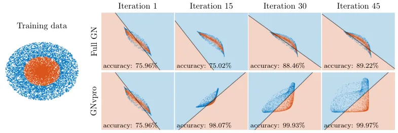

Figure 1: We compare the training performance of the full model (top
row) and the VarPro-reduced model (bottom) given by eq. 1 and eq. 2,
respectively, for a two-dimensional binary classification problem. The
training data consists of inputs $`{\bf y}\in\mathbb{R}^{2}`$ and are
visualized in the left figure using red and blue dots based on their
label $`c\in\{0,1\}`$. In the other panels, we display the transformed
training data $`F({\bf y},{\boldsymbol{\theta}})`$ at intermediate
optimization iterations, the linear classifier $`{\bf W}`$ via a black
line, and the resulting classification via the background shading. By
design, each iteration of VarPro uses the optimal linear classifier for
the transformed data and thus converges quicker and to a more accurate
solution.

The paper is organized as follows. In Section 2, we derive GNvpro and
its components by generalizing the VarPro idea to cross-entropy loss
functions and in particular discuss the effective solution of the
partial minimization problem arising in classification problems. In
Section 3, we provide four numerical examples consisting of two
least-squares regression problems, an image segmentation problem, and an
image classification problem. The regression problems seek to train a
DNN surrogate models of the parameter-to-observable map for two PDEs,
Convection Diffusion Reaction and Direct Current Resistivity. The
segmentation problem seeks to train a DNN to classify pixels that
correspond to different materials or crops in a hyperspectral image. As
am image classification benchmark, we consider the CIFAR-10 problem,
which consists of training a convolutional neural network that
classifies natural images. In Section 4, we summarize our findings and
discuss future directions.

## 2 Train like a (Var)Pro

In this section, we present GNvpro, our Gauss-Newton-Krylov
implementation of variable projection (VarPro) that enables training
separable DNN architectures eq. 1 to solve regression and classification
problems. Our algorithmic process is predicated on formulating the
stochastic optimization problem as a sample average approximation. To
implement VarPro, we separate the nonlinear and linear DNN components
into outer and inner problems, respectively. At each training iteration,
we solve the inner problem to eliminate $`{\bf W}`$ as in eq. 2. The
type of loss function dictates the choice of the solver for the inner
problem: in the case of a least-squares function, an SVD solves the
inner problem and in the case for the cross-entropy function, we employ
a trust region approach. To efficiently solve the outer problem, we
linearize the reduced forward model eq. 2 and derive GNvpro as a
generalization of Gauss-Newton to non-quadratic loss functions.

### 2.1 VarPro for DNN Training

Let $`({\bf y},{\bf c})`$ be an input-target pair where $`{\bf y}`$
belongs to the feature space
$`\mathcal{Y}\subset\mathds{R}^{N_{\rm in}}`$ and $`{\bf c}`$ belongs to
the target space $`\mathcal{C}\subset\mathds{R}^{N_{\rm target}}`$. We
denote the data set, the set of all input-target pairs, as
$`\mathcal{D}\subset\mathcal{Y}\times\mathcal{C}`$, and assume that it
is large or even infinite. In this work, we consider DNN models of the
form eq. 1, which consist of two components: a nonlinear, parametrized
feature extractor
$`F:\mathcal{Y}\times\mathds{R}^{N_{\theta}}\to\mathds{R}^{N_{\rm out}}`$
and a final linear transformation
$`{\bf W}\in\mathds{R}^{N_{\rm target}\times N_{\rm out}}`$. We denote
the weights of the feature extraction $`F`$ by
$`{\boldsymbol{\theta}}\in\mathds{R}^{N_{\theta}}`$.

In a supervised setting, we use the labeled data in $`\mathcal{D}`$ to
train the weights of the model. We pose this as the stochastic
optimization problem

```math
\displaystyle\min_{{\bf W},{\boldsymbol{\theta}}}\mathbb{E}[L({\bf W}F({\bf y},{\boldsymbol{\theta}}),{\bf c})]+R({\boldsymbol{\theta}})+S({\bf W}), \tag{3}
```

where the loss function
$`L:\mathds{R}^{N_{\rm target}}\times\mathcal{C}\to\mathds{R}`$ is
convex in its first argument, and
$`R:\mathds{R}^{N_{\theta}}\to\mathds{R}`$ and
$`S:\mathds{R}^{N_{\rm target}\times N_{\rm out}}\to\mathds{R}`$ are
convex regularizers. In this work, we choose the Tikhonov regularizers
$`R({\boldsymbol{\theta}})=\frac{\alpha_{1}}{2}\|{\bf B}{\boldsymbol{\theta}}\|^{2}`$
(where $`{\bf B}`$ is a user-defined regularization operator) and
$`S({\bf W})=\frac{\alpha_{2}}{2}\|{\bf W}\|^{2}_{\rm F}`$ (where
$`\|\cdot\|_{F}`$ is the Frobenius norm) with fixed parameters
$`\alpha_{1},\alpha_{2}>0`$, which are called weight-decay in the
machine learning community. The expectation is over the uniform
distribution defined by the input-output pairs in $`\mathcal{D}`$. We
list some loss functions that are commonly-used in DNN training and
supported by our framework in Table 1.

|                                                                                          |                                                                 |
| ---------------------------------------------------------------------------------------- | --------------------------------------------------------------- |
| Least Squares                                                                            | $`L_{\rm ls}({\bf x},{\bf c})=\|{\bf x}-{\bf c}\|_{2}^{2}`$     |
| $`L_{\rm ls}:\mathds{R}^{N_{\rm target}}\times\mathds{R}^{N_{\rm target}}\to\mathds{R}`$ |                                                                 |
| Logistic Regression                                                                      | $`L_{\rm log}(x,c)=-c\log h(x)-(1-c)\log(1-h(x))`$              |
| $`L_{\rm log}:\mathds{R}\times\{0,1\}\to\mathds{R}`$                                     |                                                                 |
| Multinomial Regression                                                                   | $`L_{\rm mul}({\bf x},{\bf c})=-{\bf c}^{\top}\log h({\bf x})`$ |
| $`L_{\rm mul}:\mathds{R}^{N_{\rm target}}\times\Delta^{N_{\rm target}}\to\mathds{R}`$    |                                                                 |

Table 1: Loss functions supported in our framework for training DNNs to
solve function approximation (least-squares) and classification tasks
(logistic, multinomial). The first argument of the loss functions is the
output of the network, i.e.,
$`{\bf x}={\bf W}F({\bf y},{\boldsymbol{\theta}})`$. The softmax
function $`h({\bf x})=\exp({\bf x})/(1+{\bf e}^{\top}{\bf x})`$
transforms the output into a vector of probabilities where the
$`i^{th}`$ value is the probability of belonging to class $`i`$. In the
one-dimensional case, the softmax function is equivalent to the sigmoid
function. The unit simplex $`\Delta^{N_{\rm target}}`$ contains vectors
with non-negative entries that sum to $`1`$ (i.e., vectors of
probabilities).

We turn eq. 3 into a deterministic problem by replacing the expected
loss with its sample average approximation (SAA) (see also \[37, 46,
35\])

```math
\displaystyle\min_{{\bf W},{\boldsymbol{\theta}}}\Phi({\bf W},{\boldsymbol{\theta}})\equiv\frac{1}{|\mathcal{T}|}\sum_{({\bf y},{\bf c})\in\mathcal{T}}L({\bf W}F({\bf y},{\boldsymbol{\theta}}),{\bf c})+R({\boldsymbol{\theta}})+S({\bf W}). \tag{4}
```

Here, we partition the labeled data into a training set
$`\mathcal{D}_{\rm train}`$, a validation set $`\mathcal{D}_{\rm val}`$,
and a test set $`\mathcal{D}_{\rm test}`$, and choose the batch
$`\mathcal{T}`$ from the training set, i.e.,
$`\mathcal{T}\subset\mathcal{D}_{\rm train}\subset\mathcal{D}`$. The
validation dataset is used to inform the network design and calibrate
the regularization parameters and the test dataset is used to gauge how
well the final model generalizes.

In SAA methods, generalization can be achieved by choosing a
sufficiently large batch size $`|\mathcal{T}|`$, as this closes the
match between (3) and (4). When the required batch size becomes
prohibitively large, one can solve a sequence of instances of the
deterministic problem with different batches \[37\]. This subsampling
becomes necessary, e.g., when the entire training dataset cannot be
stored in memory, which is typically the case in imaging problems due to
the limited storage provided by GPUs. Key differences between this
stochastic variant of the SAA method and SGD methods is that batch sizes
remain larger and typically significantly fewer optimization steps are
needed.

Although the optimization problem (4) can be solved using a variety of
deterministic numerical optimization methods, their effectiveness in
practice can be disappointing (see top row of Figure 1 as an example).
Challenges include the non-convexity of the objective function in
$`{\boldsymbol{\theta}}`$, immense computational costs in the
large-scale setting (i.e., when the number of examples and the number of
weights are large), and the coupling between the linear variable
$`{\bf W}`$ and the DNN weights $`{\boldsymbol{\theta}}`$ in eq. 1. To
derive a more effective approach, we exploit the separability of the DNN
model and the convexification of the loss function by eliminating the
variables of the linear part of the model to obtain the reduced
optimization problem

```math
\displaystyle\min_{{\boldsymbol{\theta}}}\Phi_{\rm red}({\boldsymbol{\theta}}) \displaystyle\equiv\Phi({\bf W}({\boldsymbol{\theta}}),{\boldsymbol{\theta}}) \tag{5}
```

```math
\displaystyle\text{ where }\;{\bf W}({\boldsymbol{\theta}}) \displaystyle=\argmin_{{\bf W}}\Phi({\bf W},{\boldsymbol{\theta}}). \tag{6}
```

Since we eliminated the weights associated with the linear part of the
model, we call $`\Phi_{\rm red}:\mathds{R}^{N_{\theta}}\to\mathds{R}`$
the reduced objective function. For the least-squares loss function,
this approach is known as variable projection (VarPro) (see \[21, 33,
22, 48\] and also our discussion in Section 2.2), but as we show below
the approach extends to other convex loss functions. One of the key
practical benefits of VarPro is that the minimization of (5) with
respect to $`{\boldsymbol{\theta}}`$ implicitly accounts for the
coupling with the eliminated variable $`{\bf W}`$, which can
dramatically accelerate the convergence (see also the discussion and
experiments in \[11\]).

The reduced objective function eq. 5 can be minimized using
gradient-based optimization, without differentiating the inner
problem eq. 6. In other words, the gradients of eq. 5 and eq. 4 with
respect to $`{\boldsymbol{\theta}}`$ are equal, as can be verified via

```math
\displaystyle{\color[rgb]{0,0,0}\nabla_{{\boldsymbol{\theta}}}\Phi_{\rm red}({\boldsymbol{\theta}})=J_{{\boldsymbol{\theta}}}{\bf w}({\boldsymbol{\theta}})^{\top}\nabla_{{\bf w}}\Phi({\bf W}({\boldsymbol{\theta}}),{\boldsymbol{\theta}})+\nabla_{{\boldsymbol{\theta}}}\Phi({\bf W}({\boldsymbol{\theta}}),{\boldsymbol{\theta}})=\nabla_{{\boldsymbol{\theta}}}\Phi({\bf W}({\boldsymbol{\theta}}),{\boldsymbol{\theta}}),} \tag{7}
```

where
$`{\bf w}({\boldsymbol{\theta}})=\text{vec}({\bf W}({\boldsymbol{\theta}}))\in\mathds{R}^{N_{\rm target}N_{\rm out}}`$
(the operator $`\text{vec}(\cdot)`$ reshapes a matrix into a vector) and
$`J_{{\boldsymbol{\theta}}}{\bf w}({\boldsymbol{\theta}})`$ is the
Jacobian of $`{\bf w}({\boldsymbol{\theta}})`$. This observation also
implies that gradients can become inaccurate when the inner problem is
not solved to sufficient accuracy; for numerical evidence, see fig. 10
in appendix A.

For the loss functions considered in this paper, the inner problem eq. 6
is smooth, strictly convex, and of moderate size. Thus, it can be solved
efficiently using convex optimization schemes. The method by which we
solve the inner optimization problem varies based on the loss function.
For regression tasks, we solve the resulting least-squares problem
directly using the singular value decomposition (see details in
Section 2.2) and for the cross-entropy loss functions we solve the
convex program iteratively using a Newton-Krylov trust region scheme
(see details in Section 2.3).

The computational cost of solving eq. 6 depends on the number of
examples $`|\mathcal{T}|`$, the width of the network $`N_{\rm out}`$,
and the number of output features $`N_{\rm target}`$. As $`N_{\rm out}`$
and $`N_{\rm target}`$ are typically on the order of tens or hundreds,
even for large-scale learning tasks and due to our efficient
implementations described in the following sections, the cost of solving
the convex inner problems eq. 6 is minimal in practice. Importantly,
these costs grow independent of the depth of the DNN used as a nonlinear
feature extractor $`F`$. Hence, the cost of evaluating the reduced
objective function in eq. 5 and its gradient eq. 7 depends on the
complexity of $`F`$. As the depth of $`F`$ grows, the forward and
backward passes through the network dominate the training costs and the
overhead of solving eq. 5 becomes negligible.

We provide a side-by-side comparison of evaluating the full and reduced
objective functions in Algorithm 1. The substantial difference is Line 5
in which we solve for the optimal $`{\bf W}({\boldsymbol{\theta}})`$
based on the current weights to evaluate the reduced objective. Observe
that the architecture of the feature extractor is arbitrary, which
allows us to experiment with a wide range of architectures, particularly
deep networks (see \[62\] for experiments with single-layer neural
networks).

1: Inputs: Batch
$`\mathcal{T}=\{({\bf y}_{i},{\bf c}_{i})\ :\ i=1,2,\ldots,|\mathcal{T}|\}`$,
feature extractor $`F`$, weights $`{\boldsymbol{\theta}}`$, and,
$`{\bf W}`$ (only needed when not using VarPro)

2: _Forward propagate_

3: for $`i=1,\dots,|\mathcal{T}|`$ do

4:
  $`{\bf z}_{i}({\boldsymbol{\theta}})=F({\bf y}_{i},{\boldsymbol{\theta}})`$

5: end for

6:

7: 4: _Evaluate $`\Phi`$ (no VarPro)_ 5: ————————– 6:
$`\Phi_{\rm c}=\Phi({\bf W},{\boldsymbol{\theta}})`$ 7:
$`\nabla\Phi_{\rm c}=\nabla_{({\bf W},{\boldsymbol{\theta}})}\Phi({\bf W},{\boldsymbol{\theta}})`$
8:
$`J_{\rm c}=J_{({\bf W},{\boldsymbol{\theta}})}\left(\frac{1}{|\mathcal{T}|}\sum_{i=1}^{|\mathcal{T}|}{\bf W}{\bf z}_{i}({\boldsymbol{\theta}})\right)`$
4: _Evaluate $`\Phi_{\rm red}`$ (VarPro)_ 5:
$`{\bf W}({\boldsymbol{\theta}})=\argmin_{{\bf W}}\Phi({\bf W},{\boldsymbol{\theta}})`$
6:
$`\Phi_{\rm c}=\Phi_{\rm red}({\boldsymbol{\theta}})\equiv\Phi({\bf W}({\boldsymbol{\theta}}),{\boldsymbol{\theta}})`$
7:
$`\nabla\Phi_{\rm c}=\nabla_{\boldsymbol{\theta}}\Phi_{\rm red}({\boldsymbol{\theta}})`$
8:
$`J_{\rm c}=J_{{\boldsymbol{\theta}}}\left(\frac{1}{|\mathcal{T}|}\sum_{i=1}^{|\mathcal{T}|}{\bf W}({\boldsymbol{\theta}}){\bf z}_{i}({\boldsymbol{\theta}})\right)`$

9:

10: return $`\Phi_{\rm c}`$, $`\nabla\Phi_{\rm c}`$, and, for GNvpro,
$`J_{\rm c}`$

Algorithm 1 Evaluating objective functions

### 2.2 Efficient Implementation for the Least-Squares Loss

For the least-squares loss function, the inner problem eq. 6 is a linear
regression problem that we solve directly using the singular value
decomposition (SVD). For concreteness, we now outline our implementation
for this important special case. Our final scheme is equivalent to the
ones derived in  \[48, 22\]. For ease of notation, we arrange the input
and target vectors of the current batch
$`\mathcal{T}\subset\mathcal{D}_{\rm train}`$ column-wise in the
matrices $`{\bf Y}\in\mathds{R}^{N_{\rm in}\times|\mathcal{T}|}`$ and
$`{\bf C}\in\mathds{R}^{N_{\rm target}\times|\mathcal{T}|}`$,
respectively. Similarly, let the $`i`$-th column of
$`{\bf Z}({\boldsymbol{\theta}})=F({\bf Y},{\boldsymbol{\theta}})\in\mathds{R}^{N_{\rm out}\times|\mathcal{T}|}`$
correspond to output feature $`F({\bf y}_{i},{\boldsymbol{\theta}})`$,
where $`{\bf y}_{i}`$ is the $`i-`$th column of $`{\bf Y}`$. Using this
notation and assuming weight decay regularization, we can write the
reduced regression problem compactly as

```math
\displaystyle\min_{{\boldsymbol{\theta}}}\Phi_{\rm ls}({\boldsymbol{\theta}}) \displaystyle\equiv\tfrac{1}{2|\mathcal{T}|}\|{\bf W}({\boldsymbol{\theta}}){\bf Z}({\boldsymbol{\theta}})-{\bf C}\|_{F}^{2}+\tfrac{\alpha_{1}}{2}\|{\boldsymbol{\theta}}\|_{2}^{2}+\tfrac{\alpha_{2}}{2}\|{\bf W}({\boldsymbol{\theta}})\|_{F}^{2} \tag{8}
```

```math
\displaystyle\mathrm{s.t.}\;{\bf W}({\boldsymbol{\theta}}) \displaystyle=\argmin_{{\bf W}}\tfrac{1}{2|\mathcal{T}|}\|{\bf W}{\bf Z}({\boldsymbol{\theta}})-{\bf C}\|_{F}^{2}+\tfrac{\alpha_{2}}{2}\|{\bf W}\|_{F}^{2}. \tag{9}
```

We note that the inner problem is separable by rows and hence the
$`N_{\rm target}`$ rows of $`{\bf W}({\boldsymbol{\theta}})`$ can be
computed independently and in parallel. We solve the inner optimization
problem efficiently and stably using the (reduced) SVD \[48, 33\] of the
network outputs

```math
\displaystyle\tfrac{1}{\sqrt{|\mathcal{T}|}}{\bf Z}({\boldsymbol{\theta}})={\bf U}{\bf{\Sigma}}{\bf V}^{\top}, \tag{10}
```

where the columns of
$`{\bf U}\in\mathds{R}^{N_{\rm out}\times N_{\rm out}}`$ and
$`{\bf V}\in\mathds{R}^{|\mathcal{T}|\times N_{\rm out}}`$ are
orthonormal and
$`{\bf\Sigma}\in\mathds{R}^{N_{\rm out}\times N_{\rm out}}`$ is
diagonal. Here, we assume the number of samples is greater than the
number of output features which is a reasonable assumption when
optimizing with SAA methods.

### 2.3 Efficient Implementation for Cross-Entropy Loss Functions

For the cross-entropy loss functions used in logistic and multinomial
regression tasks, the inner problem eq. 6 generally does not admit a
closed-form solution. For our choice of the regularizer $`S`$, the
elimination requires solving a smooth and strictly convex problem.
Typically, this problem has no more than a few thousand variables. To
efficiently solve this problem to high accuracy, we use the
Newton-Krylov trust region method described below. We recall that due
to eq. 7, the convergence of the outer optimization scheme crucially
depends on the accuracy of the Newton scheme.

To iteratively solve eq. 6, we initialize the weights with
$`{\bf W}^{(0)}\equiv{\color[rgb]{0,0,0}{\bf W}_{\rm prev}}`$ and a
user-specified trust region radius $`\Delta^{(0)}`$. The initialization
of $`{\bf W}^{(0)}`$ is the solution obtained during previous outer
iteration. In the $`j`$-th iteration, we compute the update to the
weight by approximately solving the quadratic program

```math
\min_{\delta{\bf w}}\nabla_{{\bf w}}\Phi({\bf W}^{(j)},{\boldsymbol{\theta}})^{\top}\delta{\bf w}+{\frac{1}{2}}\delta{\bf w}^{\top}\nabla_{{\bf w}}^{2}\Phi({\bf W}^{(j)},{\boldsymbol{\theta}})\delta{\bf w}\;\text{ subject to }\;\|\delta{\bf w}\|\leq\Delta^{(j)}. \tag{11}
```

Although the number of variables,
$`n_{{\bf w}}=N_{\rm target}N_{\rm out}`$, is modest in most DNN
training problems, we improve the efficiency of the overall scheme by
projecting this subproblem onto the $`r`$-dimensional Krylov subspace
$`\mathcal{K}_{r}(\nabla_{{\bf w}}^{2}\Phi({\bf W}^{(j)},{\boldsymbol{\theta}}),\nabla_{{\bf w}}\Phi({\bf W}^{(j)},{\boldsymbol{\theta}}))`$.
Using the Arnoldi method, this gives a low-rank factorization such that

```math
{\bf Q}_{r+1}{\bf H}_{r}=\nabla_{{\bf w}}^{2}\Phi({\bf W}^{(j)},{\boldsymbol{\theta}}){\bf Q}_{r}, \tag{12}
```

where the columns of
$`{\bf Q}_{r+1}\in\mathds{R}^{n_{{\bf W}}\times(r+1)}`$ are orthonormal,
$`{\bf Q}_{r}\in\mathds{R}^{n_{{\bf W}}\times r}`$ contains the first
$`r`$ columns of $`{\bf Q}_{r+1}`$, and
$`{\bf H}_{r}\in\mathds{R}^{(r+1)\times r}`$ is an upper Hessenberg
matrix. As the Hessian is symmetric, $`{\bf H}_{r}`$ should be
tridiagonal; however, this may not be the case in practice due to
roundoff errors arising in the computation of matrix-vector products
with the Hessian. The rank $`r`$ is chosen adaptively by stopping the
Arnoldi scheme when the estimate of

```math
\min_{{\bf z}\in\mathds{R}^{r}}\frac{\|{\bf H}_{r}{\bf z}-\beta{\bf e}_{1}\|}{\beta},\quad\text{ where }\quad\beta=\|\nabla_{{\bf w}}\Phi({\bf W}^{(j)},{\boldsymbol{\theta}})\|,\quad{\bf e}_{1}=(1,0,0,\ldots)^{\top}\in\mathds{R}^{r+1}
```

falls below a user-defined tolerance or a user-specified maximum rank,
$`r_{\rm max}`$, is reached. We note that, in exact arithmetic, this
stopping criteria renders our scheme equivalent to GMRES \[59, Sec.
6.5\] without restarting when the trust region constraint is inactive.

Using the low-rank factorization eq. 12 and replacing the inequality
constraints with a quadratic penalty, we obtain the approximate step
$`\delta{\bf w}={\bf Q}_{r}{\bf z}^{*}(\lambda)`$, where for
$`\lambda\geq 0`$, $`{\bf z}^{*}(\lambda)\in\mathds{R}^{r}`$ is given by

```math
{\bf z}^{*}(\lambda)=\argmin_{{\bf z}\in\mathds{R}^{r}}{\frac{1}{2}}\|{\bf H}_{r}{\bf z}-\beta{\bf e}_{1}\|^{2}+\frac{\lambda}{2}\|{\bf z}\|^{2}.
```

If $`\|{\bf z}^{*}(0)\|>\Delta^{(j)}`$ (i.e., the trust region
constraint is violated), we use Matlab’s fminsearch with initial bracket
$`\left[0,\frac{\beta}{\Delta^{(j)}}\right]`$ to find the smallest value
of $`\lambda`$ such that the trust region constraint holds. Finally, we
obtain the trial step
$`{\bf W}_{\rm trial}={\bf W}^{(j)}+\delta{\bf W}`$.

To accept or reject the trial step and update the trust region radius,
we compare the predicted and actual reduction achieved by
$`{\bf W}_{\rm trial}`$ and follow the guidelines in \[34, Sec. 3.3\].
We note that the low-rank factorization is only updated when
$`{\bf W}_{\rm trial}`$ is accepted. The Newton scheme is stopped when a
maximum number of iteration is reached or when the scheme has converged,
defined as

```math
\frac{\|\nabla_{{\bf w}}\Phi({\bf W}^{(j+1)},{\boldsymbol{\theta}})\|}{\|\nabla_{{\bf w}}\Phi({\bf W}^{(0)},{\boldsymbol{\theta}})\|}\leq\epsilon_{\rm rel},\quad\text{ or }\quad\|\nabla_{{\bf w}}\Phi({\bf W}^{(j+1)},{\boldsymbol{\theta}})\|\leq\epsilon_{\rm abs},
```

where we set the relative and absolute tolerances to
$`\epsilon_{\rm rel}=10^{-10}`$ and $`\epsilon_{\rm abs}=10^{-10}`$,
respectively.

### 2.4 GNvpro

To solve the reduced optimization problem eq. 5 accurately and
efficiently we now present our proposed Gauss-Newton-Krylov
implementation of VarPro, GNvpro. We use the trust region scheme
described in the previous section to iteratively update the weights
$`{\boldsymbol{\theta}}`$. Recall that the outer problem generally is
not convex.

In the $`k`$-th iteration of GNvpro, we build the trust region
subproblem using the following approximation of the loss

```math
\begin{split}L(G_{\rm red}({\bf y},{\boldsymbol{\theta}}^{(k)})+J_{{\boldsymbol{\theta}}}G_{\rm red}\delta{\boldsymbol{\theta}},{\bf c})&\approx\\
&\hskip-56.9055ptL(G_{\rm red}({\bf y},{\boldsymbol{\theta}}^{(k)}),{\bf c})+\nabla L^{\top}J_{{\boldsymbol{\theta}}}G_{\rm red}\delta{\boldsymbol{\theta}}+\frac{1}{2}\delta{\boldsymbol{\theta}}^{\top}J_{{\boldsymbol{\theta}}}G_{\rm red}^{\top}\nabla^{2}LJ_{{\boldsymbol{\theta}}}G_{\rm red}\delta{\boldsymbol{\theta}},\end{split} \tag{13}
```

where $`\nabla L`$ and $`\nabla^{2}L`$ are, respectively, the gradient
and the Hessian of
$`L(G_{\rm red}({\bf y},{\boldsymbol{\theta}}^{(k)}),{\bf c})`$ with
respect to the first argument, and
$`J_{{\boldsymbol{\theta}}}G_{\rm red}\in\mathds{R}^{N_{\rm target}\times N_{\theta}}`$
is the Jacobian of the reduced model with respect to
$`{\boldsymbol{\theta}}`$

```math
\displaystyle G_{\rm red}({\bf y},{\boldsymbol{\theta}}^{(k)}+\delta{\boldsymbol{\theta}})\approx G_{\rm red}({\bf y},{\boldsymbol{\theta}}^{(k)})+J_{{\boldsymbol{\theta}}}G_{\rm red}\delta{\boldsymbol{\theta}}. \tag{14}
```

We note that our approach is equivalent to the classical Gauss-Newton
method for nonlinear least-squares loss when we consider the regression
loss. GNvpro uses this approximation of the loss to formulate the trust
region subproblem (compare to  eq. 11) and uses the same subspace
projection, and trust region strategy as above albeit with larger
tolerances.

We now derive the Jacobian of the VarPro reduced model,
$`J_{{\boldsymbol{\theta}}}G_{\rm red}`$, that appears in eq. 14.
Applying the product rule to eq. 2, the Jacobian of the reduced DNN
model reads

```math
\displaystyle J_{{\boldsymbol{\theta}}}G_{\rm red}({\bf y},{\boldsymbol{\theta}})=J_{{\boldsymbol{\theta}}}({\bf W}({\boldsymbol{\theta}})F({\bf y},{\boldsymbol{\theta}}))={\bf W}({\boldsymbol{\theta}})J_{{\boldsymbol{\theta}}}F({\bf y},{\boldsymbol{\theta}})+(F({\bf y},{\boldsymbol{\theta}})^{\top}\otimes{\bf I}_{N_{\rm target}})J_{{\boldsymbol{\theta}}}{\bf w}({\boldsymbol{\theta}}) \tag{15}
```

where $`\otimes`$ is the Kronecker product and
$`{\bf I}_{N_{\rm target}}`$ is the
$`N_{\rm target}\times N_{\rm target}`$ identity matrix \[53\]. While
the Jacobian of the network in the first term can be computed easily
using automatic differentiation or using the chain rule, the second term
is less trivial as it requires the Jacobian of the (vectorized) solution
of the convex problem (6). We compute this term by implicitly
differentiating the first order necessary condition
$`\nabla_{{\bf w}}\Phi({\bf W}({\boldsymbol{\theta}}),{\boldsymbol{\theta}})=\bf 0`$,
which yields

```math
\displaystyle\bf 0 \displaystyle=\nabla_{{\bf w}}^{2}\Phi({\bf W}({\boldsymbol{\theta}}),{\boldsymbol{\theta}})J_{{\boldsymbol{\theta}}}{\bf w}({\boldsymbol{\theta}})+J_{{\boldsymbol{\theta}}}\nabla_{{\bf w}}\Phi({\bf W}({\boldsymbol{\theta}}),{\boldsymbol{\theta}}) \tag{16}
```

```math
\displaystyle\Leftrightarrow J_{{\boldsymbol{\theta}}}{\bf w}({\boldsymbol{\theta}}) \displaystyle=-\nabla_{{\bf w}}^{2}\Phi({\bf W}({\boldsymbol{\theta}}),{\boldsymbol{\theta}})^{-1}J_{{\boldsymbol{\theta}}}\nabla_{{\bf w}}\Phi({\bf W}({\boldsymbol{\theta}}),{\boldsymbol{\theta}}). \tag{17}
```

Here, we note that the Hessian
$`\nabla_{{\bf w}}^{2}\Phi({\bf W}({\boldsymbol{\theta}}),{\boldsymbol{\theta}})`$
is positive definite due to the strict convexity of the objective
function in $`{\bf W}`$. See appendix B for a detailed derivation of
$`J_{{\boldsymbol{\theta}}}\nabla_{{\bf w}}\Phi({\bf W}({\boldsymbol{\theta}}),{\boldsymbol{\theta}})`$.

Finally, we note that matrix-vector products with
$`J_{{\boldsymbol{\theta}}}G_{\rm red}({\bf y},{\boldsymbol{\theta}})`$
and its transpose can be performed without the (costly) Kronecker
product, that is, for vectors
$`\delta{\boldsymbol{\theta}}\in\mathds{R}^{N_{\theta}}`$ and
$`\delta s\in\mathds{R}^{N_{\rm out}}`$ we have

```math
\displaystyle J_{\boldsymbol{\theta}}G_{\rm red}\delta{\boldsymbol{\theta}} \displaystyle={\bf W}({\boldsymbol{\theta}})(J_{{\boldsymbol{\theta}}}F({\bf y},{\boldsymbol{\theta}})\delta{\boldsymbol{\theta}})+(J_{{\boldsymbol{\theta}}}{\bf w}({\boldsymbol{\theta}})\delta{\boldsymbol{\theta}})F({\bf y},{\boldsymbol{\theta}}) \tag{18}
```

```math
\displaystyle J_{\boldsymbol{\theta}}G_{\rm red}^{\top}\delta{\bf s} \displaystyle=J_{{\boldsymbol{\theta}}}F({\bf y},{\boldsymbol{\theta}})^{\top}({\bf W}({\boldsymbol{\theta}})^{\top}\delta{\bf s})+J_{{\boldsymbol{\theta}}}{\bf w}({\boldsymbol{\theta}})^{\top}(\text{vec}(\delta{\bf s}F({\bf y},{\boldsymbol{\theta}})^{\top})). \tag{19}
```

When eq. 17 is solved efficiently, the cost of the matrix-vector
products is dominated by the linearized forward or backward propagations
through the feature extractor $`F`$. We now provide efficient
implementations of the Jacobian matrix-vector product for the
least-squares and the cross-entropy loss, respectively.

#### Jacobian for Least-Squares Loss

We can simplify the Jacobian
$`J_{{\boldsymbol{\theta}}}{\bf W}({\boldsymbol{\theta}})`$ in eq. 17
using the SVD of $`{\bf Z}({\boldsymbol{\theta}})`$ computed in eq. 10.
Denoting the residual by
$`{\bf R}({\boldsymbol{\theta}})={\bf W}({\boldsymbol{\theta}}){\bf Z}({\boldsymbol{\theta}})-{\bf C}`$,
we note that

```math
\displaystyle\nabla_{{\bf W}}^{2}\Phi_{\rm ls}({\bf W}({\boldsymbol{\theta}}),{\boldsymbol{\theta}}) \displaystyle={\bf U}({\bf\Sigma}^{2}+\alpha_{2}{\bf I}_{N_{\rm out}})^{-1}{\bf U}^{\top} \tag{20}
```

```math
\displaystyle J_{{\boldsymbol{\theta}}}\nabla_{{\bf W}}\Phi_{\rm ls}({\bf W}({\boldsymbol{\theta}}),{\boldsymbol{\theta}}) \displaystyle=\tfrac{1}{\sqrt{|\mathcal{T}|}}{\bf W}({\boldsymbol{\theta}})J_{{\boldsymbol{\theta}}}{\bf Z}({\boldsymbol{\theta}}){\bf V}{\bf\Sigma}{\bf U}^{\top}+\tfrac{1}{|\mathcal{T}|}{\bf R}({\boldsymbol{\theta}})J_{{\boldsymbol{\theta}}}{\bf Z}({\boldsymbol{\theta}})^{\top} \tag{21}
```

With these ingredients, the multiplication of a given vector
$`\delta{\boldsymbol{\theta}}\in\mathds{R}^{N_{\theta}}`$ with the
Jacobian, for example, simplifies to

```math
\displaystyle J_{{\boldsymbol{\theta}}}{\bf W}({\boldsymbol{\theta}})\delta{\boldsymbol{\theta}} \displaystyle=-\left(\tfrac{1}{\sqrt{|\mathcal{T}|}}{\bf W}({\boldsymbol{\theta}})\delta{\bf Z}{\bf V}{\bf\Sigma}+\tfrac{1}{|\mathcal{T}|}{\bf R}({\boldsymbol{\theta}})\delta{\bf Z}^{\top}{\bf U}\right)({\bf\Sigma}^{2}+\alpha_{2}{\bf I}_{N_{\rm out}})^{-1}{\bf U}^{\top}, \tag{22}
```

where we abbreviate the directional derivative of the feature extractor
by
$`\delta{\bf Z}=J_{\boldsymbol{\theta}}{\bf Z}({\boldsymbol{\theta}})\delta{\boldsymbol{\theta}}`$
and cancel redundant terms. Note that multiplying the inverse Hessian
from the right avoids forming the Kronecker product and enables parallel
computation of all the rows. The computation of matrix vector products
with the transpose of the Jacobian is along the same lines. Efficient
implementations of eq. 22 re-use the previously-computed SVD from eq. 10
to compute $`J_{{\boldsymbol{\theta}}}{\bf W}({\boldsymbol{\theta}})`$
and also evaluate the Jacobian of the feature extractor
$`J_{\boldsymbol{\theta}}{\bf Z}({\boldsymbol{\theta}})`$ only once.

#### Jacobian for Cross-Entropy Loss

Our implementation of GNvpro re-uses the low-rank decomposition of
$`\nabla_{{\bf w}}^{2}\Phi({\bf W}({\boldsymbol{\theta}}),{\boldsymbol{\theta}})`$
computed in the last iteration of the inner trust region solve to
accelerate matrix-vector products with the Jacobian (see appendix B for
more details). That is, we replace eq. 17 by
$`-({\bf Q}_{r}{\bf H}_{r}^{\dagger}{\bf Q}_{r+1}^{\top})\ J_{{\boldsymbol{\theta}}}\nabla_{{\bf w}}\Phi({\bf W}({\boldsymbol{\theta}}),{\boldsymbol{\theta}})`$,
where $`{\bf H}_{r}^{\dagger}`$ is the Moore-Penrose inverse. To
increase the efficiency of computing matrix-vector products our
implementation is based on performing a SVD of $`{\bf H}_{r}`$ and to
derive a low-rank factorization of
$`{\bf Q}_{r}{\bf H}_{r}^{\dagger}{\bf Q}_{r+1}^{\top}`$ and its
transpose. While it can be more accurate to use an iterative method in
this step, we did not observe any negative effects on accuracy in our
experiments. Moreover, by this choice we ensure that
$`J_{\boldsymbol{\theta}}G_{\rm red}`$ and
$`J_{\boldsymbol{\theta}}G_{\rm red}^{\top}`$ given by eq. 18 and
eq. 19, respectively, are transposes of one another for any choice of
$`r`$.

## 3 Numerical Experiments

We provide numerical experiments that demonstrate the efficacy of
training DNNs with GNvpro for PDE surrogate modeling applications
(Section 3.2), hyperspectral image segmentation (Section 3.3), and the
CIFAR-10 image classification problem (Section 3.4). Across these tasks,
which involve different loss functions and DNN architectures, solving
the reduced problem eq. 5 using GNvpro leads to faster convergence and a
more accurate model than solving the full problem eq. 4 using a
Gauss-Newton-Krylov method or solving the stochastic problem eq. 3 using
the SGD variant ADAM \[36\].

### 3.1 Experimental Setup

In this section, we describe the DNN architectures used in our
experiments, define our measure of computational complexity, and
describe the optimization strategies we compare. We emphasize that
GNvpro does not depend on the architectures and refer to \[23\] for an
overview of possible network designs.

#### Neural ODEs

In the following experiments, we consider feature extractors given by a
neural Ordinary Differential Equation (Neural ODE); see \[26, 17, 8\].
To this end, we define $`F({\bf y},{\boldsymbol{\theta}})`$ as a
numerical approximation of $`{\bf u}(T)`$ that satisfies the initial
value problem

```math
\displaystyle{\bf u}(t)=f({\bf u}(t),{\bf K}(t),{\bf b}(t))\quad\text{for}\quad t\in(0,T],\quad{\bf u}(0)=\sigma({\bf K}_{\rm in}{\bf y}+{\bf b}_{\rm in}) \tag{23}
```

with an artificial time $`t\in[0,T]`$, activation function
$`\sigma(x)=\tanh(x)`$, and weights
$`{\bf K}:[0,T]\to\mathds{R}^{N_{\rm out}\times N_{\rm out}},{\bf b}:[0,T]\to\mathds{R}^{N_{\rm out}},{\bf K}_{\rm in}\in\mathds{R}^{N_{\rm out}\times N_{\rm in}}`$,
and $`{\bf b}_{\rm in}\in\mathds{R}^{N_{\rm out}}`$. For notational
convenience we collectively denote the weights as
$`{\boldsymbol{\theta}}=({\bf K},{\bf b},{\bf K}_{\rm in},{\bf b}_{\rm in})`$.

As shown in \[26\], the stability of the Neural ODE eq. 23 depends both
on the choice of weights, which are learned during training, and the
layer function $`f`$, which is specified prior to training. Here, we use
the anti-symmetric layer

```math
f({\bf u},{\bf K},{\bf b})=\sigma\left(({\bf K}-{\bf K}^{\top}-\gamma{\bf I}){\bf u}+{\bf b}\right),
```

with $`\gamma=10^{-4}`$. This design leads to a stable dynamic when
$`{\bf K}`$ and $`{\bf b}`$ are constant in time.

To train the Neural ODE, we first discretize its features $`{\bf u}`$
and weights, $`{\bf K}`$ and $`{\bf b}`$, on the nodes of an equidistant
grid of $`[0,T]`$ with $`d`$ cells, and then optimize the discretized
weights. In our experiments, we use a fourth-order Runge-Kutta scheme.
The number of time steps, $`d`$, can also be seen as the depth of the
network. Hence, our approach is a discretize-optimize method, which has
been shown to perform well also in  \[20, 50\].

#### Optimization and Regularization

We compare GNvpro to the SGD variant ADAM \[36\] and a standard
Gauss-Newton method applied to the full optimization problem eq. 4 and
the quasi-Newton scheme L-BFGS (implemented following \[47\]) applied to
the VarPro problem eq. 5; we call this scheme L-BFGSvpro for brevity. We
discuss the hyperparameters of each scheme (e.g., linear solvers, line
search methods, learning rates) as well as regularization parameters in
the respective sections as they are specific to each task.

To exploit the fact that our learning problems are obtained by
discretizing the Neural ODE eq. 23, we employ a multilevel training
strategy similar to \[26, 7, 15\]. The idea is to repeatedly solve the
learning problem for a shallow-to-deep hierarchy of networks obtained by
increasing the depth $`d`$ in the time discretization. On the first
level, we initialize $`{\boldsymbol{\theta}}`$, the weights of the
feature extractor $`F`$, randomly. In our experiments with the full
objective functions we initialized $`{\bf W}`$ by solving eq. 6 using
the methods described in Section 2.2 and Section 2.3 for the initial
network weights. In our examples this has improved the performance over
random initialization of $`{\bf W}`$ and also ensures that all schemes
start with the same initial guess. After approximately solving the
problem on the first level, the final iterate of
$`{\boldsymbol{\theta}}`$ is prolongated in time using piecewise linear
interpolation and used to initialize the optimization for the network
architecture given by discretizing eq. 23 with twice as many time steps.
This procedure is repeated until the desired depth of the network is
reached.

For the Neural ODE weights, the regularization operator $`{\bf B}`$ is a
finite-difference, time discretization to promote smooth transitions
between layers. For the other weights, we use an identity regularization
operator.

#### Computational Costs

We measure the computational cost of training neural networks with the
various optimization schemes in terms of work units, which we define as
the sum of the number of forward and backward passes through the network
over all training samples. In other words, if we have a training data
set of size $`N`$, a forward and backward pass for a single sample costs
$`2/N`$ work units.

These forward and backward passes are the most expensive computational
steps in training, particularly for deep networks. A forward pass
consists of forming the current function value $`\Phi_{\rm c}`$ in
Algorithm 1 or a forward application of the Jacobian $`J_{\rm c}`$. A
backward pass consists of forming the current gradient
$`\nabla\Phi_{\rm c}`$ in Algorithm 1 or an application of
$`J_{\rm c}^{\top}`$. When using a multi-level training strategy, work
units on the coarse level (fewer time steps/layers) are less expensive
than the work units on the fine level (more time steps/layers). For
simplicity, we ignore the dependency of the cost on the number of time
steps, $`d`$, because in each experiment, the network architectures are
fixed across optimization methods.

The number of work units per step differs across the optimization
methods. For example, each epoch of ADAM requires two work units: one to
evaluate the objective function and one to compute its gradient for all
examples in the batch (see left column in Algorithm 1). Each iteration
of L-BFGSvpro requires two work units to compute the objective function
and its gradient plus a few additional work units to perform the line
search. The iterations of GNvpro require additional $`2r`$ work units to
obtain the low-rank factorization of the approximate Hessian. The memory
requirements of GNvpro is the same as full Gauss-Newton and the
computational overhead of training with GNvpro is small.

### 3.2 Surrogate Modeling

In this section, we apply GNvpro to two datasets motivated by PDE
surrogate modeling with DNNs. One of the key challenges for surrogate
modeling consists of capturing the nonlinear features by efficiently
manipulating the vast number of input parameters. Creating suitable
surrogates that in turn can be used for a range of analysis tasks, such
as uncertainty quantification and optimization, requires a necessary
level of accuracy. However, when the underlying dynamics is nonlinear
and the input to output mapping is nonconvex, the learning process
becomes non-trivial.

Our goal is to design a DNN that maps given parameters $`{\bf y}`$ to a
set of observables $`{\bf c}`$, where $`{\bf y}`$ and $`{\bf c}`$
satisfy

```math
\displaystyle{\bf c}=\mathcal{P}u\quad\text{subject to}\quad\mathcal{A}(u;{\bf y})=0.
```

The function $`u`$ is the solution of the PDE and $`\mathcal{A}`$ is the
PDE operator parameterized by $`{\bf y}`$. The linear operator
$`\mathcal{P}`$ measures the solution $`u`$ at discrete points in the
domain to obtain a set of observables
$`{\bf c}\in\mathds{R}^{N_{\rm target}}`$.

To train the DNN surrogate, we minimize the least-squares regression
loss. For these applications, it is reasonable to assume that the
training data contains no noise or errors as it is generated using a
fine mesh solver. Hence, an effective surrogate should tightly fit the
training data and at the same time be efficient to evaluate. Note that
we develop these surrogate models based solely on the
parameter-observable pairs, independent of the underlying PDE.

In our experiments, we consider two examples: convection diffusion
reaction (CDR), a commonly used PDE which models a variety of physical
phenomena, and direct current resistivity (DCR), a inverse conductivity
problem using a PDE model for electric potential. Both examples are
summarized below and fully described in appendix C.

The CDR equation has inspired mathematical models for studying problems
in many fields, such as subsurface flows \[10, 42\], atmospheric
dispersion modeling \[1\], semi-conductor physics \[32\], chemical vapor
deposition \[19\], biomedical engineering \[44, 18\], population
dynamics \[67, 3\], combustion \[43\], and wildfire spread \[24\]. In
the CDR example we consider, the inputs $`{\bf y}\in\mathbb{R}^{55}`$
which parameterizes the reaction function and the targets
$`{\bf c}\in\mathds{R}^{72}`$ which are observations of the state $`u`$
at $`6`$ fixed spatial locations and $`12`$ instances of time. The data
set consists of 800 pairs of parameters $`({\bf y},{\bf c})`$ generated
by repeatedly solving the PDE. We split the data into $`400`$ training
samples ($`50\%`$ of available data), $`200`$ validation samples, and
$`200`$ test samples. We are interested in being able to train small
networks efficiently without a surplus of data – a realistic setting in
surrogate modeling where generating data is expensive.

Direct Current Resistivity (DCR) seeks detect an object from indirect
noisy measurements \[60, 16\]. The mathematical formulation is general
and a similar instance of this problem also arises in modeling porous
media flow with Darcy’s Law \[9\]. We illustrate surrogate modeling
where the inputs $`{\bf y}\in\mathds{R}^{3}`$ parameterize the depth,
volume, and orientation of an ellipsoidal conductivity model and the
targets $`{\bf c}\in\mathds{R}^{882}`$ correspond to the observed
electric potential differences. We generate
$`{\color[rgb]{0,0,0}10,000}`$ samples of parameters and observables
$`({\bf y},{\bf c})`$. We split the data into $`8,000`$ training samples
($`80\%`$ of available data), $`1,000`$ validation samples, and
$`1,000`$ test samples.

For both examples, we train the Neural ODE model eq. 23 with a width of
$`N_{\rm out}=8`$ and $`N_{\rm out}=16`$ for the CDR and DCR examples,
respectively, and a final time of $`T=4`$. Our multi-level approach
consists of three steps whose respective number of time steps is $`2`$,
$`4`$, and $`8`$. For GNvpro, we limit the rank of the Krylov subspace
to $`r_{\rm max}=20`$ and use a relative residual tolerance of
$`10^{-2}`$. For the SAA methods, we use the entire training dataset at
each iteration. For ADAM, we use the final depth of the network with a
batch size of $`2`$ and the recommended learning rate of $`10^{-3}`$
from \[36\]. For all optimization strategies, we use Tikhonov
regularization with $`\alpha_{1}=\alpha_{2}=10^{-10}`$ to prioritize
fitting.

|                               |          |                          |                          |                          |
| ----------------------------- | -------- | ------------------------ | ------------------------ | ------------------------ |
|                               | WU       | Training                 | Validation               | Test                     |
| Convection Diffusion Reaction |          |                          |                          |                          |
| Full GN                       | $`600`$  | $`0.0115\pm 0.0055`$     | $`0.0138\pm 0.0075`$     | $`0.0142\pm 0.0072`$     |
| Full ADAM                     | $`1200`$ | $`0.0091\pm 0.0045`$     | $`0.0114\pm 0.0086`$     | $`0.0116\pm 0.0072`$     |
| L-BFGSvpro                    | $`600`$  | $`0.0171\pm 0.0102`$     | $`0.0219\pm 0.0127`$     | $`0.0260\pm 0.0187`$     |
| GNvpro                        | $`600`$  | $`\bf 0.0045\pm 0.0021`$ | $`\bf 0.0057\pm 0.0033`$ | $`\bf 0.0060\pm 0.0032`$ |
| DC Resistivity                |          |                          |                          |                          |
| Full GN                       | $`1200`$ | $`0.3837\pm 0.8384`$     | $`0.3650\pm 0.6920`$     | $`0.3517\pm 0.6638`$     |
| Full ADAM                     | $`2400`$ | $`0.2994\pm 0.3652`$     | $`0.2839\pm 0.2776`$     | $`0.2904\pm 0.3256`$     |
| L-BFGSvpro                    | $`1200`$ | $`0.0786\pm 0.1878`$     | $`0.0763\pm 0.1887`$     | $`0.0747\pm 0.1625`$     |
| GNvpro                        | $`1200`$ | $`\bf 0.0198\pm 0.0311`$ | $`\bf 0.0191\pm 0.0258`$ | $`\bf 0.0199\pm 0.0322`$ |

Table 2: Training, validation, and test results for convection diffusion
reaction and DC Resistivity. We report mean relative errors $`\pm`$
standard deviation where the smaller values indicate better fit. The
displayed loss values are the final loss of each training method after a
fixed number of work units (WU). To strengthen the baseline for this
comparison, we allocate twice as many work units to ADAM.

We report the CDR and DCR numerical results in Table 2. GNvpro produces
the most accurate surrogate models for both the CDR and DCR experiments
in Table 2. In the DCR experiment, GNvpro reduces the data fit by an
additional order of magnitude compared to the Gauss-Newton and ADAM
methods applied to the full objective function and also outperforms
L-BFGSvpro. As revealed by the convergence plots in Figure 2, GNvarpro
achieves this level of accuracy in fewer work units.

Generalization is particularly important in surrogate modeling and other
scientific applications that require reliable solutions. Strikingly, the
GNvpro solution also generalizes best, that is, it leads to the lowest
validation and test errors in Table 2 and most efficient reduction of
the validation loss in Figure 2.

Figure 2: We plot the convergence of the loss in the CDR and DCR
experiments for the various optimization strategies. The weights of the
Neural ODE are prolongated twice, indicated by the vertical dashed lines
in each plot. GNvpro outperforms all other approaches and achieves the
best fit in the fewest number of work units whereas L-BFGSvpro achieves
a moderate accuracy and the Gauss-Newton and ADAM schemes fail to
achieve a sufficient accuracy.

To further support our numerical findings, we visualize the prediction
obtained from the DNN surrogates for the CDR and DCR experiments in
Figure 3. Each image in Figure 3 contains all of the observables and the
DNN approximations to the observables as columns of the matrix thereby
providing a global visualization of the performance of our surrogate
models. The width of each image is the total number of samples that we
partition into training, validation, and test sets. The difference
images are the most illuminating about the quality of approximation. We
see that training with GNvpro produces difference images with values
closest to zero, supporting our numerical findings in Table 2.

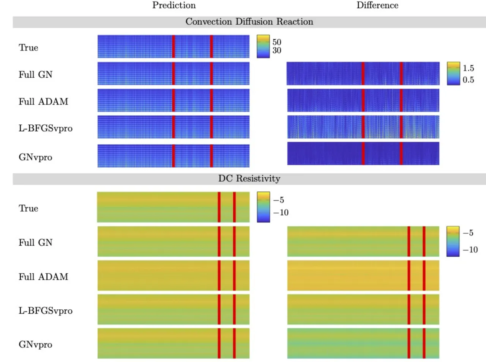

Figure 3: Global visualization of DNN surrogate model approximations for
CDR and DCR data. In the left images, each column of each image
represents the output of the trained Neural ODE for different samples.
In the right images, we display the absolute difference between the
predicted outputs and the true data. To improve visibility of the DCR
data, the absolute value of the data and their difference is used and
intensities are scaled logarithmically. The red lines divide the data
into training, validation, and test sets, left-to-right. From the
difference images and numerical results in Table 2, the GNvpro is the
most similar to the true, observed data.

For the DCR experiments, we can gain additional insight by visualizing
the output $`{\bf c}\in\mathds{R}^{882}`$ as two $`21\times 21`$ images
for a few randomly chosen examples in Figure 4. As expected from the
small loss values, GNvpro best captures the pattern of the observed,
true data for both the training and validation examples. L-BFGSvpro and
Gauss-Newton retain some resemblance to the true data, including some of
the ellipsoidal structure in the left blocks of each image. In
comparison, the ADAM prediction does not capture the structure in the
images, further demonstrating the competitiveness of GNvpro.

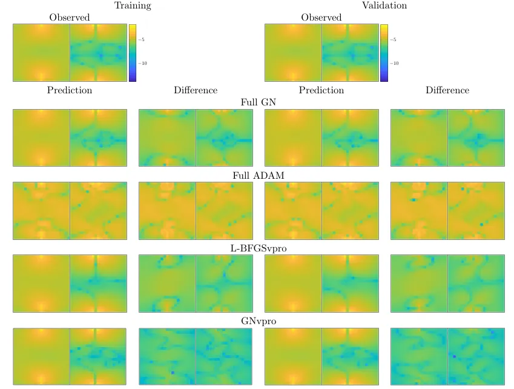

Figure 4: Local DCR surrogate model results. The left two columns show
an example from the training set as well as absolute errors of the
prediction. The right two columns show an example from the validation
set. To improve visibility, we show the absolute value of the data and
scale all axes logarithmically. Each image is contains two
$`21\times 21`$ blocks representing the difference in potential on the
subsurface in the $`x`$-direction and $`y`$-direction, respectively. We
notice that training the full models results in noisy approximations to
the training and validation examples.

Together, these numerical results and visualizations demonstrate that
training with GNvpro provides a more reliable PDE surrogate model that
generalizes well and outperforms ADAM in terms of both convergence speed
and accuracy.

### 3.3 Indian Pines

We demonstrate the ability of GNvpro to efficiently solve multinomial
regression problems using the Indian Pine dataset \[2\], a hyperspectral
image dataset containing of electromagnetic images of agricultural
crops. The image data has $`145\times 145`$ pixels and $`220`$ spectral
reflectance bands. The goal is to partition a hyperspectral image based
on the crop or material in the given location. The $`16`$ different
material types are provided in Figure 5. We consider each pixel of data
to be an input feature vector of length $`220`$. We randomly split the
pixels into training, validation, and test datasets. Achieving
generalization of the DNN model is also complicated by the large
variations of the number of pixels among the different crops. We
visualize this class imbalance in Figure 5.

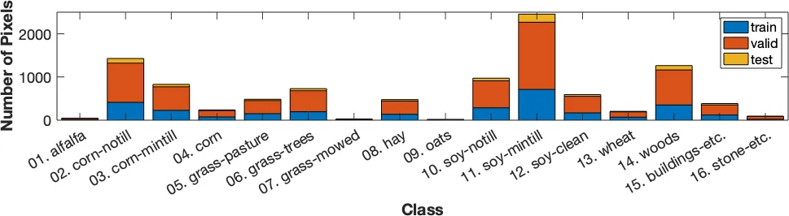

Figure 5: Distribution of Indian Pines data. Each bar represents the
total number of pixels belonging to each of the $`16`$ classes. The bars
are split into training (blue) and validation (pixels). The smallest
classes (1, 4, 7, 9, 13, 16) are split to have $`10`$ validation pixels,
the remaining classes have $`\lfloor 5000/16\rfloor=312`$ training
pixels each.

We train the Neural ODE model eq. 23 with a width of $`N_{\rm out}=32`$
and a final time of $`T=4`$. Our multi-level approach consists of three
steps whose respective number of time steps is $`4,8,`$ and $`16`$. For
GNvpro, we limit the rank of the Krylov subspace to $`r_{\rm max}=50`$
and use a relative residual tolerance of $`10^{-2}`$. For the SAA
methods, we use the entire training dataset at each iteration. For ADAM,
we use the final depth of the network and train with a batch size of
$`32`$ and a learning rate of $`10^{-3}`$. For all optimization
strategies, we use Tikhonov regularization with
$`\alpha_{1}=\alpha_{2}=10^{-3}`$. We display the prediction results in
Figure 6 and plot the convergence histories in Figure 7.

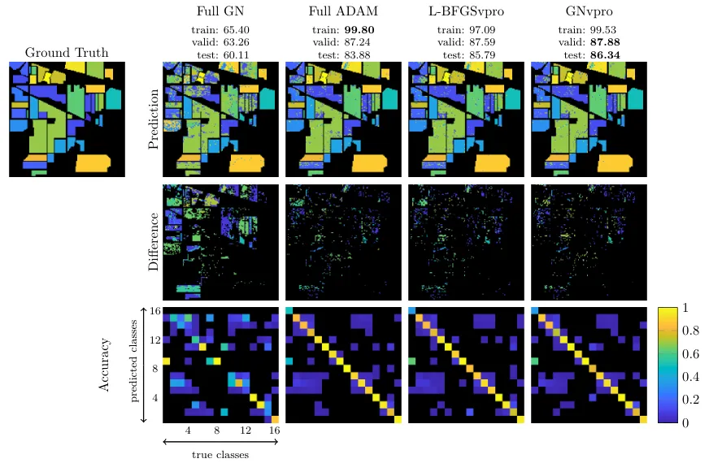

Figure 6: Comparison of optimization schemes for segmenting the Indian
Pines hyperspectral dataset; each column corresponding to Gauss-Newton,
ADAM, L-BFGSvpro, and GNvpro, respectively. The “Prediction” row
contains the prediction maps where each color corresponds to a different
class. We use the network that produced the highest validation accuracy
to create the prediction. The “Difference” row contains the absolute
difference between the prediction and the ground truth. The “Accuracy”
row contains confusion matrices to visualize the accuracy per class.
Each $`(i,j)`$-entry of the confusion matrices is the ratio of the
number of times a pixel was classified as class $`i`$ that truly
belonged to class $`j`$. Each column is normalized by the total number
of pixels belonging to class $`j`$ from the true labeling, so the sum of
every column is equal to $`1`$. Thus, each $`(i,j)`$-entry can be
thought of as the probability that a predicted class $`i`$ belongs to
class $`j`$. We want to see high probabilities along the diagonal
entries. We plot the convergence of the accuracy and the loss for each
optimization method for training and validation data. Note that we ran
ADAM for twice as many work units as the other methods and kept the
weights corresponding to the highest validation accuracy (black dot).

Figure 7: We plot the convergence of the accuracy and the loss for each
optimization method for training and validation data. Note that we ran
ADAM for twice as many work units as the other methods and kept the
weights corresponding to the highest validation accuracy (black dot).

In Figure 6, we see that GNvpro outperforms training without VarPro in
terms of convergence of the accuracy and loss. In fact, from the
confusion matrix, we see the full Gauss-Newton optimization did not
correctly predict any pixels belonging to material $`1`$, $`7`$, and
$`9`$. These groups contained the fewest number of pixels (Figure 5) and
thus are challenging to classify correctly. In its inner loop eq. 6,
GNvpro solves for a classification matrix based on all pixels, including
those belonging to the smallest classes, resulting in better
classification overall. We note our results could be further improved
by, e.g., taking spatial information into account; see, for
instance, \[57\].

In this experiment, GNvpro achieves the best solution, in terms of
validation, test accuracy, and computational costs; for example, it uses
only $`60\%`$ the number of work units that we used for ADAM and
improves the test accuracy by more than $`2\%`$. The training efficiency
can be translated to faster runtimes by exploiting the straightforward
parallelism of GNvpro. In addition, the overhead of solving for the
optimal linear transformation is minimal, taking only $`6.4\%`$ of the
total training time. We highlight the improved generalization of VarPro
training, since a popular belief is that SAA methods overfit more
easily. VarPro improves our ability to reduce the loss function, which
offers new opportunities to improve generalization by well-crafted
direct regularization in contrast to the implicit generalization
provided by ADAM. Through this image segmentation problem with
cross-entropy loss, we demonstrate that both GNvpro and L-BFGSvpro
converge faster and yield more solutions that generalizes better
compared to Gauss-Newton without VarPro and the SGD variant ADAM.

### 3.4 CIFAR-10

We use the CIFAR-10 dataset \[38\] as a commonly-used benchmark problem
to demonstrate GNvpro’s ability to effectively train convolutional
neural networks (CNN) to classify natural images. The dataset consists
of $`50,000`$ training images and $`10,000`$ test images of size
$`32\times 32\times 3`$ belonging to ten different classes; see fig. 9
for examples. We split the training data into $`40,000`$ training images
and $`10,000`$ validation images. Since our main goal is to compare the
optimization performance of different algorithms instead of competing
with the state-of-the-art results, we consider a relatively shallow CNN
architecture similar to the one in \[45\]. Our model consists of two
convolutional layers with ReLU activation, each followed by average
pooling. The network architecture details and hyperparameters chosen are
described in detail in appendix D. We display the training results
in fig. 8 and a selection of classified images in fig. 9.

We visualize the training performance for the three SAA methods
(Gauss-Newton applied to the full problem, L-BFGSvpro, and GNvpro) and
two SA methods (ADAM and SGD with Nesterov acceleration) using the blue
curves in  fig. 8. As is common in image classification, we measure the
performance in terms of classification accuracy and cross entropy loss.
The fact that the full Gauss-Newton scheme did not achieve more than 30%
classification accuracy on the training data underscores the difficulty
of solving the training problem with SAA methods. In contrast, the
training accuracy improves fairly quickly for the SA methods and the SAA
methods GNvpro and L-BFGSvpro that use variable projections, which all
achieve similar training accuracies ranging from 69.66% (for ADAM) and
76.50% (for SGD Nesterov). In fact, GNvpro and L-BFGSvpro reduce the
loss on the current training batch so rapidly that we change the batch
after a few iterations; the changes of the dataset can be seen by the
jumps in the training loss. To be precise, we divide the 40,000 training
data into four randomly chosen batches each consisting of 10,000
examples and perform two sweeps over the batches.

The difference between solving the optimization problem in training and
accomplishing the learning objective can be seen by comparing the test
accuracies plotted as red dotted lines in  fig. 8. In terms of the test
accuracies, the best results with 72.95% are obtained by the SGD method
with Nesterov acceleration after some tuning of the learning rate; to
see the sensitivity of the results with respect to this parameter,
see fig. 14. We note that GNvpro and L-BFGSvpro, since they reduce the
training loss more effectively, have larger generalization gaps than the
SGD variants; that is, the difference in training and validation
accuracy is larger. Despite this gap, both variable projection methods
achieve reasonable validation and test accuracies of 67.28% and 68.05%
for L-BFGSvpro and GNvpro, respectively. In this example, the
performance of GNvpro only depends very mildly on the choice of
regularization parameters; see fig. 14. The variable projection methods
even slightly outperform ADAM, which achieves a test accuracy of 66.34%.
Here, we note the importance of changing the training batches frequently
during training in GNvpro and L-BFGSvpro. After each change in the
training batch, the gap between training loss/accuracy and validation
loss/accuracy almost vanishes in  fig. 8. We observed that without
resampling, the training loss continued to decrease while the validation
loss stayed roughly constant; i.e., the generalization gap grew. The
generalization gap could possibly be reduced by using larger batches or
even the entire training dataset or improved regularization terms.

The takeaways from this experiment are: (1) the VarPro methods (GNvpro
and L-BFGSvpro) minimize the training loss more efficiently than full
optimization methods such as SGD and Gauss-Newton (2) resampling the
training images every few steps of the SAA method helps reduce the
generalization gap (3) the SA methods yield a smaller generalization
gap, but do not solve the optimization problem efficiently, and (4) in
terms of test accuracy, a well-tuned SGD method with Nesterov
acceleration performs best on this example followed closely by the
VarPro methods that marginally outperform the SA method ADAM.

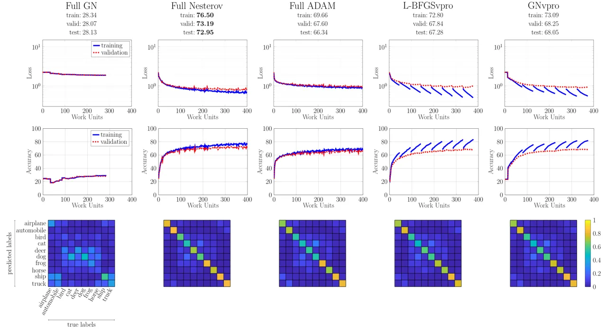

Figure 8: Loss and accuracy convergence plots and confusion matrices of
the CIFAR-10 dataset. Below each method name, we display the accuracy of
the trained network on the entire training, validation, and test sets.
In this experiment, SGD with Nesterov acceleration achieves the best
accuracy across the board. However, both L-BFGSvpro and GNvpro achieve
comparable results to ADAM and significantly outperform full
Gauss-Newton which does not converge. In the convergence plots for the
SAA methods (Full GN, L-BFGSvpro, and GNvpro), we train on four batches
of the training data ($`10,000`$ images per batch) for two epochs. Each
solid blue lines (training) indicates the convergence of the loss (top)
and accuracy (middle) for one batch. The solid blue lines always start
close to the dashed red lines (validation) because the new batch acts
like validation data; i.e., data which the network weights has not seen.
We note that there is a difference between the loss/accuracy of the
entire training set and the loss/accuracy of the individual batches. By
plotting the training loss for each batch, we observe the rapid decay of
the training loss in the VarPro cases. Note that in full GN and GNvpro
the loss stays constant in the first few work units until a reasonable
trust region radius is obtained.

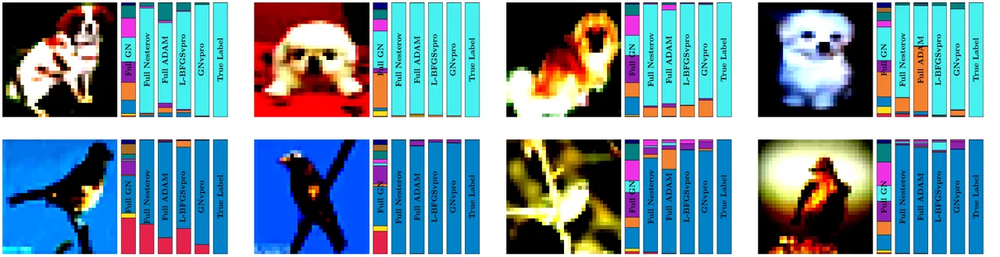

Figure 9: Example image classifications for each optimization method. To
the right of each image are size bars corresponding to (left-to-right)
Full GN, Full Nesterov, Full ADAM, L-BFGSvpro, GNvpro, and the true
labels, respectively. Each bar is color-coded based on the output
probabilities of belonging to each class. The largest color region in
each part is the predicted class of each method. The images were chosen
such that they were classified correctly by at least four optimization
methods.

## 4 Conclusions

We present GNvpro, a highly effective Gauss-Newton implementation of
variable projection (VarPro) that accelerates the training of deep
neural networks (DNNs). Our method extends the reach of VarPro beyond
least-squares loss functions to cross-entropy losses to support
classification tasks. As the projection in the non-quadratic case has no
closed-form solution, we derive a Newton-Krylov trust region method to
efficiently solve the resulting smooth, convex optimization problem. Due
to our efficient implementation the computational cost of DNN training
is dominated by forward and backward propagations through the feature
extractor, and the computational costs of the projection step are
insignificant in practice. A key step in the derivation of GNvpro is the
computation of matrix-vector products with the Jacobian of the reduced
DNN model for which we use implicit differentiation and re-use matrix
factorizations from the projection step.

The key motivation to use VarPro is to exploit the separable structure
of most common DNN architectures to obtain training schemes that yield
an effective DNN in a few training steps. This is important since
effectively minimizing the training loss is a challenging and necessary
first step toward the ultimate goal in deep learning, which is finding a
model that generalizes to unseen data. In other words, a model that
performs poorly on the training data should not be expected to perform
better on the test data. Our experiments demonstrate that GNvpro and
L-BFGSvpro are able to minimize the training loss more efficiently than
methods that do not exploit the separable structure of the problem,
e.g., Gauss-Newton and stochastic gradient methods applied to the full
problem. In addition to the optimization scheme, the ability to
generalize also depends on other factors such as the choice of network
architecture and regularization strategy and properties of the training
data. While GNvpro achieves a higher test accuracy than the other
methods in the surrogate modeling and image segmentation problems, it
was slightly inferior to the best-tuned SGD method for the CIFAR-10
image classification problem. Possible causes for this could include the
relatively small sample size compared to the high dimension and
heterogeneity of the training data. Note that in this dataset, the
images belonging to a given class can be considerably different in their
contrast and appearance. This is different in the hyperspectral imaging
example where the measurement device is engineered such that pixels
belonging to the same class will have similar spectra.

The mechanics of VarPro are similar to those of block coordinate descent
approaches (e.g., the recent DNN training algorithms in \[51, 14\]).
Added challenges in VarPro are the higher accuracy needed for the inner
problem and the slightly more involved derivations of Jacobians for the
outer problem when using Gauss-Newton-type approaches. A key
contribution of our paper is the derivation of efficient algorithms and
their implementations that limit the computational costs of those parts,
rendering the computational costs of GNvpro comparable to block
coordinate descent. A crucial advantage added by GNvpro is its ability
to account for the expected coupling between $`{\bf W}`$ and
$`{\boldsymbol{\theta}}`$ and therefore may be more efficient (for some
evidence, see the imaging examples in \[11\]).

To demonstrate the applicability of GNvpro, our numerical experiments
vary the DNN architecture to accomplish several learning tasks, namely
surrogate modeling, image segmentation, and image classification. We
provide numerical experiments for multilayer perceptron , a shallow
convolutional network, and Neural ODEs, different loss functions (linear
regression, logistic regression, multinomial regression), and
optimization methods (Gauss-Newton, BFGS, ADAM). Across all of these
experiments, GNvpro trains the networks more efficiently, i.e., it
achieves a lower training loss for a given number of work units. Solving
the training problem is non-trivial as can be seen by the poor
performance by the full Gauss-Newton scheme. Furthermore, in all but the
classification experiment, GNvpro also achieved high validation accuracy
indicates that the trained DNNs also generalize well. We note that in
addition to fewer work units, the straightforward parallelism offered by
SAA methods can dramatically reduce the computational time of DNN
training.

Our numerical experiments suggests that GNvpro has a few traits that
make it particularly useful for PDE surrogate modeling. Most
importantly, VarPro improves the accuracy of the learned
parameter-to-observable map by an order of magnitude compared to both
SAA and SGD methods that do not exploit the structure of the
architecture. In our examples, the data is obtained from an accurate PDE
solver and is not corrupted by noise. This assumption is reasonable in
practical applications, e.g., when using computationally-efficient
surrogate models of complex physical systems. VarPro may also provide
new avenues for solving other learning problems for which existing
methods fail to reduce the loss function sufficiently; for example,
scientific applications such as solving PDEs using neural networks. In
the presence of inaccurate or noisy data, SAA methods like GNvpro can be
combined with well-established computational tools such as Generalized
Cross Validation and efficient hybrid schemes (using direct and
iterative regularization) and potentially automatically tune
regularization parameters \[12, 4, 28\]. Such tools cannot be applied in
the ADAM framework easily. Therefore, our results provide the
opportunity for another exciting future research direction.

Our primary reason to use an SAA method is to avoid overfitting when
solving the inner optimization problem eq. 6. As SAA methods generally
use larger batch sizes compared to stochastic approximation methods such
as SGD, the risk is reduced. Even though the SAA methods perform well in
our examples, exploring the use of VarPro in SGD-type methods is an
interesting open question.

For future work, we will investigate the benefits of GNvpro across an
even wider range of learning problems. To this end, we make our
prototype implementation freely available as part of the Meganet.m
package, a public Matlab neural network repository also used in \[26,
58\]. To further its reach, we also plan to implement GNvpro in other
machine learning frameworks such as TensorFlow and pyTorch.

## Acknowledgments

We thank Eldad Haber for introducing us to Variable Projection and many
fruitful discussions. Any subjective views or opinions that might be
expressed in the paper do not necessarily represent the views of the
U.S. Department of Energy or the United States Government. Sandia
National Laboratories is a multimission laboratory managed and operated
by National Technology and Engineering Solutions of Sandia LLC, a wholly
owned subsidiary of Honeywell International, Inc., for the U.S.
Department of Energy’s National Nuclear Security Administration under
contract DE- NA-0003525. SAND2020-8481 J.

## References

- \[1\] Ádám Leelossy, F. M. Jr., F. Izsák, Ágnes Havasi, I. Lagzi, and
  R. Mészáros, Dispersion modeling of air pollutants in the atmosphere:
  a review, Central European Journal of Geosciences, 6 (2014),
  pp. 257–278.
- \[2\] M. F. Baumgardner, L. L. Biehl, and D. A. Landgrebe, 220 band
  aviris hyperspectral image data set: June 12, 1992 indian pine test
  site 3, Sep 2015,
  [https://doi.org/doi:/10.4231/R7RX991C](https://doi.org/doi:/10.4231/R7RX991C),
  [https://purr.purdue.edu/publications/1947/1](https://purr.purdue.edu/publications/1947/1).
- \[3\] M. Baurmanna, T. Gross, and U. Feudel, Instabilities in
  spatially extended predator–prey systems: spatio-temporal patterns in
  the neighborhood of turing–hopf bifurcations, Journal of Theoretical
  Biology, 245 (2007), pp. 220–229.
- \[4\] Å. Björck, E. Grimme, and P. Van Dooren, An implicit shift
  bidiagonalization algorithm for ill-posed systems, BIT Numerical
  Mathematics, 34 (1994), pp. 510–534,
  [https://doi.org/10.1007/BF01934265](https://doi.org/10.1007/BF01934265),
  [https://doi.org/10.1007/BF01934265](https://doi.org/10.1007/BF01934265).
- \[5\] R. Bollapragada, R. H. Byrd, and J. Nocedal, Exact and inexact
  subsampled newton methods for optimization, IMA Journal of Numerical
  Analysis, 39 (2018), pp. 545–578,
  [https://doi.org/10.1093/imanum/dry009](https://doi.org/10.1093/imanum/dry009),
  [http://dx.doi.org/10.1093/imanum/dry009](http://dx.doi.org/10.1093/imanum/dry009).
- \[6\] L. Bottou, F. E. Curtis, and J. Nocedal, Optimization methods
  for large-scale machine learning, SIAM Review, 60 (2018), pp. 223–311.
- \[7\] B. Chang, L. Meng, E. Haber, F. Tung, and D. Begert, Multi-level
  Residual Networks from Dynamical Systems View, arXiv.org, (2017),
  [https://arxiv.org/abs/1710.10348v2](https://arxiv.org/abs/1710.10348v2).
- \[8\] T. Q. Chen, Y. Rubanova, J. Bettencourt, and D. Duvenaud, Neural
  Ordinary Differential Equations, in NeurIPS, June 2018.
- \[9\] Z. Chen, G. Huan, and Y. Ma, Computational Methods for
  Multiphase Flows in Porous Media, SIAM, Philadelphia, 2010.
- \[10\] E.-V. C. Choquet and Èloïsese Comte, Optimal control for a
  groundwater pollution ruled by a convection–diffusion–reaction
  problem, Journal of Optimization Theory and Applications, (2017).
- \[11\] J. Chung, E. Haber, and J. Nagy, Numerical methods for coupled
  super-resolution, Inverse Problems, 22 (2006), pp. 1261–1272.
- \[12\] J. Chung, J. Nagy, and D. O’Leary, A weighted gcv method for
  lanczos hybrid regularization, (2008),
  [https://tsapps.nist.gov/publication/get_pdf.cfm?pub_id=51142](https://tsapps.nist.gov/publication/get_pdf.cfm?pub_id=51142).
- \[13\] G. Cybenko, Approximations by superpositions of a sigmoidal
  function, Mathematics of Control, Signals, and Systems, 2 (1989),
  pp. 303–314.
- \[14\] E. C. Cyr, M. A. Gulian, R. G. Patel, M. Perego, and N. A.
  Trask, Robust training and initialization of deep neural networks: An
  adaptive basis viewpoint, Proceedings of Machine Learning Research
  vol, 107 (2020), pp. 1–26.
- \[15\] E. C. Cyr, S. Günther, and J. B. Schroder, Multilevel
  initialization for layer-parallel deep neural network training, arXiv
  preprint arXiv:1912.08974, (2019).
- \[16\] A. Dey and H. Morrison, Resistivity modeling for arbitrarily
  shaped three dimensional structures, Geophysics, 44 (1979),
  pp. 753–780.
- \[17\] W. E, A Proposal on Machine Learning via Dynamical Systems,
  Comm. Math. Statist., 5 (2017), pp. 1–11,
  [https://doi.org/10.1007/s40304-017-0103-z](https://doi.org/10.1007/s40304-017-0103-z),
  [http://link.springer.com/10.1007/s40304-017-0103-z](http://link.springer.com/10.1007/s40304-017-0103-z).
- \[18\] S. Ferreira, M. Martins, and M. Vilela, Reaction-diffusion
  model for the growth of avascular tumor, Physics Review, 65 (2002).
- \[19\] J. Geiser, Multiscale modeling of chemical vapor deposition
  (cvd) apparatus: Simulations and approximations, Polymers, 5 (2013),
  pp. 142–160.
- \[20\] A. Gholami, K. Keutzer, and G. Biros, ANODE: Unconditionally
  Accurate Memory-Efficient Gradients for Neural ODEs, arXiv.org,
  (2019),
  [https://arxiv.org/abs/1902.10298v1](https://arxiv.org/abs/1902.10298v1).
- \[21\] G. Golub and V. Pereyra, The differentiation of pseudo-inverses
  and nonlinear least squares problems whose variables separate, SIAM
  Journal on Numerical Analysis, 10 (1973), pp. 413–432.
- \[22\] G. Golub and V. Pereyra, Separable nonlinear least squares: the
  variable projection method and its applications, Inverse Problems, 19
  (2003), pp. R1–R26.
- \[23\] I. Goodfellow, Y. Bengio, and A. Courville, Deep Learning, MIT
  Press, Nov. 2016.
- \[24\] P. Grasso and M. S. Innocente, Advances in Forest Fire
  Research: A two-dimensional reaction-advection-diffusion model of the
  spread of fire in wildlands, Imprensa da Universidade de
  Coimbra, 2018.
- \[25\] E. Haber, Computational methods in geophysical
  electromagnetics, Mathematics in Industry (Philadelphia), Society for
  Industrial and Applied Mathematics (SIAM), Philadelphia, PA, 2015.
- \[26\] E. Haber and L. Ruthotto, Stable architectures for deep neural
  networks, Inverse Probl., 34 (2017), p. 014004,
  [http://arxiv.org/abs/1705.03341](http://arxiv.org/abs/1705.03341).
- \[27\] J. Han, A. Jentzen, and E. Weinan, Solving high-dimensional
  partial differential equations using deep learning, Proceedings of the
  National Academy of Sciences, 115 (2018), pp. 8505–8510.
- \[28\] P. C. Hansen, Discrete Inverse Problems, Society for Industrial
  and Applied Mathematics, 2010,
  [https://doi.org/10.1137/1.9780898718836](https://doi.org/10.1137/1.9780898718836),
  [https://locus.siam.org/doi/abs/10.1137/1.9780898718836](https://locus.siam.org/doi/abs/10.1137/1.9780898718836),
  [https://arxiv.org/abs/https://locus.siam.org/doi/pdf/10.1137/1.9780898718836](https://arxiv.org/abs/https://locus.siam.org/doi/pdf/10.1137/1.9780898718836).
- \[29\] K. He, X. Zhang, S. Ren, and J. Sun, Delving deep into
  rectifiers: Surpassing human-level performance on imagenet
  classification, 2015,
  [https://arxiv.org/abs/1502.01852](https://arxiv.org/abs/1502.01852).
- \[30\] K. He, X. Zhang, S. Ren, and J. Sun, Deep residual learning for
  image recognition, in Proceedings of the IEEE Conference on Computer
  Vision and Pattern Recognition, 2016, pp. 770–778.
- \[31\] G. Hinton, L. Deng, D. Yu, G. E. Dahl, A. Mohamed, N. Jaitly,
  A. Senior, V. Vanhoucke, P. Nguyen, T. N. Sainath, and B. Kingsbury,
  Deep neural networks for acoustic modeling in speech recognition: The
  shared views of four research groups, IEEE Signal Processing Magazine,
  29 (2012), pp. 82–97.
- \[32\] A. Jungel, ed., Transport Equations for Semiconductors, Lecture
  Notes in Physics, Springer, 2013.
- \[33\] L. Kaufman, A variable projection method for solving separable
  nonlinear least squares problems, BIT, (1975), pp. 49–57.
- \[34\] C. T. Kelley, Iterative Methods for Optimization, SIAM,
  Philadelphia, Jan. 1999.
- \[35\] S. Kim, R. Pasupathy, and S. Henderson, A Guide to Sample
  Average Approximation, vol. 216, Springer, 01 2015, pp. 207–243,
  [https://doi.org/10.1007/978-1-4939-1384-8_8](https://doi.org/10.1007/978-1-4939-1384-8_8).
- \[36\] D. P. Kingma and J. Ba, Adam: A method for stochastic
  optimization, arXiv preprint arXiv:1412.6980, (2014).
- \[37\] A. J. Kleywegt, A. Shapiro, and T. Homem-de Mello, The sample
  average approximation method for stochastic discrete optimization,
  SIAM Journal on Optimization, 12 (2002), pp. 479–502,
  [https://doi.org/10.1137/S1052623499363220](https://doi.org/10.1137/S1052623499363220),
  [https://doi.org/10.1137/S1052623499363220](https://doi.org/10.1137/S1052623499363220),
  [https://arxiv.org/abs/https://doi.org/10.1137/S1052623499363220](https://arxiv.org/abs/https://doi.org/10.1137/S1052623499363220).
- \[38\] A. Krizhevsky, Learning multiple layers of features from tiny
  images, University of Toronto, (2012).
- \[39\] A. Krizhevsky, I. Sutskever, and G. E. Hinton, Imagenet
  classification with deep convolutional neural networks, NIPS, (2012).
- \[40\] Y. LeCun, B. Boser, J. S. Denker, D. Henderson, R. E. Howard,
  W. Hubbard, and L. D. Jackel, Handwritten digit recognition with a
  back-propagation network, Advances in Neural Information Processing
  Systems, 2 (1990).
- \[41\] H. Li, Z. Xu, G. Taylor, C. Studer, and T. Goldstein,
  Visualizing the loss landscape of neural networks, in 32nd Conference
  on Neural Information Processing Systems, 2018.
- \[42\] L. Li and Z. Yin, Numerical simulation of groundwater pollution
  problems based on convection diffusion equation, American Journal of
  Computational Mathematics, 7 (2017), pp. 350–370.
- \[43\] M. Lucchesi, H. H. Alzahrani, C. Safta, and O. M. Knio, A
  hybrid, non-split, stiff/rkc, solver for advection–diffusion–reaction
  equations and its application to low-mach number combustion,
  Combustion Theory and Modelling, (2019).
- \[44\] A. Madzvamuse, R. D. K. Thomas, P. K. Maini, and A. J. Wathen,
  A numerical approach to the study of spatial pattern formation in the
  ligaments of arcoid bivalves, Bulletin of Mathematical Biology, 64
  (2002), pp. 501–530.
- \[45\] J. Malmaud and L. White, Tensorflow.jl: An idiomatic julia
  front end for tensorflow, Journal of Open Source Software, 3 (2018),
  p. 1002,
  [https://doi.org/10.21105/joss.01002](https://doi.org/10.21105/joss.01002),
  [https://doi.org/10.21105/joss.01002](https://doi.org/10.21105/joss.01002).
- \[46\] A. Nemirovski, A. Juditsky, G. Lan, and A. Shapiro, Robust
  stochastic approximation approach to stochastic programming, SIAM
  Journal on Optimization, 19 (2009), pp. 1574–1609,
  [https://doi.org/10.1137/070704277](https://doi.org/10.1137/070704277),
  [https://doi.org/10.1137/070704277](https://doi.org/10.1137/070704277),
  [https://arxiv.org/abs/https://doi.org/10.1137/070704277](https://arxiv.org/abs/https://doi.org/10.1137/070704277).
- \[47\] J. Nocedal and S. J. Wright, Numerical Optimization, Springer,
  second edition ed., 2006.
- \[48\] D. P. O’Leary and B. W. Rust, Variable projection for nonlinear
  least squares problems, Computational Optimization and Applications.
  An International Journal, 54 (2013), pp. 579–593.
- \[49\] T. O’Leary-Roseberry, N. Alger, and O. Ghattas, Inexact Newton
  Methods for Stochastic Non-Convex Optimization with Applications to
  Neural Network Training, arXiv, (2019),
  [https://arxiv.org/abs/1905.06738](https://arxiv.org/abs/1905.06738).
- \[50\] D. Onken and L. Ruthotto, Discretize-Optimize vs.
  Optimize-Discretize for Time-Series Regression and Continuous
  Normalizing Flows, arXiv.org, (2020),
  [https://arxiv.org/abs/2005.13420v1](https://arxiv.org/abs/2005.13420v1).
- \[51\] R. G. Patel, N. A. Trask, M. A. Gulian, and E. C. Cyr, A block
  coordinate descent optimizer for classification problems exploiting
  convexity, arXiv preprint arXiv:2006.10123, (2020).
- \[52\] V. Pereyra, G. Scherer, and F. Wong, Variable projections
  neural network training, Mathematics and Computers in Simulation, 73
  (2006), pp. 231–243.
- \[53\] K. B. Petersen and M. S. Pedersen, The matrix cookbook, Oct.
  2008,
  [http://www2.imm.dtu.dk/pubdb/p.php?3274](http://www2.imm.dtu.dk/pubdb/p.php?3274).
  Version 20081110.
- \[54\] M. Raissi, P. Perdikaris, and G. Karniadakis, Physics-informed
  neural networks: A deep learning framework for solving forward and
  inverse problems involving nonlinear partial differential equations,
  Journal of Computational Physics, Elsevier, 378 (2019), pp. 686–707.
- \[55\] H. Robbins and S. Monro, A Stochastic Approximation Method, The
  annals of mathematical statistics, 22 (1951), pp. 400–407.
- \[56\] O. Ronneberger, P. Fischer, and T. Brox, U-net: Convolutional
  networks for biomedical image segmentation, 2015,
  [https://arxiv.org/abs/1505.04597](https://arxiv.org/abs/1505.04597).
- \[57\] S. K. Roy, G. Krishna, S. R. Dubey, and B. B. Chaudhuri,
  Hybridsn: Exploring 3d-2d CNN feature hierarchy for hyperspectral
  image classification, CoRR, abs/1902.06701 (2019),
  [http://arxiv.org/abs/1902.06701](http://arxiv.org/abs/1902.06701),
  [https://arxiv.org/abs/1902.06701](https://arxiv.org/abs/1902.06701).
- \[58\] L. Ruthotto and E. Haber, Deep neural networks motivated by
  partial differential equations, Journal of Mathematical Imaging and
  Vision, 62 (2019), p. 352–364,
  [https://doi.org/10.1007/s10851-019-00903-1](https://doi.org/10.1007/s10851-019-00903-1),
  [http://dx.doi.org/10.1007/s10851-019-00903-1](http://dx.doi.org/10.1007/s10851-019-00903-1).
- \[59\] Y. Saad, Iterative Methods for Sparse Linear Systems, Second
  Edition, SIAM, Philadelphia, Apr. 2003.
- \[60\] K. Seidel and G. Lange, Direct Current Resistivity Methods,
  Springer Berlin Heidelberg, Berlin, Heidelberg, 2007, pp. 205–237,
  [https://doi.org/10.1007/978-3-540-74671-3_8](https://doi.org/10.1007/978-3-540-74671-3_8),
  [https://doi.org/10.1007/978-3-540-74671-3_8](https://doi.org/10.1007/978-3-540-74671-3_8).
- \[61\] J. Sirignano, K. Spiliopoulos, and 2018, DGM: A deep learning
  algorithm for solving partial differential equations, Computers Chem
  Engn., 375 (2018), pp. 1339–1364.
- \[62\] J. Sjöberg and M. Viberg, Separable non-linear least-squares
  minimization-possible improvements for neural net fitting, in Neural
  Networks for Signal Processing VII. Proceedings of the 1997 IEEE
  Signal Processing Society Workshop, 1997.
- \[63\] R. K. Tripathy and I. Bilionis, Deep UQ: Learning deep neural
  network surrogate models for high dimensional uncertainty
  quantification, Journal of Computational Physics, 375 (2018),
  pp. 565–588.
- \[64\] E. Weinan and B. Yu, The deep Ritz method: a deep
  learning-based numerical algorithm for solving variational problems,
  Communications in Mathematics and Statistics, 6 (2018), pp. 1–12.
- \[65\] P. Xu, F. Roosta, and M. W. Mahoney, Second-order optimization
  for non-convex machine learning: an empirical study, Proceedings of
  the 2020 SIAM International Conference on Data Mining, (2020),
  pp. 199–207,
  [https://doi.org/10.1137/1.9781611976236.23](https://doi.org/10.1137/1.9781611976236.23),
  [http://dx.doi.org/10.1137/1.9781611976236.23](http://dx.doi.org/10.1137/1.9781611976236.23).
- \[66\] Z. Yao, A. Gholami, S. Shen, K. Keutzer, and M. W. Mahoney,
  Adahessian: An adaptive second order optimizer for machine learning,
  2020,
  [https://arxiv.org/abs/2006.00719](https://arxiv.org/abs/2006.00719).
- \[67\] F. Yi, J. Wei, and J. Shi, Bifurcation and spatiotemporal
  patterns in a homogeneousdiffusive predator–prey system, Journal of
  Differential Equations, 246 (2009), p. 1944–197.

## Appendix A The Importance of Solving the Inner Optimization Problem Well

The accuracy of the gradient
$`\nabla_{{\boldsymbol{\theta}}}\Phi_{\rm red}({\boldsymbol{\theta}})`$,
and thus the effectiveness of the DNN training, depends crucially on how
well we solve the inner optimization problem, specifically we need the
norm of
$`\nabla_{{\bf w}}\Phi({\bf W}({\boldsymbol{\theta}}),{\boldsymbol{\theta}})`$
to be small. The norm of this gradient will be affected by the accuracy
of the inner optimization problem (tolerance) and the dimension of the
Krylov subspace when solving for $`{\bf W}`$.

We note that in (7), there is a multiplication of
$`J_{{\boldsymbol{\theta}}}{\bf w}({\boldsymbol{\theta}})^{\top}\nabla_{{\bf w}}\Phi({\bf W}({\boldsymbol{\theta}}),{\boldsymbol{\theta}})`$.
This Jacobian operator is derived in (17) as the product of two
matrices. The first matrix is the inverse Hessian
$`\nabla_{{\bf w}}^{2}\Phi({\bf W}({\boldsymbol{\theta}}),{\boldsymbol{\theta}})^{-1}`$
for which the condition number can be controlled by the regularization
term on $`{\bf W}`$. The second matrix depends on the Jacobian of the
network, which is hard to define explicitly, but has not been
problematic in our experiments. In practice, we have found that if
$`\nabla_{{\bf w}}\Phi({\bf W}({\boldsymbol{\theta}}),{\boldsymbol{\theta}})`$
is small, then
$`J_{{\boldsymbol{\theta}}}{\bf w}({\boldsymbol{\theta}})^{\top}\nabla_{{\bf w}}\Phi({\bf W}({\boldsymbol{\theta}}),{\boldsymbol{\theta}})`$
will be small as well.

To assess the importance of solving the inner optimization problem well,
we perform the following experiment. We compute the gradient of the
reduced objective function for various choices of tolerance and Krylov
space rank when solving the inner optimization problem. The data,
network, and hyperparameter selection are not the focus of this
experiment, and are fixed¹¹ 1 We use the peaks classification data (see,
e.g., \[26\]) and a ResNet with a width of $`4`$ and a depth of $`8`$
corresponding to a final time of $`5`$. We use regularization parameters
$`\alpha_{1}=5\cdot 10^{-6}`$ on $`{\boldsymbol{\theta}}`$ and
$`\alpha_{2}=10^{-8}`$ on $`{\bf W}`$..

We measure the error of the first-order Taylor approximation

```math
\displaystyle\text{error}=|\Phi_{\rm red}({\boldsymbol{\theta}})+h\nabla\Phi_{\rm red}({\boldsymbol{\theta}})^{\top}\delta{\boldsymbol{\theta}}-\Phi_{\rm red}({\boldsymbol{\theta}}+h\delta{\boldsymbol{\theta}})|
```

where $`\delta{\boldsymbol{\theta}}`$ is a random perturbation of the
weights $`{\boldsymbol{\theta}}`$. If the gradient
$`\nabla\Phi_{\rm red}({\boldsymbol{\theta}})`$ is sufficiently
accurate, we should see the error converge like $`O(h^{2})`$ as
$`h\to 0`$. We expect the gradient to be accurate when the inner
optimization is solved to a sufficient tolerance and when the rank of
the Krylov space is large enough to render
$`\|\nabla_{{\bf w}}\Phi({\bf W}({\boldsymbol{\theta}}),{\boldsymbol{\theta}})\|`$
sufficiently small. We observe this behavior in fig. 10; a sufficiently
small
$`\|\nabla_{{\bf w}}\Phi({\bf W}({\boldsymbol{\theta}}),{\boldsymbol{\theta}})\|`$
and a reasonable Krylov dimension for the inner optimization problem
ensure the gradient of the reduced objective function is accurate.

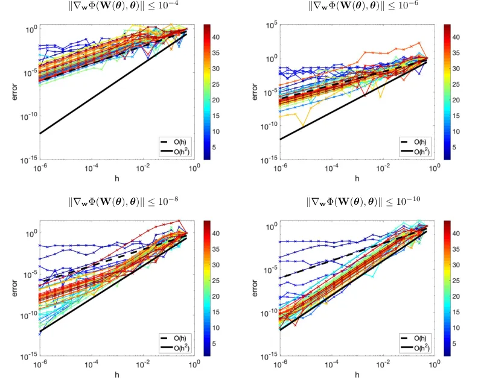

Figure 10: Accuracy of $`\nabla\Phi_{\rm red}({\boldsymbol{\theta}})`$
for various choices of Krylov rank when solving the inner optimization
problem. Each color represents a given maximum Krylov rank,
$`r_{\rm max}`$. Each image has a different tolerance on the inner
optimization problem. Ideally, all of the curves should track with the
solid black line representing $`O(h^{2})`$ convergence. This indicates
our gradient $`\nabla\Phi_{\rm red}({\boldsymbol{\theta}})`$ is correct
and we capture the linear approximation perfectly. We observe that once
the tolerance of the inner optimization problem is small enough (bottom
right), the gradient $`\nabla\Phi_{\rm red}({\boldsymbol{\theta}})`$ is
accurate for a reasonable Krylov rank (conservatively,
$`r_{\rm max}\gtrsim 15`$). The tolerance is influences the accuracy
most significantly.

## Appendix B Derivation of the Jacobian for Cross-Entropy

To provide more derivation details, let
$`{\bf z}({\boldsymbol{\theta}})=F({\bf y},{\boldsymbol{\theta}})`$ be
the output features for one sample. The gradient of the full objective
function with respect to $`{\bf W}`$ can be written in several
equivalent variations, specifically

```math
\displaystyle\nabla_{{\bf w}}\Phi({\bf W},{\bf c}) \displaystyle=\text{vec}(\nabla L({\bf W}{\bf z}({\boldsymbol{\theta}}),{\bf c}){\bf z}({\boldsymbol{\theta}})^{\top})
```

```math
\displaystyle\Leftrightarrow({\bf z}({\boldsymbol{\theta}})\otimes{\bf I}_{N_{\rm target}})\nabla L({\bf W}{\bf z}({\boldsymbol{\theta}}),{\bf c})
```

```math
\displaystyle\Leftrightarrow({\bf I}_{N_{\rm out}}\otimes\nabla L({\bf W}{\bf z}({\boldsymbol{\theta}}),{\bf c})){\bf z}({\boldsymbol{\theta}})
```

where $`\nabla L`$ is the gradient of the loss with respect to the first
argument and $`\otimes`$ is the Kronecker product. We omit the
regularization term for simplicity.

For any loss function, the Jacobian of the above gradient with respect
to $`{\boldsymbol{\theta}}`$ is

```math
\displaystyle J_{{\boldsymbol{\theta}}}\nabla_{{\bf w}}\Phi({\bf W},{\bf c}) \displaystyle=({\bf z}({\boldsymbol{\theta}})\otimes{\bf I}_{N_{\rm target}})\nabla^{2}L({\bf W}{\bf z}({\boldsymbol{\theta}}),{\bf c}){\bf W}{\bf J}_{{\boldsymbol{\theta}}}{\bf z}({\boldsymbol{\theta}})+({\bf I}_{N_{\rm out}}\otimes\nabla L({\bf W}{\bf z}({\boldsymbol{\theta}}),{\bf c})){\bf J}_{{\boldsymbol{\theta}}}{\bf z}({\boldsymbol{\theta}}).
```

In the case of cross-entropy, the gradient of the loss with respect to
the first argument has the form

```math
\displaystyle\nabla L({\bf W}{\bf z}({\boldsymbol{\theta}}),{\bf c}) \displaystyle=\frac{1}{|\mathcal{T}|}\left(-{\bf c}+\frac{\exp({\bf W}{\bf z}({\boldsymbol{\theta}}))}{{\bf e}^{\top}\exp({\bf W}{\bf z}({\boldsymbol{\theta}}))}\right)
```

where $`{\bf e}\in\mathds{R}^{N_{\rm target}}`$ is the vector of all
ones. The Hessian of the loss with respect to the first argument for one
sample can be expressed as

```math
\displaystyle\nabla^{2}L({\bf W}{\bf z}({\boldsymbol{\theta}}),{\bf c})=\frac{1}{|\mathcal{T}|}\left[\diag\left(\frac{\exp({\bf g}({\boldsymbol{\theta}}))}{{\bf e}^{\top}\exp({\bf g}({\boldsymbol{\theta}}))}\right)-\frac{\exp({\bf g}({\boldsymbol{\theta}}))\exp({\bf g}({\boldsymbol{\theta}}))^{\top}}{({\bf e}^{\top}\exp({\bf g}({\boldsymbol{\theta}})))^{2}}\right]
```

where
$`{\bf g}({\boldsymbol{\theta}})={\bf W}{\bf z}({\boldsymbol{\theta}})`$
for simplicity.

## Appendix C Data Generation for Surrogate Modeling Examples

To supplement Section 3.2, we provide details about the PDE models.

#### Convection Diffusion Reaction (CDR)

We consider the CDR equation defined on the time interval $`[0,0.5]`$
and spatial domain $`\Omega=(0,1)^{2}`$ with a zero initial condition
and homogeneous Neumann conditions on the boundary
$`\partial\Omega=[0,1]^{2}\setminus\Omega`$, i.e.

```math
\displaystyle\frac{\partial u}{\partial t}=\nabla\cdot(D\nabla u)-{\bf v}\cdot\nabla u+f+{\bf y}^{T}\mathbf{r}(u)\qquad \displaystyle\text{on }\Omega\times(0,0.5]
```

```math
\displaystyle D\nabla u\cdot\mathbf{n}=0\qquad \displaystyle\text{on }\partial\Omega\times(0,0.5]
```

```math
\displaystyle u=0\qquad \displaystyle\text{on }\Omega\cup\partial\Omega\times\{0\}
```

where $`u:[0,1]^{2}\times[0,0.5]\to\mathds{R}`$ is the state variable
(e.g., concentration), $`D=0.5`$ is the diffusion coefficient,
$`{\bf v}:(0,1)^{2}\to\mathds{R}^{2}`$ is the (stationary) velocity
field given by

```math
\displaystyle{\bf v}(x_{1},x_{2})=\left(4.5\left(1+0.8\sin(2\pi x_{1})\right),5.5\left(0.5-x_{2}\right)\right),
```

and $`f:[0,1]^{2}\times[0,0.5]\to\mathds{R}`$ is the source term given
by

```math
\displaystyle f(x_{1},x_{2},t)= \displaystyle\hskip 7.11317pt1000\left(1.0+0.3\cos(2\pi t)\right)\exp(-200\left((x_{1}-0.2)^{2}+(x_{2}-0.2)^{2}\right))
```

```math
\displaystyle+800\left(1.2+0.4\sin(4\pi t)\right)\exp(-200\left((x_{1}-0.6)^{2}+(x_{2}-0.8)^{2}\right))
```

```math
\displaystyle+900\left(0.9+0.2\sin(6\pi t)\right)\exp(-200\left((x_{1}-0.3)^{2}+(x_{2}-0.6)^{2}\right)).
```

The velocity field $`\mathbf{v}`$ and centers of the Gaussian source
locations are shown in the left panel of Figure 11. The reaction term
$`{\bf y}^{T}\mathbf{r}(u)`$ (a nonlinear function of the state $`u`$)
is the inner product of the parameter vector
$`{\bf y}\in\mathbb{R}^{55}`$ and

```math
\displaystyle\mathbf{r}(u)=\overline{r}\left(r_{1,2}(u),r_{1,3}(u),\dots,r_{1,11(u)},r_{2,3}(u),r_{2,4}(u),\dots,r_{2,11}(u),r_{3,4}(u),\dots,r_{10,11}(u)\right)^{\top}
```

which combines the reaction functions

```math
\displaystyle r_{i,j}(u)=\left(\frac{C\exp{\left(\ln\left({C^{-2}}\right)\frac{u-u_{i}}{u_{j}-u_{i}}\right)}}{1+C\exp{\left(\ln\left({C^{-2}}\right)\frac{u-u_{i}}{u_{j}-u_{i}}\right)}}\right),
```

where $`C=\frac{10^{-3}}{1-10^{-3}}`$ and $`u_{i}=5+6(i-1)`$,
$`i=1,2,\dots,11`$, and the spatially heterogeneous scaling field

```math
\displaystyle\overline{r}(x_{1},x_{2}) \displaystyle=500\left(0.8+0.2\sin(2\pi x_{1})\cos(2\pi x_{2})+x_{2}\right).
```

The reaction functions $`\{r_{i,j}\}`$ are a set of $`55`$ sigmoid
functions which activate (begin taking values $`\gg 0`$) and saturate
(approach their vertical asymptote 1) for different values of $`u`$,
i.e. they model reactions which occur over various concentration ranges.
The center panel of Figure 11 shows each $`r_{i,j}`$ plotted as a
function of $`u`$.

The state $`u`$ is initially zero, but increases through the time
dependent forcing $`f`$, is advected toward $`(1.0,0.5)`$ by the
velocity field $`\mathbf{v}`$, and undergoes diffusion and spatially
heterogeneous reaction. The right panel of Figure 11 displays a typical
realization of the state $`u`$ at the final time $`t=0.5`$.

We solve the PDE using linear finite elements on a rectangular mesh
containing 151 nodes in each spatial dimension, and 51 steps using
backward Euler on a uniform time grid.

The reaction function coefficients (the input data)
$`{\bf y}\in\mathbb{R}^{55}`$ are generated by sampling each component
of $`{\bf y}`$ independently from a uniform distribution on $`[0,1]`$
and subsequently normalizing by the sum of components. The target data
$`{\bf c}`$ is generated by evaluating the solution $`u(x_{1},x_{2},t)`$
at six spatial locations (indicated by the circles overlaying the plot
in the right panel of Figure 11) for each of the final twelve time
steps, i.e. at times $`t=0.39+0.01k`$, $`k=0,1,\dots,11`$.

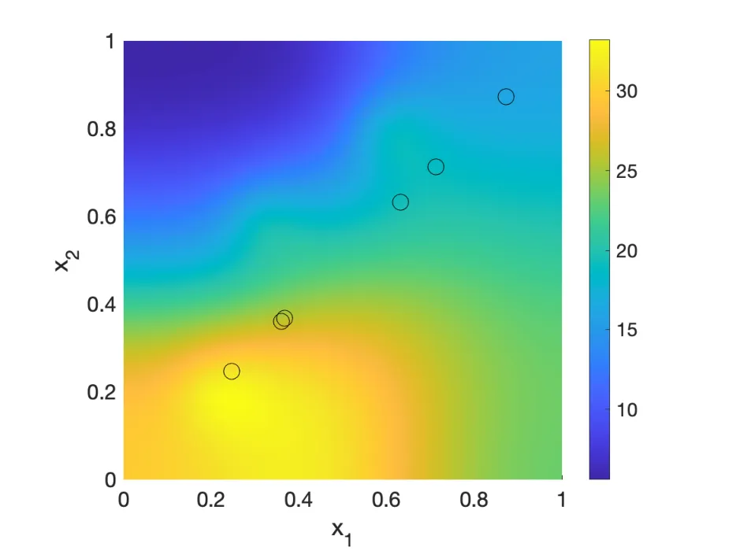

Figure 11: Visualizing the generation for the Convection Diffusion
Reaction dataset. Left: velocity field $`\mathbf{v}`$ with direction
denoted by the arrow heads and magnitude by the arrow size, and the
Gaussian source locations indicated by dots; center: plot of each
reaction functions $`\{r_{i,j}\}`$; right: time $`t=0.5`$ snapshot of a
state realization with the observation locations indicated by circles.

#### Direction Current Resistivity (DCR)

The PDE modeling the electric potential in the DCR example is given by
Poisson’s equation on the spatial domain
$`\Omega=(0,2)\times(0,2)\times(0,1)`$ with homogenous Neumann
conditions on
$`\partial\Omega=[0,2]\times[0,2]\times[0,1]\setminus\Omega`$, i.e.

```math
\displaystyle-\nabla\cdot\left(m(\cdot,{\bf y})\nabla u\right)=q\qquad \displaystyle\text{on }\Omega
```

```math
\displaystyle\nabla u\cdot\mathbf{n}=0\qquad \displaystyle\text{on }\partial\Omega
```

where $`u:\Omega\to\mathds{R}`$ is the state variable (e.g., the
electric potential) and $`q:\Omega\to\mathds{R}`$ is a source (e.g., a
dipole) visualized in Figure 12.

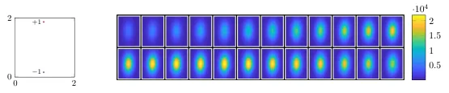

Figure 12: Visualizing the source and conductivity region for the DC
Resistivity dataset. Left: The dipole source $`q`$ in the
$`x_{1}-x_{2}`$ plane at the surface $`x_{3}=1`$. The dipole source is
$`-1`$ at the coordinate $`(1,\frac{1}{6})`$ and is $`+1`$ at the
coordinate $`(1,\frac{11}{6})`$, $`q(x_{1},x_{2},x_{3})=0`$ for
$`x_{3}<1`$; right: Data generation of the DC Resistivity data set. We
visualize the conductivity, $`m`$, to detect. Each image is a slice
parallel to the $`x_{1}`$-$`x_{2}`$-plane. The top left is the surface,
and left-to-right, top-to-bottom progresses down in depth.

The model or control variable
$`m:\Omega\times\mathds{R}^{N_{\rm in}}\to\mathds{R}_{+}`$ (e.g.,
conductivity), parameterized by $`{\bf y}\in\mathds{R}^{3}`$, is given
by

```math
\displaystyle m(\mathbf{x};{\bf y})=\exp\left(10\exp\left(-\frac{1}{y_{2}^{2}}\left(\left\|\diag(\sqrt{2},1){\bf Q}(y_{3})\begin{pmatrix}x_{1}-1\\
x_{2}-1\end{pmatrix}\right\|^{2}+(x_{3}-y_{1})^{2}\right)\right)\right),
```

where $`\mathbf{x}=(x_{1},x_{2},x_{3})`$ and $`{\bf Q}(y_{3})`$ is the
$`2\times 2`$ rotation matrix parameterized by the angle $`y_{3}`$. We
visualize one instance of the ellipsoidal conductivity region to detect
in Figure 12.

We solve the PDE using a Finite Volume approach \[25\] with a
rectangular mesh containing $`48`$, $`48`$, and $`24`$ cells in each
dimension, respectively.

The model parameters (the input data) $`{\bf y}\in\mathds{R}^{3}`$ are
generated by sampling from a uniform distribution on
$`[0,1]\times[0.25,3]\times[0,\pi]`$. The target data
$`{\bf c}\in\mathds{R}^{882}`$ is generated by measuring the differences
in the electric potential $`u`$ at points in a uniform $`21\times 21`$
rectangular grid in the $`x_{1}`$-$`x_{2}`$ plane at the surface
($`x_{3}=1`$). Collecting the differences in the $`x_{1}`$ and $`x_{2}`$
directions at each of these 441 points gives
$`{\bf c}\in\mathds{R}^{882}`$. Because the data was generated with a
large dipole source, we subtract the mean from all the samples so
$`{\bf c}`$ is the distinguishing features rather than the dominant
source.

## Appendix D CIFAR-10 Experimental Setup

The convolutional neural network architecture is summarized in table 3.
We end with a final affine layer to fit the $`64`$ output features to
the $`10`$ classes. We initialize the weights of the nonlinear feature
extractor, $`{\boldsymbol{\theta}}`$, using the Kaiming uniform
initialization \[29\] and, for the non-VarPro cases, initialize the
weights of the linear classifier $`{\bf W}`$ using variable projection
on the full training dataset.

The run-time of the inner optimization for GNvpro is about $`14.2\%`$ of
the entire training time. We note that for the CIFAR-10 experiment,
there is a GPU-CPU transfer in our prototype implementation which can be
improved. We train the network weights $`{\boldsymbol{\theta}}`$ on the
GPU, but solve for $`{\bf W}`$ on the CPU, hence the slightly increased
percentage of run-time for the inner optimization problem. The overhead
is still small given that we can solve the optimization problem (i.e.,
fit the training data) so quickly. We further mention the network in our
CIFAR-10 experiments is very shallow. For deeper networks, the run-time
to solve for $`{\bf W}`$ will be a smaller percentage of the total
training run-time.

|                    |                                                      |                          |                      |
| ------------------ | ---------------------------------------------------- | ------------------------ | -------------------- |
| Layer Type         | Description                                          | \# of Output Features    | \# of Weights        |
| Convolution + ReLU | $`32`$, $`5\times 5\times 3`$ filters, stride $`1`$  | $`32\times 32\times 32`$ | $`2400`$             |
| Average Pooling    | $`2\times 2`$ pool, stride $`2`$                     | $`16\times 16\times 32`$ | $`\--`$              |
| Convolution + ReLU | $`64`$, $`5\times 5\times 32`$ filters, stride $`1`$ | $`16\times 16\times 64`$ | $`51200`$            |
| Average Pooling    | $`16\times 16`$ pool, stride $`16`$                  | $`1\times 1\times 64`$   | $`\--`$              |
| Affine Layer       | $`10\times 64`$ matrix + $`10\times 1`$ vector       | $`10\times 1`$           | $`650`$              |
| Total              |                                                      |                          | $`53600`$ $`(+650)`$ |

Table 3: CIFAR-10 Convolutional Neural Network architecture and
learnable weights. $`{\bf W}`$ corresponds to the weights of the final
affine layer. For the reduced problem, $`{\bf W}`$ is optimized
explicitly, and hence does not count as a learnable parameter.

We obtained these hyperparameters by training the network with various
combinations of parameter choices and selecting the best performance. In
the SAA method, we varied the rank of the Krylov space, the number of
trust-region iterations, the batch size, the number of epochs, and the
regularization parameters and chose the options that gave GNvpro a good
validation accuracy (see fig. 13 for examples). We used these same
parameters for full GN and L-BFGSvpro. In the SA methods, we selected
the regularization parameters from GNvpro and varied the batch size and
learning rate such that Nesterov had a good validation accuracy
(see fig. 14 for learning rate examples) We used the same parameters for
ADAM. We note that while our experiments utilize the best parameters for
GNvpro and Nesterov, we tested the other parameter options on all
optimization methods. The best parameters for GNvpro and Nesterov
corresponded to one of the top performances of the other methods as
well; there was not another set of parameters we tested that
considerably improved the presented results in fig. 8.

[TABLE]

Figure 13: GNvpro regularization parameter tuning CIFAR-10 experiment.
Regularization parameters were chosen to give the best validation
accuracy while providing fast convergence of the training loss without
observing significant semiconvergence behavior on the validation loss..
We chose $`\alpha_{1}=10^{-4}`$ and $`\alpha_{2}=10^{-2}`$. Other
candidates were possible, but would not have significantly impacted the
presented results.

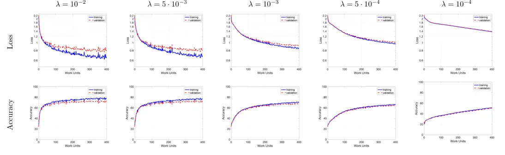

Figure 14: Nesterov learning rate tuning for the CIFAR-10 experiment.
The learning rate was chosen to give the best validation accuracy while
maintaining a small generalization gap. There was a noticeable accuracy
advantage of using $`\lambda=5\cdot 10^{-3}`$ over the
traditionally-recommended $`10^{-3}`$ in this experiment.
