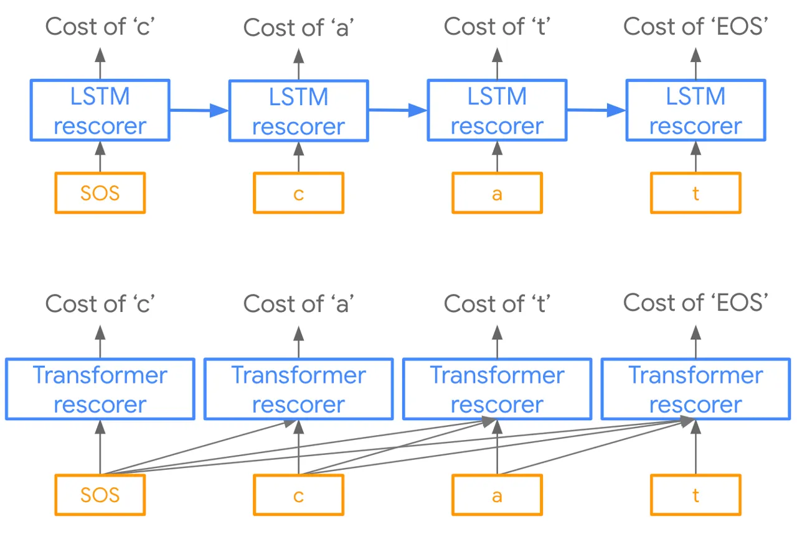
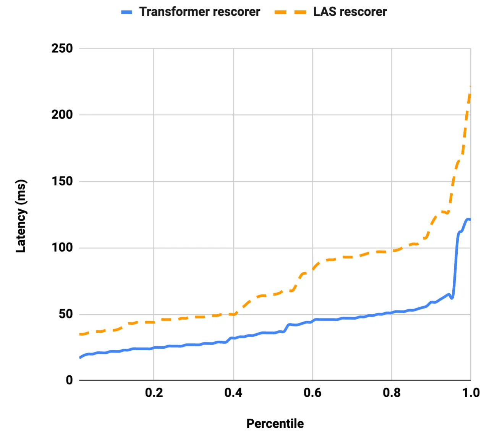

# Parallel Rescoring with Transformer for Streaming On-Device Speech Recognition

^(∗)Equal contribution.

###### Abstract

Recent advances of end-to-end models have outperformed conventional
models through employing a two-pass model. The two-pass model provides
better speed-quality trade-offs for on-device speech recognition, where
a $`1st`$-pass model generates hypotheses in a streaming fashion, and a
$`2nd`$-pass model re-scores the hypotheses with full audio sequence
context. The $`2nd`$-pass model plays a key role in the quality
improvement of the end-to-end model to surpass the conventional model.
One main challenge of the two-pass model is the computation latency
introduced by the $`2nd`$-pass model. Specifically, the original design
of the two-pass model uses LSTMs for the $`2nd`$-pass model, which are
subject to long latency as they are constrained by the recurrent nature
and have to run inference sequentially. In this work we explore
replacing the LSTM layers in the $`2nd`$-pass rescorer with Transformer
layers, which can process the entire hypothesis sequences in parallel
and can therefore utilize the on-device computation resources more
efficiently. Compared with an LSTM-based baseline, our proposed
Transformer rescorer achieves more than $`50\%`$ latency reduction with
quality improvement.

Wei Li^(∗), James Qin^(∗), Chung-Cheng Chiu, Ruoming Pang, Yanzhang He

Google Inc., USA

{mweili, jamesqin, chungchengc, rpang, yanzhanghe}@google.com

Index Terms: Streaming speech recognition, Transformer, Latency,
Rescoring

## 1 Introduction

There has been a growing interest in building on-device streaming speech
recognition models, which provide recognition results instantly as words
are being spoken \[1\]. Such models make predictions based on partial
context under strict latency requirements \[2, 3, 4\]. As a result the
streaming models tend to be less accurate than non-streaming models,
which have access to the entire utterance.

Previous work have shown that this issue can be alleviated by combining
a second-pass rescoring model \[5\] with streaming models, where the
rescoring model uses the Listen, Attend, and Spell (LAS) architecture
\[6\]. LAS has access to the full context of the utterance and therefore
provides better quality than the streaming models \[7\]. From user’s
perspective, such a two-pass speech model exhibits the advantages of
both streaming and non-streaming models—words are recognized as they are
spoken and the final results have high accuracy.

The canonical architecture of the LSTM-based LAS model, however, is
designed for beam search and is not efficient as a $`2nd`$-pass
rescoring model. The LSTM \[8\] layers process hypothesis tokens
sequentially, with temporal dependency between timesteps. On the other
hand, for the $`2nd`$-pass rescoring, all hypothesis tokens are
available. A more efficient design of the rescorer model will be to
rescore all tokens in parallel.

In recent years there have been a growing success in applying
Transformer \[9\] for machine translation and language modeling \[10\],
and speech recognition \[11, 12, 13, 14\]. Transformer applies
self-attention to capture the sequential relation among input features,
and therefore does not have the recurrent constraint. This allows
Transformer to compute self-attention in parallel and significantly
increase the computation efficiency. The Transformer architecture
proposed in \[9\] consists of an encoder and a decoder, where each
decoder layer has an additional cross-attention that summarizes the
encoder output based on the self-attention output.

In this work, we address the sequential dependency issue of the original
LSTM-based rescoring model with Transformer. Specifically, the paper
proposes to use Transformer as the second-pass rescorer for parallel
rescoring of hypothesis tokens. Unlike beam search, where the
Transformer decoder still has to run autoregressively, the rescoring
scenario allows parallel processing of the full hypothesis sequence.
Such parallelism reduces the lengths of temporal dependency paths from
$`\mathcal{O}(n)`$ to $`\mathcal{O}(1)`$, where $`n`$ corresponds to the
hypothesis length. This allows the Transformer rescorer to utilize
on-device computation capacity much more efficiently. We further improve
the inference speed of the Transformer rescorer by reducing the number
of cross-attention in the decoder. The Transformer rescorer improves the
Word Error Rate (WER) of Google’s voice search query test set to
$`5.7\%`$ from $`6.0\%`$ with LSTM rescoring. On Librispeech \[15\] the
Transformer rescorer improves the WER to $`3.9\%`$ on test clean and
$`9.8\%`$ on test other compared to $`4.0\%`$ and $`10.0\%`$ with LSTM
rescoring. The $`90`$th percentile second-pass latency, benchmarked on a
Google Pixel4 phone on CPUs, is reduced to $`57`$ms from previous
$`127`$ms with LSTM rescoring.

Figure 1: The architecture of two-pass model with Transformer.

## 2 Transformer Rescorer

### 2.1 Two-Pass Model

A two-pass model consists of a $`1st`$-pass model and a $`2nd`$-pass
model. Here we use RNN-T \[16, 17\] as the $`1st`$-pass model and
Transformer for the $`2nd`$-pass model. Specifically, our
Transformer-based two-pass model, as demonstrated in Figure 1, consists
of four components: RNN-T encoder, RNN-T decoder, additional encoder,
and Transformer decoder as the rescorer. The input acoustic frames are
denoted as $`x=(x_{1},...,x_{T})`$, where $`x_{t}\in R^{d}`$ are stacked
log-mel filterbank energies ($`d=512`$) and $`T`$ is the number of
frames in $`x`$. In the $`1st`$-pass, each acoustic frame $`x_{t}`$ is
passed through RNN-T encoder, consisting of a multi-layer LSTM \[8\], to
get encoder output. RNN-T decoder takes the acoustic features from RNN-T
encoder to generate the hypotheses in a streaming fashion, denoted as
$`y=(y_{1},...,y_{s})`$ where $`s`$ is the label sequence length. Here
$`y`$ is a sequence of word-piece tokens \[18\]. In the $`2nd`$-pass,
the full output of the RNN-T encoder is passed to a small additional
encoder to generate $`e_{1},...,e_{T}`$, which is then passed to
Transformer decoder. The additional encoder is added as it is found to
be useful to adapt the encoder output to be more suitable for the
second-pass model \[2\]. The RNN-T model structure and the additional
encoders are exactly the same as \[2\]. During training, the Transformer
decoder computes output label sequence according to the full audio
sequence $`e_{1},...,e_{T}`$. More details about the rescorer training
is elucidated in Section 2.3. During decoding, the Transformer decoder
rescores multiple top hypotheses from RNN-T, $`y_{1},...,y_{s}`$.

### 2.2 Transformer Rescorer Architecture

Figure 2: Transformer rescorer. The Transformer rescorer combines
conventional Transformer decoders (containing cross-attention) and
Transformer self-decoders (without cross-attention) for more efficient
inference. The figure omits the normalization and residual links to
simplify the illustration.

The architecture of our Transformer rescorer is based on the
conventional Transformer decoder \[9\] with some cross-attention layers
being removed. The conventional Transformer decoder layer contains both
the self-attention and the cross-attention, where the query of the
cross-attention originates from the output of the self-attention. In the
Transformer rescorer, we improve the rescorer efficiency by removing the
cross-attention from some decoder layers and interleave those layers
with the conventional decoder layers. The decoder layer without the
cross-attention shares the same architecture as the conventional
Transformer encoder layer \[9\]. The architecture of the resulting
rescorer is illustrated in Figure 2, where layers without
cross-attention are annotated as _self-decoder_. The Transformer
rescorer takes the RNN-T’s hypothesis as input and feed the tokens to
the self-attention layer. And the cross-attention layers attend to the
encoder output to summarize the acoustic signals. In our rescorer model,
there are $`4`$ Transformer layers, each with the attention model
dimension $`d_{model}=640`$ and feed forward dimension $`d_{ff}=2560`$.
Both cross-attention and self-attention layers use multi-headed
attention with $`8`$ heads. The rescorer model has $`27.6M`$ parameters.

Our design of keeping only two cross-attention layers in the rescorer is
based on observing the attention mechanism of the Transformer decoder.
In the first Transformer decoder layer, the self-attention conditions
only on the hypothesis tokens, therefore the resulting cross-attention
generates its query solely based on language modeling information. The
missing of acoustic information on generating attention query inherently
limit the effectiveness of the first cross-attention. After the first
cross-attention layer, the output of the first decoder layer contains
acoustic information, and the following decoder layers can condition on
both the acoustic and language modeling information to generate
effective cross-attention queries. Thus, it is critical to have the
second cross-attention layer in the decoder. On the other hand, the
additional cross-attention layers beyond the second one do not introduce
additional modality and have diminishing returns in terms of the model
quality. As a comparison, the cross-attention of the LAS model
conditions on both the previous attention context and the text tokens,
and requires only one cross-attention in the decoder. We demonstrated
these property with an ablation study in Section 3.

### 2.3 Rescorer Training

Same with the LAS rescoring training described in \[5\], Transformer
rescorer model is trained after the $`1st`$-pass model training. During
$`2nd`$-pass training, RNN-T encoder and RNN-T decoder are freezed.
Additional encoder and Transformer rescorer are trained in two stages:
cross entropy (CE) and minimum word error rate (MWER) training \[19\].
During CE training, frozen RNN-T encoder generates the acoustic features
for additional encoder, and Transformer rescorer is trained to predict
groundtruth sequence with the full audio context from additional encoder
and the prefix of the label sequence context:
$`p(y_{l}|x,y_{1}...y_{l-1})`$, where $`l`$ is the label to predict.
During MWER training, the Transformer rescorer is trained to re-rank the
hypotheses generated from RNN-T, which bridges the gap from CE training
to inference \[5\]. More specifically, given acoustic input $`x`$,
groundtruth transcript $`y\ast`$, the probability computed by rescorer
model $`P(y_{m}|x)`$ for any given target sequence $`y_{m}`$, and a set
of hypotheses $`H_{m}={h_{1},...,h_{b}}`$ where b is the beam-size, the
MWER loss is defined as

```math
L_{\text{MWER}}(x,y\ast)=\sum_{y_{m}\in H_{m}(x)}P^{\prime}(y_{m}|x,H_{m})\left[W^{\prime}(y_{m},y\ast)-\widehat{W}\right]
```

where
$`P^{\prime}(y_{m}|x,H_{m})=\frac{P(y_{m}|x)}{\sum_{y_{i}\in H_{m}}P(y_{i}|x)}`$
represents the conditional probability the Transformer rescorer assigns
to hypothesis $`y_{m}`$ among all hypotheses in $`H_{m}`$, and
$`W^{\prime}(y\ast,y_{m})`$ is the number of word errors of $`y_{m}`$,
and $`\widehat{W}`$ is the average number of word errors among
$`H_{m}`$. In our MWER training we use the N-Best approximation approach
for calculating the expected word errors \[19\].

## 3 Quality Experiments

### 3.1 Experiment Setup

We conduct experiments on the Librispeech \[15\] dataset and a
large-scale internal dataset. We use SpecAugment \[20\] with the same
configuration as described in \[21\] during training. Similar to \[2\],
we apply constant learning rate and maintain Exponential moving average
(EMA) \[22\] of the weights during training, and use the EMA weights for
evaluation. Both LSTM and Transformer rescorer are trained with CE and
MWER. The N-Best size of MWER training is $`4`$, which matches the
rescoring behavior during evaluation, where top $`4`$ hypotheses from
RNN-T are used for rescoring. The prediction targets are $`4096`$ word
pieces \[18\] derived using a large corpus of text transcripts. The
LSTM-based rescorer has size $`33M`$ and the Transformer has $`27.6M`$
parameters. All models are implemented in Tensorflow \[23\] using the
Lingvo \[24\] toolkit and trained on $`8\times 8`$ Tensor Processing
Units (TPU) slices with a global batch size of $`4096`$.

### 3.2 Librispeech Experiment

In this experiment, the models are trained on the Librispeech 960h
training set and evaluated on the clean and noisy test sets without an
external language model. In order to maintain low-latency streaming
speech recognition, the $`1st`$-pass RNN-T models in all the compared
systems use a uni-directional LSTM encoder with 0 right context frame.
As is shown in Table 1, both the LSTM rescorer and the Transformer
rescorer significantly improve the WER of the clean and noisy test sets
compared to the RNN-T only model with $`10`$-$`20\%`$ relative
improvement, alleviating the limited context problem for the
$`1st`$-pass model while still maintaining low-latency streaming
recognition. The Transformer rescorer further improves the WER slightly
over the LSTM rescorer, and also significantly reduce the $`2nd`$-pass
latency, which is studied in detail in Section 4.

| Model                | Test clean | Test other |
| -------------------- | ---------- | ---------- |
| RNN-T only           | $`4.9`$    | $`11.2`$   |
| LSTM rescorer        | $`4.0`$    | $`10.0`$   |
| Transformer rescorer | $`3.9`$    | $`9.8`$    |

Table 1: Librispeech test sets word error rate

### 3.3 Large Scale Experiment on Voice Search

We perform a large scale experiment on an internal task, Google Voice
Search, and show the proposed Transformer rescorer is also effective. In
this experiment, the models are trained on a multi-domain training set
as described in \[25\]. These multi-domain utterances span domains of
search, farfield, telephony and YouTube. The test set includes
$`\sim 14K`$ Voice-search utterances (VS) extracted from Google traffic.
All datasets are anonymized and hand-transcribed. The transcription for
YouTube utterances is done in a semi-supervised fashion \[26, 27\].
Following \[28, 29, 2\], we train the first-pass RNN-T to also emit the
end-of-sentence decision to reduce the endpointing latency, allowing
2nd-pass rescoring to execute early.

As is shown in Table 2, the Transformer rescorer improves the WER from
$`6.0`$ to $`5.7`$ on the VS test set compared with the LSTM rescorer,
both of which are trained with CE and MWER. Compared with $`1st`$-pass
model, the Transformer rescorer achieves relative $`10\%`$ WER
improvement.

| Model                     | VS      |
| ------------------------- | ------- |
| RNN-T only                | $`6.4`$ |
| LSTM rescorer             | $`6.0`$ |
| Transformer rescorer CE   | $`5.9`$ |
| Transformer rescorer MWER | $`5.7`$ |

Table 2: Voice Search test set word error rate

### 3.4 Full Context Rescoring

The additional capability that the Transformer rescorer can bring is to
utilize the full hypothesis when rescoring every target token. The
original LSTM-based rescorer scores each target token conditioned only
on the tokens before it. Specifically, the LSTM rescorer learns a
conditional probability $`p(y_{t}|x,y_{0},...,y_{t-1})`$ for each
prediction target $`y_{t}`$ where $`y`$ denotes hypothesis tokens from
RNN-T and $`x`$ denotes acoustic features. A conventional Transformer
decoder uses causal self-attention and also learns
$`p(y_{t}|x,y_{0},...,y_{t-1})`$. We explored extending the
self-attention to access also the future label context and as a result
learns to score target tokens with $`p(y_{t}|x,y)`$. During CE training,
using groundtruth sequence as the full context makes the training target
trivial. Thus we randomly swap different proportions of the groundtruth
tokens that fed to the self-attention layer with alternative tokens
sampled within the word-piece vocabulary. Some sentinel tokens like SOS,
EOS, UNKNOWN and RNN-T’s blank symbol are excluded to be used as random
tokens. The prediction targets are the original groundtruth sequence.
During MWER training, the RNN-T hypothesis is used as the decoder input
to match the inference scenario. With this experiment, $`15\%`$ random
proportion works out the best and achieves the same $`5.7\%`$ WER on the
voice search task. Thus, we report results with causal self-attention
for the experiments throughout the paper.

## 4 Latency Optimizations

In this section, we measure the additional latency introduced by the
$`2nd`$-pass rescorer on a Google Pixel4 phone on CPUs. For efficient
on-device execution, all models are converted to TensorFlow Lite format
with post-training dynamic range quantization using the TensorFlow Lite
Converter \[30\]. Matrix multiplication is operated in 8-bits with
little accuracy loss. The benchmark suite consists of 89 utterances with
voice action queries. The LSTM rescorer latency baseline is fully
optimized and is measured with lattice rescoring with batching described
in \[2\].

### 4.1 Effect of Cross-Attention Layers

We investigate the impact of the number of cross-attention layers on
quality and latency. As shown in Table 3, we start with cross-attention
on the $`1st`$ decoder layer and gradually add more. We observe a
noticeable quality improvement at first, which later quickly diminishes.
Specifically, with $`2`$ cross-attentions the rescorer achieves a
$`0.4`$ WER improvement than $`1`$ cross-attention, but no further
improvement is realized by adding more of it. In addition, when $`2`$
cross-attentions are used, we find that applying them on the $`1st`$ and
$`3rd`$ layers improves WER by $`0.15`$ than on the $`1st`$ and $`2nd`$
layers. In the end, by selectively applying cross-attention, we achieved
a $`\sim 20ms`$ latency reduction (Table 4) and a $`12.3\%`$ ($`4M`$)
parameter size reduction without quality compromise.

| Cross attention layers | WER     |
| ---------------------- | ------- |
| 1st                    | $`6.1`$ |
| 1st & 2nd              | $`5.8`$ |
| 1st & 3rd              | $`5.7`$ |
| All 4 layers           | $`5.7`$ |

Table 3: Effect of cross-attention layers

### 4.2 Parallelism in Transformer Rescoring



Figure 3: Parallel rescoring with Transformer.

As is illustrated in Figure  3, with hypothesis labels ready from the
$`1st`$-pass decoder output, Transformer rescorer can finish the
computation in a single batch step as opposed to a series of sequential
steps as in LSTM rescorer, which could better leverage multi-threading
during inference. The batch size for transformer rescorer corresponds to

```math
\mbox{number\_of\_hyps}\times\mbox{hyp\_length}\times\mbox{number\_of\_attention\_heads}.
```

Taking the utterance at the $`90`$th percentile latency as an example,
with the top $`4`$ hypotheses used, the batch size is
$`4\times 12\times 8=384`$. This large batch size provides better
parallelism and as a result benefits more from using $`2`$ threads which
reduces $`35ms`$ latency (Table 4). The multi-threading benefit is not
witnessed in the LSTM-based rescorer. Potentially it might be due to (1)
limited parallelism in LSTM, where batching is done within each
inference step with a relatively smaller batch size being
$`\mbox{number\_of\_hyps}\times\mbox{number\_of\_gates}`$ and (2)
utilizing multi-threading within each inference step could introduce
extra overhead due to context switch across inference steps and layers.

### 4.3 Latency Measurements and Distributions

An overall breakdown for latency optimizations is shown in Table 4. The
Transformer rescorer achieves a $`55\%`$ latency reduction compared to
the LSTM rescorer, measured on the utterance with the $`90`$th
percentile latency with the LSTM rescorer, which has $`6s`$ audio and
$`12`$ word-piece tokens in the transcript.

The initial latency of the Transformer rescorer with $`4`$
cross-attention layer is $`106ms`$, which then improves to $`92ms`$ by
keeping only $`2`$ cross-attentions. Compared to $`127ms`$ from LSTM
baseline, the $`27\%`$ latency improvement is from the reduced FLOPs.
Transformer rescorer with $`4`$ and $`2`$ cross-attentions provide a
$`15\%`$ ($`340M`$) and $`20\%`$ ($`320M`$) FLOPs reduction compared to
LSTM ($`400M`$).

Using two threads reduces the latency by an additional $`35ms`$ for
Transformer rescorer, while the LSTM rescorer does not benefit from
multi-threading.

| Optimizations                           | Latency(ms) |
| --------------------------------------- | ----------- |
| Initial latency ($`4`$ cross attention) | $`106`$     |
| $`2`$ cross attention                   | $`92`$      |
| Parallelism in two threads              | $`57`$      |
| LSTM baseline                           | $`127`$     |

Table 4: Computational latency for the Transformer rescorer with various
optimizations, benchmarked on Pixel4 CPUs.

We also compared the latency distribution over the full benchmark suite,
demonstrated in Figure 4. The speech time ranges from $`1.5s`$ to
$`9.3s`$ in the benchmark. The output label sequence length varies from
$`3`$ to $`29`$. Transformer rescorer is consistently $`\sim 50\%`$
faster than LSTM rescorer at almost every latency percentile.



Figure 4: Latency comparison by percentile.

## 5 Conclusion

In this work we present a Transformer rescorer for a two-pass model. Our
proposed Transformer rescorer reduces more than $`50\%`$ of the
on-device computation latency in second-pass model by taking advantage
of the parallelism in Transformer decoder and reducing the number of
cross attention layers. On a Google Voice Search task the Transformer
rescorer achieves $`5.7\%`$ WER compared with $`6.0\%`$ of an LSTM
rescorer. On Librispeech the Transformer rescorer achieves $`3.9\%`$ and
$`9.8\%`$ WER on test clean and test other, also lower than $`4.0\%`$
and $`10.0\%`$ of the LSTM rescorer, respectively.

## 6 Acknowledgements

We thank TF-Lite team for the help to get Transformer model running on
device, especially T.J. Alumbaugh, Jared Duke, Jian Li, Feng Liu and
Renjie Liu. We are also grateful for the insightful discussions with
Shuo-yiin Chang, Ian McGraw, Tara Sainath and Yonghui Wu.

## References

- \[1\] Y. He, T. N. Sainath, R. Prabhavalkar, I. McGraw, R. Alvarez,
  D. Zhao, D. Rybach, A. Kannan, Y. Wu, R. Pang, Q. Liang, D. Bhatia,
  Y. Shangguan, B. Li, G. Pundak, K. C. Sim, T. Bagby, S. yiin Chang,
  K. Rao, and A. Gruenstein, “Streaming end-to-end speech recognition
  for mobile devices,” in _ICASSP 2019 - 2019 IEEE International
  Conference on Acoustics, Speech and Signal Processing (ICASSP)_, 2019.
- \[2\] T. N. Sainath, Y. He, B. Li, A. Narayanan, R. Pang, A. Bruguier,
  S.-y. Chang, W. Li, R. Alvarez, Z. Chen, and et al., “A streaming
  on-device end-to-end model surpassing server-side conventional model
  quality and latency,” _ICASSP 2020 - 2020 IEEE International
  Conference on Acoustics, Speech and Signal Processing (ICASSP)_,
  May 2020.
- \[3\] S.-Y. Chang, B. Li, D. Rybach, Y. He, W. Li, T. Sainath, and
  T. Strohman, “Low Latency Speech Recognition using End-to-End
  Prefetching,” in _Proc. of Interspeech_, 2020.
- \[4\] H. Inaguma, Y. Gaur, L. Lu, J. Li, and Y. Gong, “Minimum latency
  training strategies for streaming sequence-to-sequence asr,” in
  _ICASSP 2020-2020 IEEE International Conference on Acoustics, Speech
  and Signal Processing (ICASSP)_. IEEE, 2020, pp. 6064–6068.
- \[5\] T. N. Sainath, R. Pang, D. Rybach, Y. He, R. Prabhavalkar,
  W. Li, M. Visontai, Q. Liang, T. Strohman, Y. Wu, I. McGraw, and C.-C.
  Chiu, “Two-Pass End-to-End Speech Recognition,” in _Proc. of
  Interspeech_, 2019.
- \[6\] W. Chan, N. Jaitly, Q. V. Le, and O. Vinyals, “Listen, attend
  and spell,” 2015.
- \[7\] C.-C. Chiu, T. N. Sainath, Y. Wu, R. Prabhavalkar, P. Nguyen,
  Z. Chen, A. Kannan, R. J. Weiss, K. Rao, E. Gonina, N. Jaitly, B. Li,
  J. Chorowski, and M. Bacchiani, “State-of-the-art speech recognition
  with sequence-to-sequence models,” in _Proc. of ICASSP_, 2018.
- \[8\] S. Hochreiter and J. Schmidhuber, “Long short-term memory,”
  _Neural Comput._, p. 1735–1780, Nov. 1997.
- \[9\] A. Vaswani, N. Shazeer, N. Parmar, J. Uszkoreit, L. Jones, A. N.
  Gomez, L. u. Kaiser, and I. Polosukhin, “Attention is all you need,”
  in _Advances in Neural Information Processing Systems 30_, 2017, pp.
  5998–6008.
- \[10\] C. Raffel, N. Shazeer, A. Roberts, K. Lee, S. Narang,
  M. Matena, Y. Zhou, W. Li, and P. J. Liu, “Exploring the limits of
  transfer learning with a unified text-to-text transformer,”
  _JMLR_, 2019.
- \[11\] S. Karita, N. Chen, T. Hayashi, T. Hori, H. Inaguma, Z. Jiang,
  M. Someki, N. E. Y. Soplin, R. Yamamoto, X. Wang _et al._, “A
  comparative study on transformer vs rnn in speech applications,”
  _arXiv preprint arXiv:1909.06317_, 2019.
- \[12\] Q. Zhang, H. Lu, H. Sak, A. Tripathi, E. McDermott, S. Koo, and
  S. Kumar, “Transformer transducer: A streamable speech recognition
  model with transformer encoders and rnn-t loss,” _ICASSP 2020 - 2020
  IEEE International Conference on Acoustics, Speech and Signal
  Processing (ICASSP)_, May 2020.
- \[13\] C.-F. Yeh, J. Mahadeokar, K. Kalgaonkar, Y. Wang, D. Le,
  M. Jain, K. Schubert, C. Fuegen, and M. L. Seltzer,
  “Transformer-transducer: End-to-end speech recognition with
  self-attention,” 2019.
- \[14\] L. Dong, S. Xu, and B. Xu, “Speech-transformer: A no-recurrence
  sequence-to-sequence model for speech recognition,” in _2018 IEEE
  International Conference on Acoustics, Speech and Signal Processing
  (ICASSP)_, 2018, pp. 5884–5888.
- \[15\] V. Panayotov, G. Chen, D. Povey, and S. Khudanpur,
  “Librispeech: An asr corpus based on public domain audio books,” in
  _Proc. of ICASSP_, 2015, pp. 5206–5210.
- \[16\] A. Graves, “Sequence transduction with recurrent neural
  networks,” _CoRR_, vol. abs/1211.3711, 2012.
- \[17\] A. Graves, A. r. Mohamed, and G. Hinton, “Speech recognition
  with deep recurrent neural networks,” in _Proc. of ICASSP_, 2013.
- \[18\] M. Schuster and K. Nakajima, “Japanese and Korean Voice
  Search,” in _Proc. of ICASSP_, 2012, pp. 5149–5152.
- \[19\] R. Prabhavalkar, T. N. Sainath, Y. Wu, P. Nguyen, Z. Chen,
  C.-C. Chiu, and A. Kannan, “Minimum word error rate training for
  attention-based sequence-to-sequence models,” _2018 IEEE International
  Conference on Acoustics, Speech and Signal Processing (ICASSP)_,
  Apr 2018.
- \[20\] D. S. Park, W. Chan, Y. Zhang, C.-C. Chiu, B. Zoph, E. D.
  Cubuk, and Q. V. Le, “Specaugment: A simple data augmentation method
  for automatic speech recognition,” in _Interspeech_, 2019.
- \[21\] D. S. Park, Y. Zhang, C.-C. Chiu, Y. Chen, B. Li, W. Chan,
  Q. V. Le, and Y. Wu, “Specaugment on large scale datasets,” in
  _ICASSP_, 2020.
- \[22\] B. Polyak and A. Juditsky, “Acceleration of Stochastic
  Approximation by Averaging,” _SIAM Journal on Control and
  Optimization_, vol. 30, no. 4, 1992.
- \[23\] M. Abadi, P. Barham, J. Chen, Z. Chen, A. Davis, J. Dean,
  M. Devin, S. Ghemawat, G. Irving, M. Isard _et al._, “Tensorflow: A
  System for Large-scale Machine Learning,” pp. 265–283, 2016.
- \[24\] J. Shen, P. Nguyen, Y. Wu, Z. Chen, and et al., “Lingvo: a
  modular and scalable framework for sequence-to-sequence
  modeling,” 2019.
- \[25\] A. Narayanan, R. Prabhavalkar, C.-C. Chiu, D. Rybach,
  T. Sainath, and T. Strohman, “Recognizing Long-Form Speech Using
  Streaming End-to-End Models,” in _Proc. ASRU_, 2019.
- \[26\] H. Liao, E. McDermott, and A. Senior, “Large scale deep neural
  network acoustic modeling with semi-supervised training data for
  youtube video transcription,” in _2013 IEEE Workshop on Automatic
  Speech Recognition and Understanding_, 2013.
- \[27\] H. Soltau, H. Liao, and H. Sak, “Neural Speech Recognizer:
  Acoustic-to-Word LSTM Model for Large Vocabulary Speech Recognition,”
  in _Proc. of Interspeech_, 2017, pp. 3707–3711.
- \[28\] B. Li, S.-Y. Chang, T. N. Sainath, R. Pang, Y. He, T. Strohman,
  and Y. Wu, “Towards fast and accurate streaming end-to-end asr,” in
  _ICASSP 2020-2020 IEEE International Conference on Acoustics, Speech
  and Signal Processing (ICASSP)_. IEEE, 2020, pp. 6069–6073.
- \[29\] S.-Y. Chang, R. Prabhavalkar, Y. He, T. N. Sainath, and
  G. Simko, “Joint endpointing and decoding with end-to-end models,” in
  _ICASSP 2019-2019 IEEE International Conference on Acoustics, Speech
  and Signal Processing (ICASSP)_. IEEE, 2019, pp. 5626–5630.
- \[30\] “Tensorflow lite: Post-training quantization.” \[Online\].
  Available:
  https://www.tensorflow.org/lite/performance/post_training_quantization
