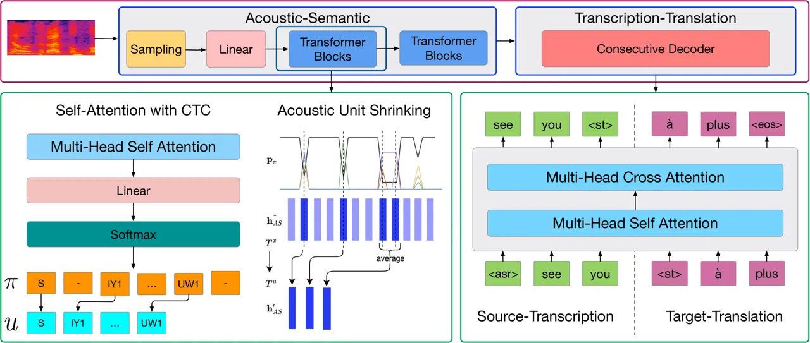

# Consecutive Decoding for Speech-to-text Translation

Qianqian Dong    Mingxuan Wang ^(†)^(†)thanks: The work was done while
QD was a research intern at ByteDance AI Lab.    Hao Zhou    Shuang Xu
   Bo Xu    Lei Li

###### Abstract

Speech-to-text translation (ST), which directly translates the source
language speech to the target language text, has attracted intensive
attention recently. However, the combination of speech recognition and
machine translation in a single model poses a heavy burden on the direct
cross-modal cross-lingual mapping. To reduce the learning difficulty, we
propose COnSecutive Transcription and Translation (COSTT), an integral
approach for speech-to-text translation. The key idea is to generate
source transcript and target translation text with a single decoder. It
benefits the model training so that additional large parallel text
corpus can be fully exploited to enhance the speech translation
training. Our method is verified on three mainstream datasets, including
Augmented LibriSpeech English-French dataset, IWSLT2018 English-German
dataset, and TED English-Chinese dataset. Experiments show that our
proposed COSTT outperforms or on par with the previous state-of-the-art
methods on the three datasets. We have released our code at
https://github.com/dqqcasia/st.

¹ Institute of Automation, Chinese Academy of Sciences (CASIA), Beijing,
100190, China ² School of Artificial Intelligence, University of Chinese
Academy of Sciences, Beijing, 100049, China ³ ByteDance AI Lab, China
{dongqianqian2016, shuang.xu, xubo}@ia.ac.cn, {wangmingxuan.89,
zhouhao.nlp, lileilab}@bytedance.com

## Introduction

Speech translation (ST) aims at translating from source language speech
into the target language text. Traditionally, it is realized by
cascading an automatic speech recognition (ASR) and a machine
translation (MT)  (Sperber et al. 2017; Sperber et al. 2019b; Zhang
et al. 2019; Beck, Cohn, and Haffari 2019; Cheng et al. 2019). Recently,
end-to-end ST has attracted much attention due to its appealing
properties, such as lower latency, smaller model size, and less error
accumulation  (Liu et al. 2019; Liu et al. 2018; Weiss et al. 2017;
Bérard et al. 2018; Duong et al. 2016; Jia et al. 2019).

Although end-to-end systems are very promising, cascaded systems still
dominate practical deployment in industry. The possible reasons are:

a) Most research work compared cascaded and end-to-end models under
identical data situations. However, in practice, the cascaded system can
benefit from the accumulating independent speech recognition or machine
translation data, while the end-to-end system still suffers from the
lack of end-to-end corpora. b) Despite the advantage of reducing error
accumulation, the end-to-end system has to integrate multiple complex
deep learning tasks into a single model to solve the task, which
introduces heavy burden for the cross-modal and cross-lingual mapping.
Therefore, it is still an open problem whether end-to-end models or
cascaded models are generally stronger.

We argue that a desirable ST model should take advantages of both
end-to-end and cascaded models and acquire the practically acceptable
capabilities as follows:

a) it should be end-to-end to avoid error accumulation; b) it should be
flexible enough to leverage large-scale independent ASR or MT data.

At present, few existing end-to-end models can meet all these goals.
Most studies resort to pre-training or multitask learning to bridge the
benefits of cascaded and end-to-end models (Bansal et al. 2019; Sung
et al. 2019; Sperber et al. 2019a). A de-facto framework usually
initializes the ST model with the encoder trained from ASR data (i.e.
source audio and source text pairs) and then fine-tunes on a speech
translation dataset to make the cross-lingual translation. However, it
is still challenging for these methods to leverage the bilingual MT
data, due to the lack of intermediate text translating stage.

Our idea is motivated by two motivating insights from ASR and MT models.

a) A branch of ASR models has intermediate steps to extract acoustic
feature and decode phonemes, before emitting transcription; and b)
Speech translation can benefit from decoding the source speech
transcription in addition to the target translation text.

We propose COSTT, a unified speech translation framework with
consecutive decoding for jointly modeling speech recognition and
translation. COSTT consists of two phases, an acoustic-semantic modeling
phase (AS) and a transcription-translation modeling phase (TT). The AS
phase accepts the speech features and generates compressed acoustic
representations. For TT phases, we jointly model both the source and
target text in a single shared decoder, which directly generates the
speech text sequence and the translation sequence at one pass. This
architecture is closer to cascaded translation while maintaining the
benefits of end-to-end models. The combination of the AS and the
first-part output of the TT phase serves as an ASR model; the TT phase
alone serves as an MT model; while the whole makes an end-to-end speech
translation by ignoring the first-part of TT output. Simple and
effective, COSTT is powerful enough to cover the advantage of ASR, MT,
and ST models simultaneously.

The contributions of this paper are as follows:

1.  We propose COSTT, a unified training framework with consecutive
    decoding which bridges the benefits of both cascaded and end-to-end
    models. 2) As a benefit of explicit multi-phase modeling, COSTT
    facilitates the use of parallel bilingual text corpus, which is
    difficult for traditional end-to-end ST models. 3) COSTT can achieve
    state-of-the-art results on three popular benchmark datasets with less
    external data.

## Related Work



Figure 1: Overview of the proposed COSTT. It consists of two phases, an
acoustic-semantic modeling phase (AS) and a transcription-translation
phase (TT). During AS phase, CTC loss is adopted supervised by phoneme
labels corresponding to source-text. The TT phase decodes source-text
and target-text in a single sequence consecutively.

For speech translation, there are two main research paradigms, the
cascaded system and the end-to-end model (Jan et al. 2018; Jan et al.
2019).

For cascaded system, the most concerned point is how to avoid early
decisions, relieve error propagation and better integrate the separately
trained ASR and MT modules. To relieve the problem of error propagation
and tighter couple cascaded systems:

a) Robust translation models (Cheng et al. 2018; Cheng et al. 2019)
introduce synthetic ASR errors and ASR related features into the source
side of MT corpora. b) Techniques such as domain adaptation (Liu et al.
2003; Fügen 2008), re-segmention (Matusov, Mauser, and Ney 2006),
punctuation restoration (Fügen 2008), disfluency detection (Fitzgerald,
Hall, and Jelinek 2009; Wang et al. 2018; Dong et al. 2019) and so on,
are proposed to provide the translation model with well-formed and
domain matched text inputs. c) Many efforts turn to strengthen the tight
integration between the ASR output and the MT input, such as the n-best
translation, lattices and confusion nets and so on (Sperber and Paulik
2020).

On the other hand, a paradigm shift towards end-to-end system is
emerging to alleviate the drawbacks of cascaded systems. Bérard et al.
(2016); Duong et al. (2016) have given the first proof that it’s
promising to solve speech-to-text translation in an end-to-end way.
After that, end-to-end ST has attracted many attentions in industry and
research communities (Vila et al. 2018; Salesky et al. 2018; Salesky,
Sperber, and Waibel 2019; Di Gangi, Negri, and Turchi 2019; Bahar,
Bieschke, and Ney 2019; Di Gangi et al. 2019; Inaguma et al. 2020).
Prior work mainly explores pre-training with ASR and MT tasks to get a
good point of initialization for ST models (Weiss et al. 2017; Bérard
et al. 2018; Bansal et al. 2019; Stoian, Bansal, and Goldwater 2020).
Additionally, multi-task learning can efficiently transfer knowledge
between different tasks (Anastasopoulos and Chiang 2018; Vydana et al.
2020). Pre-training and multi-task learning have also been widely used
in recent work (Wang et al. 2020a; Dong et al. 2020). Since there still
exists a great gap for the performance between cascaded and end-to-end
ST systems, many methods have been proposed to improve the end-to-end ST
models, such as curriculum learning (Kano, Sakti, and Nakamura 2017;
Wang et al. 2020b), knowledge distillation (Liu et al. 2019), modality
agnostic meta-learning (Indurthi et al. 2019), two-pass decoding (Sung
et al. 2019), attention-passing (Sperber et al. 2019a), data
augmentation (Jia et al. 2019; Bahar et al. 2019; Pino et al. 2019),
model adaptation (Di Gangi et al. 2020), self-training (Pino et al. 2020) and so on.

Due to the scarcity of data resource, how to efficiently utilize ASR and
MT parallel data is a big problem for ST, especially in the end-to-end
situation. However, existing end-to-end methods mostly resort to
ordinary pretraining or multitask learning to integrate external ASR
resources, which may face the issue of catastrophic forgetting and modal
mismatch. And it is still challenging for previous methods to leverage
external bilingual MT data efficiently.

## Proposed COSTT Approach

### Overview

The detailed framework of our method is shown in Figure 1. To be
specific, the speech translation model accepts the original audio
feature as input and outputs the target text sequence. We divide our
method into two phases, including the acoustic-semantic modeling phase
(AS) and the transcription-translation modeling phase (TT). Firstly, the
AS phase accepts the speech features, outputs the acoustic
representation, and encodes the shrunk acoustic representation into
semantic representation. In this work, the small-grained unit, phonemes
are selected as the acoustic modeling unit. Then, the TT phase accepts
the AS’s representation and consecutively outputs source transcription
and target translation text sequences with a single shared decoder.

#### Problem Formulation

The speech translation corpus usually contains
speech-transcription-translation triples. We add phoneme sequences to
make up quadruples, denoted as
$`\mathcal{S}=\{(\mathbf{x},\mathbf{u},\mathbf{z},\mathbf{y})\}`$ (More
details about the data preparation can be seen in the experimental
settings). Specially, $`\mathbf{x}=(x_{1},...,x_{T_{x}})`$ is a sequence
of acoustic features. $`\mathbf{u}=(u_{1},...,u_{T_{u}})`$,
$`\mathbf{z}=(z_{1},...,z_{T_{z}})`$, and
$`\mathbf{y}=(y_{1},...,y_{T_{y}})`$ represents the corresponding
phoneme sequence in source language, transcription in source language
and the translation in target language respectively. Meanwhile,
$`\mathcal{A}=\{(\mathbf{z}^{\prime},\mathbf{y}^{\prime})\}`$ represents
the external text translation corpus, which can be utilized for
pre-training the decoder. Usually, the amount of end-to-end speech
translation corpus is much smaller than that of text translation, i.e.
$`|\mathcal{S}|\ll|\mathcal{A}|`$.

### Acoustic-Semantic Modeling

The acoustic-semantic modeling phase takes the input of low-level audio
features $`\mathbf{x}`$ and outputs a series of vectors
$`\mathbf{h}_{\text{AS}}`$ corresponding to the phoneme sequence
$`\mathbf{u}`$ in the source language. Different from the general
sequence-to-sequence models, two modifications are introduced. Firstly,
in order to preserve more acoustic information, we introduce the
supervision signal of the connectionist temporal classification (CTC)
loss function, a scalable, end-to-end approach to monotonic sequence
transduction (Graves et al. 2006; Salazar, Kirchhoff, and Huang 2019).
Secondly, since the length of audio features is much larger than that of
source phoneme ($`T_{x}\gg T_{u}`$), we introduce a shrinking method
which can skip the blank-dominated steps to reduce the encoded sequence
length.

#### Self-Attention with CTC

General preprocessing includes down-sampling and linear layers.
Down-sampling refers to the dimensionality reduction processing of the
input audio features in the time and frequency domains. In order to
simplify the network, we adopt manual dimensionality reduction, that is,
a method of sampling one frame every three frames. The linear layer maps
the length of the frequency domain feature of the audio feature to the
preset network hidden layer size. After preprocessing, multiple
Transformer blocks are stacked for acoustic feature extraction.

```math
\hat{\mathbf{h}}_{AS}=\text{Attention}(\text{Linear}(\text{Down-sample}(\textbf{x}))) \tag{1}
```

Finally, the softmax operator is applied to the result of the affine
transformation to obtain the probability of the phoneme sequence. CTC
loss is adopted to accelerate the convergence of acoustic modeling. CTC
assumes $`T_{u}\leq T_{x}`$, and defines an intermediate alphabet
$`\mathcal{V}^{\prime}=\mathcal{V}\cup{\{blank\}}`$. A path $`\pi`$ is
defined as a $`T_{x}`$-length sequence of intermediate labels
$`\pi=(\pi_{1},...,\pi_{T_{x}})\in\mathcal{V}^{{}^{\prime}T_{x}}`$. And
a many-to-one mapping is defined from paths to output sequences by
removing blank symbols and consecutively repeated labels.

The conditional probability of a given labelling $`\mathbf{u}`$
$`\in\mathcal{V}^{{}^{\prime}T_{u}}`$ can be modeled by marginalizing
over all paths corresponding to it. The distribution over the set
$`\mathcal{V}^{{}^{\prime}T_{x}}`$ of path $`\pi`$ is defined by the
probability of a sequence of conditionally-independent outputs, which
can be calculated non-autoregressively.

```math
p_{ctc}(\mathbf{u}|\mathbf{x})=\sum_{\pi\in\mathcal{B}^{-1}(\textbf{u})}p(\pi|\hat{\mathbf{h}}_{AS}) \tag{2}
```

```math
p(\pi|\hat{\mathbf{h}}_{AS})=\prod_{t=1}^{T_{x}}p(\pi_{t}|\hat{\mathbf{h}}_{AS}) \tag{3}
```

And $`p(\pi_{t}|\hat{\mathbf{h}}_{AS})`$ is computed by applying the
$`softmax`$ function to $`logits`$. Finally, the objective training
function during AS phase is defined as:

```math
\mathcal{L}_{\text{AS}}=-\log p_{ctc}(\mathbf{u}|\mathbf{x}) \tag{4}
```

#### Acoustic Unit Shrinking

The shrinking layer aims at reducing the potential blank frames, and
repeated frames. The details can be seen in the sub-figure of Figure 1.
The method is mainly founded on the studies of Chen et al. (2016); Yi,
Wang, and Xu (2019). We adopt the implementation by removing the blank
frames and averaging the repeated frames. Without the interruption of
blank and repeated frames, the language modeling ability should be
better in theory. Blank frames can be detected according to the spike
characteristics of CTC probability distribution.

```math
\mathbf{h}_{AS}^{\prime}=\text{Shrink}(\hat{\mathbf{h}}_{AS},p_{ctc}(\mathbf{u}|\mathbf{x})) \tag{5}
```

Then, similarly, after shrinking, multiple Transformer blocks are
stacked to extract higher-level semantic representations and result in
the final output $`\mathbf{h}_{AS}`$.

```math
\mathbf{h}_{AS}=\text{Attention}(\mathbf{h}_{AS}^{\prime}) \tag{6}
```

### Transcription-Translation Modeling

We jointly model the transcription and translation generation in a
single shared decoder, which takes the acoustic representation
$`\mathbf{h}_{AS}`$ as the input and generates the source text
$`\mathbf{z}`$ and target text $`\mathbf{y}`$. This TT phase is stacked
with $`T`$ Transformer blocks, consisting of multi-head attention layers
and feed-forward networks.

```math
\mathbf{h}_{TT}=\text{Transformer}([\mathbf{z},\mathbf{y}],\mathbf{h}_{AS}) \tag{7}
```

As shown in Figure 1, the decoder output is the tandem result of the
transcription and translation sequences, joined by the task
identificator token (“$`<`$asr$`>`$” for recognition and “$`<`$st$`>`$”
for translation), marked as $`[\mathbf{z},\mathbf{y}]`$. That is to say,
the model is able to continuously predict the transcription sequence and
the translation sequence. The training objective of the TT phase is the
cross entropy between prediction sequence and target sequence.

```math
\mathcal{L}_{\text{TT}}=-\log p([\mathbf{z},\mathbf{y}]|\mathbf{x}) \tag{8}
```

Compared with the multi-task learning method, consecutive decoding can
make prediction from easy (transcription) to hard (translation) tasks,
alleviating the decoding pressure. For example, when predicting the
translation sequence, since the corresponding transliteration sequence
has been decoded, that is, the intermediate recognition result of the
known speech translation and the source of information for decoding, the
translation sequence can be improved.

#### Pre-train the Consecutive Decoder

Generally, it is straightforward to use ASR corpus to improve the
performance of ST systems, but is non-trivial to utilize MT corpus.
Taking advantage of the structure of consecutive decoding, we propose a
method to enhance the performance of ST systems by means of external MT
paired data. Inspired by translation language modeling (TLM) in
XLM (Lample and Conneau 2019), we use a masked loss function to
pre-train TT phase. Specifically, we use external data in
$`\mathcal{A}`$ to pre-train the parameters of the TT part. Different
from the end-to-end training stage, there is no audio feature as input
during pre-training, so cross-attention cannot attend to the output of
the previous AS phase. We use an all-zero constant, marked as
$`\mathbf{h}_{AS_{blank}}`$ to substitute the encoded representations
($`\mathbf{h}_{AS}`$) from TT phase to be consistent with fine-tuning.
When calculating the objective function, we mask the loss for prediction
of the recognition result, and make the decoder predicts the translation
sequence when aware of the input of the transcription sequence. The
translation loss of the TT phase during pre-training only includes the
masked cross entropy:

```math
\mathcal{L}_{\text{TT}_{\text{PT}}}=-\sum_{i=1}^{T_{y}}\log p(y_{i}|\mathbf{z},y_{<i}) \tag{9}
```

### Joint Learning

Apart from pre-training, we exploit joint learning to integrate our
unified ST model. The total training objective is as follows:

```math
\mathcal{L}=\alpha\mathcal{L}_{\text{AS}}+(1-\alpha)\mathcal{L}_{\text{TT}} \tag{10}
```

Where $`\alpha`$ is a tunable parameter to balance the objectives of
different phases.

1: \# training from scratch
($`\theta_{AS}^{0}\rightarrow\theta_{AS}^{1},\theta_{TT}^{0}\rightarrow\theta_{TT}^{1}`$)

2: while not converged do

3:   supervised training ST with
$`(\mathbf{x},\mathbf{u},\mathbf{y})\in\mathcal{S}`$

4: end while

5: return ST with $`\theta_{AS}^{1},\theta_{TT}^{1}`$

Algorithm 1 COSTT without pre-training

1: \# pre-training ConDec
($`\theta_{AS}^{0}\rightarrow\theta_{AS}^{0},\theta_{TT}^{0}\rightarrow\theta_{TT}^{1}`$)

2: while not converged do

3:   CE loss guided supervised training ConDec with
$`(\mathbf{z}^{\prime},\mathbf{y}^{\prime})\in\mathcal{A}`$

4: end while

5: \# pre-training AM
($`\theta_{AS}^{0}\rightarrow\theta_{AS}^{1},\theta_{TT}^{1}\rightarrow\theta_{TT}^{1}`$)

6: while not converged do

7:   CTC loss guided supervised training AM with
$`(\mathbf{x},\mathbf{u})\in\mathcal{S}`$

8: end while

9: \# fine-tuning ST
($`\theta_{AS}^{1}\rightarrow\theta_{AS}^{2},\theta_{TT}^{1}\rightarrow\theta_{TT}^{2}`$)

10: while not converged do

11:   Supervised training ST with
$`(\mathbf{x},\mathbf{u},\mathbf{z},\mathbf{y})\in\mathcal{S}`$

12: end while

13: return ST with $`\theta_{AS}^{2},\theta_{TT}^{2}`$

Algorithm 2 COSTT with pre-training

We design different training algorithms for our method training from
scratch (seen in Algorithm 1) and training with pre-training the
consecutive decoder (seen in Algorithm 2). Algorithm 2 is determined
after many attempts to better avoid the catastrophic forgetting of
pre-trained knowledge.

## Experiments

|                                                |                             |                           |       |
| ---------------------------------------------- | --------------------------- | ------------------------- | ----- |
| Method                                         | Enc Pre-train (speech data) | Dec Pre-train (text data) | BLEU  |
| MT system                                      |                             |                           |       |
| Transformer MT (Liu et al. 2019)               | \-                          | \-                        | 22.91 |
| Base setting                                   |                             |                           |       |
| LSTM ST (Bérard et al. 2018)                   | ✗                           | ✗                         | 12.90 |
| +pre-train+multitask (Bérard et al. 2018)      | ✓                           | ✓                         | 13.40 |
| LSTM ST+pre-train (Inaguma et al. 2020)        | ✓                           | ✓                         | 16.68 |
| Transformer+pre-train (Liu et al. 2019)        | ✓                           | ✓                         | 14.30 |
| +knowledge distillation (Liu et al. 2019)      | ✓                           | ✓                         | 17.02 |
| TCEN-LSTM (Wang et al. 2020a)                  | ✓                           | ✓                         | 17.05 |
| Transformer+ASR pre-train (Wang et al. 2020b)  | ✓                           | ✗                         | 15.97 |
| +curriculum pre-train (Wang et al. 2020b)      | ✓                           | ✗                         | 17.66 |
| LUT (Dong et al. 2020)                         | ✗                           | ✗                         | 17.75 |
| COSTT without pre-training                     | ✗                           | ✗                         | 17.83 |
| Expanded setting                               |                             |                           |       |
| LSTM+pre-train+SpecAugment (Bahar et al. 2019) | ✓(236h)                     | ✓                         | 17.00 |
| Multi-task+pre-train (Inaguma et al. 2019)     | ✓(472h)                     | ✗                         | 17.60 |
| Transformer+ASR pre-train (Wang et al. 2020b)  | ✓(960h)                     | ✗                         | 16.90 |
| +curriculum pre-train (Wang et al. 2020b)      | ✓(960h)                     | ✗                         | 18.01 |
| LUT (Dong et al. 2020)                         | ✓(207h)                     | ✗                         | 18.34 |
| COSTT with pre-training                        | ✓                           | ✓(1M)                     | 18.23 |

Table 1: Performance on Augmented Librispeech English-French test set.
COSTT achieves the best performance compared with previous work.

|                          | \#train | \#dev | \#test |
| ------------------------ | ------- | ----- | ------ |
| Augmented LibriSpeech    | 47,271  | 1,071 | 2,048  |
| IWSLT2018 English-German | 171,121 | 653   | 793    |
| TED English-Chinese      | 308,660 | 835   | 1,223  |

Table 2: Statistics of utterances for the three ST datasets.

|                                                      |                             |                           |         |
| ---------------------------------------------------- | --------------------------- | ------------------------- | ------- |
| Method                                               | Enc Pre-train (speech data) | Dec Pre-train (text data) | tst2013 |
| MT system                                            |                             |                           |         |
| RNN MT (Inaguma et al. 2020)                         | -                           | -                         | 24.90   |
| Base setting                                         |                             |                           |         |
| ESPnet (Inaguma et al. 2020)                         | ✗                           | ✗                         | 12.50   |
| +enc pre-train                                       | ✓                           | ✗                         | 13.12   |
| +enc dec pre-train                                   | ✓                           | ✓                         | 13.54   |
| Transformer+ASR pre-train (Wang et al. 2020b)        | ✓                           | ✗                         | 15.35   |
| +curriculum pre-train (Wang et al. 2020b)            | ✓                           | ✗                         | 16.27   |
| LUT (Dong et al. 2020)                               | ✗                           | ✗                         | 16.35   |
| COSTT without pre-training                           | ✗                           | ✗                         | 16.30   |
| Expanded setting                                     |                             |                           |         |
| Multi-task+pre-train  (Inaguma et al. 2019)          | ✓(472h)                     | ✗                         | 14.60   |
| CL-fast\* (Kano, Sakti, and Nakamura 2017)           | ✓(479h)                     | ✗                         | 14.33   |
| TCEN-LSTM (Wang et al. 2020a)                        | ✓(479h)                     | ✓(40M)                    | 17.67   |
| Transformer+curriculum pre-train (Wang et al. 2020b) | ✓(479h)                     | ✓(4M)                     | 18.15   |
| LUT (Dong et al. 2020)                               | ✓(207h)                     | ✗                         | 18.59   |
| COSTT with pre-training                              | ✓                           | ✓(1M)                     | 18.63   |

Table 3: Performance on English-German TED test set. \*:
re-implemented (Wang et al. 2020b). COSTT achieves the best performance
compared with previous work.

### Dataset and Preprocessing

Our experiments are conducted on three open sourced datasets belonging
to three different language pairs). The following is a detailed
description of the three datasets. Table 2 shows the statistics of
utterances for the three datasets.

#### Augmented LibriSpeech Dataset

Augmented LibriSpeech is an expanded version from the ASR dataset,
LibriSpeech, by automatically aligning e-books in different languages,
and the translation reference is doubled via Google Translate.

#### IWSLT2018 English-German Dataset

IWSLT2018 English-German is the officially used dataset for the open
evaluation campaign on spoken language translation. We utilize the
attached timestamps to segment a raw long audio into chunks and remove
samples missing the target language translation. dev2010 and tst2013 are
used as validation set and test set.

#### TED English-Chinese Dataset

TED English-Chinese Dataset (Liu et al. 2019) is the first released
dataset for end-to-end speech translation from English to Chinese. We
use dev2010 as development set and tst2015 as test set.

#### WMT Machine Translation Corpus

We use WMT14¹¹ 1 https://www.statmt.org/wmt14/translation-task.html
English-to-French and English-to-German training data as the external MT
parallel corpus ($`\in\mathcal{A}`$) in the expanded experimental
setting for reproducibility. We pre-processed all of the data of
specific language pairs, and filtered sentence pairs whose total length
exceeds 500. We shuffled the data and randomly selected a subset of 1
million for the following experiments and analysis.

### Experimental Setup

Our acoustic features are 80-dimensional log-Mel filterbanks extracted
with a step size of 10ms and window size of 25ms and extended with mean
sub-traction and variance normalization. The features are stacked with 5
frames to the right. For all source language text data, we lower case
all the texts, tokenize and remove the punctuation to make the data more
consistent with the output of ASR. For target French and German text
data, we lower case all the texts, tokenize and apply normalize
punctuations with the Moses scripts²² 2
https://github.com/moses-smt/mosesdecoder. For target Chinese text data,
we use the raw released segmented results. For English-French and
English-German datasets, we apply BPE³³ 3
https://github.com/rsennrich/subword-nmt (Sennrich, Haddow, and Birch 2016) to the combination of source and target text to obtain shared
subword units. And for English-Chinese dataset, we apply BPE to the
source text and target text respectively. The number of merge operations
in BPE is set to $`8`$k for all datasets. In order to simplify, we use
the open-source grapheme to phoneme tool⁴⁴ 4
https://github.com/Kyubyong/g2p to map the transcription to the phoneme
sequence (An example in Table 4). The alphabet of labels $`\mathcal{V}`$
includes the union of sub-word vocabulary and phoneme vocabulary, plus a
few special symbols (including “$`<`$asr$`>`$”, “$`<`$st$`>`$” and
“blank”). For English-French and English-German translation, we evaluate
the accuracy by case-insensitive BLEU score using the multi-bleu.pl⁵⁵ 5
https://github.com/moses-smt/mosesdecoder/scripts/generic/multi-bleu.perl
script. While for English-Chinese translation, we report character-level
BLEU score. We use word error rates (WER) and phoneme error rates (PER)
to evaluate the prediction accuracy of transcription and phoneme
sequences, respectively.

|                                                                                                                                                                                                            |
| ---------------------------------------------------------------------------------------------------------------------------------------------------------------------------------------------------------- |
| speech  135-19215-0118.wav                                                                                                                                                                                 |
| phonemes                                                                                                                                                                                                   |
| Y UW1 $`<`$space$`>`$ M AH1 S T $`<`$space$`>`$ M EY1 K $`<`$space$`>`$ AH0 $`<`$space$`>`$ D R IY1 M $`<`$space$`>`$ W ER1 L $`<`$space$`>`$ ER0 AW1 N D $`<`$space$`>`$ DH AH0 $`<`$space$`>`$ B R AY1 D |
| transcription                                                                                                                                                                                              |
| you must make a dream whirl around the bride                                                                                                                                                               |
| translation                                                                                                                                                                                                |
| il faudrait faire tourbillonner un songe autour de l’ épousée .                                                                                                                                            |

Table 4: An example of the speech-phoneme-transcription-translation
quadruples. Phonemes can be converted from the transcription text.

We use a similar hyperparameter setting with the base Transformer
model (Vaswani et al. 2017). The number of transformer blocks is set to
12 and 6 for the acoustic-semantic (AS) phase and the
transcription-translation (TT) phase, respectively. And phoneme
supervision is added to the middle layer of AS phase for all datasets.
SpecAugment strategy (Park et al. 2019) is adopted to avoid overfitting
with frequency masking (F = 30, mF = 2) and time masking (T = 40, mT =
2). All samples are batched together with 20000-frame features by an
approximate feature sequence length during training. We train our models
on 1 NVIDIA V100 GPU with a maximum number of $`400`$k training steps.
We use the greedy search decoding strategy for our experimental
settings. The maximum decoding length is set to 500 for our models with
consecutive decoding and 250 for other methods on all datasets.
$`\alpha`$ in Equation 10 is set to $`0.5`$ for all datasets (We have
searched the value of $`\alpha`$ using a step of 0.2.). We design
different workflows for our method training from scratch and training
with pre-training the consecutive decoder. More details are in the
results. The final model is averaged on the last 10 checkpoints.

## Results

|                                                              |                             |                           |       |
| ------------------------------------------------------------ | --------------------------- | ------------------------- | ----- |
| Method                                                       | Enc Pre-train (speech data) | Dec Pre-train (text data) | BLEU  |
| MT system                                                    |                             |                           |       |
| Transformer MT (Liu et al. 2019)                             | \-                          | \-                        | 27.08 |
| Base setting                                                 |                             |                           |       |
| Transformer+pre-train (Liu et al. 2019)                      | ✓                           | ✓                         | 16.80 |
| +knowledge distillation (Liu et al. 2019)                    | ✓                           | ✓                         | 19.55 |
| Multi-task+pre-train\* (Inaguma et al. 2019)(re-implemented) | ✓                           | ✗                         | 20.45 |
| LUT (Dong et al. 2020)                                       | ✗                           | ✗                         | 20.84 |
| COSTT without pre-training                                   | ✗                           | ✗                         | 21.12 |

Table 5: Performance on English-Chinese TED test set. COSTT achieves the
best performance compared with previous work.

### Baselines

We compare with systems in different settings:

#### Base setting:

ST models are trained with only ST triple corpus.

#### Expanded setting:

ST models are trained with ST triple corpus augmented with external ASR
and MT corpus. In the context of expanded setting,  Bahar et al. (2019)
apply the SpecAugment (Park et al. 2019) with a total of 236 hours of
speech for ASR pre-training.  Inaguma et al. (2019) combine three ST
datasets of 472 hours training data to train a multilingual ST model.
Wang et al. (2020a) introduce an additional 207 hours ASR corpus and 40M
parallel data from WMT18 to enhance the ST. We mainly explored
additional MT data in this work.

#### MT system:

Text translation models are trained with manual transcribed
transcription-translation pairs, which can be regarded as the upper
bound of speech translation tasks.

### Main Results

|                             | Method   | BLEU  |
| --------------------------- | -------- | ----- |
| $`En`$$`\rightarrow`$$`Fr`$ | Pipeline | 17.58 |
|                             | COSTT    | 17.83 |
| $`En`$$`\rightarrow`$$`De`$ | Pipeline | 15.38 |
|                             | COSTT    | 16.30 |
| $`En`$$`\rightarrow`$$`Zh`$ | Pipeline | 21.36 |
|                             | COSTT    | 21.12 |

Table 6: COSTT versus cascaded systems on three datasets. “Pipeline”
means cascading independent ASR and MT models.

We conduct experiments on three public datasets.

#### Librispeech English-French

In Table 1, we compared the performance with previous end-to-end methods
for En-Fr dataset. COSTT outscored or on par with the previous best
results both in the base setting and the expanded setting. We achieved
better results than a knowledge distillation baseline in which the ST
model can learn from an strong MT model (Liu et al. 2019). We also
exceeded Wang et al. (2020a); Wang et al. (2020b), even though they used
more external ASR and MT data. Although our work is not significantly
superior to Dong et al. (2020), COSTT can make full use of the machine
translation corpus compared with previous work. With an additional 1
million sentence pairs, we achieve +0.4 BLEU score improvements (17.83
v.s. 18.23). This proposal promises great potential for the application
of the COSTT.

#### IWSLT2018 English-German

In Table 3, we compared the performance with previous end-to-end methods
for En-De dataset, which is a more difficult situation for speech
translation. Although the performance of ST model is far inferior to
that of MT model, our method had a slight advantage as compared to
previous competitors on tst2013 in the expanded setting.

#### TED English-Chinese

In Table 5, we compared the performance with previous end-to-end methods
for En-Zh dataset. Our work outperformed the previous best methods
obviously by about 0.3 BLEU in the base setting. COSTT exceeded Dong
et al. (2020) augmented by knowledge distillation from BERT (Devlin
et al. 2018) with a big margin.

#### Comparison with Cascaded Systems

In Table 6, we compare the performance of our E2E models with the
cascaded systems. It shows that E2E models are outstanding or comparable
on all En$`\rightarrow`$Fr/De/Zh tasks, proving our method’s capacity
for joint optimization of the separate ASR and MT tasks in a model.

### Ablation Study

We use an ablation study to evaluate the importance of different modules
in our methods. The results in Table 7 show that all the methods adapted
are positive for the model performance, and the benefits of different
parts can be superimposed. Models with consecutive decoding are able to
predict both the recognition and translation, for which we also report
WER and PER to evaluate the performance of different modeling phase. It
has been proved that consecutive decoding brings the gain of 1 BLEU
compared with the base model and pre-training decoder can bring
improvements to all three metrics.

|                      | BLEU$`\uparrow`$ | WER$`\downarrow`$ | PER$`\downarrow`$ |
| -------------------- | ---------------- | ----------------- | ----------------- |
| COSTT                | 18.23            | 14.60             | 10.30             |
|       w/o PT Dec     | 17.51            | 15.30             | 11.90             |
|       w/o CD         | 16.57            | \-                | \-                |
|       w/o Shrink     | 16.40            | \-                | \-                |
|       w/o AS loss \* | 15.48            | \-                | \-                |
|       w/o AS loss    | 11.24            | \-                | \-                |

Table 7: Benefits of each component in COSTT on En-Fr test set. “PT Dec”
stands for pre-training the successive decoder. “CD” represents using
the consecutive decoder. “\*” means using ASR pre-training as
initialization.

| Error Range | 0    | 1    | 2    | 3    | 4    | 5    | 6    | 7    | 8    | 9    |
| ----------- | ---- | ---- | ---- | ---- | ---- | ---- | ---- | ---- | ---- | ---- |
| Probability | 0.32 | 0.66 | 0.83 | 0.91 | 0.95 | 0.97 | 0.98 | 0.99 | 0.99 | 0.99 |

Table 8: Statistics of the absolute error between the length of shrunk
acoustic unit and the length of the gold phoneme sequence.

### Effects of Pre-training

Figure 2 shows the convergence curve on the English-French validation
set of the two training algorithms in Algorithm 1 and Algorithm 2.. It
proves that COSTT with pre-training the consecutive decoder can get a
better initialization and converge better benefiting from our flexible
model structure.

Figure 2: BLEU scores on Augmented Librispeech validation set for COSTT
with and without pre-training on extra parallel MT corpus. Notice that
the full COSTT with MT pre-training does improve the performance.

### Parameters of ST systems

The parameter sizes of different systems are shown in Table 9. The
pipeline system needs a separate ASR model and MT model, so its
parameters are doubled. Our method COSTT only needs the same parameters
as the vanilla end-to-end model, but it can achieve superior performance
thanks to the consecutive decoding mechanism.

|              |        |     |     |
| ------------ | ------ | --- | --- |
| Model        | Params |     |     |
| Pipeline     | 110M   |     |     |
| E2E          | 55M    |     |     |
| COSTT (12 L) | 55M    |     |     |
| COSTT (18 L) | 76M    |     |     |

Table 9: Statistics of parameters of different ST systems. E2E: the
vanilla end-to-end ST system.

### Effects of Shrinking Mechanism

In order to verify whether the shrinking mechanism has achieved the
expected effect, we collected the sequence length of the encoded hidden
layer before and after shrinking and the length distribution of the gold
phoneme sequence. As shown in Figure 3, the sequence length of the
shrunk acoustic unit and the distribution of phoneme length are almost
the same. According to statistics in Table 8, for more than 90% of the
samples, the absolute error between the length of the shrunk acoustic
unit and the length of the gold phoneme sequence is within 3. Moreover,
the length of the shrunk acoustic unit is significantly reduced compared
to the length of the original acoustic feature. The results show that
the shrinking mechanism can detect blank frames and repeated frames
well, while reducing the computational resources and preventing memory
overflow.

Figure 3: Length distribution of the raw acoustic features, the shrunk
acoustic units and the gold phoneme sequences on English-French training
set

### Effects of Layers after Shrinking

As mentioned in previous sections, our model stacks additional
Transformer blocks after the shrinking operation. We have conducted
simplified experiments on the English-French dataset with a vanilla
speech translation model without consecutive decoding to demonstrate the
importance of the additional encoding layers after shrinking. The output
of the encoded layer uses the CTC loss as the supervision, and we use
the subword of transcriptions in the source language as the acoustic
labels. Results can be seen in Table 10. The experimental results show
that directly inputting the shrunk encoded output to the decoder will
cause performance loss. And stacking additional encoding layers after
shrinking can bring significant performance improvements. We conjecture
that there is a lack of semantic encoding modules between acoustic
encoding and linguistic decoding. In addition, the relationship between
the hidden states after shrinking has changed a lot, and an additional
network structure is required to re-extract high-level encoded features.

|         |           |                        |       |
| ------- | --------- | ---------------------- | ----- |
| Encoder | Shrinking | Layers after Shrinking | BLEU  |
| 6       | ✗         | \-                     | 12.70 |
| 6       | ✓         | \-                     | 11.34 |
| 6       | ✓         | 6                      | 16.46 |

Table 10: BLEU scores on Augmented Librispeech test set for different
model configurations. The number represents the layers of Transformer
block contained in the corresponding module.

### Case Study on English-French

The cases in Table 11 shows that COSTT has obvious structural advantages
in solving missed translation, mistranslation, and fault tolerance. For
instance: \#1, the base model missed the translation of “yes” in the
audio, whereas our method produced a completely correct translation.
After listening to the original audio, it is suspected that the missing
translation is due to an unusual pause between “doctor” and “yes”. \#2,
the base model mistranslated the “aboard” in the audio into “vers l’
avant”(“forward” in English), yet our method could correctly translate
it into “a bord” based on the correct transcription prediction. The
reason for the mistranslation may be that the audio clips are pronounced
similarly, thus confusing the translation model. \#3, the base model
translated erroneously most of the content, and our model also predicted
“today” in the audio as “to day”. However, in the end, our method was
able to predict the translation result completely and correctly.

|            |                                                                                            |
| ---------- | ------------------------------------------------------------------------------------------ |
| Speech \#1 | 766-144485-0043.wav                                                                        |
| Transcript | said the doctor yes                                                                        |
| Target     | dit le docteur , oui .                                                                     |
| Base ST    | dit le docteur .                                                                           |
| COSTT      | $`<`$asr$`>`$ said the doctor yes $`<`$ast$`>`$ dit le docteur , oui .                     |
| Speech \#2 | 2488-36617-0066.wav                                                                        |
| Transcript | i rushed aboard                                                                            |
| Target     | je me précipitai à bord.                                                                   |
| Base ST    | je me précipitai vers l’ avant .                                                           |
| COSTT      | $`<`$asr$`>`$ i rushed aboard $`<`$ast$`>`$ je me précipitai à bord .                      |
| Speech \#3 | 766-144485-0098.wav                                                                        |
| Transcript | is there any news today                                                                    |
| Target     | y a-t-il des nouvelles aujourd’ hui ?                                                      |
| Base ST    | est-ce que j’ ai déjà utilisé aujourd’ hui ?                                               |
| COSTT      | $`<`$asr$`>`$ is there any news to day $`<`$ast$`>`$ y a-t-il des nouvelles aujourd’ hui ? |

Table 11: Examples of speech translation generated by COSTT and the
baseline ST model. Words in bold highlight the difference. Words
underlined, as generated by COSTT, contributes to the improved
translation results.

### Compared with 3-stage Pipeline

In the case study of Table  11, we have listed some examples of errors
in transcription recognition, but COSTT can still correctly predict the
translation sequence, which proves that COSTT can solve the error
propagation problem to some extent. In a pipeline system that includes
the phoneme stage, the phoneme recognition error will also lead to error
propagation. But in COSTT, the phoneme sequence is only the intermediate
supervision used during training, not necessary during inferring.
Moreover, end-to-end training can alleviate the error propagation
between different stages. We believe that the more stages, the greater
the advantage of our method. We have built a 3-stage system consisting
of acoustics-to-phoneme (A2P), phoneme-to-transcript (P2T), and
transcript-to-translation (T2T) stages. A2P is a phoneme recognition
model based on the CTC loss function, which uses phoneme error rate
(PER) to evaluate performance (the lower the better). Both P2T and T2T
use the sequence-to-sequence model based on Transformer and BLEU is the
evaluation criterion (the higher the better). The performance of each
module is shown in Table 12. The performance of different systems in
Table 13 prove that with the increase of stages, the problem of error
propagation becomes more and more serious, which shows the benefits of
the COSTT method.

|             |           |            |            |
| ----------- | --------- | ---------- | ---------- |
| Stage       | A2P (PER) | P2T (BLEU) | T2T (BLEU) |
| Performance | 10.30     | 92.08      | 21.51      |

Table 12: Performance of each module of our 3-stage Pipeline.

| System           | BLEU  |
| ---------------- | ----- |
| 3-stage Pipeline | 12.22 |
| 2-stage Pipeline | 17.58 |
| COSTT            | 18.23 |

Table 13: COSTT versus 2-stage Pipeline and 3-stage Pipeline on
Augmentated Librispeech En-Fr test set.

## Conclusion

We propose COSTT, a novel and unified training framework for jointly
speech recognition and speech translation. We use the consecutive
decoding strategy to realize the sequential prediction of the
transcription and translation sequences, which is more in line with
human cognitive principles. By pre-training the decoder, we can directly
make better use of the parallel data of MT. Additionally, CTC auxiliary
loss, and shrinking operation strategies are adopted to enhance our
method benefiting from the flexible structure. Experimental results
prove the effectiveness of our framework and it has great prospects for
promoting the application of speech translation.

## Acknowledgements

We’d like to express our gratitude to the anonymous reviewers for their
insightful comments. We’d also want to express our gratitude to Rong Ye,
Chengqi Zhao, Cheng Yi, and Chi Han for their helpful suggestions and
assistance with our project. Our research was funded by the Chinese
Academy of Sciences’ Key Programs under Grant No.ZDBS-SSW-JSC006-2.

## References

- Anastasopoulos and Chiang (2018) Anastasopoulos, A.; and
  Chiang, D. 2018. Tied Multitask Learning for Neural Speech
  Translation. In _Proc. of the 2018 Conference of the North American
  Chapter of the Association for Computational Linguistics_.
- Bahar, Bieschke, and Ney (2019) Bahar, P.; Bieschke, T.; and
  Ney, H. 2019. A comparative study on end-to-end speech to text
  translation. In _2019 IEEE Automatic Speech Recognition and
  Understanding Workshop (ASRU)_, 792–799. IEEE.
- Bahar et al. (2019) Bahar, P.; Zeyer, A.; Schlüter, R.; and
  Ney, H. 2019. On using specaugment for end-to-end speech translation.
  In _Proc. of the 2019 International Workshop on Spoken Language
  Translation_.
- Bansal et al. (2019) Bansal, S.; Kamper, H.; Livescu, K.; Lopez, A.;
  and Goldwater, S. 2019. Pre-training on high-resource speech
  recognition improves low-resource speech-to-text translation. In
  _Proc. of the 2019 Conference of the North American Chapter of the
  Association for Computational Linguistics: Human Language
  Technologies_, 58–68.
- Beck, Cohn, and Haffari (2019) Beck, D.; Cohn, T.; and
  Haffari, G. 2019. Neural Speech Translation using Lattice
  Transformations and Graph Networks. In _Proc. of the Thirteenth
  Workshop on Graph-Based Methods for Natural Language Processing
  (TextGraphs-13)_, 26–31.
- Bérard et al. (2018) Bérard, A.; Besacier, L.; Kocabiyikoglu, A. C.;
  and Pietquin, O. 2018. End-to-end automatic speech translation of
  audiobooks. In _Proc. ICASSP 2018_, 6224–6228. IEEE.
- Bérard et al. (2016) Bérard, A.; Pietquin, O.; Servan, C.; and
  Besacier, L. 2016. Listen and translate: A proof of concept for
  end-to-end speech-to-text translation. _NIPS Workshop on End-to-End
  Learning for Speech and Audio Processing_ .
- Chen et al. (2016) Chen, Z.; Zhuang, Y.; Qian, Y.; and Yu, K. 2016.
  Phone synchronous speech recognition with ctc lattices. _IEEE/ACM
  Transactions on Audio, Speech, and Language Processing_ 25(1): 90–101.
- Cheng et al. (2019) Cheng, Q.; Fang, M.; Han, Y.; Huang, J.; and
  Duan, Y. 2019. Breaking the Data Barrier: Towards Robust Speech
  Translation via Adversarial Stability Training. In _Proc. of the 2019
  International Workshop on Spoken Language Translation_.
- Cheng et al. (2018) Cheng, Y.; Tu, Z.; Meng, F.; Zhai, J.; and
  Liu, Y. 2018. Towards Robust Neural Machine Translation. In _Proc. of
  ACL 2018_, 1756–1766.
- Devlin et al. (2018) Devlin, J.; Chang, M.-W.; Lee, K.; and
  Toutanova, K. 2018. Bert: Pre-training of deep bidirectional
  transformers for language understanding. _arXiv preprint
  arXiv:1810.04805_ .
- Di Gangi et al. (2019) Di Gangi, M. A.; Negri, M.; Cattoni, R.;
  Roberto, D.; and Turchi, M. 2019. Enhancing transformer for end-to-end
  speech-to-text translation. In _Machine Translation Summit XVII_,
  21–31. European Association for Machine Translation.
- Di Gangi, Negri, and Turchi (2019) Di Gangi, M. A.; Negri, M.; and
  Turchi, M. 2019. Adapting transformer to end-to-end spoken language
  translation. In _Proc. Interspeech 2019_, 1133–1137. Proc.
  Interspeech 2019.
- Di Gangi et al. (2020) Di Gangi, M. A.; Nguyen, V.-N.; Negri, M.; and
  Turchi, M. 2020. Instance-based Model Adaptation for Direct Speech
  Translation. In _Proc. ICASSP 2020_, 7914–7918. IEEE.
- Dong et al. (2019) Dong, Q.; Wang, F.; Yang, Z.; Chen, W.; Xu, S.; and
  Xu, B. 2019. Adapting translation models for transcript disfluency
  detection. In _Proc. of the AAAI Conference on Artificial
  Intelligence_, volume 33, 6351–6358.
- Dong et al. (2020) Dong, Q.; Ye, R.; Wang, M.; Zhou, H.; Xu, S.; Xu,
  B.; and Li, L. 2020. ” Listen, Understand and Translate”: Triple
  Supervision Decouples End-to-end Speech-to-text Translation. _arXiv
  preprint arXiv:2009.09704_ .
- Duong et al. (2016) Duong, L.; Anastasopoulos, A.; Chiang, D.; Bird,
  S.; and Cohn, T. 2016. An attentional model for speech translation
  without transcription. In _NAACL_, 949–959.
- Fitzgerald, Hall, and Jelinek (2009) Fitzgerald, E.; Hall, K.; and
  Jelinek, F. 2009. Reconstructing False Start Errors in Spontaneous
  Speech Text. In _Proceedings of the 12th Conference of the European
  Chapter of the ACL (EACL 2009)_, 255–263.
- Fügen (2008) Fügen, C. 2008. _A system for simultaneous translation of
  lectures and speeches_. Ph.D. thesis, Verlag nicht ermittelbar.
- Graves et al. (2006) Graves, A.; Fernández, S.; Gomez, F.; and
  Schmidhuber, J. 2006. Connectionist temporal classification: labelling
  unsegmented sequence data with recurrent neural networks. In _ICML_,
  369–376. ACM.
- Inaguma et al. (2019) Inaguma, H.; Duh, K.; Kawahara, T.; and
  Watanabe, S. 2019. Multilingual end-to-end speech translation. In
  _Proc. of the 2019 IEEE Automatic Speech Recognition and Understanding
  Workshop_.
- Inaguma et al. (2020) Inaguma, H.; Kiyono, S.; Duh, K.; Karita, S.;
  Yalta, N.; Hayashi, T.; and Watanabe, S. 2020. ESPnet-ST: All-in-One
  Speech Translation Toolkit. In _Proc. of ACL 2020: System
  Demonstrations_.
- Indurthi et al. (2019) Indurthi, S.; Han, H.; Lakumarapu, N. K.; Lee,
  B.; Chung, I.; Kim, S.; and Kim, C. 2019. Data Efficient Direct
  Speech-to-Text Translation with Modality Agnostic Meta-Learning.
  _Proc. ICASSP 2019_ .
- Jan et al. (2018) Jan, N.; Cattoni, R.; Sebastian, S.; Cettolo, M.;
  Turchi, M.; and Federico, M. 2018. The iwslt 2018 evaluation campaign.
  In _International Workshop on Spoken Language Translation_, 2–6.
- Jan et al. (2019) Jan, N.; Cattoni, R.; Sebastian, S.; Negri, M.;
  Turchi, M.; Elizabeth, S.; Ramon, S.; Loic, B.; Lucia, S.; and
  Federico, M. 2019. The IWSLT 2019 evaluation campaign. In _16th
  International Workshop on Spoken Language Translation 2019_.
- Jia et al. (2019) Jia, Y.; Johnson, M.; Macherey, W.; Weiss, R. J.;
  Cao, Y.; Chiu, C.-C.; Ari, N.; Laurenzo, S.; and Wu, Y. 2019.
  Leveraging weakly supervised data to improve end-to-end speech-to-text
  translation. In _Proc. ICASSP 2019_, 7180–7184. IEEE.
- Kano, Sakti, and Nakamura (2017) Kano, T.; Sakti, S.; and
  Nakamura, S. 2017. Structured-Based Curriculum Learning for End-to-End
  English-Japanese Speech Translation. _Proc. Interspeech 2017_ .
- Lample and Conneau (2019) Lample, G.; and Conneau, A. 2019.
  Cross-lingual Language Model Pretraining. _Advances in Neural
  Information Processing Systems (NeurIPS)_ .
- Liu et al. (2018) Liu, D.; Liu, J.; Guo, W.; Xiong, S.; Ma, Z.; Song,
  R.; Wu, C.; and Liu, Q. 2018. The USTC-NEL Speech Translation system
  at IWSLT 2018. In _Proc. of the 2018 International Workshop on Spoken
  Language Translation_.
- Liu et al. (2003) Liu, F.-H.; Gu, L.; Gao, Y.; and Picheny, M. 2003.
  Use of statistical N-gram models in natural language generation for
  machine translation. In _Proc. ICASSP 2003_, volume 1, I–I. IEEE.
- Liu et al. (2019) Liu, Y.; Xiong, H.; Zhang, J.; He, Z.; Wu, H.; Wang,
  H.; and Zong, C. 2019. End-to-End Speech Translation with Knowledge
  Distillation. _Proc. Interspeech 2019_ 1128–1132.
- Matusov, Mauser, and Ney (2006) Matusov, E.; Mauser, A.; and
  Ney, H. 2006. Automatic sentence segmentation and punctuation
  prediction for spoken language translation. In _International Workshop
  on Spoken Language Translation (IWSLT) 2006_.
- Park et al. (2019) Park, D. S.; Chan, W.; Zhang, Y.; Chiu, C.-C.;
  Zoph, B.; Cubuk, E. D.; and Le, Q. V. 2019. SpecAugment: A Simple Data
  Augmentation Method for Automatic Speech Recognition. _Proc.
  Interspeech 2019_ .
- Pino et al. (2019) Pino, J.; Puzon, L.; Gu, J.; Ma, X.; McCarthy,
  A. D.; and Gopinath, D. 2019. Harnessing indirect training data for
  end-to-end automatic speech translation: Tricks of the trade. In
  _Proc. of the 2019 International Workshop on Spoken Language
  Translation_.
- Pino et al. (2020) Pino, J.; Xu, Q.; Ma, X.; Dousti, M. J.; and
  Tang, Y. 2020. Self-Training for End-to-End Speech Translation .
- Salazar, Kirchhoff, and Huang (2019) Salazar, J.; Kirchhoff, K.; and
  Huang, Z. 2019. Self-attention networks for connectionist temporal
  classification in speech recognition. In _Proc. ICASSP 2019_,
  7115–7119. IEEE.
- Salesky et al. (2018) Salesky, E.; Burger, S.; Niehues, J.; and
  Waibel, A. 2018. Towards fluent translations from disfluent speech. In
  _2018 IEEE Spoken Language Technology Workshop (SLT)_, 921–926. IEEE.
- Salesky, Sperber, and Waibel (2019) Salesky, E.; Sperber, M.; and
  Waibel, A. 2019. Fluent Translations from Disfluent Speech in
  End-to-End Speech Translation. In _Proc. of the 2019 Conference of the
  North American Chapter of the Association for Computational
  Linguistics: Human Language Technologies, Volume 1 (Long and Short
  Papers)_, 2786–2792.
- Sennrich, Haddow, and Birch (2016) Sennrich, R.; Haddow, B.; and
  Birch, A. 2016. Neural Machine Translation of Rare Words with Subword
  Units. In _Proc. of ACL 2016_, 1715–1725.
- Sperber et al. (2017) Sperber, M.; Neubig, G.; Niehues, J.; and
  Waibel, A. 2017. Neural Lattice-to-Sequence Models for Uncertain
  Inputs. In _Proc. of the 2017 Conference on Empirical Methods in
  Natural Language Processing_.
- Sperber et al. (2019a) Sperber, M.; Neubig, G.; Niehues, J.; and
  Waibel, A. 2019a. Attention-Passing Models for Robust and
  Data-Efficient End-to-End Speech Translation. _TACL_ 7: 313–325.
- Sperber et al. (2019b) Sperber, M.; Neubig, G.; Pham, N.-Q.; and
  Waibel, A. 2019b. Self-Attentional Models for Lattice Inputs. In
  _Proc. of ACL 2019_.
- Sperber and Paulik (2020) Sperber, M.; and Paulik, M. 2020. Speech
  Translation and the End-to-End Promise: Taking Stock of Where We Are.
  In _Proc. of ACL 2020_, 7409–7421.
- Stoian, Bansal, and Goldwater (2020) Stoian, M. C.; Bansal, S.; and
  Goldwater, S. 2020. Analyzing ASR pretraining for low-resource
  speech-to-text translation. In _Proc. ICASSP 2020_, 7909–7913. IEEE.
- Sung et al. (2019) Sung, T.-W.; Liu, J.-Y.; Lee, H.-y.; and Lee,
  L.-s. 2019. Towards End-to-end Speech-to-text Translation with
  Two-pass Decoding. In _Proc. ICASSP 2019_, 7175–7179. IEEE.
- Vaswani et al. (2017) Vaswani, A.; Shazeer, N.; Parmar, N.; Uszkoreit,
  J.; Jones, L.; Gomez, A. N.; Kaiser, Ł.; and Polosukhin, I. 2017.
  Attention is all you need. In _NIPS_, 5998–6008.
- Vila et al. (2018) Vila, L. C.; Escolano, C.; Fonollosa, J. A.; and
  Costa-jussà, M. R. 2018. End-to-End Speech Translation with the
  Transformer. In _IberSPEECH_, 60–63.
- Vydana et al. (2020) Vydana, H. K.; Karafi’at, M.; Zmolikova, K.;
  Burget, L.; and Cernocky, H. 2020. Jointly Trained Transformers models
  for Spoken Language Translation. _arXiv preprint arXiv:2004.12111_ .
- Wang et al. (2020a) Wang, C.; Wu, Y.; Liu, S.; Yang, Z.; and Zhou, M.
  2020a. Bridging the Gap between Pre-Training and Fine-Tuning for
  End-to-End Speech Translation. In _Proc. of the AAAI Conference on
  Artificial Intelligence_, volume 34, 9161–9168.
- Wang et al. (2020b) Wang, C.; Wu, Y.; Liu, S.; Zhou, M.; and Yang, Z.
  2020b. Curriculum Pre-training for End-to-End Speech Translation. In
  _Proc. of ACL 2020_, 3728–3738.
- Wang et al. (2018) Wang, F.; Chen, W.; Yang, Z.; Dong, Q.; Xu, S.; and
  Xu, B. 2018. Semi-supervised disfluency detection. In _Proc. of the
  27th International Conference on Computational Linguistics_,
  3529–3538.
- Weiss et al. (2017) Weiss, R. J.; Chorowski, J.; Jaitly, N.; Wu, Y.;
  and Chen, Z. 2017. Sequence-to-Sequence Models Can Directly Translate
  Foreign Speech. _Proc. Interspeech 2017_ 2625–2629.
- Yi, Wang, and Xu (2019) Yi, C.; Wang, F.; and Xu, B. 2019. ECTC-DOCD:
  An End-to-end Structure with CTC Encoder and OCD Decoder for Speech
  Recognition. _Proc. Interspeech 2019_ 4420–4424.
- Zhang et al. (2019) Zhang, P.; Ge, N.; Chen, B.; and Fan, K. 2019.
  Lattice Transformer for Speech Translation. In _Proc. of ACL 2019_.
