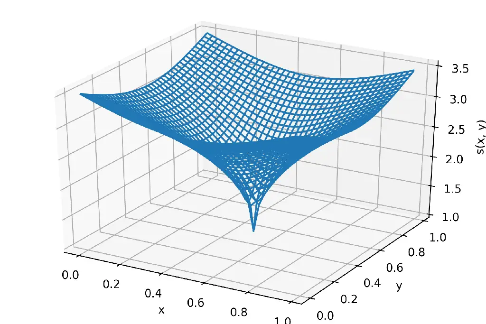
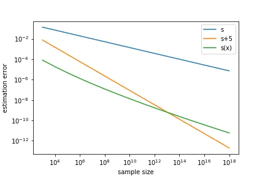
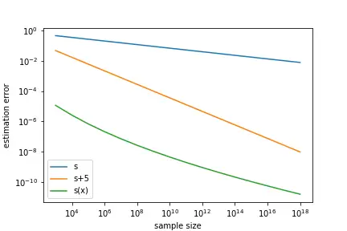
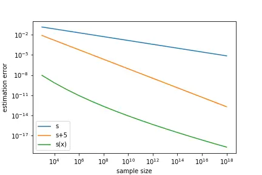

# Estimation error analysis of deep learning on the regression problem on the variable exponent Besov space

Kazuma Tsuji Affiliation: Graduate School of Information Science and
Technology, The University of Tokyo, Japan Affiliation:
kazuma_tsuji@mist.i.u-tokyo.ac.jp    Taiji Suzuki Affiliation: Email
Affiliation: Graduate School of Information Science and Technology, The
University of Tokyo, Japan Affiliation: Center for Advanced Intelligence
Project, RIKEN, Japan Affiliation: taiji@mist.i.u-tokyo.ac.jp

###### Abstract

Deep learning has achieved notable success in various fields, including
image and speech recognition. One of the factors in the successful
performance of deep learning is its high feature extraction ability. In
this study, we focus on the adaptivity of deep learning; consequently,
we treat the variable exponent Besov space, which has a different
smoothness depending on the input location $`x`$. In other words, the
difficulty of the estimation is not uniform within the domain. We
analyze the general approximation error of the variable exponent Besov
space and the approximation and estimation errors of deep learning. We
note that the improvement based on adaptivity is remarkable when the
region upon which the target function has less smoothness is small and
the dimension is large. Moreover, the superiority to linear estimators
is shown with respect to the convergence rate of the estimation error.

## 1 Introduction

Machine learning has attracted significant attention, and has been
applied to various fields. In particular, deep learning has been in the
spotlight owing to its notable success in different fields, for example,
image and speech recognition (Krizhevsky et al.,, 2012; Hinton et al.,,
2012). Although its success has been confirmed experimentally, the
reason why deep learning functions well has not been fully understood
theoretically. This problem has been studied in a statistical context by
many researchers, and one of the approaches to this problem is the
following nonparametric regression problem:

```math
Y_{i}=f^{\circ}(X_{i})+\epsilon_{i}\hskip 14.22636pt(i=1,\ldots,n),
```

where $`(X_{i},Y_{i})_{i=1}^{n}`$ are observations and $`\epsilon_{i}`$
is Gaussian noise. It is usually considered that $`f`$ is contained in a
function class $`\mathcal{F}`$ and one of the typical criteria used to
evaluate an estimator $`\hat{f}`$ is

```math
\sup_{f^{\circ}\in\mathcal{F}}\mathbb{E}[\|f^{\circ}(X)-\hat{f}(X)\|_{L_{2}(P_{X})}^{2}],
```

where the expectation is taken over the sample observation
$`(X_{i},Y_{i})_{i=1}^{n}`$. We call this the worst-case estimation
error. We can compare the convergence speed of this quantity among the
estimators. In particular, by comparing deep learning with other
estimators with respect to this value, the manner in which deep learning
works can be analyzed theoretically. Note that analyzing the worst-case
error is common in statistics as a theory of minimax-optimality; thus,
it has not been specialized to a deep learning setting (Tsybakov,, 2008;
Yang and Barron,, 1999; Zhang et al.,, 2002; Khas’ minskii,, 1979;
Ibragimov and Khas’ minskii,, 1977; Stone,, 1982). We compare the
worst-case error for an estimator $`\hat{f}`$ with the infimum of the
worst-case error over all estimators given by

```math
\inf_{\hat{f}}\sup_{f^{\circ}\in\mathcal{F}}\mathbb{E}[\|f^{\circ}(X)-\hat{f}(X)\|_{L_{2}(P_{X})}^{2}],
```

where the infimum is taken for all measurable mappings that map $`n`$
observations to $`L_{2}(P_{X})`$. This is called the minimax optimal
risk.

In previous studies on learning theory, these settings are considered on
various function classes, such as a Hölder space and Besov space. The
worst-case error analyses on these function classes have been studied
for deep learning as well as several other classic estimators, and their
minimax optimal rates have been extensively considered. For example, the
rate of a Hölder space ($`C^{\beta}(\Omega)`$,
$`\Omega\subset\mathbb{R}^{d}`$: bounded open domain) is
$`n^{-\frac{2\beta}{2\beta+d}}`$ (Stone,, 1982; Khas’ minskii,, 1979;
Ibragimov and Khas’ minskii,, 1977), whereas that of a Besov space
($`B_{p,q}^{s}([0,1]^{d})`$) is $`n^{-\frac{2s}{2s+d}}`$ (Kerkyacharian
and Picard,, 1992; Donoho et al.,, 1996; Donoho and Johnstone,, 1998;
Giné and Nickl,, 2016). Note that the definitions of a Hölder space and
Besov space are written in the following section. It was shown that deep
learning can achieve the near minimax optimal rate. Table 1 shows the
results of previous studies.

|                     |                                                                                                               |                                                 |
| ------------------- | ------------------------------------------------------------------------------------------------------------- | ----------------------------------------------- |
| Function class      | Hölder( $`C^{\beta}`$ )                                                                                       | Besov( $`B_{p,q}^{s}`$ )                        |
| Approximation error | $`\tilde{O}(N^{-\frac{\beta}{d}})\ `$ ¹¹ 1 Symbol $`\tilde{O}(\cdot)`$ indicates the order up to log factors. | $`\tilde{O}(N^{-\frac{s}{d}})\ `$               |
| Author              | Yarotsky, (2017)                                                                                              | Suzuki, (2019)                                  |
| Estimation error    | $`\tilde{O}(n^{-\frac{2\beta}{2\beta+d}}(\log n)^{3})`$                                                       | $`\tilde{O}(n^{-\frac{2s}{2s+d}}(\log n)^{3})`$ |
| Author              | Schmidt-Hieber, (2020)                                                                                        | Suzuki, (2019)                                  |
| Function class      | variable Besov ($`B_{p,q}^{s+\beta\|x-c\|_{2}^{\alpha}}`$ )                                                   |                                                 |
| Approximation error | $`\tilde{O}(N^{-\frac{s}{d}}\ (\log N)^{-\frac{s-\delta}{\alpha}})\ `$                                        |                                                 |
| Author              | This work                                                                                                     |                                                 |
| Estimation error    | $`\tilde{O}(n^{-\frac{2s}{2s+d}}(\log n)^{-\frac{2(sd-\nu d-3\alpha s)}{(2s+d)\alpha}})`$                     |                                                 |
| Author              | This work                                                                                                     |                                                 |

Table 1: Approximation and estimation errors of deep learning on
function spaces on $`[0,1]^{d}`$. The approximation and estimation
errors are measured using the $`L_{2}`$-norm and its square,
respectively. Here, $`N`$ is the number of units in each layer of deep
neural network and $`n`$ is the sample size. $`s`$ and $`\beta`$ are the
parameters of smoothness, and $`d`$ represents the dimension of the
domain where the function spaces are defined.

In recent studies, the approximation and generalization capabilities of
deep ReLU networks have been studied. In Yarotsky, (2017), the
approximation error of deep ReLU networks on a Hölder space is derived.
In addition, Schmidt-Hieber, (2020) analyzed the estimation error of
deep ReLU networks on a Hölder space and derived the worst-case
estimation error that achieves a near optimal rate. Suzuki, (2019)
studied the approximation and estimation errors on a Besov space that
has a broader function class than a Hölder class. Suzuki, (2019) noted
that deep learning is “adaptive,” that is, deep learning can estimate
each function effectively by capturing the local smoothness. Indeed, we
can see in the analysis by Suzuki, (2019) that adaptivity is important
for achieving the near minimax optimal rate. In addition, although deep
learning can achieve a near optimal rate even if the spatial homogeneity
of the target function smoothness is low, no linear estimator can
achieve the optimal rate in such a case. In Imaizumi and Fukumizu,
(2019), the superiority was demonstrated when the target functions are
piecewise smooth functions. In addition, Hayakawa and Suzuki, (2020)
showed the superiority for a function class with discontinuity and
sparsity.

In this study, we analyze the generalization capability of ReLU neutral
networks on a variable exponent Besov space that has different
conditions of smoothness depending on coordinate $`x`$. Because the
smoothness of the target function depends on the input location $`x`$
(we denote by $`s(x)`$, i.e., the smoothness of the target function at
the location $`x`$), the difficulty of estimating the function is not
spatially uniform. This problem setting highlights the necessity of the
adaptivity of the estimators in contrast to previous studies. In
previous studies, the estimation problem on this type of function class
with non-uniform properties over the input location $`x`$ has not been
analyzed. In addition, the approximation theory of the variable exponent
Besov space has not been studied, although the wavelet decomposition in
the variable exponent Besov space has been analyzed, e.g., in Kempka,
(2010). Therefore, we first need to develop an approximation theory on
the variable exponent Besov space using the B-spline basis expansion. In
section 3, we derive the lower bound for the general $`s(x)`$ and
analyze the upper bound for the approximation error in the case of
$`s(x)=s+\beta\|x-c\|_{2}^{\alpha}`$. In section 4, based on the result
in section 3, we derive the upper bounds of the approximation and
estimation errors of deep learning. As shown in Table 1, the upper bound
of the approximation error of deep learning is
$`\tilde{O}(N^{-\frac{s}{d}}\ (\log N)^{-\frac{s-\delta}{\alpha}})`$ and
that of the estimation error is
$`\tilde{O}(n^{-\frac{2s}{2s+d}}(\log n)^{-\frac{2(sd-\nu d-3\alpha s)}{(2s+d)\alpha}})`$,
where $`N`$ is the number of units in each layer of the neural network,
$`n`$ is the sample size, and $`\nu`$ is a constant, which depends only
on $`p,d`$. The polynomial order of the approximation error depends on
the minimum value of $`s(x)`$, and the poly-log order becomes
significant when $`\alpha`$ is small, that is, the domain around the
minimum value of $`s(x)`$ is small. Moreover, the influence of the
poly-log order of the estimation error increases if the dimension $`d`$
is large and the area around the minimum value of $`s(x)`$ is small. In
section 5, we show the superiority of deep learning over linear
estimators for $`0<p<2`$ or $`p=2`$ and $`0<\alpha<\frac{d}{3}`$:

```math
n^{-\frac{2s}{2s+d}}(\log n)^{-\frac{2(sd-\nu d-3\alpha s)}{(2s+d)\alpha}}(\log(\log n))^{\frac{2d(s-\nu)}{(2s+d)\alpha}}\ll n^{-\frac{2(s-\nu)}{2(s-\nu)+d}},
```

where the left-hand side is the worst-case estimation error of deep
learning, and the right-hand side is the minimax optimal estimation
error over all linear estimators. The contributions of this paper are
summarized as follows:

- •
  For the analysis of the generalization ability of deep learning, we
  first derive an approximation theory of the variable exponent Besov
  space using B-spline bases. We derive the lower bound of the
  approximation error on the variable exponent Besov space with any
  continuous smoothness function $`s(x)`$. In addition, we derive the
  upper bound of the approximation error on the variable exponent Besov
  space with specific smoothness function
  $`s(x)=s+\beta\|x-c\|_{2}^{\alpha}`$.
- •
  To clarify the adaptivity of deep learning, we derive the upper bound
  of the approximation and estimation errors of deep learning.
  Subsequently, we show that, as the region where the target function
  has less smoothness is smaller, the approximation and estimation
  errors are further improved. This result supports the adaptivity of
  deep learning.
- •
  For a relative evaluation, we compare deep learning with popular
  linear estimators, such as a least squares estimator, Nadaraya-Watson
  estimator, and kernel ridge regression. We show the superiority of
  deep learning over linear estimators with respect to the convergence
  of the estimation error.

## 2 Mathematical preparations

### 2.1 Notation

In this section, we introduce some of the notations used. Throughout
this paper, $`\Omega`$ denotes $`[0,1]^{d}`$. For a subset $`A`$ in
$`\mathbb{R}^{d}`$, we define $`\|f\|_{L_{r}(A)}`$ as the $`L_{r}`$-norm
of a measurable function $`f`$ on $`A`$:

```math
\|f\|_{L_{r}(A)}\coloneqq\left(\int_{A}|f(x)|^{r}\mathrm{d}x\right)^{\frac{1}{r}}.
```

In particular, if $`A=\Omega`$, we denote $`\|\cdot\|_{L_{r}(A)}`$ by
$`\|\cdot\|_{r}`$. Let $`(S,\Sigma,P)`$ be a pairing of probability
space $`S`$, $`\sigma\mbox{-algebra }\Sigma`$ on $`S`$, and probability
measure $`P`$. Furthermore, let $`X(s)`$ be a random variable on
$`\mathbb{R}^{d}`$ with a probability distribution $`P_{X}`$. For a
measurable function $`f`$, we define $`\|f\|_{L_{r}(P_{X})}`$ as
follows:

```math
\|f\|_{L_{r}(P_{X})}\coloneqq\left(\int_{S}|f(X(s))|^{r}{P(\rm{d}s)}\right)^{\frac{1}{r}}=\left(\int_{\mathbb{R}^{d}}|f(x)|^{r}{P^{X}(\rm{d}\it{x})}\right)^{\frac{1}{r}}.
```

Let $`X`$ be a quasi-normed space. We denote the unit ball of $`X`$ by
$`U_{X}`$. That is,

```math
U_{X}\coloneqq\{x\in X\mid|\|x\|_{X}\leq 1\}.
```

We write the support of function $`f`$ as

```math
\mathrm{supp}f\coloneqq\overline{\{x\in\mathbb{R}^{d}\mid f(x)\neq 0\}}.
```

Let $`A\subset\mathbb{R}^{d}`$ and
$`x=(x_{1},x_{2},\ldots,x_{d})^{\top}\in A`$, $`p\in\mathbb{R}`$. In
addition, let $`a>0`$ and $`T`$ be a mapping from $`\mathbb{R}^{d}`$ to
$`\mathbb{R}^{d}`$. Next, we introduce the following notations:

```math
\lceil a\rceil\coloneqq\min\{n\in\mathbb{Z}\mid a\leq n\},
```

```math
\lfloor a\rfloor\coloneqq\max\{n\in\mathbb{Z}\mid a\geq n\},
```

```math
\|x\|_{p}\coloneqq(x_{1}^{p}+x_{2}^{p}+\cdots+x_{d}^{p})^{\frac{1}{p}},
```

```math
\mathrm{diam}(A)\coloneqq\sup_{a,b\in A}\|a-b\|_{2},
```

```math
\mathrm{dist}(A,x)\coloneqq\inf_{y\in A}\|y-x\|_{2},
```

```math
B(x,a)\coloneqq\{y\in\mathbb{R}^{d}\mid\|y-x\|_{2}<a\},
```

```math
TA\coloneqq\{Ta\mid a\in A\}.
```

### 2.2 Nonparametric regression and minimax optimal rate

In this paper, we consider the following nonparametric regression model:

```math
Y_{i}=f^{\circ}(X_{i})+\epsilon_{i}\hskip 14.22636pt(i=1,\ldots,n),
```

where $`(X_{i},Y_{i})_{i=1}^{n}`$ is independently identically
distributed (i.i.d.) and $`X_{i}\sim P_{X}`$. Here, $`P_{X}`$ is a
probability distribution on $`\Omega`$. Moreover, the noise
$`\epsilon_{i}`$ is i.i.d. centered Gaussian noise, that is,
$`\epsilon_{i}\sim N(0,\sigma^{2})\ (\sigma>0)`$. We assume that
$`f^{\circ}`$ is contained in some function class $`\mathcal{F}`$, that
is, $`f^{\circ}\in\mathcal{F}`$. We want to estimate function
$`f^{\circ}:[0,1]^{d}\rightarrow\mathbb{R}`$ from the observed data
$`(X_{i},Y_{i})_{i=1}^{n}`$.

For the regression model (2.2), we use the following quantity to
evaluate the estimation for each $`f^{\circ}\in\mathcal{F}`$:

```math
\mathbb{E}[\|f^{\circ}(X)-\hat{f}(X)\|_{L_{2}(P_{X})}^{2}],
```

where $`\hat{f}:[0,1]^{d}\rightarrow\mathbb{R}`$ is the function
estimated from the observed data $`(X_{i},Y_{i})_{i=1}^{n}`$ and the
expectation is taken over the sample observation
$`(X_{i},Y_{i})_{i=1}^{n}`$. To evaluate the quality of estimator
$`\hat{f}`$, we define the following worst-case estimation error:

```math
R(\hat{f},\mathcal{F})\coloneqq\sup_{f^{\circ}\in\mathcal{F}}\mathbb{E}[\|f^{\circ}(X)-\hat{f}(X)\|_{L_{2}(P_{X})}^{2}].
```

Hereafter, we call $`R(\hat{f},\mathcal{F})`$ an estimation error for
simplicity. We can see from the definition that
$`R(\hat{f},\mathcal{F})`$ is the worst-case estimation error for
$`f^{\circ}\in\mathcal{F}`$. We can evaluate the estimators based on the
convergence rate of $`R(\hat{f},\mathcal{F})`$ as the sample size $`n`$
increases.

We use the following lemma to derive the estimation error of deep
learning. Note that for a normed space
$`(V,\|\cdot\|),\mathcal{F}_{1}\subset V`$ and $`\delta>0`$, we denote
the $`\delta\mathchar 45\mathrm{covering}`$ (Van Der Vaart and Wellner,, 1996) by $`\mathcal{N}(\delta,\mathcal{F}_{1},\|\cdot\|_{\infty})`$,
which represents the minimum number of balls of radius $`\delta`$ needed
to cover $`\mathcal{F}_{1}`$.

###### Lemma 2.1 (Schmidt-Hieber, (2020), Hayakawa and Suzuki, (2020)).

Let $`\mathcal{F}_{1}`$ be a function set and $`\hat{f}`$ be the least
squares estimator in $`\mathcal{F}_{1}`$. That is,

```math
\hat{f}=\mathop{\rm arg\penalty\ min}\limits_{f\in\mathcal{F}_{1}}\sum_{i=1}^{n}(Y_{i}-f(X_{i}))^{2}.
```

Assume that $`\|f^{\circ}\|_{\infty}\leq F`$ and every element
$`f\in\mathcal{F}_{1}`$ satisfies $`\|f\|_{\infty}\leq F`$ for some
$`F\geq 1`$. If
$`\mathcal{N}(\delta,\mathcal{F}_{1},\|\cdot\|_{\infty})\geq 3`$ for
$`\delta>0`$, it then holds that

```math
\begin{split}\mathbb{E}[\|\hat{f}-f^{\circ}\|_{L^{2}(P_{X})}]\leq C&\left[\inf_{f\in{\mathcal{F}}_{1}}\|f-f^{\circ}\|_{L^{2}(P_{X})}^{2}+\right.\\
&\left.(F^{2}+\sigma^{2})\frac{\log\mathcal{N}(\delta,\mathcal{F}_{1},\|\cdot\|_{\infty})}{n}+\delta(F+\sigma)\right].\end{split}
```

In Lemma 2.1, the first term represents the approximation error, and the
second term represents the complexity of the model. To reduce the
estimation error, we need to set the complexity of the model such that
the first and second terms are balanced. It can be seen from this lemma
that we need to derive the approximation error to derive the estimation
error. Therefore, we first discuss the approximation error and then
derive the estimation error using Lemma 2.1.

### 2.3 Adaptive approximation

There are two types of approximation methods, non-adaptive and adaptive.
For a set of target functions to be approximated, non-adaptive methods
fix the basis functions and only change the coefficients of the linear
combination. By contrast, adaptive methods change the basis functions
and coefficients for each target function. Deep learning is a type of
adaptive method because, for each target function, it constructs an
appropriate feature extractor that operates as a basis function tailored
to each target function. Indeed, deep learning can achieve an (almost)
optimal approximation error rate that no non-adaptive method can
achieve. Here, we introduce the quantities for an evaluation of these
methods and some facts from previous studies.

We define quantities for evaluating both non-adaptive and adaptive
methods. We follow the definitions of such quantities presented in Dũng,
(2011). First, we introduce the quantity used to evaluate a non-adaptive
method. Let $`X`$ be a quasi-normed space defined on a domain
$`D\subset\mathbb{R}^{d}`$ equipped with the norm $`\|\cdot\|_{X}`$.
Non-adaptive methods are evaluated by the following $`N`$-term best
approximation error (Kolmorogov $`N`$-widths) with respect to the norm
of $`X`$:

```math
d_{N}(W,X)\coloneqq\inf_{S_{N}\subset X}\sup_{f\in W}\inf_{g\in S_{N}}\|f-g\|_{X}\ ,
```

where the infimum is taken over all $`N`$-dimensional subspaces in
$`X`$. In the definition of $`d_{N}(W,X)`$, each function in $`W`$ is
approximated by the fixed $`N`$ dimensional subspace $`S_{N}`$. Thus,
the $`N`$ basis functions are fixed against the choice of $`f\in W`$,
and only the coefficients of linear combinations are changed. Next, we
introduce two quantities $`(\sigma_{N},\rho_{N})`$ that evaluate the
adaptive methods. Let $`W`$ and $`B`$ be subsets of $`X`$. The
approximation of $`W`$ by $`B`$ with respect to the $`X`$’s norm is
evaluated by the following quantity:

```math
E(W,B,X)\coloneqq\sup_{f\in W}\inf_{\phi\in B}\|f-\phi\|_{X}.
```

Let $`\Phi=\{\phi_{k}\}_{k\in\mathcal{K}}`$ be a subset of $`X`$ indexed
by a set $`\mathcal{K}`$ ($`\phi_{k}\in X`$). We define
$`\Sigma_{N}(\Phi)`$ such that it consists of all $`N`$ linear
combinations of the elements of $`\Phi`$ as

```math
\Sigma_{N}(\Phi)\coloneqq\left\{\phi=\sum_{j=1}^{N}a_{j}\phi_{k_{j}}:k_{j}\in\mathcal{K}\right\}.
```

Here, we define the quantity that evaluates the approximation by $`N`$
linear combinations of functions in $`\Phi`$ as follows:

```math
\sigma_{N}(W,\Phi,X)\coloneqq E(W,\Sigma_{N}(\Phi),X).
```

In contrast to $`d_{N}(W,X)`$, for each function in $`W`$, we can choose
$`N`$ basis functions from $`\Phi`$ and the coefficients of linear
combinations adaptively. Let $`\mathcal{B}`$ be a family of subsets in
$`X`$. An approximation by $`\mathcal{B}`$ is evaluated using the
following quantity:

```math
d(W,\mathcal{B},X)\coloneqq\inf_{B\in\mathcal{B}}E(W,B,X).
```

If $`\mathcal{B}`$ is the family of all subsets $`B`$ such that the
pseudo-dimension is at most $`N`$, we denote $`d(W,\mathcal{B},X)`$ by
$`\rho_{N}(W,X)`$, which is called a non-linear $`n`$-width. Here, the
pseudo dimension of $`B`$ is defined as the largest integer $`N`$ such
that there exist points $`a_{1},\ldots,a_{N}\in D`$ and
$`b_{1},\ldots,b_{N}\in\mathbb{R}`$ that satisfy

```math
|\{\mathrm{sgn}(y)\mid y=(\mathrm{sgn}(f(a_{1})+b_{1}),\ldots,\mathrm{sgn}(f(a_{N})+b_{N})),f\in B\}|=2^{N},
```

where
$`\mathrm{sgn}(x)=\mathbbm{1}_{\{x>0\}}-\mathbbm{1}_{\{x\leq 0\}}`$.
Because the pseudo-dimension of any $`N`$-dimensional vector space from
a set in $`D`$ to $`\mathbb{R}`$ is $`N`$ (see Haussler, (1992)),
$`\rho_{N}(W,X)`$ can evaluate non-adaptive and adaptive methods. Note
that if $`X=L_{r}(\Omega)`$, we denote each quantity by
$`d_{N}(W)_{r}`$, $`\sigma_{N}(W,\Phi)_{r}`$, and $`\rho_{N}(W)_{r}`$.

It was shown that the approximation error on a Besov space and that on
other function spaces related to a Besov space can be improved through
an adaptive method. We take the example of a Besov space on $`\Omega`$
and see an improvement when using adaptive methods (see Definition 2.1
for the definition of a Besov space). First, we determine the
approximation error using non-adaptive methods. The lower bound of the
non-adaptive methods is

```math
d_{N}(U_{B_{p,q}^{s}})_{r}\gtrsim\begin{cases}N^{-\frac{s}{d}+\left(\frac{1}{p}-\frac{1}{r}\right)}&(1<p<r\leq 2,s>d(\frac{1}{p}-\frac{1}{r})),\\
N^{-\frac{s}{d}+\frac{1}{p}-\frac{1}{2}}&(1<p<2<r\leq\infty,s>\frac{d}{p}),\\
N^{-\frac{s}{d}}&(2\leq p<r\leq\infty,s>\frac{d}{2}).\end{cases}
```

(see Romanyuk, (2009); Myronyuk, (2016); Vybıral, (2008)). For the
functions in $`B_{p,q}^{s}`$, $`s`$ controls the smoothness and $`p`$
controls the spatial homogeneity of the smoothness. In addition, $`q`$
controls the degree of emphasis on the local smoothness, although it
dose not directly influence the convergence rate. However, it was shown
in Dũng, (2011) that an adaptive method can achieve the optimal rate of
approximation error. Specifically, it was proved in Theorems 5.2 and 5.4
in Dũng, (2011) that, for $`0<p,q,r\leq\infty`$ and
$`d\left(\frac{1}{p}-\frac{1}{r}\right)_{+}<s`$, the optimal rate of the
approximation methods containing adaptive methods is

```math
\sigma_{N}(U_{B_{p,q}^{s}},\mathbf{M})_{r},\rho_{N}\ (U_{B_{p,q}^{s}})_{r}\asymp N^{-\frac{s}{d}}, \tag{2.1}
```

where $`\mathbf{M}`$ is the set of all $`M_{k,j}^{d}`$ (see subsection
2.5) whose degree $`m`$ satisfies $`s<\min\{m,m-1+\frac{1}{p}\}`$, which
do not vanish identically on $`\Omega`$. Moreover, an adaptive method
can achieve the rate (Dũng,, 2011). If parameter $`p`$ that controls the
spatial homogeneity is small, some functions in $`B_{p,q}^{s}`$ have
smooth and rough parts depending on the input location $`x`$. The
usefulness of an adaptive method for $`p<2`$ can be interpreted such
that adaptive methods can increase the resolution of rough parts, which
contributes to an effective approximation.

In addition, the improvement of the estimation using an adaptive method
was shown in Suzuki, (2019) for a Besov space and a mixed-Besov space
and in Suzuki and Nitanda, (2019) for an anisotropic-Besov space. By
applying an adaptive method to the analysis of the estimation error
through deep learning, it was shown that the estimation error could be
improved. In Suzuki, (2019) and Suzuki and Nitanda, (2019), it was
proven that the estimation error by deep learning can achieve the
minimax rate up to the poly-log order.

### 2.4 Besov space

In this section, we introduce the basic properties of the function
spaces, in particular, a Besov space and variable exponent Besov space.
First, we define a Besov space as follows:

###### Definition 2.1 (The definition of $`B_{p,q}^{s}(\Omega)`$).

Let $`0<p,q\leq\infty`$, $`s>0,r\in\mathbb{N}`$ and $`r>s`$. We define
the $`r`$-times difference as

```math
{\Delta_{h}^{r}}(f)(x)=\begin{cases}\underbrace{\Delta_{h}\circ\Delta_{h}\circ\cdots\circ\Delta_{h}}_{r}(f)(x)&(x\in\Omega,x+rh\in\Omega),\\
0&(\rm{otherwise}),\\
\end{cases}
```

where $`\Delta_{h}(f)(x)=f(x+h)-f(x)`$. The $`r`$-th module of the
smoothness is defined as follows:

```math
\omega_{r,p}(f,t)=\sup_{h\in\mathbb{R}^{d}:\|h\|_{2}\leq t}\|\Delta_{h}^{r}\|_{p}.
```

We define the following quantity using $`\omega_{r,p}(f,t)`$:

```math
|f|_{B_{p,q}^{s}(\Omega)}\coloneqq\begin{cases}\left[\int_{0}^{1}(t^{-s}\omega_{r,p}(f,t))^{q}\frac{1}{t}\mathrm{d}t\right]^{\frac{1}{q}}&(q<\infty),\\
\sup_{t>0}t^{-s}\omega_{r,p}(f,t)&(q=\infty).\end{cases}
```

By using $`|f|_{B_{p,q}^{s}}(\Omega)`$, we define the norm as follows:

```math
B_{p,q}^{s}(\Omega)=\{f\in{L_{p}(\Omega)}\mid\|f\|_{B_{p,q}^{s}(\Omega)}\coloneqq\|f\|_{p}+|f|_{B_{p,q}^{s}(\Omega)}<\infty\}.
```

###### Remark 2.1.

We note some comments regarding the quantities in Definition 2.1.

- •
  Operator $`\Delta_{h}`$ is similar to the differential, and if
  function $`f`$ is an $`r`$-times continuous differentiable function on
  $`\mathbb{R}`$, it holds that
  $`\lim_{h\to 0}\frac{\Delta_{h}^{r}(f)(x)}{|h|^{r}}=f^{(r)}(x)`$.
- •
  For $`\omega_{r,p}(f,t)`$, by applying the Hölder’s inequality, it can
  be easily confirmed that $`\omega_{r,p}(f,t)`$ becomes larger as $`p`$
  increases.
- •
  As $`s`$ increases, $`t^{-s}`$ increases for $`t`$, which is close to
  $`0`$. Therefore, when $`s`$ is larger, $`\omega_{r,p}(f,t)`$ needs to
  be smaller for $`t`$, which is close to $`0`$. Thus, we can interpret
  that $`s`$ controls the local smoothness.
- •
  If $`r\in\mathbb{N}`$ satisfies $`r>s`$, the definition of
  $`B_{p,q}^{s}(\Omega)`$ does not depend on $`r`$.

It is known that some other function spaces can be reproduced from a
Besov space by taking some parameters to satisfy certain conditions.
First, we define a $`\rm{H\ddot{o}lder}`$ space and Sobolev space.

###### Definition 2.2 ($`\rm{H\ddot{o}lder}`$ space ($`C^{\beta}(\Omega))`$).

Let $`\beta>0`$ satisfy $`\beta\notin\mathbb{N}`$. In addition, we
define $`m\coloneqq\lfloor\beta\rfloor`$. For the $`m`$-times continuous
differentiable function $`f:\mathbb{R}^{d}\to\mathbb{R}`$, we define the
norm of the $`\rm{H\ddot{o}lder}`$ space $`C^{\beta}(\Omega)`$ as
follows:

```math
\|f\|_{C^{\beta}(\Omega)}\coloneqq\max_{|\alpha|\leq m}\|D^{\alpha}f\|_{\infty}+\max_{|\alpha|=m}\sup_{x,y\in\Omega}\frac{|D^{\alpha}f(x)-D^{\alpha}f(y)|}{|x-y|^{\beta-m}},
```

where for $`\alpha=(\alpha_{1},\alpha_{2},\ldots,\alpha_{d})`$, we
define $`|\alpha|=\sum_{i=1}^{d}|\alpha_{i}|`$, and for
$`\alpha\in\mathbb{Z}^{d}`$, we define the derivative by
$`D^{\alpha}f(x)=\frac{\partial^{|\alpha|}f}{\partial^{\alpha_{1}}x_{1},\ldots,\partial^{\alpha_{d}}x_{d}}`$.
Using this norm, the $`\rm{H\ddot{o}lder}`$ space is defined as follows:

```math
C^{\beta}(\Omega)\coloneqq\left\{f\mid m\ \mbox{times differentiable and}\ \|f\|_{C^{\beta}(\Omega)}<\infty\right\}.
```

###### Definition 2.3 (Sobolev space ($`W_{p}^{m}(\Omega))`$).

Let $`m\in\mathbb{N}`$ and $`1\leq p\leq\infty`$. For
$`f\in L_{p}(\Omega)`$, we define the norm of the Sobolev space as
follows:

```math
\|f\|_{W_{p}^{m}(\Omega)}\coloneqq\left(\sum_{|\alpha|\leq m}\|D^{\alpha}f\|_{p}^{p}\right)^{\frac{1}{p}},
```

where $`D^{\alpha}`$ is a weak derivative. Here, $`W_{p}^{m}(\Omega)`$
is defined as follows:

```math
W_{p}^{m}(\Omega)\coloneqq\left\{f\in L_{p}(\Omega)\mid\|f\|_{W_{p}^{m}(\Omega)}<\infty\right\}.
```

In Triebel, (1983), the relationships between a Besov space and other
function spaces are provided. In addition, the relationships between
Besov spaces with different parameters are written. We introduce some of
them here. We note that for normed vector spaces
$`(V_{1},\|\cdot\|_{V_{1}})`$ and $`(V_{2},\|\cdot\|_{V_{2}})`$ such
that $`V_{1}\subset V_{2}`$, if the inclusion map $`i:V_{1}\to V_{2}`$
is continuous, we denote $`V_{1}\hookrightarrow V_{2}`$.

- •
  For $`m\in\mathbb{N}`$,
  $`B_{p,1}^{m}(\Omega)\hookrightarrow W_{p}^{m}(\Omega)\hookrightarrow B_{p,\infty}^{m}(\Omega).`$
- •
  $`B_{2,2}^{m}(\Omega)=W_{2}^{m}(\Omega)`$.
- •
  For $`0<s<\infty`$ and $`s\notin\mathbb{N}`$,
  $`C^{s}(\Omega)=B_{\infty,\infty}^{s}(\Omega)`$.
- •
  Let $`0<s<\infty`$, $`0<p,q,r\leq\infty`$ with
  $`s>\delta\coloneqq d\left(\frac{1}{p}-\frac{1}{r}\right)_{+}`$. Then,
  $`B_{p,q}^{s}(\Omega)\hookrightarrow B_{r,q}^{s-\delta}(\Omega)`$.
- •
  Let $`C_{0}(\Omega)`$ be the set of continuous functions on
  $`\Omega`$. Then, for $`s>\frac{d}{p}`$,
  $`B_{p,q}^{s}(\Omega)\hookrightarrow C_{0}(\Omega)`$.

Thus, a Besov space has close relationships between a
$`\rm{H\ddot{o}lder}`$ space and Sobolev space. We can obtain the
properties of other function spaces by analyzing the Besov space.

### 2.5 Decomposition of functions in Besov space by cardinal B-spline

For the analysis provided after this section, we introduce some facts
regarding the approximation on the Besov space and decomposition using a
cardinal B-spline basis researched in DeVore and Popov, (1988) and Dũng,
(2011). In this study, we mainly use the approximation theory of a Besov
space with a cardinal B-spline basis, because the authors in (Yarotsky,,
2017; Schmidt-Hieber,, 2020) showed the effective approximation for
polynomials using a deep ReLU network; thus, a B-spline cardinal basis
is convenient for the approximation theory when applying a deep neural
network.

First, we introduce facts regarding $`B_{p,q}^{s}(\Omega)`$ studied in
DeVore and Popov, (1988). Let $`m\in\mathbb{N}`$ and $`N`$ be the
univariate B-spline basis, i.e.,
$`N(x)\coloneqq\frac{1}{m!}\sum_{j=0}^{m+1}(-1)^{j}{m+1\choose j}(x-j)_{+}^{m}`$.
In addition, we define the tensor product of the B-splines as

```math
M_{0,0}^{d}(x)\coloneqq N(x_{1})N(x_{2})\cdots N(x_{d})
```

and for $`k\in\mathbb{Z}_{+}`$ and $`j\in\mathbb{Z}^{d}`$, we define the
cardinal B-spline basis as

```math
M_{k,j}^{d}\coloneqq M_{0,0}^{d}(2^{k}(x-j)).
```

$`\Lambda(k)`$ denotes the set of $`j`$ in which $`M_{k,j}^{d}`$ does
not vanish identically on $`\Omega`$. Here, it can be shown in the same
manner as Corollary 2-2 in Dũng, (2011) that for all
$`f\in B_{p,q}^{s}(\Omega)`$, there exists
$`Q_{k}(f)=\sum_{j\in\Lambda(k)}c_{k,j}M_{k,j}^{d}(x)`$, which satisfies
the following inequality:

```math
\|f-Q_{k}(f)\|_{r}\leq 2^{-k(s-\delta)}, \tag{2.2}
```

where $`s>\delta=d\left(\frac{1}{p}-\frac{1}{r}\right)_{+}`$ and degree
$`m`$ of the cardinal B-spline basis satisfies
$`s<\min\{m,m-1+\frac{1}{p}\}`$. Additionally, we let
$`Q_{-1}\coloneqq 0`$ and $`q_{k}\coloneqq Q_{k}-Q_{k-1}`$, and it is
known that $`q_{k}`$ can be represented as follows:

```math
q_{k}=\sum_{j\in\Lambda(k)}a_{k,j}M_{k,j}^{d}(x).
```

Note that, throughout this paper, $`Q_{k}(f)`$ and $`q_{k}(f)`$ indicate
the decomposition of $`f`$ above; if the decomposition target $`f`$ is
apparent, we denote these by $`Q_{k}`$ and $`q_{k}`$. For
$`s<\min\{m,m-1+\frac{1}{p}\}`$, by Theorem 5.1 and and Corollary 5.3 in
DeVore and Popov, (1988), $`f\in B_{p,q}^{s}(\Omega)`$ can be decomposed
as follows:

```math
f(x)=\sum_{k=0}^{\infty}\sum_{j\in\Lambda(k)}a_{k,j}M_{k,j}^{d}. \tag{2.3}
```

Note that the convergence is with respect to the $`B_{p,q}^{s}(\Omega)`$
norm. Moreover, the following norm equivalence holds:

```math
\|f\|_{B_{p,q}^{s}(\Omega)}\backsimeq\left(\sum_{k=0}^{\infty}2^{ksq}\|q_{k}\|_{p}^{q}\right)^{\frac{1}{q}}\backsimeq\left(\sum_{k=0}^{\infty}\left(\sum_{j\in\Lambda(k)}|a_{k,j}|^{p}2^{(sp-d)k}\right)^{\frac{q}{p}}\right)^{\frac{1}{q}}. \tag{2.4}
```

### 2.6 Variable exponent Besov space

Next, we define a variable exponent Besov space. Here, we consider the
case in which only parameter $`s`$ is variable and parameters $`p`$ and
$`q`$ are fixed. Before the definition of a variable exponent Besov
space, we define the log-Hölder continuity that is assumed for the
function of smoothness.

###### Definition 2.4 (log-Höder continuity).

For a function $`f:\Omega\to\mathbb{R}`$, if $`f`$ satisfies the
following log-Höder continuity, we denote $`f\in C_{\rm{log}}(\Omega)`$:
there exists a constant $`c_{\log}>0`$ and

```math
|f(x)-f(y)|\leq\frac{c_{\log}}{\log(e+\frac{1}{\|x-y\|_{2}})}\quad(^{\forall}x,^{\forall}y\in\Omega). \tag{2.5}
```

We can see that the log-Höder continuity is stronger than the
continuity, and is weaker than the Lipschitz continuity.

There are some methods to define a variable exponent Besov space. In
this study, we define this as follows:

###### Definition 2.5 (variable exponent Besov space $`B_{p,q}^{s(x)}(\Omega)`$).

Let $`s(\cdot)\in C_{\rm{log}}(\Omega)`$. We assume
$`0<\inf_{x\in\Omega}s(x)`$ and let
$`r\coloneqq\lfloor\sup_{x_{\in}\Omega}s(x)\rfloor+1`$. We define
$`\omega_{r,p}^{*}(f,t)`$ in a similar manner as the case of
$`B_{p,q}^{s}(\Omega)`$:

```math
\omega_{r,p}^{*}(f,t)=\sup_{h\in\mathbb{R}^{d}:\|h\|_{2}\leq t}\|t^{-s(\cdot)}\Delta_{h}^{r}\|_{p}. \tag{2.6}
```

Next, we define $`|f|_{B_{p,q}^{s(x)}(\Omega)}`$ as follows:

```math
|f|_{B_{p,q}^{s(x)}(\Omega)}\coloneqq\begin{cases}[\int_{0}^{1}(\omega_{r,p}^{*}(f,t))^{q}\frac{1}{t}\rm{d}\it{t}]^{\frac{1}{q}}&(q<\infty),\\
\sup_{t>0}\omega_{r,p}^{*}(f,t)&(q=\infty).\end{cases}
```

In the same manner as in $`B_{p,q}^{s}(\Omega)`$, the norm is defined as
the sum of the $`L_{p}`$ norm and $`|f|_{B_{p,q}^{s(x)}(\Omega)}`$, that
is,

```math
B_{p,q}^{s(x)}(\Omega)=\{f\in{L_{p}(\Omega)}\mid\|f\|_{B_{p,q}^{s(x)}}\coloneqq\|f\|_{p}+|f|_{B_{p,q}^{s(x)}}<\infty\}.
```

Note that for the case of $`B_{p,q}^{s}(\Omega)`$, $`t^{-s}`$ is
contained in the definition of $`|f|_{B_{p,q}^{s}(\Omega)}`$; whereas,
in the case of a variable exponent, it is contained in the definition of
$`\omega_{r,p}^{*}(f,t)`$. By definition, we can see that the
permissible smoothness changes depending on $`x`$.

We can consider that the definition above is the smoothness parameter of
the Besov space $`s`$ when replaced with variable $`s(x)`$. From the
definition, it holds that

```math
B_{p,q}^{s(x)}(\Omega)\subset B_{p,q}^{s_{\min}}(\Omega),
```

where $`s_{\min}=\min_{x\in\Omega}s(x)`$. Note that we denote
$`\max_{x\in\Omega}s(x)`$ by $`s_{\max}`$ and $`\min_{x\in\Omega}s(x)`$
by $`s_{\min}`$. Other similar (probably equivalent) definitions of
$`B_{p,q}^{s(x)}`$ have been studied by (Kempka and Vybíral,, 2012;
Besov,, 2003).

Next, we introduce some properties of $`B_{p,q}^{s(x)}(\mathbb{R}^{d})`$
that are studied in Almeida and Hästö, (2010).

- •
  We assume $`s_{0},s_{1}\in L_{\infty}(\mathbb{R}^{d})`$, and for all
  $`x\in\mathbb{R}^{d}`$, it holds that $`s_{0}(x)\geq s_{1}(x)`$. We
  let

  ```math
  s_{0}(x)-\frac{d}{p_{0}}=s_{1}(x)-\frac{d}{p_{1}}+\epsilon(x).
  ```

  If $`\inf_{x\in\mathbb{R}^{d}}\epsilon(x)>0`$ is satisfied, it holds
  that

  ```math
  B_{p_{0},q}^{s_{0}(x)}(\mathbb{R}^{d})\hookrightarrow B_{p_{1},q}^{s_{1}(x)}(\mathbb{R}^{d}).
  ```

- •
  For $`\delta>0`$, we assume that for all $`x\in\mathbb{R}^{d}`$, it
  holds that

  ```math
  s(x)-\frac{d}{p}\geq\delta\max\left\{1-\frac{1}{q},0\right\}.
  ```

  By letting $`C_{u}(\mathbb{R}^{d})`$ be the set of functions that are
  bounded and uniformly continuous functions, it holds that

  ```math
  B_{p,q}^{s(x)}(\mathbb{R}^{d})\hookrightarrow C_{u}(\mathbb{R}^{d}).
  ```

- •
  We assume that for all $`x\in\mathbb{R}^{d}`$, $`s(x)`$ satisfies
  $`s(x)<1`$. We define the Zygmund space $`C^{s(x)}`$ as

  ```math
  C^{s(x)}(\mathbb{R}^{d})\coloneqq\left\{f\in L_{\infty}(\mathbb{R}^{d})\ \middle|\ \|f\|_{\infty}+\sup_{x\in\mathbb{R}^{d},h\in\mathbb{R}^{d}\backslash\{0\}}\frac{|\Delta_{h}^{1}f(x)|}{|h|^{s(x)}}<\infty\right\}.
  ```

  Then, it holds that

  ```math
  B_{\infty,\infty}^{s(x)}(\mathbb{R}^{d})=C^{s(x)}(\mathbb{R}^{d}).
  ```

Thus, it is known that a variable exponent Besov space also reproduces
other function spaces by taking certain parameters to satisfy some
conditions.

## 3 Approximation theory of the variable exponent Besov space and approximation error

### 3.1 Lower bound of approximation error

In this section, we evaluate the lower bound of the approximation error
on the unit ball of the variable exponent Besov space
$`U_{B_{p,q}^{s(x)}(\Omega)}`$. In the main result (Theorem 3.1), we
will show that the polynomial order of the approximation error on
$`U_{B_{p,q}^{s(x)}(\Omega)}`$ cannot be improved from
$`N^{-\frac{s_{\min}}{d}}`$ for any $`s(x)`$. To prove Theorem 3.1, we
show the following lemma.

###### Lemma 3.1.

Let $`0<p,q\leq\infty`$, $`a\in\Omega`$, $`\xi>0`$ and $`\epsilon>0`$.
Suppose that s(x) satisfies
$`\max_{x\in[a-\xi,a+\xi]^{d}}s(x)<s+\epsilon`$ and
$`f\in U_{B_{p,q}^{s+\epsilon}(\Omega)}`$ satisfies
$`\mathrm{supp}f\subset[a-\frac{\xi}{2},a+\frac{\xi}{2}]^{d}`$. Then,
there exists $`C>0`$ that does not depend on $`f`$ such that
$`\|f\|_{B_{p,q}^{s(x)}(\Omega)}\leq C\|f\|_{B_{p,q}^{s+\epsilon}(\Omega)}`$
holds.

###### Proof.

For $`0<t<\frac{\xi}{2r}`$ and $`\|h\|_{2}\leq t`$,
$`\Delta_{h}^{r}(f)(x)=0`$ holds, where
$`x\in\Omega\backslash[a-\xi,a+\xi]^{d}`$. By (2.6) it holds that

```math
\omega_{r,p}^{*}(f,t)<t^{-(s+\epsilon)}\omega_{r,p}(f,t). \tag{3.1}
```

Moreover, by applying a triangle inequality, we have

```math
\|\Delta_{h}^{r}(f)\|_{p}\lesssim 2^{r}\|f\|_{p}.
```

Thus, for any $`t\in(0,1]`$, it holds that

```math
\omega_{r,p}^{*}(f,t)\lesssim 2^{r}t^{-s_{\max}}\|f\|_{p}\leq 2^{r}t^{-s_{\max}}\|f\|_{B_{p,q}^{s+\epsilon}(\Omega)}, \tag{3.2}
```

where, for $`t\in(0,1]`$, we use $`t^{-s(x)}<t^{-s_{\max}}`$. Therefore,
by (3.1) and (3.2), there exists $`C_{0}>0`$, and we have the following:

```math
\displaystyle\int_{0}^{1}(\omega_{r,p}^{*}(f,t))^{q}\frac{1}{t}\mathrm{d}t \displaystyle=\int_{0}^{\frac{\xi}{2r}}(\omega_{r,p}^{*}(f,t))^{q}\frac{1}{t}\mathrm{d}t+\int_{\frac{\xi}{2r}}^{1}(\omega_{r,p}^{*}(f,t))^{q}\frac{1}{t}\mathrm{d}t
```

```math
\displaystyle\leq\int_{0}^{\frac{\xi}{2r}}\{t^{-(s+\epsilon)}\omega_{r,p}(f,t)\}^{q}\frac{1}{t}\mathrm{d}t+\int_{\frac{\xi}{2r}}^{1}\{2^{r}\|f\|_{B_{p,q}^{s+\epsilon}(\Omega)}t^{-s_{\max}}\}^{q}\frac{1}{t}\mathrm{d}t
```

```math
\displaystyle\leq{C_{0}}^{q}\|f\|_{B_{p,q}^{s+\epsilon}(\Omega)}^{q}.
```

Note that $`C_{0}`$ does not depend on $`f`$, but does depend on $`\xi`$
and $`r`$. Therefore,
$`|f|_{B_{p,q}^{s(x)}(\Omega)}\leq C_{0}\|f\|_{B_{p,q}^{s+\epsilon}(\Omega)}`$
holds, and we obtain
$`\|f\|_{B_{p,q}^{s(x)}(\Omega)}\leq(C_{0}+1)\|f\|_{B_{p,q}^{s+\epsilon}(\Omega)}\equiv C\|f\|_{B_{p,q}^{s+\epsilon}(\Omega)}.`$  
$`\Box`$

We want to expand the local argument around $`s_{\min}`$ to the argument
on $`\Omega`$ by using the extension operator. To introduce the
extension operator in Lemma 3.3, we define the minimally smooth domain.

###### Definition 3.1 (minimally smooth domain).

Let $`S`$ be an open set in $`\mathbb{R}^{d}`$. Here, S is a minimally
smooth domain if there exists $`\eta>0`$ and open sets
$`U_{i}\subset\mathbb{R}^{d}\ (i=1,2,\ldots)`$, such that the following
conditions hold:  
(i) For each $`x\in\partial S`$, ball $`B(x,\eta)`$ is contained in one
of $`(U_{i})_{i}`$,  
(ii) Point $`x\in\mathbb{R}^{d}`$ is in at most $`N`$ sets $`U_{i}`$,
where $`N`$ is an absolute constant, and  
(iii) For each i, $`U_{i}\cap S=U_{i}\cap S_{i}`$, where $`S_{i}`$ is a
rotation of a Lipschitz graph domain.  
Note that $`\Lambda`$ is a Lipschitz graph domain, if there exists a
Lipschitz continuous function
$`\phi:\mathbb{R}^{d-1}\rightarrow\mathbb{R}`$. That is, there exists
$`L>0`$, and for all $`x,y\in S`$,
$`\frac{|\phi(x)-\phi(y)|}{\|x-y\|_{2}}\leq L`$ holds, and $`\Lambda`$
can be written as follows:

```math
\Lambda=\{(u,v):u\in\mathbb{R}^{d-1},v\in\mathbb{R}\ \text{and}\ v>\phi(u)\}.
```

Here, $`(u,v)`$ indicates that $`(u^{\top},v)^{\top}`$ for
$`u\in\mathbb{R}^{d-1}`$ and $`v\in\mathbb{R}`$.

In Stein, (1970), it is stated that all convex sets in
$`\mathbb{R}^{d}`$ are minimally smooth domains. For a better
understanding of Definition 3.1, we prove that a cube is a minimally
smooth domain.

###### Lemma 3.2.

Let $`A`$ be the interior of $`[0,1]^{d}`$. Then, $`A`$ is a minimally
smooth domain.

###### Proof.

The value of $`x\in\partial A`$ can be expressed as follows:

```math
\displaystyle x \displaystyle=\sum_{i=1}^{d-1}t_{i}w_{j_{i}}+t_{j_{d}}w_{j_{d}}
```

```math
\displaystyle(1\leq j_{1}<j_{2}< \displaystyle\ldots<j_{d-1}\leq d,j_{d}=\{1,\cdots,d\}\backslash\{j_{i}\}_{i=1}^{d-1},t_{j_{d}}\in\{0,1\}),
```

where $`\{w_{i}\}_{i=1}^{d}`$ is a standard basis in $`\mathbb{R}^{d}`$
and $`0\leq t_{i}\leq 1\ (i=1,\ldots,d-1)`$.

Let $`A^{{}^{\prime}}_{(0,\ldots,0)}`$ be the image of $`A`$ under an
orthonormal transformation $`O_{(0,\ldots,0)}`$ that transfers
$`(1,1,\ldots,1)`$ to $`(0,0,\ldots,\sqrt{d})`$. We also define

```math
D\coloneqq\left\{\sum_{i=1}^{d}t_{i}w_{i}\ \middle|\ 0\leq t_{i}\leq\frac{2}{3}\right\}.
```

Here, we define $`h:\mathbb{R}^{d-1}\rightarrow\mathbb{R}`$ as follows:

```math
h(u)\coloneqq\begin{cases}\inf_{(u,v)\in\partial A^{{}^{\prime}}_{(0,\ldots,0)}}v&(\text{if there exists}\ v\in\mathbb{R}\ \text{that satisfies}\\
\ &\ (u,v)\in\partial A^{{}^{\prime}}_{(0,\ldots,0)}),\\
\inf_{(u^{{}^{\prime}},v)\in\partial A^{{}^{\prime}}_{(0,\ldots,0)}}v+\|u-u^{{}^{\prime}}\|_{2}&(\text{otherwise}),\end{cases}
```

where
$`u^{{}^{\prime}}=\mathop{\rm arg\penalty\ min}\limits_{{}^{\exists}v\in\mathbb{R},s.t.,(u^{{}^{\prime}},v)\in\partial A^{{}^{\prime}}_{(0,\ldots,0)}}\|u-u^{{}^{\prime}}\|_{2}`$.
It is clear that $`h(u)`$ is a Lipschitz continuous function. We also
let $`S_{(0,\ldots,0)}`$ be the following:

```math
S_{(0,\ldots,0)}\coloneqq\{(u,v):u\in\mathbb{R}^{d-1},v\in\mathbb{R}\ \text{and}\ v>h(u)\}.
```

For each point $`x`$ in $`D`$, based on the definition of $`D`$ and
radius $`\frac{1}{3\sqrt{d}}`$, it holds that

```math
B\left(x,\frac{1}{3\sqrt{d}}\right)\cap A=B\left(x,\frac{1}{3\sqrt{d}}\right)\cap O_{(0,\ldots,0)}^{-1}S_{(0,\ldots,0).}
```

We define the vertex set of $`[0,1]^{d}`$ as
$`\{z_{1},z_{2},\ldots,z_{2^{d}}\}\subset\mathbb{R}^{d}`$. For each
vertex $`z_{j}`$, through the translation that transforms $`z_{j}`$ into
$`(0,\ldots,0)`$, we can apply the same argument as $`(0,\ldots,0)`$ and
obtain $`S_{z_{i}}`$; it thus holds that

```math
B\left(x,\frac{1}{3\sqrt{d}}\right)\cap A=B\left(x,\frac{1}{3\sqrt{d}}\right)\cap O_{z_{j}}^{-1}S_{z_{j}}, \tag{3.3}
```

where $`x`$ is in the neighborhood of $`z_{j}`$, which corresponds to
$`D`$. We set $`\ell\in\mathbb{N}`$ such that it satisfies
$`\frac{1}{2^{\ell}}<\frac{1}{6\sqrt{d}}`$. For all
$`x\in\mathbb{R}^{d}`$ with each coordinate
$`x_{i}=\frac{j}{2^{\ell}}\ (1\leq i\leq d,0\leq j\leq 2^{\ell})`$, we
number $`x`$ of index $`k`$ as $`x(k)`$ and denote the set of
$`B(x(k),\frac{1}{3\sqrt{d}})`$ as $`\{U_{k}\}_{k=1,\ldots,n}`$. If we
take $`0<\eta<\frac{1}{6\sqrt{d}}`$, condition (i) in Definition 3.1 is
satisfied. Condition (ii) in Definition 3.1 is also satisfied, and
condition (iii) is satisfied by (3.3).

$`\Box`$

###### Lemma 3.3.

Let $`S\subset\mathbb{R}^{d}`$ be a closed subset whose interior is a
minimally smooth domain. Then, for $`0<p,q\leq\infty`$ and $`0<s`$,
there exists an extension operator
$`\mathscr{E}:f\in B_{p,q}^{s}(S)\mapsto\mathscr{E}f\in B_{p,q}^{s}(\mathbb{R}^{d})`$
such that

- •
  $`\mathscr{E}`$ is a bounded mapping, that is, there exists a constant
  $`C`$ that does not depend on $`f\in B_{p,q}^{s}(\Omega)`$, and
  $`\|\mathscr{E}f\|_{B_{p,q}^{s}(\mathbb{R}^{d})}\leq C\|f\|_{B_{p,q}^{s}(S)}`$
  holds,
- •
  $`\mathscr{E}f(x)=0`$, where $`\mathrm{diam}(S)=\xi`$ and
  $`\mathrm{dist}(S,x)>6\xi`$.

###### Proof.

Although DeVore and Sharpley, (1993) proved this for only $`0<p\leq 1`$,
it can also be proved for $`1\leq p<\infty`$ using the technique in
Theorem 6.6 in DeVore and Sharpley, (1993). Furthermore, for
$`p=\infty`$, it can be proven in the same way as the case
$`0<p\leq 1`$.  
$`\Box`$

By using Lemma 3.1, Lemma 3.2, and Lemma 3.3, Theorem 3.1 can be proven.
We redefine $`\mathbf{M}`$ as the set of all $`M_{k,j}^{d}`$, whose
degree $`m`$ satisfies $`s_{\max}<\min\{m,m-1+\frac{1}{p}\}`$.

###### Theorem 3.1.

Suppose $`s_{\min}>d\left(\frac{1}{p}-\frac{1}{r}\right)_{+}`$. Then,
for all $`\epsilon>0`$, it holds that

```math
\sigma_{N}\left(U_{B_{p,q}^{s(x)}},\mathbf{M}\right)_{r},\rho_{N}\left(U_{B_{p,q}^{s(x)}}\right)_{r}\gtrsim N^{-\frac{s_{\min}+\epsilon}{d}}.
```

###### Proof.

Let $`s(a)=s_{\min}`$. By the continuity of $`s(x)`$, for all
$`\epsilon>0`$, there exists $`\xi>0`$ such that
$`|x-a|<\xi\Rightarrow|s(x)-s_{\min}|<\epsilon`$. Let
$`Q\coloneqq[a-\frac{\xi}{14\sqrt{d}},a+\frac{\xi}{14\sqrt{d}}]^{d}`$.
By Lemma 3.2, $`Q`$ is a minimally smooth domain. Thus, by applying
Lemma 3.3, there exists
$`\mathscr{E}f:B_{p,q}^{s_{\min}+\epsilon}(Q)\to B_{p,q}^{s_{\min}+\epsilon}(\Omega)`$
that satisfies the two properties in Lemma 3.3. Note that Lemma 3.3 can
also be used for extending functions to $`\Omega`$ because for a
function, $`g:\mathbb{R}^{d}\to\mathbb{R}`$, it holds that
$`\|g\|_{B_{p,q}^{s}(\Omega)}\leq\|g\|_{B_{p,q}^{s}(\mathbb{R}^{d})}`$.
By using these two properties and Lemma 3.1, it can be proven that the
image of the restriction mapping
$`f\in U_{B_{p,q}^{s(x)}(\Omega)}\mapsto f|_{Q}`$ contains
$`\{f\in B_{p,q}^{s_{\min}+\epsilon}(Q)\mid\|f\|_{B_{p,q}^{s_{\min+\epsilon}}(Q)}\leq\frac{1}{C}\}`$,
where $`C>0`$ is a constant.  
Let $`Ef`$ be an approximation function of $`f`$. Here, the following
inequality clearly holds:

```math
\|f-Ef\|_{L^{r}(\Omega)}\geq\|f-Ef\|_{L^{r}(Q)}.
```

Note that the set of functions that satisfy the condition with respect
to $`\rho_{N}`$ on $`\Omega`$ are mapped subjective to the set of
functions that satisfy the condition on $`Q`$ by the restriction. By
applying (2.1), under each condition $`\sigma_{N}`$ or $`\epsilon_{N}`$,
the following inequality holds:

```math
\displaystyle\inf_{Ef}\sup_{f\in B_{p,q}^{s(x)}(\Omega)}\|f-Ef\|_{L^{r}(\Omega)} \displaystyle\gtrsim\inf_{Ef}\sup_{f\in B_{p,q}^{s_{\min}+\epsilon}(Q)}\|f-Ef\|_{L^{r}(Q)}
```

```math
\displaystyle\asymp N^{-\frac{s_{\min}+\epsilon}{d}}.
```

Thus, the proof is completed.  
$`\Box`$

###### Remark 3.1.

Theorem 3.1indicates that even an adaptive method cannot improve the
polynomical order of an approximation error better than
$`N^{-\frac{s+\epsilon}{d}}`$ for any $`\epsilon>0`$. However, it should
be noted that the constant $`C_{\epsilon}`$ hidden in $`\gtrsim`$
satisfies $`\lim_{\epsilon\to 0}C_{\epsilon}=\infty`$. In contrast, by
the inclusion relation
$`B_{p,q}^{s(x)}(\Omega)\subset B_{p,q}^{s_{\min}}(\Omega)`$, it is
known that $`N^{-\frac{s_{\min}}{d}}`$ can be achieved (Dũng,, 2011).
Therefore, our interest is in improving the rate by a factor slower than
a polynomial order. In fact, we will show that a poly-log order
improvement can be realized.

### 3.2 Upper bound of approximation error

In this section, we analyze the approximation error using the adaptive
method. Because it is difficult to deal with a general $`s(x)`$, we
analyze a specific $`s(x)`$ defined by

```math
s(x)=s+\beta\|x-c\|_{2}^{\alpha}\quad(\alpha,\beta,s>0,c\in\Omega).
```

Throughout this paper, we fix parameters
$`\alpha,\beta,s>0,c\in\Omega`$. It is clear that $`s(x)`$ takes the
minimum value at $`x=c`$, and as $`\alpha`$ decreases, the gradient of
$`s(x)`$ around $`c`$ becomes larger. We note in our analysis that the
gradient of $`s(x)`$ around the minimum point is important for the order
of the approximation error. Thus, this form of $`s(x)`$ is convenient
and sufficient to characterize the approximation of the variable
exponent Besov space. Consider the case in which $`s(x)`$ takes the
minimum value at several points, and the gradient of $`s(x)`$ at each
minimum point behaves as in a single minimum situation. The
approximation error of this case is the same as that of $`s(x)`$, taking
the minimum value at only one point. For example, for $`d=1`$,
$`s(x)=1+\sqrt{|x-\frac{1}{4}|}\mathbbm{1}_{[0,\frac{1}{2}]}(x)+\sqrt{|x-\frac{3}{4}|}\mathbbm{1}_{[\frac{1}{2},1]}(x)`$
falls in our analysis.



Figure 1: Example in $`\mathbb{R}^{2}`$:
$`s(x)=1+3\sqrt[4]{(x-\frac{1}{2})^{2}+(y-\frac{1}{2})^{2}}`$.

Let us determine whether $`s(x)`$ satisfies the
log-$`\rm{H\ddot{o}lder}`$ continuity. If $`\alpha>1`$, it is clear that
$`s(x)`$ satisfies the log-$`\rm{H\ddot{o}lder}`$ continuity because
$`s(x)`$ is a Lipschitz continuous function. Thus, it suffices to
consider the case of $`0<\alpha\leq 1`$. Because if we exclude the
neighborhood of $`c`$, $`s(x)`$ is a Lipschitz continuous function in
$`\Omega`$, it suffices to consider a neighborhood of $`c`$. Based on
the triangle inequality and $`0<\alpha\leq 1`$, the following inequality
holds:

```math
\|x-c\|_{2}\leq\|y-c\|_{2}+\|x-y\|_{2}\leq\left(\|y-c\|_{2}^{\alpha}+\|x-y\|_{2}^{\alpha}\right)^{\frac{1}{\alpha}}.
```

Thus,

```math
\quad\|x-c\|_{2}^{\alpha}-\|y-c\|_{2}^{\alpha}\leq\|x-y\|_{2}^{\alpha}.
```

Therefore, it holds that

```math
\displaystyle|s(x)-s(y)|\log\left(e+\frac{1}{\|x-y\|_{2}}\right) \displaystyle=\beta|\|x-c\|_{2}^{\alpha}-\|y-c\|_{2}^{\alpha}|\log\left(e+\frac{1}{\|x-y\|_{2}}\right)
```

```math
\displaystyle\leq\beta\|x-y\|_{2}^{\alpha}\log\left(e+\frac{1}{\|x-y\|_{2}}\right).
```

By $`\lim_{t\to\infty}\frac{\log(e+t)}{t^{\alpha}}=0`$, the
log-$`\rm{H\ddot{o}lder}`$ continuity is confirmed.

Let $`q_{k}=\sum_{j\in\Lambda(k)}a_{k,j}M_{k,j}^{d}(x)`$. Here, let
$`A`$ be a subset in $`\mathbb{R}^{d}`$, and denote the set of indexes
$`j`$ that satisfy $`\mathrm{supp}M_{k,j}^{d}\cap A\neq\emptyset`$ by
$`\Lambda_{A}(k)`$. Moreover, let $`m_{A,k}\coloneqq|\Lambda_{A}(k)|`$.
We reorder indexes $`j\in\Lambda_{A}(k)`$ as
$`\{v_{A,j}\}_{j=1}^{m_{A,k}}`$ such that the coefficients are ordered
in descending order. That is, the following inequality holds:

```math
|a_{k,v_{A,1}}|\geq|a_{k,v_{A,2}}|\geq\cdots\geq|a_{k,v_{m_{A,k}}}|.
```

Here, we denote

```math
G_{k}(q_{k},m,A)\coloneqq\sum_{j=1}^{m}a_{k,v_{A,j}}M_{k,v_{A,j}}^{d}.
```

Subsequently, we let
$`\delta\coloneqq d\left(\frac{1}{p}-\frac{1}{r}\right)_{+}`$.  
To prove the Theorem 3.2 that provides an upper bound of the
approximation error in the case of $`s(x)=s+\beta\|x-c\|_{2}^{\alpha}`$,
let us show Lemma 3.4.

###### Lemma 3.4.

Let $`0<p,q,r\leq\infty`$, $`t>0`$, $`A=[c-t,c+t]^{d}`$, and
$`s(x)=s+\beta\|x-c\|^{\alpha}`$. Suppose that $`s>\delta`$ and the
degree of cardinal B-spline $`m`$ satisfy
$`s_{\max}<\min\{m,m-1+\frac{1}{p}\}`$. Moreover, we let $`\lambda>0`$,
$`0<\epsilon<\frac{d(s-\delta)}{\delta}`$, $`N\asymp 2^{\bar{k}d}`$,
$`k^{*}=\lceil\epsilon^{-1}\log(\lambda 2^{\bar{k}d})\rceil+\bar{k},(\bar{k}+N_{k})^{*}=\lceil\epsilon^{-1}\log(\lambda 2^{\bar{k}d})\rceil+\bar{k}+N_{k},n_{k}=\lceil\lambda 2^{\bar{k}d}2^{-\epsilon(k-\bar{k})}\rceil\ and\ m_{k}=\lceil\lambda 2^{\bar{k}d}2^{-\epsilon(k-\bar{k}-N_{k})}\rceil`$.
For $`f\in U_{B_{p,q}^{s(x)}(\Omega)}`$, we define $`f_{N}`$ as
follows:  
(i) Suppose that $`p\geq r`$,

```math
f_{N}=Q_{\bar{k}}(f)\mathbbm{1}_{A^{c}}+Q_{\bar{k}+N_{k}}(f)\mathbbm{1}_{A},
```

(ii) Suppose that $`p<r`$,

```math
\displaystyle f_{N} \displaystyle=Q_{\bar{k}}(f)\mathbbm{1}_{A^{c}}+\sum_{k=\bar{k}+1}^{k^{*}}G_{k}(q_{k},n_{k},A^{c})\mathbbm{1}_{A^{c}}+Q_{\bar{k}+N_{k}}(f)\mathbbm{1}_{A}
```

```math
\displaystyle+\sum_{k=\bar{k}+N_{k}+1}^{(\bar{k}+N_{k})^{*}}G_{k}(q_{k},m_{k},A)\mathbbm{1}_{A}
```

```math
\displaystyle=Q_{\bar{k}}(f)\mathbbm{1}_{A^{c}}+\sum_{k=\bar{k}+1}^{k^{*}}\sum_{j=1}^{n_{k}}a_{k,v_{A^{c},j}}M_{k,v_{A^{c},j}}^{d}\mathbbm{1}_{A^{c}}+Q_{\bar{k}+N_{k}}(f)\mathbbm{1}_{A}
```

```math
\displaystyle+\sum_{k=\bar{k}+N_{k}+1}^{(\bar{k}+N_{k})^{*}}\sum_{j=1}^{m_{k}}a_{k,v_{A,j}}M_{k,v_{A,j}}^{d}\mathbbm{1}_{A},
```

where $`Q_{k}(\cdot)`$ is the approximation determined through a
B-spline basis for the functions in $`B_{p,q}^{s}(\Omega)`$ defined in
subsection 2.5. Under this condition, the inequality below holds:

```math
\|f-f_{N}\|_{r}\lesssim\begin{cases}2^{-\bar{k}(s+\beta t^{\alpha})}+2^{-(\bar{k}+N_{k})s}&(p\geq r),\\
2^{-\bar{k}(s+\beta t^{\alpha})}+2^{-s\bar{k}}2^{-(s-\delta)N_{k}}&(p<r).\end{cases}
```

The proof is given in Appendix A.1.

###### Theorem 3.2.

Let $`s(x)=s+\beta\|x-c\|_{2}^{\alpha}`$ and suppose
$`0<p,q,r\leq\infty`$ and $`s>\delta`$. For all
$`f\in U_{B_{p,q}^{s(x)}(\Omega)}`$, there exists $`f_{N}`$ that is
represented as an N linear combination of cardinal B-spline times some
indicator function and satisfies the following inequality:

```math
\|f-f_{N}\|_{r}\lesssim N^{-\frac{s}{d}}\left(\frac{\log N}{\log(\log N)}\right)^{-\frac{s-\delta}{\alpha}}.
```

###### Proof.

Let the degree $`m`$ of cardinal B-spline satisfy $`s_{max}<m`$. Note
that $`f\in B_{p,q}^{s(x)}\Rightarrow f\in B_{p,q}^{s}`$. In addition,
let $`\bar{k}\in\mathbb{N}`$ satisfy $`N\asymp 2^{\bar{k}d}`$.

We take the adaptive approximation method around the minimum of
$`s(x)`$. Let $`a_{k}`$ be a positive number depending on $`N`$, which
will be fixed below. It is clear that for $`a_{k}>0`$,

```math
{2^{\bar{k}(s+\beta t^{\alpha})}\geq a_{k}2^{\bar{k}s}}\Rightarrow t\geq\left(\frac{1}{\beta}\right)^{\frac{1}{\alpha}}\left(\frac{\log a_{k}}{\bar{k}}\right)^{\frac{1}{\alpha}}.
```

Let
$`t\coloneqq\left(\frac{1}{\beta}\right)^{\frac{1}{\alpha}}\left(\frac{\log a_{k}}{\bar{k}}\right)^{\frac{1}{\alpha}}`$,
and let $`A\coloneqq[c-t,c+t]^{d}`$. We consider increasing the
resolution of B-spline in $`A`$, such that the number of B-splines on
$`A`$ satisfies $`\asymp 2^{\bar{k}d}`$. That is, the following formula
holds:

```math
2^{(\bar{k}+N_{k})d}\left(\frac{\log a_{k}}{\bar{k}}\right)^{\frac{d}{\alpha}}\asymp 2^{\bar{k}d}.
```

Thus, $`N_{k}`$ is defined as
$`N_{k}=\lceil\log\left(\frac{\bar{k}}{\log a_{k}}\right)^{\frac{1}{\alpha}}\rceil`$.
We have the approximation error by Lemma 3.4,

```math
\|f-f_{N}\|_{r}\lesssim\begin{cases}2^{-\bar{k}(s+\beta t^{\alpha})}+2^{-(\bar{k}+N_{k})s}&(p\geq r),\\
2^{-\bar{k}(s+\beta t^{\alpha})}+2^{-s\bar{k}}2^{-(s-\delta)N_{k}}&(p<r).\end{cases}
```

Therefore, it holds that

```math
\|f-f_{N}\|_{r}\lesssim 2^{-\bar{k}s}\left(\frac{1}{a_{k}}+\left(\frac{\bar{k}}{\log a_{k}}\right)^{-\frac{s-\delta}{\alpha}}\right).
```

Here, setting
$`a_{k}=\left(\frac{\bar{k}}{\log\bar{k}}\right)^{\frac{s-\delta}{\alpha}}`$,
we then obtain the desired result. $`\Box`$

###### Remark 3.2.

Here, $`\beta`$ does not appear in the convergence rate in the Theorem
3.2, but is hidden in the constant term. In addition, note that the
constant term in $`\lesssim`$ is taken independent of $`c`$.

###### Remark 3.3 (approximation theory for general $`s(x)`$).

The method in Theorem 3.2 can be applied to a general $`s(x)`$. Note
that, if the measure of $`x`$ satisfying $`s(x)=s_{\min}`$ is not $`0`$,
the method does not make sense, that is, the approximation error is not
better than $`N^{-\frac{s_{\min}}{d}}`$ including a poly-log order. A
summary of the approximation method is as follows:

```math
\displaystyle 1.\  \displaystyle\mbox{Set a positive integer}\ a_{k},\mbox{and increase the resolution of the domain}
```

```math
\displaystyle A=\left\{x\in\Omega\mid 2^{\bar{k}s(x)}\leq a_{k}2^{\bar{k}s_{\min}}\right\}\ \mbox{as}\ 2^{(\bar{k}+N_{k})d}\mu(A)\asymp 2^{\bar{k}d},\ \mbox{where}\ 2^{\bar{k}d}\asymp N,
```

```math
\displaystyle 2.\  \displaystyle\mbox{Fix}\ a_{k}\ \mbox{so that}\ 2^{\bar{k}s_{\min}}a_{k}\asymp 2^{({\bar{k}+N_{k}})s_{\min}}.
```

It can be seen that the measure around the minimum point is important
for the approximation error rate of this method. This is controlled by
exponent $`\alpha`$ in $`s(x)=s+\beta\|x-c\|_{2}^{\alpha}`$. This also
indicates that our analysis for the specific choice of $`s(x)`$ provides
essential insight for more general situations.

It can be seen that the poly-log part of the order
$`N^{-\frac{s}{d}}\left(\frac{\log N}{\log(\log N)}\right)^{-\frac{s-\delta}{\alpha}}`$
descreases as $`\alpha`$ decreases. That is, as the gradient of $`s(x)`$
around the minimum point sharpens, the approximation error improves.
Moreover, for $`r<p`$, the poly-log order does not depend on dimension
$`d`$. Thus, if $`d`$ is large, the poly-log factor has a relatively
strong effect. The dependence of the poly-log order on $`p`$ can be
interpreted as follows. Because $`p`$ controls the homogeneity of the
smoothness of functions in a variable exponent Besov space, if $`p`$ is
small, the number of B-spline bases for the adaptive method around the
minimum of $`s(x)`$ should be larger.

The adaptive method in Theorem 3.2 is taken at around $`c`$. Note that,
if $`c`$ is fixed and $`r\leq p`$, the B-spline bases can be fixed in a
non-adaptive manner, that is, we may fix the bases independent of the
target function $`f`$. Therefore, the corollary below immediately
follows.

###### Corollary 3.1.

Let $`s(x)=s+\beta\|x-c\|_{2}^{\alpha}`$ and suppose
$`0<q,r\leq\infty`$, $`p\geq r`$. Then,

```math
d_{N}\left(U_{B_{p,q}^{s(x)}(\Omega)}\right)_{r}\lesssim N^{-\frac{s}{d}}\left(\frac{\log N}{\log(\log N)}\right)^{-\frac{s}{\alpha}}.
```

###### Proof.

In the proof of Theorem 3.2,
$`f\in B_{p,q}^{s+\beta\|x-c\|_{2}^{\alpha}}(\Omega)`$ can be
approximated by a fixed N linear combination of the B-spline basis times
an indicator function. $`\Box`$

###### Remark 3.4.

Here, we evaluate how effective the adaptive approximation is to improve
the accuracy. We compare the approximation error of
$`B_{p,q}^{s+\beta\|x-c\|_{2}^{\alpha}}(\Omega)`$ with that of
$`B_{p,q}^{s+\epsilon}(\Omega)`$. By calculating the upper bound of
$`\epsilon`$ that satisfies the following inequality,

```math
N^{-\frac{s+\epsilon}{d}}\leq N^{-\frac{s}{d}}\left(\frac{\log N}{\log(\log N)}\right)^{-\frac{s-\delta}{\alpha}},
```

we can see that the approximation error by an adaptive method is
equivalent to that of $`B_{p,q}^{s+\epsilon}(\Omega)`$, where
$`\epsilon=\frac{\log\left(\frac{\log N}{\log(\log N)}\right)^{\frac{(s-\delta)d}{\alpha}}}{\log N}`$.
Therefore, it can be seen that for $`N`$, which is not too large, the
improvement using the adaptive method is significant if $`\alpha`$ is
small.

## 4 Approximation and estimation errors of deep learning

### 4.1 Approximation error of deep learning

In this section, we evaluate the approximation and estimation errors of
deep neural networks on
$`B_{p,q}^{s+\beta\|x-c\|_{2}^{\alpha}}(\Omega)`$. We denote the ReLU
activation function by $`\eta(x)=\max\{x,0\}`$, where $`\eta(x)`$ is
operated in an element-wise manner for vector $`x`$. We define the
neural network with the ReLU activation, depth $`L`$, width $`W`$,
sparsity constraint $`S`$, and norm constant $`B`$ as follows:

```math
\displaystyle\Phi(L,W,S,B)\coloneqq\{(A^{(L)}\eta(\cdot)+b^{(L)})\circ\cdots\circ(A^{(2)}\eta(\cdot)+b^{(2)})\circ(A^{(1)}x+b^{(1)})\mid
```

```math
\displaystyle A^{(1)}\in\mathbb{R}^{W\times d},A^{(L)}\in\mathbb{R}^{1\times W},A^{(k)}\in\mathbb{R}^{W\times W}\quad(1<k<L),
```

```math
\displaystyle b^{(L)}\in\mathbb{R},b^{(k)}\in\mathbb{R}^{W}\quad(1\leq k<L),
```

```math
\displaystyle\sum_{j=1}^{L}(\|A^{(j)}\|_{0}+\|b^{(j)}\|_{0})\leq S,\quad\max_{j}\{\|A^{(j)}\|_{\infty}\vee\|b^{(j)}\|_{\infty}\}\leq B\},
```

where, for matrix $`A`$, $`\|A\|_{\infty}`$ is the maximum absolute
value of $`A`$ and $`\|A\|_{0}`$ is the number of non-zero elements of
$`A`$.

We evaluate the worst-case approximation error of the deep neural
networks $`\Phi(L,W,S,B)`$ on
$`U_{B_{p,q}^{s+\beta{\|x-c\|_{2}}^{\alpha}}}(\Omega)`$ with $`L_{r}`$
norm. That is, the quantity we want to evaluate is

```math
\sup_{f^{\circ}\in U_{B_{p,q}^{s+\beta\|x-c\|_{2}^{\alpha}}(\Omega)}}\inf_{\hat{f}\in\Phi(L,W,S,B)}\|f^{\circ}-\hat{f}\|_{r}.
```

We assume that there exists a density function of $`P_{X}`$ with respect
to the Lebesgue measure that is denoted $`p(x)`$. Moreover, we assume
that there exists $`T>0`$ such that $`p(x)\leq T`$ for all
$`x\in\Omega`$.

First, we use the lemma below. This indicates the approximation of the
B-spline function by a neural network.

###### Lemma 4.1 (Suzuki, (2019)).

Let $`m\in\mathbb{N}`$ be the degree of $`M_{0,0}^{d}`$ and let
$`c_{(d,m)}`$ be a constant that depends only on $`d,m`$. For all
$`\epsilon>0`$, there exists a neural network
$`\bar{M}\in\Phi(L_{0},W_{0},S_{0},B_{0})`$ with
$`L_{0}\coloneqq 3+2\lceil\log_{2}(\frac{3^{d\vee m}}{\epsilon c_{(d,m)}})+5\rceil\lceil\log_{2}(d\vee m)\rceil,W_{0}\coloneqq 6dm(m+2)+2d,S_{0}\coloneqq L_{0}{W_{0}}^{2}`$
and $`B_{0}\coloneqq 2(m+1)^{m}`$ that satisfies

```math
\|M_{0,0}^{d}-\bar{M}\|_{L^{\infty}(\mathbb{R}^{d})}\leq\epsilon,
```

and for all $`x\notin[0,m+1]^{d},\bar{M}(x)=0`$.

Theorem 4.1indicates that the upper bound of the approximation error of
$`U_{B_{p,q}^{s+\beta\|x-c\|_{2}^{\alpha}}(\Omega)}`$ by a neural
network. The proof is similar to that of Proposition 1 in Suzuki,
(2019). The outline of the proof aims to approximate $`f_{N}`$ in
Theorem 3.2 by a neural network. The proof is presented in Appendix A.2.

###### Theorem 4.1.

Suppose that $`0<r<\infty`$, $`0<p,q,\leq\infty,0<s<\infty`$, and
$`s(x)=s+\beta\|x-c\|_{2}^{\alpha}`$. Furthermore, we assume that
$`s>\delta`$ and $`m\in\mathbb{N}`$ satisfies
$`s_{\max}<\min\{m,m-1+\frac{1}{p}\}`$. Let $`\nu\in\mathbb{R}`$ be
$`\nu=\frac{1}{2}\min\{\frac{d(s-\delta)}{\delta},1\}`$. For a
sufficiently large $`N`$, let $`\epsilon>0`$ satisfy

```math
\epsilon\leq N^{-\{(\nu^{-1}+d^{-1})\left(\frac{d}{p}-s\right)_{+}+\frac{s}{d}\}}(\log N)^{-\frac{1}{\alpha}\left(\frac{d}{p}-s\right)_{+}-1-\frac{s-\delta}{\alpha}}(\log(\log N))^{\frac{s-\delta}{\alpha}}.
```

Moreover, let $`W_{1}\coloneqq 6dm(m+2)+4d+2`$,
$`L=4+3\lceil\log_{2}(\frac{3^{d+1\vee m}}{\epsilon c_{(d,m)}})+5\rceil\lceil\log_{2}(d+1\vee m)\rceil,W=NW_{1},S=[(L-1)W_{1}^{2}+1]N`$,  
$`A_{N}\coloneqq N^{r\{\frac{s}{d}+(\nu^{-1}+d^{-1})\left(\frac{d}{p}-s\right)_{+}\}}(\log N)^{\frac{r}{\alpha}\left(\frac{d}{p}-s\right)_{+}+r}\left(\frac{\log N}{\log(\log N)}\right)^{\frac{1}{\alpha}(-d+1+sr-r\delta)}`$,  
$`B_{N}\coloneqq N^{(\nu^{-1}+d^{-1})\left(1\vee\left(\frac{d}{p}-s\right)_{+}\right)}(\log N)^{\frac{1}{\alpha}\left(1\vee\left(\frac{d}{p}-s\right)_{+}\right)}`$
and $`B=O(A_{N}\vee B_{N})`$. It then holds that

```math
\sup_{f^{\circ}\in U_{B_{p,q}^{s(x)}(\Omega)}}\inf_{\hat{f}\in\Phi(L,W,S,B)}\|f^{\circ}-\hat{f}\|_{r}\lesssim N^{-\frac{s}{d}}\left(\frac{\log N}{\log(\log N)}\right)^{-\frac{s-\delta}{\alpha}}.
```

### 4.2 Estimation error of deep learning

First, for the estimation error, we confirm that the lower bound of the
polynomial factor is $`n^{-\frac{2s_{\min}}{2s_{\min}+d}}`$ if $`X`$
takes a value around the minimum point of $`s(x)`$ with a certain
probability. Let $`a`$ satisfy $`s(a)=s_{\min}`$. We suppose that there
exists a constant $`t>0`$ such that $`p(x)`$ satisfies
$`\inf_{x\in Q}p(x)>0`$, where
$`Q\coloneqq[a-\frac{t}{2},a-\frac{t}{2}]^{d}`$. This assumption ensures
that $`X`$ takes values in the domain where the estimation is most
difficult with a certain probability. Under this assumption, we can
obtain the inequality below:

```math
\displaystyle\mathbb{E}\left[\int_{\Omega}(f(x)-\hat{f}(x))^{2}p(x)\mathrm{d}x\right] \displaystyle\geq\mathbb{E}\left[\int_{Q}(f(x)-\hat{f}(x))^{2}p(x)\mathrm{d}x\right]
```

```math
\displaystyle\asymp\mathbb{E}\left[\int_{Q}(f(x)-\hat{f}(x))^{2}\mathrm{d}x\right],
```

where $`\hat{f}:[0,1]^{d}\rightarrow\mathbb{R}`$ is the function that is
estimated from the observed data $`(X_{i},Y_{i})_{i=1}^{n}`$ and the
expectation is taken with respect to the observed data
$`(X_{i},Y_{i})_{i=1}^{n}`$. Moreover, note that the following holds:

```math
\sup_{f\in U_{B_{p,q}^{s}(Q)}}\mathbb{E}\left[\int_{Q}(f(x)-\hat{f}(x))^{2}\mathrm{d}x\right]\asymp\sup_{g\in U_{B_{p,q}^{s}(\Omega)}}\mathbb{E}\left[\int_{\Omega}(g(x)-\hat{g}(x))^{2}\mathrm{d}x\right].
```

Here, the transformation from $`f`$ into $`g`$ and from $`\hat{f}`$ into
$`\hat{g}`$ is based on the translation and scale change of $`x`$. By
the definition of a Besov space, it holds that
$`\|f\|_{B_{p,q}^{s}(Q)}\asymp\|g\|_{B_{p,q}^{s}(\Omega)}`$. It is known
that
$`\inf_{\hat{f}}R(\hat{f},B_{p,q}^{s}(\Omega))\gtrsim n^{-\frac{2s}{2s+d}}`$
(Kerkyacharian and Picard,, 1992; Donoho et al.,, 1996; Donoho and
Johnstone,, 1998; Giné and Nickl,, 2016); thus, by the same argument as
Theorem 3.1, for all $`s(x)`$ it holds that

```math
{}^{\forall}\epsilon>0,\quad\inf_{\hat{f}}R(\hat{f},B_{p,q}^{s(x)}(\Omega))\gtrsim n^{-\frac{2(s_{\min}+\epsilon)}{2(s_{\min}+\epsilon)+d}}.
```

Therefore, it is important to consider the poly-log order when
determining the difference in the convergence rate.

Now, we evaluate only the $`L_{2}`$ norm risk, and thus introduce
$`\nu\coloneqq d\left(\frac{1}{p}-\frac{1}{2}\right)_{+}`$ instead of
$`\delta`$.

To obtain the upper bound of the estimation error through a deep neural
network, we use the following lemma.

###### Lemma 4.2 ((Schmidt-Hieber,, 2020; Suzuki,, 2019)).

The covering number of $`\Phi(L,W,S,B)`$ is bounded by

```math
\displaystyle\log\mathcal{N}(\delta,\Phi(L,W,S,B),\|\cdot\|_{\infty}) \displaystyle\leq S\log(\delta^{-1}L(B\vee 1)^{L-1}(W+1)^{2L})
```

```math
\displaystyle\leq 2SL\log((B\vee 1)(W+1))+S\log(\delta^{-1}L).
```

Before the proof of Theorem 4.2, we introduce some notations. Let
$`F>0`$, and we define $`\Psi(L,W,S,B)`$ as follows:

```math
\Psi(L,W,S,B)\coloneqq\{\max\{\min\{f,F\},-F\}\mid f\in\Phi(L,W,S,B)\}.
```

We can see that $`\Psi(L,W,S,B)`$ is the clipping of $`\Phi(L,W,S,B)`$
by $`F`$. The clipping is easily realized by the ReLU function as
follows: $`\eta(x+F)-\eta(x-F)-F`$.

###### Theorem 4.2.

Suppose $`0<p,q\leq\infty`$, $`0<s<\infty`$ and $`s>\nu`$. If
$`f^{\circ}\in U_{B_{p,q}^{s+\beta\|x-c\|_{2}^{\alpha}}(\Omega)}`$ and
$`\|f^{\circ}\|_{\infty}\leq F`$, where $`F\geq 1`$, letting
$`(L,S,W,B)`$ be as in Theorem 4.1 with
$`N\asymp n^{\frac{d}{2s+d}}(\log n)^{-\frac{d(3\alpha+2s-2\nu)}{(2s+d)\alpha}}(\log(\log n))^{\frac{2d(s-\nu)}{(2s+d)\alpha}}`$,
it holds that

```math
\mathbb{E}[\|f^{\circ}(X)-\hat{f}(X)\|_{L_{2}(P_{X})}^{2}]\lesssim n^{-\frac{2s}{2s+d}}(\log n)^{-\frac{2(sd-\nu d-3\alpha s)}{(2s+d)\alpha}}(\log(\log n))^{\frac{2d(s-\nu)}{(2s+d)\alpha}},
```

where $`\hat{f}\in\Psi(L,W,S,B)`$ is the least squares estimator for
$`f^{\circ}`$ whose definition is given in Eq.(2.1).

###### Proof.

By Theorem 4.1, each parameter of the neural network satisfies
$`L=O(\log N),W=O(N),S=O(N\log N)`$, and $`B=O(N^{k}(\log N)^{l})`$,
where $`k,l\in\mathbb{R}`$. By applying Lemma 4.2, it holds that

```math
\log\mathcal{N}(\delta,\Psi(L,W,S,B),\|\cdot\|_{\infty})\lesssim N\log N\{(\log N)^{2}+\log(\delta^{-1})\}.
```

Here, by $`\|f^{\circ}\|_{\infty}\leq F`$, it holds that
$`\|f^{\circ}-\max\{\min\{\tilde{f},F\},-F\}\|_{2}\leq\|f^{\circ}-\tilde{f}\|_{2}`$.
Therefore, by Theorem 4.1,

```math
\inf_{\tilde{f}\in\Psi(L,W,S,B)}\|f^{\circ}-\tilde{f}\|_{2}\lesssim N^{-\frac{s}{d}}\left(\frac{\log N}{\log(\log N)}\right)^{-\frac{s-\nu}{\alpha}}.
```

In addition, because the density function $`p(x)`$ satisfies
$`p(x)\leq T`$,

```math
\inf_{\tilde{f}\in\Psi(L,W,S,B)}\|f^{\circ}-\tilde{f}\|_{L_{2}(P_{X})}\lesssim N^{-\frac{s}{d}}\left(\frac{\log N}{\log(\log N)}\right)^{-\frac{s-\nu}{\alpha}}.
```

By applying Lemma 2.1 with $`\delta=\frac{1}{n}`$, we have

```math
\mathbb{E}[\|\hat{f}-f^{\circ}\|_{L^{2}(P_{X})}^{2}]\lesssim N^{-\frac{2s}{d}}\left(\frac{\log N}{\log(\log N)}\right)^{-\frac{2(s-\nu)}{\alpha}}+\frac{N\log N\{(\log N)^{2}+\log n)\}}{n}+\frac{1}{n}.
```

Here, we let $`N`$ satisfy
$`N\asymp n^{\frac{d}{2s+d}}(\log n)^{-\frac{d(3\alpha+2s-2\nu)}{(2s+d)\alpha}}(\log(\log n))^{\frac{2d(s-\nu)}{(2s+d)\alpha}}`$;
consequently, we can obtain the desired result.  
$`\Box`$

For $`p>2`$, the poly-log order of estimation error is
$`(\log n)^{-\frac{2s(d-3\alpha)}{(2s+d)\alpha}}`$, and if $`s=1`$, it
is $`(\log n)^{-\frac{2(d-3\alpha)}{(2+d)\alpha}}`$. Thus, we can see
that the influence of the poly-log order increases as dimension $`d`$
increases, and as $`\alpha`$ decreases. By contrast, because the
polynomial order is affected by the curse of dimensionality, we can also
see that the influence of the poly-log order increases as the dimension
increases.

### 4.3 Numerical evaluation of the improvement of the estimation error by adaptive approximation

The estimation error is improved by the adaptive method, and we
numerically evaluate the effect of the improvement. This numerical
evaluation compares the estimation error for the realistic number of
observations when the parameters change. We confirm that the improvement
is significant if the parameters satisfy certain conditions. In
particular, we will see that the poly-log factor is significant when
$`\alpha`$ is small or $`d`$ is large. Figure 2 represents the
estimation error of deep learning on
$`B_{p,q}^{s+\beta\|x-c\|_{2}^{\alpha}}(\Omega)`$
$`\left(n^{-\frac{2s}{2s+d}}(\log n)^{-\frac{2(sd-\nu d-3\alpha s)}{(2s+d)\alpha}}(\log(\log n))^{\frac{2d(s-\nu)}{(2s+d)\alpha}}\right)`$
as green, the polynomial order of the estimation error of deep learning
on $`B_{p,q}^{s+5}(\Omega)`$
$`\left(n^{-\frac{2(s+5)}{2(s+5)+d}}\right)`$ as orange, and that of
$`B_{p,q}^{s}(\Omega)`$ $`\left(n^{-\frac{2s}{2s+d}}\right)`$ as blue on
the log-log graphs with $`s=1`$, $`2\leq p`$. In each graph, the
horizontal line represents the number of observations, and the vertical
line represents the estimation error. Figure 2 shows the case in which
$`d`$ is larger than that of Figure 2, and Figure 2 shows the case in
which $`\alpha`$ is smaller that of Figure 2.

Note that we only need to consider the inclination of the graphs here
because the constant factor is different in each graph. We can see that
the improvement due to the adaptive method is significant if $`d`$ is
large or $`\alpha`$ is small. Under this condition, we can consider that
the order of the convergence rate for the estimation in
$`B_{p,q}^{s+\beta\|x-c\|_{2}^{\alpha}}(\Omega)`$ is equivalent to that
of $`B_{p,q}^{s+5}(\Omega)`$, if the number of observations is
realistic. Therefore, we can see that if $`\alpha`$ is small or $`d`$ is
large, the estimation error is far better than that of
$`B_{p,q}^{s}(\Omega)`$.



(a) $`\alpha=0.2,d=5`$



(b) $`\alpha=0.2,d=15`$



(c) $`\alpha=0.1,d=5`$

Figure 2: Numerical evaluation of the estimation error

## 5 Superiority to linear estimator

In this section, we show the superiority of deep neural networks to
linear estimators by focusing on the adaptivity of such networks. A
linear estimator is a class of estimators that is linearly dependent on
outputs $`(Y_{1},Y_{2},\ldots,Y_{n})`$. This class includes some popular
methods in the field of machine learning, for example, linear
regression, Nadaraya-Watson estimator, and kernel ridge regression.
Because kernel methods can be considered as a learning method using
shallow neural networks, we may regard this comparison as that between
deep neural networks and shallow neural networks.

Here, we define a linear estimator as follows:

###### Definition 5.1.

The linear estimator is a class of estimators that can be written as
follows:

```math
\hat{f}(x)=\sum_{i=1}^{n}Y_{i}\varphi_{i}(x,X^{n}),
```

where $`X^{n}=(X_{1},X_{2},\ldots,X_{n})`$ and
$`\varphi_{i}(x,X^{n})\ (i=1,\ldots,n)`$ are measurable functions.

This class includes the least squares estimator, Nadaraya-Watson
estimator, and kernel ridge regression. For example, the estimator from
kernel ridge regression can be written as follows:

```math
\hat{f}(x)=\bm{k}(x)^{\top}(K+\lambda I_{n})^{-1}Y,
```

where $`\lambda>0`$, and $`Y=(Y_{1},Y_{2},\ldots,Y_{n})^{\top}`$,
$`k:\mathbb{R}^{d}\times\mathbb{R}^{d}\to\mathbb{R}`$ is a positive
semi-definite kernel,
$`\bm{k}(x)\coloneqq(k(x,X_{1}),k(x,X_{2}),\ldots k(x,X_{n}))^{\top}`$,
$`K=(k(X_{i},X_{j}))_{i,j}`$. Linear estimators were compared with deep
learning in previous studies. It was shown that deep learning is
superior to any linear estimator for specific target function classes
$`\mathcal{F}`$ (Suzuki,, 2019; Suzuki and Nitanda,, 2019; Hayakawa and
Suzuki,, 2020; Imaizumi and Fukumizu,, 2019).

Here, we introduce some properties of linear estimators. Whether the
minimax optimal rate of a linear estimator is equivalent to that of a
function space that is larger than the original target function class
$`\mathcal{F}`$ was considered in previous studies. Indeed, it was
proved in Hayakawa and Suzuki, (2020) that the optimal minimax rate of a
linear estimator does not differ from that of a convex hull of the
original target function class:

```math
\inf_{\hat{f}:\rm{linear}}\sup_{f^{\circ}\in\mathcal{F}^{\circ}}E[\|f^{\circ}-\hat{f}\|_{L_{2}(P_{X})}^{2}]=\inf_{\hat{f}:\rm{linear}}\sup_{f^{\circ}\in\rm{conv}(\mathcal{F}^{\circ})}E[\|f^{\circ}-\hat{f}\|_{L_{2}(P_{X})}^{2}], \tag{5.1}
```

where the infimum is taken over the linear estimators and
$`\rm{conv}(\mathcal{F}^{\circ})`$ is defined as follows:

```math
\mathrm{conv}(\mathcal{F}^{\circ})\coloneqq\left\{\sum_{i=1}^{k}t_{i}f_{i}\ \middle|\ t_{1},t_{2},\ldots,t_{k}\geq 0,\sum_{i=1}^{k}t_{i}=1,f_{1},f_{2},\ldots,f_{k}\in\mathcal{F}^{\circ},k\geq 1\right\}.
```

In addition, under certain assumptions, this was shown not only for the
convex hull, but also for Q-hull (Donoho et al.,, 1990; Donoho and
Johnstone,, 1998).

We define a function set $`\mathcal{G}`$ as follows:

```math
\mathcal{G}\coloneqq\bigcup_{c\in[0,1]^{d}}U_{B_{p,q}^{s+\beta\|x-c\|_{2}^{\alpha}}(\Omega)}.
```

Because we do not know the location of $`c`$ in estimating a function in
$`\mathcal{G}`$, it is difficult to identify which part of the function
is less smooth (hard to estimate). This setting is more natural than
that in which the target is in
$`U_{B_{p,q}^{s+\beta\|x-c\|_{2}^{\alpha}}(\Omega)}`$. We can see that
the estimation in $`\mathcal{G}`$ requires more adaptivity to achieve
better accuracy. In addition, if $`p(x)`$ satisfies the following
condition,

```math
\ there\ exists\ a\in\Omega\ and\ t>0\ such\ that\ \inf_{x\in[a-t,a+t]^{d}}p(x)>0,
```

for any estimator, the lower bound of a polynomial factor of the
estimation error on $`\mathcal{G}`$ is $`n^{-\frac{2s}{2s+d}}`$. Thus,
unless $`P^{X}`$ is a discrete measure, the lower bound of the
polynomial factor of the estimation error is $`n^{-\frac{2s}{2s+d}}`$.

The main theorem in this section is Theorem 5.1. This indicates the
superiority of a deep neural network over a linear estimator. The proof
is provided in Appendix A.3.

###### Theorem 5.1.

Suppose that $`0<p\leq 2`$, $`0<q\leq\infty`$ and $`P_{X}`$ has a
uniform distribution. Then, if $`s>\nu`$,

```math
\inf_{\hat{f}:\mathrm{linear}}\sup_{f\in\mathcal{G}}\mathbb{E}[\|f-\hat{f}\|_{L_{2}(P_{X})}^{2}]\gtrsim n^{-\frac{2(s-\nu)}{2(s-\nu)+d}}.
```

Note that, because the upper bound in Theorem 4.2 does not depend on the
location of $`c`$, the upper bound of the estimation error of deep
learning on $`\mathcal{G}`$ is
$`n^{-\frac{2s}{2s+d}}(\log n)^{-\frac{2(sd-\nu d-3\alpha s)}{(2s+d)\alpha}}(\log(\log n))^{\frac{2d(s-\nu)}{(2s+d)\alpha}}`$.
Therefore, deep learning is superior to the linear estimators for
$`0<p<2`$ or $`p=2`$ and $`0<\alpha<\frac{d}{3}`$:

```math
n^{-\frac{2s}{2s+d}}(\log n)^{-\frac{2(sd-\nu d-3\alpha s)}{(2s+d)\alpha}}(\log(\log n))^{\frac{2d(s-\nu)}{(2s+d)\alpha}}\ (\mathrm{deep})\ll n^{-\frac{2(s-\nu)}{2(s-\nu)+d}}\ (\mathrm{linear}).
```

This difference is due to the adaptivity. Although linear estimators
cannot estimate adaptively the location of $`c`$ because the basis
functions are fixed, deep learning can estimate the location of $`c`$
adaptively. In addition, it can be seen that the minimax optimal rate
for the linear estimators do not have any additional poly-log order
factor. That is, a linear estimator cannot induce a poly-log order
improvement that was attained by the adaptive method. These results
characterize the adaptivity of a deep neural network.

###### Remark 5.1.

Let $`\mathcal{F}`$ be the target function class of the estimation.
Hayakawa and Suzuki, (2020) showed that the minimax rate of a linear
estimator is equivalent to that of a convex hull of $`\mathcal{F}`$. In
addition, (Donoho et al.,, 1990; Donoho and Johnstone,, 1998) showed
that under some proper conditions, it is equal to that of QHull of
$`\mathcal{F}`$. Here, to provide an intuitive understanding of Theorem
5.1, we present another proof of Theorem 5.1. First, we define the
following set:

```math
\mathcal{M}\coloneqq\left\{t_{k,j}M_{k,j}^{d}\ \middle|\ 0\leq|t_{k,j}|\leq 2^{-k(s-\frac{d}{p})}\ (j\in\Lambda(k),k=0,1,\ldots)\right\}.
```

It follows, by Lemma A.2, that $`\mathcal{M}\subset C_{1}\mathcal{G}`$
for some $`C_{1}>0`$. By (2.4), we have

```math
C_{2}U_{B_{1,1}^{s+d-\frac{d}{p}}(\Omega)}\subset\overline{\mathrm{conv}(\mathcal{M})},
```

for some $`C_{2}>0`$. Note that the closure is taken with respect to the
$`L_{2}`$ norm. By (5.1), the minimax optimal rate of the linear
estimators for $`\mathcal{G}`$ does not exceed the minimax rate of the
linear estimators of $`B_{1,1}^{s+d-\frac{d}{p}}(\Omega)`$. By proving
it in the same way as Theorem 5.1, it holds that the minimax rate of the
linear estimators for $`B_{1,1}^{s+d-\frac{d}{p}}(\Omega)`$ has a lower
bound

```math
n^{-\frac{2(s+d-\frac{d}{p}-\frac{d}{2})}{2(s+d-\frac{d}{p}-\frac{d}{2})+d}}=n^{-\frac{2(s-\nu)}{2(s-\nu)+d}}.
```

Therefore, Theorem 5.1 can be shown.

From the proof above, we can see that for the linear estimators, it is
more difficult to estimate the functions in $`\mathcal{G}`$ than
$`B_{1,1}^{s+d-\frac{d}{p}}(\Omega)`$. Because
$`B_{1,1}^{s+d-\frac{d}{p}}(\Omega)`$ does not have any information
about $`s(x)`$, linear estimators cannot be adaptive to the shape of
$`s(x)`$. For $`p>2`$, if $`p`$ is close to $`2`$ and $`\alpha`$ is
small, by the argument of subsection 4.3, it is expected that deep
learning is superior to linear estimators for a realistic sample size.
Of course, the convergence rate of the estimation error of a linear
estimator on $`B_{1,1}^{s+\frac{d}{2}-\frac{d}{p}}(\Omega)`$ is faster
in a Landau symbol than that on
$`B_{p,q}^{s+\beta\|x-c\|_{2}^{\alpha}}(\Omega)`$.

## Related work

We note that there are some papers that investigated estimation problems
for a function class with variable smoothness. In the context of kernel
density estimation, Gach et al., (2013) and Patschkowski and Rohde,
(2019) treated special Hölder spaces whose smoothness is locally
defined. Although the measurement of the estimation error and treated
function space differ from this paper, estimators in Gach et al., (2013)
and Patschkowski and Rohde, (2019) adapt to the variable smoothness. The
main idea that is common in both papers is adjusting bandwidth locally
so as to adapt to the local smoothness. This idea is similar to that of
this work which adjusts the resolution level of B-spline basis. However,
there are many differences between those works and this work. Gach et
al., (2013) and Patschkowski and Rohde, (2019) only treated the case
$`d=1`$. Gach et al., (2013) restricted $`s(\cdot)`$ to
$`0<s(\cdot)\leq 1`$ and Proposition 3.13 in Patschkowski and Rohde,
(2019) which is consistent with Theorem 3.1 only considered the case
$`0<\inf_{x\in\Omega}s(x)\leq 1`$. In addition, we suggested the
relation between the poly-log improvement of $`L_{2}`$ estimation error
and $`s(\cdot)`$ and $`d`$ while Theorem 3.15 in Patschkowski and Rohde,
(2019) gave the upper bound of estimation error in abstract form.
Although those works proved the pointwise convergence which is stronger
than $`L_{2}`$ convergence of this work, we proved the convergence for a
broader function class which includes the function class equipped with
locally Hölder smoothness. In addition, we gave the approximation theory
of B-spline basis for a variable exponent Besov space which is broader
than locally Hölder space and we proved the superiority to linear
estimators.

The nonparametric regression problem on a Besov space
$`B_{p,q}^{s}(\Omega)`$ was studied extensively and you may refer to
Chapter 9, 10, 11 in Härdle et al., (2012) and Chapter 4.3, Chapter 6.3
and Chapter 8.2 in Giné and Nickl, (2016). In particular, adaptivity of
wavelet threshold estimators has been known (Donoho et al.,, 1996;
Donoho and Johnstone,, 1998). Wavelet threshold estimators adapt to the
spatially homogeneity of smoothness, and the nonlinearity of those
estimators improve the convergence rate when the parameter $`p`$ is
small. However, as far as we know, the performance of wavelet shrinkage
estimators in the variable exponent setting has not been analyzed. We
would like to defer this to a future work.

## Conclusion

We showed that the polynomial order of the approximation and estimation
errors cannot be improved from the order of the minimum value of
$`s(x)`$ and that the adaptivity of deep learning yields a poly-log
order improvement. This improvement is remarkable when the dimension is
large and the area around the minimum value of $`s(x)`$ is small, that
is, the domain, where the estimation is the most difficult, is small. In
addition, we have shown that, for $`0<p\leq 2`$, no linear estimator can
achieve the poly-log improvement, and we can ensure the superiority to
linear estimators with respect to the estimation error. Notably, these
results provide insight into the high performance of deep learning in
the application fields.

## Acknowledgment

I would like to thank Sho Sonoda, Koichi Taniguchi, Masahiro Ikeda,
Mitsuo Izuki, and Takahiro Noi for the discussions. TS was partially
supported by JSPS KAKENHI (18K19793, 18H03201, and 20H00576), Japan
DigitalDesign, and JST CREST. We would like to thank Editage
(www.editage.com) for English language editing.

## References

- Almeida and Hästö, (2010) Almeida, A. and Hästö, P. (2010). Besov
  spaces with variable smoothness and integrability. Journal of
  Functional Analysis, 258(5):1628–1655.
- Besov, (2003) Besov, O. (2003). Equivalent normings of spaces of
  functions of variable smoothness. Proceedings of the Steklov Institute
  of Mathematics-Interperiodica Translation, 243:80–88.
- DeVore and Popov, (1988) DeVore, R. A. and Popov, V. A. (1988).
  Interpolation of besov spaces. Transactions of the American
  Mathematical Society, 305(1):397–414.
- DeVore and Sharpley, (1993) DeVore, R. A. and Sharpley, R. C. (1993).
  Besov spaces on domains in $`\mathbbm{R}^{d}`$. Transactions of the
  American Mathematical Society, 335(2):843–864.
- Donoho and Johnstone, (1998) Donoho, D. L. and Johnstone, I. M.
  (1998). Minimax estimation via wavelet shrinkage. The annals of
  Statistics, 26(3):879–921.
- Donoho et al., (1996) Donoho, D. L., Johnstone, I. M., Kerkyacharian,
  G., and Picard, D. (1996). Density estimation by wavelet thresholding.
  The Annals of Statistics, pages 508–539.
- Donoho et al., (1990) Donoho, D. L., Liu, R. C., and MacGibbon, B.
  (1990). Minimax risk over hyperrectangles, and implications. The
  Annals of Statistics, pages 1416–1437.
- Dũng, (2011) Dũng, D. (2011). Optimal adaptive sampling recovery.
  Advances in Computational Mathematics, 34(1):1–41.
- Gach et al., (2013) Gach, F., Nickl, R., and Spokoiny, V. (2013).
  Spatially adaptive density estimation by localised haar projections.
  In Annales de l’IHP Probabilités et statistiques, volume 49, pages
  900–914.
- Giné and Nickl, (2016) Giné, E. and Nickl, R. (2016). Mathematical
  foundations of infinite-dimensional statistical models, volume 40.
  Cambridge University Press.
- Härdle et al., (2012) Härdle, W., Kerkyacharian, G., Picard, D., and
  Tsybakov, A. (2012). Wavelets, approximation, and statistical
  applications, volume 129. Springer Science & Business Media.
- Haussler, (1992) Haussler, D. (1992). Decision theoretic
  generalizations of the pac model for neural net and other learning
  applications. Information and computation, 100(1):78–150.
- Hayakawa and Suzuki, (2020) Hayakawa, S. and Suzuki, T. (2020). On the
  minimax optimality and superiority of deep neural network learning
  over sparse parameter spaces. Neural Networks, 123:343–361.
- Hinton et al., (2012) Hinton, G., Deng, L., Yu, D., Dahl, G. E.,
  Mohamed, A.-r., Jaitly, N., Senior, A., Vanhoucke, V., Nguyen, P.,
  Sainath, T. N., et al. (2012). Deep neural networks for acoustic
  modeling in speech recognition: The shared views of four research
  groups. IEEE Signal processing magazine, 29(6):82–97.
- Ibragimov and Khas’ minskii, (1977) Ibragimov, I. A. and Khas’
  minskii, R. Z. (1977). On the estimation of an infinite-dimensional
  parameter in gaussian white noise. In Doklady Akademii Nauk, volume
  236, pages 1053–1055. Russian Academy of Sciences.
- Imaizumi and Fukumizu, (2019) Imaizumi, M. and Fukumizu, K. (2019).
  Deep neural networks learn non-smooth functions effectively. In
  Chaudhuri, K. and Sugiyama, M., editors, Proceedings of Machine
  Learning Research, volume 89 of Proceedings of Machine Learning
  Research, pages 869–878. PMLR.
- Kempka, (2010) Kempka, H. (2010). Atomic, molecular and wavelet
  decomposition of 2-microlocal besov and triebel-lizorkin spaces with
  variable integrability. Functiones et Approximatio Commentarii
  Mathematici, 43(2):171–208.
- Kempka and Vybíral, (2012) Kempka, H. and Vybíral, J. (2012). Spaces
  of variable smoothness and integrability: Characterizations by local
  means and ball means of differences. Journal of Fourier Analysis and
  Applications, 18(4):852–891.
- Kerkyacharian and Picard, (1992) Kerkyacharian, G. and Picard, D.
  (1992). Density estimation in besov spaces. Statistics & Probability
  Letters, 13(1):15–24.
- Khas’ minskii, (1979) Khas’ minskii, R. Z. (1979). A lower bound on
  the risks of non-parametric estimates of densities in the uniform
  metric. Theory of Probability & Its Applications, 23(4):794–798.
- Krizhevsky et al., (2012) Krizhevsky, A., Sutskever, I., and
  Hinton, G. E. (2012). Imagenet classification with deep convolutional
  neural networks. In Advances in neural information processing systems,
  pages 1097–1105.
- Myronyuk, (2016) Myronyuk, V. (2016). Kolmogorov widths of the
  anisotropic besov classes of periodic functions of many variables.
  Ukrainian Mathematical Journal, 68(5).
- Patschkowski and Rohde, (2019) Patschkowski, T. and Rohde, A. (2019).
  Locally adaptive confidence bands. Annals of Statistics,
  47(1):349–381.
- Romanyuk, (2009) Romanyuk, A. (2009). Bilinear approximations and
  kolmogorov widths of periodic besov classes. Theory of Operators,
  Differential Equations, and the Theory of Functions, 6(1):222–236.
- Schmidt-Hieber, (2020) Schmidt-Hieber, J. (2020). Nonparametric
  regression using deep neural networks with relu activation function.
  Annals of Statistics, 48(4):1875–1897.
- Stein, (1970) Stein, E. M. (1970). Singular integrals and
  differentiability properties of functions, volume 2. Princeton
  university press.
- Stone, (1982) Stone, C. J. (1982). Optimal global rates of convergence
  for nonparametric regression. The annals of statistics, pages
  1040–1053.
- Suzuki, (2019) Suzuki, T. (2019). Adaptivity of deep reLU network for
  learning in besov and mixed smooth besov spaces: optimal rate and
  curse of dimensionality. In International Conference on Learning
  Representations.
- Suzuki and Nitanda, (2019) Suzuki, T. and Nitanda, A. (2019). Deep
  learning is adaptive to intrinsic dimensionality of model smoothness
  in anisotropic besov space. arXiv preprint arXiv:1910.12799.
- Triebel, (1983) Triebel, H. (1983). Theory of function spaces, vol. 78
  of. Monographs in mathematics.
- Tsybakov, (2008) Tsybakov, A. B. (2008). Introduction to nonparametric
  estimation. Springer Science & Business Media.
- Van Der Vaart and Wellner, (1996) Van Der Vaart, A. W. and
  Wellner, J. A. (1996). Weak convergence. In Weak convergence and
  empirical processes, pages 16–28. Springer.
- Vybıral, (2008) Vybıral, J. (2008). Widths of embeddings in function
  spaces. j. Complexity, 24(4):545–570.
- Yang and Barron, (1999) Yang, Y. and Barron, A. (1999).
  Information-theoretic determination of minimax rates of convergence.
  Annals of Statistics, pages 1564–1599.
- Yarotsky, (2017) Yarotsky, D. (2017). Error bounds for approximations
  with deep relu networks. Neural Networks, 94:103–114.
- Zhang et al., (2002) Zhang, S., Wong, M.-Y., and Zheng, Z. (2002).
  Wavelet threshold estimation of a regression function with random
  design. Journal of multivariate analysis, 80(2):256–284.

## Appendix A Proofs

### A.1 Proof of Lemma 3.4

###### Proof.

(i) Suppose $`p\geq r`$.

It holds that $`s(x)>s+\beta t^{\alpha}`$, where $`x\in A^{c}`$. Thus,
by (2.1) we have the following:

```math
\|f\mathbbm{1}_{A^{c}}-Q_{\bar{k}}\mathbbm{1}_{A^{c}}\|_{r}\lesssim 2^{-\bar{k}(s+\beta t^{\alpha})}.
```

Moreover, by (2.1), it holds that

```math
\|f\mathbbm{1}_{A}-Q_{\bar{k}+N_{k}}\mathbbm{1}_{A}\|_{r}\lesssim 2^{-(\bar{k}+N_{k})s}.
```

Therefore,

```math
\|f-f_{N}\|_{r}\lesssim\|f\mathbbm{1}_{A^{c}}-Q_{\bar{k}}\mathbbm{1}_{A^{c}}\|_{r}+\|f\mathbbm{1}_{A}-Q_{\bar{k}+N_{k}}\mathbbm{1}_{A}\|_{r}\lesssim 2^{-\bar{k}(s+\beta t^{\alpha})}+2^{-(\bar{k}+N_{k})s}.
```

(ii) Suppose $`p<r`$.

Because it holds that $`s(x)>s+\beta t^{\alpha}`$ with $`x\in A^{c}`$,
by applying the proof of Theorem 3.1 in Dũng, (2011), we have

```math
\|f\mathbbm{1}_{A^{c}}-Q_{\bar{k}}\mathbbm{1}_{A^{c}}-\sum_{k=\bar{k}+1}^{k^{*}}\sum_{j=1}^{n_{k}}a_{k,v_{A^{c},j}}M_{k,v_{A^{c},j}}^{d}\mathbbm{1}_{A^{c}}\|_{r}\lesssim 2^{-\bar{k}(s+\beta t^{\alpha})}. \tag{A.1}
```

Next, we consider the case of $`x\in A`$. By (2.3),
$`f\in B_{p,q}^{s(x)}`$ can be decomposed as follows:

```math
f(x)=\sum_{k=0}^{\infty}q_{k}(f).
```

Note that, by the embedding
$`B_{p,q}^{s}(\Omega)\hookrightarrow B_{r,q}^{s-\delta}(\Omega)`$, if
$`s>\delta`$, it converges with respect to the $`L_{r}`$ norm. We define
$`q_{k,A}(f)`$ as
$`q_{k,A}(f)\coloneqq\sum_{j\in\Lambda_{A}(k)}a_{k,j}M_{k,j}^{d}`$. We
also define sequence $`\{a^{*}_{k,v_{A,j}}\}`$ as follows:

```math
a^{*}_{k,v_{A,j}}=\begin{cases}a_{k,v_{A,j}}&(1\leq v_{A,j}\leq m_{k}),\\
0&(m_{k}\leq v_{A,j}).\end{cases}
```

By (2.4), the following holds:

```math
\|q_{k,A}-G_{k}(q_{k},m_{k},A)\|_{r}\asymp 2^{-\frac{dk}{r}}\|a_{k,v_{A,j}}-a^{*}_{k,v_{A,j}}\|_{\ell_{r}}.
```

Moreover, by Lemma 5-1 in Dũng, (2011), we have

```math
\|a_{k,v_{A,j}}-a^{*}_{k,v_{A,j}}\|_{\ell_{r}}\lesssim m_{k}^{-\frac{\delta}{d}}\|a_{k,v_{A,j}}\|_{\ell}{{}_{p}}.
```

Combining the two formulas above with
$`2^{-\frac{dk}{p}}\|a_{k,v_{A,j}}\|_{\ell_{p}}\lesssim 2^{-sk}`$, it
holds that

```math
\|q_{k,A}-G_{k}(q_{k},m_{k},A)\|_{r}\lesssim 2^{-sk}2^{\delta k}m_{k}^{-\frac{\delta}{d}}. \tag{A.2}
```

Moreover, for $`0<\tau\leq\min\{1,r\}`$ and the function sequence
$`\{f_{k}\}`$, it holds that

```math
\|\sum f_{k}\|_{r}^{\tau}\leq\sum\|f_{k}\|_{r}^{\tau}. \tag{A.3}
```

By applying (2.4), embedding
$`B_{p,q}^{s}(\Omega)\hookrightarrow B_{r,q}^{s-\delta}(\Omega)`$, (A.2)
and (A.3), we have the following inequality:

```math
\displaystyle\|f\mathbbm{1}_{A}-Q_{\bar{k}+N_{k}}(f)\mathbbm{1}_{A}-\sum_{k=\bar{k}+N_{k}+1}^{(\bar{k}+N_{k})^{*}}\sum_{j=1}^{m_{k}}a_{k,v_{A,j}}M_{k,v_{A,j}}^{d}\mathbbm{1}_{A}\|_{r}^{\tau}
```

```math
\displaystyle\lesssim\sum_{k=\bar{k}+N_{k}+1}^{(\bar{k}+N_{k})^{*}}\|q_{k,A}(f)-G_{k}(q_{k},m_{k},A)\|_{r}^{\tau}+\sum_{(\bar{k}+N_{k})^{*}\leq k}\|q_{k}\|_{r}^{\tau}
```

```math
\displaystyle\lesssim\sum_{k=\bar{k}+N_{k}+1}^{(\bar{k}+N_{k})^{*}}2^{-\tau sk}2^{\tau\delta k}m_{k}^{-\tau\frac{\delta}{d}}+\sum_{(\bar{k}+N_{k})^{*}\leq k}2^{-\tau sk}2^{\tau\delta k}
```

```math
\displaystyle\lesssim 2^{-\bar{k}\tau\delta}2^{-\tau(s-\delta)(\bar{k}+N_{k})}\sum_{k=\bar{k}+N_{k}+1}^{(\bar{k}+N_{k})^{*}}2^{-\tau(s-\delta-\epsilon\frac{\delta}{d})(k-\bar{k}-N_{k})}
```

```math
\displaystyle\quad+\sum_{(\bar{k}+N_{k})^{*}\leq k}2^{-\tau sk}2^{\tau\delta k}
```

```math
\displaystyle\lesssim 2^{-\tau\delta\bar{k}}2^{-\tau(s-\delta)(\bar{k}+N_{k})}+2^{-\tau(s-\delta)(\bar{k}+N_{k})^{*}}
```

```math
\displaystyle\lesssim 2^{-\tau s\bar{k}}2^{-\tau(s-\delta)N_{k}}.
```

Thus, we obtain

```math
\|f\mathbbm{1}_{A}-Q_{\bar{k}+N_{k}}(f)\mathbbm{1}_{A}-\sum_{k=\bar{k}+N_{k}+1}^{(\bar{k}+N_{k})^{*}}\sum_{j=1}^{m_{k}}a_{k,v_{A,j}}M_{k,v_{A,j}}^{d}\mathbbm{1}_{A}\|_{r}\lesssim 2^{-s\bar{k}}2^{-(s-\delta)N_{k}}. \tag{A.4}
```

Therefore, by (A.1) and (A.4), it holds that

```math
\displaystyle\|f-f_{N}\|_{r}
```

```math
\displaystyle\lesssim\|f\mathbbm{1}_{A^{c}}-Q_{\bar{k}}\mathbbm{1}_{A^{c}}-\sum_{k=\bar{k}+1}^{k^{*}}\sum_{j=1}^{n_{k}}a_{k,v_{A^{c},j}}M_{k,v_{A^{c},j}}\mathbbm{1}_{A^{c}}\|_{r}
```

```math
\displaystyle+\|f\mathbbm{1}_{A}-Q_{\bar{k}+N_{k}}(f)\mathbbm{1}_{A}-\sum_{k=\bar{k}+N_{k}+1}^{(\bar{k}+N_{k})^{*}}\sum_{j=1}^{m_{k}}a_{k,v_{A,j}}M_{k,v_{A,j}}\mathbbm{1}_{A}\|_{r}
```

```math
\displaystyle\lesssim 2^{-\bar{k}(s+\beta t^{\alpha})}+2^{-s\bar{k}}2^{-(s-\delta)N_{k}}.
```

$`\Box`$

###### Remark A.1.

We used the following property in the proof of Lemma 3.4: If domain
$`A`$ is a minimally smooth domain and $`\inf_{x\in A}s(x)>s`$,
$`\|f-Q_{k}\|_{r}\lesssim 2^{-k(s-\delta)}`$. This is followed by
applying Lemma 3.3, and it holds that for all
$`f\in U_{B_{p,q}^{s(x)}(\Omega)}`$ there exists $`C>0`$ and
$`g\in CU_{B_{p,q}^{s}(\Omega)}`$ that coincide with $`f`$ for all
$`x\in A`$. Additionally, it holds that
$`\|g\|_{B_{p,q}^{s}(\Omega)}\leq C\|f\|_{B_{p,q}^{s}(A)}`$.

### A.2 Proof of Theorem 4.1

Before the proof of Theorem 4.1, we prove the following lemma.

###### Lemma A.1.

Let $`\|f\|_{\infty}\leq F`$ and $`A=[c-t,c+t]^{d}`$. We define
$`g_{i}(x_{i})`$ as

```math
\displaystyle g_{i}(x_{i})= \displaystyle\eta\left(\frac{1}{\xi}(x_{i}-c_{i}+t)+1\right)-\eta\left(\frac{1}{\xi}(x_{i}-c_{i}+t)\right)-\eta\left(\frac{1}{\xi}(x_{i}-c_{i}-t)\right)
```

```math
\displaystyle+\eta\left(\frac{1}{\xi}(x_{i}-c_{i}-t)-1\right)
```

with
$`\xi\leq\min\left\{\frac{\epsilon^{r}}{F^{r}t^{d-1}(d+1)},\frac{t}{2^{d}}\right\}`$.
Let $`g(x)=\prod_{i=1}^{d}g_{i}(x_{i})`$, and it then holds that
$`\|fg\|_{L_{r}(A^{c})}\leq\epsilon`$.

###### Proof.

The Lebesgue measure of the area where $`g(x)\neq 0`$ with
$`x\in A^{c}`$ is

```math
(t+\xi)^{d}-t^{d}=t^{d}\left\{\left(1+\frac{\xi}{t}\right)^{d}-1\right\}.
```

If $`\xi\leq\frac{t}{2^{d}}`$, we have
$`(1+\frac{\xi}{t})^{d}\leq 1+d\frac{\xi}{t}+2^{d}(\frac{\xi}{t})^{2}\leq 1+(d+1)\frac{\xi}{t}`$.
Thus, it holds that

```math
(t+\xi)^{d}-t^{d}\leq t^{d}(d+1)\frac{\xi}{t}=t^{d-1}(d+1)\xi.
```

Therefore,

```math
\|fg\|_{L_{r}(A^{c})}^{r}\leq F^{r}t^{d-1}(d+1)\xi\leq\epsilon^{r}.
```

$`\Box`$


Figure 3: Graph of $`g_{i}(x_{i})`$

By using Lemma A.1, we prove Theorem 4.1.

###### Proof.

Note that
$`\|f\|_{B_{p,q}^{s}(\Omega)}\leq\|f\|_{B_{p,q}^{s(x)}(\Omega)}`$. For
$`f\in U_{B_{p,q}^{s(x)}(\Omega)}`$, by applying (2.4), we have

```math
|a_{k,j}|\lesssim 2^{k\left(\frac{d}{p}-s\right)_{+}}, \tag{A.5}
```

where
$`f(x)=\sum_{k=0}^{\infty}\sum_{j\in\Lambda(k)}a_{k,j}M_{k,j}^{d}(x)`$.
For $`t`$, which appears in the proof of Theorem 3.2, we define $`A`$ as
$`A=[c-t,c+t]^{d}`$. We use the approximation of multiplication by the
deep neural network below (Yarotsky, 2017, 2017; Schmidt-Hieber, 2020,
2020; Suzuki, 2019, 2019).  
For all $`\epsilon>0`$, let
$`L=\lceil\log_{2}\left(\frac{3^{D}}{\epsilon}\right)+5\rceil\lceil\log_{2}(D)\rceil`$,
$`W=6d`$, $`S=LW^{2}`$ and $`B=1`$. Then, there exists
$`\phi_{\rm{mult}}(x_{1},x_{2},\ldots,x_{D})\in\Phi(L,W,S,B)`$ that
satisfies the following two conditions:

```math
\displaystyle 1.\sup_{x\in[0,1]^{D}}|\phi_{\rm{mult}}(x_{1},x_{2},\ldots,x_{D})-\prod_{i=1}^{D}x_{i}|\leq\epsilon,
```

```math
\displaystyle 2.^{\exists}i\in\{1,2,\ldots,D\},x_{i}=0\Rightarrow\phi_{\mathrm{mult}}(x_{1},x_{2},\ldots,x_{D})=0.
```

By applying this to $`\bar{M}`$ in Lemma 4.1 and
$`g_{i}(x_{i})=\eta(\frac{1}{\xi}(x_{i}-c_{i}+t)+1)-\eta(\frac{1}{\xi}(x_{i}-c_{i}+t))-\eta(\frac{1}{\xi}(x_{i}-c_{i}-t))+\eta(\frac{1}{\xi}(x_{i}-c_{i}-t)-1)`$,
we have

```math
\|\bar{M}g-\phi_{\mathrm{mult}}(\bar{M},g_{1},g_{2},\ldots,g_{d})\|_{\infty}\leq\epsilon,
```

where $`g=\prod_{i=1}^{d}g_{i},c(d,m)=2+2de\frac{(2e)^{m}}{\sqrt{m}}`$,
$`L_{1}\coloneqq 3+3\lceil\log_{2}(\frac{3^{d+1\vee m}}{\epsilon c_{(d,m)}})+5\rceil\lceil\log_{2}(d+1\vee m)\rceil,W_{1}\coloneqq 6dm(m+2)+4d+2,S_{1}\coloneqq L_{1}{W_{1}}^{2}`$
and $`B_{1}\coloneqq\max\{2(m+1)^{m},\frac{1}{\xi}\}`$. We define
$`\tilde{M}_{A}\in\Phi(L_{1},W_{1},S_{1},B_{1})`$ as

```math
\tilde{M}_{A}\coloneqq\phi_{\mathrm{mult}}(\bar{M},g_{1},g_{2},\ldots,g_{d}),
```

and $`\tilde{M}_{A}`$ satisfies the following condition:

```math
\|M_{0,0}^{d}g-\tilde{M}_{A}\|_{\infty}\leq\epsilon,\hskip 8.5359pt^{\exists}i,|x_{i}-c_{i}|\geq t+\xi\Rightarrow\tilde{M}_{A}(x)=0, \tag{A.6}
```

where $`c=(c_{1},c_{2},\ldots,c_{d})`$. We can construct
$`\tilde{M}_{A^{c}}`$ in the same manner from
$`{g_{i}}^{{}^{\prime}}(x_{i})=1-\eta(\frac{1}{\xi}(x_{i}-c_{i}+t))+\eta(\frac{1}{\xi}(x_{i}-c_{i}+t)-1)+\eta(\frac{1}{\xi}(x_{i}-c_{i}-t)+1)-\eta(\frac{1}{\xi}(x_{i}-c_{i}-t))`$.
$`\tilde{M}_{A_{k,j}}`$ and $`\tilde{M}_{A^{c}_{k,,j}}`$ are defined in
the same way as $`M_{k,j}`$.

Let $`f_{N}`$ be the function that appears in Theorem 3.2, the set of
indexes $`(k,j)`$ that consist of $`f_{N}`$ be $`E_{N}`$, and the set of
indexes $`(k,j)`$ that consist of
$`Q_{\bar{k}+N_{k}}(f)\mathbbm{1}_{A},\sum_{k=\bar{k}+N_{k}+1}^{(\bar{k}+N_{k})^{*}}\sum_{j=1}^{m_{k}}a_{k,v_{A,j}}M_{k,v_{A,j}}^{d}\mathbbm{1}_{A}`$
and satisfy $`\mathrm{supp}M_{k,j}^{d}\cap\partial A\neq\emptyset`$ be
$`E_{A_{N}}`$. In the same manner, we define $`E_{A^{c}_{N}}`$. Further,
we similarly define
$`E_{B}=E_{N}\backslash(E_{A_{N}}\cup E_{A^{c}_{N}})`$. We define
$`\tilde{f}`$ as follows:

```math
\tilde{f}=\sum_{(k,j)\in E_{A_{N}}}a_{k,j}\tilde{M}_{A_{k,j}}+\sum_{(k,j)\in E_{A^{c}_{N}}}a_{k,j}\tilde{M}_{{A^{c}}_{k,j}}+\sum_{(k,j)\in E_{B}}a_{k,j}\tilde{M}_{k,j}.
```

Note that for $`(k,j)\in E_{B}`$, we denote $`\tilde{M}_{k,j}`$ by

```math
\tilde{M}_{k,j}\coloneqq\begin{cases}\tilde{M}_{A_{k,j}}&(\mathrm{supp}M_{k,j}\subset A),\\
\tilde{M}_{A^{c}_{k,,j}}&(\mathrm{supp}M_{k,j}\subset A^{c}).\end{cases}
```

In addition, for the simplicity of notation, we allow to denote
$`\tilde{M}_{A_{k,j}}`$ and $`\tilde{M}_{A^{c}_{k,j}}`$ by
$`\tilde{M}_{k,j}`$. we let

```math
f_{1}=\mathbbm{1}_{A}\sum_{(k,j)\in E_{A_{N}}}a_{k,j}\tilde{M}_{A_{k,j}}+\mathbbm{1}_{A^{c}}\sum_{(k,j)\in E_{A^{c}_{N}}}a_{k,j}\tilde{M}_{{A^{c}}_{k,j}}+\sum_{(k,j)\in E_{B}}a_{k,j}\tilde{M}_{k,j},
```

and evaluate the error owing to the approximating indicator functions.
First, by applying (A.5) and the properties of $`M_{k,j}^{d}`$, we have
the following inequality:

```math
\displaystyle|f_{N}(x)-f_{1}(x)| \displaystyle\leq\sum_{(k,j)\in E_{N}}|\alpha_{k,j}||M_{k,j}^{d}-\tilde{M}_{k,j}(x)|
```

```math
\displaystyle\leq\epsilon\sum_{(k,j)\in E_{N}}|\alpha_{k,j}|\mathbbm{1}\{M_{k,j}^{d}(x)\neq 0\}
```

```math
\displaystyle\lesssim\epsilon(m+1)^{d}2^{(\bar{k}+N_{k})^{*}\left(\frac{d}{p}-s\right)_{+}}\{1+(\bar{k}+N_{k})^{*}\}\|f\|_{B_{p,q}^{s}}, \tag{A.7}
```

where
$`\bar{k}+N_{k}=\bar{k}+\left\lceil\log\left(\frac{\bar{k}}{\log(\frac{\bar{k}}{\log\bar{k}})^{\frac{s-\delta}{\alpha}}}\right)^{\frac{1}{\alpha}}\right\rceil`$.
In addition, by definition, it holds that

```math
(\bar{k}+N_{k})^{*}=\left[\nu^{-1}\left(\log\lambda+\bar{k}d\right)\right]+\bar{k}+\left\lceil\log\left(\frac{\bar{k}}{\log(\frac{\bar{k}}{\log\bar{k}})^{\frac{s-\delta}{\alpha}}}\right)^{\frac{1}{\alpha}}\right\rceil.
```

Through a simple calculation, it holds that
$`1\leq\log\left(\frac{\bar{k}}{\log\bar{k}}\right)`$. Thus,

```math
\frac{s-\delta}{\alpha}\leq\log\left(\frac{\bar{k}}{\log\bar{k}}\right)^{\frac{s-\delta}{\alpha}}.
```

By applying this inequality, for a constant $`C\in\mathbb{R}`$, we have

```math
\displaystyle(\bar{k}+N_{k})^{*} \displaystyle\leq\left[\nu^{-1}\left(\log\lambda+\bar{k}d\right)\right]+\bar{k}+\left\lceil\log\left(\frac{\bar{k}}{\frac{s-\delta}{\alpha}}\right)^{\frac{1}{\alpha}}\right\rceil
```

```math
\displaystyle=C+(d\nu^{-1}+1)\bar{k}+\frac{1}{\alpha}\log\bar{k}. \tag{A.8}
```

Therefore, (A.7) is bounded as follows:

```math
\displaystyle(\ref{thm4-1-5}) \displaystyle\lesssim\epsilon\times 2^{(\frac{d}{p}-s)_{+}\{(d\nu^{-1}+1)\bar{k}+\frac{1}{\alpha}\log\bar{k}\}}\{(d\nu^{-1}+1)\bar{k}+\frac{1}{\alpha}\log\bar{k}\}
```

```math
\displaystyle\lesssim\epsilon\times N^{(\nu^{-1}+d^{-1})\left(\frac{d}{p}-s\right)_{+}}(\log N)^{\frac{1}{\alpha}\left(\frac{d}{p}-s\right)_{+}+1}.
```

By taking $`\epsilon`$ to satisfy

```math
\epsilon\{N^{(\nu^{-1}+d^{-1})\left(\frac{d}{p}-s\right)_{+}}(\log N)^{\frac{1}{\alpha}\left(\frac{d}{p}-s\right)_{+}+1}\}\leq N^{-\frac{s}{d}}\left(\frac{\log N}{\log(\log N)}\right)^{-\frac{s-\delta}{\alpha}}
```

(i.e.,
$`\epsilon\leq N^{-\{(\nu^{-1}+d^{-1})\left(\frac{d}{p}-s\right)_{+}+\frac{s}{d}\}}(\log N)^{-\frac{1}{\alpha}\left(\frac{d}{p}-s\right)_{+}-1-\frac{s-\delta}{\alpha}}(\log(\log N))^{\frac{s-\delta}{\alpha}}`$),
it holds that

```math
\|f_{N}-f_{1}\|_{r}\lesssim N^{-\frac{s}{d}}\left(\frac{\log N}{\log(\log N)}\right)^{-\frac{s-\delta}{\alpha}}. \tag{A.9}
```

Next, we evaluate the norm constant $`B`$. By applying (A.5) and (A.8),
we have

```math
|a_{k,j}|\lesssim N^{(\nu^{-1}+d^{-1})\left(\frac{d}{p}-s\right)_{+}}(\log N)^{\frac{1}{\alpha}\left(\frac{d}{p}-s\right)_{+}}.
```

Comparing this with $`2^{(k+N_{k})^{*}}`$, we have

```math
B\lesssim N^{(\nu^{-1}+d^{-1})\left(1\vee\left(\frac{d}{p}-s\right)_{+}\right)}(\log N)^{\frac{1}{\alpha}\left(1\vee\left(\frac{d}{p}-s\right)_{+}\right)}.
```

Next, we evaluate the error by approximating the indicator functions,
that is, $`\|\tilde{f}-f_{1}\|_{r}`$. First, we consider $`E_{A_{N}}`$.
By a triangle inequality,

```math
\displaystyle\|\sum_{(k,j)\in E_{A_{N}}}a_{k,j}\tilde{M}_{A_{k,j}}\|_{L_{r}(A^{c})}\lesssim \displaystyle\|\sum_{(k,j)\in E_{N_{A}}}a_{k,j}(\tilde{M}_{A_{k,j}}-M_{k,j}^{d}g)\|_{L_{r}(A^{c})}
```

```math
\displaystyle+\|\sum_{(k,j)\in E_{A_{N}}}a_{k,j}M_{k,j}^{d}g\|_{L_{r}(A^{c})}.
```

Because $`\|\tilde{M}_{A_{k,j}}-M_{k,j}^{d}g\|_{\infty}\leq\epsilon`$,
the first term is bounded by

```math
\|\sum_{(k,j)\in E_{A_{N}}}a_{k,j}(\tilde{M}_{A_{k,j}}-M_{k,j}^{d}g)\|_{L_{r}(A^{c})}\leq\epsilon\sum_{(k,j)\in E_{N}}|a_{k,j}|\mathbbm{1}\{M_{k,j}^{d}(x)\neq 0\}.
```

This term is already bounded in the process to obtain (A.9). The second
term is bounded with respect to $`\|\cdot\|_{\infty}`$ by being applied
in the same way as (A.7) and (A.8):

```math
\displaystyle\|\sum_{(k,j)\in E_{A_{N}}}a_{k,j}M_{k,j}^{d}\|_{\infty} \displaystyle\lesssim(m+1)^{d}2^{(\bar{k}+N_{k})^{*}\left(\frac{d}{p}-s\right)_{+}}\{1+(\bar{k}+N_{k})^{*}\}\|f\|_{B_{p,q}^{s}}
```

```math
\displaystyle\lesssim\{N^{(\nu^{-1}+d^{-1})\left(\frac{d}{p}-s\right)_{+}}(\log N)^{\frac{1}{\alpha}\left(\frac{d}{p}-s\right)_{+}+1}.
```

By taking each variable in Lemma A.1 to satisfy
$`\epsilon=N^{-\frac{s}{d}}\left(\frac{\log N}{\log(\log N)}\right)^{-\frac{s-\delta}{\alpha}}`$,  
$`F=N^{(\nu^{-1}+d^{-1})\left(\frac{d}{p}-s\right)_{+}}(\log N)^{\frac{1}{\alpha}\left(\frac{d}{p}-s\right)_{+}+1},t=\left(\frac{\log(\log N)}{\log N}\right)^{\frac{1}{\alpha}}`$,
and

```math
\frac{1}{\xi}=O\left(N^{r\{\frac{s}{d}+(\nu^{-1}+d^{-1})\left(\frac{d}{p}-s\right)_{+}\}}(\log N)^{\frac{r}{\alpha}\left(\frac{d}{p}-s\right)_{+}+r}\left(\frac{\log N}{\log(\log N)}\right)^{\frac{1}{\alpha}(-d+1+sr-r\delta)}\right),
```

it holds that

```math
\|\sum_{(k,j)\in E_{A_{N}}}a_{k,j}M_{k,j}^{d}g\|_{L_{r}(A^{c})}\lesssim N^{-\frac{s}{d}}\left(\frac{\log N}{\log(\log N)}\right)^{-\frac{s-\delta}{\alpha}}. \tag{A.10}
```

Following the same argument, we can obtain the same evaluation for
$`E_{A^{c}_{N}}`$. By Theorem 3.2, (A.6), and (A.10), we have the
following inequality:

```math
\|f-\tilde{f}\|_{r}\lesssim\|f-f_{N}\|_{r}+\|f_{N}-f_{1}\|_{r}+\|\tilde{f}-f_{1}\|_{r}\lesssim N^{-\frac{s}{d}}\left(\frac{\log N}{\log(\log N)}\right)^{-\frac{s-\delta}{\alpha}}.
```

Depth $`L`$ is $`L=L_{1}+1`$ because the approximation function is
realized by the linear combination of the approximation functions of
B-spline. Moreover, it is clear that width $`W`$ is $`O(NW_{1})`$ and
sparsity $`S`$ is $`(L-1)W_{1}^{2}N+N`$ because the last layer combines
all approximation functions of B-spline. $`\Box`$

### A.3 Proof of Theorem 5.1

###### Lemma A.2.

$`\|M_{k,0}^{d}\|_{B_{p,q}^{s+\beta\|x\|_{2}^{\alpha}}(\Omega)}\lesssim 2^{k(s-\frac{d}{p})}`$.

###### Proof.

For simplicity of notation, we denote $`M_{k,0}^{d}`$ by $`f`$. We let
$`0<u<1`$ and suppose that $`\sqrt{d}(m+1)2^{-k}\leq 2^{-ku}`$. Note
that $`0<q<1`$, and by a triangle inequality,

```math
\left(\int_{0}^{1}{(\omega_{r,p}^{*}(f,t))^{q}\frac{1}{t}}\mathrm{d}t\right)^{\frac{1}{q}}\lesssim\left(\int_{0}^{2^{-ku}}{(\omega_{r,p}^{*}(f,t))^{q}\frac{1}{t}}\mathrm{d}t\right)^{\frac{1}{q}}+\left(\int_{2^{-ku}}^{1}{(\omega_{r,p}^{*}(f,t))^{q}\frac{1}{t}}\mathrm{d}t\right)^{\frac{1}{q}}.
```

First, we evaluate the first term. For $`\|h\|_{2}\leq 2^{-ku}`$, note
that $`\Delta_{h}^{r}(f)(x)=0`$, where $`\|x\|_{2}\geq 2^{-ku}(r+1)`$,
it holds that

```math
\omega_{r,p}^{*}(f,t)\leq t^{-\{s+\beta(2^{-ku}(r+1))^{\alpha}\}}\sup_{h\in\mathbb{R}:\|h\|_{2}\leq t}\|\Delta_{h}^{r}(f)\|_{p},
```

where $`t\leq 2^{-ku}`$. By the definition of a Besov space,

```math
\left(\int_{0}^{2^{-ku}}{(\omega_{r,p}^{*}(f,t))^{q}\frac{1}{t}}\mathrm{d}t\right)^{\frac{1}{q}}\leq|f|_{B_{p,q}^{s+\beta(2^{-ku}(r+1))^{\alpha}}(\Omega)}. \tag{A.11}
```

Next, we evaluate the second term. For $`t\geq 2^{-ku}`$, by
$`\sqrt{d}(m+1)2^{-k}\leq 2^{-ku}`$, we have
$`\|\Delta_{h}^{r}(f)\|_{\infty}\leq\|f\|_{\infty}\leq 1`$ where
$`2^{-ku}\leq\|h\|_{2}\leq 1`$. Thus,

```math
\|t^{-s(x)}\Delta_{h}^{r}(f)\|_{p}\leq t^{-s_{\max}}2^{-k\frac{d}{p}}(m+1)^{\frac{d}{p}}.
```

Therefore, we have the following inequality:

```math
\omega_{r,p}^{*}(f,t)\leq{\max\{\omega_{r,p}^{*}(f,2^{-ku}),t^{-s_{\max}}2^{-k\frac{d}{p}}(m+1)^{\frac{d}{p}}}\}.
```

By the definition of a Besov space,

```math
\left(\int_{2^{-ku}}^{1}{(\omega_{r,p}^{*}(f,2^{-ku}))^{q}\frac{1}{t}}\mathrm{d}t\right)^{\frac{1}{q}}\leq|f|_{B_{p,q}^{s+\beta(2^{-ku}(r+1))^{\alpha}}(\Omega)}. \tag{A.12}
```

Here, we retake $`u`$ to satisfy $`u<\frac{s}{s_{\max}}`$, and it holds
that

```math
\left(\int_{2^{-ku}}^{1}{(t^{-s_{\max}}2^{-k\frac{d}{p}}(m+1)^{\frac{d}{p}})^{q}\frac{1}{t}}\mathrm{d}t\right)^{\frac{1}{q}}\leq C2^{kus_{\max}}2^{-k\frac{d}{p}}<C2^{k(s-\frac{d}{p})}, \tag{A.13}
```

where $`C`$ is a constant that does not depend on $`k`$. By (2.4),

```math
|f|_{B_{p,q}^{s+\beta(2^{-ku}(r+1))^{\alpha}}(\Omega)}\lesssim 2^{k({s+\beta(2^{-ku}(r+1))^{\alpha}}-\frac{d}{p})}.
```

By $`\lim_{k\to\infty}2^{k\beta(2^{-ku}(r+1))^{\alpha}}=1`$, for a
sufficiently large $`k`$,

```math
|f|_{B_{p,q}^{s+\beta(2^{-ku}(r+1))^{\alpha}}(\Omega)}\lesssim 2^{k(s-\frac{d}{p})}. \tag{A.14}
```

Thus, from (A.12), (A.13), and (A.14), we obtain the following:

```math
\left(\int_{2^{-ku}}^{1}{(\omega_{r,p}^{*}(f,t))^{q}\frac{1}{t}}\mathrm{d}t\right)^{\frac{1}{q}}\lesssim 2^{k(s-\frac{d}{p})}. \tag{A.15}
```

Therefore, from (A.11) and (A.15),
$`|f|_{B_{p,q}^{s(x)}(\Omega)}\lesssim 2^{k(s-\frac{d}{p})}`$. Since
$`\|f\|_{p}\asymp 2^{-k\frac{d}{p}}\leq 2^{k(s-\frac{d}{p})}`$, we
obtain the desired result. $`\Box`$

By using Lemma A.2, we prove Theorem 5.1.

###### Proof.

We follow the argument of Theorem 1 in Zhang et al., (2002), and
Theorems 1 and 6 in Suzuki and Nitanda, (2019). We summarize the
argument of Theorem 1 in Zhang et al., (2002).  
Let the partition that divides $`\Omega`$ into cubes, the lengths of
which are $`2^{-k}`$, be $`\mathcal{B}`$. That is, let

```math
B_{j,k}=\prod_{i=1}^{d}[2^{-k}(j_{i}-1),2^{-k}j_{i}]\hskip 28.45274pt(j_{i}\in\mathbb{N},1\leq j_{i}\leq 2^{k},i=1,\ldots,d)
```

and $`\mathcal{B}=\bigcup_{1\leq j_{i}\leq 2^{k}}B_{j,k}`$. We also let
$`A_{j,k}=\{i;X_{i}\in B_{j,k}\}`$ and
$`|A_{j,k}|=\mathrm{card}(A_{j,k})`$. If for $`0<\alpha<\beta<1`$,
$`k\in\mathbb{N}`$ satisfies $`n^{\alpha}<2^{kd}<n^{\beta}`$, there
exist some constants $`C,C^{{}^{\prime}}>0`$, and the following two
conditions hold:

```math
\displaystyle 1.\ |\{x_{i}\mid x_{i}\in B\ (i\in\{1,\ldots,n\})\}|\leq C\frac{n}{2^{kd}}\quad(^{\forall}B\in\mathcal{B}),
```

```math
\displaystyle 2.\ \mathcal{D}=\{|A_{j,k}|\leq C^{{}^{\prime}}\frac{n}{2^{kd}};1\leq j_{i}\leq 2^{k},i=1,\ldots,d\},P(\mathcal{D})=1+o(1).
```

Additionally, let $`\mathcal{F}^{\circ}`$ be the function set on
$`\Omega`$ and satisfy the following conditions for $`\Delta>0`$:

```math
\displaystyle 1.\  \displaystyle\mbox{There exists}\ F>0,\mbox{and for all}\ B_{j,k}\in\mathcal{B},\mbox{there exists }g\in\mathcal{F}^{\circ}\ \mbox{that satisfies }
```

```math
\displaystyle g(x)\geq\Delta F\quad(^{\forall}x\in B_{j,k}),
```

```math
\displaystyle 2.\  \displaystyle\mbox{There exists}\ C^{{}^{\prime\prime}}>0\ \mbox{and}\ f\in F^{\circ}\ \mbox{satisfies}\ \frac{1}{n}\sum_{i=1}^{n}f(x_{i})^{2}\leq C^{{}^{\prime\prime}}\Delta^{2}2^{-kd}
```

```math
\displaystyle\mbox{on the event}\ \mathcal{D}.
```

Let the conditions above be condition A. In addition, we let

```math
R^{*}=\inf_{\hat{f}:\mathrm{linear}}\sup_{f\in\mathcal{G}}\mathbb{E}[\|f-\hat{f}\|_{L_{2}(P_{X})}^{2}].
```

For $`0<\alpha<\beta<1`$, suppose that $`k\in\mathbb{N}`$ satisfies
$`n^{\alpha}<2^{kd}<n^{\beta}`$ and there exists the function set
$`\mathcal{F}^{\circ}`$ that satisfies condition A. Then, there exists a
constant $`F_{1}>0`$ such that at least one of the following
inequalities hold for a sufficiently large $`n`$:

```math
\displaystyle\frac{F^{2}}{4F_{1}C^{{}^{\prime\prime}}}\frac{2^{kd}}{n} \displaystyle\leq R^{*},
```

```math
\displaystyle\frac{F^{3}}{32}\Delta^{2}2^{-kd} \displaystyle\leq R^{*}.
```

The argument above follows that in Zhang et al., (2002). By using this,
we prove the theorem.

Let $`\Delta=2^{-k(s-\frac{d}{p})}`$. In addition, we let
$`\omega=(\omega_{j})_{j\in\Lambda(k)}`$ be a one-hot vector. That is,
there exists $`j\in\Lambda(k)`$ that satisfies $`\omega_{j}=1`$ and
$`\omega_{j^{{}^{\prime}}}=0\ (^{\forall}j^{{}^{\prime}}\neq j)`$. We
define $`f_{\omega}`$ as follows:

```math
f_{\omega}\coloneqq\sum_{j\in J(k)}\Delta\omega_{j}M_{k,j}^{d}(x).
```

We take a sufficiently large $`k`$, and for each $`\omega_{j}`$, let
$`c_{j}\in\mathrm{supp}\ M_{k,j}^{d}`$. By the argument in Lemma A.2,
there exists a constant $`C_{1}`$ that does not depend on $`j`$ and
$`k`$, and it holds that
$`f_{\omega_{j}}\subset C_{1}U_{B_{p,q}^{s+\beta\|x-c_{j}\|_{2}^{\alpha}}(\Omega)}`$.
It is clear that there exists $`f_{\omega}`$ that satisfies condition
A-1. Condition A-2 is satisfied because for any $`\omega`$, there exists
$`B\in\mathcal{B}`$ such that

```math
\frac{1}{n}\sum_{i=1}^{n}f_{\omega}(x_{i})^{2}\lesssim\frac{1}{n}\Delta^{2}|\{i\mid x_{i}\in B\ (i=1,\cdots n)\}|\leq C^{{}^{\prime\prime}}\Delta^{2}2^{-kd}
```

on the event $`\mathcal{D}`$. If we take $`k`$ that satisfies
$`n\asymp 2^{k(2(s-\nu)+d)}`$, it holds that

```math
R^{*}\gtrsim n^{-\frac{2(s-\nu)}{2(s-\nu)+d}}.
```

$`\Box`$
