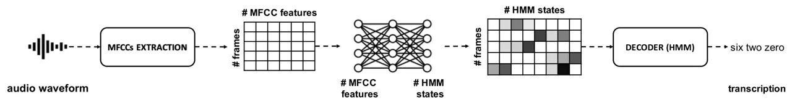
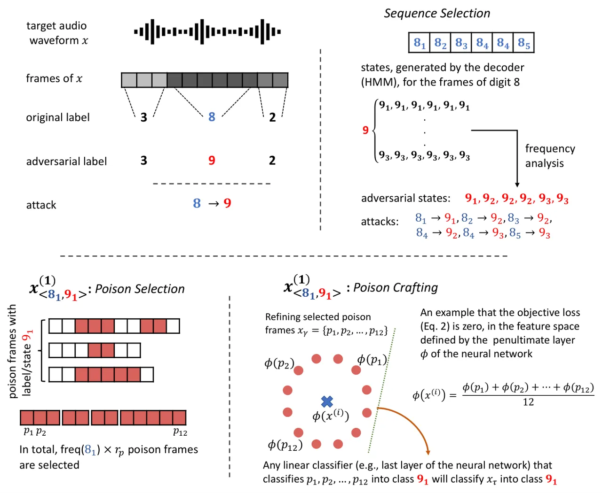
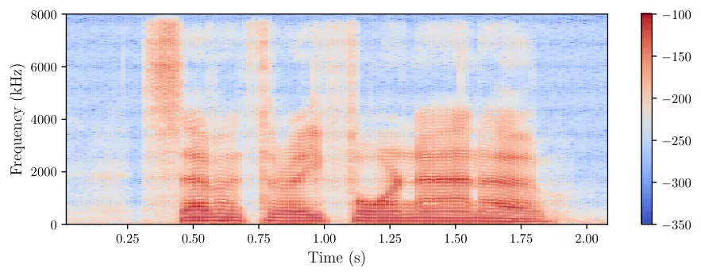
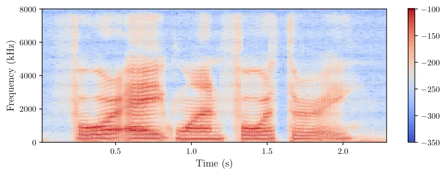
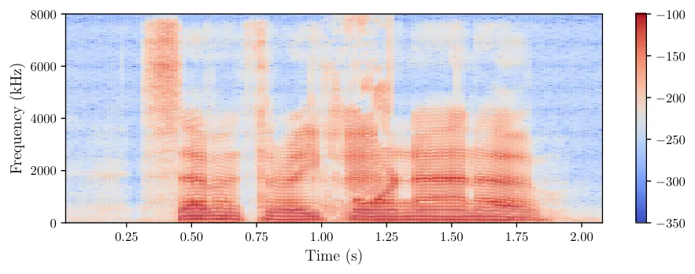
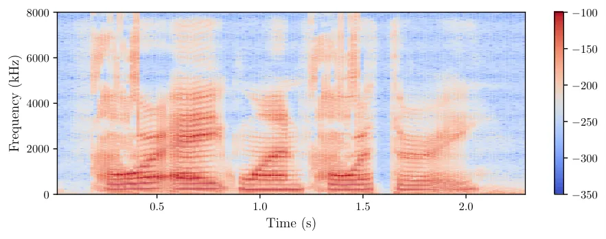
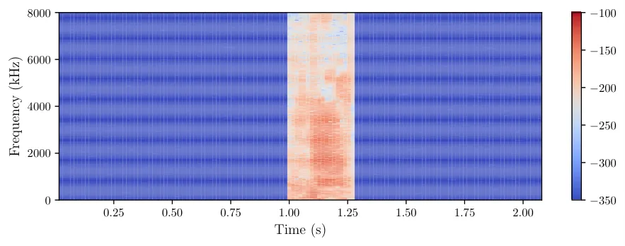
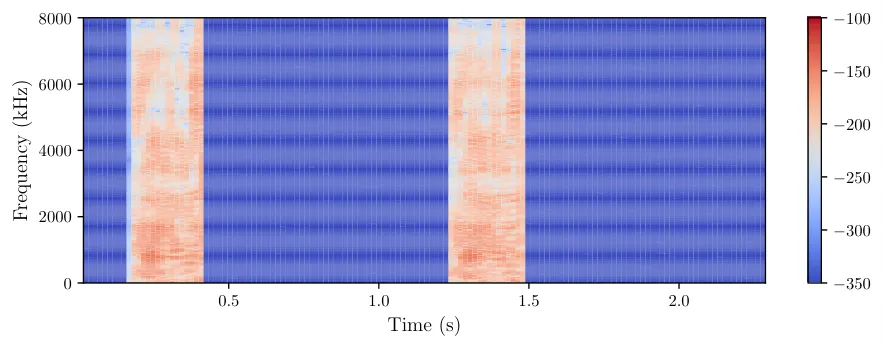

ASR  
_Automatic Speech Recognition_

CTC  
_Connectionist Temporal Classification_

DCT  
_Discrete Cosine Transformation_

DFT  
_Discrete Fourier Transform_

DNN  
_Deep Neural Network_

DNN-HMM  
_Deep Neural Network - Hidden Markov Model_

GMM  
_Gaussian Mixture Model_

HMM  
_Hidden Markov Model_

MFCC  
_Mel Frequency Cepstral Coefficient_

RIR  
_Room Impulse Response_

SNRseg  
_Segmental Signal-to-Noise Ratio_

SNR  
_Signal-to-Noise Ratio_

WER  
_Word Error Rate_

WSJ  
_Wall Street Journal_

# VenoMave: Targeted Poisoning Against Speech Recognition

Hojjat Aghakhani¹, Lea Schönherr², Thorsten Eisenhofer³, Dorothea
Kolossa⁴, Thorsten Holz²,  
Christopher Kruegel¹, and Giovanni Vigna¹ Affiliation: ¹University of
California, Santa Barbara ²CISPA Helmholtz Center for Information
Security  
³Ruhr University Bochum ⁴Technische Universität Berlin Affiliation: 
Affiliation: ¹{hojjat, chris, vigna}@cs.ucsb.edu ²{schoenherr,
holz}@cispa.de ³thorsten.eisenhofer@rub.de
⁴dorothea.kolossa@tu-berlin.de

###### Abstract

Despite remarkable improvements, automatic speech recognition is
susceptible to adversarial perturbations. Compared to standard machine
learning architectures, these attacks are significantly more
challenging, especially since the inputs to a speech recognition system
are time series that contain both acoustic and linguistic properties of
speech. Extracting all recognition-relevant information requires more
complex pipelines and an ensemble of specialized components.
Consequently, an attacker needs to consider the entire pipeline.

In this paper, we present VenoMave, the first training-time poisoning
attack against speech recognition. Similar to the predominantly studied
evasion attacks, we pursue the same goal: leading the system to an
incorrect and attacker-chosen transcription of a target audio waveform.
In contrast to evasion attacks, however, we assume that the attacker can
only manipulate a small part of the _training data_ without altering the
target audio waveform at runtime. We evaluate our attack on two
datasets: TIDIGITS and _Speech Commands_. When poisoning less than
0.17 % of the dataset, VenoMave achieves attack success rates of more
than 80.0 %, _without_ access to the victim’s network architecture or
hyperparameters. In a more realistic scenario, when the target audio
waveform is played over the air in different rooms, VenoMave maintains a
success rate of up to 73.3 %. Finally, VenoMave achieves an attack
transferability rate of 36.4 % between two different _model
architectures_.

###### Index Terms: 

Data Poisoning, Automatic Speech Recognition

## I Introduction



Fig. 1: Overview of a state-of-the-art hybrid ASR system. The ASR system
is composed of two main components: The neural network acts as an
acoustic model, and the decoder employs a HMM to generate the
transcription. The HMM mainly describes the language grammar, a
phonetic-based word description of all words, and context-dependencies
of phonetic units and words.

Digital voice assistants are ubiquitous, whether at our homes, in our
cars, or on our smartphones. Forecasts predict that by 2024, the number
of digital voice assistants will surpass the world’s population with
more than 8 billion devices \[45\]. While there is a constant effort in
improving their built-in ASR (ASR), prior research \[12, 35, 1\] has
demonstrated that ASR systems are susceptible to adversarial examples,
i.e., malicious audio inputs that trigger a misclassification at
_runtime_. Such evasion attacks are a well-studied phenomenon and have
been demonstrated to work for various domains \[17, 20\], including
speech recognition \[11, 12, 35\]. In contrast, attacks during training
of ASR, so-called *poisoning attacks* \[16, 9, 49\], have not been
studied yet \[1\]. Unlike evasion attacks, poisoning attacks compromise
the training data and cause misclassification of _unaltered_ inputs
during inference. Consequently, such an attack is hard to detect, as the
training data is usually not released with the model.

Poisoning attacks are enabled by the massive amounts of data needed to
train machine learning models: State-of-the-art ASR systems require
thousands or even millions of samples, which makes it infeasible to
manually verify the training set. It is common practice to collect
datasets from potentially untrustworthy sources (e. g., through
crowd-sourcing or using open-source repositories). Even more problematic
are privacy-preserving training approaches like federated learning,
which make it even easier to compromise the training process \[6, 7\].
By design, the training data does not leave the client and can therefore
not be verified. This property can be leveraged by a malicious party to
feed the model with poisoned data. Acknowledging these concerns, a
recent survey of 28 industry organizations found that industry
practitioners ranked data poisoning as the most serious threat to ML
systems \[25\], emphasizing that poisoning attacks are a neglected, yet
critical, attack scenario.

In this paper, we propose VenoMave, the first training-time poisoning
attack against speech recognition. In our design of VenoMave, we focus
on _hybrid_ ASR systems, as they are widely used in practice and for
commercial products such as Amazon’s Alexa and Sonos’s Voice
Control \[3\]. The goal of our poisoning attack is similar to
adversarial example attacks \[12, 35, 34, 44\]: We want to manipulate
such an ASR system so that it recognizes potentially problematic
commands (e.g., “open the door“), while the user says something else.
The difference is that we achieve the desired outcome not by
manipulating the _input_ utterances to the system, but rather by
tampering with its _training data_.

The task of an ASR system is to transcribe an audio waveform into a
sequence of words. For a correct transcription, speech recognition
systems consider inherent structures of speech, like the grammar of a
language or context dependencies of phonetic units. For this purpose, a
hybrid system utilizes two models, an _acoustic model_ and a _language
model_: The acoustic model divides an audio waveform into overlapping
frames and processes each frame individually, which results in a
_sequence_ of states, serving a phonetic representation. Subsequently,
this sequence is decoded with the language model that is trained on
linguistic features to predict a transcription. From an attacker’s
perspective, both components and their interplay need to be considered.
Additionally, ASR systems are—in general—trained from scratch, and we
can therefore not rely on fine-tuning a pre-trained model; a threat
model that is often assumed by previous poisoning attacks.

Having considered these challenges, we design and implement VenoMave
against hybrid ASR systems and evaluate the effectiveness from various
aspects that are essential for a realistic attack. VenoMave consists of
three fundamental steps: First, in the _sequence selection_, we select a
target input and define the sequence of target states that corresponds
to an attacker-chosen target transcription. Since there is no one-to-one
mapping between states and the transcription, we perform a frequency
analysis on the training data to choose a target sequence that would
also occur in natural speech. Based on this target sequence, we select
poison samples in the training data during the _poison selection_ step.
Finally, for _poison crafting_, we add malicious perturbations to the
raw audio waveform of the selected poison samples. To compute such
perturbations, we use a set of surrogate models, which are updated at
each step of the poison optimization, with the goal that the malicious
characteristics of the poisoned data transfer to _any_ model trained on
the resulting dataset.

To empirically evaluate VenoMave, we perform _single-word_ replacement
attacks on the TIDIGITS dataset \[27\], which is composed of uttered
digit sequences of different lengths. When poisoning on average only
25.44 seconds of audio (0.17 % of the victim’s training set), VenoMave
achieves attack success rates of more than 83.3 %. We further evaluate
VenoMave by performing multi-word replacement attacks, where we aim to
replace all digits of the target sequence with randomly chosen digits.
To examine the scalability of our approach, we additionally apply
VenoMave against the larger _Speech Commands_ dataset \[47\] and show
that the attack remains successful. For this dataset, having poisoned
only 116.73 seconds of audio (0.14 % of the training set), VenoMave
achieves an attack success rate of 73.3 %.

We verify VenoMave’s practical feasibility and demonstrate that the
attack remains viable in over-the-air scenarios by playing the target
audio waveforms in both simulated and real rooms. Furthermore, we study
the transferability of the attack and use VenoMave’s poisoned
data—generated with a hybrid ASR system—to train an _end-to-end_ system
that is publicly available in the speech toolkit SpeechBrain \[33\] and
has an entirely different architecture. For this scenario, we observe an
attack transferability rate of 36.4%.

Finally, we conduct a user study, in which we ask human participants to
transcribe the poisoned data. Such a study has often been missing in
prior works, and as noted by Schwarzschild et al. \[36\], most current
attacks in the visual domain produce easily visible artifacts and
distortions. For VenoMave, on average, more than 85% of the poison
samples were transcribed into their original labels, showing that
VenoMave is able to generate clean-label poison samples.

In summary, we make the following key contributions:

- •
  Poisoning ASR. We propose the first training-time poisoning attack
  against ASR systems and demonstrate that poisoning attacks are a real
  threat to ASR systems.
- •
  Full Training. We assume the victim’s system is trained on the
  poisoned data _from scratch_. As shown by prior work \[36\], this is
  significantly harder than the predominantly studied transfer learning
  setting.
- •
  Practical Evaluation. We consider various aspects that are essential
  for the deployment of a realistic attack against a speech recognition
  system. We show that the attack is effective with limited knowledge in
  over-the-air settings, and that it transfers to unknown ASR
  architectures.
- •
  Intelligibility. We conduct a user study and show that the attack
  generates clean-label poison samples as well as that the original
  transcription is intelligible. Additionally, we test the effects of
  psychoacoustics to hide the adversarial noise below the human hearing
  thresholds.

To foster further research in this area, we release the source code of
all experiments as well as the poison samples generated by VenoMave at
_[https://github.com/ucsb-seclab/VenoMave](https://github.com/ucsb-seclab/VenoMave)_.

## II Technical Background

The task of an ASR system is to automatically transcribe any spoken
content from raw audio waveforms into text. Nowadays, these systems can
be basically of two kinds: end-to-end systems and hybrid systems. The
former refers to neural architectures where the network directly
transforms the audio waveform into a character transcription. On the
other hand, hybrid DNN/HMM systems combine a neural network with a
statistical model; namely, a DNN (DNN) for acoustic modeling and a HMM
(HMM), used as the language model for cross-temporal information
integration.

Compared to end-to-end systems, hybrid systems continue to offer greater
flexibility because of their decoupled acoustic and language model.
This, in turn, makes reusing or fine-tuning the individual models
significantly easier and computationally less expensive. Furthermore,
unlike large and monolithic end-to-end systems, the acoustic modeling of
hybrid systems can be built closer to the user’s personal device and
away from the cloud, alleviating the privacy concerns of
customers \[3\]. For these reasons \[46\], hybrid ASR systems continue
to be used in practice by commercial products such as Amazon’s Alexa, or
very recently by Sonos’s Voice Control \[3\].

Figure 1 provides an overview of the main system components of a modern
DNN/HMM hybrid system:

- •
  _MFCCs Extraction._ The raw waveform input is typically processed into
  a feature representation that should ideally preserve all relevant
  information (e. g., phonetic information that describes the smallest
  acoustic unit of speech) while discarding the unnecessary remainders
  (e. g., acoustic properties of the room). Therefore, the input
  waveform is divided into overlapping frames of fixed length, and each
  frame is processed to obtain MFCC features \[40\]. MFCC features
  consider the logarithmic frequency perception of the human auditory
  system and are a very common feature representation for ASR systems.
- •
  _Acoustic Model DNN._ At the core of the system, the DNN is used as
  the acoustic model to predict the probabilities for distinct speech
  sounds (i.e., _phones_) for a given input frame. The phonetic
  description itself together with context dependencies and language
  grammar are described by the HMM states. Thus, the DNN outputs
  pseudo-posteriors for each input frame, which describe the
  probabilities for each of the HMM states.
- •
  _Decoder._ Given the output matrix of the DNN, an optimal path (which
  is interpreted as a sequence of words) is searched through the HMM via
  dynamic programming (e.g., Viterbi decoding \[30\]).

When training an ASR system, the exact alignment between utterances and
transcriptions (i.e., the labels) is usually not available. To account
for this, _Viterbi training_ is commonly utilized. Starting with
training on equally aligned labels, an initial DNN is trained, followed
by the decoding of the training data, which results in a new and better
fitting alignment between utterances and their transcriptions.

## III Method



Fig. 2: Training-time poisoning attack. An example of transcribing an
utterance with original transcription 382 into 392 using VenoMave.
First, the attacker determines which frames of the audio file need to be
targeted and what is the target HMM states of these frames. For each of
these frames, an individual poisoning attack is performed to fool the
surrogate networks. After a successful attack, the poisons transfer to
the victim’s network and decode the target transcription 392. For
simplicity, only the attack for the first frame is depicted, considering
only one surrogate model. In practice, an entire time series needs to be
attacked successfully.

On a high level, an adversary wants to trigger a targeted
misclassification of an unmodified utterance by introducing maliciously
altered training samples. This is a challenging task: First, the input
of an ASR system is a time series and, consequently, the system’s output
is also a sequence of classes. An adversary needs to consider these time
dependencies when crafting poisons. Second, ASR systems are typically
trained from scratch, and an attacker needs to take the complete
training pipeline into account. This is a much more difficult task
compared to the predominately studied poisoning setting of _linear
transfer learning_, where only the fine-tuning of a machine learning
model is attacked \[36\].

To address these challenges, we introduce VenoMave. In the following, we
describe the details of VenoMave’s training-time poisoning attack,
starting with the description of our threat model.

### III-A Threat Model

The attacker manipulates data points of the victim’s training set,
aiming to poison the victim’s ASR to trigger a _targeted_
misclassification of a specific utterance into an attacker-chosen
transcription. The attacker only modifies fractions of the training data
by adding malicious perturbations and cannot manipulate the target
utterance itself. In our threat model, we do not limit the amount of
perturbation that we add to poison utterances. This can potentially
cause the poisoned data to have wrong transcription labels. In
Section IV-H, we evaluate the human perception of the poisoned data by
conducting a listening transcription test.

For our experiments, we assume attackers with different levels of
knowledge of the victim’s training parameters, the architecture of the
neural network, and the clean training set. In our most restricted
threat model, we assume that the adversary knows neither the victim’s
training data (except for the injected poisoned data) and training
parameters nor the architecture of the neural network. In this setting,
the attacker still uses a dataset with a similar distribution to the
victim’s dataset.

In any case, we assume that the victim always uses an unknown random
seed to train the entire ASR system from scratch on the manipulated,
poisoned training data. Finally, to build the language model, we assume
that the victim uses a dictionary of phonetic word descriptions that is
known to the attacker. This is a legitimate assumption, as there are a
few dictionaries that are in wide use and can thus be seen as a
quasi-standard for pronunciation models, e. g., the CMU pronouncing
dictionary for English \[26\].

### III-B VenoMave Algorithm

For a given target audio waveform, our goal is to create a set of poison
samples that replace the original transcription with a target
transcription if a model is trained on a dataset that contains the
poison data. At a high level, VenoMave achieves this goal by modifying
the selected poisoned utterances to be similar to the target utterance
in the feature space of the poisoned model. Figure 2 illustrates the
individual steps of our attack. For the explanation of VenoMave, we
focus on changing exactly one word of the transcription. In this
example, the ASR system is poisoned to recognize an audio waveform with
the original transcription 382 as 392, i. e., replacing the original
word NINE with the word EIGHT. We use this example throughout this
section to explain each step in detail. The full attack is also
described in Algorithm 1.

Inputs  
   $`x_{t}`$ $`\triangleright`$ Target audio waveform  
   $`W_{t}`$ $`\triangleright`$ Target transcription  
   $`M`$ $`\triangleright`$ Number of surrogate models  
   $`\mathcal{C}`$ $`\triangleright`$ Training dataset

1:   

2: Phase 1: Initialization

3: We train a reference neural network $`\mathcal{M}{}`$ and language
model $`\mathcal{H}{}`$ on the clean dataset $`\mathcal{C}`$. These are
used for poison and sequence selection.

4: $`\mathcal{M}{}`$, $`\mathcal{H}{}`$ $`\leftarrow`$
train($`\mathcal{C}`$)

5:   

6: Phase 2: Sequence Selection

7: Get the relevant audio frames $`x^{(i)}`$ for the target
transcription, along with the corresponding HMM states
$`\{Y_{i}\}_{i=1}^{N}`$ with the trained reference models
$`\langle\mathcal{M}{},\mathcal{H}{}\rangle`$ (line 2). Perform
frequency analysis on $`\mathcal{C}`$ to select the adversarial sequence
(line 3).

8: $`x^{(i)}`$, $`\{Y_{i}\}_{i=1}^{N}\leftarrow`$
get*target_frames($`\langle\mathcal{M}{},\mathcal{H}{}\rangle`$,
$`x*{t}`$)

9: $`\{Z_{i}\}_{i=1}^{N}\leftarrow`$
select*adv_states($`\mathcal{H}{}`$, $`\mathcal{C}`$, $`W*{t}`$)

10:   

11: Phase 3: Poison Selection

12: For each attack pair $`T=\{x^{(i)}_{<Y_{i},Z_{i}>}\}_{i=1}^{N}`$
select poison frames $`\mathcal{P}{}_{i}`$.

13: for $`i=1`$ to $`N`$ do

14:   $`\mathcal{P}{}_{i}\leftarrow`$
select*poison_frames($`\mathcal{C}`$, $`Y*{i}`$, $`Z\_{i}`$)

15: end for

16:   

17: Phase 4: Poison Crafting

18: In each round k, we retrain surrogates from scratch on the current
(poisoned) dataset $`\mathcal{D}`$ (lines 9-11). We iteratively update
poisons with respect to $`\nabla\textrm{loss}`$ (lines 12-19) calculated
via Equation (2) and subsequently update $`\mathcal{D}`$ (line 20).
After each round k, we test $`\mathcal{D}`$ with a (surrogate) victim
model $`\mathcal{M}{}_{\mathcal{V}}`$ (line 22).

19: $`\mathcal{D}\leftarrow\mathcal{C}{}`$

20: for k $`=1`$ to $`K`$ do

21:   for $`m=1`$ to $`M`$ do

22:    $`\mathcal{M}{}_{m}`$, $`\mathcal{H}{}_{m}`$ $`\leftarrow`$
train($`\mathcal{D}`$)

23:   end for

24:   while not converged do

25:    loss $`\leftarrow`$ 0

26:    for $`(x^{(i)},Y_{i},Z_{i})\leftarrow T`$ do

27:      loss $`\leftarrow`$ loss + $`\mathcal{L}`$($`x^{(i)}`$,
$`\mathcal{P}_{i}`$, $`\{\mathcal{M}{}_{m}\}_{m=1}^{m}`$)

28:    end for

29:    loss $`\leftarrow`$ $`\frac{\textrm{loss}}{N}`$

30:    update $`\{\mathcal{P}_{i}\}_{i=1}^{N}`$ using
$`\nabla\textrm{loss}`$

31:   end while

32:
  $`\mathcal{D}\leftarrow`$update*dataset($`\mathcal{C}{},\{\mathcal{P}*{i}\}\_{i=1}^{N}`$)

33:   $`\mathcal{M}{}_{\mathcal{V}}`$, $`\mathcal{H}{}_{\mathcal{V}}`$
$`\leftarrow`$ train($`\mathcal{D}`$)

34:   break if attack is successful (early stopping)

35: end for

Algorithm 1 VenoMave

Considering the hybrid speech recognition architecture, we have to
inject poison samples such that the trained acoustic model generates an
output sequence that will be decoded as the target words by the language
model. Therefore, the adversarial label for the acoustic model is a
sequence of HMM states that describes our target transcription. Note
that not only one possible sequence of states would lead to a specific
transcription, as a large number of state sequences map to the same
transcription. For this reason, we first have to determine which state
sequence is a promising candidate to achieve the desired output
transcript.

To choose the sequence as well as select candidate samples to poison,
VenoMave relies on a reference ASR system, which is trained on the clean
training set. We refer to this system as
$`\langle\mathcal{M}{},\mathcal{H}{}\rangle`$, where $`\mathcal{M}{}`$
and $`\mathcal{H}{}`$ denote the acoustic model and language model,
respectively.

#### III-B1 Sequence Selection

The language model $`\mathcal{H}{}`$ defines the word $`W`$ as a
sequence of states $`W\!\!=\!\![w_{\kappa}]`$ with
$`\kappa=1,\dots,\mathcal{K}`$. Assuming that the sequences for the
digits EIGHT and NINE consist of 5 and 3 states, respectively, the two
words can be described with HMM states
$`\text{{EIGHT}}\!\!=\!\![8_{1},8_{2},8_{3},8_{4},8_{5}]`$ and
$`\text{{NINE}}\!\!=\!\![9_{1},9_{2},9_{3}]`$. In general, the number of
frames of an uttered word is larger than the number of HMM states. That
is, for the word NINE uttered across 6 frames, both sequences
$`[9_{1},9_{1},9_{2},9_{2},9_{3},9_{3}]`$ and
$`[9_{1},9_{1},9_{1},9_{2},9_{2},9_{3}]`$ could be selected as the
target. However, a sequence should be selected that is more probable to
be decoded as NINE. Hence, we look at the appearances of the word NINE
in the dataset and select the most common pattern as our target
sequence.

Using $`\langle\mathcal{M}{},\mathcal{H}{}\rangle`$, we calculate the
relative frequency of state $`w_{\kappa}`$ as the average number of its
occurrences in utterances of NINE. Then we select a target sequence that
has a distribution of relative frequencies similar to what we have
observed in the dataset. Therefore, in our running example, the original
sequence $`[8_{1},8_{2},8_{3},8_{4},8_{4},8_{5}]`$ should be changed to
$`[9_{1},9_{2},9_{2},9_{2},9_{3},9_{3}]`$, as the state $`9_{2}`$
appears three times more often in the training set than the state
$`9_{1}`$. We then divide our attack into $`N\!=\!6`$ smaller poisoning
attacks, described by a
set $`T\!\!=\!\!\{x^{(i)}_{<Y_{i},Z_{i}>}\}_{i=1}^{N}`$ of
frames $`x^{(i)}_{<Y_{i},Z_{i}>}`$ with an original state  $`Y_{i}`$ and
an adversarial state $`Z_{i}`$. In our example in Figure 2 the poisoning
set is described as

```math
\displaystyle\Big\{x^{(1)}_{<8_{1},9_{1}>},x^{(2)}_{<8_{2},9_{2}>},x^{(3)}_{<8_{3},9_{2}>},x^{(4)}_{<8_{4},9_{2}>},x^{(5)}_{<8_{4},9_{3}>},x^{(6)}_{<8_{5},9_{3}>}\Big\}.
```

#### III-B2 Poison Selection

We select poison utterances in training data based on the chosen target
sequence: For each attack pair $`x^{(i)}_{<Y_{i},Z_{i}>}`$, we select
poison frames $`\mathcal{P}_{i}`$ with label $`Z_{i}`$ from one or more
utterances. We use the frequency of the original state $`Y_{i}`$ to
determine the number of poison frames to be

```math
\displaystyle\big\lceil\textrm{freq}(w\!\!=\!\!Y_{i})\cdot r_{p}\big\rceil, \tag{1}
```

where $`0\!<\!r_{p}\!<\!1`$ describes the _poison budget_. Thus, if an
original state $`Y_{i}`$ occurs twice as often in the training set as
another original state $`Y_{j}`$, we also select twice as many poison
frames for the attack $`x^{(i)}_{<Y_{i},Z_{i}>}`$ than for the
attack $`x^{(j)}_{<Y_{j},Z_{j}>}`$. The intuition behind this choice is
that the attack might fail if the target frame $`x^{(i)}`$ has adjacent
neighbor frames from its class $`Y_{i}`$ in the victim’s training set.
This has also been observed in prior work \[49\]. The poison frames—no
matter how well they are crafted—need to compete with these neighbor
frames to successfully inject the malicious decision boundaries during
the training phase.

Our attack only perturbs particular frames of selected poisoned audio
files. This allows to distribute poison frames over multiple utterances,
with each utterance consisting of mostly clean frames and only a few
poison frames.

#### III-B3 Poison Crafting

The goal of this step is to modify the selected poison utterances such
that they are “close enough” to the target utterance in the feature
spaces of the surrogate poisoned models after being trained on the
poisoned dataset. The motivation behind this goal is the mathematical
guarantee that any linear classifier that associates a set of
samples $`P`$ to class $`Z`$ will also classify any point inside their
convex hull as class $`Z`$. Specifically, we divide the network into two
parts: (1) all layers up to the penultimate layer, named the feature¹¹ 1
Throughout the paper, by the term _features_ we refer to the features
represented by the penultimate layer, not MFCCs. extractor network
$`\Phi`$, and (2) the last layer, which is a linear classifier. The
victim’s model will identify the target frame $`x^{(i)}`$ as the target
class $`Z_{i}`$ if $`\Phi(x^{(i)})`$ lies within the convex hull of
class $`Z`$ formed by the poison
frames $`\{\Phi(x_{\gamma}^{(p)})\}_{p=1}^{P}`$.

For each attack pair $`x^{(i)}_{<Y_{i},Z_{i}>}`$, we use $`M`$ surrogate
models (i.e., similar models trained with different seeds) to optimize
the poison frames $`\mathcal{P}_{i}=\{x_{\gamma}^{(p)}\}_{p=1}^{P}`$
with the following loss:

```math
\displaystyle\mathcal{L}:=\underset{\{x_{\gamma}^{(p)}\}}{\textrm{min}}\; \displaystyle\frac{1}{2M}\sum_{m=1}^{M}\frac{\left\lVert\Phi^{(m)}(x^{(i)})-\frac{1}{P}\sum_{p=1}^{P}\Phi^{(m)}(x_{\gamma}^{(p)})\right\rVert^{2}}{\left\lVert\Phi^{(m)}(x^{(i)})\right\rVert^{2}} \tag{2}
```

To solve this non-convex problem, we iteratively apply gradient descent
to optimize the poison frames $`\mathcal{P}_{i}`$.

Our motivation behind optimizing Equation 2 over $`M`$ surrogate models
is based on prior work \[49, 2\] that relies on the assumption that by
obtaining the above heuristics for similar models, such a guarantee will
also transfer to unknown victim models. These attacks presented high
success rates against _linear transfer learning_, where a pre-trained
but _frozen_ network $`\Phi`$ is used to calculate features for an
application-specific linear classifier, which is fine-tuned on the
poisoned dataset. However, as shown by Schwarzschild et al. \[36\], such
heuristics will not hold when the victim’s model is trained on the
poisoned dataset from scratch, as the feature space is also altered
during training. In fact, we made similar observations in preliminary
experiments.

To cope with this challenge, we train a set of surrogate networks
$`\{\mathcal{M}{}_{m}\}_{m=1}^{M}`$ _from scratch_ on the current
(poisoned) dataset at the beginning of each round of the attack.
Subsequently, we modify the poison samples to achieve our desired
heuristics with respect to the refreshed surrogate models. Our intuition
is that after several rounds of the attack we reach a state in which the
poisoned data needs no further modifications to obtain the heuristics.
To check whether this happens or not, at the end of each round of the
attack, we train a (surrogate) victim ASR system on the current poisoned
dataset from scratch. The attack terminates if either it succeeds
against this ASR system (early stop) or we reach a maximum number of
rounds $`K`$.

For the evaluation of VenoMave, we consider an attack to be successful
if and only if it succeeds against the target victim’s ASR system, where
both the neural network and language model components are trained on the
poisoned dataset from scratch. Our experiments demonstrate that the
malicious characteristics of our crafted poisoned data successfully
transfer to the victim’s poisoned model with high probability.

## IV Evaluation

In this section, we empirically assess VenoMave in a series of
experiments. We start by evaluating the attack’s efficacy on the task of
recognizing sequences of digits with the TIDIGITS dataset \[27\].
Building upon this, we consider a larger ASR system that is trained on
the _Speech Commands_ dataset \[47\]. Our experiments show that the
attack is effective in poisoning ASR systems, remains viable with
limited knowledge about the victim’s system and in over-the-air
settings. Furthermore, we demonstrate that the malicious characteristics
of the poisoned data—crafted with VenoMave for a hybrid ASR
system—transfer to an _end-to-end_ system. Throughout the experiments,
we use the open-source ASR system used by Däubener et al. \[14\] for
studying evasion attacks against ASR systems.

### IV-A Metrics

Before we get into the details of our results, we describe the standard
measures used to assess the quality of the poison samples, both in terms
of effectiveness as well as conspicuousness.

#### IV-A1 Attack Success Rate

In all experiments, an attacker aims to induce a targeted
misclassification for a single utterance. If the targeted
misclassification is not triggered, we consider the attack as failed.
The _attack success rate_ then describes the percentage of
successful attacks.

#### IV-A2 Clean Test Accuracy

We evaluate the victim’s performance against the test set to calculate
the clean test accuracy of the model. An ideal poisoning attack does not
degrade the model performance for non-target inputs; otherwise, it might
be suspicious. For all test samples, given the model transcriptions, we
count and accumulate all substituted words $`S`$, inserted words $`I`$,
and deleted words $`D`$ to calculate the accuracy via

```math
\displaystyle\text{accuracy}=\frac{N-I-S-D}{N},
```

where $`N`$ is the total number of words in the test set’s ground-truth
labels.

#### IV-A3 Segmental Signal-to-Noise Ratio (SNRseg)

To quantify the magnitude of required changes, we use the Segmental
Signal-to-Noise Ratio (SNRseg). This metric measures the amount of
noise $`\sigma`$ added by an attacker to the original
signal $`\mathbf{x}`$ and is computed via

```math
\displaystyle\text{SNRseg(dB)}=\dfrac{10}{K}\sum_{k=0}^{K-1}\log_{10}\frac{\sum_{t=Tk}^{Tk+T-1}\mathbf{x}^{2}(t)}{\sum_{t=Tk}^{Tk+T-1}\sigma^{2}(t)},
```

where $`T`$ is the segment length and $`K`$ the number of segments.
Thus, the higher the SNRseg, the _less_ noise has been added. We use a
frame length of $`12.5`$ ms, which corresponds to $`T=200`$ at a
sampling frequency of $`16`$ kHz. As only very small parts of the poison
files are changed, we measure the SNRseg only for the poisoned frame
(i.e., clean parts of the poison samples are excluded) to provide a fair
assessment of the added noise.

| Name                   | Layer description         | \# Parameters |
| ---------------------- | ------------------------- | ------------- |
| $`\bm{DNN_{2}}`$       | $`(100,100)`$ neurons     | 54,895        |
| $`\bm{DNN_{\bm{2+}}}`$ | $`(100,200)`$ neurons     | 100,095       |
| $`\bm{DNN_{3}}`$       | $`(100,100,100)`$ neurons | 64,995        |
| $`\bm{DNN_{3+}}`$      | $`(400,300,200)`$ neurons | 340,395       |

TABLE I: Neural network architectures used in experiments. Networks use
two or three hidden layers, each with a softmax output layer of size 95,
corresponding to the number of HMM states. The baseline test accuracy is
for when the victim uses a clean dataset.

### IV-B Attack Parameters

We first evaluate the attack efficacy with respect to its salient
parameters: the number of surrogate models as well as varying sizes of
the poison budget. For this experiment, we consider a threat model,
where the attacker has full knowledge of the victim’s network
architecture, training parameters, and training set. The adversary uses
this knowledge to train surrogate ASR systems for poison optimization.
We run each attack instance for a maximum of $`K=20`$ rounds. For the
early stopping criteria, we test after each round if we succeed against
a (surrogate) test model.

#### IV-B1 Experimental Setup

We use the TIDIGITS dataset \[27\], which is designed for
speaker-independent recognition of digit sequences and consists of
eleven words: ONE, TWO, …, NINE, ZERO, and OH. We use 8,623 utterances
for the training set and 4,390 utterances for the test set. The
sequences are spoken by 225 speakers (111 men and 114 women), which are
split equally into disjoint sets between the training and test set. For
our poisoning attack trials, we randomly sample 30 single-digit
utterances among the 4,390 test samples and assign a target label to
each of them. Target labels are chosen randomly and are different from
the ground-truth transcription.

The victim’s ASR system uses the $`DNN_{2+}`$ architecture (described in
Table I) with a softmax output layer of size 95, corresponding to the
number of HMM states. This system is trained from scratch for 33 epochs
with a batch size of 32 using the Adam \[22\] optimizer with a learning
rate of $`1e^{-4}`$. This training also includes three epochs of Viterbi
training to build the language model. Hyperparameters were chosen to
maximize the clean test accuracy. For the baseline model —only trained
with clean data— we achieved a test accuracy of $`98.79`$ %.

For evaluation of the attack, the random seed used by the victim is
unknown. Thus, the specific parameters of the victim’s ASR system, the
neural network, and the HMM—which depend on the neural network due to
Viterbi training—are not used during poison optimization.

To accelerate the attack, we freeze the HMM component and only train the
DNN for the surrogate ASR systems. We found this effective as the
language model does typically not change significantly. The frozen
surrogate HMM is trained in advance by training an ASR system for $`15`$
epochs on the clean training set, followed by three epochs of Viterbi
training. During the attack, we train the surrogate ASR systems for 25
epochs until convergence.

#### IV-B2 Results

|                             | $`\mathbf{M}`$ |       |       |       |       |       |
| --------------------------- | -------------- | ----- | ----- | ----- | ----- | ----- |
|                             | 1              | 2     | 4     | 6     | 8     | 10    |
| \# Attack step ($`\bm{K}`$) | 15.7           | 11.5  | 7.9   | 7.6   | 6.8   | 7.0   |
| Attack time (hours)         | 1.54           | 1.36  | 1.46  | 3.43  | 3.33  | 5.33  |
| Clean test acc. (%)         | 97.84          | 97.84 | 97.81 | 97.79 | 97.84 | 97.81 |
| Attack succ. rate (%)       | 43.3           | 76.7  | 80.0  | 80.0  | 86.7  | 83.3  |

TABLE II: Evaluation of VenoMave when it uses different numbers of
surrogate networks. The $`r_{p}`$ is set to 0.005. This experiment was
performed on a machine with NVIDIA RTX A6000 graphics cards (with CUDA
11.0, PyTorch 1.9.1, and Torchaudio 0.9.1). Note that as VenoMave
employs an early-stopping procedure (see Algorithm 1), increasing
$`\mathbf{M}`$ will not necessarily lead to a longer attack time.

We first evaluate the attack success rate as a function of the number of
surrogate models. Table II presents the performance of VenoMave for
different numbers of surrogate networks. Note that a higher number of
surrogate models adds to the complexity of Equation 2. However, more
surrogate networks can help the attack to succeed in fewer steps and,
consequently, this increased complexity does not necessarily lead to a
longer attack time. This is also evident from the results in Table II.
We obtain the highest attack success rate (86.7 %) for $`M=8`$ surrogate
models. In the case where we use $`M=10`$ surrogate models, the attack
time and required attack steps are increased while a lower attack
success rate is obtained. Note that the number of attack steps K in
Table II is the average number for all 30 poisoning trials for each
entry.

|                              | $`\mathbf{r_{p}}`$ |        |        |        |
| ---------------------------- | ------------------ | ------ | ------ | ------ |
|                              | 0.001              | 0.003  | 0.005  | 0.01   |
| Poison data length (seconds) | 6.20               | 15.93  | 25.44  | 48.73  |
| \# Poison data samples       | 96.23              | 248.10 | 387.83 | 693.57 |
| Clean test accuracy (%)      | 97.85              | 97.84  | 97.84  | 97.76  |
| Attack success rate (%)      | 23.3               | 76.7   | 86.7   | 83.3   |

TABLE III: Evaluation of VenoMave when the poison budget $`r_{p}`$ is
successively increased from 0.001 to 0.01.

Next, we evaluate VenoMave for varying levels of poison budget $`r_{p}`$
(see Section III-B3). The results are shown in Table III. We observe a
general trend that an increase of the poison budget leads to a higher
attack success rate (23.3 % $`\rightarrow`$ 83.3 %), which stagnates for
poison budgets larger than $`0.005`$. A higher budget allows the
attacker to manipulate an increasing number of poison frames and, thus,
has more control over the training process. However, from a certain
number, this effect is less distinct as the surrogate models also need
to maintain a good clean test accuracy. The general improvement comes at
a price; the length and number of the poisoned data increases (6.20 s
$`\rightarrow`$ 48.73 s) from a total of 15,254 s training data. We
observe the best performance with a budget $`r_{p}\!=\!0.005`$, where we
poison only 0.17 % of the training set while achieving an attack success
rate of 86.7 %.

Figure 3 shows an example of a poisoned audio file as well as its
respective original audio file.



(a) Original Signal



(b) Original Signal



(c) Poison Signal



(d) Poison Signal



(e) Difference



(f) Difference

Fig. 3: Spectrograms of Poisons. We present two example poisons computed
with VenoMave. The left column shows an utterance of digit sequence
SEVEN, THREE, FOUR, NINE, OH and the right shows an utterance of digit
sequence FOUR, EIGHT, ONE, FOUR, THREE. Both poison the digit FOUR to
OH. Figure 3(a) and 3(b) show the unmodified signals, Figure 3(c) and
3(d) depict the poison version, and Figure 3(e) and 3(f) show the
respective differences of both versions.

|                            | Victim’s network |                  |                   |
| -------------------------- | ---------------- | ---------------- | ----------------- |
|                            | $`\bm{DNN_{2}}`$ | $`\bm{DNN_{3}}`$ | $`\bm{DNN_{3+}}`$ |
| Baseline test accuracy (%) | 98.75            | 98.41            | 99.01             |
| Clean test accuracy (%)    | 97.92            | 98.04            | 99.02             |
| Attack success rate (%)    | 86.7             | 86.7             | 83.3              |

TABLE IV: The attack performance for unknown training parameters and
network architectures.

| Attacker     |         | Victim      |             | Clean test | Attack succ. |
| ------------ | ------- | ----------- | ----------- | ---------- | ------------ |
| Network      | Tr. set | Network     | Tr. set     | acc. (%)   | rate (%)     |
| $`DNN_{2+}`$ | Split 1 | $`DNN_{3}`$ | Split 2     | 97.92      | 86.7         |
|              |         | $`DNN_{3}`$ | Split 1 + 2 | 98.03      | 80.0         |

TABLE V: Evaluation of VenoMave for partial and unknown set of clean
training samples. The victim uses different training parameters than the
attacker. We divide the training set of TIDIGITS into two subsets, with
“Split 1” containing the first half and “Split 2” containing the second
half of the speakers (56 speakers each).

### IV-C Limited-Knowledge Adversary

For most applications in practice, it is unrealistic to assume that an
adversary has detailed knowledge of the exact training parameters,
architecture, and the training data that is used by the victim. In the
following, we therefore want to relax the threat model and consider an
adversary with limited knowledge. We consider two settings: (1) First,
we restrict access to the victim’s model architecture and training
parameters, and (2) second, we extend the knowledge limitations and
additionally restrict access to the victim’s training data (except for
the poisoned data). For both settings and based on the previous
experiments, we set the poison budget to $`r_{p}=0.005`$ and consider
$`M=8`$ surrogate models.

#### IV-C1 Model Architecture and Parameters

We consider that the victim uses one of three different model
architectures: $`DNN_{2}`$, $`DNN_{3}`$, or $`DNN_{3+}`$ from Table I.
All models are trained from scratch for 32 epochs, of which epochs 11
and 12 include Viterbi training. The victim uses Adam with a learning
rate of $`4e^{-4}`$, a batch size of 64, and a dropout probability of
0.2. The dropout layer is added after the first hidden layer.

Table IV shows that the malicious characteristics of the poisoned data
remain even if the victim uses different training parameters and network
architectures. Also, for all models the clean test accuracy remains
almost the same in comparison to the baseline test accuracy, which
measures the accuracy of the models trained on exclusively clean data.
It is worth noting that in prior work, dropout was typically disabled,
as in a transfer learning scenario, a rational victim will usually
overfit the training set \[2, 49\]. Since this is usually not the case
when the victim’s model is trained from scratch, we enable dropout in
this experiment. Our results show that the poisoned data survive the
randomness introduced by the dropout.

#### IV-C2 Training Dataset

Building upon the previous experiment, we further reduce the attacker’s
knowledge and assume that the attacker only has partial knowledge about
the training set of the victim and its underlying distribution. In
general, the adversary uses their knowledge about the training data to
(1) perform the ratio analysis (see Section III) and (2) train surrogate
networks for the poison crafting step. Note that for this experiment we
continue to use an unknown victim’s model architecture.

For the experiment, we divide the training data into two subsets with
disjoint sets of 56 speakers each. We restrict the adversary to access
only the first subset (Split 1, 56 speakers). For the victim, we
consider two different scenarios: (1) training samples only from the
second subset (Split 2, 0 % overlap), and (2) the entire training set
(Split 1+2, 50 % overlap). Similar to the previous experiment, we
evaluate a victim with different training parameters and network
architecture ($`DNN_{3}`$). As the poison samples only depend on Split
1, we use the same data for both cases.

Table V presents the performance of VenoMave for these two scenarios.
When the victim’s training set has no overlap with the attacker’s
training set, VenoMave achieves an attack success rate of 86.7 %. When
the attacker’s training set consists of 50 % of the victim’s training
set, VenoMave achieves an attack success rate of 80 %. While the same
poisoned data is used in these two cases, in the latter case, the
poisoned data are competing with more clean data points. This may
explain why VenoMave achieves a lower attack success rate despite the
fact that it has partial knowledge of the victim’s training set. The
average clean test accuracy is 97.92% and 98.03% for 0 % and 50 %
overlap cases, respectively.

### IV-D Multi-Word Replacement Attack

Next, we want to scale the attack to more complex targets and, in
particular, aim to replace multiple words. This can be realized by
launching multiple individual word replacement attacks simultaneously.
For a successful multi-word attack, _all_ single-word attacks need to be
successful. For this experiment, we evaluate the attack for sentences
with two, three, and four digits. For each set, we select 20 random
audio files and aim to replace all the words with randomly chosen
adversarial words. As an example, the adversary might try to fool the
ASR system to recognize an utterance of O89 as 762. We continue to use a
limited-knowledge attacker that does not have access to the victim’s
training parameters and network architecture. We use the same setup as
before and $`DNN_{3}`$ as the victim’s network architecture.

Table VI shows the attack statistics for sentences with different
numbers of words. For reference, we repeat the results for the
single-word attack in Table VI. The attack remains effective for longer
sequences of words albeit with a decreased success rate. Also, the
attack uses more poisoned data to perform a multiple-digit replacement
compared to a single-word replacement attack.

|                              | Number of Words |        |        |          |
| ---------------------------- | --------------- | ------ | ------ | -------- |
|                              | 1               | 2      | 3      | 4        |
| Poison data length (seconds) | 25.44           | 46.17  | 63.85  | 89.68    |
| \# Poison data samples       | 387.83          | 630.39 | 841.16 | 1,289.85 |
| Clean test accuracy (%)      | 98.04           | 97.84  | 97.67  | 97.75    |
| Attack success rate (%)      | 86.7            | 75.0   | 60.0   | 60.0     |

TABLE VI: Results for target sentences with different numbers of words.
Note that the performance of the single-word attack is also presented as
a reference.

### IV-E Speech Commands Dataset

To further examine the practical feasibility of our attack, we evaluate
VenoMave on a larger ASR system. To this end, we use the _Speech
Commands_ corpus \[47\] used for keyword spotting. This dataset consists
of 105,829 one-word utterances and contains 35 different words:

- •
  _Digits_ ZERO, …, NINE
- •
  _Common words for IoT or robotics applications._ YES, NO, UP, DOWN,
  LEFT, RIGHT, ON, OFF, STOP, and GO
- •
  _Command words._ FORWARD, FOLLOW, BACKWARD, and LEARN.
- •
  _Auxiliary words._ BED, BIRD, CAT, DOG, HAPPY, HOUSE, MARVIN, SHEILA,
  TREE, VISUAL, and WOW.

For our poisoning attack trials, we randomly select 15 audio files and
for each sample, we pick a random adversarial target.

To fit this dataset, we use a larger neural network as well as a larger
language model with 350 states. We use the $`DNN_{3+}`$ architecture for
our surrogate networks, but with a larger output layer of size $`350`$
to contain all required phones of the extended language model. As
before, we use a fixed HMM during the attack, which is trained in
advance by training an ASR system for $`16`$ epochs on the clean
training set, of which the last epoch includes Viterbi training. We use
this surrogate HMM at the beginning of each step of the attack to train
four surrogate networks on the latest version of the poisoned dataset
for 20 epochs with a batch size of 32. We verify that the training
converges at 20 epochs. We use the Adam \[22\] optimizer with a learning
rate of $`1e^{-4}`$ for poison crafting.

For the victim, we use a network architecture consisting of four hidden
layers with 300, 200, 200, and 200 neurons, respectively. The victim
trains the ASR system from scratch for 31 epochs, of which the eleventh
epoch enables Viterbi training. For the victim’s training, a learning
rate of $`4e^{-4}`$ and a batch size of 64 is used.

With a poison budget of $`r_{p}=0.02`$, VenoMave achieves a success rate
of 73.3% while poisoning only 0.14 % of the training set (116.73 seconds
of audio). Table VII shows the attack performance for each example. We
successfully poisoned 11 of the 15 trials. In general, we need to poison
more and longer audio sequences with this extended dataset but the
attack remains successful in most of the cases.

| Original | Adversarial | Poisoned data    |            | Poisoned frames | Attack      | Clean test   |
| -------- | ----------- | ---------------- | ---------- | --------------- | ----------- | ------------ |
| word     | word        | length (seconds) | \# samples | SNRseg          | successful? | accuracy (%) |
| learn    | on          |  31.59           |  396       |  7.99           | ✓           | 86.83        |
| nine     | four        | 156.71           | 1,887      |  7.49           | ✓           | 87.07        |
| three    | six         | 124.71           | 1,654      | -1.74           | ✗           | 87.16        |
| six      | off         |  91.55           | 1,057      | -0.63           | ✓           | 86.98        |
| yes      | go          | 140.74           | 1,493      |  7.75           | ✓           | 86.90        |
| six      | five        | 128.36           | 1,584      |  7.39           | ✓           | 87.72        |
| follow   | three       |  51.06           |  865       |  1.72           | ✗           | 87.39        |
| four     | zero        | 164.14           | 2,012      |  8.37           | ✓           | 86.99        |
| follow   | two         |  45.35           |  549       |  3.74           | ✓           | 86.79        |
| four     | yes         | 184.95           | 2,153      |  4.06           | ✓           | 87.35        |
| six      | seven       | 217.60           | 2,412      |  4.07           | ✗           | 87.35        |
| one      | forward     |  80.66           | 1,064      |  5.09           | ✓           | 85.86        |
| four     | up          | 150.78           | 1,659      | -1.67           | ✓           | 86.77        |
| up       | off         |  79.65           | 1,025      |  3.07           | ✗           | 86.67        |
| one      | down        |  94.10           | 1,256      |  5.33           | ✓           | 87.12        |

TABLE VII: Evaluation of VenoMave on the _Speech Commands_ dataset using
15 different random attack examples. The poison budget $`r_{p}`$ is
0.02, and the attacker uses four surrogate networks to craft the
poisoned data. On average, VenoMave uses 116.73 seconds of poisoned data
(0.14 % of the training set). The total length of the training data is
84,054 seconds. The average SNRseg for poison frames is 4.14.

### IV-F Over-The-Air Attack

|           |                              |                             |                             |                       |        |        |       |                       |        |        |       |
| --------- | ---------------------------- | --------------------------- | --------------------------- | --------------------- | ------ | ------ | ----- | --------------------- | ------ | ------ | ----- |
|           |                              |                             |                             | TIDIGITS              |        |        |       | Speech Commands       |        |        |       |
| Room      |                              | Mic.                        | Speaker                     | Attack succ. rate (%) |        |        |       | Attack succ. rate (%) |        |        |       |
| Type      | Dim. ($`m^{3}`$)             | Position                    | Position                    | RT=0.4                | RT=0.6 | RT=0.8 | RT=1  | RT=0.4                | RT=0.6 | RT=0.8 | RT=1  |
| Simulated | $`10.7\times 6.9\times 2.6`$ | $`1.0\times 4.5\times 1.3`$ | $`8.1\times 3.3\times 1.4`$ | 53.33                 | 46.67  | 36.67  | 33.33 | 20.00                 | 20.00  | 26.67  | 20.00 |
| Simulated | $`~4.6\times 6.9\times 3.1`$ | $`3.8\times 3.2\times 1.2`$ | $`3.8\times 5.3\times 1.0`$ | 63.33                 | 60.00  | 50.00  | 46.67 | 60.00                 | 53.33  | 40.00  | 33.33 |
| Simulated | $`~7.5\times 4.6\times 3.1`$ | $`0.4\times 0.9\times 1.1`$ | $`6.9\times 1.9\times 2.6`$ | 73.33                 | 60.00  | 56.67  | 56.67 | 46.67                 | 46.67  | 40.00  | 40.00 |
| Physical  | $`~3.7\times 3.4\times 2.4`$ | $`1.7\times 2.7\times 1.2`$ | $`2.1\times 0.5\times 0.8`$ | 73.33                 |        |        |       | 33.33                 |        |        |       |

TABLE VIII: VenoMave’s evaluation after the transmission in three
simulated rooms, selected from related work \[42\], and one real
physical room. For the TIDIGITS dataset, the numbers are for the poison
samples that are generated in Section IV-C2 for the 0 % overlap setting.
For the Speech Commands dataset, we use the poisoned data that VenoMave
crafted in Section IV-E.

Prior work on audio adversarial examples \[48, 34\] has often struggled
in an over-the-air setting: During the transmission over the air, the
audio signal is altered, which may affect the poisoning success. In this
following, we study the effects of transmission over the air on our
poisoning attack.

First, we consider a simulated setting. To this end, we use the _Python
RIR Simulator_ implementation \[10\] and simulate the transmission in a
room via a convolution with a RIR (RIR) \[4\]. We evaluate the attack in
three simulated rooms with the microphone and the speaker being
positioned randomly. For each setting, we use four different
reverberation times between 0.4–1.0 seconds. Second, we evaluate the
attack in a real physical room with an _iPhone 13 Pro_ microphone and a
_JBL GO_ speaker.

We consider both datasets. For the TIDIGITS dataset, we use the poison
samples that are generated in Section IV-C2 for the 0 % overlap setting.
Consequently, the adversary does not know the victim’s DNN architecture
and training parameters as well as the training set (except for the
poisoned data). Note that the victim uses $`DNN_{3}`$ in this
evaluation. For the Speech Commands dataset, we use the same poisoned
data as in Section IV-E.

Table VIII shows the results for different reverberation times (RT) in
seconds, room dimensions, speaker and microphone positions. In addition,
we also report the results for the physical room. For the TIDIGITS
dataset, VenoMave maintains a success rate of 33.3-73.3% across
different room settings as opposed to the success rate of 86.7% when
feeding the input directly to the recognizer. For the _Speech Commands_
dataset, VenoMave maintains an attack success rate of 20-60% across
different room settings as opposed to the success rate of 73.3% when
feeding the input directly to the recognizer.

### IV-G Transferability

In the previous sections, we focused on hybrid ASR systems, and our
results demonstrated that these are vulnerable to dataset poisoning
attacks. In this experiment, we consider the effect of the poisons for
other ASR architectures. In particular, a victim that uses an end-to-end
ASR system.

For this, we use an end-to-end system designed for the task of *keyword
spotting* \[38, 29, 5\] on the _Speech Commands_ dataset based on
SpeechBrain \[33\].²² 2 Recipe:
[https://github.com/speechbrain/speechbrain/tree/develop/recipes/Google-speech-commands](https://github.com/speechbrain/speechbrain/tree/develop/recipes/Google-speech-commands)
This ASR system has a total of 4,494,777 trainable parameters. For
reference, the hybrid system that we evaluated in Section IV-E has a
total of 265,295 trainable parameters, which is 0.06 times less than the
end-to-end system.

We use the same poison samples generated in Section IV-E to attack
hybrid ASR systems. For each of the 11 successful attack examples, we
evaluate the victim’s end-to-end system by training it on the poisoned
datasets. We observe that the attack fools the victim’s end-to-end
system for four examples, showing a transferability rate of 36.4%. The
test accuracy for the poisoned models is on average at 95.06%.

|                       |                 |              |            |
| --------------------- | --------------- | ------------ | ---------- |
|                       | Poisoned frames | Attack succ. | Clean test |
| $`\bm{\Lambda}`$ (dB) | SNRseg          | rate (%)     | acc. (%)   |
| 20                    | 4.61            |  0.0         | 97.80      |
| 30                    | 4.25            | 43.3         | 97.80      |
| 40                    | 3.54            | 66.7         | 97.81      |
| 50                    | 4.13            | 80.0         | 97.80      |
| NONE                  | 2.17            | 86.7         | 97.84      |

TABLE IX: Results for different levels of psychoacoustic
filtering $`\Lambda`$ (poison budget $`r_{p}`$ is set to 0.005).

### IV-H User Study

To evaluate the human perception of our poison samples, we conduct a
listening test, where we ask participants to transcribe utterances of
the poisoned data. Furthermore, in this section, we additionally
consider psychoacoustic modeling \[50, 35\] as a mechanism to limit the
perceptible perturbations introduced by the attack.

#### IV-H1 Psychoacoustic Modeling

To make poisons less conspicuous, we can utilize psychoacoustic modeling
to limit audible distortions. Recent attacks against ASR \[35, 32\]
proposed psychoacoustic hiding as a method to create less perceptible
adversarial noise. To identify inaudible ranges, these attacks use
dynamic hearing thresholds, which describe the masking effects in human
perception that arise as a function of the interactions between
different co-occurring acoustic frequencies. We implement psychoacoustic
hiding similar to what is described by Schönherr et al. \[35\].
Appendix VIII-A elaborates in detail how we employ
psychoacoustic filtering.

We evaluate VenoMave for varying degrees of psychoacoustic filtering,
controlled through margin $`\Lambda`$ (in dB) that allows the attack to
surpass the hearing thresholds. The higher $`\Lambda{}`$, the more
audible noise is allowed. As shown by Table IX, enabling the
psychoacoustic hiding decreases the attack success rate, while the
SNRseg of poisoned frames improves. The case without enforcing hearing
thresholds is denoted as NONE. Note that the choice of poison samples
and frames does not depend on the margin $`\Lambda`$; that is, the
average length of the poisoned data is always 25.44s in Table IX.

#### IV-H2 Transcription Test

For the study, we randomly selected 20 poison samples from 12 successful
attack examples, both when the psychoacoustic hiding was disabled and
for $`\Lambda\!=\!30`$ dB, which resulted in a pool of 480 poison
samples. For verification, participants also transcribed five hidden
clean samples.

We asked 23 English speakers to transcribe a random subset of
utterances. The participants were not informed if a sample has been
modified or if it represents a clean sample. On average, each user
transcribed 40 poison samples. For each attack example, we report the
ratio of the poison samples that are transcribed into their original
label.

When the psychoacoustic hiding is disabled, 87.1 % of the poison samples
were transcribed into their original labels. On the other hand, for
$`\Lambda\!=\!30`$ dB, 85.0 % of the poison samples were transcribed
into their original labels. These results show that even though
enforcing hearing thresholds of $`\Lambda=30`$ dB improves the SNRseg
values of the poisoned frames (from 2.17 to 4.25, see Table IX), the
performance of the transcription test is not improved.

The results of this feasibility study also indicate that the poisoned
data generated by VenoMave contain samples that can be considered as
clean-label samples. Such a study has often been missing in prior works,
and as noted by Schwarzschild et al. \[36\], most current attacks in the
visual domain produce easily visible artifacts and distortions.

## V Discussion

Next, we expand our analysis of VenoMave by providing insights into our
results. We will also summarize the results and discuss major findings
and limitations.

### V-A Attack Parameters

Here, we discuss the impact of VenoMave’s parameters on the attack
success rate.

#### V-A1 Poison Budget & Surrogate Models

Using a larger poison budget $`r_{p}`$ increases the number of poisoned
files (and frames). However, we show that beyond a poison budget of
0.005, the attack success does not further improve (see Table III), and,
therefore, more poison samples are not necessarily required for the
attack. The same can be observed for the number of surrogate models;
using more surrogate models does not necessarily increase the attack’s
success (see Table II).

#### V-A2 Target Selection

In Section IV-D, we show that VenoMave is not limited to the replacement
of single words; it can successfully replace all the words with the
intended adversarial words. Consequently, an attacker has full control
of the output of the target, and arbitrary transcriptions can be chosen.
This is further supported in our experiments with the Speech Commands
dataset, where we show that VenoMave scales to ASR systems with a larger
vocabulary.

To further understand how the number of HMM states of the target word
affects the success rate of VenoMave, we consider our single-word
replacement attack in Section IV-C on the TIDIGITS dataset. We conducted
this experiment over 30 trials, which we divide here into three
different categories: (1) In 11 trials, the target word has more HMM
states than the original word, (2) in 7 trials, the target word and the
original word have the same number of HMM states, and (3) in 12 trials
the target word has less HMM states than the original word. For the
results presented in Table IV (last column), the attack fails on two,
one, and two trials, respectively, in these three types of trials,
showing that the difference between the number of HMM states of the
target and original word does not affect the success rate of the attack.

#### V-A3 Sequence Selection

To quantify the effect of the sequence selection on the attack success
rate, we repeat the experiment from Section IV-C (Table IV). Instead of
choosing the target sequences based on the frequency analysis (explained
in Section III-B), we now _randomly_ select the target sequence. We
require that the sequence has to be in ascending order (e.g., for a
target sequence like \[92, 92, 91, 91, 93, 93\] the language model can
otherwise not return a valid word). In this experiment, we observe a
drop in the attack success rate by 23.33 percentage points (from 83.33%
to 60.0%).

### V-B Clean Test Accuracy

In our evaluation, we always use the entire test dataset to calculate
the clean accuracy using the _edit distance_ between the ground-truth
label and the predicted transcription. Here, we aim to understand how
the attack affects the recognition of the target word in isolation. We
use the results presented in Section IV-C for the following
measurements:

- •
  For each digit, we only consider the test audio files that contain the
  digit to calculate the number of errors (I + S + D, Section IV). On
  average over 30 trials, the total number of errors for the target and
  original digits are 93 and 95 words, respectively, while the number of
  errors for the other digits is 111 words.
- •
  For each digit, we consider the test audio files that do not contain
  the digit. For these files, we count how often the model’s
  transcription (mistakenly) contains the digit. On average over 30
  trials, for 9.97 utterances, the model mistakenly recognizes the
  target digit. For the original digit, this value is 8.97, while for
  the other digits, this value is 10.26 on average.

### V-C Practical Considerations

In the following, we elaborate on the practical aspects of our attack
and reflect on its implications and limitations.

#### V-C1 Clean-Label Poison Utterances

In the listening test, we verify that VenoMave is able to generate
clean-label poison samples. We ask participants to transcribe poisoned
audio samples and on average, more than 85% of the poison samples were
transcribed into their original labels, showing that even manual
verification of training data would not be effective to prevent audio
poisoning attacks.

Furthermore, in privacy-preserving _federated learning_ scenarios, where
the training data and the training is decentralized, a party can easily
compromise the training data \[43\]. Here, the poison samples are not
constrained to clean-label data points, as the victim has no access to
the training data, while the attacker has full control of their data.
Additionally, our limited-knowledge experiments have shown that
controlling only parts of the training process and training data—as
would be the case in a federated learning scenario—is very effective.

#### V-C2 Limited Vocabulary

We showed our attack is successful on two datasets, TIDIGITS and Speech
Commands, of which the latter is ten times bigger than the former. We
argue that our results show that data poisoning attacks against ASR
systems are a viable threat that needs to be considered by researchers
working on ASR systems. Based on our foundations, we hope that future
work will improve the scalability of our attack and include larger
datasets in their evaluation and develop more robust ASR systems that
are resistant to data poisoning attacks.

#### V-C3 Fine-Tuning

Although hybrid ASR systems are typically trained from scratch, we now
want to expand our evaluation and also consider a fine-tuning scenario.
For this, we use the poisoned data generated for the most restricted
adversary (Table V). That is, the adversary’s training set is the “Split
1” subset. For the victim’s model, we divide the “Split 2” subset into
two parts of equal size (each with 28 speakers). The first part is the
training set and contains only clean data. The second part, which is the
fine-tuning set, is poisoned. On average, over the same 30 trials, we
observe an attack success rate of 63.33% (83.33% for the from-scratch
training scenario). For training and fine-tuning, we used a learning
rate of 1e-4 and 5e-5, respectively.

#### V-C4 Over-the-Air

In Section IV-F, we demonstrate that VenoMave is also successful if the
targeted audio signal is played over the air in simulated and physical
rooms of different sizes. This shows the general robustness of our
attack and that the poison samples also remain effective after a
transmission’s alterations. Notably, the attack is generic in the sense
that the properties of the room need not be known beforehand.

#### V-C5 Transferability To End-To-End Keyword Spotting

To verify the practicality of VenoMave in the real world, we evaluate
the poisoned data generated by the attack against an end-to-end ASR
system, designed specifically for the task of keyword spotting on the
Speech Commands dataset. Our results in Section IV-G show that although
the poison samples of VenoMave are not crafted for end-to-end systems,
they remain viable and can be a potential threat to such systems.

#### V-C6 Hearing Thresholds

Hearing thresholds have shown to be effective for adversarial examples,
however, in the case of poisoning, we observe that their effect is less
distinct. One main reason may be that in contrast to adversarial
examples, where the complete file is modified, our modifications for the
poison utterances are limited to short sequences.

## VI Related Work

In the following, we discuss related work on attacks against machine
learning and ASR systems.

#### VI-1 Adversarial Examples

Adversarial examples are carefully crafted inputs that are perturbed by
adding imperceptible noise to fool a machine learning model \[41, 8\].
Such perturbations are calculated using the gradients of an optimization
problem that is defined on the victim network, or surrogate networks, if
the victim network is unknown. Initial work on adversarial attacks
focused on the space of images \[17, 8\]. Later, similar evasion attacks
were shown to exist in the audio domain, where generating adversarial
examples is more challenging due to time dependencies that exist in the
ASR systems  \[44, 12, 35, 34\].

#### VI-2 Backdoor Attacks

For a backdoor attack, an adversary manipulates the victim model by
imprinting training samples with a specific pattern (trigger) and the
target label to train the model to become sensitive to this
pattern \[18\]. During inference, the attacker can then cause a
misclassification by injecting the trigger into _any_ input example. By
using ultrasonic triggers, the feasibility of such an attack against ASR
was recently demonstrated in a technical report by Koffas et al. \[23\].
In contrast to our work and similar to evasion attacks, however,
backdoor attacks require the modification of test samples during
inference, which is not always applicable in real-world scenarios.

#### VI-3 Training-Time Poisoning Attacks

Closest to our work are *training-time poisoning attacks* \[37, 49, 2,
19, 15\] against image classification, wherein the adversary crafts
poison images—with _no_ control over the labeling process—to achieve the
system’s misbehavior for specific target inputs. There exist major
limitations with these attacks, which hinder their application to ASR
systems. First, these attacks focus on transfer learning, which is not a
common training practice for speech recognition; ASR systems are
typically trained from scratch. Second, they assume that the victim does
not use dropout during the fine-tuning process, while dropout is often
enabled in training neural networks from scratch. Furthermore, unlike
image classification, the recognition process of ASR is based on time
series signals (i. e., the waveform audio signal). Consequently, these
attacks cannot directly be applied to speech-based systems.

#### VI-4 Countermeasures

Although several automated defenses have been proposed \[31, 28, 13\],
they can typically be evaded by an adaptive attacker \[24, 36\]. One
line of possible defenses focus on poison detection and removing them
from the train set. This usually happens by employing some neighborhood
conformity tests or outlier detection, either on the data itself or in
the latent space \[31\]. This type of detection, however, requires
access to the training data, which is not always given (e. g., in a
federated learning setting). Most recent defenses also consider
retrospective countermeasures like forensic-inspired approaches \[39\].
Their strategy is to detect the origin of the poisoned data _after_ a
successful attack, and, therefore, cannot prevent harm beforehand.

Other defenses try to detect poisoned models \[31, 28, 13\]. However,
these sanitization-based defenses may be easily leveraged by an attacker
who is aware of the specific defense mechanism, as they are
attack-specific \[24, 36\]. More importantly, most defenses require
clean reference data to sanitize the training data. The distribution of
such clean data needs to be close to the distribution of the training
data, which is often not realistic.

## VII Conclusions

In this paper, we present VenoMave, the first training-time poisoning
attack against speech recognition. In a series of experiments, we
demonstrate VenoMave’s efficacy and evaluate the attack under different
attack settings and for various attack parameters. We test single and
multi-word replacement attacks and investigate the effect of an enlarged
language model. The attack remains viable in an over-the-air scenario,
with limited knowledge about the victim model, and transfers between
different speech recognition architectures. Finally, we verify with a
user study that the majority of poison samples are clean-label, which
renders a manual verification of the training data ineffective. In
summary, we show with VenoMave that data poisoning of ASR systems poses
a real threat that needs to be considered.

## Acknowledgments

We would like to thank our reviewers for their valuable comments and
input to improve our paper. This material is based upon work partially
supported by NSF under Award \#CNS-2107101 and by a gift from Intel,
Corp. Any opinions, findings, and conclusions or recommendations
expressed in this publication are those of the author(s) and do not
necessarily reflect the views of NSF or Intel. Moreover, this work was
funded by the Deutsche Forschungsgemeinschaft (DFG, German Research
Foundation) under Germany’s Excellence Strategy – EXC 2092 CASA – 390781972.

## References

- \[1\] Hadi Abdullah, Kevin Warren, Vincent Bindschaedler, Nicolas
  Papernot, and Patrick Traynor. SoK: The Faults in our ASRs: An
  Overview of Attacks against Automatic Speech Recognition and Speaker
  Identification Systems. In IEEE Symposium on Security and Privacy
  (S&P), 2020.
- \[2\] Hojjat Aghakhani, Dongyu Meng, Yu-Xiang Wang, Christopher
  Kruegel, and Giovanni Vigna. Bullseye polytope: A scalable clean-label
  poisoning attack with improved transferability. In IEEE Symposium on
  Security and Privacy (S&P), 2020.
- \[3\] David Leroy Alice Coucke, Joseph Dureau and Sébastien Maury.
  On-device voice control on sonos speakers, May 2022.
  [https://tech-blog.sonos.com/posts/on-device-voice-control-on-sonos-speakers/](https://tech-blog.sonos.com/posts/on-device-voice-control-on-sonos-speakers/),
  as of August 24, 2026.
- \[4\] Jont B. Allen and David A. Berkley. Image method for efficiently
  simulating small-room acoustics. The Journal of the Acoustical Society
  of America, 1979.
- \[5\] Sercan O Arik, Markus Kliegl, Rewon Child, Joel Hestness, Andrew
  Gibiansky, Chris Fougner, Ryan Prenger, and Adam Coates. Convolutional
  recurrent neural networks for small-footprint keyword spotting. In
  Interspeech, 2017.
- \[6\] Eugene Bagdasaryan, Andreas Veit, Yiqing Hua, Deborah Estrin,
  and Vitaly Shmatikov. How to backdoor federated learning. In Advances
  in Neural Information Processing Systems (NeurIPS), 2020.
- \[7\] Arjun Nitin Bhagoji, Supriyo Chakraborty, Prateek Mittal, and
  Seraphin Calo. Analyzing federated learning through an adversarial
  lens. In Advances in Neural Information Processing Systems
  (NeurIPS), 2019.
- \[8\] Battista Biggio, Igino Corona, Davide Maiorca, Blaine Nelson,
  Nedim Šrndić, Pavel Laskov, Giorgio Giacinto, and Fabio Roli. Evasion
  attacks against machine learning at test time. In Joint European
  conference on machine learning and knowledge discovery in
  databases, 2013.
- \[9\] Battista Biggio, Blaine Nelson, and Pavel Laskov. Poisoning
  attacks against support vector machines. In International Conference
  on Machine Learning (ICML), 2012.
- \[10\] Douglas R. Campbell, Emmanuel Vincent, and Sunit Sivasankaran.
  Python rir simulator, October 2021.
  [https://github.com/sunits/rir_simulator_python](https://github.com/sunits/rir_simulator_python),
  as of August 24, 2026.
- \[11\] Nicholas Carlini, Pratyush Mishra, Tavish Vaidya, Yuankai
  Zhang, Micah Sherr, Clay Shields, David Wagner, and Wenchao Zhou.
  Hidden voice commands. In USENIX Security Symposium, 2016.
- \[12\] Nicholas Carlini and David Wagner. Audio adversarial examples:
  Targeted attacks on speech-to-text. In IEEE Security and Privacy
  Workshops (SPW), 2018.
- \[13\] Henry Chacon, Samuel Silva, and Paul Rad. Deep learning poison
  data attack detection. In 2019 IEEE 31st International Conference on
  Tools with Artificial Intelligence (ICTAI), pages 971–978. IEEE, 2019.
- \[14\] Sina Däubener, Lea Schönherr, Asja Fischer, and Dorothea
  Kolossa. Detecting adversarial examples for speech recognition via
  uncertainty quantification. In Conference of the International Speech
  Communication Association (INTERSPEECH), 2020.
- \[15\] Jonas Geiping, Liam Fowl, W Ronny Huang, Wojciech Czaja, Gavin
  Taylor, Michael Moeller, and Tom Goldstein. Witches’ brew: Industrial
  scale data poisoning via gradient matching. In International
  Conference on Learning Representations (ICLR), 2020.
- \[16\] Micah Goldblum, Dimitris Tsipras, Chulin Xie, Xinyun Chen, Avi
  Schwarzschild, Dawn Song, Aleksander Madry, Bo Li, and Tom Goldstein.
  Dataset security for machine learning: Data poisoning, backdoor
  attacks, and defensess. Computing Research Repository (CoRR),
  abs/2012.10544, 2021.
- \[17\] Ian J Goodfellow, Jonathon Shlens, and Christian Szegedy.
  Explaining and harnessing adversarial examples. arXiv preprint
  arXiv:1412.6572, 2014.
- \[18\] Tianyu Gu, Brendan Dolan-Gavitt, and Siddharth Garg. Badnets:
  Identifying vulnerabilities in the machine learning model supply
  chain. Computing Research Repository (CoRR), abs/1708.06733, 2017.
- \[19\] W Ronny Huang, Jonas Geiping, Liam Fowl, Gavin Taylor, and Tom
  Goldstein. Metapoison: Practical general-purpose clean-label data
  poisoning. Computing Research Repository (CoRR), abs/2004.00225, 2020.
- \[20\] Andrew Ilyas, Shibani Santurkar, Dimitris Tsipras, Logan
  Engstrom, Brandon Tran, and Aleksander Madry. Adversarial examples are
  not bugs, they are features. In Advances in Neural Information
  Processing Systems (NeurIPS), 2019.
- \[21\] ISO Central Secretary. Information Technology – Coding of
  Moving Pictures and Associated Audio for Digital Storage Media at Up
  to 1.5 Mbits/s – Part3: Audio. Standard 11172-3, International
  Organization for Standardization, 1993.
- \[22\] Diederik P Kingma and Jimmy Ba. Adam: A method for stochastic
  optimization. Computing Research Repository (CoRR),
  abs/1412.6980, 2014.
- \[23\] Stefanos Koffas, Jing Xu, Mauro Conti, and Stjepan Picek. Can
  you hear it? backdoor attacks via ultrasonic triggers. arXiv preprint
  arXiv:2107.14569, 2021.
- \[24\] Pang Wei Koh, Jacob Steinhardt, and Percy Liang. Stronger data
  poisoning attacks break data sanitization defenses. arXiv preprint
  arXiv:1811.00741, 2018.
- \[25\] Ram Shankar Siva Kumar, Magnus Nyström, John Lambert, Andrew
  Marshall, Mario Goertzel, Andi Comissoneru, Matt Swann, and Sharon
  Xia. Adversarial machine learning-industry perspectives. In IEEE
  Security and Privacy Workshops (SPW), 2020.
- \[26\] Kevin A. Lenzo. Carnegie Mellon Pronouncing Dictionary
  (CMUdict) - Version 0.7b, November 2014.
  [http://www.speech.cs.cmu.edu/cgi-bin/cmudict](http://www.speech.cs.cmu.edu/cgi-bin/cmudict),
  as of August 24, 2026.
- \[27\] R. Gary Leonard and George Doddington. Tidigits ldc93s10.
  Linguistic Data Consortium, 1993.
- \[28\] Kang Liu, Brendan Dolan-Gavitt, and Siddharth Garg.
  Fine-pruning: Defending against backdooring attacks on deep neural
  networks. In International Symposium on Research in Attacks,
  Intrusions, and Defenses, pages 273–294. Springer, 2018.
- \[29\] Samuel Myer and Vikrant Singh Tomar. Efficient keyword spotting
  using time delay neural networks. arXiv preprint
  arXiv:1807.04353, 2018.
- \[30\] J. Omura. On the Viterbi decoding algorithm. IEEE Transactions
  on Information Theory, 1969.
- \[31\] Neehar Peri, Neal Gupta, W Ronny Huang, Liam Fowl, Chen Zhu,
  Soheil Feizi, Tom Goldstein, and John P Dickerson. Deep k-nn defense
  against clean-label data poisoning attacks. In European Conference on
  Computer Vision, pages 55–70. Springer, 2020.
- \[32\] Yao Qin, Nicholas Carlini, Garrison Cottrell, Ian Goodfellow,
  and Colin Raffel. Imperceptible, robust, and targeted adversarial
  examples for automatic speech recognition. In International Conference
  on Machine Learning (ICML), 2019.
- \[33\] Mirco Ravanelli, Titouan Parcollet, Peter Plantinga, Aku Rouhe,
  Samuele Cornell, Loren Lugosch, Cem Subakan, Nauman Dawalatabad,
  Abdelwahab Heba, Jianyuan Zhong, Ju-Chieh Chou, Sung-Lin Yeh, Szu-Wei
  Fu, Chien-Feng Liao, Elena Rastorgueva, François Grondin, William
  Aris, Hwidong Na, Yan Gao, Renato De Mori, and Yoshua Bengio.
  SpeechBrain: A general-purpose speech toolkit, 2021. arXiv:2106.04624.
- \[34\] Lea Schönherr, Thorsten Eisenhofer, Steffen Zeiler, Thorsten
  Holz, and Dorothea Kolossa. Imperio: Robust over-the-air adversarial
  examples for automatic speech recognition systems. In Annual Computer
  Security Applications Conference (ACSAC), 2020.
- \[35\] Lea Schönherr, Katharina Kohls, Steffen Zeiler, Thorsten Holz,
  and Dorothea Kolossa. Adversarial attacks against automatic speech
  recognition systems via psychoacoustic hiding. Symposium on Network
  and Distributed System Security (NDSS), 2018.
- \[36\] Avi Schwarzschild, Micah Goldblum, Arjun Gupta, John P
  Dickerson, and Tom Goldstein. Just how toxic is data poisoning? a
  unified benchmark for backdoor and data poisoning attacks. In
  International Conference on Machine Learning, pages 9389–9398.
  PMLR, 2021.
- \[37\] Ali Shafahi, W Ronny Huang, Mahyar Najibi, Octavian Suciu,
  Christoph Studer, Tudor Dumitras, and Tom Goldstein. Poison frogs!
  Targeted clean-label poisoning attacks on neural networks. In Advances
  in Neural Information Processing Systems (NeurIPS), 2018.
- \[38\] Changhao Shan, Junbo Zhang, Yujun Wang, and Lei Xie.
  Attention-based end-to-end models for small-footprint keyword
  spotting. arXiv preprint arXiv:1803.10916, 2018.
- \[39\] Shawn Shan, Arjun Nitin Bhagoji, Haitao Zheng, and Ben Y. Zhao.
  Poison forensics: Traceback of data poisoning attacks in neural
  networks. In USENIX Security Symposium, 2022.
- \[40\] Stanley Smith Stevens, John Volkmann, and Edwin B Newman. A
  scale for the measurement of the psychological magnitude pitch. The
  Journal of the Acoustical Society of America, 1937.
- \[41\] Christian Szegedy, Wojciech Zaremba, Ilya Sutskever, Joan
  Bruna, Dumitru Erhan, Ian Goodfellow, and Rob Fergus. Intriguing
  Properties of Neural Networks. In International Conference on Learning
  Representations (ICLR), 2014.
- \[42\] Igor Szöke, Miroslav Skácel, Ladislav Mošner, Jakub Paliesek,
  and Jan Černockỳ. Building and evaluation of a real room impulse
  response dataset. IEEE Journal of Selected Topics in Signal
  Processing, 13(4):863–876, 2019.
- \[43\] Vale Tolpegin, Stacey Truex, Mehmet Emre Gursoy, and Ling Liu.
  Data poisoning attacks against federated learning systems. In European
  Symposium on Research in Computer Security, 2020.
- \[44\] Tavish Vaidya, Yuankai Zhang, Micah Sherr, and Clay Shields.
  Cocaine noodles: exploiting the gap between human and machine speech
  recognition. In USENIX Security Symposium, 2015.
- \[45\] Lionel Sujay Vailshery. Number of digital voice assistants in
  use worldwide from 2019 to 2024, April 2020.
  [https://www.statista.com/statistics/973815/worldwide-digital-voice-assistant-in-use/](https://www.statista.com/statistics/973815/worldwide-digital-voice-assistant-in-use/),
  as of August 24, 2026.
- \[46\] Dong Wang, Xiaodong Wang, and Shaohe Lv. An overview of
  end-to-end automatic speech recognition. Symmetry, 2019.
- \[47\] Pete Warden. Speech commands: A dataset for limited-vocabulary
  speech recognition. Computing Research Repository (CoRR),
  abs/1804.03209, 2018.
- \[48\] Hiromu Yakura and Jun Sakuma. Robust audio adversarial example
  for a physical attack. In International Joint Conference on Artificial
  Intelligence, 2019.
- \[49\] Chen Zhu, W Ronny Huang, Ali Shafahi, Hengduo Li, Gavin Taylor,
  Christoph Studer, and Tom Goldstein. Transferable clean-label
  poisoning attacks on deep neural nets. In International Conference on
  Machine Learning (ICML), 2019.
- \[50\] Eberhard Zwicker and Hugo Fastl. Psychoacoustics: Facts and
  Models. Springer, third edition, 2007.

## VIII Appendix

### VIII-A Psychoacoustic Modeling

Recent adversarial attacks against ASR systems \[35, 32\] use
psychoacoustic hearing thresholds to hide modifications of the input
audio signal within inaudible ranges. By using hearing thresholds, we
can limit audible distortions. These thresholds define how dependencies
between certain frequencies can mask, i.e., make inaudible, parts of an
audio signal. In essence, we guide VenoMave to hide malicious noise in
these inaudible parts. At each step of the poison crafting, we scale the
gradients of the poison audio signal (calculated via minimizing
Equation 2) with scaling factors that limit audible distortions. Since
human thresholds alone are tight, the scaling factors are allowed for
differing from the thresholds by a margin of $`\bm{\Lambda{}}`$ (in dB).
The higher $`\bm{\Lambda{}}`$, the more audible noise is allowed to be
added by the attack.

In the following, we discuss how we compute the scaling factors. First,
we compute the power spectrum of the difference D between the poison
signal spectrum $`\bm{\Upsilon{}}`$ and the original signal spectrum O
for all times $`t`$ and frequencies $`q`$ as the following:

```math
\displaystyle D{}(t,q)=20\times\textrm{log}_{10}\frac{|\Upsilon{}(t,q)-O{}(t,q)|}{\textrm{max}_{t,q}(|O{}|)},\forall t,q.
```

Then we compute the audible difference (in dB) for all times $`t`$ and
frequencies $`q`$ via

```math
\displaystyle\zeta{}(t,q)=\textrm{D{}}-\textrm{H{}},
```

where H is the computed human hearing thresholds based on the
psychoacoustic model of MPEG-1 \[21\]. Since the thresholds H are tight,
we allow VenoMave to differ from the hearing thresholds by a margin
of $`\bm{\Lambda{}}`$ (in dB). In particular, we calculate the
matrix $`\zeta^{*}`$ for all times $`t`$ and frequencies $`q`$ as

```math
\displaystyle\zeta^{*}{}(t,q)=\begin{cases}H{}(t,q)+\Lambda{}-D{}(t,q)&\textrm{if}\;\;H{}(t,q)+\Lambda{}\geq D{}(t,q)\\
0&\textrm{else}\end{cases}
```

where we clip the negative values to zero for the time-frequency bins
that cross the thresholds $`\textrm{H{}}\,+\,\Lambda{}`$. We then
normalize the matrix $`\zeta^{*}{}`$ to values between zero and one via

```math
\displaystyle\hat{\zeta}{}(t,q)=\frac{\zeta^{*}{}(t,q)-\textrm{min}_{t,q}(\zeta^{*}{})}{\textrm{max}_{t,q}(\zeta^{*}{})-\textrm{min}_{t,q}(\zeta^{*}{})},\forall t,q.
```

We also compute a fixed scaling factor by normalizing the hearing
thresholds H to values between zero and one via

```math
\displaystyle\hat{H}{}(t,q)=\frac{H{}(t,q)-\textrm{min}_{t,q}(H{})}{\textrm{max}_{t,q}(H{})-\textrm{min}_{t,q}(H{})},\forall t,q.
```

Putting the scaling factors $`\hat{\zeta}{}`$ and $`\hat{\textrm{H}}`$
together, the gradient of $`\nabla X`$ computed via Equation 2 will be
scaled as the following

```math
\displaystyle\nabla X_{(t,q)}:=\nabla X_{(t,q)}\cdot\hat{\zeta}{}(t,q)\cdot\hat{H}{}(t,q),\forall t,q.
```

This scaling happens between the DFT (DFT) and the magnitude step in the
computational graph.
