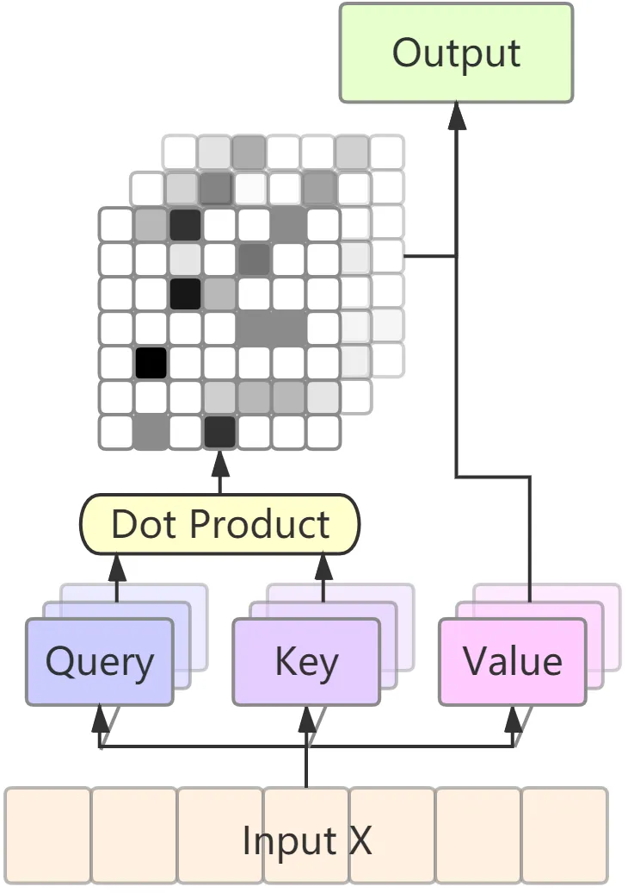
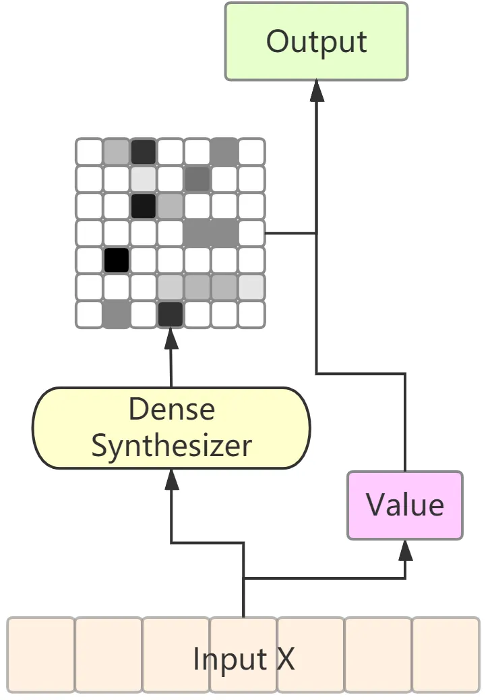
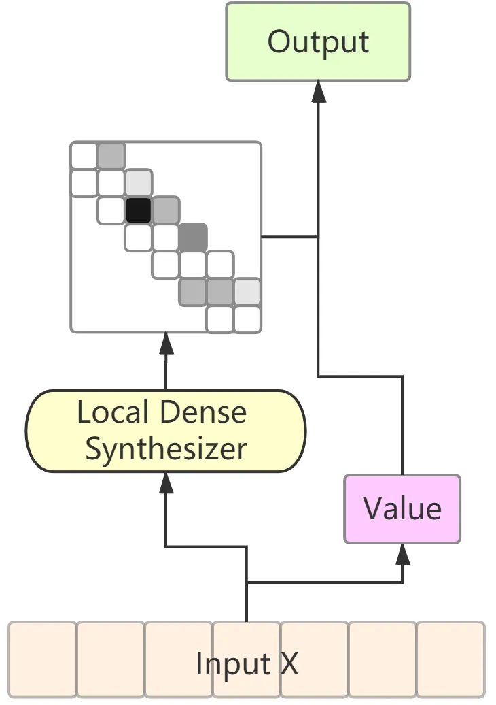
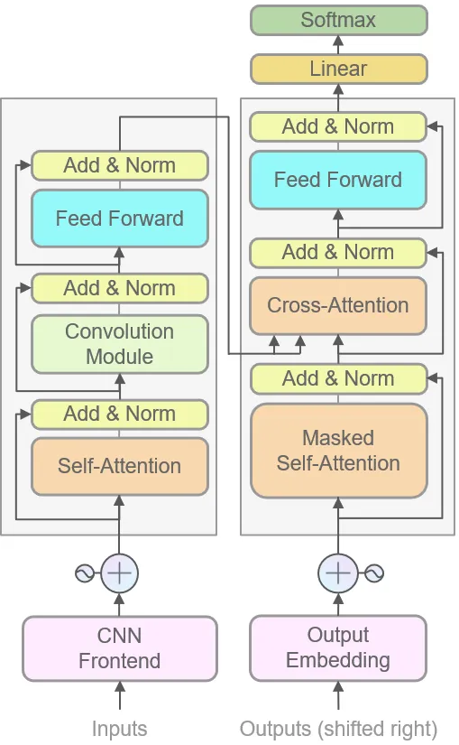
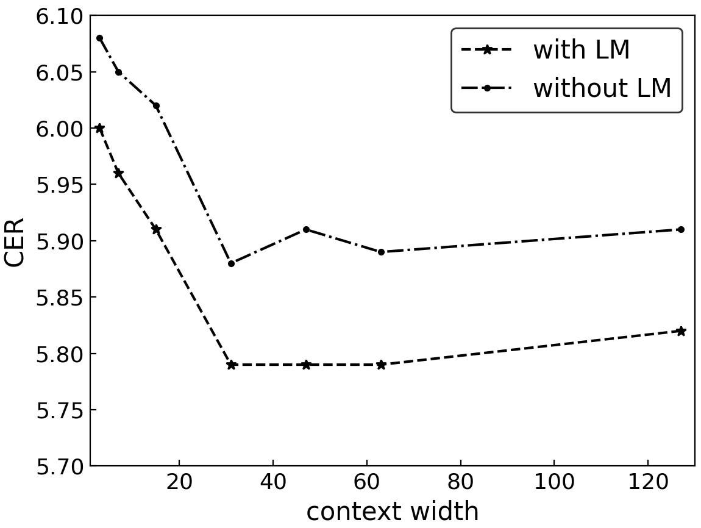

# Transformer-based End-to-End Speech Recognition with Local Dense Synthesizer Attention

Menglong Xu     Shengqiang Li     Xiao-Lei Zhang

###### Abstract

Recently, several studies reported that dot-product self-attention (SA)
may not be indispensable to the state-of-the-art Transformer models.
Motivated by the fact that dense synthesizer attention (DSA), which
dispenses with dot products and pairwise interactions, achieved
competitive results in many language processing tasks, in this paper, we
first propose a DSA-based speech recognition, as an alternative to SA.
To reduce the computational complexity and improve the performance, we
further propose local DSA (LDSA) to restrict the attention scope of DSA
to a local range around the current central frame for speech
recognition. Finally, we combine LDSA with SA to extract the local and
global information simultaneously. Experimental results on the Ai-shell1
Mandarin speech recognition corpus show that the proposed
LDSA-Transformer achieves a character error rate (CER) of 6.49%, which
is slightly better than that of the SA-Transformer. Meanwhile, the
LDSA-Transformer requires less computation than the SA-Transformer. The
proposed combination method not only achieves a CER of 6.18%, which
significantly outperforms the SA-Transformer, but also has roughly the
same number of parameters and computational complexity as the latter.
The implementation of the multi-head LDSA is available at
https://github.com/mlxu995/multihead-LDSA

###### Index Terms: 

End-to-end, speech recognition, Transformer, dense synthesizer attention

^(†)^(†)address: CIAIC, School of Marine Science and Technology,
Northwestern Polytechnical University, China^(†)^(†)email: {mlxu,
shengqiangli}@mail.nwpu.edu.cn, xiaolei.zhang@nwpu.edu.cn

## 1 Introduction



(a) Self-attention (with 3 heads)



(b) Dense synthesizer attention



(c) Local dense synthesizer attention

Figure 1: Architecture of different attention mechanisms.

In recent years, end-to-end (E2E) automatic speech recognition (ASR)
\[1, 2, 3, 4, 5, 6\] has been widely studied in the ASR community due to
its simplified model structure as well as its simple training and
inference pipelines. Among various E2E models, Transformer-based ASR
\[7, 8, 9, 10, 11\] has received more and more attention for its high
accuracy and efficient training procedure. The core component of the
state-of-the-art Transformer-based models is a so-called self-attention
mechanism \[12\], which uses dot products to calculate attention
weights. Although the content-based dot-product self-attention is good
at capturing global interactions, it makes the computational complexity
of the self-attention (SA) layer be quadratic with respect to the length
of the input feature.

Therefore, there is a need to reduce the complexity of the SA layer.
Fortunately, several recent studies in natural language processing
simplified the expensive dot-product self-attention \[13, 14, 15, 16,
17\]. Specifically, In \[15\], SA was replaced with a so-called dynamic
convolution. It uses an additional linear layer to predict normalized
convolution weights dynamically at each convolution step. In \[16\],
Raganato et al. replaced all but one attention heads with simple fixed
(non-learnable) attention patterns in Transformer encoders. In \[17\],
Tay et al. proposed dense synthesizer attention (DSA), which uses two
feed-forward layers to predict the attention weights. Compared to SA,
DSA completely dispenses with dot products and explicit pairwise
interactions. It achieves competitive results with SA across a number of
language processing tasks.

However, it is not easy to replace SA by DSA in ASR. First, the length
of the attention weights predicted by DSA is fixed. If we apply DSA
directly to ASR, then the spectrogram of each utterance has to be padded
to the length of the longest utterance of the training corpus, which
unnecessarily consumes quite long time and large storage space.
Moreover, the length of the feature in an ASR task is much longer than
that in a language model. Predicting attention weights directly for such
a long spectrogram results in a significant increase of errors. In
addition, like SA, DSA still does not have the ability to extract
fine-grained local feature patterns.

In this paper, we propose local dense synthesizer attention (LDSA) to
address the aforementioned three problems simultaneously. In LDSA, the
current frame is restricted to interacting with its finite neighbouring
frames only. Therefore, the length of the attention weights predicted by
LDSA is no longer the length of the longest utterance. It is a fixed
length controlled by a tunable context width. LDSA not only reduces the
storage and computational complexity but also significantly improves the
performance.

To evaluate the effectiveness of the LDSA-Transformer, we implemented
the DSA-Transformer, LDSA-Transformer, and the combination of the LDSA
and SA for ASR, where we denote the combined model as hybrid-attention
(HA) Transformer. Experimental results on the Ai-shell1 Mandarin dataset
show that the LDSA-Transformer achieves slightly better performance with
less computation than the SA-Transformer. In addition, HA-Transformer
achieves a relative character error rate (CER) reduction of 6.8% over
the SA-Transformer with roughly the same number of parameters and
computation as the latter.

The most related work of LDSA is \[18\], in which Fujita et al. applied
dynamic convolution \[15\] to E2E ASR. However, the method \[18\] is
fully convolution-based. It does not adopt the SA structure. On the
contrary, our model adopts the SA structure instead of the convolution
structure. In addition, we combine the proposed LDSA with SA by
replacing the convolution module in the convolution-augmented
Transformer with LDSA, so as to further model the local and global
dependencies of an audio sequence simultaneously.

## 2 algorithm description

In this section, we first briefly introduce the classic dot-product
self-attention and its variant—DSA, and then elaborate the proposed
LDSA.

### 2.1 Dot-product self-attention

The SA in transformer usually has multiple attention heads. As
illustrated in Fig. 1(a), suppose the multi-head SA has $`h`$ heads. It
calculates the scaled dot-product attention $`h`$ times and then
concatenates their outputs. A linear projection layer is built upon the
scaled dot-product attention, which produces the final output from the
concatenated outputs. Let $`\mathbf{X}\in\mathbb{R}^{T\times d}`$ be an
input sequence, where $`T`$ is the length of the sequence and $`d`$ is
the hidden size of the SA layer. Each scaled dot-product attention head
is formulated as:

```math
\text{Attention}(\mathbf{Q}_{i},\mathbf{K}_{i},\mathbf{V}_{i})=\text{Softmax}\left(\frac{\mathbf{Q}_{i}\mathbf{K}_{i}^{\mathrm{T}}}{\sqrt{d_{\mathrm{k}}}}\right)\mathbf{V}_{i}\\
 \tag{1}
```

with

```math
\mathbf{Q}_{i}=\mathbf{XW}^{\mathrm{Q}_{i}},\ \mathbf{K}_{i}=\mathbf{XW}^{\mathrm{K}_{i}},\ \mathbf{V}_{i}=\mathbf{XW}^{\mathrm{V}_{i}} \tag{2}
```

where
$`\mathbf{W}^{\mathrm{Q}_{i}},\mathbf{W}^{\mathrm{K}_{i}},\mathbf{W}^{\mathrm{V}_{i}}\in\mathbb{R}^{d\times d_{\mathrm{k}}}`$
denote learnable projection parameter matrices for the $`i`$-th head,
$`d_{\mathrm{k}}=d/h`$ is the dimension of the feature vector for each
head. The multi-head SA is formulated as:

```math
\begin{split}\text{MultiHead}(\mathbf{Q},\mathbf{K},\mathbf{V})=\text{Concat}\left(\mathbf{U}_{1},\cdots,\mathbf{U}_{h}\right)\mathbf{W}^{\mathrm{O}}\\
\end{split} \tag{3}
```

where

```math
\begin{split}\ \mathbf{U}_{i}=\text{Attention}\left(\mathbf{X}\mathbf{W}^{\mathrm{Q}_{i}},\mathbf{X}\mathbf{W}^{\mathrm{K}_{i}},\mathbf{X}\mathbf{W}^{\mathrm{V_{i}}}\right)\\
\end{split} \tag{4}
```

and $`\mathbf{W}^{\mathrm{O}}\in\mathbb{R}^{d\times d}`$ is the weight
matrix of the linear projection layer.

### 2.2 Dense synthesizer attention

As illustrated in Fig. 1(b), the main difference between DSA and SA is
the calculation method of the attention weights. Dense synthesizer
attention removes the notion of query-key-values in the SA module and
directly synthesizes the attention weights. In practice, DSA adopts two
feed-forward layers with ReLU activation to predict the attention
weights, which is formulated as:

```math
\mathbf{B}=\text{Softmax}(\sigma_{\mathrm{R}}(\mathbf{X}\mathbf{W}_{1})\mathbf{W}_{2}) \tag{5}
```

where $`\sigma_{\mathrm{R}}`$ is the ReLU activation function, and
$`\mathbf{W}_{1}\in\mathbb{R}^{d\times d}`$ and
$`\mathbf{W}_{2}\in\mathbb{R}^{d\times T}`$ are learnable weights. The
output of DSA is calculated by:

```math
\text{DSA}(\mathbf{X})=\mathbf{B}(\mathbf{X}\mathbf{W}_{3})\mathbf{W}^{\mathrm{O}} \tag{6}
```

with $`\mathbf{W}_{3}\in\mathbb{R}^{d\times d}`$.

### 2.3 Proposed local dense synthesizer attention

Motivated by convolutional neural networks, we propose LDSA to address
the weaknesses of DSA. LDSA restricts the current frame to interact with
its neighbouring frames only. As illustrated in Fig. 1(c), it defines a
hyper-parameter $`c`$, termed as context width, to control the length of
the predicted attention weights, and then assign the synthesized
attention weights to the current frame and its neighboring frames, where
$`c=3`$ in Fig. 1(c). Attention weights for the other frames outside the
context width will be set to 0. The calculation method of $`\mathbf{B}`$
in LDSA is the same as that in DSA. However, its time and storage
complexities are reduced significantly, due to the fact that
$`\mathbf{W}_{2}\in\mathbb{R}^{d\times c}`$ in LDSA. The output of LDSA
is calculated by:

```math
\displaystyle\mathbf{V}=\mathbf{X}\mathbf{W}_{3}\ \ \ \ \ \ \ \ \ \ \  \tag{7}
```

```math
\displaystyle\mathbf{Y}_{t}=\sum_{j=0}^{c-1}\mathbf{B}_{t,j}\mathbf{V}_{t+j-\lfloor\frac{c}{2}\rfloor} \tag{8}
```

```math
\displaystyle\text{LDSA}(\mathbf{X})=\mathbf{Y}\mathbf{W}^{\mathrm{O}}\ \ \  \tag{9}
```

Both DSA and LDSA can be easily extended to a multi-head form in a
similar way with the dot-product self-attention.

## 3 Model implementation

This section first describes the baseline model, and then presents the
proposed models.

### 3.1 Baseline model: SA-Transformer

The SA-Transformer is an improved Speech-transformer \[5\]. As shown in
Fig. 2, it consists of an encoder and a decoder. The encoder is composed
of a convolution frontend and a stack of $`N=12`$ identical encoder
sub-blocks, each of which contains a SA layer, a convolution layer¹¹ 1
Unlike Conformer \[19\], we only added the convolution layer without the
relative positional encoding. and a position-wise feed-forward layer.
For the convolution frontend, we stack two $`3\times 3`$ convolution
layers with stride 2 for both time dimension and frequency dimension to
conduct down-sampling on the input features. The decoder is composed of
an embedding layer and a stack of $`M=6`$ identical decoder sub-blocks.
In addition to the position-wise feed-forward layer, the decoder
sub-block contains two SA layers performing multi-head attention over
the embedded label sequence and the output of the encoder respectively.
The output dimension of the SA and feed-forward layers are both 320. The
number of the attention heads in each SA layer is 4. Note that we also
add residual connection and layer normalization after each layer in the
sub-blocks.



Figure 2: The model architecture of the SA-Transformer.

### 3.2 Proposed LDSA-Transformer

The LDSA-Transformer has the same decoder as the baseline model. It
replaces the self-attention mechanism in the encoder of the
SA-Transformer with LDSA. The number of heads of LDSA is set to 4. The
other layers in the encoder of the LDSA-Transformer are the same as the
baseline model. As for the DSA-Transformer, it just changes LDSA in the
LDSA-transformer to DSA.

### 3.3 Proposed HA-Transformer

The HA-Transformer is a combination of SA and the proposed LDSA.
Different from the additive operation as \[17\] did, we combine them in
a tandem manner since that LDSA is able to extract fine-grained local
patterns, which is similar to \[19\]. The difference between the HA- and
SA-Transformers is that the HA-Transformer uses LDSA to replace the
convolution layers in the baseline model, leaving the rest of the
SA-Transformer unchanged. For a fair comparison, we set $`c=15`$ in
HA-Transformer, which equals to the size of the convolution kernel in
SA-Transformer.

## 4 Experiments

### 4.1 Experimental setup

We evaluated the proposed models on a publicly-available Mandarin speech
corpus Aishell-1 \[20\], which contains about 170 hours of speech
recorded from 340 speakers. We used the official partitioning of the
dataset, with 150 hours for training, 20 hours for validation, and 10
hours for testing. For all experiments, we used 40-dimension Mel-filter
bank coefficients (Fbank) features as input. The frame length and shift
was set to 25 ms and 10 ms respectively. For the output, we adopted a
vocabulary set of 4230 Mandarin characters and 2 non-language symbols,
with the 2 symbols denoting unknown characters and the start or end of a
sentence respectively.

We used Open-Transformer²² 2
https://github.com/ZhengkunTian/OpenTransformer to build our models. For
the model training, we used Adam with Noam learning rate schedule (25000
warm steps) \[12\] as the optimizer. We also used SpecAugment \[21\] for
data augmentation. After 80 epochs training, the parameters of the last
10 epochs were averaged as the final model. During inference, we used a
beam search with a width of 5 for all models. For the language model, we
used the default setting of Open-Transformer, and integrated it into
beam search by shallow fusion \[22\]. The weight of the language model
was set to 0.1 for all experiments.

### 4.2 Results



Figure 3: Effect of the context width of LDSA on performance.

We first investigated the effect of the context width $`c`$ of LDSA in
the encoder on the development (Dev) set of Alshell-1, where we fixed
the size of the convolution kernel in all experiments. Figure 3 shows
the CER curve of the model with respect to $`c`$. From the figure, we
see that the CER first decreases, and then becomes stable with the
increase of $`c`$. Based on the above finding, we set $`c`$ to 31 in all
of the following comparisons.

Then, we compared the attention mechanisms mentioned in Section 2. Table
1 lists the CER and complexity of the attention mechanisms. From the
table, we see that the LDSA-Transformer significantly outperforms the
DSA-Transformer, and achieves a slightly lower CER than the
SA-Transformer, which demonstrates the effectiveness of the
LDSA-Transformer. We also see that the computational complexity of the
LDSA scales linearly with $`T`$, which is lower than the SA and DSA.
Finally, the HA-Transformer achieves the best performance among all
comparison methods. Particularly, it achieves a relative CER reduction
of 6.8% over the SA-Transformer, which demonstrates that the LDSA
performs better than the convolution operation in extracting local
features.

| Method |     | Complexity              |     | CER        |         |
| ------ | --- | ----------------------- | --- | ---------- | ------- |
|        |     |                         |     | without LM | with LM |
| SA     |     | $`\mathcal{O}(T^{2})`$  |     | 6.83       | 6.63    |
| DSA    |     | $`\mathcal{O}(T^{2})`$  |     | 7.52       | 7.26    |
| LDSA   |     | $`\mathcal{O}(Tc)`$     |     | 6.65       | 6.49    |
| HA     |     | $`\mathcal{O}(T(T+c))`$ |     | 6.38       | 6.18    |

Table 1: Comparison of models with different attention mechanisms on the
test set. ($`T`$ is the length of input feature, $`c`$ is the context
width.)

To further investigate the effectiveness of the proposed models, we
compared them with several representative ASR systems, which are the
TDNN-Chain \[23\], Transducer \[24\], and LAS \[25\] in Table 2. From
the table, we find that the Transformer-based models outperform the
three comparison systems \[23, 24, 25\]. Among the Transformer-based
models, LDSA-Transformer achieves slightly better performance than the
SA-Transformer. The HA-Transformer achieves a CER of 6.18%, which is
significantly better than the other models.

| Model                          |     | Dev  | Test  |
| ------------------------------ | --- | ---- | ----- |
| TDNN-Chain (Kaldi) \[23\]      |     | \-   | 7.45  |
| SA-T (Transducer) \[24\]       |     | 8.30 | 9.30  |
| LAS \[25\]                     |     | \-   | 10.56 |
| Speech-Transformer \[26\]      |     | 6.57 | 7.37  |
| SA-Transformer (our implement) |     | 5.83 | 6.63  |
| LDSA-Transformer               |     | 5.79 | 6.49  |
| HA-Transformer                 |     | 5.66 | 6.18  |

Table 2: CER comparison with the representative ASR systems. (with LM)

## 5 Conclusions

In this paper, we first replaced the common SA in speech recognition by
DSA. Then, we proposed LDSA to restrict the attention scope of DSA to a
local range around the current central frame. Finally, we combined LDSA
with SA to extract the local and global information simultaneously.
Experimental results on Aishell-1 demonstrate that the LDSA-Transformer
achieves slightly better performance with lower computational complexity
than the SA-Transformer; the HA-Transformer further improves the
performance of the LDSA-Transformer; and all proposed methods are
significantly better than the three representative ASR systems.

## References

- \[1\] Dario Amodei, Sundaram Ananthanarayanan, Rishita Anubhai,
  Jingliang Bai, Eric Battenberg, Carl Case, Jared Casper, Bryan
  Catanzaro, Qiang Cheng, Guoliang Chen, et al., “Deep speech 2:
  End-to-end speech recognition in english and mandarin,” in
  International conference on machine learning, 2016, pp. 173–182.
- \[2\] William Chan, Navdeep Jaitly, Quoc Le, and Oriol Vinyals,
  “Listen, attend and spell: A neural network for large vocabulary
  conversational speech recognition,” in 2016 IEEE International
  Conference on Acoustics, Speech and Signal Processing (ICASSP). IEEE,
  2016, pp. 4960–4964.
- \[3\] Eric Battenberg, Jitong Chen, Rewon Child, Adam Coates, Yashesh
  Gaur Yi Li, Hairong Liu, Sanjeev Satheesh, Anuroop Sriram, and Zhenyao
  Zhu, “Exploring neural transducers for end-to-end speech recognition,”
  in 2017 IEEE Automatic Speech Recognition and Understanding Workshop
  (ASRU). IEEE, 2017, pp. 206–213.
- \[4\] Shinji Watanabe, Takaaki Hori, Suyoun Kim, John R Hershey, and
  Tomoki Hayashi, “Hybrid ctc/attention architecture for end-to-end
  speech recognition,” IEEE Journal of Selected Topics in Signal
  Processing, vol. 11, no. 8, pp. 1240–1253, 2017.
- \[5\] L. Dong, S. Xu, and B. Xu, “Speech-transformer: A no-recurrence
  sequence-to-sequence model for speech recognition,” in 2018 IEEE
  International Conference on Acoustics, Speech and Signal Processing
  (ICASSP), 2018, pp. 5884–5888.
- \[6\] Shiyu Zhou, Linhao Dong, Shuang Xu, and Bo Xu, “Syllable-based
  sequence-to-sequence speech recognition with the transformer in
  mandarin chinese,” Proc. Interspeech 2018, pp. 791–795, 2018.
- \[7\] Shigeki Karita, Nanxin Chen, Tomoki Hayashi, Takaaki Hori,
  Hirofumi Inaguma, Ziyan Jiang, Masao Someki, Nelson Enrique Yalta
  Soplin, Ryuichi Yamamoto, Xiaofei Wang, et al., “A comparative study
  on transformer vs rnn in speech applications,” in 2019 IEEE Automatic
  Speech Recognition and Understanding Workshop (ASRU). IEEE, 2019, pp.
  449–456.
- \[8\] Ching-Feng Yeh, Jay Mahadeokar, Kaustubh Kalgaonkar, Yongqiang
  Wang, Duc Le, Mahaveer Jain, Kjell Schubert, Christian Fuegen, and
  Michael L Seltzer, “Transformer-transducer: End-to-end speech
  recognition with self-attention,” arXiv preprint
  arXiv:1910.12977, 2019.
- \[9\] Niko Moritz, Takaaki Hori, and Jonathan Le, “Streaming automatic
  speech recognition with the transformer model,” in ICASSP 2020-2020
  IEEE International Conference on Acoustics, Speech and Signal
  Processing (ICASSP). IEEE, 2020, pp. 6074–6078.
- \[10\] Yongqiang Wang, Abdelrahman Mohamed, Due Le, Chunxi Liu, Alex
  Xiao, Jay Mahadeokar, Hongzhao Huang, Andros Tjandra, Xiaohui Zhang,
  Frank Zhang, et al., “Transformer-based acoustic modeling for hybrid
  speech recognition,” in ICASSP 2020-2020 IEEE International Conference
  on Acoustics, Speech and Signal Processing (ICASSP). IEEE, 2020, pp.
  6874–6878.
- \[11\] Qian Zhang, Han Lu, Hasim Sak, Anshuman Tripathi, Erik
  McDermott, Stephen Koo, and Shankar Kumar, “Transformer transducer: A
  streamable speech recognition model with transformer encoders and
  rnn-t loss,” in ICASSP 2020-2020 IEEE International Conference on
  Acoustics, Speech and Signal Processing (ICASSP). IEEE, 2020, pp.
  7829–7833.
- \[12\] Ashish Vaswani, Noam Shazeer, Niki Parmar, Jakob Uszkoreit,
  Llion Jones, Aidan N Gomez, Lukasz Kaiser, and Illia Polosukhin,
  “Attention is all you need,” in Advances in neural information
  processing systems, 2017, pp. 5998–6008.
- \[13\] Chiu Chung-Cheng and Raffel Colin, “Monotonic chunkwise
  attention,” in International Conference on Learning
  Representations, 2018.
- \[14\] Zhanghao Wu, Zhijian Liu, Ji Lin, Yujun Lin, and Song Han,
  “Lite transformer with long-short range attention,” in International
  Conference on Learning Representations, 2019.
- \[15\] Felix Wu, Angela Fan, Alexei Baevski, Yann Dauphin, and Michael
  Auli, “Pay less attention with lightweight and dynamic convolutions,”
  in International Conference on Learning Representations, 2018.
- \[16\] Alessandro Raganato, Yves Scherrer, and Jörg Tiedemann, “Fixed
  encoder self-attention patterns in transformer-based machine
  translation,” arXiv preprint arXiv:2002.10260, 2020.
- \[17\] Yi Tay, Dara Bahri, Donald Metzler, Da-Cheng Juan, Zhe Zhao,
  and Che Zheng, “Synthesizer: Rethinking self-attention in transformer
  models,” arXiv preprint arXiv:2005.00743, 2020.
- \[18\] Yuya Fujita, Aswin Shanmugam Subramanian, Motoi Omachi, and
  Shinji Watanabe, “Attention-based asr with lightweight and dynamic
  convolutions,” in ICASSP 2020-2020 IEEE International Conference on
  Acoustics, Speech and Signal Processing (ICASSP). IEEE, 2020, pp.
  7034–7038.
- \[19\] Anmol Gulati, James Qin, Chung-Cheng Chiu, Niki Parmar,
  Yu Zhang, Jiahui Yu, Wei Han, Shibo Wang, Zhengdong Zhang, Yonghui Wu,
  et al., “Conformer: Convolution-augmented transformer for speech
  recognition,” arXiv preprint arXiv:2005.08100, 2020.
- \[20\] Hui Bu, Jiayu Du, Xingyu Na, Bengu Wu, and Hao Zheng,
  “Aishell-1: An open-source mandarin speech corpus and a speech
  recognition baseline,” in 2017 20th Conference of the Oriental Chapter
  of the International Coordinating Committee on Speech Databases and
  Speech I/O Systems and Assessment (O-COCOSDA). IEEE, 2017, pp. 1–5.
- \[21\] Daniel S Park, William Chan, Yu Zhang, Chung-Cheng Chiu, Barret
  Zoph, Ekin D Cubuk, and Quoc V Le, “Specaugment: A simple data
  augmentation method for automatic speech recognition,” Proc.
  Interspeech 2019, pp. 2613–2617, 2019.
- \[22\] Anjuli Kannan, Yonghui Wu, Patrick Nguyen, Tara N Sainath,
  Zhijeng Chen, and Rohit Prabhavalkar, “An analysis of incorporating an
  external language model into a sequence-to-sequence model,” in 2018
  IEEE International Conference on Acoustics, Speech and Signal
  Processing (ICASSP). IEEE, 2018, pp. 1–5828.
- \[23\] Daniel Povey, Vijayaditya Peddinti, Daniel Galvez, Pegah
  Ghahremani, Vimal Manohar, Xingyu Na, Yiming Wang, and Sanjeev
  Khudanpur, “Purely sequence-trained neural networks for asr based on
  lattice-free mmi.,” in Interspeech, 2016, pp. 2751–2755.
- \[24\] Zhengkun Tian, Jiangyan Yi, Jianhua Tao, Ye Bai, and Zhengqi
  Wen, “Self-attention transducers for end-to-end speech recognition,”
  Proc. Interspeech 2019, pp. 4395–4399, 2019.
- \[25\] Changhao Shan, Chao Weng, Guangsen Wang, Dan Su, Min Luo, Dong
  Yu, and Lei Xie, “Component fusion: Learning replaceable language
  model component for end-to-end speech recognition system,” in ICASSP
  2019-2019 IEEE International Conference on Acoustics, Speech and
  Signal Processing (ICASSP). IEEE, 2019, pp. 5361–5635.
- \[26\] Zhengkun Tian, Jiangyan Yi, Jianhua Tao, Ye Bai, Shuai Zhang,
  and Zhengqi Wen, “Spike-triggered non-autoregressive transformer for
  end-to-end speech recognition,” arXiv preprint arXiv:2005.07903, 2020.
