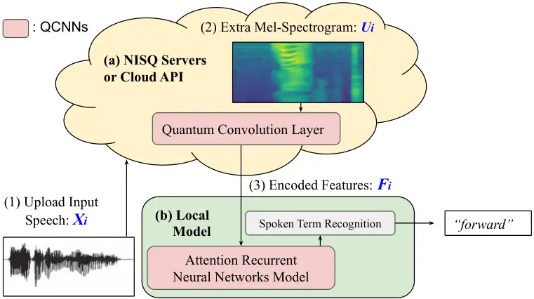
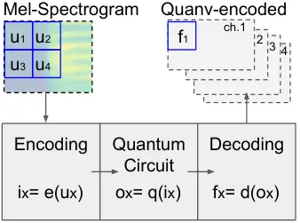

# Decentralizing Feature Extraction with Quantum Convolutional Neural Network for Automatic Speech Recognition

Chao-Han Huck Yang¹  Jun Qi¹  Samuel Yen-Chi Chen²  Pin-Yu Chen³ Sabato
Marco Siniscalchi^(1,4,5)  Xiaoli Ma¹  Chin-Hui Lee¹

###### Abstract

We propose a novel decentralized feature extraction approach in
federated learning to address privacy-preservation issues for speech
recognition. It is built upon a quantum convolutional neural network
(QCNN) composed of a quantum circuit encoder for feature extraction, and
a recurrent neural network (RNN) based end-to-end acoustic model (AM).
To enhance model parameter protection in a decentralized architecture,
an input speech is first up-streamed to a quantum computing server to
extract Mel-spectrogram, and the corresponding convolutional features
are encoded using a quantum circuit algorithm with random parameters.
The encoded features are then down-streamed to the local RNN model for
the final recognition. The proposed decentralized framework takes
advantage of the quantum learning progress to secure models and to avoid
privacy leakage attacks. Testing on the Google Speech Commands Dataset,
the proposed QCNN encoder attains a competitive accuracy of 95.12% in a
decentralized model, which is better than the previous architectures
using centralized RNN models with convolutional features. We conduct an
in-depth study of different quantum circuit encoder architectures to
provide insights into designing QCNN-based feature extractors. Neural
saliency analyses demonstrate a high correlation between the proposed
QCNN features, class activation maps, and the input Mel-spectrogram. We
provide an implementation¹¹ 1
[https://github.com/huckiyang/QuantumSpeech-QCNN](https://github.com/huckiyang/QuantumSpeech-QCNN)
for future studies.

###### Index Terms:

Acoustic Modeling, Quantum Machine Learning, Automatic Speech
Recognition, and Federated Learning.

^(†)^(†)address: ¹School of Electrical and Computer Engineering, Georgia
Institute of Technology, USA  
²Brookhaven National Laboratory, NY, USA and ³IBM Research, Yorktown
Heights, NY, USA  
⁴Faculty of Computer and Telecommunication Engineering, University of
Enna, Italy  
⁵Department of Electronic Systems, NTNU, Trondheim, Norway

## 1 Introduction

With the increasing concern about acoustic data privacy issues
\[leroy2019federated\], it is essential to design new automatic speech
recognition (ASR) architectures satisfying the requirements of new
privacy-preservation regulations, e.g., GDPR \[voigt2017eu\]. Vertical
federated learning (VFL) \[yang2019federated\] is one potential strategy
for data protection by decentralizing an end-to-end deep learning
\[deng2013new\] framework and separating feature extraction from the ASR
inference engine. With recent advances in commercial quantum technology
\[mohseni2017commercialize\], quantum machine learning (QML)
\[mitarai2018quantum\] becomes an ideal building block for VFL owing to
its advantages on parameter encryption and isolation. To do so, the
input to QML often represented by classical bits, needs to be first
encoded into quantum states based on _qubits_. Next, approximation
algorithms (e.g., quantum branching programs \[bergholm2018pennylane\])
are applied to quantum devices based on a quantum circuit
\[havlivcek2019supervised\] with noise tolerance. To implement our
proposed approach, we utilize a state-of-the-art noisy
intermediate-scale quantum (NISQ) \[farhi2000quantum\] platform (5 to 50
qubits) for academic and commercial applications
\[preskill2018quantum\]. It can be set up on accessible quantum servers
from cloud-based computing providers \[mohseni2017commercialize\].



Figure 1: Proposed quantum machine learning for acoustic modeling
(QML-AM) architecture in a vertical federated learning progress
including (a) a quantum convolution layer on Noisy Intermediate-Scale
Quantum (NISQ) servers or cloud API; and (b) a local model (e.g.,
second-pass model \[chen2019federated, yang2020multi\]) for speech
recognition tasks.

As shown in Fig. 1, we propose a decentralized acoustic modeling (AM)
scheme to design a quantum convolutional neural network (QCNN)
\[henderson2020quanvolutional\] by combining a variational quantum
circuit (VQC) learning paradigm \[mitarai2018quantum\] and a deep neural
network \[hochreiter1997long\] (DNN). VQC refers to a quantum algorithm
with a flexible designing accessibility, which is resistant to noise
\[mitarai2018quantum, havlivcek2019supervised\] and adapted to NISQ
hardware with light or no requirements for quantum error correction.
Based on the advantages of VQC under VFL, a quantum-enhanced data
processing scheme can be realized with fewer entangled encoded qubits
\[biamonte2017quantum, bergholm2018pennylane\] to assure model
parameters protection and lower computational complexity. As shown in
Table 1, to the best of the authors’ knowledge, this is the first work
to combine quantum circuits and DNNs and build a new QCNN
\[henderson2020quanvolutional\] for ASR. To provide secure data pipeline
and reliable quantum computing, we introduce the VFL architecture for
decentralized ASR tasks, where remote NISQ cloud servers are used to
generate quantum-based features, and ASR decoding is performed with a
local model \[yang2020multi\]. We refer to our decentralized
quantum-based ASR system to as QCNN-ASR. Evaluated on the Google Speech
Commands dataset with machine noises incurred from quantum computers,
the proposed QCNN-ASR framework attains a competitive 95.12% accuracy on
word recognition.

Approach Input Learning Model Output Properties Classical bits DNN and
more. bits Easy implementation Quantum qubits VQC and more. qubits QA
but limited resources hybrid CQ bits VQC + DNN bits Accessible QA over
VFL

Table 1: An overview of machine learning approaches and related key
properties. CQ stands for a hybrid classical-quantum (CQ)
\[biamonte2017quantum\] model using in this paper. QA stands for quantum
advantages \[havlivcek2019supervised\], which are related to
computational memory and parameter protection. VQC indicates the
variational quantum circuit. VFL means vertical federated leaning
\[yang2019federated\]. DNN stands for deep neural network
\[deng2013new\]

## 2 Related Work

### 2.1 Quantum Machine Learning for Signal Processing

QML \[mitarai2018quantum\] has been shown advantages in terms of lower
memory storage, secured model parameters encryption, and good feature
representation capabilities \[havlivcek2019supervised\]. There are
several variants (e.g., adiabatic quantum computation
\[farhi2000quantum\], and quantum circuit learning \[yao1993quantum\]).
In this work, we use the hybrid classical-quantum algorithm
\[henderson2020quanvolutional\], where the input signals are given in a
purely classical format (aka, numerical format, e.g., digital image),
and a quantum algorithm is employed in the feature learning phase.
Quantum circuit learning is regarded as the most accessible and
reproducible QML for signal processing \[biamonte2017quantum\], such as
supervised learning in the design of quantum support vector machine
\[havlivcek2019supervised\]. Indeed, it has been widely used, and it
consists only of quantum logic gates with a possibility of deferring an
error correction \[mitarai2018quantum, yao1993quantum\].

### 2.2 Deep Learning with Variational Quantum Circuit

In the NISQ era \[preskill2018quantum\], quantum computing devices are
not error-corrected, and they are therefore not fault-tolerant. Such a
constraint limits the potential applications on NISQ technology,
especially for large quantum circuit depth, and a large number of
qubits. However, Mitarai _et al._’s seminal work \[mitarai2018quantum\]
describes a framework to build machine learning models on NISQ. The key
idea is to employ VQC \[benedetti2019parameterized\], which are subject
to an iterative optimization processes, so that the effects of noise in
the NISQ devices can potentially be absorbed into these learned circuit
parameters. Recent litterature reports about several successful machine
learning applications based on VQC, for instance, deep reinforcement
learning \[chen2020variational\], and function approximation
\[mitarai2018quantum\]. VQCs are also used in constructing quantum
machine learning models capable of handling sequential patterns, such as
the dynamics of of certain physical systems \[chen2020quantum\]. It
should be noted that the input dimension of the input in
\[chen2020quantum\] is rather limited \[chen2020variational\] because of
stringent requirements of currently available quantum simulators, or
real quantum devices.

### 2.3 Quantum Learning and Decentralized Speech Processing

Although quantum technology is quite new, there have been some attempts
in exploiting it for speech processing. For example, Li _et al._
\[li2002quantum\] proposed a speech recognition system with quantum
back-propagation (QBP) simulated by fuzzy logic computing. However, QBP
is not using the qubit directly in a real-world quantum device, and the
approaches hardly demonstrates the quantum advantages inherent in this
computing scheme. Moreover, the QBP solution can be complicated to
large-scale ASR tasks with parameters protection.

From a system perspective, these accessible quantum advantages from VQL,
including encryption and randomized encoding, are prominent requirements
for federated learning systems, such as distributed ASR. Cloud
computing-based federated architectures \[yang2019federated\] have been
proven the most effective solutions for industrial applications,
demonstrating quantum advantages using commercial NISQ servers
\[mohseni2017commercialize\]. More recent works on federated keyword
spotting \[leroy2019federated\], distributed ASR \[qi2020submodular\],
improved lite audio-visual processing for local inference
\[chuang2020improved\], and federated n-gram language
\[chen2019federated\] marked the the importance of privacy-preserving
learning under the requirement of acoustic and language data protection.

## 3 Designing Quantum Convolutional Neural Networks for Speech Recognition

In this section, we present our framework showing how to design a
federated architecture based QCNN composed of quantum computing and deep
learning for speech recognition.

### 3.1 Speech Processing under Vertical Federated Learning

We consider a federated learning scenario for speech processing, where
the ASR system includes two blocks deployed between a local user, and a
cloud server or application interface (API), as shown in Fig. 1. An
input speech signal, $`x_{i}`$, is collected at the local user and
up-streamed to a cloud server where Mel spectrogram feature vectors are
extracted, $`\textbf{u}_{i}`$. Mel spectrogram features are the input of
a quantum circuit layer, $`\mathbf{Q}`$, that learns and encodes
patterns:

```math
f_{i}=\mathbf{Q}(\textbf{u}_{i},\mathbf{e},\mathbf{q},\mathbf{d}),\penalty\ \penalty\ \penalty\ \penalty\ \text{where}\penalty\ \penalty\ \penalty\ \textbf{u}_{i}=\text{Mel-Spectrogram}(\textbf{x}_{i}). \tag{1}
```

In Eq. (1), the computation process of a quantum neural layer,
$`\mathbf{Q}`$, depends on the encoding initialization $`\mathbf{e}`$,
the quantum circuit parameters, $`\mathbf{q}`$, and the decoding
measurement $`\mathbf{d}`$. The encoded features, $`f_{i}`$, will be
down-streamed back to the local user and used for training the ASR
system, more specifically the acoustic model (AM). Proposed
decentralized-VFL speech processing model reduces the risk of parameter
leakages \[duc2014unifying, leroy2019federated, chen2019federated\] from
attackers, and avoids privacy issues under GDPR, with its
architecture-wise advantages \[dwork2015reusable\] on encryption
\[yao1993quantum\] and without accessing the data directly
\[yang2019federated\].



(a) QCNN Computing Process.


