DSB  
delay-and-sum beamformer

MPDR  
minimum power distortionless response beamformer

MVDR  
minimum variance distortionless response beamformer

LCMP  
linearly constrained minimum power beamformer

LCMV  
linearly constrained minimum variance beamformer

MWF  
multichannel Wiener filter

SDW-MWF  
speech distortion weighted multichannel Wiener filter

MVDR  
minimum variance distortionless response

GEVD  
generalized eigenvalue decomposition

NMF-MWF  
non-negative matrix factorization

STFT  
short-time Fourier transform

TF  
time-frequency

VAD  
voice activity detector

DANSE  
distributed adaptive node-specific signal estimation

MSE  
mean squared error

WASN  
wireless acoustic sensor network

DOA  
direction of arrival

IRM  
ideal ratio mask

IBM  
ideal binary mask

DNN  
deep neural network

NN  
neural network

LSTM  
long short-term memory

CDNN  
convolutional neural network

GRU  
gated recurrent unit

CRNN  
convolutional recurrent neural network

RNN  
recurrent neural network

RIR  
room impulse response

SSN  
speech shaped noise

SNR  
signal to noise ratio

SAR  
source to artifacts ratio

SIR  
source to interferences ratio

SDR  
source to distortion ratio

# DNN-based mask estimation for distributed speech enhancement in spatially unconstrained microphone arrays

Nicolas Furnon    Romain Serizel    Irina Illina    Slim Essid
^(†)^(†)thanks: N. Furnon, R. Serizel and I. Illina are with the
Université de Lorraine, CNRS, Inria, Loria, F-54000 Nancy, France.
email: nicolas.furnon@loria.fr^(†)^(†)thanks: Slim Essid is with the
LTCI, Télécom Paris, Institut Polytechnique de Paris, Palaiseau, France.

###### Abstract

Deep neural network (DNN)-based speech enhancement algorithms in
microphone arrays have now proven to be efficient solutions to speech
understanding and speech recognition in noisy environments. However, in
the context of ad-hoc microphone arrays, many challenges remain and
raise the need for distributed processing. In this paper, we propose to
extend a previously introduced distributed DNN-based time-frequency mask
estimation scheme that can efficiently use spatial information in form
of so-called compressed signals which are pre-filtered target
estimations. We study the performance of this algorithm under realistic
acoustic conditions and investigate practical aspects of its optimal
application. We show that the nodes in the microphone array cooperate by
taking profit of their spatial coverage in the room. We also propose to
use the compressed signals not only to convey the target estimation but
also the noise estimation in order to exploit the acoustic diversity
recorded throughout the microphone array.

## I Introduction

Speech enhancement aims to recover the clean speech from a noisy signal.
It can be used in applications as diverse as automatic speech
recognition, hearing aids, and (hand-free) mobile communication.
Single-channel speech enhancement, relying on a single microphone
signal, can substantially increase the speech quality but the noise
reduction is often accompanied by an increase in the speech distortion.
Multichannel speech enhancement can overcome this limitation by
exploiting the spatial information provided by several microphones. One
can distinguish the data-independent multichannel filters \[1\] from the
data-dependent multichannel filters \[2, 3, 4, 5\], which depend on the
estimation of the statistics of the noisy signal, the noise signal or
the target signal. The mwf (mwf) is a data-dependent multichannel
filter, which is optimal in the mse (mse) sense. It can be extended to
the sdw (sdw) \[6\] which enables a trade-off between the noise
reduction and the speech distortion. Most of these multichannel filters
have been developed in constrained microphone arrays, where the number
and positions of microphones are fixed and where all the microphones
share a common clock. They are called centralized solutions, because a
so-called fusion center gathers all the signals of the microphone array.

With the multiplication of embedded microphones in wireless portable
devices that surround us, ad-hoc microphone arrays have gained interest
\[7\]. They can be considered as heterogeneous, unconstrained microphone
arrays, which are much more flexible and can cover a wider area than
traditional microphone arrays. However, the dependency of the
centralized approaches on a fusion center makes these solutions too
constrained and unrealistic. Many solutions have been proposed to
distribute the processing over the whole microphone array in order to
get rid of the fusion center, based on a reduction of the transmission
costs \[8, 9, 10\] or on distributed processing \[11, 12, 13, 14\].
Bertrand and Moonen introduced a distributed version of the mwf, where
each node, instead of sending all its signals to a fusion center, sends
only one signal, called compressed signal, to the other nodes, thus
reducing the bandwidth cost in addition to cancelling the need of a
fusion center \[15\].

All of these methods rely on the knowledge either of the (relative)
acoustic transfer functions, or of the target signals covariance
matrices, or both. Recently, dnn (dnn)-based solutions have enabled
great progress to accurately estimate these parameters, most of the time
by predicting tf (tf) masks from a single-channel input \[16, 17, 18\].
However, it is also possible to exploit the multichannel information to
better estimate these parameters. The spatial information can be
explicitly given to a dnn through handcrafted features \[19\], or
implicitly by feeding the dnn either with the multichannel stft (stft)
signals \[20, 21, 22\] or with the multichannel raw waveforms \[23\].

Although these dnn-based methods lead to promising results and manage to
exploit multichannel information, most of them are centralized
solutions. Very little work has been published on dnn-based speech
enhancement in ad-hoc microphone arrays. Ceolini and Liu \[24\]
introduced a dnn-based method that can process real-time speech
enhancement in an ad-hoc microphone array but their solution relies on a
centralized mvdr (mvdr) and the dnn is not able to exploit multichannel
information. In a previously published paper, we introduced a
distributed dnn-based mask estimation that could exploit the
multichannel data to better predict the masks \[25\]. Tested in a simple
scenario with two nodes, it outperformed a mwf applied to the nodes
separately.

This paper proposes an extended study of our previously introduced
speech enhancement scheme \[25\]. By analysing its performance under
various configurations, including real world ones, we confirm that it
matches danse (danse) performance with an oracle vad (vad). We also
evaluate in detail the performance at the different nodes in the
microphone array in order to highlight their cooperation. This study
shows that, depending on the characteristics of the signals captured by
the sending and the receiving nodes, sending the so-called compressed
signal could be optimized by deciding to send the estimation of either
the target or the noise.

Besides, we analyse the performance of the dnn used in this context. In
particular, we investigate the influence of the noise and the spatial
diversity between the training and test conditions, looking for a
trade-off between performance and robustness to varying scenarios. We
also investigate the influence of the quality (in terms of sir (sir)) of
the signals used to train the dnn.

This paper is organized as follows. In Section II, we describe the
problem and the multichannel speech enhancement solutions that this
paper relies on. In Section III we present our proposal and the
challenges that it raises. The experimental setup used to evaluate our
proposed solution is described in Section IV. In Sections V and VI, we
investigate the performance of the dnn which have single-channel and
multi-channel input. We show in Section VII that sending the noise
estimation can lead to improved performance. We conclude the paper in
Section VIII.

## II Problem formulation

### II-A Notations

We consider a fully-connected microphone array with $`K`$ nodes each
having $`M_{k}`$ microphones. $`M=\sum_{k=1}^{K}M_{k}`$ is the total
number of microphones. The signal recorded by the $`m`$-th microphone of
the $`k`$-th node is denoted as $`y_{k,m}`$. Under the assumption of an
additive noise model, in the stft domain, we have:

```math
y_{k,m}(f,t)~=~s_{k,m}(f,t)+n_{k,m}(f,t)\,,
```

where $`s_{k,m}`$ and $`n_{k,m}`$ denote the speech and noise signals
respectively and where $`f`$ and $`t`$ denote the frequency and time
frame indexes respectively. For the sake of conciseness, we will
thereafter omit the frame and frequency indexes unless necessary. The
signals from the different channels at node $`k`$ are stacked into the
vector:

```math
\mathbf{y}_{k}~=~[y_{k,1},...,y_{k,M_{k}}]^{T}.
```

All the signals of all nodes are stacked into the vector
$`\mathbf{y}~=~[\mathbf{y}_{1}^{T},...,\mathbf{y}_{K}^{T}]^{T}`$.
Similarly, the speech and noise signals are stacked into $`\mathbf{s}`$
and $`\mathbf{n}`$. In the following, regular lowercase letters denote
scalars; bold lowercase letters indicate vectors and bold uppercase
letters indicate matrices.

### II-B Multichannel Wiener filter

The centralized mwf aims at estimating the speech component $`s_{i}`$ of
the $`i`$-th sensor of the microphone array. The mwf is the optimal
filter in the mse sense, i.e. it minimises the mse between the desired
signal $`s_{i}`$ and the estimated signal:

```math
\mathbf{w}_{\mathrm{MWF}}=\mathrm{arg}\min_{\mathbf{w}}\mathbb{E}\{|s_{i}-\mathbf{w}^{H}\mathbf{y}|^{2}\}. \tag{1}
```

$`\mathbb{E}\{\cdot\}`$ is the expectation operator and $`\cdot^{H}`$
denotes the Hermitian transpose. Solving Eq. (1) yields:

```math
\mathbf{w}_{\mathrm{MWF}}=\mathbf{R}_{yy}^{-1}\mathbf{R}_{ys}\mathbf{e}_{i}\,, \tag{2}
```

where $`\mathbf{R}_{yy}`$ is the correlation matrix of the input signal,
$`\mathbf{R}_{ys}`$ is the cross-correlation matrix between the input
signal and its speech component and $`\mathbf{e}_{i}\in\mathbb{R}^{M}`$
is a vector of zeros with a $`1`$ at the $`i`$-th position. Without loss
of generality, we will take the channel $`i=1`$ as the reference channel
in the sequel. The correlation matrices can be obtained as follows:

```math
\displaystyle\mathbf{R}_{yy} \displaystyle= \displaystyle\mathbb{E}\{\mathbf{y}\mathbf{y}^{H}\} \tag{3}
```

```math
\displaystyle\mathbf{R}_{ys} \displaystyle= \displaystyle\mathbb{E}\{\mathbf{y}\mathbf{s}^{H}\}\,. \tag{4}
```

Under the assumption that speech and noise are uncorrelated and that the
noise is locally stationary, we have:

```math
\mathbf{R}_{ys}=\mathbf{R}_{ss}=\mathbb{E}\{\mathbf{s}\mathbf{s}^{H}\}=\mathbf{R}_{yy}-\mathbf{R}_{nn} \tag{5}
```

where $`\mathbf{R}_{nn}`$ is the noise correlation matrix:

```math
\mathbf{R}_{nn}=\mathbb{E}\{\mathbf{n}\mathbf{n}^{H}\}\,. \tag{6}
```

Computing these matrices requires the knowledge of noise-only periods
and speech-plus-noise periods. This is typically obtained with a vad
\[6, 15\] or a tf mask \[16, 24, 26\].

Under the assumption that a single speech source is present, Serizel et
al. proposed a rank-1 approximation of the covariance matrix
$`\mathbf{R}_{ss}`$ based on the gevd (gevd) of the matrix pencil
$`\{\mathbf{R}_{yy},\mathbf{R}_{nn}\}`$ \[27\]:

```math
\displaystyle\mathbf{R}_{nn} \displaystyle=\mathbf{Q}\boldsymbol{\Sigma}_{n}\mathbf{Q}^{H} \tag{7}
```

```math
\displaystyle\mathbf{R}_{yy} \displaystyle=\mathbf{Q}\boldsymbol{\Sigma}_{y}\mathbf{Q}^{H} \tag{8}
```

where $`\mathbf{Q}`$ is the matrix of the generalized eigenvectors.
$`\boldsymbol{\Sigma}_{y}~=~\text{diag}\{\sigma_{y_{1}}\dots\sigma_{y_{M}}\}`$
and
$`\boldsymbol{\Sigma}_{n}~=~\text{diag}\{\sigma_{n_{1}}\dots\sigma_{n_{M}}\}`$
are the diagonal matrices of the generalized eigenvalues. Plugging (7)
and (8) into (5) gives:

```math
\mathbf{R}_{ss}=\mathbf{Q}(\underbrace{\mathbf{\Sigma}_{y}-\mathbf{\Sigma}_{n}}_{\Sigma_{s}})\mathbf{Q}^{H}
```

where
$`\boldsymbol{\Sigma}_{s}~=~\text{diag}\{\sigma_{s_{1}}\dots\sigma_{s_{M}}\}`$.
$`\mathbf{R}_{ss}`$ can be approximated by a rank-1 decomposition:

```math
\mathbf{R}_{ss}\approx\underbrace{\mathbf{q}_{1}\mathbf{q}_{1}^{H}\sigma_{s_{1}}}_{\mathbf{R}_{s_{r1}}} \tag{9}
```

where $`\mathbf{q}_{1}`$ is the first column of $`\mathbf{Q}`$. We now
consider
$`\mathbf{t}_{1}~=~\mathbf{Q}^{-H}\mathbf{e}_{1}\mathbf{q}_{1}(1)^{*}`$,
the projector into the space spanned by $`\mathbf{q}_{1}`$ with
$`\mathbf{q}_{1}(1)`$ the first element of $`\mathbf{q}_{1}`$ and
$`\cdot^{*}`$ the complex conjugate operator. Replacing the desired
signal $`s_{1}=\mathbf{e}_{1}^{T}\mathbf{y}`$ in (1) by the implicit
reference $`\mathbf{t}_{1}^{H}\mathbf{y}`$, and using the sdw extension
of the mwf \[6\] leads to the new cost function:

```math
\displaystyle J_{\mathrm{GEVD}-\mathrm{SDW}-\mathrm{MWF}} \displaystyle=\mathbb{E}\left\{\left|\mathbf{w}^{H}\mathbf{s}-\mathbf{t}_{1}^{H}\mathbf{y}\right|^{2}\right\}
```

```math
\displaystyle+\mu\mathbb{E}\left\{\left|\mathbf{w}^{H}\mathbf{n}\right|^{2}\right\} \tag{10}
```

with $`\mu`$ a trade-off parameter between the noise reduction and the
speech distortion. The solution to (10) is given by:

```math
\mathbf{w}_{\mathrm{GEVD}-\mathrm{SDW}-\mathrm{MWF}}=\left(\mathbf{R}_{s_{r1}}+\mu\mathbf{R}_{nn}\right)^{-1}\mathbf{R}_{s_{r1}}\mathbf{e}_{1}\,. \tag{11}
```

The resulting filter proved to be more robust in low snr (snr) scenarios
with a stronger noise reduction \[27\].

### II-C Distributed multichannel Wiener filter

The danse algorithm is a distributed mwf which aims at estimating the
speech component $`s_{k,i}`$ of the $`i`$-th microphone of every node
$`k`$ \[15, 28\]. We still assume that a single speech source is
present. In the danse algorithm, no fusion center gathers all the
signals of all nodes. Instead, every node $`k`$ sends only one so-called
compressed signal $`z_{k}`$ to the other nodes and receives $`K-1`$
signals from the other nodes. A sdw is applied to the vector

```math
\displaystyle\tilde{\mathbf{y}}_{k}~=~\left[\mathbf{y}_{k}^{T},~\mathbf{z}_{-k}^{T}\right]^{T} \tag{12}
```

where $`\mathbf{z}_{-k}~=~[z_{1},...,z_{k-1},z_{k+1},...,z_{K}]^{T}`$

and outputs the estimated speech signal $`\hat{s}_{k}`$ as follows:

```math
\displaystyle\hat{s}_{k} \displaystyle=\mathbf{w}_{k}^{H}\tilde{\mathbf{y}}_{k} \tag{13}
```

```math
\displaystyle=\mathbf{w}_{kk}^{H}\mathbf{y}_{k}+\mathbf{g}_{-k}^{H}\mathbf{z}_{-k}\,, \tag{14}
```

where
$`\mathbf{w}_{k}=\left[\mathbf{w}_{kk}^{T},~\mathbf{g}_{-k}^{T}\right]^{T}`$
is the so-called global filter. $`\mathbf{w}_{kk}`$ and
$`\mathbf{g}_{-k}`$ are filters applied on the noisy signal
$`\mathbf{y}_{k}`$ and the stacked compressed signals
$`\mathbf{z}_{-k}`$ respectively. Similarly to Eq. (11), it can be
computed as

```math
\mathbf{w}_{k}=\big(\mathbf{R}_{s_{r1},k}+\mu\mathbf{R}_{nn,k}\big)^{-1}\mathbf{R}_{s_{r1},k}\mathbf{e}_{1}\,, \tag{15}
```

where $`\mathbf{R}_{s_{r1},k}`$ and $`\mathbf{R}_{nn,k}`$ are estimated
from $`\tilde{\mathbf{y}}_{k}`$. From Eq. (14), it can be seen that the
sub-filter $`\mathbf{w}_{kk}`$ is applied on the local signals
$`\mathbf{y}_{k}`$ only, which yields the compressed signal $`z_{k}`$ to
be sent to the other nodes:

```math
z_{k}=\mathbf{w}_{kk}^{H}\mathbf{y}_{k}\,. \tag{16}
```

### II-D Mask-based multichannel speech enhancement

Originally, the dnn-predicted tf masks were directly applied to the stft
of the noisy signal in order to extract the target speech \[29, 30\].
This idea continues to be used with a good performance both in the
single-channel \[31\] and the multichannel context \[32\], but it
requires much better tf masks and complex dnn architectures. It also
suffers from distortion that can be alleviated by using multichannel
filters. In microphone arrays, a common practice is to estimate a tf
mask that is not directly applied to the noisy signal, but used to
replace the vad necessary to compute the speech and noise statistics
\[3, 4, 5\] required by the multichannel filters like mvdr \[16, 24\] or
mwf \[26\]. Using these tf masks, the speech covariance matrix can be
estimated as:

```math
\mathbf{R}_{ss,k}=\mathbb{E}\{\mathbf{\tilde{s}}_{k}\mathbf{\tilde{s}}^{H}_{k}\} \tag{17}
```

with

```math
\mathbf{\tilde{s}}_{k}(t,f)=\mathbf{m}_{s,k}(t,f)\odot\mathbf{\tilde{y}}_{k}(t,f) \tag{18}
```

where $`\odot`$ is the Hadamard product and $`\mathbf{m}_{s,k}`$ are the
stacked tf masks corresponding to the speech components of
$`\mathbf{\tilde{y}}_{k}`$. To compute the noise covariance matrix, the
tf masks $`\mathbf{m}_{s,k}`$ should be replaced by their complement
$`\mathbf{m}_{n,k}=1-\mathbf{m}_{s,k}`$.

To estimate these tf masks, a common practice is to use a dnn which
estimates them from a single-channel noisy signal \[16, 26, 24\]. In a
previous work, we showed that we can improve the tf mask prediction, as
represented in Figure 1 \[25\]. In a two-node scenario, we introduced a
batch-version of danse where at each node, a crnn (crnn) predicted a tf
mask out of the reference channel of the node and the compressed signal
sent by the other node. To avoid issues related to convergence, we split
the iterative process of danse into two distinct steps. In a first step
(left box of Figure 1), each node processed only local signals to
estimate the compressed signal as
$`z_{k}=\mathbf{w}_{kk}^{H}\mathbf{y}_{k}`$ and sent it. In a second
step, detailed in Figure 2, each node used both local and compressed
signals to estimate the desired signal. As in the original version of
danse, the compressed signal is used to compute the speech and noise
covariance matrices, but we additionally use it to better predict the tf
mask with the multi-node dnn.

Fig. 1: Two-step version of the DANSE algorithm in a context with two
nodes. "SN DNN" and "MN DNN" respectively refer to single-node and
multi-node deep neural networks.

Fig. 2: Detail of the second filtering step. Bold arrows represent
multichannel signals, simple ones represent single-channel signals.

In the rest of the paper, we will refer as single-node dnn to the dnn
which predict a tf mask based on the signal of only one node (e.g. the
dnn of the first step in Figure 1), and as multi-node dnn to the dnn
which predict a tf mask based on signals coming from several nodes (e.g.
the dnn of the second step in Figure 1).

## III Analysis the DNN-based distributed multichannel Wiener filter

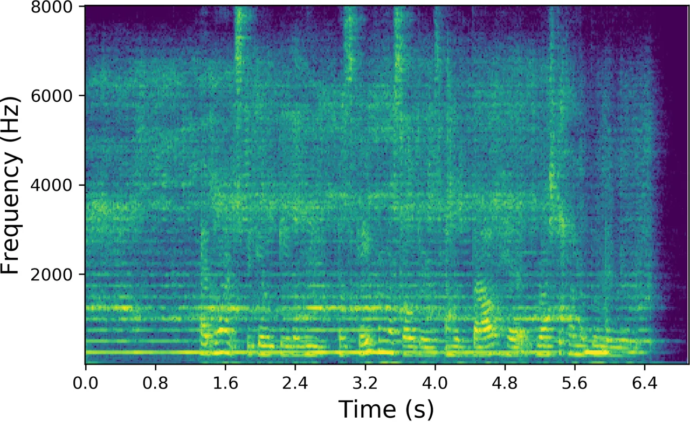

(a)

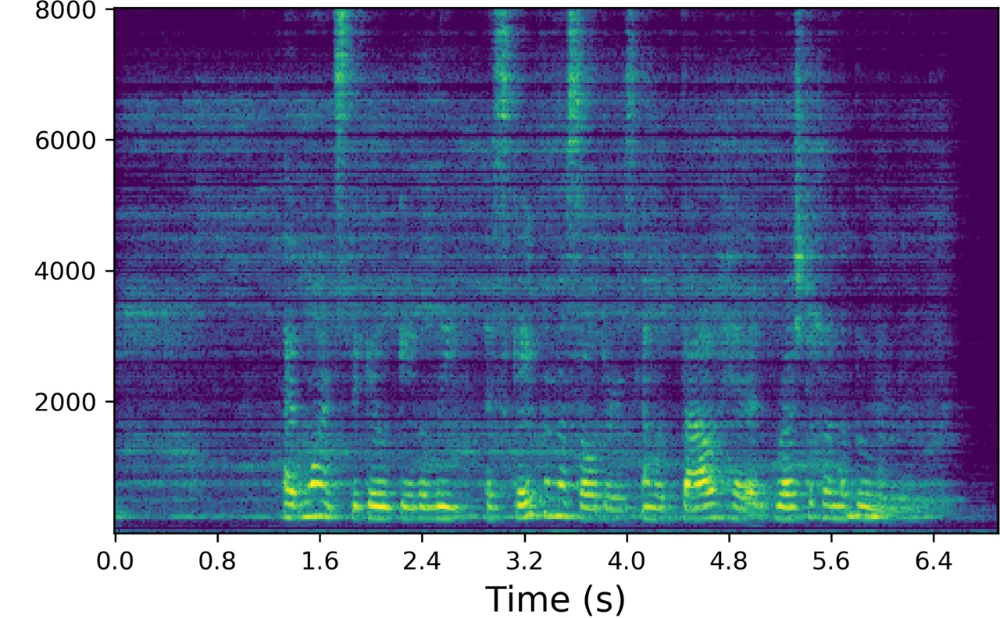

(b)

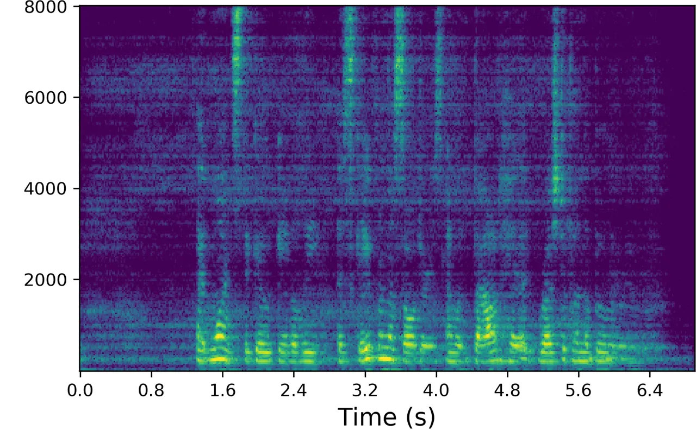

(c)

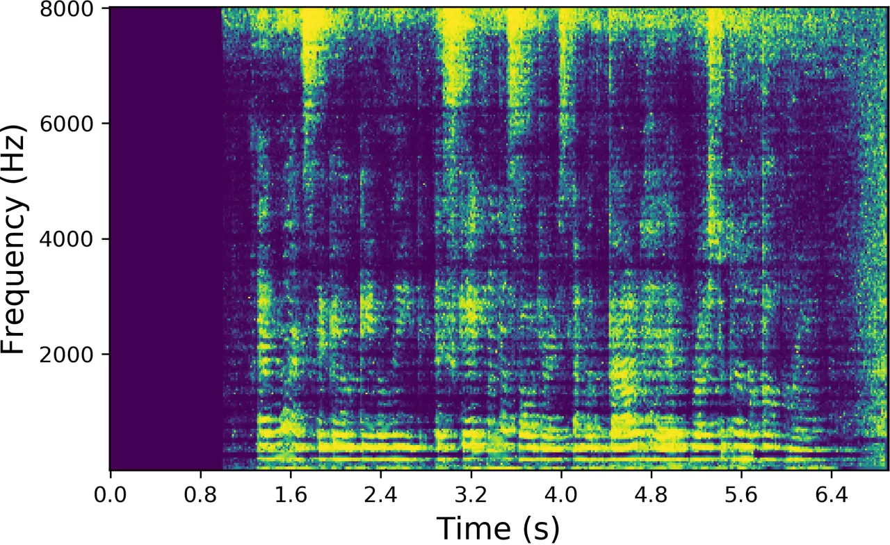

(d)

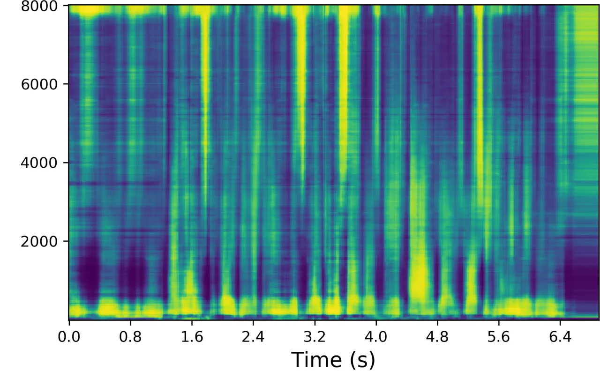

(e)

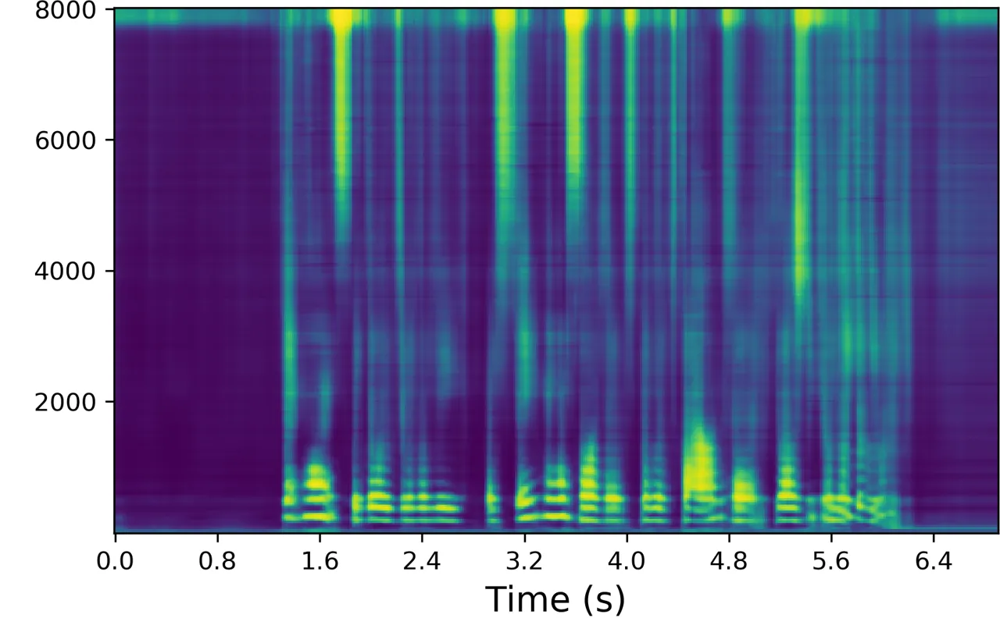

(f)

Fig. 3: tf representations of the signals at the first node of a
microphone array. Noisy input. Compressed signal sent from node 2.
Output enhanced signal. Ideal ratio tf mask corresponding to the input.
Mask predicted by the single-node dnn. Mask predicted by the multi-node
dnn.

The solution introduced in our previous work proved that using the
compressed signals could help to better estimate the tf masks, thus to
increase the speech enhancement performance. We represent in Figure 3
different spectrograms throughout the processing to highlight how useful
the compressed signals are in the estimation of the tf masks. As can be
seen in Figure 3, the tf mask predicted at the second step is less noisy
and more accurate than the tf mask estimated at the first step in
Figure 3, especially at lower frequencies where the different harmonics
can be clearly identified. This leads to the filtered signal represented
in Figure 3, where a higher noise reduction can be observed. In this
paper, we propose to extend this solution to more various scenarios, and
to cases where the signals sent can be either the estimation of the
target signal or that of the noise, depending on the needs at the
receiving node. We propose a detailed analysis of the aspects that have
an impact on the final speech enhancement performance. Based on this, we
improve the solution by optimizing the training of the dnn and by taking
full profit of the signals sent among nodes.

### III-A Single-node networks

In their original version of danse, Bertrand and Moonen assumed that all
the nodes of the network share the same vad. That is to say that, when
estimating the global filter, at a given time frame, the same binary
value was used to estimate the signal statistics for both the reference
signal and the compressed signals. This relies on the hypothesis that
the speech activity typical variation lasts less than a frame. In our
context, as can be seen in Figure 2, tf masks are used and the spectral
variation of the speech activity should also be considered (see Equation
(17)). Since the signals $`\mathbf{y}_{k}`$ of a same device are very
similar, the same tf mask is used for all the channels of
$`\mathbf{y}_{k}`$, but the tf masks of the potentially distant nodes
$`j\neq k`$ should be sent together with $`\mathbf{z}_{-k}`$ in order to
compute $`\mathbf{R}_{ss,k}`$ and $`\mathbf{R}_{nn,k}`$ accurately. This
is represented in Figure 4. It translates into a bandwidth overload and
we experiment whether we can spare some bandwidth costs by using the tf
mask corresponding to $`\mathbf{y}_{k}`$ instead of the tf mask
corresponding to each $`z_{j,\,j\neq k}`$.

In addition, we study the influence of the noise diversity in the
training data, in a similar manner as Kolbæk et al. \[33\], but where
the effects of ssn (ssn) and real-life noises are analysed separately,
so as to distinguish their respective contribution to the training
efficiency. ssn is easy to create and overlaps with speech in the stft
domain, representing a cheap but challenging interference, although it
is stationary and not representative of real-life noises. On the other
hand, real recordings of everyday-life noises are more realistic but
require much more time to gather. Our experiment aims at exploring
whether the diversity and representativeness brought by the real-life
noises can help improving the performance or if training on ssn alone
would be sufficient. Likewise, as our proposed solution is evaluated on
various spatial configurations, we explore the influence of the spatial
configuration it is trained on. We study whether a network should be
trained on a specific spatial configuration to achieve high performance
on it, or if a trade-off can be found between specificity and
generalizability across the spatial configurations at test time.

(a) Using the distant TF mask

(b) Using the local TF mask

Fig. 4: Representation of how using the local TF mask can spare some
bandwidth cost.

### III-B Multi-node networks

The results of our previous paper were obtained on a rather simple
dataset, where the spatial configurations were not so diverse and the
nodes close to each other. In this paper, as will be described in
Section IV-A, the microphones in the array can record very different
signals. An illustration of this phenomenon is given in Figure 5. The
second part of our work starts by verifying that our previous
conclusions generalize well on various scenarios. In addition, as the
spatial information brought by the compressed signals might be of
different interest depending on the receiving node, we propose to repeat
in the multi-node context the study relative to the generalizability
across spatial configurations. Besides, we investigate the impact of low
snr on the performance of single-node and multi-node dnn. Related to the
low snr issue, we consider the quality of the compressed signals needed
to train the multi-node network. Indeed, the multi-node dnn required at
the second filtering step is trained on the compressed signals obtained
at the first step on the training dataset. These compressed signals can
be obtained by using either the irm (irm) at the first filtering step of
the algorithm, as in the previous section, or the tf mask predicted by
the single-node dnn. Since the multi-node network is tested with the
compressed signals resulting from a predicted tf mask, it seemed natural
to use the predicted tf masks to train the multi-node dnn. However, the
single-node dnn are not perfect (see e.g. the mask of Figure 3) and the
resulting compressed signals might be too poor to build useful training
data. That is why we check which of two multi-node dnn performs best
when one is trained with compressed signals computed with irm (irm) and
one is trained with compressed signals computed with predicted tf masks.
In both cases, the performance is evaluated when the compressed signals
are obtained with the predicted tf mask.

### III-C Signals sent among nodes

In a third part, we analyse the importance of adequately selecting the
compressed signals sent to the other nodes. Indeed, each node can
estimate both the speech and noise components of a noisy signal. In a
speech enhancement context, the target signal is the speech signal, but
the noise signal may contain very useful information as well, since the
mwf also requires the estimation of the noise statistics. Both the
speech and noise signals are useful to estimate the speech and noise
covariance matrices, and it has also been shown that even a coarse
estimation of the noise can help to increase the output performance of a
dnn for speech enhancement in the context of automatic speech
recognition \[20\]. An example of this phenomenon is represented in
Figure 5 where two nodes see a very different view of the same acoustic
scene because of their locations in the room. We check which signal
(i.e. the estimation of the noise or the estimation of the target
speech) a given node should send to the other nodes depending on its
location in the room.

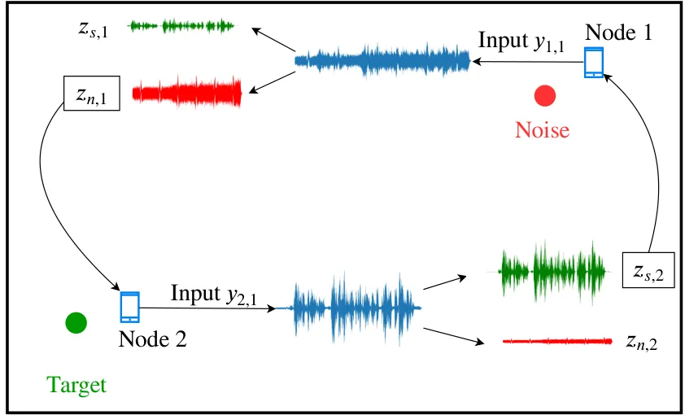

Fig. 5: Example of a situation highlighting the importance of the
information provided by the compressed signals. The first node, close to
the noise source, can accurately estimate the noise component and send
it to the second node. The second node, close to the target source, can
accurately estimate the target component and send it to the first node.

## IV Setup

### IV-A Datasets

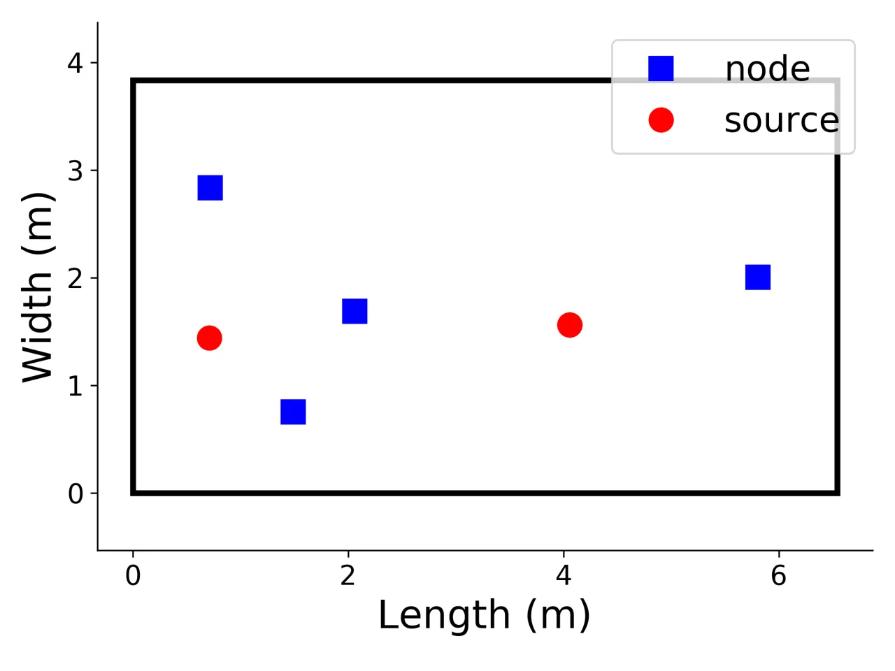

(a) Random room configuration

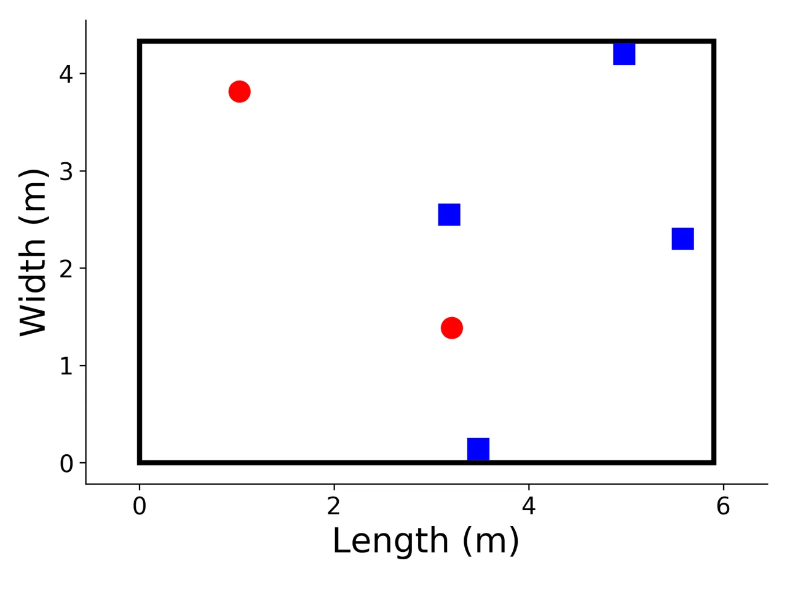

(b) Living room configuration

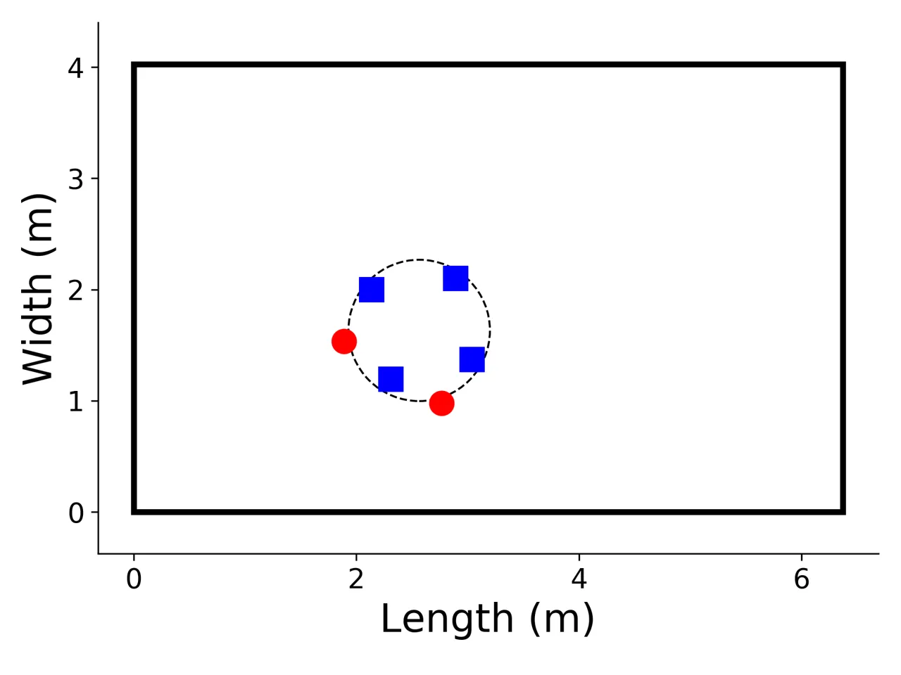

(c) Meeting room configuration

Fig. 6: 2D representations of the three spatial configurations. The
acoustic effect of the table (dashed-line circle in ) is not simulated;
it is only represented for a better visualization.

We create three spatial scenarios with the Python toolbox
Pyroomacoustics \[34\]. An example of each scenario can be seen in
Figure 6. Two of these datasets, called living room and meeting room,
aim at simulating the real-life scenarios that correspond to two typical
use cases of a living room and a meeting room. To see whether training
the dnn on one generic dataset could generalize well on the test sets of
the living room and meeting room, we create the random room
configuration, which is less constrained and covers the specific cases
of the living room and meeting room.

In each scenario, shoebox-like rooms are created with a reverberation
time randomly selected between 0.3 s and 0.6 s, the length between 3 m
and 8 m, the width between 3 m and 5 m and the height between 2.5 m and
3 m. $`K=4`$ recording devices (called nodes in the rest of the paper)
are simulated, each embedded with four microphones
($`M_{k}=4\quad\forall k\in\llbracket 1;K\rrbracket`$). The microphones
are at a distance of 5 cm to the node center. Two sources, one target
source and one noise source, are added. In each scenario, the speech
content is taken from the LibriSpeech clean subsets \[35\]. The noise
source can be either ssn or a real recording of everyday-life noises,
downloaded from Freesound \[36\]¹¹ 1 The noise dataset is available at
https://zenodo.org/record/4019030.. The noise source signals are
amplified by a random gain between -6 dB and 0 dB. After convolution,
most of the snr between lie in the range \[-10; +10\] dB depending on
the node position in the room.

The first scenario, called random room (see Figure 6), has very few
additional constraints. The two sources and the nodes are randomly
placed in the room with the only constraints that they all should be
distant of at least 50 cm from each other and from the walls. The nodes
are at a random height between 0.7 m and 2 m, as if they were recording
devices laid on a piece of furniture, or hearings aids worn by an
impaired person. The sources are between 1.20 m and 2 m high, to fit the
standard height of most noise sources.

The second scenario, called living room (see Figure 6) recreates a
situation that could typically happen in a living room with one target
speech source and one interference noise source. Three nodes are placed
within 50 cm from the walls as if they were on shelves and the fourth
device is placed randomly in the room, at 50 cm at least of the walls
and the other nodes. All the nodes are at a random height between 0.7 m
and 0.95 m. The two sources are also randomly placed in the room at
50 cm at least from the nodes and the walls and at a random height
between 1.20 m and 2 m.

The third scenario, called meeting room (see Figure 6) simulates a
meeting configuration where two people are sitting around a table. One
speaker is the target speaker while the second one is considered as an
interferent source. The table is circular, with its radius randomly
chosen between 0.5 m and 1 m, its height randomly chosen between 0.7 m
and 0.8 m and its center randomly placed in the room. The nodes are
placed every 90^(∘) on the table, at a random distance between 5 cm and
20 cm from the table edge. The two sources are randomly placed around
the table within 50 cm from the table edge, at a random height between
1.15 m and 1.3 m, and at 15 cm at least from the walls. The reflection
of the table is not simulated.

Each dataset is split into a training set containing 10000 samples of
10 s each, a validation set containing 1000 samples of 10 s and a test
set containing 1000 samples whose duration range from 6 s to 10 s. The
test dataset does not overlap with the training and validation sets in
terms of LibriSpeech speakers and Freesound users²² 2 A Python
implementation of the code that enabled us to create these datasets is
available at https://github.com/nfurnon/disco.

### IV-B Experimental settings

All the signals are sampled at 16000 Hz. The stft is computed using a
Hanning window of 32 ms with an overlap of 16 ms. The same crnn
architecture is used for all experiments. The convolutional part is made
of three convolutional layers with 32, 64 and 64 filters respectively,
with kernel size $`3\times 3`$ and stride $`1\times 1`$. Each
convolutional layer is followed by a batch normalisation and a
maximum-pooling layer of kernel size $`4\times 1`$ (no pooling over the
time axis). The recurrent layer is a 256-unit GRU, followed by a
fully-connected layer with a sigmoid activation function in order to map
the output of the network between 0 and 1. The network was trained with
the RMSprop optimizer \[37\]. The input of the model are stft windows of
21 frames and the ground truth targetted are the corresponding frames of
the irm.

### IV-C Performance evaluation

#### IV-C1 Metrics

In the following, all the performance measures are quantified based on
the sir and sar (sar), computed with the mir*eval³³ 3
https://github.com/craffel/mir_eval/ toolbox. These metrics require a
reference signal and it was shown that they are very sensitive to the
chosen reference \[38, 39\]. Both the source (non-reverberated) and
image (reverberated) signals are valid references and quantify
differently the performance. Considering the source signal as the
reference enables one to keep a constant reference for all sensors
despite the diversity of what they capture. However, is does not allow
us to distinguish the distortion due to reverberation from the
distortion due to the filter. On the other hand, considering the image
signals as references enables to quantify the effects of the proposed
filters only, but the implicit reference of the gevd filter at a
specific node might not be the explicit reference channel of the metric
(see Section V in \[27\]). To cope with this, we quantify the speech
enhancement performance with three metrics. The first metric is the
difference between the output sir and the input sir⁴⁴ 4 Since we do not
simulate any microphone noise, the input sir is equal to the input snr.
when the image signals are taken as references⁵⁵ 5 We noticed that the
sir was quite consistent across the reference signals, whether they were
the source signals or the image signals.. It is denoted by
$`\Delta SIR*{\text{cnv}}`$ where the subscript $`{}_{\text{cnv}}`$
means that the reference signals are the convolved signals. The second
metric is the sar where the clean (target and noise) signals captured by
a sensor of the node are considered as the references. We arbitrarily
take the first microphone of each node as the reference of this node.
This metric is denoted as $`SAR_{\text{cnv}}`$. The third metric is the
sar where the source signals are the references. It is denoted as
$`SAR*{\text{dry}}`$ where the subscript $`{}*{\text{dry}}`$ means that
the reference signals are the source signals. The difference between
$`SAR*{\text{dry}}`$ and $`SAR*{\text{cnv}}`$ could be interpreted as
the distortion due to the reverberation of the source signals. By
keeping both of these metrics, we can quantify both the problems of
denoising and that of dereverberation.

#### IV-C2 Signals considered for the evaluation

Depending on the context, we might be interested in having one
well-estimated target signal for the whole microphone array, or one
well-estimated target signal for each node of the microphone array. In
most cases, one signal would be enough for the whole array, but it might
require to send this signal to all the other nodes, resulting in a
possibly undesired bandwidth overload. The question of a node-specific
speech enhancement algorithm issue has also been discussed by
Markovich-Golan et al. \[40\]. In our case, we will mainly focus on
estimating the best possible signal for the whole array, this is why,
unless mentioned otherwise, the results presented in the remainder of
the paper represent the average over the whole test set of the
performance at the best output node, i.e. at the node with the highest
output sir. However, we will also analyse more in detail the behaviour
of the proposed solution at the node with the highest and lowest input
sir in Sections VI-C and VII, in order to highlight the cooperation
among nodes in the microphone array and the needs of the nodes
concerning the compressed signals that they receive. This will then be
mentioned explicitly.

## V Analysis of the performance with single-node networks

This section focuses on several factors that impact the performance of
the proposed algorithm using masks estimated with single-node dnn. As
described in Section II-D, the danse algorithm is split in two steps and
the compressed signals are sent between nodes to compute the filter of
the second step, but the same single-node network is used for both
steps.

### V-A Importance of node-specific tf masks

In this section, we investigate in oracle conditions which tf mask
should be applied on the compressed signal. To do so, we compare two
cases. In the first case, the tf mask of the node sending the signal
(called distant node) is applied to the compressed signal in order to
compute the speech and noise statistics at the second filtering step. In
the second step, the tf mask of the receiving node (called local node)
is used. The results are reported in Table I where the two cases are
respectively referred to as distant and local.

| (dB)    | $`\boldsymbol{\Delta SIR_{\text{cnv}}}`$ | $`\boldsymbol{SAR_{\text{cnv}}}`$ | $`\boldsymbol{SAR_{\text{dry}}}`$ |
| ------- | ---------------------------------------- | --------------------------------- | --------------------------------- |
| local   | 26.8 $`\pm`$ 0.4                         | 10.9 $`\mathbf{\pm}`$ 0.2         | 9.6 $`\mathbf{\pm}`$ 0.2          |
| distant | 26.1 $`\pm`$ 0.4                         | 8.3 $`\pm`$ 0.2                   | 9.0 $`\pm`$ 0.2                   |

TABLE I: Speech enhancement performance in oracle conditions in the
random room configuration when applying the distant or local oracle tf
mask on the compressed signal. The best significant results are in bold.

As can be seen in Table I, using the tf mask of the local node instead
of the distant node not only limits the bandwidth requirements, but also
increases the speech enhancement performance in terms of sar without
decreasing the sir. This might come from the fact that the beamformer is
robust to small tf mask estimation errors. The drop of
$`SAR_{\text{cnv}}`$ when the distant tf mask is used could be due to
the fact that the filtered signal is closer to the reference of the
distant nodes than to the reference of the local node. This could
decrease the metric without actually decreasing the performance. The
almost equal $`SAR_{\text{dry}}`$ between the two metrics seems to
confirm this hypothesis. As a conclusion, in the remainder of the paper,
the local tf mask will be the one applied on all the compressed signals
coming from the other nodes to estimate the signal statistics required
by the mwf.

### V-B Robustness to unseen noise

We trained a model in the random room configuration under three noise
conditions. In the first condition, the noise signals are all samples of
ssn. In the second condition, the noises are real recordings of
everyday-life noises as described in Section IV. In the third condition,
the model is trained with half of the signals mixed with ssn noise and
the other half mixed with real noises. The three resulting models are
tested on noisy signals where the noise is either ssn or a real
recording. The corresponding results are represented in Figure 7, where
real refers to recordings downloaded from Freesound.

The first observation is that the networks trained on a single type of
noise are specialized on this noise, i.e. they perform better in matched
test conditions than in unseen conditions. This is especially true in
terms of $`\Delta SIR_{\text{cnv}}`$. On the other hand, the network
trained on both types of noises performs at least as well as the
specialized network. This conclusion is similar to the conclusion of
Kolbæk et al \[33\]. However, because we separately analysed the
influence of the ssn and of the real noise, our experiment is
additionally able to show that removing the ssn from the training set
decreases the generalization capacities of the dnn, in particular on
stationary noises.

As a conclusion to this section, a wider variety of training material
leads to a robust network that performs as good as a specialized network
in matched conditions, and can maintain performance in unmatched
conditions. In the following, since the test set might contain unseen
noises during the training, all the networks will be trained on both
types of noises described above in order to increase their robustness,
but they will be tested on the real noises.

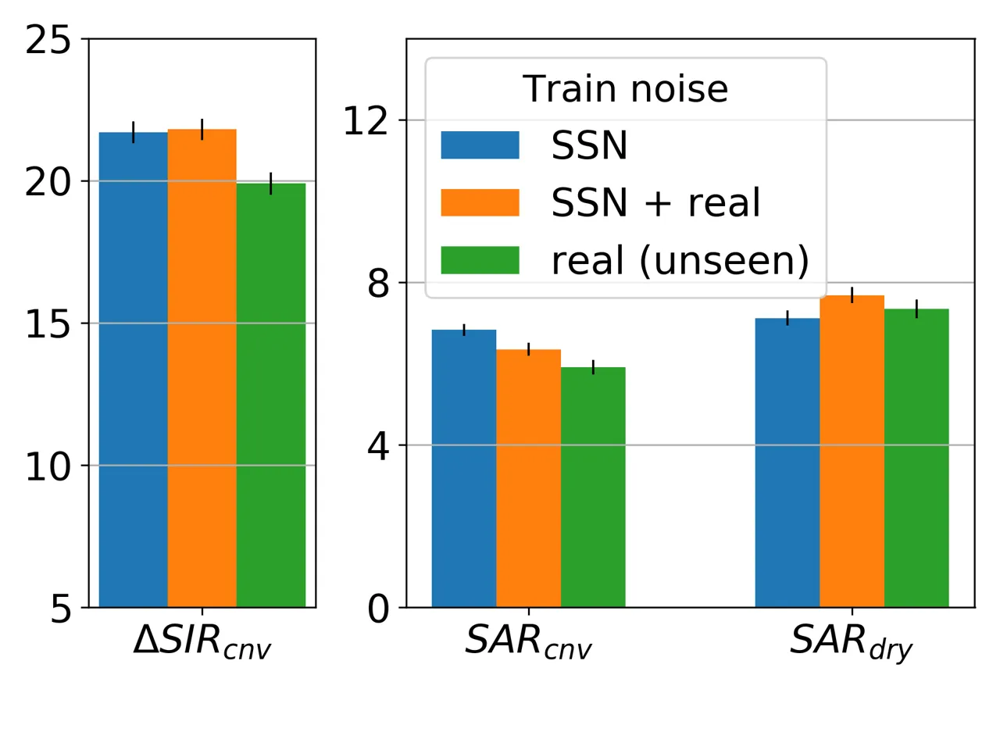

(a) Results on test set with speech shaped noise

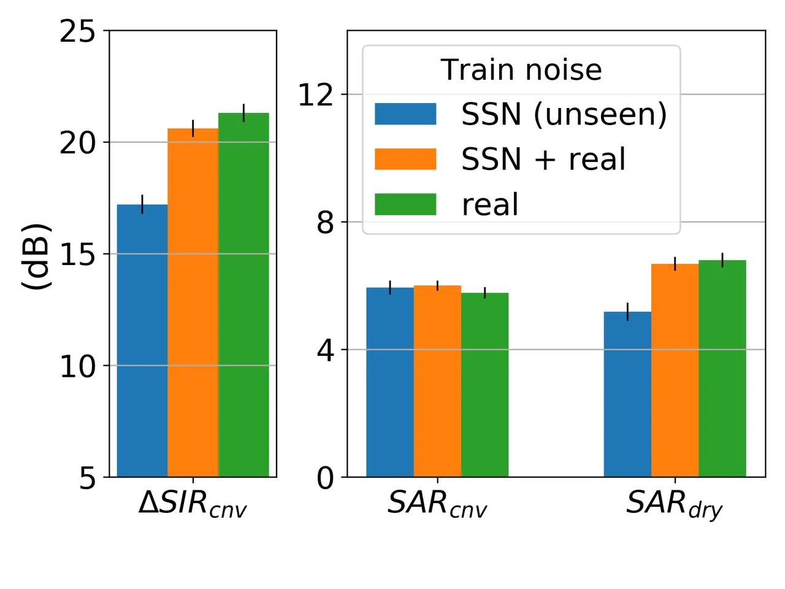

(b) Results on test set with real noise

Fig. 7: Speech enhancement performance of the single-node DNNs in the
random room configuration for different training and test noise
conditions. The $`\Delta SIR_{\text{cnv}}`$ difference in Figure 7b
between the two last networks is not statistically significant.

### V-C Robustness to an unseen spatial configurations

We now consider the impact of the spatial scenario while training the
dnn. We compare three dnn, trained on the signals generated in the three
spatial configurations introduced in Section IV-A, and tested on each of
these scenarios.

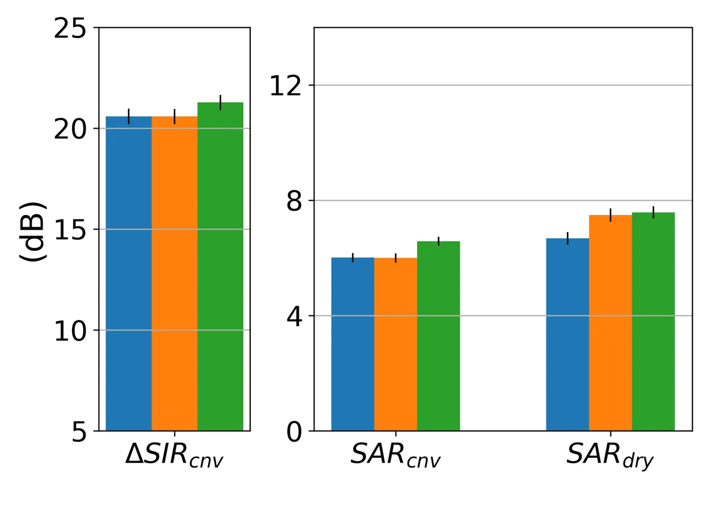

(a) Random room

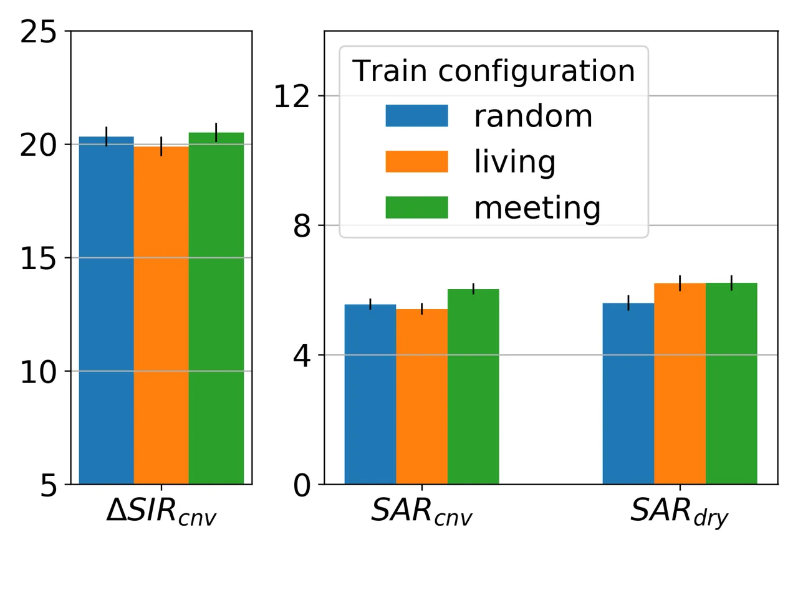

(b) Living room

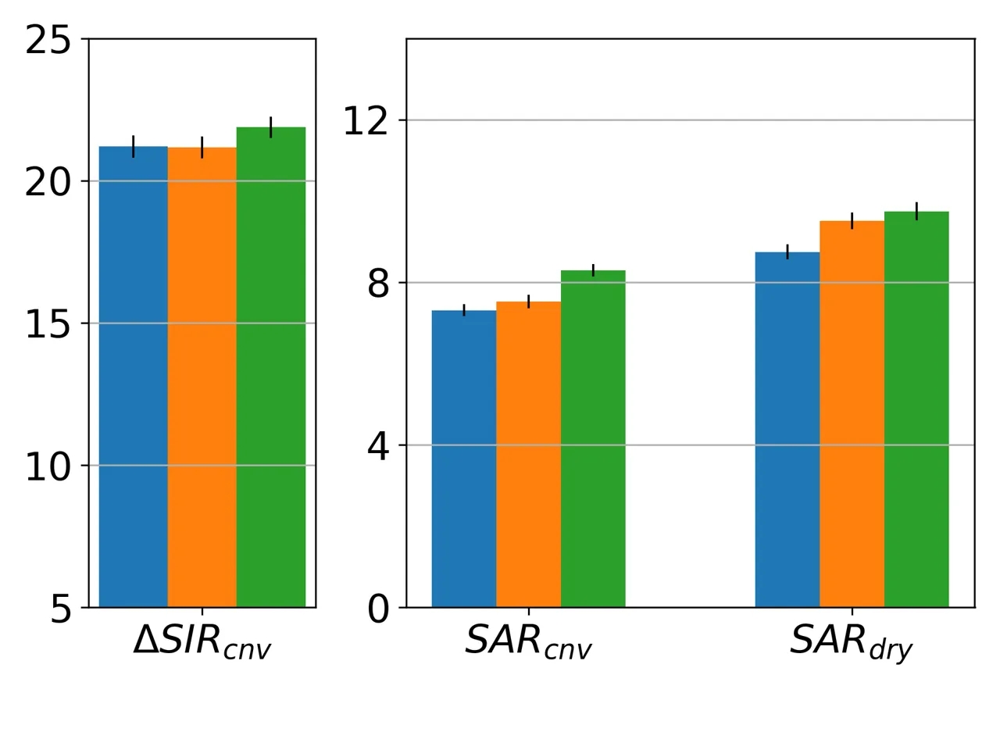

(c) Meeting room

Fig. 8: Speech enhancement performance of three single-node networks
trained each on a different spatial configuration.

As can be seen in Figure 8, only mildly significant differences can be
observed between the three models. One exception can be highlighted,
when the dnn trained on the meeting room configuration yields the best
results, probably because, due to the closeness of some nodes to the
noise source, this dnn has seen more challenging scenarios during the
training, making it more robust. Apart from this specific single-node
scenario, it would not have a big impact to train on one spatial
configuration and test on another.

In particular, it is interesting to notice that the $`SAR_{\text{dry}}`$
values are higher in the meeting room configuration than in the two
other ones. This is because the microphones are close to the target
source, which is hence less distorted by the reverberation. This
confirms the relevance of the third metric.

## VI Analysis of the performance with the multi-node networks

We now extend our study to the case where, at the second filtering step,
the dnn also receives the signals from the other nodes and uses them as
additional input to predict the tf masks. In a similar manner to our
previous work, the signals sent are all estimations of the target signal
\[25\].

### VI-A Benefit of using multi-node DNNs

We first study in this section the advantage of using multi-node dnn
over single-node dnn at the second filtering step. We train a multi-node
dnn on each of the spatial configurations introduced in Section IV-A.
The compressed signals used to train the dnn are obtained with irm, but
at test time, the irm are replaced by the tf masks estimated by the
single-node dnn. The results are given in Figure 9 and compared to the
oracle case of danse, where the signals statistics are computed with an
oracle vad.

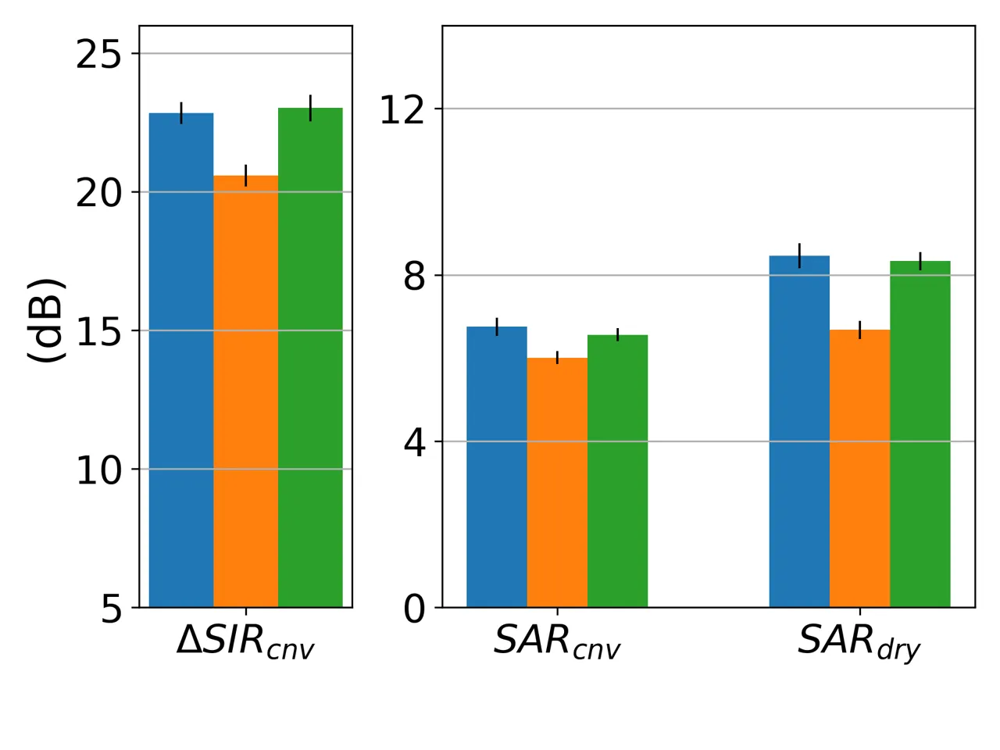

(a) Random room

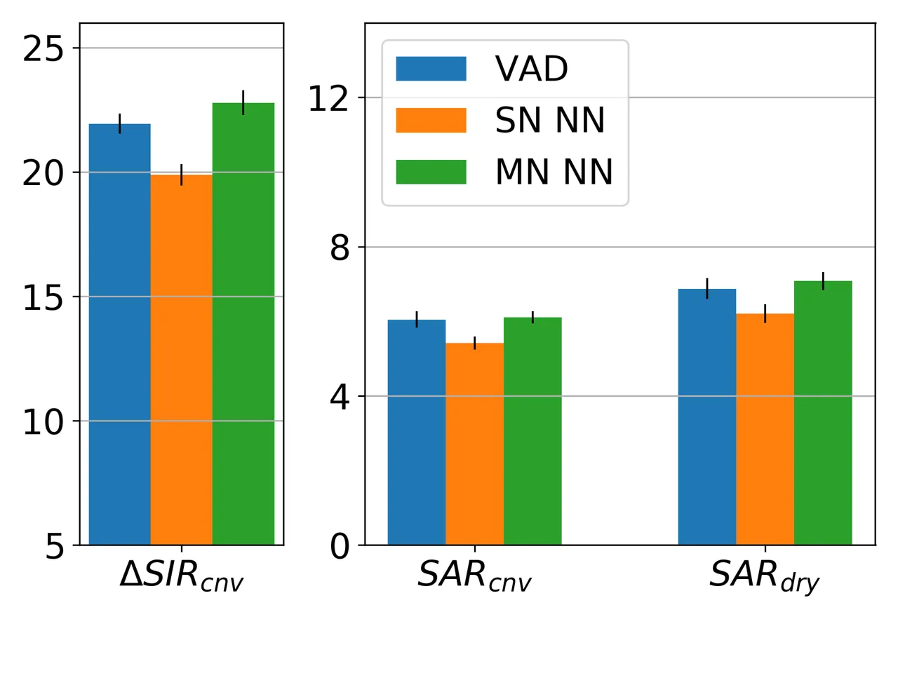

(b) Living room

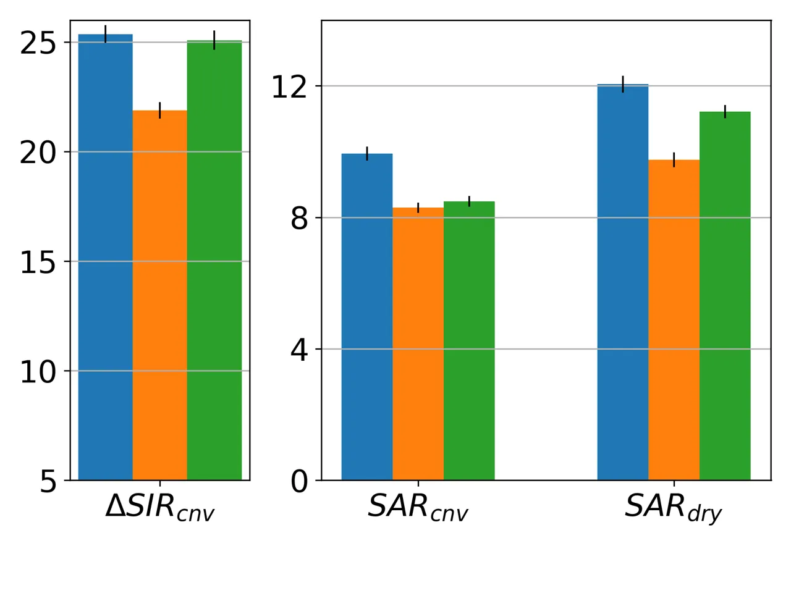

(c) Meeting room

Fig. 9: Speech enhancement performance on the three spatial
configurations using an oracle vad, a single-node dnn and a multi-node
dnn at the second filtering step.

The multi-node dnn brings an $`\Delta SIR_{\text{cnv}}`$ improvement of
around 3 dB compared to the single-node dnn (see Figure 8), and up to
1.5 dB improvement in terms of $`SAR`$. Besides, it increases the
performance up to what can be achieved with an oracle vad in terms of
$`SAR`$, except on the meeting room configuration where the scenario is
more challenging. The conclusion of our previous paper, saying that the
compressed signals are useful to better predict the tf masks, is thus
confirmed on three real-life scenarios.

### VI-B Influence of the spatial configuration

Given that the compressed signals convey a lot of spatial information,
the conclusions of Section V-C might not hold in the multi-node dnn. We
repeated the experiments in the multi-node case, where the compressed
signals are given at the input of the dnn. Similarly to the conclusions
to Section V-C, there was very little difference across the three dnn.
That is why we will consider only one network in the sequel, the one
trained and tested on the random room.

### VI-C Exploitation of the mixture diversity in low SIR conditions

In this section, we show the advantage of using distributed microphone
arrays and we highlight the cooperation among nodes of the microphone
array with our multi-node solution. We report the performance of our
solution at the best input node and at the worst input node of the
microphone array in the random room configuration. The best (resp.
worst) input node is the node with the highest (resp. lowest) input
$`SIR_{\text{cnv}}`$. We report these results in Table II for the
single-node solution (indicated by "SN") and for the multi-node solution
(indicated by "MN"). To recall, in the single-node solution, the dnn
does not have the compressed signals to predict the tf mask at any of
both filtering steps. In the multi-node solution, the dnn of the second
filtering step has the compressed signals and the local noisy signal to
predict the tf mask. The best (resp. worst) input node is indicated with
the subscript $`{}_{\text{bi}}`$ (resp. $`{}_{\text{wi}}`$) in the
table. The distribution of the input $`SIR_{\text{cnv}}`$ corresponding
to the best and worst input nodes is represented in Figure 10.

| (dB)                 | $`\boldsymbol{SIR_{\text{cnv}}}`$ | $`\boldsymbol{\Delta SIR_{\text{cnv}}}`$ | $`\boldsymbol{SAR_{\text{cnv}}}`$ | $`\boldsymbol{SAR_{\text{dry}}}`$ |
| -------------------- | --------------------------------- | ---------------------------------------- | --------------------------------- | --------------------------------- |
| SN$`{}_{\text{bi}}`$ | 18.7 $`\pm`$ 0.6                  | 16.1 $`\pm`$ 0.5                         | 5.8 $`\pm`$ 0.2                   | 5.8 $`\pm`$ 0.3                   |
| SN$`{}_{\text{wi}}`$ | 14.2 $`\pm`$ 0.7                  | 16.6 $`\pm`$ 0.6                         | 3.4 $`\pm`$ 0.2                   | 3.6 $`\pm`$ 0.3                   |
| MN$`{}_{\text{bi}}`$ | 20.5 $`\pm`$ 0.7                  | 17.9 $`\pm`$ 0.6                         | 6.4 $`\pm`$ 0.2                   | 7.4 $`\pm`$ 0.3                   |
| MN$`{}_{\text{wi}}`$ | 18.1 $`\pm`$ 0.7                  | 20.5 $`\pm`$ 0.6                         | 4.2 $`\pm`$ 0.2                   | 5.8 $`\pm`$ 0.3                   |

TABLE II: Speech enhancement performance of the single-node and
multi-node networks at the best and worst input nodes of the random room
configuration.

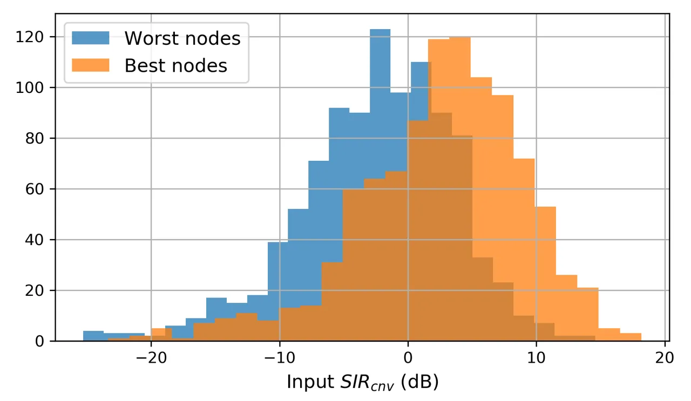

Fig. 10: Histogram of the input $`SIR_{\text{cnv}}`$ at the best input
nodes and at the worst input nodes.

As can be seen in Table II, even in the single-node case, the
performance is relatively good at the best input node. The
$`\Delta SIR_{\text{cnv}}`$ is similar to the one at the worst input
node, but the output $`SIR_{\text{cnv}}`$ is higher. Using multi-node
dnn at this best input node does improve the final performance, but in a
lesser extend than at the worst input node. This is especially true when
considering the $`\Delta SIR_{\text{cnv}}`$ which increases of almost
4 dB at the worst input node but only 1.8 dB at the best input node.
This reduces considerably the discrepancy of output $`SIR_{\text{cnv}}`$
across the whole microphone array. It shows that the nodes cooperate and
that the dnn on the worst input node is able to exploit the information
coming from the other nodes. At the worst input node, the benefit of our
method is twofold: the compressed signals come from nodes with a higher
sir and additionally, they are already filtered with a well-predicted tf
mask.

As a counterpart, this also probably means that the compressed signals
sent by the worst input nodes are not so useful. However, these nodes
are the closest to the noise source, so the network could predict quite
well the tf mask corresponding to the noise source. Sending the noise
estimation as the compressed signals could improve the overall
performance. This is what we propose to analyse in Section VII.

### VI-D Using oracle or predicted compressed signals

In order to know which masks should be used to compute the compressed
signals of the training dataset, we compare two dnn. The first dnn is
trained on compressed signals output by a filter with an oracle tf mask
(referred to as "oracle") and the second dnn is trained on compressed
signals output by a filter with a predicted tf mask (referred to as
"predicted"). The results are reported in Table III.

| (dB)      | $`\boldsymbol{\Delta SIR_{\text{cnv}}}`$ | $`\boldsymbol{SAR_{\text{cnv}}}`$ | $`\boldsymbol{SAR_{\text{dry}}}`$ |
| --------- | ---------------------------------------- | --------------------------------- | --------------------------------- |
| oracle    | 23.0 $`\pm`$ 0.5                         | 6.6 $`\pm`$ 0.2                   | 8.3 $`\mathbf{\pm}`$ 0.2          |
| predicted | 23.4 $`\pm`$ 0.5                         | 6.6 $`\pm`$ 0.2                   | 7.5 $`\pm`$ 0.2                   |

TABLE III: Speech enhancement performance when oracle masks or predicted
masks are used to compute the compressed signals needed to train the
multi-node dnn. The significantly best results are indicated in bold.

The only significant difference is observed in terms of
$`SAR_{\text{dry}}`$, where using the compressed signals computed with
oracle tf masks outperforms the method using the predicted tf masks.
This is probably explained by the fact that the training material is
clean. In the rest of the paper, the results are obtained when the
multi-node dnn are trained with oracle compressed signals.

## VII Exchanging signals between nodes

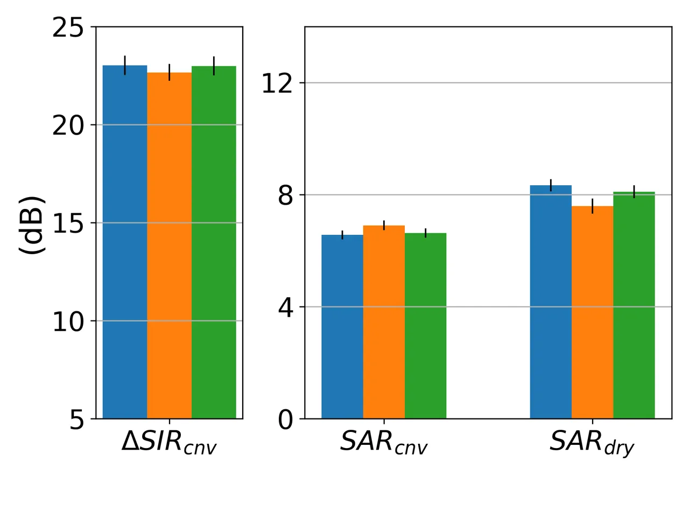

(a) Best output node

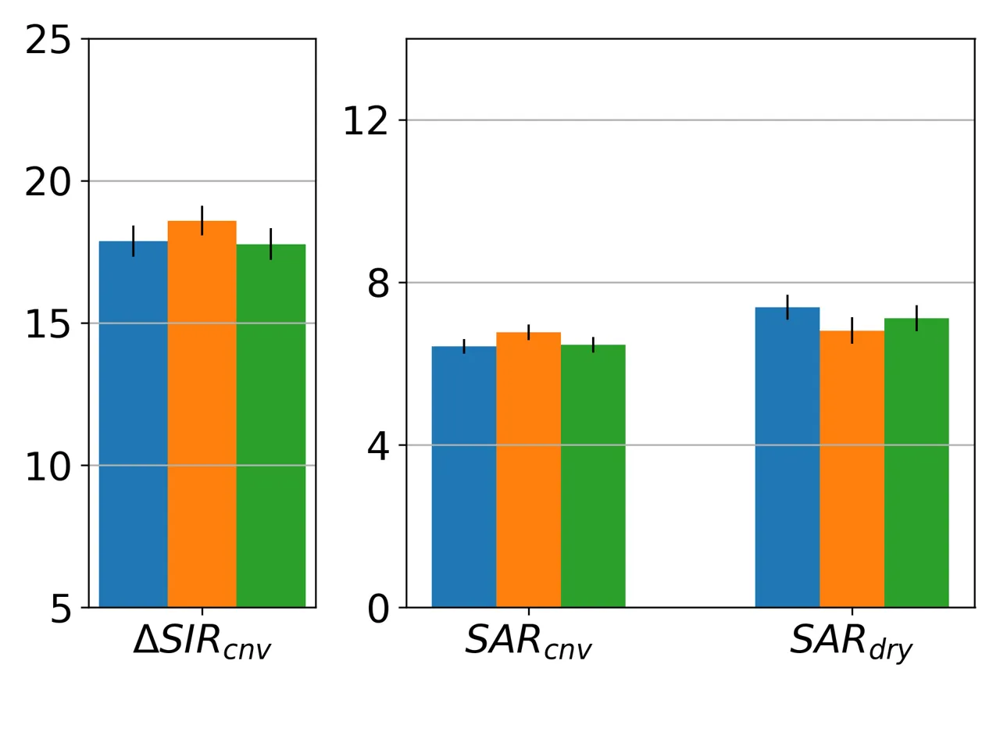

(b) Best input node

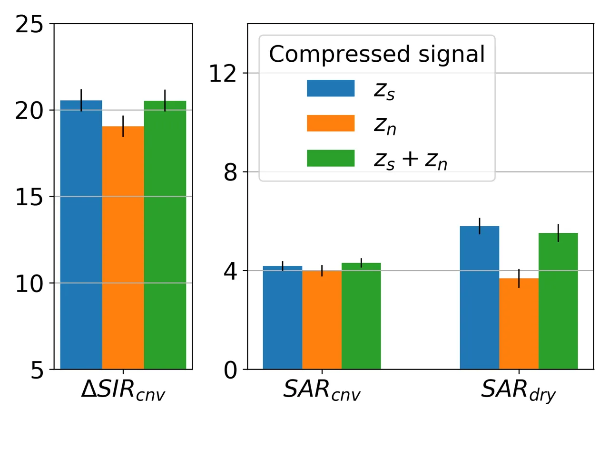

(c) Worst input node

Fig. 11: Speech enhancement performance on the three spatial
configurations of multi-node dnn trained with different compressed
signals.

In this section, we focus on the compressed signal that is sent from one
node to the others. In previous versions of danse, only the target
estimation was sent \[10, 28, 41, 25\]. However, as depicted in
Figure 5, the noise estimation can also provide useful information, so
we propose to compare in which conditions which signal estimation should
be sent. To do so, we train three multi-node dnn. The first one is the
dnn that had been used for the previous experiments, and which had as
input the target estimations, denoted $`z_{s}`$, coming from the distant
nodes, together with the noisy signal at the reference channel. The
second dnn has the noise estimations $`z_{n}`$ sent from the distant
nodes together with the noisy signal at the reference channel. The third
dnn has both target speech and noise estimations together with the noisy
signal at the reference channel as input. Each of these networks is
tested on conditions matching its training conditions, and the results
are represented in Figure 11. We represent the results obtained at the
best output nodes (i.e. the result is the average over all the filtered
signals obtained at the nodes with the highest output
$`SIR_{\text{cnv}}`$), at the best input node (average over the filtered
signals obtained at the nodes with the highest input
$`SIR_{\text{cnv}}`$, and at the worst input node (average over the
filtered signals obtained at the nodes with the lowest input
$`SIR_{\text{cnv}}`$)).

At the best output node (Figure 11a), sending the one or the other
compressed signal does not make any difference. At the best input node
(Figure 11b), although the differences are not significant, the
$`\Delta SIR_{\text{cnv}}`$ indicates that this node could benefit from
receiving the compressed noise estimation rather than the compressed
target estimation. Likewise, using the compressed noise estimation at
the worst input node (Figure 11c) leads to worse results, since the
worst input node already has good insights on the noise signal and needs
an estimation of the target signal, which it can poorly estimate in its
own.

Sending both the target and the noise estimations seems to be very
similar to sending only the target estimation. It looks like it does not
benefit from the noise estimation at the best input node. However, the
significance of the results allows us only to conclude that sending both
estimations is not worse than sending either of both. Given the
relatively simple architecture of the network, it could also be that
sending both signals from all nodes represents an overload of data for
the dnn. Carefully selecting either $`z_{s}`$ or $`z_{n}`$ at the input
of the dnn might offer a solution to have the best of both worlds, while
alleviating the bandwidth requirements.

Hence, depending on the application, if the aim of the speech
enhancement challenge is to have the one best signal for the whole
microphone array, then sending only $`z_{s}`$ is enough. If each node
should have its own estimated signal, as discussed in \[40\], then
depending on the node and its input sir, a decision has to be taken
whether the target or the noise estimation is of greater relevance.
Sending both could is an interesting option but it means sending twice
more data.

Lastly, it is worth noting that the nodes with the best output signal
are not always the nodes with the best input signal. The performance of
the two filtering steps described in Figure 1 at the best input nodes
and at the best output nodes is given in Table IV. The first (resp.
second) filtering step is mentioned as S1 (resp. S2) and the best input
node (resp. best output node) is indicated with the subscript
$`{}_{\text{bi}}`$ (resp. $`{}_{\text{bo}}`$). Even at the first
filtering step, where the spatial information is not yet shared, the
best input nodes are not always the best output nodes, but the
difference of performance between the two types of nodes is quite low.
The best output nodes benefit more from the second filtering step than
the best input nodes. This is because the performance at the second
filtering step (where the multi-node dnn are used) depends a lot on the
compressed signals, which are in general very well estimated by the best
input nodes. These compressed signals are received by the other nodes
which can benefit from their accuracy and estimate the best output
signal. Interestingly, the input $`SIR_{\text{cnv}}`$ of the best output
nodes of the second filtering step (equal to 1 dB) is lower than the
input $`SIR_{\text{cnv}}`$ of the best output nodes of the first
filtering step (equal to 1.8 dB). It means that some nodes with a lower
input $`SIR_{\text{cnv}}`$ become the nodes with the best overall
performance thanks to the information shared across the microphone
array. This phenomenon highlights the cooperation among nodes in the
proposed algorithm.

| (dB)                 | $`\boldsymbol{SIR_{\text{cnv}}}`$ | $`\boldsymbol{\Delta SIR_{\text{cnv}}}`$ | $`\boldsymbol{SAR_{\text{cnv}}}`$ | $`\boldsymbol{SAR_{\text{dry}}}`$ |
| -------------------- | --------------------------------- | ---------------------------------------- | --------------------------------- | --------------------------------- |
| S1$`{}_{\text{bi}}`$ | 17.9 $`\pm`$ 0.4                  | 15.3 $`\pm`$ 0.4                         | 7.4 $`\pm`$ 0.2                   | 7.6 $`\pm`$ 0.2                   |
| S1$`{}_{\text{bo}}`$ | 19.4 $`\pm`$ 0.4                  | 17.6 $`\pm`$ 0.3                         | 7.6 $`\pm`$ 0.1                   | 8.0 $`\pm`$ 0.2                   |
| S2$`{}_{\text{bi}}`$ | 20.5 $`\pm`$ 0.7                  | 17.9 $`\pm`$ 0.5                         | 6.4 $`\pm`$ 0.2                   | 7.4 $`\pm`$ 0.3                   |
| S2$`{}_{\text{bo}}`$ | 23.9 $`\pm`$ 0.5                  | 23.0 $`\pm`$ 0.5                         | 6.6 $`\pm`$ 0.2                   | 8.3 $`\pm`$ 0.2                   |

TABLE IV: Difference of performance between the first and second
filtering steps at the best input node and best output node.

## VIII Conclusion

We introduced and extended a dnn-based distributed multichannel speech
enhancement methodology which operates in spatially unconstrained
microphone arrays. It was evaluated on a large variety of real-life
scenarios which proved the efficiency of this solution. It was also
shown that this solution is robust to mismatches between the training
and test conditions of the dnn. We showed that the nodes with the lowest
input sir benefit the most from the cooperation across the microphone
array and we gave insights on the potential benefit of sending the noise
estimation rather than the target estimation. To definitely validate the
efficiency of this solution, an evaluation on real data remains
necessary. Another interesting direction of research would be to better
select the signals that are needed, either before or after sending them
as compressed signals, e.g. with attention mechanisms.

## Acknowledgment

This work was made with the support of the French National Research
Agency, in the framework of the project DiSCogs (ANR-17-CE23-0026-01).
Experiments presented in this paper were partially out using the
Grid5000 testbed, supported by a scientific interest group hosted by
Inria and including CNRS, RENATER and several Universities as well as
other organizations (see https://www.grid5000).

## References

- \[1\] B. D. Van Veen and K. M. Buckley, “Beamforming: A versatile
  approach to spatial filtering,” _IEEE ASSP magazine_, vol. 5, no. 2,
  pp. 4–24, 1988.
- \[2\] J. Capon, “High-resolution frequency-wavenumber spectrum
  analysis,” _Proceedings of the IEEE_, vol. 57, no. 8, pp.
  1408–1418, 1969.
- \[3\] O. L. Frost, “An algorithm for linearly constrained adaptive
  array processing,” _Proceedings of the IEEE_, vol. 60, no. 8, pp.
  926–935, 1972.
- \[4\] _Optimum Waveform Estimation_. John Wiley and Sons, Ltd, 2002,
  ch. 6, pp. 428–709.
- \[5\] S. Doclo and M. Moonen, “GSVD-based optimal filtering for single
  and multimicrophone speech enhancement,” _IEEE Transactions on Signal
  Processing_, vol. 50, no. 9, pp. 2230–2244, 2002.
- \[6\] S. Doclo, A. Spriet, J. Wouters, and M. Moonen,
  “Frequency-domain criterion for the speech distortion weighted
  multichannel Wiener filter for robust noise reduction,” _Speech
  Communication_, vol. 49, no. 7-8, pp. 636–656, 2007.
- \[7\] S. Gannot, E. Vincent, S. Markovich-Golan, and A. Ozerov, “A
  consolidated perspective on multimicrophone speech enhancement and
  source separation,” _IEEE/ACM Transactions on Audio, Speech, and
  Language Processing_, vol. 25, no. 4, pp. 692–730, 2017.
- \[8\] O. Roy and M. Vetterli, “Rate-constrained collaborative noise
  reduction for wireless hearing aids,” _IEEE Transactions on Signal
  Processing_, vol. 57, no. 2, pp. 645–657, Feb 2009.
- \[9\] J. Zhang, R. Heusdens, and R. C. Hendriks, “Rate-distributed
  spatial filtering based noise reduction in wireless acoustic sensor
  networks,” _IEEE/ACM Transactions on Audio, Speech, and Language
  Processing_, vol. 26, no. 11, pp. 2015–2026, Nov 2018.
- \[10\] A. Bertrand and M. Moonen, “Efficient sensor subset selection
  and link failure response for linear MMSE signal estimation in
  wireless sensor networks,” in _18th European Signal Processing
  Conference_, Aug 2010, pp. 1092–1096.
- \[11\] Y. Zeng and R. C. Hendriks, “Distributed delay and sum
  beamformer for speech enhancement via randomized gossip,” _IEEE/ACM
  Transactions on Audio, Speech, and Language Processing_, vol. 22,
  no. 1, pp. 260–273, 2013.
- \[12\] M. Zheng, M. Goldenbaum, S. Stanczak, and H. Yu, “Fast average
  consensus in clustered wireless sensor networks by superposition
  gossiping,” _IEEE Wireless Communications and Networking Conference,
  WCNC_, pp. 1982–1987, 04 2012.
- \[13\] G. Zhang and R. Heusdens, “Distributed optimization using the
  primal-dual method of multipliers,” _IEEE Transactions on Signal and
  Information Processing over Networks_, vol. 4, no. 1, pp. 173–187,
  March 2018.
- \[14\] A. I. Koutrouvelis, T. W. Sherson, R. Heusdens, and R. C.
  Hendriks, “A low-cost robust distributed linearly constrained
  beamformer for wireless acoustic sensor networks with arbitrary
  topology,” _IEEE/ACM Transactions on Audio, Speech, and Language
  Processing_, vol. 26, no. 8, pp. 1434–1448, Aug 2018.
- \[15\] A. Bertrand and M. Moonen, “Distributed adaptive node-specific
  signal estimation in fully connected sensor networks — Part I:
  Sequential node updating,” pp. 5277–5291, Oct 2010.
- \[16\] J. Heymann, L. Drude, and R. Haeb-Umbach, “Neural network based
  spectral mask estimation for acoustic beamforming,” in _IEEE
  International Conference on Acoustics, Speech and Signal Processing
  (ICASSP)_, vol. 2016-May, 2016, pp. 196–200.
- \[17\] Z.-Q. Wang and D. Wang, “Mask weighted STFT ratios for relative
  transfer function estimation and its application to robust ASR,” in
  _IEEE International Conference on Acoustics, Speech and Signal
  Processing (ICASSP)_. IEEE, 2018, pp. 5619–5623.
- \[18\] H. Erdogan, J. R. Hershey, S. Watanabe, M. I. Mandel, and
  J. Le Roux, “Improved MVDR beamforming using single-channel mask
  prediction networks.” in _Interspeech_, 2016, pp. 1981–1985.
- \[19\] Y. Jiang, D. Wang, R. Liu, and Z. Feng, “Binaural
  classification for reverberant speech segregation using deep neural
  networks,” _IEEE/ACM Transactions on Audio, Speech and Language
  Processing_, vol. 22, no. 12, pp. 2112–2121, 2014.
- \[20\] L. Perotin, R. Serizel, E. Vincent, and A. Guérin,
  “Multichannel speech separation with recurrent neural networks from
  high-order ambisonics recordings,” in _IEEE International Conference
  on Acoustics, Speech and Signal Processing (ICASSP)_, 2018, pp. 36–40.
- \[21\] T. Yoshioka, H. Erdogan, Z. Chen, and F. Alleva,
  “Multi-microphone neural speech separation for far-field multi-talker
  speech recognition,” in _IEEE International Conference on Acoustics,
  Speech and Signal Processing (ICASSP)_, 2018, pp. 5739–5743.
- \[22\] S. Chakrabarty and E. A. P. Habets, “Time-Frequency Masking
  Based Online Multi-Channel Speech Enhancement With Convolutional
  Recurrent Neural Networks,” _IEEE Journal of Selected Topics in Signal
  Processing_, vol. 13, no. 4, pp. 1–1, 2019.
- \[23\] T. N. Sainath, R. J. Weiss, K. W. Wilson, B. Li, A. Narayanan,
  E. Variani, M. Bacchiani, I. Shafran, A. Senior, K. Chin, A. Misra,
  and C. Kim, “Multichannel signal processing with deep neural networks
  for automatic speech recognition,” _IEEE/ACM Transactions on Audio,
  Speech, and Language Processing_, vol. 25, no. 5, pp. 965–979,
  May 2017.
- \[24\] E. Ceolini and S. Liu, “Combining deep neural networks and
  beamforming for real-time multi-channel speech enhancement using a
  wireless acoustic sensor network,” in _IEEE 29th International
  Workshop on Machine Learning for Signal Processing (MLSP)_, Oct 2019,
  pp. 1–6.
- \[25\] N. Furnon, R. Serizel, I. Illina, and S. Essid, “DNN-based
  distributed multichannel mask estimation for speech enhancement in
  microphone arrays,” in _IEEE International Conference on Acoustics,
  Speech and Signal Processing (ICASSP)_, 2020, pp. 4672–4676.
- \[26\] L. Pfeifenberger, M. Zöhrer, and F. Pernkopf, “DNN-based speech
  mask estimation for eigenvector beamforming,” in _IEEE International
  Conference on Acoustics, Speech and Signal Processing (ICASSP)_, 2017,
  pp. 66–70.
- \[27\] R. Serizel, M. Moonen, B. Van Dijk, and J. Wouters, “Low-rank
  Approximation Based Multichannel Wiener Filter Algorithms for Noise
  Reduction with Application in Cochlear Implants,” _IEEE/ACM
  Transactions on Audio, Speech, and Language Processing_, vol. 22,
  no. 4, pp. 785–799, 2014.
- \[28\] A. Hassani, A. Bertrand, and M. Moonen, “GEVD-based low-rank
  approximation for distributed adaptive node-specific signal estimation
  in wireless sensor networks,” _IEEE Transactions on Signal
  Processing_, vol. 64, no. 10, pp. 2557–2572, 2015.
- \[29\] M. Weintraub, “A theory and computational model of auditory
  monaural sound separation (stream, speech enhancement, selective
  attention, pitch perception, noise cancellation),” Ph.D. dissertation,
  Stanford, CA, USA, 1985.
- \[30\] Z. Jin and D. Wang, “A supervised learning approach to monaural
  segregation of reverberant speech,” _IEEE Transactions on Audio,
  Speech, and Language Processing_, vol. 17, no. 4, pp. 625–638, 2009.
- \[31\] R. Li, X. Sun, T. Li, and F. Zhao, “A multi-objective learning
  speech enhancement algorithm based on IRM post-processing with joint
  estimation of SCNN and TCNN,” _Digital Signal Processing_, p.
  102731, 2020.
- \[32\] R. Gu, S. Zhang, L. Chen, Y. Xu, M. Yu, D. Su, Y. Zou, and
  D. Yu, “Enhancing end-to-end multi-channel speech separation via
  spatial feature learning,” in _IEEE International Conference on
  Acoustics, Speech and Signal Processing (ICASSP)_, 2020, pp.
  7319–7323.
- \[33\] M. Kolbæk, Z.-H. Tan, and J. Jensen, “Speech intelligibility
  potential of general and specialized deep neural network based speech
  enhancement systems,” _IEEE/ACM Transactions on Audio, Speech, and
  Language Processing_, vol. 25, no. 1, pp. 153–167, 2016.
- \[34\] R. Scheibler, E. Bezzam, and I. Dokmanic, “Pyroomacoustics: A
  python package for audio room simulation and array processing
  algorithms,” _IEEE International Conference on Acoustics, Speech and
  Signal Processing (ICASSP)_, Apr 2018.
- \[35\] V. Panayotov, G. Chen, D. Povey, and S. Khudanpur,
  “Librispeech: an ASR corpus based on public domain audio books,” _IEEE
  International Conference on Acoustics, Speech and Signal Processing
  (ICASSP)_, pp. 5206–5210, 2015.
- \[36\] F. Font, G. Roma, and X. Serra, “Freesound technical demo,”
  _ACM International Conference on Multimedia (MM’13)_, pp.
  411–412, 2013.
- \[37\] G. Hinton, N. Srivastava, and K. Swersky, “COURSERA: Neural
  networks for machine learning – lecture 6a,” 2012. \[Online\].
  Available:
  http://www.cs.toronto.edu/~tijmen/csc321/slides/lecture_slides_lec6.pdf
- \[38\] J. Le Roux, S. Wisdom, H. Erdogan, and J. R. Hershey, “SDR –
  half-baked or well done?” in _IEEE International Conference on
  Acoustics, Speech and Signal Processing (ICASSP)_. IEEE, 2019, pp.
  626–630.
- \[39\] L. Drude, J. Heitkaemper, C. Boeddeker, and R. Haeb-Umbach,
  “SMS-WSJ: Database, performance measures, and baseline recipe for
  multi-channel source separation and recognition,” _arXiv preprint
  arXiv:1910.13934_, 2019.
- \[40\] S. Markovich-Golan, A. Bertrand, M. Moonen, and S. Gannot,
  “Optimal distributed minimum-variance beamforming approaches for
  speech enhancement in wireless acoustic sensor networks,” _Signal
  Processing_, vol. 107, pp. 4–20, 2015.
- \[41\] A. Bertrand and M. Moonen, “Topology-independent distributed
  adaptive node-specific signal estimation in wireless sensor networks,”
  _IEEE Transactions on Signal and Information Processing over
  Networks_, vol. 3, no. 1, pp. 130–144, 2017.
