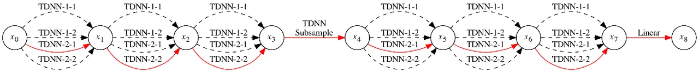

# Efficient Neural Architecture Search for End-to-end Speech Recognition via Straight-Through Gradients

Huahuan Zheng    Keyu An    Zhijian Ou ^(†)^(†)thanks: This work is
supported by NSFC 61976122.

###### Abstract

Neural Architecture Search (NAS), the process of automating architecture
engineering, is an appealing next step to advancing end-to-end Automatic
Speech Recognition (ASR), replacing expert-designed networks with
learned, task-specific architectures. In contrast to early
computational-demanding NAS methods, recent gradient-based NAS methods,
e.g., DARTS (Differentiable ARchiTecture Search), SNAS (Stochastic NAS)
and ProxylessNAS, significantly improve the NAS efficiency. In this
paper, we make two contributions. First, we rigorously develop an
efficient NAS method via Straight-Through (ST) gradients, called ST-NAS.
Basically, ST-NAS uses the loss from SNAS but uses ST to back-propagate
gradients through discrete variables to optimize the loss, which is not
revealed in ProxylessNAS. Using ST gradients to support sub-graph
sampling is a core element to achieve efficient NAS beyond DARTS and
SNAS. Second, we successfully apply ST-NAS to end-to-end ASR.
Experiments over the widely benchmarked 80-hour WSJ and 300-hour
Switchboard datasets show that the ST-NAS induced architectures
significantly outperform the human-designed architecture across the two
datasets. Strengths of ST-NAS such as architecture transferability and
low computation cost in memory and time are also reported.

###### Index Terms: 

NAS, Straight-Through, End-to-end ASR

^(†)^(†)address: Speech Processing and Machine Intelligence (SPMI) Lab,
Tsinghua University, China.  
zhh20@mails.tsinghua.edu.cn, aky19@mails.tsinghua.edu.cn,
ozj@tsinghua.edu.cn

## 1 Introduction

Building Automatic Speech Recognition (ASR) systems historically was an
expertise-intensive task and involved a complex pipeline \[1, 2\], which
consists of phonetic decision trees and multiple stages of alignments
and model updating. Recently, there are increasing interests in
developing end-to-end ASR systems \[3, 4, 5, 6\] to reduce expert
efforts and simplify the system. The progress largely relies on
utilizing deep neural networks (DNNs) of various architectures, which is
generally known as deep learning. The success of deep learning is
largely due to its automation of the feature engineering process:
hierarchical feature extractors are automatically learned from data
rather than manually designed. This success has been accompanied,
however, by a rising demand for architecture engineering.

Various neural architectures, e.g., 2D Convolutional Neural Networks
(CNNs) \[7\], which is also known as (a.k.a.) VGG-Net, 1D dilated CNN
\[8\] (a.k.a. TDNN), ResNet \[9\] and so on, are manually designed by
experts through intuitions plus laborious trial and error experiments.
Hyper-parameters for an architecture (e.g., kernel size, stride, and
dilation of CNN) are set empirically, which may not be optimal for the
specific task at hand, since naive grid-search is highly expensive.
Neural Architecture Search (NAS) \[10\], the process of automating
architecture engineering, is thus an appealing next step to advancing
end-to-end ASR.

Early NAS methods are computationally demanding despite their remarkable
performance. For example, it takes 2000 GPU days of reinforcement
learning and 3150 GPU days of evolution to obtain a state-of-the-art
(SOTA) architecture for image classification over CIFAR-10 \[11\] and
ImageNet \[12\] respectively . Some recent NAS methods, e.g., DARTS
(Differentiable ARchiTecture Search) \[13\], SNAS (Stochastic NAS)
\[14\] and ProxylessNAS \[15\], significantly improve the NAS efficiency
and can obtain SOTA architecture over CIFAR-10 within one GPU day. Note
that NAS methods roughly can be categorized according to three
dimensions - search space, search method, and performance evaluation
method \[16\]. Some common features shared by these efficient NAS
methods are: representing the search space as a weighted directed
acyclic graph (DAG)¹¹ 1 When used to represent the entire architecture,
the DAG is often called the super-network \[17, 18\] or the
over-parameterized network \[15\]. When the search space is defined over
smaller building blocks \[19, 13\], the DAG is called the cell block or
the cell, that could be stacked in some way via a preset or learned
meta-architecture to form the entire architecture., using gradient-based
search methods to learn the edge weights, and weight sharing in
performance evaluation of candidate architectures (i.e., sub-graphs of
the DAG). The final architecture is derived from the learned edge
weights. Notably, DARTS uses the Softmax trick to relax the search space
to be continuous and performs gradient search over the whole
super-network, while SNAS uses the Gumbel-Softmax trick \[20\]. These
are less efficient in both memory and computation than ProxylessNAS,
which uses discrete search spaces and does sub-graph sampling. To
back-propagate gradients through the discrete variables, which index the
sampled edges, ProxylessNAS uses an ad-hoc trick, analogous to
BinaryConnect \[21\].

In this paper, we make two contributions. First, we observe that
ProxylessNAS essentially uses the Straight-Through (ST) estimator \[22\]
for gradient approximation, which is missed in the ProxylessNAS paper.
To back-propagate gradients through discrete variables, the basic idea
of ST is that the sampled discrete index is used for forward
computation, and the continuous Softmax probability of the sampled index
is used for backward gradient calculation. Using ST gradients to support
sub-graph sampling is a core element to achieve efficient NAS beyond
DARTS and SNAS. Based on ProxylessNAS and also the above observation, we
develop an efficient NAS method via ST gradients, called ST-NAS. In
contrast to ProxylessNAS whose NAS objective definition is not clearly
shown, ST-NAS uses the NAS objective definition from SNAS and is more
rigorous. Compared to SNAS, ST-NAS does not use the Gumbel-Softmax trick
and uses the more efficient ST gradients. The development of the ST-NAS
method is the first contribution of this paper.

Second, we apply ST-NAS to end-to-end ASR. Compared to the application
of NAS techniques in computer vision tasks, there are limited studies in
applying NAS to speech recognition tasks. In \[23\], NAS via policy
gradient based reinforcement learning \[17\] is applied to keyword
spotting. In \[24\], evolution-based NAS is applied to keyword spotting
and language identification. DARTS are used in \[25\] and \[26\] for
speaker recognition and Connectionist Temporal Classification (CTC)
based speech recognition respectively. The NAS methods used in these
previous studies are not as efficient as NAS via ST gradients. This work
represents the first to introduce ST gradient based NAS into end-to-end
speech recognition, which is the second contribution of this paper.

We evaluate the ST-NAS method in end-to-end ASR experiments over the
widely benchmarked 80-hour WSJ and 300-hour Switchboard datasets and
show that the ST-NAS induced architectures significantly outperform the
human-designed architecture (TDNN-D in \[27\]) across the two datasets.
Notably, our ST-NAS induced model obtains the lowest word error rate
(WER) of 2.77%/5.68% on WSJ eval92/dev93 among all published end-to-end
ASR results, to the best of our knowledge. Our NAS implementation is
based on the CAT toolkit \[28\] - a PyTorch-based ASR toolkit, which
offers two benefits. First, it enables us to seamlessly integrate the
NAS code with the ASR code to flexibly use PyTorch functionalities.
Second, the CAT toolkit supports the end-to-end CTC-CRF loss, which is
defined by a CRF (conditional random field) with CTC topology and has
been shown to perform significantly better than CTC \[6, 28\].
Additionally, we show that the architectures learned by the CTC loss
based ST-NAS are transferable to be retrained under the CTC-CRF loss,
i.e., these architectures achieve close performance to the architectures
searched under the CTC-CRF loss. This enables us to reduce the cost of
running NAS to search the architecture, since CTC-CRF is somewhat more
expensive than CTC. We also show that the model transferred from the WSJ
experiment performs close to the model searched over Switchboard and
better than the comparably-sized TDNN-D. We release the code²² 2
https://github.com/thu-spmi/ST-NAS for reproducible NAS study, as it is
found in \[29\] that reproducibility is crucial to foster NAS research.

Figure 1: An overview of our ST-NAS method, which illustrates the
concepts of macro-DAG, candidate operations (OP₁, OP₂, OP₃),
super-network, and sub-graph sampling. Here we plot the macro-DAG used
in our ASR experiments, which has a serial structure. More complicated
macro-DAGs are possible in general.

## 2 Background and Related Work

Recent gradient-based NAS methods such as DARTS \[13\], SNAS \[14\] and
ProxylessNAS \[15\] significantly improve over previous reinforcement
learning and evolution based NAS methods with reduced computational
cost. In these methods, the search space is represented as a DAG, which
consists of nodes (numbering by $`0,1,\cdots,N`$) and directed edges
(pointing from lower-numbered nodes to higher-numbered). The $`i`$-th
node, denoted by node*(i), represents a latent representation $`x*{i}`$
(e.g., a feature map in CNNs). A directed edge leaving node_(i) is
associated with an operation that transforms $`x*{i}`$. An intermediate
node (i.e., after the input node $`x*{0}`$) is computed as follows:

```math
x_{j}=\sum_{i\in\mathcal{A}_{j}}{\Omega_{ij}(x_{i})} \tag{1}
```

where $`\mathcal{A}_{j}`$ is the set of parent nodes of node*(j),
$`\Omega*{ij}`$ denotes the operation that connects node_(i) to node_(j)
in the computation flow. Suppose that $`\Omega*{ij}`$ can take from
$`K`$ different candidate operations $`\{o*{ij}^{(k)},k=1,\cdots,K\}`$
(e.g., different convolutions), where each candidate operation is
associated a weight $`\alpha*{ij}^{(k)}`$, called architecture weight.
It can be easily seen that by sampling one of the $`K`$ candidate
operations for each connected pair of nodes, we obtain a candidate
architecture. The task of NAS therefore is reduced to learning the
architecture weights. The final architecture is derived from the learned
architecture weights, e.g., by selecting the largest weighted candidate
operation for each connected pair of nodes $`(i,j)`$. Different NAS
methods mainly differ in how to learn the architecture weights
$`\alpha=\{\alpha*{ij}^{(k)}\}`$, together with the operation parameters
$`\theta`$, which are used to define the operations
$`\{o\_{ij}^{(k)}\}`$.

Note that it is often a practice to plot all the candidate operations
$`\{o_{ij}^{(k)},k=1,\cdots,K\}`$ between each connected node*(i) and
node*(j) in the DAG and call the resulting expanded DAG a super-network,
e.g., as in \[13, 14, 15\] and also shown in Fig. 1. Then each edge in
the super-network represents a candidate operation, and a candidate
architecture corresponds to a sub-graph in the super-network. Each
connected pair of nodes together with the $`K`$ edges between them is
called a searching block. To be differentiated from the super-network,
the initial DAG is referred to as the macro-DAG.

### 2.1 DARTS

Instead of searching over a discrete set of sub-graphs, DARTS relaxes
the categorical choice of a particular operation $`o_{ij}^{(k)}`$ on
edge $`(i,j)`$ to a mixture of all possible $`K`$ candidate operations,
by defining the following mixed operation:

```math
\Omega_{ij}^{\text{DARTS}}(x_{i})=\sum_{k=1}^{K}\pi_{ij}^{(k)}o_{ij}^{(k)}(x_{i}) \tag{2}
```

where $`\pi_{ij}=(\pi_{ij}^{(1)},\cdots,\pi_{ij}^{(K)})`$ denotes the
mixing probabilities of the $`K`$ operations defined by a Softmax over
the architecture weights:

```math
\pi_{ij}^{(k)}=\frac{\exp(\alpha_{ij}^{(k)})}{\sum_{k^{\prime}=1}^{K}\exp(\alpha_{ij}^{(k^{\prime})})} \tag{3}
```

Here we add DARTS as the superscript to denote the particular operation
$`\Omega_{ij}`$ used in DARTS, which is plugged in Eq. (1) to define the
computation flow. In this manner, DARTS relaxes the search space to be
continuous and directly incorporates the architecture weights $`\alpha`$
into the super-network forward computation to define the loss
$`\mathcal{L}^{\text{DARTS}}(\alpha,\theta)`$, together with the
operation parameters $`\theta`$. Thus $`\alpha`$ and $`\theta`$ can be
jointly trained via the standard backpropagation algorithm by optimizing
$`\mathcal{L}^{\text{DARTS}}(\alpha,\theta)`$³³ 3 In fact,
$`\mathcal{L}^{\text{DARTS}}_{\text{train}}(\alpha,\theta)`$ with
respect to (w.r.t.) $`\theta`$ and
$`\mathcal{L}^{\text{DARTS}}_{\text{val}}(\alpha,\theta)`$
w.r.t. $`\alpha`$ are alternately optimized, which are defined over
training data and validation data respectively..

A limitation of DARTS is its expensive computation in both memory and
time, which is around $`K`$ times of training a single model. The mixed
operation of DARTS requires to store the whole super-network in memory,
and all edges are involved in the forward and backward computation.

### 2.2 SNAS

Note that DARTS uses the super-network in NAS training, but after NAS
training, uses the extracted sub-graph in inference. This incurs an
inconsistency, which harms the performance. SNAS uses the same
super-network setup as in DARTS, but proposes to optimize the expected
performance of all sub-graphs sampled with $`p_{\alpha}(z)`$:

```math
\mathcal{L}(\alpha,\theta)=\mathbb{E}_{z\sim p_{\alpha}(z)}[\mathcal{L}_{\theta}(z)] \tag{4}
```

where $`z=\{z_{ij}\}`$ denotes the collection of the independent one-hot
random variable vectors⁴⁴ 4 As usual, categorical variables are encoded
as $`K`$-dimensional one-hot vectors lying on the corners of the
($`K-1`$)-dimensional simplex. for all pairs of connected nodes in the
super-network, indexing, which edge is sampled. Thus a sample $`z`$
represents a sampled sub-graph, and $`\mathcal{L}_{\theta}(z)`$ denotes
the loss evaluated under the sampled sub-graph $`z`$. The one-hot vector
$`z_{ij}=(z_{ij}^{(1)},\cdots,z_{ij}^{(K)})`$ for connected node*(i) and
node*(j) is assumed to follow the categorical distribution
$`Cat(\pi_{ij}^{(1)},\cdots,\pi_{ij}^{(K)})`$.

The loss $`\mathcal{L}(\alpha,\theta)`$ is not directly differentiable
w.r.t. the architecture weights $`\alpha`$, since we cannot pass the
gradient through the discrete random variable $`z_{ij}`$ to
$`\alpha_{ij}=(\alpha_{ij}^{(1)},\cdots,\alpha_{ij}^{(K)})`$. To
sidestep this, SNAS relaxes the discrete one-hot variable $`z_{ij}`$ to
be a continuous random variable computed by the Gumbel-Softmax (G-S)
function \[20\]:

```math
y_{ij}^{(k)}=\frac{\exp((\alpha_{ij}^{(k)}+g_{ij}^{(k)})/\tau)}{\sum_{k^{\prime}=1}^{K}\exp((\alpha_{ij}^{(k^{\prime})}+g_{ij}^{(k^{\prime})})/\tau)} \tag{5}
```

where $`g_{ij}^{(k)}=-\log(-\log(u_{ij}^{(k)}))`$, and
$`\{u_{ij}^{(k)}\}`$ are independent and identical distributed (i.i.d.)
samples from $`u\sim\text{Uniform}(0,1)`$. $`\tau`$ is the temperature,
which is gradually annealed to be close to zero.

The soften one-hot variable
$`y_{ij}=(y_{ij}^{(1)},\cdots,y_{ij}^{(K)})`$ follows the G-S
distribution. It is shown in \[20\] that as the temperature $`\tau`$
approaches $`0`$, $`y_{ij}`$ from the G-S distribution become one-hot,
and the G-S distribution becomes identical to the categorical
distribution $`Cat(\pi_{ij}^{(1)},\cdots,\pi_{ij}^{(K)})`$. Thus, SNAS
uses the following surrogate loss to approximate the loss defined in
Eq. (4):

```math
\tilde{\mathcal{L}}(\alpha,\theta)=\mathbb{E}_{y\sim p_{\alpha}(y)}[\mathcal{L}_{\theta}(y)] \tag{6}
```

which becomes directly differentiable w.r.t. $`\alpha`$. Here
$`\mathcal{L}_{\theta}(y)`$ is defined by the computation flow still
according to Eq. (1) but with the following soften operation:

```math
\Omega_{ij}^{\text{SNAS}}(x_{i})=\sum_{k=1}^{K}y_{ij}^{(k)}o_{ij}^{(k)}(x_{i}) \tag{7}
```

It can be seen that the computation cost of SNAS in both memory and time
is identical to that of DARTS. The difference is that while DARTS uses
the Softmax trick for continuous relaxation, SNAS uses the
Gumbel-Softmax trick with annealed temperature. When $`\tau`$ approaches
$`0`$, the objectives in NAS training and in model inference becomes
consistent. The Gumbel-Softmax trick is also used in \[18, 30\] for NAS.

### 2.3 ProxylessNAS

Using the same super-network setup as in DARTS, ProxylessNAS proposes to
use binary gates (essentially a one-hot vector) $`z_{ij}`$ for each edge
to define the operation to reduce the memory footprint:

```math
\Omega_{ij}(x_{i})=\sum_{k=1}^{K}z_{ij}^{(k)}o_{ij}^{(k)}(x_{i}), \tag{8}
```

Here we use the same $`z_{ij}`$ from SNAS as it carries the same
meaning - indexing, which edge is sampled. In this manner, the
architecture weights $`\alpha_{ij}`$ are not directly involved in the
computation flow as defined in Eq. (1) and thereby we cannot directly
calculate the gradient of $`\alpha_{ij}`$. Motivated by BinaryConnect
\[21\], ProxylessNAS proposes the following gradient approximation:

```math
\displaystyle\frac{\partial{\mathcal{L}}}{\partial{\alpha_{ij}^{(k)}}}=\sum_{k^{\prime}=1}^{K}\frac{\partial{\mathcal{L}}}{\partial{\pi_{ij}^{(k^{\prime})}}}\frac{\partial{\pi_{ij}^{(k^{\prime})}}}{\partial{\alpha_{ij}^{(k)}}}\approx\sum_{k^{\prime}=1}^{K}\frac{\partial{\mathcal{L}}}{\partial{z_{ij}^{(k^{\prime})}}}\frac{\partial{\pi_{ij}^{(k^{\prime})}}}{\partial{\alpha_{ij}^{(k)}}} \tag{9}
```

By using the sampled sub-graph $`z`$, ProxylessNAS reduces the memory
footprint and backward computation cost, compared to DARTS and SNAS. We
leave the detailed comparison of SNAS, ProxylessNAS and our method to
Section 3.

## 3 method

Our NAS method is based on the following two observations from the
review of existing gradient-based NAS methods. First, ProxylessNAS is an
interesting method, but the loss $`\mathcal{L}`$ used in ProxylessNAS is
not explicitly shown in the original paper \[15\]. We observe that the
ProxylessNAS loss $`\mathcal{L}`$ in Eq. (9) is in fact the loss
$`\mathcal{L}_{\theta}(z)`$ as defined in SNAS. Second, we observe that
ProxylessNAS essentially uses the Straight-Through (ST) estimator \[22\]
for gradient approximation - a simple yet effective technique to
back-propagate gradients through discrete variables. This point is also
missed in the ProxylessNAS paper.

In the following, we first introduce the ST gradient estimator, and then
present our NAS method via ST gradients, called ST-NAS. Basically,
ST-NAS uses the loss from SNAS but optimizes the loss using the ST
gradients.

### 3.1 Straight-Through gradient

To optimize the loss $`\mathcal{L}(\alpha,\theta)`$, we sample a
sub-graph, represented by $`z`$, according to the architecture weights
$`\alpha`$. Specifically, for each edge $`(i,j)`$, $`z_{ij}`$ is
independently sampled from
$`Cat(\pi_{ij}^{(1)},\cdots,\pi_{ij}^{(K)})`$, which is defined by the
architecture weights $`\alpha_{ij}`$ as in Eq. (3). Then the forward
computation is conducted over the sampled sub-graph to obtain the loss
$`\mathcal{L}_{\theta}(z)`$ as a Monte Carlo estimate of
$`\mathcal{L}(\alpha,\theta)`$, by executing the operation as defined in
Eq. (8). During the backward computation, we encounter the problem that
we cannot pass the gradient through the one-hot sample $`z_{ij}`$ to
$`\alpha_{ij}`$.

The basic idea of ST is that the sampled discrete $`z_{ij}`$ is used for
forward computation, but the continuous probability $`\pi_{ij}`$ is used
for backward gradient calculation, namely approximating
$`\partial{z_{ij}}\approx\partial{\pi_{ij}}`$⁵⁵ 5 Clearly, this is the
approximation used by Eq. (9) in ProxylessNAS.. Specifically, we compute
the gradient w.r.t. $`\alpha_{ij}`$ as follows:

```math
\displaystyle\frac{\partial{\mathcal{L}_{\theta}(z)}}{\partial{\alpha_{ij}^{(k)}}} \displaystyle=\frac{\partial{\mathcal{L}_{\theta}(z)}}{\partial{x_{j}}}\frac{\partial{x_{j}}}{\partial{\alpha_{ij}^{(k)}}}=\frac{\partial{\mathcal{L}_{\theta}(z)}}{\partial{x_{j}}}\sum_{i\in\mathcal{A}_{j}}\frac{\partial{\Omega_{ij}(x_{i})}}{\partial{\alpha_{ij}^{(k)}}} \tag{10}
```

```math
\displaystyle\frac{\partial{\Omega_{ij}(x_{i})}}{\partial{\alpha_{ij}^{(k)}}} \displaystyle=\sum_{k^{\prime}=1}^{K}\frac{\partial{z_{ij}^{(k^{\prime})}}}{\partial{\alpha_{ij}^{(k)}}}o_{ij}^{(k^{\prime})}(x_{i})\approx\sum_{k^{\prime}=1}^{K}\frac{\partial{\pi_{ij}^{(k^{\prime})}}}{\partial{\alpha_{ij}^{(k)}}}o_{ij}^{(k^{\prime})}(x_{i})
```

(a) DARTS

(b) SNAS

(c) ST-NAS

Figure 2: Computation flow of different NAS methods locally between
connected node*(i) and node*(j) when $`K=4`$. Solid and dashed lines
denote the forward and backward computations respectively. (a) For DARTS
and SNAS, the forward is fully continuous and the backward is fully
differentiable. (b) For ProxylessNAS and ST-NAS, the forward from
$`\pi_{ij}`$ to $`z_{ij}`$ involves sampling and the backward uses the
ST gradient to flow from $`z_{ij}`$ to $`\alpha_{ij}`$.

An illustration of the forward and backward computation performed
locally between connected node*(i) and node*(j) is shown in Fig. 2. We
compare different gradient-based NAS methods in Table 1. Compared to
training a single model, both DARTS and SNAS are around $`K`$ times more
expensive in both memory and time. Note that as shown in Eq. (10), the
gradient w.r.t. $`\alpha_{ij}`$ involves all the $`K`$ features
$`\{o_{ij}^{(k^{\prime})}(x_{i}),k^{\prime}=1,\cdots,K\}`$. Regarding
this, the backward computation complexity in ProxylessNAS and ST-NAS can
be reduced to be $`O(1)`$, but the forward computation complexity is
still $`O(K)`$. As shown in Table 1, the memory cost in ProxylessNAS and
ST-NAS is far less than $`KC_{1}`$, where $`C_{1}`$ denotes the memory
size for training a single model.

|           |                                               |                     |                      |                      |
| --------- | --------------------------------------------- | ------------------- | -------------------- | -------------------- |
| Methods   | Loss                                          | $`\alpha`$ gradient | Memory               | Backward computation |
| DARTS     | $`\mathcal{L}^{\text{DARTS}}(\alpha,\theta)`$ | continuous          | $`KC_{1}`$           | $`O(K)`$             |
| SNAS      | $`\tilde{\mathcal{L}}(\alpha,\theta)`$        | continuous          | $`KC_{1}`$           | $`O(K)`$             |
| Proxyless | $`\mathcal{L}_{\theta}(z)`$                   | ST                  | $`C_{1}+(K-1)C_{2}`$ | $`O(1)`$             |
| ST-NAS    | $`\mathcal{L}(\alpha,\theta)`$                | ST                  | $`C_{1}+(K-1)C_{2}`$ | $`O(1)`$             |

- 1
  Computation costs are estimated relative to training a single model.
  $`K`$ denotes the number of possible operations for each connected
  pair of nodes. The forward computation complexity of all methods is
  $`O(K)`$. $`C_{1}`$ denotes the memory size for training a single
  model. $`C_{2}`$ denotes the average memory size for storing the
  output features for all connected pairs of nodes in a sub-graph.
  Usually we have $`C_{2}\ll C_{1}`$ (see numerics in Section 4.4).

Table 1: Comparison of different gradient-based NAS methods.¹

### 3.2 The NAS procedure

Here we present the whole NAS procedure, which uses the ST gradients and
is illustrated in Fig. 1. First, we need to choose the macro-DAG and the
set of possible candidate operations, which together define the
super-network, as the search space. The setup of macro-DAG, candidate
operations and the super-network is flexible and depends on the target
task. One example setup for the end-to-end ASR task is described in
Section 4. Given this setup, we divide the NAS procedure into three
stages: super-network initialization (also called warm-up), architecture
search and retraining.

There are two sets of learnable parameters: the architecture weights and
operation parameters, denoted by $`\alpha`$ and $`\theta`$ respectively.
We split the original dataset into a training set and a validation set.

Super-network initialization. Note that the single set of operation
parameters $`\theta`$ is shared for all sampled sub-graphs, and thus
plays a critical role in later architecture search. It is found in our
experiments that an initialization stage to warm up $`\theta`$ is
beneficial. Basically, this initialization stage is similar to the
following architecture search stage, except that only $`\theta`$ is
trained. Specifically, for each minibatch from the training data, we
uniformly sample a sub-graph, update $`\theta`$ using the standard
gradient descent. After each training epoch, we evaluate the
super-network over the validation data (which is to be detailed below)
to monitor the convergence. The effect of this initialization stage on
the performance of the searched architecture is detailed in Section 4.5.

Architecture search. After completing the super-network initialization,
we hold $`\theta`$, reset the optimizer and run the architecture search
stage, which involves a bi-level optimization problem \[31\]:

```math
\displaystyle\min_{\alpha}\mathcal{L}_{val}(\alpha,\theta^{*}(\alpha)) \tag{11}
```

```math
\displaystyle\text{s.t.} \displaystyle\theta^{*}(\alpha)=\mathop{\arg\min}_{\theta}\mathcal{L}_{train}(\alpha,\theta)
```

where $`\mathcal{L}_{train}`$ and $`\mathcal{L}_{val}`$ are the losses
over the training and validation data respectively. Solving the above
bi-level optimization problem is difficult. In practice, updating
$`\alpha`$ and $`\theta`$ alternately by stochastically optimizing
$`\mathcal{L}_{val}`$ and $`\mathcal{L}_{train}`$ over minibatches
respectively is found to work reasonably well, as shown in many previous
NAS methods and given in Algorithm 1. Note that as the validation set is
usually smaller than the training set, we cyclically use the validation
set in drawing validation minibatches in _Step 1_ of Algorithm 1. For
evaluating the super-network over the validation data to monitor
convergence, we average the validation losses over the minibatches in
the whole validation set (not cyclically). Specifically, for each
validation minibatch, we sample a sub-graph and calculate the validation
loss over the sampled sub-graph. In this manner, we evaluate the
expected performance of the current super-network.

 while not converged do

  for each training minibatch in an epoch do

   *Step 1.* Freeze $`\theta`$, draw a validation minibatch, sample a
sub-graph, run the forward computation⁶⁶ 6 In this forward computation,
we calculate $`\{o_{ij}^{(k^{\prime})}(x_{i}),k^{\prime}=1,\cdots,K\}`$,
but use $`\Omega_{ij}(x_{i})`$ as defined in Eq. (8).over the
super-network under the validation minibatch, and update $`\alpha`$ with
the ST gradients;

   *Step 2.* Freeze $`\alpha`$, sample a sub-graph, run the forward
computation over the sampled sub-graph under the training minibatch, and
update $`\theta`$ with the standard gradients;

  end for

  Evaluate the super-network over the validation data to monitor
convergence.

 end while

Algorithm 1 Architecture Search

Retraining. After the convergence of the architecture search, we derive
a single model by selecting the top-$`1`$ edge between connected nodes
and prune others from the super-network. The derived single model is
trained from scratch to yield the final model.

## 4 Experiments

Experiments are conducted on the 80-hour WSJ and the 300-hour
Switchboard datasets. Input features are 40 dimension fbank with delta
and delta-delta features (120 dimensions in total). The features are
augmented by 3-fold speed perturbation, and are mean and variance
normalized. We use the CAT toolkit \[28\] for all experiments.



(a)

(b)

Figure 3: (a) shows the super-network for WSJ experiments. Labels of
candidate operations over edges are formatted in “-{half of
context}-{dilation}”. In Switchboard experiments, we add extra
“TDNN-3-1” and “TDNN-3-2” candidate operations to each searching blocks.
The solid lines in (a) indicate one of the derived single model from the
5 runs of NAS on WSJ. (b) shows the evolution of architecture
probabilities (i.e., $`\pi_{ij}^{(k)}`$) for the searching blocks in the
NAS run that yields the derived single model in (a).

### 4.1 NAS settings and hyper-parameters

We conduct NAS for the acoustic model. Unless otherwise stated, we
follow the basic settings in \[6\]. The denominator graph uses a
phone-based 4-gram language model, and the language model in decoding is
a word-based 4-gram language model. For NAS settings, we design a
super-network by serially connecting 3 searching blocks, 1 subsampling
TDNN layer, 3 searching blocks, and 1 fully-connected layer, as shown in
Fig. 3(a). Although more complex super-networks can be designed, this
super-network is inspired by the “TDNN-D” of \[27\]. It can be easily
seen that the “TDNN-D” is a sub-graph in the super-network, thus lies in
our search space.

The subsampling layer is a TDNN layer with convolution kernel size 3,
dilation 1, and stride 3, which leads to a subsampling of factor 3. The
candidate operations in each searching block are TDNNs with different
configurations. The number of hidden units in all TDNN layers is 640.
Convolution strides of candidate TDNNs are all set to 1. Layer
normalization and dropout with probability 0.5 are applied after each
TDNN layer.

By default, during the warm-up and architecture search stages, the
super-network is trained with CTC. This is called NAS with CTC. The
derived single model is then retrained with CTC-CRF. We run the 3-stage
NAS procedure as described in Section 3.2 with the following
hyper-parameters. We use the Adam optimizer (in PyTorch) with its
default arguments unless otherwise stated. It can be seen that for
simplicity and reproducibility, we only introduce a few extra
hyper-parameters compared to training a single model.

- •
  Super-network initialization: minibatch size is 128, learning rate is
  fixed to $`10^{-3}`$. Iterations stop if no improvement of the
  validation loss for 3 training epochs.
- •
  Architecture search: minibatch size is 64, learning rate decays from
  $`10^{-3}`$ to $`10^{-4}`$ with 0.1 decay rate if no improvement of
  the validation loss for 3 training epochs. Iterations stop if learning
  rate smaller than $`10^{-4}`$.
- •
  Retraining: minibatch size is 128, learning rate decays from
  $`10^{-3}`$ to $`10^{-5}`$ with 0.1 decay rate if no improvement of
  the validation loss for 1 training epoch. Iterations stop if learning
  rate smaller than $`10^{-5}`$.

### 4.2 WSJ

The candidate operations of WSJ experiments are shown in Fig. 3(a), with
which the search space contains 4096 sub-graphs in total. Eval92 and
dev93 sets are both for test and excluded from training set and
validation set. In warm-up and architecture search, the original
training data are split into 90%:10% proportions for training and
validation. For retraining, 5% sentences of the original training set
are for validation and the others for training. The experiments run on 4
NVIDIA GTX1080 GPUs. To reduce the randomness, we conduct NAS with CTC
for 5 times with different random seeds. The retraining uses the CTC-CRF
loss with the CTC loss (weighted by 0.01). For comparison, NAS with
fully CTC-CRF (namely the warm-up and architecture are trained with
CTC-CRF) is conducted 3 times due to the expensive computation of
CTC-CRF. Random search is conducted 5 times.

|                           |                  |                 |                 |
| ------------------------- | ---------------- | --------------- | --------------- |
| Methods                   |                  | eval92          | dev93           |
| EE-Policy-CTC \[32\]      |                  | 5.53            | 9.21            |
| SS-LF-MMI \[33\]          |                  | 3.0             | 6.0             |
| EE-LF-MMI \[34\]          |                  | 3.0             | \-              |
| FC-SR \[35\]¹             |                  | 3.5             | 6.8             |
| ESPRESSO \[36\]           |                  | 3.4             | 5.9             |
| CTC                       | BLSTM            | 4.93            | 8.57            |
|                           | ST-NAS           | 4.72$`\pm`$0.03 | 8.82$`\pm`$0.07 |
| CTC-CRF                   | BLSTM \[6\]      | 3.79            | 6.23            |
|                           | VGG-BLSTM \[28\] | 3.2             | 5.7             |
|                           | TDNN-D² \[27\]   | 2.91            | 6.24            |
|                           | Random search³   | 2.82$`\pm`$0.01 | 5.71$`\pm`$0.03 |
|                           | ST-NAS           | 2.77$`\pm`$0.00 | 5.68$`\pm`$0.01 |
| ST-NAS with fully CTC-CRF |                  | 2.81$`\pm`$0.01 | 5.74$`\pm`$0.02 |

- 1
  FC-SR uses dev93 as validation set and eval92 for test.
- 2
  Obtained based on our implementation of the “TDNN-D” in \[27\].
- 3
  Random search is a competitive baseline for NAS \[29\] but still
  inferior to our ST-NAS.

Table 2: WERs on the 80-hour WSJ.

We compare our searched models to various human-designed DNN
architectures in end-to-end ASR, trained with CTC, CTC-CRF or
attention-based losses. As shown in Table 2, the model searched by
ST-NAS with CTC and retrained with CTC-CRF achieves the lowest WER of
2.77%/5.68% on WSJ eval92/dev93, outperforming all other end-to-end ASR
models. This model obtains significant improvement over both BLSTM and
VGG-BLSTM with CTC-CRF, with 26.9% and 13.4% relative WER reductions
respectively on eval92. On dev93, this model shows an 8.8% relative
improvement over BLSTM and is close to VGG-BLSTM. Notably, the number of
parameters in our searched models on average is around 11.9 million,
11.8% less than BLSTM and 25.6% less than VGG-BLSTM.

There are some ablation results in Table 2. First, for the models
searched by NAS with CTC, retraining with CTC-CRF loss achieves
improvement over retraining with CTC loss. Second, compared to the
models searched and retrained all with CTC-CRF (namely NAS with fully
CTC-CRF), the models searched with CTC but retrained with CTC-CRF
perform equally well. In summary, these results show that the
architectures searched by NAS with CTC are transferable to be retrained
with CTC-CRF. This enables us to reduce the cost of running NAS to
search the architecture, since CTC-CRF is somewhat expensive than CTC.

### 4.3 Switchboard

In the Switchboard experiment, we add extra “TDNN-3-1” and “TDNN-3-2”
candidate operations, in addition to those shown in Fig. 3(a) for WSJ.
The entire search space contains 46656 sub-graphs. The retraining uses
the CTC-CRF loss with the CTC loss (weighted by 0.1). In warm-up and
architecture search, the original training data are split into 95%:5%
proportions for training and validation. For retraining, we take around
5 hours of speech as validation set and the rest for training, following
the setting in CAT \[28\]. The Eval2000 data, including the Switchboard
evaluation dataset (SW) and Callhome evaluation dataset (CH), are for
testing. We conduct a single run of ST-NAS on 4 NVIDIA P100 GPUs, and do
not conduct multiple random searches due to time limitation.

As shown in Table 3, our ST-NAS models outperform both the TDNN-D-Small
and TDNN-D-Large. Notably, the model transferred from the WSJ experiment
performs close to the model searched over Switchboard; and compared to
the comparably-sized TDNN-D-Large, it obtains 13.7% and 8.6% relative
WER reductions on SW and CH respectively.

|              |                         |      |      |        |
| ------------ | ----------------------- | ---- | ---- | ------ |
| Methods      |                         | SW   | CH   | Params |
| TDNN-D-Small |                         | 15.2 | 26.8 | 7.64M  |
| TDNN-D-Large |                         | 14.6 | 25.5 | 11.85M |
| ST-NAS       | Transferred from WSJ²   | 12.5 | 23.2 | 11.89M |
|              | Searched on Switchboard | 12.6 | 23.2 | 15.98M |

- 1
  All experiments are trained with CTC-CRF. TDNN-D-Small is with the
  hidden size of 640, which is the same as that of our searched models.
  TDNN-D-Large is with the hidden size of 800.
- 2
  Randomly taken from one of the 5 runs of NAS with CTC over WSJ, and
  retrained on Switchboard.

Table 3: WERs on the 300-hour Switchboard¹.

### 4.4 Complexity analysis

To complement Table 1, this section provides numerical complexity
analysis in memory and time for running ST-NAS. In the WSJ experiment,
there are 6 searching blocks in our super-network and we run on 4 GPUs
with data parallel in PyTorch. Training a single model requires around
$`C_{1}=3.5\text{GB}`$ memory on each GPU. The quantity $`C_{2}`$ in
Table 1 can be calculated as follows:

```math
\displaystyle C_{2} \displaystyle=6\times\text{MinibatchSize}\times\text{SequenceLen} \tag{12}
```

```math
\displaystyle\times\text{HiddenUnitsNum}\times 4\text{~Byte}\div\text{GPUNum}
```

```math
\displaystyle=6\times 64\times 850\times 640\times 4\text{~Byte}\div 4\approx 209\text{MB}
```

which is far less than $`C_{1}`$. SequenceLen denotes the average length
of sequences, which is around 850.

For time complexity, warm-up and architecture search are trained with
CTC, which is much faster than CTC-CRF in retraining. Thus the extra
time cost is limited. As shown in Table 4, the total time of running the
3-stage NAS procedure is less than 3 times of training a single model
from scratch.

|                     |         |                     |            |
| ------------------- | ------- | ------------------- | ---------- |
| Stage               | warm-up | architecture search | retraining |
| Epochs              | 65.2    | 22                  | 28.6       |
| Minutes/epoch       | 11      | 31                  | 27.2       |
| Total time (minute) | 717.2   | 682                 | 777.9      |

Table 4: The estimated run-time for the three stages in the ST-NAS
procedure, averaged over the 5 runs in WSJ.

(a)

(b)

Figure 4: (a) The two points A and B in the loss curve during warm-up,
which represent differently initialized super-networks. (b) The curves
of validation losses for retraining the two models, obtained by running
architecture search starting from A and B respectively.

### 4.5 Effect of super-network initialization

The effect of the super-network initialization (i.e., warm-up) seems to
be overlooked in previous NAS studies. We run architecture search from
two differently initialized super-networks (A and B), retrain the two
searched models, and compare the performance of the two retrained
models, as shown in Fig. 4. Experiments are conducted under the same
settings as in Section 4.2 on the WSJ dataset. Super-network A
represents a randomly-initialized super-network, without any warm-up
training, and super-network B is obtained when the warm-up converges. It
can be seen that sufficient warm-up helps the architecture search stage
to find a better final model, which achieves lower validation loss in
retraining.

## 5 Conclusion

NAS is an appealing next step to advancing end-to-end ASR. In this
paper, we review existing gradient-based NAS methods and develop an
efficient NAS method via Straight-Through (ST) gradients, called ST-NAS.
Basically, ST-NAS uses the loss from SNAS but optimizes the loss using
the ST gradients. We successfully apply ST-NAS to end-to-end ASR.
Experiments over WSJ and Switchboard show that the ST-NAS induced
architectures significantly outperform the human-designed architecture
across the two datasets. Strengths of ST-NAS such as architecture
transferability and low computation cost in memory and time are also
reported. Remarkably, the ST-NAS method is flexible and can be further
explored by using different macro-DAGs, candidate operations and
super-networks for ASR, not limited to the example setup in this paper.

## References

- \[1\] Hagen Soltau, Brian Kingsbury, Lidia Mangu, Daniel Povey, George
  Saon, and Geoffrey Zweig, “The IBM 2004 conversational telephony
  system for rich transcription,” in Proc. ICASSP, 2005, vol. 1, pp.
  I–205.
- \[2\] George E Dahl, Dong Yu, Li Deng, and Alex Acero,
  “Context-dependent pre-trained deep neural networks for
  large-vocabulary speech recognition,” IEEE Transactions on audio,
  speech, and language processing, vol. 20, no. 1, pp. 30–42, 2012.
- \[3\] Alex Graves, Santiago Fernandez, Faustino Gomez, and Jurgen
  Schmidhuber, “Connectionist temporal classification: labelling
  unsegmented sequence data with recurrent neural networks,” in Proc.
  ICML, 2006, pp. 369–376.
- \[4\] Alex Graves, “Sequence transduction with recurrent neural
  networks,” arXiv preprint arXiv:1211.3711, 2012.
- \[5\] Jan Chorowski, Dzmitry Bahdanau, Kyunghyun Cho, and Yoshua
  Bengio, “End-to-end continuous speech recognition using
  attention-based recurrent NN: First results,” arXiv preprint
  arXiv:1412.1602, 2014.
- \[6\] Hongyu Xiang and Zhijian Ou, “CRF-based single-stage acoustic
  modeling with CTC topology,” in Proc. ICASSP, 2019, pp. 5676–5680.
- \[7\] Karen Simonyan and Andrew Zisserman, “Very deep convolutional
  networks for large-scale image recognition,” arXiv preprint
  arXiv:1409.1556, 2014.
- \[8\] Vijayaditya Peddinti, Daniel Povey, and Sanjeev Khudanpur, “A
  time delay neural network architecture for efficient modeling of long
  temporal contexts,” in Proc. INTERSPEECH, 2015.
- \[9\] Kaiming He, Xiangyu Zhang, Shaoqing Ren, and Jian Sun, “Deep
  residual learning for image recognition,” in Proc. CVPR, 2016, pp.
  770–778.
- \[10\] Barret Zoph and Quoc V Le, “Neural architecture search with
  reinforcement learning,” in ICLR, 2017.
- \[11\] Barret Zoph, Vijay K Vasudevan, Jonathon Shlens, and Quoc V Le,
  “Learning transferable architectures for scalable image recognition,”
  in Proc. CVPR, 2018, pp. 8697–8710.
- \[12\] Esteban Real, Alok Aggarwal, Yanping Huang, and Quoc V Le,
  “Regularized evolution for image classifier architecture search,” in
  Proc. AAAI, 2019, vol. 33, pp. 4780–4789.
- \[13\] Hanxiao Liu, Karen Simonyan, and Yiming Yang, “DARTS:
  Differentiable architecture search,” in ICLR, 2019.
- \[14\] Sirui Xie, Hehui Zheng, Chunxiao Liu, and Liang Lin, “SNAS:
  stochastic neural architecture search,” in ICLR, 2019.
- \[15\] Han Cai, Ligeng Zhu, and Song Han, “ProxylessNAS: Direct neural
  architecture search on target task and hardware,” in ICLR, 2019.
- \[16\] Thomas Elsken, Jan Hendrik Metzen, and Frank Hutter, “Neural
  architecture search: A survey,” Proc. Journal of Machine Learning
  Research, vol. 20, pp. 1–21, 2019.
- \[17\] Tom Veniat and Ludovic Denoyer, “Learning time/memory-efficient
  deep architectures with budgeted super networks,” in Proc. CVPR, 2018,
  pp. 3492–3500.
- \[18\] Bichen Wu, Xiaoliang Dai, Peizhao Zhang, Yanghan Wang, Fei Sun,
  Yiming Wu, Yuandong Tian, Peter Vajda, Yangqing Jia, and Kurt Keutzer,
  “FBNet: Hardware-aware efficient convnet design via differentiable
  neural architecture search,” in Proc. CVPR, 2019, pp. 10734–10742.
- \[19\] Hieu Pham, Melody Y Guan, Barret Zoph, Quoc V Le, and Jeffrey
  Dean, “Efficient neural architecture search via parameter sharing,” in
  Proc. ICML, 2018, pp. 4095–4104.
- \[20\] Eric Jang, Shixiang Gu, and Ben Poole, “Categorical
  reparameterization with Gumbel-Softmax,” in ICLR, 2017.
- \[21\] Matthieu Courbariaux, Yoshua Bengio, and Jeanpierre David,
  “BinaryConnect: training deep neural networks with binary weights
  during propagations,” in Proc. NIPS, 2015, pp. 3123–3131.
- \[22\] Yoshua Bengio, Nicholas Léonard, and Aaron Courville,
  “Estimating or propagating gradients through stochastic neurons for
  conditional computation,” arXiv preprint arXiv:1308.3432, 2013.
- \[23\] Tom Véniat, Olivier Schwander, and Ludovic Denoyer, “Stochastic
  adaptive neural architecture search for keyword spotting,” in Proc.
  ICASSP, 2019, pp. 2842–2846.
- \[24\] Hanna Mazzawi, Xavi Gonzalvo, Aleks Kracun, Prashant Sridhar,
  Niranjan Subrahmanya, Ignacio Lopez-Moreno, Hyun-Jin Park, and Patrick
  Violette, “Improving keyword spotting and language identification via
  neural architecture search at scale.,” in Proc. INTERSPEECH, 2019, pp.
  1278–1282.
- \[25\] Shaojin Ding, Tianlong Chen, Xinyu Gong, Weiwei Zha, and
  Zhangyang Wang, “AutoSpeech: Neural architecture search for speaker
  recognition,” arXiv preprint arXiv:2005.03215, 2020.
- \[26\] Yi-Chen Chen, Jui-Yang Hsu, Cheng-Kuang Lee, and Hung-yi Lee,
  “DARTS-ASR: Differentiable architecture search for multilingual speech
  recognition and adaptation,” arXiv preprint arXiv:2005.07029, 2020.
- \[27\] Vijayaditya Peddinti, Yiming Wang, Daniel Povey, and Sanjeev
  Khudanpur, “Low latency acoustic modeling using temporal convolution
  and LSTMs,” IEEE Signal Processing Letters, vol. 25, no. 3, pp.
  373–377, 2018.
- \[28\] Keyu An, Hongyu Xiang, and Zhijian Ou, “CAT: A CTC-CRF based
  ASR toolkit bridging the hybrid and the end-to-end approaches towards
  data efficiency and low latency,” in Proc. INTERSPEECH, 2020.
- \[29\] Liam Li and Ameet Talwalkar, “Random search and reproducibility
  for neural architecture search,” arXiv preprint
  arXiv:1902.07638, 2019.
- \[30\] Xuanyi Dong and Yi Yang, “Searching for a robust neural
  architecture in four GPU hours,” in Proc. CVPR, 2019, pp. 1761–1770.
- \[31\] Benoit Colson, Patrice Marcotte, and Gilles Savard, “An
  overview of bilevel optimization,” Annals of Operations Research, vol.
  153, no. 1, pp. 235–256, 2007.
- \[32\] Yingbo Zhou, Caiming Xiong, and Richard Socher, “Improving
  end-to-end speech recognition with policy learning,” in Proc. ICASSP,
  2018, pp. 5819–5823.
- \[33\] Hossein Hadian, Hossein Sameti, Daniel Povey, and Sanjeev
  Khudanpur, “Flat-start single-stage discriminatively trained HMM-Based
  models for ASR,” IEEE/ACM Transactions on Audio, Speech, and Language
  Processing, vol. 26, no. 11, pp. 1949–1961, 2018.
- \[34\] Hossein Hadian, Hossein Sameti, Daniel Povey, and Sanjeev
  Khudanpur, “End-to-end speech recognition using lattice-free MMI,” in
  Proc. INTERSPEECH, 2018, pp. 12–16.
- \[35\] Neil Zeghidour, Qiantong Xu, Vitaliy Liptchinsky, Nicolas
  Usunier, Gabriel Synnaeve, and Ronan Collobert, “Fully convolutional
  speech recognition,” arXiv preprint arXiv:1812.06864, 2018.
- \[36\] Yiming Wang, Tongfei Chen, Hainan Xu, Shuoyang Ding, Hang Lv,
  Yiwen Shao, Nanyun Peng, Lei Xie, Shinji Watanabe, and Sanjeev
  Khudanpur, “Espresso: A fast end-to-end neural speech recognition
  toolkit,” in ASRU, 2019.
