# Towards Semi-Supervised Semantics Understanding from Speech

Cheng-I Lai ^(†)^(†)thanks: Work performed during an internship at
Amazon AI. Affiliation: MIT CSAIL Email: [clai24@mit.edu](mailto:)   
Jin Cao    Sravan Bodapati    Shang-Wen Li ^(†)^(†)thanks: Corresponding
author. Affiliation: Amazon AI
Email: [{jincao,sravanb,shangwel}@amazon.com](mailto:)

###### Abstract

Much recent work on Spoken Language Understanding (SLU) falls short in
at least one of three ways: models were trained on oracle text input and
neglected the Automatics Speech Recognition (ASR) outputs, models were
trained to predict only intents without the slot values, or models were
trained on a large amount of in-house data. We proposed a clean and
general framework to learn semantics directly from speech with
semi-supervision from transcribed speech to address these. Our framework
is built upon pretrained end-to-end (E2E) ASR and self-supervised
language models, such as BERT, and fine-tuned on a limited amount of
target SLU corpus. In parallel, we identified two inadequate settings
under which SLU models have been tested: noise-robustness and E2E
semantics evaluation. We tested the proposed framework under realistic
environmental noises and with a new metric, the slots edit $`F_{1}`$
score, on two public SLU corpora. Experiments show that our SLU
framework with speech as input can perform on par with those with oracle
text as input in semantics understanding, while environmental noises are
present, and a limited amount of labeled semantics data is available.

## 1 Introduction

Spoken Language Understanding (SLU)¹¹ 1 SLU typically consists of
Automatic Speech Recognition (ASR) and Natural Language Understanding
(NLU). ASR maps audio to text, and NLU maps text to semantics. Here, we
are interested in learning a mapping directly from raw audio to
semantics. is at the frontend of many modern intelligent home devices,
virtual assistants, and socialbots \[68, 19\]: given a spoken command,
an SLU engine should extract relevant semantics²² 2 Semantics is
commonly formulated as intent and slots in common benchmarking datasets
like ATIS. from spoken commands for the demanded downstream tasks. Since
the debut of the Airline Travel Information System (ATIS)
project \[27\], the field has progressed from knowledge-based \[63, 53,
21\] to data-driven approaches, notably those based on neural networks.
In the seminal paper on ATIS by Tur et al. \[59\], incorporating
linguistically motivated features for NLU and improving ASR noise
robustness were underscored as the research emphasis for the coming
years. Now, a decade later, the progress arose by self-supervised
language models (LMs), such as BERT \[20\], and E2E SLU \[54, 42\] seem
to have responded to those problems posed in \[59\]. Nevertheless, we
found the current research agenda lacks in several perspectives: model
training when limited semantics labels are available, model robustness
under realistic noisy environments, and model evaluation with E2E intent
classification (IC) and slot labeling (SL) evaluation. In this paper, we
proposed an SLU framework that (1) learns with limited semantics labels,
(2) is end-to-end, and (3) is robust under environmental noises. The
framework consists of an ASR, and a masked language model pretrained on
audio-text pairs without semantics labels and is evaluated with an E2E
evaluation metric. We break our arguments down into two parts: Modeling
and Evaluation (see Table 1 for a comparison of our framework with
previous work).

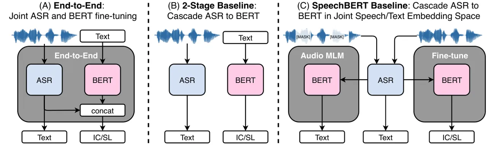

Figure 1: Our proposed semi-supervised E2E learning framework with ASR
and BERT for joint intent classification (IC) and slot labeling (SL)
directly from speech. (A) shows the E2E approach, in which E2E ASR and
BERT are trained jointly by predicting text and IC/SL. (B) shows the
2-stage baseline, where text and IC/SL are obtained successively. (C)
shows the SpeechBERT baseline, where BERT is adapted to take audio as
input by first pretraining with Audio MLM loss and then fine-tuning for
IC/SL. A separate ASR is still needed for (B) and (C).

##### Why do we want semi-supervised learning for SLU?

Neural networks benefit from large quantities of labeled training data,
and one could train SLU models end-to-end with them \[49, 19, 24, 54\].
However, curating labeled IC/SL data is expensive, and often time only a
limited amount of labels are disposable. Semi-supervised learning could
be a useful scenario for training SLU models for various domains whereby
model components are pretrained on large amounts of unlabeled data and
then fine-tuned with target semantic labels. Despite some work already
implemented this pretraining then fine-tuning scheme, they were limited
such that (1) models require a separate ASR or some form of "feedback"
from ASR, (2) models were designed to only predict intents without the
slot values, or (3) models did not take advantage of the generalization
capacity of self-supervised LMs, such as BERT, where we found to be
essential to obtain competitive results if limited semantics labels are
present. In contrast, our framework provides a clean and general
solution to the above limitations. Our semi-supervised framework is a
direct product of the self-supervised trend in speech and audio
processing which takes the form of: predictive objectives \[16, 13, 14,
17, 47, 11\], contrastive objectives \[43, 34, 3, 2, 1, 52, 40, 9, 30,
41, 38, 35\], grounded learnings \[51, 36, 18, 26, 25\], and
self-trainings \[28, 67, 8, 46, 31\]. Different from the above settings
is that this work does not concern with learning general representations
for several downstream tasks, nor does it rely on multiple modalities or
pseudo labeling techniques. Our focus is on designing a better learning
framework distinctly for semantics understanding under limited labels.

##### What’s wrong with the current SLU evaluation setting?

Two significant bottlenecks of deploying SLU models into production are
how prior work has evaluated them. First, SLU models were not trained
and evaluated for noise-robustness. For example, benchmarking datasets
ATIS and Fluent Speech Commands \[42\] are very clean; conversely, SLU
engines often operate under noises, such as environmental noises.
Secondly, given that not until recently SLU has been composed of
separately developed ASR and NLU components, there is little work on an
E2E evaluation criterion. Previous SL evaluation criterion does not
consider a naturally occurring scenario where ASR hypothesis and human
transcriptions have different lengths. Taking these into account, we
proposed noise augmentation training for SLU and the slot edit $`F_{1}`$
score.

Key contributions of this paper are summarized as follows:

- •
  We introduced a semi-supervised framework for semantics understanding
  directly from speech to alleviate: (1) the need for a large amount of
  in-house, homogenous data \[49, 19, 24, 54\] by pretrained components
  on transcribed speech (2) the limitation of only intent
  classification \[42, 29, 54\] by predicting text, slots, and
  intents. (3) any additional manipulation on labels or loss, such as
  label projection \[5\], output serialization \[58, 24, 22\], ASR
  n-best hypothesis, or asr-robust training losses \[29, 39\]. Figure 1
  illustrates our approach.
- •
  The framework is trained with explicit noise augmentation such that it
  is robust to environmental noises and is evaluated with the slot edit
  $`F_{1}`$ score for end-to-end semantics evaluation.
- •
  Our framework improves upon previous work in Word Error Rate (WER) and
  IC/SL F1, and even rivaled its NLU counterpart with oracle text
  input \[7\]. Experiments are conducted on public SLU corpora, ATIS,
  and SNIPS. We released the dataset used in this work.

|                    |                     |             |                 |     |            |                  |
| ------------------ | ------------------- | ----------- | --------------- | --- | ---------- | ---------------- |
| Model              | Modeling            |             |                 |     | Evaluation |                  |
|                    | Output              | Noise/Error | Semi-Supervised | E2E | E2E        | Noise Robustness |
| Proposed           |                     |             |                 |     |            |                  |
| End-to-End         | text, intent, slots | ✓           | ✓               | ✓   | ✓          | ✓                |
| Our Baselines      |                     |             |                 |     |            |                  |
| 2-Stage            | text, intent, slots | ✓           | ✓               | ✗   | ✓          | ✓                |
| SpeechBERT         | text, intent, slots | ✓           | ✓               | ✗   | ✓          | ✓                |
| Prior Work         |                     |             |                 |     |            |                  |
| \[54\]^(∗)         | intent only         | ✓           | ✗               | ✓   | ✗          | ✓                |
| \[42, 62, 10\]^(∗) | intent only         | ✗           | ✓               | ✓   | ✗          | ✗                |
| \[48\]^(∗)         | intent only         | ✗           | ✗               | ✓   | ✗          | ✗                |
| \[22\]             | text, intent, slots | ✓           | ✓               | ✓   | ✗          | ✗                |
| \[24\]             | text, intent, slots | ✗           | ✗               | ✓   | ✓          | ✗                |
| \[58\]             | text, intent, slots | ✗           | ✓               | ✓   | ✗          | ✗                |
| \[49\]             | text, intent, slots | ✗           | ✓               | ✓   | ✓          | ✗                |

Table 1: Comparison of our approaches with prior E2E SLU work. Work
indicated by a \* formulated SL as an intent detection task (See
Appendix A for details). Full summary table is in Appendix B.

## 2 Proposed Learning Framework

##### Problem Formulation

We now formulate the mapping from speech to semantics (IC/SL). Consider
some target SLU dataset
$`\mathcal{D}=\{\bm{A}^{(i)},\bm{W}^{(i)},\bm{S}^{(i)},\bm{I}^{(i)}\}_{i=1}^{M}`$
consisting of $`M`$ i.i.d. sequences, where
$`\bm{A}^{(i)},\bm{W}^{(i)},\bm{S}^{(i)}`$ are the audio, word and slots
sub-sequences respectively and $`\bm{I}^{(i)}`$ is their corresponding
intent label. Note that $`\bm{W}`$ and $`\bm{S}`$ are sub-sequences of
the same length, and $`\bm{I}`$ is a one hot vector. We are interested
in finding the model $`\theta_{SLU}^{*}`$ where,

```math
\theta_{SLU}^{*}=\underset{\theta}{\text{argmax}}\mathcal{L}_{SLU}(\theta_{SLU};\mathcal{D})=\underset{\theta}{\text{argmax}}\mathop{\mathbb{E}_{(\bm{A},\bm{W},\bm{S},\bm{I})\sim\mathcal{D}}}\Big[\ln P(\bm{W},\bm{S},\bm{I}\mid\bm{A};\theta_{SLU})\Big] \tag{1}
```

At test time, an input audio sequence $`\bm{a}=a_{1:T}`$ and the sets of
all possible word tokens $`\mathcal{W}`$, slots $`\mathcal{S}`$, and
intents $`\mathcal{I}`$ are given. We are then interested in decoding
for its target word sequence $`\bm{w}^{*}=w_{1:N}`$, its slots sequence
$`\bm{s}^{*}=s_{1:N}`$, and its intent label $`\bm{i}^{*}`$, where N is
the number of word/slots tokens. In the following subsections, we will
describe an end-to-end implementation of our framework and its two
baseline variants, depending on how $`\theta_{SLU}`$ is formalized³³ 3
We abuse some notations by representing models by their model
parameters, e.g. $`\theta_{ASR}`$ for the ASR model and
$`\theta_{BERT}`$ for BERT..

### 2.1 End-to-End: Joint E2E ASR and BERT Fine-Tuning.

To implement the end-to-end SLU model $`\theta_{SLU}`$, we take a
pretrained E2E ASR and a pretrained deep contextualized LM, such as
BERT, and jointly predict $`\bm{W}`$, $`\bm{S}`$ and $`\bm{I}`$ on
$`\mathcal{D}`$. In this case, the pretraining objectives are ASR
subword prediction for the ASR \[42, 58\] and Masked Language Modeling
(MLM) for BERT. During fine-tuning on $`\mathcal{D}`$, outputs from the
ASR and BERT are concatenated to predict $`\bm{S}`$ and $`\bm{I}`$ with
loss $`\mathcal{L}_{NLU}`$, while $`\bm{W}`$ is predicted with loss
$`\mathcal{L}_{ASR}`$. The main benefit this formulation brings is that
now $`\bm{S}`$ and $`\bm{I}`$ do not solely depend on an ASR top-1
hypothesis $`\bm{W}^{*}`$ during training, and the end-to-end
fine-tuning objective is thus,

```math
\mathcal{L}_{SLU}(\theta_{SLU};\mathcal{D})=\mathcal{L}_{ASR}(\theta_{SLU};\mathcal{D})+\mathcal{L}_{NLU}(\theta_{SLU};\mathcal{D}). \tag{2}
```

##### Model Building Blocks: E2E ASR and BERT

A visualization of the model building blocks is in Figure 2, where
$`\theta_{SLU}=\{\theta_{ASR},\theta_{BERT},\theta_{IC},\theta_{SL}\}`$.
$`\theta_{ASR}`$ is the model parameter for the E2E ASR. The choice of
E2E ASR over hybrid ASR here is due to later on, the whole SLU model can
backprop the errors from $`\bm{S}`$ and $`\bm{I}`$ through $`\bm{A}`$.
The ASR objective $`\mathcal{L}_{ASR}`$ is formulated to maximize
sequence-level log-likelihood,

```math
\mathcal{L}_{ASR}(\theta_{SLU};\mathcal{D})=\mathcal{L}_{ASR}(\theta_{ASR};\mathcal{D})=\mathop{\mathbb{E}_{(\bm{A},\bm{W})\sim\mathcal{D}}}\Big[\ln P(\bm{W}\mid\bm{A};\theta_{ASR})\Big] \tag{3}
```

#####

Contextualized LM plays a critical role in the context of semantics
understanding, and in this work, we opted to use BERT \[20\],
$`\theta_{BERT}`$, as the basis for jointly predicting $`\bm{S}`$ and
$`\bm{I}`$. Following \[7\], $`\bm{S}`$ is predicted via an additional
CRF/linear layer on top of BERT, and $`\bm{I}`$ is predicted on top of
the BERT output of the \[CLS\] token. The additional model parameters
for predicting SL and IC are $`\theta_{SL}`$ and $`\theta_{IC}`$,
respectively. Before writing down $`\mathcal{L}_{NLU}`$, we describe a
masking operation because ASR and BERT typically employ different
subword tokenization methods⁴⁴ 4 Alternatively, it may be possible to
pretrain ASR and BERT with the same tokenization method; yet, this
implies that one can not use the pretrained models already available..

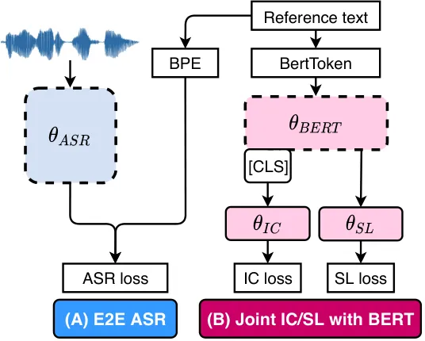

Figure 2: E2E ASR and BERT. Note that $`\theta_{ASR}`$ and
$`\theta_{BERT}`$ have different subword tokenizations: SentencePiece
(BPE) \[37\] and BertToken. Dotted shapes are pretrained.

```math
concat\Big((\stackrel{{\scriptstyle M^{a}}}{{\vbox{\hbox{ \hbox to26.01pt{\vbox to43.08pt{\pgfpicture\makeatletter\hbox{\hskip 0.2pt\lower-0.2pt\hbox to0.0pt{\lxSVG@begingroup@{_scopebegin=1} \lxSVG@begingroup@{stroke=#000000} \lxSVG@begingroup@{fill=#000000} \lxSVG@setlinewidth{\the\pgflinewidth}\lxSVG@begingroup@{stroke-width=0.4pt} \lx@inpgf@ignorespaces\nullfont\hbox to0.0pt{\lxSVG@begingroup@{_scopebegin=1} {{\lx@inpgf@ignorespaces}}
{}{{}}{}{}{
{}{}{}{}{
}{
}{
}{
}{
}{
}{
}{
}{
}{
}{}}\lxSVG@begingroup@{_scopebegin=1} \color[rgb]{0,0,0}\lxSVG@setlinewidth{\the\pgflinewidth}\lxSVG@begingroup@{stroke-width=0.4pt} \lx@inpgf@ignorespaces{}\lxSVG@fillstroke\lxSVG@drawpath@unclipped{M 0 0 M 0 0 L 35.43 0 M 0 11.81 L 35.43 11.81 M 0 23.62 L 35.43 23.62 M 0 35.43 L 35.43 35.43 M 0 47.24 L 35.43 47.24 M 0 59.05 L 35.43 59.05 M 0 0 L 0 59.06 M 11.81 0 L 11.81 59.06 M 23.62 0 L 23.62 59.06 M 35.43 0 L 35.43 59.06 M 35.43 59.06}{} \lx@inpgf@ignorespaces
\lxSVG@closescope {{}}{}{{}}{}
{}{{}}{}{}{}{}{{}}{}\lxSVG@begingroup@{_scopebegin=1} \lxSVG@begingroup@{fill=#0000FF} \lxSVG@begingroup@{stroke=#000000} \lxSVG@fill@opacity{0.5}\lxSVG@begingroup@{fill-opacity=0.5} {}\lxSVG@fillstroke\lxSVG@drawpath@unclipped{M 0 0 M 0 0 L 0 11.81 L 35.43 11.81 L 35.43 0 Z M 35.43 11.81}{} \lx@inpgf@ignorespaces
\lxSVG@closescope {{}}{}{{}}{}
{}{{}}{}{}{}{}{{}}{}\lxSVG@begingroup@{_scopebegin=1} \lxSVG@begingroup@{fill=#0000FF} \lxSVG@begingroup@{stroke=#000000} \lxSVG@fill@opacity{0.5}\lxSVG@begingroup@{fill-opacity=0.5} {}\lxSVG@fillstroke\lxSVG@drawpath@unclipped{M 0 23.62 M 0 23.62 L 0 35.43 L 35.43 35.43 L 35.43 23.62 Z M 35.43 35.43}{} \lx@inpgf@ignorespaces
\lxSVG@closescope {{}}{}{{}}{}
{}{{}}{}{}{}{}{{}}{}\lxSVG@begingroup@{_scopebegin=1} \lxSVG@begingroup@{fill=#0000FF} \lxSVG@begingroup@{stroke=#000000} \lxSVG@fill@opacity{0.5}\lxSVG@begingroup@{fill-opacity=0.5} {}\lxSVG@fillstroke\lxSVG@drawpath@unclipped{M 0 47.24 M 0 47.24 L 0 59.06 L 35.43 59.06 L 35.43 47.24 Z M 35.43 59.06}{} \lx@inpgf@ignorespaces
\lxSVG@closescope
\lxSVG@closescope {\lx@inpgf@ignorespaces}{\lx@inpgf@ignorespaces}{\lx@inpgf@ignorespaces}\hss}\lxSVG@discardpath\lxSVG@closescope \hss}}\lxSVG@closescope\endpgfpicture}}
}}}})^{T}\cdot\stackrel{{\scriptstyle H^{a}}}{{\vbox{\hbox{ \hbox to34.54pt{\vbox to43.08pt{\pgfpicture\makeatletter\hbox{\hskip 0.2pt\lower-0.2pt\hbox to0.0pt{\lxSVG@begingroup@{_scopebegin=1} \lxSVG@begingroup@{stroke=#000000} \lxSVG@begingroup@{fill=#000000} \lxSVG@setlinewidth{\the\pgflinewidth}\lxSVG@begingroup@{stroke-width=0.4pt} \lx@inpgf@ignorespaces\nullfont\hbox to0.0pt{\lxSVG@begingroup@{_scopebegin=1} {{\lx@inpgf@ignorespaces}}
{}{{}}{}{}{
{}{}{}{}{
}{
}{
}{
}{
}{
}{
}{
}{
}{
}{
}{}}\lxSVG@begingroup@{_scopebegin=1} \color[rgb]{0,0,0}\lxSVG@setlinewidth{\the\pgflinewidth}\lxSVG@begingroup@{stroke-width=0.4pt} \lx@inpgf@ignorespaces{}\lxSVG@fillstroke\lxSVG@drawpath@unclipped{M 0 0 M 0 0 L 47.24 0 M 0 11.81 L 47.24 11.81 M 0 23.62 L 47.24 23.62 M 0 35.43 L 47.24 35.43 M 0 47.24 L 47.24 47.24 M 0 59.05 L 47.24 59.05 M 0 0 L 0 59.06 M 11.81 0 L 11.81 59.06 M 23.62 0 L 23.62 59.06 M 35.43 0 L 35.43 59.06 M 47.24 0 L 47.24 59.06 M 47.24 59.06}{} \lx@inpgf@ignorespaces
\lxSVG@closescope {{}}{}{{}}{}
{}{{}}{}{}{}{}{{}}{}\lxSVG@begingroup@{_scopebegin=1} \lxSVG@begingroup@{fill=#808080} {}\lxSVG@fillstroke\lxSVG@drawpath@unclipped{M 0 0 M 0 0 L 0 0 L 0 0 L 0 0 Z M 0 0}{} \lx@inpgf@ignorespaces
\lxSVG@closescope
\lxSVG@closescope {\lx@inpgf@ignorespaces}{\lx@inpgf@ignorespaces}{\lx@inpgf@ignorespaces}\hss}\lxSVG@discardpath\lxSVG@closescope \hss}}\lxSVG@closescope\endpgfpicture}}
}}}}+(\stackrel{{\scriptstyle M^{b}}}{{\vbox{\hbox{ \hbox to26.01pt{\vbox to34.54pt{\pgfpicture\makeatletter\hbox{\hskip 0.2pt\lower-0.2pt\hbox to0.0pt{\lxSVG@begingroup@{_scopebegin=1} \lxSVG@begingroup@{stroke=#000000} \lxSVG@begingroup@{fill=#000000} \lxSVG@setlinewidth{\the\pgflinewidth}\lxSVG@begingroup@{stroke-width=0.4pt} \lx@inpgf@ignorespaces\nullfont\hbox to0.0pt{\lxSVG@begingroup@{_scopebegin=1} {{\lx@inpgf@ignorespaces}}
{}{{}}{}{}{
{}{}{}{}{
}{
}{
}{
}{
}{
}{
}{
}{
}{}}\lxSVG@begingroup@{_scopebegin=1} \color[rgb]{0,0,0}\lxSVG@setlinewidth{\the\pgflinewidth}\lxSVG@begingroup@{stroke-width=0.4pt} \lx@inpgf@ignorespaces{}\lxSVG@fillstroke\lxSVG@drawpath@unclipped{M 0 0 M 0 0 L 35.43 0 M 0 11.81 L 35.43 11.81 M 0 23.62 L 35.43 23.62 M 0 35.43 L 35.43 35.43 M 0 47.24 L 35.43 47.24 M 0 0 L 0 47.24 M 11.81 0 L 11.81 47.24 M 23.62 0 L 23.62 47.24 M 35.43 0 L 35.43 47.24 M 35.43 47.24}{} \lx@inpgf@ignorespaces
\lxSVG@closescope {{}}{}{{}}{}
{}{{}}{}{}{}{}{{}}{}\lxSVG@begingroup@{_scopebegin=1} \lxSVG@begingroup@{fill=#FF0000} \lxSVG@begingroup@{stroke=#000000} \lxSVG@fill@opacity{0.5}\lxSVG@begingroup@{fill-opacity=0.5} {}\lxSVG@fillstroke\lxSVG@drawpath@unclipped{M 0 0 M 0 0 L 0 11.81 L 35.43 11.81 L 35.43 0 Z M 35.43 11.81}{} \lx@inpgf@ignorespaces
\lxSVG@closescope {{}}{}{{}}{}
{}{{}}{}{}{}{}{{}}{}\lxSVG@begingroup@{_scopebegin=1} \lxSVG@begingroup@{fill=#FF0000} \lxSVG@begingroup@{stroke=#000000} \lxSVG@fill@opacity{0.5}\lxSVG@begingroup@{fill-opacity=0.5} {}\lxSVG@fillstroke\lxSVG@drawpath@unclipped{M 0 11.81 M 0 11.81 L 0 23.62 L 35.43 23.62 L 35.43 11.81 Z M 35.43 23.62}{} \lx@inpgf@ignorespaces
\lxSVG@closescope {{}}{}{{}}{}
{}{{}}{}{}{}{}{{}}{}\lxSVG@begingroup@{_scopebegin=1} \lxSVG@begingroup@{fill=#FF0000} \lxSVG@begingroup@{stroke=#000000} \lxSVG@fill@opacity{0.5}\lxSVG@begingroup@{fill-opacity=0.5} {}\lxSVG@fillstroke\lxSVG@drawpath@unclipped{M 0 35.43 M 0 35.43 L 0 47.24 L 35.43 47.24 L 35.43 35.43 Z M 35.43 47.24}{} \lx@inpgf@ignorespaces
\lxSVG@closescope
\lxSVG@closescope {\lx@inpgf@ignorespaces}{\lx@inpgf@ignorespaces}{\lx@inpgf@ignorespaces}\hss}\lxSVG@discardpath\lxSVG@closescope \hss}}\lxSVG@closescope\endpgfpicture}}
}}}})^{T}\cdot\stackrel{{\scriptstyle H^{b}}}{{\vbox{\hbox{ \hbox to51.62pt{\vbox to34.54pt{\pgfpicture\makeatletter\hbox{\hskip 0.2pt\lower-0.2pt\hbox to0.0pt{\lxSVG@begingroup@{_scopebegin=1} \lxSVG@begingroup@{stroke=#000000} \lxSVG@begingroup@{fill=#000000} \lxSVG@setlinewidth{\the\pgflinewidth}\lxSVG@begingroup@{stroke-width=0.4pt} \lx@inpgf@ignorespaces\nullfont\hbox to0.0pt{\lxSVG@begingroup@{_scopebegin=1} {{\lx@inpgf@ignorespaces}}
{}{{}}{}{}{
{}{}{}{}{
}{
}{
}{
}{
}{
}{
}{
}{
}{
}{
}{
}{}}\lxSVG@begingroup@{_scopebegin=1} \color[rgb]{0,0,0}\lxSVG@setlinewidth{\the\pgflinewidth}\lxSVG@begingroup@{stroke-width=0.4pt} \lx@inpgf@ignorespaces{}\lxSVG@fillstroke\lxSVG@drawpath@unclipped{M 0 0 M 0 0 L 70.87 0 M 0 11.81 L 70.87 11.81 M 0 23.62 L 70.87 23.62 M 0 35.43 L 70.87 35.43 M 0 47.24 L 70.87 47.24 M 0 0 L 0 47.24 M 11.81 0 L 11.81 47.24 M 23.62 0 L 23.62 47.24 M 35.43 0 L 35.43 47.24 M 47.24 0 L 47.24 47.24 M 59.06 0 L 59.06 47.24 M 70.86 0 L 70.86 47.24 M 70.87 47.24}{} \lx@inpgf@ignorespaces
\lxSVG@closescope {{}}{}{{}}{}
{}{{}}{}{}{}{}{{}}{}\lxSVG@begingroup@{_scopebegin=1} \lxSVG@begingroup@{fill=#808080} {}\lxSVG@fillstroke\lxSVG@drawpath@unclipped{M 0 0 M 0 0 L 0 0 L 0 0 L 0 0 Z M 0 0}{} \lx@inpgf@ignorespaces
\lxSVG@closescope
\lxSVG@closescope {\lx@inpgf@ignorespaces}{\lx@inpgf@ignorespaces}{\lx@inpgf@ignorespaces}\hss}\lxSVG@discardpath\lxSVG@closescope \hss}}\lxSVG@closescope\endpgfpicture}}
}}}}\Big)=\stackrel{{\scriptstyle H^{cat}}}{{\vbox{\hbox{ \hbox to85.76pt{\vbox to26.01pt{\pgfpicture\makeatletter\hbox{\hskip 0.2pt\lower-0.2pt\hbox to0.0pt{\lxSVG@begingroup@{_scopebegin=1} \lxSVG@begingroup@{stroke=#000000} \lxSVG@begingroup@{fill=#000000} \lxSVG@setlinewidth{\the\pgflinewidth}\lxSVG@begingroup@{stroke-width=0.4pt} \lx@inpgf@ignorespaces\nullfont\hbox to0.0pt{\lxSVG@begingroup@{_scopebegin=1} {{\lx@inpgf@ignorespaces}}
{}{{}}{}{}{
{}{}{}{}{
}{
}{
}{
}{
}{
}{
}{
}{
}{
}{
}{
}{
}{
}{
}{}}\lxSVG@begingroup@{_scopebegin=1} \color[rgb]{0,0,0}\lxSVG@setlinewidth{\the\pgflinewidth}\lxSVG@begingroup@{stroke-width=0.4pt} \lx@inpgf@ignorespaces{}\lxSVG@fillstroke\lxSVG@drawpath@unclipped{M 0 0 M 0 0 L 118.11 0 M 0 11.81 L 118.11 11.81 M 0 23.62 L 118.11 23.62 M 0 35.43 L 118.11 35.43 M 0 0 L 0 35.43 M 11.81 0 L 11.81 35.43 M 23.62 0 L 23.62 35.43 M 35.43 0 L 35.43 35.43 M 47.24 0 L 47.24 35.43 M 59.06 0 L 59.06 35.43 M 70.87 0 L 70.87 35.43 M 82.68 0 L 82.68 35.43 M 94.49 0 L 94.49 35.43 M 106.3 0 L 106.3 35.43 M 118.11 0 L 118.11 35.43 M 118.11 35.43}{} \lx@inpgf@ignorespaces
\lxSVG@closescope {{}}{}{{}}{}
{}{{}}{}{}{}{}{{}}{}\lxSVG@begingroup@{_scopebegin=1} \lxSVG@begingroup@{fill=#0000FF} \lxSVG@begingroup@{stroke=#000000} \lxSVG@fill@opacity{0.5}\lxSVG@begingroup@{fill-opacity=0.5} {}\lxSVG@fillstroke\lxSVG@drawpath@unclipped{M 0 0 M 0 0 L 0 35.43 L 47.24 35.43 L 47.24 0 Z M 47.24 35.43}{} \lx@inpgf@ignorespaces
\lxSVG@closescope {{}}{}{{}}{}
{}{{}}{}{}{}{}{{}}{}\lxSVG@begingroup@{_scopebegin=1} \lxSVG@begingroup@{fill=#FF0000} \lxSVG@begingroup@{stroke=#000000} \lxSVG@fill@opacity{0.5}\lxSVG@begingroup@{fill-opacity=0.5} {}\lxSVG@fillstroke\lxSVG@drawpath@unclipped{M 47.24 0 M 47.24 0 L 47.24 35.43 L 118.11 35.43 L 118.11 0 Z M 118.11 35.43}{} \lx@inpgf@ignorespaces
\lxSVG@closescope
\lxSVG@closescope {\lx@inpgf@ignorespaces}{\lx@inpgf@ignorespaces}{\lx@inpgf@ignorespaces}\hss}\lxSVG@discardpath\lxSVG@closescope \hss}}\lxSVG@closescope\endpgfpicture}}
}}}} \tag{4}
```

##### Differentiate Through Subword Tokenizations

To concatenate $`\theta_{ASR}`$ and $`\theta_{BERT}`$ outputs along the
hidden dimension, we need to make sure they have the same length along
the token dimension⁵⁵ 5 Here, we opted for the more straightforward
operation possible. There are other more sophisticated solutions, such
as attention mechanisms to align the two outputs, or gumbel softmax to
backprop through the tokenizations.. We stored the first indices where
$`\bm{W}`$ are broken down into subword tokens into a matrix:
$`M^{a}\in{\rm I\!R}^{N^{a}\times N}`$ for $`\theta_{ASR}`$ and
$`M^{b}\in{\rm I\!R}^{N^{b}\times N}`$ for $`\theta_{BERT}`$, where
$`N`$ be the number of tokens for $`\bm{W}`$ and $`\bm{S}`$, $`N^{a}`$
be the number of ASR subword tokens, and $`N^{b}`$ for BERT. Let
$`H^{a}`$ be the $`\theta_{ASR}`$ output matrix before softmax, and
similarly $`H^{b}`$ for $`\theta_{BERT}`$. The concatenated matrix
$`H^{cat}\in{\rm I\!R}^{N\times(512+768)}`$ is given as
$`H^{cat}=\text{concat}(\left[(M^{a})^{T}H^{a},(M^{b})^{T}H^{b}\right],\text{dim=1})`$,
where $`512`$ and $`768`$ are hidden dimensions for $`\theta_{ASR}`$ and
$`\theta_{BERT}`$. A visualization of this process is Eq. 4. We are now
ready to describe $`\mathcal{L}_{NLU}`$:

```math
\displaystyle\mathcal{L}_{NLU}(\theta_{SLU};\mathcal{D}) \displaystyle=\mathop{\mathbb{E}}\Big[\ln P(\bm{S}\mid H^{cat};\theta_{SL})+\ln P(\bm{I}\mid H^{cat};\theta_{IC}),\Big] \tag{5}
```

where sum of cross entropy losses for IC and SL are maximized, and
$`\theta_{ASR}`$ and $`\theta_{BERT}`$ are updated through $`H^{cat}`$.
Note here that ground truth $`\bm{W}`$ is used instead of $`\bm{W}^{*}`$
due to teacher forcing.

##### Inference

Having obtained $`\theta_{SLU}^{*}`$ and given an audio sequence
$`\bm{a}`$, the decoding procedure is,

```math
\bm{w}^{*}=\underset{w_{n}\in\mathcal{W}}{\text{argmax}}\prod_{n=1}^{N}p(w_{n}\mid w_{n-1:n-e},\bm{a};\theta_{SLU}^{*}), \tag{6}
```

```math
\bm{i}^{*},\bm{s}^{*}=\underset{i\in\mathcal{I}}{\text{argmax }}p(i\mid\bm{w}^{*},\bm{a};\theta_{SLU}^{*}),\underset{s_{n}\in\mathcal{S}}{\text{argmax}}\prod_{n=1}^{N}p(s_{n}\mid\bm{w}^{*},\bm{a};\theta_{SLU}^{*}) \tag{7}
```

This two step decoding procedure, first $`\bm{w}^{*}`$ then
$`(\bm{i}^{*},\bm{s}^{*})`$ is necessary for our framework even if it is
trained end-to-end, given that no explicit serialization on $`\bm{W}`$
and $`\bm{S}`$ are imposed, like \[58, 24\]. $`\bm{w}^{*}`$ decoding has
$`w_{n-1:n-e}`$ since there can be an optional $`(e+1)`$-gram LM, though
we did not find it helpful and omitted it in the experiments; while
decoding for $`(\bm{i}^{*},\bm{s}^{*})`$, additional input $`\bm{a}`$ is
given and we have $`\bm{w}^{*}`$ given the context from self-attention
in BERT. Note that here and throughout the work, we only take top-1
hypothesis $`\bm{w}^{*}`$ (instead of top-N) to decode for
$`(\bm{i}^{*},\bm{s}^{*})`$.

### 2.2 Baselines

Two slight variations, 2-stage and SpeechBERT, for constructing
$`\theta_{SLU}`$ are presented (refer to Figure 1 for illustration).
They will be the baselines for the end-to-end approach.

#### 2.2.1 2-Stage: Cascading ASR Outputs to BERT

A natural baseline to the end-to-end approach is separately pretrain and
fine-tune $`\theta_{ASR}`$ and $`\theta_{BERT}`$, and during inference,
cascade the top-1 ASR hypothesis $`\bm{W}^{*}`$ as input to BERT.

#### 2.2.2 SpeechBERT: BERT in Joint Speech-Text Embedding Space

Another sensible way to construct $`\theta_{SLU}`$ is to somehow "adapt"
the BERT model such that it can take audio has inputs and outputs IC/SL,
while not compromising its original semantics learning capacity.
SpeechBERT \[12\] was initially proposed for Spoken Question Answering
(SQA), but we found the core idea of training BERT with audio-text pairs
fitting as another baseline for our end-to-end approach. Three steps are
involved in predicting semantics from speech with SpeechBERT. First,
align audio segments to word tokens with a segmentation function
$`F_{seg}(\bm{a}):w_{n}\leftrightarrow\bm{a}_{u:v}`$, where a word token
$`w_{n}`$ is mapped to an audio segment $`\bm{a}_{u:v}`$ of the audio
sequence $`\bm{a}`$. Although there is a line of work on unsupervised
audio-text alignment, for example \[15, 32\], we opted to use force
alignment as $`F_{seg}`$. The quality of $`F_{seg}`$’s audio segment
boundaries is vital, as it creates the input/output pairs for
SpeechBERT’s pretraining and fine-tuning. Figure 3 illustrates the
audio-text and audio-IC/SL pairs for SpeechBERT.

##### Pretraining: Mapping Audio Segments to Text

SpeechBERT is pretrained with Audio MLM on a separate dataset where
paired audio-text pairs are available but not semantics labels. Audio
MLM is similar to MLM in BERT \[20\], but with audio segments
$`\bm{a}_{u:v}`$ as input and word token $`w_{n}`$ as the target.
Similar to MLM’s dynamic masking policy \[20\], parts of the audio
segments are masked during training. An audio segment summarizer is
needed to produce a single vector to represent variable-length audio
segments, and following \[12\], we implemented it with an
encoder-decoder LSTM. This pretraining step gradually adapts a
pretrained BERT to a phonetic-semantic joint embedding space. As before,
we define
$`\theta_{SLU}=\{\theta_{ASR},\theta_{BERT},\theta_{IC},\theta_{SL}\}`$.
Unlike the end-to-end approach, though, $`\theta_{ASR}`$ is kept frozen
throughout the SpeechBERT pretraining and fine-tuning phases. Finally,
note that as in Figure 1, we make $`\bm{a}`$ to be the last hidden
output from $`\theta_{ASR}`$ as opposed to MFCCs, as the original work
was aimed at single speaker SQA.

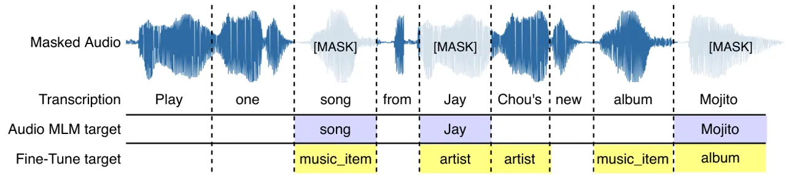

Figure 3: Illustration of SpeechBERT Audio MLM and IC/SL fine-tuning
setup.

##### Fine-tuning: Mapping Audio Segments to IC/SL

The fine-tuning step is similar to Eq. 5, but $`\theta_{ASR}^{*}`$ is
frozen and $`F_{seg}`$ and $`\bm{W}`$ are needed to align audio segments
to their IC/SL:

```math
\mathcal{L}_{NLU}(\theta_{SLU};\mathcal{D})=\mathop{\mathbb{E}}\Big[\ln P(\bm{S}\mid\bm{A},\bm{W},F_{seg};\theta_{ASR}^{*},\theta_{BERT},\theta_{SL})\\
+\ln P(\bm{I}\mid\bm{A},\bm{W},F_{seg};\theta_{ASR}^{*},\theta_{BERT},\theta_{IC}),\Big] \tag{8}
```

## 3 Experimental Setup

##### Datasets

Experiments are done on ATIS and SNIPS since their recordings are
considerably smaller than those in-house SLU data used in \[49, 19, 24,
54\]. ATIS \[27\] contains 8hr of audio recordings of people making
flight reservations with corresponding human transcripts. A total of
5.2k utterances with more than 600 speakers are present. SNIPS is
another popular dataset (10.5hr), and given that the original training
audio data was not released \[19\], we used a commercial TTS service⁶⁶ 6
Synthesized audios can potentially make pronunciation errors on proper
nouns or technical terms that are probably out-of-vocabulary, inducing
another error source in SLU modeling. to synthesize audio from text
data, similar to \[29\]. Different from \[29\], we synthesized SNIPS
audio with 15 speakers, which we refer to as SNIPS-Multi⁷⁷ 7
[https://github.com/aws-samples/aws-lex-noisy-spoken-language-understanding](https://github.com/aws-samples/aws-lex-noisy-spoken-language-understanding).
Audios in ATIS and SNIPS-Multi are sampled at 16kHz. For the unlabeled
data, we selected Librispeech 960hr (LS-960) \[44\] and MS-SNSD
(2.8hr) \[50\]. Besides the clean ATIS and SNIPS-Multi, models are
evaluated on their noisy partition (augmented with MS-SNSD). We made
sure the noisy train and test splits in MS-SNSD do not overlap. Lastly,
while transcriptions are provided in ATIS and SNIPS, they are not
normalized for ASR. Text normalization is applied with an open-source
software⁸⁸ 8
[https://github.com/EFord36/normalise](https://github.com/EFord36/normalise).
For ATIS, utterances are ignored if they contain words with multiple
slot labels \[59\]. The full details of our dataset statistics are in
Appendix E.

##### Hyperparameters and Compute Budget

All speech is represented as sequences of 83-dimensional Mel-scale
filter bank with pitch, computed every 10ms. Global mean normalization
is applied. E2E ASR is implemented in ESPnet \[65\], where it has 12
Transformer encoder layers and 6 decoder layers. The choice of the
Transformer architecture \[60\] is due to its empirical successes
in \[33\] and concurrent SLU work \[48\]. The E2E ASR is trained with
hybrid CTC/attention loss \[64\] (CTC weight is 0.3, attention weight is
0.7) with label smoothing. During ASR decoding, the beam size is set to
5 throughout this work, with scores from CTC, attention decoder, and an
RNN-LM. SpecAugment \[45\] is used by default for data augmentation.
SentencePiece (BPE) vocabulary size is set to 1k for ATIS and
SNIPS-Multi. Model is optimized with noam \[60\] and trained until
convergence. BERT is a bert-base-uncased from HuggingFace \[66\]. All
experiments were done on a single Nvidia V100. Training took a few hours
to complete for our ASR and SLU models. For NLU (jointBERT \[7\]),
training takes a few minutes.

### 3.1 E2E Evaluation with Slots Edit $`F_{1}`$ score.

Our framework is evaluated with an end-to-end evaluation metric, termed
the slots edit $`F_{1}`$. Unlike slots $`F_{1}`$ score, slots edit
$`F_{1}`$ accounts for instances where predicted sequences have
different lengths as the ground truth. To calculate the score, we first
aligned the predicted text and oracle text. For each slot label
$`v\in\mathcal{V}`$, where $`\mathcal{V}`$ is the set of all possible
slot labels except for the "O" tag, we calculate the insertion (false
positive, FP), deletion (false negative, FN), and substitution (FN and
FP) of its slots value. Slots edit $`F_{1}`$ is the harmonic mean of
precision and recall over all slots:

```math
\text{slots edit }F_{1}=\frac{\sum_{v\in\mathcal{V}}2\times\text{TP}_{v}}{\sum_{v\in\mathcal{V}}\Big[(2\times\text{TP}_{v})+\text{FP}_{v}+\text{FN}_{v}\Big]} \tag{9}
```

We notice that there were only two prior works evaluated their models
with E2E evaluation criteria \[49, 24\]. Although slots edit $`F_{1}`$
is not perfect⁹⁹ 9 Slots edit $`F_{1}`$ score double-penalizes
substitution errors, or English phrases that contains multiple words.,
we encourage readers to look at Table 6 in the Appendix for why these
E2E evaluations are needed.

### 3.2 Two-Stage Fine-tuning

The default training method for our end-to-end approach is to first
pretrain the ASR component on LS-960 (noted as
$`\mathcal{{\widetilde{D}}}`$) before fine-tuning the whole model
$`\theta_{SLU}`$ on the target SLU corpus $`\mathcal{D}`$. An
observation from the experiment was that ASR is harder than IC/SL. See
Figure 8(b) in the Appendix for reference, where IC/SL losses converge
much faster than ASR loss. Therefore, alternatively, we train the
end-to-end approach in two-stage: pretrain ASR, then fine-tune ASR on
$`\mathcal{D}`$, and finally jointly fine-tune for ASR and IC/SL on
$`\mathcal{D}`$:
$`\mathcal{L}_{ASR}(\theta_{ASR};\mathcal{{\widetilde{D}}})\longrightarrow\mathcal{L}_{ASR}(\theta_{ASR};\mathcal{D})\longrightarrow\mathcal{L}_{SLU}(\theta_{SLU};\mathcal{D}).`$

### 3.3 Main Results on Clean and Noisy SLU

We benchmarked our proposed framework with several prior works on ATIS
and SNIPS, and Table 2 presents their WER, slots edit F1 and intent F1
results. All experimental results were averaged over at least three
trials with random seeds. JointBERT \[7\] is our NLU baseline, where
BERT is jointly fine-tuned for IC/SL, and it gets around 95% slots edit
$`F_{1}`$ and over 98% IC F1. Since JointBERT has access to the oracle
text, this is the upper bound to our SLU models with speech as input.
CLM-BERT \[5\] explored using in-house conversational LM for NLU. We
replicated \[58\], where an E2E ASR (Listen, Attend and Spell \[6\])
directly predicts interleaving word and slots tokens (serialized
output), and optimized with CTC over words and slots. We also
experimented with replacing E2E ASR with a Kaldi hybrid ASR.

#####

Table 2 presents results on clean test data. Both our proposed
end-to-end and baselines approach surpassed prior SLU work in terms of
WER, slots edit $`F_{1}`$, and intent F1. We did not compare to E2E SLU
work if SL is not modeled, see Table 1. We hypothesize the performance
gain originates from our choices of (1) adopting pretrained E2E ASR and
self-supervised LM like BERT, (2) applying text-norm on target
transcriptions for training the ASR, and (3) joint fine-tuning text and
IC/SL.

#####

To quantify model robustness under noisy settings, we augmented ATIS and
SNIP-Multi with environmental noise from MS-SNSD, which is a common
scenario where users utter their spoken commands. The incentive here is
how ’noise’ was abused in some SLU literature, where ASR errors were
treated as the noise source instead of modeling error, see \[29, 61\].
Results on noisy test reveal that those work well on ATIS or SNIPS may
break under realistic noises. Although our models are trained with
SpecAugment \[45\], there is still a 5% and 10% relative drop on ATIS
and SNIPS for the E2E approach, and a 4-27% drops for the baselines.
This consequence directly motivated Section 3.4.

|                                   |                |            |                                                                                                                                                        |                  |            |                      |                  |
| --------------------------------- | -------------- | ---------- | ------------------------------------------------------------------------------------------------------------------------------------------------------ | ---------------- | ---------- | -------------------- | ---------------- |
| Frameworks                        | Unlabelled     | clean test |                                                                                                                                                        |                  | noisy test |                      |                  |
|                                   | Semantics Data | WER        | slots edit $`F_{1}`$                                                                                                                                   | intent $`F_{1}`$ | WER        | slots edit $`F_{1}`$ | intent $`F_{1}`$ |
| ATIS with Oracle Text             |                |            |                                                                                                                                                        |                  |            |                      |                  |
| JointBERT \[7\]                   |                | \-         | 95.64                                                                                                                                                  | 98.99            | \-         | \-                   | \-               |
| Proposed E2E on ATIS              |                |            |                                                                                                                                                        |                  |            |                      |                  |
| End-to-End w/ two-stage fine-tune | LS-960         | 2.18       | 95.88                                                                                                                                                  | 97.26            | 9.62       | 91.54                | 96.14            |
| Proposed Baseline on ATIS         |                |            |                                                                                                                                                        |                  |            |                      |                  |
| 2-Stage Baseline                  | LS-960         | 1.38       | 93.69                                                                                                                                                  | 97.01            | 8.98       | 90.09                | 95.74            |
| SpeechBERT Baseline               | LS-960         | 1.4        | 92.36                                                                                                                                                  | 97.4             | 9.0        | 81.72                | 94.05            |
| Prior Work on ATIS                |                |            |                                                                                                                                                        |                  |            |                      |                  |
| ASR-Robust Embed \[29\]           | WSJ            | 15.55      | \-                                                                                                                                                     | 95.65            | \-         | \-                   | \-               |
| Kaldi Hybrid ASR+BERT             | LS-960         | 13.31      | 85.13                                                                                                                                                  | 94.56            | 44.72      | 69.55                | 88.94            |
| ASR+CLM-BERT \[5\]                | in-house       | 18.4.      | 93.8¹⁰¹⁰ 10 For ASR+CLM-BERT \[5\], model predictions are evaluated only if its ASR hypothesis and human transcription have the same number of tokens. | 97.1             | \-         | \-                   | \-               |
| LAS+CTC \[58\]                    | LS-460         | 8.32       | 86.85                                                                                                                                                  | \-               | \-         | \-                   | \-               |
| SNIPS with Oracle Text            |                |            |                                                                                                                                                        |                  |            |                      |                  |
| JointBERT \[7\]                   |                | \-         | 94.71                                                                                                                                                  | 98.43            | \-         | \-                   | \-               |
| Proposed E2E on SNIPS             |                |            |                                                                                                                                                        |                  |            |                      |                  |
| End-to-End w/ two-stage fine-tune | LS-960         | 11.86      | 83.41                                                                                                                                                  | 98.65            | 20.9       | 74.22                | 95.90            |
| Proposed Baseline on SNIPS        |                |            |                                                                                                                                                        |                  |            |                      |                  |
| 2-Stage Baseline                  | LS-960         | 11.87      | 81.51                                                                                                                                                  | 98.18            | 21.2       | 72.39                | 95.59            |
| Prior Work on SNIPS               |                |            |                                                                                                                                                        |                  |            |                      |                  |
| ASR-Robust Embed \[29\]           | WSJ            | 45.56      | \-                                                                                                                                                     | 89.55            | \-         | \-                   | \-               |
| Kaldi Hybrid ASR+BERT             | LS-960         | 30.89      | 68.35                                                                                                                                                  | 94.76            | 52.28      | 49.46                | 76.98            |
| ASR+CLM-BERT \[5\]                | in-house       | 16.2       | 89.3                                                                                                                                                   | 98.6             | \-         | \-                   | \-               |

Table 2: WER, slots edit $`F_{1}`$ and intent $`F_{1}`$ on ATIS and
SNIPS-Multi (clean test). Models use Librispeech 960h (LS-960) and
MS-SNSD as additional unlabeled training data. ATIS and SNIPS-Multi are
augmented with real environmental noises (noisy test) to evaluate model
noise-robustness. We compared our proposed end-to-end and baseline
approaches with prior SLU work and the NLU counterpart, where oracle
text is assumed. Results indicate that our semi-supervised framework is
effective in data scarcity setting, exceeding prior work in WER and
IC/SL while approaching the NLU upper bound.

### 3.4 Environmental Noise Augmentation

To further improve the noise-robustness of our learning framework, we
augment our framework training with MS-SNSD. Although there is much work
on E2E speech enhancement \[57\], we found that merely augmenting the
training data with a diverse set of environmental noises works well. We
followed the noise augmentation protocol described in \[50\], where for
each training sample, five noise files are randomly sampled and added to
the clean file with SNR levels of $`[0,10,20,30,40]`$dB, resulting in a
five-fold data augmentation. Table 3 shows our proposed models trained
with noise augmentation. We first observe that compared to Table 2, now
there is a minimal performance drop when these noises are present (noisy
test). On ATIS, our E2E approach reaches 95.46% for SL and 97.4% for IC,
which is merely a 1-2% drop from the clean test data. Compared to models
trained without noises, there is a 4% SL improvement over its clean
counterpart, and almost 40% improvement over Kaldi’s hybrid ASR. We also
observe that on ATIS, the E2E model now performs on par with the NLU
model with oracle text as input. On SNIPS, a similar trend is observed,
despite there is still a large gap between our SLU models and their NLU
upper bound. The 13% WER could explain the performance gap on SNIP (c.f.
2% on ATIS), which motivated our next modification.

|                                   |            |                      |                  |     |            |                      |                  |
| --------------------------------- | ---------- | -------------------- | ---------------- | --- | ---------- | -------------------- | ---------------- |
| Frameworks                        | clean test |                      |                  |     | noisy test |                      |                  |
|                                   | WER        | slots edit $`F_{1}`$ | intent $`F_{1}`$ |     | WER        | slots edit $`F_{1}`$ | intent $`F_{1}`$ |
| ATIS with Oracle Text             |            |                      |                  |     |            |                      |                  |
| JointBERT \[7\]                   | \-         | 95.64                | 98.99            |     | \-         | \-                   | \-               |
| Proposed on ATIS w/ Noise Aug.    |            |                      |                  |     |            |                      |                  |
| End-to-End w/ two-stage fine-tune | 2.13       | 96.38                | 97.65            |     | 3.6        | 95.46                | 97.40            |
| 2-Stage Baseline                  | 1.73       | 93.41                | 96.79            |     | 3.5        | 92.52                | 96.49            |
| SpeechBERT Baseline               | 1.8        | 92.66                | 96.91            |     | 3.6        | 88.7                 | 96.15            |
| SNIPS with Oracle Text            |            |                      |                  |     |            |                      |                  |
| JointBERT \[7\]                   | \-         | 94.71                | 98.43            |     | \-         | \-                   | \-               |
| Proposed on SNIPS w/ Noise Aug.   |            |                      |                  |     |            |                      |                  |
| End-to-End w/ two-stage fine-tune | 13.5       | 82.12                | 98.28            |     | 15.3       | 80.02                | 97.90            |
| 2-Stage Baseline                  | 13.37      | 79.65                | 97.82            |     | 15.23      | 77.58                | 97.59            |

Table 3: Noise augmentation reduces model degradation when environmental
noises are present.

### 3.5 Recovering Domain-Specific Words via Knowledge-Base (KB) Refinement

Another observation in our experiments was that many domain-specific
words are hard to predict perfectly even for humans. For example, in
SNIPS, there is an extensive list of artists and album names. A
refinement step is further added after text $`\bm{w}^{*}`$ and slot
$`\bm{s}^{*}`$ sequences are decoded to "correct" the wrongly decoded
words by replacing them with the closest matched words from the target
corpus. First, for each slot $`s^{*}`$, we construct a knowledge-base
$`\text{KB}_{s^{*}}`$ that contains all words $`s^{*}`$ matched in
$`\mathcal{D}`$. Then, for each predicted pair ($`w^{*}`$, $`s^{*}`$),
$`w^{*}`$ is replaced with $`w^{*}_{r}`$ from $`\text{KB}_{s^{*}}`$ that
has the highest embedding similarity with $`w^{*}`$. Embeddings are
retrieved from a pretrained BERT. Succinctly,

```math
(w^{*},s^{*})\longrightarrow(w^{*}_{r}=\underset{m\in\text{KB}_{s^{*}}}{\text{argmax }}dot\Big(\text{BERT}(w_{*}),\text{BERT}(m)\Big),s^{*}) \tag{10}
```

#####

Table 4 shows the effectiveness of KB refinement on SNIPS, where
although the WER remained the same, slots edit $`F_{1}`$ greatly
improved. Our E2E approach now reaches 90% on SL, less than 5% from the
NLU upper bound and around a 9% improvement over the E2E baseline.
Theoretically, we could have an iterative refinement process and
potentially reach even higher $`F_{1}`$ scores.

|                                    |            |                      |                  |     |            |                      |                  |
| ---------------------------------- | ---------- | -------------------- | ---------------- | --- | ---------- | -------------------- | ---------------- |
| Frameworks                         | clean test |                      |                  |     | noisy test |                      |                  |
|                                    | WER        | slots edit $`F_{1}`$ | intent $`F_{1}`$ |     | WER        | slots edit $`F_{1}`$ | intent $`F_{1}`$ |
| Proposed on SNIPS w/ KB refinement |            |                      |                  |     |            |                      |                  |
| End-to-End w/ two-stage fine-tune  | 11.86      | 83.41                | 98.65            |     | 20.9       | 74.22                | 95.90            |
|     + KB refinement                |            | 90.86                |                  |     |            | 81.96                |                  |
|    + noise augmentation            | 13.5       | 82.12                | 98.28            |     | 15.3       | 80.02                | 97.90            |
|     + KB refinement                |            | 89.46                |                  |     |            | 87.51                |                  |

Table 4: KB refinement "correct" decoded text where many domain-specific
entities are present.

## 4 Conclusions and Future Work

This work attempts to respond to a classic paper "What is left to be
understood in ATIS? \[59\]", and to the advancement put forward by
contextualized LM and end-to-end methods up against semantics
understanding. We proposed a learning framework that works well under
data scarcity and noisy settings while re-examining the current paradigm
in terms of how SLU is modeled and evaluated. We compared our
semi-supervised methods against prior work quantitatively with a new E2E
evaluation metric, the slots edit $`F_{1}`$ score, on two public SLU
corpora.

#####

We showed for the first time that an SLU model with speech as input
could perform on par with NLU models on ATIS, entering the 5% "corpus
error/ambiguities" range noted in \[59, 4\]. However, have we solved the
task once and for all? Referencing the SNIPS results, the answer is a
resounding no. Unsolved questions remain, such as the prospect of
building a single framework for multi-lingual SLU \[23\], or the need
for a more spontaneous SLU corpus that is not limited to short segments
of spoken commands. For future work, we plan to relax the
semi-supervised constraints with unsupervised speech
representations \[3\].

## Broader Impact

In this work, we have shown that in the data scarcity regime, our
semi-supervised frameworks can still achieve competitive performance as
those where oracle text is present. Looking further ahead, we hope this
will motivate a line of work on building multilingual SLU models with
little to no transcriptions, making the SLU technology available to the
7,000 languages and dialects around the world.

## Acknowledgments and Disclosure of Funding

The SpeechBERT experiments in this paper are run by Yung-Sung Chuang
from National Taiwan University (NTU). We thank the regular advice from
Hung-yi Lee from NTU. We thank Su Zhu from Shanghai Jiao Tong
University, Alice Coucke from Sonos, Inc., and Chao-Wei Huang from NTU
for the various spontaneous exchanges with us. We thank Nanxin Chen from
Johns Hopkins University, Erica Cooper from National Institute of
Informatics, and Alexander H. Liu, Wei Fang, Fan-Keng Sun, and Jim Glass
from MIT for their comments on the paper presentation. We also thank the
anonymous reviewers for their comments.

## References

- \[1\] A. Baevski, M. Auli, and A. Mohamed. Effectiveness of
  self-supervised pre-training for speech recognition. _arXiv preprint
  arXiv:1911.03912_, 2019a.
- \[2\] A. Baevski, S. Schneider, and M. Auli. vq-wav2vec:
  Self-supervised learning of discrete speech representations. _arXiv
  preprint arXiv:1910.05453_, 2019b.
- \[3\] A. Baevski, H. Zhou, A. Mohamed, and M. Auli. wav2vec 2.0: A
  framework for self-supervised learning of speech representations.
  _arXiv preprint arXiv:2006.11477_, 2020.
- \[4\] F. Béchet and C. Raymond. Is atis too shallow to go deeper for
  benchmarking spoken language understanding models? 2018.
- \[5\] J. Cao, J. Wang, W. Hamza, K. Vanee, and S.-W. Li. Style attuned
  pre-training and parameter efficient fine-tuning for spoken language
  understanding. _arXiv preprint arXiv:2010.04355_, 2020.
- \[6\] W. Chan, N. Jaitly, Q. Le, and O. Vinyals. Listen, attend and
  spell: A neural network for large vocabulary conversational speech
  recognition. In _2016 IEEE International Conference on Acoustics,
  Speech and Signal Processing (ICASSP)_, pages 4960–4964. IEEE, 2016.
- \[7\] Q. Chen, Z. Zhuo, and W. Wang. Bert for joint intent
  classification and slot filling. _arXiv preprint
  arXiv:1902.10909_, 2019.
- \[8\] Y. Chen, W. Wang, and C. Wang. Semi-supervised asr by end-to-end
  self-training. _arXiv preprint arXiv:2001.09128_, 2020.
- \[9\] P.-H. Chi, P.-H. Chung, T.-H. Wu, C.-C. Hsieh, S.-W. Li, and
  H.-y. Lee. Audio albert: A lite bert for self-supervised learning of
  audio representation. _arXiv preprint arXiv:2005.08575_, 2020.
- \[10\] W. I. Cho, D. Kwak, J. Yoon, and N. S. Kim. Speech to text
  adaptation: Towards an efficient cross-modal distillation. _arXiv
  preprint arXiv:2005.08213_, 2020.
- \[11\] J. Chorowski, R. J. Weiss, S. Bengio, and A. van den Oord.
  Unsupervised speech representation learning using wavenet
  autoencoders. _IEEE/ACM transactions on audio, speech, and language
  processing_, 27(12):2041–2053, 2019.
- \[12\] Y.-S. Chuang, C.-L. Liu, and H.-Y. Lee. Speechbert: Cross-modal
  pre-trained language model for end-to-end spoken question answering.
  _arXiv preprint arXiv:1910.11559_, 2019.
- \[13\] Y.-A. Chung and J. Glass. Generative pre-training for speech
  with autoregressive predictive coding. In _ICASSP 2020-2020 IEEE
  International Conference on Acoustics, Speech and Signal Processing
  (ICASSP)_, pages 3497–3501. IEEE, 2020a.
- \[14\] Y.-A. Chung and J. Glass. Improved speech representations with
  multi-target autoregressive predictive coding. _arXiv preprint
  arXiv:2004.05274_, 2020b.
- \[15\] Y.-A. Chung, W.-H. Weng, S. Tong, and J. Glass. Unsupervised
  cross-modal alignment of speech and text embedding spaces. In
  _Advances in Neural Information Processing Systems_, pages
  7354–7364, 2018.
- \[16\] Y.-A. Chung, W.-N. Hsu, H. Tang, and J. Glass. An unsupervised
  autoregressive model for speech representation learning. _arXiv
  preprint arXiv:1904.03240_, 2019.
- \[17\] Y.-A. Chung, H. Tang, and J. Glass. Vector-quantized
  autoregressive predictive coding. _arXiv preprint
  arXiv:2005.08392_, 2020.
- \[18\] A. Conneau, A. Baevski, R. Collobert, A. Mohamed, and M. Auli.
  Unsupervised cross-lingual representation learning for speech
  recognition. _arXiv preprint arXiv:2006.13979_, 2020.
- \[19\] A. Coucke, A. Saade, A. Ball, T. Bluche, A. Caulier, D. Leroy,
  C. Doumouro, T. Gisselbrecht, F. Caltagirone, T. Lavril, et al. Snips
  voice platform: an embedded spoken language understanding system for
  private-by-design voice interfaces. _arXiv preprint
  arXiv:1805.10190_, 2018.
- \[20\] J. Devlin, M.-W. Chang, K. Lee, and K. Toutanova. Bert:
  Pre-training of deep bidirectional transformers for language
  understanding. _arXiv preprint arXiv:1810.04805_, 2018.
- \[21\] J. Dowding, J. M. Gawron, D. Appelt, J. Bear, L. Cherny,
  R. Moore, and D. Moran. Gemini: A natural language system for
  spoken-language understanding. _arXiv preprint cmp-lg/9407007_, 1994.
- \[22\] S. Ghannay, A. Caubriere, Y. Esteve, A. Laurent, and E. Morin.
  End-to-end named entity extraction from speech. _arXiv preprint
  arXiv:1805.12045_, 2018.
- \[23\] J. Glass, G. Flammia, D. Goodine, M. Phillips, J. Polifroni,
  S. Sakai, S. Seneff, and V. Zue. Multilingual spoken-language
  understanding in the mit voyager system. _Speech communication_,
  17(1-2):1–18, 1995.
- \[24\] P. Haghani, A. Narayanan, M. Bacchiani, G. Chuang, N. Gaur,
  P. Moreno, R. Prabhavalkar, Z. Qu, and A. Waters. From audio to
  semantics: Approaches to end-to-end spoken language understanding. In
  _2018 IEEE Spoken Language Technology Workshop (SLT)_, pages 720–726.
  IEEE, 2018.
- \[25\] D. Harwath, A. Torralba, and J. Glass. Unsupervised learning of
  spoken language with visual context. In _Advances in Neural
  Information Processing Systems_, pages 1858–1866, 2016.
- \[26\] D. Harwath, W.-N. Hsu, and J. Glass. Learning hierarchical
  discrete linguistic units from visually-grounded speech. _arXiv
  preprint arXiv:1911.09602_, 2019.
- \[27\] C. T. Hemphill, J. J. Godfrey, and G. R. Doddington. The atis
  spoken language systems pilot corpus. In _Speech and Natural Language:
  Proceedings of a Workshop Held at Hidden Valley, Pennsylvania, June
  24-27, 1990_, 1990.
- \[28\] W.-N. Hsu, A. Lee, G. Synnaeve, and A. Hannun. Semi-supervised
  speech recognition via local prior matching. _arXiv preprint
  arXiv:2002.10336_, 2020.
- \[29\] C.-W. Huang and Y.-N. Chen. Learning asr-robust contextualized
  embeddings for spoken language understanding. In _ICASSP 2020-2020
  IEEE International Conference on Acoustics, Speech and Signal
  Processing (ICASSP)_, pages 8009–8013. IEEE, 2020.
- \[30\] D. Jiang, X. Lei, W. Li, N. Luo, Y. Hu, W. Zou, and X. Li.
  Improving transformer-based speech recognition using unsupervised
  pre-training. _arXiv preprint arXiv:1910.09932_, 2019.
- \[31\] J. Kahn, A. Lee, and A. Hannun. Self-training for end-to-end
  speech recognition. In _ICASSP 2020-2020 IEEE International Conference
  on Acoustics, Speech and Signal Processing (ICASSP)_, pages 7084–7088.
  IEEE, 2020.
- \[32\] H. Kamper. Truly unsupervised acoustic word embeddings using
  weak top-down constraints in encoder-decoder models. In _ICASSP
  2019-2019 IEEE International Conference on Acoustics, Speech and
  Signal Processing (ICASSP)_, pages 6535–3539. IEEE, 2019.
- \[33\] S. Karita, N. Chen, T. Hayashi, T. Hori, H. Inaguma, Z. Jiang,
  M. Someki, N. E. Y. Soplin, R. Yamamoto, X. Wang, et al. A comparative
  study on transformer vs rnn in speech applications. In _2019 IEEE
  Automatic Speech Recognition and Understanding Workshop (ASRU)_, pages
  449–456. IEEE, 2019.
- \[34\] K. Kawakami, L. Wang, C. Dyer, P. Blunsom, and A. van den Oord.
  Unsupervised learning of efficient and robust speech representations. 2019.
- \[35\] E. Kharitonov, M. Rivière, G. Synnaeve, L. Wolf, P.-E. Mazaré,
  M. Douze, and E. Dupoux. Data augmenting contrastive learning of
  speech representations in the time domain. _arXiv preprint
  arXiv:2007.00991_, 2020.
- \[36\] S. Khurana, A. Laurent, and J. Glass. Cstnet: Contrastive
  speech translation network for self-supervised speech representation
  learning. _arXiv preprint arXiv:2006.02814_, 2020.
- \[37\] T. Kudo and J. Richardson. Sentencepiece: A simple and language
  independent subword tokenizer and detokenizer for neural text
  processing. _arXiv preprint arXiv:1808.06226_, 2018.
- \[38\] C.-I. Lai. Contrastive predictive coding based feature for
  automatic speaker verification. _arXiv preprint
  arXiv:1904.01575_, 2019.
- \[39\] C.-H. Lee, Y.-N. Chen, and H.-Y. Lee. Mitigating the impact of
  speech recognition errors on spoken question answering by adversarial
  domain adaptation. In _ICASSP 2019-2019 IEEE International Conference
  on Acoustics, Speech and Signal Processing (ICASSP)_, pages 7300–7304.
  IEEE, 2019.
- \[40\] A. T. Liu, S.-W. Li, and H.-y. Lee. Tera: Self-supervised
  learning of transformer encoder representation for speech. _arXiv
  preprint arXiv:2007.06028_, 2020a.
- \[41\] A. T. Liu, S.-w. Yang, P.-H. Chi, P.-c. Hsu, and H.-y. Lee.
  Mockingjay: Unsupervised speech representation learning with deep
  bidirectional transformer encoders. In _ICASSP 2020-2020 IEEE
  International Conference on Acoustics, Speech and Signal Processing
  (ICASSP)_, pages 6419–6423. IEEE, 2020b.
- \[42\] L. Lugosch, M. Ravanelli, P. Ignoto, V. S. Tomar, and
  Y. Bengio. Speech model pre-training for end-to-end spoken language
  understanding. _arXiv preprint arXiv:1904.03670_, 2019.
- \[43\] A. v. d. Oord, Y. Li, and O. Vinyals. Representation learning
  with contrastive predictive coding. _arXiv preprint
  arXiv:1807.03748_, 2018.
- \[44\] V. Panayotov, G. Chen, D. Povey, and S. Khudanpur. Librispeech:
  an asr corpus based on public domain audio books. In _2015 IEEE
  International Conference on Acoustics, Speech and Signal Processing
  (ICASSP)_, pages 5206–5210. IEEE, 2015.
- \[45\] D. S. Park, W. Chan, Y. Zhang, C.-C. Chiu, B. Zoph, E. D.
  Cubuk, and Q. V. Le. Specaugment: A simple data augmentation method
  for automatic speech recognition. _arXiv preprint
  arXiv:1904.08779_, 2019.
- \[46\] D. S. Park, Y. Zhang, Y. Jia, W. Han, C.-C. Chiu, B. Li, Y. Wu,
  and Q. V. Le. Improved noisy student training for automatic speech
  recognition. _arXiv preprint arXiv:2005.09629_, 2020.
- \[47\] S. Pascual, M. Ravanelli, J. Serrà, A. Bonafonte, and
  Y. Bengio. Learning problem-agnostic speech representations from
  multiple self-supervised tasks. _arXiv preprint
  arXiv:1904.03416_, 2019.
- \[48\] M. Radfar, A. Mouchtaris, and S. Kunzmann. End-to-end neural
  transformer based spoken language understanding. _arXiv preprint
  arXiv:2008.10984_, 2020.
- \[49\] M. Rao, A. Raju, P. Dheram, B. Bui, and A. Rastrow. Speech to
  semantics: Improve asr and nlu jointly via all-neural interfaces.
  _arXiv preprint arXiv:2008.06173_, 2020.
- \[50\] C. K. Reddy, E. Beyrami, J. Pool, R. Cutler, S. Srinivasan, and
  J. Gehrke. A scalable noisy speech dataset and online subjective test
  framework. _arXiv preprint arXiv:1909.08050_, 2019.
- \[51\] A. Rouditchenko, A. Boggust, D. Harwath, D. Joshi, S. Thomas,
  K. Audhkhasi, R. Feris, B. Kingsbury, M. Picheny, A. Torralba, et al.
  Avlnet: Learning audio-visual language representations from
  instructional videos. _arXiv preprint arXiv:2006.09199_, 2020.
- \[52\] S. Schneider, A. Baevski, R. Collobert, and M. Auli. wav2vec:
  Unsupervised pre-training for speech recognition. _arXiv preprint
  arXiv:1904.05862_, 2019.
- \[53\] S. Seneff. Tina: A natural language system for spoken language
  applications. _Computational linguistics_, 18(1):61–86, 1992.
- \[54\] D. Serdyuk, Y. Wang, C. Fuegen, A. Kumar, B. Liu, and
  Y. Bengio. Towards end-to-end spoken language understanding. In _2018
  IEEE International Conference on Acoustics, Speech and Signal
  Processing (ICASSP)_, pages 5754–5758. IEEE, 2018.
- \[55\] D. Snyder, G. Chen, and D. Povey. Musan: A music, speech, and
  noise corpus. _arXiv preprint arXiv:1510.08484_, 2015.
- \[56\] D. Snyder, D. Garcia-Romero, G. Sell, D. Povey, and
  S. Khudanpur. X-vectors: Robust dnn embeddings for speaker
  recognition. In _2018 IEEE International Conference on Acoustics,
  Speech and Signal Processing (ICASSP)_, pages 5329–5333. IEEE, 2018.
- \[57\] A. S. Subramanian, X. Wang, M. K. Baskar, S. Watanabe,
  T. Taniguchi, D. Tran, and Y. Fujita. Speech enhancement using
  end-to-end speech recognition objectives. In _2019 IEEE Workshop on
  Applications of Signal Processing to Audio and Acoustics (WASPAA)_,
  pages 234–238. IEEE, 2019.
- \[58\] N. Tomashenko, A. Caubrière, Y. Estève, A. Laurent, and
  E. Morin. Recent advances in end-to-end spoken language understanding.
  In _International Conference on Statistical Language and Speech
  Processing_, pages 44–55. Springer, 2019.
- \[59\] G. Tur, D. Hakkani-Tür, and L. Heck. What is left to be
  understood in atis? In _2010 IEEE Spoken Language Technology
  Workshop_, pages 19–24. IEEE, 2010.
- \[60\] A. Vaswani, N. Shazeer, N. Parmar, J. Uszkoreit, L. Jones,
  A. N. Gomez, Ł. Kaiser, and I. Polosukhin. Attention is all you need.
  In _Advances in neural information processing systems_, pages
  5998–6008, 2017.
- \[61\] H. Wang, S. Dong, Y. Liu, J. Logan, A. K. Agrawal, and Y. Liu.
  Asr error correction with augmented transformer for entity retrieval.
- \[62\] P. Wang, L. Wei, Y. Cao, J. Xie, and Z. Nie. Large-scale
  unsupervised pre-training for end-to-end spoken language
  understanding. In _ICASSP 2020-2020 IEEE International Conference on
  Acoustics, Speech and Signal Processing (ICASSP)_, pages 7999–8003.
  IEEE, 2020.
- \[63\] W. Ward and S. Issar. Recent improvements in the cmu spoken
  language understanding system. Technical report, CARNEGIE-MELLON UNIV
  PITTSBURGH PA SCHOOL OF COMPUTER SCIENCE, 1994.
- \[64\] S. Watanabe, T. Hori, S. Kim, J. R. Hershey, and T. Hayashi.
  Hybrid ctc/attention architecture for end-to-end speech recognition.
  _IEEE Journal of Selected Topics in Signal Processing_,
  11(8):1240–1253, 2017.
- \[65\] S. Watanabe, T. Hori, S. Karita, T. Hayashi, J. Nishitoba,
  Y. Unno, N. E. Y. Soplin, J. Heymann, M. Wiesner, N. Chen, et al.
  Espnet: End-to-end speech processing toolkit. _arXiv preprint
  arXiv:1804.00015_, 2018.
- \[66\] T. Wolf, L. Debut, V. Sanh, J. Chaumond, C. Delangue, A. Moi,
  P. Cistac, T. Rault, R. Louf, M. Funtowicz, et al. Huggingface’s
  transformers: State-of-the-art natural language processing. _ArXiv_,
  pages arXiv–1910, 2019.
- \[67\] Q. Xu, T. Likhomanenko, J. Kahn, A. Hannun, G. Synnaeve, and
  R. Collobert. Iterative pseudo-labeling for speech recognition. _arXiv
  preprint arXiv:2005.09267_, 2020.
- \[68\] D. Yu, M. Cohn, Y. M. Yang, C.-Y. Chen, W. Wen, J. Zhang,
  M. Zhou, K. Jesse, A. Chau, A. Bhowmick, et al. Gunrock: A social bot
  for complex and engaging long conversations. _arXiv preprint
  arXiv:1910.03042_, 2019.
- \[69\] S. Zhu and K. Yu. Encoder-decoder with focus-mechanism for
  sequence labelling based spoken language understanding. In _2017 IEEE
  International Conference on Acoustics, Speech and Signal Processing
  (ICASSP)_, pages 5675–5679. IEEE, 2017.

## Appendices

## Appendix A Formulating Slot Labeling as Intent Detection – Why is it Problematic?

A recent trend in end-to-end SLU is to formulate it solely as an intent
detection problem. The idea is simple, slot labels with all their
possible slot values combinations are flattened into one-hot vectors as
the classification objective. Therefore, the optimization objective of
the network is cross-entropy loss, as classification is easier than
regression in most cases. This trend was likely brought up by the
release of the new Fluent Speech Corpus (FSC), as that was how the
corpus was designed \[42\]. Nevertheless, this is not scalable! Imagine
if there are 10 slot labels and each slot has 1000 slot values (this is
not ridiculous as a working SLU model should handle as many users
queries as possible), there are $`1000^{10}`$ possible combinations if
slot labeling is formulated as intent classification! For example, the
slot label ’destination_city’ could have slot values ’New York City,’
’Boston,’ ’San Francisco,’ ’Toronto,’ etc. It can take on slots values
of any cities in the world. Therefore, one of the design notes we kept
in mind in coming up with these frameworks is to have both IC and SL as
the output target sequences.

## Appendix B Full Summary Table of Previous Work

|                    |          |                     |             |                 |     |                |                  |
| ------------------ | -------- | ------------------- | ----------- | --------------- | --- | -------------- | ---------------- |
| Model              | Modeling |                     |             |                 |     | Evaluation     |                  |
|                    | Input    | Output              | Noise/Error | Semi-Supervised | E2E | E2E evaluation | Noise Robustness |
| Proposed           |          |                     |             |                 |     |                |                  |
| 2-Stage            | speech   | text, intent, slots | ✓           | ✓               | ✗   | ✓              | ✓                |
| End-to-End         | speech   | text, intent, slots | ✓           | ✓               | ✓   | ✓              | ✓                |
| SpeechBERT         | speech   | text, intent, slots | ✓           | ✓               | ✗   | ✓              | ✓                |
| Prior Work         |          |                     |             |                 |     |                |                  |
| \[54\]^(∗)         | speech   | intent only         | ✓           | ✗               | ✓   | ✗              | ✓                |
| \[42, 62, 10\]^(∗) | speech   | intent only         | ✗           | ✓               | ✓   | ✗              | ✗                |
| \[48\]^(∗)         | speech   | intent only         | ✗           | ✗               | ✓   | ✗              | ✗                |
| \[22\]             | speech   | text, intent, slots | ✓           | ✓               | ✓   | ✗              | ✗                |
| \[24\]             | speech   | text, intent, slots | ✗           | ✗               | ✓   | ✗              | ✗                |
| \[58\]             | speech   | text, intent, slots | ✗           | ✓               | ✓   | ✗              | ✗                |
| \[29\]             | text     | intent only         | ✓           | ✗               | ✗   | ✗              | ✗                |
| \[7\]              | text     | intent, slots       | ✗           | ✓               | ✗   | ✗              | ✗                |
| \[69\]             | text     | intent, slots       | ✗           | ✗               | ✗   | ✗              | ✗                |

Table 5: Full comparison of our proposed framework with prior work in
terms of modeling and evaluation. In addition to previous work on E2E
SLU, we included here some NLU work with oracle text as input.

## Appendix C Model Architectures

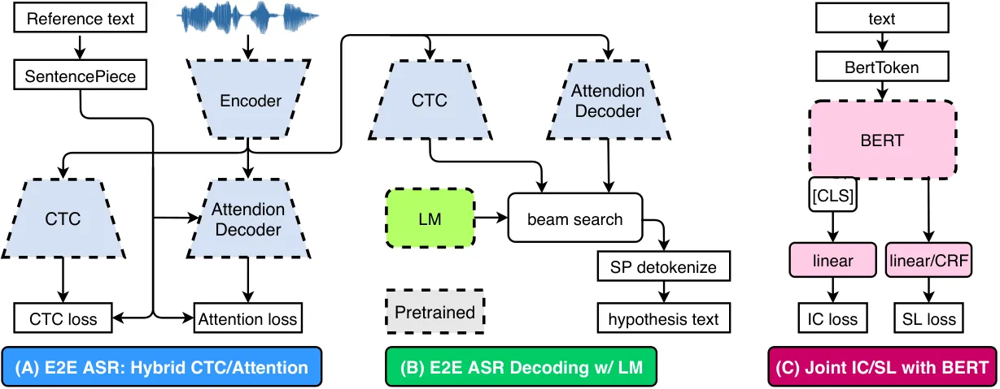

Figure 4: Basic building blocks: E2E ASR $`\theta_{ASR}`$ and fine-tuned
BERT $`\theta_{BERT}`$. (A) illustrates E2E ASR with hybrid
CTC/Attention losses. (B) shows beam search decoding for E2E ASR with
scores from CTC, Attention decoder and LM. (C) shows fine-tuned BERT
with joint IC and SL losses. Intent is predicted on top of the \[CLS\]
token. Note that $`\theta_{ASR}`$ and $`\theta_{BERT}`$ have different
subword tokenizations: SentencePiece (BPE) \[37\] and BertToken. Shapes
in dotted lines are pretrained.

## Appendix D Illustrated Example: How does Slots Edit $`F_{1}`$ Score fit in?

|                                                                                                                                                                                                                                                                                                                                                                                                                                                                                                                                                                                                                                                                                                                                                                                                                                                                                                                                                                                                                                                                                                                                                                               |
| ----------------------------------------------------------------------------------------------------------------------------------------------------------------------------------------------------------------------------------------------------------------------------------------------------------------------------------------------------------------------------------------------------------------------------------------------------------------------------------------------------------------------------------------------------------------------------------------------------------------------------------------------------------------------------------------------------------------------------------------------------------------------------------------------------------------------------------------------------------------------------------------------------------------------------------------------------------------------------------------------------------------------------------------------------------------------------------------------------------------------------------------------------------------------------- |
| \[(A) Ground Truth\]  The potato\[food\] and cauliflower\[food\] are both in season to make combo\[food\] breads\[food\], mounds\[food\], or pads\[food\]. $`\Longrightarrow`$intent: baking \[(A.1) Sample Prediction\]  The potato\[food\] potato\[sports\] and cauliflower\[food\] cauliflower\[sports\] are both in season to make combo\[food\] combo\[sports\] breads\[food\] breads\[sports\], mounds\[food\] mounds\[sports\], or pads\[food\] pads\[sports\]. $`\Longrightarrow`$intent: baking sports \[(A.2) Sample Prediction\]  blaw potato\[food\] blaw cauliflower\[food\] blaw blaw blaw blaw blaw blaw combo\[food\] breads\[food\], mounds\[food\], blaw pads\[food\]. $`\Longrightarrow`$intent: baking \[(A.3) Sample Prediction\]  The tomato\[food\] and cabbage\[food\] are both in season to make sour\[food\] breads\[food\], mud\[food\], or pets\[food\]. $`\Longrightarrow`$intent: baking                                                                                                                                                                                                                                                        |
| \[(B) Ground Truth\]  please find a flight round\[B-roundtrip\] trip\[I-roundtrip\] from los\[B-fromloc.city\] angeles\[I-fromloc.city\] to tacoma\[B-toloc.city\] washington\[B-toloc.state\] with a stopover in san\[B-stoploc.city\] francisco\[I-stoploc.city\] not\[B-cost.relative\] exceeding\[I-cost.relative\] the price of three\[B-fare\] hundred\[I-fare\] dollars\[I-fare\] for june\[B-depart.month\] tenth\[B-depart.day\] nineteen\[B-depart.year\] ninety\[I-depart.year\] three\[I-depart.year\] $`\Longrightarrow`$intent: flight \[(B) Sample Prediction\]  \* find a flights round\[B-roundtrip\] trip\[I-roundtrip\] from los\[B-fromloc.city\] angeles\[I-fromloc.city\] to tacoma\[B-toloc.city\] taco\[B-toloc.city\] ma\[I-toloc.city\] washington\[B-toloc.state\] with a stopover in san\[B-stoploc.city\] francisco\[I-stoploc.city\] francisco\[I-toloc.city\] not\[B-cost.relative\] exciting\[I-cost.relative\] the price of three\[B-fare\] hundred\[I-fare\] dollar\[I-fare\] for june\[B-depart.month\] tenth\[B-depart.day\] nineteen\[B-depart.year\] nineteen\[I-depart.year\] three\[I-depart.year\] $`\Longrightarrow`$intent: flight |

Table 6: Examples to illustrate why an end-to-end IC/SL evaluation
protocol is needed and how it is computed. (A.1) shows a sentence with
perfect text recognition does not capture any semantics. (A.2) shows
that despite a sentence that has high WER, semantics are captured! (A.3)
shows the issue of evaluating with only slots $`F_{1}`$: although slots
types are correct, their values are not.  
(B) A word-slot pair is shown as a word\[tag\]. Words highlighted in
grey are ignored in evaluation since they are labeled as ’O.’
Highlighted words: insertion, deletion, substitution and correct,
signified the word-level differences per slot between the ground-truth
and predicted sequences after alignment during evaluation. Insertion is
counted as FP, deletion as FN, substitution as both FP and FN, correct
as TP. Slots edit $`F_{1}`$ is calculated according to Eq. 10. The table
is best when viewed in color.

## Appendix E Dataset Statistics

The detailed statistics of the corpora used in this work are presented.
ATIS and SNIPS are standard SLU corpora. However, given that the SNIPS
training data is not released to the public (Section 2.1 of \[19\]),
SNIPS audios are synthesized with a commercial TTS service. The SNIPS
audios were synthesized with 15 speakers¹¹¹¹ 11 Speaker lists: Aditi,
Amy, Brian, Emma, Geraint, Ivy, Joey, Justin, Kendra, Kevin, Kimberly,
Matthew, Nicole, Raveena, Russell, Salli. and is referred to as
SNIPS-Multi here. We also randomly selected a single speaker, Emma, as
SNIPS-Single, and evaluated our framework on that. The noise corpus and
noise augmentation procedure is based on MS-SNSD \[50\], where nine
types¹²¹² 12 MS-SNSD noise types: vacuum cleaner, typing, copy machine,
shutting door, neighbor speaking, munching, babble, announcement, air
conditioner. of environmental noises are present. For noise
augmentation, we made sure that train, valid, and test partition do not
have overlapping noise files. ATIS-Noise is ATIS augmented with MS-SNSD,
and SNIPS-Multi-Noise is SNIPS-Multi augmented with MS-SNSD. Lastly,
LibriSpeech 960 (LS-960) is used for the pretraining, only paralleled
audio-text data $`\mathcal{{\widetilde{D}}}`$ is required in our work.

##### Why did we not choose MUSAN for noise augmentation?

MUSAN \[55\]is a widely-adopted speech, music, and noise corpora now
widely incorporated for training SOTA speaker recognition system \[56\],
and it does meet our purpose here. Our original goal was to focus on the
noise robustness for SLU, where potential secondary background speakers
may be present. To design a model that does direct noise suppression, we
had in mind a controllable corpus that is designed for speech
enhancement, like MS-SNSD.

##### SNIPS-Multi has 160 hours of data. That is a lot!

160 hours of audio data is indeed a lot; however, it is not that much
compared to what some of the previous work used in their settings, see,
for example,  \[19\]. Besides, keep in mind that SNIPS-Multi has the
same content as SNIPS-Single. The only difference between them is
speaker variability, which should be learned to be ignored by the model
(see section 3.2 Speaker Adaptive Training (SAT) in \[58\]). Therefore,
the same mistake that was made in SNIPS-Single supposedly would likely
re-occur in SNIPS-Multi.

|                                 |                   |         |         |         |          |                       |
| ------------------------------- | ----------------- | ------- | ------- | ------- | -------- | --------------------- |
| Type                            | Corpus            | Train   | Valid   | Test    | Speakers | Unique Transcriptions |
| $`\mathcal{D}`$                 | ATIS              | 8 hr    | 1 hr    | 1.5hr   | 678      | 5.2k                  |
| $`\mathcal{D}`$                 | SNIPS-Single      | 10.5 hr | 35 min  | 35 min  | 1        | 14.5k                 |
| $`\mathcal{D}`$                 | SNIPS-Multi       | 160 hr  | 8.5 hr  | 8.5hr   | 15       | 14.5k                 |
| $`\mathcal{D_{N}}`$             | MS-SNSD           | 2.8 hr  | 30 min  | 40 min  | \-       | \-                    |
| $`\mathcal{D}+\mathcal{D_{N}}`$ | ATIS-Noise        | 50 hr   | 5 hr    | 7hr     | 678      | 5.2k                  |
| $`\mathcal{D}+\mathcal{D_{N}}`$ | SNIPS-Multi-Noise | 800 hr  | 42.5 hr | 42.5 hr | 15       | 14.5k                 |
| $`\mathcal{{\widetilde{D}}}`$   | LS-960            | 960 hr  | 10 hr   | 10 hr   | 2338     | \-                    |

## Appendix F Training plots

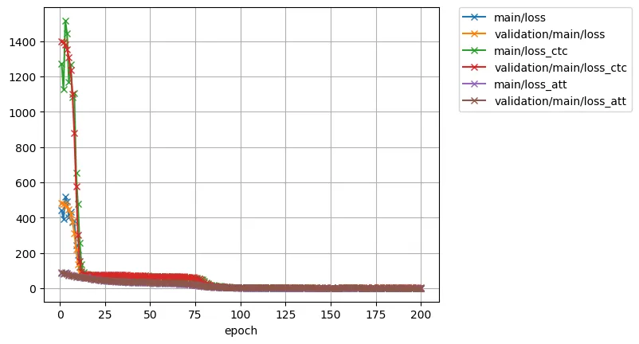

(a) Training Loss

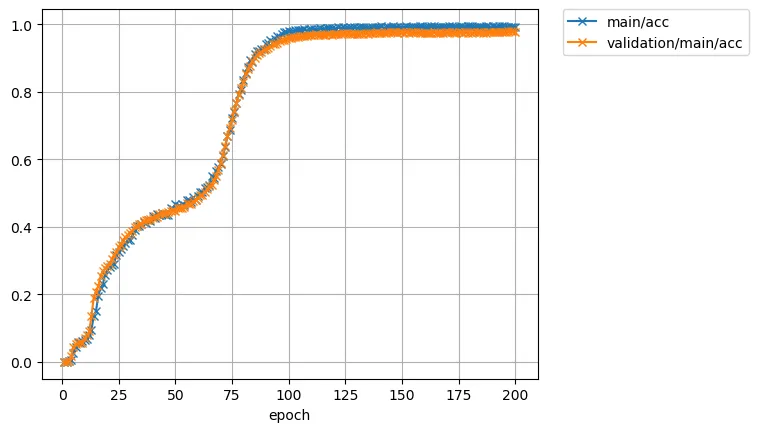

(b) Training Accuracy

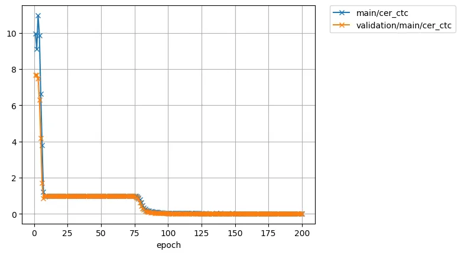

(c) Training CTC Character Error Rate (CER)

Figure 5: Plots for our E2E ASR training on ATIS.

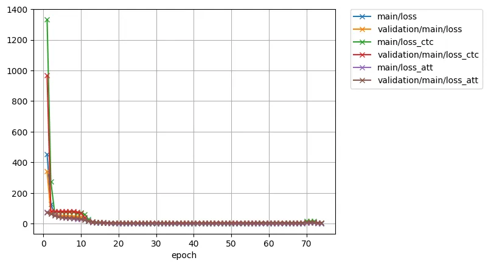

(a) Training Loss

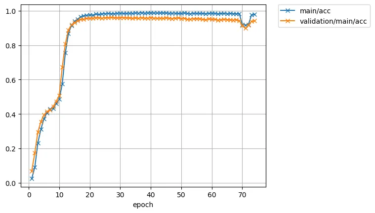

(b) Training Accuracy

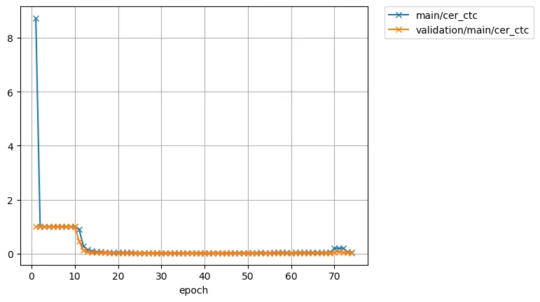

(c) Training CTC CER

Figure 6: Plots for our E2E ASR training with noise-augmentation on
ATIS.

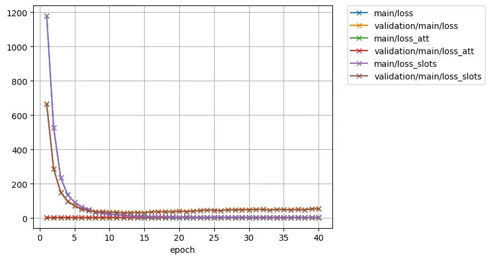

(a) Training Loss

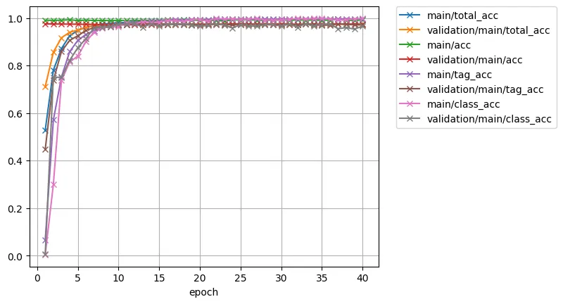

(b) Training Accuracy

Figure 7: Plots for our end-to-end approach with two-stage fine-tuning
on ATIS. Note that here we fine-tuned without CTC loss, so there is not
a CTC CER plot.

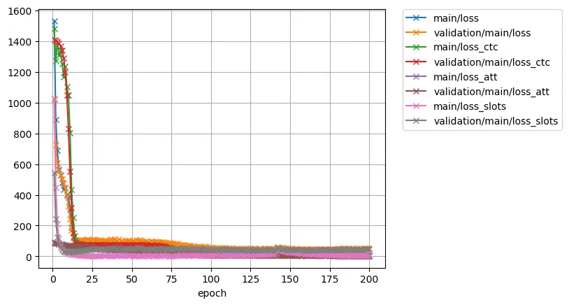

(a) Training Loss

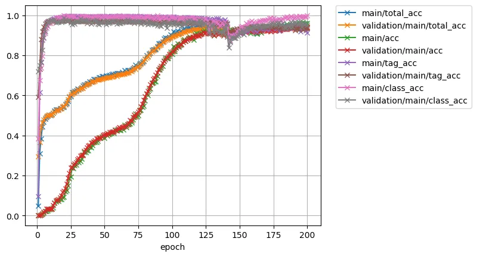

(b) Training Accuracy

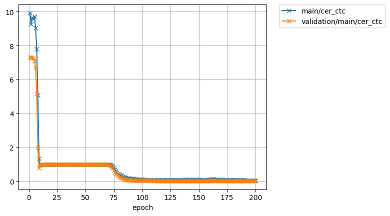

(c) Training CTC CER

Figure 8: Plots for our end-to-end approach without two-stage
fine-tuning on ATIS. Note the curves in 8(b) suggests that ASR is a much
harder task than IC/SL.
