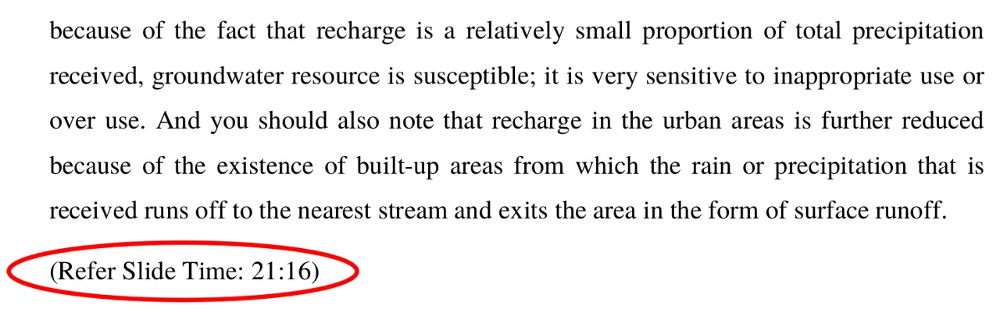
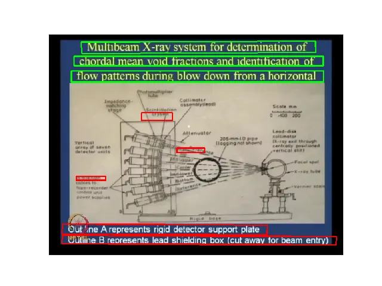
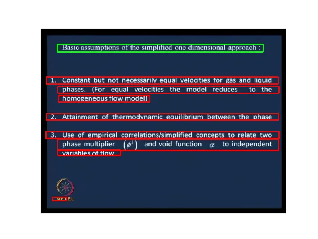
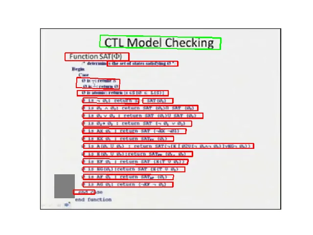
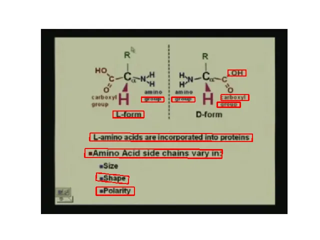

# Incorporating Domain Knowledge To Improve Topic Segmentation Of Long MOOC Lecture Videos

Ananda Das and Partha Pratim Das

###### Abstract

Topical Segmentation poses a great role in reducing search space of the
topics taught in a lecture video specially when the video metadata lacks
topic wise segmentation information. This segmentation information eases
user efforts of searching, locating and browsing a topic inside a
lecture video. In this work we propose an algorithm, that combines
state-of-the art language model and domain knowledge graph for
automatically detecting different coherent topics present inside a long
lecture video. We use the language model on speech-to-text transcription
to capture the implicit meaning of the whole video while the knowledge
graph provides us the domain specific dependencies between different
concepts of that subjects. Also leveraging the domain knowledge we can
capture the way instructor binds and connects different concepts while
teaching, which helps us in achieving better segmentation accuracy. We
tested our approach on NPTEL\[1\] lecture videos and holistic evaluation
shows that it out performs the other methods described in the
literature.

###### Index Terms: 

semantic segmentation, lecture Video segmentation, structural analysis,
e-learning, knowledge graph, MOOC

## I Introduction

Online learning specially Massive Open Online Learning (MOOCs) is
becoming popular as it is designed to facilitate large number of
participants by providing free online access of the high quality
educational contents\[2\]. So many MOOCs provider like NPTEL\[1\] offers
long lecture videos having duration $`\sim`$1 hour. These videos contain
multiple non overlapping coherent topics as they are taught by the
instructor. Having an index built using these topics help user in
browse, locate and searching a desired topic inside a lecture video as
well as inside the whole lecture series. Usually these video metadata
lacks the presence of annotated metadata, which supposed to hold the
time stamp of each topics taught in these video. So for a learner, to
search, locate and browse a topic inside the lecture series, (s)he needs
to go through the whole lecture video, even in the worst case scenario
s(he) requires to view all the video in the lecture series. Successful
construction of an indexing system based on all the topics taught inside
a lecture video requires to have topic name and its boundary information
inside a lecture video. In order to facilitate users with a faster
content search facility inside the whole course as well as in a video
and for providing better learning experience, lecture video needs to be
topic wise segmented and the video metatdata should have topic boundary
information in the form of starting and ending time. Later an indexing
framework can be easily built using these segmented topics which in turn
mitigate user effort of topic wise video content search.

In literature several researchers \[3, 4, 5, 6, 7\] performed lecture
video segmentation by measuring the structural similarity of the
resources. For the text data the idea primarily revolves around dividing
the whole text into fixed length overlapping text blocks and measuring
the similarity between all pair of adjacent text blocks. Shah et al.
\[8\] represented cue phrases using n-gram based language model and
Galanopoulos et al. \[9\] used word2vec based word embedding to
represent text blocks. But finally both of them applied the traditional
similarity measure based approach in obtaining topic boundaries.

While on the other hand segmentation approach using video file \[10, 11,
8, 12\] primarily involves extracting text information from lecture
slides shown inside the video and finding similarity measure in local
context. These approach has following short comings.

- •
  Similarity measure based approach require lots of fine tuning for the
  videos having topics with different time duration.
- •
  Topic segmentation that uses language model may capture the the
  underlined meaning of the transcribed file. But it cannot captures the
  global semantics of the transcript file.
- •
  Domain knowledge in not used during the segmentation task hence
  knowledge semantics is not captured for finding the topic boundaries.

To overcome these shortcomings, in this work we initially perform the
topical segmentation using a language model. A language model tries to
learn the structure of the text corpus through hierarchical
representation thus learns to understand the both low-level syntactic
feature and high level semantic features \[13\]. Though language model
has some limitations of capturing the context of capturing underlined
semantics of the whole text \[14\], topical segmentation using language
model only looks into the local context of the data and unable to
capture the global context resulting in an inaccurate boundary detection
for the larger sized topics. To overcome this problem we additionally
use a domain knowledge graph at the time of segmentation. knowledge
graph contains different concepts, interconnections and relationship
information among the concepts of a subjects. We leverage these
knowledge present inside a knowledge graph and use it during
segmentation to capture the global context of the text corpus obtained
from the speech-to-text transcript file. The major advantage of using
knowledge graph during segmentation is the capability of capturing the
global context that can detect the topic boundaries for larger topics in
more accurate manner.

So in this work we have three major contributions.

- •
  During segmentation we use state-of-the art language model that is
  able to understand the implicit meaning of the text data and capture
  the semantics in local context which helps us in detecting segment
  boundaries of small sized topics.
- •
  To capture the semantics in global context we use domain knowledge
  graph and leverage the knowledge present it during topical
  segmentation that makes possible to detect segment boundaries for
  larger length topics.
- •
  Using the dependencies and relationship information available in a
  knowledge graph, we analyze the way instructor connects and binds
  different concepts to explain a topic, which helps us in getting more
  accurate topic boundary information.

## II Literature Survey

In previous years, several research works are proposed to deal with
lecture video related issues like indexing, retrieval, segmentation and
annotation. To accomplish these tasks mainly textual and visual
information are used. Text information are available in form of subtitle
file and speech-to-text transcript . Visual information is primarily
obtained from lecture video and supplementary lecture material like
lecture slides . Depending on the semantic resources used, we can divide
the prior work into three category. Using only textual information,
visual information or using both of them.

### II-A Textual Information Based Segmentation

Lin et al \[3\] proposed a modified version of TextTiling \[15\]
algorithm to obtain segment boundaries from audio transcripts. Their
idea is to divide the whole text transcript into fixed sized overlapping
blocks. Similarity between two adjacent blocks are computed using noun
phrases, verb class, pronouns, cue phrase as feature vectors. Segment
boundary is considered if for a block pair, similarity score is below
some experimental threshold value. Shah et al \[8\] adopted similar
approach to predict topic transition in textual content. They used cue
phrases which are represented by N-gram based model while Galanopoulos
et al \[9\] used word2Vec \[4\] based word embedding to measure semantic
similarity between two adjacent text blocks. In an another work Shah et
al \[5\] modified the above mentioned approach with the help of
wikipedia text. They computed similarity between a wikipedia topic and
each fixed size text block obtained from sub-title file. Based on all
similarity score and threshold value segment boundary was decided. In
their work Repp et al \[6\] proposed a lecture video indexing framework
by forming chain index of keywords. They extracted a set of keywords
from the speech transcripts. For each keyword, using its occurrence
position a keyword chain is formed. Finally time stamp of each chain is
used to index the lecture video. Using Multi Modal Language Model Chen
et al \[7\] focused to index textual data obtained from slides and
speech in lecture videos, and subsequently employed a multi-modal
probabilistic ranking function for lecture video retrieval. Basu et al
\[16\] built an Lecture video recommendation system for educational
blogs using topic modeling technique.

### II-B Visual Information Based Segmentation

Researchers worked with visual contents, primarily focused on extracting
textual information present in lecture slides and applying NLP based
methods on them to find topic segment boundaries. Che et al. \[11\] and
Baidya et al \[17\] analyzed textual contents available in the lecture
slides shown in the lecture video. SWT was used to obtain text lines
form slide frame and OCR is used to recognize text data from these text
lines. NLP based methods are applied on text data to perform topic
segmentation. Yang et al \[10\] used similar approach as above but used
DCT based coefficient to identify text lines in a slide frame. Che et.
al \[11\] segmented lecture video with synchronized slides. By analyzing
it’s OCRed text they partition the slides into different subtopics by
examining their logical relevance. Slides are synchronized with the
video stream, the subtopics of the slides indicate exactly the segments
of the video. Another group of researches tried to match between video
frames and lecture slides, assuming that lecture slides are available as
supplementary material. Eberts et al. \[18\] matched between lecture
slides and video frames to create localization information of each slide
shown in the lecture video. They leverage alignment of the presentation
with the reading order of its supplementary material. They handled it by
using a combination of SIFT local feature and temporal model. As
temporal model they used Hidden Markov Model and heuristic filters. Ma
et al. \[19\] Analyzed lecture slides to get topic segments. These
segment boundaries are mapped to the lecture video by matching lecture
slides and video frames. They handled different perspective views,
resolution, illumination, noise, and occlusions in videos by using
boosted margin maximizing neural networks. In some work, a lecture video
is considered as a sequence of events like displaying lecture slides or
the instructor. Assuming change of event as the change of current topic,
topic boundary is determined by detecting the event change. Shah et al.
\[8\] detected event change in lecture videos and considered change of
an event is change of a topic. They consider events as displaying
instructor or displaying lecture slide in the video. To detect event
change they trained an SVM by computing color histogram of video frames.
Jeong et al. \[12\] handled lecture video where recording was done by a
non stationary camera settings. They identified topic change by
computing frame similarity between two adjacent frames. based on some
threshold value topic boundary was identified. Ma et al \[20\] used
color histogram of video frames to identify slide transition, which in
turn is used to detect topic change.

### II-C Joint Approach of Segmentation

To obtain more accurate result researchers adopted fusion based method,
which involves merging two sets of segmentation information obtained
from heterogeneous sources like speech transcripts, video content,
subtitle file or OCRed text. Basic idea behind the fusion approach is
replacing two segment boundaries by their average transition time if two
transition occurs within thirty seconds. Shah et al. \[8, 5\] used both
subtitle file and video frames and wikipwdia text to get final
segmentation. In \[21\] content based lecture video retrieval system is
proposed by extracting keywords from slide text line and analyzing OCR
and ASR transcripts of the video.

## III Methodology

Different steps to perform topical segmentation of long lecture videos
are mentioned below and the schematic diagram is shown in the Figure 1.

1.  1.  Segmentation using structural analysis In this method of lecture
        video segmentation first we segment the transcript file associated
        with a lecture video. During segmenting the transcript file we
        analyze the structure of the textual information and try to
        understand the implicit meaning of the whole transcript file. For
        understanding the transcribed language we train a language model and
        reuse it during the actual segmentation work. After we obtain the
        segmentation in transcript file domain we reversely map it to the
        lecture video domain. Section IV describes detail steps of this
        task.
2.  2.  Segmentation using Semantic Analysis In this step we try to obtain
        topic boundary information by leveraging the knowledge semantics
        present inside a domain knowledge graph. Also we capture the
        underlined meaning of the transcript file by using a state-of-the
        art language model. Section V describes step by step procedure to
        perform semantic analyzing for obtaining the topic boundaries.
3.  3.  Annotation To distinguish a segmented topic from others and to make
        them searchable we need to asisgn a name to each of the segmented
        video. We call this step as segment annotation. we create annotation
        module whose responsibility is to determine topic name with the help
        of course syllabus and lecture videos. Details annotation process
        are described in Section VI.
4.  4.  Fusion As mentioned earlier we get two set of topic boundary
        information. One using by structural analysis of the transcript file
        and another set of boundary information is obtained from semantic
        analysis based segmentation which essentially leverages domain
        knowledge from a knowledge graph. In this step we fuse these two set
        of boundary information to obtain better segmentation results. The
        fusion step is described in details in Section VII

Fig. 1: Schematic diagram of the methodology

## IV Segmentation Using Structural Analysis

The basic idea behind the structural segmentation is to identify few
sentences those can be considered as topic boundaries. For doing this,
we can consider a transcript file as a sequence of sentences, where each
sentence consists of fixed number of words. Now semantic segmentation of
text can be formulated as a binary classification problem. Given a
sentence $`{S_{K}}`$ with K sentences $`{S_{0},S_{1},....,S_{K-1}}`$
preceding it and K sentences $`{S_{K+1},S_{K+2},....,S_{2K}}`$ following
it, we need to classify whether sentence $`{S_{K}}`$ is the beginning of
a segment or not. To represent each sentence in vector form we use
InferSent \[22\] approach. Next, each encoded sentence along with its
K-sized left and right contexts are fed to a classifier, whose output
helps us to determine segment boundaries of each topic. After segment
boundaries are detected in transcript file we use them for finding the
topic boundary in the lecture video. We perform the following steps to
accomplish the segmentation task.

### IV-A Sentence Encoding

#### IV-A1 Sentence Encoding

We first divide the whole transcript file into strings of fixed length
($`20`$ words). To create sentence encoding we have used pre-trained
sentence encoder model proposed by InferSent \[22\]. It tries to build a
universal sentence encoding by learning the sentence semantics of
Stanford Natural Language Inference (SNLI) \[23\] corpus. SNLI corpus
contains $`570K`$ human generated English sentence pairs. Each sentence
pair is manually labeled and belongs to one of the three categories:
entailment, contradiction and neutral. These corpus are used to train a
classifier on top of a sentence encoder, which encodes both the
sentences in a sentence pair in similar manner. Semantic relationship
between these two sentence vectors are computed which is turn passed
through a dense layer and soft-max layer. Finally the model classifies
the sentence pair among one of the three mentioned categories. Conneau
et al. \[22\] adopted a bi-directional LSTM with a max-pooling operator
as sentence encoder. In our task we use this pre-trained sentence
encoder model to create sentence vectors, which are used in later
stages.

### IV-B Sentence Classification

At this stage we decide, given a sentence with its $`K`$ sized left and
right contexts, whether the sentence is the beginning of a segment or
not. Our classification approach is similar in spirit of the method
proposed by Badjatiya et al. \[24\] with some modifications.
Relationship of a sentence with its left and right contexts, plays most
important role to become the sentence as the segment boundary. Hence,
first we compute context vectors of left and right contexts using
stacked bi-LSTM with an attention layer. In stacked bi-LSTM multiple
layers of both forward and backward pass LSTM \[25\] are stacked upon
together to obtain better accuracy. Also two sentences located at equal
distance, one in the left context and other on the right, might not have
similar impact on the middle sentence to be it the segment boundary. To
handle this we apply a soft attention layer on top of the bi-LSTM layer.
Attention allows to assign different weights to the different sentences
resulting better model accuracy. We define attention vector, $`Z_{s}`$
as

$`e_{i}^{K\times 1}=H_{i}^{K\times d}\times W^{d\times 1}+b_{i}^{K\times 1}`$
, $`a_{i}=exp(tanh(e_{i}^{T}Z_{s}))`$,
$`\alpha_{i}=\frac{a_{i}}{\sum_{p}a_{p}}`$,
$`v_{i}=\sum_{j=1}^{K}\alpha_{j}h_{j}`$

where, $`d`$ is the dimension of the output vector of last bi-LSTM
layer, $`H`$ is the output of the bi-LSTM layer, $`W`$ and $`b`$ are the
weight matrix and bias vector and $`v_{i}`$ is the resultant context
embedding. After computing both the context vector in similar manner, we
find semantic relatedness between left context (let it be $`C_{L}`$),
right context ($`C_{R}`$) and the middle sentence ($`M`$) by the
following way.

1.  1.  Concatenation of three representation $`(C_{L},M,C_{R})`$
2.  2.  Pair wise multiplication of the vectors
        $`(C_{L}*M,M*C_{R},C_{R}*C_{L})`$

The resultant vector which contains relationship information among these
vectors, is fed to a binary classifier consists of fully connected
layers culminating in a soft-max layer. The architecture diagram of this
approach is is shown in Figure 2. Sentences classified as segment
boundaries are used to obtain topic boundary in next step.

Fig. 2: Sentence Classifier

### IV-C Text To Video Mapping

In this step, having segment boundaries obtained from text transcript,
we need to identify corresponding time stamp in the original lecture
video. These identified time stamps will act as starting time and ending
time of different topics. We take help from text to video mapping
information present inside speech-to-text transcript. Mapping
information is available in the following form. After some random
sentence it contains time stamp information when it is pronounced by the
instructor in the lecture video. A sample of such file is shown in 4. We
perform text to video mapping in the following way. Consider two
consecutive time stamps $`t_{S}`$ and $`t_{S+1}`$ are given in the text
transcript. Let, there exists $`W`$ words in between these two time
stamps. Say, we get a segment boundary (in form of a sentence) inside
this window. If there are $`W_{p}`$ words preceding this sentence, then
video time stamp corresponding to this sentence is
$`\frac{t_{S+1}-t_{S}}{W}*W_{p}`$. For a lecture video if we get $`N`$
($`TS_{1}`$, $`TS_{2}`$, $`TS_{3}`$ … $`TS_{N}`$) such time stamp, then
we conclude that the video contains $`N-1`$ topic with starting and
ending time pair as ($`TS_{1},TS_{2}`$), ($`TS_{2},TS_{3}`$) ….
($`TS_{N-1},TS_{N}`$).

Fig. 3: Sample illustration of finding transcribed text associated to
each unique slide frame.



Fig. 4: Mapping Information Sample: Time stamp in shown in the red box

### IV-D Model Training and Parameter Tuning

To train sentence classifier we use Wikipedia \[26\] pages. Section
boundaries in the Wikipedia pages are considered as segment boundaries.
We neglect the introduction section of each page, as it briefs the
overall idea of the whole page. We have randomly chosen $`\sim`$300
Wikipedia pages having $`\sim`$55K sentences, with $`\sim`$8% sentences
being the segment boundaries. We handle this highly imbalanced dataset
by selecting weighted binary cross entropy loss function, which gives
higher weight to the minority class and lower weight to the majority
class. This loss function $`\ell`$, can be defined as,

```math
\ell=-\frac{1}{N}\Sigma_{n=1}^{N}w_{n}(t_{n}log(o_{n})+(1-t_{n})log(1-o_{n}))
```

where, $`w_{n}`$: weighting factor associated with loss of a class.
$`t_{n}\in{0,1}`$: Binary label of the target class. $`o_{n}\in[0,1]`$:
Classification probability score produced by the model. $`N`$: Total
number of class, here $`N=2`$

We use AdaDelta \[27\] optimizer with dropout $`0.3`$. Epoch size is
chosen as $`35`$ and the model is trained with mini batch size as
$`40`$.

## V Segmentation Using Semantic Analysis

THe basic idea of this approach is to perform topical segmentation of
long lecture videos by leveraging the inherent knowledge available in a
domain knowledge graph($`\mathscr{KG}`$). Also, at the time of teaching,
instructor has his own way of selecting different concepts, connecting
and combining them together to explain a topic. We combine these two
information to perform topical segmentation of long MOOC lecture videos.
We take NPTEL lecture videos, each of them is synchronized with lecture
slides and associated with speech-to-text transcript. We identify unique
slides shown in the video, their time interval and associated textual
information from the transcript file. Using these information we
construct graphlets, each represents a unique lecture slide shown in the
lecture video. In each graphlet, the nodes are the concepts used by the
instructor, an edge indicates presence of a direct connection between
two concepts in the $`\mathscr{KG}`$ and edge weight represents the
contextual semantic similarity between two adjacent concepts of that
edge. Here ‘contextual semantic similarity’ means semantic similarity
between two concepts in the context of the way instructor combines them
together during teaching. The basis of our work is to analyze all these
graphlets and find how concept change occurs between two adjacent
graphlets. Finally, measuring the amount of concept change and
contextual semantic similarity among concepts, our system provides
boundaries (starting-time and ending-time) of different topics taught in
a lecture video. The idea is schematically shown in Figure 5 where we
take a lecture video on ‘Overview of waterfall model’. The diagram
represents different concepts used by the instructor which are
distributed into five different topics. Connectivities between these
concepts are taken from the $`\mathscr{KG}`$ and edge weight represents
contextual semantic similarity among concepts. After analyzing all the
graphlets created from the unique slides, we can perform topical
segmentation and mark the topic boundaries.

Fig. 5: Illustration of knowledge graph based topical segmentation of
lecture videos. All the concepts covered in a lecture video are shown.
Edge weight represents contextual semantic similarity among the
concepts. Each topic, represented as a cloudy shape, consists of
multiple concepts. Text in each rectangular box represents corresponding
topic name and its interval.

Steps to perform segmentation using semantic analysis are described
below.

### V-A Edge Weight Computation

In this step, we compute the edge weight between different concepts
present in the $`\mathscr{KG}`$. Essentially, edge weight represents how
two concepts are semantically similar with each other in the context of
transcript file. We find semantic similarity between them considering
the context of their co-occurrence. To determine the context we use
FLAIR \[28\] api that runs on top of the BERT \[29\] model. Unlike
static word embedding, BERT can produce dynamic word embedding
considering the sentences in which a word has occurred. Here in our
work, we capture the contextual semantic similarity between two
concepts, so that we can analyze how instructor correlates and connects
different concepts during teaching. We observe, a concept might occur
multiple times in the transcript file. So, during similarity score
computation, we consider all pairwise co-occurrences between two given
concepts. We take the text chunk that contains first such co-occurrence
and send it to the FLAIR api to find $`2048`$ dimensional word embedding
of each concept and calculate cosine similarity between them. We take
all the co-occurrences between any two concepts, find multiple
similarity scores between them and take the average to find final
contextual similarity between them. After similarity computation is
done, we use it as the edge weight in the $`\mathscr{KG}`$ if there
exist a link between these two concepts. We maintain a dictionary which
holds the contextual semantic similarity score between all pair of
concepts present in the transcript file.

#### V-A1 Slide Graph Construction

First we construct an un-directed weighted graph representing each
unique slide frame and we call it slide*graph. To construct $`n^{th}`$
slide_graph ($`G^{s}*{n}`$) we use transcribed text (say, $`TXT\_{n}`$)
associated with $`n^{th}`$ unique slide, the $`\mathscr{KG}`$ and the
edge weight dictionary created in Section V-A. Construction steps are
given below.

1.  1.  A vertex is created for each concept word in $`TXT_{n}`$, set vertex
        name as the concept and vertex weight as the term frequency of that
        concept in $`TXT_{n}`$.
2.  2.  We draw an edge between two vertices if there is a corresponding
        edge present in the $`\mathscr{KG}`$. Edge weight is assigned using
        the dictionary created in Section V-A.
3.  3.  We remove direction information from the generated graph because
        during graph analysis in the next phase, a node may not be reachable
        from the other nodes, though there exists a strong connection among
        them.
4.  4.  If the generated graph is not connected, we draw an edge between two
        connected components whose weight is the maximum among all the
        possible edges between these two components.

### V-B Finding Potential Topic Boundary

In this step, we determine potential topic boundaries by analyzing all
the slide*graph. During lecture, instructor changes current slide at the
time of going to a different topic, but vice versa is not necessarily
true. In fact usually multiple slides are used for explaining a
particular topic and few consecutive slides are closely related. Here
closely related means, these consecutive slides represent almost same
concepts. In this step we identify closely related consecutive slides
and merge them together. Also, we mark the slides which are not close
and those slide changes might be the topic boundaries. We measure how
much concept changes have been occurred between two consecutive lecture
slides. We define concept_change_score, $`CCS(j,j+1)`$ between two
consecutive slide_graph, $`G^{s}*{j}=(V^{s}_{j},E^{s}_{j})`$ and
$`G^{s}_{j+1}=(V^{s}_{j+1},E^{s}\_{j+1})`$ as follows.

```math
CCS(j,j+1)=\left\{\begin{array}[]{lr}0~~~~:\{V^{s}_{j}\cap V^{s}_{j+1}\}=\phi\\
\frac{total~minimum~term~frequency}{total~maximum~term~frequency}~~~~:Else\end{array}\right.
```

where,
$`total~minimum~term~frequency=\sum\limits_{k=0}^{N}min(tf(v_{k}\mid v_{k}\in V^{s}_{j}),tf(v_{k}\mid v_{k}\in V^{s}_{j+1}))`$

$`total~maximum~term~frequency=\sum\limits_{k=0}^{M}max(tf(v_{k}\mid v_{k}\in V^{s}_{j}),tf(v_{k}\mid v_{k}\in V^{s}_{j+1}))`$

where, $`N=|\{V^{s}_{j}\cap V^{s}_{j+1}\}|`$ and
$`M=|\{V^{s}_{j}\cup V^{s}_{j+1}\}|`$ and
$`tf(v_{k}|v_{k}\in V^{s}_{j})`$ indicates term frequency of vertex
$`v_{k}`$ when $`v_{k}\in V^{s}_{j}`$. Here consideration of term
frequency is important. We observe that, instructor puts more emphasis
on few concepts while other concepts are used for giving example or
reference purpose. Throughout this paper we call them as primary and
auxiliary concepts respectively. Usually, primary concepts have higher
term frequency than the auxiliary concepts. Also, Concepts with higher
term frequency indicates that instructor has spent more time on them
than the concepts with lower term frequency. Leveraging this fact we
consider term frequency in concept_change_score computation. Clearly
concept_change_score is in range between $`[0,1]`$ and its value is
$`1`$ if two consecutive slide_graph are exactly similar and $`0`$ if
their vertices are disjoint. An illustrative example of
concept_change_score is shown in Figure 6.

Fig. 6: An example of concept*change_score between two consecutive
slide_graph. Each node represents a concept and its term frequency, edge
weights indicate contextual semantic similarity among concepts. Slide
changes shown in Figure 6 is a potential candidate of being a topic
boundary as most of the concepts are different and $`CCS(j,j+1)`$ is low
($`0.077`$). While, Figure 6 shows $`G^{s}*{j}`$ and $`G^{s}\_{j+1}`$ are
closely related as most of the concepts present in these two slides are
same and $`CCS(j,j+1)`$ is large ($`0.545`$) compared to the other.

We use this concept_change_score to identify consecutive slide_graph
where significant amount of concept change happens and mark those slide
transitions as potential topic boundaries. We also identify closely
related consecutive slide_graph and merge them together as those
corresponding slides represent almost same concepts. Steps to perform
these operations are,

1.  1.  We compute concept_change_score between all pair of consecutive
        slide_graph and select those changes where the concept_change_score
        is less than the average value. We mark these changes as potential
        topic boundaries.
2.  2.  We merge those pair of consecutive slide_graph where
        concept_change_score is higher than the average value. We call this
        merged graph as slide_group_graph. A sample illustration of
        constructing slide_group_graph is shown in Figure 7.
3.  3.  slide*graph merging policy is as follows. Consider two consecutive
        slide_graph, $`G^{s}*{j}=(V^{s}_{j},E^{s}_{j})`$ and
$`G^{s}_{j+1}=(V^{s}_{j+1},E^{s}_{j+1})`$ which are merged to get
slide_group_graph, denoted as, $`G^{g}=(V^{g},E^{g})`$. where,
$`V^{g}=V^{s}_{j}\cup V^{s}_{j+1}`$ and
$`E^{g}=E^{s}_{j}\cup E^{s}_{j+1}`$. Vertex weight is modified as
the summation of its weight in $`G^{s}_{j}`$ and $`G^{s}\_{j+1}`$.

Fig. 7: Merging two consecutive slide_graph to construct a
slide_group_graph.

#### V-B1 Finding Actual Topic Boundary

In this step we have a collection of slide_graph and slide_group_graph.
We call each of them as cluster where each of them represents some
concepts and transition from one cluster to the next one makes
substantial amount of concept change. Some of these transitions are
actual topic boundaries while others are not. To find actual topic
boundaries, we analyze how concepts are closely connected with each
other within a topic than the concepts belonging in two different
topics.

Primary and auxiliary concepts In our dataset we observe, in each
cluster, instructor primarily focuses on some concepts and rest are used
for explanation or reference purpose. We call them as primary concepts
and auxiliary concepts respectively. For example, to explain a topic,
say “Agile Methods”, instructor primarily focuses on concepts like,
“sprint”, “scrum”, “eXtreme Programming”, “face-to-face conversation”
etc. But sometimes he also mentions “waterfall”, “spiral” for reference
purpose or “Zoho Sprints”, “Kanbanize” to mention the tools used for
agile. We also find that term frequency of primary concepts are higher
than the auxiliary concepts. Leveraging this fact, we take only the
primary concepts and their interconnection for finding actual topic
boundaries. we create cluster_centroid from each cluster which
represents the primary concepts and the interconnections among them. In
this computation we consider top 70% concepts as primary concepts. We
discuss the selection of this value in Section VIII-C . Steps to
construct a cluster_centroid are given below.

1.  1.  Sort the concepts in non increasing order according to their term
        frequency.
2.  2.  In case of tie in term frequency, we consider total weight of the
        incident edges to a concept. Here higher weight signifies a concept
        is semantically closer to other concepts than that of the concept
        with lower weight in incident edges.
3.  3.  Consider top $`70\%`$ concepts and their interconnecting edges
        during formation of the cluster_centroid.

To detect actual topic boundaries, we consider three consecutive (say,
$`i^{th}`$, $`i+1^{th},`$ and $`i+2^{th}`$) cluster*centroid denoted as
$`G^{c}*{i}=(V^{c}_{i},E^{c}_{i})`$ ,
$`G^{c}_{i+1}=(V^{c}_{i+1},E^{c}_{i+1})`$ and
$`G^{c}_{i+2}=(V^{c}_{i+2},E^{c}_{i+2})`$ respectively. We represent the
transition from $`G^{c}_{i}`$ to $`G^{c}_{i+1}`$ as $`{\tau(i,i+1)}`$
and from $`G^{c}_{i+1}`$ to $`G^{c}_{i+2}`$ as $`{\tau(i+1,i+2)}`$. We
may encounter three different cases as described below. An illustrative
diagrams are also shown in Figure 8, Figure 9, and Figure 10. These
figures contains small dots that represent different concepts and lines
connecting them are the edges. Cloudy, rectangular and oval shapes
represent three consecutive cluster_centroid $`G^{c}_{i}`$,
$`G^{c}_{i+1}`$ and $`G^{c}\_{i+2}`$ respectively. Thick gray arrows
represent the transition from one cluster_centroid to the next one.

1.  1.  Case A: If we find both $`\{V^{c}_{i}\cap V^{c}_{i+1}\}=\phi`$ and
        $`\{V^{c}_{i+1}\cap V^{c}_{i+2}\}=\phi`$, we mark $`{\tau(i,i+1)}`$
        as a topic boundary. This situation is represented in the Figure 8.

    Fig. 8: An illustration of a scenario (Case A), occurs during
    teaching.

2.  2.  Case B: $`G^{c}_{i}`$ and $`G^{c}_{i+2}`$ are in two different
        topics (say, $`topic_{x}`$ and $`topic_{y}`$ in chronological
        order). Instructor gradually changes from $`topic_{x}`$ to
        $`topic_{y}`$ through $`G^{c}_{i+1}`$. Different situations may
        occur like,

    1.  (a)
        Situation-1 Most of the concepts covered in $`G^{c}_{i+1}`$ are
        part of $`topic_{x}`$, hence $`\tau(i+1,i+2)`$ is a topic
        boundary as shown in Figure 9(a).
    1.  (b)
        Situation-2 Most of the concepts covered in $`G^{c}_{i+1}`$ are
        part of $`topic_{y}`$, hence $`\tau(i,i+1)`$ is a topic boundary
        as shown in Figure 9(b).

    (a) Case B: Situation-1

    (b) Case B: Situation-2

    Fig. 9: An illustration of the scenario (Case B), occurs during
    teaching.

3.  3.  Case C: $`G^{c}_{i}`$, $`G^{c}_{i+1}`$ and $`G^{c}_{i+2}`$ all falls
        under same topic.

    1.  (a)
        Situation-1 There are some changes in concepts between
        $`G^{c}_{i}`$ and $`G^{c}_{i+1}`$, but in $`G^{c}_{i+2}`$
        instructor again back to the concepts present in $`G^{c}_{i}`$
        as shown in Figure 10(a).
    1.  (b)
        Situation-2 Most of the concepts covered in a particular topic
        are present in $`G^{c}_{i}`$ and very few additional concepts
        are taught in $`G^{c}_{i+1}`$ and $`G^{c}_{i+2}`$ as shown in
        Figure 10(b).
    1.  (c)
        Situation-3 Similar to the Case C: Situation-2, while most of
        the concepts are covered in $`G^{c}_{i+1}`$as shown in
        Figure 10(c).
    1.  (d)
        Situation-4 Similar to the Case C: Situation-2, while most of
        the concepts are covered in $`G^{c}_{i+2}`$ as shown in
        Figure 10(d).

    (a) Case C: Situation-1

    (b) Case C: Situation-2

    (c) Case C: Situation-3

    (d) Case C: Situation-4

    Fig. 10: An illustration of the scenario (Case C), occurs during
    teaching.

To handle these situations, we measure how different concepts are
densely connected to each other within a topic. For a graph $`G`$, we
define graph density metric $`\delta(G)`$ as,
$`\delta(G)=\frac{\sum_{k=1}^{N}w(e_{k})}{N(N-1)}`$, while, $`w(e_{k})`$
is the weight of edge $`e_{k}`$ and $`N`$ is the total number of
vertices in $`G`$. We take different combinations of cluster*centroid,
compute their density and compare these density values with each other
to find the actual topic boundaries. Here the idea is, concepts belong
in same topic have more contextual semantic similarity than they are in
different topics. Combined graph, denoted as,
$`\mathcal{C}(G^{c}*{i},G^{c}_{i+1})=(V^{\prime},E^{\prime})`$ is formed
by combining $`G^{c}_{i}=(V^{c}_{i},E^{c}_{i})`$ and
$`G^{c}_{i+1}=(V^{c}_{i+1},E^{c}_{i+1})`$ where,
$`V^{\prime}=\{V^{c}_{i}\cup V^{c}_{i+1}\}`$ and
$`E^{\prime}=\{E^{c}_{i}\cup E^{c}_{i+1}\cup\mathcal{E}\}`$. Here,
$`\mathcal{E}`$ represents set of additional edges present in the
$`\mathscr{KG}`$ between any pair of concepts that belongs in
$`G^{c}_{i}`$ or $`G^{c}\_{i+1}`$. Using these density measure we compute
actual topic boundaries using the algorithm shown in Algorithm 1.

1:
$`tpBoundaries\leftarrow[~],start\_time\leftarrow centroidList[0].startTime,end\_time\leftarrow 0,i\leftarrow 0`$

2: $`len\leftarrow centroidList.length`$

3: while $`i<len-2`$ do

4:
  $`c0\leftarrow centroidList[i],~c1\leftarrow centroidList[i+1],~c2\leftarrow centroidList[i+2]`$

5:   if
$`c0.vertices\cap c1.vertices=\phi~\and~c1.vertices\cap c2.vertices=\phi`$
then $`\triangleright`$ Case A

6:    $`end\_time\leftarrow c0.endTime`$

7:    $`tpBoundaries\leftarrow tpBoundaries\cup(start\_time,end\_time)`$
$`\triangleright`$ $`{\tau(i,i+1)}`$ is topic boundary

8:    $`start\_time\leftarrow c1.startTime`$ $`\triangleright`$ set
start_time value for the next topic

9:    $`i\leftarrow i+1`$

10:    $`continue`$     
$`\triangleright`$ compute density of different combination of
cluster_centroid as described

11:   $`m01\leftarrow combine(c0,c1),~delta01=density(m01)`$

12:   $`m02\leftarrow combine(c0,c2),~delta02=density(m02)`$

13:   $`m12\leftarrow combine(c1,c2),~delta12=density(m12)`$

14:   $`m123\leftarrow combine(c1,c2,c3),~delta123=density(m123)`$

15:   if $`delta02>delta01~\and~delta02>delta12`$ then
$`\triangleright`$ Case C: Situation-1

16:    $`i\leftarrow i+2`$

17:    $`continue`$

18:   else if
$`delta123>delta01~\textbf{or}~delta123>delta12~\textbf{or}~delta123>delta02`$
then $`\triangleright`$ Case C: Situation-2,3,4

19:    $`i\leftarrow i+2`$

20:    $`continue`$

21:   else if $`delta01>delta12`$ then $`\triangleright`$ Case B:
Situation-1

22:    $`end\_time\leftarrow c1.endTime`$

23:
   $`tpBoundaries\leftarrow tpBoundaries\cup(start\_time,end\_time)`$
$`\triangleright`$ $`{\tau(i+1,i+2)}`$ is topic boundary

24:    $`start\_time=c2.startTime`$ $`\triangleright`$ set start_time
value for the next topic

25:    $`i\leftarrow i+2`$

26:    $`continue`$

27:   else if $`delta12>delta01`$ then $`\triangleright`$ Case B:
Situation-2

28:    $`end\_time\leftarrow c0.endTime`$

29:
   $`tpBoundaries\leftarrow tpBoundaries\cup(start\_time,end\_time)`$
$`\triangleright`$ $`{\tau(i,i+1)}`$ is topic boundary

30:    $`start\_time\leftarrow c1.startTime`$ $`\triangleright`$ set
start_time value for the next topic

31:    $`i\leftarrow i+1`$

32:    $`continue`$   

33: $`end\_time\leftarrow centroidList[len-1].endTime`$
$`\triangleright`$ taking end-time of last cluster

34: $`tpBoundaries\leftarrow tpBoundaries\cup(start\_time,end\_time)`$

35: return $`tpBoundaries`$

Algorithm 1 Compute Topic Boundary List

Lines 5-10 handle Case A by computing vertex intersection between three
consecutive cluster*centroid and mark $`{\tau(i,i+1)}`$ as topic
boundary. Case B and Case C are determined by comparing density of
different combined graph formed by $`G^{c}*{i}`$, $`G^{c}_{i+1}`$ and
$`G^{c}_{i+2}`$. For Case B:Situation-1, graph density of
$`\mathcal{C}(G^{c}_{i},G^{c}_{i+1})`$ is more than density of
$`\mathcal{C}(G^{c}_{i+1},G^{c}_{i+2})`$ as $`G^{c}_{i}`$ and
$`G^{c}_{i+1}`$ both belong in same topic and $`G^{c}_{i+1}`$ and
$`G^{c}_{i+2}`$ belong in two different topics. Hence
$`{\tau(i+1,i+2)}`$ is a topic boundary. These are handled in lines
21-26. In similar manner Case B:Situation-2 is handled in lines 27-32.
In Case C:Situation-1, concepts covered in $`G^{c}_{i}`$ and
$`G^{c}_{i+2}`$ are almost similar but there is some concept change in
$`G^{c}_{i+1}`$. So $`\mathcal{C}(G^{c}_{i},G^{c}_{i+2})`$ will have
higher density value than that of
$`\mathcal{C}(G^{c}_{i+1},G^{c}_{i+2})`$ and
$`\mathcal{C}(G^{c}_{i},G^{c}_{i+1})`$ which is handled in lines 15-17.
For Case C:Situation-2,3,4 all $`G^{c}_{i}`$,$`G^{c}_{i+1}`$ and
$`G^{c}_{i+2}`$ are in same topic, so density of
$`\mathcal{C}(G^{c}_{i},G^{c}_{i+1},G^{c}_{i+2})`$ is higher than the
individual density of $`\mathcal{C}(G^{c}_{i},G^{c}_{i+1})`$ or
$`\mathcal{C}(G^{c}_{i},G^{c}_{i+2})`$ or
$`\mathcal{C}(G^{c}_{i+1},G^{c}\_{i+2})`$. These kind of situations are
handled in lines 18-20.

## VI Annotation

At this stage we assign topic name to each video segment obtained from
previous stage. We describe step by step procedure to accomplish this
task using both visual and textual semantic resources, the video file
and the topic name list.

#### VI-1 Text Line Identification and Recognition

In this step we extract text line from each unique slide frames. Text
Line identification is done using Stroke Width Transform (SWT) \[30\].
SWT is an local image operator that computes the width of the most
likely stroke of a pixel and this operation is done for all the pixel.
The output of SWT is an image equal to the input image size, each
element contains the width of the stroke associated with the pixel.
Then, by leveraging some natural observations on text line like, it
appears in linear form, similarities in stroke width of the characters,
letter width, height and spaces between the letters and words, SWT
creates a bounding box surrounding each text line. Next, cropped text
line images are passed to an OCR engine for text recognition. Open
source OCR library tessaract \[31\] is used for it. Some slide images
with detected text lines are shown in figure 11.









Fig. 11: Some sample slides with identified text line with detecting
title (green box) and non-title (red box)

#### VI-2 Determine Topic Name

For a video segment, this step finds proper topic name using the course
syllabus and identified slide titles. First we remove duplicate titles,
punctuation marks and apply lemmatization on each slide title. Let us
assume, within time stamp $`TS_{p}`$ and $`TS_{q}`$ we get $`N`$ unique
titles denoted as $`t_{1}`$, $`t_{2}`$ … $`t_{N}`$. Now for each topic
name, we measure cumulative similarity score between that topic name and
all $`N`$ titles. Topic name that have highest cumulative similarity
score is assigned to this video segment. Once a topic name is assigned,
we remove that name from the topic name list so that same name is not
assigned to multiple video segment. Word Mover’s Distance \[32\] is used
for similarity measure. Using these methods we can successfully annotate
each video segment obtained previously. Schematic diagram of annotation
process is shown in Figure 12

Fig. 12: Schematic diagram of the annotation process

## VII Fusion

In this step we have two set of segmentation result obtained from two
different approach mentioned above i.e. using structural analysis of the
transcript file an another is from analyzing the knowledge semantics of
the transcribed text leveraging domain knowledge graph. We found that
structural analysis base segmentation approach performs well for small
length topic segments while for large length segments this approach
misses the segment boundary by large margin that reduces the overall
accuracy of the topic segmentation. The situation becomes even worse for
the lecture videos which mostly have comparative large topic segments.
Experimental results of this shown in Section VIII-B. To alleviate this
problem we use segmentation list obtained from both the approach to
create the final segmentation result. Our result merging approach is
given as follows.

1.  1.  For small length topic segments, we take average starting time and
        ending time from both the segmentation results to make the final
        results.
2.  2.  For large length topic segments, we discard the segmentation
        information obtained from the syntactic structure based result and
        only consider the results obtained from the semantic analysis.

Now, we need to determine the threshold value for deciding small sized
topic segments and large sized topics. We take this value as $`15`$
minutes. We select this value experimentally and the related experiments
are shown in the Section VIII-C.

## VIII Experiments

### VIII-A Dataset ans Ground Truth

In this work we use NPTEL lecture videos. These videos are freely
available in NPTEL website. The dataset has the following properties.

1.  1.  NPTEL offers different courses, each contains $`\sim`$40 one hour
        long lecture videos.
2.  2.  Each lecture video contains $`\sim`$40 one hour long lecture videos.
        Each video is synchronized with lecture slides, i.e. at the time of
        lecture, instructor uses power-point/beamer presentation which is
        displayed in the video.
3.  3.  Each video is associated with speech-to-text transcript file. NPTEL
        also maintains course syllabus containing different topics taught in
        the whole course.
4.  4.  Usually each video consists of multiple topics taught sequentially
        and each topic constitutes of multiple concepts as chosen by the
        instructor.
5.  5.  For evaluate the structural segmentation approach we select $`10`$
        different subjects from engineering discipline and take $`10`$
        lecture videos from each of them. The subject name and the
        corresponding topic counts are shown in the Table  I.

    [TABLE]

    TABLE I: Sample Ground Truth

6.  6.  For evaluating semantic segmentation we take $`65`$ lecture videos
        from $`2`$ courses from software engineering having $`255`$ topics
        as shown in Table II.

    [TABLE]

    TABLE II: Sample Ground Truth

Ground truth are prepared by the course instructor and/or teaching
assistants of the corresponding courses. Ground truth is prepared by
consulting the lecture videos and the course syllabus available in NPTEL
website. Ground truth of a lecture video consists of several topics
along with their start-time and end-time. An overview of the ground
truth is shown in Table III.

[TABLE]

TABLE III: Sample Ground Truth

### VIII-B Evaluation

We determine the topic name of a video segment by matching the textual
similarities between slide titles and topic list present in course
syllabus. Slide titles are extracted using standard methods described by
Yang et al. \[21\]. Then, we measure cumulative similarity score between
these titles and all topic names present in course syllabus. Topic name
that have highest similarity score is assigned to the video segment
under consideration. Once a topic name is assigned, we remove that name
from the topic name list so that same name is not assigned to multiple
video segments. We use Word Mover’s Distance \[32\] for the similarity
measure.

For evaluation, we measure the similarity between topic intervals
generated from our system and intervals present in the ground truth. To
find interval similarity of a topic, we measure the overlapping time
ratio (otr) between ground truth and system generated interval
information for a given topic. Conceptually otr is similar as Jaccard
Similarity \[33\] and we define it as,

```math
\textit{otr}=\frac{\min(eTime_{gr},eTime_{sys})-\max(sTime_{gr},sTime_{sys})}{\max(eTime_{gr},eTime_{sys})-\min(sTime_{gr},sTime_{sys})}
```

Where, ($`sTime_{gr}`$, $`eTime_{gr}`$) is the time interval of a topic
in ground truth and ($`sTime_{sys}`$, $`eTime_{sys}`$) is the time
interval generated by the system. For multiple topics, we take
arithmetic mean of otr for all the topics. We perform holistic
evaluation of all the lecture videos in our dataset and measure
similarity score of them. Table IV shows similarity score of different
lecture series. Also for the evaluation we use standard segmentation
measurement metric like $`P_{k}`$ \[34\] and WindowDiff \[35\].

[TABLE]

TABLE IV: Comparison using F1 score and OTR

[TABLE]

TABLE V: Comparison using Pk and WindowDiff

|                                           |                               |                    |                   |                             |                    |                   |
| ----------------------------------------- | ----------------------------- | ------------------ | ----------------- | --------------------------- | ------------------ | ----------------- |
| Subject Name                              | Topic Duration \<= 15 minutes |                    |                   | Topic Duration \>15 minutes |                    |                   |
|                                           | No of topic                   | syntactic analysis | semantic analysis | No of topic                 | syntactic analysis | semantic analysis |
| Fundamentals of embedded software testing | 52                            | 0.79               | 0.82              | 50                          | 0.57               | 0.84              |
| Software Engineering                      | 83                            | 0.83               | 0.78              | 59                          | 0.49               | 0.82              |
| ALL                                       | 135                           | 0.82               | 0.81              | 109                         | 0.54               | 0.83              |

TABLE VI: Segmentation accuracy comparison of different sized topic
segments

### VIII-C Threshold Value selection

We use bi-directional LSTM with attention layer in the structural
segmentation method. Now as LSTM have some limitations of capturing the
context of the text corpora, here in the transcript file it captures the
underlined sentence meaning in local context and not able to get the
global context. So with this shortcomings our model is not able to
accurately detect the segment boundaries of large duration topics. As
mentioned earlier in Section V we use semantic segmentation based
approach using knowledge graph to obtain more accurate topic boundary
for topics with duration greater than a certain threshold level. Here we
we make some experiments to determine these threshold values of the
topic duration.

First we determine the optimal context size used in the sentence
classifier described in Section IV-B. For finding the optimal context
size we make a holistic evaluation of the segmented topics and compare
the results with the ground truth. The context size $`K`$ should be such
that the neighbourhood information is sufficient enough to predict
accurate segment boundary as well as takes minimal time to train the
model. Higher value of $`K`$ captures some unnecessary context while too
lowering this value may not properly capture the original context. We
optimize the value of $`K`$ by measuring the segmentation accuracy using
OTR metric on the dataset. Figure  13 shows the experimental result on
different values of $`K`$. After experiment we take the value of $`K`$
(number of sentences in each context) as $`10`$ with $`20`$ words in
each sentence.

Fig. 13: Context Size vs OTR Score

To determine the threshold value of topic duration, we perform some
experiments that will make some comparative analysis between structural
segmentation and semantic segmentation based on topic duration. From the
$`66`$ lecture videos on software engineering domain we get $`225`$
topics. We divide these topics into two category according to their
duration. We find $`164`$ topics has duration less than $`15`$ minutes
while $`91`$ topics have duration more than $`15`$ minutes. We measure
the segmentation accuracy on these two group of topics and find the
results as shown in the Table VI.

The reason of this discrepancy between two approach for long duration
topic is, structural analysis primarily focuses on the local context on
a text block, more specifically it produce best result for particular
context size. If the lecture video duration is greater than the context
size, the underlined model is not able to capture the global context. If
the topic duration is smaller than the context size the model ignores
some important context. Use of knowledge graph and semantic analysis
alleviates this problem and perform better for the large length topic
segments. For more illustration, we have divided these $`255`$ topics
obtained from $`65`$ videos into four different category based on their
duration. the duration categories with the corresponding number of
topics are given below.

123 topic with duration 10 minutes to 15 minutes.

123 topic with duration 15 minutes to 20 minutes.

123 topic with duration 20 minutes to 25 minutes.

123 topic with duration more than 25 minutes.

Fig. 14: Comparison between structural analysis and semantic analysis on
large length topics.

We measure group wise segmentation accuracy of two different algorithms
proposed by us and Figure 14 shows the comparative results. It is clear
from the figure that as the segment duration increases accuracy of
structural analysis based method decreases. While on the other hand,
semantic analysis based approach produces steady performance
irrespective of the topic size.

## IX Conclusion

In this work we detect the topic boundaries of long MOOC lecture videos.
These topics can be used for indexing purpose on which user can perform
topic search that reduce user time of locating and browsing a topic
inside a lecture video. For doing this we use a state-of-the art
language model to capture boundary information. Also we leverage the
inherent knowledge present inside a doamin knowledge graph for fine
tuning the segmentation result and accurately detecting the topics of
larger time duration. In this work we have used LSTM with attention
layer as the language model and BERT for capturing the overall semantics
of the text corpora. In future we have a plan to use transformaer
instead of LSTM and use domain specific BERT model for getting better
segmentation result.

## References

- \[1\] “National program on technology enhanced learning,” 2019.
  \[Online\]. Available: [https://nptel.ac.in/](https://nptel.ac.in/)
- \[2\] A. M. Kaplan and M. Haenlein, “Higher education and the digital
  revolution: About moocs, spocs, social media, and the cookie monster,”
  _Business Horizons_, vol. 59, no. 4, pp. 441–450, 2016.
- \[3\] M. Lin, J. F. Nunamaker Jr, M. Chau, and H. Chen, “Segmentation
  of lecture videos based on text: a method combining multiple
  linguistic features,” in _null_. IEEE, 2004, p. 10003c.
- \[4\] T. Mikolov, K. Chen, G. Corrado, and J. Dean, “Efficient
  estimation of word representations in vector space,” _arXiv preprint
  arXiv:1301.3781_, 2013.
- \[5\] R. R. Shah, Y. Yu, A. D. Shaikh, and R. Zimmermann, “Trace:
  Linguistic-based approach for automatic lecture video segmentation
  leveraging wikipedia texts,” in _Multimedia (ISM), 2015 IEEE
  International Symposium on_. IEEE, 2015, pp. 217–220.
- \[6\] S. Repp, A. Grob, and C. Meinel, “Browsing within lecture videos
  based on the chain index of speech transcription,” _IEEE Transactions
  on learning technologies_, vol. 1, no. 3, pp. 145–156, 2008.
- \[7\] H. Chen, M. Cooper, D. Joshi, and B. Girod, “Multi-modal
  language models for lecture video retrieval,” in _Proceedings of the
  22nd ACM international conference on Multimedia_. ACM, 2014, pp.
  1081–1084.
- \[8\] R. R. Shah, Y. Yu, A. D. Shaikh, S. Tang, and R. Zimmermann,
  “Atlas: automatic temporal segmentation and annotation of lecture
  videos based on modelling transition time,” in _Proceedings of the
  22nd ACM international conference on Multimedia_. ACM, 2014, pp.
  209–212.
- \[9\] D. Galanopoulos and V. Mezaris, “Temporal lecture video
  fragmentation using word embeddings,” in _International Conference on
  Multimedia Modeling_. Springer, 2019, pp. 254–265.
- \[10\] H. Yang, M. Siebert, P. Luhne, H. Sack, and C. Meinel,
  “Automatic lecture video indexing using video ocr technology,” in
  _Multimedia (ISM), 2011 IEEE International Symposium on_. IEEE, 2011,
  pp. 111–116.
- \[11\] X. Che, H. Yang, and C. Meinel, “Lecture video segmentation by
  automatically analyzing the synchronized slides,” in _Proceedings of
  the 21st ACM international conference on Multimedia_. ACM, 2013, pp.
  345–348.
- \[12\] H. J. Jeong, T.-E. Kim, and M. H. Kim, “An accurate lecture
  video segmentation method by using sift and adaptive threshold,” in
  _Proceedings of the 10th International Conference on Advances in
  Mobile Computing & Multimedia_. ACM, 2012, pp. 285–288.
- \[13\] Y. Goldberg, “Neural network methods for natural language
  processing,” _Synthesis Lectures on Human Language Technologies_,
  vol. 10, no. 1, pp. 1–309, 2017.
- \[14\] I. Goodfellow, Y. Bengio, A. Courville, and Y. Bengio, _Deep
  learning_. MIT press Cambridge, 2016, vol. 1, no. 2.
- \[15\] M. A. Hearst, “Texttiling: Segmenting text into multi-paragraph
  subtopic passages,” _Computational linguistics_, vol. 23, no. 1, pp.
  33–64, 1997.
- \[16\] S. Basu, Y. Yu, V. K. Singh, and R. Zimmermann, “Videopedia:
  Lecture video recommendation for educational blogs using topic
  modeling,” in _International Conference on Multimedia
  Modeling_. Springer, 2016, pp. 238–250.
- \[17\] E. Baidya and S. Goel, “Lecturekhoj: automatic tagging and
  semantic segmentation of online lecture videos,” in _2014 Seventh
  international conference on contemporary computing (IC3)_. IEEE, 2014,
  pp. 37–43.
- \[18\] M. Eberts, A. Ulges, and U. Schwanecke, “Amigo-automatic
  indexing of lecture footage,” in _2015 13th International Conference
  on Document Analysis and Recognition (ICDAR)_. IEEE, 2015, pp.
  1206–1210.
- \[19\] D. Ma, X. Zhang, X. Ouyang, and G. Agam, “Lecture vdeo indexing
  using boosted margin maximizing neural networks,” in _2017 16th IEEE
  International Conference on Machine Learning and Applications
  (ICMLA)_. IEEE, 2017, pp. 221–227.
- \[20\] D. Ma and G. Agam, “Lecture video segmentation and indexing,”
  in _Document Recognition and Retrieval XIX_, vol. 8297. International
  Society for Optics and Photonics, 2012, p. 82970V.
- \[21\] H. Yang and C. Meinel, “Content based lecture video retrieval
  using speech and video text information,” _IEEE Transactions on
  Learning Technologies_, vol. 1, no. 2, pp. 142–154, 2014.
- \[22\] A. Conneau, D. Kiela, H. Schwenk, L. Barrault, and A. Bordes,
  “Supervised learning of universal sentence representations from
  natural language inference data,” _arXiv preprint
  arXiv:1705.02364_, 2017.
- \[23\] S. R. Bowman, G. Angeli, C. Potts, and C. D. Manning, “A large
  annotated corpus for learning natural language inference,” _arXiv
  preprint arXiv:1508.05326_, 2015.
- \[24\] P. Badjatiya, L. J. Kurisinkel, M. Gupta, and V. Varma,
  “Attention-based neural text segmentation,” in _European Conference on
  Information Retrieval_. Springer, 2018, pp. 180–193.
- \[25\] S. Hochreiter and J. Schmidhuber, “Long short-term memory,”
  _Neural computation_, vol. 9, no. 8, pp. 1735–1780, 1997.
- \[26\] “Wikipedia,” 2019. \[Online\]. Available:
  [https://en.wikipedia.org/](https://en.wikipedia.org/)
- \[27\] M. D. Zeiler, “Adadelta: an adaptive learning rate method,”
  _arXiv preprint arXiv:1212.5701_, 2012.
- \[28\] A. Akbik, T. Bergmann, D. Blythe, K. Rasul, S. Schweter, and
  R. Vollgraf, “Flair: An easy-to-use framework for state-of-the-art
  nlp,” in _Proceedings of the 2019 Conference of the North American
  Chapter of the Association for Computational Linguistics
  (Demonstrations)_, 2019, pp. 54–59.
- \[29\] J. Devlin, M.-W. Chang, K. Lee, and K. Toutanova, “Bert:
  Pre-training of deep bidirectional transformers for language
  understanding,” _arXiv preprint arXiv:1810.04805_, 2018.
- \[30\] B. Epshtein, E. Ofek, and Y. Wexler, “Detecting text in natural
  scenes with stroke width transform,” in _Computer Vision and Pattern
  Recognition (CVPR), 2010 IEEE Conference on_. IEEE, 2010, pp.
  2963–2970.
- \[31\] “Tesseract open source ocr, engine,” 2019. \[Online\].
  Available:
  [https://github.com/tesseract-ocr/](https://github.com/tesseract-ocr/)
- \[32\] M. Kusner, Y. Sun, N. Kolkin, and K. Weinberger, “From word
  embeddings to document distances,” in _International Conference on
  Machine Learning_, 2015, pp. 957–966.
- \[33\] P. Jaccard, “Nouvelles recherches sur la distribution florale,”
  _Bull. Soc. Vaud. Sci. Nat._, vol. 44, pp. 223–270, 1908.
- \[34\] D. Beeferman, A. Berger, and J. Lafferty, “Text segmentation
  using exponential models,” _arXiv preprint cmp-lg/9706016_, 1997.
- \[35\] L. Pevzner and M. A. Hearst, “A critique and improvement of an
  evaluation metric for text segmentation,” _Computational Linguistics_,
  vol. 28, no. 1, pp. 19–36, 2002.
