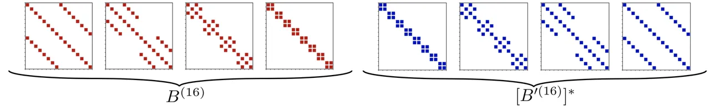
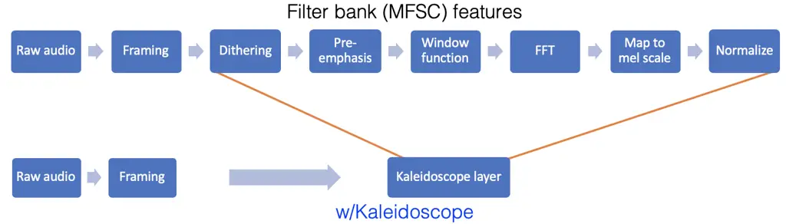
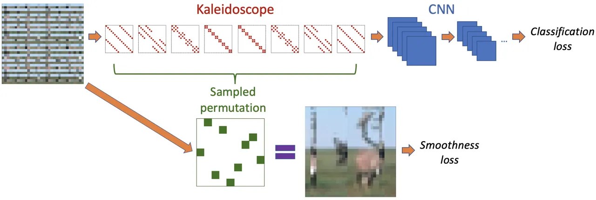
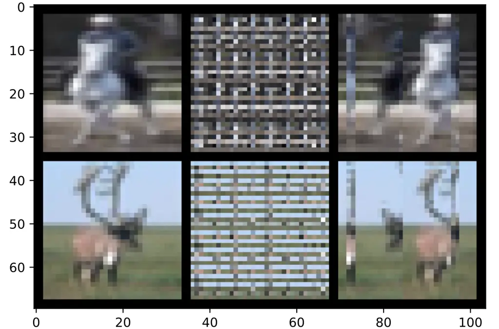
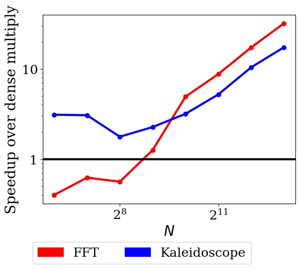
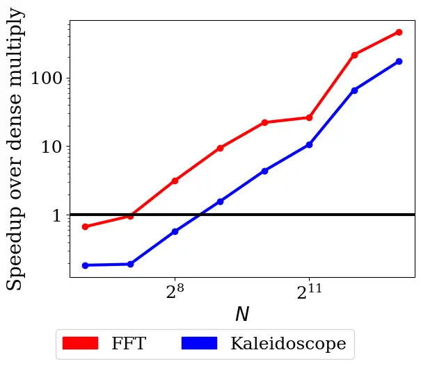

# Kaleidoscope: An Efficient, Learnable Representation For All Structured Linear Maps

Tri Dao Affiliation: Department of Computer Science, Stanford University
   Nimit S. Sohoni ^(†)^(†)thanks: These authors contributed equally
Affiliation: Institute for Computational and Mathematical Engineering,
Stanford University    Albert Gu^(†)^(†)footnotemark:
Affiliation: Department of Computer Science, Stanford University   
Matthew Eichhorn Affiliation: Center for Applied Mathematics, Cornell
University    Amit Blonder Affiliation: Department of Computer Science
and Engineering, University at Buffalo, SUNY    Megan Leszczynski
Affiliation: Department of Computer Science, Stanford University    Atri
Rudra Affiliation: Department of Computer Science and Engineering,
University at Buffalo, SUNY    Christopher Ré
Affiliation: {trid,nims,albertgu}@stanford.edu, mae226@cornell.edu,
amitblon@buffalo.edu, mleszczy@stanford.edu, atri@buffalo.edu,
chrismre@cs.stanford.edu Affiliation: Department of Computer Science,
Stanford University

August 24, 2026

###### Abstract

Modern neural network architectures use structured linear
transformations, such as low-rank matrices, sparse matrices,
permutations, and the Fourier transform, to improve inference speed and
reduce memory usage compared to general linear maps. However, choosing
which of the myriad structured transformations to use (and its
associated parameterization) is a laborious task that requires trading
off speed, space, and accuracy. We consider a different approach: we
introduce a family of matrices called _kaleidoscope matrices_
(K-matrices) that provably capture _any_ structured matrix with
near-optimal space (parameter) and time (arithmetic operation)
complexity. We empirically validate that K-matrices can be automatically
learned within end-to-end pipelines to replace hand-crafted procedures,
in order to improve model quality. For example, replacing channel
shuffles in ShuffleNet improves classification accuracy on ImageNet by
up to 5%. K-matrices can also simplify hand-engineered pipelines—we
replace filter bank feature computation in speech data preprocessing
with a learnable kaleidoscope layer, resulting in only 0.4% loss in
accuracy on the TIMIT speech recognition task. In addition, K-matrices
can capture latent structure in models: for a challenging permuted image
classification task, a K-matrix based representation of permutations is
able to learn the right latent structure and improves accuracy of a
downstream convolutional model by over 9%. We provide a practically
efficient implementation of our approach, and use K-matrices in a
Transformer network to attain 36% faster end-to-end inference speed on a
language translation task.

## 1 Introduction

Structured linear maps are fundamental and ubiquitous in modern machine
learning. Their efficiency in speed (fast algorithms) and space (few
parameters) can reduce computation and memory usage. The class of
structured linear maps includes fixed specialized transforms such as the
discrete Fourier transform (DFT) and Hadamard transform used in signal
processing (Cooley et al., 1969), convolutions for image, language, and
speech modeling (Gu et al., 2018), and low-rank and sparse matrices for
efficient storage and inference on edge devices (Yu et al., 2017). Forms
of structure such as sparsity have been at the forefront of recent
advances in ML (Frankle & Carbin, 2019), and are critical for on-device
and energy-efficient models, two application areas of tremendous recent
interest (Tsidulko, 2019; Schwartz et al., 2019).

There are a plethora of classes of structured linear maps, each with a
significantly different representation, algorithm, and implementation.
They have different tradeoffs in terms of inference speed, training
speed, and accuracy, and the conventional wisdom is that no one class
works uniformly well across all applications. As a result, ML
practitioners currently hand-pick specific classes of structured linear
maps for each of their applications. This is a difficult and
labor-intensive task.

Ideally, these problems should be addressed with a universal
representation for structured linear maps: (i) Such a parameterization
should be expressive enough to capture important classes of structure,
with a nearly tight parameter count and runtime: the space required to
represent the linear map should be close to optimal, and the resulting
algorithm for matrix vector multiplication should be close to the
fastest possible algorithm. (ii) The parameterization should be
differentiable in order to be learned as a component of end-to-end ML
pipelines, enabling it to easily be used as a drop-in replacement for
manually engineered structured components. (iii) The parameterization
should admit practically efficient algorithms for training and
inference, in terms of both speed and memory.

Currently, no class of structured linear maps satisfies all of these
criteria. Most existing classes of structured matrices—such as the class
of low-rank matrices—fail to tightly capture other important types of
structure. For example, the DFT has an efficient structured
representation of size $`O(n\log n)`$, yet cannot be well-approximated
by a low-rank transform of size $`\ll n^{2}`$. Another important type of
structure is sparsity; lots of exciting recent work has focused on the
design of sparse neural networks. For instance, sparse networks of
comparable quality to their dense counterparts—yet an order of magnitude
fewer parameters—may be created via pruning (Han et al., 2016) or by
identifying “winning lottery tickets” (Frankle & Carbin, 2019). In
parallel, recent theoretical results by De Sa et al. (2018) show that
sparsity and the notion of structure in linear maps are fundamentally
linked: any given matrix can be factored into a product of sparse
matrices with total parameter count equal to the efficiency (i.e.
minimum arithmetic circuit complexity) of the matrix. In other words,
the representation of linear maps as products of sparse matrices tightly
captures all forms of structure. Unfortunately, it is difficult to
actually learn these sparse factorizations, because it requires finding
the sparsity patterns of the factors—a discrete, nondifferentiable
search problem. Thus, current methods for training sparse neural
networks are either expensive (Frankle & Carbin, 2019) or rely on highly
hand-tuned heuristics for evolving the sparsity patterns throughout
training (Dettmers & Zettlemoyer, 2019).

By contrast, we propose a representation of linear maps as products of
sparse matrices with specific predefined sparsity patterns (Section 2),
and show that it does satisfy our desiderata: it retains the
expressiveness of unstructured sparsity, while being differentiably
learnable and efficient like other structured representations.
Concretely, our representation is based on products of a particular
building block known as a butterfly matrix (Parker, 1995; Dao et al.,
2019); we term such products kaleidoscope matrices (K-matrices for
short).¹¹ 1 A group of butterflies is known as a kaleidoscope. (i) Our
main theoretical contribution (Section 2.3) concerns the expressiveness
of this representation: we show that any structured linear map (i.e. one
that can be applied using $`s\ll n^{2}`$ arithmetic operations) can be
represented as a K-matrix, with a nearly tight number of parameters and
algorithmic complexity (both on the order of $`s`$ up to logarithmic
factors). (ii) The kaleidoscope representation is fully differentiable;
thus, all the parameters of a K-matrix can be learned using standard
optimization algorithms such as SGD. (iii) Because of their simple,
regular structure, K-matrices are practical and easy to use. We provide
memory- and runtime-efficient implementations of K-matrix multiplication
on CPU and GPU for training and inference, with a simple PyTorch
interface.

We empirically validate that, due to their expressiveness, learnability,
and efficiency, we can use K-matrices as a drop-in replacement for
linear components in deep learning models. In Section 3.1, we use
K-matrices to replace hand-crafted structure in two different settings.
We simplify the six steps of filter bank computation in speech
preprocessing into a single learnable K-matrix step, with only an 0.4%
accuracy drop on the TIMIT speech recognition task. We use K-matrices to
replace channel shuffles in ShuffleNet, improving ImageNet
classification accuracy by up to 5%. In Section 3.2, we show that
K-matrices can successfully recover latent structure; a K-matrix is used
to learn latent permutations in a permuted image dataset (Permuted
CIFAR), resulting in 9 points higher accuracy in a downstream CNN model.
In Section 3.3, we show that our efficient K-matrix multiplication
implementation can be applied to speed up real-world tasks: we replace
linear layers with K-matrices in a DynamicConv-Transformer network to
attain 36% faster end-to-end inference speed with a 1.0 drop in BLEU
score on the IWSLT14 German$`\rightarrow`$English translation task.

## 2 A nearly-tight parameterization of all structured matrices

We first present some background on the characterization of all
structured matrices (i.e. those with subquadratic multiplication
algorithms) as products of sparse factors, along with the definition of
butterfly matrices. We then propose a differentiable family of
kaleidoscope matrices, composed of products of butterfly matrices, and
prove their expressivity: all structured matrices can be represented in
this form, with almost optimal parameter count and runtime.

### 2.1 Background: sparse factorization, butterfly matrices

##### Sparse factorization

One method of constructing matrices with theoretically fast
matrix-vector multiplication algorithms is as a product of sparse
matrices, so that multiplication by an arbitrary vector has cost
proportional to the total number of nonzeros (NNZ) of the matrices in
the product. Surprisingly, the converse is also true. De Sa et al.
(2018) introduce the concept of sparse product width (SPW), which
roughly corresponds to the total NNZ in a factorization of a matrix, and
show that it is an asymptotically optimal descriptor of the algorithmic
complexity of matrix-vector multiplication (Bürgisser et al., 2013). We
use a similar argument in the proof of our main theorem (Section 2.3).
However, attempting to learn such a factorization of a given matrix is
difficult, as the sparsity constraint is not continuous. Moreover,
because of the possibly irregular sparsity patterns, it is difficult to
realize the theoretical speedups in practice (Gray et al., 2017; Gahvari
et al., 2007).

##### Butterfly matrices

Butterfly matrices, encoding the recursive divide-and-conquer structure
of the fast Fourier transform (FFT) algorithm, have long been used in
numerical linear algebra (Parker, 1995; Li et al., 2015) and machine
learning (Mathieu & LeCun, 2014; Jing et al., 2017; Munkhoeva et al.,
2018; Dao et al., 2019; Choromanski et al., 2019). Here we define
butterfly matrices, which we use as a building block for our hierarchy
of kaleidoscope matrices.

###### Definition 2.1.

A butterfly factor of size $`k\geq 2`$ (denoted as $`\mathbf{B}_{k}`$)
is a matrix of the form
$`\mathbf{B}_{k}=\begin{bmatrix}\mathbf{D}_{1}&\mathbf{D}_{2}\\
\mathbf{D}_{3}&\mathbf{D}_{4}\end{bmatrix}`$ where each
$`\mathbf{D}_{i}`$ is a $`\frac{k}{2}\times\frac{k}{2}`$ diagonal
matrix. We restrict $`k`$ to be a power of 2.

###### Definition 2.2.

A butterfly factor matrix of size $`n`$ with block size $`k`$ (denoted
as $`\mathbf{B}_{k}^{(n)}`$) is a block diagonal matrix of
$`\frac{n}{k}`$ (possibly different) butterfly factors of size $`k`$:

```math
\mathbf{B}_{k}^{(n)}=\mathrm{diag}\left(\left[\mathbf{B}_{k}\right]_{1},\left[\mathbf{B}_{k}\right]_{2},\ldots,\left[\mathbf{B}_{k}\right]_{\frac{n}{k}}\right)
```

###### Definition 2.3.

A butterfly matrix of size $`n`$ (denoted as $`\mathbf{B}^{(n)}`$) is a
matrix that can be expressed as a product of butterfly factor matrices:
$`\mathbf{B}^{(n)}=\mathbf{B}_{n}^{(n)}\mathbf{B}_{\frac{n}{2}}^{(n)}\ldots\mathbf{B}_{2}^{(n)}.`$
Equivalently, we may define $`\mathbf{B}^{(n)}`$ recursively as a matrix
that can be expressed in the following form:

```math
\mathbf{B}^{(n)}=\mathbf{B}_{n}^{(n)}\begin{bmatrix}[\mathbf{B}^{(\frac{n}{2})}]_{1}&0\\
0&[\mathbf{B}^{(\frac{n}{2})}]_{2}\end{bmatrix}
```

(Note that $`[\mathbf{B}^{(\frac{n}{2})}]_{1}`$ and
$`[\mathbf{B}^{(\frac{n}{2})}]_{2}`$ may be different.)

### 2.2 The kaleidoscope hierarchy

Using the building block of butterfly matrices, we formally define the
kaleidoscope ($`\mathcal{B}\mathcal{B}^{*}`$) hierarchy and prove its
expressiveness. This class of matrices serves as a fully differentiable
alternative to products of sparse matrices (Section 2.1), with similar
expressivity. In Appendix J, we show where various common structured
matrix classes are located within this hierarchy.

The building block for this hierarchy is the product of a butterfly
matrix and the (conjugate) transpose of another butterfly matrix (which
is simply a product of butterfly factors taken in the opposite order).
Figure 1 visualizes the sparsity patterns of the butterfly factors in
$`\mathcal{B}\mathcal{B}^{*}`$, where the red and blue dots represent
the allowed locations of nonzero entries.



Figure 1: Visualization of the fixed sparsity pattern of the building
blocks in $`\mathcal{B}\mathcal{B}^{*}`$, in the case $`n=16`$. The red
and blue dots represent all the possible locations of the nonzero
entries.

###### Definition 2.4 (Kaleidoscope hierarchy, kaleidoscope matrices).

- •
  Define $`\mathcal{B}`$ as the set of all matrices that can be
  expressed in the form $`\mathbf{B}^{(n)}`$ (for some $`n`$).
- •
  Define $`\mathcal{B}\mathcal{B}^{*}`$ as the set of matrices
  $`\mathbf{M}`$ of the form
  $`\mathbf{M}=\mathbf{M}_{1}\mathbf{M}_{2}^{*}`$  for some
  $`\mathbf{M}_{1},\mathbf{M}_{2}\in\mathcal{B}`$.
- •
  Define $`(\mathcal{B}\mathcal{B}^{*})^{w}`$ as the set of matrices
  $`\mathbf{M}`$ that can be expressed as
  $`\mathbf{M}=\mathbf{M}_{w}\ldots\mathbf{M}_{2}\mathbf{M}_{1}`$, with
  each $`\mathbf{M}_{i}\in\mathcal{B}\mathcal{B}^{*}`$
  ($`1\leq i\leq w`$). (The notation $`w`$ represents width.)
- •
  Define $`(\mathcal{B}\mathcal{B}^{*})^{w}_{e}`$ as the set of
  $`n\times n`$ matrices $`\mathbf{M}`$ that can be expressed as
  $`\mathbf{M}=\mathbf{S}\mathbf{E}\mathbf{S}^{T}`$ for some
  $`en\times en`$ matrix
  $`\mathbf{E}\in(\mathcal{B}\mathcal{B}^{*})^{w}`$, where
  $`\mathbf{S}\in\mathbb{F}^{n\times en}=\begin{bmatrix}\mathbf{I}_{n}&0&\ldots&0\end{bmatrix}`$
  (i.e. $`\mathbf{M}`$ is the upper-left corner of $`\mathbf{E}`$). (The
  notation $`e`$ represents expansion relative to $`n`$.)
- •
  $`\mathbf{M}`$ is a kaleidoscope matrix, abbreviated as K-matrix, if
  $`M\in(\mathcal{B}\mathcal{B}^{*})^{w}_{e}`$ for some $`w`$ and $`e`$.

The _kaleidoscope hierarchy_, or $`(\mathcal{B}\mathcal{B}^{*})`$
hierarchy, refers to the families of matrices
$`(\mathcal{B}\mathcal{B}^{*})^{1}_{e}\subseteq(\mathcal{B}\mathcal{B}^{*})^{2}_{e}\subseteq\dots`$,
for a fixed expansion factor $`e`$. Each butterfly matrix can represent
the identity matrix, so
$`(\mathcal{B}\mathcal{B}^{*})^{w}_{e}\subseteq(\mathcal{B}\mathcal{B}^{*})^{w+1}_{e}`$.
We show that the inclusion is proper in Appendix E. This hierarchy
generalizes the $`\mathcal{BP}`$ hierarchy proposed by Dao et al.
(2019), as shown in Appendix J.

##### Efficiency in space and speed

Each matrix in $`(\mathcal{B}\mathcal{B}^{*})^{w}_{e}`$ is a product of
$`2w`$ total butterfly matrices and transposes of butterfly matrices,
each of which is in turn a product of $`\log(ne)`$ factors with $`2ne`$
nonzeros (NNZ) each. Therefore, each matrix in
$`(\mathcal{B}\mathcal{B}^{*})^{w}_{e}`$ has $`4wne\log(ne)`$ parameters
and a matrix-vector multiplication algorithm of complexity
$`O(wne\log ne)`$ (by multiplying the vector with each sparse factor
sequentially). We prove this more formally in Appendix E. For the
applications in Section 3, $`w`$ and $`e`$ are small constants (up to
2), so those K-matrices have $`O(n\log n)`$ parameters and runtime.

### 2.3 All low-depth structured matrices are in the kaleidoscope hierarchy

We now present our main theoretical result: the fact that general linear
transformations, expressed as low-depth linear arithmetic circuits, are
captured in the $`\mathcal{B}\mathcal{B}^{*}`$ hierarchy with low width.
Arithmetic circuits are commonly used to formalize algebraic algorithmic
complexity (Bürgisser et al., 2013); we include a primer on this in
Appendix M. The quantities of interest are the total number of gates in
the circuit, representing the total number of steps required to perform
the algorithm for a serial processor, and the depth, representing the
minimum number of steps required for a parallel processor.

###### Theorem 1.

Let $`\mathbf{M}`$ be an $`n\times n`$ matrix such that multiplication
of $`\mathbf{M}`$ times an arbitrary vector $`\mathbf{v}`$ can be
represented as a linear arithmetic circuit with $`s`$ total gates and
depth $`d`$. Then,
$`\mathbf{M}\in(\mathcal{B}\mathcal{B}^{*})^{O(d)}_{O(\frac{s}{n})}`$.

The representation of such a matrix $`\mathbf{M}`$ in the
$`\mathcal{B}\mathcal{B}^{*}`$ hierarchy has $`O(ds\log s)`$ parameters
and yields a $`O(ds\log s)`$ multiplication algorithm, compared to the
$`O(s)`$ parameters and runtime of the circuit representation. To the
best of our knowledge, the most general classes of efficient matrices
that have been studied (De Sa et al., 2018) have depth $`d`$ on the
order of $`\log n`$ or $`\mathrm{poly}\log n`$. In these cases, the
representation with K-matrices matches the best known bounds up to
polylogarithmic factors.

The crux of the proof of Theorem 1 (shown in Appendix F) is the
construction of an almost tight representation of any sparse matrix as a
K-matrix (i.e. a product of butterfly matrices): specifically, we show
that any $`n\times n`$ sparse matrix with $`s`$ nonzeros is in
$`(\mathcal{B}\mathcal{B}^{*})_{O(1)}^{O(\left\lceil{\frac{s}{n}}\right\rceil)}`$
(Theorem 3, Appendix I). We then leverage the expressivity result of
products of sparse matrices to represent all arithmetic circuits
(similar to the sparse product width result of De Sa et al. (2018)
referenced in Section 2.1) to complete the proof of Theorem 1.

This intermediate result is also a novel characterization of sparse
matrices. For a matrix with $`s`$ NNZ, the kaleidoscope representation
has $`O(s\log n)`$ parameters and runtime, instead of the optimal
$`O(s)`$ parameters and runtime; so, we trade off an extra logarithmic
factor in space and time for full differentiability (thanks to the fixed
sparsity patterns in the representation). The intuition behind the
result is as follows: a sparse matrix with $`s`$ NNZ can be written as a
sum of $`\left\lceil{s/n}\right\rceil`$ matrices each with at most $`n`$
NNZ. Any $`n\times n`$ matrix with at most $`n`$ NNZ, up to permuting
the rows and columns, is a product of two butterfly matrices
(Lemma I.1). Sorting networks (Knuth, 1997) imply that permutation
matrices are in $`(\mathcal{B}\mathcal{B}^{*})^{O(\log n)}`$, but we
tighten the result to show that they are in fact in
$`\mathcal{B}\mathcal{B}^{*}`$ (Theorem 2, Appendix G). We thus obtain a
kaleidoscope representation for each summand matrix with $`O(n\log n)`$
parameters. By the addition closure property of the
$`\mathcal{B}\mathcal{B}^{*}`$ hierarchy (Lemma H.5), each sparse matrix
with $`s`$ NNZ then has a kaleidoscope representation with
$`O(s\log n)`$ parameters.

##### Tight representation for structured linear maps common in ML

Even though Theorem 1 suggests that the kaleidoscope representation can
be loose by logarithmic factors, many structured linear maps common in
ML can be represented in this hierarchy with an _optimal_ number of
parameters and runtime compared to the best known parameterizations, up
to constant factors. Appendix J includes several examples such as
discrete transforms (the DFT, discrete cosine transform (DCT), discrete
sine transform (DST), and Hadamard transform), convolution (i.e.
circulant matrices), Toeplitz matrices (Gray, 2006), structured matrices
for kernel approximation ($`(HD)^{3}`$ (Yu et al., 2016)) and compact
neural network design (Fastfood (Le et al., 2013), ACDC (Moczulski
et al., 2016)). There have been other large classes of structured
matrices proposed in the machine learning literature, such as
Toeplitz-like (Sindhwani et al., 2015) and low displacement rank
(LDR) (Thomas et al., 2018), but they are not known to be able to
capture these common structures as tightly as K-matrices can. More
detailed discussions are in Appendix A.

### 2.4 Extensions

##### ReLU networks with low-depth structured weight matrices

In Appendix L, we prove that finding an efficient circuit for a ReLU
network can be reduced to finding efficient circuits for each of its
weight matrices, with at most a constant factor greater size and
run-time (i.e. number of gates). We also show that ReLU networks with
kaleidoscope weight matrices have near-linear VC dimension in the number
of parameters, matching the bound for networks with unconstrained weight
matrices (Bartlett et al., 1999; Harvey et al., 2017) and LDR (Thomas
et al., 2018). This yields a corresponding sample complexity bound.

##### Orthogonal kaleidoscope hierarchy

Orthogonal butterfly matrices are one commonly used variant due to their
improved stability (Parker, 1995), where each butterfly factor is
constrained to be orthogonal: $`\begin{bmatrix}\mathbf{C}&\mathbf{S}\\
-\mathbf{S}&\mathbf{C}\end{bmatrix}`$ with $`\mathbf{C},\mathbf{S}`$
being diagonal and $`\mathbf{C}^{2}+\mathbf{S}^{2}=\mathbf{I}`$. Similar
to the $`\mathcal{B}\mathcal{B}^{*}`$ hierarchy, in Appendix K, we
define the $`\mathcal{OBB}`$ hierarchy consisting of products of
orthogonal butterfly matrices and diagonal matrices, and show that this
hierarchy has the same expressiveness as the
$`\mathcal{B}\mathcal{B}^{*}`$ hierarchy.

## 3 Empirical Evaluation

We validate three claims that suggest that kaleidoscopes are a promising
technique to learn different types of structure in modern architectures.

1.  1.  Section 3.1: for applications in speech and lightweight computer
        vision relying on highly hand-crafted structured transformations, we
        show that we can recover—and even improve—the quality of such
        architectures by simply replacing existing hand-structured
        components with K-matrices, with only a small overhead in memory and
        computation.
2.  2.  In Section 3.2, for a challenging task with latent structure
        (Permuted CIFAR-10), a K-matrix-based relaxation of permutations is
        able to learn the right latent permutation, yielding 9 points better
        accuracy in a downstream CNN compared to standard RNN and CNN
        baselines used on such permuted image classification tasks.
3.  3.  In Section 3.3, we show that, although not yet highly optimized, our
        current implementation of K-matrices can improve the inference
        throughput of DynamicConv Transformer, a state-of-the-art fast
        machine translation model, by 36%, with only a relatively small drop
        in translation quality.

In all of the above applications, as K-matrices are fully
differentiable, we simply train them jointly with the rest of the model
using standard learning algorithms (such as SGD). Full details for all
of the experiments (precise architectures, hyperparameters, etc.) are in
Appendix B ²² 2 Code that implements Kaleidoscope matrix multiplication
is available at
[https://github.com/HazyResearch/butterfly](https://github.com/HazyResearch/butterfly).

### 3.1 Replacing hand-crafted structures

We validate that kaleidoscope matrices can recover or improve on the
performance of hand-crafted structure in ML models. For example, a
single learnable kaleidoscope layer can be used to replace the
hand-engineered filter bank speech preprocessing pipeline with only 0.4%
loss in accuracy on the TIMIT speech recognition task (Section 3.1.1).
Replacing channel shuffles in ShuffleNet with learnable K-matrices
improves classification accuracy on ImageNet by up to 5.0%
(Section 3.1.2).

#### 3.1.1 Speech preprocessing



Figure 2: Comparison of the standard MFSC featurization pipeline with
our “kaleidoscope” pipeline.

We show that K-matrices can remove the need for hand-tuning by
significantly simplifying speech recognition data preprocessing
pipelines. In particular, we can entirely replace the complex
hand-crafted MFSC featurization commonly used in speech recognition
tasks with a fully learnable kaleidoscope layer, with only 0.4% drop in
accuracy on the TIMIT speech recognition benchmark. Results are
presented in Table 1. Our approach is competitive with the accuracy of
standard models that use hand-crafted features, and significantly
outperforms current approaches for learning from raw audio input.

| Method                           | Test set PER% | Raw audio input |
| -------------------------------- | ------------- | --------------- |
| MFSC features + LSTM             | $`14.2`$      | ✗               |
| SincNet (Ravanelli et al., 2019) | $`17.2`$      | ✓               |
| Kaleidoscope + LSTM              | $`14.6`$      | ✓               |

Table 1: TIMIT phoneme error rate (PER%) for different methods. Our
kaleidoscope, raw-input version of the model (row 3) performs
competitively with the original model trained on MFSC features (row 1),
with only an 0.4% drop in PER. It significantly outperforms existing
approaches that learn from raw audio, i.e. without handcrafted
featurization (e.g. SincNet \[row 2\], which to our knowledge attains
the previous state-of-the-art for learning from raw audio), and is only
0.8% less accurate than the overall state-of-the-art on TIMIT.³³ 3 The
current state-of-the-art results from Ravanelli et al. (2018) use a
concatenation of three different speech audio featurizations—MFSC, MFCC,
and fMLLR—as the neural network input, along with a customized RNN
architecture (LiGRU) specifically designed for speech recognition. 
Additional comparisons are given in Appendix B.1.

Modern speech recognition models currently rely on carefully
hand-crafted features extracted from the audio, which are then fed into
an acoustic model. By contrast, learning directly from the raw
audio—i.e. end-to-end learning from the audio waveform without any
manual featurization—obviates the need for this complicated and often
expensive preprocessing step. There have been recent attempts to learn
directly from raw audio, such as SincNet (Ravanelli & Bengio, 2018);
however, they often rely on specialized architectures designed by domain
experts. Instead, we use a standard RNN speech recognition architecture,
but use a learnable kaleidoscope layer to replace the featurization
steps.

The baseline architecture takes as input filter bank (MFSC) features,
which are a popular standard featurization for speech recognition
(Paliwal, 1999) and involve several steps hand-crafted specifically for
this domain. These features are extracted from the raw audio waveform,
and fed as the input into a Bi-LSTM model. We significantly simplify
this pipeline by replacing the featurization step with a trainable
kaleidoscope layer that is trained end-to-end together with the Bi-LSTM.
The original pipeline and our modified kaleidoscope version are depicted
in Figure 2.

The computation of MFSC features involves a series of painstakingly
hand-designed steps (further described in Appendix B.1), each involving
their own hyperparameters: (i) the waveform is framed (split into
chunks), (ii) the waveform is _dithered_ (noise is added), (iii)
pre-emphasis is applied, (iv) the Hamming window is applied, (v) the FFT
is applied and the power spectrum is computed, (vi) the result is mapped
to the mel scale (which involves applying a particular linear
transformation and then taking the logarithm of the result), (vii)
cepstral mean and variance normalization is applied. We replace the last
six steps (ii-vii) of this featurization process with a learnable
kaleidoscope layer; specifically, after windowing, we multiply the input
by a K-matrix, and then compute the logarithm of the power spectrum; the
output is fed into the Bi-LSTM model.

#### 3.1.2 Replacing CNN channel shuffle

We evaluate how K-matrices can improve the quality of hand-crafted,
lightweight architectures for computer vision tasks, without the need
for hand-tuning. We select ShuffleNet (Zhang et al., 2018), which is a
state-of-the-art lightweight CNN architecture that uses a manually
designed “channel shuffle” permutation matrix to improve performance. By
replacing this fixed permutation with a learnable K-matrix, we achieve
up to 5% further improvement in classification accuracy, without
hand-tuned components and with a modest space penalty of up to 10%.
Results are given in Table 5.

|                    | Shuffle       | Hadamard      | Kaleidoscope (K.) | K. vs. Shuffle            |
| ------------------ | ------------- | ------------- | ----------------- | ------------------------- |
| 0.25 ShuffleNet g8 | 44.1% (0.46M) | 43.9% (0.46M) | 49.2% (0.51M)     |    $`+`$5.0% ($`+`$0.05M) |
| 0.5 ShuffleNet g8  | 57.1% (1.0M)  | 56.2% (1.0M)  | 59.5% (1.1M)      | $`+`$2.4% ($`+`$0.1M)     |
| 1.0 ShuffleNet g8  | 65.3% (2.5M)  | 65.0% (2.5M)  | 66.5% (2.8M)      | $`+`$1.2% ($`+`$0.2M)     |

Table 2: Top-1 classification accuracy of ShuffleNet on ImageNet
validation set (parameter counts in parentheses). We compare our
approach (col. 3) with our reimplementation of ‘vanilla’ ShuffleNet
(col. 1) and a recent approach based on the Hadamard transform (col.
2).⁵⁵ 5 Despite our best effort, we were unable to reproduce the
original accuracy reported by Zhang et al. (2018), a problem similarly
faced by Zhao et al. (2019) and Lyu et al. (2019). Zhao et al. (2019)
use block Hadamard transform and pre-activation ShuffleNet, so their
results are not directly comparable with those reported here.  We report
results for different network width multipliers (# channels). The last
column shows the differences in accuracy and parameter count between our
approach and vanilla ShuffleNet; using a learnable K-matrix in place of
each fixed permutation (shuffle) or Hadamard matrix improves accuracy by
up to 5%.

Grouped convolution (Krizhevsky et al., 2012) is often used to reduce
parameter count and speed up inference compared to standard convolution,
but, by default, channels in different groups cannot exchange
information. To remedy this, ShuffleNet uses a permutation matrix to
shuffle the channels after each grouped convolution. Zhao et al. (2019)
propose to instead use the Hadamard transform before and after each
grouped convolution to mix the channels. In place of these
hand-engineered solutions, we use a K-matrix before and after each
grouped convolution, and learn these end-to-end together with the rest
of the network. As shown in Table 5, across a range of sizes, replacing
the channel shuffles with K-matrices results in improved performance at
comparable parameter counts.

### 3.2 Learning a latent permutation

We show that K-matrices can be used in a challenging task for which
existing classes of structured linear maps have not been found suitable.
We investigate the problem of image classification on a permuted image
dataset (Permuted CIFAR-10). This problem is challenging due to the
discrete nature of learning the latent permutation of the dataset; we
present a differentiable relaxation for this using a K-matrix as a key
component. Results are presented in Table 3; compared to methods that do
not have a permutation learning step, our approach gets 9 points higher
accuracy (84.4% to 93.6%), coming within 2 points of the accuracy on the
un-permuted dataset (94.9%).

|          |      |      |      |             |         |            |
| -------- | ---- | ---- | ---- | ----------- | ------- | ---------- |
| Model    | FC   | RNN  | CNN  | Dense + CNN | K + CNN | Unpermuted |
| Accuracy | 61.2 | 57.8 | 73.7 | 84.4        | 93.6    | 94.9       |

Table 3: Permuted CIFAR-10 validation set classification accuracy (%).
Our kaleidoscope layer is able to nearly perfectly recover the latent
structure, allowing a downstream CNN to approach the accuracy of a
standard ResNet18 on the unpermuted dataset (last column).

In this task, we use a permuted image classification dataset (Permuted
CIFAR-10), wherein a fixed global permutation is applied to the pixels
of every image in the original input set. Typically, only
fully-connected (FC) and recurrent models are applied to such
datasets (Le et al., 2015), because the permutation destroys locality in
the image, presenting a difficulty for CNNs. However, CNNs are much
better-suited for standard image tasks. We thus expect that learning the
permutation and then applying a standard CNN should outperform these
baselines. As mentioned in Section 2, the kaleidoscope hierarchy
provides a nearly tight parameterization of permutations; this makes
them a natural fit for the permutation learning step.

Experimentally, we use a K-matrix to represent a distribution over
permutations, which converges to a single permutation at the end of
training. The correct latent structure is learned by applying samples
from this distribution to the permuted training images, and minimizing
an auxiliary smoothness-based loss that encourages the reconstructed
images to be more “natural” (i.e. vary smoothly pixel-to-pixel). The
learned permutation is evaluated by training a ResNet18 with the
K-matrix permutation layer inserted at the beginning. Full details of
our approach are provided in Appendix B.3.

In Table 3, we compare our approach to a ResNet18 without this extra
K-matrix layer, a ResNet18 with an extra dense matrix at the beginning
instead of a K-matrix, and other baselines. As generic representations
such as unstructured matrices do not have the requisite properties to
fit in the pipeline, these baselines fail to effectively learn the
latent permutation. We emphasize that a K-matrix provides this ability
to recover latent structure despite not being specialized for
permutations. Figure 3 describes the pipeline and displays examples of
permuted and unpermuted images.





Figure 3: (a) (Left) Schematic describing permutation learning approach.
The inputs are multiplied by a K-matrix and then fed into a CNN, from
which the classification loss is computed. Separately, the input is
permuted by a permutation matrix sampled from the distribution described
by the K-matrix, and a “smoothness” loss (Rudin et al., 1992) is
computed from the result, as described in Appendix B.3. (b) (Right) Left
panel: original (unpermuted) example images. Center panel: the permuted
versions. Right panel: these images after then applying the permutation
recovered by the K-matrix. The K-matrix is able to nearly unscramble the
images into their unpermuted versions.

### 3.3 Speeding up Inference

We evaluate the inference speed benefit of using K-matrices on a real
language translation model. We choose the state-of-the-art DynamicConv
Transformer translation model (Wu et al., 2019), which offers 20%
inference speedup over the standard Transformer model, and replace dense
matrices in the decoder’s linear layers with K-matrices, which leads to
a further 36% inference speedup (Table 4).

As outlined in Section 2.3, K-matrices admit a simple and fast
$`O(n\log n)`$ matrix-vector multiplication algorithm. We provide fast
implementations of this algorithm in C++ and CUDA, with an interface to
PyTorch (Paszke et al., 2017), and use this implementation in our
experiments.

| Model                                        | \# params | BLEU | Sentences/sec | Tokens/sec |
| -------------------------------------------- | --------- | ---- | ------------- | ---------- |
| Transformer (Vaswani et al., 2017)           | 43M       | 34.4 | 3.0           | 66.4       |
| DynamicConv Transformer (Wu et al., 2019)    | 39M       | 35.2 | 3.6           | 80.2       |
| DynamicConv Transformer w/ K-matrices (ours) | 30M       | 34.2 | 4.9           | 103.4      |

Table 4: Inference speed on the IWSLT-14 German-English translation task
(test set). Using K-matrices instead of dense matrices in the
DynamicConv decoder linear layers results in 36% faster inference speed
(measured on a single-threaded CPU with a batch size of 1 and beam size
of 1).

We use K-matrices to replace all the linear layers in the decoder of
DynamicConv (since 90% of inference time is spent in the decoder). As
shown in Table 4, on the IWSLT-14 German-English translation task, this
yields a 25% smaller model with 36% faster inference time on CPU, at the
cost of 1.0 drop in BLEU score.⁶⁶ 6 BLEU score is a measure of
translation quality; higher is better. (Our model also nearly matches
the state-of-the-art BLEU performance of 2 years ago obtained by the
Transformer model (Vaswani et al., 2017), despite being over 60% faster
for inference than the Transformer.) The majority (55%) of inference
time is spent in matrix-vector multiplication; our implementation of
K-matrix-vector multiplication is about 2 times faster than the
optimized implementation of dense matrix-vector multiplication in the
Intel MKL library. Direct comparisons of K-matrix multiplication with
this and other highly-optimized routines such as the FFT are further
detailed in Appendix C.

## 4 Conclusion

We address the problem of having to manually choose among the numerous
classes of structured linear maps by proposing the universal
(expressive, efficient, and learnable) family of kaleidoscope matrices.
We prove that K-matrices can represent any structured linear maps with
near-optimal space and time complexity. Empirical validations suggest
that K-matrices are a promising and flexible way to employ structure in
modern ML; they can be used to reduce the need for hand-engineering,
capture challenging latent structure, and improve efficiency in models.
We are excited about future work on further hardware-optimized
implementations of K-matrices, to fully realize the size and speed
benefits of structured matrices on a broad array of real-world
applications.

#### Acknowledgments

We thank Avner May and Jian Zhang for their helpful feedback.

We gratefully acknowledge the support of DARPA under Nos. FA87501720095
(D3M), FA86501827865 (SDH), and FA86501827882 (ASED); NIH under No.
U54EB020405 (Mobilize), NSF under Nos. CCF1763315 (Beyond Sparsity),
CCF1563078 (Volume to Velocity), and 1937301 (RTML); ONR under No.
N000141712266 (Unifying Weak Supervision); the Moore Foundation, NXP,
Xilinx, LETI-CEA, Intel, IBM, Microsoft, NEC, Toshiba, TSMC, ARM,
Hitachi, BASF, Accenture, Ericsson, Qualcomm, Analog Devices, the Okawa
Foundation, American Family Insurance, Google Cloud, Swiss Re, and
members of the Stanford DAWN project: Teradata, Facebook, Google, Ant
Financial, NEC, VMWare, and Infosys. The U.S. Government is authorized
to reproduce and distribute reprints for Governmental purposes
notwithstanding any copyright notation thereon. Any opinions, findings,
and conclusions or recommendations expressed in this material are those
of the authors and do not necessarily reflect the views, policies, or
endorsements, either expressed or implied, of DARPA, NIH, ONR, or the
U.S. Government. Matthew Eichhorn and Atri Rudra’s research is supported
by NSF grant CCF-1763481.

## References

- Arjovsky et al. (2016) Martin Arjovsky, Amar Shah, and Yoshua Bengio.
  Unitary evolution recurrent neural networks. In _International
  Conference on Machine Learning_, pp. 1120–1128, 2016.
- Bai et al. (2018) Shaojie Bai, J. Zico Kolter, and Vladlen Koltun. An
  empirical evaluation of generic convolutional and recurrent networks
  for sequence modeling. _arXiv preprint arXiv:1803.01271_, 2018.
- Bartlett et al. (1999) Peter L. Bartlett, Vitaly Maiorov, and Ron
  Meir. Almost linear VC dimension bounds for piecewise polynomial
  networks. In _Advances in Neural Information Processing Systems_, pp.
  190–196, 1999.
- Benes (1964) Václav E Benes. Permutation groups, complexes, and
  rearrangeable connecting networks. _Bell System Technical Journal_,
  43(4):1619–1640, 1964.
- Benes (1965) Václav E Benes. _Mathematical theory of connecting
  networks and telephone traffic_. Academic press, 1965.
- Bürgisser et al. (2013) Peter Bürgisser, Michael Clausen, and
  Mohammad A. Shokrollahi. _Algebraic complexity theory_, volume 315.
  Springer Science & Business Media, 2013.
- Cho et al. (2014) Kyunghyun Cho, Bart Van Merriënboer, Caglar
  Gulcehre, Dzmitry Bahdanau, Fethi Bougares, Holger Schwenk, and Yoshua
  Bengio. Learning phrase representations using RNN encoder-decoder for
  statistical machine translation. _arXiv preprint
  arXiv:1406.1078_, 2014.
- Choromanski et al. (2019) Krzysztof Choromanski, Mark Rowland, Wenyu
  Chen, and Adrian Weller. Unifying orthogonal Monte Carlo methods. In
  _International Conference on Machine Learning_, pp. 1203–1212, 2019.
- Collobert et al. (2016) Ronan Collobert, Christian Puhrsch, and
  Gabriel Synnaeve. Wav2Letter: an end-to-end ConvNet-based speech
  recognition system. _arXiv preprint arXiv:1609.03193_, 2016.
- Cooley et al. (1969) James W. Cooley, Peter A. W. Lewis, and Peter D.
  Welch. The fast fourier transform and its applications. _IEEE
  Transactions on Education_, 12(1), 1969.
- Dally & Towles (2004) William James Dally and Brian Patrick Towles.
  _Principles and practices of interconnection networks_.
  Elsevier, 2004.
- Dao et al. (2019) Tri Dao, Albert Gu, Matthew Eichhorn, Atri Rudra,
  and Christopher Ré. Learning fast algorithms for linear transforms
  using butterfly factorizations. In _The International Conference on
  Machine Learning (ICML)_, 2019.
- De Sa et al. (2018) Christopher De Sa, Albert Gu, Rohan Puttagunta,
  Christopher Ré, and Atri Rudra. A two-pronged progress in structured
  dense matrix vector multiplication. In _Proceedings of the
  Twenty-Ninth Annual ACM-SIAM Symposium on Discrete Algorithms_, pp.
  1060–1079. SIAM, 2018.
- Dettmers & Zettlemoyer (2019) Tim Dettmers and Luke Zettlemoyer.
  Sparse networks from scratch: Faster training without losing
  performance. _arXiv preprint arXiv:1907.04840_, 2019.
- Driscoll et al. (1997) J. R. Driscoll, D. M. Healy, Jr., and D. N.
  Rockmore. Fast discrete polynomial transforms with applications to
  data analysis for distance transitive graphs. _SIAM J. Comput._,
  26(4):1066–1099, August 1997. ISSN 0097-5397. doi:
  10.1137/S0097539792240121. URL
  [http://dx.doi.org/10.1137/S0097539792240121](http://dx.doi.org/10.1137/S0097539792240121).
- Evci et al. (2019) Utku Evci, Trevor Gale, Jacob Menick, Pablo S.
  Castro, and Erich Elsen. Rigging the lottery: Making all tickets
  winners. _arXiv preprint arXiv:1911.11134_, 2019.
- Frankle & Carbin (2019) Jonathan Frankle and Michael Carbin. The
  lottery ticket hypothesis: Finding sparse, trainable neural networks.
  In _International Conference on Learning Representations
  (ICLR)_, 2019.
- Gahvari et al. (2007) Hormozd Gahvari, Mark Hoemmen, James Demmel, and
  Katherine Yelick. Benchmarking sparse matrix-vector multiply in five
  minutes. In _SPEC Benchmark Workshop_, 2007.
- Garofolo et al. (1993) John S. Garofolo, Lori F. Lamel, William M.
  Fisher, Jonathan G. Fiscus, David S. Pallett, Nancy L. Dahlgren, and
  Victor Zue. TIMIT acoustic-phonetic continuous speech corpus LDC93S1.
  Web Download. Philadelphia: Linguistic Data Consortium, 1993.
- Ghahremani et al. (2016) Pegah Ghahremani, Vimal Manohar, Daniel
  Povey, and Sanjeev Khudanpur. Acoustic modelling from the signal
  domain using CNNs. In _Interspeech_, pp. 3434–3438, 2016.
- Gray (2006) Robert M. Gray. Toeplitz and circulant matrices: A review.
  _Foundations and Trends® in Communications and Information Theory_,
  2(3):155–239, 2006.
- Gray et al. (2017) Scott Gray, Alec Radford, and Diederik P. Kingma.
  GPU kernels for block-sparse weights. _arXiv preprint
  arXiv:1711.09224_, 2017.
- Gu et al. (2018) Jiuxiang Gu, Zhenhua Wang, Jason Kuen, Lianyang Ma,
  Amir Shahroudy, Bing Shuai, Ting Liu, Xingxing Wang, Li Wang, Gang
  Wang, Jianfei Cai, and Tsuhan Chen. Recent advances in convolutional
  neural networks. _Pattern Recognition_, 77:354–377, 2018.
- Han et al. (2016) Song Han, Huizi Mao, and William J. Dally. Deep
  compression: Compressing deep neural networks with pruning, trained
  quantization and huffman coding. In _International Conference on
  Learning Representations (ICLR)_, 2016.
- Harris (1978) Fredric J. Harris. On the use of windows for harmonic
  analysis with the discrete fourier transform. In _Proceedings of the
  IEEE_, 1978.
- Harvey et al. (2017) Nick Harvey, Christopher Liaw, and Abbas
  Mehrabian. Nearly-tight VC-dimension bounds for piecewise linear
  neural networks. In Satyen Kale and Ohad Shamir (eds.), _Proceedings
  of the 2017 Conference on Learning Theory_, volume 65 of _Proceedings
  of Machine Learning Research_, pp. 1064–1068, Amsterdam, Netherlands,
  07–10 Jul 2017. PMLR. URL
  [http://proceedings.mlr.press/v65/harvey17a.html](http://proceedings.mlr.press/v65/harvey17a.html).
- He et al. (2016) Kaiming He, Xiangyu Zhang, Shaoqing Ren, and Jian
  Sun. Deep residual learning for image recognition. In _IEEE Conference
  on Computer Vision and Pattern Recognition (CVPR)_, 2016.
- Helmbold & Warmuth (2009) David P. Helmbold and Manfred K. Warmuth.
  Learning permutations with exponential weights. _Journal of Machine
  Learning Research_, 10(Jul):1705–1736, 2009.
- Householder (1958) Alston S. Householder. Unitary triangularization of
  a nonsymmetric matrix. _J. ACM_, 5(4):339–342, October 1958. ISSN
  0004-5411. doi: 10.1145/320941.320947. URL
  [http://doi.acm.org/10.1145/320941.320947](http://doi.acm.org/10.1145/320941.320947).
- Jing et al. (2017) Li Jing, Yichen Shen, Tena Dubcek, John Peurifoy,
  Scott Skirlo, Yann LeCun, Max Tegmark, and Marin Soljacić. Tunable
  efficient unitary neural networks (EUNN) and their application to
  RNNs. In _Proceedings of the 34th International Conference on Machine
  Learning-Volume 70_, pp. 1733–1741. JMLR. org, 2017.
- Jurafsky & Martin (2014) Dan Jurafsky and James H. Martin. _Speech and
  language processing_, volume 3. Pearson London, 2014.
- Kailath et al. (1979) Thomas Kailath, Sun-Yuan Kung, and Martin Morf.
  Displacement ranks of matrices and linear equations. _Journal of
  Mathematical Analysis and Applications_, 68(2):395–407, 1979.
- Khoo & Ying (2019) Yuehaw Khoo and Lexing Ying. SwitchNet: a neural
  network model for forward and inverse scattering problems. _SIAM
  Journal on Scientific Computing_, 41(5):A3182–A3201, 2019.
- Knuth (1997) Donald Ervin Knuth. _The art of computer programming,
  Volume 3: Sorting and Searching_. Pearson Education, 1997.
- Krizhevsky et al. (2012) Alex Krizhevsky, Ilya Sutskever, and
  Geoffrey E. Hinton. Imagenet classification with deep convolutional
  neural networks. In _Advances in Neural Information Processing
  Systems_, pp. 1097–1105, 2012.
- Le et al. (2013) Quoc Le, Tamás Sarlós, and Alexander Smola.
  Fastfood-computing hilbert space expansions in loglinear time. In
  _International Conference on Machine Learning_, pp. 244–252, 2013.
- Le et al. (2015) Quoc V. Le, Navdeep Jaitly, and Geoffrey E. Hinton. A
  simple way to initialize recurrent networks of rectified linear units.
  _arXiv preprint arXiv:1504.00941_, 2015.
- Li et al. (2017) Lisha Li, Kevin Jamieson, Giulia DeSalvo, Afshin
  Rostamizadeh, and Ameet Talwalkar. Hyperband: A novel bandit-based
  approach to hyperparameter optimization. _The Journal of Machine
  Learning Research_, 18(1):6765–6816, 2017.
- Li et al. (2015) Yingzhou Li, Haizhao Yang, Eileen R. Martin,
  Kenneth L. Ho, and Lexing Ying. Butterfly factorization. _Multiscale
  Modeling & Simulation_, 13(2):714–732, 2015.
- Li et al. (2018) Yingzhou Li, Haizhao Yang, and Lexing Ying.
  Multidimensional butterfly factorization. _Applied and Computational
  Harmonic Analysis_, 44(3):737–758, 2018.
- Li et al. (2020) Yingzhou Li, Xiuyuan Cheng, and Jianfeng Lu.
  Butterfly-Net: Optimal function representation based on convolutional
  neural networks. _Communications in Computational Physics_,
  28(5):1838–1885, 2020.
- Liu et al. (1993) Fu-Hua Liu, Richard M. Stern, Xuedong Huang, and
  Alejandro Acero. Efficient cepstral normalization for robust speech
  recognition. In _ARPA Workshop on Human Language Technology_, 1993.
- Lyu et al. (2019) Jiancheng Lyu, Shuai Zhang, Yingyong Qi, and Jack
  Xin. Autoshufflenet: Learning permutation matrices via an exact
  lipschitz continuous penalty in deep convolutional neural networks.
  _arXiv preprint arXiv:1901.08624_, 2019.
- Makhoul (1980) J. Makhoul. A fast cosine transform in one and two
  dimensions. _IEEE Transactions on Acoustics, Speech, and Signal
  Processing_, 28(1):27–34, February 1980. ISSN 0096-3518. doi:
  10.1109/TASSP.1980.1163351.
- Mathieu & LeCun (2014) Michael Mathieu and Yann LeCun. Fast
  approximation of rotations and Hessians matrices. _arXiv preprint
  arXiv:1404.7195_, 2014.
- Mena et al. (2018) Gonzalo Mena, David Belanger, Scott Linderman, and
  Jasper Snoek. Learning latent permutations with Gumbel-Sinkhorn
  networks. In _International Conference on Learning
  Representations_, 2018. URL
  [https://openreview.net/forum?id=Byt3oJ-0W](https://openreview.net/forum?id=Byt3oJ-0W).
- Mhammedi et al. (2017) Zakaria Mhammedi, Andrew Hellicar, Ashfaqur
  Rahman, and James Bailey. Efficient orthogonal parametrisation of
  recurrent neural networks using householder reflections. In
  _Proceedings of the 34th International Conference on Machine
  Learning-Volume 70_, pp. 2401–2409. JMLR. org, 2017.
- Mocanu et al. (2018) Decebal C. Mocanu, Elena Mocanu, Peter Stone,
  Phuong H. Nguyen, Madeleine Gibescu, and Antonio Liotta. Scalable
  training of artificial neural networks with adaptive sparse
  connectivity inspired by network science. _Nature Communications_,
  9, 2018.
- Moczulski et al. (2016) Marcin Moczulski, Misha Denil, Jeremy
  Appleyard, and Nando de Freitas. ACDC: a structured efficient linear
  layer. In _International Conference on Learning
  Representations_, 2016.
- Mostafa & Wang (2019) Hesham Mostafa and Xin Wang. Parameter efficient
  training of deep convolutional neural networks by dynamic sparse
  reparameterization. In _The International Conference on Machine
  Learning (ICML)_, 2019.
- Munkhoeva et al. (2018) Marina Munkhoeva, Yermek Kapushev, Evgeny
  Burnaev, and Ivan Oseledets. Quadrature-based features for kernel
  approximation. In S. Bengio, H. Wallach, H. Larochelle, K. Grauman,
  N. Cesa-Bianchi, and R. Garnett (eds.), _Advances in Neural
  Information Processing Systems 31_, pp. 9165–9174. Curran Associates,
  Inc., 2018.
- Olshevsky & Shokrollahi (2000) Vadim Olshevsky and Mohammad Amin
  Shokrollahi. Matrix-vector product for confluent Cauchy-like matrices
  with application to confluent rational interpolation. In _Proceedings
  of the Thirty-Second Annual ACM Symposium on Theory of Computing, May
  21-23, 2000, Portland, OR, USA_, pp. 573–581, 2000. doi:
  10.1145/335305.335380. URL
  [http://doi.acm.org/10.1145/335305.335380](http://doi.acm.org/10.1145/335305.335380).
- Ott et al. (2019) Myle Ott, Sergey Edunov, Alexei Baevski, Angela Fan,
  Sam Gross, Nathan Ng, David Grangier, and Michael Auli. fairseq: A
  fast, extensible toolkit for sequence modeling. In _Proceedings of
  NAACL-HLT 2019: Demonstrations_, 2019.
- Palaz et al. (2013) Dimitri Palaz, Ronan Collobert, and Mathew
  Magimai-Doss. Estimating phoneme class conditional probabilities from
  raw speech signal using convolutional neural networks. In
  _Interspeech_, 2013.
- Paliwal (1999) Kuldip Paliwal. On the use of filter-bank energies as
  features for robust speech recognition. In _International Symposium on
  Signal Processing and its Applications (ISSPA)_, 1999.
- Pan (2001) Victor Y. Pan. _Structured Matrices and Polynomials:
  Unified Superfast Algorithms_. Springer-Verlag New York, Inc., New
  York, NY, USA, 2001. ISBN 0-8176-4240-4.
- Panaretos & Tavakoli (2013) Victor M. Panaretos and Shahin Tavakoli.
  Fourier analysis of stationary time series in function space. _The
  Annals of Statistics_, 41(2):568–603, 2013.
- Parker (1995) D. Stott Parker. Random butterfly transformations with
  applications in computational linear algebra. Technical report,
  UCLA, 1995.
- Paszke et al. (2017) Adam Paszke, Sam Gross, Soumith Chintala, Gregory
  Chanan, Edward Yang, Zachary DeVito, Zeming Lin, Alban Desmaison, Luca
  Antiga, and Adam Lerer. Automatic differentiation in pytorch. In
  _Advances in Neural Information Processing Systems (NeurIPS) -
  Autodiff Workshop_, 2017.
- Povey et al. (2011) Daniel Povey, Arnab Ghoshal, Gilles Boulianne,
  Lukas Burget, Ondrej Glembek, Nagendra Goel, Mirko Hannemann, Petr
  Motlicek, Yanmin Qian, Petr Schwarz, Jan Silovsky, Georg Stemmer, and
  Karel Vesely. The kaldi speech recognition toolkit. In _IEEE 2011
  Workshop on Automatic Speech Recognition and Understanding_. IEEE
  Signal Processing Society, 2011.
- Ravanelli & Bengio (2018) Mirco Ravanelli and Yoshua Bengio. Speaker
  recognition from raw waveform with sincnet. In _IEEE Workshop on
  Spoken Language Technology_, 2018.
- Ravanelli et al. (2018) Mirco Ravanelli, Philemon Brakel, Maurizio
  Omologo, and Yoshua Bengio. Light gated recurrent units for speech
  recognition. In _IEEE Transactions on Emerging Topics in Computational
  Intelligence_, volume 2, pp. 92–102, 2018.
- Ravanelli et al. (2019) Mirco Ravanelli, Titouan Parcollet, and Yoshua
  Bengio. The PyTorch-Kaldi speech recognition toolkit. In _IEEE
  International Conference on Acoustics, Speech, and Signal Processing
  (ICASSP)_, 2019.
- Rokhlin & Tygert (2006) Vladimir Rokhlin and Mark Tygert. Fast
  algorithms for spherical harmonic expansions. _SIAM Journal on
  Scientific Computing_, 27(6):1903–1928, 2006.
- Rudin et al. (1992) Leonid I. Rudin, Stanley Osher, and Emad Fatemi.
  Nonlinear total variation based noise removal algorithms. _Physica D:
  nonlinear phenomena_, 60(1-4):259–268, 1992.
- Russakovsky et al. (2015) Olga Russakovsky, Jia Deng, Hao Su, Jonathan
  Krause, Sanjeev Satheesh, Sean Ma, Zhiheng Huang, Andrej Karpathy,
  Aditya Khosla, Michael Bernstein, Alexander C. Berg, and Li Fei-Fei.
  ImageNet Large Scale Visual Recognition Challenge. _International
  Journal of Computer Vision (IJCV)_, 115(3):211–252, 2015. doi:
  10.1007/s11263-015-0816-y.
- Sainath et al. (2013) Tara N. Sainath, Brian Kingsbury, Vikas
  Sindhwani, Ebru Arisoy, and Bhuvana Ramabhadran. Low-rank matrix
  factorization for deep neural network training with high-dimensional
  output targets. In _Proceedings of the IEEE International Conference
  on Acoustics, Speech and Signal Processing_, pp. 6655–6659.
  IEEE, 2013.
- Sainath et al. (2015) Tara N. Sainath, Ron J. Weiss, Andrew Senior,
  Kevin W. Wilson, and Oriol Vinyals. Learning the speech front-end with
  raw waveform CLDNNs. In _Interspeech_, 2015.
- Schwartz et al. (2019) Roy Schwartz, Jesse Dodge, Noah A. Smith, and
  Oren Etzioni. Green AI. _arXiv preprint arXiv:1907.10597_, 2019.
- Sindhwani et al. (2015) Vikas Sindhwani, Tara N. Sainath, and Sanjiv
  Kumar. Structured transforms for small-footprint deep learning. In
  _Advances in Neural Information Processing Systems_, pp.
  3088–3096, 2015.
- Stevens et al. (1937) S. S. Stevens, J. Volkmann, and E. B. Newman. A
  scale for the measurement of the psychological magnitude pitch.
  _Journal of the Acoustic Society of America_, 8(3), 1937.
- Szegö (1967) G. Szegö. _Orthogonal Polynomials_. Number v. 23 in
  American Mathematical Society colloquium publications. American
  Mathematical Society, 1967. ISBN 9780821889527. URL
  [https://books.google.com/books?id=3hcW8HBh7gsC](https://books.google.com/books?id=3hcW8HBh7gsC).
- Thomas et al. (2018) Anna T. Thomas, Albert Gu, Tri Dao, Atri Rudra,
  and Christopher Ré. Learning compressed transforms with low
  displacement rank. In _Advances in Neural Information Processing
  Systems (NeurIPS)_, 2018.
- Trinh et al. (2018) Trieu H. Trinh, Andrew M Dai, Minh-Thang Luong,
  and Quoc V. Le. Learning longer-term dependencies in RNNs with
  auxiliary losses. _arXiv preprint arXiv:1803.00144_, 2018.
- Tsidulko (2019) Joseph Tsidulko. Google showcases on-device artificial
  intelligence breakthroughs at I/O. _CRN_, 2019.
- Tygert (2008) Mark Tygert. Fast algorithms for spherical harmonic
  expansions, ii. _Journal of Computational Physics_,
  227(8):4260–4279, 2008.
- Tygert (2010a) Mark Tygert. Fast algorithms for spherical harmonic
  expansions, iii. _Journal of Computational Physics_,
  229(18):6181–6192, 2010a.
- Tygert (2010b) Mark Tygert. Recurrence relations and fast algorithms.
  _Applied and Computational Harmonic Analysis_, 28(1):121–128, 2010b.
- van den Oord et al. (2016) Aaron van den Oord, Sander Dieleman, Heiga
  Zen, Karen Simonyan, Oriol Vinyals, Alex Graves, Nal Kalchbrenner,
  Andrew Senior, and Koray Kavukcuoglu. WaveNet: A generative model for
  raw audio. _arXiv preprint arXiv:1609.03499_, 2016.
- Vaswani et al. (2017) Ashish Vaswani, Noam Shazeer, Niki Parmar, Jakob
  Uszkoreit, Llion Jones, Aidan N. Gomez, Lukasz Kaiser, and Illia
  Polosukhin. Attention is all you need. In _Advances in Neural
  Information Processing Systems (NeurIPS)_, 2017.
- Wisdom et al. (2016) Scott Wisdom, Thomas Powers, John Hershey,
  Jonathan Le Roux, and Les Atlas. Full-capacity unitary recurrent
  neural networks. In _Advances in Neural Information Processing
  Systems_, pp. 4880–4888, 2016.
- Wu et al. (2019) Felix Wu, Angela Fan, Alexei Baevski, Yann N Dauphin,
  and Michael Auli. Pay less attention with lightweight and dynamic
  convolutions. In _International Conference on Learning Representations
  (ICLR)_, 2019.
- Xie et al. (2017) Saining Xie, Ross Girshick, Piotr Dollár, Zhuowen
  Tu, and Kaiming He. Aggregated residual transformations for deep
  neural networks. In _Proceedings of the IEEE conference on computer
  vision and pattern recognition_, pp. 1492–1500, 2017.
- Yu et al. (2015) Felix X. Yu, Sanjiv Kumar, Henry A. Rowley, and
  Shih-Fu Chang. Compact nonlinear maps and circulant extensions.
  _CoRR_, abs/1503.03893, 2015.
- Yu et al. (2016) Felix X. Yu, Ananda T. Suresh, Krzysztof M.
  Choromanski, Daniel N. Holtmann-Rice, and Sanjiv Kumar. Orthogonal
  random features. In D. D. Lee, M. Sugiyama, U. V. Luxburg, I. Guyon,
  and R. Garnett (eds.), _Advances in Neural Information Processing
  Systems 29_, pp. 1975–1983. Curran Associates, Inc., 2016.
- Yu et al. (2017) Xiyu Yu, Tongliang Liu, Xinchao Wang, and Dacheng
  Tao. On compressing deep models by low rank and sparse decomposition.
  In _IEEE Conference on Computer Vision and Pattern Recognition
  (CVPR)_, 2017.
- Zeghidour et al. (2018) Neil Zeghidour, Nicolas Usunier, Iasonas
  Kokkinos, Thomas Schatz, Gabriel Synnaeve, and Emmanuel Dupoux.
  Learning filterbanks from raw speech for phone recognition. In _IEEE
  International Conference on Acoustics, Speech, and Signal Processing
  (ICASSP)_, 2018.
- Zhang et al. (2018) Xiangyu Zhang, Xinyu Zhou, Mengxiao Lin, and Jian
  Sun. Shufflenet: An extremely efficient convolutional neural network
  for mobile devices. In _Proceedings of the IEEE Conference on Computer
  Vision and Pattern Recognition_, pp. 6848–6856, 2018.
- Zhao et al. (2019) Ritchie Zhao, Yuwei Hu, Jordan Dotzel, Christopher
  De Sa, and Zhiru Zhang. Building efficient deep neural networks with
  unitary group convolutions. In _Proceedings of the IEEE Conference on
  Computer Vision and Pattern Recognition_, pp. 11303–11312, 2019.
- Zhu & Gupta (2017) Michael Zhu and Suyog Gupta. To prune, or not to
  prune: exploring the efficacy of pruning for model compression. _arXiv
  preprint arXiv:1710.01878_, 2017.

## Appendix A Related Work

### A.1 Structured matrices in machine learning

Structured linear maps such as the DFT, the Hadamard transform and
convolution are a workhorse of machine learning, with diverse
applications including data preprocessing, random projection,
featurization, and model compression. For example, the DFT is a crucial
step in the standard filter bank speech preprocessing pipeline (Jurafsky
& Martin, 2014), and is commonly used when dealing with time series data
in general (Panaretos & Tavakoli, 2013). Fast random projection and
kernel approximation methods rely on the fast Hadamard transform (Le
et al., 2013; Yu et al., 2016) and convolution (Yu et al., 2015), and
convolution is a critical component of modern image processing
architectures (Krizhevsky et al., 2012) as well as being useful in
speech recognition (Zeghidour et al., 2018) and natural language
processing (Wu et al., 2019). Large learnable classes of structured
matrices such as Toeplitz-like matrices (Sindhwani et al., 2015) and
low-displacement rank (LDR) matrices (Thomas et al., 2018) have been
used for model compression. However, despite their theoretical speedup,
these structured matrix classes lack efficient implementations,
especially on GPUs. Therefore, their use has largely been confined to
small models (e.g. single hidden layer neural nets) and small datasets
(e.g. CIFAR-10).

Butterfly matrices encode the recursive divide-and-conquer structure of
the fast Fourier transform (FFT) algorithm. They were first used in
numerical linear algebra for fast preconditioning (Parker, 1995). The
butterfly factorization is then generalized to encompass complementary
low-rank matrices commonly encountered in solving differential and
integral equations (Rokhlin & Tygert, 2006; Tygert, 2008; Tygert, 2010b;
Tygert, 2010a; Li et al., 2015; Li et al., 2018; Khoo & Ying, 2019; Li
et al., 2020). In machine learning, butterfly matrices have been use to
approximate the Hessian for fast optimization (Mathieu & LeCun, 2014),
and to perform fast random projection (Jing et al., 2017; Munkhoeva
et al., 2018; Choromanski et al., 2019). Dao et al. (2019) show that
butterfly matrices can be used to learn fast algorithms for discrete
transforms such as the Fourier transform, cosine/sine transform,
Hadamard transform, and convolution.

### A.2 Sparse matrices

Several classes of structured linear transforms are ubiquitous in modern
deep learning architectures; particularly widespread examples include
convolution and multiheaded attention. Recently, attempts to impose
sparsity on the neural network weights have been gaining traction.
State-of-the art approaches of this type typically accomplish this by
pruning small weights (either gradually during training (Zhu & Gupta,
2017), or post-training (Han et al., 2016)) or by training a dense
network and then identifying “winning lottery tickets”—sparse
subnetworks which may then be retrained from scratch with appropriate
initialization (Frankle & Carbin, 2019). Importantly, these approaches
start from a dense network, and therefore training is expensive. There
is also a more nascent line of work that aims to train unstructured
sparse neural networks directly (Mocanu et al., 2018; Mostafa & Wang,
2019; Dettmers & Zettlemoyer, 2019; Evci et al., 2019). These approaches
maintain a constant network sparsity level throughout training, and use
heuristics to evolve the sparsity pattern during training. One drawback
is that the indices of the nonzero entries need to be stored in addition
to the entry values themselves, which increases the memory required to
store the sparse weight tensors. Another drawback is that these
approaches to learn the sparsity pattern are based on intricate
heuristics, which can be brittle. We note that these heuristic
sparsification techniques could potentially be combined with our
approach, to further sparsify the K-matrix factors.

### A.3 Speech recognition from raw audio

Numerous works focus on the problem of speech recognition from raw audio
input, i.e. without manual featurization. SincNet (Ravanelli & Bengio, 2018) is a CNN-based architecture parameterized with sinc functions,
designed so that the first convolutional layer imitates a band-pass
filter. Zeghidour et al. (2018) formulate a learnable version of a
filter bank featurization; their filters are initialized as an
approximation of MFSC features and then fine-tuned jointly with the rest
of the model. Sainath et al. (2015) proposed a powerful combined
convolutional LSTM (CLDNN)-based model for learning from raw audio,
using a large amount of training data. The WaveNet generative
architecture (van den Oord et al., 2016), based on dilated convolutions,
has been adapted to speech recognition and can be trained on raw audio.
Other approaches that can learn from raw audio can be found in (Palaz
et al., 2013; Collobert et al., 2016; Ghahremani et al., 2016). To our
knowledge, the 14.6% PER achieved by our kaleidoscope + LSTM model on
the TIMIT test set is the lowest error rate obtained by a model trained
directly on the raw audio.

### A.4 Learning permutations

Permutation matrices find use in tasks such as matching and sorting
(among many others). Techniques to obtain posterior distributions over
permutations have been developed, such as the exponential weights
algorithm (Helmbold & Warmuth, 2009) and the Gumbel-Sinkhorn
network (Mena et al., 2018).

Classifying images with permuted pixels is a standard task to benchmark
the ability of RNNs to learn long range dependencies. Le et al. (2015)
propose the Permuted MNIST task, in which the model has to classify
digit images with all the pixels permuted. Many new RNN architectures,
with unitary or orthogonal weight matrices to avoid gradient explosion
or vanishing, have been proposed and tested on this task (Le et al.,
2015; Arjovsky et al., 2016; Wisdom et al., 2016; Mhammedi et al., 2017;
Trinh et al., 2018). Standard gated RNN architectures such as LSTM and
GRU have also been found to be competitive with these new RNN
architectures on this task (Bai et al., 2018).

## Appendix B Additional Experimental Details

### B.1 Speech preprocessing

In this section, we fully describe our settings and procedures for the
speech preprocessing experiments in Section 3.1.1, and present
additional auxiliary baselines and results.

#### B.1.1 Experimental setup

We evaluate our speech recognition models on the TIMIT speech corpus
(Garofolo et al., 1993), a standard benchmark for speech recognition.
The input is audio (16-bit, 16 kHz .wav format), and the target is the
transcription into a sequence of phonemes (units of spoken sound). Our
evaluation metric is the phoneme error rate (PER) between the true
phoneme sequence and the phoneme sequence predicted by our model. We use
PyTorch (Paszke et al., 2017), the Kaldi speech recognition toolkit
(Povey et al., 2011), and the PyTorch-Kaldi toolkit (Ravanelli et al., 2019) for developing PyTorch speech recognition models for all our
experiments and evaluations.

#### B.1.2 Model and evaluation

Our baseline Bi-LSTM architecture is taken from the PyTorch-Kaldi
repository.⁷⁷ 7 This open-source repository can be found at
[https://github.com/mravanelli/pytorch-kaldi](https://github.com/mravanelli/pytorch-kaldi).
This is a strong baseline model that, to the best of our knowledge,
matches state-of-the-art performance for models that use a single type
of input featurization (Ravanelli et al., 2019). The original Bi-LSTM
model takes as input filter bank features. These are computed as
follows: (i) the waveform is framed (split into chunks of 25 ms each
that overlap by 10 ms each), (ii) the waveform is dithered (zero-mean
Gaussian random noise is added), (iii) pre-emphasis is applied to
amplify high frequencies, (iv) the Hamming window function (Harris, 1978) is applied, (v) the FFT is applied, and the power spectrum of the
resulting (complex-valued) output is computed, (vi) the power spectrum
(which has dimension 512) is mapped to the “mel scale” (which is a scale
intended to mimic human auditory perception (Stevens et al., 1937)) by
multiplication with a specific banded matrix of dimension
$`512\times 23`$, and the entrywise logarithm of the output is taken
(the 23 outputs are called the filters), and (vii) cepstral mean and
variance normalization (Liu et al., 1993) is applied. Numerical
hyperparameters of this procedure include the dither noise scale, the
pre-emphasis coefficient, the Hamming window size, the number of mel
filters, and more; we kept all these the same as the Kaldi/PyTorch-Kaldi
defaults.

In contrast, our “K-matrix version” of the model takes as input the raw
waveform, split into chunks the same way as before but with no
normalization, dithering, or other preprocessing, which is then fed into
a complex-valued kaleidoscope \[$`(\mathcal{B}\mathcal{B}^{*})^{2}`$\]
matrix. Similarly to the nonlinear steps in computing filter bank
features, the logarithm of the power spectrum of the output (which has
dimension 512) is then computed. This output is fed into the Bi-LSTM;
the Bi-LSTM and kaleidoscope layer are trained together in standard
end-to-end fashion. The Bi-LSTM architecture is not modified aside from
changing the input dimension from 23 to 512; this (along with the
$`\approx 75`$K parameters in the kaleidoscope layer itself) results in
approximately a 1.1M increase in the total number of parameters compared
to the model that takes in MFSC features (a modest 8% relative
increase). Total training time for our kaleidoscope-based architecture
is 7% greater than that required for the model that uses MFSC features,
not counting the time required to precompute the MFSC features; the
FLOPs for inference-time are approximately 15% greater (mostly due to
the larger dimension of the input to the Bi-LSTM; the kaleidoscope layer
accounts for less than 0.5% of the total FLOPs).

As baselines, we also compare to inserting other types of linear
transformations before the Bi-LSTM: fixed linear transformations (such
as the fixed FFT, or no transform at all \[i.e. the identity\]), other
trainable structured layers (low-rank, circulant, and sparse \[using the
sparse training algorithm of Dettmers & Zettlemoyer (2019)\]), and a
trainable _unstructured_ (dense) linear layer. The kaleidoscope layer
performs the best out of all such approaches. The fact that it
outperforms even a dense linear layer with more parameters is
particularly notable, as it suggests that the structural bias imposed by
the K-matrix representation is beneficial for performance on this task.
Full results are given in Table 5.

| Model                            | Test set PER%   | \# Parameters |
| -------------------------------- | --------------- | ------------- |
| Low rank + LSTM                  | $`23.6\pm 0.9`$ | 15.5M         |
| Sparse + LSTM                    | $`21.7\pm 0.9`$ | 15.5M         |
| Circulant + LSTM                 | $`23.9\pm 0.9`$ | 15.4M         |
| Dense + LSTM                     | $`15.4\pm 0.6`$ | 15.9M         |
| FFT + LSTM                       | $`15.7\pm 0.1`$ | 15.4M         |
| Identity + LSTM                  | $`20.7\pm 0.3`$ | 15.4M         |
| Kaleidoscope + LSTM              | $`14.6\pm 0.3`$ | 15.4M         |
| MFSC features + LSTM             | $`14.2\pm 0.2`$ | 14.3M         |
| SincNet (Ravanelli et al., 2019) | $`17.2`$        | 10.0M         |
| LiGRU (Ravanelli et al., 2018)   | $`13.8`$        | 12.3M         |

Table 5: TIMIT phoneme error rate (PER%, $`\pm`$ standard deviation
across 5 random seeds).

In our experiments, we grid search the initial learning rate for the
“preprocessing layer” (if applicable) in {5e-5, 1e-4, 2e-4, 4e-4, 8e-4,
1.6e-3}, and fix all other hyperparameters (including the initial
learning rates for the other parts of the network) to their default
values in the PyTorch-Kaldi repository. The model and any preprocessing
layers are trained end-to-end with the RMSProp optimizer for 24 epochs
(as per the defaults in PyTorch-Kaldi). For each model, we use the
validation set to select the best preprocessing learning rate, while the
final error rates are reported on the separate held-out test set. For
all structured matrix baselines except circulant (which always has $`n`$
parameters for an $`n\times n`$ matrix), the number of parameters in the
structured matrices is set to equal the number of parameters in the
butterfly layer, while the unconstrained matrix is simply a standard
dense complex-valued square matrix. For all experiments with a trainable
“preprocessing layer,” we initialize the preprocessing matrix to
represent the FFT (or approximate it as closely as possible \[i.e.
minimize the Frobenius error to the true FFT matrix\], in the case of
low-rank, sparse, and circulant), which we found to outperform random
initialization.

#### B.1.3 Extension: Combining MFSC and kaleidoscope

As an additional experiment, we sought to investigate whether combining
the hand-engineered MFSC featurization pipeline and a learnable
kaleidoscope layer (instead of replacing the former with the latter)
could lead to accuracy gains. Specifically, in this experiment we first
used the standard filter bank featurization pipeline described above,
and trained end-to-end as usual. Then, we replaced the FFT step with a
K-matrix initialized to the FFT, and made the weights of the Hamming
window function and the mel filter bank matrix learnable as well
(similarly to (Zeghidour et al., 2018)). We fine-tuned the resulting
architecture for an additional 10 epochs. The final test PER% attained
by this “hybrid” model is $`\textbf{14.0}\pm 0.3`$; the model has 14.4M
parameters—a negligible increase over the 14.3M in the original
architecture. Thus, by combining the manually encoded domain knowledge
in the filter bank featurization and allowing this structure to be
learnable rather than fixed, we are able to nearly match the
state-of-the-art 13.8% accuracy on TIMIT. While this “hybrid” model
certainly involves some hand-engineering, the state-of-the-art results
use a concatenation of three different speech audio featurizations—MFSC,
MFCC, and fMLLR—as the neural network input, along with a customized RNN
architecture (LiGRU) specifically designed for speech recognition, and
thus require a more complicated pipeline that is arguably even more
hand-crafted.

### B.2 Replacing CNN channel shuffle

#### B.2.1 Model architectures

ShuffleNet is a convolutional neural network with residual (skip)
connections that uses a permutation matrix to shuffle the channels after
each grouped 1x1 convolution, sending the $`i`$-th channel to the
$`(i\bmod g)`$-th group, where $`g`$ is the total number of groups. The
architecture for each residual block in ShuffleNet is: 1x1 group conv
$`\to`$ Batch norm, ReLU $`\to`$ Permutation $`\to`$ 3x3 depthwise conv
$`\to`$ Batch norm $`\to`$ 1x1 group conv. The permutation is fixed.

Zhao et al. (2019) propose to instead use the Hadamard transform before
and after each grouped 1x1 convolution to mix the channels. Note that
the Hadamard transforms are placed before the batch normalization and
ReLU layer (unlike the permutation matrix in the original ShuffleNet
design). In particular, the architecture for each block is: Hadamard
$`\to`$ 1x1 group conv $`\to`$ Hadamard $`\to`$ Batch norm, ReLU $`\to`$
3x3 depthwise conv $`\to`$ Batch norm $`\to`$ 1x1 group conv. The
Hadamard transform is fixed.

In our architecture, we use a kaleidoscope matrix in $`\mathcal{OBB}`$
(product of an orthogonal butterfly matrix, a diagonal matrix, and the
transpose of another butterfly matrix) before and after each grouped 1x1
convolution. We place the second K-matrix after the batch norm and ReLU,
to more closely mimic the original ShuffleNet design. The structure for
each block is: K-matrix $`\to`$ 1x1 group conv $`\to`$ Batch norm, ReLU
$`\to`$ K-matrix $`\to`$ 3x3 depthwise conv $`\to`$ Batch norm $`\to`$
1x1 group conv. The K-matrices are trained along with the rest of the
network, rather than being fixed.

#### B.2.2 Experimental setup

We evaluate the CNN architectures on the image classification task of
the standard ImageNet dataset (Russakovsky et al., 2015). We use the
standard data augmentation, training, and evaluation pipeline as in (Xie
et al., 2017). We train with SGD on 8 GPUs for 90 epochs, with a total
batch size of 2048 and initial learning rate 0.8. For the 1.0 ShuffleNet
g8 architecture, we reduce the total batch size to 1792 to fit into GPU
memory, and correspondingly linearly scale the initial learning rate to
0.7. Other hyperparameters (e.g. learning rate schedule, weight decay,
etc.) are kept the same as in the ShuffleNet paper (Zhang et al., 2018).
We use the training script from NVIDIA’s deep learning examples
repository.⁸⁸ 8
[https://github.com/NVIDIA/DeepLearningExamples/tree/master/PyTorch/Classification/RN50v1.5](https://github.com/NVIDIA/DeepLearningExamples/tree/master/PyTorch/Classification/RN50v1.5)

#### B.2.3 Additional results

In Table 6, we report top-5 classification accuracy on ImageNet, to
complement the top-1 accuracies in Table 5.

|                    | Shuffle | Hadamard | Kaleidoscope (K.) | K. vs. Shuffle |
| ------------------ | ------- | -------- | ----------------- | -------------- |
| 0.25 ShuffleNet g8 | 68.6%   | 68.4%    | 73.4%             | $`+`$4.8%      |
| 0.5 ShuffleNet g8  | 79.9%   | 79.2%    | 81.7%             | $`+`$1.8%      |
| 1.0 ShuffleNet g8  | 86.0%   | 85.8%    | 86.8%             | $`+`$0.8%      |

Table 6: Top-5 classification accuracy of ShuffleNet on ImageNet
validation set. We report results for different network width
multipliers (number of channels), and for different kinds of matrices
used for channel mixing. Using a learnable K-matrix in place of each
fixed permutation (shuffle) or Hadamard matrix improves top-5 accuracy
by up to 4.8%. Parameter counts are the same as in Table 5.

In each setting, the total training time of our K-matrix approach is
within 20% of the total training time of vanilla ShuffleNet.

In Figure 4, we plot the loss and accuracy on the training set and
validation set when we train 1.0 ShuffleNet g8, with either a fixed
permutation (Shuffle) or a K-matrix for channel shuffling. Even though
each K-matrix is a product of multiple (sparse) matrices, the model with
K-matrices takes about the same number of training steps to converge as
the baseline model does. One possible reason is that we constrain the
K-matrices to be orthogonal (Section 2.4), thus avoiding vanishing or
exploding gradients.

(a) Train and validation loss

(b) Train and validation accuracy

Figure 4: Loss and top-1 accuracy of 1.0 ShuffleNet g8 with either a
fixed permutation (Shuffle) or a K-matrix for channel shuffling. The
K-matrix model takes about the same number of training steps to converge
as does the baseline model.

### B.3 Learning permutations

#### B.3.1 Dataset

The permuted CIFAR-10 dataset is constructed by applying a fixed
permutation to every input. We choose to use the 2-D bit-reversal
permutation,⁹⁹ 9 The bit-reversal permutation reverses the order of the
bits in the binary representation of the indices. For example, indices
\[0, 1, …, 7\] with binary representations \[000, 001, …, 111\] are
mapped to \[000, 100, …, 111\], which corresponds to \[0, 4, 2, 6, 1, 5,
3, 7\] i.e., the bit reversal permutation on $`32`$ elements is applied
to the rows and to the columns. This permutation was chosen because it
is locality-destroying: if two indices $`i,j`$ are close, they must
differ in a lower-order bit, so that the bit-reversed indices
$`i^{\prime},j^{\prime}`$ are far. This makes it a particularly
challenging test case for architectures that rely on spatial locality
such as “vanilla” CNNs.

#### B.3.2 Model and Training

We describe the model architectures used in Section 3.1 (those reported
in Table 3).

##### Our model (K + CNN)

The model represents a fixed permutation $`P`$, parametrized as a
K-matrix, to learn to recover the true permutation, followed by a
standard ResNet18 architecture (He et al., 2016). Because of the simple
decomposable nature of the butterfly factors (Section 2.1), our
parameterization is easily extensible with additional techniques:

1.  (i)
    We constrain each butterfly factor matrix in the K-matrix to be
    doubly-stochastic. For example, each $`2\times 2`$ block in the
    butterfly factor matrix of block size 2 has the form
    $`\begin{bmatrix}a&1-a\\
    1-a&a\end{bmatrix}`$, where $`a\in[0,1]`$. We treat this block as a
    _distribution_ over permutations, generating the identity
    $`\begin{bmatrix}1&0\\
    0&1\end{bmatrix}`$ with probability $`a`$ and the swap
    $`\begin{bmatrix}0&1\\
    1&0\end{bmatrix}`$ with probability $`1-a`$. Butterfly factor
    matrices with larger block sizes are constrained to be
    doubly-stochastic in a similar manner. In this way, a permutation is
    sampled for each butterfly factor matrix, and these permutations are
    composed to get the final permutation that is applied to the image.
2.  (ii)
    For each minibatch, the examples $`Px`$ by applying permutation
    samples on the (permuted) inputs are fed into an additional
    unsupervised reconstruction loss

    ```math
    \sum_{0\leq i,j<n}\left\|\begin{bmatrix}(Px)[i+1,j]-(Px)[i,j]\\
    (Px)[i,j+1]-(Px)[i,j]\end{bmatrix}\right\|_{2} \tag{1}
    ```

    measuring total variation smoothness of the de-noised inputs. Such
    loss functions are often used in image denoising (Rudin et al.,
    1992). A final regularization loss was placed on the entropy of
    $`P`$, which was annealed over time to encourage $`P`$ to converge
    toward a sharper doubly-stochastic matrix (in other words, a
    permutation).

    The model is trained with just the reconstruction loss to
    convergence before the standard ResNet is trained on top.

These techniques are applicable to the K-matrix as well as specialized
methods for representing permutations such as Gumbel-Sinkhorn (Mena
et al., 2018) and are important for recovering the true permutation.
However, they are not applicable to a general linear layer, which
showcases the flexibility of K-matrices for representing generic
structure despite not being specially tailored for this task. We also
remark that other classes of structured linear maps such as low-rank,
circulant, and so on, are even less suited to this task than dense
matrices, as they are incapable of representing all permutations.

##### Baseline architectures

1.  1.  Fully connected (FC): This is a 3-layer MLP, with hidden size 1024
        and ReLU nonlinearity in-between the fully connected layers.
2.  2.  Recurrent neural network (RNN): We use a gated recurrent unit (GRU)
        model (Cho et al., 2014), with hidden size 1024. Many RNN
        architectures have been proposed to capture long-range dependency on
        permuted image dataset such as Permuted MNIST (Arjovsky et al.,
        2016). Standard gated architectures such as LSTM and GRU have shown
        competitive performance on the Permuted MNIST dataset, and we choose
        GRU as a baseline since it has been reported to slightly outperform
        LSTM (Bai et al., 2018).
3.  3.  CNN: We use the standard ResNet18 architecture, adapted to smaller
        image size of the CIFAR-10 dataset (changing stride from 2 to 1 of
        the first convolutional layer, and removing max-pooling layer that
        follows).
4.  4.  Dense + CNN: We add an additional linear layer (i.e. a dense matrix)
        of size $`1024\times 1024`$ before the ResNet18 architecture. This
        dense layer can in theory represent a permutation, but cannot
        benefit from the additional techniques described above.
5.  5.  Baseline CNN (unpermuted): We use the standard ResNet18 architecture
        applied to the unpermuted CIFAR-10 dataset.

All models are trained for 200 total epochs, with the Adam optimizer. We
use the standard learning rate schedule and weight decay from Mostafa &
Wang (2019). We use Hyperband (Li et al., 2017) to tune other
hyperparameters such as the initial learning rate and annealing
temperature.

### B.4 Speeding up DynamicConv’s inference

#### B.4.1 Model architecture

We start with the DynamicConv Transformer architecture (Wu et al.,
2019), which is a variant of the Transformer architecture (Vaswani
et al., 2017) where the self-attention in each layer is replaced with a
light-weight DynamicConv module. We use the implementation from the
Fairseq library(Ott et al., 2019),¹⁰¹⁰ 10 This library can be found at
[https://github.com/pytorch/fairseq](https://github.com/pytorch/fairseq)
with PyTorch version 1.2.

The architecture of each layer of the decoder is: Linear $`\to`$
DynamicConv $`\to`$ Linear $`\to`$ LayerNorm $`\to`$ Encoder-decoder
attention $`\to`$ LayerNorm $`\to`$ Linear $`\to`$ ReLU $`\to`$ Linear
$`\to`$ ReLU $`\to`$ LayerNorm. In every layer of the decoder, we
replace the dense weight matrix in each of the four Linear layers with a
K-matrix from the $`\mathcal{B}`$ class (i.e. a butterfly matrix).

#### B.4.2 Training and evaluation

The models are trained from scratch using the training script from the
Fairseq repository, with the same hyperparameters (optimizer, learning
rate, number of updates, etc.) used in the DynamicConv paper (Wu et al.,
2019). We note that the DynamicConv model with K-matrices in the decoder
trains slightly faster than the default DynamicConv model (both models
are trained for 50,000 updates, which requires approximately 7% less
time for the K-matrix model than for the default model).

To evaluate inference speed, we run the decoding script on the IWSLT-14
De-En test set in single-threaded mode on a server Intel Xeon CPU
E5-2690 v4 at 2.60GHz, and measure wall-clock time. The test set
contains 6750 sentences, with 149241 tokens. Following Wu et al. (2019),
we set the batch size to 1 and beam size to 1 for this evaluation.

#### B.4.3 Additional comparison with other structured matrices

We additionally compare the speed-quality tradeoff of K-matrices with
other classes of structured matrices, when used to replace the
fully-connected layers of DynamicConv’s decoder. We consider the
following additional classes of structured matrices: low-rank,
circulant, Toeplitz-like (Sindhwani et al., 2015), ACDC (Moczulski
et al., 2016), Fastfood (Le et al., 2013), and sparse. For classes with
a variable number of parameters (e.g. low-rank, sparse), we set the
number of parameters to match that of K-matrices. For sparse matrices,
besides the result for an ensemble of 10 models (the default setting in
the Fairseq repository), we also report the result for a single model,
as that could have faster inference time (since ensembling/averaging
sparse matrices produces a less sparse matrix).

In Figure 5, we plot the tradeoff between translation quality (measured
by BLEU score) and inference speed (sentences per second). Most classes
of structured matrices produce similar translation quality (between 34.1
and 34.4 BLEU score). K-matrices have the second fastest inference time,
only 7% slower than low-rank matrices. We note that low-rank matrices
benefit from very well-tuned BLAS routines (matrix-matrix
multiplication). Even though our implementation of K-matrix
multiplication is not yet highly optimized, it is already quite close to
the speed of low-rank matrix multiplication at an equivalent parameter
count.

Figure 5: Tradeoff between translation quality (measured by BLEU score)
and inference speed (sentences per second). K-matrices have the second
fastest inference speed, only 7% slower than low-rank matrices.

## Appendix C Speed benchmark and implementation details

Each K-matrix (for fixed width and expansion), has an $`O(n\log n)`$
matrix-vector multiplication algorithm: sequentially multiply the input
vector with each of the sparse factors. Our implementation of this
simple algorithm is surprisingly competitive with optimized subroutines,
both on GPU (e.g. for training) and on CPU (e.g. for inference). In
Figure 6, we compare the speed of multiplying by a K-matrix in class
$`\mathcal{B}`$ (i.e. a butterfly matrix) against a specialized
implementation of the FFT. We normalize the speed by the speed of dense
matrix-matrix multiply (on GPU) or dense matrix-vector multiply (on
CPU). On GPU, with input sizes $`n=1024`$ and batch size 2048, the
training time (forward and backward) of K-matrices matrix is about 3x
faster than dense matrix multiply (GEMM from cuBLAS). For inference on
CPU, the kaleidoscope fast multiplication can be one or two orders of
magnitude faster than GEMV. Over a range of matrix sizes, our
implementation is within a factor of 2-4x of specialized implementations
of the FFT, a highly optimized kernel.

Our implementation is also memory-efficient. In the forward pass through
the $`O(\log n)`$ sparse factors, we do not store the intermediate
results, but recompute them during the backward pass. Therefore the
activation memory required is $`O(bn)`$ for an input batch size of
$`b`$.



(a) Training (GPU)



(b) Inference (CPU)

Figure 6: Speedup of FFT and Kaleidoscope against dense matrix-matrix
multiply (GEMM) for training, and against dense matrix-vector multiply
(GEMV) for inference.

## Appendix D Synthetic matrix recovery

We directly validate Theorem 1 on well-known types of structured
matrices used in machine learning. Given a structured matrix
$`\mathbf{M}`$, we attempt to represent $`\mathbf{M}`$ as closely as
possible using K-matrices as well as the standard classes of structured
matrices: sparse and low-rank. In Table 7, we quantify the expressivity
of each of these three methods, as measured by their ability to
approximate a range of different structures. Results for “global
minimum” of kaleidoscope matrices are obtained from the theoretical
expressiveness results in Section I and Section J. Low-rank and sparse
approximation have closed form solutions: truncating the SVD and keeping
the largest-magnitude entries, respectively. We also report the results
using SGD for kaleidoscope matrices to validate that good approximation
with K-matrices can be obtained even from standard first-order
optimization algorithms. Even with imperfect optimization, kaleidoscope
matrices can still capture out-of-class target matrices better than
low-rank and sparse matrices.

|             |  | Kaleidoscope | Low-rank | Sparse | Convolution | Fastfood | Random |
| ----------- | ------------------------------------------------------------------------------------------------------------------------------------------------------------------------------------------------------------------------------------------------------------------------------------------------------------------------------------------------------- | ------------ | -------- | ------ | ----------- | -------- | ------ |
|             | Kaleidoscope                                                                                                                                                                                                                                                                                                                                            | 0.0          | 0.0      | 0.0    | 0.0         | 0.0      |        |
| Global Min. | Low-rank                                                                                                                                                                                                                                                                                                                                                | 14.9         | 0.0      | 10.8   | 14.6        | 11.6     | 15.5   |
|             | Sparse                                                                                                                                                                                                                                                                                                                                                  | 11.7         | 12.2     | 0.0    | 13.1        | 7.1      | 14.1   |
| With SGD    | Kaleidoscope                                                                                                                                                                                                                                                                                                                                            | 0.0          | 0.01     | 8.0    | 0.0         | 5.1      | 14.5   |

Table 7: Expressiveness of different classes of structured matrices:
Frobenius error of representing common structured matrices (columns) of
dimension $`256`$ using three structured representations of matrices
with adjustable numbers of parameters. (Left group: Target matrices in
the same class as the methods. Middle group: Target matrices with fixed
number of parameters. Right: Random matrix to show typical scale of
error.) Each method is allotted the same number of parameters, equal to
a $`\log n`$ factor more than that of the target matrix. Low-rank and
sparse matrices are unable to capture any structure outside their own
class, while the minima for kaleidoscope matrices found via optimization
better capture the actual structure for out-of-class targets better than
the baselines.

The target matrices are kaleidoscope, low-rank, sparse, convolution
(i.e. circulant matrices), Fastfood (Le et al., 2013), and entrywise
random IID Gaussian matrix (to show the typical magnitude of the error).
All target matrices $`\mathbf{M}`$ were randomly initialized such that
$`\mathbb{E}[\mathbf{M}^{T}\mathbf{M}]=\mathbf{I}`$.

To find a kaleidoscope approximation with SGD, we used Hyperband to tune
its learning rate (between 0.001 and 0.5).

## Appendix E Properties of the $`\mathcal{B}\mathcal{B}^{*}`$ Hierarchy

Here, we justify why the definitions in Section 2.4 give rise to a
hierarchy. We first make some basic observations about the
parameterization.

###### Observation E.1.

An $`n\times n`$ matrix $`\mathbf{M}\in\mathcal{B}\mathcal{B}^{*}`$ has
$`4n\log n`$ parameters.

###### Proof.

$`\mathbf{M}`$ can be expressed as a product of $`2\log n`$ butterfly
factor matrices of size $`n\times n`$. Each of these factor matrices has
2 parameters per row, for a total of $`2n`$ parameters each. Hence, the
total number of parameters is $`4n\log n`$. ∎

###### Observation E.2.

Let $`\mathbf{M}`$ be an $`n\times n`$ matrix in
$`(\mathcal{B}\mathcal{B}^{*})^{w}_{e}`$. Then, given an arbitrary
vector $`\mathbf{v}`$ of length $`n`$, we can compute
$`\mathbf{M}\mathbf{v}`$ with $`O(wne\log(ne))`$ field operations.

###### Proof.

Since $`\mathbf{M}\in(\mathcal{B}\mathcal{B}^{*})^{w}_{e}`$, we can
decompose it as
$`\mathbf{S}\mathbf{E}_{1}\mathbf{E}_{2}\dots\mathbf{E}_{w}\mathbf{S}^{T}`$,
where $`\mathbf{S}`$ is as given in Definition 2.4, and each
$`\mathbf{E}_{i}`$ is an $`en\times en`$ matrix in
$`\mathcal{B}\mathcal{B}^{*}`$. Therefore, to compute
$`\mathbf{M}\mathbf{v}`$, we can use associativity of matrix
multiplication to multiply the vector by one of these matrices at a
time.

Since all of these factors are sparse, we use the naïve sparse
matrix-vector multiplication algorithm (begin with a 0-vector and
perform the corresponding multiplication and addition for each nonzero
matrix entry). $`\mathbf{S}`$ (and thus $`\mathbf{S}^{T}`$) have $`n`$
NNZ. Therefore, matrix-vector multiplication by $`\mathbf{S}`$ or
$`\mathbf{S}^{T}`$ requires $`O(n)`$ operations, which is dominated by
the butterfly matrix-vector multiplication. Each $`\mathbf{E}_{i}`$ can
be further decomposed into $`2\log(ne)`$ matrices with at most $`2ne`$
non-zero entries each (by Observation E.1). Therefore, matrix vector
multiplication by each $`\mathbf{E}_{i}`$ requires $`O(ne\log(ne))`$.
Since there are $`w`$ such $`\mathbf{E}_{i}`$, we require a total of
$`O(wne\log(ne))`$ operations. ∎

Now, we are ready to show that our definition of classes
$`(\mathcal{B}\mathcal{B}^{*})_{e}^{w}`$ forms a natural hierarchy.

First, we must argue that all matrices are contained within the
hierarchy.

###### Lemma E.3.

Let $`\mathbf{M}`$ be an arbitrary $`n\times n`$ matrix. Then
$`\mathbf{M}\in(\mathcal{B}\mathcal{B}^{*})^{(2n-2)}`$.

###### Proof.

Corollary E.3 in Appendix K shows that any $`n\times n`$ matrix can be
written in the form
$`\mathbf{M}_{1}{\mathbf{M}_{1}^{\prime}}^{*}\dots\mathbf{M}_{n-1}{\mathbf{M}_{n-1}^{\prime}}^{*}\mathbf{M}\mathbf{M}_{n}{\mathbf{M}_{n}^{\prime}}^{*}\dots\mathbf{M}_{2n-2}{\mathbf{M}_{n-2}^{\prime}}^{*}`$,
where $`\mathbf{M}_{i},\mathbf{M}_{i}^{\prime}`$ are orthogonal
butterfly matrices and $`\mathbf{M}`$ is a diagonal matrix. We can
combine $`D`$ with $`M_{n}`$ to form another (possibly not orthogonal)
butterfly matrix. This yields a decomposition of $`\mathbf{M}`$ as
products of (possibly not orthogonal) butterfly matrices and their
(conjugate) transposes, completing the proof. ∎

Next, we argue that, up to a certain point, this hierarchy is strict.

###### Lemma E.4.

For every fixed $`c\geq 1`$, there is an $`n\times n`$ matrix
$`\mathbf{M}_{n}`$ (with $`n`$ sufficiently large) such that
$`\mathbf{M}_{n}\in(\mathcal{B}\mathcal{B}^{*})^{c+1}`$ but
$`\mathbf{M}_{n}\not\in(\mathcal{B}\mathcal{B}^{*})^{c}`$.

###### Proof.

Given $`c`$, fix $`n`$ to be a power of 2 such that
$`c<\frac{n}{4\log_{2}n}`$. For sake of contradiction, assume that every
$`n\times n`$ matrix in $`(\mathcal{B}\mathcal{B}^{*})^{c+1}`$ is also
in $`(\mathcal{B}\mathcal{B}^{*})^{c}`$. Let $`\mathbf{A}`$ be an
arbitrary $`n\times n`$ matrix. From Lemma E.3,
$`\mathbf{A}\in(\mathcal{B}\mathcal{B}^{*})^{(2n-2)}`$. From our
assumption, we can replace the first $`c+1`$
$`\mathcal{B}\mathcal{B}^{*}`$ factors of $`\mathbf{A}`$ with $`c`$
(potentially different) $`\mathcal{B}\mathcal{B}^{*}`$ factors and still
recover $`\mathbf{A}`$. We can repeat this process until we are left
with $`c`$ $`\mathcal{B}\mathcal{B}^{*}`$ factors, implying that
$`\mathbf{A}\in(\mathcal{B}\mathcal{B}^{*})^{c}`$. From Observation E.1,
we require $`4cn\log n<n^{2}`$ (by our choice of $`n`$) parameters to
completely describe $`\mathbf{A}`$. This is a contradiction since
$`\mathbf{A}`$ is an arbitrary $`n\times n`$ matrix, and therefore has
$`n^{2}`$ arbitrary parameters. Hence, there must be some $`n\times n`$
matrix in $`(\mathcal{B}\mathcal{B}^{*})^{c+1}`$ that is not in
$`(\mathcal{B}\mathcal{B}^{*})^{c}`$. ∎

## Appendix F Arithmetic Circuits in $`\mathcal{B}\mathcal{B}^{*}`$ Hierarchy

In this appendix, we prove our main theoretical result, namely, our
ability to capture general transformations, expressed as low-depth
linear arithmetic circuits, in the $`\mathcal{B}\mathcal{B}^{*}`$
hierarchy. This result is recorded in Theorem 1.

###### Theorem 1.

Let $`\mathbf{M}`$ be an $`n\times n`$ matrix such that matrix-vector
multiplication of $`\mathbf{M}`$ times an arbitrary vector
$`\mathbf{v}`$ can be represented as a be a linear arithmetic circuit
$`C`$ comprised of $`s`$ gates (including inputs) and having depth
$`d`$. Then,
$`\mathbf{M}\in(\mathcal{B}\mathcal{B}^{*})^{O(d)}_{O(\frac{s}{n})}`$.

To prove Theorem 1, we make use of the following two theorems.

###### Theorem 2.

Let $`\mathbf{P}`$ be an $`n\times n`$ permutation matrix (with $`n`$ a
power of 2). Then $`\mathbf{P}\in\mathcal{B}\mathcal{B}^{*}`$.

###### Theorem 3.

Let $`\mathbf{S}`$ be an $`n\times n`$ matrix of $`s`$ NNZ. Then
$`\mathbf{S}\in(\mathcal{B}\mathcal{B}^{*})_{4}^{4\left\lceil{\frac{s}{n}}\right\rceil}`$.

Theorem 2 is proven in Appendix G, and Theorem 3 is proven in
Appendix I.

###### Proof of Theorem 1.

We will represent $`C`$ as a product of $`d`$ matrices, each of size
$`s^{\prime}\times s^{\prime}`$, where $`s^{\prime}`$ is the smallest
power of 2 that is greater than or equal to $`s`$.

To introduce some notation, define $`w_{1},\ldots w_{d}`$ such that
$`w_{k}`$ represents the number of gates in the $`k`$’th layer of $`C`$
(note that $`s=n+\sum_{k=1}^{d}w_{k}`$). Also, define
$`z_{1},\ldots z_{d}`$ such that $`z_{1}=n`$ and
$`z_{k}=w_{k-1}+z_{k-1}`$ ($`z_{k}`$ is the number of gates that have
already been used by the time we get to layer $`k`$).

Let $`g_{i}`$ denote the $`i`$’th gate (and its output) of $`C`$
($`0\leq i<s`$), defined such that:

```math
g_{i}=\begin{cases}v_{i}&0\leq i<n\\
\alpha_{j}g_{i_{1}}+\beta_{i}g_{i_{2}}&n\leq i<s\end{cases}
```

where $`i_{1},i_{2}`$ are indices of gates in earlier layers.

For the $`k`$’th layer of $`C`$, we define the
$`s^{\prime}\times s^{\prime}`$ matrix $`\mathbf{M}_{k}`$ such that it
performs the computations of the gates in that layer. Define the
$`i`$’th row of $`\mathbf{M}_{k}`$ to be:

```math
\mathbf{M}_{k}[i:]=\begin{cases}\mathbf{e}_{i}^{T}&0\leq i<z_{k}\\
\alpha_{i}\mathbf{e}_{i_{1}}^{T}+\beta_{i}\mathbf{e}_{i_{2}}^{T}&z_{k}\leq i<z_{k}+w_{k}\\
0&i\geq z_{k}+w_{k}\end{cases}
```

For any $`0\leq k\leq d`$, let $`\mathbf{\mathbf{v}_{k}}`$ be vector

```math
\mathbf{v}_{k}=\mathbf{M}_{k}\ldots\mathbf{M}_{2}\mathbf{M}_{1}\begin{bmatrix}\mathbf{v}\\
0\end{bmatrix}.
```

We’d like to argue that $`\mathbf{v}_{d}`$ contains the outputs of all
gates in $`C`$ (i.e, the $`n`$ values that make up
$`\mathbf{M}\mathbf{v}`$). To do this we argue, by induction on $`k`$,
that $`\mathbf{v}_{k}`$ is the vector whose first $`z_{k+1}`$ entries
are $`g_{0},g_{1},\ldots,g_{(z_{k}-1)}`$, and whose remaining entries
are $`0`$. The base case, $`k=0`$ is trivial. Assuming this holds for
the case $`k-1`$, and consider multiplying $`\mathbf{v}_{k-1}`$ by
$`\mathbf{M}_{k}`$. The first $`z_{k}`$ rows of $`\mathbf{M}_{k}`$
duplicate the first $`z_{k}`$ entries of $`\mathbf{v}_{k-1}`$ The next
$`w_{k}`$ rows perform the computation of gates
$`g_{z_{k}},\ldots,g_{(z_{k+1}-1)}`$. Finally, the remaining rows pad
the output vector with zeros. Therefore, $`\mathbf{v}_{k}`$ is exactly
as desired.

The final matrix product will contain all $`n`$ elements of the output.
By left multiplying by some permutation matrix $`\mathbf{P}`$, we can
reorder this vector such that the first $`n`$ entries are exactly
$`\mathbf{M}\mathbf{v}`$. Hence, we are left to argue the position of
$`\mathbf{P}\mathbf{M}_{d}\ldots\mathbf{M}_{2}\mathbf{M}_{1}`$ within
the $`\mathcal{B}\mathcal{B}^{*}`$ hierarchy. Each $`\mathbf{M}_{k}`$ is
a matrix with total $`2w_{k}+z_{k}<2s^{\prime}`$ NNZ. From Theorem 3, we
can, therefore, represent $`\mathbf{M}_{k}`$ as a product of $`O(1)`$
matrices (of size $`2s^{\prime}`$) in $`\mathcal{B}\mathcal{B}^{*}`$.
From Theorem 2, $`\mathbf{P}\in\mathcal{B}\mathcal{B}^{*}`$. Note that
$`s\leq s^{\prime}<2s`$, so $`s^{\prime}=\Theta(s)`$.

Our final decomposition will have $`O(d)\>\mathcal{B}\mathcal{B}^{*}`$
factors, and requires an expansion from size $`n`$ to size
$`2s^{\prime}`$, or an expansion factor of $`O(\frac{s}{n})`$.
Therefore,
$`\mathbf{M}\in(\mathcal{B}\mathcal{B}^{*})^{O(d)}_{O(\frac{s}{n})}`$,
as desired. ∎

###### Remark F.1.

By applying Observation E.2, we see that Theorem 1 gives an
$`O(sd\log s)`$ matrix vector multiplication algorithm for
$`\mathbf{M}`$.

## Appendix G Permutations in $`\mathcal{B}\mathcal{B}^{*}`$

In this appendix, we prove Theorem 2. In addition, we will also show
that permutations are in $`\mathcal{B}^{*}\mathcal{B}`$, where the set
$`\mathcal{B}^{*}\mathcal{B}`$ is defined analogously to
$`\mathcal{B}\mathcal{B}^{*}`$ (i.e. matrices of the form
$`\mathbf{M}=\mathbf{M}_{1}^{*}\mathbf{M}_{2}`$ for some
$`\mathbf{M}_{1},\mathbf{M}_{2}\in\mathcal{B}`$).

To prove Theorem 2, we decompose permutation matrix $`\mathbf{P}`$ into
$`\mathbf{P}=\mathbf{L}\mathbf{R}`$, with $`\mathbf{L}\in\mathcal{B}`$
and $`\mathbf{R}\in\mathcal{B}^{*}`$. Throughout the proof, we make use
of the following definition.

###### Definition G.1.

Let $`\mathbf{L}`$ be an $`n\times n`$ permutation matrix ($`n`$ a power
of 2). We say that $`\mathbf{L}`$ meets the $`2^{j}`$ balance condition
if $`\mathbf{L}`$ can be divided into chunks of $`2^{j}`$ (with each
chunk having all columns $`i`$ such that
$`\left\lfloor{\frac{i}{2^{j}}}\right\rfloor`$ has the same value) such
that for every $`0\leq m<2^{j}`$, each chunk has exactly one
$`\mathbf{L}[:,k]=\mathbf{e}_{\pi_{k}}`$ with
$`\pi_{k}\equiv m\pmod{2^{j}}`$. We say that $`\mathbf{L}`$ is
modular-balanced if it meets the $`2^{j}`$ balance condition for each
$`2\leq 2^{j}\leq n`$.

```math
\hbox to168.04pt{\vbox to126.81pt{\pgfpicture\makeatletter\hbox{\hskip 80.12993pt\lower-77.87299pt\hbox to0.0pt{\lxSVG@begingroup@{_scopebegin=1} \lxSVG@begingroup@{stroke=#000000} \lxSVG@begingroup@{fill=#000000} \lxSVG@setlinewidth{\the\pgflinewidth}\lxSVG@begingroup@{stroke-width=0.4pt} \lx@inpgf@ignorespaces\nullfont\hbox to0.0pt{\lxSVG@begingroup@{_scopebegin=1}
{}{}{}{{}}\lx@inpgf@ignorespaces\hbox{\hbox{{\lxSVG@begingroup@{_scopebegin=1} {{}{}{{{}}{{}}{{}}{{}}{{}}{{}}{{}}{{}}{{}}{{}}{{}}{{}}{{}}{{}}{{}}{{}}{{}}{{}}{{}}{{}}{{}}{{}}{{}}{{}}{{}}{{}}{{}}{{}}{{}}{{}}{{}}{{}}{{}}{{}}{{}}{{}}{{}}{{}}{{}}{{}}{{}}{{}}{{}}{{}}{{}}{{}}{{}}{{}}{{}}{{}}{{}}{{}}{{}}{{}}{{}}{{}}{{}}{{}}{{}}{{}}{{}}{{}}{{}}{{}}}{{{\lx@inpgf@ignorespaces}}}{{}{}{{
{}{}}}{
{}{}}
{{}{{\lx@inpgf@ignorespaces}}}{{}{\lx@inpgf@ignorespaces}}{}{{}{\lx@inpgf@ignorespaces}}
{\lx@inpgf@ignorespaces
}{{{{\lx@inpgf@ignorespaces}}\lxSVG@begingroup@{_scopebegin=1} \lxSVG@transformcm{1.0}{0.0}{0.0}{1.0}{-68.26392pt}{-39.89998pt}\lxSVG@begingroup@{transform=matrix(1.0 0.0 0.0 1.0 -94.46 -55.21)} \pgfsys@hbox{58}\lxSVG@closescope }}}{{{\lx@inpgf@ignorespaces{}}}{{}}{{}}{{}}{{}}{{}}{{}}{{}}{{}}{{}}{{}}{{}}{{}}{{}}{{}}{{}}{{}}{{}}{{}}{{}}{{}}{{}}{{}}{{}}{{}}{{}}{{}}{{}}{{}}{{}}{{}}{{}}{{}}{{}}{{}}{{}}{{}}{{}}{{}}{{}}{{}}{{}}{{}}{{}}{{}}{{}}{{}}{{}}{{}}{{}}{{}}{{}}{{}}{{}}{{}}{{}}{{}}{{}}{{}}{{}}{{}}{{}}{{}}{{}}{{}}}}
\lxSVG@closescope }}}
{{\lx@inpgf@ignorespaces{}{{}{}}{}}}{{
{}{}{}}}{{{{}}{{}}\lx@inpgf@ignorespaces}}{{}}{{{
}}}\lx@inpgf@ignorespaces\hbox{\hbox{{\lxSVG@begingroup@{_scopebegin=1} {{}{}{{{}{}}}{{}{}}
{{}{{\lx@inpgf@ignorespaces}}}{{}{\lx@inpgf@ignorespaces}}{}{{}{\lx@inpgf@ignorespaces}}
{\lx@inpgf@ignorespaces
}{{{{\lx@inpgf@ignorespaces}}\lxSVG@begingroup@{_scopebegin=1} \lxSVG@transformcm{1.0}{0.0}{0.0}{1.0}{-76.79692pt}{36.67776pt}\lxSVG@begingroup@{transform=matrix(1.0 0.0 0.0 1.0 -106.26 50.75)} \pgfsys@hbox{58}\lxSVG@closescope }}}
\lxSVG@closescope }}}
{{\lx@inpgf@ignorespaces{}{{}{}}{}}}{{
{}{}{}}}{{{{}}{{}}\lx@inpgf@ignorespaces}}{{}}{{{
}}}\lx@inpgf@ignorespaces\hbox{\hbox{{\lxSVG@begingroup@{_scopebegin=1} {{}{}{{{}{}}}{{}{}}
{{}{{\lx@inpgf@ignorespaces}}}{{}{\lx@inpgf@ignorespaces}}{}{{}{\lx@inpgf@ignorespaces}}
{\lx@inpgf@ignorespaces
}{{{{\lx@inpgf@ignorespaces}}\lxSVG@begingroup@{_scopebegin=1} \lxSVG@transformcm{1.0}{0.0}{0.0}{1.0}{-76.79692pt}{25.27777pt}\lxSVG@begingroup@{transform=matrix(1.0 0.0 0.0 1.0 -106.26 34.98)} \pgfsys@hbox{58}\lxSVG@closescope }}}
\lxSVG@closescope }}}
{{\lx@inpgf@ignorespaces{}{{}{}}{}}}{{
{}{}{}}}{{{{}}{{}}\lx@inpgf@ignorespaces}}{{}}{{{
}}}\lx@inpgf@ignorespaces\hbox{\hbox{{\lxSVG@begingroup@{_scopebegin=1} {{}{}{{{}{}}}{{}{}}
{{}{{\lx@inpgf@ignorespaces}}}{{}{\lx@inpgf@ignorespaces}}{}{{}{\lx@inpgf@ignorespaces}}
{\lx@inpgf@ignorespaces
}{{{{\lx@inpgf@ignorespaces}}\lxSVG@begingroup@{_scopebegin=1} \lxSVG@transformcm{1.0}{0.0}{0.0}{1.0}{-76.79692pt}{13.87778pt}\lxSVG@begingroup@{transform=matrix(1.0 0.0 0.0 1.0 -106.26 19.2)} \pgfsys@hbox{58}\lxSVG@closescope }}}
\lxSVG@closescope }}}
{{\lx@inpgf@ignorespaces{}{{}{}}{}}}{{
{}{}{}}}{{{{}}{{}}\lx@inpgf@ignorespaces}}{{}}{{{
}}}\lx@inpgf@ignorespaces\hbox{\hbox{{\lxSVG@begingroup@{_scopebegin=1} {{}{}{{{}{}}}{{}{}}
{{}{{\lx@inpgf@ignorespaces}}}{{}{\lx@inpgf@ignorespaces}}{}{{}{\lx@inpgf@ignorespaces}}
{\lx@inpgf@ignorespaces
}{{{{\lx@inpgf@ignorespaces}}\lxSVG@begingroup@{_scopebegin=1} \lxSVG@transformcm{1.0}{0.0}{0.0}{1.0}{-76.79692pt}{2.47778pt}\lxSVG@begingroup@{transform=matrix(1.0 0.0 0.0 1.0 -106.26 3.43)} \pgfsys@hbox{58}\lxSVG@closescope }}}
\lxSVG@closescope }}}
{{\lx@inpgf@ignorespaces{}{{}{}}{}}}{{
{}{}{}}}{{{{}}{{}}\lx@inpgf@ignorespaces}}{{}}{{{
}}}\lx@inpgf@ignorespaces\hbox{\hbox{{\lxSVG@begingroup@{_scopebegin=1} {{}{}{{{}{}}}{{}{}}
{{}{{\lx@inpgf@ignorespaces}}}{{}{\lx@inpgf@ignorespaces}}{}{{}{\lx@inpgf@ignorespaces}}
{\lx@inpgf@ignorespaces
}{{{{\lx@inpgf@ignorespaces}}\lxSVG@begingroup@{_scopebegin=1} \lxSVG@transformcm{1.0}{0.0}{0.0}{1.0}{-76.79692pt}{-8.92221pt}\lxSVG@begingroup@{transform=matrix(1.0 0.0 0.0 1.0 -106.26 -12.35)} \pgfsys@hbox{58}\lxSVG@closescope }}}
\lxSVG@closescope }}}
{{\lx@inpgf@ignorespaces{}{{}{}}{}}}{{
{}{}{}}}{{{{}}{{}}\lx@inpgf@ignorespaces}}{{}}{{{
}}}\lx@inpgf@ignorespaces\hbox{\hbox{{\lxSVG@begingroup@{_scopebegin=1} {{}{}{{{}{}}}{{}{}}
{{}{{\lx@inpgf@ignorespaces}}}{{}{\lx@inpgf@ignorespaces}}{}{{}{\lx@inpgf@ignorespaces}}
{\lx@inpgf@ignorespaces
}{{{{\lx@inpgf@ignorespaces}}\lxSVG@begingroup@{_scopebegin=1} \lxSVG@transformcm{1.0}{0.0}{0.0}{1.0}{-76.79692pt}{-20.3222pt}\lxSVG@begingroup@{transform=matrix(1.0 0.0 0.0 1.0 -106.26 -28.12)} \pgfsys@hbox{58}\lxSVG@closescope }}}
\lxSVG@closescope }}}
{{\lx@inpgf@ignorespaces{}{{}{}}{}}}{{
{}{}{}}}{{{{}}{{}}\lx@inpgf@ignorespaces}}{{}}{{{
}}}\lx@inpgf@ignorespaces\hbox{\hbox{{\lxSVG@begingroup@{_scopebegin=1} {{}{}{{{}{}}}{{}{}}
{{}{{\lx@inpgf@ignorespaces}}}{{}{\lx@inpgf@ignorespaces}}{}{{}{\lx@inpgf@ignorespaces}}
{\lx@inpgf@ignorespaces
}{{{{\lx@inpgf@ignorespaces}}\lxSVG@begingroup@{_scopebegin=1} \lxSVG@transformcm{1.0}{0.0}{0.0}{1.0}{-76.79692pt}{-31.7222pt}\lxSVG@begingroup@{transform=matrix(1.0 0.0 0.0 1.0 -106.26 -43.89)} \pgfsys@hbox{58}\lxSVG@closescope }}}
\lxSVG@closescope }}}
{{\lx@inpgf@ignorespaces{}{{}{}}{}}}{{
{}{}{}}}{{{{}}{{}}\lx@inpgf@ignorespaces}}{{}}{{{
}}}\lx@inpgf@ignorespaces\hbox{\hbox{{\lxSVG@begingroup@{_scopebegin=1} {{}{}{{{}{}}}{{}{}}
{{}{{\lx@inpgf@ignorespaces}}}{{}{\lx@inpgf@ignorespaces}}{}{{}{\lx@inpgf@ignorespaces}}
{\lx@inpgf@ignorespaces
}{{{{\lx@inpgf@ignorespaces}}\lxSVG@begingroup@{_scopebegin=1} \lxSVG@transformcm{1.0}{0.0}{0.0}{1.0}{-76.79692pt}{-43.1222pt}\lxSVG@begingroup@{transform=matrix(1.0 0.0 0.0 1.0 -106.26 -59.67)} \pgfsys@hbox{58}\lxSVG@closescope }}}
\lxSVG@closescope }}}
{{\lx@inpgf@ignorespaces{}{{}{}}{}}}{{
{}{}{}}}{{{{}}{{}}\lx@inpgf@ignorespaces}}{{}}{{{
}}}\lx@inpgf@ignorespaces\hbox{\hbox{{\lxSVG@begingroup@{_scopebegin=1} {{}{}{{
{}{}}}{
{}{}}
{{}{{\lx@inpgf@ignorespaces}}}{{}{\lx@inpgf@ignorespaces}}{}{{}{\lx@inpgf@ignorespaces}}
{\lx@inpgf@ignorespaces
}{{{{\lx@inpgf@ignorespaces}}\lxSVG@begingroup@{_scopebegin=1} \lxSVG@transformcm{1.0}{0.0}{0.0}{1.0}{71.79692pt}{37.39998pt}\lxSVG@begingroup@{transform=matrix(1.0 0.0 0.0 1.0 99.35 51.75)} \pgfsys@hbox{58}\lxSVG@closescope }}}
\lxSVG@closescope }}}
{{\lx@inpgf@ignorespaces{}{{}{}}{}}}{{
{}{}{}}}{{{{}}{{}}\lx@inpgf@ignorespaces}}{{}}{{{
}}}\lx@inpgf@ignorespaces\hbox{\hbox{{\lxSVG@begingroup@{_scopebegin=1} {{}{}{{
{}{}}}{
{}{}}
{{}{{\lx@inpgf@ignorespaces}}}{{}{\lx@inpgf@ignorespaces}}{}{{}{\lx@inpgf@ignorespaces}}
{\lx@inpgf@ignorespaces
}{{{{\lx@inpgf@ignorespaces}}\lxSVG@begingroup@{_scopebegin=1} \lxSVG@transformcm{1.0}{0.0}{0.0}{1.0}{71.79692pt}{25.99998pt}\lxSVG@begingroup@{transform=matrix(1.0 0.0 0.0 1.0 99.35 35.98)} \pgfsys@hbox{58}\lxSVG@closescope }}}
\lxSVG@closescope }}}
{{\lx@inpgf@ignorespaces{}{{}{}}{}}}{{
{}{}{}}}{{{{}}{{}}\lx@inpgf@ignorespaces}}{{}}{{{
}}}\lx@inpgf@ignorespaces\hbox{\hbox{{\lxSVG@begingroup@{_scopebegin=1} {{}{}{{
{}{}}}{
{}{}}
{{}{{\lx@inpgf@ignorespaces}}}{{}{\lx@inpgf@ignorespaces}}{}{{}{\lx@inpgf@ignorespaces}}
{\lx@inpgf@ignorespaces
}{{{{\lx@inpgf@ignorespaces}}\lxSVG@begingroup@{_scopebegin=1} \lxSVG@transformcm{1.0}{0.0}{0.0}{1.0}{71.79692pt}{14.59999pt}\lxSVG@begingroup@{transform=matrix(1.0 0.0 0.0 1.0 99.35 20.2)} \pgfsys@hbox{58}\lxSVG@closescope }}}
\lxSVG@closescope }}}
{{\lx@inpgf@ignorespaces{}{{}{}}{}}}{{
{}{}{}}}{{{{}}{{}}\lx@inpgf@ignorespaces}}{{}}{{{
}}}\lx@inpgf@ignorespaces\hbox{\hbox{{\lxSVG@begingroup@{_scopebegin=1} {{}{}{{
{}{}}}{
{}{}}
{{}{{\lx@inpgf@ignorespaces}}}{{}{\lx@inpgf@ignorespaces}}{}{{}{\lx@inpgf@ignorespaces}}
{\lx@inpgf@ignorespaces
}{{{{\lx@inpgf@ignorespaces}}\lxSVG@begingroup@{_scopebegin=1} \lxSVG@transformcm{1.0}{0.0}{0.0}{1.0}{71.79692pt}{3.2pt}\lxSVG@begingroup@{transform=matrix(1.0 0.0 0.0 1.0 99.35 4.43)} \pgfsys@hbox{58}\lxSVG@closescope }}}
\lxSVG@closescope }}}
{{\lx@inpgf@ignorespaces{}{{}{}}{}}}{{
{}{}{}}}{{{{}}{{}}\lx@inpgf@ignorespaces}}{{}}{{{
}}}\lx@inpgf@ignorespaces\hbox{\hbox{{\lxSVG@begingroup@{_scopebegin=1} {{}{}{{
{}{}}}{
{}{}}
{{}{{\lx@inpgf@ignorespaces}}}{{}{\lx@inpgf@ignorespaces}}{}{{}{\lx@inpgf@ignorespaces}}
{\lx@inpgf@ignorespaces
}{{{{\lx@inpgf@ignorespaces}}\lxSVG@begingroup@{_scopebegin=1} \lxSVG@transformcm{1.0}{0.0}{0.0}{1.0}{71.79692pt}{-8.2pt}\lxSVG@begingroup@{transform=matrix(1.0 0.0 0.0 1.0 99.35 -11.35)} \pgfsys@hbox{58}\lxSVG@closescope }}}
\lxSVG@closescope }}}
{{\lx@inpgf@ignorespaces{}{{}{}}{}}}{{
{}{}{}}}{{{{}}{{}}\lx@inpgf@ignorespaces}}{{}}{{{
}}}\lx@inpgf@ignorespaces\hbox{\hbox{{\lxSVG@begingroup@{_scopebegin=1} {{}{}{{
{}{}}}{
{}{}}
{{}{{\lx@inpgf@ignorespaces}}}{{}{\lx@inpgf@ignorespaces}}{}{{}{\lx@inpgf@ignorespaces}}
{\lx@inpgf@ignorespaces
}{{{{\lx@inpgf@ignorespaces}}\lxSVG@begingroup@{_scopebegin=1} \lxSVG@transformcm{1.0}{0.0}{0.0}{1.0}{71.79692pt}{-19.59999pt}\lxSVG@begingroup@{transform=matrix(1.0 0.0 0.0 1.0 99.35 -27.12)} \pgfsys@hbox{58}\lxSVG@closescope }}}
\lxSVG@closescope }}}
{{\lx@inpgf@ignorespaces{}{{}{}}{}}}{{
{}{}{}}}{{{{}}{{}}\lx@inpgf@ignorespaces}}{{}}{{{
}}}\lx@inpgf@ignorespaces\hbox{\hbox{{\lxSVG@begingroup@{_scopebegin=1} {{}{}{{
{}{}}}{
{}{}}
{{}{{\lx@inpgf@ignorespaces}}}{{}{\lx@inpgf@ignorespaces}}{}{{}{\lx@inpgf@ignorespaces}}
{\lx@inpgf@ignorespaces
}{{{{\lx@inpgf@ignorespaces}}\lxSVG@begingroup@{_scopebegin=1} \lxSVG@transformcm{1.0}{0.0}{0.0}{1.0}{71.79692pt}{-30.99998pt}\lxSVG@begingroup@{transform=matrix(1.0 0.0 0.0 1.0 99.35 -42.89)} \pgfsys@hbox{58}\lxSVG@closescope }}}
\lxSVG@closescope }}}
{{\lx@inpgf@ignorespaces{}{{}{}}{}}}{{
{}{}{}}}{{{{}}{{}}\lx@inpgf@ignorespaces}}{{}}{{{
}}}\lx@inpgf@ignorespaces\hbox{\hbox{{\lxSVG@begingroup@{_scopebegin=1} {{}{}{{
{}{}}}{
{}{}}
{{}{{\lx@inpgf@ignorespaces}}}{{}{\lx@inpgf@ignorespaces}}{}{{}{\lx@inpgf@ignorespaces}}
{\lx@inpgf@ignorespaces
}{{{{\lx@inpgf@ignorespaces}}\lxSVG@begingroup@{_scopebegin=1} \lxSVG@transformcm{1.0}{0.0}{0.0}{1.0}{71.79692pt}{-42.39998pt}\lxSVG@begingroup@{transform=matrix(1.0 0.0 0.0 1.0 99.35 -58.67)} \pgfsys@hbox{58}\lxSVG@closescope }}}
\lxSVG@closescope }}}
{
{}}{}{{}}{}{{}}
{}{}\lxSVG@begingroup@{_scopebegin=1} \lxSVG@setlinewidth{\the\pgflinewidth}\lxSVG@begingroup@{stroke-width=1.5pt} \lx@inpgf@ignorespaces{}\lxSVG@stroke\lxSVG@drawpath@unclipped{M -94.46 63.1 L -94.46 -63.1}{fill:none} \lx@inpgf@ignorespaces
\lxSVG@closescope {
{}}{}{{}}{}{
{}{}{}}
{}{}\lxSVG@begingroup@{_scopebegin=1} \lxSVG@setlinewidth{\the\pgflinewidth}\lxSVG@begingroup@{stroke-width=1.5pt} \lx@inpgf@ignorespaces{}\lxSVG@stroke\lxSVG@drawpath@unclipped{M -94.46 63.1 L -82.65 63.1}{fill:none} \lx@inpgf@ignorespaces
\lxSVG@closescope {{}}{}{{}}{}{
{}{}{}}
{}{}\lxSVG@begingroup@{_scopebegin=1} \lxSVG@setlinewidth{\the\pgflinewidth}\lxSVG@begingroup@{stroke-width=1.5pt} \lx@inpgf@ignorespaces{}\lxSVG@stroke\lxSVG@drawpath@unclipped{M -94.46 -63.1 L -82.65 -63.1}{fill:none} \lx@inpgf@ignorespaces
\lxSVG@closescope {{}}{}{{}}{}{
{}}
{}{}\lxSVG@begingroup@{_scopebegin=1} \lxSVG@setlinewidth{\the\pgflinewidth}\lxSVG@begingroup@{stroke-width=1.5pt} \lx@inpgf@ignorespaces{}\lxSVG@stroke\lxSVG@drawpath@unclipped{M 94.46 63.1 L 94.46 -63.1}{fill:none} \lx@inpgf@ignorespaces
\lxSVG@closescope {{}}{}{{}}{}{
{}{}{}}
{}{}\lxSVG@begingroup@{_scopebegin=1} \lxSVG@setlinewidth{\the\pgflinewidth}\lxSVG@begingroup@{stroke-width=1.5pt} \lx@inpgf@ignorespaces{}\lxSVG@stroke\lxSVG@drawpath@unclipped{M 94.46 63.1 L 82.65 63.1}{fill:none} \lx@inpgf@ignorespaces
\lxSVG@closescope {
{}}{}{{}}{}{
{}{}{}}
{}{}\lxSVG@begingroup@{_scopebegin=1} \lxSVG@setlinewidth{\the\pgflinewidth}\lxSVG@begingroup@{stroke-width=1.5pt} \lx@inpgf@ignorespaces{}\lxSVG@stroke\lxSVG@drawpath@unclipped{M 94.46 -63.1 L 82.65 -63.1}{fill:none} \lx@inpgf@ignorespaces
\lxSVG@closescope {{}}{}{{}}{}{
{}}
{}{}{}{}{{{}{}}}{{\lx@inpgf@ignorespaces}}
{}{{}{}\lx@inpgf@ignorespaces}{}{}{}\lx@inpgf@ignorespaces{{}}{{}}{{}{}\lx@inpgf@ignorespaces}{{}{}\lx@inpgf@ignorespaces}{{{{}{}{{}}
}}{{\lx@inpgf@ignorespaces}}{{\lx@inpgf@ignorespaces}}{{\lx@inpgf@ignorespaces}}
{\lx@inpgf@ignorespaces}
{}{}{}
{
{{\lx@inpgf@ignorespaces}}
{}
{}{}{}
{}{}{}
}
{
{{\lx@inpgf@ignorespaces}}
{}
{}{}{}
}
}{{}{}\lx@inpgf@ignorespaces}{{}{}\lx@inpgf@ignorespaces}{{{{}{}{{}}
}}{{\lx@inpgf@ignorespaces}}{{\lx@inpgf@ignorespaces}}{{\lx@inpgf@ignorespaces}}}
\lxSVG@begingroup@{_scopebegin=1} \lxSVG@setlinewidth{\the\pgflinewidth}\lxSVG@begingroup@{stroke-width=1.5pt} \lx@inpgf@ignorespaces{}\lxSVG@stroke\lxSVG@drawpath@unclipped{M -94.46 -63.1 M -94.46 -71.4 C -92.8 -74.72 -88.92 -76.93 -83.39 -76.93 L -11.07 -76.93 C -5.53 -76.93 -1.66 -79.15 0 -82.47 C 1.66 -79.15 5.53 -76.93 11.07 -76.93 L 83.39 -76.93 C 88.92 -76.93 92.8 -74.72 94.46 -71.4}{fill:none} \lx@inpgf@ignorespaces\hbox{\hbox{{\lxSVG@begingroup@{_scopebegin=1} \color[rgb]{0,0,0}{{}{}{{
{}{}}}{
{}{}}
{{}{{\lx@inpgf@ignorespaces}}}{{}{\lx@inpgf@ignorespaces}}{}{{}{\lx@inpgf@ignorespaces}}
{\lxSVG@begingroup@{_scopebegin=1} \color[rgb]{0,0,0}\lx@inpgf@ignorespaces
\lxSVG@closescope }{{{{\lx@inpgf@ignorespaces}}\lxSVG@begingroup@{_scopebegin=1} \lxSVG@transformcm{1.0}{0.0}{0.0}{1.0}{-4.97997pt}{-74.53998pt}\lxSVG@begingroup@{transform=matrix(1.0 0.0 0.0 1.0 -6.89 -103.14)} \pgfsys@hbox{58}\lxSVG@closescope }}}
\lxSVG@closescope }}}
\lxSVG@closescope
\lxSVG@closescope {\lx@inpgf@ignorespaces}{\lx@inpgf@ignorespaces}{\lx@inpgf@ignorespaces}\hss}\lxSVG@discardpath\lxSVG@closescope \hss}}\lxSVG@closescope\endpgfpicture}}=\hbox to143.2pt{\vbox to127.89pt{\pgfpicture\makeatletter\hbox{\hskip 71.59692pt\lower-78.95297pt\hbox to0.0pt{\lxSVG@begingroup@{_scopebegin=1} \lxSVG@begingroup@{stroke=#000000} \lxSVG@begingroup@{fill=#000000} \lxSVG@setlinewidth{\the\pgflinewidth}\lxSVG@begingroup@{stroke-width=0.4pt} \lx@inpgf@ignorespaces\nullfont\hbox to0.0pt{\lxSVG@begingroup@{_scopebegin=1}
{}{}{}{{}}\lx@inpgf@ignorespaces\hbox{\hbox{{\lxSVG@begingroup@{_scopebegin=1} {{}{}{{{}}{{}}{{}}{{}}{{}}{{}}{{}}{{}}{{}}{{}}{{}}{{}}{{}}{{}}{{}}{{}}{{}}{{}}{{}}{{}}{{}}{{}}{{}}{{}}{{}}{{}}{{}}{{}}{{}}{{}}{{}}{{}}{{}}{{}}{{}}{{}}{{}}{{}}{{}}{{}}{{}}{{}}{{}}{{}}{{}}{{}}{{}}{{}}{{}}{{}}{{}}{{}}{{}}{{}}{{}}{{}}{{}}{{}}{{}}{{}}{{}}{{}}{{}}{{}}}{{{\lx@inpgf@ignorespaces}}}{{}{}{{
{}{}}}{
{}{}}
{{}{{\lx@inpgf@ignorespaces}}}{{}{\lx@inpgf@ignorespaces}}{}{{}{\lx@inpgf@ignorespaces}}
{\lx@inpgf@ignorespaces
}{{{{\lx@inpgf@ignorespaces}}\lxSVG@begingroup@{_scopebegin=1} \lxSVG@transformcm{1.0}{0.0}{0.0}{1.0}{-68.26392pt}{-39.89998pt}\lxSVG@begingroup@{transform=matrix(1.0 0.0 0.0 1.0 -94.46 -55.21)} \pgfsys@hbox{58}\lxSVG@closescope }}}{{{\lx@inpgf@ignorespaces{}}}{{}}{{}}{{}}{{}}{{}}{{}}{{}}{{}}{{}}{{}}{{}}{{}}{{}}{{}}{{}}{{}}{{}}{{}}{{}}{{}}{{}}{{}}{{}}{{}}{{}}{{}}{{}}{{}}{{}}{{}}{{}}{{}}{{}}{{}}{{}}{{}}{{}}{{}}{{}}{{}}{{}}{{}}{{}}{{}}{{}}{{}}{{}}{{}}{{}}{{}}{{}}{{}}{{}}{{}}{{}}{{}}{{}}{{}}{{}}{{}}{{}}{{}}{{}}{{}}}}
\lxSVG@closescope }}}
{
{}}{}{{}}{}{{}}
{}{}\lxSVG@begingroup@{_scopebegin=1} \lxSVG@setlinewidth{\the\pgflinewidth}\lxSVG@begingroup@{stroke-width=1.5pt} \lx@inpgf@ignorespaces{}\lxSVG@stroke\lxSVG@drawpath@unclipped{M -94.46 63.1 L -94.46 -63.1}{fill:none} \lx@inpgf@ignorespaces
\lxSVG@closescope {
{}}{}{{}}{}{
{}{}{}}
{}{}\lxSVG@begingroup@{_scopebegin=1} \lxSVG@setlinewidth{\the\pgflinewidth}\lxSVG@begingroup@{stroke-width=1.5pt} \lx@inpgf@ignorespaces{}\lxSVG@stroke\lxSVG@drawpath@unclipped{M -94.46 63.1 L -82.65 63.1}{fill:none} \lx@inpgf@ignorespaces
\lxSVG@closescope {{}}{}{{}}{}{
{}{}{}}
{}{}\lxSVG@begingroup@{_scopebegin=1} \lxSVG@setlinewidth{\the\pgflinewidth}\lxSVG@begingroup@{stroke-width=1.5pt} \lx@inpgf@ignorespaces{}\lxSVG@stroke\lxSVG@drawpath@unclipped{M -94.46 -63.1 L -82.65 -63.1}{fill:none} \lx@inpgf@ignorespaces
\lxSVG@closescope {{}}{}{{}}{}{
{}}
{}{}\lxSVG@begingroup@{_scopebegin=1} \lxSVG@setlinewidth{\the\pgflinewidth}\lxSVG@begingroup@{stroke-width=1.5pt} \lx@inpgf@ignorespaces{}\lxSVG@stroke\lxSVG@drawpath@unclipped{M 94.46 63.1 L 94.46 -63.1}{fill:none} \lx@inpgf@ignorespaces
\lxSVG@closescope {{}}{}{{}}{}{
{}{}{}}
{}{}\lxSVG@begingroup@{_scopebegin=1} \lxSVG@setlinewidth{\the\pgflinewidth}\lxSVG@begingroup@{stroke-width=1.5pt} \lx@inpgf@ignorespaces{}\lxSVG@stroke\lxSVG@drawpath@unclipped{M 94.46 63.1 L 82.65 63.1}{fill:none} \lx@inpgf@ignorespaces
\lxSVG@closescope {
{}}{}{{}}{}{
{}{}{}}
{}{}\lxSVG@begingroup@{_scopebegin=1} \lxSVG@setlinewidth{\the\pgflinewidth}\lxSVG@begingroup@{stroke-width=1.5pt} \lx@inpgf@ignorespaces{}\lxSVG@stroke\lxSVG@drawpath@unclipped{M 94.46 -63.1 L 82.65 -63.1}{fill:none} \lx@inpgf@ignorespaces
\lxSVG@closescope {{}}{}{{}}{}{
{}}
{}{}{}{}{{{}{}}}{{\lx@inpgf@ignorespaces}}
{}{{}{}\lx@inpgf@ignorespaces}{}{}{}\lx@inpgf@ignorespaces{{}}{{}}{{}{}\lx@inpgf@ignorespaces}{{}{}\lx@inpgf@ignorespaces}{{{{}{}{{}}
}}{{\lx@inpgf@ignorespaces}}{{\lx@inpgf@ignorespaces}}{{\lx@inpgf@ignorespaces}}
{\lx@inpgf@ignorespaces}
{}{}{}
{
{{\lx@inpgf@ignorespaces}}
{}
{}{}{}
{}{}{}
}
{
{{\lx@inpgf@ignorespaces}}
{}
{}{}{}
}
}{{}{}\lx@inpgf@ignorespaces}{{}{}\lx@inpgf@ignorespaces}{{{{}{}{{}}
}}{{\lx@inpgf@ignorespaces}}{{\lx@inpgf@ignorespaces}}{{\lx@inpgf@ignorespaces}}}
\lxSVG@begingroup@{_scopebegin=1} \lxSVG@setlinewidth{\the\pgflinewidth}\lxSVG@begingroup@{stroke-width=1.5pt} \lx@inpgf@ignorespaces{}\lxSVG@stroke\lxSVG@drawpath@unclipped{M -94.46 -63.1 M -94.46 -71.4 C -92.8 -74.72 -88.92 -76.93 -83.39 -76.93 L -11.07 -76.93 C -5.53 -76.93 -1.66 -79.15 0 -82.47 C 1.66 -79.15 5.53 -76.93 11.07 -76.93 L 83.39 -76.93 C 88.92 -76.93 92.8 -74.72 94.46 -71.4}{fill:none} \lx@inpgf@ignorespaces\hbox{\hbox{{\lxSVG@begingroup@{_scopebegin=1} \color[rgb]{0,0,0}{{}{}{{
{}{}}}{
{}{}}
{{}{{\lx@inpgf@ignorespaces}}}{{}{\lx@inpgf@ignorespaces}}{}{{}{\lx@inpgf@ignorespaces}}
{\lxSVG@begingroup@{_scopebegin=1} \color[rgb]{0,0,0}\lx@inpgf@ignorespaces
\lxSVG@closescope }{{{{\lx@inpgf@ignorespaces}}\lxSVG@begingroup@{_scopebegin=1} \lxSVG@transformcm{1.0}{0.0}{0.0}{1.0}{-9.16513pt}{-73.45999pt}\lxSVG@begingroup@{transform=matrix(1.0 0.0 0.0 1.0 -12.68 -101.65)} \pgfsys@hbox{58}\lxSVG@closescope }}}
\lxSVG@closescope }}}
\lxSVG@closescope
\lxSVG@closescope {\lx@inpgf@ignorespaces}{\lx@inpgf@ignorespaces}{\lx@inpgf@ignorespaces}\hss}\lxSVG@discardpath\lxSVG@closescope \hss}}\lxSVG@closescope\endpgfpicture}}\hskip 5.0pt\hbox to143.2pt{\vbox to127.28pt{\pgfpicture\makeatletter\hbox{\hskip 71.59692pt\lower-78.34581pt\hbox to0.0pt{\lxSVG@begingroup@{_scopebegin=1} \lxSVG@begingroup@{stroke=#000000} \lxSVG@begingroup@{fill=#000000} \lxSVG@setlinewidth{\the\pgflinewidth}\lxSVG@begingroup@{stroke-width=0.4pt} \lx@inpgf@ignorespaces\nullfont\hbox to0.0pt{\lxSVG@begingroup@{_scopebegin=1}
{}{}{}{{}}\lx@inpgf@ignorespaces\hbox{\hbox{{\lxSVG@begingroup@{_scopebegin=1} {{}{}{{{}}{{}}{{}}{{}}{{}}{{}}{{}}{{}}{{}}{{}}{{}}{{}}{{}}{{}}{{}}{{}}{{}}{{}}{{}}{{}}{{}}{{}}{{}}{{}}{{}}{{}}{{}}{{}}{{}}{{}}{{}}{{}}{{}}{{}}{{}}{{}}{{}}{{}}{{}}{{}}{{}}{{}}{{}}{{}}{{}}{{}}{{}}{{}}{{}}{{}}{{}}{{}}{{}}{{}}{{}}{{}}{{}}{{}}{{}}{{}}{{}}{{}}{{}}{{}}}{{{\lx@inpgf@ignorespaces}}}{{}{}{{
{}{}}}{
{}{}}
{{}{{\lx@inpgf@ignorespaces}}}{{}{\lx@inpgf@ignorespaces}}{}{{}{\lx@inpgf@ignorespaces}}
{\lx@inpgf@ignorespaces
}{{{{\lx@inpgf@ignorespaces}}\lxSVG@begingroup@{_scopebegin=1} \lxSVG@transformcm{1.0}{0.0}{0.0}{1.0}{-68.26392pt}{-39.89998pt}\lxSVG@begingroup@{transform=matrix(1.0 0.0 0.0 1.0 -94.46 -55.21)} \pgfsys@hbox{58}\lxSVG@closescope }}}{{{\lx@inpgf@ignorespaces{}}}{{}}{{}}{{}}{{}}{{}}{{}}{{}}{{}}{{}}{{}}{{}}{{}}{{}}{{}}{{}}{{}}{{}}{{}}{{}}{{}}{{}}{{}}{{}}{{}}{{}}{{}}{{}}{{}}{{}}{{}}{{}}{{}}{{}}{{}}{{}}{{}}{{}}{{}}{{}}{{}}{{}}{{}}{{}}{{}}{{}}{{}}{{}}{{}}{{}}{{}}{{}}{{}}{{}}{{}}{{}}{{}}{{}}{{}}{{}}{{}}{{}}{{}}{{}}{{}}}}
\lxSVG@closescope }}}
{
{}}{}{{}}{}{{}}
{}{}\lxSVG@begingroup@{_scopebegin=1} \lxSVG@setlinewidth{\the\pgflinewidth}\lxSVG@begingroup@{stroke-width=1.5pt} \lx@inpgf@ignorespaces{}\lxSVG@stroke\lxSVG@drawpath@unclipped{M -94.46 63.1 L -94.46 -63.1}{fill:none} \lx@inpgf@ignorespaces
\lxSVG@closescope {
{}}{}{{}}{}{
{}{}{}}
{}{}\lxSVG@begingroup@{_scopebegin=1} \lxSVG@setlinewidth{\the\pgflinewidth}\lxSVG@begingroup@{stroke-width=1.5pt} \lx@inpgf@ignorespaces{}\lxSVG@stroke\lxSVG@drawpath@unclipped{M -94.46 63.1 L -82.65 63.1}{fill:none} \lx@inpgf@ignorespaces
\lxSVG@closescope {{}}{}{{}}{}{
{}{}{}}
{}{}\lxSVG@begingroup@{_scopebegin=1} \lxSVG@setlinewidth{\the\pgflinewidth}\lxSVG@begingroup@{stroke-width=1.5pt} \lx@inpgf@ignorespaces{}\lxSVG@stroke\lxSVG@drawpath@unclipped{M -94.46 -63.1 L -82.65 -63.1}{fill:none} \lx@inpgf@ignorespaces
\lxSVG@closescope {{}}{}{{}}{}{
{}}
{}{}\lxSVG@begingroup@{_scopebegin=1} \lxSVG@setlinewidth{\the\pgflinewidth}\lxSVG@begingroup@{stroke-width=1.5pt} \lx@inpgf@ignorespaces{}\lxSVG@stroke\lxSVG@drawpath@unclipped{M 94.46 63.1 L 94.46 -63.1}{fill:none} \lx@inpgf@ignorespaces
\lxSVG@closescope {{}}{}{{}}{}{
{}{}{}}
{}{}\lxSVG@begingroup@{_scopebegin=1} \lxSVG@setlinewidth{\the\pgflinewidth}\lxSVG@begingroup@{stroke-width=1.5pt} \lx@inpgf@ignorespaces{}\lxSVG@stroke\lxSVG@drawpath@unclipped{M 94.46 63.1 L 82.65 63.1}{fill:none} \lx@inpgf@ignorespaces
\lxSVG@closescope {
{}}{}{{}}{}{
{}{}{}}
{}{}\lxSVG@begingroup@{_scopebegin=1} \lxSVG@setlinewidth{\the\pgflinewidth}\lxSVG@begingroup@{stroke-width=1.5pt} \lx@inpgf@ignorespaces{}\lxSVG@stroke\lxSVG@drawpath@unclipped{M 94.46 -63.1 L 82.65 -63.1}{fill:none} \lx@inpgf@ignorespaces
\lxSVG@closescope {
{}}{}{{}}{}{{}}
{}{}\lxSVG@begingroup@{_scopebegin=1} \lxSVG@setdash{3.0pt,3.0pt}{0.0pt}\lxSVG@begingroup@{stroke-dasharray={3.0pt,3.0pt},stroke-dashoffset=0.0pt} \lx@inpgf@ignorespaces\lxSVG@setlinewidth{\the\pgflinewidth}\lxSVG@begingroup@{stroke-width=1.25pt} \lx@inpgf@ignorespaces{}\lxSVG@stroke\lxSVG@drawpath@unclipped{M 0 63.1 L 0 -63.1}{fill:none} \lx@inpgf@ignorespaces
\lxSVG@closescope {
{}}{}{{}}{}{{}}
{}{}\lxSVG@begingroup@{_scopebegin=1} \lxSVG@setdash{3.0pt,3.0pt}{0.0pt}\lxSVG@begingroup@{stroke-dasharray={3.0pt,3.0pt},stroke-dashoffset=0.0pt} \lx@inpgf@ignorespaces\lxSVG@setlinewidth{\the\pgflinewidth}\lxSVG@begingroup@{stroke-width=1.25pt} \lx@inpgf@ignorespaces{}\lxSVG@stroke\lxSVG@drawpath@unclipped{M -94.46 0 L 94.46 0}{fill:none} \lx@inpgf@ignorespaces
\lxSVG@closescope {{}}{}{{}}{}{
{}}
{}{}{}{}{{{}{}}}{{\lx@inpgf@ignorespaces}}
{}{{}{}\lx@inpgf@ignorespaces}{}{}{}\lx@inpgf@ignorespaces{{}}{{}}{{}{}\lx@inpgf@ignorespaces}{{}{}\lx@inpgf@ignorespaces}{{{{}{}{{}}
}}{{\lx@inpgf@ignorespaces}}{{\lx@inpgf@ignorespaces}}{{\lx@inpgf@ignorespaces}}
{\lx@inpgf@ignorespaces}
{}{}{}
{
{{\lx@inpgf@ignorespaces}}
{}
{}{}{}
{}{}{}
}
{
{{\lx@inpgf@ignorespaces}}
{}
{}{}{}
}
}{{}{}\lx@inpgf@ignorespaces}{{}{}\lx@inpgf@ignorespaces}{{{{}{}{{}}
}}{{\lx@inpgf@ignorespaces}}{{\lx@inpgf@ignorespaces}}{{\lx@inpgf@ignorespaces}}}
\lxSVG@begingroup@{_scopebegin=1} \lxSVG@setlinewidth{\the\pgflinewidth}\lxSVG@begingroup@{stroke-width=1.5pt} \lx@inpgf@ignorespaces{}\lxSVG@stroke\lxSVG@drawpath@unclipped{M -94.46 -63.1 M -94.46 -71.4 C -92.8 -74.72 -88.92 -76.93 -83.39 -76.93 L -11.07 -76.93 C -5.53 -76.93 -1.66 -79.15 0 -82.47 C 1.66 -79.15 5.53 -76.93 11.07 -76.93 L 83.39 -76.93 C 88.92 -76.93 92.8 -74.72 94.46 -71.4}{fill:none} \lx@inpgf@ignorespaces\hbox{\hbox{{\lxSVG@begingroup@{_scopebegin=1} \color[rgb]{0,0,0}{{}{}{{
{}{}}}{
{}{}}
{{}{{\lx@inpgf@ignorespaces}}}{{}{\lx@inpgf@ignorespaces}}{}{{}{\lx@inpgf@ignorespaces}}
{\lxSVG@begingroup@{_scopebegin=1} \color[rgb]{0,0,0}\lx@inpgf@ignorespaces
\lxSVG@closescope }{{{{\lx@inpgf@ignorespaces}}\lxSVG@begingroup@{_scopebegin=1} \lxSVG@transformcm{1.0}{0.0}{0.0}{1.0}{-6.61595pt}{-75.0128pt}\lxSVG@begingroup@{transform=matrix(1.0 0.0 0.0 1.0 -9.15 -103.8)} \pgfsys@hbox{58}\lxSVG@closescope }}}
\lxSVG@closescope }}}
\lxSVG@closescope
\lxSVG@closescope {\lx@inpgf@ignorespaces}{\lx@inpgf@ignorespaces}{\lx@inpgf@ignorespaces}\hss}\lxSVG@discardpath\lxSVG@closescope \hss}}\lxSVG@closescope\endpgfpicture}}
```

Figure 7: First step of decomposition of modular-balanced matrix
$`\mathbf{L}`$. Here, the red entries must be permuted into the main
diagonal blocks.

###### Lemma G.1.

Let $`\mathbf{L}`$ be an $`n\times n`$ modular-balanced matrix. Then
$`\mathbf{L}\in\mathcal{B}`$.

###### Proof.

We proceed by induction on $`n`$. The base case $`n=2`$ is trivial. As
our inductive hypothesis, we assume that all modular-balanced matrices
of size $`\frac{n}{2}\times\frac{n}{2}`$ are butterfly matrices of size
$`\frac{n}{2}`$. From Definition 2.3, it is sufficient to show that
$`\mathbf{L}`$ can be decomposed as:

```math
\mathbf{L}=\mathbf{B}_{n}\underbrace{\begin{bmatrix}\mathbf{L}_{1}&0\\
0&\mathbf{L}_{2}\end{bmatrix}}_{\displaystyle\mathbf{L}^{\prime}},
```

where $`\mathbf{B}_{n}`$ is a butterfly factor of size $`n`$ and each
$`\mathbf{L}_{j}`$ is an $`\frac{n}{2}\times\frac{n}{2}`$
modular-balanced matrix.

Define $`\mathbf{L}_{1}`$ and $`\mathbf{L}_{2}`$ such that:

```math
\mathbf{L}_{1}[i,j]=\mathbf{L}[i,j]+\mathbf{L}\left[i+\frac{n}{2},j\right]\hskip 40.0pt\mathbf{L}_{2}[i,j]=\mathbf{L}\left[i,j+\frac{n}{2}\right]+\mathbf{L}\left[i+\frac{n}{2},j+\frac{n}{2}\right].
```

Note that since $`\mathbf{L}`$ is a permutation matrix (and thus has
exactly one non-zero entry per column), at most one term of each of
these sums can be non-zero.

For sake of contradiction, assume $`\mathbf{L}_{1}`$ is not
modular-balanced. Then, for some $`2^{j}\leq\frac{n}{2}`$, there are two
columns $`c_{1},c_{2}`$ such that
$`\left\lfloor{\frac{c_{1}}{2^{j}}}\right\rfloor=\left\lfloor{\frac{c_{2}}{2^{j}}}\right\rfloor`$
and such that indices of the non-zero entries of $`\mathbf{L}_{1}`$ in
columns $`c_{1}`$ and $`c_{2}`$ are the same modulo $`2^{j}`$. However,
from the definition of $`\mathbf{L}_{1}`$, this implies that the indices
of the non-zero entries of $`\mathbf{L}`$ in columns $`c_{1}`$ and
$`c_{2}`$ are also the same modulo $`2^{j}`$, contradicting
$`\mathbf{L}`$ being modular-balanced. Hence, $`\mathbf{L}_{1}`$ is
modular-balanced. An analogous argument (that instead considers columns
$`c_{1}+\frac{n}{2},c_{2}+\frac{n}{2}`$ of $`\mathbf{L}`$) shows that
$`\mathbf{L}_{2}`$ is also modular-balanced.

To complete the proof, we must argue that $`\mathbf{B}_{n}`$ is a
butterfly factor of size $`n`$. Since each $`\mathbf{L}_{i}`$ is
modular-balanced, it is a permutation matrix. Therefore,
$`\mathbf{L}^{\prime}`$ has exactly 1 non-zero entry in each of the
first $`\frac{n}{2}`$ rows and columns from $`\mathbf{L}_{1}`$ and
exactly 1 non-zero entry in each of the second $`\frac{n}{2}`$ rows and
columns from $`\mathbf{L}_{2}`$. Hence, $`\mathbf{L}^{\prime}`$ is a
permutation matrix. Since both $`\mathbf{L}`$ and
$`\mathbf{L}^{\prime}`$ are permutation matrices,
$`\mathbf{B}=\mathbf{L}\left(\mathbf{L}^{\prime}\right)^{-1}`$ must also
be a permutation matrix. Therefore, we can view $`\mathbf{B}`$ as
performing a permutation of the rows of $`\mathbf{L}^{\prime}`$ to get
$`\mathbf{L}`$.

Consider the $`i`$’th row of $`\mathbf{L}^{\prime}`$, with
$`0\leq i<\frac{n}{2}`$. There are two possible cases.

Case 1: $`\mathbf{L}^{\prime}[i,:]=\mathbf{L}[i,:]`$

In this case, the column of $`\mathbf{L}`$ with a non-zero entry in row
$`i`$ is in the left $`\frac{n}{2}`$ columns. The column of
$`\mathbf{L}`$ with a non-zero entry in row $`i+\frac{n}{2}`$ must,
therefore, be in the right $`\frac{n}{2}`$ columns, otherwise
$`\mathbf{L}`$ would not satisfy the $`\frac{n}{2}`$ balance condition.
Therefore,
$`\mathbf{L}^{\prime}\left[i+\frac{n}{2},:\right]=\mathbf{L}\left[i+\frac{n}{2},:\right]`$,
so we set
$`\mathbf{B}[i,i]=\mathbf{B}\left[i+\frac{n}{2},i+\frac{n}{2}\right]=1`$.

Case 2: $`\mathbf{L}^{\prime}[i,:]\not=\mathbf{L}[i,:]`$

By the definition of $`\mathbf{L}^{\prime}`$,
$`\mathbf{L}^{\prime}[i,:]=\mathbf{L}\left[i+\frac{n}{2},:\right]`$. In
this case, the column of $`\mathbf{L}`$ with a non-zero entry in row
$`i+\frac{n}{2}`$ must be in the left $`\frac{n}{2}`$ columns. By the
$`\frac{n}{2}`$ balance condition of $`\mathbf{L}`$, the column of
$`\mathbf{L}`$ with a non-zero entry in row $`i`$ must be in the right
$`\frac{n}{2}`$ columns. Therefore,
$`\mathbf{L}^{\prime}\left[i+\frac{n}{2},:\right]=\mathbf{L}\left[i,:\right]`$,
so we set
$`\mathbf{B}\left[i,i+\frac{n}{2}\right]=\mathbf{B}\left[i+\frac{n}{2},i\right]=1`$.

In both cases, the non-zero entries of $`\mathbf{B}`$ fall into the
correct diagonal bands (the main diagonal, and the bands $`\frac{n}{2}`$
away). Hence, $`\mathbf{B}`$ is a butterfly factor of size $`n`$. ∎

Now, we consider the process of transforming $`\mathbf{P}`$ into a
modular-balanced matrix. We make use of the following lemma.

Figure 8: First step of balancing $`8\times 8`$ bit reversal permutation
(a component of the $`8\times 8`$ DFT). Red signifies edges that must be
flipped.

###### Lemma G.2.

Let $`\mathbf{M}`$ be a $`k\times k`$ matrix with 1 non-zero entry per
column, such that for each $`0\leq m<\frac{k}{2}`$, there are exactly 2
columns with non-zero entry in a row with index
$`\equiv m\left(\hskip-6.0pt\mod\frac{k}{2}\right)`$. Then, there is a
butterfly factor $`\mathbf{B}_{k}`$ such that
$`\mathbf{M}\mathbf{B}_{k}=\mathbf{M}^{\prime}`$, where
$`\mathbf{M}^{\prime}`$ meets the $`k`$ and $`\frac{k}{2}`$ balance
conditions.

###### Proof.

We construct a directed graph $`G`$ with nodes in
$`\left[\frac{k}{2}\right]`$. For each $`0\leq i<\frac{k}{2}`$ we add a
directed edge from node $`\left(s\mod\frac{k}{2}\right)`$ to node
$`\left(t\mod\frac{k}{2}\right)`$ if $`\mathbf{M}[:,i]=\mathbf{e}_{s}`$
and $`\mathbf{M}\left[:,i+\frac{k}{2}\right]=\mathbf{e}_{t}`$. Each node
has (undirected) degree exactly 2 by the structure of $`\mathbf{M}`$.
Hence, $`G`$ is a union of disjoint (undirected) cycles.

If $`\mathbf{M}`$ met the $`\frac{k}{2}`$ balance condition, then each
node would additionally have in-degree exactly 1 and out-degree
exactly 1. By reversing edges of $`G`$ such that each (undirected) cycle
becomes a directed cycle, we can achieve this. However, reversing edges
corresponds to swapping columns of $`\mathbf{M}`$ that are
$`\frac{k}{2}`$ apart. Let $`\mathbf{B}_{k}`$ be the permutation matrix
that performs all such swaps. $`\mathbf{B}_{k}`$ has non-zero entries
only along the main diagonal and the diagonal bands $`\frac{k}{2}`$
away, and thus is a butterfly factor of size $`k`$. ∎

We are ready to present the decomposition of $`\mathbf{P}`$.

###### Lemma G.3.

Let $`\mathbf{P}`$ be an $`n\times n`$ permutation matrix. Then we can
decompose $`\mathbf{P}`$ into $`\mathbf{P}=\mathbf{L}\mathbf{R}`$, where
$`\mathbf{L}`$ is modular-balanced and $`\mathbf{R}\in\mathcal{B}^{*}`$.

###### Proof.

We repeatedly apply Lemma G.2. First, we conclude that there is a
butterfly factor $`\mathbf{B}_{n}`$ such that

```math
\mathbf{P}\mathbf{B}_{n}=\mathbf{P}^{\prime},
```

where $`\mathbf{P}^{\prime}`$ meets the $`\frac{n}{2}`$ balance
condition. Now, we consider the first and last $`\frac{n}{2}`$ columns
of $`\mathbf{P}^{\prime}`$ independently. We can again apply Lemma G.2
(twice) to conclude that there are butterfly factors
$`\left[\mathbf{B}_{\frac{n}{2}}\right]_{1},\left[\mathbf{B}_{\frac{n}{2}}\right]_{2}`$
such that

```math
\mathbf{P}\mathbf{B}_{n}\begin{bmatrix}\left[\mathbf{B}_{\frac{n}{2}}\right]_{1}&0\\
0&\left[\mathbf{B}_{\frac{n}{2}}\right]_{2}\end{bmatrix}=\mathbf{P}\mathbf{B}^{(n)}_{n}\mathbf{B}^{(n)}_{\frac{n}{2}}=\mathbf{P}^{\prime\prime},
```

where $`\mathbf{P}^{\prime\prime}`$ meets the $`\frac{n}{2}`$ and
$`\frac{n}{4}`$ balance conditions.

We continue this process until we obtain a matrix that meets all of the
balance conditions. Our final equation is of the form:

```math
\mathbf{P}\cdot\mathbf{B}_{n}^{(n)}\mathbf{B}_{\frac{n}{2}}^{(n)}\ldots\mathbf{B}_{2}^{(n)}=\mathbf{P}\mathbf{B}=\mathbf{L},
```

where $`\mathcal{B}`$ is a butterfly matrix and $`\mathbf{L}`$ is a
modular-balanced matrix. Let
$`\mathbf{R}=\mathbf{B}^{-1}=\mathbf{B}^{*}`$ (since $`\mathbf{B}`$ is a
permutation matrix, and thus is orthogonal) and hence
$`\mathbf{R}\in\mathcal{B}^{*}`$. Then
$`\mathbf{P}=\mathbf{L}\mathbf{R}`$, as desired. ∎

Theorem 2 follows immediately from Lemmas G.3 and G.1.

###### Remark G.4.

The result that $`\mathcal{B}\mathcal{B}^{*}`$ can represent a
permutation has been known in the literature on switching
networks (Dally & Towles, 2004). The matrix class
$`\mathcal{B}\mathcal{B}^{*}`$ is called the Benes network, and the
ability to represent any permutation is called rearrangeability (Benes,
1964; Benes, 1965).

We now show that permutations are also in
$`\mathcal{B}^{*}\mathcal{B}`$. We start with the relationship between
butterfly matrices and the bit-reversal permutation.

###### Lemma G.5.

Let $`\mathbf{P}_{\mathrm{br}}`$ be the $`n\times n`$ bit-reversal
permutation matrix where $`n`$ is some power of 2, and let
$`\mathbf{M}_{1}\in\mathcal{B}`$ be an $`n\times n`$ butterfly matrix.
Then there is some butterfly matrix $`\mathbf{M}_{2}\in\mathcal{B}`$
such that

```math
\mathbf{M}_{1}^{*}=\mathbf{P}_{\mathrm{br}}\mathbf{M}_{2}\mathbf{P}_{\mathrm{br}}.
```

###### Proof sketch.

For any input vector $`\mathbf{x}`$ of length $`n`$, to perform
$`\mathbf{M}_{1}^{*}\mathbf{x}`$, we trace through $`\log_{2}n`$ steps
of the multiplication algorithm. At each step, we perform $`2\times 2`$
matrix multiplication on elements of $`\mathbf{x}`$ whose indices are
$`n/2`$ apart (e.g. indices $`0`$ and $`n/2`$, $`1`$ and $`n/2+1`$,
etc.), then $`n/4`$ apart, and so on, till indices are that $`1`$ apart.
If we apply the bit-reversal permutation on $`\mathbf{x}`$, then indices
that are $`n/2`$ apart will become 1 apart, indices that are $`n/4`$
apart will become 2 apart, and so on. So the multiplication algorithm
$`\mathbf{M}_{1}^{*}\mathbf{x}`$ is equivalent to applying bit-reversal,
then multiplying the permuted vector with another butterfly matrix (i.e.
$`2\times 2`$ matrix multiplication on indices that are 1 apart, then 2
apart, and so on, till indices that are $`n/2`$ apart). Finally we need
to do another bit-reversal permutation to put all the indices back to
the original order. If we call this other butterfly matrix
$`\mathbf{M}_{2}`$, then we have shown that
$`\mathbf{M}_{1}^{*}\mathbf{x}=\mathbf{P}_{\mathrm{br}}\mathbf{M}_{2}\mathbf{P}_{\mathrm{br}}\mathbf{x}`$.
This holds for all $`\mathbf{x}`$ (for the same matrix
$`\mathbf{M}_{2}`$), so we have
$`\mathbf{M}_{1}^{*}=\mathbf{P}_{\mathrm{br}}\mathbf{M}_{2}\mathbf{P}_{\mathrm{br}}`$.
∎

###### Remark G.6.

Lemma G.5 explains the connection between the two most common fast
Fourier transform algorithm, decimation in time and decimation in
frequency. Using the decimation-in-time FFT, we can write the DFT matrix
$`\mathbf{F}`$ as product of a butterfly matrix $`\mathbf{M}_{1}`$ and
the bit-reversal permutation (see Section J):

```math
\mathbf{F}=\mathbf{M}_{1}\mathbf{P}_{\mathrm{br}}.
```

Taking conjugate transpose, we obtain
$`\mathbf{F}^{*}=\mathbf{P}_{\mathrm{br}}\mathbf{M}_{1}^{*}`$ (recall
that $`\mathbf{P}_{\mathrm{br}}`$ is its own transpose/inverse). On the
other hand, $`\mathbf{F}^{*}`$ is just a scaled version of the inverse
DFT matrix, so apply decimation-in-time FFT to the inverse DFT, we can
write $`\mathbf{F}^{*}=\mathbf{M}_{2}\mathbf{P}_{\mathrm{br}}`$ for some
other butterfly matrix $`\mathbf{M}_{2}`$. Hence
$`\mathbf{P}_{\mathrm{br}}\mathbf{M}_{1}^{*}=\mathbf{M}_{2}\mathbf{P}_{\mathrm{br}}`$,
and thus
$`\mathbf{P}_{\mathrm{br}}\mathbf{M}_{1}^{*}\mathbf{P}_{\mathrm{br}}=\mathbf{M}_{2}`$
(for these particular butterfly matrices $`\mathbf{M}_{1}`$ and
$`\mathbf{M}_{2}`$). Note that this yields another decomposition of the
DFT matrix, $`\mathbf{F}=\mathbf{P}_{\mathrm{br}}\mathbf{M}_{2}^{*}`$,
which is exactly the decimation-in-frequency FFT algorithm.

We are ready to show that permutations are in
$`\mathcal{B}^{*}\mathcal{B}`$.

###### Lemma G.7.

Let $`\mathbf{P}`$ be an $`n\times n`$ permutation matrix (with $`n`$ a
power of 2). Then there are butterfly matrices
$`\mathbf{M}_{1},\mathbf{M}_{2}\in\mathcal{B}`$ such that
$`\mathbf{P}=\mathbf{M}_{1}^{*}\mathbf{M}_{2}`$.

###### Proof.

Consider the permutation
$`\tilde{\mathbf{P}}=\mathbf{P}_{\mathrm{br}}\mathbf{P}\mathbf{P}_{\mathrm{br}}`$.
By Theorem 2, there are some butterfly matrices
$`\tilde{\mathbf{M}_{1}},\tilde{\mathbf{M}_{2}}\in\mathcal{B}`$ such
that
$`\tilde{\mathbf{P}}=\tilde{\mathbf{M}_{1}}\tilde{\mathbf{M}_{2}}^{*}`$.
Applying Lemma G.5, we can replace $`\tilde{\mathbf{M}_{2}}^{*}`$ with
$`\mathbf{P}_{\mathrm{br}}\mathbf{M}_{2}\mathbf{P}_{\mathrm{br}}`$ for
some butterfly matrix $`\mathbf{M}_{2}\in\mathcal{B}`$. We thus have:

```math
\mathbf{P}_{\mathrm{br}}\mathbf{P}\mathbf{P}_{\mathrm{br}}=\tilde{\mathbf{M}_{1}}\mathbf{P}_{\mathrm{br}}\mathbf{M}_{2}\mathbf{P}_{\mathrm{br}}.
```

Pre- and post-multiply both sides by $`\mathbf{P}_{\mathrm{br}}`$ (which
is its own inverse):

```math
\mathbf{P}=\mathbf{P}_{\mathrm{br}}\tilde{\mathbf{M}_{1}}\mathbf{P}_{\mathrm{br}}\mathbf{M}_{2}.
```

Applying Lemma G.5 again, we can replace
$`\mathbf{P}_{\mathrm{br}}\tilde{\mathbf{M}_{1}}\mathbf{P}_{\mathrm{br}}`$
with $`\mathbf{M}_{1}^{*}`$ for some butterfly matrix
$`\mathbf{M}_{1}\in\mathcal{B}`$. Thus:

```math
\mathbf{P}=\mathbf{M}_{1}^{*}\mathbf{M}_{2}.
```

∎

## Appendix H $`\mathcal{B}\mathcal{B}^{*}`$ Closure Lemmas

Here, we present some basic facts of the $`\mathcal{B}\mathcal{B}^{*}`$
hierarchy that will be useful for later constructions. For simplicity,
we assume (WLOG via 0-padding) that all matrices are square matrices
with size that is a power of 2.

###### Lemma H.1.

If $`\mathbf{M}\in\mathcal{B}`$ (or $`\mathbf{M}\in\mathcal{B}^{*}`$),
then $`\mathbf{D}\mathbf{M},\mathbf{M}\mathbf{D}\in\mathcal{B}`$
($`\mathcal{B}^{*}`$ resp.) for any diagonal matrix $`\mathbf{D}`$.

###### Proof.

Left multiplication by a diagonal matrix scales the rows of
$`\mathbf{M}`$ by the corresponding diagonal entries. The same can be
achieved by scaling all entries the leftmost butterfly factor matrix.
Similarly, right multiplication by a diagonal matrix scales the columns
of $`\mathbf{M}`$, which can be achieved by scaling all entries in the
columns of the rightmost butterfly factor matrix. ∎

###### Lemma H.2.

Let $`\mathbf{A},\mathbf{B}\in\mathbb{F}^{n\times n}`$. If
$`\mathbf{A}\in(\mathcal{B}\mathcal{B}^{*})^{w_{1}}_{e}`$ and
$`\mathbf{B}\in(\mathcal{B}\mathcal{B}^{*})^{w_{2}}_{e}`$ then
$`\mathbf{A}\mathbf{B}\in(\mathcal{B}\mathcal{B}^{*})^{w_{1}+w_{2}}_{e}`$.

###### Proof.

Let
$`\mathbf{E}_{\mathbf{A}},\mathbf{E}_{\mathbf{B}}\in\mathbb{F}^{en\times en}`$
be defined such that
$`\mathbf{A}=\mathbf{S}\mathbf{E}_{\mathbf{A}}\mathbf{S}^{T}`$,
$`\mathbf{B}=\mathbf{S}\mathbf{E}_{\mathbf{B}}\mathbf{S}^{T}`$ (with
$`\mathbf{S}`$ as in Definition 2.4). Then

```math
\mathbf{A}\mathbf{B}=\mathbf{S}\underbrace{\begin{bmatrix}\mathbf{I}_{n}&0\\
0&0\end{bmatrix}}_{\displaystyle en\times en}\mathbf{E}_{\mathbf{A}}\underbrace{\begin{bmatrix}\mathbf{I}_{n}&0\\
0&0\end{bmatrix}}_{\displaystyle en\times en}\mathbf{E}_{\mathbf{B}}\>\mathbf{S}^{T}
```

$`\begin{bmatrix}\mathbf{I}_{n}&0\\
0&0\end{bmatrix}\mathbf{E}_{\mathbf{A}}\in(\mathcal{B}\mathcal{B}^{*})^{w_{1}},\begin{bmatrix}\mathbf{I}_{n}&0\\
0&0\end{bmatrix}\mathbf{E}_{\mathbf{B}}\in(\mathcal{B}\mathcal{B}^{*})^{w_{2}}`$
by Lemma H.1. Hence,
$`\mathbf{A}\mathbf{B}\in(\mathcal{B}\mathcal{B}^{*})^{w_{1}+w_{2}}_{e}`$
by Definition 2.4. ∎

###### Lemma H.3.

Let $`\mathbf{A}_{1},\ldots,\mathbf{A}_{m}\in\mathbb{F}^{k\times k}`$.
If
$`\mathbf{A}_{1},\ldots,\mathbf{A}_{m}\in(\mathcal{B}\mathcal{B}^{*})^{w}_{e}`$
then
$`\mathrm{Diag}(\mathbf{A}_{1},\ldots,\mathbf{A}_{m})\in(\mathcal{B}\mathcal{B}^{*})^{w+2}_{e}`$.

###### Proof.

For each $`1\leq i\leq m`$, let
$`\mathbf{E}_{\mathbf{A}_{i}}\in\mathbb{F}^{ek\times ek}`$ be defined
such that
$`\mathbf{A}_{i}=\mathbf{S}\mathbf{E}_{\mathbf{A}_{i}}\mathbf{S}^{T}`$
(with $`\mathbf{S}`$ as in Definition 2.4). Then

```math
\begin{bmatrix}\mathbf{A}_{1}&0&\ldots&0\\
0&\mathbf{A}_{2}&\ldots&0\\
\vdots&\vdots&\ddots&0\\
0&0&\ldots&\mathbf{A}_{m}\end{bmatrix}=\mathbf{S}\mathbf{P}\begin{bmatrix}\mathbf{E}_{\mathbf{A}_{1}}&0&\ldots&0\\
0&\mathbf{E}_{\mathbf{A}_{2}}&\ldots&0\\
\vdots&\vdots&\ddots&0\\
0&0&\ldots&\mathbf{E}_{\mathbf{A}_{m}}\end{bmatrix}\mathbf{P}^{T}\mathbf{S}^{T}
```

where $`\mathbf{P}`$ is a permutation that that moves the first $`k`$
rows of each $`\mathbf{E}_{\mathbf{A}_{i}}`$ (in order) into the top
$`mk`$ rows. From Theorem 2,
$`\mathbf{P}\in\mathcal{B}\mathcal{B}^{*}`$, (and so is
$`\mathbf{P}^{T}`$, also a permutation). Within the RHS block matrix,
the decompositions of each $`\mathbf{E}_{\mathbf{A}_{i}}`$ can be done
in parallel, requiring total width $`w`$. Hence,
$`\mathrm{Diag}(\mathbf{A}_{1},\ldots,\mathbf{A}_{m})\in(\mathcal{B}\mathcal{B}^{*})^{w+2}_{e}`$,
as desired. ∎

###### Remark H.4.

If $`e=1`$ in Lemma H.3, then $`\mathbf{P}`$ is unnecessary. Hence,
$`\mathrm{Diag}(\mathbf{A}_{1},\ldots,\mathbf{A}_{m})\in(\mathcal{B}\mathcal{B}^{*})^{w}`$.

###### Lemma H.5.

Let $`\mathbf{A}_{1},\ldots,\mathbf{A}_{m}`$ be $`k\times k`$ matrices
in $`(\mathcal{B}\mathcal{B}^{*})^{w}_{e}`$ then
$`\sum_{i=1}^{m}\mathbf{A}_{i}\in(\mathcal{B}\mathcal{B}^{*})^{mw}_{4e}`$.

###### Proof.

For each $`1\leq i\leq m`$, let
$`\mathbf{E}_{\mathbf{A}_{i}}\in\mathbb{F}^{ek\times ek}`$ be defined
such that
$`\mathbf{A}_{i}=\mathbf{S}\mathbf{E}_{\mathbf{A}_{i}}\mathbf{S}^{T}`$
(with $`\mathbf{S}`$ as in Definition 2.4). Note that
$`\mathbf{E}_{\mathbf{A}_{i}}\in(\mathcal{B}\mathcal{B}^{*})^{w}`$.
Consider matrices of the form:

```math
\underbrace{\begin{bmatrix}\mathbf{I}_{ek}&\mathbf{E}_{\mathbf{A}_{i}}&0&0\\
0&\mathbf{I}_{ek}&0&0\\
0&0&0&0\\
0&0&0&0\end{bmatrix}}_{\displaystyle{\mathbf{M}_{i}\in\mathbb{F}^{4ek\times 4ek}}}=\underbrace{\begin{bmatrix}\mathbf{I}_{2ek}&\mathbf{I}_{2ek}\\
0&0\end{bmatrix}}_{\displaystyle\mathbf{L}}\underbrace{\begin{bmatrix}\mathbf{I}_{ek}&0&0&0\\
0&\mathbf{I}_{ek}&0&0\\
0&0&\mathbf{E}_{\mathbf{A}_{i}}&0\\
0&0&0&0\end{bmatrix}}_{\displaystyle\mathbf{S}}{\underbrace{\begin{bmatrix}{\hbox{\pagecolor{myred}
$\begin{matrix}\mathbf{I}_{ek}&0\\
0&\mathbf{I}_{ek}\end{matrix}$}}&{\begin{matrix}0&\hskip 3.0pt0\\
0&\hskip 3.0pt0\end{matrix}}\\
{\begin{matrix}0&\hskip 3.0pt0\\
0&\hskip 3.0pt0\end{matrix}}&{\hbox{\pagecolor{myyellow}
$\begin{matrix}0&\mathbf{I}_{ek}\\
\mathbf{I}_{ek}&0\end{matrix}$}}\end{bmatrix}}_{\displaystyle\mathbf{P}_{1}}}\underbrace{\begin{bmatrix}\mathbf{I}_{2ek}&0\\
\mathbf{I}_{2ek}&0\end{bmatrix}}_{\displaystyle\mathbf{R}}.
```

Here, $`\mathbf{L}`$ and $`\mathbf{R}`$ compute the sum of the
$`2ek\times 2ek`$ matrices on the diagonal of
$`\mathbf{S}\mathbf{P}_{1}`$, where $`\mathbf{P}_{1}`$ is a permutation
swapping $`\mathbf{E}_{\mathbf{A}_{i}}`$ to the $`4^{th}`$ $`ek`$-block
column. Note that $`\mathbf{S}`$ is the diagonalization of four matrices
in $`(\mathcal{B}\mathcal{B}^{*})^{w}`$, so
$`\mathbf{S}\in(\mathcal{B}\mathcal{B}^{*})^{w}`$ by Remark H.4. In
addition, since each block in $`\mathbf{S}`$ is a butterfly matrix of
size $`ek`$, $`\mathbf{S}`$ only uses butterfly factors up to size
$`ek`$, so the outer factor matrices of sizes $`4ek`$ and $`2ek`$ in
$`\mathbf{S}`$ are unused. Also note that $`\mathbf{L}`$ and
$`\mathbf{R}`$ are butterfly factor matrices of size $`4ek`$ (or
$`\mathbf{B}^{(4ek)}_{4ek}`$), and $`\mathbf{P}_{1}`$ is a butterfly
factor matrix of size $`2ek`$ (or $`\mathbf{B}^{(4ek)}_{2ek}`$). This
allows us to fold the surrounding matrices
$`\mathbf{L},\mathbf{P}_{1},\mathbf{R}`$ into $`\mathbf{S}`$, so
$`\mathbf{M}_{i}\in(\mathcal{B}\mathcal{B}^{*})^{w}`$.

Through repeated application ($`m`$ times) of the identity

```math
\begin{bmatrix}\mathbf{I}&\mathbf{A}\\
0&\mathbf{I}\end{bmatrix}\begin{bmatrix}\mathbf{I}&\mathbf{B}\\
0&\mathbf{I}\end{bmatrix}=\begin{bmatrix}\mathbf{I}&\mathbf{A}+\mathbf{B}\\
0&\mathbf{I}\end{bmatrix},
```

we see that

```math
\underbrace{\begin{bmatrix}\mathbf{I}_{ek}&\sum_{i=1}^{m}\mathbf{E}_{\mathbf{A}_{i}}&0&0\\
0&\mathbf{I}_{ek}&0&0\\
0&0&0&0\\
0&0&0&0\end{bmatrix}}_{\displaystyle\mathbf{M}\in\mathbb{F}^{4en\times 4en}}=\prod_{i=1}^{m}\mathbf{M}_{i}. \tag{2}
```

From Lemma H.2, $`\mathbf{M}\in(\mathcal{B}\mathcal{B}^{*})^{mw}`$.
Finally, note that
$`\sum_{i=1}^{m}\mathbf{A}_{i}=\mathbf{S}\mathbf{M}\mathbf{P}_{2}\mathbf{S}^{T}`$,
where $`\mathbf{P}_{2}`$ is a permutation that moves the first $`k`$
columns of the second block-column of $`\mathbf{M}`$ to the left.
$`\mathbf{P}_{2}`$ can be folded into the final summation factor
$`M_{m}`$ as follows:

```math
{\underbrace{\begin{bmatrix}{\hbox{\pagecolor{myred}
$\begin{matrix}\mathbf{I}_{ek}&0\\
0&\mathbf{I}_{ek}\end{matrix}$}}&{\begin{matrix}0&\hskip 3.0pt0\\
0&\hskip 3.0pt0\end{matrix}}\\
{\begin{matrix}0&\hskip 3.0pt0\\
0&\hskip 3.0pt0\end{matrix}}&{\hbox{\pagecolor{myyellow}
$\begin{matrix}0&\mathbf{I}_{ek}\\
\mathbf{I}_{ek}&0\end{matrix}$}}\end{bmatrix}}_{\displaystyle\mathbf{P}_{1}}}\underbrace{\begin{bmatrix}\mathbf{I}_{2ek}&0\\
\mathbf{I}_{2ek}&0\end{bmatrix}}_{\displaystyle\mathbf{R}}\underbrace{\begin{bmatrix}0&\mathbf{I}_{ek}&0&0\\
\mathbf{I}_{ek}&0&0&0\\
0&0&\mathbf{I}_{ek}&0\\
0&0&0&\mathbf{I}_{ek}\end{bmatrix}}_{\displaystyle\mathbf{P}_{2}}={\underbrace{\begin{bmatrix}{\hbox{\pagecolor{myyellow}
$\begin{matrix}0&\mathbf{I}_{ek}\\
\mathbf{I}_{ek}&0\end{matrix}$}}&{\begin{matrix}0&\hskip 3.0pt0\\
0&\hskip 3.0pt0\end{matrix}}\\
{\begin{matrix}0&\hskip 3.0pt0\\
0&\hskip 3.0pt0\end{matrix}}&{\hbox{\pagecolor{myred}
$\begin{matrix}\mathbf{I}_{ek}&0\\
0&\mathbf{I}_{ek}\end{matrix}$}}\end{bmatrix}}_{\displaystyle\mathbf{P}^{\prime}_{1}}}\underbrace{\begin{bmatrix}\mathbf{I}_{2ek}&0\\
\mathbf{I}_{2ek}&0\end{bmatrix}}_{\displaystyle\mathbf{R}} \tag{3}
```

Hence,
$`\sum_{i=1}^{m}\mathbf{A}_{i}\in(\mathcal{B}\mathcal{B}^{*})^{mw}_{4e}`$,
as desired. ∎

###### Lemma H.6.

Let $`\mathbf{M}`$ be an invertible $`n\times n`$ matrix such that
$`\mathbf{M}\in\mathcal{B}`$. Then
$`\mathbf{M}^{-1}\in\mathcal{B}^{*}`$.

###### Proof.

We prove this in a series of steps.

First, let $`\mathbf{B}_{k}`$ be an invertible butterfly factor of size
$`k`$. Consider the method of computing $`\mathbf{B}_{k}^{-1}`$ by
performing Gaussian elimination on the matrix
$`\begin{bmatrix}\mathbf{B}_{k}|\mathbf{I}_{k}\end{bmatrix}`$ to obtain
the matrix
$`\begin{bmatrix}\mathbf{I}_{k}|\mathbf{B}_{k}^{-1}\end{bmatrix}`$. By
the form of $`\mathbf{B}`$, non-zero entries within a row or column are
always exactly $`\frac{k}{2}`$ positions apart. Therefore, the only row
operations needed for this Gaussian elimination are:

- •
  Scaling a row by a constant factor $`c\not=0`$
- •
  Addition of a row to another row exactly $`\frac{k}{2}`$ rows apart

Performing these operations on $`\mathbf{I}_{k}`$ will only allow
non-zeros on the main diagonal and $`\frac{k}{2}`$ diagonals away from
the main diagonal. Hence, $`\mathbf{B}_{k}^{-1}`$ is also a butterfly
factor of size $`k`$.

Next, let $`\mathbf{B}_{k}^{(n)}`$ be an invertible butterfly factor
matrix of size $`n`$ and block size $`k`$. Its inverse is the block
diagonal matrix formed by the inverses of each of its constituent
butterfly factors. From above,
$`\left(\mathbf{B}_{k}^{(n)}\right)^{-1}`$ is also a butterfly factor
matrix of size $`n`$ and block size $`k`$.

Finally, consider $`\mathbf{M}\in\mathcal{B}`$.

```math
\mathbf{M}^{-1}={\left(\mathbf{B}_{n}^{(n)}\mathbf{B}_{\frac{n}{2}}^{(n)}\ldots\mathbf{B}_{2}^{(n)}\right)}^{-1}={\left(\mathbf{B}_{2}^{(n)}\right)}^{-1}{\left(\mathbf{B}_{4}^{(n)}\right)}^{-1}\ldots{\left(\mathbf{B}_{n}^{(n)}\right)}^{-1}={\mathbf{B}^{\prime}_{2}}^{(n)}{\mathbf{B}^{\prime}_{4}}^{(n)}\ldots{\mathbf{B}^{\prime}_{n}}^{(n)}\in\mathcal{B}^{*}
```

∎

Finally, we include a closure result for the Kronecker product, another
common matrix composition operation. Although Lemma H.7 is not directly
used in the subsequent proofs, it allows for examples the results for
the DFT to be lifted to higher-dimensional Fourier transforms. We also
note that the closure bound in Lemma H.7 can be tightened in such cases
(cfṘemark H.4).

###### Lemma H.7.

Let $`\mathbf{A},\mathbf{B}\in\mathbb{F}^{n\times n}`$. If
$`\mathbf{A}\in(\mathcal{B}\mathcal{B}^{*})^{w_{1}}_{e}`$ and
$`\mathbf{B}\in(\mathcal{B}\mathcal{B}^{*})^{w_{2}}_{e}`$ then
$`\mathbf{A}\otimes\mathbf{B}\in(\mathcal{B}\mathcal{B}^{*})^{w_{1}+w_{2}+6}_{e}`$.

###### Proof.

Note that

```math
\mathbf{A}\otimes\mathbf{B}=(\mathbf{A}\otimes\mathbf{I})(\mathbf{I}\otimes\mathbf{B})=\mathbf{P}^{-1}(\mathbf{I}\otimes\mathbf{A})\mathbf{P}(\mathbf{I}\otimes\mathbf{B}),
```

for some permutation $`\mathbf{P}`$. By Lemma H.3,
$`\mathbf{I}\otimes\mathbf{A}`$ and $`\mathbf{I}\otimes\mathbf{B}`$ are
in
$`(\mathcal{B}\mathcal{B}^{*})^{w_{1}+2}_{e},(\mathcal{B}\mathcal{B}^{*})^{w_{2}+2}_{e}`$
respectively. The result follows from combining with
$`\mathbf{P}\in\mathcal{B}\mathcal{B}^{*}`$ and Lemma H.2. ∎

## Appendix I Sparse Matrices in $`\mathcal{B}\mathcal{B}^{*}`$ Hierarchy

In this appendix, we prove Theorem 3. First, we consider matrices with
at most $`n`$ NNZ.

###### Lemma I.1.

let $`\mathbf{S}`$ be an $`n\times n`$ matrix with at most $`n`$ NNZ.
Then, $`\mathbf{S}\in(\mathcal{B}\mathcal{B}^{*})^{4}`$.

We use this lemma and the addition closure lemma to prove Theorem 3.

###### Proof of Theorem 3.

We note that any $`s`$ sparse matrix is the sum of
$`\left\lceil{\frac{s}{n}}\right\rceil`$ matrices of at most $`n`$ NNZ,
and we appeal to Lemma H.5. ∎

In the rest of the section we will prove Lemma I.1. We begin by defining
two classes of matrices that will be used in our decomposition.

###### Definition I.1.

An $`n\times n`$ matrix $`\mathbf{H}`$ is a horizontal step matrix if
for every $`0\leq i,i^{\prime}<n`$ and $`0\leq j\leq j^{\prime}<n`$, if
$`\mathbf{H}[i,j]\not=0`$ and
$`\mathbf{H}[i^{\prime},j^{\prime}]\not=0`$, then
$`j^{\prime}-j\geq(i^{\prime}-i)\mod n`$.

An $`n\times n`$ matrix $`\mathbf{V}`$ is a vertical step matrix if
$`\mathbf{V}^{*}`$ is a horizontal step matrix.

With this definition, the horizontal step matrix obeys a
“Lipschitz-like" condition. Each column of a horizontal step matrix can
have at most one non-zero entry, and given two non-zero columns $`k`$
apart, the non-zero entry in the right column must be between 0 and
$`k`$ rows below the non-zero entry in the left column. Note that to
show that a matrix is a horizontal step matrix, it is sufficient to
argue that this condition holds for each pair of neighboring non-zero
columns.

Similarly, each row of a vertical step matrix can have at most one
non-zero entry, and given two non-zero rows $`k`$ apart, the non-zero
entry in the lower row must be between 0 and $`k`$ columns to the right
of the non-zero entry in the upper row.

###### Lemma I.2.

Let $`\mathbf{H}`$ be an $`n\times n`$ horizontal step matrix. Then
$`\mathbf{H}\in\mathcal{B}`$.

###### Proof.

We proceed by induction on $`n`$. The base case $`n=2`$ is trivial. As
our inductive hypothesis, we assume that all horizontal step matrices of
size $`\frac{n}{2}\times\frac{n}{2}`$ are butterfly matrices of size
$`\frac{n}{2}`$. From Definition 2.3, it is sufficient to show that
$`\mathbf{H}`$ can be decomposed as:

```math
\displaystyle\mathbf{H}=\begin{bmatrix}\mathbf{D}_{1}&\mathbf{D}_{2}\\
\mathbf{D}_{3}&\mathbf{D}_{4}\end{bmatrix}\begin{bmatrix}\mathbf{H}_{1}&0\\
0&\mathbf{H}_{2}\end{bmatrix}=\begin{bmatrix}\mathbf{D}_{1}\mathbf{H}_{1}&\mathbf{D}_{2}\mathbf{H}_{2}\\
\mathbf{D}_{3}\mathbf{H}_{1}&\mathbf{D}_{4}\mathbf{H}_{2}\end{bmatrix}, \tag{4}
```

where $`\mathbf{H}_{1},\mathbf{H}_{2}`$ are
$`\frac{n}{2}\times\frac{n}{2}`$ horizontal step matrices and each
$`\mathbf{D}_{k}`$ is a $`\frac{n}{2}\times\frac{n}{2}`$ diagonal
matrix. Denote the four, $`\frac{n}{2}\times\frac{n}{2}`$ corner
submatrices of $`\mathbf{H}`$ by:

```math
\mathbf{H}=\begin{bmatrix}\mathbf{H}_{11}&\mathbf{H}_{12}\\
\mathbf{H}_{21}&\mathbf{H}_{22}\end{bmatrix}.
```

Then, define $`\mathbf{H}_{1}`$ and $`\mathbf{H}_{2}`$ by:

```math
\mathbf{H}_{1}=\mathbf{H}_{11}+\mathbf{H}_{21}\hskip 30.0pt\mathbf{H}_{2}=\mathbf{H}_{12}+\mathbf{H}_{22}
```

For sake of contradiction, assume that $`\mathbf{H}_{1}`$ is not a
horizontal step matrix. Then, there are
$`0\leq i,i^{\prime}<\frac{n}{2}`$,
$`0\leq j\leq j^{\prime}<\frac{n}{2}`$ such that
$`\mathbf{H}_{1}[i,j]\not=0`$,
$`\mathbf{H}_{1}[i^{\prime},j^{\prime}]\not=0`$, and
$`j^{\prime}-j<(i^{\prime}-i)\mod\frac{n}{2}`$. From our definition of
$`\mathbf{H}_{1}`$, the non-zero entries in columns $`j`$ and
$`j^{\prime}`$ of $`\mathbf{H}`$ are either
$`\left((i^{\prime}-i)\mod\frac{n}{2}\right)`$ or
$`\left(\frac{n}{2}+(i^{\prime}-i)\mod\frac{n}{2}\right)`$, both of
which are greater than $`j^{\prime}-j`$, rows apart. This contradicts
$`\mathbf{H}`$ being a horizontal step matrix. Hence, $`\mathbf{H}_{1}`$
must be a horizontal step matrix, as must $`\mathbf{H}_{2}`$ from an
analogous argument.

Next, we define
$`\mathbf{D}_{1},\mathbf{D}_{2},\mathbf{D}_{3},\mathbf{D}_{4}`$ by:

```math
\mathbf{D}_{1}[k,k]=\begin{cases}1&\mathbf{H}_{21}[k,:]=\mathbf{0}\\
0&\text{otherwise}\end{cases}\hskip 30.0pt\mathbf{D}_{2}[k,k]=\begin{cases}1&\mathbf{H}_{22}[k,:]=\mathbf{0}\\
0&\text{otherwise}\end{cases}
```

```math
\mathbf{D}_{3}[k,k]=\begin{cases}1&\mathbf{H}_{11}[k,:]=\mathbf{0}\\
0&\text{otherwise}.\end{cases}\hskip 30.0pt\mathbf{D}_{4}[k,k]=\begin{cases}1&\mathbf{H}_{12}[k,:]=\mathbf{0}\\
0&\text{otherwise}.\end{cases}
```

To finish the proof, we argue the correctness of the decomposition by
equating arbitrary entries of each of the 4 corner submatrices. We begin
with the upper left submatrix.

```math
\displaystyle\mathbf{D}_{1}\mathbf{H}_{1}[i,j] \displaystyle=\sum_{k=0}^{\frac{n}{2}}\mathbf{D}_{1}[i,k]\cdot\mathbf{H}_{1}[k,j]
```

```math
\displaystyle=\mathbf{D}_{1}[i,i]\cdot\mathbf{H}_{1}[i,j] \mathbf{D}_{1}
```

```math
\displaystyle=\mathbbm{1}_{\left(\mathbf{H}_{21}[i,:]=\mathbf{0}\right)}\cdot\left(\mathbf{H}_{11}[i,j]+\mathbf{H}_{21}[i,j]\right) \mathbf{D}_{1} \mathbf{H}_{1}
```

Here, we consider two cases:

Case 1: $`\mathbf{H}_{21}[i,j]\not=0`$

Since $`\mathbf{H}`$ is a horizontal step matrix (and hence may have at
most one non-zero entry per column), it follows that
$`\mathbf{H}_{11}[i,j]=0`$. In this case, the indicator function
evaluates to $`0`$, so
$`\mathbf{D}_{1}\mathbf{H}_{1}[i,j]=0=\mathbf{H}_{11}[i,j]`$, as
desired.

Case 2: $`\mathbf{H}_{21}[i,j]=0`$

If $`\mathbf{H}_{11}[i,j]=0`$, then
$`\mathbf{D}_{1}\mathbf{H}_{1}[i,j]=0=\mathbf{H}_{11}[i,j]`$. Otherwise,
for sake of contradiction, suppose that
$`\mathbf{H}_{21}[i,:]\not=\mathbf{0}`$. Then, two of the first
$`\frac{n}{2}`$ columns of $`\mathbf{H}`$ would have non-zero entries
$`\frac{n}{2}`$ rows apart, contradicting $`\mathbf{H}`$ being a
horizontal step matrix. Hence, $`\mathbf{H}_{21}[i,:]=\mathbf{0}`$, so
$`\mathbf{D}_{1}\mathbf{H}_{1}[i,j]=\mathbf{H}_{11}[i,j]`$, as desired.

In all cases,
$`\mathbf{D}_{1}\mathbf{H}_{1}[i,j]=\mathbf{H}_{11}[i,j]`$, so our
decomposition correctly recovers the upper left corner of
$`\mathbf{H}`$. Analogous arguments show that the other three corners
are also correctly recovered. Hence, our decomposition is correct, and
by induction, $`\mathbf{H}\in\mathcal{B}`$. ∎

###### Corollary I.3.

Let $`\mathbf{V}`$ be a vertical step matrix. Then
$`\mathbf{V}\in\mathcal{B}^{*}`$.

```math
\hbox to89.93pt{\vbox to89.21pt{\pgfpicture\makeatletter\hbox{\hskip 44.96501pt\lower-57.073pt\hbox to0.0pt{\lxSVG@begingroup@{_scopebegin=1} \lxSVG@begingroup@{stroke=#000000} \lxSVG@begingroup@{fill=#000000} \lxSVG@setlinewidth{\the\pgflinewidth}\lxSVG@begingroup@{stroke-width=0.4pt} \lx@inpgf@ignorespaces\nullfont\hbox to0.0pt{\lxSVG@begingroup@{_scopebegin=1}
{}{}{}{{}}\lx@inpgf@ignorespaces\hbox{\hbox{{\lxSVG@begingroup@{_scopebegin=1} {{}{}{{{}}{{}}{{}}{{}}{{}}{{}}{{}}{{}}{{}}{{}}{{}}{{}}{{}}{{}}{{}}{{}}}{{{\lx@inpgf@ignorespaces}}}{{}{}{{
{}{}}}{
{}{}}
{{}{{\lx@inpgf@ignorespaces}}}{{}{\lx@inpgf@ignorespaces}}{}{{}{\lx@inpgf@ignorespaces}}
{\lx@inpgf@ignorespaces
}{{{{\lx@inpgf@ignorespaces}}\lxSVG@begingroup@{_scopebegin=1} \lxSVG@transformcm{1.0}{0.0}{0.0}{1.0}{-41.632pt}{-21.59999pt}\lxSVG@begingroup@{transform=matrix(1.0 0.0 0.0 1.0 -57.61 -29.89)} \pgfsys@hbox{58}\lxSVG@closescope }}}{{{\lx@inpgf@ignorespaces{}}}{{}}{{}}{{}}{{}}{{}}{{}}{{}}{{}}{{}}{{}}{{}}{{}}{{}}{{}}{{}}{{}}}}
\lxSVG@closescope }}}
{
{}}{}{{}}{}{{}}
{}{}\lxSVG@begingroup@{_scopebegin=1} \lxSVG@setlinewidth{\the\pgflinewidth}\lxSVG@begingroup@{stroke-width=1.5pt} \lx@inpgf@ignorespaces{}\lxSVG@stroke\lxSVG@drawpath@unclipped{M -54.15 39.85 L -54.15 -39.85}{fill:none} \lx@inpgf@ignorespaces
\lxSVG@closescope {
{}}{}{{}}{}{
{}{}{}}
{}{}\lxSVG@begingroup@{_scopebegin=1} \lxSVG@setlinewidth{\the\pgflinewidth}\lxSVG@begingroup@{stroke-width=1.5pt} \lx@inpgf@ignorespaces{}\lxSVG@stroke\lxSVG@drawpath@unclipped{M -54.15 39.85 L -42.34 39.85}{fill:none} \lx@inpgf@ignorespaces
\lxSVG@closescope {{}}{}{{}}{}{
{}{}{}}
{}{}\lxSVG@begingroup@{_scopebegin=1} \lxSVG@setlinewidth{\the\pgflinewidth}\lxSVG@begingroup@{stroke-width=1.5pt} \lx@inpgf@ignorespaces{}\lxSVG@stroke\lxSVG@drawpath@unclipped{M -54.15 -39.85 L -42.34 -39.85}{fill:none} \lx@inpgf@ignorespaces
\lxSVG@closescope {{}}{}{{}}{}{
{}}
{}{}\lxSVG@begingroup@{_scopebegin=1} \lxSVG@setlinewidth{\the\pgflinewidth}\lxSVG@begingroup@{stroke-width=1.5pt} \lx@inpgf@ignorespaces{}\lxSVG@stroke\lxSVG@drawpath@unclipped{M 54.15 39.85 L 57.61 -39.85}{fill:none} \lx@inpgf@ignorespaces
\lxSVG@closescope {{}}{}{{}}{}{
{}{}{}}
{}{}\lxSVG@begingroup@{_scopebegin=1} \lxSVG@setlinewidth{\the\pgflinewidth}\lxSVG@begingroup@{stroke-width=1.5pt} \lx@inpgf@ignorespaces{}\lxSVG@stroke\lxSVG@drawpath@unclipped{M 54.15 39.85 L 42.34 39.85}{fill:none} \lx@inpgf@ignorespaces
\lxSVG@closescope {
{}}{}{{}}{}{
{}{}{}}
{}{}\lxSVG@begingroup@{_scopebegin=1} \lxSVG@setlinewidth{\the\pgflinewidth}\lxSVG@begingroup@{stroke-width=1.5pt} \lx@inpgf@ignorespaces{}\lxSVG@stroke\lxSVG@drawpath@unclipped{M 57.61 -39.85 L 42.34 -39.85}{fill:none} \lx@inpgf@ignorespaces
\lxSVG@closescope {{}}{}{{}}{}{
{}}
{}{}{}{}{{{}{}}}{{\lx@inpgf@ignorespaces}}
{}{{}{}\lx@inpgf@ignorespaces}{}{}{}\lx@inpgf@ignorespaces{{}}{{}}{{}{}\lx@inpgf@ignorespaces}{{}{}\lx@inpgf@ignorespaces}{{{{}{}{{}}
}}{{\lx@inpgf@ignorespaces}}{{\lx@inpgf@ignorespaces}}{{\lx@inpgf@ignorespaces}}
{\lx@inpgf@ignorespaces}
{}{}{}
{
{{\lx@inpgf@ignorespaces}}
{}
{}{}{}
{}{}{}
}
{
{{\lx@inpgf@ignorespaces}}
{}
{}{}{}
}
}{{}{}\lx@inpgf@ignorespaces}{{}{}\lx@inpgf@ignorespaces}{{{{}{}{{}}
}}{{\lx@inpgf@ignorespaces}}{{\lx@inpgf@ignorespaces}}{{\lx@inpgf@ignorespaces}}}
\lxSVG@begingroup@{_scopebegin=1} \lxSVG@setlinewidth{\the\pgflinewidth}\lxSVG@begingroup@{stroke-width=1.5pt} \lx@inpgf@ignorespaces{}\lxSVG@stroke\lxSVG@drawpath@unclipped{M -54.15 -39.85 M -54.15 -45.39 C -52.9 -47.88 -50 -49.54 -45.84 -49.54 L -6.57 -49.54 C -2.42 -49.54 0.48 -51.2 1.73 -53.69 C 2.97 -51.2 5.88 -49.54 10.03 -49.54 L 49.3 -49.54 C 53.46 -49.54 56.36 -47.88 57.61 -45.39}{fill:none} \lx@inpgf@ignorespaces\hbox{\hbox{{\lxSVG@begingroup@{_scopebegin=1} \color[rgb]{0,0,0}{{}{}{{
{}{}}}{
{}{}}
{{}{{\lx@inpgf@ignorespaces}}}{{}{\lx@inpgf@ignorespaces}}{}{{}{\lx@inpgf@ignorespaces}}
{\lxSVG@begingroup@{_scopebegin=1} \color[rgb]{0,0,0}\lx@inpgf@ignorespaces
\lxSVG@closescope }{{{{\lx@inpgf@ignorespaces}}\lxSVG@begingroup@{_scopebegin=1} \lxSVG@transformcm{1.0}{0.0}{0.0}{1.0}{-3.34998pt}{-53.73999pt}\lxSVG@begingroup@{transform=matrix(1.0 0.0 0.0 1.0 -4.64 -74.36)} \pgfsys@hbox{58}\lxSVG@closescope }}}
\lxSVG@closescope }}}
\lxSVG@closescope
\lxSVG@closescope {\lx@inpgf@ignorespaces}{\lx@inpgf@ignorespaces}{\lx@inpgf@ignorespaces}\hss}\lxSVG@discardpath\lxSVG@closescope \hss}}\lxSVG@closescope\endpgfpicture}}=\hbox to94.93pt{\vbox to90.29pt{\pgfpicture\makeatletter\hbox{\hskip 47.46503pt\lower-58.15298pt\hbox to0.0pt{\lxSVG@begingroup@{_scopebegin=1} \lxSVG@begingroup@{stroke=#000000} \lxSVG@begingroup@{fill=#000000} \lxSVG@setlinewidth{\the\pgflinewidth}\lxSVG@begingroup@{stroke-width=0.4pt} \lx@inpgf@ignorespaces\nullfont\hbox to0.0pt{\lxSVG@begingroup@{_scopebegin=1}
{}{}{}{{}}\lx@inpgf@ignorespaces\hbox{\hbox{{\lxSVG@begingroup@{_scopebegin=1} {{}{}{{{}}{{}}{{}}{{}}{{}}{{}}{{}}{{}}{{}}{{}}{{}}{{}}{{}}{{}}{{}}{{}}}{{{\lx@inpgf@ignorespaces}}}{{}{}{{
{}{}}}{
{}{}}
{{}{{\lx@inpgf@ignorespaces}}}{{}{\lx@inpgf@ignorespaces}}{}{{}{\lx@inpgf@ignorespaces}}
{\lx@inpgf@ignorespaces
}{{{{\lx@inpgf@ignorespaces}}\lxSVG@begingroup@{_scopebegin=1} \lxSVG@transformcm{1.0}{0.0}{0.0}{1.0}{-44.13202pt}{-21.59999pt}\lxSVG@begingroup@{transform=matrix(1.0 0.0 0.0 1.0 -61.07 -29.89)} \pgfsys@hbox{58}\lxSVG@closescope }}}{{{\lx@inpgf@ignorespaces{}}}{{}}{{}}{{}}{{}}{{}}{{}}{{}}{{}}{{}}{{}}{{}}{{}}{{}}{{}}{{}}{{}}}}
\lxSVG@closescope }}}
{
{}}{}{{}}{}{{}}
{}{}\lxSVG@begingroup@{_scopebegin=1} \lxSVG@setlinewidth{\the\pgflinewidth}\lxSVG@begingroup@{stroke-width=1.5pt} \lx@inpgf@ignorespaces{}\lxSVG@stroke\lxSVG@drawpath@unclipped{M -61.07 39.85 L -57.61 -39.85}{fill:none} \lx@inpgf@ignorespaces
\lxSVG@closescope {
{}}{}{{}}{}{
{}{}{}}
{}{}\lxSVG@begingroup@{_scopebegin=1} \lxSVG@setlinewidth{\the\pgflinewidth}\lxSVG@begingroup@{stroke-width=1.5pt} \lx@inpgf@ignorespaces{}\lxSVG@stroke\lxSVG@drawpath@unclipped{M -61.07 39.85 L -45.8 39.85}{fill:none} \lx@inpgf@ignorespaces
\lxSVG@closescope {{}}{}{{}}{}{
{}{}{}}
{}{}\lxSVG@begingroup@{_scopebegin=1} \lxSVG@setlinewidth{\the\pgflinewidth}\lxSVG@begingroup@{stroke-width=1.5pt} \lx@inpgf@ignorespaces{}\lxSVG@stroke\lxSVG@drawpath@unclipped{M -57.61 -39.85 L -45.8 -39.85}{fill:none} \lx@inpgf@ignorespaces
\lxSVG@closescope {{}}{}{{}}{}{
{}}
{}{}\lxSVG@begingroup@{_scopebegin=1} \lxSVG@setlinewidth{\the\pgflinewidth}\lxSVG@begingroup@{stroke-width=1.5pt} \lx@inpgf@ignorespaces{}\lxSVG@stroke\lxSVG@drawpath@unclipped{M 57.61 39.85 L 57.61 -39.85}{fill:none} \lx@inpgf@ignorespaces
\lxSVG@closescope {{}}{}{{}}{}{
{}{}{}}
{}{}\lxSVG@begingroup@{_scopebegin=1} \lxSVG@setlinewidth{\the\pgflinewidth}\lxSVG@begingroup@{stroke-width=1.5pt} \lx@inpgf@ignorespaces{}\lxSVG@stroke\lxSVG@drawpath@unclipped{M 57.61 39.85 L 45.8 39.85}{fill:none} \lx@inpgf@ignorespaces
\lxSVG@closescope {
{}}{}{{}}{}{
{}{}{}}
{}{}\lxSVG@begingroup@{_scopebegin=1} \lxSVG@setlinewidth{\the\pgflinewidth}\lxSVG@begingroup@{stroke-width=1.5pt} \lx@inpgf@ignorespaces{}\lxSVG@stroke\lxSVG@drawpath@unclipped{M 57.61 -39.85 L 45.8 -39.85}{fill:none} \lx@inpgf@ignorespaces
\lxSVG@closescope {{}}{}{{}}{}{
{}}
{}{}{}{}{{{}{}}}{{\lx@inpgf@ignorespaces}}
{}{{}{}\lx@inpgf@ignorespaces}{}{}{}\lx@inpgf@ignorespaces{{}}{{}}{{}{}\lx@inpgf@ignorespaces}{{}{}\lx@inpgf@ignorespaces}{{{{}{}{{}}
}}{{\lx@inpgf@ignorespaces}}{{\lx@inpgf@ignorespaces}}{{\lx@inpgf@ignorespaces}}
{\lx@inpgf@ignorespaces}
{}{}{}
{
{{\lx@inpgf@ignorespaces}}
{}
{}{}{}
{}{}{}
}
{
{{\lx@inpgf@ignorespaces}}
{}
{}{}{}
}
}{{}{}\lx@inpgf@ignorespaces}{{}{}\lx@inpgf@ignorespaces}{{{{}{}{{}}
}}{{\lx@inpgf@ignorespaces}}{{\lx@inpgf@ignorespaces}}{{\lx@inpgf@ignorespaces}}}
\lxSVG@begingroup@{_scopebegin=1} \lxSVG@setlinewidth{\the\pgflinewidth}\lxSVG@begingroup@{stroke-width=1.5pt} \lx@inpgf@ignorespaces{}\lxSVG@stroke\lxSVG@drawpath@unclipped{M -57.61 -39.85 M -57.61 -45.39 C -56.36 -47.88 -53.46 -49.54 -49.3 -49.54 L -8.3 -49.54 C -4.15 -49.54 -1.25 -51.2 0 -53.69 C 1.25 -51.2 4.15 -49.54 8.3 -49.54 L 49.3 -49.54 C 53.46 -49.54 56.36 -47.88 57.61 -45.39}{fill:none} \lx@inpgf@ignorespaces\hbox{\hbox{{\lxSVG@begingroup@{_scopebegin=1} \color[rgb]{0,0,0}{{}{}{{
{}{}}}{
{}{}}
{{}{{\lx@inpgf@ignorespaces}}}{{}{\lx@inpgf@ignorespaces}}{}{{}{\lx@inpgf@ignorespaces}}
{\lxSVG@begingroup@{_scopebegin=1} \color[rgb]{0,0,0}\lx@inpgf@ignorespaces
\lxSVG@closescope }{{{{\lx@inpgf@ignorespaces}}\lxSVG@begingroup@{_scopebegin=1} \lxSVG@transformcm{1.0}{0.0}{0.0}{1.0}{-10.82997pt}{-52.66pt}\lxSVG@begingroup@{transform=matrix(1.0 0.0 0.0 1.0 -14.99 -72.87)} \pgfsys@hbox{58}\lxSVG@closescope }}}
\lxSVG@closescope }}}
\lxSVG@closescope
\lxSVG@closescope {\lx@inpgf@ignorespaces}{\lx@inpgf@ignorespaces}{\lx@inpgf@ignorespaces}\hss}\lxSVG@discardpath\lxSVG@closescope \hss}}\lxSVG@closescope\endpgfpicture}}\hbox to89.93pt{\vbox to89.68pt{\pgfpicture\makeatletter\hbox{\hskip 44.96501pt\lower-57.54582pt\hbox to0.0pt{\lxSVG@begingroup@{_scopebegin=1} \lxSVG@begingroup@{stroke=#000000} \lxSVG@begingroup@{fill=#000000} \lxSVG@setlinewidth{\the\pgflinewidth}\lxSVG@begingroup@{stroke-width=0.4pt} \lx@inpgf@ignorespaces\nullfont\hbox to0.0pt{\lxSVG@begingroup@{_scopebegin=1}
{}{}{}{{}}\lx@inpgf@ignorespaces\hbox{\hbox{{\lxSVG@begingroup@{_scopebegin=1} {{}{}{{{}}{{}}{{}}{{}}{{}}{{}}{{}}{{}}{{}}{{}}{{}}{{}}{{}}{{}}{{}}{{}}}{{{\lx@inpgf@ignorespaces}}}{{}{}{{
{}{}}}{
{}{}}
{{}{{\lx@inpgf@ignorespaces}}}{{}{\lx@inpgf@ignorespaces}}{}{{}{\lx@inpgf@ignorespaces}}
{\lx@inpgf@ignorespaces
}{{{{\lx@inpgf@ignorespaces}}\lxSVG@begingroup@{_scopebegin=1} \lxSVG@transformcm{1.0}{0.0}{0.0}{1.0}{-41.632pt}{-21.59999pt}\lxSVG@begingroup@{transform=matrix(1.0 0.0 0.0 1.0 -57.61 -29.89)} \pgfsys@hbox{58}\lxSVG@closescope }}}{{{\lx@inpgf@ignorespaces{}}}{{}}{{}}{{}}{{}}{{}}{{}}{{}}{{}}{{}}{{}}{{}}{{}}{{}}{{}}{{}}{{}}}}
\lxSVG@closescope }}}
{
{}}{}{{}}{}{{}}
{}{}\lxSVG@begingroup@{_scopebegin=1} \lxSVG@setlinewidth{\the\pgflinewidth}\lxSVG@begingroup@{stroke-width=1.5pt} \lx@inpgf@ignorespaces{}\lxSVG@stroke\lxSVG@drawpath@unclipped{M -54.15 39.85 L -54.15 -39.85}{fill:none} \lx@inpgf@ignorespaces
\lxSVG@closescope {
{}}{}{{}}{}{
{}{}{}}
{}{}\lxSVG@begingroup@{_scopebegin=1} \lxSVG@setlinewidth{\the\pgflinewidth}\lxSVG@begingroup@{stroke-width=1.5pt} \lx@inpgf@ignorespaces{}\lxSVG@stroke\lxSVG@drawpath@unclipped{M -54.15 39.85 L -42.34 39.85}{fill:none} \lx@inpgf@ignorespaces
\lxSVG@closescope {{}}{}{{}}{}{
{}{}{}}
{}{}\lxSVG@begingroup@{_scopebegin=1} \lxSVG@setlinewidth{\the\pgflinewidth}\lxSVG@begingroup@{stroke-width=1.5pt} \lx@inpgf@ignorespaces{}\lxSVG@stroke\lxSVG@drawpath@unclipped{M -54.15 -39.85 L -42.34 -39.85}{fill:none} \lx@inpgf@ignorespaces
\lxSVG@closescope {{}}{}{{}}{}{
{}}
{}{}\lxSVG@begingroup@{_scopebegin=1} \lxSVG@setlinewidth{\the\pgflinewidth}\lxSVG@begingroup@{stroke-width=1.5pt} \lx@inpgf@ignorespaces{}\lxSVG@stroke\lxSVG@drawpath@unclipped{M 57.61 39.85 L 57.61 -39.85}{fill:none} \lx@inpgf@ignorespaces
\lxSVG@closescope {{}}{}{{}}{}{
{}{}{}}
{}{}\lxSVG@begingroup@{_scopebegin=1} \lxSVG@setlinewidth{\the\pgflinewidth}\lxSVG@begingroup@{stroke-width=1.5pt} \lx@inpgf@ignorespaces{}\lxSVG@stroke\lxSVG@drawpath@unclipped{M 57.61 39.85 L 45.8 39.85}{fill:none} \lx@inpgf@ignorespaces
\lxSVG@closescope {
{}}{}{{}}{}{
{}{}{}}
{}{}\lxSVG@begingroup@{_scopebegin=1} \lxSVG@setlinewidth{\the\pgflinewidth}\lxSVG@begingroup@{stroke-width=1.5pt} \lx@inpgf@ignorespaces{}\lxSVG@stroke\lxSVG@drawpath@unclipped{M 57.61 -39.85 L 45.8 -39.85}{fill:none} \lx@inpgf@ignorespaces
\lxSVG@closescope {{}}{}{{}}{}{
{}}
{}{}{}{}{{{}{}}}{{\lx@inpgf@ignorespaces}}
{}{{}{}\lx@inpgf@ignorespaces}{}{}{}\lx@inpgf@ignorespaces{{}}{{}}{{}{}\lx@inpgf@ignorespaces}{{}{}\lx@inpgf@ignorespaces}{{{{}{}{{}}
}}{{\lx@inpgf@ignorespaces}}{{\lx@inpgf@ignorespaces}}{{\lx@inpgf@ignorespaces}}
{\lx@inpgf@ignorespaces}
{}{}{}
{
{{\lx@inpgf@ignorespaces}}
{}
{}{}{}
{}{}{}
}
{
{{\lx@inpgf@ignorespaces}}
{}
{}{}{}
}
}{{}{}\lx@inpgf@ignorespaces}{{}{}\lx@inpgf@ignorespaces}{{{{}{}{{}}
}}{{\lx@inpgf@ignorespaces}}{{\lx@inpgf@ignorespaces}}{{\lx@inpgf@ignorespaces}}}
\lxSVG@begingroup@{_scopebegin=1} \lxSVG@setlinewidth{\the\pgflinewidth}\lxSVG@begingroup@{stroke-width=1.5pt} \lx@inpgf@ignorespaces{}\lxSVG@stroke\lxSVG@drawpath@unclipped{M -54.15 -39.85 M -54.15 -45.39 C -52.9 -47.88 -50 -49.54 -45.84 -49.54 L -6.57 -49.54 C -2.42 -49.54 0.48 -51.2 1.73 -53.69 C 2.97 -51.2 5.88 -49.54 10.03 -49.54 L 49.3 -49.54 C 53.46 -49.54 56.36 -47.88 57.61 -45.39}{fill:none} \lx@inpgf@ignorespaces\hbox{\hbox{{\lxSVG@begingroup@{_scopebegin=1} \color[rgb]{0,0,0}{{}{}{{
{}{}}}{
{}{}}
{{}{{\lx@inpgf@ignorespaces}}}{{}{\lx@inpgf@ignorespaces}}{}{{}{\lx@inpgf@ignorespaces}}
{\lxSVG@begingroup@{_scopebegin=1} \color[rgb]{0,0,0}\lx@inpgf@ignorespaces
\lxSVG@closescope }{{{{\lx@inpgf@ignorespaces}}\lxSVG@begingroup@{_scopebegin=1} \lxSVG@transformcm{1.0}{0.0}{0.0}{1.0}{-4.98596pt}{-54.21281pt}\lxSVG@begingroup@{transform=matrix(1.0 0.0 0.0 1.0 -6.9 -75.01)} \pgfsys@hbox{58}\lxSVG@closescope }}}
\lxSVG@closescope }}}
\lxSVG@closescope
\lxSVG@closescope {\lx@inpgf@ignorespaces}{\lx@inpgf@ignorespaces}{\lx@inpgf@ignorespaces}\hss}\lxSVG@discardpath\lxSVG@closescope \hss}}\lxSVG@closescope\endpgfpicture}}\hbox to94.93pt{\vbox to90.29pt{\pgfpicture\makeatletter\hbox{\hskip 47.46503pt\lower-58.15298pt\hbox to0.0pt{\lxSVG@begingroup@{_scopebegin=1} \lxSVG@begingroup@{stroke=#000000} \lxSVG@begingroup@{fill=#000000} \lxSVG@setlinewidth{\the\pgflinewidth}\lxSVG@begingroup@{stroke-width=0.4pt} \lx@inpgf@ignorespaces\nullfont\hbox to0.0pt{\lxSVG@begingroup@{_scopebegin=1}
{}{}{}{{}}\lx@inpgf@ignorespaces\hbox{\hbox{{\lxSVG@begingroup@{_scopebegin=1} {{}{}{{{}}{{}}{{}}{{}}{{}}{{}}{{}}{{}}{{}}{{}}{{}}{{}}{{}}{{}}{{}}{{}}}{{{\lx@inpgf@ignorespaces}}}{{}{}{{
{}{}}}{
{}{}}
{{}{{\lx@inpgf@ignorespaces}}}{{}{\lx@inpgf@ignorespaces}}{}{{}{\lx@inpgf@ignorespaces}}
{\lx@inpgf@ignorespaces
}{{{{\lx@inpgf@ignorespaces}}\lxSVG@begingroup@{_scopebegin=1} \lxSVG@transformcm{1.0}{0.0}{0.0}{1.0}{-44.13202pt}{-21.59999pt}\lxSVG@begingroup@{transform=matrix(1.0 0.0 0.0 1.0 -61.07 -29.89)} \pgfsys@hbox{58}\lxSVG@closescope }}}{{{\lx@inpgf@ignorespaces{}}}{{}}{{}}{{}}{{}}{{}}{{}}{{}}{{}}{{}}{{}}{{}}{{}}{{}}{{}}{{}}{{}}}}
\lxSVG@closescope }}}
{
{}}{}{{}}{}{{}}
{}{}\lxSVG@begingroup@{_scopebegin=1} \lxSVG@setlinewidth{\the\pgflinewidth}\lxSVG@begingroup@{stroke-width=1.5pt} \lx@inpgf@ignorespaces{}\lxSVG@stroke\lxSVG@drawpath@unclipped{M -61.07 39.85 L -57.61 -39.85}{fill:none} \lx@inpgf@ignorespaces
\lxSVG@closescope {
{}}{}{{}}{}{
{}{}{}}
{}{}\lxSVG@begingroup@{_scopebegin=1} \lxSVG@setlinewidth{\the\pgflinewidth}\lxSVG@begingroup@{stroke-width=1.5pt} \lx@inpgf@ignorespaces{}\lxSVG@stroke\lxSVG@drawpath@unclipped{M -61.07 39.85 L -45.8 39.85}{fill:none} \lx@inpgf@ignorespaces
\lxSVG@closescope {{}}{}{{}}{}{
{}{}{}}
{}{}\lxSVG@begingroup@{_scopebegin=1} \lxSVG@setlinewidth{\the\pgflinewidth}\lxSVG@begingroup@{stroke-width=1.5pt} \lx@inpgf@ignorespaces{}\lxSVG@stroke\lxSVG@drawpath@unclipped{M -57.61 -39.85 L -45.8 -39.85}{fill:none} \lx@inpgf@ignorespaces
\lxSVG@closescope {{}}{}{{}}{}{
{}}
{}{}\lxSVG@begingroup@{_scopebegin=1} \lxSVG@setlinewidth{\the\pgflinewidth}\lxSVG@begingroup@{stroke-width=1.5pt} \lx@inpgf@ignorespaces{}\lxSVG@stroke\lxSVG@drawpath@unclipped{M 57.61 39.85 L 57.61 -39.85}{fill:none} \lx@inpgf@ignorespaces
\lxSVG@closescope {{}}{}{{}}{}{
{}{}{}}
{}{}\lxSVG@begingroup@{_scopebegin=1} \lxSVG@setlinewidth{\the\pgflinewidth}\lxSVG@begingroup@{stroke-width=1.5pt} \lx@inpgf@ignorespaces{}\lxSVG@stroke\lxSVG@drawpath@unclipped{M 57.61 39.85 L 45.8 39.85}{fill:none} \lx@inpgf@ignorespaces
\lxSVG@closescope {
{}}{}{{}}{}{
{}{}{}}
{}{}\lxSVG@begingroup@{_scopebegin=1} \lxSVG@setlinewidth{\the\pgflinewidth}\lxSVG@begingroup@{stroke-width=1.5pt} \lx@inpgf@ignorespaces{}\lxSVG@stroke\lxSVG@drawpath@unclipped{M 57.61 -39.85 L 45.8 -39.85}{fill:none} \lx@inpgf@ignorespaces
\lxSVG@closescope {{}}{}{{}}{}{
{}}
{}{}{}{}{{{}{}}}{{\lx@inpgf@ignorespaces}}
{}{{}{}\lx@inpgf@ignorespaces}{}{}{}\lx@inpgf@ignorespaces{{}}{{}}{{}{}\lx@inpgf@ignorespaces}{{}{}\lx@inpgf@ignorespaces}{{{{}{}{{}}
}}{{\lx@inpgf@ignorespaces}}{{\lx@inpgf@ignorespaces}}{{\lx@inpgf@ignorespaces}}
{\lx@inpgf@ignorespaces}
{}{}{}
{
{{\lx@inpgf@ignorespaces}}
{}
{}{}{}
{}{}{}
}
{
{{\lx@inpgf@ignorespaces}}
{}
{}{}{}
}
}{{}{}\lx@inpgf@ignorespaces}{{}{}\lx@inpgf@ignorespaces}{{{{}{}{{}}
}}{{\lx@inpgf@ignorespaces}}{{\lx@inpgf@ignorespaces}}{{\lx@inpgf@ignorespaces}}}
\lxSVG@begingroup@{_scopebegin=1} \lxSVG@setlinewidth{\the\pgflinewidth}\lxSVG@begingroup@{stroke-width=1.5pt} \lx@inpgf@ignorespaces{}\lxSVG@stroke\lxSVG@drawpath@unclipped{M -57.61 -39.85 M -57.61 -45.39 C -56.36 -47.88 -53.46 -49.54 -49.3 -49.54 L -8.3 -49.54 C -4.15 -49.54 -1.25 -51.2 0 -53.69 C 1.25 -51.2 4.15 -49.54 8.3 -49.54 L 49.3 -49.54 C 53.46 -49.54 56.36 -47.88 57.61 -45.39}{fill:none} \lx@inpgf@ignorespaces\hbox{\hbox{{\lxSVG@begingroup@{_scopebegin=1} \color[rgb]{0,0,0}{{}{}{{
{}{}}}{
{}{}}
{{}{{\lx@inpgf@ignorespaces}}}{{}{\lx@inpgf@ignorespaces}}{}{{}{\lx@inpgf@ignorespaces}}
{\lxSVG@begingroup@{_scopebegin=1} \color[rgb]{0,0,0}\lx@inpgf@ignorespaces
\lxSVG@closescope }{{{{\lx@inpgf@ignorespaces}}\lxSVG@begingroup@{_scopebegin=1} \lxSVG@transformcm{1.0}{0.0}{0.0}{1.0}{-10.82997pt}{-52.66pt}\lxSVG@begingroup@{transform=matrix(1.0 0.0 0.0 1.0 -14.99 -72.87)} \pgfsys@hbox{58}\lxSVG@closescope }}}
\lxSVG@closescope }}}
\lxSVG@closescope
\lxSVG@closescope {\lx@inpgf@ignorespaces}{\lx@inpgf@ignorespaces}{\lx@inpgf@ignorespaces}\hss}\lxSVG@discardpath\lxSVG@closescope \hss}}\lxSVG@closescope\endpgfpicture}}
```

```math
\hskip 75.0pt||
```

```math
\hskip 135.0pt||
```

Figure 9: Decomposition of $`4\times 4`$ sparse matrix $`\mathbf{S}`$
into $`\mathbf{P}_{1}\mathbf{H}\mathbf{P}_{2}\mathbf{V}\mathbf{P}_{3}`$

Now, we use step matrices to prove Lemma I.1.

###### Proof of Lemma I.1.

Given $`\mathbf{S}`$, we decompose it as
$`\mathbf{S}=\mathbf{P}_{1}\mathbf{H}\mathbf{P}_{2}\mathbf{V}\mathbf{P}_{3}`$,
where each $`\mathbf{P}_{\ell}`$ is a permutation matrix, $`\mathbf{H}`$
is a horizontal step matrix, and $`\mathbf{V}`$ is a vertical step
matrix. For an example of this, see Figure 9.

We first decompose $`\mathbf{S}`$ as
$`\mathbf{S}=\mathbf{P}_{1}\mathbf{S}^{\prime}\mathbf{P}_{3}`$, where
$`\mathbf{P}_{1}`$ is the permutation that moves all 0 rows of
$`\mathbf{S}`$ to the bottom and $`\mathbf{P}_{3}`$ is the permutation
that moves all 0 columns of $`\mathbf{S}`$ to the right.

Next, we further decompose $`\mathbf{S}^{\prime}`$ into
$`\mathbf{S}^{\prime}=\mathbf{H}\mathbf{V}^{\prime}`$ as follows. Since
$`\mathbf{S}^{\prime}`$ has $`s\leq n`$ NNZ, we can parameterize
$`\mathbf{S}^{\prime}`$ by $`\theta=\{(c_{k},i_{k},j_{k}):0\leq k<s\}`$
such that $`\mathbf{S}^{\prime}[i_{k},j_{k}]=c_{k}`$, with the non-zero
entries indexed in row-major order. Define matrix $`\mathbf{H}`$ by:

```math
\mathbf{H}[:,k]=\begin{cases}c_{k}\cdot\mathbf{e}_{i_{k}}&0\leq k<s\\
\mathbf{0}&\text{otherwise}.\end{cases}
```

Define matrix $`\mathbf{V}^{\prime}`$ by:

```math
\mathbf{V}^{\prime}[k,:]=\begin{cases}\mathbf{e}_{j_{k}}^{T}&0\leq k<s\\
\mathbf{0}&\text{otherwise}.\end{cases}
```

To show that $`\mathbf{S}^{\prime}=\mathbf{H}\mathbf{V}^{\prime}`$, we
consider an arbitrary entry:

```math
\displaystyle\mathbf{H}\mathbf{V}^{\prime}[i,j] \displaystyle=\sum_{k=0}^{n}\mathbf{H}[i,k]\cdot\mathbf{V}^{\prime}[k,j]
```

```math
\displaystyle=\sum_{k=0}^{s}\mathbf{H}[i,k]\cdot\mathbf{V}^{\prime}[k,j] \mathbf{H} s
```

```math
\displaystyle=\sum_{k=0}^{s}c_{k}\cdot\mathbbm{1}_{i=i_{k}}\cdot\mathbbm{1}_{j=j_{k}} \mathbf{H} \mathbf{V}^{\prime}
```

Here, we note that $`(i,j)`$ can equal $`(i_{k},j_{k})`$ for at most one
value of $`k`$ since the locations in $`\theta`$ are unique. Hence,
$`\mathbf{H}\mathbf{V}^{\prime}[i,j]=c_{k}`$ only if
$`(i,j)=(i_{k},j_{k})`$ for some $`k`$, which is exactly the definition
of $`\mathbf{S}^{\prime}`$. Hence,
$`\mathbf{S}^{\prime}=\mathbf{H}\mathbf{V}^{\prime}`$.

We argue that $`\mathbf{H}`$ is a horizontal step matrix through a
series of assertions. First, note that $`\mathbf{H}`$ has exactly one
non-zero entry in each of its first $`s`$ columns. Also, note that since
$`\theta`$ is in row-major order, these non-zero entries are sorted (any
column to the right cannot have a non-zero entry in a higher row).
Hence, to show that $`\mathbf{H}`$ is a horizontal step matrix, it is
sufficient to argue that adjacent columns of $`\mathbf{H}`$ have
non-zero entries at most one row apart. This is equivalent to
$`\mathbf{S}^{\prime}`$ having no zero rows between two non-zero rows,
which is guaranteed by $`\mathbf{P}_{1}`$. Hence, $`\mathbf{H}`$ is a
horizontal step matrix.

Since $`\mathbf{V}^{\prime}`$ has at most one non-zero entry per row, we
may permute the rows of $`\mathbf{V}^{\prime}`$ to obtain a matrix
$`\mathbf{V}`$, where the non-zero entries of $`\mathbf{V}`$ are sorted
(any lower row below cannot have a non-zero entry in an earlier column).
Hence, for some permutation matrix $`\left(\mathbf{P}_{2}\right)^{-1}`$,
$`\mathbf{V}=\left(\mathbf{P}_{2}\right)^{-1}\mathbf{V}^{\prime}`$,
which implies that $`\mathbf{V}^{\prime}=\mathbf{P}_{2}\mathbf{V}`$. It
has exactly one non-zero entry in each of its first $`s`$ columns. From
the action of $`\mathbf{P}_{2}`$, these non-zero entries are sorted.
Therefore, by the same argument as for $`\mathbf{H}`$ above,
$`\mathbf{V}^{T}`$ is a horizontal step matrix. Hence, $`\mathbf{V}`$ is
a vertical step matrix.

In all, we have found a decomposition
$`\mathbf{S}=\mathbf{P}_{1}\mathbf{H}\mathbf{P}_{2}\mathbf{V}\mathbf{P}_{3}`$,
where each $`P_{\ell}`$ is a permutation matrix
($`\in\mathcal{B}\mathcal{B}^{*}`$ by Theorem 2), $`\mathbf{H}`$ is a
horizontal step matrix ($`\in\mathcal{B}`$ by Lemma I.2), and
$`\mathbf{V}`$ is a vertical step matrix ($`\in\mathcal{B}^{*}`$ by
Corollary I.3). Moreover, by Lemma G.7,
$`\mathbf{P}_{2}\in\mathcal{B}^{*}\mathcal{B}`$, so
$`\mathbf{H},\mathbf{P}_{2},\mathbf{V}`$ can be combined to obtain
$`\mathbf{H}\mathbf{P}_{2}\mathbf{V}\in(\mathcal{B}\mathcal{B}^{*})^{2}`$.
By Lemma H.2, $`\mathbf{S}\in(\mathcal{B}\mathcal{B}^{*})^{4}`$. ∎

###### Corollary I.4.

Let $`\mathbf{R}`$ be an $`n\times n`$ matrix of rank $`r`$. Then
$`\mathbf{R}\in(\mathcal{B}\mathcal{B}^{*})^{8r}_{4}`$.

###### Proof.

We can decompose $`\mathbf{R}`$ as
$`\mathbf{R}=\mathbf{G}\mathbf{H}^{*}`$ where $`\mathbf{G},\mathbf{H}`$
are $`n\times r`$ matrices. With appropriate zero-padding, both of these
can be made into $`n\times n`$ matrices with at most $`rn`$ NNZ. The
proof follows immediately from Theorem 3 and Lemma H.2. ∎

## Appendix J Example of K-matrix representation of structured matrices and Comparison to $`\mathcal{BP}`$ Hierarchy

In this appendix, we show explicitly how some common structured matrices
(e.g. originating from fast transforms) can be represented as
K-matrices. We also draw comparisons between the
$`\mathcal{B}\mathcal{B}^{*}`$ hierarchy and the $`\mathcal{BP}`$
hierarchy introduced by Dao et al. (2019).

###### Lemma J.1.

Let $`\mathbf{F}_{n}`$ be the Discrete Fourier Transform of size $`n`$.
Then $`\mathbf{F}_{n}\in(\mathcal{B}\mathcal{B}^{*})^{2}`$.

###### Proof.

From Parker (1995), we can express $`\mathbf{F}_{n}`$ as
$`\mathbf{F}_{n}=\mathbf{B}\;\mathbf{P}`$, where
$`\mathbf{B}\in\mathcal{B}`$ and $`\mathbf{P}`$ is a permutation (the
bit reversal permutation). From Theorem 2,
$`\mathbf{P}\in\mathcal{B}\mathcal{B}^{*}`$. Hence, by Lemma H.2,
$`\mathbf{F}_{n}\in(\mathcal{B}\mathcal{B}^{*})^{2}`$. ∎

###### Lemma J.2.

Let $`\mathbf{H}_{n}`$ be the Hadamard Transform of size $`n`$. Then
$`\mathbf{H}_{n}\in\mathcal{B}\mathcal{B}^{*}`$.

###### Proof.

$`\mathbf{H}_{n}\in\mathcal{B}`$, so trivially
$`\mathbf{H}_{n}\in\mathcal{B}\mathcal{B}^{*}`$. ∎

###### Lemma J.3.

Let $`\mathbf{S}_{n}`$ be the Discrete Sine Transform of size $`n`$.
Then $`\mathbf{S}_{n}`$ is the real part of some matrix in
$`(\mathcal{B}\mathcal{B}^{*})^{2}`$.

###### Proof.

As described in Makhoul (1980), $`\mathbf{S}_{n}`$ can be performed as a
scaled permutation (separating the even and odd indices of the input,
and reversing and negating the odd indices) composed with
$`\mathbb{F}_{n}`$. Therefore, we may decompose $`\mathbf{S}_{n}`$ as
$`\mathbf{S}_{n}=\mathbf{B}\;\mathbf{P}_{2}\;\mathbf{D}\;\mathbf{P}_{1}`$,
where $`\mathbf{P}_{1},\mathbf{P}_{2}`$ are permutations,
$`\mathbf{B}\in\mathcal{B}`$, and $`\mathbf{D}`$ is a diagonal matrix.
$`\mathbf{P}_{2}\;\mathbf{D}\;\mathbf{P}_{1}`$ is simply a permutation
matrix with scaled entries, which can be equivalently expressed as
$`\mathbf{D}^{\prime}\;\mathbf{P}^{\prime}`$ for some diagonal matrix
$`\mathbf{D}^{\prime}`$ and permutation $`\mathbf{P}^{\prime}`$. By
Lemma H.1,
$`\mathbf{B}\;\mathbf{D}^{\prime}\in\mathcal{B}\mathcal{B}^{*}`$. By
Theorem 2, $`\mathbf{P}^{\prime}\in\mathcal{B}\mathcal{B}^{*}`$. Hence,
by Lemma H.2, $`\mathbf{S}_{n}\in(\mathcal{B}\mathcal{B}^{*})^{2}`$. ∎

###### Remark J.4.

An analogous argument shows that the Discrete Cosine Transform is also
the real part of some matrix in $`(\mathcal{B}\mathcal{B}^{*})^{2}`$.

###### Lemma J.5.

Let $`\mathbf{C}_{n}`$ be an $`n\times n`$ circulant (convolution)
matrix. Then $`\mathbf{C}_{n}\in\mathcal{B}\mathcal{B}^{*}`$.

###### Proof.

Using Theorem 2.6.4 of Pan (2001), we can express $`\mathbf{C}_{n}`$ as
$`\mathbf{C}_{n}=\left(\mathbf{F}_{n}\right)^{-1}\mathbf{D}\mathbf{F}_{n}`$
where $`\mathbf{F}_{n}`$ is the Discrete Fourier Transform and
$`\mathbf{D}`$ is a diagonal matrix.
$`\left(\mathbf{F}_{n}\right)^{-1}=\mathbf{B}\;\mathbf{P}`$ (with
$`\mathbf{B}\in\mathcal{B}`$, $`\mathbf{P}`$ a permutation), which
implies that
$`\mathbf{F}_{n}=\left(\mathbf{P}\right)^{-1}\left(\mathbf{B}\right)^{-1}`$.
Therefore

```math
\mathbf{C}_{n}=\mathbf{B}\;\mathbf{P}\;\mathbf{D}\;\left(\mathbf{P}\right)^{-1}\left(\mathbf{B}\right)^{-1}.
```

The middle three factors have the effect of performing a permutation,
scaling each element, and undoing the permutation, which is equivalent
to simply scaling by some diagonal matrix $`\mathbf{D}^{\prime}`$.
Hence, we are left with

```math
\mathbf{C}_{n}=\mathbf{B}\;\mathbf{D}^{\prime}\left(\mathbf{B}\right)^{-1}.
```

By Lemma H.1, $`\mathbf{B}\;\mathbf{D}^{\prime}\in\mathcal{B}`$. By
Lemma H.6, $`\left(\mathbf{B}\right)^{-1}\in\mathcal{B}^{*}`$. Hence,
$`\mathbf{C}_{n}\in\mathcal{B}\mathcal{B}^{*}`$. ∎

###### Remark J.6.

We can expand any $`n\times n`$ Toeplitz matrix $`\mathbf{T}_{n}`$ into
a $`2n\times 2n`$ circulant matrix (with upper left $`n\times n`$
submatrix equal to $`\mathbf{T}_{n}`$). Hence,
$`\mathbf{T}_{n}\in(\mathcal{B}\mathcal{B}^{*})^{1}_{2}`$ by Lemma J.5.

The Fastfood matrix class (Le et al., 2013) can be tightly captured in
the $`\mathcal{B}\mathcal{B}^{*}`$ hierarchy:

###### Lemma J.7.

The product
$`\mathbf{S}\mathbf{H}\mathbf{D}\mathbf{P}\mathbf{H}\mathbf{B}`$ where
$`\mathbf{S},\mathbf{D},\mathbf{B}`$ are diagonal matrices,
$`\mathbf{H}`$ is the Hadamard transform, and $`\mathbf{P}`$ is a
permutation matrix, is in $`(\mathcal{B}\mathcal{B}^{*})^{2}`$.

###### Proof.

We have shown in Lemma J.2 that $`\mathbf{H}\in\mathcal{B}`$. Since
$`\mathbf{H}`$ is symmetric, we also have
$`\mathbf{H}=\mathbf{H}^{T}\in\mathcal{B}^{*}`$. As $`\mathcal{B}`$ and
$`\mathcal{B}^{*}`$ are closed under diagonal multiplication
(Lemma H.1), $`\mathbf{S}\mathbf{H}\mathbf{D}\in\mathcal{B}`$ and
$`\mathbf{H}\mathbf{B}\in\mathcal{B}^{*}`$. Lemma G.7 shows that
$`\mathbf{P}\in\mathcal{B}^{*}\mathcal{B}`$. We therefore conclude that
$`\mathbf{S}\mathbf{H}\mathbf{D}\mathbf{P}\mathbf{H}\mathbf{B}\in(\mathcal{B}\mathcal{B}^{*})^{2}`$.
∎

The two classes of matrices introduced in Moczulski et al. (2016),
called AFDF and ACDC, are also tightly captured in the
$`\mathcal{B}\mathcal{B}^{*}`$ hierarchy:

###### Lemma J.8.

Let $`\mathbf{A}\mathbf{F}^{-1}\mathbf{D}\mathbf{F}`$ be a product of a
diagonal matrix $`\mathbf{A}`$, the inverse Fourier transform
$`\mathbf{F}^{-1}`$, another diagonal matrix $`\mathbf{D}`$, and the
Fourier transform $`\mathbf{F}`$. Then
$`\mathbf{A}\mathbf{F}^{-1}\mathbf{D}\mathbf{F}\in\mathcal{B}\mathcal{B}^{*}`$.

Let $`\mathbf{A}\mathbf{C}^{-1}\mathbf{D}\mathbf{C}`$ be a product of a
diagonal matrix $`\mathbf{A}`$, the inverse cosine transform
$`\mathbf{C}^{-1}`$, another diagonal matrix $`\mathbf{D}`$, and the
cosine transform $`\mathbf{C}`$. Then
$`\mathbf{A}\mathbf{C}^{-1}\mathbf{D}\mathbf{C}=\Re(\mathbf{M}_{1})\Re(\mathbf{M}_{2})`$
for some matrices
$`\mathbf{M}_{1},\mathbf{M}_{2}\in(\mathcal{B}\mathcal{B}^{*})^{2}`$.

###### Proof.

We have argued in Lemma J.5 that
$`\mathbf{F}^{-1}\mathbf{D}\mathbf{F}\in\mathcal{B}\mathcal{B}^{*}`$.
Since $`\mathcal{B}\mathcal{B}^{*}`$ is closed under diagonal
multiplication (Lemma H.1), we conclude that
$`\mathbf{A}\mathbf{F}^{-1}\mathbf{D}\mathbf{F}\in\mathcal{B}\mathcal{B}^{*}`$.

We have shown that $`\mathbf{C}`$ is the real part of some matrix in
$`(\mathcal{B}\mathcal{B}^{*})^{2}`$, so $`\mathbf{C}^{-1}`$ is the real
part of some matrix in $`(\mathcal{B}\mathcal{B}^{*})^{2}`$ as well.
Since $`\mathcal{B}\mathcal{B}^{*}`$ is closed under diagonal
multiplication (Lemma H.1), we conclude that
$`\mathbf{A}\mathbf{C}^{-1}`$ and $`\mathbf{D}\mathbf{C}`$ are both real
parts of some matrices in $`(\mathcal{B}\mathcal{B}^{*})^{2}`$, and thus
their product has the form $`\Re(\mathbf{M}_{1})\Re(\mathbf{M}_{2})`$
for some
$`\mathbf{M}_{1},\mathbf{M}_{2}\in(\mathcal{B}\mathcal{B}^{*})^{2}`$. ∎

###### Remark J.9.

Within each butterfly factor matrix of the DFT (excluding the bit
reversal permutation) and the Hadamard transform, the columns are
pairwise orthogonal and have norm 2. Hence, we can divide all factors by
$`\sqrt{2}`$ to make orthogonal factor matrices. To counteract this
scaling, we can add a diagonal matrix with
$`\sqrt{2}^{\log_{2}(n)}=\sqrt{n}`$ in all entries to the factorization.
By doing this we can place all of the above transforms in the
$`\mathcal{OBB}`$ hierarchy (defined in Appendix K) with the same width
and expansion factor.

### J.1 Multi-dimensional transforms

Here, we show that, using larger matrices, we are able to similarly
capture multi-dimensional versions of the above transforms.

###### Lemma J.10.

Let $`\mathbf{F}^{2}_{n}`$ be the 2-dimensional Discrete Fourier
Transform (represented as an $`n^{2}\times n^{2}`$ matrix). Then
$`\mathbf{F}^{2}_{n}\in(\mathcal{B}\mathcal{B}^{*})^{2}`$.

###### Proof.

The separation property of the 2-D DFT allows us to express its action
on an $`n\times n`$ matrix as the composition of a 1-D DFT on each of
its rows and a 1-D DFT on each of its columns. If we view the 2-D DFT as
an $`n^{2}\times n^{2}`$ matrix, its input and outputs will both be
column vectors of size $`n^{2}`$. As our convention, we list the entries
of the input vector in the row-major order corresponding to the
$`n\times n`$ input matrix. Then, we consider the 2-D DFT in four steps,
where the first two steps perform the 1-D DFT row-wise, and the second
two steps perform the 1-D DFT column-wise:

Step 1: Permute the columns:

We permute the columns (with a bit reversal permutation), which performs
a bit reversal permutation on each row. Viewing the input as a vector,
this step corresponds to left multiplication by a permutation matrix
$`\mathbf{P}_{c}`$ that permutes the entries of each chunk of size $`n`$
of the input vector. Step 2: Multiply each row by a butterfly matrix

Since the entries of the input were listed in row major order, this step
is achieved through multiplication by a block diagonal matrix of $`n`$
butterfly matrices of size $`n`$, which can be viewed as a product of
butterfly factor matrices
$`\mathbf{B}^{(n^{2})}_{n}\ldots\mathbf{B}^{(n^{2})}_{\frac{n}{2}}\mathbf{B}^{(n^{2})}_{2}`$.

Step 3: Permute the rows:

We permute the rows (with a bit reversal permutation), which performs a
bit reversal permutation on each column. This corresponds to left
multiplication by a permutation matrix $`\mathbf{P}_{r}`$. Since we are
permuting the rows, $`\mathbf{P}_{r}`$ permutes the entries at the
granularity of each $`n`$-chunk. Since Steps 1 and 2 each performed an
identical computation to each $`n`$-chunk we can move this row
permutation before Step 2, combining $`\mathbf{P}_{c}`$ and
$`\mathbf{P}_{r}`$ into a single permutation $`\mathbf{P}`$.

Step 4: Multiply each column by a butterfly matrix

Consider multiplication by the first factor matrix. In each row, this
matrix is taking linear combinations of adjacent column entries. In our
length-$`n^{2}`$ vector, these entries will be exactly $`n`$ indices
apart. Therefore this multiplication can be handled by a butterfly
factor matrix $`\mathbf{B}^{(n^{2})}_{2n}`$. Similarly, we find that
this butterfly multiplication can be expressed as multiplication by a
product of butterfly factor matrices
$`\mathbf{B}^{(n^{2})}_{n^{2}}\ldots\mathbf{B}^{(n^{2})}_{\frac{n^{2}}{2}}\mathbf{B}^{(n^{2})}_{2n}`$.
Combined with the factor matrices from Step 2, these form a butterfly
matrix $`\mathbf{B}`$ of size $`n^{2}`$.

In all, we see that the 2-D DFT may be realized as multiplication by a
permutation matrix $`\mathbf{P}`$ followed by multiplication by a
butterfly matrix $`\mathbf{B}`$. The same argument as Lemma J.1 shows
that $`\mathbf{F}^{2}_{n}\in(\mathcal{B}\mathcal{B}^{*})^{2}`$. ∎

###### Remark J.11.

An analogous argument (using the separation property of the respective
transforms) can be used to argue that 2-D Discrete Sine and Discrete
Cosine transforms are in $`(\mathcal{B}\mathcal{B}^{*})^{2}`$, and that
2-D Hadamard Transforms are in $`\mathcal{B}\mathcal{B}^{*}`$.

###### Lemma J.12.

Let $`\mathbf{C}_{n}^{2}`$ be a 2-dimensional convolution matrix. Then
$`\mathbf{C}_{n}^{2}\in\mathcal{B}\mathcal{B}^{*}`$.

###### Proof.

We can express a 2-D convolution matrix as
$`\mathbf{C}_{n}^{2}=(\mathbf{F}^{2}_{n})^{-1}\mathbf{D}\mathbf{F}^{2}_{n}`$,
where $`\mathbf{D}`$ is diagonal, $`\mathbf{F}^{2}_{n}`$ is the 2-D
Fourier transform and $`(\mathbf{F}^{2}_{n})^{-1}`$ is the inverse 2-D
Fourier transform. From the proof of Lemma J.10, we see that that we can
express $`\mathbf{F}^{2}_{n}`$ (and similarly
$`(\mathbf{F}^{2}_{n})^{-1}`$) as the product of a butterfly matrix and
a permutation matrix. The rest of the argument is analogous to the proof
of Lemma J.5. ∎

###### Remark J.13.

Using an inductive argument, we can show that all k-dimensional
($`k\in\mathbb{Z}`$) variants of the above transforms, expressed as
$`n^{k}\times n^{k}`$ matrices are contained in
$`\mathcal{B}\mathcal{B}^{*}`$ or $`(\mathcal{B}\mathcal{B}^{*})^{2}`$.
To do this, we use the separation property of the transforms to break
them into a $`k-1`$-dimensional transform (the inductive hypothesis)
followed by a 1-dimensional transform.

## Appendix K The Orthogonal Kaleidoscope Hierarchy

Through practical application of the butterfly matrices, it has been
found useful to constrain them in orthogonality. In Section K.1 we will
modify the existing kaleidoscope hierarchy to create the orthogonal
kaleidoscope hierarchy $`\mathcal{OBB}`$. Then, in Section K.2, we will
argue that all orthogonal matrices, and as a result all matrices, can
also be expressed in this hierarchy in $`O(n)`$ width. Lastly, in
Section K.3, we will argue that permutation matrices and sparse matrices
also exist in this hierarchy in $`O(1)`$ width, which in turn implies a
corresponding result for matrices with low-depth arithmetic circuits.

### K.1 Definition

The definition of the orthogonal butterfly is identical to the original
butterfly, with the constraint that all butterfly factors are
orthogonal. We specify this definition below:

###### Definition K.1 (Analog of Definition 2.1).

An orthogonal butterfly factor of size $`k\geq 2`$ (denoted as
$`\widetilde{\mathbf{B}}_{k}`$) is a butterfly factor that is also
orthogonal.

###### Definition K.2 (Analog of Definition 2.3).

An orthogonal butterfly matrix of size $`n`$ (denoted as
$`\widetilde{\mathbf{B}}^{(n)}`$) is a butterfly matrix with all
butterfly factor matrices being orthogonal.

Note that the above definition implies that an orthogonal butterfly
matrix, as well as its conjugate transpose, is orthogonal.

The orthogonal hierarchy definition nearly mimics the original hierarchy
Definition 2.4, as follows:

###### Definition K.3.

- •
  We say that an $`n\times n`$ matrix
  $`\mathbf{M}\in\widetilde{\mathcal{B}}`$ if we can express
  $`\mathbf{M}=\widetilde{\mathbf{B}}^{(n)}`$.
- •
  We say that an $`n\times n`$ matrix
  $`\mathbf{M}\in\widetilde{\mathcal{B}}^{*}`$ if we can express
  $`\mathbf{M}=\left[\widetilde{\mathbf{B}}^{(n)}\right]^{*}`$.
- •
  We say that an $`n\times n`$ matrix $`\mathbf{M}\in\mathcal{OBB}`$ if
  we can express $`\mathbf{M}=\mathbf{M}_{1}\mathbf{D}\mathbf{M}_{2}`$
  for some
  $`\mathbf{M}_{1}\in\widetilde{\mathcal{B}},\mathbf{M}_{2}\in\widetilde{\mathcal{B}}^{*}`$,
  and diagonal matrix $`\mathbf{D}`$. Note that $`\mathbf{D}`$ need not
  be full rank.
- •
  Width $`w`$ and expansion $`e`$ in $`(\mathcal{OBB})^{w}_{e}`$ mimic
  the same definition as in the original hierarchy, using
  $`\mathcal{OBB}`$ instead of $`\mathcal{B}\mathcal{B}^{*}`$, such that
  $`\mathbf{E}\in(\mathcal{OBB})^{w}`$.

By padding if necessary, we will assume that $`n`$ is a power of $`2`$.

### K.2 Expressivity

In this subsection we prove that all orthogonal (resp. unitary) matrices
are contained in $`\mathcal{OBB}^{n}`$. To do this, we consider the
class of _Householder reflections_, given by
$`\mathbf{I}-2\mathbf{u}\mathbf{u}^{*}`$ for any unit vector
$`\mathbf{u}`$ (Householder, 1958):

###### Lemma K.1.

All Householder reflections are in $`\mathcal{OBB}`$ with inner diagonal
matrix $`\mathbf{I}`$.

We will prove this lemma shortly. First, we use this lemma to present a
decomposition for all orthogonal (resp. unitary) matrices.

###### Lemma K.2.

Let $`\mathbf{M}`$ be an $`n\times n`$ orthogonal/unitary matrix. Then
$`\mathbf{M}\in(\mathcal{OBB})^{n-1}`$.

###### Proof.

We consider the $`\mathbf{Q}\mathbf{R}`$ decomposition of
$`\mathbf{M}`$. It is known that we can compose $`\mathbf{M}`$ into a
product of $`n-1`$ Householder reflections and an orthogonal/unitary
diagonal matrix (Householder, 1958).¹¹¹¹ 11 $`\mathbf{Q}`$ is the
(orthogonal/unitary) product of $`n-1`$ Householder reflections.
$`\mathbf{R}`$, the remaining upper triangular matrix after performing
these reflections, is itself orthogonal/unitary, and therefore diagonal.
From Lemma K.1, each Householder reflection is in $`\mathcal{OBB}`$.

To complete the proof, we argue that $`\mathbf{R}`$ can be folded into
the rightmost butterfly matrix. Let $`\mathbf{Q}_{1}`$ be the rightmost
butterfly factor matrix in $`\mathbf{Q}`$
($`\in\widetilde{\mathbf{B}}_{n}^{(n)}`$). Right multiplication of
$`\mathbf{Q}_{1}`$ by $`\mathbf{R}`$ scales each columns of
$`\mathbf{Q}_{1}`$ by some $`c\in\mathbb{C}`$ with $`||c||=1`$
($`\mathbf{R}`$ is unitary diagonal). This preserves both the sparsity
pattern of $`\mathbf{Q}_{1}`$ and the orthogonality of its columns.
Moreover, the norm of each column of $`\mathbf{Q}_{1}\mathbf{R}`$ is 1.
Therefore, $`\mathbf{Q}_{1}\mathbf{R}`$ is an orthogonal butterfly
factor matrix, so
$`\mathbf{M}=\mathbf{Q}\mathbf{R}\in(\mathcal{OBB})^{n-1}`$, as desired.
∎

We now return to the proof of Lemma K.1

###### Proof of Lemma K.1.

Given $`\mathbf{u}\in\mathbb{C}^{n}`$ ($`n`$ a power of $`2`$), let
$`\mathbf{u}_{0}=\mathbf{u}[:n/2]\in\mathbb{C}^{n/2},\mathbf{u}_{1}=\mathbf{u}[n/2:]\in\mathbb{C}^{n/2}`$
denote the first and second halves of $`\mathbf{u}`$.

To show that $`\mathbf{H}\in\mathcal{OBB}`$ with inner diagonal matrix
$`\mathbf{I}`$, we proceed by induction. The base case for $`n=2`$ is
trivial. It suffices to show that there exist unitary butterfly factors
$`\mathbf{L},\mathbf{R}`$ such that $`\mathbf{L}\mathbf{H}\mathbf{R}`$
has the form
$`\begin{bmatrix}\mathbf{I}_{n/2}-2\mathbf{v}_{0}\mathbf{v}_{0}^{*}&\mathbf{0}\\
\mathbf{0}&\mathbf{I}_{n/2}-2\mathbf{v}_{1}\mathbf{v}_{1}^{*}\end{bmatrix}`$
for some unit vectors
$`\mathbf{v}_{0},\mathbf{v}_{1}\in\mathbb{C}^{n/2}`$.

Define

```math
(\mathbf{v}_{0}[i],\mathbf{v}_{1}[i])=\begin{cases}\left(\frac{\mathbf{u}_{0}[i]}{\sqrt{|\mathbf{u}_{0}[i]|^{2}+|\mathbf{u}_{1}[i]|^{2}}},\frac{\mathbf{u}_{1}[i]}{\sqrt{|\mathbf{u}_{0}[i]|^{2}+|\mathbf{u}_{1}[i]|^{2}}}\right)&\text{ if }|\mathbf{u}_{0}[i]|^{2}+|\mathbf{u}_{1}[i]|^{2}\neq 0\\
\left(1,0\right)&\text{otherwise}\end{cases}. \tag{5}
```

It is easily checked that

```math
\begin{aligned} \mathbf{v}_{0}[i]^{*}\mathbf{v}_{0}[i]+\mathbf{v}_{1}[i]^{*}\mathbf{v}_{1}[i]&=1\\
\mathbf{v}_{0}[i]^{*}\mathbf{u}_{0}[i]+\mathbf{v}_{1}[i]^{*}\mathbf{u}_{1}[i]&=\sqrt{|\mathbf{u}_{0}[i]|^{2}+|\mathbf{u}_{1}[i]|^{2}}\\
\mathbf{v}_{1}[i]\mathbf{u}_{0}[i]-\mathbf{v}_{0}[i]^{*}\mathbf{u}_{1}[i]&=0\end{aligned}. \tag{6}
```

We choose

```math
\mathbf{L}=\begin{bmatrix}\textrm{Diag}(\mathbf{v}_{0}^{*})&\textrm{Diag}(\mathbf{v}_{1}^{*})\\
\textrm{Diag}(\mathbf{v}_{1})&\textrm{Diag}(-\mathbf{v}_{0})\end{bmatrix}
```

and $`\mathbf{R}=\mathbf{L}^{*}`$. $`\mathbf{L},\mathbf{R}`$ are
(permuted) direct sums of blocks of the form
$`\begin{bmatrix}\mathbf{v}_{0}[i]^{*}&\mathbf{v}_{1}[i]^{*}\\
\mathbf{v}_{1}[i]&-\mathbf{v}_{0}[i]\end{bmatrix}`$, which are
orthogonal by construction (via (5)). Hence,
$`\mathbf{L}\in\widetilde{\mathbf{B}}^{(n)}_{n}`$ and
$`\mathbf{R}\in(\widetilde{\mathbf{B}}^{*})^{(n)}_{n}`$. Further,

```math
\displaystyle\mathbf{L}\mathbf{H}\mathbf{R} \displaystyle=\begin{bmatrix}\textrm{Diag}(\mathbf{v}_{0}^{*})&\textrm{Diag}(\mathbf{v}_{1}^{*})\\
\textrm{Diag}(\mathbf{v}_{1})&\textrm{Diag}(-\mathbf{v}_{0})\end{bmatrix}\left(\mathbf{I}-2\begin{bmatrix}\mathbf{u}_{0}\\
\mathbf{u}_{1}\end{bmatrix}\begin{bmatrix}\mathbf{u}_{0}\\
\mathbf{u}_{1}\end{bmatrix}^{*}\right)\begin{bmatrix}\textrm{Diag}(\mathbf{v}_{0}^{*})&\textrm{Diag}(\mathbf{v}_{1}^{*})\\
\textrm{Diag}(\mathbf{v}_{1})&\textrm{Diag}(-\mathbf{v}_{0})\end{bmatrix}^{*}
```

```math
\displaystyle=\mathbf{I}-2\begin{bmatrix}\textrm{Diag}(\mathbf{v}_{0}^{*})&\textrm{Diag}(\mathbf{v}_{1}^{*})\\
\textrm{Diag}(\mathbf{v}_{1})&\textrm{Diag}(-\mathbf{v}_{0})\end{bmatrix}\begin{bmatrix}\mathbf{u}_{0}\\
\mathbf{u}_{1}\end{bmatrix}\begin{bmatrix}\mathbf{u}_{0}\\
\mathbf{u}_{1}\end{bmatrix}^{*}\begin{bmatrix}\textrm{Diag}(\mathbf{v}_{0}^{*})&\textrm{Diag}(\mathbf{v}_{1}^{*})\\
\textrm{Diag}(\mathbf{v}_{1})&\textrm{Diag}(-\mathbf{v}_{0})\end{bmatrix}^{*}
```

```math
\displaystyle=\mathbf{I}-2\underbrace{\begin{bmatrix}\mathbf{v}_{0}^{*}\circ\mathbf{u}_{0}+\mathbf{v}_{1}^{*}\circ\mathbf{u}_{1}\\
\mathbf{v}_{1}\circ\mathbf{u}_{0}-\mathbf{v}_{0}\circ\mathbf{u}_{1}\end{bmatrix}}_{\displaystyle\mathbf{w}}{\underbrace{\begin{bmatrix}\mathbf{v}_{0}^{*}\circ\mathbf{u}_{0}+\mathbf{v}_{1}^{*}\circ\mathbf{u}_{1}\\
\mathbf{v}_{1}\circ\mathbf{u}_{0}-\mathbf{v}_{0}\circ\mathbf{u}_{1}\end{bmatrix}}_{\displaystyle\mathbf{w}}}^{*},
```

where $`\circ`$ denotes the Hadamard product. From (6)

```math
\mathbf{w}[i]=\begin{cases}\sqrt{|\mathbf{u}_{0}[i]|^{2}+|\mathbf{u}_{1}[i]|^{2}}&i\in[n/2]\\
0&i\in[n/2:n]\end{cases}
```

Denoting the first half of this vector by
$`\mathbf{w}_{0}\in\mathbb{C}^{n/2}`$, we have

```math
\mathbf{L}\mathbf{H}\mathbf{R}=\begin{bmatrix}\mathbf{I}-2\mathbf{w}_{0}\mathbf{w}_{0}^{*}&\mathbf{0}\\
\mathbf{0}&\mathbf{I}\end{bmatrix},
```

where $`\|\mathbf{w}_{0}\|_{2}=\|\mathbf{u}\|_{2}=1`$. The result
follows inductively. ∎

As an immediate corollary, we can use Singular Value Decomposition to
obtain a factorization for an arbitrary $`n\times n`$ matrix.

###### Corollary K.3.

Let $`\mathbf{M}`$ be an arbitrary $`n\times n`$ matrix. Then,
$`\mathbf{M}\in(\mathcal{OBB})^{2n-1}`$, where all but one matrix in the
decomposition is orthogonal (unitary).

###### Proof.

By employing Singular Value Decomposition, we can decompose
$`\mathbf{M}`$ as
$`\mathbf{M}=\mathbf{U}\mathbf{\Sigma}\mathbf{V}^{*}`$, where
$`\mathbf{U},\mathbf{V}^{*}`$ are orthogonal and $`\mathbf{\Sigma}`$ is
diagonal. By Lemma K.2,
$`\mathbf{U},\mathbf{V}^{*}\in(\mathcal{OBB})^{n-1}`$, and trivially
$`\mathbf{\Sigma}\in\mathcal{OBB}`$. Hence,
$`\mathbf{M}\in(\mathcal{OBB})^{2n-1}`$. Note that $`\mathbf{\Sigma}`$
is the only matrix in the decomposition that is not orthogonal
(unitary). ∎

### K.3 Constructions

We show that we can construct $`s`$-sparse matrices in the
$`\mathcal{OBB}`$ hierarchy with the same width as the
$`\mathcal{B}\mathcal{B}^{*}`$ hierarchy. The proof follows a structure
to that of Theorem 3. We begin by arguing about permutation and step
matrices, then using the same factorization to argue that matrices with
at most $`n`$ NNZ are contained in $`(\mathcal{B}\mathcal{B}^{*})^{4}`$.
Then, we will appeal to a modified sum closure lemma to extend the
argument to matrices of general $`s`$ NNZ. Similar to Appendix F, we can
use these results to place all matrices with low-depth circuits for
matrix vector multiplication in the $`\mathcal{OBB}`$ hierarchy.

#### K.3.1 Permutations

We begin by presenting the argument that permutations are included in
$`\mathcal{OBB}`$ as a corollary to Theorem 2.

###### Corollary K.4.

Let $`\mathbf{P}`$ be a permutation matrix. Then
$`\mathbf{P}\in\widetilde{\mathcal{B}}\widetilde{\mathcal{B}}^{*}`$.

###### Proof.

We appeal to the decomposition from Theorem 2, noting that all butterfly
factor matrices constructed in the proofs of Lemmas G.3 and G.1 are
permutation matrices, and thus are orthogonal. Hence,
$`\mathbf{P}\in\mathcal{OBB}`$ where the inner diagonal matrix is
$`\mathbf{I}`$. ∎

Similarly, the construction of Lemma G.7 also show that permutations are
included in $`\widetilde{\mathcal{B}}^{*}\widetilde{\mathcal{B}}`$.

###### Corollary K.5.

Let $`\mathbf{P}`$ be a permutation matrix. Then
$`\mathbf{P}\in\widetilde{\mathcal{B}}^{*}\widetilde{\mathcal{B}}`$.

To prove the containment of sparse matrices within the $`\mathcal{OBB}`$
hierarchy, we make use of the following lemma.

###### Lemma K.6.

Let $`\mathbf{P}`$ be a permutation matrix and $`\mathbf{D}`$ a diagonal
matrix. Then there exist diagonal matrices $`\mathbf{D}^{\prime}`$ and
$`\mathbf{D}^{\prime\prime}`$ such that:

```math
\mathbf{P}\mathbf{D}=\mathbf{D}^{\prime}\mathbf{P}\hskip 40.0pt\mathbf{D}\mathbf{P}=\mathbf{P}\mathbf{D}^{\prime\prime}.
```

###### Proof.

Let $`\sigma`$ be the permutation such that
$`\mathbf{P}[i,j]=\delta_{i,\sigma(j)}`$.

Define $`\mathbf{D}^{\prime}`$ such that
$`\mathbf{D}^{\prime}[\sigma(j),\sigma(j)]=\mathbf{D}[j,j]`$. Then, if
$`i=\sigma(j)`$:

```math
(\mathbf{P}\mathbf{D})[i,j]=\mathbf{P}[i,j]\mathbf{D}[j,j]=\mathbf{D}^{\prime}[\sigma(j),\sigma(j)]\mathbf{P}[\sigma(j),j]=(\mathbf{D}^{\prime}\mathbf{P})[\sigma(j),j]=(\mathbf{D}^{\prime}\mathbf{P})[i,j].
```

Otherwise, if $`i\not=\sigma(j)`$, then
$`(\mathbf{P}\mathbf{D})[i,j]=0=(\mathbf{D}^{\prime}\mathbf{P})[i,j]`$.
Hence, $`\mathbf{P}\mathbf{D}=\mathbf{D}^{\prime}\mathbf{P}`$.

Define $`\mathbf{D}^{\prime\prime}`$ such that
$`\mathbf{D}^{\prime\prime}[j,j]=\mathbf{D}[\sigma(j),\sigma(j)]`$. An
analogous argument to above shows that
$`\mathbf{D}\mathbf{P}=\mathbf{P}\mathbf{D}^{\prime\prime}`$. ∎

#### K.3.2 Step Matrices

In the $`\mathcal{B}\mathcal{B}^{*}`$ hierarchy (Lemma I.2), we were
able to show that horizontal step matrices are butterfly matrices. Here,
we present a similar result for the $`\mathcal{OBB}`$ hierarchy.

###### Lemma K.7.

Let $`\mathbf{H}`$ be an $`n\times n`$ horizontal step matrix. Then we
can decompose $`\mathbf{H}=\mathbf{D}\mathbf{O}`$, where $`\mathbf{D}`$
is a diagonal matrix and $`\mathbf{O}\in\widetilde{\mathcal{B}}`$.

###### Proof.

Throughout the proof, we make reference to the original horizontal step
matrix construction given in Lemma I.2 and its proof.

To begin, we show that an arbitrary $`2^{k}\times 2^{k}`$ butterfly
factor $`\mathbf{H}_{2^{k}}`$ in the decomposition of $`\mathbf{H}`$ can
be expressed as the product of a diagonal matrix and an orthogonal
butterfly factor. Since a butterfly factor is direct sum of
$`2\times 2`$ matrices, there is a permutation matrix
$`\mathbf{P}_{2^{k}}`$ such that conjugation of $`\mathbf{H}_{2^{k}}`$
by $`\mathbf{P}_{2^{k}}`$ gives a block diagonal matrix
$`\mathbf{H}^{\prime}_{2^{k}}`$ of $`\frac{n}{2}`$ $`2\times 2`$
matrices, i.e.

```math
\mathbf{P}_{2^{k}}\mathbf{H}_{2^{k}}\mathbf{P}_{2^{k}}^{*}=\mathbf{H}^{\prime}_{2^{k}}.
```

(See Figure 10 for an illustration.) Specifically,
$`\mathbf{P}_{2^{k}}`$ is the permutation where:

```math
\mathbf{P}_{s}[2i,:]=\mathbf{e}_{i}^{T}\hskip 40.0pt\mathbf{P}_{s}[2i+1,:]=\mathbf{e}_{i+\frac{n}{2}}^{T}.
```

```math
\hbox to180.2pt{\vbox to139.5pt{\pgfpicture\makeatletter\hbox{\hskip 90.0968pt\lower-84.70049pt\hbox to0.0pt{\lxSVG@begingroup@{_scopebegin=1} \lxSVG@begingroup@{stroke=#000000} \lxSVG@begingroup@{fill=#000000} \lxSVG@setlinewidth{\the\pgflinewidth}\lxSVG@begingroup@{stroke-width=0.4pt} \lx@inpgf@ignorespaces\nullfont\hbox to0.0pt{\lxSVG@begingroup@{_scopebegin=1}
{}{}{}{{}}\lx@inpgf@ignorespaces\hbox{\hbox{{\lxSVG@begingroup@{_scopebegin=1} {{}{}{{{}}{{}}{{}}{{}}{{}}{{}}{{}}{{}}{{}}{{}}{{}}{{}}{{}}{{}}{{}}{{}}{{}}{{}}{{}}{{}}{{}}{{}}{{}}{{}}{{}}{{}}{{}}{{}}{{}}{{}}{{}}{{}}{{}}{{}}{{}}{{}}{{}}{{}}{{}}{{}}{{}}{{}}{{}}{{}}{{}}{{}}{{}}{{}}{{}}{{}}{{}}{{}}{{}}{{}}{{}}{{}}{{}}{{}}{{}}{{}}{{}}{{}}{{}}{{}}}{{{\lx@inpgf@ignorespaces}}}{{}{}{{
{}{}}}{
{}{}}
{{}{{\lx@inpgf@ignorespaces}}}{{}{\lx@inpgf@ignorespaces}}{}{{}{\lx@inpgf@ignorespaces}}
{\lx@inpgf@ignorespaces
}{{{{\lx@inpgf@ignorespaces}}\lxSVG@begingroup@{_scopebegin=1} \lxSVG@transformcm{1.0}{0.0}{0.0}{1.0}{-86.7638pt}{-45.03099pt}\lxSVG@begingroup@{transform=matrix(1.0 0.0 0.0 1.0 -120.06 -62.31)} \pgfsys@hbox{58}\lxSVG@closescope }}}{{{\lx@inpgf@ignorespaces{}}}{{}}{{}}{{}}{{}}{{}}{{}}{{}}{{}}{{}}{{}}{{}}{{}}{{}}{{}}{{}}{{}}{{}}{{}}{{}}{{}}{{}}{{}}{{}}{{}}{{}}{{}}{{}}{{}}{{}}{{}}{{}}{{}}{{}}{{}}{{}}{{}}{{}}{{}}{{}}{{}}{{}}{{}}{{}}{{}}{{}}{{}}{{}}{{}}{{}}{{}}{{}}{{}}{{}}{{}}{{}}{{}}{{}}{{}}{{}}{{}}{{}}{{}}{{}}{{}}}}
\lxSVG@closescope }}}
{
{}}{}{{}}{}{{}}
{}{}\lxSVG@begingroup@{_scopebegin=1} \lxSVG@setlinewidth{\the\pgflinewidth}\lxSVG@begingroup@{stroke-width=1.5pt} \lx@inpgf@ignorespaces{}\lxSVG@stroke\lxSVG@drawpath@unclipped{M -120.06 71.21 L -116.86 -70.89}{fill:none} \lx@inpgf@ignorespaces
\lxSVG@closescope {
{}}{}{{}}{}{
{}{}{}}
{}{}\lxSVG@begingroup@{_scopebegin=1} \lxSVG@setlinewidth{\the\pgflinewidth}\lxSVG@begingroup@{stroke-width=1.5pt} \lx@inpgf@ignorespaces{}\lxSVG@stroke\lxSVG@drawpath@unclipped{M -120.06 71.21 L -105.05 71.21}{fill:none} \lx@inpgf@ignorespaces
\lxSVG@closescope {{}}{}{{}}{}{
{}{}{}}
{}{}\lxSVG@begingroup@{_scopebegin=1} \lxSVG@setlinewidth{\the\pgflinewidth}\lxSVG@begingroup@{stroke-width=1.5pt} \lx@inpgf@ignorespaces{}\lxSVG@stroke\lxSVG@drawpath@unclipped{M -116.86 -70.89 L -105.05 -70.89}{fill:none} \lx@inpgf@ignorespaces
\lxSVG@closescope {{}}{}{{}}{}{
{}}
{}{}\lxSVG@begingroup@{_scopebegin=1} \lxSVG@setlinewidth{\the\pgflinewidth}\lxSVG@begingroup@{stroke-width=1.5pt} \lx@inpgf@ignorespaces{}\lxSVG@stroke\lxSVG@drawpath@unclipped{M 116.86 70.89 L 120.06 -71.21}{fill:none} \lx@inpgf@ignorespaces
\lxSVG@closescope {{}}{}{{}}{}{
{}{}{}}
{}{}\lxSVG@begingroup@{_scopebegin=1} \lxSVG@setlinewidth{\the\pgflinewidth}\lxSVG@begingroup@{stroke-width=1.5pt} \lx@inpgf@ignorespaces{}\lxSVG@stroke\lxSVG@drawpath@unclipped{M 116.86 70.89 L 105.05 70.89}{fill:none} \lx@inpgf@ignorespaces
\lxSVG@closescope {
{}}{}{{}}{}{
{}{}{}}
{}{}\lxSVG@begingroup@{_scopebegin=1} \lxSVG@setlinewidth{\the\pgflinewidth}\lxSVG@begingroup@{stroke-width=1.5pt} \lx@inpgf@ignorespaces{}\lxSVG@stroke\lxSVG@drawpath@unclipped{M 120.06 -71.21 L 105.05 -71.21}{fill:none} \lx@inpgf@ignorespaces
\lxSVG@closescope {{}}{}{{}}{}{
{}}
{}{}{}{}{{{}{}}}{{\lx@inpgf@ignorespaces}}
{}{{}{}\lx@inpgf@ignorespaces}{}{}{}\lx@inpgf@ignorespaces{{}}{{}}{{}{}\lx@inpgf@ignorespaces}{{}{}\lx@inpgf@ignorespaces}{{{{}{}{{}}
}}{{\lx@inpgf@ignorespaces}}{{\lx@inpgf@ignorespaces}}{{\lx@inpgf@ignorespaces}}
{\lx@inpgf@ignorespaces}
{}{}{}
{
{{\lx@inpgf@ignorespaces}}
{}
{}{}{}
{}{}{}
}
{
{{\lx@inpgf@ignorespaces}}
{}
{}{}{}
}
}{{}{}\lx@inpgf@ignorespaces}{{}{}\lx@inpgf@ignorespaces}{{{{}{}{{}}
}}{{\lx@inpgf@ignorespaces}}{{\lx@inpgf@ignorespaces}}{{\lx@inpgf@ignorespaces}}}
\lxSVG@begingroup@{_scopebegin=1} \lxSVG@setlinewidth{\the\pgflinewidth}\lxSVG@begingroup@{stroke-width=1.5pt} \lx@inpgf@ignorespaces{}\lxSVG@stroke\lxSVG@drawpath@unclipped{M -116.86 -70.89 M -116.87 -79.19 C -115.21 -82.51 -111.34 -84.73 -105.8 -84.74 L -9.49 -84.87 C -3.95 -84.88 -0.08 -87.1 1.58 -90.42 C 3.24 -87.1 7.12 -84.89 12.65 -84.9 L 108.97 -85.03 C 114.5 -85.04 118.38 -82.83 120.05 -79.51}{fill:none} \lx@inpgf@ignorespaces\hbox{\hbox{{\lxSVG@begingroup@{_scopebegin=1} \color[rgb]{0,0,0}{{}{}{{
{}{}}}{
{}{}}
{{}{{\lx@inpgf@ignorespaces}}}{{}{\lx@inpgf@ignorespaces}}{}{{}{\lx@inpgf@ignorespaces}}
{\lxSVG@begingroup@{_scopebegin=1} \color[rgb]{0,0,0}\lx@inpgf@ignorespaces
\lxSVG@closescope }{{{{\lx@inpgf@ignorespaces}}\lxSVG@begingroup@{_scopebegin=1} \lxSVG@transformcm{1.0}{0.0}{0.0}{1.0}{-7.27373pt}{-79.2075pt}\lxSVG@begingroup@{transform=matrix(1.0 0.0 0.0 1.0 -10.06 -109.6)} \pgfsys@hbox{58}\lxSVG@closescope }}}
\lxSVG@closescope }}}
\lxSVG@closescope
\lxSVG@closescope {\lx@inpgf@ignorespaces}{\lx@inpgf@ignorespaces}{\lx@inpgf@ignorespaces}\hss}\lxSVG@discardpath\lxSVG@closescope \hss}}\lxSVG@closescope\endpgfpicture}}\hbox to143.2pt{\vbox to135.89pt{\pgfpicture\makeatletter\hbox{\hskip 71.59692pt\lower-82.95297pt\hbox to0.0pt{\lxSVG@begingroup@{_scopebegin=1} \lxSVG@begingroup@{stroke=#000000} \lxSVG@begingroup@{fill=#000000} \lxSVG@setlinewidth{\the\pgflinewidth}\lxSVG@begingroup@{stroke-width=0.4pt} \lx@inpgf@ignorespaces\nullfont\hbox to0.0pt{\lxSVG@begingroup@{_scopebegin=1}
{}{}{}{{}}\lx@inpgf@ignorespaces\hbox{\hbox{{\lxSVG@begingroup@{_scopebegin=1} {{}{}{{{}}{{}}{{}}{{}}{{}}{{}}{{}}{{}}{{}}{{}}{{}}{{}}{{}}{{}}{{}}{{}}{{}}{{}}{{}}{{}}{{}}{{}}{{}}{{}}{{}}{{}}{{}}{{}}{{}}{{}}{{}}{{}}{{}}{{}}{{}}{{}}{{}}{{}}{{}}{{}}{{}}{{}}{{}}{{}}{{}}{{}}{{}}{{}}{{}}{{}}{{}}{{}}{{}}{{}}{{}}{{}}{{}}{{}}{{}}{{}}{{}}{{}}{{}}{{}}}{{{\lx@inpgf@ignorespaces}}}{{}{}{{
{}{}}}{
{}{}}
{{}{{\lx@inpgf@ignorespaces}}}{{}{\lx@inpgf@ignorespaces}}{}{{}{\lx@inpgf@ignorespaces}}
{\lx@inpgf@ignorespaces
}{{{{\lx@inpgf@ignorespaces}}\lxSVG@begingroup@{_scopebegin=1} \lxSVG@transformcm{1.0}{0.0}{0.0}{1.0}{-68.26392pt}{-43.39998pt}\lxSVG@begingroup@{transform=matrix(1.0 0.0 0.0 1.0 -94.46 -60.05)} \pgfsys@hbox{58}\lxSVG@closescope }}}{{{\lx@inpgf@ignorespaces{}}}{{}}{{}}{{}}{{}}{{}}{{}}{{}}{{}}{{}}{{}}{{}}{{}}{{}}{{}}{{}}{{}}{{}}{{}}{{}}{{}}{{}}{{}}{{}}{{}}{{}}{{}}{{}}{{}}{{}}{{}}{{}}{{}}{{}}{{}}{{}}{{}}{{}}{{}}{{}}{{}}{{}}{{}}{{}}{{}}{{}}{{}}{{}}{{}}{{}}{{}}{{}}{{}}{{}}{{}}{{}}{{}}{{}}{{}}{{}}{{}}{{}}{{}}{{}}{{}}}}
\lxSVG@closescope }}}
{
{}}{}{{}}{}{{}}
{}{}\lxSVG@begingroup@{_scopebegin=1} \lxSVG@setlinewidth{\the\pgflinewidth}\lxSVG@begingroup@{stroke-width=1.5pt} \lx@inpgf@ignorespaces{}\lxSVG@stroke\lxSVG@drawpath@unclipped{M -94.46 68.63 L -94.46 -68.63}{fill:none} \lx@inpgf@ignorespaces
\lxSVG@closescope {
{}}{}{{}}{}{
{}{}{}}
{}{}\lxSVG@begingroup@{_scopebegin=1} \lxSVG@setlinewidth{\the\pgflinewidth}\lxSVG@begingroup@{stroke-width=1.5pt} \lx@inpgf@ignorespaces{}\lxSVG@stroke\lxSVG@drawpath@unclipped{M -94.46 68.63 L -82.65 68.63}{fill:none} \lx@inpgf@ignorespaces
\lxSVG@closescope {{}}{}{{}}{}{
{}{}{}}
{}{}\lxSVG@begingroup@{_scopebegin=1} \lxSVG@setlinewidth{\the\pgflinewidth}\lxSVG@begingroup@{stroke-width=1.5pt} \lx@inpgf@ignorespaces{}\lxSVG@stroke\lxSVG@drawpath@unclipped{M -94.46 -68.63 L -82.65 -68.63}{fill:none} \lx@inpgf@ignorespaces
\lxSVG@closescope {{}}{}{{}}{}{
{}}
{}{}\lxSVG@begingroup@{_scopebegin=1} \lxSVG@setlinewidth{\the\pgflinewidth}\lxSVG@begingroup@{stroke-width=1.5pt} \lx@inpgf@ignorespaces{}\lxSVG@stroke\lxSVG@drawpath@unclipped{M 94.46 68.63 L 94.46 -68.63}{fill:none} \lx@inpgf@ignorespaces
\lxSVG@closescope {{}}{}{{}}{}{
{}{}{}}
{}{}\lxSVG@begingroup@{_scopebegin=1} \lxSVG@setlinewidth{\the\pgflinewidth}\lxSVG@begingroup@{stroke-width=1.5pt} \lx@inpgf@ignorespaces{}\lxSVG@stroke\lxSVG@drawpath@unclipped{M 94.46 68.63 L 82.65 68.63}{fill:none} \lx@inpgf@ignorespaces
\lxSVG@closescope {
{}}{}{{}}{}{
{}{}{}}
{}{}\lxSVG@begingroup@{_scopebegin=1} \lxSVG@setlinewidth{\the\pgflinewidth}\lxSVG@begingroup@{stroke-width=1.5pt} \lx@inpgf@ignorespaces{}\lxSVG@stroke\lxSVG@drawpath@unclipped{M 94.46 -68.63 L 82.65 -68.63}{fill:none} \lx@inpgf@ignorespaces
\lxSVG@closescope {
{}}{}{{}}{}{{}}
{}{}\lxSVG@begingroup@{_scopebegin=1} \lxSVG@setdash{3.0pt,3.0pt}{0.0pt}\lxSVG@begingroup@{stroke-dasharray={3.0pt,3.0pt},stroke-dashoffset=0.0pt} \lx@inpgf@ignorespaces\lxSVG@setlinewidth{\the\pgflinewidth}\lxSVG@begingroup@{stroke-width=1.25pt} \lx@inpgf@ignorespaces{}\lxSVG@stroke\lxSVG@drawpath@unclipped{M 0 68.63 L 0 -68.63}{fill:none} \lx@inpgf@ignorespaces
\lxSVG@closescope {
{}}{}{{}}{}{{}}
{}{}\lxSVG@begingroup@{_scopebegin=1} \lxSVG@setdash{3.0pt,3.0pt}{0.0pt}\lxSVG@begingroup@{stroke-dasharray={3.0pt,3.0pt},stroke-dashoffset=0.0pt} \lx@inpgf@ignorespaces\lxSVG@setlinewidth{\the\pgflinewidth}\lxSVG@begingroup@{stroke-width=1.25pt} \lx@inpgf@ignorespaces{}\lxSVG@stroke\lxSVG@drawpath@unclipped{M -94.46 0 L 94.46 0}{fill:none} \lx@inpgf@ignorespaces
\lxSVG@closescope {{}}{}{{}}{}{
{}}
{}{}{}{}{{{}{}}}{{\lx@inpgf@ignorespaces}}
{}{{}{}\lx@inpgf@ignorespaces}{}{}{}\lx@inpgf@ignorespaces{{}}{{}}{{}{}\lx@inpgf@ignorespaces}{{}{}\lx@inpgf@ignorespaces}{{{{}{}{{}}
}}{{\lx@inpgf@ignorespaces}}{{\lx@inpgf@ignorespaces}}{{\lx@inpgf@ignorespaces}}
{\lx@inpgf@ignorespaces}
{}{}{}
{
{{\lx@inpgf@ignorespaces}}
{}
{}{}{}
{}{}{}
}
{
{{\lx@inpgf@ignorespaces}}
{}
{}{}{}
}
}{{}{}\lx@inpgf@ignorespaces}{{}{}\lx@inpgf@ignorespaces}{{{{}{}{{}}
}}{{\lx@inpgf@ignorespaces}}{{\lx@inpgf@ignorespaces}}{{\lx@inpgf@ignorespaces}}}
\lxSVG@begingroup@{_scopebegin=1} \lxSVG@setlinewidth{\the\pgflinewidth}\lxSVG@begingroup@{stroke-width=1.5pt} \lx@inpgf@ignorespaces{}\lxSVG@stroke\lxSVG@drawpath@unclipped{M -94.46 -68.63 M -94.46 -76.93 C -92.8 -80.25 -88.92 -82.47 -83.39 -82.47 L -11.07 -82.47 C -5.53 -82.47 -1.66 -84.68 0 -88 C 1.66 -84.68 5.53 -82.47 11.07 -82.47 L 83.39 -82.47 C 88.92 -82.47 92.8 -80.25 94.46 -76.93}{fill:none} \lx@inpgf@ignorespaces\hbox{\hbox{{\lxSVG@begingroup@{_scopebegin=1} \color[rgb]{0,0,0}{{}{}{{
{}{}}}{
{}{}}
{{}{{\lx@inpgf@ignorespaces}}}{{}{\lx@inpgf@ignorespaces}}{}{{}{\lx@inpgf@ignorespaces}}
{\lxSVG@begingroup@{_scopebegin=1} \color[rgb]{0,0,0}\lx@inpgf@ignorespaces
\lxSVG@closescope }{{{{\lx@inpgf@ignorespaces}}\lxSVG@begingroup@{_scopebegin=1} \lxSVG@transformcm{1.0}{0.0}{0.0}{1.0}{-9.24997pt}{-77.45999pt}\lxSVG@begingroup@{transform=matrix(1.0 0.0 0.0 1.0 -12.8 -107.18)} \pgfsys@hbox{58}\lxSVG@closescope }}}
\lxSVG@closescope }}}
\lxSVG@closescope
\lxSVG@closescope {\lx@inpgf@ignorespaces}{\lx@inpgf@ignorespaces}{\lx@inpgf@ignorespaces}\hss}\lxSVG@discardpath\lxSVG@closescope \hss}}\lxSVG@closescope\endpgfpicture}}\hbox to180.2pt{\vbox to139.52pt{\pgfpicture\makeatletter\hbox{\hskip 90.0968pt\lower-84.7183pt\hbox to0.0pt{\lxSVG@begingroup@{_scopebegin=1} \lxSVG@begingroup@{stroke=#000000} \lxSVG@begingroup@{fill=#000000} \lxSVG@setlinewidth{\the\pgflinewidth}\lxSVG@begingroup@{stroke-width=0.4pt} \lx@inpgf@ignorespaces\nullfont\hbox to0.0pt{\lxSVG@begingroup@{_scopebegin=1}
{}{}{}{{}}\lx@inpgf@ignorespaces\hbox{\hbox{{\lxSVG@begingroup@{_scopebegin=1} {{}{}{{{}}{{}}{{}}{{}}{{}}{{}}{{}}{{}}{{}}{{}}{{}}{{}}{{}}{{}}{{}}{{}}{{}}{{}}{{}}{{}}{{}}{{}}{{}}{{}}{{}}{{}}{{}}{{}}{{}}{{}}{{}}{{}}{{}}{{}}{{}}{{}}{{}}{{}}{{}}{{}}{{}}{{}}{{}}{{}}{{}}{{}}{{}}{{}}{{}}{{}}{{}}{{}}{{}}{{}}{{}}{{}}{{}}{{}}{{}}{{}}{{}}{{}}{{}}{{}}}{{{\lx@inpgf@ignorespaces}}}{{}{}{{
{}{}}}{
{}{}}
{{}{{\lx@inpgf@ignorespaces}}}{{}{\lx@inpgf@ignorespaces}}{}{{}{\lx@inpgf@ignorespaces}}
{\lx@inpgf@ignorespaces
}{{{{\lx@inpgf@ignorespaces}}\lxSVG@begingroup@{_scopebegin=1} \lxSVG@transformcm{1.0}{0.0}{0.0}{1.0}{-86.7638pt}{-45.03099pt}\lxSVG@begingroup@{transform=matrix(1.0 0.0 0.0 1.0 -120.06 -62.31)} \pgfsys@hbox{58}\lxSVG@closescope }}}{{{\lx@inpgf@ignorespaces{}}}{{}}{{}}{{}}{{}}{{}}{{}}{{}}{{}}{{}}{{}}{{}}{{}}{{}}{{}}{{}}{{}}{{}}{{}}{{}}{{}}{{}}{{}}{{}}{{}}{{}}{{}}{{}}{{}}{{}}{{}}{{}}{{}}{{}}{{}}{{}}{{}}{{}}{{}}{{}}{{}}{{}}{{}}{{}}{{}}{{}}{{}}{{}}{{}}{{}}{{}}{{}}{{}}{{}}{{}}{{}}{{}}{{}}{{}}{{}}{{}}{{}}{{}}{{}}{{}}}}
\lxSVG@closescope }}}
{
{}}{}{{}}{}{{}}
{}{}\lxSVG@begingroup@{_scopebegin=1} \lxSVG@setlinewidth{\the\pgflinewidth}\lxSVG@begingroup@{stroke-width=1.5pt} \lx@inpgf@ignorespaces{}\lxSVG@stroke\lxSVG@drawpath@unclipped{M -120.06 71.21 L -116.86 -70.89}{fill:none} \lx@inpgf@ignorespaces
\lxSVG@closescope {
{}}{}{{}}{}{
{}{}{}}
{}{}\lxSVG@begingroup@{_scopebegin=1} \lxSVG@setlinewidth{\the\pgflinewidth}\lxSVG@begingroup@{stroke-width=1.5pt} \lx@inpgf@ignorespaces{}\lxSVG@stroke\lxSVG@drawpath@unclipped{M -120.06 71.21 L -105.05 71.21}{fill:none} \lx@inpgf@ignorespaces
\lxSVG@closescope {{}}{}{{}}{}{
{}{}{}}
{}{}\lxSVG@begingroup@{_scopebegin=1} \lxSVG@setlinewidth{\the\pgflinewidth}\lxSVG@begingroup@{stroke-width=1.5pt} \lx@inpgf@ignorespaces{}\lxSVG@stroke\lxSVG@drawpath@unclipped{M -116.86 -70.89 L -105.05 -70.89}{fill:none} \lx@inpgf@ignorespaces
\lxSVG@closescope {{}}{}{{}}{}{
{}}
{}{}\lxSVG@begingroup@{_scopebegin=1} \lxSVG@setlinewidth{\the\pgflinewidth}\lxSVG@begingroup@{stroke-width=1.5pt} \lx@inpgf@ignorespaces{}\lxSVG@stroke\lxSVG@drawpath@unclipped{M 116.86 70.89 L 120.06 -71.21}{fill:none} \lx@inpgf@ignorespaces
\lxSVG@closescope {{}}{}{{}}{}{
{}{}{}}
{}{}\lxSVG@begingroup@{_scopebegin=1} \lxSVG@setlinewidth{\the\pgflinewidth}\lxSVG@begingroup@{stroke-width=1.5pt} \lx@inpgf@ignorespaces{}\lxSVG@stroke\lxSVG@drawpath@unclipped{M 116.86 70.89 L 105.05 70.89}{fill:none} \lx@inpgf@ignorespaces
\lxSVG@closescope {
{}}{}{{}}{}{
{}{}{}}
{}{}\lxSVG@begingroup@{_scopebegin=1} \lxSVG@setlinewidth{\the\pgflinewidth}\lxSVG@begingroup@{stroke-width=1.5pt} \lx@inpgf@ignorespaces{}\lxSVG@stroke\lxSVG@drawpath@unclipped{M 120.06 -71.21 L 105.05 -71.21}{fill:none} \lx@inpgf@ignorespaces
\lxSVG@closescope {{}}{}{{}}{}{
{}}
{}{}{}{}{{{}{}}}{{\lx@inpgf@ignorespaces}}
{}{{}{}\lx@inpgf@ignorespaces}{}{}{}\lx@inpgf@ignorespaces{{}}{{}}{{}{}\lx@inpgf@ignorespaces}{{}{}\lx@inpgf@ignorespaces}{{{{}{}{{}}
}}{{\lx@inpgf@ignorespaces}}{{\lx@inpgf@ignorespaces}}{{\lx@inpgf@ignorespaces}}
{\lx@inpgf@ignorespaces}
{}{}{}
{
{{\lx@inpgf@ignorespaces}}
{}
{}{}{}
{}{}{}
}
{
{{\lx@inpgf@ignorespaces}}
{}
{}{}{}
}
}{{}{}\lx@inpgf@ignorespaces}{{}{}\lx@inpgf@ignorespaces}{{{{}{}{{}}
}}{{\lx@inpgf@ignorespaces}}{{\lx@inpgf@ignorespaces}}{{\lx@inpgf@ignorespaces}}}
\lxSVG@begingroup@{_scopebegin=1} \lxSVG@setlinewidth{\the\pgflinewidth}\lxSVG@begingroup@{stroke-width=1.5pt} \lx@inpgf@ignorespaces{}\lxSVG@stroke\lxSVG@drawpath@unclipped{M -116.86 -70.89 M -116.87 -79.19 C -115.21 -82.51 -111.34 -84.73 -105.8 -84.74 L -9.49 -84.87 C -3.95 -84.88 -0.08 -87.1 1.58 -90.42 C 3.24 -87.1 7.12 -84.89 12.65 -84.9 L 108.97 -85.03 C 114.5 -85.04 118.38 -82.83 120.05 -79.51}{fill:none} \lx@inpgf@ignorespaces\hbox{\hbox{{\lxSVG@begingroup@{_scopebegin=1} \color[rgb]{0,0,0}{{}{}{{
{}{}}}{
{}{}}
{{}{{\lx@inpgf@ignorespaces}}}{{}{\lx@inpgf@ignorespaces}}{}{{}{\lx@inpgf@ignorespaces}}
{\lxSVG@begingroup@{_scopebegin=1} \color[rgb]{0,0,0}\lx@inpgf@ignorespaces
\lxSVG@closescope }{{{{\lx@inpgf@ignorespaces}}\lxSVG@begingroup@{_scopebegin=1} \lxSVG@transformcm{1.0}{0.0}{0.0}{1.0}{-7.27373pt}{-79.22533pt}\lxSVG@begingroup@{transform=matrix(1.0 0.0 0.0 1.0 -10.06 -109.62)} \pgfsys@hbox{58}\lxSVG@closescope }}}
\lxSVG@closescope }}}
\lxSVG@closescope
\lxSVG@closescope {\lx@inpgf@ignorespaces}{\lx@inpgf@ignorespaces}{\lx@inpgf@ignorespaces}\hss}\lxSVG@discardpath\lxSVG@closescope \hss}}\lxSVG@closescope\endpgfpicture}}=\hbox to143.2pt{\vbox to140.36pt{\pgfpicture\makeatletter\hbox{\hskip 71.59692pt\lower-85.4258pt\hbox to0.0pt{\lxSVG@begingroup@{_scopebegin=1} \lxSVG@begingroup@{stroke=#000000} \lxSVG@begingroup@{fill=#000000} \lxSVG@setlinewidth{\the\pgflinewidth}\lxSVG@begingroup@{stroke-width=0.4pt} \lx@inpgf@ignorespaces\nullfont\hbox to0.0pt{\lxSVG@begingroup@{_scopebegin=1}
{}{}{}{{}}\lx@inpgf@ignorespaces\hbox{\hbox{{\lxSVG@begingroup@{_scopebegin=1} {{}{}{{{}}{{}}{{}}{{}}{{}}{{}}{{}}{{}}{{}}{{}}{{}}{{}}{{}}{{}}{{}}{{}}{{}}{{}}{{}}{{}}{{}}{{}}{{}}{{}}{{}}{{}}{{}}{{}}{{}}{{}}{{}}{{}}{{}}{{}}{{}}{{}}{{}}{{}}{{}}{{}}{{}}{{}}{{}}{{}}{{}}{{}}{{}}{{}}{{}}{{}}{{}}{{}}{{}}{{}}{{}}{{}}{{}}{{}}{{}}{{}}{{}}{{}}{{}}{{}}}{{{\lx@inpgf@ignorespaces}}}{{}{}{{
{}{}}}{
{}{}}
{{}{{\lx@inpgf@ignorespaces}}}{{}{\lx@inpgf@ignorespaces}}{}{{}{\lx@inpgf@ignorespaces}}
{\lx@inpgf@ignorespaces
}{{{{\lx@inpgf@ignorespaces}}\lxSVG@begingroup@{_scopebegin=1} \lxSVG@transformcm{1.0}{0.0}{0.0}{1.0}{-68.26392pt}{-45.14998pt}\lxSVG@begingroup@{transform=matrix(1.0 0.0 0.0 1.0 -94.46 -62.47)} \pgfsys@hbox{58}\lxSVG@closescope }}}{{{\lx@inpgf@ignorespaces{}}}{{}}{{}}{{}}{{}}{{}}{{}}{{}}{{}}{{}}{{}}{{}}{{}}{{}}{{}}{{}}{{}}{{}}{{}}{{}}{{}}{{}}{{}}{{}}{{}}{{}}{{}}{{}}{{}}{{}}{{}}{{}}{{}}{{}}{{}}{{}}{{}}{{}}{{}}{{}}{{}}{{}}{{}}{{}}{{}}{{}}{{}}{{}}{{}}{{}}{{}}{{}}{{}}{{}}{{}}{{}}{{}}{{}}{{}}{{}}{{}}{{}}{{}}{{}}{{}}}}
\lxSVG@closescope }}}
{
{}}{}{{}}{}{{}}
{}{}\lxSVG@begingroup@{_scopebegin=1} \lxSVG@setlinewidth{\the\pgflinewidth}\lxSVG@begingroup@{stroke-width=1.5pt} \lx@inpgf@ignorespaces{}\lxSVG@stroke\lxSVG@drawpath@unclipped{M -94.46 71.4 L -94.46 -71.4}{fill:none} \lx@inpgf@ignorespaces
\lxSVG@closescope {
{}}{}{{}}{}{
{}{}{}}
{}{}\lxSVG@begingroup@{_scopebegin=1} \lxSVG@setlinewidth{\the\pgflinewidth}\lxSVG@begingroup@{stroke-width=1.5pt} \lx@inpgf@ignorespaces{}\lxSVG@stroke\lxSVG@drawpath@unclipped{M -94.46 71.4 L -82.65 71.4}{fill:none} \lx@inpgf@ignorespaces
\lxSVG@closescope {{}}{}{{}}{}{
{}{}{}}
{}{}\lxSVG@begingroup@{_scopebegin=1} \lxSVG@setlinewidth{\the\pgflinewidth}\lxSVG@begingroup@{stroke-width=1.5pt} \lx@inpgf@ignorespaces{}\lxSVG@stroke\lxSVG@drawpath@unclipped{M -94.46 -71.4 L -82.65 -71.4}{fill:none} \lx@inpgf@ignorespaces
\lxSVG@closescope {{}}{}{{}}{}{
{}}
{}{}\lxSVG@begingroup@{_scopebegin=1} \lxSVG@setlinewidth{\the\pgflinewidth}\lxSVG@begingroup@{stroke-width=1.5pt} \lx@inpgf@ignorespaces{}\lxSVG@stroke\lxSVG@drawpath@unclipped{M 94.46 71.4 L 94.46 -71.4}{fill:none} \lx@inpgf@ignorespaces
\lxSVG@closescope {{}}{}{{}}{}{
{}{}{}}
{}{}\lxSVG@begingroup@{_scopebegin=1} \lxSVG@setlinewidth{\the\pgflinewidth}\lxSVG@begingroup@{stroke-width=1.5pt} \lx@inpgf@ignorespaces{}\lxSVG@stroke\lxSVG@drawpath@unclipped{M 94.46 71.4 L 82.65 71.4}{fill:none} \lx@inpgf@ignorespaces
\lxSVG@closescope {
{}}{}{{}}{}{
{}{}{}}
{}{}\lxSVG@begingroup@{_scopebegin=1} \lxSVG@setlinewidth{\the\pgflinewidth}\lxSVG@begingroup@{stroke-width=1.5pt} \lx@inpgf@ignorespaces{}\lxSVG@stroke\lxSVG@drawpath@unclipped{M 94.46 -71.4 L 82.65 -71.4}{fill:none} \lx@inpgf@ignorespaces
\lxSVG@closescope {{}}{}{{}}{}{
{}}
{}{}{}{}{{{}{}}}{{\lx@inpgf@ignorespaces}}
{}{{}{}\lx@inpgf@ignorespaces}{}{}{}\lx@inpgf@ignorespaces{{}}{{}}{{}{}\lx@inpgf@ignorespaces}{{}{}\lx@inpgf@ignorespaces}{{{{}{}{{}}
}}{{\lx@inpgf@ignorespaces}}{{\lx@inpgf@ignorespaces}}{{\lx@inpgf@ignorespaces}}
{\lx@inpgf@ignorespaces}
{}{}{}
{
{{\lx@inpgf@ignorespaces}}
{}
{}{}{}
{}{}{}
}
{
{{\lx@inpgf@ignorespaces}}
{}
{}{}{}
}
}{{}{}\lx@inpgf@ignorespaces}{{}{}\lx@inpgf@ignorespaces}{{{{}{}{{}}
}}{{\lx@inpgf@ignorespaces}}{{\lx@inpgf@ignorespaces}}{{\lx@inpgf@ignorespaces}}}
\lxSVG@begingroup@{_scopebegin=1} \lxSVG@setlinewidth{\the\pgflinewidth}\lxSVG@begingroup@{stroke-width=1.5pt} \lx@inpgf@ignorespaces{}\lxSVG@stroke\lxSVG@drawpath@unclipped{M -94.46 -71.4 M -94.46 -79.7 C -92.8 -83.02 -88.92 -85.24 -83.39 -85.24 L -11.07 -85.24 C -5.53 -85.24 -1.66 -87.45 0 -90.77 C 1.66 -87.45 5.53 -85.24 11.07 -85.24 L 83.39 -85.24 C 88.92 -85.24 92.8 -83.02 94.46 -79.7}{fill:none} \lx@inpgf@ignorespaces\hbox{\hbox{{\lxSVG@begingroup@{_scopebegin=1} \color[rgb]{0,0,0}{{}{}{{
{}{}}}{
{}{}}
{{}{{\lx@inpgf@ignorespaces}}}{{}{\lx@inpgf@ignorespaces}}{}{{}{\lx@inpgf@ignorespaces}}
{\lxSVG@begingroup@{_scopebegin=1} \color[rgb]{0,0,0}\lx@inpgf@ignorespaces
\lxSVG@closescope }{{{{\lx@inpgf@ignorespaces}}\lxSVG@begingroup@{_scopebegin=1} \lxSVG@transformcm{1.0}{0.0}{0.0}{1.0}{-9.24997pt}{-79.93282pt}\lxSVG@begingroup@{transform=matrix(1.0 0.0 0.0 1.0 -12.8 -110.6)} \pgfsys@hbox{58}\lxSVG@closescope }}}
\lxSVG@closescope }}}
\lxSVG@closescope
\lxSVG@closescope {\lx@inpgf@ignorespaces}{\lx@inpgf@ignorespaces}{\lx@inpgf@ignorespaces}\hss}\lxSVG@discardpath\lxSVG@closescope \hss}}\lxSVG@closescope\endpgfpicture}}
```

Figure 10: Block diagonalization of $`\mathbf{H}_{8}`$

We argue that each of these $`2\times 2`$ blocks can be decomposed into
a diagonal matrix times an orthogonal matrix. Note that the butterfly
factor matrices constructed in the proof of Lemma I.2 each have at most
one non-zero entry per column. Hence, there are 4 cases to consider.
Note that matrices with at most one non-zero entry are exhausted by
Cases 1 and 2.

Case 1: $`\begin{bmatrix}a&0\\
0&b\end{bmatrix}=\underbrace{\begin{bmatrix}a&0\\
0&b\end{bmatrix}}_{\displaystyle\mathbf{D}}\underbrace{\begin{bmatrix}1&0\\
0&1\end{bmatrix}}_{\displaystyle\mathbf{O}}`$

Case 2: $`\begin{bmatrix}0&a\\
b&0\end{bmatrix}=\underbrace{\begin{bmatrix}a&0\\
0&b\end{bmatrix}}_{\displaystyle\mathbf{D}}\underbrace{\begin{bmatrix}0&1\\
1&0\end{bmatrix}}_{\displaystyle\mathbf{O}}`$

Case 3: $`\begin{bmatrix}a&b\\
0&0\end{bmatrix}=\underbrace{\begin{bmatrix}\sqrt{a^{2}+b^{2}}&0\\
0&0\end{bmatrix}}_{\displaystyle\mathbf{D}}\underbrace{\begin{bmatrix}\frac{a}{\sqrt{a^{2}+b^{2}}}&\frac{b}{\sqrt{a^{2}+b^{2}}}\\
\frac{b}{\sqrt{a^{2}+b^{2}}}&\frac{-a}{\sqrt{a^{2}+b^{2}}}\end{bmatrix}}_{\displaystyle\mathbf{O}},\hskip 20.0pta,b\not=0`$

Case 4: $`\begin{bmatrix}0&0\\
a&b\end{bmatrix}=\underbrace{\begin{bmatrix}0&0\\
0&\sqrt{a^{2}+b^{2}}\end{bmatrix}}_{\displaystyle\mathbf{D}}\underbrace{\begin{bmatrix}\frac{b}{\sqrt{a^{2}+b^{2}}}&\frac{-a}{\sqrt{a^{2}+b^{2}}}\\
\frac{a}{\sqrt{a^{2}+b^{2}}}&\frac{b}{\sqrt{a^{2}+b^{2}}}\end{bmatrix}}_{\displaystyle\mathbf{O}},\hskip 20.0pta,b\not=0`$

In the last two cases, $`\mathbf{O}`$ is a $`2\times 2`$ rotation
matrix, which is commonly known to be orthogonal. Assume that we perform
the above decomposition on all of the blocks of
$`\mathbf{H}^{\prime}_{2^{k}}`$ in parallel, therefore expressing
$`\mathbf{H}^{\prime}_{2^{k}}=\mathbf{D}^{\prime}\mathbf{O}^{\prime}`$.
We now have

```math
\mathbf{H}_{2^{k}}=\mathbf{P}_{2^{k}}^{*}\mathbf{D}^{\prime}\mathbf{O}^{\prime}\mathbf{P}_{2^{k}}.
```

By Lemma K.6, we can rewrite this as

```math
\mathbf{H}_{2^{k}}=\mathbf{D}^{\prime\prime}\mathbf{P}_{2^{k}}^{*}\mathbf{O}^{\prime}\mathbf{P}_{2^{k}}.
```

Note that
$`\mathbf{P}_{2^{k}}^{*}\mathbf{O}^{\prime}\mathbf{P}_{2^{k}}`$ is the
product of three orthogonal matrices, and thus orthogonal. Additionally,
the construction of $`\mathbf{P}_{2^{k}}`$ ensures that
$`\mathbf{P}_{2^{k}}^{*}\mathbf{O}^{\prime}\mathbf{P}_{2^{k}}`$ is
butterfly factor.¹²¹² 12 Conjugation by $`\mathbf{P}_{2^{k}}`$ is an
isomorphism from $`2^{k}\times 2^{k}`$ butterfly factors onto block
diagonal matrices with $`2^{k-1},2\times 2`$ blocks. Therefore,
conjugation by $`\mathbf{P}_{2^{k}}^{-1}=\mathbf{P}_{2^{k}}^{*}`$ maps a
block diagonal matrix to a butterfly factor. Hence,
$`\mathbf{H}_{2^{k}}`$ can be expressed as the product of a diagonal
matrix and an orthogonal butterfly factor, as desired.

Now, we show that this decomposition of butterfly factors implies
Lemma K.7. By performing this decomposition in parallel on each
butterfly factor, we conclude that any butterfly factor matrix
$`\mathbf{H}_{2^{k}}^{(n)}`$ of $`\mathbf{H}`$ can be decomposed as
$`\mathbf{H}_{2^{k}}^{(n)}=\mathbf{D}_{2^{k}}\mathbf{O}_{2^{k}}^{(n)}`$.¹³¹³
13 Note that a block diagonal matrix composed of orthogonal matrices is,
itself, orthogonal.

We complete the argument by induction on $`n`$. The base case $`n=2`$
holds by the observation about butterfly factor matrices above. Assume
that any horizontal step matrix of size $`\frac{n}{2}\times\frac{n}{2}`$
can be expressed as a diagonal matrix times an orthogonal butterfly
matrix. Now, consider the $`n\times n`$ horizontal step matrix
$`\mathbf{H}`$. From Lemma I.2, $`\mathbf{H}`$ can be expressed as

```math
\mathbf{H}=\mathbf{B}_{n}^{(n)}\begin{bmatrix}\mathbf{H}_{1}&0\\
0&\mathbf{H}_{2}\end{bmatrix},
```

where $`\mathbf{H}_{1},\mathbf{H}_{2}`$ are
$`\frac{n}{2}\times\frac{n}{2}`$ horizontal step matrices. By our
inductive hypothesis,

```math
\mathbf{H}=\mathbf{B}_{n}^{(n)}\mathbf{D}_{1}\begin{bmatrix}\mathbf{O}_{1}&0\\
0&\mathbf{O}_{2}\end{bmatrix},
```

where $`\mathbf{D}_{1}`$ is diagonal and
$`\mathbf{O}_{1},\mathbf{O}_{2}`$ are $`\frac{n}{2}\times\frac{n}{2}`$
matrices in $`\widetilde{\mathcal{B}}`$. However,
$`\mathbf{B}_{n}^{(n)}\mathbf{D}_{1}`$ is a butterfly factor, and
therefore can be expressed as $`\mathbf{D}_{n}\mathbf{O}_{n}^{(n)}`$.
Therefore,

```math
\mathbf{H}=\mathbf{D}_{n}\mathbf{O}_{n}^{(n)}\begin{bmatrix}\mathbf{O}_{1}&0\\
0&\mathbf{O}_{2}\end{bmatrix}=\mathbf{D}_{n}\mathbf{O},
```

with $`\mathbf{O}\in\widetilde{\mathcal{B}}`$, as desired. ∎

Just as with the $`\mathcal{B}\mathcal{B}^{*}`$ hierarchy, the
decomposition of vertical step matrices falls out as an immediate
corollary to the horizontal step matrix proof.

###### Corollary K.8.

Let $`\mathbf{V}`$ be a vertical step matrix. Then we can decompose
$`\mathbf{V}=\mathbf{O}^{*}\mathbf{D}`$, where $`\mathbf{D}`$ is a
diagonal matrix and $`\mathbf{O}^{*}\in\widetilde{\mathcal{B}}^{*}`$.

#### K.3.3 Sparse Matrices

Now that we have argued about the decomposition of permutation and step
matrices in the $`\mathcal{OBB}`$ hierarchy, we can leverage the
construction from Lemma I.1 to argue about matrices with at most $`n`$
NNZ.

###### Corollary K.9.

Let $`\mathbf{S}`$ be an $`n\times n`$ matrix with at most $`n`$ NNZ.
Then, $`\mathbf{S}\in(\mathcal{OBB})^{4}`$.

###### Proof.

We use the construction from Lemma I.1, along with Lemma K.7 and
Corollary K.8, to express $`\mathbf{S}`$ as:

```math
\displaystyle\mathbf{S} \displaystyle=\underbrace{\begin{matrix}\mathbf{O}_{1}\mathbf{O}^{\prime}_{1}\end{matrix}}_{\displaystyle\mathbf{P}_{1}}\underbrace{\begin{matrix}\mathbf{D}_{2}\mathbf{O}_{2}\end{matrix}}_{\displaystyle\mathbf{H}}\underbrace{\begin{matrix}\mathbf{O}_{3}\mathbf{O}^{\prime}_{3}\end{matrix}}_{\displaystyle\mathbf{P}_{2}}\underbrace{\begin{matrix}\mathbf{O}^{\prime}_{4}\mathbf{D}_{4}\end{matrix}}_{\displaystyle\mathbf{V}}\underbrace{\begin{matrix}\mathbf{O}_{5}\mathbf{O}^{\prime}_{5}\end{matrix}}_{\displaystyle\mathbf{P}_{3}},
```

with each $`\mathbf{O}_{i}\in\widetilde{\mathcal{B}}`$, each
$`\mathbf{O}^{\prime}_{j}\in\widetilde{\mathcal{B}}^{*}`$, and each
$`\mathbf{D}_{k}`$ diagonal. Since $`\mathbf{P}_{2}`$ is a permutation,
by Corollary K.5, we can write it as
$`\tilde{\mathbf{O}_{3}}^{\prime}\tilde{\mathbf{O}_{3}}`$ for some
$`\tilde{\mathbf{O}_{3}}^{\prime}\in\widetilde{\mathcal{B}}^{*}`$ and
$`\tilde{\mathbf{O}_{3}}\in\widetilde{\mathcal{B}}`$. Moreover, noting
that $`\mathbf{O}^{\prime}_{1}`$ and $`\mathbf{O}_{5}`$ are
permutations, we make use of Lemma K.6 to re-express $`\mathbf{S}`$ as:

```math
\displaystyle\mathbf{S} \displaystyle=\underbrace{\begin{matrix}\mathbf{O}_{1}\mathbf{D}^{\prime}_{2}\mathbf{O}^{\prime}_{1}\end{matrix}}_{\displaystyle\mathbf{M}_{1}}\underbrace{\begin{matrix}\mathbf{O}_{2}\tilde{\mathbf{O}_{3}}^{\prime}\end{matrix}}_{\displaystyle\mathbf{M}_{2}}\underbrace{\begin{matrix}\tilde{\mathbf{O}_{3}}\mathbf{O}^{\prime}_{4}\end{matrix}}_{\displaystyle\mathbf{M}_{3}}\underbrace{\begin{matrix}\mathbf{O}_{5}\mathbf{D}^{\prime}_{4}\mathbf{O}^{\prime}_{5}\end{matrix}}_{\displaystyle\mathbf{M}_{4}}.
```

Note that each $`\mathbf{M}_{\ell}\in\mathcal{OBB}`$. Hence,
$`\mathbf{S}\in(\mathcal{OBB})^{4}`$, as desired. ∎

Just as in Appendix I, we would like to extend this orthogonal-based
construction to capture matrices of general sparsity. To accomplish
this, we introduce an addition closure lemma analogous to Lemma K.10 for
the $`\mathcal{OBB}`$ hierarchy.

###### Lemma K.10.

Let $`\mathbf{A}_{1},\ldots,\mathbf{A}_{m}`$ be $`k\times k`$ matrices
in $`(\mathcal{OBB})^{w}_{e}`$ then
$`\sum_{i=1}^{m}\mathbf{A}_{i}\in(\mathcal{OBB})^{mw}_{4e}`$.

With Lemma K.10, we arrive at the following Corollary on general
orthogonal sparsity.

###### Corollary K.11.

Let $`\mathbf{S}`$ be an $`n\times n`$ matrix with $`s`$ NNZ. Then,
$`\mathbf{S}\in(\mathcal{OBB})^{4\left\lceil{\frac{s}{n}}\right\rceil}_{4}`$.

###### Proof.

Just as in the proof of Theorem 3, we accomplish this using a sum of
$`\left\lceil{\frac{s}{n}}\right\rceil`$ matrices of at most $`n`$ NNZ.
For handling the sum of matrices, we need to appeal to Lemma K.10. ∎

To conclude the argument, we give the proof of Lemma K.10.

###### Proof of Lemma K.10.

For each $`1\leq i\leq m`$, let
$`\mathbf{E}_{\mathbf{A}_{i}}\in\mathbb{F}^{ek\times ek}`$ be defined
such that
$`\mathbf{A}_{i}=\mathbf{S}\mathbf{E}_{\mathbf{A}_{i}}\mathbf{S}^{*}`$
(with $`\mathbf{S}`$ as in Definition 2.4). Note that
$`\mathbf{E}_{\mathbf{A}_{i}}\in(\mathcal{OBB})^{w}`$. Consider matrices
of the form:

```math
\underbrace{\begin{bmatrix}\mathbf{I}_{ek}&0&0&\mathbf{E}_{\mathbf{A}_{i}}\\
0&\mathbf{I}_{ek}&0&0\\
\mathbf{I}_{ek}&0&0&\text{-}\mathbf{E}_{\mathbf{A}_{i}}\\
0&\mathbf{I}_{ek}&0&0\end{bmatrix}}_{\displaystyle{\mathbf{M}_{i}\in\mathbb{F}^{4ek\times 4ek}}}=\sqrt{2}\underbrace{\begin{bmatrix}\frac{1}{\sqrt{2}}\mathbf{I}_{2ek}&\frac{1}{\sqrt{2}}\mathbf{I}_{2ek}\\
\frac{1}{\sqrt{2}}\mathbf{I}_{2ek}&\text{-}\frac{1}{\sqrt{2}}\mathbf{I}_{2ek}\end{bmatrix}}_{\displaystyle\mathbf{O}\in\widetilde{\mathbf{B}}^{(4ek)}_{4ek}}\underbrace{\begin{bmatrix}\mathbf{I}_{ek}&0&0&0\\
0&\mathbf{I}_{ek}&0&0\\
0&0&\mathbf{E}_{\mathbf{A}_{i}}&0\\
0&0&0&0\end{bmatrix}}_{\displaystyle\mathbf{K}}\underbrace{\begin{bmatrix}\mathbf{I}_{ek}&0&0&0\\
0&\mathbf{I}_{ek}&0&0\\
0&0&0&\mathbf{I}_{ek}\\
0&0&\mathbf{I}_{ek}&0\\
\end{bmatrix}}_{\displaystyle\mathbf{P}\in\widetilde{\mathbf{B}}^{(4ek)}_{2ek}}
```

Note that $`\mathbf{K}`$, a block diagonal matrix composed of matrices
in $`(\mathcal{OBB})^{w}`$, is itself in $`(\mathcal{OBB})^{w}`$ since

```math
\mathbf{K}=\prod_{j=1}^{w}\underbrace{\begin{bmatrix}\mathbf{I}_{ek}&0&0&0\\
0&\mathbf{I}_{ek}&0&0\\
0&0&\mathbf{O}_{j}&0\\
0&0&0&\mathbf{I}_{ek}\end{bmatrix}}_{\displaystyle\mathbf{L}_{j}\in\widetilde{\mathcal{B}}}\underbrace{\begin{bmatrix}\mathbf{I}_{ek}&0&0&0\\
0&\mathbf{I}_{ek}&0&0\\
0&0&\mathbf{D}_{j}&0\\
0&0&0&0\end{bmatrix}}_{\displaystyle\mathrm{Diagonal}}\underbrace{\begin{bmatrix}\mathbf{I}_{ek}&0&0&0\\
0&\mathbf{I}_{ek}&0&0\\
0&0&\mathbf{O}^{\prime}_{j}&0\\
0&0&0&\mathbf{I}_{ek}\end{bmatrix}}_{\displaystyle\mathbf{R}_{j}\in\widetilde{\mathcal{B}}^{*}},
```

where each $`\mathbf{O}_{j}`$ is a $`ek\times ek`$ matrix in
$`\widetilde{\mathcal{B}}`$, and each $`\mathbf{O}^{\prime}_{j}`$ is a
$`ek\times ek`$ matrix in $`\widetilde{\mathcal{B}}^{*}`$.
$`\mathbf{L}_{w}`$ (the leftmost factor) is a block diagonal matrix
composed of 4 $`ek\times ek`$ matrices in $`\widetilde{\mathcal{B}}`$.
Therefore, we can fold $`\mathbf{O}`$ into this factor (since a
butterfly factor in $`\widetilde{\mathbf{B}}^{(4ek)}_{4ek}`$ was not yet
used in $`\mathbf{L}_{w}`$) to conclude that
$`\mathbf{O}\mathbf{L}_{w}\in\widetilde{\mathcal{B}}`$. Similarly, since
no btterfly factor from $`\widetilde{\mathbf{B}}^{(4ek)}_{2ek}`$ has
been used in $`\mathbf{R}_{1}`$, we may fold $`\mathbf{P}`$ into
$`\mathbf{R}_{1}`$ to conclude that
$`\mathbf{R}_{1}\mathbf{P}\in\widetilde{\mathcal{B}}^{*}`$. Finally, we
address the scalar multiple of $`\sqrt{2}`$ by multiplying all entries
of any diagonal matrix in the decomposition of $`\mathbf{K}`$ by
$`\sqrt{2}`$. Hence, we may conclude that
$`\mathbf{M}_{i}\in(\mathcal{OBB})^{w}`$.

Through repeated application ($`m`$ times) of the identity

```math
\begin{bmatrix}\mathbf{I}&\mathbf{A}_{1}&0&\mathbf{B}_{1}\\
0&\mathbf{I}&0&0\\
\mathbf{I}&\mathbf{A}_{2}&0&\mathbf{B}_{2}\\
0&\mathbf{I}&0&0\\
\end{bmatrix}\begin{bmatrix}\mathbf{I}&0&0&\mathbf{C}_{1}\\
0&\mathbf{I}&0&0\\
\mathbf{I}&0&0&\mathbf{C}_{2}\\
0&\mathbf{I}&0&0\\
\end{bmatrix}=\begin{bmatrix}\mathbf{I}&\mathbf{A}_{1}+\mathbf{B}_{1}&0&\mathbf{C}_{1}\\
0&\mathbf{I}&0&0\\
\mathbf{I}&\mathbf{A}_{2}+\mathbf{B}_{2}&0&\mathbf{C}_{1}\\
0&\mathbf{I}&0&0\\
\end{bmatrix}, \tag{7}
```

we see that

```math
\prod_{i=1}^{m}\mathbf{M}_{i}=\underbrace{\begin{bmatrix}\mathbf{I}_{ek}&\sum_{i=2}^{m}\mathbf{E}_{\mathbf{A}_{i}}&0&\mathbf{E}_{\mathbf{A}_{1}}\\
0&\mathbf{I}_{ek}&0&0\\
\mathbf{I}_{ek}&\text{-}\mathbf{E}_{\mathbf{A}_{m}}+\sum_{i=2}^{m-1}\mathbf{E}_{\mathbf{A}_{i}}&0&\mathbf{E}_{\mathbf{A}_{1}}\\
0&\mathbf{I}_{ek}&0&0\\
\end{bmatrix}}_{\displaystyle\mathbf{M}\in\mathbb{F}^{4en\times 4en}}.
```

Therefore, $`\mathbf{M}\in(\mathcal{OBB})^{mw}`$. Next, we note that

```math
\sum_{i=1}^{m}\mathbf{A}_{i}=\mathbf{S}\mathbf{M}\underbrace{\begin{bmatrix}0&\mathbf{I}_{ek}&0&\mathbf{I}_{ek}\\
\mathbf{I}_{ek}&0&\mathbf{I}_{ek}&0\\
0&\mathbf{I}_{ek}&0&\text{-}\mathbf{I}_{ek}\\
\mathbf{I}_{ek}&0&\text{-}\mathbf{I}_{ek}&0\end{bmatrix}}_{\displaystyle\mathbf{Q}}\mathbf{S}^{T}.
```

We would like to show that we can fold $`\mathbf{Q}`$ into the rightmost
$`\mathcal{OBB}`$ factor of $`\mathbf{M}`$. The rightmost matrix in the
decomposition of $`\mathbf{M}`$ is $`\mathbf{P}`$. Note that

```math
\mathbf{P}\mathbf{Q}=\begin{bmatrix}0&\mathbf{I}_{ek}&0&\mathbf{I}_{ek}\\
\mathbf{I}_{ek}&0&\mathbf{I}_{ek}&0\\
\mathbf{I}_{ek}&0&\text{-}\mathbf{I}_{ek}&0\\
0&\mathbf{I}_{ek}&0&\text{-}\mathbf{I}_{ek}\end{bmatrix}=\sqrt{2}\underbrace{\begin{bmatrix}0&\mathbf{I}_{ek}&0&0\\
\mathbf{I}_{ek}&0&0&0\\
0&0&\mathbf{I}_{ek}&0\\
0&0&0&\mathbf{I}_{ek}\end{bmatrix}}_{\displaystyle\widetilde{\mathbf{B}}^{(4ek)}_{2ek}}\underbrace{\begin{bmatrix}\frac{1}{\sqrt{2}}\mathbf{I}_{2ek}&\frac{1}{\sqrt{2}}\mathbf{I}_{2ek}\\
\frac{1}{\sqrt{2}}\mathbf{I}_{2ek}&\text{-}\frac{1}{\sqrt{2}}\mathbf{I}_{2ek}\end{bmatrix}}_{\displaystyle\widetilde{\mathbf{B}}^{(4ek)}_{4ek}}.
```

Just as earlier, the factor of $`\sqrt{2}`$ can be multiplied through
any diagonal matrix. Also, these two orthogonal butterfly factor
matrices can be folded into the the rightmost $`\mathbf{R}`$ matrix (the
decomposition of $`\mathbf{K}`$ above does not use these two, rightmost
butterfly factors). Hence,
$`\sum_{i=1}^{m}\mathbf{A}_{i}\in(\mathcal{OBB})^{mw}_{4e}`$, as
desired. ∎

#### K.3.4 Arithmetic Circuits

Just as in Theorem 1, we can use the sparsity result in Lemma K.10 to
place matrices with low-depth (linear) arithmetic circuits for matrix
vector multiplication in the $`\mathcal{OBB}`$ hierarchy.

###### Corollary K.12.

Let $`\mathbf{M}`$ be an $`n\times n`$ matrix such that matrix-vector
multiplication of $`\mathbf{M}`$ times an arbitrary vector
$`\mathbf{v}`$ can be represented as a be a linear arithmetic circuit
$`C`$ comprised of $`s`$ gates (including inputs) and having depth
$`d`$. Then, $`\mathbf{M}\in(\mathcal{OBB})^{O(d)}_{O(\frac{s}{n})}`$.

###### Proof.

We use the construction given in the proof of Theorem 1. Corollaries K.9
and K.4 allow us to recover the same width and expansion factor with the
$`\mathcal{OBB}`$ hierarchy. ∎

## Appendix L ReLU network with structured weight matrices

We show that for any neural network with ReLU nonlinearities and whose
weight matrices have arithmetic circuits with few gates, its linear
network counterpart (obtained by removing all the ReLU’s) also has an
arithmetic circuit with not too many more gates. This implies that in
trying to find the smallest arithmetic circuit augmented with ReLU gates
to represent a ReLU network, one might as well try to find the smallest
arithmetic circuits that represent the matrix-vector multiplication of
each weight matrix.

###### Proposition 2.

Consider a neural network architecture consisting of $`L`$ layers with
weight matrices
$`\mathbf{W}_{1},\dots,\mathbf{W}_{L}\in\mathbb{F}^{n\times n}`$ and
ReLU nonlinearity in between.

Suppose that matrix-vector multiplication of $`\mathbf{W}_{i}`$ times an
arbitrary vector $`\mathbf{v}`$ can be represented as a linear
arithmetic circuit with $`s_{i}`$ gates (including inputs). Then there
exists an arithmetic circuit augmented with ReLU gates with
$`\sum_{i=1}^{L}s_{i}+Ln`$ total gates that computes the output
$`\mathop{\rm ReLU}(\mathbf{W}_{L}(\dots\mathop{\rm ReLU}(\mathbf{W}_{1}\mathbf{v})))`$
of the network for an arbitrary input vector $`\mathbf{v}`$.

Conversely, if there is an arithmetic circuit augmented with ReLU gates
with $`s`$ total gates that computes all the activations of the network
$`\mathop{\rm ReLU}(\mathbf{W}_{1}\mathbf{v}),\dots,\mathop{\rm ReLU}(\mathbf{W}_{L}\dots\mathop{\rm ReLU}(\mathbf{W}_{1}\mathbf{v}))`$
for an arbitrary input $`\mathbf{v}`$, then there exists an arithmetic
circuit augmented with ReLU gates with $`2s+2Ln`$ total gates that
computes the activations of the network without ReLU
$`\mathbf{W}_{1}\mathbf{v},\dots,\mathbf{W}_{L}\dots\mathbf{W}_{1}\mathbf{v}`$.

###### Proof of Proposition 2.

To compute the output of the network
$`\mathop{\rm ReLU}(\mathbf{W}_{L}(\dots\mathop{\rm ReLU}(\mathbf{W}_{1}\mathbf{v})))`$,
we first compute the matrix-vector product $`\mathbf{W}_{1}\mathbf{v}`$
with an arithmetic circuit of $`s_{1}`$ gates by assumption, and use
$`n`$ other ReLU gates to compute the pointwise ReLU. Then we repeat the
process for layer $`2,3,\dots,L`$, using the arithmetic circuits of
$`\mathbf{W}_{1},\dots,\mathbf{W}_{L}`$ and $`Ln`$ additional gates for
ReLU. In total we obtain an arithmetic circuit augmented with ReLU gates
with $`\sum_{i=1}^{L}s_{i}+Ln`$ total gates.

Conversely, to build an arithmetic circuit augmented with ReLU gates to
compute
$`\mathbf{W}_{1}\mathbf{v},\dots,\mathbf{W}_{L}\dots\mathbf{W}_{1}\mathbf{v}`$,
we pass $`\mathbf{v}`$ and then $`-\mathbf{v}`$ through the circuit that
computes $`\mathop{\rm ReLU}(\mathbf{W}_{1}\mathbf{x})`$ for an
arbitrary $`\mathbf{x}`$ to get
$`\mathop{\rm ReLU}(\mathbf{W}_{1}\mathbf{v})`$ and
$`\mathop{\rm ReLU}(-\mathbf{W}_{1}\mathbf{v})`$. Noting that
$`x=\mathop{\rm ReLU}(x)-\mathop{\rm ReLU}(-x)`$, we can use $`n`$
additional gates to compute $`\mathbf{W}_{1}\mathbf{v}`$ from
$`\mathop{\rm ReLU}(\mathbf{W}_{1}\mathbf{v})`$ and
$`\mathop{\rm ReLU}(-\mathbf{W}_{1}\mathbf{v})`$.

Repeat the process for layer $`2,3,\dots,L`$ (for example, pass
$`\mathbf{W}_{1}\mathbf{v}`$ and $`-\mathbf{W}_{1}\mathbf{v}`$ to the
circuit that computes $`\mathbf{W}_{2}\mathbf{x}`$ for an arbitrary
$`\mathbf{x}`$ on layer 2). Overall we need to double the circuits that
computes all the activations of the network
$`\mathop{\rm ReLU}(\mathbf{W}_{1}\mathbf{v}),\dots,\mathop{\rm ReLU}(\mathbf{W}_{L}\dots\mathop{\rm ReLU}(\mathbf{W}_{1}\mathbf{v}))`$,
requiring $`2s`$ gates. We also need $`n`$ additional gates per layer to
compute the negation of the input to that layer (e.g. computing
$`-\mathbf{v}`$ from $`\mathbf{v}`$), and $`n`$ additional gates per
layer to subtract the output of the ReLU circuit (e.g. computing
$`\mathbf{W}_{1}\mathbf{v}`$ from
$`\mathop{\rm ReLU}(\mathbf{W}_{1}\mathbf{v})`$ and
$`\mathop{\rm ReLU}(-\mathbf{W}_{1}\mathbf{v})`$.) Therefore we can
construct an arithmetic circuit augmented with ReLU gates with $`2s+2L`$
total gates that computes the activations of the network without ReLU
$`\mathbf{W}_{1}\mathbf{v},\dots,\mathbf{W}_{L}\dots\mathbf{W}_{1}\mathbf{v}`$.

∎

We now prove an asymptotic bound on the VC dimension of a ReLU network
whose weight matrices are kaleidoscope matrices with bounded width and
expansion.

###### Proposition 3.

Let $`\mathcal{F}`$ be the class of ReLU neural networks consisting of
$`L`$ layers, where each layer is a K-matrix with width and expansion
bounded by some constant $`C`$. Suppose that the network has $`W`$ total
parameters. Let $`\mathop{\rm sign}\mathcal{F}`$ denote the
corresponding classification functions:
$`\{x\mapsto\mathop{\rm sign}f(x):f\in\mathcal{F}\}`$. Then this class
has VC dimension:

```math
{\operatorname{VCdim}}(\mathop{\rm sign}\mathcal{F})=O(LW\log W).
```

We leverage the result from Thomas et al. (2018) for the case where the
entries of the weight matrices interact multiplicatively, but with
polynomially bounded degrees. This proof is similar to the VC bound for
ReLU networks whose weight matrices are butterfly matrices (Dao et al.,
2019).

###### Proof.

To use Theorem 3 of Thomas et al. (2018), we simply need to check that
the entries of the linear layer, as polynomials of the parameters, has
degree at most $`c_{1}m_{l}^{c_{2}}`$ for some universal constant
$`c_{1},c_{2}>0`$, where $`m_{l}`$ is the size of output of the $`l`$-th
layer. If the network weight matrices are K-matrices with bounded width
and expansion, each weight matrix is a product of at most
$`c_{3}\log m_{l}`$ sparse factors, for some universal constant
$`c_{3}>0`$. This means that the degree is polynomially bounded, which
satisfies the condition of the theorem. Therefore the VC dimension is
bounded to be almost linear in the number of parameters:

```math
{\operatorname{VCdim}}(\mathop{\rm sign}\mathcal{F})=O(LW\log W).
```

∎

## Appendix M Arithmetic Circuit Primer

We give a quick overview of arithmetic circuits. This is a model of
computation that has been studied for numerous computational problems
(and is the basic model for algebraic complexity theory). For our
purposes, we will exclusively focus on arithmetic circuits for the
matrix-vector multiplication problem. For a more detailed exposition,
the reader is referred to the standard book on this topic (Bürgisser
et al., 2013).

###### Definition M.1 (Arithmetic Circuits).

An arithmetic circuit that computes $`\mathbf{y}=\mathbf{A}\mathbf{x}`$
(for $`\mathbf{A}\in\mathbb{F}^{m\times n}`$) has $`n`$ input gates
(corresponding to $`\mathbf{x}[0],\dots,\mathbf{x}[n-1]`$) and $`m`$
output gates (corresponding to $`\mathbf{y}[0],\dots,\mathbf{y}[m-1]`$).
All the internal gates correspond to addition, subtraction,
multiplication and division¹⁴¹⁴ 14 Here we assume all the gates have two
inputs. over the underlying field $`\mathbb{F}`$. The circuit is also
allowed to use constants from $`\mathbb{F}`$ for ‘free.’ The definition
of the internal gates can depend on $`\mathbf{A}`$ (as well as
$`\mathbf{x}`$ of course). In other words, one can ‘bake’ the knowledge
about $`\mathbf{A}`$ into the circuit.

The size $`s`$ of a circuit is $`n`$ plus the number of addition,
multiplication, subtraction and division gates used in the circuit. The
depth $`d`$ of a circuit is the minimum number of layers such that all
gates in a given layer take as its input gates from previous layers.¹⁵¹⁵
15 The input layer corresponding to the input gates does not contriubte
to the depth.

One drawback of arithmetic circuits (especially for infinite fields e.g.
$`\mathbb{F}=\mathbb{R}`$, which is our preferred choice in this work)
is that they assume operations over $`\mathbb{F}`$ can be performed
exactly. In particular, it ignores precision issues involved with real
arithmetic. Nonetheless, this model turns out to be a very useful model
in reasoning about the complexity of doing matrix-vector multiplication
for any family of matrices.

Perhaps the strongest argument in support of arithmetic circuits is that
a large (if not an overwhelming) majority of matrix-vector
multiplication algorithm also imply an arithmetic circuit of size
comparable to the runtime of the algorithm (and the depth of the circuit
roughly correponds to the time taken to compute it by a parallel
algorithm). For example consider the obvious algorithm to compute
$`\mathbf{A}\mathbf{x}`$ (i.e. for each $`i\in[m]`$, compute
$`\mathbf{y}[i]`$ as the sum
$`\sum_{i=0}^{n-1}\mathbf{A}[i,j]\mathbf{x}[j]`$). It is easy to see
that this algorithm implies an arithmetic circuit of size $`O(nm)`$ and
depth $`O(\log{n})`$.¹⁶¹⁶ 16 The claim on the depth follow from the fact
that each of the sums $`\sum_{i=0}^{n-1}\mathbf{A}[i][j]\mathbf{x}[j]`$
can be computed in parallel. Further, the sum for each $`i\in[m]`$ can
be done in $`\log_{2}{m}`$ depth by first computing the partial sums
$`\mathbf{A}[i][2j^{\prime}]\mathbf{x}[2j^{\prime}]+\mathbf{A}[i][2j^{\prime}+1]\mathbf{x}[2j^{\prime}+1]`$
for all $`j^{\prime}\in[n/2]`$ in parallel and recursively computing
pair-wise sums till we are done.

One thing to note about the arithmetic circuit above is that all the
multiplications involve at least one input that is a constant from
$`\mathbb{F}`$ (recall that we can assume that the entries of
$`\mathbf{A}`$ are constants that can be used to build the circuit).
This leads to the following important sub-class of arithmetic circuits:

###### Definition M.2 (Linear Arithmetic Circuits).

An arithmetic circuit is called a linear arithmetic circuit if it only
uses addition, subtraction and multiplication. Further, every
multiplcation has a fixed constant from $`\mathbb{F}`$ as at least one
of its two inputs. In other words, all gates in the circuit are linear
functions of their inputs (i.e. of the form $`ax+by`$ for fixed
constants $`a,b\in\mathbb{F}`$).

Intuitively for the matrix-vector multiplication, it makes sense to
consider linear arithmetic circuits since the final function we want to
compute $`\mathbf{A}\mathbf{x}`$ is indeed a linear function of its
inputs. For inifinite fields (e.g. $`\mathbb{F}=\mathbb{R}`$ or
$`\mathbb{F}=\mathbb{C}`$), it turns out that this is essentially
without loss of generality:

###### Theorem 4 ((Bürgisser et al., 2013)).

Let $`\mathbb{F}`$ be an infinite field. Any (general) arithmetic
circuit to compute $`\mathbf{A}\mathbf{x}`$ over $`\mathbb{F}`$ of size
$`s`$ and depth $`d`$ can be converted into a linear arithmetic circuit
of size $`O(s)`$ and depth $`O(d)`$.

The above result implies that for asymptotic considerations, linear
arithmetic circuits for matrix-vector multiplication are equivalent to
general arithmetic circuits.¹⁷¹⁷ 17 This follows from the fact that by
definition any linear arithmetic circuit is also an arithmetic circuit;
the other direction follows from Theorem 4.

One important property of linear arithmetic circuits of depth $`d`$,
which we will use in our arguments, is that such a circuit can be
equivalently represented as product of $`d`$ sparse matrices (see the
proof of Theorem 1 for the precise derivation¹⁸¹⁸ 18 To the best of our
knowledge, this connection was explicitly made by De Sa et al. (2018)
though the connection seems to be folklore.).

As mentioned earlier, a vast majority of efficient matrix vector
multiplication algorithms are equivalent to small (both in size and
depth) linear arithmetic circuit. For example the FFT can be thought of
as an efficient arithmetic circuit to compute the Discrete Fourier
Transform (indeed when one converts the linear arithmetic circuit for
FFT into a matrix decomposition,¹⁹¹⁹ 19 Using the conversion mentioned
in the paragraph above. then each matrix in the decomposition is a
butterfly factor, with each block matrix in each factor being the same).
For an illustration of this consider the DFT with $`n=4`$ as illustrated
in Figure 11.

Figure 11: DFT of order $`4`$.

Figure 12 represent the arithmetic circuit corresponding to FFT with
$`n=4`$.

![](data:image/svg+xml;base64,PHN2ZyBpZD0iQTEzLkYxMi5waWMxIiBjbGFzcz0ibHR4X3BpY3R1cmUgbHR4X2NlbnRlcmluZyIgaGVpZ2h0PSIyMjguODYiIG92ZXJmbG93PSJ2aXNpYmxlIiB2ZXJzaW9uPSIxLjEiIHZpZXdib3g9IjAgMCA1NDguMTkgMjI4Ljg2IiB3aWR0aD0iNTQ4LjE5Ij48ZyBzdHlsZT0iLS1sdHgtc3Ryb2tlLWNvbG9yOiMwMDAwMDA7LS1sdHgtZmlsbC1jb2xvcjojMDAwMDAwOyIgZmlsbD0iIzAwMDAwMCIgc3Ryb2tlPSIjMDAwMDAwIiBzdHJva2Utd2lkdGg9IjAuNHB0IiB0cmFuc2Zvcm09InRyYW5zbGF0ZSgwLDIyOC44NikgbWF0cml4KDEgMCAwIC0xIDAgMCkgdHJhbnNsYXRlKDE2LjQyLDApIHRyYW5zbGF0ZSgwLDE0LjQ4KSI+PHBhdGggc3R5bGU9ImZpbGw6bm9uZSIgZD0iTSAxNC4yIDAgQyAxNC4yIDcuODQgNy44NCAxNC4yIDAgMTQuMiBDIC03Ljg0IDE0LjIgLTE0LjIgNy44NCAtMTQuMiAwIEMgLTE0LjIgLTcuODQgLTcuODQgLTE0LjIgMCAtMTQuMiBDIDcuODQgLTE0LjIgMTQuMiAtNy44NCAxNC4yIDAgWiBNIDAgMCIgLz48ZyBzdHlsZT0iLS1sdHgtc3Ryb2tlLWNvbG9yOiMwMDAwMDA7LS1sdHgtZmlsbC1jb2xvcjojMDAwMDAwOyIgZmlsbD0iIzAwMDAwMCIgc3Ryb2tlPSIjMDAwMDAwIiB0cmFuc2Zvcm09Im1hdHJpeCgxLjAgMC4wIDAuMCAxLjAgLTYuNzEgLTEuOTQpIj48Zm9yZWlnbm9iamVjdCBzdHlsZT0iLS1sdHgtZm8td2lkdGg6MC45N2VtOy0tbHR4LWZvLWhlaWdodDowLjQzZW07LS1sdHgtZm8tZGVwdGg6MC4xNWVtO2ZvbnQtc2l6ZToxMHB0OyIgaGVpZ2h0PSI4LjAzIiBvdmVyZmxvdz0idmlzaWJsZSIgdHJhbnNmb3JtPSJtYXRyaXgoMSAwIDAgLTEgMCA1Ljk2KSIgd2lkdGg9IjEzLjQxIj48c3BhbiBjbGFzcz0ibHR4X2ZvcmVpZ25vYmplY3RfY29udGFpbmVyIj48c3BhbiBjbGFzcz0ibHR4X2ZvcmVpZ25vYmplY3RfY29udGVudCI+PG1hdGggaWQ9IkExMy5GMTIucGljMS5tMSIgY2xhc3M9Imx0eF9NYXRoIiBhbHR0ZXh0PSJ2X3swfSIgZGlzcGxheT0iaW5saW5lIiBpbnRlbnQ9IjpsaXRlcmFsIj48c2VtYW50aWNzPjxtc3ViPjxtaT52PC9taT48bW4+MDwvbW4+PC9tc3ViPjxhbm5vdGF0aW9uIGVuY29kaW5nPSJhcHBsaWNhdGlvbi94LXRleCI+dl97MH08L2Fubm90YXRpb24+PC9zZW1hbnRpY3M+PC9tYXRoPjwvc3Bhbj48L3NwYW4+PC9mb3JlaWdub2JqZWN0PjwvZz48cGF0aCBzdHlsZT0iZmlsbDpub25lIiBkPSJNIDEzMi4zMSAwIEMgMTMyLjMxIDcuODQgMTI1Ljk1IDE0LjIgMTE4LjExIDE0LjIgQyAxMTAuMjcgMTQuMiAxMDMuOTEgNy44NCAxMDMuOTEgMCBDIDEwMy45MSAtNy44NCAxMTAuMjcgLTE0LjIgMTE4LjExIC0xNC4yIEMgMTI1Ljk1IC0xNC4yIDEzMi4zMSAtNy44NCAxMzIuMzEgMCBaIE0gMTE4LjExIDAiIC8+PGcgc3R5bGU9Ii0tbHR4LXN0cm9rZS1jb2xvcjojMDAwMDAwOy0tbHR4LWZpbGwtY29sb3I6IzAwMDAwMDsiIGZpbGw9IiMwMDAwMDAiIHN0cm9rZT0iIzAwMDAwMCIgdHJhbnNmb3JtPSJtYXRyaXgoMS4wIDAuMCAwLjAgMS4wIDExMS40IC0xLjk0KSI+PGZvcmVpZ25vYmplY3Qgc3R5bGU9Ii0tbHR4LWZvLXdpZHRoOjAuOTdlbTstLWx0eC1mby1oZWlnaHQ6MC40M2VtOy0tbHR4LWZvLWRlcHRoOjAuMTVlbTtmb250LXNpemU6MTBwdDsiIGhlaWdodD0iOC4wMyIgb3ZlcmZsb3c9InZpc2libGUiIHRyYW5zZm9ybT0ibWF0cml4KDEgMCAwIC0xIDAgNS45NikiIHdpZHRoPSIxMy40MSI+PHNwYW4gY2xhc3M9Imx0eF9mb3JlaWdub2JqZWN0X2NvbnRhaW5lciI+PHNwYW4gY2xhc3M9Imx0eF9mb3JlaWdub2JqZWN0X2NvbnRlbnQiPjxtYXRoIGlkPSJBMTMuRjEyLnBpYzEubTIiIGNsYXNzPSJsdHhfTWF0aCIgYWx0dGV4dD0idl97MX0iIGRpc3BsYXk9ImlubGluZSIgaW50ZW50PSI6bGl0ZXJhbCI+PHNlbWFudGljcz48bXN1Yj48bWk+djwvbWk+PG1uPjE8L21uPjwvbXN1Yj48YW5ub3RhdGlvbiBlbmNvZGluZz0iYXBwbGljYXRpb24veC10ZXgiPnZfezF9PC9hbm5vdGF0aW9uPjwvc2VtYW50aWNzPjwvbWF0aD48L3NwYW4+PC9zcGFuPjwvZm9yZWlnbm9iamVjdD48L2c+PHBhdGggc3R5bGU9ImZpbGw6bm9uZSIgZD0iTSAyNTAuNDIgMCBDIDI1MC40MiA3Ljg0IDI0NC4wNiAxNC4yIDIzNi4yMiAxNC4yIEMgMjI4LjM4IDE0LjIgMjIyLjAyIDcuODQgMjIyLjAyIDAgQyAyMjIuMDIgLTcuODQgMjI4LjM4IC0xNC4yIDIzNi4yMiAtMTQuMiBDIDI0NC4wNiAtMTQuMiAyNTAuNDIgLTcuODQgMjUwLjQyIDAgWiBNIDIzNi4yMiAwIiAvPjxnIHN0eWxlPSItLWx0eC1zdHJva2UtY29sb3I6IzAwMDAwMDstLWx0eC1maWxsLWNvbG9yOiMwMDAwMDA7IiBmaWxsPSIjMDAwMDAwIiBzdHJva2U9IiMwMDAwMDAiIHRyYW5zZm9ybT0ibWF0cml4KDEuMCAwLjAgMC4wIDEuMCAyMjkuNTEgLTEuOTQpIj48Zm9yZWlnbm9iamVjdCBzdHlsZT0iLS1sdHgtZm8td2lkdGg6MC45N2VtOy0tbHR4LWZvLWhlaWdodDowLjQzZW07LS1sdHgtZm8tZGVwdGg6MC4xNWVtO2ZvbnQtc2l6ZToxMHB0OyIgaGVpZ2h0PSI4LjAzIiBvdmVyZmxvdz0idmlzaWJsZSIgdHJhbnNmb3JtPSJtYXRyaXgoMSAwIDAgLTEgMCA1Ljk2KSIgd2lkdGg9IjEzLjQxIj48c3BhbiBjbGFzcz0ibHR4X2ZvcmVpZ25vYmplY3RfY29udGFpbmVyIj48c3BhbiBjbGFzcz0ibHR4X2ZvcmVpZ25vYmplY3RfY29udGVudCI+PG1hdGggaWQ9IkExMy5GMTIucGljMS5tMyIgY2xhc3M9Imx0eF9NYXRoIiBhbHR0ZXh0PSJ2X3syfSIgZGlzcGxheT0iaW5saW5lIiBpbnRlbnQ9IjpsaXRlcmFsIj48c2VtYW50aWNzPjxtc3ViPjxtaT52PC9taT48bW4+MjwvbW4+PC9tc3ViPjxhbm5vdGF0aW9uIGVuY29kaW5nPSJhcHBsaWNhdGlvbi94LXRleCI+dl97Mn08L2Fubm90YXRpb24+PC9zZW1hbnRpY3M+PC9tYXRoPjwvc3Bhbj48L3NwYW4+PC9mb3JlaWdub2JqZWN0PjwvZz48cGF0aCBzdHlsZT0iZmlsbDpub25lIiBkPSJNIDM2OC41MyAwIEMgMzY4LjUzIDcuODQgMzYyLjE3IDE0LjIgMzU0LjMzIDE0LjIgQyAzNDYuNDkgMTQuMiAzNDAuMTMgNy44NCAzNDAuMTMgMCBDIDM0MC4xMyAtNy44NCAzNDYuNDkgLTE0LjIgMzU0LjMzIC0xNC4yIEMgMzYyLjE3IC0xNC4yIDM2OC41MyAtNy44NCAzNjguNTMgMCBaIE0gMzU0LjMzIDAiIC8+PGcgc3R5bGU9Ii0tbHR4LXN0cm9rZS1jb2xvcjojMDAwMDAwOy0tbHR4LWZpbGwtY29sb3I6IzAwMDAwMDsiIGZpbGw9IiMwMDAwMDAiIHN0cm9rZT0iIzAwMDAwMCIgdHJhbnNmb3JtPSJtYXRyaXgoMS4wIDAuMCAwLjAgMS4wIDM0Ny42MyAtMS45NCkiPjxmb3JlaWdub2JqZWN0IHN0eWxlPSItLWx0eC1mby13aWR0aDowLjk3ZW07LS1sdHgtZm8taGVpZ2h0OjAuNDNlbTstLWx0eC1mby1kZXB0aDowLjE1ZW07Zm9udC1zaXplOjEwcHQ7IiBoZWlnaHQ9IjguMDMiIG92ZXJmbG93PSJ2aXNpYmxlIiB0cmFuc2Zvcm09Im1hdHJpeCgxIDAgMCAtMSAwIDUuOTYpIiB3aWR0aD0iMTMuNDEiPjxzcGFuIGNsYXNzPSJsdHhfZm9yZWlnbm9iamVjdF9jb250YWluZXIiPjxzcGFuIGNsYXNzPSJsdHhfZm9yZWlnbm9iamVjdF9jb250ZW50Ij48bWF0aCBpZD0iQTEzLkYxMi5waWMxLm00IiBjbGFzcz0ibHR4X01hdGgiIGFsdHRleHQ9InZfezN9IiBkaXNwbGF5PSJpbmxpbmUiIGludGVudD0iOmxpdGVyYWwiPjxzZW1hbnRpY3M+PG1zdWI+PG1pPnY8L21pPjxtbj4zPC9tbj48L21zdWI+PGFubm90YXRpb24gZW5jb2Rpbmc9ImFwcGxpY2F0aW9uL3gtdGV4Ij52X3szfTwvYW5ub3RhdGlvbj48L3NlbWFudGljcz48L21hdGg+PC9zcGFuPjwvc3Bhbj48L2ZvcmVpZ25vYmplY3Q+PC9nPjxnIHN0cm9rZS13aWR0aD0iMS4yNXB0Ij48cGF0aCBzdHlsZT0iZmlsbDpub25lIiBkPSJNIDEzLjYxIDc4Ljc0IEMgMTMuNjEgODYuMjYgNy41MiA5Mi4zNSAwIDkyLjM1IEMgLTcuNTIgOTIuMzUgLTEzLjYxIDg2LjI2IC0xMy42MSA3OC43NCBDIC0xMy42MSA3MS4yMiAtNy41MiA2NS4xMyAwIDY1LjEzIEMgNy41MiA2NS4xMyAxMy42MSA3MS4yMiAxMy42MSA3OC43NCBaIE0gMCA3OC43NCIgLz48L2c+PGcgc3R5bGU9Ii0tbHR4LXN0cm9rZS1jb2xvcjojMDAwMDAwOy0tbHR4LWZpbGwtY29sb3I6IzAwMDAwMDsiIGZpbGw9IiMwMDAwMDAiIHN0cm9rZT0iIzAwMDAwMCIgc3Ryb2tlLXdpZHRoPSIxLjI1cHQiIHRyYW5zZm9ybT0ibWF0cml4KDEuMCAwLjAgMC4wIDEuMCAtNS4zOCA3NS4yOCkiPjxmb3JlaWdub2JqZWN0IHN0eWxlPSItLWx0eC1mby13aWR0aDowLjc4ZW07LS1sdHgtZm8taGVpZ2h0OjAuNThlbTstLWx0eC1mby1kZXB0aDowLjA4ZW07Zm9udC1zaXplOjEwcHQ7IiBoZWlnaHQ9IjkuMjIiIG92ZXJmbG93PSJ2aXNpYmxlIiB0cmFuc2Zvcm09Im1hdHJpeCgxIDAgMCAtMSAwIDguMDcpIiB3aWR0aD0iMTAuNzYiPjxzcGFuIGNsYXNzPSJsdHhfZm9yZWlnbm9iamVjdF9jb250YWluZXIiPjxzcGFuIGNsYXNzPSJsdHhfZm9yZWlnbm9iamVjdF9jb250ZW50Ij48bWF0aCBpZD0iQTEzLkYxMi5waWMxLm01IiBjbGFzcz0ibHR4X01hdGgiIGFsdHRleHQ9IisiIGRpc3BsYXk9ImlubGluZSIgaW50ZW50PSI6bGl0ZXJhbCI+PHNlbWFudGljcz48bW8+KzwvbW8+PGFubm90YXRpb24gZW5jb2Rpbmc9ImFwcGxpY2F0aW9uL3gtdGV4Ij4rPC9hbm5vdGF0aW9uPjwvc2VtYW50aWNzPjwvbWF0aD48L3NwYW4+PC9zcGFuPjwvZm9yZWlnbm9iamVjdD48L2c+PGcgc3Ryb2tlLXdpZHRoPSIxLjI1cHQiPjxwYXRoIHN0eWxlPSJmaWxsOm5vbmUiIGQ9Ik0gMTMxLjcyIDc4Ljc0IEMgMTMxLjcyIDg2LjI2IDEyNS42MyA5Mi4zNSAxMTguMTEgOTIuMzUgQyAxMTAuNiA5Mi4zNSAxMDQuNSA4Ni4yNiAxMDQuNSA3OC43NCBDIDEwNC41IDcxLjIyIDExMC42IDY1LjEzIDExOC4xMSA2NS4xMyBDIDEyNS42MyA2NS4xMyAxMzEuNzIgNzEuMjIgMTMxLjcyIDc4Ljc0IFogTSAxMTguMTEgNzguNzQiIC8+PC9nPjxnIHN0eWxlPSItLWx0eC1zdHJva2UtY29sb3I6IzAwMDAwMDstLWx0eC1maWxsLWNvbG9yOiMwMDAwMDA7IiBmaWxsPSIjMDAwMDAwIiBzdHJva2U9IiMwMDAwMDAiIHN0cm9rZS13aWR0aD0iMS4yNXB0IiB0cmFuc2Zvcm09Im1hdHJpeCgxLjAgMC4wIDAuMCAxLjAgMTEyLjczIDc1LjI4KSI+PGZvcmVpZ25vYmplY3Qgc3R5bGU9Ii0tbHR4LWZvLXdpZHRoOjAuNzhlbTstLWx0eC1mby1oZWlnaHQ6MC41OGVtOy0tbHR4LWZvLWRlcHRoOjAuMDhlbTtmb250LXNpemU6MTBwdDsiIGhlaWdodD0iOS4yMiIgb3ZlcmZsb3c9InZpc2libGUiIHRyYW5zZm9ybT0ibWF0cml4KDEgMCAwIC0xIDAgOC4wNykiIHdpZHRoPSIxMC43NiI+PHNwYW4gY2xhc3M9Imx0eF9mb3JlaWdub2JqZWN0X2NvbnRhaW5lciI+PHNwYW4gY2xhc3M9Imx0eF9mb3JlaWdub2JqZWN0X2NvbnRlbnQiPjxtYXRoIGlkPSJBMTMuRjEyLnBpYzEubTYiIGNsYXNzPSJsdHhfTWF0aCIgYWx0dGV4dD0iKyIgZGlzcGxheT0iaW5saW5lIiBpbnRlbnQ9IjpsaXRlcmFsIj48c2VtYW50aWNzPjxtbz4rPC9tbz48YW5ub3RhdGlvbiBlbmNvZGluZz0iYXBwbGljYXRpb24veC10ZXgiPis8L2Fubm90YXRpb24+PC9zZW1hbnRpY3M+PC9tYXRoPjwvc3Bhbj48L3NwYW4+PC9mb3JlaWdub2JqZWN0PjwvZz48ZyBzdHJva2Utd2lkdGg9IjEuMjVwdCI+PHBhdGggc3R5bGU9ImZpbGw6bm9uZSIgZD0iTSAyNDkuODMgNzguNzQgQyAyNDkuODMgODYuMjYgMjQzLjc0IDkyLjM1IDIzNi4yMiA5Mi4zNSBDIDIyOC43MSA5Mi4zNSAyMjIuNjEgODYuMjYgMjIyLjYxIDc4Ljc0IEMgMjIyLjYxIDcxLjIyIDIyOC43MSA2NS4xMyAyMzYuMjIgNjUuMTMgQyAyNDMuNzQgNjUuMTMgMjQ5LjgzIDcxLjIyIDI0OS44MyA3OC43NCBaIE0gMjM2LjIyIDc4Ljc0IiAvPjwvZz48ZyBzdHlsZT0iLS1sdHgtc3Ryb2tlLWNvbG9yOiMwMDAwMDA7LS1sdHgtZmlsbC1jb2xvcjojMDAwMDAwOyIgZmlsbD0iIzAwMDAwMCIgc3Ryb2tlPSIjMDAwMDAwIiBzdHJva2Utd2lkdGg9IjEuMjVwdCIgdHJhbnNmb3JtPSJtYXRyaXgoMS4wIDAuMCAwLjAgMS4wIDIzMC44NCA3NS4yOCkiPjxmb3JlaWdub2JqZWN0IHN0eWxlPSItLWx0eC1mby13aWR0aDowLjc4ZW07LS1sdHgtZm8taGVpZ2h0OjAuNThlbTstLWx0eC1mby1kZXB0aDowLjA4ZW07Zm9udC1zaXplOjEwcHQ7IiBoZWlnaHQ9IjkuMjIiIG92ZXJmbG93PSJ2aXNpYmxlIiB0cmFuc2Zvcm09Im1hdHJpeCgxIDAgMCAtMSAwIDguMDcpIiB3aWR0aD0iMTAuNzYiPjxzcGFuIGNsYXNzPSJsdHhfZm9yZWlnbm9iamVjdF9jb250YWluZXIiPjxzcGFuIGNsYXNzPSJsdHhfZm9yZWlnbm9iamVjdF9jb250ZW50Ij48bWF0aCBpZD0iQTEzLkYxMi5waWMxLm03IiBjbGFzcz0ibHR4X01hdGgiIGFsdHRleHQ9IisiIGRpc3BsYXk9ImlubGluZSIgaW50ZW50PSI6bGl0ZXJhbCI+PHNlbWFudGljcz48bW8+KzwvbW8+PGFubm90YXRpb24gZW5jb2Rpbmc9ImFwcGxpY2F0aW9uL3gtdGV4Ij4rPC9hbm5vdGF0aW9uPjwvc2VtYW50aWNzPjwvbWF0aD48L3NwYW4+PC9zcGFuPjwvZm9yZWlnbm9iamVjdD48L2c+PGcgc3Ryb2tlLXdpZHRoPSIxLjI1cHQiPjxwYXRoIHN0eWxlPSJmaWxsOm5vbmUiIGQ9Ik0gMzY3Ljk0IDc4Ljc0IEMgMzY3Ljk0IDg2LjI2IDM2MS44NSA5Mi4zNSAzNTQuMzMgOTIuMzUgQyAzNDYuODIgOTIuMzUgMzQwLjcyIDg2LjI2IDM0MC43MiA3OC43NCBDIDM0MC43MiA3MS4yMiAzNDYuODIgNjUuMTMgMzU0LjMzIDY1LjEzIEMgMzYxLjg1IDY1LjEzIDM2Ny45NCA3MS4yMiAzNjcuOTQgNzguNzQgWiBNIDM1NC4zMyA3OC43NCIgLz48L2c+PGcgc3R5bGU9Ii0tbHR4LXN0cm9rZS1jb2xvcjojMDAwMDAwOy0tbHR4LWZpbGwtY29sb3I6IzAwMDAwMDsiIGZpbGw9IiMwMDAwMDAiIHN0cm9rZT0iIzAwMDAwMCIgc3Ryb2tlLXdpZHRoPSIxLjI1cHQiIHRyYW5zZm9ybT0ibWF0cml4KDEuMCAwLjAgMC4wIDEuMCAzNDguOTUgNzUuMjgpIj48Zm9yZWlnbm9iamVjdCBzdHlsZT0iLS1sdHgtZm8td2lkdGg6MC43OGVtOy0tbHR4LWZvLWhlaWdodDowLjU4ZW07LS1sdHgtZm8tZGVwdGg6MC4wOGVtO2ZvbnQtc2l6ZToxMHB0OyIgaGVpZ2h0PSI5LjIyIiBvdmVyZmxvdz0idmlzaWJsZSIgdHJhbnNmb3JtPSJtYXRyaXgoMSAwIDAgLTEgMCA4LjA3KSIgd2lkdGg9IjEwLjc2Ij48c3BhbiBjbGFzcz0ibHR4X2ZvcmVpZ25vYmplY3RfY29udGFpbmVyIj48c3BhbiBjbGFzcz0ibHR4X2ZvcmVpZ25vYmplY3RfY29udGVudCI+PG1hdGggaWQ9IkExMy5GMTIucGljMS5tOCIgY2xhc3M9Imx0eF9NYXRoIiBhbHR0ZXh0PSIrIiBkaXNwbGF5PSJpbmxpbmUiIGludGVudD0iOmxpdGVyYWwiPjxzZW1hbnRpY3M+PG1vPis8L21vPjxhbm5vdGF0aW9uIGVuY29kaW5nPSJhcHBsaWNhdGlvbi94LXRleCI+KzwvYW5ub3RhdGlvbj48L3NlbWFudGljcz48L21hdGg+PC9zcGFuPjwvc3Bhbj48L2ZvcmVpZ25vYmplY3Q+PC9nPjxnIHN0cm9rZS13aWR0aD0iMS4yNXB0Ij48cGF0aCBzdHlsZT0iZmlsbDpub25lIiBkPSJNIDEzLjYxIDE1Ny40OCBDIDEzLjYxIDE2NSA3LjUyIDE3MS4wOSAwIDE3MS4wOSBDIC03LjUyIDE3MS4wOSAtMTMuNjEgMTY1IC0xMy42MSAxNTcuNDggQyAtMTMuNjEgMTQ5Ljk3IC03LjUyIDE0My44NyAwIDE0My44NyBDIDcuNTIgMTQzLjg3IDEzLjYxIDE0OS45NyAxMy42MSAxNTcuNDggWiBNIDAgMTU3LjQ4IiAvPjwvZz48ZyBzdHlsZT0iLS1sdHgtc3Ryb2tlLWNvbG9yOiMwMDAwMDA7LS1sdHgtZmlsbC1jb2xvcjojMDAwMDAwOyIgZmlsbD0iIzAwMDAwMCIgc3Ryb2tlPSIjMDAwMDAwIiBzdHJva2Utd2lkdGg9IjEuMjVwdCIgdHJhbnNmb3JtPSJtYXRyaXgoMS4wIDAuMCAwLjAgMS4wIC01LjM4IDE1NC4wMikiPjxmb3JlaWdub2JqZWN0IHN0eWxlPSItLWx0eC1mby13aWR0aDowLjc4ZW07LS1sdHgtZm8taGVpZ2h0OjAuNThlbTstLWx0eC1mby1kZXB0aDowLjA4ZW07Zm9udC1zaXplOjEwcHQ7IiBoZWlnaHQ9IjkuMjIiIG92ZXJmbG93PSJ2aXNpYmxlIiB0cmFuc2Zvcm09Im1hdHJpeCgxIDAgMCAtMSAwIDguMDcpIiB3aWR0aD0iMTAuNzYiPjxzcGFuIGNsYXNzPSJsdHhfZm9yZWlnbm9iamVjdF9jb250YWluZXIiPjxzcGFuIGNsYXNzPSJsdHhfZm9yZWlnbm9iamVjdF9jb250ZW50Ij48bWF0aCBpZD0iQTEzLkYxMi5waWMxLm05IiBjbGFzcz0ibHR4X01hdGgiIGFsdHRleHQ9IisiIGRpc3BsYXk9ImlubGluZSIgaW50ZW50PSI6bGl0ZXJhbCI+PHNlbWFudGljcz48bW8+KzwvbW8+PGFubm90YXRpb24gZW5jb2Rpbmc9ImFwcGxpY2F0aW9uL3gtdGV4Ij4rPC9hbm5vdGF0aW9uPjwvc2VtYW50aWNzPjwvbWF0aD48L3NwYW4+PC9zcGFuPjwvZm9yZWlnbm9iamVjdD48L2c+PGcgc3Ryb2tlLXdpZHRoPSIxLjI1cHQiPjxwYXRoIHN0eWxlPSJmaWxsOm5vbmUiIGQ9Ik0gMTMxLjcyIDE1Ny40OCBDIDEzMS43MiAxNjUgMTI1LjYzIDE3MS4wOSAxMTguMTEgMTcxLjA5IEMgMTEwLjYgMTcxLjA5IDEwNC41IDE2NSAxMDQuNSAxNTcuNDggQyAxMDQuNSAxNDkuOTcgMTEwLjYgMTQzLjg3IDExOC4xMSAxNDMuODcgQyAxMjUuNjMgMTQzLjg3IDEzMS43MiAxNDkuOTcgMTMxLjcyIDE1Ny40OCBaIE0gMTE4LjExIDE1Ny40OCIgLz48L2c+PGcgc3R5bGU9Ii0tbHR4LXN0cm9rZS1jb2xvcjojMDAwMDAwOy0tbHR4LWZpbGwtY29sb3I6IzAwMDAwMDsiIGZpbGw9IiMwMDAwMDAiIHN0cm9rZT0iIzAwMDAwMCIgc3Ryb2tlLXdpZHRoPSIxLjI1cHQiIHRyYW5zZm9ybT0ibWF0cml4KDEuMCAwLjAgMC4wIDEuMCAxMTIuNzMgMTU0LjAyKSI+PGZvcmVpZ25vYmplY3Qgc3R5bGU9Ii0tbHR4LWZvLXdpZHRoOjAuNzhlbTstLWx0eC1mby1oZWlnaHQ6MC41OGVtOy0tbHR4LWZvLWRlcHRoOjAuMDhlbTtmb250LXNpemU6MTBwdDsiIGhlaWdodD0iOS4yMiIgb3ZlcmZsb3c9InZpc2libGUiIHRyYW5zZm9ybT0ibWF0cml4KDEgMCAwIC0xIDAgOC4wNykiIHdpZHRoPSIxMC43NiI+PHNwYW4gY2xhc3M9Imx0eF9mb3JlaWdub2JqZWN0X2NvbnRhaW5lciI+PHNwYW4gY2xhc3M9Imx0eF9mb3JlaWdub2JqZWN0X2NvbnRlbnQiPjxtYXRoIGlkPSJBMTMuRjEyLnBpYzEubTEwIiBjbGFzcz0ibHR4X01hdGgiIGFsdHRleHQ9IisiIGRpc3BsYXk9ImlubGluZSIgaW50ZW50PSI6bGl0ZXJhbCI+PHNlbWFudGljcz48bW8+KzwvbW8+PGFubm90YXRpb24gZW5jb2Rpbmc9ImFwcGxpY2F0aW9uL3gtdGV4Ij4rPC9hbm5vdGF0aW9uPjwvc2VtYW50aWNzPjwvbWF0aD48L3NwYW4+PC9zcGFuPjwvZm9yZWlnbm9iamVjdD48L2c+PGcgc3Ryb2tlLXdpZHRoPSIxLjI1cHQiPjxwYXRoIHN0eWxlPSJmaWxsOm5vbmUiIGQ9Ik0gMjQ5LjgzIDE1Ny40OCBDIDI0OS44MyAxNjUgMjQzLjc0IDE3MS4wOSAyMzYuMjIgMTcxLjA5IEMgMjI4LjcxIDE3MS4wOSAyMjIuNjEgMTY1IDIyMi42MSAxNTcuNDggQyAyMjIuNjEgMTQ5Ljk3IDIyOC43MSAxNDMuODcgMjM2LjIyIDE0My44NyBDIDI0My43NCAxNDMuODcgMjQ5LjgzIDE0OS45NyAyNDkuODMgMTU3LjQ4IFogTSAyMzYuMjIgMTU3LjQ4IiAvPjwvZz48ZyBzdHlsZT0iLS1sdHgtc3Ryb2tlLWNvbG9yOiMwMDAwMDA7LS1sdHgtZmlsbC1jb2xvcjojMDAwMDAwOyIgZmlsbD0iIzAwMDAwMCIgc3Ryb2tlPSIjMDAwMDAwIiBzdHJva2Utd2lkdGg9IjEuMjVwdCIgdHJhbnNmb3JtPSJtYXRyaXgoMS4wIDAuMCAwLjAgMS4wIDIzMC44NCAxNTQuMDIpIj48Zm9yZWlnbm9iamVjdCBzdHlsZT0iLS1sdHgtZm8td2lkdGg6MC43OGVtOy0tbHR4LWZvLWhlaWdodDowLjU4ZW07LS1sdHgtZm8tZGVwdGg6MC4wOGVtO2ZvbnQtc2l6ZToxMHB0OyIgaGVpZ2h0PSI5LjIyIiBvdmVyZmxvdz0idmlzaWJsZSIgdHJhbnNmb3JtPSJtYXRyaXgoMSAwIDAgLTEgMCA4LjA3KSIgd2lkdGg9IjEwLjc2Ij48c3BhbiBjbGFzcz0ibHR4X2ZvcmVpZ25vYmplY3RfY29udGFpbmVyIj48c3BhbiBjbGFzcz0ibHR4X2ZvcmVpZ25vYmplY3RfY29udGVudCI+PG1hdGggaWQ9IkExMy5GMTIucGljMS5tMTEiIGNsYXNzPSJsdHhfTWF0aCIgYWx0dGV4dD0iKyIgZGlzcGxheT0iaW5saW5lIiBpbnRlbnQ9IjpsaXRlcmFsIj48c2VtYW50aWNzPjxtbz4rPC9tbz48YW5ub3RhdGlvbiBlbmNvZGluZz0iYXBwbGljYXRpb24veC10ZXgiPis8L2Fubm90YXRpb24+PC9zZW1hbnRpY3M+PC9tYXRoPjwvc3Bhbj48L3NwYW4+PC9mb3JlaWdub2JqZWN0PjwvZz48ZyBzdHJva2Utd2lkdGg9IjEuMjVwdCI+PHBhdGggc3R5bGU9ImZpbGw6bm9uZSIgZD0iTSAzNjcuOTQgMTU3LjQ4IEMgMzY3Ljk0IDE2NSAzNjEuODUgMTcxLjA5IDM1NC4zMyAxNzEuMDkgQyAzNDYuODIgMTcxLjA5IDM0MC43MiAxNjUgMzQwLjcyIDE1Ny40OCBDIDM0MC43MiAxNDkuOTcgMzQ2LjgyIDE0My44NyAzNTQuMzMgMTQzLjg3IEMgMzYxLjg1IDE0My44NyAzNjcuOTQgMTQ5Ljk3IDM2Ny45NCAxNTcuNDggWiBNIDM1NC4zMyAxNTcuNDgiIC8+PC9nPjxnIHN0eWxlPSItLWx0eC1zdHJva2UtY29sb3I6IzAwMDAwMDstLWx0eC1maWxsLWNvbG9yOiMwMDAwMDA7IiBmaWxsPSIjMDAwMDAwIiBzdHJva2U9IiMwMDAwMDAiIHN0cm9rZS13aWR0aD0iMS4yNXB0IiB0cmFuc2Zvcm09Im1hdHJpeCgxLjAgMC4wIDAuMCAxLjAgMzQ4Ljk1IDE1NC4wMikiPjxmb3JlaWdub2JqZWN0IHN0eWxlPSItLWx0eC1mby13aWR0aDowLjc4ZW07LS1sdHgtZm8taGVpZ2h0OjAuNThlbTstLWx0eC1mby1kZXB0aDowLjA4ZW07Zm9udC1zaXplOjEwcHQ7IiBoZWlnaHQ9IjkuMjIiIG92ZXJmbG93PSJ2aXNpYmxlIiB0cmFuc2Zvcm09Im1hdHJpeCgxIDAgMCAtMSAwIDguMDcpIiB3aWR0aD0iMTAuNzYiPjxzcGFuIGNsYXNzPSJsdHhfZm9yZWlnbm9iamVjdF9jb250YWluZXIiPjxzcGFuIGNsYXNzPSJsdHhfZm9yZWlnbm9iamVjdF9jb250ZW50Ij48bWF0aCBpZD0iQTEzLkYxMi5waWMxLm0xMiIgY2xhc3M9Imx0eF9NYXRoIiBhbHR0ZXh0PSIrIiBkaXNwbGF5PSJpbmxpbmUiIGludGVudD0iOmxpdGVyYWwiPjxzZW1hbnRpY3M+PG1vPis8L21vPjxhbm5vdGF0aW9uIGVuY29kaW5nPSJhcHBsaWNhdGlvbi94LXRleCI+KzwvYW5ub3RhdGlvbj48L3NlbWFudGljcz48L21hdGg+PC9zcGFuPjwvc3Bhbj48L2ZvcmVpZ25vYmplY3Q+PC9nPjxwYXRoIHN0eWxlPSJmaWxsOm5vbmUiIGQ9Ik0gMCAxNC40OCBMIDAgNjMuNjMiIC8+PGcgc3Ryb2tlLWRhc2hhcnJheT0ibm9uZSIgc3Ryb2tlLWRhc2hvZmZzZXQ9IjAuMHB0IiBzdHJva2UtbGluZWNhcD0icm91bmQiIHN0cm9rZS1saW5lam9pbj0icm91bmQiIHN0cm9rZS13aWR0aD0iMC4zMnB0IiB0cmFuc2Zvcm09Im1hdHJpeCgwLjAgMS4wIC0xLjAgMC4wIDAgNjMuNjMpIj48cGF0aCBzdHlsZT0iZmlsbDpub25lIiBkPSJNIC0xLjY2IDIuMjEgQyAtMS41MiAxLjM4IDAgMC4xNCAwLjQyIDAgQyAwIC0wLjE0IC0xLjUyIC0xLjM4IC0xLjY2IC0yLjIxIiAvPjwvZz48ZyBzdHlsZT0iLS1sdHgtc3Ryb2tlLWNvbG9yOiMwMDAwMDA7LS1sdHgtZmlsbC1jb2xvcjojMDAwMDAwOyIgZmlsbD0iIzAwMDAwMCIgc3Ryb2tlPSIjMDAwMDAwIiB0cmFuc2Zvcm09Im1hdHJpeCgxLjAgMC4wIDAuMCAxLjAgLTExLjgxIDQ5Ljg1KSI+PGZvcmVpZ25vYmplY3Qgc3R5bGU9Ii0tbHR4LWZvLXdpZHRoOjAuNWVtOy0tbHR4LWZvLWhlaWdodDowLjY0ZW07LS1sdHgtZm8tZGVwdGg6MGVtO2ZvbnQtc2l6ZToxMHB0OyIgaGVpZ2h0PSI4LjkyIiBvdmVyZmxvdz0idmlzaWJsZSIgdHJhbnNmb3JtPSJtYXRyaXgoMSAwIDAgLTEgMCA4LjkyKSIgd2lkdGg9IjYuOTIiPjxzcGFuIGNsYXNzPSJsdHhfZm9yZWlnbm9iamVjdF9jb250YWluZXIiPjxzcGFuIGNsYXNzPSJsdHhfZm9yZWlnbm9iamVjdF9jb250ZW50Ij48bWF0aCBpZD0iQTEzLkYxMi5waWMxLm0xMyIgY2xhc3M9Imx0eF9NYXRoIiBhbHR0ZXh0PSJ7XGNvbG9yW3JnYl17MC41LDAuNSwwLjV9MX0iIGRpc3BsYXk9ImlubGluZSIgaW50ZW50PSI6bGl0ZXJhbCI+PHNlbWFudGljcz48bW4gc3R5bGU9Ii0tbHR4LWZnLWNvbG9yOiM4MDgwODA7IiBtYXRoY29sb3I9IiM4MDgwODAiPjE8L21uPjxhbm5vdGF0aW9uIGVuY29kaW5nPSJhcHBsaWNhdGlvbi94LXRleCI+e1xjb2xvcltyZ2JdezAuNSwwLjUsMC41fTF9PC9hbm5vdGF0aW9uPjwvc2VtYW50aWNzPjwvbWF0aD48L3NwYW4+PC9zcGFuPjwvZm9yZWlnbm9iamVjdD48L2c+PHBhdGggc3R5bGU9ImZpbGw6bm9uZSIgZD0iTSAxMi4wNSA4LjAzIEwgMTA1LjU0IDcwLjM2IiAvPjxnIHN0cm9rZS1kYXNoYXJyYXk9Im5vbmUiIHN0cm9rZS1kYXNob2Zmc2V0PSIwLjBwdCIgc3Ryb2tlLWxpbmVjYXA9InJvdW5kIiBzdHJva2UtbGluZWpvaW49InJvdW5kIiBzdHJva2Utd2lkdGg9IjAuMzJwdCIgdHJhbnNmb3JtPSJtYXRyaXgoMC44MzIwNSAwLjU1NDcgLTAuNTU0NyAwLjgzMjA1IDEwNS41NCA3MC4zNikiPjxwYXRoIHN0eWxlPSJmaWxsOm5vbmUiIGQ9Ik0gLTEuNjYgMi4yMSBDIC0xLjUyIDEuMzggMCAwLjE0IDAuNDIgMCBDIDAgLTAuMTQgLTEuNTIgLTEuMzggLTEuNjYgLTIuMjEiIC8+PC9nPjxnIHN0eWxlPSItLWx0eC1zdHJva2UtY29sb3I6IzAwMDAwMDstLWx0eC1maWxsLWNvbG9yOiMwMDAwMDA7IiBmaWxsPSIjMDAwMDAwIiBzdHJva2U9IiMwMDAwMDAiIHRyYW5zZm9ybT0ibWF0cml4KDEuMCAwLjAgMC4wIDEuMCA4My44MSA2My4wNykiPjxmb3JlaWdub2JqZWN0IHN0eWxlPSItLWx0eC1mby13aWR0aDowLjVlbTstLWx0eC1mby1oZWlnaHQ6MC42NGVtOy0tbHR4LWZvLWRlcHRoOjBlbTtmb250LXNpemU6MTBwdDsiIGhlaWdodD0iOC45MiIgb3ZlcmZsb3c9InZpc2libGUiIHRyYW5zZm9ybT0ibWF0cml4KDEgMCAwIC0xIDAgOC45MikiIHdpZHRoPSI2LjkyIj48c3BhbiBjbGFzcz0ibHR4X2ZvcmVpZ25vYmplY3RfY29udGFpbmVyIj48c3BhbiBjbGFzcz0ibHR4X2ZvcmVpZ25vYmplY3RfY29udGVudCI+PG1hdGggaWQ9IkExMy5GMTIucGljMS5tMTQiIGNsYXNzPSJsdHhfTWF0aCIgYWx0dGV4dD0ie1xjb2xvcltyZ2JdezAuNSwwLjUsMC41fTF9IiBkaXNwbGF5PSJpbmxpbmUiIGludGVudD0iOmxpdGVyYWwiPjxzZW1hbnRpY3M+PG1uIHN0eWxlPSItLWx0eC1mZy1jb2xvcjojODA4MDgwOyIgbWF0aGNvbG9yPSIjODA4MDgwIj4xPC9tbj48YW5ub3RhdGlvbiBlbmNvZGluZz0iYXBwbGljYXRpb24veC10ZXgiPntcY29sb3JbcmdiXXswLjUsMC41LDAuNX0xfTwvYW5ub3RhdGlvbj48L3NlbWFudGljcz48L21hdGg+PC9zcGFuPjwvc3Bhbj48L2ZvcmVpZ25vYmplY3Q+PC9nPjxnIHN0cm9rZS1kYXNoYXJyYXk9IjAuNHB0LDIuMHB0IiBzdHJva2UtZGFzaG9mZnNldD0iMC4wcHQiPjxwYXRoIHN0eWxlPSJmaWxsOm5vbmUiIGQ9Ik0gMTMwLjE2IDguMDMgTCAyMjMuNjUgNzAuMzYiIC8+PGcgc3Ryb2tlLWRhc2hhcnJheT0ibm9uZSIgc3Ryb2tlLWRhc2hvZmZzZXQ9IjAuMHB0IiBzdHJva2UtbGluZWNhcD0icm91bmQiIHN0cm9rZS1saW5lam9pbj0icm91bmQiIHN0cm9rZS13aWR0aD0iMC4zMnB0IiB0cmFuc2Zvcm09Im1hdHJpeCgwLjgzMjA1IDAuNTU0NyAtMC41NTQ3IDAuODMyMDUgMjIzLjY1IDcwLjM2KSI+PHBhdGggc3R5bGU9ImZpbGw6bm9uZSIgZD0iTSAtMS42NiAyLjIxIEMgLTEuNTIgMS4zOCAwIDAuMTQgMC40MiAwIEMgMCAtMC4xNCAtMS41MiAtMS4zOCAtMS42NiAtMi4yMSIgLz48L2c+PGcgc3R5bGU9Ii0tbHR4LXN0cm9rZS1jb2xvcjojMDAwMDAwOy0tbHR4LWZpbGwtY29sb3I6IzAwMDAwMDsiIGZpbGw9IiMwMDAwMDAiIHN0cm9rZT0iIzAwMDAwMCIgdHJhbnNmb3JtPSJtYXRyaXgoMS4wIDAuMCAwLjAgMS4wIDIwNi42MiA2Ni4yKSI+PGZvcmVpZ25vYmplY3Qgc3R5bGU9Ii0tbHR4LWZvLXdpZHRoOjAuNWVtOy0tbHR4LWZvLWhlaWdodDowLjY0ZW07LS1sdHgtZm8tZGVwdGg6MGVtO2ZvbnQtc2l6ZToxMHB0OyIgaGVpZ2h0PSI4LjkyIiBvdmVyZmxvdz0idmlzaWJsZSIgdHJhbnNmb3JtPSJtYXRyaXgoMSAwIDAgLTEgMCA4LjkyKSIgd2lkdGg9IjYuOTIiPjxzcGFuIGNsYXNzPSJsdHhfZm9yZWlnbm9iamVjdF9jb250YWluZXIiPjxzcGFuIGNsYXNzPSJsdHhfZm9yZWlnbm9iamVjdF9jb250ZW50Ij48bWF0aCBpZD0iQTEzLkYxMi5waWMxLm0xNSIgY2xhc3M9Imx0eF9NYXRoIiBhbHR0ZXh0PSJ7XGNvbG9yW3JnYl17MC41LDAuNSwwLjV9MX0iIGRpc3BsYXk9ImlubGluZSIgaW50ZW50PSI6bGl0ZXJhbCI+PHNlbWFudGljcz48bW4gc3R5bGU9Ii0tbHR4LWZnLWNvbG9yOiM4MDgwODA7IiBtYXRoY29sb3I9IiM4MDgwODAiPjE8L21uPjxhbm5vdGF0aW9uIGVuY29kaW5nPSJhcHBsaWNhdGlvbi94LXRleCI+e1xjb2xvcltyZ2JdezAuNSwwLjUsMC41fTF9PC9hbm5vdGF0aW9uPjwvc2VtYW50aWNzPjwvbWF0aD48L3NwYW4+PC9zcGFuPjwvZm9yZWlnbm9iamVjdD48L2c+PC9nPjxnIHN0cm9rZS1kYXNoYXJyYXk9IjAuNHB0LDIuMHB0IiBzdHJva2UtZGFzaG9mZnNldD0iMC4wcHQiPjxwYXRoIHN0eWxlPSJmaWxsOm5vbmUiIGQ9Ik0gMTMxLjg1IDQuNTggTCAzNDAgNzMuOTYiIC8+PGcgc3Ryb2tlLWRhc2hhcnJheT0ibm9uZSIgc3Ryb2tlLWRhc2hvZmZzZXQ9IjAuMHB0IiBzdHJva2UtbGluZWNhcD0icm91bmQiIHN0cm9rZS1saW5lam9pbj0icm91bmQiIHN0cm9rZS13aWR0aD0iMC4zMnB0IiB0cmFuc2Zvcm09Im1hdHJpeCgwLjk0ODY4IDAuMzE2MjIgLTAuMzE2MjIgMC45NDg2OCAzNDAgNzMuOTYpIj48cGF0aCBzdHlsZT0iZmlsbDpub25lIiBkPSJNIC0xLjY2IDIuMjEgQyAtMS41MiAxLjM4IDAgMC4xNCAwLjQyIDAgQyAwIC0wLjE0IC0xLjUyIC0xLjM4IC0xLjY2IC0yLjIxIiAvPjwvZz48ZyBzdHlsZT0iLS1sdHgtc3Ryb2tlLWNvbG9yOiMwMDAwMDA7LS1sdHgtZmlsbC1jb2xvcjojMDAwMDAwOyIgZmlsbD0iIzAwMDAwMCIgc3Ryb2tlPSIjMDAwMDAwIiB0cmFuc2Zvcm09Im1hdHJpeCgxLjAgMC4wIDAuMCAxLjAgMzE2LjI3IDcyLjA5KSI+PGZvcmVpZ25vYmplY3Qgc3R5bGU9Ii0tbHR4LWZvLXdpZHRoOjAuNWVtOy0tbHR4LWZvLWhlaWdodDowLjY0ZW07LS1sdHgtZm8tZGVwdGg6MGVtO2ZvbnQtc2l6ZToxMHB0OyIgaGVpZ2h0PSI4LjkyIiBvdmVyZmxvdz0idmlzaWJsZSIgdHJhbnNmb3JtPSJtYXRyaXgoMSAwIDAgLTEgMCA4LjkyKSIgd2lkdGg9IjYuOTIiPjxzcGFuIGNsYXNzPSJsdHhfZm9yZWlnbm9iamVjdF9jb250YWluZXIiPjxzcGFuIGNsYXNzPSJsdHhfZm9yZWlnbm9iamVjdF9jb250ZW50Ij48bWF0aCBpZD0iQTEzLkYxMi5waWMxLm0xNiIgY2xhc3M9Imx0eF9NYXRoIiBhbHR0ZXh0PSJ7XGNvbG9yW3JnYl17MC41LDAuNSwwLjV9MX0iIGRpc3BsYXk9ImlubGluZSIgaW50ZW50PSI6bGl0ZXJhbCI+PHNlbWFudGljcz48bW4gc3R5bGU9Ii0tbHR4LWZnLWNvbG9yOiM4MDgwODA7IiBtYXRoY29sb3I9IiM4MDgwODAiPjE8L21uPjxhbm5vdGF0aW9uIGVuY29kaW5nPSJhcHBsaWNhdGlvbi94LXRleCI+e1xjb2xvcltyZ2JdezAuNSwwLjUsMC41fTF9PC9hbm5vdGF0aW9uPjwvc2VtYW50aWNzPjwvbWF0aD48L3NwYW4+PC9zcGFuPjwvZm9yZWlnbm9iamVjdD48L2c+PC9nPjxnIHN0eWxlPSItLWx0eC1zdHJva2UtY29sb3I6IzAwMDBGRjstLWx0eC1maWxsLWNvbG9yOiMwMDAwRkY7IiBmaWxsPSIjMDAwMEZGIiBzdHJva2U9IiMwMDAwRkYiPjxwYXRoIHN0eWxlPSJmaWxsOm5vbmUiIGQ9Ik0gMjIyLjQ4IDQuNTggTCAxNC4zMyA3My45NiIgLz48ZyBzdHlsZT0iLS1sdHgtZmctY29sb3I6IzAwMDBGRjsiIGNvbG9yPSIjMDAwMEZGIiBzdHJva2UtZGFzaGFycmF5PSJub25lIiBzdHJva2UtZGFzaG9mZnNldD0iMC4wcHQiIHN0cm9rZS1saW5lY2FwPSJyb3VuZCIgc3Ryb2tlLWxpbmVqb2luPSJyb3VuZCIgc3Ryb2tlLXdpZHRoPSIwLjMycHQiIHRyYW5zZm9ybT0ibWF0cml4KC0wLjk0ODY4IDAuMzE2MjIgLTAuMzE2MjIgLTAuOTQ4NjggMTQuMzMgNzMuOTYpIj48cGF0aCBzdHlsZT0iZmlsbDpub25lIiBkPSJNIC0xLjY2IDIuMjEgQyAtMS41MiAxLjM4IDAgMC4xNCAwLjQyIDAgQyAwIC0wLjE0IC0xLjUyIC0xLjM4IC0xLjY2IC0yLjIxIiAvPjwvZz48L2c+PGcgc3R5bGU9Ii0tbHR4LXN0cm9rZS1jb2xvcjojMDAwMEZGOy0tbHR4LWZpbGwtY29sb3I6IzAwMDBGRjsiIGZpbGw9IiMwMDAwRkYiIHN0cm9rZT0iIzAwMDBGRiIgdHJhbnNmb3JtPSJtYXRyaXgoMS4wIDAuMCAwLjAgMS4wIDMxLjE1IDcyLjA5KSI+PGZvcmVpZ25vYmplY3Qgc3R5bGU9Ii0tbHR4LWZvLXdpZHRoOjAuNWVtOy0tbHR4LWZvLWhlaWdodDowLjY0ZW07LS1sdHgtZm8tZGVwdGg6MGVtO2ZvbnQtc2l6ZToxMHB0OyIgaGVpZ2h0PSI4LjkyIiBvdmVyZmxvdz0idmlzaWJsZSIgdHJhbnNmb3JtPSJtYXRyaXgoMSAwIDAgLTEgMCA4LjkyKSIgd2lkdGg9IjYuOTIiPjxzcGFuIGNsYXNzPSJsdHhfZm9yZWlnbm9iamVjdF9jb250YWluZXIiPjxzcGFuIGNsYXNzPSJsdHhfZm9yZWlnbm9iamVjdF9jb250ZW50Ij48bWF0aCBpZD0iQTEzLkYxMi5waWMxLm0xNyIgY2xhc3M9Imx0eF9NYXRoIiBhbHR0ZXh0PSJ7XGNvbG9yW3JnYl17MC41LDAuNSwwLjV9MX0iIGRpc3BsYXk9ImlubGluZSIgaW50ZW50PSI6bGl0ZXJhbCI+PHNlbWFudGljcz48bW4gc3R5bGU9Ii0tbHR4LWZnLWNvbG9yOiM4MDgwODA7IiBtYXRoY29sb3I9IiM4MDgwODAiPjE8L21uPjxhbm5vdGF0aW9uIGVuY29kaW5nPSJhcHBsaWNhdGlvbi94LXRleCI+e1xjb2xvcltyZ2JdezAuNSwwLjUsMC41fTF9PC9hbm5vdGF0aW9uPjwvc2VtYW50aWNzPjwvbWF0aD48L3NwYW4+PC9zcGFuPjwvZm9yZWlnbm9iamVjdD48L2c+PGcgc3R5bGU9Ii0tbHR4LXN0cm9rZS1jb2xvcjojMDAwMEZGOy0tbHR4LWZpbGwtY29sb3I6IzAwMDBGRjsiIGZpbGw9IiMwMDAwRkYiIHN0cm9rZT0iIzAwMDBGRiI+PHBhdGggc3R5bGU9ImZpbGw6bm9uZSIgZD0iTSAyMjQuMTcgOC4wMyBMIDEzMC42OCA3MC4zNiIgLz48ZyBzdHlsZT0iLS1sdHgtZmctY29sb3I6IzAwMDBGRjsiIGNvbG9yPSIjMDAwMEZGIiBzdHJva2UtZGFzaGFycmF5PSJub25lIiBzdHJva2UtZGFzaG9mZnNldD0iMC4wcHQiIHN0cm9rZS1saW5lY2FwPSJyb3VuZCIgc3Ryb2tlLWxpbmVqb2luPSJyb3VuZCIgc3Ryb2tlLXdpZHRoPSIwLjMycHQiIHRyYW5zZm9ybT0ibWF0cml4KC0wLjgzMjA1IDAuNTU0NyAtMC41NTQ3IC0wLjgzMjA1IDEzMC42OCA3MC4zNikiPjxwYXRoIHN0eWxlPSJmaWxsOm5vbmUiIGQ9Ik0gLTEuNjYgMi4yMSBDIC0xLjUyIDEuMzggMCAwLjE0IDAuNDIgMCBDIDAgLTAuMTQgLTEuNTIgLTEuMzggLTEuNjYgLTIuMjEiIC8+PC9nPjwvZz48ZyBzdHlsZT0iLS1sdHgtc3Ryb2tlLWNvbG9yOiMwMDAwRkY7LS1sdHgtZmlsbC1jb2xvcjojMDAwMEZGOyIgZmlsbD0iIzAwMDBGRiIgc3Ryb2tlPSIjMDAwMEZGIiB0cmFuc2Zvcm09Im1hdHJpeCgxLjAgMC4wIDAuMCAxLjAgMTQwLjEyIDYzLjA3KSI+PGZvcmVpZ25vYmplY3Qgc3R5bGU9Ii0tbHR4LWZvLXdpZHRoOjEuMjhlbTstLWx0eC1mby1oZWlnaHQ6MC42NGVtOy0tbHR4LWZvLWRlcHRoOjBlbTtmb250LXNpemU6MTBwdDsiIGhlaWdodD0iOC45MiIgb3ZlcmZsb3c9InZpc2libGUiIHRyYW5zZm9ybT0ibWF0cml4KDEgMCAwIC0xIDAgOC45MikiIHdpZHRoPSIxNy42OCI+PHNwYW4gY2xhc3M9Imx0eF9mb3JlaWdub2JqZWN0X2NvbnRhaW5lciI+PHNwYW4gY2xhc3M9Imx0eF9mb3JlaWdub2JqZWN0X2NvbnRlbnQiPjxtYXRoIGlkPSJBMTMuRjEyLnBpYzEubTE4IiBjbGFzcz0ibHR4X01hdGgiIGFsdHRleHQ9IntcY29sb3JbcmdiXXswLjUsMC41LDAuNX0tMX0iIGRpc3BsYXk9ImlubGluZSIgaW50ZW50PSI6bGl0ZXJhbCI+PHNlbWFudGljcz48bXJvdz48bW8gc3R5bGU9Ii0tbHR4LWZnLWNvbG9yOiM4MDgwODA7IiBtYXRoY29sb3I9IiM4MDgwODAiPuKIkjwvbW8+PG1uIHN0eWxlPSItLWx0eC1mZy1jb2xvcjojODA4MDgwOyIgbWF0aGNvbG9yPSIjODA4MDgwIj4xPC9tbj48L21yb3c+PGFubm90YXRpb24gZW5jb2Rpbmc9ImFwcGxpY2F0aW9uL3gtdGV4Ij57XGNvbG9yW3JnYl17MC41LDAuNSwwLjV9LTF9PC9hbm5vdGF0aW9uPjwvc2VtYW50aWNzPjwvbWF0aD48L3NwYW4+PC9zcGFuPjwvZm9yZWlnbm9iamVjdD48L2c+PGcgc3R5bGU9Ii0tbHR4LXN0cm9rZS1jb2xvcjojMDAwMEZGOy0tbHR4LWZpbGwtY29sb3I6IzAwMDBGRjstLWx0eC1mZy1jb2xvcjojMDAwMEZGOyIgY29sb3I9IiMwMDAwRkYiIGZpbGw9IiMwMDAwRkYiIHN0cm9rZT0iIzAwMDBGRiIgc3Ryb2tlLWRhc2hhcnJheT0iMy4wcHQsMy4wcHQiIHN0cm9rZS1kYXNob2Zmc2V0PSIwLjBwdCI+PHBhdGggc3R5bGU9ImZpbGw6bm9uZSIgZD0iTSAzNDIuMjggOC4wMyBMIDI0OC43OSA3MC4zNiIgLz48ZyBzdHJva2UtZGFzaGFycmF5PSJub25lIiBzdHJva2UtZGFzaG9mZnNldD0iMC4wcHQiIHN0cm9rZS1saW5lY2FwPSJyb3VuZCIgc3Ryb2tlLWxpbmVqb2luPSJyb3VuZCIgc3Ryb2tlLXdpZHRoPSIwLjMycHQiIHRyYW5zZm9ybT0ibWF0cml4KC0wLjgzMjA1IDAuNTU0NyAtMC41NTQ3IC0wLjgzMjA1IDI0OC43OSA3MC4zNikiPjxwYXRoIHN0eWxlPSJmaWxsOm5vbmUiIGQ9Ik0gLTEuNjYgMi4yMSBDIC0xLjUyIDEuMzggMCAwLjE0IDAuNDIgMCBDIDAgLTAuMTQgLTEuNTIgLTEuMzggLTEuNjYgLTIuMjEiIC8+PC9nPjxnIHN0eWxlPSItLWx0eC1zdHJva2UtY29sb3I6IzAwMDBGRjstLWx0eC1maWxsLWNvbG9yOiMwMDAwRkY7LS1sdHgtZmctY29sb3I6IzAwMDAwMDsiIGNvbG9yPSIjMDAwMDAwIiBmaWxsPSIjMDAwMEZGIiBzdHJva2U9IiMwMDAwRkYiIHRyYW5zZm9ybT0ibWF0cml4KDEuMCAwLjAgMC4wIDEuMCAyNTguOTEgNjYuMikiPjxmb3JlaWdub2JqZWN0IHN0eWxlPSItLWx0eC1mby13aWR0aDowLjVlbTstLWx0eC1mby1oZWlnaHQ6MC42NGVtOy0tbHR4LWZvLWRlcHRoOjBlbTtmb250LXNpemU6MTBwdDsiIGhlaWdodD0iOC45MiIgb3ZlcmZsb3c9InZpc2libGUiIHRyYW5zZm9ybT0ibWF0cml4KDEgMCAwIC0xIDAgOC45MikiIHdpZHRoPSI2LjkyIj48c3BhbiBjbGFzcz0ibHR4X2ZvcmVpZ25vYmplY3RfY29udGFpbmVyIj48c3BhbiBjbGFzcz0ibHR4X2ZvcmVpZ25vYmplY3RfY29udGVudCI+PG1hdGggaWQ9IkExMy5GMTIucGljMS5tMTkiIGNsYXNzPSJsdHhfTWF0aCIgYWx0dGV4dD0ie1xjb2xvcltyZ2JdezAuNSwwLjUsMC41fTF9IiBkaXNwbGF5PSJpbmxpbmUiIGludGVudD0iOmxpdGVyYWwiPjxzZW1hbnRpY3M+PG1uIHN0eWxlPSItLWx0eC1mZy1jb2xvcjojODA4MDgwOyIgbWF0aGNvbG9yPSIjODA4MDgwIj4xPC9tbj48YW5ub3RhdGlvbiBlbmNvZGluZz0iYXBwbGljYXRpb24veC10ZXgiPntcY29sb3JbcmdiXXswLjUsMC41LDAuNX0xfTwvYW5ub3RhdGlvbj48L3NlbWFudGljcz48L21hdGg+PC9zcGFuPjwvc3Bhbj48L2ZvcmVpZ25vYmplY3Q+PC9nPjwvZz48ZyBzdHlsZT0iLS1sdHgtc3Ryb2tlLWNvbG9yOiMwMDAwRkY7LS1sdHgtZmlsbC1jb2xvcjojMDAwMEZGOy0tbHR4LWZnLWNvbG9yOiMwMDAwRkY7IiBjb2xvcj0iIzAwMDBGRiIgZmlsbD0iIzAwMDBGRiIgc3Ryb2tlPSIjMDAwMEZGIiBzdHJva2UtZGFzaGFycmF5PSIzLjBwdCwzLjBwdCIgc3Ryb2tlLWRhc2hvZmZzZXQ9IjAuMHB0Ij48cGF0aCBzdHlsZT0iZmlsbDpub25lIiBkPSJNIDM1NC4zMyAxNC40OCBMIDM1NC4zMyA2My42MyIgLz48ZyBzdHJva2UtZGFzaGFycmF5PSJub25lIiBzdHJva2UtZGFzaG9mZnNldD0iMC4wcHQiIHN0cm9rZS1saW5lY2FwPSJyb3VuZCIgc3Ryb2tlLWxpbmVqb2luPSJyb3VuZCIgc3Ryb2tlLXdpZHRoPSIwLjMycHQiIHRyYW5zZm9ybT0ibWF0cml4KDAuMCAxLjAgLTEuMCAwLjAgMzU0LjMzIDYzLjYzKSI+PHBhdGggc3R5bGU9ImZpbGw6bm9uZSIgZD0iTSAtMS42NiAyLjIxIEMgLTEuNTIgMS4zOCAwIDAuMTQgMC40MiAwIEMgMCAtMC4xNCAtMS41MiAtMS4zOCAtMS42NiAtMi4yMSIgLz48L2c+PGcgc3R5bGU9Ii0tbHR4LXN0cm9rZS1jb2xvcjojMDAwMEZGOy0tbHR4LWZpbGwtY29sb3I6IzAwMDBGRjstLWx0eC1mZy1jb2xvcjojMDAwMDAwOyIgY29sb3I9IiMwMDAwMDAiIGZpbGw9IiMwMDAwRkYiIHN0cm9rZT0iIzAwMDBGRiIgdHJhbnNmb3JtPSJtYXRyaXgoMS4wIDAuMCAwLjAgMS4wIDM1OS4yMiA0OS44NSkiPjxmb3JlaWdub2JqZWN0IHN0eWxlPSItLWx0eC1mby13aWR0aDoxLjI4ZW07LS1sdHgtZm8taGVpZ2h0OjAuNjRlbTstLWx0eC1mby1kZXB0aDowZW07Zm9udC1zaXplOjEwcHQ7IiBoZWlnaHQ9IjguOTIiIG92ZXJmbG93PSJ2aXNpYmxlIiB0cmFuc2Zvcm09Im1hdHJpeCgxIDAgMCAtMSAwIDguOTIpIiB3aWR0aD0iMTcuNjgiPjxzcGFuIGNsYXNzPSJsdHhfZm9yZWlnbm9iamVjdF9jb250YWluZXIiPjxzcGFuIGNsYXNzPSJsdHhfZm9yZWlnbm9iamVjdF9jb250ZW50Ij48bWF0aCBpZD0iQTEzLkYxMi5waWMxLm0yMCIgY2xhc3M9Imx0eF9NYXRoIiBhbHR0ZXh0PSJ7XGNvbG9yW3JnYl17MC41LDAuNSwwLjV9LTF9IiBkaXNwbGF5PSJpbmxpbmUiIGludGVudD0iOmxpdGVyYWwiPjxzZW1hbnRpY3M+PG1yb3c+PG1vIHN0eWxlPSItLWx0eC1mZy1jb2xvcjojODA4MDgwOyIgbWF0aGNvbG9yPSIjODA4MDgwIj7iiJI8L21vPjxtbiBzdHlsZT0iLS1sdHgtZmctY29sb3I6IzgwODA4MDsiIG1hdGhjb2xvcj0iIzgwODA4MCI+MTwvbW4+PC9tcm93Pjxhbm5vdGF0aW9uIGVuY29kaW5nPSJhcHBsaWNhdGlvbi94LXRleCI+e1xjb2xvcltyZ2JdezAuNSwwLjUsMC41fS0xfTwvYW5ub3RhdGlvbj48L3NlbWFudGljcz48L21hdGg+PC9zcGFuPjwvc3Bhbj48L2ZvcmVpZ25vYmplY3Q+PC9nPjwvZz48cGF0aCBzdHlsZT0iZmlsbDpub25lIiBkPSJNIDAgOTMuMjEgTCAwIDE0Mi4zNyIgLz48ZyBzdHJva2UtZGFzaGFycmF5PSJub25lIiBzdHJva2UtZGFzaG9mZnNldD0iMC4wcHQiIHN0cm9rZS1saW5lY2FwPSJyb3VuZCIgc3Ryb2tlLWxpbmVqb2luPSJyb3VuZCIgc3Ryb2tlLXdpZHRoPSIwLjMycHQiIHRyYW5zZm9ybT0ibWF0cml4KDAuMCAxLjAgLTEuMCAwLjAgMCAxNDIuMzcpIj48cGF0aCBzdHlsZT0iZmlsbDpub25lIiBkPSJNIC0xLjY2IDIuMjEgQyAtMS41MiAxLjM4IDAgMC4xNCAwLjQyIDAgQyAwIC0wLjE0IC0xLjUyIC0xLjM4IC0xLjY2IC0yLjIxIiAvPjwvZz48ZyBzdHlsZT0iLS1sdHgtc3Ryb2tlLWNvbG9yOiMwMDAwMDA7LS1sdHgtZmlsbC1jb2xvcjojMDAwMDAwOyIgZmlsbD0iIzAwMDAwMCIgc3Ryb2tlPSIjMDAwMDAwIiB0cmFuc2Zvcm09Im1hdHJpeCgxLjAgMC4wIDAuMCAxLjAgLTExLjgxIDEyOC41OSkiPjxmb3JlaWdub2JqZWN0IHN0eWxlPSItLWx0eC1mby13aWR0aDowLjVlbTstLWx0eC1mby1oZWlnaHQ6MC42NGVtOy0tbHR4LWZvLWRlcHRoOjBlbTtmb250LXNpemU6MTBwdDsiIGhlaWdodD0iOC45MiIgb3ZlcmZsb3c9InZpc2libGUiIHRyYW5zZm9ybT0ibWF0cml4KDEgMCAwIC0xIDAgOC45MikiIHdpZHRoPSI2LjkyIj48c3BhbiBjbGFzcz0ibHR4X2ZvcmVpZ25vYmplY3RfY29udGFpbmVyIj48c3BhbiBjbGFzcz0ibHR4X2ZvcmVpZ25vYmplY3RfY29udGVudCI+PG1hdGggaWQ9IkExMy5GMTIucGljMS5tMjEiIGNsYXNzPSJsdHhfTWF0aCIgYWx0dGV4dD0ie1xjb2xvcltyZ2JdezAuNSwwLjUsMC41fTF9IiBkaXNwbGF5PSJpbmxpbmUiIGludGVudD0iOmxpdGVyYWwiPjxzZW1hbnRpY3M+PG1uIHN0eWxlPSItLWx0eC1mZy1jb2xvcjojODA4MDgwOyIgbWF0aGNvbG9yPSIjODA4MDgwIj4xPC9tbj48YW5ub3RhdGlvbiBlbmNvZGluZz0iYXBwbGljYXRpb24veC10ZXgiPntcY29sb3JbcmdiXXswLjUsMC41LDAuNX0xfTwvYW5ub3RhdGlvbj48L3NlbWFudGljcz48L21hdGg+PC9zcGFuPjwvc3Bhbj48L2ZvcmVpZ25vYmplY3Q+PC9nPjxwYXRoIHN0eWxlPSJmaWxsOm5vbmUiIGQ9Ik0gMTIuMDQgODYuNzcgTCAxMDUuNTQgMTQ5LjEiIC8+PGcgc3Ryb2tlLWRhc2hhcnJheT0ibm9uZSIgc3Ryb2tlLWRhc2hvZmZzZXQ9IjAuMHB0IiBzdHJva2UtbGluZWNhcD0icm91bmQiIHN0cm9rZS1saW5lam9pbj0icm91bmQiIHN0cm9rZS13aWR0aD0iMC4zMnB0IiB0cmFuc2Zvcm09Im1hdHJpeCgwLjgzMjA1IDAuNTU0NyAtMC41NTQ3IDAuODMyMDUgMTA1LjU0IDE0OS4xKSI+PHBhdGggc3R5bGU9ImZpbGw6bm9uZSIgZD0iTSAtMS42NiAyLjIxIEMgLTEuNTIgMS4zOCAwIDAuMTQgMC40MiAwIEMgMCAtMC4xNCAtMS41MiAtMS4zOCAtMS42NiAtMi4yMSIgLz48L2c+PGcgc3R5bGU9Ii0tbHR4LXN0cm9rZS1jb2xvcjojMDAwMDAwOy0tbHR4LWZpbGwtY29sb3I6IzAwMDAwMDsiIGZpbGw9IiMwMDAwMDAiIHN0cm9rZT0iIzAwMDAwMCIgdHJhbnNmb3JtPSJtYXRyaXgoMS4wIDAuMCAwLjAgMS4wIDgzLjggMTQxLjgpIj48Zm9yZWlnbm9iamVjdCBzdHlsZT0iLS1sdHgtZm8td2lkdGg6MC41ZW07LS1sdHgtZm8taGVpZ2h0OjAuNjRlbTstLWx0eC1mby1kZXB0aDowZW07Zm9udC1zaXplOjEwcHQ7IiBoZWlnaHQ9IjguOTIiIG92ZXJmbG93PSJ2aXNpYmxlIiB0cmFuc2Zvcm09Im1hdHJpeCgxIDAgMCAtMSAwIDguOTIpIiB3aWR0aD0iNi45MiI+PHNwYW4gY2xhc3M9Imx0eF9mb3JlaWdub2JqZWN0X2NvbnRhaW5lciI+PHNwYW4gY2xhc3M9Imx0eF9mb3JlaWdub2JqZWN0X2NvbnRlbnQiPjxtYXRoIGlkPSJBMTMuRjEyLnBpYzEubTIyIiBjbGFzcz0ibHR4X01hdGgiIGFsdHRleHQ9IntcY29sb3JbcmdiXXswLjUsMC41LDAuNX0xfSIgZGlzcGxheT0iaW5saW5lIiBpbnRlbnQ9IjpsaXRlcmFsIj48c2VtYW50aWNzPjxtbiBzdHlsZT0iLS1sdHgtZmctY29sb3I6IzgwODA4MDsiIG1hdGhjb2xvcj0iIzgwODA4MCI+MTwvbW4+PGFubm90YXRpb24gZW5jb2Rpbmc9ImFwcGxpY2F0aW9uL3gtdGV4Ij57XGNvbG9yW3JnYl17MC41LDAuNSwwLjV9MX08L2Fubm90YXRpb24+PC9zZW1hbnRpY3M+PC9tYXRoPjwvc3Bhbj48L3NwYW4+PC9mb3JlaWdub2JqZWN0PjwvZz48ZyBzdHJva2UtZGFzaGFycmF5PSIwLjRwdCwyLjBwdCIgc3Ryb2tlLWRhc2hvZmZzZXQ9IjAuMHB0Ij48cGF0aCBzdHlsZT0iZmlsbDpub25lIiBkPSJNIDEzMC4xNSA4Ni43NyBMIDIyMy42NSAxNDkuMSIgLz48ZyBzdHJva2UtZGFzaGFycmF5PSJub25lIiBzdHJva2UtZGFzaG9mZnNldD0iMC4wcHQiIHN0cm9rZS1saW5lY2FwPSJyb3VuZCIgc3Ryb2tlLWxpbmVqb2luPSJyb3VuZCIgc3Ryb2tlLXdpZHRoPSIwLjMycHQiIHRyYW5zZm9ybT0ibWF0cml4KDAuODMyMDUgMC41NTQ3IC0wLjU1NDcgMC44MzIwNSAyMjMuNjUgMTQ5LjEpIj48cGF0aCBzdHlsZT0iZmlsbDpub25lIiBkPSJNIC0xLjY2IDIuMjEgQyAtMS41MiAxLjM4IDAgMC4xNCAwLjQyIDAgQyAwIC0wLjE0IC0xLjUyIC0xLjM4IC0xLjY2IC0yLjIxIiAvPjwvZz48ZyBzdHlsZT0iLS1sdHgtc3Ryb2tlLWNvbG9yOiMwMDAwMDA7LS1sdHgtZmlsbC1jb2xvcjojMDAwMDAwOyIgZmlsbD0iIzAwMDAwMCIgc3Ryb2tlPSIjMDAwMDAwIiB0cmFuc2Zvcm09Im1hdHJpeCgxLjAgMC4wIDAuMCAxLjAgMjA2LjYyIDE0NC45NCkiPjxmb3JlaWdub2JqZWN0IHN0eWxlPSItLWx0eC1mby13aWR0aDowLjVlbTstLWx0eC1mby1oZWlnaHQ6MC42NGVtOy0tbHR4LWZvLWRlcHRoOjBlbTtmb250LXNpemU6MTBwdDsiIGhlaWdodD0iOC45MiIgb3ZlcmZsb3c9InZpc2libGUiIHRyYW5zZm9ybT0ibWF0cml4KDEgMCAwIC0xIDAgOC45MikiIHdpZHRoPSI2LjkyIj48c3BhbiBjbGFzcz0ibHR4X2ZvcmVpZ25vYmplY3RfY29udGFpbmVyIj48c3BhbiBjbGFzcz0ibHR4X2ZvcmVpZ25vYmplY3RfY29udGVudCI+PG1hdGggaWQ9IkExMy5GMTIucGljMS5tMjMiIGNsYXNzPSJsdHhfTWF0aCIgYWx0dGV4dD0ie1xjb2xvcltyZ2JdezAuNSwwLjUsMC41fTF9IiBkaXNwbGF5PSJpbmxpbmUiIGludGVudD0iOmxpdGVyYWwiPjxzZW1hbnRpY3M+PG1uIHN0eWxlPSItLWx0eC1mZy1jb2xvcjojODA4MDgwOyIgbWF0aGNvbG9yPSIjODA4MDgwIj4xPC9tbj48YW5ub3RhdGlvbiBlbmNvZGluZz0iYXBwbGljYXRpb24veC10ZXgiPntcY29sb3JbcmdiXXswLjUsMC41LDAuNX0xfTwvYW5ub3RhdGlvbj48L3NlbWFudGljcz48L21hdGg+PC9zcGFuPjwvc3Bhbj48L2ZvcmVpZ25vYmplY3Q+PC9nPjwvZz48ZyBzdHJva2UtZGFzaGFycmF5PSIwLjRwdCwyLjBwdCIgc3Ryb2tlLWRhc2hvZmZzZXQ9IjAuMHB0Ij48cGF0aCBzdHlsZT0iZmlsbDpub25lIiBkPSJNIDEzMS44NCA4My4zMiBMIDM0MCAxNTIuNyIgLz48ZyBzdHJva2UtZGFzaGFycmF5PSJub25lIiBzdHJva2UtZGFzaG9mZnNldD0iMC4wcHQiIHN0cm9rZS1saW5lY2FwPSJyb3VuZCIgc3Ryb2tlLWxpbmVqb2luPSJyb3VuZCIgc3Ryb2tlLXdpZHRoPSIwLjMycHQiIHRyYW5zZm9ybT0ibWF0cml4KDAuOTQ4NjggMC4zMTYyMiAtMC4zMTYyMiAwLjk0ODY4IDM0MCAxNTIuNykiPjxwYXRoIHN0eWxlPSJmaWxsOm5vbmUiIGQ9Ik0gLTEuNjYgMi4yMSBDIC0xLjUyIDEuMzggMCAwLjE0IDAuNDIgMCBDIDAgLTAuMTQgLTEuNTIgLTEuMzggLTEuNjYgLTIuMjEiIC8+PC9nPjxnIHN0eWxlPSItLWx0eC1zdHJva2UtY29sb3I6IzAwMDAwMDstLWx0eC1maWxsLWNvbG9yOiMwMDAwMDA7IiBmaWxsPSIjMDAwMDAwIiBzdHJva2U9IiMwMDAwMDAiIHRyYW5zZm9ybT0ibWF0cml4KDEuMCAwLjAgMC4wIDEuMCAzMTYuMjYgMTUwLjgzKSI+PGZvcmVpZ25vYmplY3Qgc3R5bGU9Ii0tbHR4LWZvLXdpZHRoOjAuNWVtOy0tbHR4LWZvLWhlaWdodDowLjY0ZW07LS1sdHgtZm8tZGVwdGg6MGVtO2ZvbnQtc2l6ZToxMHB0OyIgaGVpZ2h0PSI4LjkyIiBvdmVyZmxvdz0idmlzaWJsZSIgdHJhbnNmb3JtPSJtYXRyaXgoMSAwIDAgLTEgMCA4LjkyKSIgd2lkdGg9IjYuOTIiPjxzcGFuIGNsYXNzPSJsdHhfZm9yZWlnbm9iamVjdF9jb250YWluZXIiPjxzcGFuIGNsYXNzPSJsdHhfZm9yZWlnbm9iamVjdF9jb250ZW50Ij48bWF0aCBpZD0iQTEzLkYxMi5waWMxLm0yNCIgY2xhc3M9Imx0eF9NYXRoIiBhbHR0ZXh0PSJ7XGNvbG9yW3JnYl17MC41LDAuNSwwLjV9MX0iIGRpc3BsYXk9ImlubGluZSIgaW50ZW50PSI6bGl0ZXJhbCI+PHNlbWFudGljcz48bW4gc3R5bGU9Ii0tbHR4LWZnLWNvbG9yOiM4MDgwODA7IiBtYXRoY29sb3I9IiM4MDgwODAiPjE8L21uPjxhbm5vdGF0aW9uIGVuY29kaW5nPSJhcHBsaWNhdGlvbi94LXRleCI+e1xjb2xvcltyZ2JdezAuNSwwLjUsMC41fTF9PC9hbm5vdGF0aW9uPjwvc2VtYW50aWNzPjwvbWF0aD48L3NwYW4+PC9zcGFuPjwvZm9yZWlnbm9iamVjdD48L2c+PC9nPjxnIHN0eWxlPSItLWx0eC1zdHJva2UtY29sb3I6IzAwMDBGRjstLWx0eC1maWxsLWNvbG9yOiMwMDAwRkY7IiBmaWxsPSIjMDAwMEZGIiBzdHJva2U9IiMwMDAwRkYiPjxwYXRoIHN0eWxlPSJmaWxsOm5vbmUiIGQ9Ik0gMjIyLjQ5IDgzLjMyIEwgMTQuMzMgMTUyLjciIC8+PGcgc3R5bGU9Ii0tbHR4LWZnLWNvbG9yOiMwMDAwRkY7IiBjb2xvcj0iIzAwMDBGRiIgc3Ryb2tlLWRhc2hhcnJheT0ibm9uZSIgc3Ryb2tlLWRhc2hvZmZzZXQ9IjAuMHB0IiBzdHJva2UtbGluZWNhcD0icm91bmQiIHN0cm9rZS1saW5lam9pbj0icm91bmQiIHN0cm9rZS13aWR0aD0iMC4zMnB0IiB0cmFuc2Zvcm09Im1hdHJpeCgtMC45NDg2OCAwLjMxNjIyIC0wLjMxNjIyIC0wLjk0ODY4IDE0LjMzIDE1Mi43KSI+PHBhdGggc3R5bGU9ImZpbGw6bm9uZSIgZD0iTSAtMS42NiAyLjIxIEMgLTEuNTIgMS4zOCAwIDAuMTQgMC40MiAwIEMgMCAtMC4xNCAtMS41MiAtMS4zOCAtMS42NiAtMi4yMSIgLz48L2c+PC9nPjxnIHN0eWxlPSItLWx0eC1zdHJva2UtY29sb3I6IzAwMDBGRjstLWx0eC1maWxsLWNvbG9yOiMwMDAwRkY7IiBmaWxsPSIjMDAwMEZGIiBzdHJva2U9IiMwMDAwRkYiIHRyYW5zZm9ybT0ibWF0cml4KDEuMCAwLjAgMC4wIDEuMCAzMS4xNSAxNTAuODMpIj48Zm9yZWlnbm9iamVjdCBzdHlsZT0iLS1sdHgtZm8td2lkdGg6MC41ZW07LS1sdHgtZm8taGVpZ2h0OjAuNjRlbTstLWx0eC1mby1kZXB0aDowZW07Zm9udC1zaXplOjEwcHQ7IiBoZWlnaHQ9IjguOTIiIG92ZXJmbG93PSJ2aXNpYmxlIiB0cmFuc2Zvcm09Im1hdHJpeCgxIDAgMCAtMSAwIDguOTIpIiB3aWR0aD0iNi45MiI+PHNwYW4gY2xhc3M9Imx0eF9mb3JlaWdub2JqZWN0X2NvbnRhaW5lciI+PHNwYW4gY2xhc3M9Imx0eF9mb3JlaWdub2JqZWN0X2NvbnRlbnQiPjxtYXRoIGlkPSJBMTMuRjEyLnBpYzEubTI1IiBjbGFzcz0ibHR4X01hdGgiIGFsdHRleHQ9IntcY29sb3JbcmdiXXswLjUsMC41LDAuNX0xfSIgZGlzcGxheT0iaW5saW5lIiBpbnRlbnQ9IjpsaXRlcmFsIj48c2VtYW50aWNzPjxtbiBzdHlsZT0iLS1sdHgtZmctY29sb3I6IzgwODA4MDsiIG1hdGhjb2xvcj0iIzgwODA4MCI+MTwvbW4+PGFubm90YXRpb24gZW5jb2Rpbmc9ImFwcGxpY2F0aW9uL3gtdGV4Ij57XGNvbG9yW3JnYl17MC41LDAuNSwwLjV9MX08L2Fubm90YXRpb24+PC9zZW1hbnRpY3M+PC9tYXRoPjwvc3Bhbj48L3NwYW4+PC9mb3JlaWdub2JqZWN0PjwvZz48ZyBzdHlsZT0iLS1sdHgtc3Ryb2tlLWNvbG9yOiMwMDAwRkY7LS1sdHgtZmlsbC1jb2xvcjojMDAwMEZGOyIgZmlsbD0iIzAwMDBGRiIgc3Ryb2tlPSIjMDAwMEZGIj48cGF0aCBzdHlsZT0iZmlsbDpub25lIiBkPSJNIDIyNC4xOCA4Ni43NyBMIDEzMC42OCAxNDkuMSIgLz48ZyBzdHlsZT0iLS1sdHgtZmctY29sb3I6IzAwMDBGRjsiIGNvbG9yPSIjMDAwMEZGIiBzdHJva2UtZGFzaGFycmF5PSJub25lIiBzdHJva2UtZGFzaG9mZnNldD0iMC4wcHQiIHN0cm9rZS1saW5lY2FwPSJyb3VuZCIgc3Ryb2tlLWxpbmVqb2luPSJyb3VuZCIgc3Ryb2tlLXdpZHRoPSIwLjMycHQiIHRyYW5zZm9ybT0ibWF0cml4KC0wLjgzMjA1IDAuNTU0NyAtMC41NTQ3IC0wLjgzMjA1IDEzMC42OCAxNDkuMSkiPjxwYXRoIHN0eWxlPSJmaWxsOm5vbmUiIGQ9Ik0gLTEuNjYgMi4yMSBDIC0xLjUyIDEuMzggMCAwLjE0IDAuNDIgMCBDIDAgLTAuMTQgLTEuNTIgLTEuMzggLTEuNjYgLTIuMjEiIC8+PC9nPjwvZz48ZyBzdHlsZT0iLS1sdHgtc3Ryb2tlLWNvbG9yOiMwMDAwRkY7LS1sdHgtZmlsbC1jb2xvcjojMDAwMEZGOyIgZmlsbD0iIzAwMDBGRiIgc3Ryb2tlPSIjMDAwMEZGIiB0cmFuc2Zvcm09Im1hdHJpeCgxLjAgMC4wIDAuMCAxLjAgMTQwLjEyIDE0MS44KSI+PGZvcmVpZ25vYmplY3Qgc3R5bGU9Ii0tbHR4LWZvLXdpZHRoOjEuMjhlbTstLWx0eC1mby1oZWlnaHQ6MC42NGVtOy0tbHR4LWZvLWRlcHRoOjBlbTtmb250LXNpemU6MTBwdDsiIGhlaWdodD0iOC45MiIgb3ZlcmZsb3c9InZpc2libGUiIHRyYW5zZm9ybT0ibWF0cml4KDEgMCAwIC0xIDAgOC45MikiIHdpZHRoPSIxNy42OCI+PHNwYW4gY2xhc3M9Imx0eF9mb3JlaWdub2JqZWN0X2NvbnRhaW5lciI+PHNwYW4gY2xhc3M9Imx0eF9mb3JlaWdub2JqZWN0X2NvbnRlbnQiPjxtYXRoIGlkPSJBMTMuRjEyLnBpYzEubTI2IiBjbGFzcz0ibHR4X01hdGgiIGFsdHRleHQ9IntcY29sb3JbcmdiXXswLjUsMC41LDAuNX0tMX0iIGRpc3BsYXk9ImlubGluZSIgaW50ZW50PSI6bGl0ZXJhbCI+PHNlbWFudGljcz48bXJvdz48bW8gc3R5bGU9Ii0tbHR4LWZnLWNvbG9yOiM4MDgwODA7IiBtYXRoY29sb3I9IiM4MDgwODAiPuKIkjwvbW8+PG1uIHN0eWxlPSItLWx0eC1mZy1jb2xvcjojODA4MDgwOyIgbWF0aGNvbG9yPSIjODA4MDgwIj4xPC9tbj48L21yb3c+PGFubm90YXRpb24gZW5jb2Rpbmc9ImFwcGxpY2F0aW9uL3gtdGV4Ij57XGNvbG9yW3JnYl17MC41LDAuNSwwLjV9LTF9PC9hbm5vdGF0aW9uPjwvc2VtYW50aWNzPjwvbWF0aD48L3NwYW4+PC9zcGFuPjwvZm9yZWlnbm9iamVjdD48L2c+PGcgc3R5bGU9Ii0tbHR4LXN0cm9rZS1jb2xvcjojMDAwMEZGOy0tbHR4LWZpbGwtY29sb3I6IzAwMDBGRjstLWx0eC1mZy1jb2xvcjojMDAwMEZGOyIgY29sb3I9IiMwMDAwRkYiIGZpbGw9IiMwMDAwRkYiIHN0cm9rZT0iIzAwMDBGRiIgc3Ryb2tlLWRhc2hhcnJheT0iMy4wcHQsMy4wcHQiIHN0cm9rZS1kYXNob2Zmc2V0PSIwLjBwdCI+PHBhdGggc3R5bGU9ImZpbGw6bm9uZSIgZD0iTSAzNDIuMjkgODYuNzcgTCAyNDguNzkgMTQ5LjEiIC8+PGcgc3Ryb2tlLWRhc2hhcnJheT0ibm9uZSIgc3Ryb2tlLWRhc2hvZmZzZXQ9IjAuMHB0IiBzdHJva2UtbGluZWNhcD0icm91bmQiIHN0cm9rZS1saW5lam9pbj0icm91bmQiIHN0cm9rZS13aWR0aD0iMC4zMnB0IiB0cmFuc2Zvcm09Im1hdHJpeCgtMC44MzIwNSAwLjU1NDcgLTAuNTU0NyAtMC44MzIwNSAyNDguNzkgMTQ5LjEpIj48cGF0aCBzdHlsZT0iZmlsbDpub25lIiBkPSJNIC0xLjY2IDIuMjEgQyAtMS41MiAxLjM4IDAgMC4xNCAwLjQyIDAgQyAwIC0wLjE0IC0xLjUyIC0xLjM4IC0xLjY2IC0yLjIxIiAvPjwvZz48ZyBzdHlsZT0iLS1sdHgtc3Ryb2tlLWNvbG9yOiMwMDAwRkY7LS1sdHgtZmlsbC1jb2xvcjojMDAwMEZGOy0tbHR4LWZnLWNvbG9yOiMwMDAwMDA7IiBjb2xvcj0iIzAwMDAwMCIgZmlsbD0iIzAwMDBGRiIgc3Ryb2tlPSIjMDAwMEZGIiB0cmFuc2Zvcm09Im1hdHJpeCgxLjAgMC4wIDAuMCAxLjAgMjU0LjYgMTQ0Ljk0KSI+PGZvcmVpZ25vYmplY3Qgc3R5bGU9Ii0tbHR4LWZvLXdpZHRoOjEuMTJlbTstLWx0eC1mby1oZWlnaHQ6MC42NmVtOy0tbHR4LWZvLWRlcHRoOjBlbTtmb250LXNpemU6MTBwdDsiIGhlaWdodD0iOS4xMyIgb3ZlcmZsb3c9InZpc2libGUiIHRyYW5zZm9ybT0ibWF0cml4KDEgMCAwIC0xIDAgOS4xMykiIHdpZHRoPSIxNS41MyI+PHNwYW4gY2xhc3M9Imx0eF9mb3JlaWdub2JqZWN0X2NvbnRhaW5lciI+PHNwYW4gY2xhc3M9Imx0eF9mb3JlaWdub2JqZWN0X2NvbnRlbnQiPjxtYXRoIGlkPSJBMTMuRjEyLnBpYzEubTI3IiBjbGFzcz0ibHR4X01hdGgiIGFsdHRleHQ9IntcY29sb3JbcmdiXXswLjUsMC41LDAuNX0taX0iIGRpc3BsYXk9ImlubGluZSIgaW50ZW50PSI6bGl0ZXJhbCI+PHNlbWFudGljcz48bXJvdz48bW8gc3R5bGU9Ii0tbHR4LWZnLWNvbG9yOiM4MDgwODA7IiBtYXRoY29sb3I9IiM4MDgwODAiPuKIkjwvbW8+PG1pIHN0eWxlPSItLWx0eC1mZy1jb2xvcjojODA4MDgwOyIgbWF0aGNvbG9yPSIjODA4MDgwIj5pPC9taT48L21yb3c+PGFubm90YXRpb24gZW5jb2Rpbmc9ImFwcGxpY2F0aW9uL3gtdGV4Ij57XGNvbG9yW3JnYl17MC41LDAuNSwwLjV9LWl9PC9hbm5vdGF0aW9uPjwvc2VtYW50aWNzPjwvbWF0aD48L3NwYW4+PC9zcGFuPjwvZm9yZWlnbm9iamVjdD48L2c+PC9nPjxnIHN0eWxlPSItLWx0eC1zdHJva2UtY29sb3I6IzAwMDBGRjstLWx0eC1maWxsLWNvbG9yOiMwMDAwRkY7LS1sdHgtZmctY29sb3I6IzAwMDBGRjsiIGNvbG9yPSIjMDAwMEZGIiBmaWxsPSIjMDAwMEZGIiBzdHJva2U9IiMwMDAwRkYiIHN0cm9rZS1kYXNoYXJyYXk9IjMuMHB0LDMuMHB0IiBzdHJva2UtZGFzaG9mZnNldD0iMC4wcHQiPjxwYXRoIHN0eWxlPSJmaWxsOm5vbmUiIGQ9Ik0gMzU0LjMzIDkzLjIxIEwgMzU0LjMzIDE0Mi4zNyIgLz48ZyBzdHJva2UtZGFzaGFycmF5PSJub25lIiBzdHJva2UtZGFzaG9mZnNldD0iMC4wcHQiIHN0cm9rZS1saW5lY2FwPSJyb3VuZCIgc3Ryb2tlLWxpbmVqb2luPSJyb3VuZCIgc3Ryb2tlLXdpZHRoPSIwLjMycHQiIHRyYW5zZm9ybT0ibWF0cml4KDAuMCAxLjAgLTEuMCAwLjAgMzU0LjMzIDE0Mi4zNykiPjxwYXRoIHN0eWxlPSJmaWxsOm5vbmUiIGQ9Ik0gLTEuNjYgMi4yMSBDIC0xLjUyIDEuMzggMCAwLjE0IDAuNDIgMCBDIDAgLTAuMTQgLTEuNTIgLTEuMzggLTEuNjYgLTIuMjEiIC8+PC9nPjxnIHN0eWxlPSItLWx0eC1zdHJva2UtY29sb3I6IzAwMDBGRjstLWx0eC1maWxsLWNvbG9yOiMwMDAwRkY7LS1sdHgtZmctY29sb3I6IzAwMDAwMDsiIGNvbG9yPSIjMDAwMDAwIiBmaWxsPSIjMDAwMEZGIiBzdHJva2U9IiMwMDAwRkYiIHRyYW5zZm9ybT0ibWF0cml4KDEuMCAwLjAgMC4wIDEuMCAzNTkuMjIgMTI4LjQ5KSI+PGZvcmVpZ25vYmplY3Qgc3R5bGU9Ii0tbHR4LWZvLXdpZHRoOjAuMzRlbTstLWx0eC1mby1oZWlnaHQ6MC42NmVtOy0tbHR4LWZvLWRlcHRoOjBlbTtmb250LXNpemU6MTBwdDsiIGhlaWdodD0iOS4xMyIgb3ZlcmZsb3c9InZpc2libGUiIHRyYW5zZm9ybT0ibWF0cml4KDEgMCAwIC0xIDAgOS4xMykiIHdpZHRoPSI0Ljc3Ij48c3BhbiBjbGFzcz0ibHR4X2ZvcmVpZ25vYmplY3RfY29udGFpbmVyIj48c3BhbiBjbGFzcz0ibHR4X2ZvcmVpZ25vYmplY3RfY29udGVudCI+PG1hdGggaWQ9IkExMy5GMTIucGljMS5tMjgiIGNsYXNzPSJsdHhfTWF0aCIgYWx0dGV4dD0ie1xjb2xvcltyZ2JdezAuNSwwLjUsMC41fWl9IiBkaXNwbGF5PSJpbmxpbmUiIGludGVudD0iOmxpdGVyYWwiPjxzZW1hbnRpY3M+PG1pIHN0eWxlPSItLWx0eC1mZy1jb2xvcjojODA4MDgwOyIgbWF0aGNvbG9yPSIjODA4MDgwIj5pPC9taT48YW5ub3RhdGlvbiBlbmNvZGluZz0iYXBwbGljYXRpb24veC10ZXgiPntcY29sb3JbcmdiXXswLjUsMC41LDAuNX1pfTwvYW5ub3RhdGlvbj48L3NlbWFudGljcz48L21hdGg+PC9zcGFuPjwvc3Bhbj48L2ZvcmVpZ25vYmplY3Q+PC9nPjwvZz48ZyBzdHJva2UtZGFzaGFycmF5PSIwLjRwdCwyLjBwdCIgc3Ryb2tlLWRhc2hvZmZzZXQ9IjAuMHB0Ij48cGF0aCBzdHlsZT0iZmlsbDpub25lIiBkPSJNIDAgMTcxLjk1IEwgMCAxOTYuMjEiIC8+PGcgc3Ryb2tlLWRhc2hhcnJheT0ibm9uZSIgc3Ryb2tlLWRhc2hvZmZzZXQ9IjAuMHB0IiBzdHJva2UtbGluZWNhcD0icm91bmQiIHN0cm9rZS1saW5lam9pbj0icm91bmQiIHN0cm9rZS13aWR0aD0iMC4zMnB0IiB0cmFuc2Zvcm09Im1hdHJpeCgwLjAgMS4wIC0xLjAgMC4wIDAgMTk2LjIxKSI+PHBhdGggc3R5bGU9ImZpbGw6bm9uZSIgZD0iTSAtMS42NiAyLjIxIEMgLTEuNTIgMS4zOCAwIDAuMTQgMC40MiAwIEMgMCAtMC4xNCAtMS41MiAtMS4zOCAtMS42NiAtMi4yMSIgLz48L2c+PGcgc3R5bGU9Ii0tbHR4LXN0cm9rZS1jb2xvcjojMDAwMDAwOy0tbHR4LWZpbGwtY29sb3I6IzAwMDAwMDsiIGZpbGw9IiMwMDAwMDAiIHN0cm9rZT0iIzAwMDAwMCIgdHJhbnNmb3JtPSJtYXRyaXgoMS4wIDAuMCAwLjAgMS4wIC04LjI0IDIwMy44MSkiPjxmb3JlaWdub2JqZWN0IHN0eWxlPSItLWx0eC1mby13aWR0aDoxLjE5ZW07LS1sdHgtZm8taGVpZ2h0OjAuNDNlbTstLWx0eC1mby1kZXB0aDowLjE1ZW07Zm9udC1zaXplOjEwcHQ7IiBoZWlnaHQ9IjguMDMiIG92ZXJmbG93PSJ2aXNpYmxlIiB0cmFuc2Zvcm09Im1hdHJpeCgxIDAgMCAtMSAwIDUuOTYpIiB3aWR0aD0iMTYuNDkiPjxzcGFuIGNsYXNzPSJsdHhfZm9yZWlnbm9iamVjdF9jb250YWluZXIiPjxzcGFuIGNsYXNzPSJsdHhfZm9yZWlnbm9iamVjdF9jb250ZW50Ij48bWF0aCBpZD0iQTEzLkYxMi5waWMxLm0yOSIgY2xhc3M9Imx0eF9NYXRoIiBhbHR0ZXh0PSJ3X3swfSIgZGlzcGxheT0iaW5saW5lIiBpbnRlbnQ9IjpsaXRlcmFsIj48c2VtYW50aWNzPjxtc3ViPjxtaT53PC9taT48bW4+MDwvbW4+PC9tc3ViPjxhbm5vdGF0aW9uIGVuY29kaW5nPSJhcHBsaWNhdGlvbi94LXRleCI+d197MH08L2Fubm90YXRpb24+PC9zZW1hbnRpY3M+PC9tYXRoPjwvc3Bhbj48L3NwYW4+PC9mb3JlaWdub2JqZWN0PjwvZz48L2c+PGcgc3Ryb2tlLWRhc2hhcnJheT0iMC40cHQsMi4wcHQiIHN0cm9rZS1kYXNob2Zmc2V0PSIwLjBwdCI+PHBhdGggc3R5bGU9ImZpbGw6bm9uZSIgZD0iTSAxMTguMTEgMTcxLjk1IEwgMTE4LjExIDE5Ni4yMSIgLz48ZyBzdHJva2UtZGFzaGFycmF5PSJub25lIiBzdHJva2UtZGFzaG9mZnNldD0iMC4wcHQiIHN0cm9rZS1saW5lY2FwPSJyb3VuZCIgc3Ryb2tlLWxpbmVqb2luPSJyb3VuZCIgc3Ryb2tlLXdpZHRoPSIwLjMycHQiIHRyYW5zZm9ybT0ibWF0cml4KDAuMCAxLjAgLTEuMCAwLjAgMTE4LjExIDE5Ni4yMSkiPjxwYXRoIHN0eWxlPSJmaWxsOm5vbmUiIGQ9Ik0gLTEuNjYgMi4yMSBDIC0xLjUyIDEuMzggMCAwLjE0IDAuNDIgMCBDIDAgLTAuMTQgLTEuNTIgLTEuMzggLTEuNjYgLTIuMjEiIC8+PC9nPjxnIHN0eWxlPSItLWx0eC1zdHJva2UtY29sb3I6IzAwMDAwMDstLWx0eC1maWxsLWNvbG9yOiMwMDAwMDA7IiBmaWxsPSIjMDAwMDAwIiBzdHJva2U9IiMwMDAwMDAiIHRyYW5zZm9ybT0ibWF0cml4KDEuMCAwLjAgMC4wIDEuMCAxMDkuODcgMjAzLjgxKSI+PGZvcmVpZ25vYmplY3Qgc3R5bGU9Ii0tbHR4LWZvLXdpZHRoOjEuMTllbTstLWx0eC1mby1oZWlnaHQ6MC40M2VtOy0tbHR4LWZvLWRlcHRoOjAuMTVlbTtmb250LXNpemU6MTBwdDsiIGhlaWdodD0iOC4wMyIgb3ZlcmZsb3c9InZpc2libGUiIHRyYW5zZm9ybT0ibWF0cml4KDEgMCAwIC0xIDAgNS45NikiIHdpZHRoPSIxNi40OSI+PHNwYW4gY2xhc3M9Imx0eF9mb3JlaWdub2JqZWN0X2NvbnRhaW5lciI+PHNwYW4gY2xhc3M9Imx0eF9mb3JlaWdub2JqZWN0X2NvbnRlbnQiPjxtYXRoIGlkPSJBMTMuRjEyLnBpYzEubTMwIiBjbGFzcz0ibHR4X01hdGgiIGFsdHRleHQ9IndfezF9IiBkaXNwbGF5PSJpbmxpbmUiIGludGVudD0iOmxpdGVyYWwiPjxzZW1hbnRpY3M+PG1zdWI+PG1pPnc8L21pPjxtbj4xPC9tbj48L21zdWI+PGFubm90YXRpb24gZW5jb2Rpbmc9ImFwcGxpY2F0aW9uL3gtdGV4Ij53X3sxfTwvYW5ub3RhdGlvbj48L3NlbWFudGljcz48L21hdGg+PC9zcGFuPjwvc3Bhbj48L2ZvcmVpZ25vYmplY3Q+PC9nPjwvZz48ZyBzdHJva2UtZGFzaGFycmF5PSIwLjRwdCwyLjBwdCIgc3Ryb2tlLWRhc2hvZmZzZXQ9IjAuMHB0Ij48cGF0aCBzdHlsZT0iZmlsbDpub25lIiBkPSJNIDIzNi4yMiAxNzEuOTUgTCAyMzYuMjIgMTk2LjIxIiAvPjxnIHN0cm9rZS1kYXNoYXJyYXk9Im5vbmUiIHN0cm9rZS1kYXNob2Zmc2V0PSIwLjBwdCIgc3Ryb2tlLWxpbmVjYXA9InJvdW5kIiBzdHJva2UtbGluZWpvaW49InJvdW5kIiBzdHJva2Utd2lkdGg9IjAuMzJwdCIgdHJhbnNmb3JtPSJtYXRyaXgoMC4wIDEuMCAtMS4wIDAuMCAyMzYuMjIgMTk2LjIxKSI+PHBhdGggc3R5bGU9ImZpbGw6bm9uZSIgZD0iTSAtMS42NiAyLjIxIEMgLTEuNTIgMS4zOCAwIDAuMTQgMC40MiAwIEMgMCAtMC4xNCAtMS41MiAtMS4zOCAtMS42NiAtMi4yMSIgLz48L2c+PGcgc3R5bGU9Ii0tbHR4LXN0cm9rZS1jb2xvcjojMDAwMDAwOy0tbHR4LWZpbGwtY29sb3I6IzAwMDAwMDsiIGZpbGw9IiMwMDAwMDAiIHN0cm9rZT0iIzAwMDAwMCIgdHJhbnNmb3JtPSJtYXRyaXgoMS4wIDAuMCAwLjAgMS4wIDIyNy45OCAyMDMuODEpIj48Zm9yZWlnbm9iamVjdCBzdHlsZT0iLS1sdHgtZm8td2lkdGg6MS4xOWVtOy0tbHR4LWZvLWhlaWdodDowLjQzZW07LS1sdHgtZm8tZGVwdGg6MC4xNWVtO2ZvbnQtc2l6ZToxMHB0OyIgaGVpZ2h0PSI4LjAzIiBvdmVyZmxvdz0idmlzaWJsZSIgdHJhbnNmb3JtPSJtYXRyaXgoMSAwIDAgLTEgMCA1Ljk2KSIgd2lkdGg9IjE2LjQ5Ij48c3BhbiBjbGFzcz0ibHR4X2ZvcmVpZ25vYmplY3RfY29udGFpbmVyIj48c3BhbiBjbGFzcz0ibHR4X2ZvcmVpZ25vYmplY3RfY29udGVudCI+PG1hdGggaWQ9IkExMy5GMTIucGljMS5tMzEiIGNsYXNzPSJsdHhfTWF0aCIgYWx0dGV4dD0id197Mn0iIGRpc3BsYXk9ImlubGluZSIgaW50ZW50PSI6bGl0ZXJhbCI+PHNlbWFudGljcz48bXN1Yj48bWk+dzwvbWk+PG1uPjI8L21uPjwvbXN1Yj48YW5ub3RhdGlvbiBlbmNvZGluZz0iYXBwbGljYXRpb24veC10ZXgiPndfezJ9PC9hbm5vdGF0aW9uPjwvc2VtYW50aWNzPjwvbWF0aD48L3NwYW4+PC9zcGFuPjwvZm9yZWlnbm9iamVjdD48L2c+PC9nPjxnIHN0cm9rZS1kYXNoYXJyYXk9IjAuNHB0LDIuMHB0IiBzdHJva2UtZGFzaG9mZnNldD0iMC4wcHQiPjxwYXRoIHN0eWxlPSJmaWxsOm5vbmUiIGQ9Ik0gMzU0LjMzIDE3MS45NSBMIDM1NC4zMyAxOTYuMjEiIC8+PGcgc3Ryb2tlLWRhc2hhcnJheT0ibm9uZSIgc3Ryb2tlLWRhc2hvZmZzZXQ9IjAuMHB0IiBzdHJva2UtbGluZWNhcD0icm91bmQiIHN0cm9rZS1saW5lam9pbj0icm91bmQiIHN0cm9rZS13aWR0aD0iMC4zMnB0IiB0cmFuc2Zvcm09Im1hdHJpeCgwLjAgMS4wIC0xLjAgMC4wIDM1NC4zMyAxOTYuMjEpIj48cGF0aCBzdHlsZT0iZmlsbDpub25lIiBkPSJNIC0xLjY2IDIuMjEgQyAtMS41MiAxLjM4IDAgMC4xNCAwLjQyIDAgQyAwIC0wLjE0IC0xLjUyIC0xLjM4IC0xLjY2IC0yLjIxIiAvPjwvZz48ZyBzdHlsZT0iLS1sdHgtc3Ryb2tlLWNvbG9yOiMwMDAwMDA7LS1sdHgtZmlsbC1jb2xvcjojMDAwMDAwOyIgZmlsbD0iIzAwMDAwMCIgc3Ryb2tlPSIjMDAwMDAwIiB0cmFuc2Zvcm09Im1hdHJpeCgxLjAgMC4wIDAuMCAxLjAgMzQ2LjA5IDIwMy44MSkiPjxmb3JlaWdub2JqZWN0IHN0eWxlPSItLWx0eC1mby13aWR0aDoxLjE5ZW07LS1sdHgtZm8taGVpZ2h0OjAuNDNlbTstLWx0eC1mby1kZXB0aDowLjE1ZW07Zm9udC1zaXplOjEwcHQ7IiBoZWlnaHQ9IjguMDMiIG92ZXJmbG93PSJ2aXNpYmxlIiB0cmFuc2Zvcm09Im1hdHJpeCgxIDAgMCAtMSAwIDUuOTYpIiB3aWR0aD0iMTYuNDkiPjxzcGFuIGNsYXNzPSJsdHhfZm9yZWlnbm9iamVjdF9jb250YWluZXIiPjxzcGFuIGNsYXNzPSJsdHhfZm9yZWlnbm9iamVjdF9jb250ZW50Ij48bWF0aCBpZD0iQTEzLkYxMi5waWMxLm0zMiIgY2xhc3M9Imx0eF9NYXRoIiBhbHR0ZXh0PSJ3X3szfSIgZGlzcGxheT0iaW5saW5lIiBpbnRlbnQ9IjpsaXRlcmFsIj48c2VtYW50aWNzPjxtc3ViPjxtaT53PC9taT48bW4+MzwvbW4+PC9tc3ViPjxhbm5vdGF0aW9uIGVuY29kaW5nPSJhcHBsaWNhdGlvbi94LXRleCI+d197M308L2Fubm90YXRpb24+PC9zZW1hbnRpY3M+PC9tYXRoPjwvc3Bhbj48L3NwYW4+PC9mb3JlaWdub2JqZWN0PjwvZz48L2c+PGcgc3Ryb2tlLXdpZHRoPSIxLjI1cHQiPjxwYXRoIHN0eWxlPSJmaWxsOm5vbmUiIGQ9Ik0gNDg2LjA1IDc4Ljc0IEMgNDg2LjA1IDg2LjI2IDQ3OS45NiA5Mi4zNSA0NzIuNDQgOTIuMzUgQyA0NjQuOTMgOTIuMzUgNDU4LjgzIDg2LjI2IDQ1OC44MyA3OC43NCBDIDQ1OC44MyA3MS4yMiA0NjQuOTMgNjUuMTMgNDcyLjQ0IDY1LjEzIEMgNDc5Ljk2IDY1LjEzIDQ4Ni4wNSA3MS4yMiA0ODYuMDUgNzguNzQgWiBNIDQ3Mi40NCA3OC43NCIgLz48L2c+PGcgc3R5bGU9Ii0tbHR4LXN0cm9rZS1jb2xvcjojMDAwMDAwOy0tbHR4LWZpbGwtY29sb3I6IzAwMDAwMDsiIGZpbGw9IiMwMDAwMDAiIHN0cm9rZT0iIzAwMDAwMCIgc3Ryb2tlLXdpZHRoPSIxLjI1cHQiIHRyYW5zZm9ybT0ibWF0cml4KDEuMCAwLjAgMC4wIDEuMCA0NjcuMDYgNzUuMjgpIj48Zm9yZWlnbm9iamVjdCBzdHlsZT0iLS1sdHgtZm8td2lkdGg6MC43OGVtOy0tbHR4LWZvLWhlaWdodDowLjU4ZW07LS1sdHgtZm8tZGVwdGg6MC4wOGVtO2ZvbnQtc2l6ZToxMHB0OyIgaGVpZ2h0PSI5LjIyIiBvdmVyZmxvdz0idmlzaWJsZSIgdHJhbnNmb3JtPSJtYXRyaXgoMSAwIDAgLTEgMCA4LjA3KSIgd2lkdGg9IjEwLjc2Ij48c3BhbiBjbGFzcz0ibHR4X2ZvcmVpZ25vYmplY3RfY29udGFpbmVyIj48c3BhbiBjbGFzcz0ibHR4X2ZvcmVpZ25vYmplY3RfY29udGVudCI+PG1hdGggaWQ9IkExMy5GMTIucGljMS5tMzMiIGNsYXNzPSJsdHhfTWF0aCIgYWx0dGV4dD0iKyIgZGlzcGxheT0iaW5saW5lIiBpbnRlbnQ9IjpsaXRlcmFsIj48c2VtYW50aWNzPjxtbz4rPC9tbz48YW5ub3RhdGlvbiBlbmNvZGluZz0iYXBwbGljYXRpb24veC10ZXgiPis8L2Fubm90YXRpb24+PC9zZW1hbnRpY3M+PC9tYXRoPjwvc3Bhbj48L3NwYW4+PC9mb3JlaWdub2JqZWN0PjwvZz48cGF0aCBzdHlsZT0iZmlsbDpub25lIiBkPSJNIDQzMy4wNyAzOS4zNyBMIDQ2MS43NiA2OC4wNiIgLz48ZyBzdHJva2UtZGFzaGFycmF5PSJub25lIiBzdHJva2UtZGFzaG9mZnNldD0iMC4wcHQiIHN0cm9rZS1saW5lY2FwPSJyb3VuZCIgc3Ryb2tlLWxpbmVqb2luPSJyb3VuZCIgc3Ryb2tlLXdpZHRoPSIwLjMycHQiIHRyYW5zZm9ybT0ibWF0cml4KDAuNzA3MSAwLjcwNzEgLTAuNzA3MSAwLjcwNzEgNDYxLjc2IDY4LjA2KSI+PHBhdGggc3R5bGU9ImZpbGw6bm9uZSIgZD0iTSAtMS42NiAyLjIxIEMgLTEuNTIgMS4zOCAwIDAuMTQgMC40MiAwIEMgMCAtMC4xNCAtMS41MiAtMS4zOCAtMS42NiAtMi4yMSIgLz48L2c+PGcgc3R5bGU9Ii0tbHR4LXN0cm9rZS1jb2xvcjojMDAwMDAwOy0tbHR4LWZpbGwtY29sb3I6IzAwMDAwMDsiIGZpbGw9IiMwMDAwMDAiIHN0cm9rZT0iIzAwMDAwMCIgdHJhbnNmb3JtPSJtYXRyaXgoMS4wIDAuMCAwLjAgMS4wIDQyOS4xMiAyOC41MikiPjxmb3JlaWdub2JqZWN0IHN0eWxlPSItLWx0eC1mby13aWR0aDowLjU3ZW07LS1sdHgtZm8taGVpZ2h0OjAuNDNlbTstLWx0eC1mby1kZXB0aDowZW07Zm9udC1zaXplOjEwcHQ7IiBoZWlnaHQ9IjUuOTYiIG92ZXJmbG93PSJ2aXNpYmxlIiB0cmFuc2Zvcm09Im1hdHJpeCgxIDAgMCAtMSAwIDUuOTYpIiB3aWR0aD0iNy45MSI+PHNwYW4gY2xhc3M9Imx0eF9mb3JlaWdub2JqZWN0X2NvbnRhaW5lciI+PHNwYW4gY2xhc3M9Imx0eF9mb3JlaWdub2JqZWN0X2NvbnRlbnQiPjxtYXRoIGlkPSJBMTMuRjEyLnBpYzEubTM0IiBjbGFzcz0ibHR4X01hdGgiIGFsdHRleHQ9IngiIGRpc3BsYXk9ImlubGluZSIgaW50ZW50PSI6bGl0ZXJhbCI+PHNlbWFudGljcz48bWk+eDwvbWk+PGFubm90YXRpb24gZW5jb2Rpbmc9ImFwcGxpY2F0aW9uL3gtdGV4Ij54PC9hbm5vdGF0aW9uPjwvc2VtYW50aWNzPjwvbWF0aD48L3NwYW4+PC9zcGFuPjwvZm9yZWlnbm9iamVjdD48L2c+PGcgc3R5bGU9Ii0tbHR4LXN0cm9rZS1jb2xvcjojMDAwMDAwOy0tbHR4LWZpbGwtY29sb3I6IzAwMDAwMDsiIGZpbGw9IiMwMDAwMDAiIHN0cm9rZT0iIzAwMDAwMCIgdHJhbnNmb3JtPSJtYXRyaXgoMS4wIDAuMCAwLjAgMS4wIDQ0Ni45IDYxLjc0KSI+PGZvcmVpZ25vYmplY3Qgc3R5bGU9Ii0tbHR4LWZvLXdpZHRoOjAuNTNlbTstLWx0eC1mby1oZWlnaHQ6MC40M2VtOy0tbHR4LWZvLWRlcHRoOjBlbTtmb250LXNpemU6MTBwdDsiIGhlaWdodD0iNS45NiIgb3ZlcmZsb3c9InZpc2libGUiIHRyYW5zZm9ybT0ibWF0cml4KDEgMCAwIC0xIDAgNS45NikiIHdpZHRoPSI3LjMxIj48c3BhbiBjbGFzcz0ibHR4X2ZvcmVpZ25vYmplY3RfY29udGFpbmVyIj48c3BhbiBjbGFzcz0ibHR4X2ZvcmVpZ25vYmplY3RfY29udGVudCI+PG1hdGggaWQ9IkExMy5GMTIucGljMS5tMzUiIGNsYXNzPSJsdHhfTWF0aCIgYWx0dGV4dD0ie1xjb2xvcltyZ2JdezAuNSwwLjUsMC41fWF9IiBkaXNwbGF5PSJpbmxpbmUiIGludGVudD0iOmxpdGVyYWwiPjxzZW1hbnRpY3M+PG1pIHN0eWxlPSItLWx0eC1mZy1jb2xvcjojODA4MDgwOyIgbWF0aGNvbG9yPSIjODA4MDgwIj5hPC9taT48YW5ub3RhdGlvbiBlbmNvZGluZz0iYXBwbGljYXRpb24veC10ZXgiPntcY29sb3JbcmdiXXswLjUsMC41LDAuNX1hfTwvYW5ub3RhdGlvbj48L3NlbWFudGljcz48L21hdGg+PC9zcGFuPjwvc3Bhbj48L2ZvcmVpZ25vYmplY3Q+PC9nPjxwYXRoIHN0eWxlPSJmaWxsOm5vbmUiIGQ9Ik0gNTExLjgxIDM5LjM3IEwgNDgzLjEyIDY4LjA2IiAvPjxnIHN0cm9rZS1kYXNoYXJyYXk9Im5vbmUiIHN0cm9rZS1kYXNob2Zmc2V0PSIwLjBwdCIgc3Ryb2tlLWxpbmVjYXA9InJvdW5kIiBzdHJva2UtbGluZWpvaW49InJvdW5kIiBzdHJva2Utd2lkdGg9IjAuMzJwdCIgdHJhbnNmb3JtPSJtYXRyaXgoLTAuNzA3MSAwLjcwNzEgLTAuNzA3MSAtMC43MDcxIDQ4My4xMiA2OC4wNikiPjxwYXRoIHN0eWxlPSJmaWxsOm5vbmUiIGQ9Ik0gLTEuNjYgMi4yMSBDIC0xLjUyIDEuMzggMCAwLjE0IDAuNDIgMCBDIDAgLTAuMTQgLTEuNTIgLTEuMzggLTEuNjYgLTIuMjEiIC8+PC9nPjxnIHN0eWxlPSItLWx0eC1zdHJva2UtY29sb3I6IzAwMDAwMDstLWx0eC1maWxsLWNvbG9yOiMwMDAwMDA7IiBmaWxsPSIjMDAwMDAwIiBzdHJva2U9IiMwMDAwMDAiIHRyYW5zZm9ybT0ibWF0cml4KDEuMCAwLjAgMC4wIDEuMCA1MDguMTcgMjguNTIpIj48Zm9yZWlnbm9iamVjdCBzdHlsZT0iLS1sdHgtZm8td2lkdGg6MC41M2VtOy0tbHR4LWZvLWhlaWdodDowLjQzZW07LS1sdHgtZm8tZGVwdGg6MC4xOWVtO2ZvbnQtc2l6ZToxMHB0OyIgaGVpZ2h0PSI4LjY1IiBvdmVyZmxvdz0idmlzaWJsZSIgdHJhbnNmb3JtPSJtYXRyaXgoMSAwIDAgLTEgMCA1Ljk2KSIgd2lkdGg9IjcuMjgiPjxzcGFuIGNsYXNzPSJsdHhfZm9yZWlnbm9iamVjdF9jb250YWluZXIiPjxzcGFuIGNsYXNzPSJsdHhfZm9yZWlnbm9iamVjdF9jb250ZW50Ij48bWF0aCBpZD0iQTEzLkYxMi5waWMxLm0zNiIgY2xhc3M9Imx0eF9NYXRoIiBhbHR0ZXh0PSJ5IiBkaXNwbGF5PSJpbmxpbmUiIGludGVudD0iOmxpdGVyYWwiPjxzZW1hbnRpY3M+PG1pPnk8L21pPjxhbm5vdGF0aW9uIGVuY29kaW5nPSJhcHBsaWNhdGlvbi94LXRleCI+eTwvYW5ub3RhdGlvbj48L3NlbWFudGljcz48L21hdGg+PC9zcGFuPjwvc3Bhbj48L2ZvcmVpZ25vYmplY3Q+PC9nPjxnIHN0eWxlPSItLWx0eC1zdHJva2UtY29sb3I6IzAwMDAwMDstLWx0eC1maWxsLWNvbG9yOiMwMDAwMDA7IiBmaWxsPSIjMDAwMDAwIiBzdHJva2U9IiMwMDAwMDAiIHRyYW5zZm9ybT0ibWF0cml4KDEuMCAwLjAgMC4wIDEuMCA0OTEuMzYgNjEuNzQpIj48Zm9yZWlnbm9iamVjdCBzdHlsZT0iLS1sdHgtZm8td2lkdGg6MC40M2VtOy0tbHR4LWZvLWhlaWdodDowLjY5ZW07LS1sdHgtZm8tZGVwdGg6MGVtO2ZvbnQtc2l6ZToxMHB0OyIgaGVpZ2h0PSI5LjYxIiBvdmVyZmxvdz0idmlzaWJsZSIgdHJhbnNmb3JtPSJtYXRyaXgoMSAwIDAgLTEgMCA5LjYxKSIgd2lkdGg9IjUuOTQiPjxzcGFuIGNsYXNzPSJsdHhfZm9yZWlnbm9iamVjdF9jb250YWluZXIiPjxzcGFuIGNsYXNzPSJsdHhfZm9yZWlnbm9iamVjdF9jb250ZW50Ij48bWF0aCBpZD0iQTEzLkYxMi5waWMxLm0zNyIgY2xhc3M9Imx0eF9NYXRoIiBhbHR0ZXh0PSJ7XGNvbG9yW3JnYl17MC41LDAuNSwwLjV9Yn0iIGRpc3BsYXk9ImlubGluZSIgaW50ZW50PSI6bGl0ZXJhbCI+PHNlbWFudGljcz48bWkgc3R5bGU9Ii0tbHR4LWZnLWNvbG9yOiM4MDgwODA7IiBtYXRoY29sb3I9IiM4MDgwODAiPmI8L21pPjxhbm5vdGF0aW9uIGVuY29kaW5nPSJhcHBsaWNhdGlvbi94LXRleCI+e1xjb2xvcltyZ2JdezAuNSwwLjUsMC41fWJ9PC9hbm5vdGF0aW9uPjwvc2VtYW50aWNzPjwvbWF0aD48L3NwYW4+PC9zcGFuPjwvZm9yZWlnbm9iamVjdD48L2c+PHBhdGggc3R5bGU9ImZpbGw6bm9uZSIgZD0iTSA0NzIuNDQgOTMuMjEgTCA0NzIuNDQgMTE3LjQ3IiAvPjxnIHN0cm9rZS1kYXNoYXJyYXk9Im5vbmUiIHN0cm9rZS1kYXNob2Zmc2V0PSIwLjBwdCIgc3Ryb2tlLWxpbmVjYXA9InJvdW5kIiBzdHJva2UtbGluZWpvaW49InJvdW5kIiBzdHJva2Utd2lkdGg9IjAuMzJwdCIgdHJhbnNmb3JtPSJtYXRyaXgoMC4wIDEuMCAtMS4wIDAuMCA0NzIuNDQgMTE3LjQ3KSI+PHBhdGggc3R5bGU9ImZpbGw6bm9uZSIgZD0iTSAtMS42NiAyLjIxIEMgLTEuNTIgMS4zOCAwIDAuMTQgMC40MiAwIEMgMCAtMC4xNCAtMS41MiAtMS4zOCAtMS42NiAtMi4yMSIgLz48L2c+PGcgc3R5bGU9Ii0tbHR4LXN0cm9rZS1jb2xvcjojMDAwMDAwOy0tbHR4LWZpbGwtY29sb3I6IzAwMDAwMDsiIGZpbGw9IiMwMDAwMDAiIHN0cm9rZT0iIzAwMDAwMCIgdHJhbnNmb3JtPSJtYXRyaXgoMS4wIDAuMCAwLjAgMS4wIDQ0OS43NiAxMjUuNjkpIj48Zm9yZWlnbm9iamVjdCBzdHlsZT0iLS1sdHgtZm8td2lkdGg6My4yOGVtOy0tbHR4LWZvLWhlaWdodDowLjY5ZW07LS1sdHgtZm8tZGVwdGg6MC4xOWVtO2ZvbnQtc2l6ZToxMHB0OyIgaGVpZ2h0PSIxMi4zIiBvdmVyZmxvdz0idmlzaWJsZSIgdHJhbnNmb3JtPSJtYXRyaXgoMSAwIDAgLTEgMCA5LjYxKSIgd2lkdGg9IjQ1LjM1Ij48c3BhbiBjbGFzcz0ibHR4X2ZvcmVpZ25vYmplY3RfY29udGFpbmVyIj48c3BhbiBjbGFzcz0ibHR4X2ZvcmVpZ25vYmplY3RfY29udGVudCI+PG1hdGggaWQ9IkExMy5GMTIucGljMS5tMzgiIGNsYXNzPSJsdHhfTWF0aCIgYWx0dGV4dD0ie2F4K2J5fSIgZGlzcGxheT0iaW5saW5lIiBpbnRlbnQ9IjpsaXRlcmFsIj48c2VtYW50aWNzPjxtcm93Pjxtcm93PjxtaT5hPC9taT48bW8gbHNwYWNlPSIwZW0iIHJzcGFjZT0iMGVtIj7igIs8L21vPjxtaT54PC9taT48L21yb3c+PG1vPis8L21vPjxtcm93PjxtaT5iPC9taT48bW8gbHNwYWNlPSIwZW0iIHJzcGFjZT0iMGVtIj7igIs8L21vPjxtaT55PC9taT48L21yb3c+PC9tcm93Pjxhbm5vdGF0aW9uIGVuY29kaW5nPSJhcHBsaWNhdGlvbi94LXRleCI+e2F4K2J5fTwvYW5ub3RhdGlvbj48L3NlbWFudGljcz48L21hdGg+PC9zcGFuPjwvc3Bhbj48L2ZvcmVpZ25vYmplY3Q+PC9nPjxnIHN0eWxlPSItLWx0eC1zdHJva2UtY29sb3I6IzAwRkYwMDstLWx0eC1maWxsLWNvbG9yOiMwMEZGMDA7LS1sdHgtZmctY29sb3I6IzAwRkYwMDsiIGNvbG9yPSIjMDBGRjAwIiBmaWxsPSIjMDBGRjAwIiBzdHJva2U9IiMwMEZGMDAiIHN0cm9rZS1kYXNoYXJyYXk9IjAuNHB0LDIuMHB0IiBzdHJva2UtZGFzaG9mZnNldD0iMC4wcHQiPjxwYXRoIHN0eWxlPSJmaWxsOm5vbmUiIGQ9Ik0gNDEzLjM5IDE5LjY5IE0gNDEzLjM5IDE5LjY5IEwgNDEzLjM5IDEzNy44IEwgNTMxLjUgMTM3LjggTCA1MzEuNSAxOS42OSBaIE0gNTMxLjUgMTM3LjgiIC8+PC9nPjxnIHN0eWxlPSItLWx0eC1zdHJva2UtY29sb3I6IzAwMDAwMDstLWx0eC1maWxsLWNvbG9yOiMwMDAwMDA7IiBmaWxsPSIjMDAwMDAwIiBzdHJva2U9IiMwMDAwMDAiIHRyYW5zZm9ybT0ibWF0cml4KDEuMCAwLjAgMC4wIDEuMCA0MzcuOTYgMTAuMDgpIj48Zm9yZWlnbm9iamVjdCBzdHlsZT0iLS1sdHgtZm8td2lkdGg6OC42MWVtOy0tbHR4LWZvLWhlaWdodDowLjUxZW07LS1sdHgtZm8tZGVwdGg6MC4xNGVtO2ZvbnQtc2l6ZTo2LjgxcHQ7IiBoZWlnaHQ9IjYuMTUiIG92ZXJmbG93PSJ2aXNpYmxlIiB0cmFuc2Zvcm09Im1hdHJpeCgxIDAgMCAtMSAwIDQuOCkiIHdpZHRoPSI4MS4xIj48c3BhbiBjbGFzcz0ibHR4X2ZvcmVpZ25vYmplY3RfY29udGFpbmVyIj48c3BhbiBjbGFzcz0ibHR4X2ZvcmVpZ25vYmplY3RfY29udGVudCI+PHNwYW4gaWQ9IkExMy5GMTIucGljMS4xIiBjbGFzcz0ibHR4X3RleHQiIHN0eWxlPSJmb250LXNpemU6NTAlOy0tbHR4LWZnLWNvbG9yOiMwMEZGMDA7Ij5TZW1hbnRpY3Mgb2YgYSBnYXRlPC9zcGFuPjwvc3Bhbj48L3NwYW4+PC9mb3JlaWdub2JqZWN0PjwvZz48L2c+PC9zdmc+)

Figure 12: Arithmetic circuit for $`4`$-DFT from Figure 11.

Finally, Figure 13 represents the arithmetic circuit of Figure 12 as a
product of a butterfly matrix and (the bit-reversal) permutation. We
note that our generic arithmetic circuit to decomposition into
$`\mathcal{B}\mathcal{B}^{*}`$ is not as tight as in Figure 13.

Figure 13: Decomposition of DFT of Figure 11 via the arithmetic circuit
of Figure 12.

One reason for the vast majority of existing efficient matrix vector
algorithms leading to (linear) arithmetic circuits is that they
generally are divide and conquer algorithms that use polynomial
operations such as polynomial multiplication or evaluation (both of
which themselves are divide and conquer algorithms that use FFT as a
blackbox) or polynomial addition. Each of these pieces are well known to
have small (depth and size) linear arithmetic circuits (since FFT has
these properties). Finally, the divide and conquer structure of the
algorithms leads to the circuit being of low depth. See the book of
Pan (Pan, 2001) for a more elaborate description of this connection.

In fact, the recent work of De Sa et al. (De Sa et al., 2018) makes this
fact explicit and presents the most general known structure on matrices
that imply near-linear size linear arithmetic circuits for the
corresponding matrix vector multiplication. Their work combines two
separate classes of structures matrices– orthogonal polynomial
transforms (Driscoll et al., 1997; Szegö, 1967) as well as matrices with
low displacement rank (Kailath et al., 1979; Olshevsky & Shokrollahi,
2000)– and presents a linear class of linear arithmetic circuits to
solve their matrix vector multiplication problem. We note that
structured matrices with low displacement rank have been used to replace
fully connected layers in some neural network architectures (Sainath
et al., 2013; Thomas et al., 2018).
