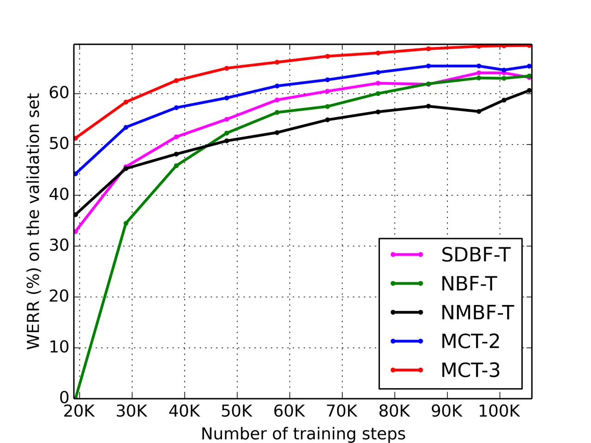

# End-to-End Multi-channel Transformer for Speech Recognition

Feng-Ju Chang    Martin Radfar    Athanasios Mouchtaris    Brian King   
Siegfried Kunzmann

###### Abstract

Transformers are powerful neural architectures that allow integrating
different modalities using attention mechanisms. In this paper, we
leverage the neural transformer architectures for multi-channel speech
recognition systems, where the spectral and spatial information
collected from different microphones are integrated using attention
layers. Our multi-channel transformer network mainly consists of three
parts: channel-wise self attention layers (CSA), cross-channel attention
layers (CCA), and multi-channel encoder-decoder attention layers (EDA).
The CSA and CCA layers encode the contextual relationship “within” and
“between” channels and across time, respectively. The channel-attended
outputs from CSA and CCA are then fed into the EDA layers to help decode
the next token given the preceding ones. The experiments show that in a
far-field in-house dataset, our method outperforms the baseline
single-channel transformer, as well as the super-directive and neural
beamformers cascaded with the transformers.

###### Index Terms: 

Transformer network, Attention layer, Multi-channel ASR, End-to-end ASR,
Speech recognition

^(†)^(†)address: Alexa Machine Learning, Amazon, USA  
{fengjc, radfarmr, mouchta, bbking, kunzman}@amazon.com

## 1 Introduction

In the past few years, voice assisted devices have become ubiquitous,
and enabling them to recognize speech well in noisy environments is
essential. One approach to make these devices robust against noise is to
equip them with multiple microphones so that the spectral and spatial
diversity of the target and interference signals can be leveraged using
beamforming approaches \[1, 2, 3, 4, 5, 6\]. It has been demonstrated in
\[7, 4, 6\] that beamforming methods for multi-channel speech
enhancement produce substantial improvements for ASR systems; therefore,
existing ASR pipelines are mainly built on beamforming as a
pre-processor and then cascaded with an acoustic-to-text model \[2, 8,
9, 10\].

A popular beamforming method in the field of ASR is super-directive (SD)
beamforming \[11, 12\], which uses the spherically isotropic noise field
and computes the beamforming weights. This method requires the knowledge
of distances between sensors and white noise gain control \[2\]. With
the great success of deep neural networks in ASR, there has been
significant interest to have end-to-end all-neural models in voice
assisted devices. Therefore, neural beamformers are becoming
state-of-the-art technologies for the unification of all-neural models
in speech recognition devices  \[13, 14, 15, 8, 9, 16, 10, 17, 18, 19\].
In general, neural beamformers can be categorized into fixed beamforming
(FBF) and adaptive beamforming (ABF). While the beamforming weights are
fixed in FBF \[16, 10\] during inference time, the weights in adaptive
beamforming (ABF)  \[13, 14, 15, 8, 9, 17\], can vary based on the input
utterances \[17, 19\] or the expected speech and noise statistics
computed by a neural mask estimator \[13, 14\] and the well-known MVDR
formalization \[20\].

Transformers \[21\] are powerful neural architectures that lately have
been used in ASR \[22, 23, 24\], SLU \[25\], and other audio-visual
applications \[26\] with great success, mainly due to their attention
mechanism. Only until recently, the attention concept has also been
applied to beamforming, specifically for speech and noise mask
estimations \[27, 9\]. While theoretically founded via MVDR
formalization \[20\], a good speech and noise mask estimator needs to be
pre-trained on synthetic data for the well-defined target speech and
noise annotations; the speech and noise statistics of synthetic data,
however, may be far away from real-world data, which can lead to noise
leaking into the target speech statistics and vice-versa \[28\]. This
drawback could further deteriorate its finetuning with the cascaded
acoustic models.

In this paper, we bypass the above front-end formalization and propose
an end-to-end multi-channel transformer network which takes directly the
spectral and spatial representations (magnitude and phase of STFT
coefficients) of the raw channels, and use the attention layers to learn
the contextual relationship within each channel and across channels,
while modeling the acoustic-to-text mapping. The experimental results
show that our method outperforms the other two neural beamformers
cascaded with the transformers by 9% and 9.33% respectively, in terms of
relative WER reduction on a far-field in-house dataset. In Sections 2,
3, and 4, we will present the proposed model, our experimental setup and
results, and the conclusions, respectively.

Figure 1: An overview of the proposed multi-channel transformer network.
$`C`$, $`N_{e}`$, and $`N_{d}`$ are the number of channels, encoder
layers and decoder layers, respectively. Note that the audio sequences
$`X_{1}`$,…,$`X_{i}`$,…,$`X_{C}`$ share the same token sequence $`Y`$.

## 2 Proposed Method

Given $`C`$-channels of audio sequences
$`\mathcal{X}=(X_{1},...,X_{i},...,X_{C})`$ and the target token
sequence
$`\mathcal{Y}=(\textbf{y}_{1},...,\textbf{y}_{j},...,\textbf{y}_{U})`$
with length $`U`$, where $`X_{i}\in\mathbb{R}^{T\times F}`$ is the
$`i^{th}`$-channel feature matrix of $`T`$ frames and $`F`$ features,
and $`\textbf{y}_{j}\in\mathbb{R}^{L\times 1}`$ is a one-hot vector of a
token from a predefined set of $`L`$ tokens, our objective is to learn a
mapping in order to maximize the conditional probability
$`p(\mathcal{Y}|\mathcal{X})`$. An overview of the multi-channel
transformer is shown in Fig. 1, which contains the channel and token
embeddings, multi-channel encoder, and multi-channel decoder. For
clarity and focusing on how we integrate multiple channels with
attention mechanisms, we will omit the multi-head attention \[21\],
layer normalization \[29\], and residual connections \[30\] in the
equations, but only illustrate them in Fig. 2.

### 2.1 Channel and Token Embeddings

Like other sequence-to-sequence learning problems, we start by
projecting the source channel features and one-hot token vector to the
dense embedding spaces, for more discriminative representations. The
$`i^{th}`$ channel feature matrix, $`X_{i}`$, contains magnitude
features $`X_{i}^{mag}`$ and phase features $`X_{i}^{pha}`$; more
details will be described in Sec. 3. We use three linear projection
layers, $`W^{me}_{i}`$, $`W^{pe}_{i}`$, and $`W^{je}_{i}`$ to embed the
magnitude, phase, and their concatenated embeddings, respectively. Since
the transformer networks do not model the position of a token within a
sequence, we employ the positional encoding (PE) \[21\] to add the
temporal ordering into the embeddings. The overall embedding process can
be formulated as:

```math
\displaystyle\hat{X_{i}}=[X_{i}^{mag}W^{me}_{i},X_{i}^{pha}W^{pe}_{i}]W^{je}_{i}+\textbf{PE}(t,f) \tag{1}
```

Here, all the bias vectors are ignored and $`[.,.]`$ indicates the
concatenation. $`\hat{X_{i}}\in\mathbb{R}^{T\times d_{m}}`$, where
$`d_{m}`$ is the embedding size. $`i\in\{1,...,C\}`$,
$`t\in\{1,...,T\}`$, and $`f\in\{1,...,d_{m}\}`$. Similarly, the token
embedding is formulated as:

```math
\displaystyle\hat{\textbf{y}}_{j}=W^{te}\textbf{y}_{j}+\textbf{b}^{te}+\textbf{PE}(j,l) \tag{2}
```

Here $`W^{te}`$ and $`\textbf{b}^{te}`$ are learnable token-specific
weight and bias parameters.
$`\hat{\textbf{y}}_{j}\in\mathbb{R}^{d_{m}\times 1}`$,
$`j\in\{1,...,U\}`$, and $`l\in\{1,...,d_{m}\}`$.

Figure 2: The attention blocks in our multi-channel transformer. (a)
shows the multi-head scaled dot-product attention (MH-SDPA). (b), (c),
(d) show a channel-wise self attention layer (CSA), a cross-channel
attention layer (CCA), and a multi-channel encoder-decoder attention
layer (EDA) respectively.

### 2.2 Multi-channel Encoder

Channel-wise Self Attention Layer (CSA): Each encoder layer starts from
utilizing self-attention layers per channel (Fig. 2(b)) in order to
learn the contextual relationship within a single channel.
Following \[21\], we use the multi-head scaled dot-product attention
(MH-SDPA) as the scoring function shown in Fig. 2(a) to compute the
attention weights across time. Given the $`i^{th}`$ channel embeddings,
$`\hat{X}_{i}`$, by Eq.(1), we can obtain the queries, keys, and values
via the linear transformations followed by an activation function as:

```math
\displaystyle Q^{cs}_{i}=\sigma\left(\hat{X}_{i}W^{cs,q}+\textbf{1}(\textbf{b}^{cs,q}_{i})^{T}\right)
```

```math
\displaystyle K^{cs}_{i}=\sigma\left(\hat{X}_{i}W^{cs,k}+\textbf{1}(\textbf{b}^{cs,k}_{i})^{T}\right) \tag{3}
```

```math
\displaystyle V^{cs}_{i}=\sigma\left(\hat{X}_{i}W^{cs,v}+\textbf{1}(\textbf{b}^{cs,v}_{i})^{T}\right)
```

Here $`\sigma(.)`$ is the $`ReLU`$ activation function,
$`W^{cs,*}\in\mathbb{R}^{d_{m}\times d_{m}}`$ and
$`\textbf{b}^{cs,*}\in\mathbb{R}^{d_{m}\times 1}`$ are learnable weight
and bias parameters, and $`\textbf{1}\in\mathbb{R}^{T\times 1}`$ is an
all-ones vector. The channel-wise self attention output is then computed
by:

```math
\displaystyle H^{cs}_{i}=Softmax\left(\frac{Q^{cs}_{i}(K^{cs}_{i})^{T}}{\sqrt{d_{m}}}\right)V^{cs}_{i} \tag{4}
```

where the scaling $`\frac{1}{\sqrt{d_{m}}}`$ is for numerical
stability \[21\]. We then add the residual connection \[30\] and
layernorm \[29\] (See Fig. 2(b)) before feeding the contextual
time-attended representations through the feed forward layers in order
to get final channel-wise attention outputs $`\hat{H^{cs}_{i}}`$, as
shown on the top of Fig. 2(b).

Cross-channel Attention Layer (CCA): The cross-channel attention layer
(Fig. 2(c)) learns not only the cross correlation in time between time
frames but also cross correlation between channels given the
self-attended channel representations,
$`\{\hat{H}^{cs}_{i}\}^{C}_{i=1}`$. We propose to create $`Q`$, $`K`$
and $`V`$ as follows:

```math
\displaystyle Q^{cc}_{i}=\sigma\left(\hat{H}^{cs}_{i}W^{cc,q}+\textbf{1}(\textbf{b}^{cc,q}_{i})^{T}\right)
```

```math
\displaystyle K^{cc}_{i}=\sigma\left(H^{CCA}W^{cc,k}+\textbf{1}(\textbf{b}^{cc,k}_{i})^{T}\right) \tag{5}
```

```math
\displaystyle V^{cc}_{i}=\sigma\left(H^{CCA}W^{cc,v}+\textbf{1}(\textbf{b}^{cc,v}_{i})^{T}\right)
```

```math
\displaystyle H^{CCA}=\sum_{j,j\neq i}A_{j}\odot\hat{H}^{cs}_{j} \tag{6}
```

where $`\hat{H}^{cs}_{i}`$ is the input for generating the queries. In
addition, the keys and values are generated by the weighted-sum of
contributions from the other channels,
$`\{\hat{H}^{cs}_{j}\}^{C}_{j=1,j\neq i}`$, i.e. Eq. (6), which is
similar to the beamforming process. Note that $`A_{j}`$, $`W^{cc,*}`$
and $`\textbf{b}^{cc,*}`$ are learnable weight and bias parameters, and
$`\odot`$ indicates element-wise multiplication. The cross-channel
attention output is then computed by:

```math
\displaystyle H^{cc}_{i}=Softmax\left(\frac{Q^{cc}_{i}(K^{cc}_{i})^{T}}{\sqrt{d_{m}}}\right)V^{cc}_{i} \tag{7}
```

To the best of our knowledge, it is the first time this cross channel
attention mechanism is introduced within the transformer network for
multi-channel ASR.

Similar to CSA, we feed the contextual channel-attended representations
through feed forward layers to get the final cross-channel attention
outputs, $`\hat{H^{cc}_{i}}`$, as shown on the top of Fig. 2(c). To
learn more sophisticated contextual representations, we stack multiple
CSAs and CCAs to from the encoder network output
$`\{H^{e}_{i}\}^{C}_{i=1}`$ in Fig. 2(d).

### 2.3 Multi-channel Decoder

Multi-channel encoder-decoder attention (EDA): Similar to \[21\], we
employ the masked self-attention layer (MSA), $`\hat{H^{sa}}`$, to model
the contextual relationship between target tokens and their
predecessors. It is computed similarly as in Eq. (3) and (4) but with
token embeddings (Eq. 2) as inputs. Then we create the queries by
$`\hat{H^{sa}}`$, and keys as well as values by the multi-channel
encoder outputs $`\{H^{e}_{i}\}^{C}_{i=1}`$ as follows:

```math
\displaystyle Q^{ed}=\sigma\left(\hat{H^{sa}}W^{ed,q}+\textbf{1}(\textbf{b}^{md,q})^{T}\right)
```

```math
\displaystyle K^{ed}=\sigma\left(\frac{1}{C}\sum^{C}_{i=1}H^{e}_{i}W^{ed,k}+\textbf{1}(\textbf{b}^{md,k})^{T}\right) \tag{8}
```

```math
\displaystyle V^{ed}=\sigma\left(\frac{1}{C}\sum^{C}_{i=1}H^{e}_{i}W^{ed,v}+\textbf{1}(\textbf{b}^{ed,v})^{T}\right)
```

Again, $`W^{ed,*}`$ and $`\textbf{b}^{ed,*}`$ are learnable weight and
bias parameters. The multi-channel decoder attention then becomes the
regular encoder-decoder attention of the transformer decoder. Similarly,
by applying MH-SDPA, layernorm, and feed forward layer, we can get final
decoder output, $`\hat{H^{ed}}`$, as shown on the top of Fig. 2(d). To
train our multi-channel transformer, we use the cross-entropy loss with
label smoothing of value $`\epsilon_{ls}=0.1`$ \[31\].

## 3 Experiments

|                                    |          |                   |           |           |           |           |
| ---------------------------------- | -------- | ----------------- | --------- | --------- | --------- | --------- |
| Method                             | No. of   | No. of parameters | WERR over | WERR over | WERR over | WERR over |
|                                    | channels | (Million)         | SCT       | SDBF-T    | NBF-T     | NMBF-T    |
| SC + Transformer (SCT)             | 1        | 13.29             | \-        | \-        | \-        | \-        |
| SDBF \[11\] + Transformer (SDBF-T) | 7        | 13.29             | 6.27      | \-        | \-        | \-        |
| NBF \[10\] + Transformer (NBF-T)   | 2        | 13.31             | 2.42      | -4.11     | \-        | \-        |
| NMBF \[13\] + Transformer (NMBF-T) | 2        | 18.53             | 2.07      | -4.49     | \-        | \-        |
| MCT with 2 channels (MCT-2)        | 2        | 13.63             | 11.21     | 5.26      | 9.00      | 9.33      |
| MCT with 3 channels (MCT-3)        | 3        | 13.80             | 20.70     | 15.39     | 18.73     | 19.03     |

Table 1: The relative word error rate reduction, WERRs (%), by comparing
the multi-channel transformer (MCT) to the beamfomers cascaded with
transformers. A higher number indicates a better WER.

### 3.1 Dataset

To evaluate our multi-channel transformer method (MCT), we conduct a
series of ASR experiments using over 2,000 hours of speech utterances
from our in-house anonymized far-field dataset. The amount of training
set, validation set (for model hyper-parameter selection), and test set
are 2,000 hours (312,0000 utterances), 4 hours (6,000 utterances), and
16 hours (2,5000 utterances) respectively. The device-directed speech
data was captured using smart speaker with 7 microphones, and the
aperture is 63mm. The users may move while speaking to the device so the
interaction with the devices were completely unconstrained. In this
dataset, 2 microphone signals of aperture distance and the
super-directive beamformed signal by \[11\] using 7 microphone signals
are employed through all the experiments.

### 3.2 Baselines

We compare our multi-channel transformer (MCT) to four baselines: (1)
Single channel + Transformer (SCT): This serves as the single-channel
baseline. We feed each of two raw channels individually into the
transformer for training and testing, and obtain the average WER from
the two channels. (2) Super-directive (SD) beamformer \[11\] +
Transformer (SDBF-T): The SD BF is widely used in the speech-directed
devices including the one we used to obtain the beamformed signal in the
in-house dataset. This beamformer used all seven microphones for
beamforming. Multiple beamformers are built on the frequency domain
toward different look directions and one with the maximum energy is
selected for the ASR input; therefore, the input features to the
transformer are extracted from a single channel of beamformed audio. (3)
Neural beamformer \[10\] + Transformer (NBF-T): This serves as the fixed
beamformer (FBF) baseline using two microphone signals as inputs rather
than seven in SD beamformer. Multiple beamforming matrices toward seven
beam directions followed by a convolutional layer are learned to combine
multiple channels, and then the energy features from all beam directions
respectively. The beamforming matrices are initialized with MVDR
beamformer \[20\]. (4) Neural masked-based beamformer \[13\] +
Transformer (NMBF-T): It serves as the adaptive beamforming (ABF)
baseline, and also uses two microphone signals as inputs. The mask
estimator was pre-trained following \[13\]. Note that the above neural
beamforming models are jointly finetuned with the transformers.

### 3.3 Experimental Setup and Evaluation Metric

The transformers in all the baselines and our multi-channel transformer
(MCT) are of $`d_{m}=256`$, number of hidden neurons $`d_{ff}=1,024`$,
and number of heads, $`h=3`$. While MCT and the transformer for NMBF-T
have $`N_{e}=4`$ and $`N_{d}=4`$, other transformers are of $`N_{e}=6`$,
$`N_{d}=6`$ in order to have comparable model size, as shown in Table 1.
Note that NMBF-T is about 5M larger than the other methods due to the
BLSTM and FeedForward layers used in the mask estimator of \[13\].
Results of all the experiments are demonstrated as the relative word
error rate reduction (WERR). Given a method A’s WER ($`\text{WER}_{A}`$)
and a baseline B’s WER ($`\text{WER}_{B}`$), the WERR of A over B can be
computed by $`(\text{WER}_{B}-\text{WER}_{A})/\text{WER}_{B}`$; the
higher the WERR is the better.

The input features, the Log-STFT square magnitude (for SCT and SDBF-T)
and STFT (for NBF-T and NMBF-T) are extracted every 10 ms with a window
size of 25 ms from 80K audio samples (results in $`T=166`$ frames per
utterance); the features of each frame is then stacked with the ones of
left two frames, followed by downsampling of factor 3 to achieve low
frame rate, resulting in $`F=768`$ feature dimensions. In the proposed
method, we use both log-STFT square magnitude features, and phase
features following \[32, 33\] by applying the sine and cosine functions
upon the principal angles of the STFT at each time-frequency bin. We
used the Adam optimizer \[34\] and varied the learning rate following
\[21, 22\] for optimization. The subword tokenizer \[35\] is used to
create tokens from the transcriptions; we use $`L=4,002`$ tokens in
total.

|                      |                 |          |
| -------------------- | --------------- | -------- |
| Channel-wise         | Cross-channel   | WERR (%) |
| self attention (CSA) | attention (CCA) | over MCT |
|     ✓                | ✓               | 0        |
|     ✓                | ✗               | -12.71   |
|     ✗                | ✓               | -13.12   |

Table 2: The WERRs (%) over MCT (with both CSA and CCA) while using CSA
only or CCA only.

### 3.4 Experimental Results

Table 1 shows the performances of our method (MCT-2) and
beamformers+transformers methods over different baselines. While all
cascaded beamformers+transformers methods perform better than SCT (by
2.07% to 6%), our method improves the WER the most (by 11.21%). When
comparing WERRs over SDBF-T, however, only MCT-2 improves the WER. The
degradations from NBF-T and NMBF-T over SDBF-T may be attributed to not
only 2 rather than 7 microphones are used but also the suboptimal
front-end formalizations either by using a fixed set of weights for look
direction fusion (NBF-T) or flawed speech/noise mask estimations
(NMBF-T). If we compare our method directly to NBF-T and NMBF-T, we see
9% and 9.33% relative improvements respectively. We further investigate
whether the information from the super-directive beamformer channel was
complementary to the multi-channel transformer. To this end, we take the
beamformed signal from SD beamformer as the third channel and feed it
together with the other two channels to our transformer (MCT-3). We see
in Table 1 (the last row), about 10% extra relative improvements are
achieved compared to MCT-2.

In Fig. 3, we evaluate the convergence rate and quality via comparing
the learning curves of our model to the other beamformer-transformer
cascaded methods. Note that our model has started to converge at around
100K training steps, while the others have not. We compute the WERRs of
all methods over a fixed reference point, which is the highest WER point
during this period by NBF-T (the left-most point of NBF-T corresponding
to WERR=0). Our method converges faster than the others with
consistently higher relative WER improvements. Also, we observe NMBF-T
converges the slowest, and the NBF-T is the second slowest.

Finally, we conducted an ablation study to demonstrate the importance of
channel-wise self attention (CSA) and cross-channel attention (CCA)
layers. To this end, we train two variants of multi-channel transformers
by using CSA only or CCA only. Table 2 shows that the WERR drops
significantly when either attention is removed.

Furthermore, our model can be simply applied on more than 3 channels. In
an 8-microphone case, the number of parameters would increase by only
about 10%
($`T\times d_{m}\times N_{e}\times 8/10^{6}/13.3=166\times 256\times 4\times 8/10^{6}/13.3`$)
compared to the one-microphone case ($`13.3`$M parameters).



Figure 3: The WERR w.r.t. the training steps of our methods (MCT-2,3)
comparing to beamformers cascaded with transformers. Our model has
started to converge at around 100K steps, but not for the others.

## 4 Conclusion

We proposed an end-to-end transformer based multi-channel ASR model. We
demonstrated that our model can capture the contextual relationships
within and across channels via attention mechanisms. The experiments
showed that our method (MCT-2) outperforms three cascaded beamformers
plus acoustic modeling pipelines in terms of WERRs, and can be simply
applied to more than 2 channel cases with affordable increases of model
parameters.

## References

- \[1\] Maurizio Omologo, Marco Matassoni, and Piergiorgio Svaizer,
  “Speech recognition with microphone arrays,” in Microphone arrays, pp.
  331–353. Springer, 2001.
- \[2\] Matthias Wölfel and John McDonough, Distant speech recognition,
  John Wiley & Sons, 2009.
- \[3\] Kenichi Kumatani, John McDonough, and Bhiksha Raj, “Microphone
  array processing for distant speech recognition: From close-talking
  microphones to far-field sensors,” IEEE Signal Processing Magazine,
  vol. 29, no. 6, pp. 127–140, 2012.
- \[4\] Keisuke et al. Kinoshita, “A summary of the reverb challenge:
  state-of-the-art and remaining challenges in reverberant speech
  processing research,” EURASIP Journal on Advances in Signal
  Processing, vol. 2016, no. 1, pp. 7, 2016.
- \[5\] Tuomas Virtanen, Rita Singh, and Bhiksha Raj, Techniques for
  noise robustness in automatic speech recognition, John Wiley &
  Sons, 2012.
- \[6\] Tobias Menne, Jahn Heymann, Anastasios Alexandridis, Kazuki
  Irie, Albert Zeyer, Markus Kitza, Pavel Golik, Ilia Kulikov, Lukas
  Drude, Ralf Schlüter, Hermann Ney, Reinhold Haeb-Umbach, and
  Athanasios Mouchtaris, “The rwth/upb/forth system combination for the
  4th chime challenge evaluation,” in CHiME-4 workshop, 2016.
- \[7\] Jon Barker, Ricard Marxer, and et al., “The third ‘chime’speech
  separation and recognition challenge: Dataset, task and baselines,” in
  ASRU, 2015.
- \[8\] Xuankai Chang, Wangyou Zhang, Yanmin Qian, Jonathan Le Roux, and
  Shinji Watanabe, “Mimo-speech: End-to-end multi-channel multi-speaker
  speech recognition,” in ASRU, 2019.
- \[9\] Xuankai Chang, Wangyou Zhang, Yanmin Qian, Jonathan Le Roux, and
  Shinji Watanabe, “End-to-end multi-speaker speech recognition with
  transformer,” in ICASSP, 2020.
- \[10\] Kenichi Kumatani, Wu Minhua, Shiva Sundaram, Nikko Ström, and
  Björn Hoffmeister, “Multi-geometry spatial acoustic modeling for
  distant speech recognition,” in ICASSP, 2019.
- \[11\] Simon Doclo and Marc Moonen, “Superdirective beamforming robust
  against microphone mismatch,” IEEE Transactions on Audio, Speech, and
  Language Processing, vol. 15, no. 2, pp. 617–631, 2007.
- \[12\] Ivan Himawan, Iain McCowan, and Sridha Sridharan, “Clustered
  blind beamforming from ad-hoc microphone arrays,” TASLP, vol. 19, no.
  4, pp. 661–676, 2010.
- \[13\] Jahn Heymann, Lukas Drude, and Reinhold Haeb-Umbach, “Neural
  network based spectral mask estimation for acoustic beamforming,” in
  ICASSP, 2016.
- \[14\] Hakan Erdogan, John R Hershey, and et al., “Improved mvdr
  beamforming using single-channel mask prediction networks.,” in
  Interspeech, 2016.
- \[15\] Tsubasa Ochiai, Shinji Watanabe, and et al., “Multichannel
  end-to-end speech recognition,” arXiv preprint arXiv:1703.04783, 2017.
- \[16\] Wu Minhua, Kenichi Kumatani, Shiva Sundaram, Nikko Ström, and
  Björn Hoffmeister, “Frequency domain multi-channel acoustic modeling
  for distant speech recognition,” in ICASSP, 2019.
- \[17\] Bo Li, Tara N Sainath, and et al., “Neural network adaptive
  beamforming for robust multichannel speech recognition,” in
  Interspeech, 2016.
- \[18\] Xiong Xiao, Shinji Watanabe, and et al., “Deep beamforming
  networks for multi-channel speech recognition,” in ICASSP, 2016.
- \[19\] Zhong Meng, Shinji Watanabe, and et al., “Deep long short-term
  memory adaptive beamforming networks for multichannel robust speech
  recognition,” in ICASSP, 2017.
- \[20\] Jack Capon, “High-resolution frequency-wavenumber spectrum
  analysis,” Proceedings of the IEEE, vol. 57, no. 8, pp.
  1408–1418, 1969.
- \[21\] Ashish Vaswani, Noam Shazeer, Niki Parmar, Jakob Uszkoreit,
  Llion Jones, Aidan N Gomez, Lukasz Kaiser, and Illia Polosukhin,
  “Attention is all you need,” in NeurNIPS, 2017.
- \[22\] Linhao Dong, Shuang Xu, and Bo Xu, “Speech-transformer: a
  no-recurrence sequence-to-sequence model for speech recognition,” in
  ICASSP, 2018.
- \[23\] Liang Lu, Changliang Liu, Jinyu Li, and Yifan Gong, “Exploring
  transformers for large-scale speech recognition,” arXiv preprint
  arXiv:2005.09684, 2020.
- \[24\] Yongqiang et al. Wang, “Transformer-based acoustic modeling for
  hybrid speech recognition,” in ICASSP, 2020.
- \[25\] Martin Radfar, Athanasios Mouchtaris, and Siegfried Kunzmann,
  “End-to-end neural transformer based spoken language understanding,”
  in Interspeech, 2020.
- \[26\] Georgios Paraskevopoulos, Srinivas Parthasarathy, Aparna Khare,
  and Shiva Sundaram, “Multiresolution and multimodal speech recognition
  with transformers,” arXiv preprint arXiv:2004.14840, 2020.
- \[27\] Bahareh Tolooshams, Ritwik Giri, Andrew H Song, Umut Isik, and
  Arvindh Krishnaswamy, “Channel-attention dense u-net for multichannel
  speech enhancement,” in ICASSP, 2020.
- \[28\] Lukas Drude, Jahn Heymann, and Reinhold Haeb-Umbach,
  “Unsupervised training of neural mask-based beamforming,” arXiv
  preprint arXiv:1904.01578, 2019.
- \[29\] Jimmy Lei Ba, Jamie Ryan Kiros, and Geoffrey E Hinton, “Layer
  normalization,” arXiv preprint arXiv:1607.06450, 2016.
- \[30\] Kaiming He, Xiangyu Zhang, Shaoqing Ren, and Jian Sun, “Deep
  residual learning for image recognition,” in CVPR, 2016.
- \[31\] Christian Szegedy and Vincent et al. Vanhoucke, “Rethinking the
  inception architecture for computer vision,” in CVPR, 2016.
- \[32\] Zhong-Qiu Wang and DeLiang Wang, “Combining spectral and
  spatial features for deep learning based blind speaker separation,”
  TASLP, vol. 27, no. 2, pp. 457–468, 2018.
- \[33\] Zhong-Qiu Wang, Jonathan Le Roux, and John R Hershey,
  “Multi-channel deep clustering: Discriminative spectral and spatial
  embeddings for speaker-independent speech separation,” in
  ICASSP, 2018.
- \[34\] Diederik P Kingma and Jimmy Ba, “Adam: A method for stochastic
  optimization,” arXiv preprint arXiv:1412.6980, 2014.
- \[35\] Rico Sennrich, Barry Haddow, and Alexandra Birch, “Neural
  machine translation of rare words with subword units,” in ACL, 2016.
