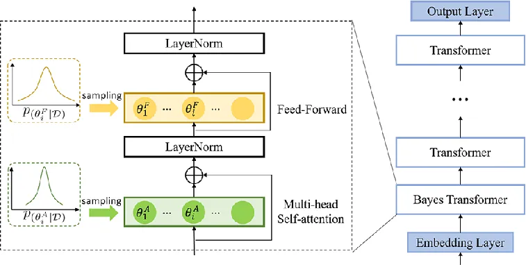
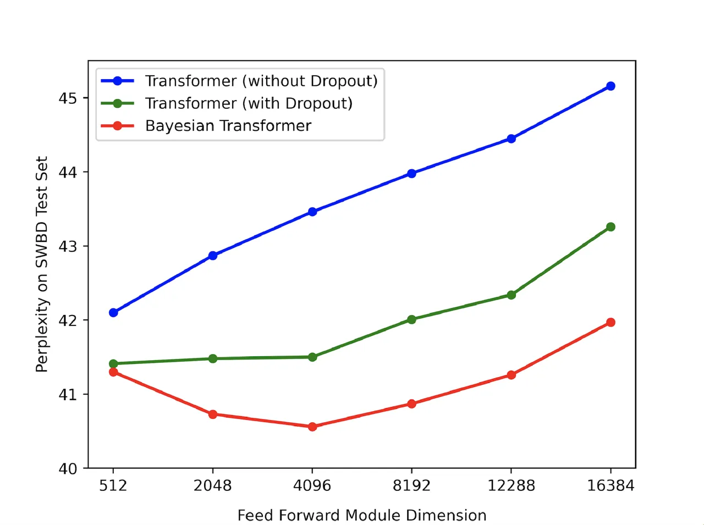

# Bayesian Transformer Language Models for Speech Recognition

Boyang Xue^(\*)    Jianwei Yu^(\*) ^(†)^(†)thanks: Equal contribution   
Junhao Xu    Shansong Liu    Shoukang Hu    Zi Ye Affiliation: Mengzhe
Geng, Xunying Liu, Helen Meng

###### Abstract

State-of-the-art neural language models (LMs) represented by
Transformers are highly complex. Their use of fixed, deterministic
parameter estimates fail to account for model uncertainty and lead to
over-fitting and poor generalization when given limited training data.
In order to address these issues, this paper proposes a full Bayesian
learning framework for Transformer LM estimation. Efficient variational
inference based approaches are used to estimate the latent parameter
posterior distributions associated with different parts of the
Transformer model architecture including multi-head self-attention, feed
forward and embedding layers. Statistically significant word error rate
(WER) reductions up to 0.5% absolute (3.18% relative) and consistent
perplexity gains were obtained over the baseline Transformer LMs on
state-of-the-art Switchboard corpus trained LF-MMI factored TDNN systems
with i-Vector speaker adaptation. Performance improvements were also
obtained on a cross domain LM adaptation task requiring porting a
Transformer LM trained on the Switchboard and Fisher data to a
low-resource DementiaBank elderly speech corpus.

###### Index Terms: 

neural language models, Transformer, Bayesian learning, model
uncertainty, speech recognition

^(†)^(†)address: ¹The Chinese University of Hong Kong  
{byxue,jwyu,jhxu,ssliu,skhu,zye,mzgeng,xyliu,hmmeng}@se.cuhk.edu.hk

## 1 Introduction

Language models (LMs) play an important role in automatic speech
recognition (ASR) systems and many other applications. Language models
compute the joint probability of a given sentence
$`{\bf W}=({{\bf w}_{1},{\bf w}_{2},...,{\bf w}_{T}})`$ as:

```math
\small p({\bf W})=p({{\bf w}_{1},{\bf w}_{2},...,{\bf w}_{n}})=\prod_{t=1}^{n}P({{\bf w}_{t}|{\bf w}_{t-1},...,{\bf w}_{1}}) \tag{1}
```

which can be expressed using the multiplication of word level
probabilities. The key part of the statistical language modelling
problem is to learn long-range context dependencies. Directly modelling
long-span contexts lead to a severe data sparsity problem for $`n`$-gram
language models \[1\]. To this end, neural language models that can
represent longer span preceding history contexts in a continuous vector
space, for example, based on long-short term memory recurrent neural
networks (LSTM-RNNs) \[2, 3\] can be used.

In recent years deep Transformer models \[4\] have defined
state-of-the-art language modelling performance across a range of speech
recognition tasks \[5\]. The Transformer model architecture features a
deep stacking of multiple self-attention layers \[6, 7, 8\] with
residual connections \[9\] and layer normalization \[10\] to learn
long-range contexts. Positional encoding layers \[4, 11\] are used to
further augment the self-attention layers with sequence order
information. Performance improvements over the conventional LSTM-RNN
language models have been widely reported \[5, 12\].

The highly complex neural architecture design of Transformers often
leads to a large increase in the overall system complexity, for example,
up to hundreds of millions of parameters \[5\]. In common with other
deep learning based language modelling approaches \[2, 3\], the use of
fixed, deterministic parameter estimates in conventional Transformer
models fails to account for model uncertainty. When given limited
training data, standard Transformer models are prone to over-fitting and
poor generalization. This issue can be further aggregated when rapidly
adapting a well-trained Transformer model to small size dataset
associated with a new style, genre or domain \[12\]. The current
solution to this problem is largely based on dropout \[13\], a simple
and effective regularization approach used in many deep learning systems
including neural network language models \[14, 15, 16\]. However, it
lacks of a mathematically well-defined framework \[17, 18\]. The
underlying dropout distribution also requires hyper-parameter setting on
an empirical basis for different tasks.

In order to address these issues, this paper proposes a full Bayesian
learning framework to account for model uncertainty in Transformer
language model estimation. An efficient variational inference based
approach is adopted to estimate the latent parameter posterior
distribution. A systematic investigation on the effects of performing
Bayesian estimation in different parts of the Transformer model
architecture including the self-attention, feed forward and embedding
layers is performed. Statistically significant word error rate (WER)
reductions up to 0.5% absolute (3.18% relative) were obtained over the
baseline Transformer LM on a state-of-the-art 900 hour speed perturbed
Switchboard corpus trained LF-MMI factored TDNN system with i-Vector
speaker adaptation \[19\]. Consistent performance improvements were also
obtained on a cross domain LM adaptation task requiring rapidly porting
a Transformer LM trained on Switchboard and Fisher data to a small size
DementiaBank elderly speech corpus.

The main contributions of this paper are summarized as follows. First,
to the best of our knowledge, this paper is the first work to apply
Bayesian learning methods to Transformer language models for speech
recognition tasks. In contrast, the only previous research on Bayesian
Transformer \[18, 20\] was conducted on machine translation and
probabilistic programming tasks. Prior works on uncertainty modelling
under the Bayesian framework for neural network language modelling
approaches were limited to RNNs \[14\] and their LSTM or GRU based
variants \[16\].

The rest of this paper is organized as follows. Section 2 reviews the
conventional Transformer based language models. Section 3 presents
Bayesian Transformer language models. Implementation issues are
discussed in Section 4. Experiments and results are shown in section 5.
Finally, conclusions and future work are discussed in section 6.

## 2 Transformer Language models

The original Transformer architecture proposed in \[4\] for neural
machine translation contains an encoder and a decoder. In this work,
following \[5, 12, 21\], the decoder component inside the Transformer
architecture was adopted for language modelling.

As shown in Figure 1, the Transformer language model used in this work
is a stack of 6 Transformer decoder blocks. Each block consists of a
multi-head self-attention \[7, 8\] module and a feed forward module.
Residual connections \[9\] and layer normalization \[10\] are also
inserted between these two modules. Let $`{\bf x}_{t}^{l-1}`$ denotes
the output of the $`(l-1)`$-th Transformer block at time $`t`$. The
multi-head self-attention module in the $`l`$-th block transforms
$`{\bf x}_{t}^{l-1}`$ to $`{\bf z}_{t}^{l}`$ is given as follows:

```math
\displaystyle{\bf q}_{t}^{l},{\bf k}_{t}^{l},{\bf v}_{t}^{l} \displaystyle=\mathbf{Q}{\bf x}_{t}^{l-1},\mathbf{K}{\bf x}_{t}^{l-1},\mathbf{V}{\bf x}_{t}^{l-1} \tag{2}
```

```math
\displaystyle{\bf h}_{t}^{l} \displaystyle=({\bf h}_{t-1}^{l},({\bf k}_{t}^{l},{\bf v}_{t}^{l})) \tag{3}
```

```math
\displaystyle{\bf y}_{t}^{l} \displaystyle=\mathbf{W_{h}}^{l}\text{SelfAttention}({\bf h}_{t}^{l},{\bf q}_{t}^{l})+{\bf x}_{t}^{l-1} \tag{4}
```

```math
\displaystyle{\bf z}_{t}^{l} \displaystyle=\text{LayerNorm}({\bf y}_{t}^{l}) \tag{5}
```

where $`{\bf Q}`$, $`{\bf K}`$, $`{\bf V}`$ are projection matrices
which map the input $`{\bf x}_{t}^{l-1}`$ into query
$`{\bf q}_{t}^{l}`$, key $`{\bf k}_{t}^{l}`$ and value
$`{\bf v}_{t}^{l}`$ respectively. $`{\bf h}_{t}^{l}`$ is the sequence of
of cached key-value pairs up to time $`t`$, which only contains the
history context information and can prevent the model from using any
future context. SelfAttention denotes the scaled multi-head dot product
self-attention \[4\]. LayerNorm represents the layer normalization
operation \[10\]. $`{\bf W}_{h}`$ denotes the projection matrix applied
to the outputs of the SelfAttention operation for residual connection
\[9\]. The normalized output $`{\bf z}_{t}^{l}`$ is then fed into the
feed forward module:

```math
\displaystyle{\bf s}_{t}^{l} \displaystyle=\mathbf{W_{2}}^{l}\text{GELU}(\mathbf{W_{1}^{l}}{\bf z}_{t}^{l})+{\bf z}_{t}^{l} \tag{6}
```

```math
\displaystyle{\bf x}_{t}^{l} \displaystyle=\text{LayerNorm}({\bf s}_{t}^{l}) \tag{7}
```

In this work, the Gaussian error linear unit (GELU) activation function
\[22\] is adopted as the activation function in the feed forward module.



Figure 1: An illustration of the proposed Bayesian Transformer language
model architecture. $`\theta_{i}^{F}`$ and $`\theta_{i}^{A}`$ denotes
the Bayesian model parameters in the feed forward and multi-head
self-attention module respectively.

## 3 Bayesian Transformer LMs

In this section, we first propose the formulation of the Bayesian
Transformer LM and then present an efficient training scheme based on
vairational inference \[23, 24\] for the proposed model.

### 3.1 Bayesian Neural Language Model

Although Transformer LMs have demonstrated state-of-the-art performance
on many speech recognition tasks, the use of fixed-point parameter
estimates in these models fails to account for the model uncertainty
associated with the words prediction. When given limited training data,
standard Transformer models are prone to over-fitting and poor
generalization. To model the parameter uncertainty in Transformer LMs,
Bayesian neural networks can be adopted to treat the model parameters
$`{\bf\Theta}`$ as a posterior probability distribution
$`p({\bf\Theta}|\mathcal{D})`$. Given the word history context, the word
prediction at frame $`t`$ is computed as follows:

```math
\displaystyle p({\bf w}_{t}|{\bf w}_{1},..., \displaystyle{\bf w}_{t-1})
```

```math
\displaystyle=\int p({\bf w}_{t}|{\bf w}_{1},...,{\bf w}_{t-1},{\bf\Theta})p({\bf\Theta}|\mathcal{D})d{\bf\Theta} \tag{8}
```

where $`\mathcal{D}`$ represents the whole training set for model
development and $`p({\bf\Theta}|\mathcal{D})`$ denotes the posterior
distribution of the model parameters learned from the training data.

### 3.2 Variational Training for Bayesian Transformer LMs

To estimate the posterior distribution of the model parameters
$`p({\bf\Theta}|\mathcal{D})`$, the usual approach in Bayesian learning
is to maximize the marginal probability. However, computing this
marginal distribution $`\mathcal{L}`$ is intractable under the
Transfomer LM framework. Thus, the following variational lower bound is
often adopted as an approximation \[25\]:

```math
\displaystyle\log p({\mathcal{D}})=\log\int p({\bf\mathcal{D}}|{\bf\Theta})p_{r}({\bf\Theta})d{\bf\Theta} \tag{9}
```

```math
\displaystyle\geq\underbrace{\sum_{n=1}^{N}\log\int p({\bf W}^{n}|{\bf\Theta})q({\bf\Theta})d{\bf\Theta}}_{\mathcal{L}_{1}}-\underbrace{\text{KL}(q({\bf\Theta})||p_{r}({\bf\Theta}))}_{\mathcal{L}_{2}}=\mathcal{L} \tag{10}
```

where $`{\bf W}^{n}`$ denotes the $`n`$-th sentence in the training set
$`\mathcal{D}`$ and $`N`$ is the total number of sentence in the
training set. $`q({\bf\Theta})`$ is the variational approximation of the
parameter posterior distribution $`p({\bf\Theta}|\mathcal{D})`$,
$`p_{r}({\bf\Theta})`$ is the prior distribution of $`{\bf\Theta}`$ and
$`\text{KL}(\cdot||\cdot)`$ denotes the Kullback-Leiber (KL) divergence.
As shown in Equation (10), the variational lower bound can be decomposed
into two parts: 1) the expectation of the log likelihood of the word
sequence $`{\bf W}`$ over the approximated posterior distribution
$`q({\bf\Theta})`$; 2) the KL divergence between $`q({\bf\Theta})`$ and
the prior distribution $`p_{r}({\bf\Theta})`$. Equation (10) is used as
the objective function during the model training process.

As commonly adopted in \[18\], both $`q({\bf\Theta})`$ and
$`p_{r}({\bf\Theta})`$ are assumed to be diagonal Gaussian distributions
in this work:

```math
\displaystyle q({\bf\Theta})=\mathcal{N}({\bf\Theta};{\boldsymbol{\mu}},{\boldsymbol{\sigma}}),\ \ \ \ p_{r}({\bf\Theta})=\mathcal{N}({\bf\Theta};{\boldsymbol{\mu}}^{r},{\boldsymbol{\sigma}}^{r}) \tag{11}
```

The expectation log likelihood term in Equation (10) can be efficiently
approximated by the Monte Carlo sampling method:

```math
\displaystyle\mathcal{L}_{1}\approx\frac{1}{K}\sum_{k=1}^{K}p({\bf\mathcal{D}}|{\bf\Theta}_{k}) \tag{12}
```

where $`K`$ is the number of samples and $`{\bf\Theta}_{k}`$ is the
$`k`$-th sample from distribution $`q({\bf\Theta})`$. It has been
reported that directly using the mean $`{\boldsymbol{\mu}}`$ and
variance $`\boldsymbol{\sigma}`$ to sample $`{\bf\Theta}_{k}`$ can make
the training process unstable. To address this issue, the
reparameterization trick \[26\] is adopted to sample $`{\bf\Theta}_{k}`$
as follows:

```math
\displaystyle{\bf\Theta}={\boldsymbol{\mu}}+{\boldsymbol{\sigma}}\odot{\boldsymbol{\epsilon}}_{k},\ \ \ \ {\boldsymbol{\epsilon}}_{k}\sim\mathcal{N({\bf 0},{\bf I})}. \tag{13}
```

Under the Gaussian assumption, the second term of Equation (10) can be
computed as:

```math
\displaystyle\text{KL}(q({\bf\Theta})||p_{r}({\bf\Theta}))=\sum_{i}\Big\{\log\frac{\sigma_{r,i}}{\sigma_{i}}+\frac{\sigma_{i}^{2}+(\mu_{i}-\mu_{r,i})^{2}}{2\sigma_{r,i}^{2}}-\frac{1}{2}\Big\}\vskip-9.24994pt \tag{14}
```

where $`\mu_{i}`$ and $`\sigma_{i}`$ are the $`i`$-th component of
$`{\boldsymbol{\mu}}`$ and $`{\boldsymbol{\sigma}}`$ respectively. The
gradient of the Bayesian model parameters $`{\boldsymbol{\mu}}`$ and
$`{\boldsymbol{\sigma}}`$ can be computed using the standard
back-propagation algorithm as follows:

```math
\displaystyle\frac{\partial\mathcal{L}}{\partial\mu_{i}}=\frac{1}{K}\sum_{k=1}^{K}\frac{\partial\mathcal{L}_{1}}{\partial\mu_{i}}-\frac{\mu_{i}-\mu_{r,i}}{\sigma^{2}_{j}} \tag{15}
```

```math
\displaystyle\frac{\partial\mathcal{L}}{\partial\sigma_{i}}=\frac{1}{K}\sum_{k=1}^{K}\frac{\partial\mathcal{L}_{1}}{\partial\sigma_{i}}-\frac{\sigma^{2}_{i}-\sigma^{2}_{r,i}}{\sigma^{2}_{j}} \tag{16}
```

### 3.3 Implementation details of the Bayesian Transformer LM

The performance and efficiency of the proposed Bayesian Transformer LMs
are affected by the follow details:

Position of uncertainty modelling: Although applying Bayesian estimation
to all model parameters in the Transformer LM is theoretically feasible,
it is practically highly expensive in both model training and
evaluation. To solve this issue, the Bayesian estimation is only applied
on part of the model parameters to narrow down the scope of uncertainty
modelling. Equation (9) can be re-written as:

```math
\displaystyle\log p({\mathcal{D}})=\log\int p({\bf\mathcal{D}}|{\bf\Theta})p_{r}({\boldsymbol{\theta}})d{\boldsymbol{\theta}} \tag{17}
```

where $`{\boldsymbol{\theta}}\in{\bf\Theta}`$ is the part of parameters
associated with Bayesian estimation. We applied Bayesian estimation to
the feed forward and multi-head self-attention modules in the
Transformer block and the embedding layer respectively. Specifically,
when Bayesian inference is applied on the multi-head attention layers,
the query, key and value weight matrices in Equation (2) are assumed to
be independent among themselves, thus separate variational distributions
are used to model the uncertainty associated with them.

Parameter sampling strategy: As shown in Equation (12), the Bayesian
Transformer LM requires Monte Carlo sampling to approximate the log
likelihood. The computation cost of the model is linearly increased
respect to the number of samples $`K`$. To maintain the Bayesian
Transformer LM’s computation cost comparable to the standard model, we
set $`K=1`$ during the training stage. As for evaluation, we use the
mean of the Bayesian parameters to approximate Equation (8) as follows:

```math
\displaystyle p({\bf w}_{t}|{\bf w}_{1},..., \displaystyle{\bf w}_{t-1})\approx p({\bf w}_{t}|{\bf w}_{1},...,{\bf w}_{t-1},{\bf\Theta}_{mean}) \tag{18}
```

Choice of prior distribution: When training the Bayesian Transformer LM,
a suitable choice of the prior is required. In our experiments we used
the parameters obtained from a standard Transformer LM as the prior’s
mean. The prior’s variance is set to be $`{\bf 1}`$. All the Transformer
and Bayesian Transformer LMs are interpolated with the $`4`$gram LM.

|     |                        |             |          |        |          |          |       |          |          |          |          |
| --- | ---------------------- | ----------- | -------- | ------ | -------- | -------- | ----- | -------- | -------- | -------- | -------- |
| ID  | LM                     | Bayesian    |          | PPL    | eval2000 |          | rt02  |          |          | rt03     |          |
|     |                        | Block       | Position | (swbd) | swbd     | callhm   | swbd1 | swbd2    | swbd3    | fsh      | swbd     |
| 1   | 4gram                  | Not Applied |          | -      | 9.7      | 18.0     | 11.5  | 15.3     | 20.0     | 12.6     | 19.5     |
| 2   | Transformer(+4g)       | Not Applied |          | 41.50  | 7.9      | 15.7     | 9.5   | 12.8     | 17.4     | 10.4     | 17.3     |
| 3   | Bayes Transformer(+4g) | -           | EMB      | 41.01  | 7.7      | 15.6     | 9.5   | 12.6     | 17.1^(†) | 10.2     | 17.1^(†) |
| 4   |                        | 1           | MHA      | 40.95  | 7.7      | 15.5     | 9.5   | 12.5^(†) | 17.1^(†) | 10.2     | 17.1^(†) |
| 5   |                        | 1           | FF       | 40.65  | 7.7      | 15.4^(†) | 9.4   | 12.6^(†) | 17.0^(†) | 10.2^(†) | 17.0^(†) |
| 6   |                        | 1-2         | FF       | 41.11  | 7.7      | 15.6     | 9.5   | 12.6     | 17.2     | 10.3     | 17.1     |
| 7   |                        | 1-3         | FF       | 42.45  | 7.8      | 15.8     | 9.5   | 12.7     | 17.2     | 10.3     | 17.2     |
| 8   |                        | 1-4         | FF       | 47.54  | 8.0      | 16.0     | 9.9   | 13.0     | 17.6     | 10.7     | 17.5     |
| 9   |                        | 1-5         | FF       | 54.19  | 8.3      | 16.2     | 10.2  | 13.5     | 18.0     | 11.1     | 18.0     |
| 10  |                        | 1-6         | FF       | 74.50  | 8.9      | 17.3     | 10.8  | 14.3     | 18.7     | 12.0     | 18.8     |
| 11  | +Transformer(+4g)      | -           | EMB      | 40.03  | 7.7      | 15.5     | 9.4   | 12.6^(†) | 17.1^(†) | 10.1^(†) | 17.0^(†) |
| 12  |                        | 1           | MHA      | 39.70  | 7.6^(†)  | 15.4^(†) | 9.3   | 12.5^(†) | 17.0^(†) | 10.1^(†) | 16.9^(†) |
| 13  |                        | 1           | FF       | 39.42  | 7.6^(†)  | 15.2^(†) | 9.3   | 12.5^(†) | 17.0^(†) | 10.1^(†) | 16.9^(†) |

Table 1: Perplexity and WER(%) of the baseline 4-gram (4g) LM,
Transformer LM and various Bayesian Transformer LMs before and after
further interpolation with the baseline Transformer on NIST Switchboard
English eval2000, rt02 and rt03 test sets. FF, MHA and EMB represent the
feed forward, multi-head self-attention and the embedding layer
respectively. ”+4g” denotes interpolation with 4gram. ”$`{\dagger}`$”
denotes statistically significant results were obtained over the
Transformer baseline (line 2).

## 4 Experimental setup

In this section, we present the details of the datasets used in the
experiments before introducing the baseline speech recognition systems.

### 4.1 Datasets

Switchboard and Fisher: The combined Switchboard and Fisher
transcriptions adopted in our experiments contain 34M words with a 30k
vocabulary lexicon for language modelling.

DementiaBank Pitt: The small DementiaBank Pitt transcription \[27\]
adopted in our domain adaptation experiments contains 167k. A 3.6k words
recognition vocabulary was used.

### 4.2 Baseline Transformer LMs

The standard and Bayesian Transfomer LMs used in our experiments contain
6 Transformer blocks with 4096 hidden nodes in the feed forward module
and 512 dimension for the residual connection. The output dimensionality
of the word embedding layer is set to be 512 and the input
dimensionality is set to be equal to the vocabulary size of the dataset.
Pytorch was used to implement the Transformer LMs. The model parameters
are optimized using stochastic gradient descent (SGD) optimizer with
initial learning rate 0.1. All Transformer LMs in our experiments are on
word level. We use 1 Nvidia V100 GPUs to train the LMs.

### 4.3 Baseline Speech Recognition Systems

Switchboard system: Following the Kaldi \[28\] recipe¹¹ 1 Kaldi:
egs/swbd/s5c/local/chain/tuning/run tdnn 7q.sh, in the Switchboard
experiments, the speech recognition system used to generate the N-best
list for rescoring was based on factorized time-delay neural networks
(TDNN-Fs) \[29\] featuring speech perturbation, i-Vector, LHUC speaker
adaptation and Lattice-free maximum mutual information (LF-MMI) \[30\]
sequence training.

DementiaBank Pitt system: The speech recognition system used the
DementiaBank Pitt experiments was similar to the TDNN-F based
Switchboard system with additional domain adaptation. Details of this
system can be found in \[27\].

## 5 Experiments

In this section, we present our experimental results in terms of
perplexity (PPL) and word error rate (WER) for the proposed Bayesian
Transformer LMs on the Switchboard and DementiaBank corpora.

### 5.1 Experiments on the Switchboard Corpus

Table 1 presents the experimental results of the proposed Transformer
language model on the Switchboard corpus. Several trends can be observed
from Table 1: 1) The proposed Bayesian Transformer LMs (line 3-5)
outperform the baseline Transformer language model (line 2) in terms of
both perplexity and word error rate. 2) Applying the Bayesian estimation
on the feed forward (FF) module outperforms using Bayesian estimation on
the multi-head self-attention (MAH) module and the embedding (EMB) layer
in terms of the PPL and WER; 3) Compared with applying Bayesian
estimation to multiple Transformer blocks (line 6 - 10), adopting
Bayesian estimation only on the lowest Transformer block (line 5)
produced the best PPL and WER performance. One possible explanation of
this observation is that the parameters associated with the higher
Transformer blocks are expected to be more deterministic than those in
the lower blocks, while the larger part of the underlying data
variability is expected at the lowest block immediately after the
embedding layer. 4) Further performance improvements can be obtained by
interpolating the Bayesian Transform LM with the standard Transformer LM
(line 11-14).

The Bayesian Transformer LM with parameter uncertainty modelled at the
lowest feed forward layer produced the best performance after
interpolation with both the 4-gram and baseline Transformer (line 13).
Statistically significant WER reductions of 0.3-0.5% were obtained
across all the data sets except the swbd1 portion of rt02 over the
baseline Transformer LM (line 2). The statistical significance test was
conducted at level 0.5 based on matched pairs sentence-segment word
error (MAPSSWE) for recognition performance analysis.

To further analyse the proposed Bayesian Transformer LM’s ability in
reducing the risk of overfitting and improving generalization, Figure 2
compares the performance between the proposed Bayesian Transformer LM
(line 5 in Table 1) and the standard Transformer with and without the
dropout operation. As shown in Figure 2, the proposed Bayesian LM
consistently outperforms the other two LMs with varying feed forward
module dimensionality from 512 to 16384.



Figure 2: Perplexity on SWBD test data obtained using the baseline and
the Bayesian Transformer LMs with varying feed forward layer
dimensionality.

### 5.2 Experiments on the DementiaBank Pitt Corpus

The PPL and WER results on the DementiaBank Corpus are presented in
Table 2. The $`4`$gram, Transformer and Bayesian Transformer LMs were
first trained using the combined 2.4M words DementiaBank Pitt,
Switchboard and Fisher transcriptions. To reduce the domain mismatch
between the three corpora, the baseline and Bayesian Transformer LMs
were further adapted to the Pitt transcripts only by using either
fine-tuning or Bayesian adaptation. This two adapted Transformer LMs are
shown in line 3 and 5 in Table 2 respectively. The fine-tuning adapted
model parameters in line 3 served as the prior of the Bayesian
Transformer adaptation in line 5. It can be observed from Table 2 that
the Bayesian adapted Transformer LM outperforms the fine-tuned
Transformer LM by 0.37% absolute WER reduction.

|     |                        |             |       |           |
| --- | ---------------------- | ----------- | ----- | --------- |
| ID  | LMs                    | Adapt       | PPL   | WER(%)    |
| 1   | 4gram                  | ✗           | 17.07 | 30.67     |
| 2   | Transformer(+4g)       | ✗           | 21.83 | 30.65     |
| 3   |                        | fine-tuning | 14.56 | 30.25     |
| 4   | Bayes Transformer(+4g) | ✗           | 19.88 | 30.49     |
| 5   |                        | bayes-adapt | 13.99 | 29.88^(†) |

Table 2: PPL and WER(%) results on the DemntiaBank Pitt Corpus.
”finetune” means fine-tuning the model parameters using only the
DemntiaBank Pitt Corpus. ”bayes-adapt” mean adapt the Bayesian
Transformer using only the DemntiaBank Pitt Corpus LM with the
parameters in system 4 as prior. ”+4g” denotes interpolation with 4gram.
”$`{\dagger}`$” denotes statistically significant results were obtained
over the system 3.

## 6 Conclusion

This paper presents a Bayesian learning framework for Transformer
language model estimation to improve their generalization performance.
Consistent performance improvements in terms of both perplexity and WER
were obtained on the Swithboard and DementiaBank Pitt datasets, thus
demonstrating the advantages of the proposed Bayesian Transformer LMs
for speech recognition.

## 7 Acknowledgement

This research is supported by Hong Kong RGC GRF grant No. 14200218,
14200220, Theme-based Research Scheme T45-407/19N, Innovation &
Technology Fund grant No. ITS/254/19, and Shun Hing Institute of
Advanced Engineering grant No. MMT-p1-19.

## References

- \[1\] Reinhard Kneser and Hermann Ney, “Improved backing-off for
  m-gram language modeling,” in ICASSP. IEEE, 1995, vol. 1, pp. 181–184.
- \[2\] Tomas Mikolov, Martin Karafiát, Lukas Burget, Jan Cernock, and
  Sanjeev Khudanpur, “Recurrent neural network based language model,” in
  Interspeech, 2015.
- \[3\] Tomáš Mikolov, Stefan Kombrink, Lukáš Burget, Jan Černockỳ, and
  Sanjeev Khudanpur, “Extensions of recurrent neural network language
  model,” in ICASSP. IEEE, 2011, pp. 5528–5531.
- \[4\] Ashish Vaswani, Noam Shazeer, Niki Parmar, Jakob Uszkoreit,
  Llion Jones, Aidan N Gomez, Łukasz Kaiser, and Illia Polosukhin,
  “Attention is all you need,” in Advances in neural information
  processing systems, 2017, pp. 5998–6008.
- \[5\] Kazuki Irie, Albert Zeyer, Ralf Schlüter, and Hermann Ney,
  “Language Modeling with Deep Transformers,” in Interspeech, 2019, pp.
  3905–3909.
- \[6\] Jianpeng Cheng, Li Dong, and Mirella Lapata, “Long short-term
  memory-networks for machine reading,” in Proceedings of the 2016
  Conference on Empirical Methods in Natural Language Processing. 2016,
  pp. 551–561, Association for Computational Linguistics.
- \[7\] Zhouhan Lin, Minwei Feng, Cícero Nogueira dos Santos, Mo Yu,
  Bing Xiang, Bowen Zhou, and Yoshua Bengio, “A structured
  self-attentive sentence embedding,” CoRR, vol. abs/1703.03130, 2017.
- \[8\] Ankur Parikh, Oscar Täckström, Dipanjan Das, and Jakob
  Uszkoreit, “A decomposable attention model for natural language
  inference,” in Proceedings of the 2016 Conference on Empirical Methods
  in Natural Language Processing, Austin, Texas, Nov. 2016, pp.
  2249–2255.
- \[9\] Kaiming He, X. Zhang, Shaoqing Ren, and J. Sun, “Deep residual
  learning for image recognition,” in CVPR, June 2016, pp. 770–778.
- \[10\] Jimmy Lei Ba, Jamie Ryan Kiros, and Geoffrey E Hinton, “Layer
  normalization,” arXiv preprint arXiv:1607.06450, 2016.
- \[11\] Jonas Gehring, Michael Auli, David Grangier, Denis Yarats, and
  Yann N. Dauphin, “Convolutional sequence to sequence learning,” in
  ICML. 2017, p. 1243–1252, JMLR.org.
- \[12\] Ke Li, Zhe Liu, Tianxing He, Hongzhao Huang, and Sanjeev
  Khudanpur, “An empirical study of transformer-based neural language
  model adaptation,” in ICASSP, 2020.
- \[13\] Nitish Srivastava, Geoffrey Hinton, Alex Krizhevsky, Ilya
  Sutskever, and Ruslan Salakhutdinov, “Dropout: A simple way to prevent
  neural networks from overfitting,” J. Mach. Learn. Res., vol. 15, no.
  1, pp. 1929–1958, Jan. 2014.
- \[14\] Jen-Tzung Chien and Yuan Chu Ku, “Bayesian recurrent neural
  network for language modeling,” IEEE Transactions on Neural Networks
  and Learning Systems, vol. 27, no. 2, pp. 361–374, Feb. 2016.
- \[15\] Max W. Y. Lam, Xie Chen, Shoukang Hu, Jianwei Yu, and Helen M.
  Meng, “Gaussian process lstm recurrent neural network language models
  for speech recognition,” in IEEE ICASSP, 2019.
- \[16\] Jianwei Yu, Max W. Y. Lam, Shoukang Hu, Xixin Wu, and Helen M.
  Meng, “Comparative study of parametric and representation uncertainty
  modeling for recurrent neural network language models,” in
  Interspeech, 2019.
- \[17\] Yarin Gal and Zoubin Ghahramani, “Dropout as a bayesian
  approximation: Representing model uncertainty in deep learning,”
  ICML, 2015.
- \[18\] Dustin Tran, Mike Dusenberry, Mark van der Wilk, and Danijar
  Hafner, “Bayesian layers: A module for neural network uncertainty,” in
  Advances in Neural Information Processing Systems 32, pp. 14660–14672.
  Curran Associates, Inc., 2019.
- \[19\] Pawel Swietojanski and Steve Renals, “Learning hidden unit
  contributions for unsupervised speaker adaptation of neural network
  acoustic models,” in 2014 IEEE Spoken Language Technology Workshop
  (SLT). IEEE, 2014, pp. 171–176.
- \[20\] Charles Yuan and Jan Hoffmann, “Blt: Exact bayesian inference
  with distribution transformers,” .
- \[21\] Alec Radford, Karthik Narasimhan, Tim Salimans, and Ilya
  Sutskever, “Improving language understanding by generative
  pre-training,” 2018.
- \[22\] Dan Hendrycks and Kevin Gimpel, “Bridging nonlinearities and
  stochastic regularizers with gaussian error linear units,” CoRR, vol.
  abs/1606.08415, 2016.
- \[23\] David Barber and Christopher M Bishop, “Ensemble learning in
  bayesian neural networks,” Nato ASI Series F Computer and Systems
  Sciences, vol. 168, pp. 215–238, 1998.
- \[24\] Alex Graves, “Practical variational inference for neural
  networks,” in Advances in neural information processing systems, 2011,
  pp. 2348–2356.
- \[25\] Diederik P Kingma and Max Welling, “Auto-encoding variational
  bayes,” arXiv preprint arXiv:1312.6114, 2013.
- \[26\] Diederik P Kingma, Tim Salimans, and Max Welling, “Variational
  dropout and the local reparameterization trick,” Computer
  Science, 2015.
- \[27\] Zi YE, Shoukang Hu, Jinchao Li, Xurong Xie, Mengzhe Geng,
  Jianwei Yu, Junhao Xu, Boyang Xue, Shansong Liu, Xunying Liu, and
  Helen Meng, “Development of the cuhk elderly speech recognition system
  for neurocognitive disorder detection using the dementiabank corpus,”
  in ICASSP. IEEE, 2021.
- \[28\] Daniel Povey, Arnab Ghoshal, Gilles Boulianne, Lukas Burget,
  Ondrej Glembek, Nagendra Goel, Mirko Hannemann, Petr Motlicek, Yanmin
  Qian, Petr Schwarz, Jan Silovsky, Georg Stemmer, and Karel Vesely,
  “The kaldi speech recognition toolkit,” 2011, IEEE Catalog.
- \[29\] Daniel Povey, Gaofeng Cheng, Yiming Wang, Ke Li, Hainan Xu,
  Mahsa Yarmohammadi, and Sanjeev Khudanpur, “Semi-orthogonal low-rank
  matrix factorization for deep neural networks.,” in Interspeech, 2018,
  pp. 3743–3747.
- \[30\] Daniel Povey, Vijayaditya Peddinti, Daniel Galvez, Pegah
  Ghahremani, Vimal Manohar, Xingyu Na, Yiming Wang, and Sanjeev
  Khudanpur, “Purely sequence-trained neural networks for asr based on
  lattice-free mmi,” Interspeech, pp. 2751–2755, 2016.
