# Fast End-to-End Speech Recognition via Non-Autoregressive Models and Cross-Modal Knowledge Transferring from BERT

Ye Bai    Jiangyan Yi    Jianhua Tao    Zhengkun Tian    Zhengqi Wen   
Shuai Zhang ^(†)^(†)thanks: Ye Bai, Zhengkun Tian, Jianhua Tao and Shuai
Zhang are with the University of Chinese Academy of Sciences, Beijing
100190, China, and with NLPR, Institute of Automation, Chinese Academy
of Sciences, Beijing 100190, China. (e-mail: baiye2016@ia.ac.cn;
zhengkun.tian@nlpr.ia.ac.cn; shuai.zhang@nlpr.ia.ac.cn).^(†)^(†)thanks:
Jiangyan Yi and Zhengqi Wen are with NLPR, Institute of Automation,
Chinese Academy of Sciences, Beijing 100190, China (e-mail:
jiangyan.yi@nlpr.ia.ac.cn; zqwen@nlpr.ia.ac.cn).^(†)^(†)thanks: Jianhua
Tao is also with NLPR, Institute of Automation, Chinese Academy of
Sciences, Beijing 100190, China, and the CAS Center for Excellence in
Brain Science and Intelligence Technology, Beijing 100190, China
(e-mail: jhtao@nlpr.ia.ac.cn). (Corresponding authors: Jiangyan Yi;
Jianhua Tao.)

###### Abstract

Attention-based encoder-decoder (AED) models have achieved promising
performance in speech recognition. However, because the decoder predicts
text tokens (such as characters or words) in an autoregressive manner,
it is difficult for an AED model to predict all tokens in parallel. This
makes the inference speed relatively slow. In contrast, we propose an
end-to-end non-autoregressive speech recognition model called LASO
(Listen Attentively, and Spell Once). The model aggregates encoded
speech features into the hidden representations corresponding to each
token with attention mechanisms. Thus, the model can capture the token
relations by self-attention on the aggregated hidden representations
from the whole speech signal rather than autoregressive modeling on
tokens. Without explicitly autoregressive language modeling, this model
predicts all tokens in the sequence in parallel so that the inference is
efficient. Moreover, we propose a cross-modal transfer learning method
to use a text-modal language model to improve the performance of
speech-modal LASO by aligning token semantics. We conduct experiments on
two scales of public Chinese speech datasets AISHELL-1 and AISHELL-2.
Experimental results show that our proposed model achieves a speedup of
about $`50\times`$ and competitive performance, compared with the
autoregressive transformer models. And the cross-modal knowledge
transferring from the text-modal model can improve the performance of
the speech-modal model.

###### Index Terms: 

speech recognition, fast, end-to-end, non-autoregressive, attention,
BERT, cross-modal, transfer learning

## I Introduction

Deep learning has significantly improved the performance of automatic
speech recognition (ASR). Conventionally, an ASR system consists of an
acoustic model (AM), a pronunciation lexicon, and a language model (LM).
The deep neural network (DNN) is used to model observation probabilities
of the hidden Markov models (HMMs) \[hinton2012deep, yu2016automatic\].
This DNN-HMM hybrid approach has achieved success in ASR. However, the
pipeline of a DNN-HMM hybrid system usually requires training Gaussian
mixture model based HMMs (GMM-HMM) for generating frame-level alignments
and tying states. Building the pronunciation lexicon requires the
knowledge of experts in phonetics. This complexity of the building
pipeline limits the development of an ASR system. Moreover, the
different building procedures of the AM and the LM make the system
difficult to be optimized jointly. Thus, the possible error accumulation
in the pipeline influences the performance of a hybrid ASR system.

Pure neural network based end-to-end (E2E) ASR systems attract interests
of researchers these years \[chorowski2015attention,
bahdanau2016endtoend, chan2016listen, kim2017joint,
graves2012sequence\]. Different from the hybrid ASR systems, these
systems use one DNN to model acoustic and language simultaneously so
that the network can be optimized with back-propagation algorithms in an
E2E manner. In particular, attention-based encoder-decoder (AED) models
have achieved promising performance in ASR \[chiu2018state,
luscher2019rwth\]. The AED models first encode the acoustic feature
sequence into latent representations with an encoder. With the latent
representations, the decoder predicts the text token sequence
step-by-step. The attention mechanism queries a proper latent vector
from the outputs of the encoder for the decoder to predict. However,
even with the non-recurrent structure which can be implemented in
parallel \[dong2018speech, zhou2018syllable\], the recognition speed
limits the deployment of AED models in real-world applications. Two main
reasons influence inference speed:

- •
  First, the encoder encodes the whole utterance, so the decoder starts
  inference after the user speaks out the whole utterance;
- •
  Second, multi-pass forward propagation of the decoder costs much time
  during beam-search.

Several work focus on the first problem to make the system can generate
the token sequence in a streaming manner. Monotonic attention mechanism
\[raffel2017online, mocha2018\] enforces the attention alignments to be
monotonic. Therefore, the encoder only encodes a local chunk in the
acoustic feature sequence, and the decoder predicts the next token
without the future context in the acoustic feature sequence.
Triggered-attention systems \[moritz2019triggered, moritz2019streaming\]
use connectionist temporal classification (CTC) spikes to segment the
acoustic feature sequence adaptively, and the decoder predicts the next
token when it is activated by a spike. Transducer-based models
\[graves2012sequence, tian2019self, tian2020synchronous\] use an extra
blank token and marginalize all possible alignments, so the model can
immediately predict the next token when the encoder accumulates enough
information. All these models can generate a token sequence in a
steaming manner and show promising results. However, they limit the
models using local information in the speech sequence. It potentially
ignores global semantic relationships in the speech sequence. The global
semantic relationships contain not only the relationships among acoustic
frames but also the relationships among tokens \[Chung2018\], as shown
in Fig. 1.

In this paper, we aim to address the second problem, i.e., we would like
to generate the token sequence without beam-search. We propose an
attention-based feedforward neural network model for non-autoregressive
speech recognition called “LASO” (Listen Attentively, and Spell Once).
The LASO model first uses an encoder to encode the whole acoustic
sequence into high-level representations. Then, the proposed position
dependent summarizer (PDS) module queries the latent representation
corresponding to the token position from the outputs of the encoder. It
bridges the length gap between the speech and the token sequence. At
last, the decoder further refines the representations and predicts a
token for each position. Because the prediction of one token does not
depend on another token, beam-search is not used. And because the
network is a non-recurrent feedforward structure, it can be implemented
in parallel. To further improve the ability to capture the semantic
relationship of LASO (especially for the decoder), we propose to use a
cross-modal knowledge transferring method. Specifically, we align the
semantic spaces of the hidden representations of the LASO and the
pre-trained large-scale language model BERT \[devlin2018bert\]. We use
the teacher-student learning based knowledge transferring method
\[bai2019learn\] to leverage knowledge in BERT. We conduct experiments
on two publicly available Chinese Mandarin datasets to evaluate the
proposed methods with different data sizes. The experiments demonstrate
that our proposed method achieves a competitive performance and
efficiency.

The contributions of this work are summarized as follows.

1.  1.  We propose a non-autoregressive attention-based feedforward neural
        network LASO for speech recognition. A PDS module is proposed to
        convert a variant-length speech sequence to a fixed-length sequence.
        Each representation in the fixed-length sequence corresponds to the
        position of a token so that the ASR is considered as a position-wise
        classification. A decoder, which plays a role of bidirectional LM,
        further captures the relationship among these representations with
        self-attention. LASO leverages the whole context of the speech and
        generates each token in the sequence in parallel. The experiments
        demonstrate that our proposed model achieves high efficiency and
        competitive performance.
2.  2.  We propose a cross-modal knowledge transferring method from BERT for
        improving the performance of LASO. The experiments demonstrate the
        effectiveness of the knowledge transferring from BERT. The results
        also show that the speech signals have similar internal structures
        with corresponding text so that knowledge from BERT can benefit the
        non-autoregressive ASR model.
3.  3.  We present detailed visualization of the model. The visualization
        results show that the proposed PDS module can attend to specific
        encoded acoustic representations and generates meaningful hidden
        representations corresponding to tokens from speech. And the decoder
        can capture token relationships from the aggregated hidden
        representations.

Compared with the preliminary version \[bai2020listen\], the new content
in this paper includes leveraging pre-trained BERT models to further
improve the performance, graph-based view of the proposed model, more
detailed experiments on large-scale datasets, detailed visualization and
analysis for better understanding the models. The rest of the paper is
organized as follows. Section II briefly compares the autoregressive AED
models and the non-autoregressive AED models. Section III re-formulates
the speech recognition as a position-wise classification problem.
Section IV describes the proposed LASO model. Section V describes how to
train the model and how we distill the knowledge from BERT. Section VI
introduces how the model generates a sentence. Section VII compares this
work with previous related work. Section VIII and Section IX present
setup and results of experiments, respectively. Section X discusses this
paper. At last, Section XI concludes this paper and presents future
work.

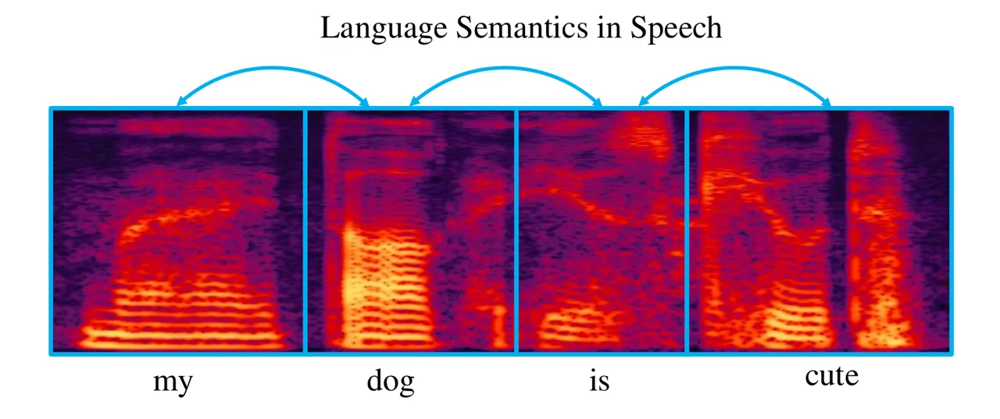

Fig. 1: A spectrogram of an example utterance. A word corresponds to a
segment in the speech signal. The relationships among the segments can
be seen as the relationships among the corresponding tokens, which are
referred to as language semantics in this paper.

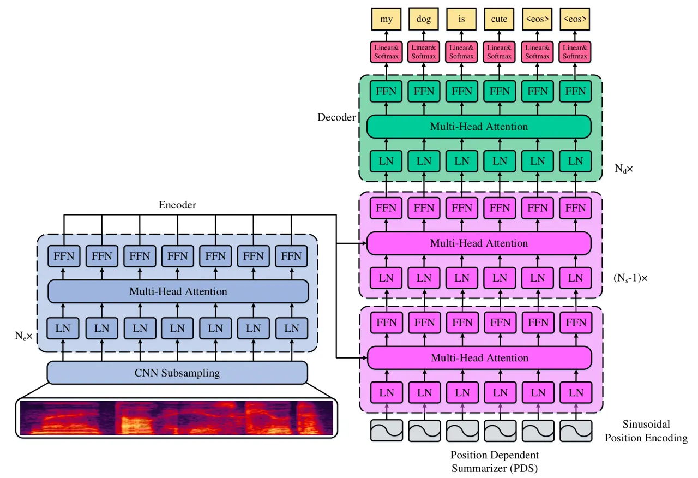

Fig. 2: An illustration of the proposed LASO model. The LASO consists of
an encoder, a position-dependent summarizer (PDS), and a decoder. All
three modules are composed of basic attention blocks, which consist of
multi-head attention and a position-wise feedforward network (FFN in the
figure). We first use a CNN to subsample the acoustic feature sequence.
Then, the encoder extracts high-level representations from the
subsampled sequence. The PDS queries the high-level acoustic
representations corresponding to each token position. Then, the decoder
further refines the language semantics. For each position, a probability
distribution over the vocabulary is computed with a softmax function.
And during inference, we select the most likely token at each position
to form the token sequence. The extra tokens \<eos\> are removed in the
token sequence. Each attention block includes layer normalization (LN in
the figure) and a residual connection. And we add sinusoidal position
encodings to the subsampled acoustic feature sequence. The whole
architecture is non-recurrent, so it can be implemented in parallel for
fast inference.

## II Background: Autoregressive Models vs. Non-Autoregressive Models

In this section, we introduce the background of autoregressive AED
models (ARM) and non-autoregressive AED models (NARM). We compare these
two paradigms to better introduce the proposed method in the rest
sections.

### II-A Autoregressive AED Models

The ARM predicts the next token based on the previously generated
tokens. That is, for a speech-text pair $`(X,Y)`$, the ARM factorizes
the conditional probability $`P(Y|X)`$ with the chain rule:

```math
P_{\text{ARM}}(Y|X)=P(y_{1}|X)\prod_{j=2}^{L}P(y_{j}|y_{<j},X), \tag{1}
```

where $`X=[x_{1},\cdots,x_{T}]`$ is the acoustic feature sequence, each
$`x`$ denotes a feature vector, $`Y=[y_{1},\cdots,y_{L}]`$ is the text
token sequence, and $`y_{<j}=[y_{1},\cdots,y_{j-1}]`$ denotes the
previous context of the token $`y_{j}`$. The token can be a word or a
sub-word (phone, character, or word piece). This can be seen as a
conditional language model, i.e., the model estimates the probability of
the token sequence given the acoustic feature sequence. Typically, Eq.
(1) is implemented with a neural network, which is an encoder-decoder
architecture. The encoder encodes the acoustic feature sequence, and the
decoder computes $`P(y_{j}|y_{<j},X)`$ step-by-step.

To find the token sequence which has the highest probability
approximately, a beam-search algorithm is used during inference. The
decoder maintains a beam of potential candidates of the token sequence
which have high probabilities. Thus, the decoder has to forward
propagate these candidates. In addition, the generation of each token
depends on the previously generated tokens, so it is difficult to
implement parallel generation.

### II-B Non-Autoregressive AED Models

Different from the ARM, the NARM predicts each token without dependence
on other tokens. Specifically, the NARM assumes the conditional
independence on tokens:

```math
P_{\text{NARM}}(Y|X)=\prod_{j=1}^{L}P(y_{j}|X). \tag{2}
```

Because each probability does not depend on the other tokens, parallel
implementation is possible. Another view of Eq. (2) is to process each
token independently rather than to process the production. The details
are described in Section III.

Conventionally, the relationships among tokens are considered an
important factor for the token sequence generation. We refer to this
relationship as language semantics in this paper. The previous
non-autoregressive model CTC assumes conditional independence on token
sequence \[graves2006connectionist\]. However, to achieve good
performance, the CTC-based systems use n-gram LMs for modeling the
language semantics \[miao2015eesen\]. And the advanced version
transducer models \[graves2012sequence\] use a neural network to model
the language semantics. An AED model captures the language semantics by
the decoder \[chorowski2015attention, bahdanau2016endtoend,
chan2016listen\]. Different from them, in this paper, we propose to use
a self-attention mechanism to model the implicit language semantics,
which compensates for the loss of the explicit autoregressive language
model. The details are described in Section IV.

## III ASR as Position-wise Classification

In this paper, we give a new perspective on the speech recognition
problem. The basic idea is that the language semantics is implicitly
contained in the speech signal. Fig. 1 shows a spectrogram of an
utterance “my dog is cute”. Each segment corresponds to a word in the
utterance. We observe that the language semantics, i.e., the
relationships among the tokens, is expressed among the segments
implicitly. Thus, if the speech signal of the whole utterance is
available, we can leverage this implicit language semantic to improve
the performance of ASR.

Based on the above observations, we consider the ASR problem as
position-wise classification, given the whole speech utterance. Namely,
we use the whole acoustic feature sequence, including explicit acoustic
characteristics and implicit language semantics, to predict one token,
but not estimate the probability of the token sequence. When all the
tokens are predicted, we simply put them together as the recognition
result. Formally, we predict the following probability:

```math
P(y_{j}|X)=f(X),\quad j=1,\cdots,L, \tag{3}
```

where $`X`$ denotes the whole acoustic feature sequence, $`y_{j}`$
denotes a token in the token sequence, $`L`$ is the length of the token
sequence, and $`f`$ is some non-linear function. In this paper, we use
the proposed feedforward neural network LASO as the non-linear function
$`f`$. Usually, the length of the token sequence is unknown in advance.
We use a simple way to tackle this. We set $`L`$ as a big enough number,
and the tail of the token sequence will be predicted to the filler
token.

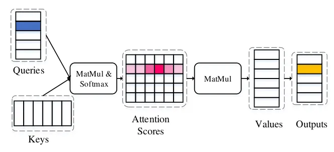

Fig. 3: An illustration of dot-product attention. The queries and the
keys are used to compute the attention scores with matrix multiplication
and the softmax function. The attention scores are used as weights to
fuse values.

## IV The Proposed LASO Model

In this section, we introduce the proposed LASO model. The architecture
is shown in Fig. 2. The encoder encodes the acoustic feature sequence
into high-level representations. The PDS queries the high-level
representation corresponding to each token position. Another purpose of
the PDS is to bridge the length gap between the speech and the token
sequence. The decoder further captures language semantics from the
outputs of the PDS. At last, the probability distributions over the
vocabulary are computed with the linear transformations and the softmax
functions. For inference, the most likely token at each position is
selected. For the token sequence whose length is shorter than $`L`$, the
tail is filled with the filler token \<eos\>. This also predicts the
length of the token sequence automatically. These filler tokens are
easily removed.

The whole network is a feedforward structure so that it can be
implemented in parallel to make the inference fast. We introduce the
details of the basic attention block and each module in the rest of this
section. We also introduce a graph-based view of the whole model.

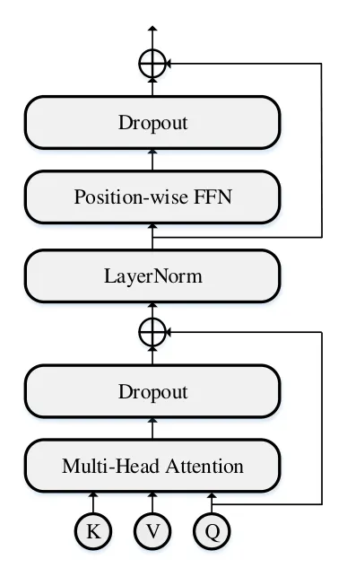

Fig. 4: An illustration of an attention block.

### IV-A Attention Block

The feedforward attention structure \[vaswani2017attention\] captures
the global relationship in a sequence. Different from recurrent neural
networks which encode history context into latent vectors, the
feedforward attention mechanism uses a weighted sum to fuse the input
sequence. Because of its feedforward structure, it can be computed in
parallel. In this work, we use the scaled dot-product attention and
position-wise feedforward network as the basic submodule, following
\[vaswani2017attention\]. But we use “pre-norm”
\[nguyen2019transformers\] for stable training. The structure is shown
in Fig. 4.

The scaled dot-product attention is computed by

```math
\text{Atten}(Q,K,V)=\text{Softmax}(\frac{QK^{T}}{\sqrt{D_{k}}})V, \tag{4}
```

where $`Q\in\mathbb{R}^{T_{q}\times D_{k}}`$ denotes the queries,
$`K\in\mathbb{R}^{T_{k}\times D_{k}}`$ denotes the keys, and
$`V\in\mathbb{R}^{T_{k}\times D_{v}}`$ denotes values. As shown in
Fig. 3, the attention scores are computed with the dot products of
queries and keys, then are normalized with softmax functions. The
normalized attention scores will be sharp at some positions, and others
are small. Then, by matrix multiplication, the values are fused to the
corresponding position. This procedure can be seen as that the query
queries keys and fetches out a corresponding value from values.

To make the attention scores various, it can be extended to a multi-head
version:

```math
\begin{split}&\text{MHA}(Q,K,V)=\text{Concat}(h_{1},\cdots,h_{H})W^{o},\\
&h_{i}=\text{Atten}(QW_{i}^{q},KW_{i}^{k},VW_{i}^{v}),i=1,\cdots,H.\end{split} \tag{5}
```

The queries, keys, and values are transformed into subspaces with
parameter matrices $`W_{i}^{q}`$, $`W_{i}^{k}`$, $`W_{i}^{v}`$, where
$`i`$ is the index of a head. Then, the scaled dot-product attention is
computed for the transformed inputs. At last, the outputs are
concatenated together and multiplied with $`W^{o}`$. $`h_{i}`$ is one
attention head. $`H`$ is the number of heads.

A position-wise feedforward neural network (FFN) transforms the output
of the attention at each position:

```math
\text{FFN}(u)=W_{2}\text{Activate}(W_{1}u+b_{1})+b_{2}, \tag{6}
```

where $`u`$ is a vector at one position, $`W_{1}`$, $`W_{2}`$,
$`b_{1}`$, and $`b_{2}`$ are learnable parameters, “Activate” is a
nonlinear activation function. In this work, gated linear units (GLUs)
\[dauphin2017language\] are used.

Residual connection \[he2016deep\] and layer normalization (LN)
\[ba2016layer\] are also used. Different from \[vaswani2017attention\],
we set the LN layer before the residual connection, following
\[nguyen2019transformers\] to make training stable and effective. The
structure of the attention block is shown in Fig. 4.

### IV-B Encoder

The encoder extracts high-level representations from the acoustic
feature sequence. We first use a two-layer convolutional neural network
(CNN) to subsample the acoustic feature sequence. We set the stride on
the time axis to $`2`$, so that the frame rate is reduced to $`1/4`$.
Then the outputs of the CNN are flattened to a $`T`$-by-$`D_{m}`$
matrix, where $`T`$ is the length of the subsampled feature sequence,
and $`D_{m}`$ is the dimensionality. Another purpose of the CNN is to
capture the locality of the acoustic feature sequence.

Then, the encoder has a stack of $`N_{e}`$ attention blocks, as shown in
Fig. 2. The keys, queries, and values are all the same, so it is a
self-attention mechanism. That is, the attention scores are obtained by
computing dot-product between every two vectors of the inputs.
Therefore, the long-term dependency is captured.

### IV-C Position Dependent Summarizer

The PDS module is the core of the proposed LASO model. The PDS module
leverages queries, which depend on positions of the token sequence, to
query the high-level representations from the encoder. It can be seen
that the module “summarizes” the acoustic features, so we name it as
“summarizer”. As the result, it bridges the gap between the length of
the acoustic feature sequence and the length of the token sequence.

The PDS module consists of $`N_{s}`$ attention blocks, as shown in
Fig. 2. For the first block, the queries are position encodings. And the
queries of the other blocks are the outputs of the previous block. Each
query represents the token position in the token sequence. The keys and
the values are all the outputs of the encoder. The length of $`L`$ of
the position encoding sequence is pre-set by counting the length of
utterances in the training set and add some tolerance. For example, if
the maximum length of token sequences in the training set is 90, we can
set this $`L`$ to 100.

We use sinusoidal position encodings \[vaswani2017attention\]:

```math
\begin{split}\text{pe}_{i,2j}&=\text{sin}(i/10000^{2j/D_{m}}),\\
\text{pe}_{i,2j+1}&=\text{cos}(i/10000^{2j/D_{m}}),\\
\end{split} \tag{7}
```

where $`i=1,\cdots,L`$ denotes the $`i`$-th position and $`j`$ is the
index of an element. A benefit of using sinusoidal position encodings is
that it would allow the model to easily learn relativity of positions.
That is, the positional encoding of a fixed distance between two
positions $`k`$ can be represented as a linear function of the two
positions \[vaswani2017attention\].

### IV-D Decoder

The decoder further refines the representations of the PDS module.
Similar to the encoder, it is a self-attention module, which consists of
$`N_{d}`$ attention blocks. It captures the relationships in the
sequence, i.e., implicit language semantics, which is queried by the
PDS. The inputs of the decoder are the outputs of the PDS. This decoder
leverages the whole context of the utterance.

After the decoder, a linear transformation and a softmax function are
used to compute the probability distribution over the token vocabulary.

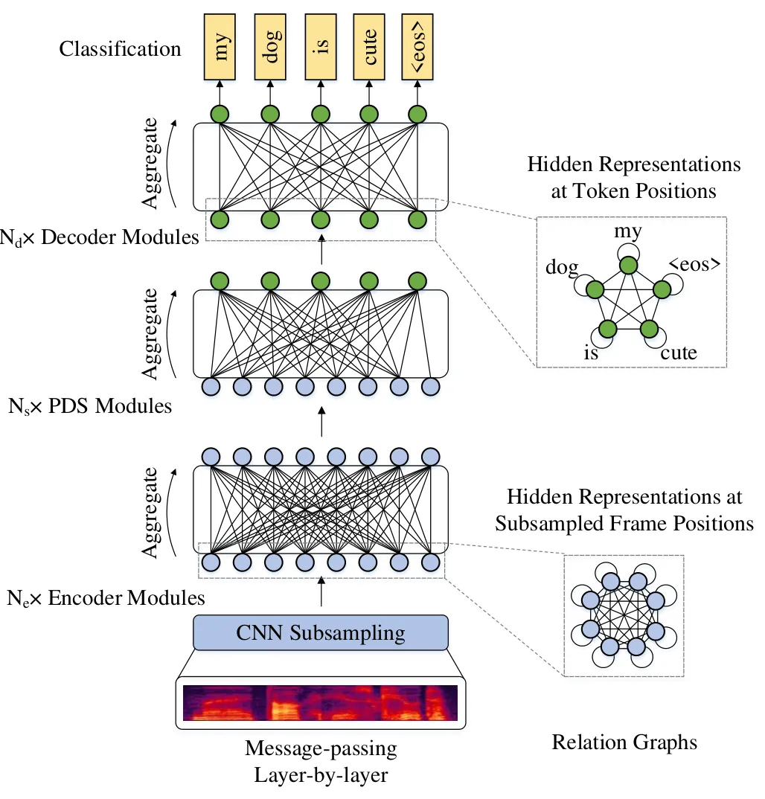

Fig. 5: An illustration of the LASO in a graph-based view. The left part
shows that the messages are passed layer-by-layer. Each module (i.e.
encoder module, PDS module, decoder module) aggregates the previous
representations by the attention mechanism. The right part shows the
relationships among representations in one layer.

### IV-E The Graph-Based View of the Model

We introduce a graph-based view of LASO to further illustrate the
proposed model, as shown in Fig. 5. This view can be divided into two
aspects: a relation graph \[Jiaxuan2020graph\] in one layer and
message-passing of the forward procedure \[Justin2017message,
guo2019star\].

For the aspect of the relations of the representations in one layer, the
hidden representations can be seen as a fully connected graph with
self-loops. Specifically, for the encoder which processes the acoustic
features, the hidden representation at each position is related to all
the hidden representations (including itself). Thus, the representation
sequence can be viewed as a fully connected graph (the graph with blue
nodes in the right part of Fig. 5). With the PDS module, the
representations are converted and are related to token positions. These
representations correspond to each token position and consist of another
fully connected graph (the graph with green nodes in the right part of
Fig. 5), i.e., one representation is related to all the representations
in the sequence. The weights on the edges are computed with the
attention mechanism. This is different from the autoregressive models.
For an autoregressive model, the representation of a token is related to
the previous representations, but not all the representations in the
sequence.

For the aspect of the forward procedure, the forward propagation can be
seen as a message-passing procedure in each module. Specifically, the
outputs and the inputs of a module consist of a bipartite graph, as
shown in the left part of Fig. 5. The weights of the edges are attention
scores. All representations in the inputted sequence are aggregated to
the corresponding node of the output sequence by the weighing sum.
Therefore, the messages in the previous relation graphs are passed to
the next one in the forward propagation.

The graph-based view shows how LASO processes the acoustic feature
sequence as a whole and achieves hidden representations at token
positions. It also shows why the hidden representations at token
positions are related to all the other hidden representations, which is
different from the autoregressive model.

### IV-F Formulation

The LASO model can be formulated as follows:

```math
\begin{split}Z&=\text{Enc}(X),\\
q_{i}&=\text{Summarize}(Z,\text{pe}_{i}),\quad i=1,2,\cdots,L,\\
Q&=[q_{1},\cdots,q_{L}]\\
P(y_{i}|X)&=\text{Dec}(Q),\quad i=1,2,\cdots,L,\\
\end{split} \tag{8}
```

where $`X=[x_{1},\cdots,x_{T}]`$ is the feature sequence, $`Z`$ denotes
the high-level representations encoded with the encoder, and the
probability over the vocabulary at each position $`P(y_{i}|X)`$ is
computed with the PDS and the decoder. Function “Summarize” represents
the PDS module, which attends the outputs of the encoder in terms of the
positional encodings. Because the positional encodings, which are
deterministic but not random, are a part of the whole model, they are
not written in the probability expression.

## V Learning

In this section, we introduce the learning procedure of the LASO model.

### V-A Maximum Likelihood Estimation

We use maximum likelihood estimation (MLE) criterion to train the
parameters of the LASO model. We minimize the following negative
log-likelihood (NLL) loss.

```math
\text{NLL}(\theta)=-\frac{1}{NL}\sum_{n=1}^{N}\sum_{i=1}^{L}\log P_{\theta}(y_{i}^{(n)}|X^{(n)}), \tag{9}
```

where $`X^{(n)},Y^{(n)}`$ is the $`n`$-th speech-text pair in the
corpus. The total number of the pairs is $`N`$. $`y_{i}^{(n)}`$ is
$`i`$-th token in $`Y^{(n)}`$. $`L`$ is the length of the token
sequence, which is preset. If the length of a text data is shorter than
$`L`$, \<eos\> is used to pad it, as shown in Fig. 2. Thus, the length
of the token sequence is estimated automatically. $`\theta`$ denotes
trainable parameters of the model.

This training procedure is end-to-end and does not depend on any
frame-level label generated by some GMM-HMM system.

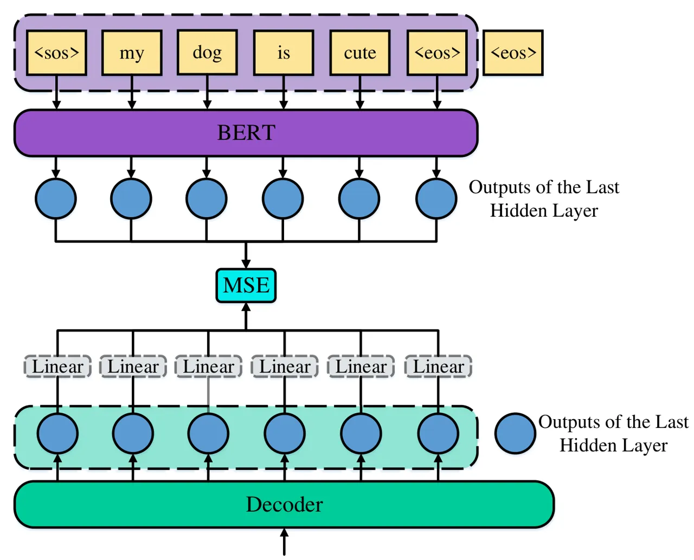

Fig. 6: An illustration of semantic refinement from BERT. The valid part
of the token sequence is inputted into BERT. And the MSE loss between
the last hidden layers of decoder and BERT is minimized. The optional
linear transformation is used when the dimensionalities of the decoder
and BERT are different.

### V-B Semantic Refinement from BERT

To further improve the performance, we use teacher-student learning
\[2006model, li2014learning, hinton2015distilling, romero2014fitnets\]
to refine knowledge from pre-trained LM. BERT, a kind of denoising
autoencoder LM trained on very large-scale text, has shown the powerful
ability of language modeling and achieved state-of-the-art performance
on many NLP tasks \[devlin2018bert\]. Inspired by our previous paper
\[bai2019learn\], we transfer the knowledge from BERT to the LASO model.
Another potential advantage of using BERT as the teacher model is that
both our proposed LASO and BERT are bidirectional models, i.e., the
model predicts a token using both the left context and the right
context.

The basic idea is that the BERT can provide a good semantic
representation for each token. And we consider the outputs of the
decoder also provide token-level representation. Therefore, we make the
outputs of the decoder approximate the BERT. We minimize the mean
squared error (MSE) between their last hidden layers
\[romero2014fitnets\], as shown in Fig. 6. To match the training
procedure of BERT, we add a \<sos\> token at the head of the token
sequence.

We input the token sequence into BERT model to fetch out the outputs of
the last hidden layer. Note that we only input the valid part of the
token sequence, but not the padding token \<eos\> at the tail. \<sos\>
and \<eos\> are converted to \[CLS\] and \[SEP\], which are two special
tokens added at the head and the tail of a sentence in BERT
\[devlin2018bert\].

We also use the valid part of the outputs of the decoder, i.e., the
outputs corresponding to the subsequence from \<sos\> to the first
\<eos\>. Then, we compute the MSE:

```math
\text{MSE}(\theta)=\frac{1}{N}\sum_{n=1}^{N}\frac{1}{L_{v}^{(n)}}\sum_{i=1}^{L_{v}^{(n)}}\sum_{d=1}^{D_{B}}(h_{i,d}^{(n)}-s_{i,d}^{(n)})^{2}, \tag{10}
```

where $`h_{i,d}^{(n)}`$ is the $`d`$-th element of the $`i`$-th vector
in the decoder output sequence for the $`n`$-th data, and
$`s_{i,d}^{(n)}`$ is the $`d`$-th element of the $`i`$-th vector in the
BERT output sequence for the $`n`$-th data, $`D_{B}`$ is the
dimensionality of BERT output, $`L_{v}^{(n)}`$ is the valid length of
$`n`$-th data, and $`N`$ is the total number of the data. $`\theta`$
represents all parameters of the model.

If the dimensionality of the decoder is different from BERT, we can
simply use an optional linear transformation to make the dimensionality
matching, as shown in Fig. 6.

Another benefit of transferring knowledge with the hidden layer rather
than probability is that it makes the construction of vocabulary more
flexible. We can use only a part vocabulary of BERT rather than all
tokens.

At last, we combine the NLL loss and the MSE loss as the final loss:

```math
L(\theta)=\text{NLL}(\theta)+\lambda\text{MSE}(\theta), \tag{11}
```

where $`\lambda`$ is a coefficient to balance the values of the two
losses. The typical value is $`0.005`$.

The BERT model is only used at the training stage. It does not add any
extra complexity during inference.

## VI Inference

The inference of LASO is simple. We just select the most likely token at
each position:

```math
\hat{y_{i}}=\arg\max_{y_{i}}P(y_{i}|X).\quad i=1,\cdots,L, \tag{12}
```

Then, the special tokens \<eos\> (or including \<sos\> if the model is
trained with BERT) are removed. Note that the positional encodings
($`[\text{pe}_{i};\cdots;\text{pe}_{L}]`$) are a part of the whole model
so that they are inputted into the model as a whole.

This inference procedure does not depend on beam-search, so multi-pass
forward propagation is not needed. Thus, the inference time cost is much
reduced.

|           |                   |           |         |           |                 |      |      |                      |      |      |
| --------- | ----------------- | --------- | ------- | --------- | --------------- | ---- | ---- | -------------------- | ---- | ---- |
|           |                   | \#Utter.  | \#Hours | \#Speaker | Duration (Sec.) |      |      | \#Token Per Sentence |      |      |
|           |                   |           |         |           | Min.            | Max. | Avg. | Min.                 | Max. | Avg. |
| AISHELL-1 | Training          | 120,098   | 150     | 340       | 1.2             | 14.5 | 4.5  | 1.0                  | 44.0 | 14.4 |
|           | Dev.              | 14,326    | 18      | 40        | 1.6             | 12.5 | 4.5  | 3.0                  | 35.0 | 14.3 |
|           | Test              | 7,176     | 10      | 20        | 1.9             | 14.7 | 5.0  | 3.0                  | 21.0 | 14.0 |
| AISHELL-2 | Training (iPhone) | 1,009,223 | 1000    | 1347      | 0.5             | 19.3 | 3.6  | 1.0                  | 53.0 | 10.9 |
|           | Dev. (iPhone)     | 2,500     | 2       | 5         | 1.1             | 9.4  | 2.9  | 1.0                  | 25.0 | 9.9  |
|           | Dev. (Android)    | 2,500     | 2       | 5         | 1.1             | 9.4  | 2.9  | 1.0                  | 25.0 | 9.9  |
|           | Dev. (HiFi Mic.)  | 2,500     | 2       | 5         | 1.1             | 9.4  | 2.9  | 1.0                  | 25.0 | 9.9  |
|           | Test (iPhone)     | 5,000     | 4       | 10        | 1.1             | 8.5  | 2.9  | 1.0                  | 25.0 | 9.9  |
|           | Test (Android)    | 5,000     | 4       | 10        | 1.1             | 8.5  | 2.9  | 1.0                  | 25.0 | 9.9  |
|           | Test (HiFi Mic.)  | 5,000     | 4       | 10        | 1.1             | 8.5  | 2.9  | 1.0                  | 25.0 | 9.9  |

TABLE I: The Description of the Datasets

## VII Related Work

In this section, we review and compare the previously related work in
two main aspects. One is the non-autoregressive AED model. And the other
is the utilization of LMs for AED models.

### VII-A Non-Autoregressive AED Models

Non-autoregressive AED models are first used in machine translation
(MT). Gu et al. first proposed non-autoregressive machine translation
and introduced fertility to tack the multimodality problem
\[gu2017non\]. Auxiliary regularization \[wang2019non\] and enhanced
decoder input \[guo2019non\] are proposed to improve the performance.
Lee et al. proposed an iterative refinement algorithm for MT
\[lee2018deterministic\]. MA et al. proposed a flow model for sequence
generation \[ma2019flowseq\]. These models showed promising results on
both performance and efficiency. However, these models are used for MT
but not ASR. Speech signal has its specific property, for example, the
monotonic alignment with the token sequence, and the implicit language
semantics in speech. This motivated us to propose a simpler
non-autoregressive AED model for ASR. The non-autoregressive
transformer, which completes the masked tokens iteratively, is proposed
for ASR \[chen2019non\]. MASK-CTC uses decoding results as the
initialization and refines the results with a masked language model
\[Higuchi2020\]. Different from the previous work, we propose a
non-autoregressive model LASO, which forward propagates for one-pass. We
reformulate speech recognition as a position-wise classification
problem. We propose the PDS to extract token-level representation from
speech. The PDS bridges the length gap between the speech and the token
sequence.

### VII-B The Utilization of LMs

Fusion methods, such as shallow fusion, deep fusion, and cold fusion,
integrate external LMs to improve the performance \[gulcehre2015on,
sriram2018cold\]. However, these methods add extra complexity during
inference. And these methods can only use unidirectional LMs, so recent
powerful bidirectional LMs such as ELMo \[peters2018deep\], BERT
\[devlin2018bert\], are not applicable. BERT was used to rescore the
n-best results \[shin2019effective\]. However, rescoring increases
computation during inference. And it does not use the representation
ability of BERT. Bai et al. proposed LST approach to transfer knowledge
from an LM to an ARM with teacher-student learning \[bai2019learn\].
\[futami2020distilling\] distilled knowledge from BERT to an ARM. In
this paper, we transfer the knowledge from BERT to improve the LASO
model. LASO and BERT both capture the global token-level relationship.
With this method, the LASO model can benefit from the representation
ability of BERT but does not add any extra computation during inference.

### VII-C Cross-Modal Semantic Alignment

The semantic refinement from BERT is also related to cross-modal
semantic alignment, i.e., aligning the spaces of LASO and BERT. The
concept of cross-modal semantic alignment is first used in cross-modal
retrieval \[lavrenko2003model, jeon2003automatic, jiang2017deep,
fan2017cross, zhen2019deep, yang2020learning\]. Especially the recent
deep learning work learn a shared semantic space between the images and
the text-based on neural networks \[fan2017cross, jiang2017deep,
zhen2019deep, yang2020learning\]. The basic idea of these work is to map
the features from different modalities so that the system can easily
compute their similarities. Recent ASR-free approach to text query-based
keyword search from a speech also based on this idea, i.e., learning a
shared semantic space between text query and speech
\[audhkhasi2017end\]. The motivation of our proposed semantic refinement
from BERT is also to align semantic of LASO and BERT. However, different
from the retrieval work, we do not train the models of the two
modalities but only train the LASO model. Namely, the BERT model, which
has been confirmed as a powerful language model, is an auxiliary model
to train the LASO model and is not used during inference. In addition,
this work is in a cross-model knowledge transferring setting, i.e.,
transferring knowledge from text-modal model BERT to speech-modal model
LASO¹¹ 1 Different from AED models, the inputs of LASO are only speech
features but not text embeddings. Therefore, it is a unimodal model..

## VIII Experimental Setup

In this section, we introduce the used datasets and the experimental
setup. All the experiments are implemented with deep learning toolkit
PyTorch \[Paszke2019pytorch\] with python programming language.

### VIII-A Datasets

We conduct experiments on public Chinese speech datasets AISHELL-1²² 2
http://www.openslr.org/33/ \[bu2017aishell\] and AISHELL-2³³ 3
http://www.aishelltech.com/aishell_2 \[du2018aishell\]. These two
datasets have different scales of data so that we can evaluate the
generalization on both a small dataset and a large dataset. The reason
to select these two datasets is that character-based tokenization of the
officially pre-trained Google’s BERT for Chinese is proper for the
experiment of semantic refinement from BERT ⁴⁴ 4 We did some initial
experiments on English dataset LibriSpeech. However, the tokenization
method of English BERT makes the vocabulary very large (27563 English
word pieces) so that it is not easy for the model to converge. We
noticed similar phenomena of MASK-CTC \[Higuchi2020\] on
Latin-alphabet-based experiments, while it performs very well in the
Japanese task. In the future, we will try to select proper modeling
units for Latin-alphabet-based data and train our own BERT models. We
provide discussion on English dataset LibriSpeech in the supplemental
materials..

AISHELL-1 contains 178 hours of Mandarin speech. The speech is recorded
by 400 speakers. All audio is recorded with high fidelity microphones in
44.1 kHz, then subsampled to 16 kHz. The content of the datasets covers
5 domains including “Finance”, “Science and Technology”, “Sports”,
“Entertainments”, and “News”.

AISHELL-2 contains about 1000 hours of Mandarin Speech for training. The
training set is recorded by 1991 speakers with iPhone smartphones. The
content covers voice commands, digital sequence, places of interest,
entertainment, finance, technology, sports, English spellings, and free
speaking without specific topics. The development sets and the test sets
are recorded with different equipment to evaluate generalization for
different equipment.

The details of the two datasets are shown in Table I.

| Symbol     | Description                                                   |
| ---------- | ------------------------------------------------------------- |
| $`D_{m}`$  | The dimensionality of the inputs of the multi-head attention. |
| $`D_{in}`$ | The inner dimensionality of the position-wise FFN.            |
| Activation | The type of activation function of the position-wise FFN.     |
| \#Enc.     | The number of blocks of the encoder.                          |
| \#PDS      | The number of blocks of PDS.                                  |
| \#Dec.     | The number of blocks of the decoder.                          |

TABLE II: The Symbols of the Hyper-parameters of the Architecture

### VIII-B Setup

Basic settings. We first evaluate the models on the small-scale (150
hours) dataset AISHELL-1. Then we extend the experiments to the
large-scale (1000 hours) dataset AISHELL-2. We use $`80`$-dimension
Mel-filter bank features (FBANK) as the inputs, which are extracted
every 10ms with 25ms of frame length. For AISHELL-1, the token
vocabulary contains $`4231`$ characters in the training set and three
special symbols, i.e., ”\<sos\>” for the start of the sentence,
”\<unk\>” for unseen characters, and ”\<eos\>” as the filler of the tail
of a token sequence. The vocabulary size for AISHELL-2 is $`5252`$.

Baseline settings. We build an autoregressive AED model
Speech-Transformer \[dong2018speech, zhou2018syllable\] and a
non-autoregressive SAN-CTC model \[Salazar2019self\] as two baselines.
The two models use the same settings as LASO, including the
above-mentioned features, vocabulary, and basic attention blocks
(Fig. 4). Both two models use the whole input signal, which is the same
with LASO. Because we would like to compare the performance of SAN-CTC
in the end-to-end non-autoregressive setting, the decoding process is
greedy, i.e., directly select the most likely token and remove the
blanks, without beam-search on an N-gram LM based searching graph.

For Speech-Transformer, both the encoder and the decoder have 6
attention layers. The model dimensionality is 512. The number of heads
of the attention is 8. The dimensionality of the intermediate FFN is 2048. And the activation function is GLU. It also uses the same CNN
subsampling layer as the LASO models, as shown in Fig. 2. We refer to
this model as Transformer. For SAN-CTC, because it only has an encoder
part, we set the number of the attention layer to 12. The model size is
comparable to Transformer and other models. We refer to this model as
SAN-CTC.

LASO settings. We compare different architectures of LASO. The symbols
of network configuration are shown in Table II. The basic attention
blocks are shown in Fig. 4, which are the same as the two baselines. The
lengths of positional encodings of the PDS module are set to $`60`$
($`L`$ in Eq. (8) ).

Training settings. We use Adam algorithm \[kingma2014adam\] to optimize
the models. We use the warm-up learning rate schedule
\[vaswani2017attention\]:

```math
\alpha=D^{-0.5}\cdot\text{min}(step^{-0.5},step\cdot warmup^{-1.5}). \tag{13}
```

The warm-up step is set to 12000. The dropout rate is set to 0.1. Each
batch contains about 100 seconds of speech, and we accumulate gradients
of 12 steps to simulate a big batch \[ott2018scaling\] for stabilizing
training. We train the models until they converge. The typical number of
epochs for LASO is 130. And the typical number of epochs for
Speech-Transformer and SAN-CTC is 80.

We use SpecAugment \[park2019specaugment\] for data augmentation. The
frequency masking width is 27. The time masking width is 40. Both
frequency masking and time masking are employed twice. But we do not use
time warping. We leverage label smoothing with 0.1 for over-confidence
problems during training. We average parameters of the models which are
saved at the last 10 epochs as the final model.

We use the Google’s pre-trained Chinese BERT model⁵⁵ 5
https://storage.googleapis.com/bert_models/2018_11_03/chinese_L-12_H-768_A-12.zip
for semantic refinement. This model has 12 transformer layers. The model
dimensionality is 768. The total number of parameters is 110M. The
vocabulary of the BERT model contains 21128 tokens. During training, the
coefficient $`\lambda`$ in Eq. (11) is set to $`0.005`$.

| Model | Dm  | Din  | Activation | \#Enc. | \#PDS | \#Dec. | Model size | w/o BERT     |              | w/ BERT      |              |
| ----- | --- | ---- | ---------- | ------ | ----- | ------ | ---------- | ------------ | ------------ | ------------ | ------------ |
|       |     |      |            |        |       |        |            | CERs on Dev. | CERs on Test | CERs on Dev. | CERs on Test |
| 1     | 256 | 2048 | ReLU       | 4      | 1     | 4      | 15.9M      | 7.9          | 8.8          | 7.7          | 8.6          |
| 2     | 256 | 2048 | GLU        | 4      | 1     | 4      | 20.6M      | 7.1          | 8.1          | 7.0          | 7.8          |
| 3     | 256 | 2048 | ReLU       | 6      | 1     | 6      | 21.2M      | 7.2          | 8.2          | 7.1          | 8.0          |
| 4     | 256 | 2048 | GLU        | 6      | 1     | 6      | 28.0M      | 6.6          | 7.5          | 6.6          | 7.4          |
| 5     | 256 | 2048 | ReLU       | 6      | 2     | 6      | 22.8M      | 7.4          | 8.3          | 7.3          | 8.1          |
| 6     | 256 | 2048 | GLU        | 6      | 2     | 6      | 30.1M      | 6.6          | 7.5          | 6.3          | 7.1          |
| 7     | 256 | 2048 | ReLU       | 8      | 2     | 6      | 25.4M      | 7.3          | 8.4          | 7.3          | 8.1          |
| 8     | 256 | 2048 | GLU        | 8      | 2     | 6      | 33.8M      | 6.7          | 7.5          | 6.5          | 7.4          |
| 9     | 512 | 2048 | ReLU       | 4      | 1     | 4      | 37.0M      | 7.0          | 7.8          | 6.6          | 7.4          |
| 10    | 512 | 2048 | GLU        | 4      | 1     | 4      | 46.5M      | 6.4          | 7.4          | 5.9          | 6.7          |
| 11    | 512 | 2048 | ReLU       | 6      | 1     | 6      | 49.6M      | 6.6          | 7.5          | 6.0          | 6.7          |
| 12    | 512 | 2048 | GLU        | 6      | 1     | 6      | 63.3M      | 6.2          | 7.0          | 5.4          | 6.2          |
| 13    | 512 | 2048 | ReLU       | 6      | 2     | 6      | 53.9M      | 6.6          | 7.5          | 6.6          | 7.5          |
| 14    | 512 | 2048 | GLU        | 6      | 2     | 6      | 68.6M      | 6.1          | 6.9          | 5.4          | 6.1          |
| 15    | 512 | 2048 | ReLU       | 8      | 2     | 6      | 60.2M      | 6.6          | 7.5          | 6.2          | 6.9          |
| 16    | 512 | 2048 | GLU        | 8      | 2     | 6      | 80.0M      | 5.9          | 6.6          | 5.2          | 5.8          |
| 17    | 768 | 2048 | ReLU       | 6      | 1     | 6      | 85.5M      | 6.5          | 7.3          | 5.9          | 6.6          |
| 18    | 768 | 2048 | GLU        | 6      | 1     | 6      | 105.8M     | 5.9          | 6.9          | 5.3          | 6.1          |

TABLE III: The Character Error Rates on AISHELL-1 with Different
Hyper-parameters

Performance evaluation. For performance evaluation, we use the standard
edit-distance based error rate, i.e. character error rate (CER). For
speed evaluation, we use both real-time factor (RTF) and average
processing time (APT)\[gu2017non\]. RTF is a standard metric to evaluate
the processing time cost of an ASR system. It is the average time cost
to process one-second speech:

```math
\text{RTF}=\frac{\text{Total Processing Time}}{\text{Total Duration}}. \tag{14}
```

This metric is dimensionless and independent of utterance duration. To
consider the impact to the processing time of the utterance duration, we
compute APT:

```math
\text{APT}=\frac{\text{Total Processing Time}}{\text{Total Number of Utterance}}. \tag{15}
```

The unit of APT is second.

The reason to use ATP is to show the efficiency to process one
utterance. It considers the waiting time of a user and is suitable for
both online applications (such as speech interaction systems) and
offline applications (such as voice document transcription).
Specifically, for online applications, the waiting time of a user is
“the time between the stop-point at which the user stops speaking and
the appearance on the screen of the ASR result”. And for offline
applications, the waiting time of a user is “the time between the point
at which the user inputs the utterance and the appearance on the screen
of the ASR result”. These metrics ignore the uncontrollable factors of a
speech engineer, e.g., data transmission speed on the Internet.

RTF may give an overestimated sense of whole-utterance ASR systems (AED,
Speech-Transformer, or bidirectional AM based hybrid models), because
the whole-utterance ASR systems starts processing speech after receiving
the whole utterance, unlike some streaming models. For streaming models,
the waiting time of a user of an online application can be estimated as

```math
\text{RTF}\times\text{the length of the last data package}. \tag{16}
```

However, for whole-utterance ASR systems, the length of whole-utterance
is needed to be considered. To address this issue, we compute APT, which
directly average the processing time cost of an utterance. We compute
these two practical values on commonly used deep learning devices (GPUs)
to show the time cost of the ASR systems. We also mention that the time
cost of feature extraction is included in our experimental
implementation.

## IX Experimental Results

In this section, we introduce the experimental results.

### IX-A Comparing Model Architectures on AISHELL-1

|                                                                         |          |      |      |               |
| ----------------------------------------------------------------------- | -------- | ---- | ---- | ------------- |
| Model                                                                   | \#Param. | CERs |      | RTF / APT     |
|                                                                         |          | Dev. | Test |               |
| KALDI(nnet3) \* $`\dagger`$ $`\ddagger`$                                | \-       | \-   | 8.6  | \-            |
| KALDI(chain) \* $`\dagger`$ $`\ddagger`$                                | \-       | \-   | 7.4  | \-            |
| LAS \[sun2019adversarial\]                                              | \-       | 9.4  | 10.6 | \-            |
| ESPNet (Transformer) $`\dagger`$ $`\ddagger`$ \[karita2019comparative\] | \-       | 6.0  | 6.7  | \-            |
| A-FMLM \[chen2019non\]                                                  | \-       | 6.2  | 6.7  | \-            |
| Fan et al. (Transformer) \[fan2019unsupervised\]                        | \-       | \-   | 6.7  | \-            |
| AGS CTC $`\ddagger`$ \[ding2020ctc\]                                    | \-       | 7.0  | 7.9  | \-            |
| Transformer (baseline1)                                                 | 67.5M    | 6.1  | 6.6  | 0.19 / 961ms  |
| SAN-CTC (baseline2)                                                     | 56.4M    | 7.2  | 7.8  | 0.0033 / 16ms |
| LASO-small                                                              | 20.6M    | 7.1  | 8.1  | 0.0027 / 13ms |
| LASO-small w/ BERT                                                      | 20.6M    | 7.0  | 7.8  | 0.0027 / 13ms |
| LASO-middle                                                             | 63.3M    | 6.2  | 7.0  | 0.0035 / 17ms |
| LASO-middle w/ BERT                                                     | 63.3M    | 5.4  | 6.2  | 0.0035 / 17ms |
| LASO-big                                                                | 80.0M    | 5.9  | 6.6  | 0.0040 / 20ms |
| LASO-big w/ BERT                                                        | 80.0M    | 5.2  | 5.8  | 0.0040 / 20ms |

- \*
  from the KALDI official repository⁶⁶footnotemark: 6 .
- $`\dagger`$
  with speed perturbation based data augmentation.
- $`\ddagger`$
  with an extra language model at the inference stage.

TABLE IV: Comparisons with Baselines on AISHELL-1

|                                                          |          |          |           |             |        |          |           |             |        |
| -------------------------------------------------------- | -------- | -------- | --------- | ----------- | ------ | -------- | --------- | ----------- | ------ |
| Model                                                    | \#Param. | CERs     |           |             |        |          |           |             |        |
|                                                          |          | Dev.     | Dev.      | Dev.        | Dev.   | Test     | Test      | Test        | Test   |
|                                                          |          | (iPhone) | (Android) | (HiFi Mic.) | (Avg.) | (iPhone) | (Android) | (HiFi Mic.) | (Avg.) |
| KALDI (chain) \[du2018aishell\] $`\dagger`$ $`\ddagger`$ | \-       | 9.1      | 10.4      | 11.8        | 10.4   | 8.8      | 9.6       | 10.9        | 9.8    |
| LAS \[sun2019adversarial\]                               | \-       | \-       | \-        | \-          | \-     | 9.2      | 9.7       | 10.3        | 9.7    |
| ESPNet (transformer) \* $`\dagger`$ $`\ddagger`$         | \-       | \-       | \-        | \-          | \-     | 7.5      | 8.9       | 8.6         | 8.3    |
| Transformer (baseline1)                                  | 67.5M    | 6.4      | 7.2       | 7.7         | 7.1    | 7.1      | 8.0       | 8.2         | 7.8    |
| SAN-CTC (baseline2)                                      | 56.4M    | 8.3      | 8.9       | 8.8         | 8.6    | 8.0      | 9.0       | 8.9         | 8.7    |
| LASO-small                                               | 20.6M    | 8.2      | 9.5       | 9.7         | 9.1    | 8.5      | 9.5       | 9.5         | 9.2    |
| LASO-small w/ BERT                                       | 20.6M    | 8.9      | 10.0      | 10.3        | 9.7    | 8.8      | 9.8       | 10.5        | 9.7    |
| LASO-middle                                              | 63.3M    | 6.6      | 7.5       | 7.6         | 7.2    | 6.8      | 7.4       | 7.3         | 7.2    |
| LASO-middle w/ BERT                                      | 63.3M    | 6.5      | 7.2       | 7.4         | 7.0    | 6.6      | 7.2       | 7.1         | 7.0    |
| LASO-large                                               | 80.0M    | 6.4      | 7.3       | 7.3         | 7.0    | 6.7      | 7.4       | 7.4         | 7.1    |
| LASO-large w/ BERT                                       | 80.0M    | 6.2      | 7.2       | 7.3         | 6.9    | 6.5      | 7.2       | 7.1         | 6.9    |

- \*
  from the ESPnet official repository⁷⁷ 7
  https://github.com/kaldi-asr/kaldi/blob/master/egs/aishell/s5/RESULTS.
- $`\dagger`$
  with speed perturbation based data augmentation.
- $`\ddagger`$
  with an extra language model at the inference stage.

TABLE V: Comparisons with Baselines on AISHELL-2

First, we comparing the performance of the different model
configurations. Table III shows the results of the different
configurations. From Table III, we conclude statements as follows.

1.  1.  $`D_{m}`$: A large number of the dimensionality of the attention
        block makes the model have more powerful representation ability and
        achieve better performance.
2.  2.  Activation: We find that using GLU as the activation function is
        more effective than using ReLU consistently. The GLU will introduce
        more parameters to the model. However, comparing the deeper model
        with ReLU and the shallower model with GLU, whose model sizes are
        relatively similar, the model with GLU can achieve better
        performance.
3.  3.  \#Enc. and \#Dec.: Increasing the number of the blocks of the
        encoder and the decoder improves the performance of the model.
4.  4.  \#PDS: We compare the model with one-layer PDS and the one with
        two-layer PDS. We find the difference between the two is not very
        significant.
5.  5.  Semantic Refinement from BERT: We can see that with semantic
        refinement from BERT, the performance improvements are significant
        for the $`D_{m}=512`$. However, for the models with $`D_{m}=256`$,
        the performance improvements are subtle. We analyze that it is
        because the discrepancy of the dimensionality of the LASO and BERT
        is too large so that it is hard for the LASO models to learn the
        representations of BERT.

In the rest of the paper, we refer to model 2, model 12, and model 16 in
Table III as LASO-small, LASO-middle, and LASO-big, respectively, to
compare performance with previous models.

### IX-B Comparisons with Other Methods on AISHELL-1

We compare our proposed LASO with baseline autoregressive model
Transformer and non-autoregressive CTC model SAN-CTC. We also compare it
with previous work. The results are shown in Table IV. We can see that
our proposed LASO models achieve competitive performance, compared with
the hybrid models, the CTC models, and autoregressive transformer
models. In particular, with semantic refinement from BERT, LASO-middle
and LASO-big outperform the autoregressive Transformer model. Moreover,
the inference speed of the non-autoregressive models is much faster than
the autoregressive models.

We implemented a competitive baseline autoregressive model Transformer,
which achieves a CER of 6.6% on the test set of AISHELL-1. The
performance of LASO-middle, which has a similar scale of the number of
the parameters with Transformer, is comparable to Transformer. And the
bigger model LASO-big outperforms Transformer. Both LASO-middle and
LASO-big outperform the CTC based non-autoregressive model SAN-CTC.

⁷⁷footnotetext:
https://github.com/espnet/espnet/blob/master/egs/aishell2/asr1/RESULTS.md

Table IValso lists RTF and APT of the models. RTF is the ratio of the
total inference time to the total duration of the test set. APT is the
averaged time cost for decoding one utterance (including the time of
feature extraction) on the test set. The inference is done utterance by
utterance on an NVIDIA RTX 2080Ti GPU. We can see that the inference
speed of the non-autoregressive models is much faster than the
autoregressive transformer model Transformer. The APT of the
non-autoregressive models is reduced by $`50\times`$. And we can see
that even the model size of LASO-big is larger than Transformer, the APT
of LASO-big is much reduced. With the non-autoregressive and the
feedforward structure, the inference of the model can be implemented
very efficiently.

The inference speed of the baseline non-autoregressive model SAN-CTC is
also very fast. However, compared with the similar scale LASO models,
the performance is degraded. We analyze that the LASO models use the
decoder, which plays the role of an autoencoder LM, to capture language
semantics more effectively. In addition, for CTC models, the blank
symbols inserted in the token sequence may influence the model to
capture language semantics.

For LASO-middle and LASO-big, semantic refinement from BERT much reduces
CERs by 11% to 12% on the test set. This demonstrates that
teacher-student learning with BERT can improve the ability of the LASO
to capture the language semantics. However, for the small-size model
LASO-small semantic refinement from BERT does not improve the
performance. We analyze that the dimensionality of the representations
of LASO-small and BERT are very different (256 vs. 768), which
influences the LASO model to learn knowledge from the BERT model.

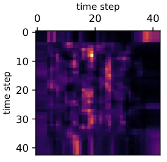

(a) The attention scores of the first head of the last encoder layer.

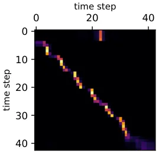

(b) The attention scores of the second head of the last encoder layer.

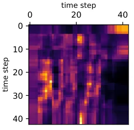

(c) The attention scores of the third head of the last encoder layer.

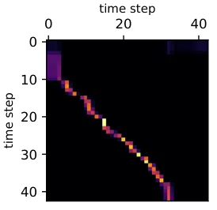

(d) The attention scores of the forth head of the last encoder layer.

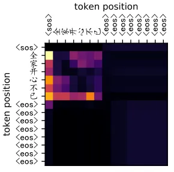

(e) The attention scores of the first head of the last decoder layer.

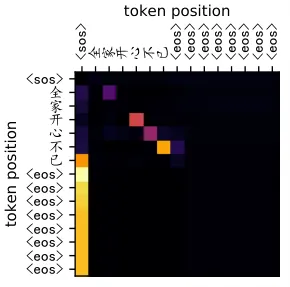

(f) The attention scores of the second head of the last decoder layer.

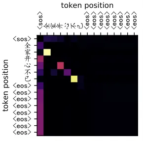

(g) The attention scores of the third head of the last decoder layer.

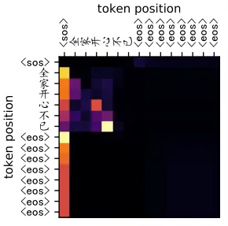

(h) The attention scores of the forth head of the last decoder layer.

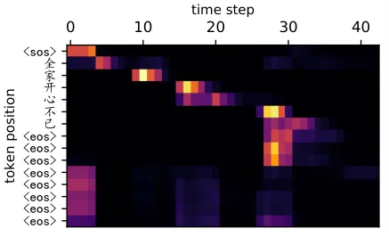

(i) The attention scores of the first head of the last PDS layer.

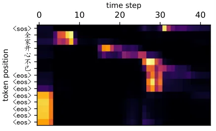

(j) The attention scores of the second head of the last PDS layer.

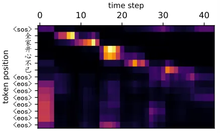

(k) The attention scores of the third head of the last PDS layer.

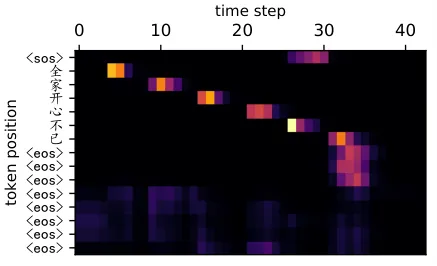

(l) The attention scores of the forth head of the last PDS layer.

Fig. 7: The visualization of the attention scores of the model LASO-big.
Here, we show the first four heads of the last layer of each module. And
because the token sequence is long to visualize, we truncate the first
15 tokens. All visualization is listed in the supplemental materials.

### IX-C Comparisons with Other Methods on AISHELL-2

We then extend the experiments to the larger scale dataset AISHELL-2.
AISHELL-2 contains about 1000 hours of training data. And the covered
topics of AISHELL-2 are more diverse than AISHELL-1. Furthermore, the
training set is recorded with iPhone, and the test sets of AISHELL-2
cover three different channels, i.e., iPhone, Android smartphones, and
Hi-Fi microphones. So we can evaluate the generalization of the models
on AISHELL-2 more in detail. Because AISHELL-2 is larger than AISHELL-1
and training models on AISHELL-2 costs much more time, we directly use
the selected architectures from previous experiments on this dataset.

The experimental results are shown in Table V. We can see that the
proposed LASO models also achieve a promising performance. Compared with
the hybrid systems, LAS systems, and the CTC model, all LASO models
achieve better performance. And with the similar and larger scale model
sizes, LASO-middle and LASO-big outperform previous transformer models.
We find that with more data and a larger model, LASO can achieve better
performance than the well-trained transformer models. With semantic
refinement from BERT, the performances are further improved. However,
the improvements are not significant like the experiments on AISHELL-1.
And for LASO-small, the performance degrades. The possible reasons
are 1) the model capacity is very large between the small model
LASO-small and the big model BERT; 2) AISHELL-2 has more data and is
more complex than AISHELL-1, which influences the effectiveness of
knowledge distillation \[Zagoruyko2017AT, cho2019efficacy\].

## X Discussion

In this section, we analyze the attention patterns and discuss the
impact of the sentence lengths. And we show some decoded examples of the
models.

(a) A scatter plot of the CER of each sentence vs. the length of a
sentence on AISHELL-1 test set.

(b) A scatter plot of the CER of each sentence vs. the length of a
sentence on AISHELL-2 iPhone test set.

Fig. 8: Scatter plots for analyzing the impact of the lengths of the
sentences. The grey histograms represent the ratios of lengths of the
sentence (i.e., the number of the tokens) on the training set. The area
of a scatter shows the number of the examples at that point. We use
baseline1 Transformer, baseline2 SAN-CTC, and LASO-middle since they
have similar model sizes. From the plots, we can see no significant
difference between the three models. The three models have the same CER
for some sentences so that the scatters are overlapped. Note that an
outlier in the second figure which CER is 100% since the reference of
this sentence is wrong.

### X-A Visualization of Attention Patterns

To better understand the behaviors of the LASO model, we visualize the
attention scores of an utterance with LASO-big. We show the first four
heads of attention scores of the last layers of the encoder, the PDS,
and the decoder. The detailed visualization is listed in the
supplemental materials. Fig. 7 shows the visualization results. We
summarize the observations as follows.

1.  1.  Different heads in one layer have different attention patterns. This
        implies that one representation of the sequence in different head
        attends different representations.
2.  2.  For the encoder, some attention patterns show the top-left to
        bottom-right alignments (Fig. 7b and Fig. 7d). This meets the
        expectation: the matched representations are around the
        corresponding representation in the speech sequence. And some heads
        do not show obvious patterns.
3.  3.  For the decoder, we can see that some hidden representation at a
        token position attends the hidden representation at the previous
        token position (Fig. 7g), and some hidden representation at a token
        position attends the hidden representation at the next token
        position (Fig. 7f). Most hidden representations corresponding to
        filler tokens \<eos\> attend the hidden representations
        corresponding to \<sos\>.
4.  4.  For the PDS, the position corresponding to a token attends a small
        range of representations, and the overall patterns are from the
        top-left to the bottom-right (Fig. 7i, Fig. 7j, Fig. 7k, and
        Fig. 7l). For the first several positions corresponding to the
        filler \<eos\> tokens, the attention pattern is like a vertical
        line. However, the lines are corresponding to different positions of
        the speech in different head (Fig. 7j and Fig. 7l). And most other
        \<eos\> tokens attend the first several representations. We analyze
        that these representations denote fillers.

From the above observations, we conclude that 1) different attention
patterns make the model fuse the representations from various aspects; 2) the attention mechanism can learn meaningful alignments in terms of
the positional encodings; 3) the two special filler tokens \<sos\> and
\<eos\> absorb the meaningless representations from the encoder; 4)
specific attention patterns exist in the different heads of the decoder.
These demonstrate that the PDS module attends specific acoustic
representations based on positions and the decoder captures the token
relationship based on the self-attention mechanism.

### X-B The Impact of the Lengths of Sentences

Position parameters exist in the PDS module. This may cause that the
performance relies on the length of a sentence. To check this point, we
plot scatters of the CER of each sentence vs. the length of a sentence
in Fig. 8. We can see no significant difference among the three models.

Fig. 8also provides histograms of ratios of the different lengths of the
training set. We can see that the distributions approximate Gaussian
distribution as expected. And the trend of CERs is similar to the length
distribution of the training set, i.e., the CERs of more sentences are
zero in the middle part of the figures. This is because the models are
trained with more data with the middle lengths. All three models can
recognize the sentences with unseen lengths (or few-shot lengths) in the
training set. However, the error rates are relatively higher than the
sentences with seen lengths. This phenomenon is as expected. Because the
three models (Transformer, SAN-CTC, LASO) are all whole-utterance ASR
models, the length of the utterance is an implicit factor to train the
models. This is different from the local-window models based
conventional hybrid models, i.e., time-delay neural networks (TDNN),
CNNs, or latency-control BLSTM. LASO is more sensitive with the unseen
lengths than Transformer and SAN-CTC. Because the PDS module needs to be
trained with various lengths.

In engineering practice, two methods can be applied to address the
unseen-length issue of the whole-utterance models: 1) select data with
various lengths to train the models; 2) using a voice activity detection
(VAD) system to cut long utterances into segments.

### X-C Examples of Semantic Refinement from BERT

We show some recognized results of the models with and without semantic
refinement from BERT in . The recognized results are from AISHELL-1 test
set. The model architecture is LASO-big. The grey background is the
wrongly recognized words. And the red words are correctly recognized by
the model with semantic refinement from BERT.

From , we can see that in terms of the semantic of the words, the model
with semantic refinement from BERT correctly recognized the words which
were not recognized by the model without semantic refinement from BERT.
Specifically, for case 1 to case 4, the model w/o BERT recognized the
word as another word which has similar pronunciation but mismatched
meaning (e.g., “

一场”, “

骤”). Case 5 is an interesting example. The model w/o BERT recognized a
word as “

爷泳”, but it is wrong in grammar. The results of the model w/ BERT at
the corresponding position is “

爷爷” which is a correct word in grammar, but it does not match the
reference. These results show that the proposed semantic refinement from
BERT impacts the model in semantic and can improve semantic
representation performance for these examples.

## XI Conclusions and Future Work

This paper proposes a feedforward neural network based
non-autoregressive speech recognition model called LASO. The model
consists of an encoder, a position dependent summarizer, and a decoder.
The encoder encodes the acoustic feature sequence into high-level
representations. The PDS converts the acoustic representation sequence
to the token-level sequence. And the decoder further captures the
token-level relationship. Because the prediction of each token does not
rely on other tokens, and the whole model is feedforward, the
parallelization of the whole sentence prediction is realizable. Thus,
the inference speed is much improved, compared with the autoregressive
attention-based end-to-end models. Furthermore, we propose to refine
semantics from a large-scale pre-trained language model BERT to improve
the performance. Experimental results show that LASO can achieve a
competitive performance and high efficiency. In the future, we will
improve the performance of LASO by the architecture and loss functions.
We find that LASO is trained with more epochs during training. We will
try to find strategies to speed up training. And we will try to find
more proper modeling units for Latin-alphabet-based data.

|     |           |                                                                                   |
| --- | --------- | --------------------------------------------------------------------------------- |
| 1   | Reference | 而二零零八年举办夏季奥运会所留下的宝贵   遗产/yi2 chan3/                          |
|     | w/o BERT  | 而二零零八年举办夏季奥运会所留下的宝贵\markoverwith \ULon    一场/yi4 chang3/     |
|     | w/ BERT   | 而二零零八年举办夏季奥运会所留下的宝贵   遗产/yi2 chan3/                          |
| 2   | Reference | 当月住宅类商品房成交套数   骤/zhou4/   跌                                         |
|     | w/o BERT  | 当月住宅类商品房成交套数\markoverwith \ULon   周/zhou1/   跌                      |
|     | w/ BERT   | 当月住宅类商品房成交套数   骤/zhou4/   跌                                         |
| 3   | Reference | 数十名市民赶到越秀区  一/yi4/  酒     家维权/jia1 wei2 quan2/                     |
|     |           |                                                                                   |
|     | w/o BERT  |                                                                                   |

TABLE VI: Examples of Recognized Results
