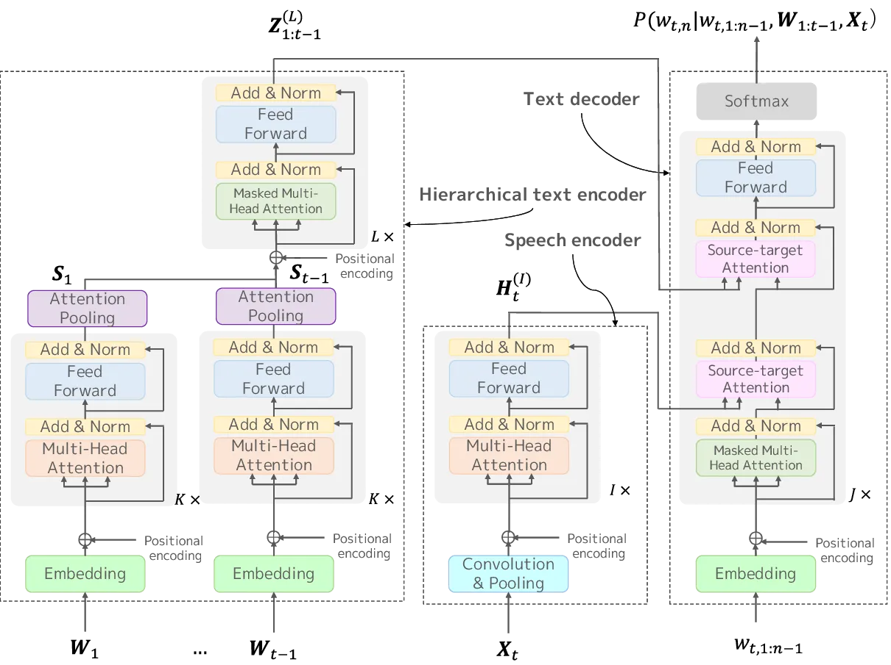

# Hierarchical transformer-based Large-context End-to-end ASR with Large-context Knowledge Distillation

Ryo Masumura     Naoki Makishima     Mana Ihori     Akihiko Takashima
    Tomohiro Tanaka     Shota Orihashi

###### Abstract

We present a novel large-context end-to-end automatic speech recognition
(E2E-ASR) model and its effective training method based on knowledge
distillation. Common E2E-ASR models have mainly focused on
utterance-level processing in which each utterance is independently
transcribed. On the other hand, large-context E2E-ASR models, which take
into account long-range sequential contexts beyond utterance boundaries,
well handle a sequence of utterances such as discourses and
conversations. However, the transformer architecture, which has recently
achieved state-of-the-art ASR performance among utterance-level ASR
systems, has not yet been introduced into the large-context ASR systems.
We can expect that the transformer architecture can be leveraged for
effectively capturing not only input speech contexts but also long-range
sequential contexts beyond utterance boundaries. Therefore, this paper
proposes a hierarchical transformer-based large-context E2E-ASR model
that combines the transformer architecture with hierarchical
encoder-decoder based large-context modeling. In addition, in order to
enable the proposed model to use long-range sequential contexts, we also
propose a large-context knowledge distillation that distills the
knowledge from a pre-trained large-context language model in the
training phase. We evaluate the effectiveness of the proposed model and
proposed training method on Japanese discourse ASR tasks.

###### Index Terms: 

large-context endo-to-end automatic speech recognition, transformer,
hierarchical encoder-decoder, knowledge distillation

^(†)^(†)address: NTT Media Intelligence Laboratories, NTT Corporation,
Japan

## 1 Introduction

In the automatic speech recognition (ASR) field, end-to-end ASR
(E2E-ASR) systems that directly model a transformation from an input
speech to a text have attracted much attention. Main advantage of
E2E-ASR systems is that they allow a single model to perform the
transformation process in which multiple models, i.e., an acoustic
model, language model, and pronunciation model, have to be used in
classical ASR systems. In fact, E2E-ASR systems have the potential to
perform overall optimization for not only utterance-level processing but
also discourse-level or conversation-level processing.

Toward improving E2E-ASR performance, several modeling methods have been
developed in the last few years. The initial studies mainly adopted
connectionist temporal classification \[1, 2\] and recurrent neural
network (RNN) encoder-decoders \[3, 4\]. Recent studies have used the
transformer encoder-decoder, which provided much stronger ASR
performance \[5, 6\]. The key strength of the transformer is that
relationships between the input speech and output text can be
effectively captured using a multi-head self-attention mechanism and
multi-head source-target attention mechanism.

These modeling methods have mainly focused on utterance-level ASR in
which each utterance is independently transcribed. Unfortunately,
utterance-level ASR models cannot capture the relationships between
utterances even when transcribing a series of utterances such as
discourse speech and conversation speech. On the other hand,
large-context E2E-ASR models, which take into account long-range
sequential contexts beyond utterance boundaries, have received
increasing attention. Previous studies reported that large-context
models outperform utterance-level models in discourse or conversation
ASR tasks \[7, 8\], and hierarchical RNN encoder-decoder modeling has
been mainly introduced into the large-context E2E-ASR models. However,
the transformer architecture has not yet been introduced into the
large-context ASR systems. The transformer architecture is expected to
be leveraged for effectively capturing not only input speech contexts
but also long-range sequential contexts beyond utterance boundaries.

In this paper, we propose a hierarchical transformer-based large-context
E2E-ASR model that combines the transformer architecture with
hierarchical encoder-decoder based large-context modeling. The key
advantage of the proposed model is that a hierarchical transformer-based
text encoder, which is composed of token-level transformer encoder
blocks and utterance-level transformer encoder blocks, is used to
convert all preceding sequential contexts into continuous
representations. In the decoder, both the continuous representations
produced by the hierarchical transformer and input speech contexts are
simultaneously taken into consideration using two multi-head
source-target attention layers. Moreover, since it is difficult to
effectively exploit the large-contexts beyond utterance boundaries, we
also propose a large-context knowledge distillation method using a
large-context language model \[9, 10, 11, 12, 13\]. This method enables
our large-context E2E-ASR model to use the large-contexts beyond
utterance boundaries by mimicking the behavior of the pre-trained
large-context language model. In experiments on discourse ASR tasks
using a corpus of spontaneous Japanese, we demonstrate that the proposed
model provides ASR performance improvements compared with conventional
transformer-based E2E-ASR models and conventional large-context E2E-ASR
models. We also show that our large-context E2E-ASR model can be
effectively constructed using the proposed large-context knowledge
distillation.

## 2 Related Work

Large-context encoder-decoder models: Large-context encoder-decoder
models that can capture long-range linguistic contexts beyond sentence
boundaries or utterance boundaries have received significant attention
in E2E-ASR \[7, 8\], machine translation \[14, 15\], and some natural
language generation tasks \[16, 17\]. In recent studies,
transformer-based large-context encoder-decoder models have been
introduced in machine translation \[18, 19\]. In addition, a fully
transformer-based hierarchcal architecture similar to our transformer
architecture was recently proposed in a document summarization task
\[20\]. To the best of our knowledge, this paper is the first study that
introduces the hierarchical transformer architecture into large-context
E2E-ASR modeling.

Knowledge distillation for E2E-ASR: For E2E-ASR modeling, various
knowledge distillation methods have been proposed. The main objective is
to construct compact E2E-ASR models by distilling the knowledge from
computationally rich models \[21, 22, 23\]. Methods for distilling the
knowledge from models other than ASR models into E2E-ASR models have
also been examined recently. Representative methods are used to distill
knowledge from an external language model to improve the capturing of
linguistic contexts \[24, 25\]. Our proposed large-context knowledge
distillation method is regarded as an extension of the latter methods to
enable the capturing of all preceding linguistic contexts beyond
utterance boundaries using large-context language models \[9, 10, 11,
12, 13\].

## 3 Hierarchical transformer-based Large-context E2E-ASR Model

This section details our hierarchical transformer-based large-context
E2E-ASR model that integrates the transformer encoder-decoder with
hierarchical encoder-decoder modeling. Large-context end-to-end ASR can
effectively handle a series of utterances, i.e., conversation-level data
or discourse-level data, while utterance-level end-to-end ASR handles
each utterance independently.

In our hierarchical transformer-based large-context E2E-ASR model, the
generation probability of a sequence of utterance-level texts
$`{\cal W}=\{\bm{W}_{1},\cdots,\bm{W}_{T}\}`$ is estimated from a
sequence of utterance-level speech
$`{\cal X}=\{\bm{X}_{1},\cdots,\bm{X}_{T}\}`$, where
$`\bm{W}_{t}=\{w_{t,1},\cdots,w_{t,N_{t}}\}`$ is the $`t`$-th
utterance-level text composed of tokens and
$`\bm{X}_{t}=\{\bm{x}_{t,1},\cdots,\bm{x}_{t,M_{t}}\}`$ is the $`t`$-th
utterance-level speech composed of acoustic features. The notation $`T`$
is the number of utterances in a series of utterances, $`N_{t}`$ is the
number of tokens in the $`t`$-th text, and $`M_{t}`$ is the number of
acoustic features in the $`t`$-th utterance. The generation probability
of $`\cal W`$ is defined as

```math
\begin{split}P({\cal W}|{\cal X},\bm{\Theta})&=\prod_{t=1}^{T}P(\bm{W}_{t}|\bm{W}_{1:t-1},\bm{X}_{t},\bm{\Theta})\\
&=\prod_{t=1}^{T}\prod_{n=1}^{N_{t}}P(w_{t,n}|w_{t,1:n-1},\bm{W}_{1:t-1},\bm{X}_{t},\bm{\Theta}),\\
\end{split} \tag{1}
```

where $`\bm{\Theta}`$ is the model parameter set. Utterances from the
1-st to $`t-1`$-th utterance is defined as
$`\bm{W}_{1:t-1}=\{\bm{W}_{1},\cdots,\bm{W}_{t-1}\}`$, and tokens from
the 1-st to $`n-1`$-th token for the $`t`$-th utterance is defined as
$`w_{t,1:n-1}=\{w_{t,1},\cdots,w_{t,n-1}\}`$.

ASR decoding of a sequence of utterance-level texts from a sequence of
utterance-level acoustic features using large-context end-to-end ASR is
achieved by recursively conducting utterance-level decoding. The ASR
decoding problem for the $`t`$-th utterance is defined as

```math
\hat{\bm{W}}_{t}=\mathop{\rm argmax}\limits_{\bm{W}_{t}}P(\bm{W}_{t}|\hat{\bm{W}}_{1:t-1},\bm{X}_{t},\bm{\Theta}), \tag{2}
```

where $`\hat{\bm{W}}_{1:t-1}`$ are ASR outputs from the $`1`$-st
utterance to the $`t-1`$-th utterance. Therefore, $`\hat{\bm{W}}_{t}`$
is recursively used for decoding the text of the $`t+1`$-th utterance.



Figure 1: Network structure of our hierarchical transformer based
large-context E2E-ASR model.

### 3.1 Network structure

We construct our hierarchical transformer-based E2E-ASR model using a
hierarchical text encoder, speech encoder, and text decoder. Thus, we
define the model parameter set as
$`\bm{\Theta}=\{\bm{\theta}_{\tt henc},\bm{\theta}_{\tt senc},\bm{\theta}_{\tt dec}\}`$
where $`\bm{\theta}_{\tt henc}`$, $`\bm{\theta}_{\tt senc}`$ and
$`\bm{\theta}_{\tt dec}`$ are the parameters of the hierarchical text
encoder, the speech encoder and the text decoder, respectively. Figure 1
shows the network structure of the proposed model. Each component is
detailed as follows.

Hierarchical text encoder: The hierarchical text encoder, which is
constructed from token-level transformer blocks and utterance-level
transformer blocks, embeds all preceding pre-decoded text into
continuous vectors. In fact, to perform ASR for the $`t`$-th utterance,
we can efficiently produce the continuous vectors by only feeding the
$`t-1`$-th pre-decoded text.

For the $`t-1`$-th pre-decoded text, the $`n`$-th token is first
converted into a continuous vector
$`\bm{c}_{t-1,n}^{(0)}\in\mathbb{R}^{d\times 1}`$ by

```math
\bm{w}_{t-1,n}={\tt Embedding}(w_{t-1,n};\bm{\theta}_{\tt henc}), \tag{3}
```

```math
\bm{c}_{t-1,n}^{(0)}={\tt AddPosEnc}(\bm{w}_{t-1,n}), \tag{4}
```

where $`{\tt Embedding}()`$ is a function to convert a token into a
continuous vector and $`{\tt AddPosEnc}()`$ is a function that adds a
continuous vector in which position information is embedded. The
notation $`d`$ represents the hidden representation size. The continuous
vectors
$`\bm{C}^{(0)}_{t-1}=\{\bm{c}_{t-1,1}^{(0)},\cdots,\bm{c}_{t-1,N_{t}}^{(0)}\}\in\mathbb{R}^{d\times N_{t}}`$
are embedded into an utterance-level continuous vector using $`K`$
transformer encoder blocks and an attention pooling layer. The $`k`$-th
transformer encoder block creates the $`k`$-th hidden representations
$`\bm{C}^{(k)}_{t-1}\in\mathbb{R}^{d\times N_{t}}`$ from the lower layer
inputs $`\bm{C}^{(k-1)}_{t-1}`$. The $`t-1`$-th utterance-level
continuous vector $`\bm{S}_{t-1}\in\mathbb{R}^{d\times 1}`$ is produced
by

```math
\bm{C}^{(k)}_{t-1}={\tt TransformerEnc}(\bm{C}^{(k-1)}_{t-1};\bm{\theta}_{\tt henc}), \tag{5}
```

```math
\bm{S}_{t-1}={\tt AttentionPooling}(\bm{C}_{t-1}^{(K)};\bm{\theta}_{\tt henc}), \tag{6}
```

where $`{\tt TransformerEnc}()`$ is a function of the transformer
encoder block that consists of a multi-head self-attention layer and
position-wise feed-forward network \[5\]. $`{\tt AttentionPooling}()`$
is a function that uses an attention mechanism to summarize several
continuous vectors as one continuous vector \[26\].

Next, to take utterance-level sequential contexts into consideration, we
embed utterance-level position information as

```math
\bm{Z}^{(0)}_{t-1}={\tt AddPosEnc}(\bm{S}_{t-1}). \tag{7}
```

We then produce the $`t-1`$-th context-dependent utterance-level
continuous vector from
$`\bm{Z}^{(0)}_{1:t-1}=\{\bm{Z}^{(0)}_{1},\cdots,\bm{Z}^{(0)}_{t-1}\}\in\mathbb{R}^{d\times(t-1)}`$
using $`L`$ utterance-level masked transformer encoder blocks. The
$`t-1`$-th context-dependent utterance-level continuous vector
$`\bm{Z}_{t-1}^{(L)}\in\mathbb{R}^{d\times 1}`$ is computed from

```math
\bm{Z}_{t-1}^{(l)}={\tt MaskedTransformerEnc}(\bm{Z}_{1:t-1}^{(l-1)};\bm{\theta}_{\tt henc}), \tag{8}
```

where $`{\tt MaskedTransformerEnc}()`$ is a masked transformer encoder
block that consists of a masked multi-head self-attention layer and
position-wise feed-forward network. Finally, we construct vectors
$`\bm{Z}_{1:t-1}^{(L)}\in\mathbb{R}^{d\times(t-1)}`$ by concatenating
$`\bm{Z}_{t-1}^{(L)}`$ with pre-computed ones
$`\bm{Z}_{1:t-2}^{(L)}\in\mathbb{R}^{d\times(t-2)}`$.

Speech encoder: The speech encoder converts input acoustic features into
continuous representations, which are used in the text decoder. For
transcribing the $`t`$-th utterance’s input speech, the speech encoder
first converts the acoustic features
$`\bm{X}_{t}\in\mathbb{R}^{f\times M_{t}}`$ into subsampled
representations
$`\bm{H}^{(0)}_{t}=\{\bm{h}^{(0)}_{t,1},\cdots,\bm{h}^{(0)}_{t,M_{t}^{\prime}}\}\in\mathbb{R}^{d\times M_{t}^{\prime}}`$
as

```math
\bm{H}_{t}={\tt ConvolutionPooling}(\bm{X}_{t};\bm{\theta}_{\tt senc}), \tag{9}
```

```math
\bm{h}^{(0)}_{t,m}={\tt AddPosEnc}(\bm{h}_{t,m}), \tag{10}
```

where $`{\tt ConvolutionPooling}()`$ is a function composed of
convolution layers and pooling layers. The notation $`M_{t}^{\prime}`$
is the subsampled sequence length of the $`t`$-th input speech depending
on the function. Next, the speech encoder converts the hidden
representations $`\bm{H}^{(0)}_{t}`$ into
$`\bm{H}_{t}^{(I)}\in\mathbb{R}^{d\times M_{t}^{\prime}}`$ using $`I`$
transformer encoder blocks. The $`i`$-th transformer encoder block
creates the $`i`$-th hidden representations
$`\bm{H}_{t}^{(i)}\in\mathbb{R}^{d\times M_{t}^{\prime}}`$ from the
lower layer inputs $`\bm{H}_{t}^{(i-1)}`$ by

```math
\bm{H}_{t}^{(i)}={\tt TransformerEnc}(\bm{H}_{t}^{(i-1)};\bm{\theta}_{\tt senc}). \tag{11}
```

Text decoder: The text decoder computes the generation probability of a
token from the hidden representations of the speech and all preceding
tokens of not only the target utterance but also preceding utterances.

We detail the procedure of estimating the generation probability of the
$`n`$-th token for the $`t`$-th utterance. We first convert
pre-estimated tokens $`w_{t,1:t-1}`$ for the $`t`$-th output text into
continuous vectors
$`\bm{u}_{t,1:n-1}^{(0)}\in\mathbb{R}^{d\times(n-1)}`$ as

```math
\bm{w}_{t,1:n-1}={\tt Embedding}(w_{t,1:n-1};\bm{\theta}_{\tt dec}), \tag{12}
```

```math
\bm{u}_{t,1:n-1}^{(0)}={\tt AddPosEnc}(\bm{w}_{t,1:n-1}). \tag{13}
```

Next, the text decoder integrates $`\bm{u}_{t,1:n-1}^{(0)}`$ with input
speech contexts $`\bm{H}_{t}^{(I)}`$ and all preceding linguistic
contexts $`\bm{Z}_{1:t-1}^{(L)}`$ using $`J`$ transformer decoder
blocks. The $`j`$-th transformer decoder block creates the $`j`$-th
hidden representation $`\bm{u}_{t,n-1}^{(j)}\in\mathbb{R}^{d\times 1}`$
from the lower layer inputs
$`\bm{u}_{1:n-1}^{(j-1)}\in\mathbb{R}^{d\times n-1}`$ by

```math
\bm{u}_{t,n-1}^{(j)}={\tt TransformerDec}(\bm{U}^{(j-1)}_{t,1:n-1},\bm{H}_{t}^{(I)},\bm{Z}_{1:t-1}^{(L)};\bm{\theta}_{\tt dec}), \tag{14}
```

where $`{\tt TransformerDec}()`$ is a transformer decoder block that
consists of a masked multi-head self-attention layer, two multi-head
source-target attention layers, and a position-wise feed-forward
network. In the multi-head source-target attention layers, we first use
$`\bm{H}_{t}^{(I)}`$ then use $`\bm{Z}_{1:t-1}^{(L)}`$ as the source
information. The predicted probabilities of the $`n`$-th token for the
$`t`$-th utterance $`w_{t,n}`$ are calculated as

```math
P(w_{t,n}|w_{t,1:n-1},\bm{W}_{1:t-1},\bm{X}_{t},\bm{\Theta})={\tt Softmax}(\bm{u}_{t,n-1}^{(J)};\bm{\theta}_{\tt dec}), \tag{15}
```

where $`{\tt Softmax}()`$ is a softmax layer with a linear
transformation.

### 3.2 Training

The model parameter sets can be optimized from training datasets
$`{\cal D}=\{({\cal X}^{1},{\cal W}^{1}),\cdots,({\cal X}^{|\cal D|},{\cal W}^{|\cal D|})\}`$,
where $`|\cal D|`$ is the number of conversation-level or
discourse-level data elements in the training datasets. The $`a`$-th
data element is represented as
$`{\cal X}^{a}=\{\bm{X}^{a}_{1},\cdots,\bm{X}_{T^{a}}^{a}\}`$ and
$`{\cal W}^{a}=\{\bm{W}^{a}_{1},`$ $`\cdots,`$ $`\bm{W}_{T^{a}}^{a}\}`$,
where $`\bm{W}^{a}_{t}=\{w_{t,1}^{a},`$ $`\cdots,`$
$`w_{t,N_{t}^{a}}^{a}\}`$. The loss function to optimize the model
parameter sets with the maximum likelihood criterion is defined as

```math
{\cal L}(\bm{\Theta})=-\sum_{a=1}^{|\cal D|}\sum_{t=1}^{T^{a}}\sum_{n=1}^{N_{t}^{a}}\sum_{w_{t,n}^{a}\in{\cal V}}{\hat{P}}(w_{t,n}^{a}|w_{t,1:n-1}^{a},\bm{W}_{1:t-1}^{a},\bm{X}_{t}^{a})\\
\log P(w_{t,n}^{a}|w_{t,1:n-1}^{a},\bm{W}_{1:t-1}^{a},\bm{X}_{t}^{a},\bm{\Theta}), \tag{16}
```

where $`\cal V`$ is the vocabulary set. $`{\hat{P}}`$ represents the
ground-truth probability that is 1 when
$`w_{t,n}^{a}=\hat{w}_{t,n}^{a}`$, and 0 when
$`w_{t,n}^{a}\neq\hat{w}_{t,n}^{a}`$. Note that $`\hat{w}_{t,n}^{a}`$ is
the $`n`$-th reference token in the $`t`$-th utterance in the $`a`$-th
element.

## 4 Large-Context Knowledge Distillation

This section details our proposed large-context knowledge distillation
method as an effective training method of large-context E2E-ASR models.
Our key idea is to mimic the behavior of a large-context language model
\[9, 10, 11, 12, 13\] pre-trained from the same training datasets. A
large-context language model defines the generation probability of a
sequence of utterance-level texts
$`{\cal W}=\{\bm{W}_{1},\cdots,\bm{W}_{T}\}`$ as

```math
P({\cal W}|\bm{\Lambda})=\prod_{t=1}^{T}\prod_{n=1}^{N^{t}}P(w_{t,n}|w_{t,1:n-1},\bm{W}_{1:t-1},\bm{\Lambda}),\\
 \tag{17}
```

where $`\bm{\Lambda}`$ is the model parameter set for the model. For the
network structure, we use the hierarchical text encoder and the text
decoder described in Section 3.1. A loss function to optimize
$`\bm{\Lambda}`$ is defined as

```math
{\cal L}(\bm{\Lambda})=-\sum_{a=1}^{|\cal D|}\sum_{t=1}^{T^{a}}\sum_{n=1}^{N_{t}^{a}}\sum_{w_{t,n}^{a}\in{\cal V}}{\hat{P}}(w_{t,n}^{a}|w_{t,1:n-1}^{a},\bm{W}_{1:t-1}^{a})\\
\log P(w_{t,n}^{a}|w_{t,1:n-1}^{a},\bm{W}_{1:t-1}^{a},\bm{\Lambda}). \tag{18}
```

We use the pre-trained parameter $`\hat{\bm{\Lambda}}`$ for a target
smoothing of the large-context E2E-ASR training. With our proposed
large-context knowledge distillation method, a loss function to optimize
$`\bm{\Theta}`$ is defined as

```math
{\cal L}_{\tt kd}(\bm{\Theta})=-\sum_{a=1}^{|\cal D|}\sum_{t=1}^{T^{a}}\sum_{n=1}^{N_{t}^{a}}\sum_{w_{t,n}^{a}\in{\cal V}}{\tilde{P}}(w_{t,n}^{a}|w_{t,1:n-1}^{a},\bm{W}_{1:t-1}^{a},\bm{X}_{t}^{a})\\
\log P(w_{t,n}^{a}|w_{t,1:n-1}^{a},\bm{W}_{1:t-1}^{a},\bm{X}_{t}^{a},\bm{\Theta}), \tag{19}
```

```math
{\tilde{P}}(w_{t,n}|w_{t,1:n-1},\bm{W}_{1:t-1},\bm{X}_{t})=\\
(1-\alpha){\hat{P}}(w_{t,n}|w_{t,1:n-1},\bm{W}_{1:t-1},\bm{X}_{t})+\\
\alpha P(w_{t,n}|w_{t,1:n-1},\bm{W}_{1:t-1},\hat{\bm{\Lambda}}), \tag{20}
```

where $`\alpha`$ is a smoothing weight to adjust the smoothing term.
Thus, target distributions are smoothed by distributions computed from
the pre-trained large-context language model. Note that this target
smoothing is regarded as an extension of label smoothing \[27\] to
enable the use of contexts beyond utterance boundaries.

## 5 Experiments

The effectiveness of the proposed model and method were evaluated on
Japanese discourse ASR tasks using the Corpus of Spontaneous Japanese
(CSJ) \[28\]. We divided the CSJ into a training set (Train), validation
set (Valid), and three test sets (Test 1, 2, and 3). The validation set
was used for optimizing several hyper parameters. The segmentation of
each discourse-level speech into utterances followed a previous study
\[29\]. We used characters as the tokens. Details of the datasets are
given in Table 1.

|        | Data size | Number of | Number of  | Number of  |
| ------ | --------- | --------- | ---------- | ---------- |
|        | (Hours)   | lectures  | utterances | characters |
| Train  | 512.6     | 3,181     | 413,240    | 13,349,780 |
| Valid  | 4.8       | 33        | 4,166      | 122,097    |
| Test 1 | 1.8       | 10        | 1,272      | 48,064     |
| Test 2 | 1.9       | 10        | 1,292      | 47,970     |
| Test 3 | 1.3       | 10        | 1,385      | 32,089     |

Table 1: Experimental datasets

### 5.1 Setups

We compared our proposed hierarchical transformer-based large-context
E2E-ASR model with an RNN-based utterance-level E2E-ASR model \[3\],
transformer-based utterance-level E2E-ASR model \[6\], and hierarchical
RNN-based large-context E2E-ASR model \[8\]. We used 40 log mel-scale
filterbank coefficients appended with delta and acceleration
coefficients as acoustic features. The frame shift was 10 ms. The
acoustic features passed two convolution and max pooling layers with a
stride of 2, so we down-sampled them to $`1/4`$ along with the time
axis. For the RNN-based models, the same setup as in previous studies
were used \[8\]. For the hierarchical text encoder, we stacked two
token-level transformer encoder blocks and two utterance-level
transformer encoder blocks. For the speech encoder and text decoder, we
stacked eight transformer encoder blocks and six transformer decoder
blocks. The transformer blocks were created under the following
conditions: the dimensions of the output continuous representations were
set to 256, dimensions of the inner outputs in the position-wise feed
forward networks were set to 2,048, and number of heads in the
multi-head attentions was set to 4. In the nonlinear transformational
functions, the GELU activation was used. The output unit size, which
corresponds to the number of characters in the training set, was set to
3,084. We also constructed a hierarchical transformer-based
large-context language model. The network structure was almost that same
as our proposed hierarchical transformer-based large-context E2E-ASR
model.

For the mini-batch training, we truncated each lecture to 50 utterances.
The mini-batch size was set to 4, and the dropout rate in the
transformer blocks was set to 0.1. We used the Radam \[30\] for
optimization. The training steps were stopped based on early stopping
using the validation set. We also applied SpecAugment with frequency
masking and time masking \[31\], where the number of frequency masks and
time-step masks were set to 2, frequency-masking width was randomly
chosen from 0 to 20 frequency bins, and time-masking width was randomly
chosen from 0 to 100 frames. We also applied label smoothing \[27\] and
knowledge distillation using a pre-trained language model \[24\] to the
utterance-level E2E-ASR models, and applied label smoothing and our
proposed large-context knowledge distillation method using a pre-trained
large-context language model to the large-context E2E-ASR models.
Hyper-parameters were tuned using the validation set. For ASR decoding
using both the utterance-level and large-context end-to-end ASR, we used
a beam search algorithm in which the beam size was set to 4.

### 5.2 Results

Tables 2–4 show the evaluation results in terms of character error rate
(%).Table 2 shows the results of comparing our proposed hierarchical
transformer-based large-context E2E-ASR model with the above-mentioned
conventional models (we did not introduce target smoothing into each
model). The results indicate that the proposed model improved ASR
performance compared with the transformer-based utterance-level model
and RNN-based large-context model. This indicates that the large-context
architecture of the proposed model can effectively capture long-range
sequential contexts while retaining the strengths of the transformer.
Table 3 shows the results of using oracle preceding contexts for the
proposed model to reveal whether recognition errors of the preceding
contexts affect ASR performance. The results indicate that using oracle
contexts is comparable with using ASR hypotheses. This indicates that
recognition errors in the preceding contexts rarely affect total ASR
performance. Table 4 shows the results of applying label smoothing,
knowledge distillation (KD in this table) and our proposed large-context
knowledge distillation (large-context KD in this table) to the E2E-ASR
models for target smoothing. The results indicate that our proposed
large-context knowledge distillation effectively improved our
hierarchical transformer-based large-context E2E-ASR model compared with
no target smoothing and label smoothing. This confirms that our
large-context knowledge distillation, which mimics the behavior of a
pre-trained large-context language model, enables a large-context
E2E-ASR model to use large-contexts. These results indicate that our
proposed hierarchical transformer-based large-context model with our
large-context knowledge distillation method is effective in
discourse-level ASR tasks.

| Model                    | ASR system      | Test 1 | Test 2 | Test 3 |
| ------------------------ | --------------- | ------ | ------ | ------ |
| RNN \[3\]                | Utterance-level | 8.9    | 6.7    | 7.9    |
| Transformer \[6\]        | Utterance-level | 7.6    | 5.9    | 6.0    |
| Hierarchical RNN \[8\]   | Large-context   | 8.4    | 6.2    | 7.2    |
| Hierarchical transformer | Large-context   | 7.0    | 5.3    | 5.5    |

Table 2: Comparison with conventional models

| Model                    | Preceding contexts | Test 1 | Test 2 | Test 3 |
| ------------------------ | ------------------ | ------ | ------ | ------ |
| Transformer \[6\]        | -                  | 7.6    | 5.9    | 6.0    |
| Hierarchical transformer | Hypotheses         | 7.0    | 5.3    | 5.5    |
| Hierarchical transformer | Oracle             | 7.0    | 5.3    | 5.4    |

Table 3: Effect of ASR errors in preceding contexts

| Model                    | Target smoothing       | Test 1 | Test 2 | Test 3 |
| ------------------------ | ---------------------- | ------ | ------ | ------ |
| Transformer \[6\]        | -                      | 7.6    | 5.9    | 6.0    |
| Transformer \[6\]        | Label smoothing \[27\] | 7.1    | 5.1    | 5.3    |
| Transformer \[6\]        | KD \[24\]              | 7.1    | 5.2    | 5.4    |
| Hierarchical transformer | -                      | 7.0    | 5.3    | 5.5    |
| Hierarchical transformer | Label smoothing \[27\] | 6.7    | 4.5    | 4.8    |
| Hierarchical transformer | Large-context KD       | 6.5    | 4.3    | 4.5    |

Table 4: Effect of large-context knowledge distillation

## 6 Conclusions

We proposed a hierarchical transformer-based large-context E2E-ASR model
and a large-context knowledge distillation method as an effective
training method. The key advantage of the proposed model is that
long-range sequential contexts beyond utterance boundaries can be
captured while retaining the strengths of transformer-based E2E-ASR. Our
large-context knowledge distillation method enables a large-context
E2E-ASR model to use long-range contexts by mimicking the behavior of a
large-context language model. Experimental results on discourse ASR
tasks indicate that the proposed model and proposed training method
effectively improves ASR performance.

## References

- \[1\] Geoffrey Zweig, Chengzhu Yu, Jasha Droppo, and Andreas Stolcke,
  “Advances in all-neural speech recognition,” In Proc. International
  Conference on Acoustics, Speech, and Signal Processing (ICASSP), pp.
  4805–4809, 2017.
- \[2\] Kartik Audhkhasi, Bhuvana Ramabhadran, George Saon, Michael
  Picheny, and David Nahamoo, “Direct acoustics-to-word models for
  English conversational speech recognition,” In Proc. Annual Conference
  of the International Speech Communication Association (INTERSPEECH),
  pp. 959–963, 2017.
- \[3\] Dzmitry Bahdanau, Jan Chorowski, Dmitriy Serdyuk, Philemon
  Brakel, and Yoshua Bengio, “End-to-end attention-based large
  vocabulary speech recognition,” In Proc. International Conference on
  Acoustics, Speech, and Signal Processing (ICASSP), pp.
  4945–4949, 2015.
- \[4\] Liang Lu, Xingxing Zhang, Kyunghyun Cho, and Steve Renals, “A
  study of the recurrent neural network encoder-decoder for large
  vocabulary speech recognition,” In Proc. Annual Conference of the
  International Speech Communication Association (INTERSPEECH), pp.
  3249–3253, 2015.
- \[5\] Ashish Vaswani, Noam Shazeer, Niki Parmar, Jakob Uszkoreit,
  Llion Jones, Aidan N. Gomez, Lukasz Kaiser, and Illia Polosukhin,
  “Attention is all you need,” In Proc. Advances in Neural Information
  Processing Systems (NIPS), pp. 5998–6008, 2017.
- \[6\] Linhao Dong, Shuang Xu, and Bo Xu, “Speech-Transformer: A
  no-recurrence sequence-to-sequence model for speech recognition,” In
  Proc. International Conference on Acoustics, Speech, and Signal
  Processing (ICASSP), pp. 5884–5888, 2018.
- \[7\] Suyoun Kim and Florian Metze, “Dialog-context aware end-to-end
  speech recognition,” In Proc. Spoken Language Technology Workshop
  (SLT), pp. 434–440, 2018.
- \[8\] Ryo Masumura, Tomohiro Tanaka, Takafumi Moriya, Yusuke
  Shinohara, Takanobu Oba, and Yushi Aono, “Large context end-to-end
  automatic speech recognition via extension of hierarchical recurrent
  encoder-decoder models,” In Proc. International Conference on
  Acoustics, Speech, and Signal Processing (ICASSP), pp.
  5661–5665, 2019.
- \[9\] Rui Lin, Shujie Liu, Muyun Yang, Mu Li, Ming Zhou, and Sheng Li,
  “Hierarchical recurrent neural network for document modeling,” In
  Proc. Conference on Empirical Methods in Natural Language Processing
  (EMNLP), pp. 899–907, 2015.
- \[10\] Tian Wang and Kyunghyun Cho, “Larger-context language modelling
  with recurrent neural network,” In Proc. Annual Meeting of the
  Association for Computational Linguistics (ACL), pp. 1319–1329, 2016.
- \[11\] Ryo Masumura, Tomohiro Tanaka, Atsushi Ando, Hirokazu Masataki,
  and Yushi Aono, “Role play dialogue aware language models based on
  conditional hierarchical recurrent encoder-decoder,” In Proc. Annual
  Conference of the International Speech Communication Association
  (INTERSPEECH), pp. 1259–1263, 2018.
- \[12\] Ryo Masumura, Tomohiro Tanaka, Atsushi Ando, Hosana Kamiyama,
  Takanobu Oba, Satoshi Kobashikawa, and Yushi Aono, “Improving
  conversation-context language models with multiple spoken language
  understanding models,” In Proc. Annual Conference of the International
  Speech Communication Association (INTERSPEECH), pp. 834–838, 2019.
- \[13\] Ryo Masumura, Mana Ihori, Tomohiro Tanaka, Itsumi Saito,
  Kyosuke Nishida, and Takanobu Oba, “Generalized large-context language
  models based on forward-backward hierarchical recurrent
  encoder-decoder models,” In Proc. Automatic Speech Recognition and
  Understanding Workshop (ASRU), pp. 554–561, 2019.
- \[14\] Longyue Wang, Zhaopeng Tu, Andy Way, and Qun Liu, “Exploiting
  cross-sentence context for neural machine translation,” In Proc.
  Conference on Empirical Methods in Natural Language Processing
  (EMNLP), pp. 2826–2831, 2017.
- \[15\] Sameen Maruf and Gholamreza Haffari, “Document context neural
  machine translation with memory networks,” In Proc. Annual Meeting of
  the Association for Computational Linguistics (ACL), pp.
  1275–1284, 2018.
- \[16\] Iulian V. Serban, Alessandro Sordoni, Yoshua Bengio, Aaron
  Courville, and Joelle Pineau, “Building end-to-end dialogue systems
  using generative hierarchical neural network models,” In Proc. AAAI
  Conference on Artificial Intelligence (AAAI), pp. 3776–3783, 2016.
- \[17\] Mana Ihori, Akihiro Takashima, and Ryo Masumura, “Large-context
  pointer-generator networks for spoken-to-written style conversion,” In
  Proc. International Conference on Acoustics, Speech, and Signal
  Processing (ICASSP), pp. 8184–8188, 2020.
- \[18\] Jiacheng Zhang, Huanbo Luan, Maosong Sun, Feifei Zhai, Jingfang
  Xu, Min Zhang, and Yang Liu, “Improving the transformer translation
  model with document-level context,” In Proc. Conference on Empirical
  Methods in Natural Language Processing (EMNLP), pp. 533–542, 2018.
- \[19\] Xin Tan, Longyin Zhang, Deyi Xiong, and Guodong Zhou,
  “Hierarchical modeling of global context for document-level neural
  machine translation,” In Proc. Conference on Empirical Methods in
  Natural Language Processing (EMNLP), pp. 1576–1585, 2019.
- \[20\] Yang Liu and Mirella Lapata, “Hierarchical transformers for
  multi-document summarization,” In Proc. Annual Meeting of the
  Association for Computational Linguistics (ACL), pp. 5070–5081, 2019.
- \[21\] Mingkun Huang, Yongbin You, Zhehuai Chen, Yanmin Qian, and Kai
  Yu, “Knowledge distillation for sequence model,” In Proc. Annual
  Conference of the International Speech Communication Association
  (INTERSPEECH), pp. 3703–3707, 2018.
- \[22\] Ho-Gyeong Kim, Hwidong Na, Hoshik Lee, Jihyun Lee, Tae Gyoon
  Kang, Min-Joong Lee, and Young Sang Choi, “Knowledge distillation
  using output errors for self-attention end-to-end models,” In Proc.
  International Conference on Acoustics, Speech, and Signal Processing
  (ICASSP), pp. pp.6181–6185, 2019.
- \[23\] Raden Mu’az Mun’im, Nakamasa Inoue, and Koichi Shinoda,
  “Sequence-level knowledge distillation for model compression of
  attention-based sequence-to-sequence speech recognition,” In Proc.
  International Conference on Acoustics, Speech, and Signal Processing
  (ICASSP), 2019.
- \[24\] Ye Bai, Jiangyan Yi, Jianhua Tao, Zhengkun Tian, and Zhengqi
  Wen, “Learn spelling from teachers: Transferring knowledge from
  language models to sequence-to-sequence speech recognition,” In Proc.
  Annual Conference of the International Speech Communication
  Association (INTERSPEECH), pp. 3795–3799, 2019.
- \[25\] Hayato Futami, Hirofumi Inaguma, Sei Ueno, Masato Mimura,
  Shinsuke Sakai, and Tatsuya Kawahara, “Distilling the knowledge of
  BERT for sequence-to-sequence ASR,” arXiv:2008.03822, 2020.
- \[26\] Zhouhan Lin, Minwei Feng, Cicero Nogueira dos Santos, Mo Yu,
  Bing Xiang, Bowen Zhou, and Yoshua Bengio, “A structured
  self-attentive sentence embedding,” In Proc. ICLR, 2017.
- \[27\] Christian Szegedy, Vincent Vanhoucke, Sergey Ioffe, Jon Shlens,
  and Zbigniew Wojna, “Rethinking the inception architecture for
  computer vision,” In Proc. IEEE conference on Computer Vision and
  Pattern Recognition (CVPR), pp. 2818–2826, 2016.
- \[28\] Kikuo Maekawa, Hanae Koiso, Sadaoki Furui, and Hitoshi Isahara,
  “Spontaneous speech corpus of Japanese,” In proc. International
  Conference on Language Resources and Evaluation (LREC), pp.
  947–952, 2000.
- \[29\] Takaaki Hori, Shinji Watanabe, Yu Zhang, and William Chan,
  “Advances in joint CTC-attention based end-to-end speech recognition
  with a deep CNN encoder and RNN-LM,” In Proc. Annual Conference of the
  International Speech Communication Association (INTERSPEECH), pp.
  949–953, 2017.
- \[30\] Liyuan Liu, Haoming Jiang, Pengcheng He, Weizhu Chen, Xiaodong
  Liu, Jianfeng Gao, and Jiawei Han, “On the variance of the adaptive
  learning rate and beyond,” In Proc. International Conference on
  Learning Representations (ICLR), 2020.
- \[31\] Daniel S. Park, William Chan, Yu Zhang, Chung-Cheng Chiu,
  Barret Zoph, Ekin D. Cubuk, and Quoc V. Le, “SpecAugment: A simple
  data augmentation method for automatic speech recognition,” In Proc.
  Annual Conference of the International Speech Communication
  Association (INTERSPEECH), pp. 2613–2617, 2019.
