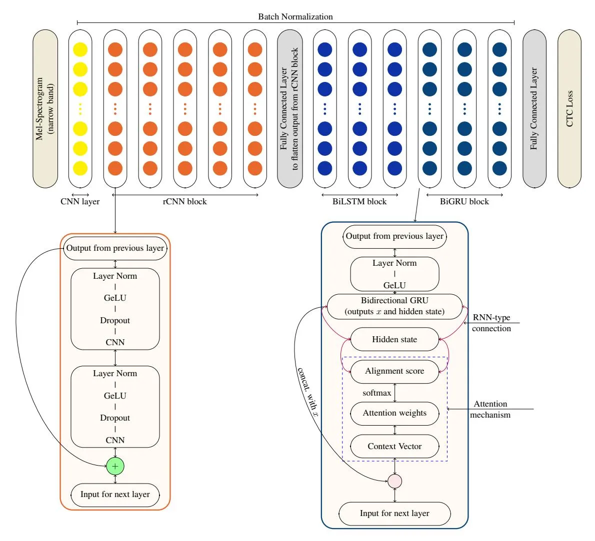

# OkwuGbé: End-to-End Speech Recognition for Fon and Igbo

#### Bonaventure F. P. Dossou\*

Jacobs University Bremen

f.dossou@jacobs-university.de

#### Chris C. Emezue\*

Technical University of Munich

chris.emezue@tum.de

#### **Abstract**

Language is inherent and compulsory for human communication. Whether expressed in a written or spoken way, it ensures understanding between people of the same and different regions. With the growing awareness and effort to include more low-resourced languages in NLP research, African languages have recently been a major subject of research in machine translation, and other text-based areas of NLP. However, there is still very little comparable research in speech recognition for African languages. Interestingly, some of the unique properties of African languages affecting NLP, like their diacritical and tonal complexities, have a major root in their speech, suggesting that careful speech interpretation could provide more intuition on how to deal with the linguistic complexities of African languages for text-based NLP. OkwuGbé is a step towards building speech recognition systems for African low-resourced languages. Using Fon and Igbo as our case study, we conduct a comprehensive linguistic analysis of each language and describe the creation of end-to-end, deep neural network-based speech recognition models for both languages. We present a stateof-art ASR model for Fon, as well as benchmark ASR model results for Igbo. Our linguistic analyses (for Fon and Igbo) provide valuable insights and guidance into the creation of speech recognition models for other African low-resourced languages, as well as guide future NLP research for Fon and Igbo. The Fon and Igbo models source code have been made publicly available.

#### 1 Introduction

$OkwuGb\acute{e} = Okwu(speech) + Gb\acute{e}(languages) \\ Fon$

$OkwuGb\acute{e}$ , the union of two words from Igbo (Okwu) and Fon $(Gb\acute{e})$ means the speech of languages, and signifies studying, and integrating

automatic speech recognition to several African languages in an effort to unify them. African languages in the past decade received very little to no research in natural language processing (NLP) (Joshi et al., 2020a; Andrew Caines, 2019), prompting recent efforts geared towards improving the state of African languages in NLP ( $\forall$ et al., 2020b; Abbott and Martinus, 2018; Siminyu et al., 2020; ∀ et al., 2020a). However, there are few works being done on speech for these African languages, as more emphasis is being placed on their text. Due to the largely acoustic nature of African languages (mostly tonal, diacritical, etc), a careful speech analysis of African languages could provide better insight for text-based NLP involving African languages, as well as supplement the textual data needed for machine translation or language modelling. This is what inspired $OkwuGb\acute{e}$ and the focus on automatic speech recognition.

Automatic speech recognition (ASR, or speechto-text) is a language technology where spoken words are identified, interpreted and converted to text. ASR is changing the way information is accessed, processed, and used. In recent years, ASR achieved state-of-art performances for most western and Asian languages such as English, French, Chinese, Japanese, etc, due to the availability of large quantity of quality speech resources. African languages, on the other hand are still lacking ASR applications. This is mainly due to the lack or unavailability of speech resources for most African Languages (ALs). In this paper, we introduce ASR systems for two low-resourced languages: Fon and Igbo. We show that using end-to-end deep neural networks (E2E DNN) with Connectionist Temporal Classification (CTC) (Graves et al., 2006a), allows us to achieve promising results without using language models (LMs), which usually require huge amounts of data for training. We also demonstrate that leveraging attention mecha-

<sup>\*</sup>These authors contributed equally to this work.

nism [\(Bahdanau et al.](#page-11-3), [2016](#page-11-3)) improves the performance of acoustic models.

In section [2,](#page-1-0) we give an overview of Fon and Igbo languages. Then we discuss some related work in section [3](#page-3-0) and examine the data and data processing techniques we employed in this research in section [4.](#page-4-0) In section [5,](#page-6-0) we explore models architectures used for our experiments and show our evaluation in section [6.](#page-9-0)

# <span id="page-1-0"></span>2 Overview of Fon and Igbo

In this section, we give an extensive overview of both languages. Table [1](#page-2-0) aims to summarise our analysis for the reader.

### 2.1 Fon

Fon (also known as Fongbe) is a native language of Benin Republic, spoken in average by more than 2.2 million people in Benin, in Nigeria, and Togo [\(Eberhard et al.](#page-11-4), [2020\)](#page-11-4). Fon belongs to the _Niger-Congo-Gbe_ languages family, and is a tonal, isolating a[nd left-behind language according to \(](#page-12-1)Joshi et al., [2020b](#page-12-1)), with a basic _Subject-Verb-Object_ (SVO) word order. There are currently about 53 different dialects of the Fon language spoken throughout Benin [\(Lefebvre and Brousseau,](#page-12-2) [2002;](#page-12-2) [Capo,](#page-11-5) [1991](#page-11-5); [Eberhard et al.,](#page-11-4) [2020](#page-11-4)).

Its alphabet is based on the Latin alphabet, with the addition of the letters: <sup>ª</sup>, ¡, ¢, and the digraphs gb, hw, kp, ny, and xw. There are 10 vowel phonemes in Fon: 6 said to be closed [i, u, ˜ı, u], ˜ and 4 said to be opened [¢, <sup>ª</sup>, a, ã]. There are 22 consonants (m, b, n, ¡, p, t, d, c, j, k, g, kp, gb, f, v, s, z, x, h, xw, hw, w). Fon has two phonemic tones: high and low. High is realized as rising _(low–high)_ after a consonant. Basic disyllabic words have all four possibilities: _highhigh_, _high-low_, _low-high_, and _low-low_. In longer phonological words, like verb and noun phrases, a high tone tends to persist until the final syllable. If that syllable has a phonemic low tone, it becomes falling _(high–low)_. Low tones disappear between high tones, but their effect remains as a downstep. Rising tones _(low–high)_ simplify to high after high (without triggering downstep) and to low before high [\(Lefebvre and Brousseau,](#page-12-2) [2002;](#page-12-2) [Capo,](#page-11-5) [1991\)](#page-11-5).

Fon makes extensive use of a rich system of tense or aspect markers, express many semantic features by lexical items, and the periphrastic constructions often used are of a more agglutinative

nature [\(Capo,](#page-11-6) [1986\)](#page-11-6). Fon nominals are generally preceded by a prefix consisting of a vowel (eg. the word a¡ú: 'tooth'). The quality of this vowel is restricted to the subset of non-nasal vowels [\(Capo](#page-11-5), [1991](#page-11-5); [Duthie and Vlaardingerbroek](#page-11-7), [1981\)](#page-11-7).

Reduplication is a morphological process in which the root or stem of a word, or part of it, is repeated. Fon, like the other Gbe languages, makes extensive use of reduplication in the formation of new words, especially in deriving nouns, adjectives, and adverbs from verbs. For instance, the verb _lã_, which means _to cut_ (both in Fon and Ewe), is nominalized by reduplication, yielding _lãlã : the act of cutting_. Triplication is used to intensify the meaning of adjectives and adverbs [\(Capo,](#page-11-5) [1991](#page-11-5); [Duthie and Vlaardingerbroek,](#page-11-7) [1981](#page-11-7)).

## 2.2 Igbo

Igbo is a native language of the Igbo people, an ethnic group majorly located in the southeastern part of Nigeria, like Abia, Anambra, Ebonyi, Enugu, and Imo states, as well as in the northeast of the Delta state and in the southeast of the Rivers state. Outside Nigeria, it is spoken a little bit in Cameroon and Equatorial Guinea. Igbo belongs to the Benue-Congo group of the Niger-Congo language family and is spoken by over 27 million people [\(Eberhard et al.](#page-11-4), [2020](#page-11-4)). There are approximately 30 Igbo dialects, some of which are not mutually intelligible. To illustrate the complexity of Igbo, we quote [\(Nwaozuzu](#page-12-3), [2008](#page-12-3)): "_...almost every community living as few as three kilometers apart has its few linguistic peculiarities. If these tiny peculiarities are isolated and considered to be able to assign linguistic dependence to each of these communities, we shall therefore be boasting of not less than one thousand languages in what we now know as the Igbo language._"

This large number of dialects and peculiarities inspired the development of a standardized spoken and written Igbo in 1962, called the Standard Igbo [\(Ohiri-Aniche](#page-12-4), [2007](#page-12-4)) (which we will refer to when we say "Igbo"). However, studies have shown that there are many sounds (mainly consonants) found in some other dialects of Igbo which are lacking in the Standard Igbo orthography. For example, [Achebe et al.](#page-10-2) [\(2011](#page-10-2)) discovered about 50 unique speech sounds in Igbo. Morphologically, Igbo is an agglutinating language, with a compounding word formation: e.g., ugbo (vehicle) + igwe (iron) = ugboigwe (locomotive). Igbo also uses redupli-

<span id="page-2-0"></span>

| Characteristics                  | Fon                                  | Igbo                                          |     |     |     |
| -------------------------------- | ------------------------------------ | --------------------------------------------- | --- | --- | --- |
| Spoken where                     | mostly in Benin.<br>Some part of     | mostly in southeastern Nigeria.               |     |     |     |
|                                  | Nigeria and Togo                     | A<br>little<br>bit<br>in<br>the<br>Equatorial |     |     |     |
|                                  |                                      | Guinea and Cameroon                           |     |     |     |
| Speakers (Eberhard et al., 2020) | 2.2 million                          | 22 million                                    |     |     |     |
|                                  | Niger-Congo                          |                                               |     |     |     |
|                                  |                                      |                                               |     |     |     |
|                                  | Atlantic Congo                       |                                               |     |     |     |
|                                  | Volta-Congo                          |                                               |     |     |     |
| Language family tree             |                                      |                                               |     |     |     |
|                                  | Kwa                                  | Volta-Niger                                   |     |     |     |
|                                  | Gbe                                  | Igboid                                        |     |     |     |
|                                  |                                      |                                               |     |     |     |
|                                  | Igbo<br>Fon                          |                                               |     |     |     |
| Language structure               | Isolating language                   | Agglutinating language                        |     |     |     |
| Alphabet structure               | 32 letters:<br>22 consonants,<br>10  | 36 letters: 28 consonants, 8 vow              |     |     |     |
|                                  | vowels                               | els                                           |     |     |     |
| Special alphabets besides Latin  | ª, ¡, ¢, ã, gb, hw, kp, ny, and xw.  | ch, gb, gh, gw, kp, kw, nw, ny,               |     |     |     |
|                                  |                                      | and sh                                        |     |     |     |
| Tonal ?                          | Yes. 3 tones: high (/), low (\) and  | Yes. 4 tones: high tone (/), low              |     |     |     |
|                                  | down step (-)                        | (\),<br>down step (−),<br>and down            |     |     |     |
|                                  |                                      | drift (−)                                     |     |     |     |
| Phoneme structure                | 10 vowel phonemes and 22 con         | 28 consonant phonemes and 8                   |     |     |     |
|                                  | sonant phonemes.<br>Nasalization     | vowel phonemes.<br>Nasalization               |     |     |     |
|                                  | is present                           | is present                                    |     |     |     |
| Number of dialects               | about 53                             | about 30                                      |     |     |     |
| Reduplication ?                  | Yes,<br>especially<br>in<br>deriving | Yes, sometimes in compounding                 |     |     |     |
|                                  | nouns,<br>adjectives,<br>and adverbs | word formation: e.g., ugbo (ve                |     |     |     |
|                                  | from verbs.                          | hicle) + igwe (iron) = ugboigwe               |     |     |     |
|                                  |                                      | (locomotive).                                 |     |     |     |
| Code-switching?                  | No                                   | Yes                                           |     |     |     |

Table 1: Summary analysis of Fon and Igbo

cation like Fon. Igbo has 28 consonants and 8 vowels, totalling 36 letters of the alphabet.

The sound system of Igbo consists of eight vowel phonemes, and 28 consonant phonemes [\(Ikekeonwu](#page-12-5), [1999](#page-12-5)). There are four different types of t[ones in Igbo language \(](#page-12-6)Odinye and Udechukwu, [2016](#page-12-6)). They include: High tone (/), Low tone (\), Down step (−) (Rice, 1992), Down drift (−). Down drift is only observed in Igbo sentences because one can raise or lower the pitch before a sentence is completed. Tone is an integral part of a word in Igbo. It is the interface of phonology and syntax in Igbo because it performs both lexical and grammatical functions [\(Nkamigbo](#page-12-7), [2012](#page-12-7)). Igbo has three syllable types: consonant + vowel (the most common syllable type), vowel or syllabic nasal.

Code-switching, the act of "alternation of two languages during speech" [\(Poplack](#page-12-8), [1979\)](#page-12-8), is very common among Igbo-English bilingual speakers, making it an interesting feature for speech recognition research. Therefore, we will go deeper into [it.](#page-11-8)

G.O [and Mbagwu](#page-12-9) [\(2007](#page-11-8)); Obiamalu and Mbagwu [\(2010\)](#page-12-9) did an extensive research on code-switching among Igbo speakers, where they classified it into three types: borrowing, quasiborrowing and true code-switching (see Table [2\)](#page-3-1). Borrowing in Igbo arises when words from English are inserted into Igbo during speech and the words go through phonological and morphological transformation (mark -> _maakigo_, table -> _tebulu_). This is usually because the speaker can not quickly find the Igbo equivalent of the word or such equivalent does not exist. This is illustrated by 1 and 2. In quasi-borrowing, the Igbo equivalents of the English words exist, but the English words are more often used by both monolinguals and bilinguals. It may or may not be assimilated into Igbo, like in borrowing. This is illustrated by 3 and 4. The third situation, called true code-switching, occurs when the speaker purposely chooses to use the English word, even though the Igbo equivalent is known and always used. This is most common among Igbo-English bilinguals. 5 and 6 are good examples.

<span id="page-3-1"></span>

| Type       | Examples (Igbo English)               | Explanation                             |
| ---------- | ------------------------------------- | --------------------------------------- |
| borrowing  | 1.Q maakigo (mark) ule ahų.           | The words 'mark' and 'table' had been   |
| borrowing  | He has marked the examination         | borrowed and assimilated into Igbo      |
|            | 2.O di na tebulu (table) It is on     | because there are not readily available |
|            | the table                             | in Igbo.                                |
| quasi-     | 3.Obi zuru car ohuru. Obi             | Even though Igbo has words for 'car,    |
| borrowing  | bought a new car                      | some bilinguals still use English       |
|            | 4. Obi zuru ugboala ohuru. Obi        | words.                                  |
|            | bought a new car                      |                                         |
| true code- | 5.Fela na ecriticize onye obula.      | These cases are true code-switching     |
| switching  | Fela criticizes everybody             | because the Igbo words for 'criticize', |
|            | 6.Jesus turn <i>uru</i> water o ghoro | 'turn', 'water' and 'wine' are readily  |
|            | wine. I Jesus turned water into       | available in Igbo, but the speaker      |
|            | wine                                  | chooses to use the English equivalents. |

Table 2: Code-switching types and examples. Adapted from (G.O and Mbagwu, 2007)

#### <span id="page-3-0"></span>3 Related Works

In this section, we review some related works according to the data resources, the model architectures and the state of ASR research for Fon and Igbo.

<span id="page-3-2"></span>**Previous works according to data resources:** Xu et al. (2020) classified previous works on ASR, according to data resources, into rich-resource, low-resource and unsupervised settings, as shown in Table 3.

In the rich-resource setting, a large amount of paired speech and text data is available for training. This amounts up to hundreds of hours by multiple speakers. Furthermore, pronunciation lexicon is also leveraged while training for better results. These are the languages with ASR models already deployed in the industry. English is a main example of this setting. In the low-resource setting, there are only about dozen minutes of single-speaker high-quality paired data, and few hours of multi-speaker low-quality paired data. Compared to the rich-resource setting, these data resources contained fewer paired data.

In the extremely low-resource setting, which is where our work lies, there are little to no paired speech data resources, very low online presence, and sometimes no developed pronunciation lexicon rule or language model to improve ASR models. Some of these languages also contain few unpaired multi-speaker data. This is the case of many African languages.

Previous works according to model architecture: While traditional phonetic-based approaches (Hidden Markov Models) have produced considerable results in the past, we focus on end-to-end speech recognition with deep learning (Chorowski et al., 2014a,b; Hannun et al., 2014; Amodei et al., 2015; Chan et al., 2016; Chiu et al., 2018) because they have been shown to produce better results, with little dependence on hand-crafted features and phoneme dictionaries.

Chorowski et al. (2014b) introduced an endto-end continuous ASR using a bidirectional recurrent neural network (RNN) encoder with an RNN decoder that aligns the input and the output sequences using the attention mechanism. The model achieved a word error rate (WER) of 18.57% on the TIMIT data set. Hannun et al. (2014); Amodei et al. (2015) presented a stateof-the-art ASR system using E2E DNNs. They introduced a system that does not use any handdesigned language component, nor even the concept of "phoneme". Their result was achieved, as the authors stated in their original paper, through a well-optimized RNN training system that uses multiple GPUs, as well as a set of novel data synthesis techniques and language models.

Following the promising features that E2E DNNs offer, Mamyrbayev et al. (2020) showed in their recent studies that, using them with CTC works without the need for direct inclusion of language models.

#### State of ASR resources for African languages:

Open-sourced data for ASR is one of the driving forces of research in any deep learning field, including ASR, because it fosters experimenting, training and developing better models. The Open Speech and Language Resources (OpenSLR)<sup>1</sup> is a platform with open-sourced speech and language resources, such as training corpora for speech recognition for public use. It currently contains many languages (both high and low resources). However, we discovered that of the 2000 African languages, only Yoruba (Gutkin et al., 2020), Nigerian Pidjin and four South African languages.

<span id="page-3-3"></span><sup>&</sup>lt;sup>1</sup>http://openslr.org/index.html

<span id="page-4-1"></span>

| Setting             |                                                        | Rich-Resource                                                                                                                                                                                                                                          | Low-Resource             | Extremely Low-Resource                                                                                                      |
| ------------------- | ------------------------------------------------------ | ------------------------------------------------------------------------------------------------------------------------------------------------------------------------------------------------------------------------------------------------------ | ------------------------ | --------------------------------------------------------------------------------------------------------------------------- |
|                     | pronunciation lexicon                                  | ✓                                                                                                                                                                                                                                                      | ✓                        | ✗                                                                                                                           |
|                     | paired<br>data<br>(single-speaker,<br>high<br>quality) | dozens of minutes                                                                                                                                                                                                                                      | several minutes          | ✗                                                                                                                           |
|                     | paired<br>data<br>(multi-speaker,<br>high<br>quality)  | hundreds of hours                                                                                                                                                                                                                                      | dozens of hours          | several hours                                                                                                               |
| Data                | unpaired speech (single-speaker, high<br>quality)      | ✓                                                                                                                                                                                                                                                      | dozens of hours          | ✗                                                                                                                           |
|                     | unpaired<br>speech<br>(multi-speaker,low<br>quality)   | ✓                                                                                                                                                                                                                                                      | ✓                        | dozens of hours                                                                                                             |
|                     | unpaired text                                          | ✓                                                                                                                                                                                                                                                      | ✓                        | very few                                                                                                                    |
| Related Work<br>ASR |                                                        | [(Chorowski et al., 2014a;<br>Chiu et al., 2018; Chan<br>et al., 2016; Hannun et al.,<br>2014; Li et al., 2019;<br>Mamyrbayev et al., 2020;<br>Chorowski et al., 2014b;<br>Hori et al., 2019; Rosen<br>berg et al., 2019; Schnei<br>der et al., 2019)] | [(Tjandra et al., 2017)] | [Our Work, Laleye et al.<br>(2016); Xu et al. (2020);<br>Baevski et al. (2020); Liu<br>et al. (2020); Ren et al.<br>(2019)] |

Table 3: Data sources to build ASR models and the corresponding related works in the different settings. Adapted from [\(Xu et al.](#page-13-1), [2020](#page-13-1))

guages (Afrikaans, Sesotho, Setswana, isiXhosa) [\(van Niekerk et al.](#page-12-14), [2017](#page-12-14)) are present, as of the period of writing this paper. Furthermore, they contain very few samples (tens, few hundreds of audio hours), compared to their high-resource counterparts (thousands, millions of audio hours). This scarcity of open resources for the development of ASR for low-resourced African languages is one of the major factors affecting the low state of ASR research in African languages. Although there may be some non-open resources for some of these African languages, they come with huge licensing fees, among other limiting factors.

State of ASR research for Fon and Igbo: Fon, unlike Igbo, has little to no digital presence. With very few speakers, and almost no online presence, there have been understandably very few tonal analysis or ASR research for this language. The few that exist are mostly by researchers who are native speakers of the language.

To the best of our knowledge, there has only been [notable efforts from](#page-12-12) [Laleye](#page-12-15) [\(2016\)](#page-12-15); Laleye et al. [\(2016](#page-12-12)) to build an ASR for Fon, with a word error rate _(WER)_ of 14.83%. This result had been achieved, building two LMs and also only after normalizing and removing the diacritics; whose crucial importance for both performant ASR and neural machine translation (NMT) has been proved by [Orife](#page-12-16) [\(2018](#page-12-16)); [Dossou and Emezue](#page-11-16) [\(2020\)](#page-11-16). This will be discussed later in section [4.3.2.](#page-6-1) The best model with diacritics scored a _(WER)_ of 44.04%.

Igbo, on the other hand, has had a lot of tonal

and speech analysis research in the past decade, but no public research on E2E DNN ASR, to the best of our knowledge. We opine that this is largely because 1) many old works in the past on Igbo focuse[d solely on tonal analysis \(](#page-12-6)Odinye and Udechukwu, [2016;](#page-12-6) [Nkamigbo](#page-12-7), [2012](#page-12-7)), and 2) there is a lack of open-source speech data to encourage further research on exploring ASR with deep learning methods, which are known to be data-hungry.

# <span id="page-4-0"></span>4 Speech-to-Text Corpora and Data Preprocessing

# 4.1 Fon Speech-to-Text Corpus

We got our speech dataset for Fon from the existing Fon speech corpus[2](#page-4-2) which was built upon the tedious task of recording the texts pronounced by native speakers (including 8 women and 20 men) of Fongbe in a noiseless environment. The recordings are sampled at a frequency of _16Khz_. The 28 native speakers have spoken around 1500 phrases (daily conversations domain). These recordings were made with the LigAikuma[3](#page-4-3) android application. The minimum length of a speech sample is _2 seconds_ and the maximum is _5 seconds_, giving us an average of _4 seconds_ content length. Overall, there are around _10 hours_ of speech data that have been collected.

The global data set has been split into training, validation and test data sets. The training set contains _8 hours_ of speech _(8235 speech samples)_, the

[https://paperswithcode.com/dataset/](https://paperswithcode.com/dataset/fongbe-speech-recognition) [fongbe-speech-recognition](https://paperswithcode.com/dataset/fongbe-speech-recognition)

<span id="page-4-3"></span><span id="page-4-2"></span><sup>3</sup> <https://lig-aikuma.imag.fr/>

validation data set contains _1500 speech samples_ and finally the test data set contains _669 speech samples_. The text corpus made of the _1500_ sentences used to build the speech data set has been scraped from BéninLangues [4](#page-5-0) .

# <span id="page-5-3"></span>4.2 Igbo Speech-to-Text Corpus

It was very hard to find the data set of Igbo audio samples and their transcripts. We realized that there is a great lacuna: even though there's been much research on Igbo phonology, there has really not been any (public) efforts to gather any speechto-text data set for it.

The data set for our experiments on Igbo was got through a license from the Linguistic Data Consortium (LDC2019S16: IARPA Babel Igbo Language Pack) [\(Nikki et al.](#page-12-17), [2019\)](#page-12-17). It contains approximately 207 hours of Igbo conversational and scripted telephone speech collected in 2014 and 2015 along with corresponding transcripts. The data set (hereafter called IgboDataset) is made up of telephone calls representing the Owerri, Onitsha, and Ngwa dialects spoken in Nigeria, sampled at 8kHz, with a few sampled at 48kHz. The gender distribution among speakers is approximately equal; speakers' ages range from 16 years to 67 years. The telephone calls were made using different telephones (e.g., mobile, landline) from a variety of environments including the street, a home or office, a public place, and inside a vehicle. The diacritics were originally removed from the transcripts.

Unlike the Fon data set, which was modern and contained very clean audio, IgboDataset had old speech patterns, and contained many noisy audio samples. Therefore, we had to implement a number of cleaning strategies (like filtering based on length of words, upsampling, exploring different mel-spectrograms units and number of Fast Fourier Transform (FFT) bins. The FFT is an algorithm that computes the discrete Fourier transform (DFT, described in section [4.3.1\)](#page-5-1) of a sequence. Our cleaning strategies gave us a reduced data set of 2.5 hours, which we split into train, dev and test sizes of 4000, 100 and 100 audio samples respectively. To test the importance of our pre-cleaning, we trained the model on both the large uncleaned data set and our cleaned version (results are discussed in section [6\)](#page-9-0).

#### <span id="page-5-1"></span>4.3 Data Preprocessing

## 4.3.1 Speech Preprocessing

Speech signals are made up of amplitudes and frequencies. Amplitudes simply inform about the loudness of the sound recording, nothing informative. To get more information from our speech samples, we decided to map them into the frequency domain. Two of the known techniques, enabling the conversion of speech data from its time domain to its frequency domain, are the Fourier Transformation (FT) and Discrete Fourier Transformation (DFT) [\(Boashash,](#page-11-17) [2003](#page-11-17); [Bracewell](#page-11-18), [2000](#page-11-18)).

FT is a mathematical concept that converts a continuous signal from the time domain to the frequency domain. FT decomposes a continuous signal into its frequency components, giving the frequencies present in the signal, and their respective magnitudes. DFT, similary to FT, converts a sequence, considered as a discrete signal, into its frequency components.

However, applying only the FFT just gives frequency values without time information. To make sure we preserve frequencies, time and amplitudes information about the speech samples, in reasonable and adequate range, we decided then to use mel-spectrograms.

The mel-scale is a perceptual scale of pitches judged by listeners to be equal in distance from one another [\(Stevens et al.](#page-13-6), [1937](#page-13-6)). It is constructed such that sounds of equal distance from each other on the mel-scale, also «sound» to humans as they are equal in distance from one another. A popular formula to convert f hertz (frequencies measures) into m mels is the O'Shaughnessy formula described in O'Shaughnessy book [\(O'Shaughnessy,](#page-12-18) [1987](#page-12-18)), defined as

$$m = 2595 * log_{10} * (1 + \frac{f}{700})$$
(10).

A spectrogram [5](#page-5-2) is an image, a three dimensional (3D) representation that displays how energy frequencies components of the speech change over time. The abscissa represents time, the ordinate axis represents frequency, and amplitudes are shown by the darkness of a precise frequency at a particular time: low amplitudes are represented with a light-blue color, and very high amplitudes are represented by dark red.

<span id="page-5-0"></span><sup>4</sup> <https://beninlangues.com/fongbe>

<span id="page-5-2"></span><sup>5</sup> <http://www.glottopedia.org/index.php/Spectrogram>

There are two types of spectrograms: broadband spectrograms and narrow-band spectrograms[6](#page-6-2) .

- Broad-band spectrograms have higher temporal resolutions allowing the detection of changes in frequency over small intervals of time. However, they usually do not help making good frequency distinctions, as the time interval for each spectrum is small.
- Narrow-band spectrograms have higher frequency resolution, and larger time interval for every spectrum than broad-band spectrograms: this allows the detection of _very small_ differences in frequencies. Moreover, they show individual harmonic structures, which are vibration frequency folds of the speech, as horizontal striations.

A mel-spectrogram is hence a spectrogram with the mel-scale. In our study, we decided to use narrow-band mel-spectrograms, as input features for the model.

We used 512 as length of the FFT window, 512 as the hop-length (number of samples between successive frames) and a hanning windows size is set to the length of FFT window.

For handling the audio data, we used the torchaudio utility from PyTorch [\(Paszke et al.,](#page-12-19) [2019\)](#page-12-19). We used Spectrogram Augmentation (SpecAugment) [\(Park et al.,](#page-12-20) [2019](#page-12-20)) as a form of data augmentation: we cut out random blocks of consecutive time and frequency dimensions. Mel-Spectograms were generated from each speech samples with some fine-tuned hyper-parameters:

- sample_rate: sample rate of audio signal, set to 16000 hertz (16 kHz) for Fon and 8000 hertz (8 kHz) for Igbo.
- n_mels: number of mel filterbanks, set to 128 for Fon and 64 for Igbo.

#### <span id="page-6-1"></span>4.3.2 Text Preprocessing

Scholars like [Orife](#page-12-16) [\(2018](#page-12-16)[\) and](#page-11-16) Dossou and Emezue [\(2020\)](#page-11-16) have shown in their studies that keeping the diacritics reduces lexical disambiguation and provides more morphological information to neural machine translation models. Additionally, diacritics relay the pronunciation tone and the sound generated, leading to an improved understanding of the sentences and their contexts.

<span id="page-6-4"></span>

| Lang. | Source<br>Text<br>(preprocessed<br>text<br>same as the<br>source)       | English<br>Transla<br>tion                                                                           |
| ----- | ----------------------------------------------------------------------- | ---------------------------------------------------------------------------------------------------- |
| Fon   | xov¢<br>sin<br>mì<br>tlala<br>k¢nkl¢n bo ná mì<br>nù¡é                  | I'm<br>super<br>hun<br>gry,<br>I'm<br>starving.<br>Please<br>give<br>me<br>some food                 |
| Fon   | a ná gbª nù ¡ú bó<br>gbª sin nù bó gbª<br>xó ¡ª káká yi azãn<br>tªn gbè | You will not be eat<br>ing,<br>neither drink<br>ing<br>nor<br>speaking<br>for the next three<br>days |

Table 4: Fon sentences before and after the preprocessing with their English Translations

<span id="page-6-3"></span>

| Fon (a)                                                           | Igbo (b)                                                                         |     |
| ----------------------------------------------------------------- | -------------------------------------------------------------------------------- | --- |
| to (ambiguous and uncertain)<br>tó (ear)<br>tò (sea) tô (country) | akwa (ambiguous and uncertain)<br>ákwà (cloth)<br>akwá ( ¯ egg)<br>ákwá (to cry) |     |

Table 5: Examples of tonal inflection with Fon and Igbo

A diacritic is a glyph added to a letter or basic glyph. They appear above or below a letter, or in some other position such as within the letter or between two letters. Some diacritical marks, such as the acute *(*´*)* and grave _(')_, are often called accents. In Fon and Igbo, a good example of the importance can be seen in Table [5](#page-6-3) (a) where we demonstrate that removing diacritics from a word could lead to ambiguity and result in the confusion of the word. Therefore, we preprocessed the textual data without removing the diacritics. The results of the text data preprocessing on the Fon data set, are presented in Table [4.](#page-6-4) For Igbo, unfortunately the IgboDataset was originally stripped of its diacritics. Therefore, we were not able to encode any diacritical information.

## <span id="page-6-0"></span>5 Models Architectures and Experiments

#### 5.1 Preliminaries

We take a moment to briefly define the task of ASR mathematically. We have a training set of n samples: χ = (x (1), y(1)),(x (2), y(2)), ...,(x (n) , y(n) ) . Each utterance, x (i) , sampled from the training set, is a time-series of length T (i) where every time-slice is a vector of audio features, (x (i) t , t = 0, ..., T(i) −1. The goal of ASR is to generate transcripts yˆ (i) for each utterance x (i) . In order to achieve this,

<span id="page-6-2"></span><sup>6</sup> [http://www.cas.usf.edu/~frisch/SPA3011\\\_L07.html](http://www.cas.usf.edu/~frisch/SPA3011_L07.html)

<span id="page-7-0"></span>

Figure 1: Architecture of the best model for Fon and Igbo, with an expansion of each component of the rCNN block and BiGRU block.

we use an architecture consisting of one or more recurrent neural networks (RNN), since they are best equipped for time-series data.

In order to generate yˆ (i) for a given utterance x (i) , the RNN models the probability of picking a character from the character set. To put it mathematically, at each output time-step t, the RNN makes a prediction over characters, p(c<sup>t</sup> |x (i) ), where c<sup>t</sup> is either a character of the alphabet (including their diacritics) or the blank symbol. In Fon for example, due to our inclusion of the diacritics, we have c<sup>t</sup> = {a, b, c, ..., z, _à, á, a, ˘a, ¯ è, é, e,¯ e, ì, í, î, ï, ˘ ˘ı, ó, o, ò, ˘ u,¯ u, ù, ú, ˘_ <sup>ª</sup>_,_ ª*,* ª*,* ª*,* ¡_,_ ¢*,* ¢*,* ¢*,* ¢*,* ¢*,* f ullstop*,* apostrophe*,* comma*,* space*,* blank}. Apostrophe, white-space, comma, and full stop characters have been added to denote word boundaries. For Igbo, c<sup>t</sup> = {a, b, ..., z, _fullstop, apostrophe, comma, blank_} which is the same as the character set for the English language.

This constraint was because the speech dataset for Igbo was already stripped of the diacritics, as explained in section [4.2.](#page-5-3)

#### 5.2 Model Architecture

Related works have shown that we can increase model capacity, in order to efficiently learn from large speech datasets, by adding more hidden layers r[ather than making each layer larger.](#page-11-19) Graves et al. [\(2013](#page-11-19)) explored increasing the number of consecutive bidirectional recurrent layers, and [Amodei et al.](#page-10-3) [\(2015\)](#page-10-3) proposed the Deep Speech2, which among a number of optimization techniques, extensively applied batch normalization [\(Ioffe and Szegedy](#page-12-21), [2015\)](#page-12-21) to the deep RNNs.

Furthermore, [Chorowski et al.](#page-11-9) [\(2014a](#page-11-9)) showed that the use of Badhanau (additive) attention mechanism [\(Bahdanau et al.,](#page-11-3) [2016](#page-11-3)) could reduce the phoneme or word error rate (WER) of the ASR

model. This is possible because the attention mechanism forces the decoder to make monotonic alignment and hence improve the predictions.

Our model architecture, shown in Figure [1,](#page-7-0) draws inspiration from these research findings. While our model at its core is similar to Deep Speech 2, our key improvements are:

- the exploration of the combination of Bidirectional Long Short Term Memory (BiLSTMs) and Bidirectional Gated Recurrent Units (Bi-GRUs) for low-resource ASR.
- the integration of the Badhanau attention mechanism, which effect has been demonstrated on Fon.

Our model has two main neural network modules: N-blocks of Residual Convolutional Neural Networks (rCNNs) [\(He et al.](#page-11-20), [2015](#page-11-20), [2016\)](#page-11-21) and M-blocks each of BiLSTMs and BiGRUs. Each rCNN block is made of two CNN layers, two drop[out layers and two normalization layers \(](#page-10-5)Ba et al., [2016\)](#page-10-5) for the CNN inputs. We leveraged the power of convolutional neural networks (CNNs) to extract abstract features by converting speeches into spectrograms. RNNs process the abstract features produced by the rCNNs, step by step, making a prediction for each frame while using context from previo[us frames. We use BiRNN's \(](#page-13-7)Schuster and Paliwal, [1997\)](#page-13-7) because we want the context of not only the frame before each timestep, but the following as well. This help the model make better predictions.

In our scenario, BiLSTMs and BiGRUs act respectively as encoder and decoder blocks. Each block produces subsequentially outputs and hidden states fed to the next block. The last hidden state of the last BiGRU block is used to compute the attention weights and the context vector, that will be concatenated to the BiGRU output, to serve as final output. In-between and towards each block output are stacked dropout layers to prevent overfitting [\(Srivastava et al.,](#page-13-8) [2014\)](#page-13-8).

The output from the models is a probability matrix for characters which will be fed into a greedy decoder. We implemented the greedy decoder suggested by Graves et al. (2006b) to extract what the model believes are the highest probability characters that were spoken. This simple decoder, albeit with no linguistic information, has been shown to produce useful transcriptions [\(Zenkel et al.,](#page-13-9) [2017\)](#page-13-9).

Our model is trained to predict the probability distribution of every character of the alpha-

bet at each timestep from the narrow-band melspectrogram we feed it. Traditional ASR models require aligning transcripted text to the speech before the training, and the model is trained to predict specific labels at specific timesteps. However, with the CTC loss function [\(Graves et al.](#page-11-2), [2006a](#page-11-2)), the previously described step is skipped and the model directly learns to align the transcript itself during training.

# 5.2.1 Implementing the attention mechanism

Let us recall here that we have 5 blocks of rCNNs, 3 blocks each of BiLSTMs and BiGRUs. Bahdanu attention a bit modified and implemented as explained in Figure [1,](#page-7-0) in the following steps:

- an input x from the stacked blocks of rC-NNs is fed to the BiLSTM (encoder), and primarily layer-normalized. The output is then passed through a GeLU activation function, which output is fed to the BiLSTM layers of the current block. Within the current encoder block, each of the BiLSTM layers, produce an output, a hidden state and a cell state. The encoder output is lastly passed to a dropout layer, and is used as input for the next encoder block. The output of the last encoder is used as input for the first BiGRU (decoder) block.
- The input of the decoder goes successively through a normalization layer and a GeLU activation function. The output is then fed to Bi-GRU layers of the current decoder, which produces the decoder output and a hidden state. In common NLP or more specifically in neural machine translation (NMT), the hidden state is a 2-dimensional tensor. However, this is not the case here, since our initial input features from the stack of rCNNs layers are 4-dimensional tensors of shape _(batch, channel, feature, time)_, and the output from the stack of encoders is a 3-dimensional tensor of shape _(batch_size, number of features, hidden size)_.
- Using the hidden state h, and the decoder output x shapes, three dense layers are created accordingly using the following PyTorch version pseudo-code:

```
w1 = nn.Linear(x.size[2], x.size[2]//2)
 w2 = nn.Linear(h.size[2], h.size[2])
v = nn.Linear(x.size[2]//2, x.size[2])
```

Along our manipulation, in the attempt to

customize the NMT concept to ours, we encountered few cases were shapes of the decoder output and the hidden state were mismatching. To resolve that, we augmented the hidden state tensor, along the second axis (axis = 1) with desirable number of zeros. This was done for two reasons:

- 1. the concatenation will not affect the original hidden state tensor
- 2. tanh(x|x = 0) = 0: 0 is hence acting like a neutral element.

Once we get compatible shapes for both the decoder output and the hidden state tensor, we used them to conventionally compute the attention scores, s:

$$m = nn.Tanh()$$

$$s = v(m(w1(x) + w2(h))$$

• The attention weights are then computed by passing s through a softmax operation. The context vector, c<sup>v</sup> , which is got by multiplying the attention weights by x, is concatenated to the decoder output x to get the attention features:

$$n = nn.Softmax()$$

$attention\_weights = n(s)$  
 $c_v = attention\_weights * x$  
 $x = concatenate(c_v, x)$

• The output of the current decoder block is the attention output passed through a dropout layer, and taken as input for the next decoder.

## 5.3 Experiments

Throughout our experiments, we explored different model architectures with various number of convolutional and bidirectional recurrent layers. The best ASR model, shown on Figure [1](#page-7-0) has 5 blocks of rCNNs, 3 blocks each of BiLSTMs and BiGRUs, with attention incorporated into each component of the BiGRU block. Also, we used a form of Batch Normalization throughout the model.

We got the best evaluation results with the following hyper-parameters:

- max learning_rate: 5e-4 (for Fon), 3e-4 (for Igbo)
- batch_size: 20 (for Fon), 20 (for Igbo).
- (N, M): (5, 3) for Fon and Igbo.
- embedding_size: 512

- epochs: 500 (for Fon) and 1000 (for Igbo), with early stopping after 100 epochs.
- activati[on\\\_function: GeLU \(](#page-11-22)Hendrycks and Gimpel, [2016\)](#page-11-22)
- optimizer: AdamW [\(Loshchilov and Hutter](#page-12-22), [2019\)](#page-12-22) (Fon), Nesterov accelerated descent [\(Nesterov](#page-12-23), [1983\)](#page-12-23) (Igbo)

We used two metrics to evaluate the models: the Character Error Rate (CER) and the WER. WER uses the Levenshtein distance [\(Levenshtein](#page-12-24), [1966](#page-12-24)) to compare reference text and hypothesis text in word-level. Even with a low _CER_, the _WER_ can be high: hence the lower the _WER_, the better the model. For the training processes, we used the _WER_ of the validation data set to select the best weights and parameters.

# <span id="page-9-1"></span><span id="page-9-0"></span>6 Results

| Models                     | Fon     |       | Igbo (without cleaning) |               |
| -------------------------- | ------- | ----- | ----------------------- | ------------- |
| (rCNN)                     | CER     | WER   | CER                     | WER           |
| +BiGRUs                    | 22.0831 | 59.66 | -                       | -             |
| +BiLSTMs                   | 24.2783 | 61.46 | -                       | -             |
| +BiLSTMs+BiGRUs            | 16.9581 | 47.05 | 56.00                   | 64.00         |
| +BiLSTMs+BiGRUs+Attn       | 18.7976 | 42.50 | 50.12 (92.67)           | 55.03 (97.99) |
| 7<br>(Laleye et al., 2016) | -       | 44.09 | -                       | -             |

Table 6: CER (%), and WER (%) of different models on Fon and Igbo (original and cleaned) test datasets.

We present our findings using 5 blocks of rC-NNs with:

- 3 blocks solely of BiGRUs
- 3 blocks solely of BiLSTMs
- 3 blocks each of BiLSTMs and BiGRUs
- 3 blocks each of BiLSTMs and BiGRUs + Attention mechanism.

Table [6](#page-9-1) presents the results of different models architectures on the test data set for Fon and Igbo.

### 6.1 Results for Fon

We show that implementing attention mechanism reduced the WER by 5%. Our Fon ASR model outperformed the current Fon ASR model with diacritics of [Laleye et al.](#page-12-12) [\(2016\)](#page-12-12).

Table [7](#page-10-6) shows some decoded predictions and targets from the Fon ASR model, which are very similar. Common mistakes (colored), happen most often at a character level where a character is either omitted, added or replaced by another one. The native speakers included in this study have testified to the fact that those mismatched words or characters are often practically not distinguishable in

<sup>7</sup>[WER of the best model](#page-12-12) _with diacritics_ from (Laleye et al., [2016\)](#page-12-12)

<span id="page-10-6"></span>

| Fon Decoded Predictions | Fon Decoded Targets |
| ----------------------- | ------------------- |
| t                       | t                   |
| ce xwe y                | ce xwe y            |
| y                       | y                   |
| din t                   | din t               |
| n                       | n                   |
| ci gblagadaa            | ci gblagadaa        |
| ª                       | ª                   |
| ª                       | ª                   |
| ª                       | ª                   |
| ª                       | ª                   |
| ª                       | ª                   |
| eo mi sa                | eo mi sa            |
| aakpan                  | akpan               |
| nu mi                   | nu mi               |
| fit                     | fit                 |
| a                       | a                   |
| gosin                   | go sin              |
| xwe                     | xwe                 |
| yi                      | yin                 |
| gbe                     | gbe                 |
| ¢                       | ¢                   |
| e kpo kp                | e kpo kp            |
| é                       | e                   |
| ¢¡                      | ¢¡                  |
| akw                     | akw                 |
| c                       | j                   |
| gbadé jí                | gbadé ji            |
| axim                    | axim                |
| ¢                       | ¢                   |
| ¢                       | ¢                   |
| ¡                       | ¡                   |
| ¢                       | ¢                   |

Table 7: Decoded Predictions and Targets of the best Fon ASR Model

speaking. The model source code is open-sourced at: <https://github.com/bonaventuredossou/fonasr>

#### 6.2 Results for Igbo

An important observation we show in Table [6](#page-9-1) is the effect of the state of audio samples on the model's ability to learn: for our large IgboData with background noise, uneven audio length, low sampling rate, etc, the model found it very difficult to learn the speech representations. Taking time to sieve through the data (in Section [4.2\)](#page-5-3) mitigated this issue by helping the model learn the abstract features better, albeit on a small training set. While the model is currently still training on more epochs (with hope of improving), our preliminary results serve as a benchmark for ASR on Igbo. The source code for the model can be accessed at [https://github.com/chrisemezue/IgboASR.](https://github.com/chrisemezue/IgboASR)

In Table [6,](#page-9-1) one may observe the large difference between the CER and WER on Fon language, unlike Igbo. We strongly believe that this is due to the fact that the character set for Fon contains all the possible diacritics for each letter of the Fon alphabet, making it extremely large (compared to the set of Igbo characters which had no diacritical information). To further support our claim, a close observation of the targets and predictions in Table [7](#page-10-6) reveals that the errors are mostly due to omission or mismatch of diacritics for the characters ('e' predicted instead of 'é ' in row 4 or a space added between 'go' and 'sin' in row 3 ).

## 7 Future Work

Our work shows promising results considering the small training sizes, and we have presented a stateof-the-art ASR model for Fon. As future pathway to improve the proposed models, we are exploring approaches like leveraging language models, deeper model structures, transformers and crowd-sourcing/compiling speech-to-text data set for Igbo and Fon.

For Igbo language, the next stage involves incorporating diacritical information in the ASR model. We have begun by gathering new speech dataset which include the diacritics.

## 8 Acknowledgement

We are grateful to Professor Graham Neubig of Carnegie Mellon University for coming to our aid by providing us with an Amazon EC2 instance for training our model when we were very low on computational resources. We also thank Dr Frejus Layele for giving us access to the Fon data set, and Dr Iroro Orife, for his guidance on designing the ASR model and cleaning the IgboData.

# References

<span id="page-10-1"></span>Jade Z. Abbott and Laura Martinus. 2018. Towards neural machine translation for african languages. _CoRR_, abs/1811.05467.

<span id="page-10-2"></span>Ike Achebe, Clara Ikekeonwu, Cecilia Eme, Nolue Emenanjo, and Nganga Wanjiku. 2011. A composite synchronic alphabet of igbo dialects (csaid). _IADP, New York_.

<span id="page-10-3"></span>Dario Amodei, Rishita Anubhai, Eric Battenberg, Carl Case, Jared Casper, Bryan Catanzaro, Jingdong Chen, Mike Chrzanowski, Adam Coates, Greg Diamos, Erich Elsen, Jesse Engel, Linxi Fan, Christopher Fougner, Tony Han, Awni Hannun, Billy Jun, Patrick LeGresley, Libby Lin, Sharan Narang, Andrew Ng, Sherjil Ozair, Ryan Prenger, Jonathan Raiman, Sanjeev Satheesh, David Seetapun, Shubho Sengupta, Yi Wang, Zhiqian Wang, Chong Wang, Bo Xiao, Dani Yogatama, Jun Zhan, and Zhenyao Zhu. 2015. Deep speech 2: End-to-end speech recognition in english and mandarin.

<span id="page-10-0"></span>Andrew Caines. 2019. The Geographic Diversity of NLP Conferences.

<span id="page-10-5"></span>Jimmy Ba, J. Kiros, and Geoffrey E. Hinton. 2016. Layer normalization. _ArXiv_, abs/1607.06450.

<span id="page-10-4"></span>Alexei Baevski, Michael Auli, and Abdelrahman Mohamed. 2020. Effectiveness of self-supervised pre– training for speech recognition.

- <span id="page-11-3"></span>Dzmitry Bahdanau, Kyunghyun Cho, and Yoshua Bengio. 2016. Neural machine translation by jointly learning to align and translate.
- <span id="page-11-17"></span>B. Boashash. 2003. _Time-Frequency Signal Analysis and Processing: A Comprehensive Reference_. Oxford: Elsevier Science.
- <span id="page-11-18"></span>R. N Bracewell. 2000. _The Fourier Transform and Its Applications_. Boston: McGraw-Hill.
- <span id="page-11-6"></span>Hounkpati B. C. Capo. 1986. Renaissance du gbe, une langue de l'Afrique occidentale: étude critique sur les langues ajatado, l'ewe, le fon, le gen, laja, le gun, etc. Université du Bénin, Institut national des sciences de l'éducation.
- <span id="page-11-5"></span>Hounkpati B. C. Capo. 1991. A comparative phonology of Gbe. Foris Publications.
- <span id="page-11-12"></span>William Chan, Navdeep Jaitly, Quoc V. Le, and Oriol Vinyals. 2016. Listen, attend and spell: A neural network for large vocabulary conversational speech recognition. In _ICASSP_.
- <span id="page-11-13"></span>Chung-Cheng Chiu, Tara N. Sainath, Yonghui Wu, Rohit Prabhavalkar, Patrick Nguyen, Zhifeng Chen, Anjuli Kannan, Ron J. Weiss, Kanishka Rao, Ekaterina Gonina, Navdeep Jaitly, Bo Li, Jan Chorowski, and Michiel Bacchiani. 2018. State-of-the-art speech recognition with sequence-to-sequence models.
- <span id="page-11-9"></span>Jan Chorowski, Dzmitry Bahdanau, Kyunghyun Cho, and Yoshua Bengio. 2014a. End-to-end continuous speech recognition using attention-based recurrent nn: First results.
- <span id="page-11-10"></span>Jan Chorowski, Dzmitry Bahdanau, Kyunghyun Cho, and Yoshua Bengio. 2014b. End-to-end continuous speech recognition using attention-based recurrent nn: First results.
- <span id="page-11-16"></span>Bonaventure F. P. Dossou and Chris C. Emezue. 2020. Ffr v1.1: Fon-french neural machine translation.
- <span id="page-11-7"></span>Alan S. Duthie and R. K. Vlaardingerbroek. 1981. _Bibliography of GBE: (Ewe, Gen, Aja, Xwala, Fon, Gun, etc.): publications "on" and "in" the language_. Basler Afrika Bibliographien.
- <span id="page-11-4"></span>David M. Eberhard, Gary F. Simons, and Charles D. Fennig (eds.). 2020. Ethnologue: Languages of the world. twenty-third edition.
- <span id="page-11-1"></span>∀, Wilhelmina Nekoto, Vukosi Marivate, Tshinondiwa Matsila, Timi Fasubaa, Tajudeen Kolawole, Taiwo Fagbohungbe, Solomon Oluwole Akinola, Shamsuddee Hassan Muhammad, Salomon Kabongo, Salomey Osei, et al. 2020a. Participatory research for low-resourced machine translation: A case study in african languages. Findings of EMNLP.
- <span id="page-11-0"></span>∀, Iroro Orife, Julia Kreutzer, Blessing Sibanda, Daniel Whitenack, Kathleen Siminyu, Laura Martinus,

- Jamiil Toure Ali, Jade Abbott, Vukosi Marivate, Salomon Kabongo, Musie Meressa, Espoir Murhabazi, Orevaoghene Ahia, Elan van Biljon, Arshath Ramkilowan, Adewale Akinfaderin, Alp Öktem, Wole Akin, Ghollah Kioko, Kevin Degila, Herman Kamper, Bonaventure Dossou, Chris Emezue, Kelechi Ogueji, and Abdallah Bashir. 2020b. Masakhane machine translation for africa.
- <span id="page-11-8"></span>Obiamalu G.O and D.U. Mbagwu. 2007. Codeswitching: Insights from code-switched english/igbo expressions. pages 51–53. Awka Journal of Linguistics and Languages Vol 3.
- <span id="page-11-19"></span>A. Graves, Abdel rahman Mohamed, and Geoffrey E. Hinton. 2013. Speech recognition with deep recurrent neural networks. 2013 IEEE International Conference on Acoustics, Speech and Signal Processing, pages 6645–6649.
- <span id="page-11-2"></span>Alex Graves, Santiago Fernández, Faustino Gomez, and Jürgen Schmidhuber. 2006a. Connectionist temporal classification: Labelling unsegmented sequence data with recurrent neural networks. In _Proceedings of the 23rd International Conference on Machine Learning_, ICML '06, page 369–376, New York, NY, USA. Association for Computing Machinery.
- Alex Graves, Santiago Fernández, Faustino Gomez, and Jürgen Schmidhuber. 2006b. Connectionist temporal classification: Labelling unsegmented sequence data with recurrent neural networks. In _Proceedings of the 23rd International Conference on Machine Learning_, ICML '06, page 369–376, New York, NY, USA. Association for Computing Machinery.
- <span id="page-11-14"></span>Alexander Gutkin, Işın Demirşahin, Oddur Kjartansson, Clara Rivera, and Kólá Túbòsún. 2020. Developing an Open-Source Corpus of Yoruba Speech. In _Proceedings of Interspeech 2020_, pages 404–408, Shanghai, China. International Speech and Communication Association (ISCA).
- <span id="page-11-11"></span>Awni Hannun, Carl Case, Jared Casper, Bryan Catanzaro, Greg Diamos, Erich Elsen, Ryan Prenger, Sanjeev Satheesh, Shubho Sengupta, Adam Coates, and Andrew Y. Ng. 2014. Deep speech: Scaling up endto-end speech recognition.
- <span id="page-11-20"></span>Kaiming He, Xiangyu Zhang, Shaoqing Ren, and Jian Sun. 2015. Deep residual learning for image recognition.
- <span id="page-11-21"></span>Kaiming He, Xiangyu Zhang, Shaoqing Ren, and Jian Sun. 2016. Identity mappings in deep residual networks.
- <span id="page-11-22"></span>Dan Hendrycks and Kevin Gimpel. 2016. Gaussian error linear units (gelus).
- <span id="page-11-15"></span>T. Hori, R. Astudillo, T. Hayashi, Y. Zhang, S. Watanabe, and J. Le Roux. 2019. Cycle-consistency training for end-to-end speech recognition. In _ICASSP_ 2019 - 2019 _IEEE International Conference on_

- _Acoustics, Speech and Signal Processing (ICASSP)_, pages 6271–6275.
- <span id="page-12-5"></span>Clara Ikekeonwu. 1999. Igbo", handbook of the international phonetic association.
- <span id="page-12-21"></span>Sergey Ioffe and Christian Szegedy. 2015. Batch normalization: Accelerating deep [network t](http://arxiv.org/abs/arXiv:1502.03167)raining by reducing internal covariate shift.
- <span id="page-12-0"></span>Pratik Joshi, Sebastin Santy, Amar Budhiraja, Kalika Bali, and Monojit Choudhury. 2020a. The state and fate o[f linguistic diversity and inclusio](https://doi.org/10.18653/v1/2020.acl-main.560)n in the NLP world. In _Proceedings of the 58th Annual Meeting of the Association for Computational Linguistics_, pages 6282–6293, Online. Association for Computational Linguistics.
- <span id="page-12-1"></span>Pratik Joshi, Sebastin Santy, Amar Budhiraja, Kalika Bali, and Monojit Choudhury. 2020b. The state and fate o[f linguistic diversity and inclusi](http://arxiv.org/abs/arXiv:2004.09095)on in the nlp world.
- <span id="page-12-12"></span>F. A. A. Laleye, L. Besacier, E. C. Ezin, and C. Motamed. 2016. First automatic fongbe continuous speech recognition system: Development of acoustic models and language models. In _2016 Federated Conference on Computer Science and Information Systems (FedCSIS)_, pages 477–482.
- <span id="page-12-15"></span>Frejus Adissa Akintola Laleye. 2016. _Contributions à the á st[udy and à automatic speec](https://tel.archives-ouvertes.fr/tel-01628455)h recognition in Fongbe_. Theses, Universit é du Littoral C ô te d'Opale.
- <span id="page-12-2"></span>Claire Lefebvre and Anne-Marie Brousseau. 2002. _A grammar of Fongbe_. Mouton de Gruyter.
- <span id="page-12-24"></span>V. I. Levenshtein. 1966. Binary Codes Capable of Correcting Deletions, Insertions and Reversals. _Soviet Physics Doklady_, 10:707.
- <span id="page-12-11"></span>Naihan Li, Shujie Liu, Yanqing Liu, Sheng Zhao, and Ming Liu. 2019. Neural speech synthesis with transformer network. _Proceedings of the AAAI Conference on Artificial Intelligence_, 33(01):6706–6713.
- <span id="page-12-13"></span>Alexander H. Liu, Tao Tu, Hung yi Lee, and Lin shan Lee. 2020. Towards unsupervised speech recognition and syn[th](http://arxiv.org/abs/1910.12729)esis with quantized speech representation learning.
- <span id="page-12-22"></span>Ilya Loshchilov and Frank Hutter. 2019. Decoupled weight decay regularization.
- <span id="page-12-10"></span>Orken Mamyrbayev, Keylan Alimhan, Bagashar Zhumazhanov, Tolganay Turdalykyzy, and Farida Gusmanova. 2020. End-to-end speech recognition in agglutinative languages. In _Intelligent Information and Database Systems_, pages 391–401, Cham. Springer International Publishing.
- <span id="page-12-23"></span>Y. Nesterov. 1983. A method for unconstrained convex minimization problem with the rate of convergence o(1/k 2 ).

- <span id="page-12-14"></span>Daniel van Niekerk, Charl van Heerden, Marelie Davel, Neil Kleynhans, Oddur Kjartansson, Martin Jansche, and Linne Ha. 2017. Rapid development of TTS corpora for four South African languages. In _Proc. Interspeech 2017_, pages 2178–2182, Stockholm, Sweden.
- <span id="page-12-17"></span>Adams Nikki, Bills Aric, Conners Thomas, David Anne, Dubinski Eyal, Fiscus Jonathan G., Gann Ketty, Harper Mary, Kaiser-Schatzlein Alice, Kazi Michael, Malyska Nicolas, Melot Jennifer, Onaka Akiko, Paget Shelley, Ray Jessica, Richardson Fred, Rytting Anton, and Sinney Shen. 2019. Iarpa babel igbo language pack iarpa-babel306b-v2.0c ldc2019s16. web download.
- <span id="page-12-7"></span>Linda Chinelo Nkamigbo. 2012. A phonetic analysis of igbo tone. ISCA Archive, The Third International Symposium on Tonal Aspects of Languages.
- <span id="page-12-3"></span>G.I. Nwaozuzu. 2008. _[Dialects of the Igbo Language](https://books.google.de/books?id=GodjYgEACAAJ)_. University of Nigeria Press.
- <span id="page-12-9"></span>G. Obiamalu and Davidson U. Mbagwu. 2010. Motivations for code-switching among igboenglish bilinguals: A linguistic and sociopsychological survey. _OGIRISI: a New Journal of African Studies_, 5:27– 39.
- <span id="page-12-6"></span>Sunny Odinye and Gladys Udechukwu. 2016. Igbo and chinese tonal systems: a comparative analysis. _Ogirisi: A new Journal of African Studies_, Volume 1:48.
- <span id="page-12-4"></span>Chinyere Ohiri-Aniche. 2007. Stemming the tide of centrifugal forces in igbo orthography. _Dialectical Anthropology_, 31(4):423–436.
- <span id="page-12-16"></span>Iroro Orife. 2018. Attentive sequence-to-sequence lear[ning for diacriti](http://arxiv.org/abs/arXiv:1804.00832)c restoration of yorùbá language text.
- <span id="page-12-18"></span>Douglas O'Shaughnessy. 1987. _Speech communication: human and machine_. Journal of the Acoustical Society of America.
- <span id="page-12-20"></span>Daniel S. Park, William Chan, Yu Zhang, Chung-Cheng Chiu, Barret Zoph, Ekin D. Cubuk, and Quoc V. Le. 2019. Specaugment: A simple data augmentation method for automatic speech recognition. _Interspeech 2019_.
- <span id="page-12-19"></span>Adam Paszke, Sam Gross, Francisco Massa, Adam Lerer, James Bradbury, Gregory Chanan, Trevor Killeen, Zeming Lin, Natalia Gimelshein, Luca Antiga, Alban Desmaison, Andreas Köpf, Edward Yang, Zach DeVito, Martin Raison, Alykhan Tejani, Sasank Chilamkurthy, Benoit Steiner, Lu Fang, Junjie Bai, and Soumith Chintala. 2019. Pytorch: An impe[rative style, high-performance dee](http://arxiv.org/abs/1912.01703)p learning library.
- <span id="page-12-8"></span>S. Poplack. 1979. "sometimes i'll start a sentence in spanish y termino en español": Toward a typology of code-switching.

- <span id="page-13-5"></span>Yi Ren, Xu Tan, Tao Qin, Sheng Zhao, Zhou Zhao, and Tie-Yan Liu. 2019. Almost unsupervised text to speech and automatic speech recognition. In _Proceedings of the 36th International Conference on Machine Learning_, volume 97 of _Proceedings of Machine Learning Research_, pages 5410–5419. PMLR.
- Keren Rice. 1992. _Language_, [68\(1\):149–156.](http://www.jstor.org/stable/416372)
- <span id="page-13-2"></span>Andrew Rosenberg, Yu Zhang, Bhuvana Ramabhadran, Ye Jia, Pedro Moreno, Yonghui Wu, and Zelin Wu. 2019. Speech recognition with augmented synthesized speech.
- <span id="page-13-3"></span>Steffen Schneider, Alexei Baevski, Ronan Collobert, and Michael Auli. 2019. wav2vec: Unsupervised Pre-Training for Speech R[ecognition.](https://doi.org/10.21437/Interspeech.2019-1873) In _Proc. Interspeech 2019_, pages 3465–3469.
- <span id="page-13-7"></span>Mike Schuster and Kuldip P[aliwal. 1997.](https://doi.org/10.1109/78.650093) Bidirectional recurrent neural networks. _Signal Processing, IEEE Transactions on_, 45:2673 – 2681.
- <span id="page-13-0"></span>Kathleen Siminyu, Sackey Freshia, Jade Abbott, and Vukosi Marivate. 2020. Ai4d – african language dataset challenge.
- <span id="page-13-8"></span>Nitish Srivastava, Geoffrey Hinton, Alex Krizhevsky, Ilya Sutskever, and Ruslan Salakhutdinov. 2014. Dropout: A simple way to prevent neural networks from overfitting. _J. Mach. Learn. Res._, 15(1):1929–1958.
- <span id="page-13-6"></span>Stanley Smith Stevens, John Volkmann, and Edwin B Newman. 1937. _A scale for the measurement of the psychological magnitude pitch_. Journal of the Acoustical Society of America.
- <span id="page-13-4"></span>Andros Tjandra, Sakriani Sakti, and Satoshi Nakamura. 2017. Listening while speaking: Speech chain by deep learning.
- <span id="page-13-1"></span>Jin Xu, Xu Tan, Yi Ren, Tao Qin, Jian Li, Sheng Zhao, and Tie-Yan Liu. 2020. Lrspeech: Extremely low-resource speech synthesis and recognition.
- <span id="page-13-9"></span>Thomas Zenkel, Ramon Sanabria, Florian Metze, Jan Niehues, Matthias Sperber, Sebastian Stüker, and Alex Waibel. 2017. Comparison of decoding strategies for ctc acoustic models.
