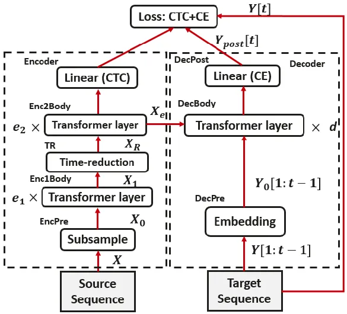
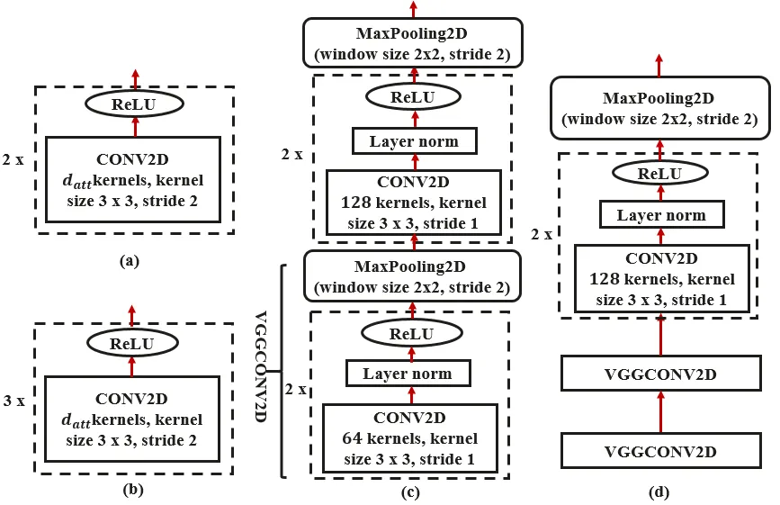
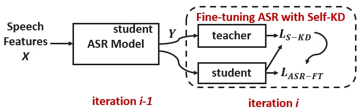

# Transformer-based ASR Incorporating Time-reduction Layer and Fine-tuning with Self-Knowledge Distillation

Md Akmal Haidar Affiliation: Huawei Noah’s Ark Lab, Montreal, Canada
Correspondence to: <md.akmal.haidar@huawei.com>    Chao Xing
Affiliation: Huawei Noah’s Ark Lab, Montreal, Canada    Mehdi
Rezagholizadeh Affiliation: Huawei Noah’s Ark Lab, Montreal, Canada

###### Abstract

End-to-end automatic speech recognition (ASR), unlike conventional ASR,
does not have modules to learn the semantic representation from speech
encoder. Moreover, the higher frame-rate of speech representation
prevents the model to learn the semantic representation properly.
Therefore, the models that are constructed by the lower frame-rate of
speech encoder lead to better performance. For Transformer-based ASR,
the lower frame-rate is not only important for learning better semantic
representation but also for reducing the computational complexity due to
the self-attention mechanism which has
$`\mathchar 29007\delimiter 67273472\mathchar 29038^{\mathchar 28722}\delimiter 84054785`$
order of complexity in both training and inference. In this paper, we
propose a Transformer-based ASR model with the time reduction layer, in
which we incorporate time reduction layer inside transformer encoder
layers in addition to traditional sub-sampling methods to input features
that further reduce the frame-rate. This can help in reducing the
computational cost of the self-attention process for training and
inference with performance improvement. Moreover, we introduce a
fine-tuning approach for pre-trained ASR models using self-knowledge
distillation (S-KD) which further improves the performance of our ASR
model. Experiments on LibriSpeech datasets show that our proposed
methods outperform all other Transformer-based ASR systems. Furthermore,
with language model (LM) fusion, we achieve new state-of-the-art word
error rate (WER) results for Transformer-based ASR models with just 30
million parameters trained without any external data.

## 1 Introduction

End-to-end (E2E) automatic speech recognition (ASR) systems (Graves
et al., 2006; Amodei et al., 2016; Chan et al., 2016; Karita et al.,
2019a) have shown great success recently because of their simple
training and inference procedures over the traditional HMM-based
methods (Povey et al., 2016). These end-to-end models learn a direct
mapping of the input acoustic signal to the output transcription without
needing to decompose the problem into different parts such as lexicon
modeling, acoustic modeling and language modeling. The very first
end-to-end ASR model is the connectionist temporal classification
(CTC) (Graves et al., 2006) model which independently maps the acoustic
frames into the outputs. The CTC-based models which incorporate language
model re-scoring could improve their output quality (Graves & Jaitly,
2014). The conditional independence assumption in CTC was tackled by the
recurrent neural network transducer (RNNT) model (Graves, 2012; He
et al., 2019), which shows better performance in streaming scenarios.
Other E2E ASR models are the attention-based encoder-decoder (AED)
architectures which yield state-of-the-art results in offline and online
fashions (Karita et al., 2019b; Karita et al., 2019a; Chan et al., 2016;
Moritz et al., 2020; Wang et al., 2020a; Wang et al., 2020b; Tsunoo
et al., 2020). The Transformer architecture, which uses self-attention
mechanism to model temporal contextual information, has been shown to
achieve lower word error rate (WER) compared to the recurrent neural
network (RNN) based AED architectures (Karita et al., 2019a). However,
Transformer architectures suffer from the decreased computational
efficiency for longer input sequences because of quadratic time
requirements of the self-attention mechanism.

For ASR systems, the number of time frames for an audio input sequence
is significantly higher than the number of output text labels. For
example, a task such as LibriSpeech which has long utterances (15s),
contains 1500 speech frames (assuming 10 ms per frame) (Irie et al.,
2019). Considering that adjacent speech frames can form a chunk to
represent more meaningful units like phonemes, some pre-processing
mechanisms are considered to capture the embedding of a group of speech
frames to reduce the frame-rate in the encoder input. In (Wang et al.,
2020c), different pre-processing strategies such as convolutional
sub-sampling and frame stacking & skipping techniques for
Transformer-based ASR are discussed. Among these approaches, the
convolutional approach for frame-rate reduction gives better WER results
compared to other approaches. Recently, a VGG-like convolutional
block (Simonyan & Zisserman, 2015) with max-pooling (Hori et al., 2017)
and layer normalization is used (Wang et al., 2020a) before the
Transformer encoder layers and outperforms the 2D-convolutional
sub-sampling (Karita et al., 2019a). In (Chan et al., 2016), a pyramidal
encoder structure for Bidirectional LSTM (BLSTM) is proposed using
time-reduction layers to reduce the frame-rate of the input sequence by
concatenating adjacent frames. In (He et al., 2019), a time-reduction
layer is employed in the RNNT model to speed up the training and
inference. However, time-reduction layer for Transformer architecture
was never explored.

In this work, we hypothesize that further frame-rate reduction is
possible on top of current approaches for Transformer-based
architectures. In this regard, we introduce a time-reduction layer to
Transformer-based ASR models that further decreases the frame-rate by
concatenating adjacent frames. Our proposed approach can speed up the
Transformer model training and inference. Also, our model yields a new
state-of-the art WER results for Transformer-based ASR models over
traditional approaches. Furthermore, we introduce a fine-tuning approach
for pre-trained ASR models incorporating the self-knowledge distillation
(S-KD) approach (Kim et al., 2020; Haun & Choi, 2019), which further
improves the performance of our ASR model. S-KD is recently investigated
which shows the dark knowledge of a model can be progressively deployed
through distillation to improve even its own performance (Kim et al.,
2020; Haun & Choi, 2019). We summarize our contributions as following:

- •
  We introduce a Transformer-based ASR model incorporating
  time-reduction layer;
- •
  We deploy a fine-tuning approach for ASR model using S-KD which shows
  better performance than the conventional S-KD training from scratch.
  To best of our knowledge, we apply the S-KD approach for the first
  time in training ASR models;
- •
  Our model outperforms the existing state-of-the-art Transformer-based
  ASR models.

## 2 Transformer Architecture for ASR

In Transformer-based ASR (Karita et al., 2019a; Karita et al., 2019b),
the input sequence $`\mathchar 29016`$ is first mapped to a subsequence
$`\mathchar 29016_{\mathchar 28720}\mathchar 12850\mathchar 29010^{\mathchar 29038_{\mathchar 29043\mathchar 29045\mathchar 29026}\mathchar 8706\mathchar 29028_{\mathchar 29025\mathchar 29044\mathchar 29044}}`$
by CNN blocks (Dong et al., 2018; Karita et al., 2019a) and then
transformer layers of the encoder map
$`\mathchar 29016_{\mathchar 28720}`$ to a sequence of encoded features
$`\mathchar 29016_{\mathchar 29029}`$. Here,
$`\mathchar 29038_{\mathchar 29043\mathchar 29045\mathchar 29026}`$ and
$`\mathchar 29028_{\mathchar 29025\mathchar 29044\mathchar 29044}`$
describe the length of sub-sampled sequence and the dimensions of the
features respectively. The layers of the encoder iteratively refine the
representation of the input sequence with a combination of multi-head
self-attention (MHA) and frame-level affine transformations.
Specifically, the inputs to each layer are projected into keys
$`\mathchar 29003`$, queries $`\mathchar 29009`$, and values
$`\mathchar 29014`$. Scaled dot product attention is then used to
compute a weighted sum of values for $`\mathchar 29009`$ matrix (Vaswani
et al., 2017):

```math
\operatorname{\mathchar 28993\mathchar 29044\mathchar 29044\mathchar 29029\mathchar 29038\mathchar 29044\mathchar 29033\mathchar 29039\mathchar 29038}\delimiter 67273472\mathchar 29009\mathchar 24891\mathchar 29003\mathchar 24891\mathchar 29014\delimiter 84054785\mathchar 12349\operatorname{\mathchar 29043\mathchar 29039\mathchar 29030\mathchar 29044\mathchar 29037\mathchar 29025\mathchar 29048}\delimiter 67273472{{\mathchar 29009\mathchar 29003^{\mathchar 29012}\over\sqrt{\mathchar 29028_{\mathchar 29025\mathchar 29044\mathchar 29044}}}}\delimiter 84054785\mathchar 29014 \tag{1}
```

where
$`\mathchar 29009\mathchar 12850\mathchar 29010^{\mathchar 29038_{\mathchar 29041}\mathchar 8706\mathchar 29028_{\mathchar 29025\mathchar 29044\mathchar 29044}}`$,
$`\mathchar 29003\mathchar 24891\mathchar 29014\mathchar 12850\mathchar 29010^{\mathchar 29038_{\mathchar 29035}\mathchar 8706\mathchar 29028_{\mathchar 29025\mathchar 29044\mathchar 29044}}`$,
$`\mathchar 29038_{\mathchar 29041}`$ is the length of
$`\mathchar 29009`$, and $`\mathchar 29038_{\mathchar 29035}`$ is the
length of $`\mathchar 29003\mathchar 24891\mathchar 29014`$. We obtain
multi-head attention by performing this computation $`\mathchar 29032`$
times independently with different sets of projections, and
concatenating:

```math
\displaystyle\operatorname{\mathchar 29005\mathchar 29000\mathchar 28993}\delimiter 67273472\mathchar 29009\mathchar 24891\mathchar 29003\mathchar 24891\mathchar 29014\delimiter 84054785\mathchar 12349\operatorname{\mathchar 28995\mathchar 29039\mathchar 29038\mathchar 29027\mathchar 29025\mathchar 29044}\delimiter 67273472\mathchar 29032\mathchar 29029\mathchar 29025\mathchar 29028_{\mathchar 28721}\mathchar 24891\dots\mathchar 24891\mathchar 29032\mathchar 29029\mathchar 29025\mathchar 29028_{\mathchar 29032}\delimiter 84054785\mathchar 29015^{\mathchar 29007} \tag{2}
```

```math
\displaystyle\mathchar 29032\mathchar 29029\mathchar 29025\mathchar 29028_{\mathchar 29033}\mathchar 12349\operatorname{\mathchar 28993\mathchar 29044\mathchar 29044\mathchar 29029\mathchar 29038\mathchar 29044\mathchar 29033\mathchar 29039\mathchar 29038}\delimiter 67273472\mathchar 29009\mathchar 29015_{\mathchar 29033}^{\mathchar 29009}\mathchar 24891\mathchar 29003\mathchar 29015_{\mathchar 29033}^{\mathchar 29003}\mathchar 24891\mathchar 29014\mathchar 29015_{\mathchar 29033}^{\mathchar 29014}\delimiter 84054785 \tag{3}
```

where
$`\mathchar 29009\mathchar 24891\mathchar 29003\mathchar 24891\mathchar 29014`$
are inputs of this multi-head attention layer,
$`\mathchar 29032\mathchar 29029\mathchar 29025\mathchar 29028_{\mathchar 29033}\mathchar 12850\mathchar 29010^{\mathchar 29038_{\mathchar 29041}\mathchar 8706\mathchar 29028_{\mathchar 29025\mathchar 29044\mathchar 29044}}`$
is the $`\mathchar 29033^{\mathchar 29044\mathchar 29032}`$ attention
layer output
$`\delimiter 67273472\mathchar 29033\mathchar 12349\mathchar 28721\mathchar 24891\dots\mathchar 24891\mathchar 29032\delimiter 84054785`$,
$`\mathchar 29015_{\mathchar 29033}^{\mathchar 8707}\mathchar 12850\mathchar 29010^{\mathchar 29028_{\mathchar 29025\mathchar 29044\mathchar 29044}\mathchar 8706\mathchar 29028_{\mathchar 29025\mathchar 29044\mathchar 29044}}`$,
$`\mathchar 29015^{\mathchar 29007}\mathchar 12850\mathchar 29010^{\mathchar 29028_{\mathchar 29025\mathchar 29044\mathchar 29044}\mathchar 29032\mathchar 8706\mathchar 29028_{\mathchar 29025\mathchar 29044\mathchar 29044}}`$
are the learnable weight matrices and $`\mathchar 29032`$ is the number
of attention heads in this layer (Vaswani et al., 2017; Karita et al.,
2019a). The outputs of multi-head attention go through a 2-layer
position-wise feed-forward network with hidden size
$`\mathchar 29028_{\mathchar 29030\mathchar 29030}`$:

```math
\operatorname{\mathchar 28998\mathchar 28998\mathchar 29006}\delimiter 67273472\mathchar 29016_{\mathchar 28720}\delimiter 67482370\mathchar 29044\delimiter 84267779\delimiter 84054785\mathchar 12349\operatorname{\mathchar 29010\mathchar 29029\mathchar 29004\mathchar 29013}\delimiter 67273472\mathchar 29016_{\mathchar 28720}\delimiter 67482370\mathchar 29044\delimiter 84267779\mathchar 29015_{\mathchar 28721}^{\mathchar 29028_{\mathchar 29030\mathchar 29030}}\mathchar 8235\mathchar 29026_{\mathchar 28721}^{\mathchar 29028_{\mathchar 29030\mathchar 29030}}\delimiter 84054785\mathchar 29015_{\mathchar 28722}^{\mathchar 29028_{\mathchar 29030\mathchar 29030}}\mathchar 8235\mathchar 29026_{\mathchar 28722}^{\mathchar 29028_{\mathchar 29030\mathchar 29030}} \tag{4}
```

where
$`\mathchar 29016_{\mathchar 28720}\delimiter 67482370\mathchar 29044\delimiter 84267779\mathchar 12850\mathchar 29010^{\mathchar 29028_{\mathchar 29025\mathchar 29044\mathchar 29044}}`$
is the $`\mathchar 29044^{\mathchar 29044\mathchar 29032}`$ frame of the
sequence $`\mathchar 29016_{\mathchar 28720}`$,
$`\mathchar 29015_{\mathchar 28721}^{\mathchar 29028_{\mathchar 29030\mathchar 29030}}\mathchar 12850\mathchar 29010^{\mathchar 29028_{\mathchar 29025\mathchar 29044\mathchar 29044}\mathchar 8706\mathchar 29028_{\mathchar 29030\mathchar 29030}}`$,
$`\mathchar 29015_{\mathchar 28722}^{\mathchar 29028_{\mathchar 29030\mathchar 29030}}\mathchar 12850\mathchar 29010^{\mathchar 29028_{\mathchar 29030\mathchar 29030}\mathchar 8706\mathchar 29028_{\mathchar 29025\mathchar 29044\mathchar 29044}}`$
are learnable weight matrices,
$`\mathchar 29026_{\mathchar 28721}^{\mathchar 29030\mathchar 29030}\mathchar 12850\mathchar 29010^{\mathchar 29028_{\mathchar 29030\mathchar 29030}}`$
and
$`\mathchar 29026_{\mathchar 28722}^{\mathchar 29030\mathchar 29030}\mathchar 12850\mathchar 29010^{\mathchar 29028_{\mathchar 29025\mathchar 29044\mathchar 29044}}`$
are learnable bias vectors.

The decoder generates a transcription sequence
$`\mathchar 29017\mathchar 12349\delimiter 67273472\mathchar 29017\delimiter 67482370\mathchar 28721\delimiter 84267779\mathchar 24891\mathchar 314\mathchar 314\mathchar 314\mathchar 24891\mathchar 29017\delimiter 67482370\mathchar 29044\delimiter 84267779\delimiter 84054785`$
one token at a time. Each choice of output token
$`\mathchar 29017\delimiter 67482370\mathchar 29044\delimiter 84267779`$
is conditioned on the encoder representations
$`\mathchar 29016_{\mathchar 29029}`$ and previously generated tokens
$`\delimiter 67273472\mathchar 29017\delimiter 67482370\mathchar 28721\delimiter 84267779\mathchar 24891\mathchar 314\mathchar 314\mathchar 314\mathchar 24891\mathchar 29017\delimiter 67482370\mathchar 29044\mathchar 8704\mathchar 28721\delimiter 84267779\delimiter 84054785`$
through attention mechanisms. Each decoder layer performs two rounds of
multi-head attention (Karita et al., 2019a). The multi-head attention is
then followed by the position-wise FFN (Equation 4). The output of the
final decoder layer for token
$`\mathchar 29017\delimiter 67482370\mathchar 29044\mathchar 8704\mathchar 28721\delimiter 84267779`$
is used to predict the following token
$`\mathchar 29017\delimiter 67482370\mathchar 29044\delimiter 84267779`$.
Other components of the architecture such as sinusoidal positional
encodings, residual connections and layer normalization are described
in (Vaswani et al., 2017). The positional encodings are applied into
$`\mathchar 29016_{\mathchar 28720}`$ and
$`\mathchar 29017_{\mathchar 28720}`$ when convolutional sub-sampling
was used (Karita et al., 2019a; Watanabe et al., 2018). For VGG-like
convolutional sub-sampling (Wang et al., 2020a), the positional encoding
for $`\mathchar 29016_{\mathchar 28720}`$ was discarded.

## 3 Related Work

Transformer ASR Several studies have focused on adapting Transformer
networks for end-to-end speech recognition. In particular, (Dong et al.,
2018; Mohamed et al., 2019) present models augmenting Transformer
networks with convolutions. (Karita et al., 2019a) focuses on refining
the training process, and show that Transformer-based end-to-end ASR is
highly competitive with state-of-the-art methods. In (Wang et al.,
2020a), a regularization method based on semantic masking was introduced
for Transformer ASR to force the decoder to learn a better language
model. A hybrid Transformer model with deeper layers and iterative loss
was introduced in (Wang et al., 2020c) where a Transformer-based
acoustic model outperforms the best hybrid results combined with an
$`\mathchar 29038`$-gram language model. In (Synnaeve et al., 2020), a
semi-supervised model with pseudo-labeling using Transformer-based
acoustic model was introduced. Recently a convolution augmented
Transformer was proposed (Gulati et al., 2020) where a convolution
module with two macaron-like feed forward layers is augmented in the
Transformer encoder layers. Moreover, Transformer architecture has shown
better performance for streaming applications (Zhang et al., 2020;
Moritz et al., 2020; Tsunoo et al., 2020). In this paper, we incorporate
time-reduction layer in the vanilla Transformer architecture (Vaswani
et al., 2017; Karita et al., 2019a) and achieve better performance over
the baselines (Karita et al., 2019a; Wang et al., 2020a; Wang et al.,
2020c; Moritz et al., 2020; Synnaeve et al., 2020; Park et al., 2019).

Knowledge Distillation Knowledge distillation (KD) is a prominent neural
model compression technique (Hinton et al., 2015) in which the output of
a teacher network is used as an auxiliary supervision besides the
ground-truth training labels. Later on, it was shown that KD can be used
for improving the performance of neural networks in the so-called
born-again (Furlanello et al., 2018) or self-distillation
frameworks (Kim et al., 2020; Yun et al., 2020; Hahn & Choi, 2019).
Self-distillation is a regularization technique trying to improve the
performance of a network using its internal knowledge. In other words,
in self-distillation scenarios, the student becomes its own teacher.
While KD has shown great success in different ASR tasks (Pang et al.,
2018; Huang et al., 2018; Takashima et al., 2018; Kim et al., 2019;
Chebotar & Waters, 2016; Fukuda et al., 2017; Yoon et al., 2020),
self-distillation is more investigated in computer vision and natural
language processing (NLP) domains (Haun & Choi, 2019; Hahn & Choi,
2019). To best of our knowledge, we incorporate the self-KD approach for
the first time in training ASR models.

## 4 Proposed Model for Transformer ASR

Given an input sequence $`\mathchar 29016`$ of log-mel filterbank speech
features, Transformer predicts a target sequence $`\mathchar 29017`$ of
characters or SentencePiece (Kudo & Richardson, 2018). The architecture
of our proposed model is described in Figure 1.



Figure 1: Proposed Transformer ASR with time-reduction layer

### 4.1 Transformer Encoder

In Figure 1, EncPre(.) transforms the source sequence
$`\mathchar 29016`$ into a sub-sampled sequence
$`\mathchar 29016_{\mathchar 28720}\mathchar 12850\mathchar 29010^{\mathchar 29038_{\mathchar 29043\mathchar 29045\mathchar 29026}\mathchar 8706\mathchar 29028_{\mathchar 29025\mathchar 29044\mathchar 29044}}`$
by using convolutional neural network (CNN) blocks (Karita et al.,
2019a; Moritz et al., 2020; Wang et al., 2020a) which reduce the
sequence length of the output $`\mathchar 29016_{\mathchar 28720}`$ by a
factor of 4 compared to the sequence length of $`\mathchar 29016`$. In
the baseline model, the EncPre(.) is followed by a stack of Transformer
layers that transform $`\mathchar 29016_{\mathchar 28720}`$ into a
sequence of encoded features
$`\mathchar 29016_{\mathchar 29029}\mathchar 12850\mathchar 29010^{\mathchar 29038_{\mathchar 29043\mathchar 29045\mathchar 29026}\mathchar 8706\mathchar 29028_{\mathchar 29025\mathchar 29044\mathchar 29044}}`$
for the CTC and decoder networks (Karita et al., 2019a). In this paper,
we introduce a time-reduction (TR) layer in the stack of Transformer
layers of the encoder. The position of the TR layer in the Transformer
layers is a hyper-parameter. In Figure 1, we add a TR layer between two
groups (Enc1Body(.) and Enc2Body(.)) of Transformer layers in the
encoder. The Enc1Body(.) transforms
$`\mathchar 29016_{\mathchar 28720}`$ into a sequence of encoded
features
$`\mathchar 29016_{\mathchar 28721}\mathchar 12850\mathchar 29010^{\mathchar 29038_{\mathchar 29043\mathchar 29045\mathchar 29026}\mathchar 8706\mathchar 29028_{\mathchar 29025\mathchar 29044\mathchar 29044}}`$
for the TR layer. The TR layer transforms the sequence
$`\mathchar 29016_{\mathchar 28721}`$ into
$`\mathchar 29016_{\mathchar 29010}\mathchar 12850\mathchar 29010^{\mathchar 29038_{\mathchar 29043\mathchar 29045\mathchar 29026\mathchar 28722}\mathchar 8706\mathchar 29028_{\mathchar 29025\mathchar 29044\mathchar 29044}}`$
by concatenating two adjacent time frames (Chan et al., 2016). This
concatenation further reduces the length of the output sequence
$`\mathchar 29016_{\mathchar 29010}`$ by a factor of 2 (i.e., the
frame-rate of $`\mathchar 29016_{\mathchar 29010}`$ is reduced by a
factor of 8 compared to $`\mathchar 29016`$). Here,
$`\mathchar 29038_{\mathchar 29043\mathchar 29045\mathchar 29026\mathchar 28722}`$
represents the sequence length after applying a TR layer. A TR layer
corresponding to the
$`\mathchar 29034^{\mathchar 29044\mathchar 29032}`$ layer at the output
of $`\mathchar 29033^{\mathchar 29044\mathchar 29032}`$ time step can be
described as follows:

```math
\mathchar 29032_{\mathchar 29033}^{\mathchar 29034}\mathchar 12349\left\delimiter 67482370\mathchar 29032_{\mathchar 28722\mathchar 29033}^{\mathchar 29034\mathchar 8704\mathchar 28721}\mathchar 24891\mathchar 29032_{\mathchar 28722\mathchar 29033\mathchar 8235\mathchar 28721}^{\mathchar 29034\mathchar 8704\mathchar 28721}\right\delimiter 84267779 \tag{5}
```

where $`\mathchar 29032_{\mathchar 29033}^{\mathchar 29034}`$ represents
the encoder representation of the
$`\mathchar 29034^{\mathchar 29044\mathchar 29032}`$ layer at the
$`\mathchar 29033^{\mathchar 29044\mathchar 29032}`$ time step. After
the TR layer, Enc2Body(.) transforms
$`\mathchar 29016_{\mathchar 29010}`$ into a sequence of encoded
features
$`\mathchar 29016_{\mathchar 29029}\mathchar 12850\mathchar 29010^{\mathchar 29038_{\mathchar 29043\mathchar 29045\mathchar 29026\mathchar 28722}\mathchar 8706\mathchar 29028_{\mathchar 29025\mathchar 29044\mathchar 29044}}`$
for the CTC and decoder networks. The Enc1Body(.) and Enc2Body(.) can be
defined as (Karita et al., 2019a):

```math
\displaystyle\begin{split}\mathchar 29016_{\mathchar 29033}^{\raise 2.41112pt\hbox{\sevensy\char 48\relax}}&\mathchar 12349\mathchar 29016_{\mathchar 29033}\mathchar 8235\mathchar 29005\mathchar 29000\mathchar 28993_{\mathchar 29033}\delimiter 67273472\mathchar 29016_{\mathchar 29033}\mathchar 24891\mathchar 29016_{\mathchar 29033}\mathchar 24891\mathchar 29016_{\mathchar 29033}\delimiter 84054785\\
\mathchar 29016_{\mathchar 29033\mathchar 8235\mathchar 28721}&\mathchar 12349\mathchar 28998\mathchar 28998\mathchar 29006_{\mathchar 29033}\delimiter 67273472\mathchar 29016_{\mathchar 29033}^{\raise 2.41112pt\hbox{\sevensy\char 48\relax}}\delimiter 84054785\end{split} \tag{6}
```

where
$`\mathchar 29033\mathchar 12349\mathchar 28720\mathchar 24891\dots\mathchar 24891\mathchar 29029_{\mathchar 28721}\mathchar 8704\mathchar 28721`$
or
$`\mathchar 29033\mathchar 12349\mathchar 28720\mathchar 24891\dots\mathchar 24891\mathchar 29029_{\mathchar 28722}\mathchar 8704\mathchar 28721`$
describe the index of the Transformer layers of the encoder before or
after the TR layer respectively.

Since the time complexity of the self-attention mechanism is quadratic,
our proposed time-reduction layer inside the Transformer layers of the
encoder can reduce the computational cost for training and inference. To
best of our knowledge, we are the first who applied time-reduction
approach to Transformers.

### 4.2 Transformer Decoder

We keep the same decoder architecture as in (Karita et al., 2019a;
Karita et al., 2019b). The decoder receives the encoded sequence
$`\mathchar 29016_{\mathchar 29029}`$ and the prefix of a target
sequence
$`\mathchar 29017\delimiter 67482370\mathchar 28721\mathchar 12346\mathchar 29044\mathchar 8704\mathchar 28721\delimiter 84267779`$
of token IDs: characters or SentencePiece (Kudo & Richardson, 2018).
First, DecPre(.) embeds the tokens into learnable vectors
$`\mathchar 29017_{\mathchar 28720}\delimiter 67482370\mathchar 28721\mathchar 12346\mathchar 29044\mathchar 8704\mathchar 28721\delimiter 84267779`$.
Then, DecBody(.) and a single linear layer DecPost(.) predicts the
posterior distribution of the next token prediction
$`\mathchar 29017_{\mathchar 29040\mathchar 29039\mathchar 29043\mathchar 29044}\delimiter 67482370\mathchar 29044\delimiter 84267779`$
given $`\mathchar 29016_{\mathchar 29029}`$ and
$`\mathchar 29017\delimiter 67482370\mathchar 28721\mathchar 12346\mathchar 29044\mathchar 8704\mathchar 28721\delimiter 84267779`$.
For the decoder input
$`\mathchar 29017\delimiter 67482370\mathchar 28721\mathchar 12346\mathchar 29044\mathchar 8704\mathchar 28721\delimiter 84267779`$,
we use ground-truth labels in the training stage, while we use generated
output in the decoding stage. The DecBody(.) can be described as:

```math
\displaystyle\begin{split}\mathchar 29017_{\mathchar 29034}^{\raise 2.41112pt\hbox{\sevensy\char 48\relax}}\delimiter 67482370\mathchar 29044\delimiter 84267779&\mathchar 12349\mathchar 29017_{\mathchar 29034}\delimiter 67482370\mathchar 29044\delimiter 84267779\mathchar 8235\mathchar 29005\mathchar 29000\mathchar 28993_{\mathchar 29034}^{\mathchar 29043\mathchar 29029\mathchar 29036\mathchar 29030}\delimiter 67273472\mathchar 29017_{\mathchar 29034}\delimiter 67482370\mathchar 29044\delimiter 84267779\mathchar 24891\mathchar 29017_{\mathchar 29034}\delimiter 67482370\mathchar 28721\mathchar 12346\mathchar 29044\mathchar 8704\mathchar 28721\delimiter 84267779\mathchar 24891\mathchar 29017_{\mathchar 29034}\delimiter 67482370\mathchar 28721\mathchar 12346\mathchar 29044\mathchar 8704\mathchar 28721\delimiter 84267779\delimiter 84054785\\
\mathchar 29017_{\mathchar 29034}^{\raise 2.41112pt\hbox{\sevensy\char 48\relax}\raise 2.41112pt\hbox{\sevensy\char 48\relax}}&\mathchar 12349\mathchar 29017_{\mathchar 29034}\mathchar 8235\mathchar 29005\mathchar 29000\mathchar 28993_{\mathchar 29034}^{\mathchar 29043\mathchar 29042\mathchar 29027}\delimiter 67273472\mathchar 29017_{\mathchar 29034}^{\raise 2.41112pt\hbox{\sevensy\char 48\relax}}\mathchar 24891\mathchar 29016_{\mathchar 29029}\mathchar 24891\mathchar 29016_{\mathchar 29029}\delimiter 84054785\\
\mathchar 29017_{\mathchar 29034\mathchar 8235\mathchar 28721}&\mathchar 12349\mathchar 29017_{\mathchar 29034}^{\raise 2.41112pt\hbox{\sevensy\char 48\relax}\raise 2.41112pt\hbox{\sevensy\char 48\relax}}\mathchar 8235\mathchar 28998\mathchar 28998\mathchar 29006_{\mathchar 29034}\delimiter 67273472\mathchar 29017_{\mathchar 29034}^{\raise 2.41112pt\hbox{\sevensy\char 48\relax}\raise 2.41112pt\hbox{\sevensy\char 48\relax}}\delimiter 84054785\end{split} \tag{7}
```

where
$`\mathchar 29034\mathchar 12349\mathchar 28720\mathchar 24891\dots\mathchar 24891\mathchar 29028\mathchar 8704\mathchar 28721`$
represents the index of the Transformer layers of the decoder.
$`\mathchar 29005\mathchar 29000\mathchar 28993_{\mathchar 29034}^{\mathchar 29043\mathchar 29042\mathchar 29027}\delimiter 67273472\mathchar 29017_{\mathchar 29034}^{\raise 2.41112pt\hbox{\sevensy\char 48\relax}}\mathchar 24891\mathchar 29016_{\mathchar 29029}\mathchar 24891\mathchar 29016_{\mathchar 29029}\delimiter 84054785`$
and
$`\mathchar 29005\mathchar 29000\mathchar 28993_{\mathchar 29034}^{\mathchar 29043\mathchar 29029\mathchar 29036\mathchar 29030}\delimiter 67273472\mathchar 29017_{\mathchar 29034}\delimiter 67482370\mathchar 29044\delimiter 84267779\mathchar 24891\mathchar 29017_{\mathchar 29034}\delimiter 67482370\mathchar 28721\mathchar 12346\mathchar 29044\mathchar 8704\mathchar 28721\delimiter 84267779\mathchar 24891\mathchar 29017_{\mathchar 29034}\delimiter 67482370\mathchar 28721\mathchar 12346\mathchar 29044\mathchar 8704\mathchar 28721\delimiter 84267779\delimiter 84054785`$
are defined as the ’encoder-decoder attention’ and the ’decoder
self-attention’ respectively.

### 4.3 Training and Decoding

During ASR training, the frame-wise posterior distribution of
$`\mathchar 29008_{\mathchar 29043\mathchar 28722\mathchar 29043}\delimiter 67273472\mathchar 29017\delimiter 69640972\mathchar 29016\delimiter 84054785`$
and
$`\mathchar 29008_{\mathchar 29027\mathchar 29044\mathchar 29027}\delimiter 67273472\mathchar 29017\delimiter 69640972\mathchar 29016\delimiter 84054785`$
are predicted by the decoder and the CTC module respectively. The
training loss function is the weighted sum of the negative
log-likelihood of these values (Karita et al., 2019a):

```math
\mathchar 29004_{\mathchar 28993\mathchar 29011\mathchar 29010}\mathchar 12349\mathchar 8704\delimiter 67273472\mathchar 28721\mathchar 8704\mathchar 28939\delimiter 84054785\log\mathchar 29008_{\mathchar 29043\mathchar 28722\mathchar 29043}\delimiter 67273472\mathchar 29017\delimiter 69640972\mathchar 29016\delimiter 84054785\mathchar 8704\mathchar 28939\log\mathchar 29008_{\mathchar 29027\mathchar 29044\mathchar 29027}\delimiter 67273472\mathchar 29017\delimiter 69640972\mathchar 29016\delimiter 84054785 \tag{8}
```

where$`\mathchar 8704\log\mathchar 29008_{\mathchar 29027\mathchar 29044\mathchar 29027}\delimiter 67273472\mathchar 29017\delimiter 69640972\mathchar 29016\delimiter 84054785`$
and
$`\mathchar 8704\log\mathchar 29008_{\mathchar 29043\mathchar 28722\mathchar 29043}\delimiter 67273472\mathchar 29017\delimiter 69640972\mathchar 29016\delimiter 84054785`$
describe the CTC and cross-entropy (CE) losses respectively.
$`\mathchar 28939`$ is a hyper-parameter which determines the CTC
weight. In the decoding stage, given the speech feature
$`\mathchar 29016`$ and the previous predicted token, the next token is
predicted using beam search combining the scores of s2s and ctc
with/without language model score as (Karita et al., 2019a):

```math
\displaystyle\begin{split}\hat{\mathchar 29017}\mathchar 12349\underset{\mathchar 29017\mathchar 12850\mathchar 29049^{\mathchar 8707}}{\arg\max}\{\delimiter 67273472\mathchar 28721\mathchar 8704\mathchar 28949\delimiter 84054785\log\mathchar 29008_{\mathchar 29043\mathchar 28722\mathchar 29043}\delimiter 67273472\mathchar 29017\delimiter 69640972\mathchar 29016_{\mathchar 29029}\delimiter 84054785\mathchar 8235\\
\mathchar 28949\log\mathchar 29008_{\mathchar 29027\mathchar 29044\mathchar 29027}\delimiter 67273472\mathchar 29017\delimiter 69640972\mathchar 29016_{\mathchar 29029}\delimiter 84054785\mathchar 8235\mathchar 28941\log\mathchar 29008_{\mathchar 29036\mathchar 29037}\delimiter 67273472\mathchar 29017\delimiter 84054785\}\end{split} \tag{9}
```

where $`\mathchar 29049^{\mathchar 8707}`$is a set of hypotheses of the
target sequence $`\mathchar 29017`$, and $`\mathchar 28949`$,
$`\mathchar 28941`$ are hyperparameters.



Figure 2: Different types of Encoder sub-sampling. (a) CONV2D4, (b)
CONV2D8, (c) VGGCONV2D4, and (d) VGGCONV2D8

### 4.4 Encoder sub-sampling

We apply 2D-convolutional sub-sampling (Karita et al., 2019a) (CONV2D4)
for EncPre(.) which is a block of two CNN layers. Each CNN layer uses
stride 2, a kernel size of
$`\mathchar 28723\mathchar 8706\mathchar 28723`$ and a ReLU activation
function. For EncPre(.), we also use VGG-like convolutional block
(VGGCONV2D4) with layer normalization and a max-pooling function (Wang
et al., 2020a). For both cases, the sequence length reduces by a factor
of 4 compared to the length of $`\mathchar 29016`$. To compare with our
proposed approach, we also define two other EncPre(.) namely
CONV2D8 (Watanabe et al., 2018) and VGGCONV2D8 which reduce the sequence
length by 8 times compared to the original sequence length. All the
sub-sampling approaches are depicted in Figure 2.

## 5 Fine-tuning using Self-Knowledge Distillation

We further improve the performance of our proposed model by
incorporating a self-knowledge distillation (S-KD) approach (Kim et al.,
2020). S-KD has recently been investigated for natural language
processing (NLP) applications, where the soft labels generated by the
model are used to improve itself in a progressive manner (Haun & Choi,
2019; Kim et al., 2020). S-KD is a framework of KD where the student
becomes its own teacher. Bear in mind, since ASR training takes longer
time to converge, starting from scratch with S-KD as in (Kim et al., 2020) would increase the training time significantly. In this paper, we
incorporate S-KD in fine-tuning a pre-trained ASR model and will show
that it will be more efficient than training ASR models using S-KD from
scratch. For fine-tuning using S-KD, let
$`\mathchar 29008^{\mathchar 29012}_{\mathchar 29043\mathchar 28722\mathchar 29043}\delimiter 67273472\mathchar 29017\delimiter 67482370\mathchar 29044\delimiter 84267779\delimiter 69640972\mathchar 29017\delimiter 67482370\mathchar 28721\mathchar 12346\mathchar 29044\mathchar 8704\mathchar 28721\delimiter 84267779\mathchar 24891\mathchar 29016_{\mathchar 29029}\delimiter 84054785`$
be the probability distribution of the decoder of a pre-trained ASR
model as a teacher. We initialized the student with the teacher model
and at iteration $`\mathchar 29033\mathchar 8704\mathchar 28721`$, the
student model tries to mimic the teacher probability distribution with
cross-entropy:

```math
\displaystyle\begin{split}\mathchar 29004_{\mathchar 29011\mathchar 8704\mathchar 29003\mathchar 28996}\mathchar 12349\mathchar 8704\mathchar 4944\displaylimits_{\mathchar 29017\delimiter 67482370\mathchar 29044\delimiter 84267779\mathchar 12850\mathchar 29014}\delimiter 67273472\mathchar 29008^{\mathchar 29012}_{\mathchar 29043\mathchar 28722\mathchar 29043}\delimiter 67273472\mathchar 29017\delimiter 67482370\mathchar 29044\delimiter 84267779\delimiter 69640972\mathchar 29017\delimiter 67482370\mathchar 28721\mathchar 12346\mathchar 29044\mathchar 8704\mathchar 28721\delimiter 84267779\mathchar 24891\mathchar 29016_{\mathchar 29029}\delimiter 84054785\mathchar 8706\\
\log\mathchar 29008_{\mathchar 29043\mathchar 28722\mathchar 29043}\delimiter 67273472\mathchar 29017\delimiter 67482370\mathchar 29044\delimiter 84267779\delimiter 69640972\mathchar 29017\delimiter 67482370\mathchar 28721\mathchar 12346\mathchar 29044\mathchar 8704\mathchar 28721\delimiter 84267779\mathchar 24891\mathchar 29016_{\mathchar 29029}\delimiter 84054785\delimiter 84054785\end{split} \tag{10}
```

where $`\mathchar 29014`$ is a set of vocabulary. At iteration
$`\mathchar 29033`$, the student probability distribution
$`\mathchar 29008_{\mathchar 29043\mathchar 28722\mathchar 29043}\delimiter 67273472\mathchar 29017\delimiter 67482370\mathchar 29044\delimiter 84267779\delimiter 69640972\mathchar 29017\delimiter 67482370\mathchar 28721\mathchar 12346\mathchar 29044\mathchar 8704\mathchar 28721\delimiter 84267779\mathchar 24891\mathchar 29016_{\mathchar 29029}\delimiter 84054785`$
of the decoder becomes the teacher probability distribution
$`\mathchar 29008^{\mathchar 29012}_{\mathchar 29043\mathchar 28722\mathchar 29043}\delimiter 67273472\mathchar 29017\delimiter 67482370\mathchar 29044\delimiter 84267779\delimiter 69640972\mathchar 29017\delimiter 67482370\mathchar 28721\mathchar 12346\mathchar 29044\mathchar 8704\mathchar 28721\delimiter 84267779\mathchar 24891\mathchar 29016_{\mathchar 29029}\delimiter 84054785`$
and the student model is trained to mimic the teacher with
$`\mathchar 29004_{\mathchar 29011\mathchar 8704\mathchar 29003\mathchar 28996}`$.
A schematic of the S-KD approach is described in Figure 3.



Figure 3: Fine-tuning ASR using the S-KD approch. The student at
$`\mathchar 29033\mathchar 8704\mathchar 28721`$ becomes the teacher at
iteration $`\mathchar 29033`$ and the model is trained with the loss
$`\mathchar 29004_{\mathchar 28993\mathchar 29011\mathchar 29010\mathchar 8704\mathchar 28998\mathchar 29012}`$

The new loss function for fine-tuning (FT) the ASR model can be
described as:

```math
\displaystyle\begin{split}\mathchar 29004_{\mathchar 28993\mathchar 29011\mathchar 29010\mathchar 8704\mathchar 28998\mathchar 29012}\mathchar 12349\mathchar 28939\mathchar 29004_{\mathchar 29027\mathchar 29044\mathchar 29027}\mathchar 8235\delimiter 67273472\mathchar 28721\mathchar 8704\mathchar 28939\delimiter 84054785\delimiter 67273472\mathchar 28958_{\mathchar 29003\mathchar 28996}\mathchar 29004_{\mathchar 29011\mathchar 8704\mathchar 29003\mathchar 28996}\\
\mathchar 8235\delimiter 67273472\mathchar 28721\mathchar 8704\mathchar 28958_{\mathchar 29003\mathchar 28996}\delimiter 84054785\mathchar 29004_{\mathchar 29043\mathchar 28722\mathchar 29043}\delimiter 84054785\end{split} \tag{11}
```

where
$`\mathchar 29004_{\mathchar 29027\mathchar 29044\mathchar 29027}\mathchar 12349\mathchar 8704\log\mathchar 29008_{\mathchar 29027\mathchar 29044\mathchar 29027}\delimiter 67273472\mathchar 29017\delimiter 69640972\mathchar 29016\delimiter 84054785`$,
$`\mathchar 29004_{\mathchar 29043\mathchar 28722\mathchar 29043}\mathchar 12349\mathchar 8704\log\mathchar 29008_{\mathchar 29043\mathchar 28722\mathchar 29043}\delimiter 67273472\mathchar 29017\delimiter 69640972\mathchar 29016\delimiter 84054785`$,
and $`\mathchar 28958_{\mathchar 29003\mathchar 28996}`$ is a controlled
parameter, and is typically
$`\mathchar 28958_{\mathchar 29003\mathchar 28996}\mathchar 12349\mathchar 28720\mathchar 314\mathchar 28725`$ (Tsunoo
et al., 2020).

To show the effectiveness of our proposed fine-tuning approach using
S-KD, we also perform S-KD experiments to train our model from scratch.
In this regard, we update the KD loss for each epoch similar to (Kim
et al., 2020):

```math
\begin{split}&\mathchar 28958_{\mathchar 29003\mathchar 28996_{\mathchar 29044}}\mathchar 12349\mathchar 28958_{\mathchar 29003\mathchar 28996_{\mathchar 29012}}\mathchar 8706{{\mathchar 29044\over\mathchar 29012}}\\
\end{split} \tag{12}
```

where $`\mathchar 29012`$ is the total number of training epochs,
$`\mathchar 28958_{\mathchar 29003\mathchar 28996_{\mathchar 29012}}`$
is the
$`\mathchar 28958_{\mathchar 29003\mathchar 28996_{\mathchar 29044}}`$
for the last epoch.

## 6 Experiments

### 6.1 Experimental Setup

We use the open-source, ESPnet toolkit (Watanabe et al., 2018) for our
experiments. We conduct our experiments on LibriSpeech
dataset (Panayotov et al., 2015), which is a speech corpus of reading
English audio books. It has 960 hours of training data, 10.7 hours of
development data, and 10.5 hours of test data, whereby the development
and the test datasets are both split into approximately two halves named
“clean” and “other”. To extract the input features for speech, we follow
the same setup as in (Watanabe et al., 2018; Karita et al., 2019a):
using 83-dimensional log-Mel filterbanks frames with pitch
features (Karita et al., 2019a; Moritz et al., 2020). The output tokens
come from a 5K subword vocabulary created with sentencepiece (Kudo &
Richardson, 2018)“unigram” (Watanabe et al., 2018). We perform
experiments using 12
($`\mathchar 29029_{\mathchar 28721}\mathchar 8235\mathchar 29029_{\mathchar 28722}\mathchar 12349\mathchar 28721\mathchar 28722`$)
and 6 ($`\mathchar 29028\mathchar 12349\mathchar 28726`$) Transformer
layers for the encoder and decoder respectively, with
$`\mathchar 29028_{\mathchar 29030\mathchar 29030}\mathchar 12349\mathchar 28722\mathchar 28720\mathchar 28724\mathchar 28728`$,
$`\mathchar 29028_{\mathchar 29025\mathchar 29044\mathchar 29044}\mathchar 12349\mathchar 28722\mathchar 28725\mathchar 28726`$,
and $`\mathchar 29032\mathchar 12349\mathchar 28724`$. The total number
of model parameters are about 30 M.We apply default settings of
SpecAugmentation (Park et al., 2019) of ESPnet (Watanabe et al., 2018)
and no gradient accumulation for all of our experiments. We use Adam
optimizer with learning rate scheduling similar to (Vaswani et al.,
2017; Watanabe et al., 2018) and other settings (e.g., dropout, warmup
steps, $`\mathchar 28939`$, label smoothing penalty (Park et al., 2019))
following (Moritz et al., 2020; Watanabe et al., 2018). We set the
initial learning rate of 5.0 (Watanabe et al., 2018). We train all of
our models for 150 epochs. We report our results based on averaging the
best five checkpoints. For fine-tuning with self-knowledge distillation
(FS-KD) experiments, we use our trained best average model for
initialization. We train the FS-KD experiments for 50 epochs with Adam
optimizer (Kingma & Ba, 2015) with fixed learning rate of
0.0001 (Watanabe et al., 2018) and fixed
$`\mathchar 28958_{\mathchar 29003\mathchar 28996}\mathchar 12349\mathchar 28720\mathchar 314\mathchar 28725`$.
We also perform S-KD experiments from scratch for 150 epochs with
$`\mathchar 28958_{\mathchar 29003\mathchar 28996_{\mathchar 29012}}\mathchar 12349\mathchar 28720\mathchar 314\mathchar 28725`$
and 200 epochs with
$`\mathchar 28958_{\mathchar 29003\mathchar 28996_{\mathchar 29012}}\mathchar 12349\mathchar 28720\mathchar 314\mathchar 28727`$
respectively. For S-KD experiments, We use Adam optimizer with learning
rate scheduling similar to (Vaswani et al., 2017; Watanabe et al.,
2018).

For decoding, the CTC weight $`\mathchar 28949`$, the LM weight
$`\mathchar 28941`$ and beam size are 0.5, 0.7 and 20
respectively (Moritz et al., 2020; Watanabe et al., 2018). Moreover, we
apply insertion-penalty of 2.0 during decoding. For S-KD and FS-KD
experiments, we note that the CTC weight of
$`\mathchar 28949\mathchar 12349\mathchar 28720\mathchar 314\mathchar 28723`$
gives better results. This might be because of S-KD applied on the
decoder output of the ASR model. For LM fusion (Toshniwal et al., 2018),
we use a pre-trained Transformer LM¹¹ 1
[https://github.com/espnet/espnet/blob/master/egs/librispeech/asr1/RESULTS.md](https://github.com/espnet/espnet/blob/master/egs/librispeech/asr1/RESULTS.md).

|                                                |            |            |           |           |
| ---------------------------------------------- | ---------- | ---------- | --------- | --------- |
| Model                                          | Test-clean | Test-other | Dev-clean | Dev-other |
| Hybrid Transformer+LM (Wang et al., 2020c)     | 2.26       | 4.85       | -         | -         |
| RWTH+LM (Luscher et al., 2019)                 | 2.3        | 5.0        | 1.9       | 4.5       |
| Baseline +LM  (Moritz et al., 2020)            | 2.7        | 6.1        | 2.4       | 6.0       |
| ESPNet Transformer+LM (Karita et al., 2019a)   | 2.6        | 5.7        | 2.2       | 5.6       |
| LAS+LM (Park et al., 2019)                     | 3.2        | 9.8        | -         | -         |
| LAS+SpecAugment+LM (Park et al., 2019)         | 2.5        | 5.8        | -         | -         |
| Transformer+LM (Synnaeve et al., 2020)         | 2.33       | 5.17       | 2.10      | 4.79      |
| Semantic Mask + LM  (Wang et al., 2020a)       | 2.24       | 5.12       | 2.05      | 5.01      |
| Transformer Transducer+LM (Zhang et al., 2020) | 2.0        | 4.6        | -         | -         |
| New Baselines                                  |            |            |           |           |
| Pyramidal Transformer                          | 4.3        | 9.3        | 4.2       | 9.1       |
|      + LM                                      | 2.9        | 5.9        | 2.7       | 5.7       |
| CONV2D8                                        | 4.1        | 9.1        | 3.9       | 9.5       |
|      + LM                                      | 2.7        | 5.6        | 2.4       | 5.6       |
| VGGCONV2D8                                     | 3.6        | 9.2        | 3.5       | 9.4       |
|      + LM                                      | 2.0        | 5.3        | 1.9       | 5.2       |
| Proposed Models with TR                        |            |            |           |           |
| CONV2D4+TR0                                    | 3.6        | 8.6        | 3.4       | 8.9       |
|      + LM                                      | 2.3        | 5.3        | 2.0       | 5.0       |
| VGGCONV2D4+TR0                                 | 3.5        | 8.5        | 3.3       | 8.8       |
|      + LM                                      | 2.0        | 5.0        | 1.9       | 4.9       |
| CONV2D4+TR2                                    | 3.7        | 8.2        | 3.5       | 8.5       |
|      + LM                                      | 2.4        | 5.2        | 2.2       | 5.0       |
| VGGCONV2D4+TR2                                 | 3.3        | 8.5        | 3.2       | 8.5       |
|      + LM                                      | 2.0        | 5.0        | 1.9       | 4.9       |

Table 1: WER results for E2E ASR models. TR0 and TR2 represent the
time-reduction (TR) layer applied before all and after second
Transformer layers of the encoder respectively. Best results are
depicted in bold.

### 6.2 New Baseline Results

We compare our proposed models with state-of-the-art models (Moritz
et al., 2020; Park et al., 2019; Karita et al., 2019a; Wang et al.,
2020a; Wang et al., 2020c; Luscher et al., 2019; Synnaeve et al., 2020).
We also introduce the latest baseline models and run experiments to
compare them with our proposed approaches. We create a pyramidal
structure (Chan et al., 2016) in the first three Transformer layers of
the encoder, where we concatenate the outputs at consecutive steps
(Equation 5) of each layer before feeding it to the next layer. After
the first three layers, the sequence length would reduce by a factor of
8 than the sequence length of $`\mathchar 29016`$. We define the model
as Pyramidal Transformer. We also use CONV2D8 sub-sampling (Watanabe
et al., 2018) and VGGCONV2D8 which are explained in Figure 2 for
EncPre(.) to reduce the sequence length 8 times than the length of
$`\mathchar 29016`$ and then apply all the Transformer layers. We define
them as CONV2D8 and VGGCONV2D8 respectively. From Table 1, we can see
that our proposed new baseline models give comparable results to the
existing models with LM fusion, which are much larger than our model.
Among these baselines, the VGGCONV2D8 gives the better results.

### 6.3 Results using TR layer

We apply the TR layer after CONV2D4 or VGGCONV2D4 to further reduce the
sequence length by a factor of two. First, we apply the TR layer after
CONV2D4 and VGGCONV2D4 approaches (i.e., TR0:
$`\mathchar 29029_{\mathchar 28721}\mathchar 12349\mathchar 28720`$ and
$`\mathchar 29029_{\mathchar 28722}\mathchar 12349\mathchar 28721\mathchar 28722`$).
We define the models as CONV2D4+TR0 and VGGCONV2D4+TR0 respectively,
which reduce the frame-rate by a factor of 8 than the frame-rate of
$`\mathchar 29016`$. From Table 1, we can note that VGGCONV2D4+TR0
outperforms or gives comparable results to the existing hybrid
results (Wang et al., 2020b; Luscher et al., 2019), E2E LSTM (Park
et al., 2019) and E2E Transformer baselines (Moritz et al., 2020; Karita
et al., 2019a; Synnaeve et al., 2020; Wang et al., 2020a) which are
trained with more parameters. Also, it shows better results over the
VGGCONV2D8 model. Next, we apply the TR layer after the second
Transformer layer (i.e., TR2:
$`\mathchar 29029_{\mathchar 28721}\mathchar 12349\mathchar 28722`$ and
$`\mathchar 29029_{\mathchar 28722}\mathchar 12349\mathchar 28721\mathchar 28720`$).
From both TR0 and TR2 experiments, we can see that both experiments give
comparable results and VGGCONV2D4+TR0/TR2 yields better results over the
CONV2D4+TR0/TR2 models. Without LM fusion, VGGCONV2D4+TR2 gives better
results over VGGCONV2D4+TR0. For the other experiments, we apply the
VGGCONV2D4 for the EncPre(.) and perform TR2 experiments. From the
table 1, we see that the VGGCONV2D4+TR0/TR2 model with LM fusion
outperforms over the best E2E Transformer ASR models using the semantic
mask (Wang et al., 2020a) and (Synnaeve et al., 2020) which are trained
with 75 and 270 M parameters respectively. Compared to the semantic mask
technique (Wang et al., 2020a) and  (Synnaeve et al., 2020), our
proposed approach achieves relative WER reductions of 10.7% and 14.1%
for the test-clean and 2.3% and 3.2% for the test-other respectively.
Also, we can note that our approach shows comparable results to
Transformer Transducer (Zhang et al., 2020) which is trained with RNN-T
loss (Tripathi et al., 2019) and 139 M parameters.

| Model                       | Test-clean | Test-other | Dev-clean | Dev-other |
| --------------------------- | ---------- | ---------- | --------- | --------- |
| VGGCONV2d4+TR2 +FS-KD       | 3.1        | 7.9        | 3.0       | 8.0       |
|      + LM                   | 1.9        | 4.8        | 1.8       | 4.6       |
| VGGCONV2d4+TR2_S-KD\*       | 3.2        | 8.1        | 3.2       | 8.3       |
|      + LM                   | 2.0        | 4.8        | 1.9       | 4.7       |
| VGGCONV2d4+TR2_S-KD\*+FS-KD | 3.3        | 8.1        | 3.2       | 8.3       |
|      + LM                   | 2.0        | 4.8        | 1.8       | 4.7       |
| VGGCONV2d4+TR2_S-KD\*\*     | 3.2        | 8.0        | 3.1       | 8.2       |
|      + LM                   | 2.0        | 4.9        | 1.9       | 4.8       |

Table 2: WER results of the proposed Transformer-based ASR models using
self-KD. FS-KD describes the results for fine-tuning the pre-trained
VGGCONV2D4+TR2 model with Self-KD. TR2_S-KD\* and TR2_S-KD\*\* represent
the models training from scratch using self-KD with time-reduction layer
after second Transformer layer for 150 and 200 epochs respectively. Best
results are described in bold.

### 6.4 Results using Self-KD

We report the results for self-KD (S-KD) experiments in Table 2. We
conduct experiments VGGCONV2D4+TR2+FS-KD for fine-tuning the pre-trained
ASR model VGGCONV2D4+TR2 using S-KD. We can note that with FS-KD, the
proposed method gives further WER reductions for both without and with
LM fusion. With LM fusion, our model outperforms the Transformer
transducer model for the test-clean dataset and gives comparable results
for the test-other dataset. We also train an ASR model by applying S-KD
from scratch to show the effectiveness of our fine-tuning approach on a
pre-trained ASR model. We conduct two experiments by applying self-KD
from scratch for 150 epochs and 200 epochs respectively. From Table 2,
we can see that the S-KD experiments from scratch give similar or better
results than the VGGCONV2D4+TR2 model but lower performance than our
proposed VGGCONV2D4+FS-KD approach. Also, the self-KD approach from
scratch requires longer training time than our proposed approaches.
Furthermore, to make the same number of epochs, we apply self-KD for
fine-tuning the VGGCONV2D4+TR2_S-KD\* model which is trained using the
self-KD from scratch for 150 epochs. From Table 2, it can be seen that
the model VGGCONV2D4+TR2_S-KD\*+FS-KD does not give better results than
our proposed model VGGCONV2D4+TR2+FS-KD.

| 1       | 2       | 3       | 4       | 5       |
| ------- | ------- | ------- | ------- | ------- |
| 0.95053 | 0.94900 | 0.94793 | 0.94780 | 0.94735 |
| 0.95518 | 0.95475 | 0.95436 | 0.95434 | 0.95418 |
| 0.95043 | 0.95011 | 0.95002 | 0.94999 | 0.94966 |
| 0.95209 | 0.95184 | 0.95072 | 0.95049 | 0.94973 |
| 0.95266 | 0.95216 | 0.95189 | 0.95187 | 0.95146 |

Table 3: Rows 1-5 represent the best five validation accuracy for the
VGGCONV2D4+TR2, VGGCONV2D4+TR2+FS-KD, VGGCONV2D4+TR2+S-KD\*,
VGGCONV2D4+TR2˙S-KD\*+FS-KD, and VGGCONV2D4+TR2˙S-KD\*\*. Best results
are in bold.

Moreover, we report the best five validation accuracy for our best model
with the time-reduction layer and the models with self-KD in Table 2. We
observe that our proposed fine-tuning approach using self-KD
(VGGCONV2D4+TR2+FS-KD) gives better validation accuracy over the other
models.

### 6.5 Time Complexity Analysis

Transformers are recently the most efficient models in speech and
semantic fields which were suffered from a
$`\delimiter 67273472\mathchar 28721\mathchar 8235{{\mathchar 29037\over\mathchar 29036}}\delimiter 84054785^{\mathchar 28722}`$
decay in computational efficiency for the self-attention mechanism if
the sequence length $`\mathchar 29036`$ is increased by
$`\mathchar 29037`$ steps. Our proposed approach could release the
burden of computational efficiency in Transformers by applying time
reduction layer. For example, if the sequence length $`\mathchar 29036`$
is decreased by a factor of 2, the computation for self-attention can be
reduced by
$`\delimiter 67273472{{\mathchar 29036\over{{\mathchar 29036\over\mathchar 28722}}}}\delimiter 84054785^{\mathchar 28722}`$
times. Therefore, the proposed method can reduce the computational cost
of the self-attention mechanism by $`\mathchar 29035^{\mathchar 28722}`$
times over the traditional approach, where $`\mathchar 29035`$ is the
time reduction ratio.

## 7 Conclusion and Future Work

Convolutional sub-sampling approaches are essential for efficient use of
self-attention mechanism in Transformer-based ASR. These sub-sampling
approaches reduce the speech frame-rate to form meaningful units like
phoneme, word-piece, etc. The reduced frame-rate can help in proper
training of Transformer ASR. In this paper, we incorporated a
time-reduction layer for Transformer-based ASR which can further reduce
the frame-rate and improve the performance over traditional
convolutional sub-sampling approaches. It can also gives faster training
and inference during the self-attention computation of the Transformer
ASR model. Our approach yields state-of-the-art results using the
LibriSpeech benchmark dataset for Transformer architectures.
Furthermore, we introduced fine-tuning of a pre-trained ASR model using
self-knowledge distillation which further improves the performance of
our ASR model. Moreover, we showed our proposed fine-tuning approach
with self-KD outperformed the conventional self-KD training from
scratch. We performed experiments on LibriSpeech datasets and show that
our proposed method with 30 M parameters achieves word error rate (WER)
of 1.9%, 4.8%, 1.8% and 4.6% results for the test-clean, test-other,
dev-clean and dev-other respectively using language model (LM) fusion
and outperformed over the other Transformer-based ASR models. For future
work, we will investigate our approaches for conformer (Gulati et al., 2020) architecture and explore more experimental settings with
incorporating gradient accumulation.

## References

- Amodei et al. (2016) Amodei, D., Ananthanarayanan, S., Anubhai, R.,
  Bai, J., Battenberg, E., Case, C., Casper, J., Catanzaro, B., Cheng,
  Q., Chen, G., et al. Deep speech 2: End-to-end speech recognition in
  english and mandarin. In _International Conference on Machine Learning
  (ICML)_, pp. 173–182, 2016.
- Chan et al. (2016) Chan, W., Jaitly, N., Le, Q., and Vinyals, O.
  Listen, attend and spell: A neural network for large vocabulary
  conversational speech recognition. In _ICASSP_, pp. 4960–4964, 2016.
- Chebotar & Waters (2016) Chebotar, Y. and Waters, A. Distilling
  knowledge from ensembles of neural networks for speech recognition. In
  _INTERSPEECH_, 2016.
- Dong et al. (2018) Dong, L., Xu, S., and Xu, B. Speech-transformer: a
  no-recurrence sequence-to-sequence model for speech recognition. In
  _ICASSP_, pp. 5884–5888, 2018.
- Fukuda et al. (2017) Fukuda, T., Suzuki, M., Kurata, G., Thomas, S.,
  Cui, J., and Ramabhadran, B. Efficient knowledge distillation froman
  ensemble of teachers. In _INTERSPEECH_, 2017.
- Furlanello et al. (2018) Furlanello, T., Lipton, Z., Tschannen, M.,
  Itti, L., and Anandkumar, A. Born again neural networks. In
  _International Conference on Machine Learning_, pp. 1607–1616.
  PMLR, 2018.
- Graves (2012) Graves, A. Sequence transduction with recurrent neural
  networks. _arXiv preprint arXiv:1211.3711_, 2012.
- Graves & Jaitly (2014) Graves, A. and Jaitly, N. Towards end-to-end
  speech recognition with recurrent neural networks. In _International
  Conference on Machine Learning (ICML)_, pp. 1764–1772, 2014.
- Graves et al. (2006) Graves, A., Fernández, S., Gomez, F., and
  Schmidhuber, J. Connectionist temporal classification: labelling
  unsegmented sequence data with recurrent neural networks. In
  _International Conference on Machine Learning (ICML)_, pp.
  369–376, 2006.
- Gulati et al. (2020) Gulati, A., Qin, J., Chiu, C.-C., Parmar, N.,
  Zhang, Y., Yu, J., Han, W., Wang, S., Zhang, Z., Wu, Y., and Pang, R.
  Conformer: Convolution-augmented transformer for speech recognition.
  _arXiv preprint arXiv:2005.08100_, 2020.
- Hahn & Choi (2019) Hahn, S. and Choi, H. Self-knowledge distillation
  in natural language processing. _arXiv preprint
  arXiv:1908.01851_, 2019.
- Haun & Choi (2019) Haun, S. and Choi, H. Self-knowledge distillation
  in natural language processing. In _Recent Advances in Natural
  Language Processing (RANLP)_, 2019.
- He et al. (2019) He, Y., Sainath, T. N., Prabhavalkar, R., Mcgraw, I.,
  Alvarez, R., Zhao, D., Rybach, D., Kannan, A., Wu, Y., and Pang et
  al., R. Streaming end-to-end speech recognition for mobile devices. In
  _ICASSP_, 2019.
- Hinton et al. (2015) Hinton, G., Vinyals, O., and Dean, J. Distilling
  the knowledge in a neural network. _arXiv preprint
  arXiv:1503.02531_, 2015.
- Hori et al. (2017) Hori, T., Watanabe, S., Zhang, Y., and Chan, W.
  Advances in joint ctc-attention based end-to-end speech recognition
  with a deep cnn encoder and rnn-lm. In _INTERSPEECH_, 2017.
- Huang et al. (2018) Huang, M., You, Y., Chen, Z., Qian, Y., and Yu, K.
  Knowledge distillation for sequence model. In _INTERSPEECH_, 2018.
- Irie et al. (2019) Irie, K., Prabhavalkar, R., Kannan, A., Bruguier,
  A., Rybach, D., and Nguyen, P. On the choice of modeling unit for
  sequence-to-sequence speech recognition. In _INTERSPEECH_, 2019.
- Karita et al. (2019a) Karita, S., Chen, N., Hayashi, T., Hori, T.,
  Inaguma, K., Jiang, Z., Someki, M., Soplin, N. E. Y., Yamamoto, R.,
  Wang, X., Watanabe, S., Yoshimura, T., and Zhang, W. A comparative
  study on transformer vs rnn in speech applications. In _IEEE 2019
  Automatic Speech Recognition and Understanding Workshop (ASRU)_,
  2019a.
- Karita et al. (2019b) Karita, S., Soplin, N. E. Y., Watanabe, S.,
  Delcroix, M., Ogawa, A., and Nakatani, T. Improving transformer-based
  end-to-end speech recognition with connectionist temporal
  classification and language model integration. In _INTERSPEECH_,
  2019b.
- Kim et al. (2019) Kim, H.-G., Na, H., Lee, H., Lee, J., Kang, T., Lee,
  M.-J., and Choi, Y. S. Knowledge distillation using output errors for
  self-attention end-to-end models. In _ICASSP_, 2019.
- Kim et al. (2020) Kim, K., Ji, B. M., Yoon, D., and Hwang, S.
  Self-knowledge distillation: A simple way for better generalization.
  _arXiv preprint arXiv:2006.12000v1_, 2020.
- Kingma & Ba (2015) Kingma, D. P. and Ba, J. Adam: A method for
  stochastic optimization. In _International Conference on Learning
  Representations (ICLR)_, 2015.
- Kudo & Richardson (2018) Kudo, T. and Richardson, J. Sentencepiece: A
  simple and language independent subword tokenizer and detokenizer for
  neural text processing. _arXiv preprint arXiv:1808.06226_, 2018.
- Luscher et al. (2019) Luscher, C., Beck, E., Irie, K., Kitza, M.,
  Michel, W., Zeyer, A., Schluter, R., and Ney, H. Rwth asr systems for
  librispeech: Hybrid vs attention - w/o data augmentation. _arXiv
  preprint arXiv:1905.03072v3_, 2019.
- Mohamed et al. (2019) Mohamed, A., Okhonko, D., and Zettlemoyer, L.
  Transformers with convolutional context for asr. _arXiv preprint
  arXiv:1904.11660_, 2019.
- Moritz et al. (2020) Moritz, N., Hori, T., and Roux, J. L. Streaming
  automatic speech recognition with the transformer model. In
  _ICASSP_, 2020.
- Panayotov et al. (2015) Panayotov, V., Chen, G., Povey, D., and
  Khudanpur, S. Librispeech: an asr corpus based on public domain audio
  books. In _ICASSP_, pp. 5206–5210, 2015.
- Pang et al. (2018) Pang, R., Sainath, T. N., Prabhavalkar, R., Gupta,
  S., Wu, Y., Zhang, S., and Chiu, C.-C. Compression of end-toend
  models. In _INTERSPEECH_, 2018.
- Park et al. (2019) Park, D. S., Chan, W., Zhang, Y., Chiu, C.-C.,
  Zoph, B., Cubuk, E. D., and Le, Q. V. Specaugment: A simple data
  augmentation method for automatic speech recognition. _arXiv preprint
  arXiv:1904.08779_, 2019.
- Povey et al. (2016) Povey, D., Peddinti, V., Galvez, D., Ghahremani,
  P., Manohar, V., Na, X., Wang, Y., and Khudanpur, S. Purely
  sequence-trained neural networks for asr based on lattice-free mmi. In
  _INTERSPEECH_, 2016.
- Simonyan & Zisserman (2015) Simonyan, K. and Zisserman, A. Very deep
  convolutional networks for large-scale image recognition. In
  _International Conference on Learning Representations (ICLR)_, 2015.
- Synnaeve et al. (2020) Synnaeve, G., Xu, Q., Kahn, J., Likhomanenko,
  T., Grave, E., Pratap, V., Sriram, A., Liptchinsky, V., and
  Collobert, R. End-to-end asr: From supervised to semi-supervised
  learning with modern architectures. _arXiv preprint
  arXiv:1911.08460_, 2020.
- Takashima et al. (2018) Takashima, R., Li, S., and Kawai, H. An
  investigation of a knowledge distillation method for ctc acoustic
  models. In _ICASSP_, 2018.
- Toshniwal et al. (2018) Toshniwal, S., Kannan, A., Chiu, C.-C., Wu,
  Y., Sainath, T. N., and Livescu, K. A comparison of techniques for
  language model integration in encoder-decoder speech recognition. In
  _IEEE 2018 Spoken Language Technology (SLT) Workshop_, 2018.
- Tripathi et al. (2019) Tripathi, A., Lu, H., Sak, H., and Soltau, H.
  Monotonic recurrent neural network transducer and de-coding
  strategies. In _IEEE 2019 Automatic Speech Recognition and
  Understanding Workshop (ASRU)_, 2019.
- Tsunoo et al. (2020) Tsunoo, E., Kashiwagi, Y., and Watanabe, S.
  Streaming transformer asr with blockwise synchronous inference. _arXiv
  preprint arXiv:2006.14941_, 2020.
- Vaswani et al. (2017) Vaswani, A., Shazeer, N., Parmar, N., Uszkoreit,
  J., Jones, L., Gomez, A. N., Kaiser, L., and Polosukhin, I. Attention
  is all you need. In _Advances in neural information processing
  systems_, pp. 5998–6008, 2017.
- Wang et al. (2020a) Wang, C., Wu, Y., Du, Y., Li, J., Liu, S., Lu, L.,
  Ren, S. Ye, G., Zhao, S., and Zhou, M. Semantic mask for transformer
  based end-to-end speech recognition. _arXiv preprint
  arXiv:1912.03010_, 2020a.
- Wang et al. (2020b) Wang, C., Wu, Y., Lu, L., Liu, S., Li, J., Ye, G.,
  and Zhou, M. Low latency end-to-end streaming speech recognition with
  a scout network. _arXiv preprint arXiv:2003.10369_, 2020b.
- Wang et al. (2020c) Wang, Y., Mohamed, A., Le, D., Liu, C., Xiao, A.,
  Mahadeokar, J., Huang, H., Tjandra, A., Zhang, X., Zhang, F., Fuegen,
  C., Zweig, G., and Seltzer, M. L. Transformer-based acoustic modeling
  for hybrid speech recognition. In _ICASSP_, 2020c.
- Watanabe et al. (2018) Watanabe, S., Hori, T., Karita, S., Hayashi,
  T., Nishitoba, J., Unno, Y., Soplin, N. E. Y., Heymann, J., Wiesner,
  M., Chen, N., Renduchintala, A., and Ochiai, T. Espnet: End-to-end
  speech processing toolkit. _arXiv preprint arXiv:1804.00015_, 2018.
- Yoon et al. (2020) Yoon, J. W., Lee, H., Kim, H. Y., Cho, W. I., and
  Kim, N. S. Tutornet: Towards flexible knowledge distillation
  forend-to-end speech recognition. _arXiv preprint
  arXiv:2008.00671_, 2020.
- Yun et al. (2020) Yun, S., Park, J., Lee, K., and Shin, J.
  Regularizing class-wise predictions via self-knowledge distillation.
  In _Proceedings of the IEEE/CVF Conference on Computer Vision and
  Pattern Recognition_, pp. 13876–13885, 2020.
- Zhang et al. (2020) Zhang, Q., Lu, H., Sak, H., Tripathi, A.,
  McDermott, E., Koo, S., and Kumar, S. Transformer transducer: A
  streamable speech recognition model with transformer encoders and
  rnn-t loss. _arXiv preprint arXiv:2002.02562_, 2020.
