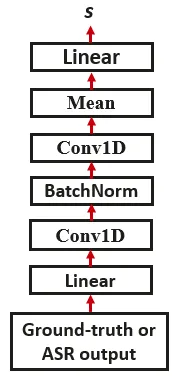
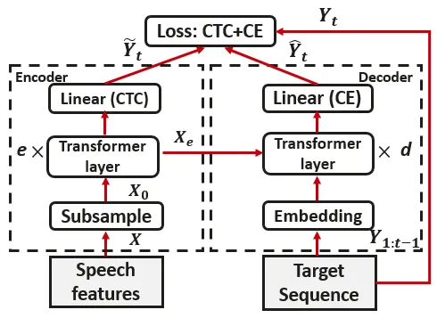
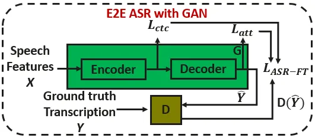

# Fine-tuning of Pre-trained End-to-end Speech Recognition with Generative Adversarial Networks

Md. Akmal Haidar    Mehdi Rezagholizadeh

###### Abstract

Adversarial training of end-to-end (E2E) ASR systems using generative
adversarial networks (GAN) has recently been explored for low-resource
ASR corpora. GANs help to learn the true data representation through a
two-player min-max game. However, training an E2E ASR model using a
large ASR corpus with a GAN framework has never been explored, because
it might take excessively long time due to high-variance gradient
updates and face convergence issues. In this paper, we introduce a novel
framework for fine-tuning a pre-trained ASR model using the GAN
objective where the ASR model acts as a generator and a discriminator
tries to distinguish the ASR output from the real data. Since the ASR
model is pre-trained, we hypothesize that the ASR model output (soft
distribution vectors) helps to get higher scores from the discriminator
and makes the task of the discriminator harder within our GAN framework,
which in turn improves the performance of the ASR model in the
fine-tuning stage. Here, the pre-trained ASR model is fine-tuned
adversarially against the discriminator using an additional adversarial
loss. Experiments on full LibriSpeech dataset show that our proposed
approach outperforms baselines and conventional GAN-based adversarial
models.

###### Index Terms: 

automatic speech recognition, sequence-to-sequence, transformer,
generative adversarial networks, adversarial training

^(†)^(†)address: Huawei Noah’s Ark Lab, Montreal Research Centre,
Canada  
{md.akmal.haidar, mehdi.rezagholizadeh}@huawei.com

## 1 Introduction

End-to-end (E2E) automatic speech recognition (ASR) systems map speech
acoustic signal to text transcription by using a single
sequence-to-sequence neural model without decomposing the problem into
different parts such as lexicon modeling, acoustic modeling and language
modeling as in traditional ASR architectures \[1\]. It has received a
lot of attention because of its simple training and inference procedures
over traditional HMM-based systems which require a hand-crafted
pronunciation dictionary and a complex decoding system using a finite
state transducer (FST) \[2\]. One of the earliest E2E ASR model is the
connectionist temporal classification (CTC) \[3\] model which
independently maps acoustic frames into outputs. To get better results
with CTC, the CTC output needs to be rescored with language
models \[4\]. The conditional independence assumption in CTC was tackled
by recurrent neural network transducer (RNNT) model \[5, 6\] which
showed better performance for streaming. Attention based encoder-decoder
networks yield state-of-the-art results for offline ASR model \[7, 8,
9\]. These networks are trained by using sequence-to-sequence and/or CTC
losses to learn the true data distribution.

Generative adversarial networks (GAN) \[10\] provides another way to
learn the true data distribution in a minimax game using two networks:
generator and discriminator. A generator generates labels while the
discriminator tries to distinguish the true labels from the generated
ones. The generator learns from the discriminator via adversarial loss
to model the true data distribution. However, the adversarial training
using GAN requires a large number of training samples and epochs to
converge \[11\]. This might be because the gradients from the
discriminator to update the generator often vanish or explode during the
adversarial training \[12\].

GANs have been recently explored for robust ASR which showed that
inducing invariance at the encoder embedding level improves the
recognition of simulated far-field speech recognition \[13\]. GANs have
been investigated extensively for speech enhancement \[14, 15\], speech
dereverberation \[16\]. In \[17\], an accent-invariant pre-training
network was trained using GAN for E2E ASR. In \[18\], a non-parallel
voice conversion approach with CycleGAN for speaker adaptation was
proposed to improve the ASR performance. Adversarial training for E2E
ASR using GAN has recently studied using a low-resource paired ASR
corpus with un-paired speech and text corpora \[19, 20\]. In \[20\],
non-parallel speech and text corpora was used to learn a semi-supervised
ASR model using adversarial training. In \[19\], adversarial training
was employed for a small paired speech corpus (LibriSpeech 100 hours)
and also incorporated unpaired text data to better utilize additional
text data and avoid the use of a separately trained language model.
However, adversarial training using GANs has been never explored for
large paired speech corpora.

In this work, we investigate adversarial training of ASR using GANs for
a large paired speech corpus (LibriSpeech 960 hours). Since adversarial
training requires large number of training epochs due to high variance
gradient updates \[11, 12\], in this work, we utilize the GAN objective
for fine-tuning an E2E ASR model, which is pre-trained with a large
paired speech corpus. First, the ASR network is trained to learn the
true data distribution using cross-entropy and CTC losses \[9\]. After
pre-training, the ASR model would give a smoother soft output
representation which can help in training a stronger discriminator to
improve the performance of the ASR model (generator). We perform
extensive experiments using the full librispeech corpus and show that
our fine-tuning approach using GAN outperforms baselines and
conventional adversarial training of E2E ASR without pre-training.

## 2 Proposed Approach

### 2.1 Adversarial Training

In the adversarial training of end-to-end ASR model, the ASR model acts
as a generator conditioned on the speech signal and predicts the
corresponding transcription. The discriminator tries to distinguish the
real (ground-truth) transcriptions from the ASR output transcriptions.
It learns to give higher scores to real texts and lower score to the ASR
transcriptions during training. In this paper, we apply adversarial
training to fine-tuining a pre-trained E2E ASR model, which is trained
using sequence-to-sequence (s2s) and CTC losses. During fine-tuning the
ASR model, the discriminator parameters are fixed and the ASR model is
trained by an additional adversarial loss and generate ASR
transcriptions to fool the discriminator (i.e., they can get higher
score from the discriminator). The ASR model and the discriminator are
trained alternately and learn from each other step by step. The
algorithm for the adversarial fine-tuning of a pre-trained ASR model is
described in Algorithm 1. In the following subsections, we describe the
discriminator and the ASR network architectures. Then, we describe the
fine-tuning of the ASR model using GAN.

### 2.2 Discriminator Network

The input to the discriminator (D) network is either the ground-truth
(one-hot vectors) or the ASR output transcriptions (soft distribution
vectors) and it returns a scalar $`\mathchar 29043`$ as a quality score.
An example discriminator network that we use in our experiments is
depicted in Fig. 1. The real text $`\mathchar 29017`$ or the ASR output
$`\hat{\mathchar 29017}`$ is first mapped to a lower dimension 128 by
using a linear transformation. Then, two one-dimensional convolutional
neural network (Conv1D) layers with
$`\mathchar 28721\mathchar 28722\mathchar 28728`$ kernels, kernel size
$`\mathchar 28722\mathchar 8706\mathchar 28721`$, and stride
$`\mathchar 28721`$ are applied to extract the features for each time
index. Batch normalization is applied between layers. Finally, the mean
feature is calculated over the time axis which is then mapped to a
single scalar valuse $`\mathchar 29043`$ with linear projections \[19\].

To train the discriminator, we incorporate an improved version of
Wasserstein GAN (WGAN) approach \[21\] with gradient penalty
(gp) \[22\]. Here, the discriminator is designed to estimate the
Earth-Mover (Wasserstein-1) \[23\] distance between the ground-truth
transcriptions and the ASR output transcriptions. The loss function of
the discriminator can be defined as \[19\]:

```math
\mathchar 29004_{\mathchar 28996}\mathchar 12349\mathchar 28949_{\mathchar 29028}\delimiter 67273472\underset{\hat{\mathchar 29017}\mathchar 12824\mathchar 29008_{\mathchar 28946}}{\mathchar 28997}\delimiter 67482370\mathchar 28996\delimiter 67273472\hat{\mathchar 29017}\delimiter 84054785\delimiter 84267779\mathchar 8704\underset{\mathchar 29017\mathchar 12824\mathchar 29008_{\mathchar 29042}}{\mathchar 28997}\delimiter 67482370\mathchar 28996\delimiter 67273472\mathchar 29017\delimiter 84054785\delimiter 84267779\delimiter 84054785\mathchar 8235\mathchar 28949_{\mathchar 29031\mathchar 29040}\mathchar 29031\mathchar 29040 \tag{1}
```

where, $`\mathchar 28949_{\mathchar 29028}`$ and
$`\mathchar 28949_{\mathchar 29031\mathchar 29040}`$ are weights.
$`\mathchar 28996\delimiter 67273472\hat{\mathchar 29017}\delimiter 84054785`$
is the scalar output of the discriminator for ASR output
$`\hat{\mathchar 29017}`$. $`\mathchar 29008_{\mathchar 28946}`$ and
$`\mathchar 29008_{\mathchar 29042}`$ are the distributions for the ASR
output and ground-truth (real) transcriptions respectively. For the
gradient penalty $`\mathchar 29031\mathchar 29040`$ term, we need to
calculate the gradient norm of random samples
$`\bar{\mathchar 29017}\mathchar 12824\mathchar 29008_{\bar{\mathchar 29017}}`$.
gp is calculated as following \[22\]:

```math
\mathchar 29031\mathchar 29040\mathchar 12349\underset{\bar{\mathchar 29017}\mathchar 12824\mathchar 29008_{\bar{\mathchar 29017}}}{\mathchar 28997}\delimiter 67482370\delimiter 67273472\delimiter 69640972\delimiter 69640972\mathchar 626_{\bar{\mathchar 29017}}\mathchar 28996\delimiter 67273472\bar{\mathchar 29017}\delimiter 84054785\delimiter 69640972\delimiter 69640972_{\mathchar 28722}\mathchar 8704\mathchar 28721\delimiter 84054785^{\mathchar 28722}\delimiter 84267779\\
 \tag{2}
```

where $`\bar{\mathchar 29017}`$ are random samples which can be obtained
by sampling uniformly along the line connecting pairs of
$`\hat{\mathchar 29017}`$ and $`\mathchar 29017`$ samples:

```math
\delimiter 67482370\bar{\mathchar 29017}\mathchar 12824\mathchar 29008_{\bar{\mathchar 29017}}\delimiter 84267779\mathchar 12832\mathchar 28941~\delimiter 67482370\mathchar 29017\mathchar 12824\mathchar 29008_{\mathchar 29042}\delimiter 84267779\mathchar 8235\delimiter 67273472\mathchar 28721\mathchar 8704\mathchar 28941\delimiter 84054785~\delimiter 67482370\hat{\mathchar 29017}\mathchar 12824\mathchar 29008_{\mathchar 28946}\delimiter 84267779 \tag{3}
```

where
$`\mathchar 28941\mathchar 12824\mathchar 29013\delimiter 67482370\mathchar 28720\mathchar 24891\mathchar 28721\delimiter 84267779`$ \[22\].



Figure 1: Discriminator Network

### 2.3 ASR Architecture

Our proposed approach can be applied to any type of ASR network
architecture. In this paper, we use a transformer-based ASR network with
joint CTC and attention \[9, 8\]. A schematic of the ASR model is shown
in Fig. 2. Given an input sequence $`\mathchar 29016`$ of log-mel
filterbank speech features, Transformer predicts a target sequence
$`\hat{\mathchar 29017}`$ of characters or SentencePiece \[24\]. In
Fig. 2, the subsample block transforms the source sequence
$`\mathchar 29016`$ into a subsampled sequence
$`\mathchar 29016_{\mathchar 28720}\mathchar 12850\mathchar 29010^{\mathchar 29038_{\mathchar 29043\mathchar 29045\mathchar 29026}\mathchar 8706\mathchar 29028_{\mathchar 29025\mathchar 29044\mathchar 29044}}`$
by using a two-layer convolution neural network (CNN) block \[9, 25\].
Here,
$`\mathchar 29038_{\mathchar 29043\mathchar 29045\mathchar 29026}`$ is
the length of the subsampled sequence and
$`\mathchar 29028_{\mathchar 29025\mathchar 29044\mathchar 29044}`$ is
the dimensions of the features \[9\]. Both CNN layers use a stride of
size 2, a kernel size of 3 × 3, and a ReLU activation function. Thus,
the striding reduces the frame rate of output sequence
$`\mathchar 29016_{\mathchar 28720}`$ by a factor of 4 compared to the
feature frame rate of $`\mathchar 29016`$ \[25\]. Then, it is followed
by a stack of $`\mathchar 29029`$ transformer layers that transform
$`\mathchar 29016_{\mathchar 28720}`$ into a sequence of encoded
features
$`\mathchar 29016_{\mathchar 29029}\mathchar 12850\mathchar 29010^{\mathchar 29038_{\mathchar 29043\mathchar 29045\mathchar 29026}\mathchar 8706\mathchar 29028_{\mathchar 29025\mathchar 29044\mathchar 29044}}`$
for the CTC and decoder networks \[9\]. The encoder transformer layers
iteratively refine the representation of the input sequence with a
combination of multi-head ($`\mathchar 29032`$) self-attention (MHA) and
position-wise feed forward networks (FFN) with dimensions
$`\mathchar 29028_{\mathchar 29030\mathchar 29030}`$.



Figure 2: ASR Model Architecture

The decoder generates a transcription sequence
$`\mathchar 29017\mathchar 12349\delimiter 67273472\mathchar 29017_{\mathchar 28721}\mathchar 24891\mathchar 314\mathchar 314\mathchar 314\mathchar 24891\mathchar 29017_{\mathchar 29044}\delimiter 84054785`$
one token at a time. Each choice of output token
$`\mathchar 29017_{\mathchar 29044}`$ is conditioned on the encoder
representations $`\mathchar 29016_{\mathchar 29029}`$ and previously
generated tokens
$`\delimiter 67273472\mathchar 29017_{\mathchar 28721}\mathchar 24891\mathchar 314\mathchar 314\mathchar 314\mathchar 24891\mathchar 29017_{\mathchar 29044\mathchar 8704\mathchar 28721}\delimiter 84054785`$
through attention mechanisms. Each decoder layer performs two rounds of
multi-head attention: the first one being self-attention over the
representations of previously emitted tokens, and the second being
attention over the output of the final layer of the encoder. The
multi-head attention is then followed by the position-wise FFN \[9\].
For the decoder input
$`\mathchar 29017_{\mathchar 28721\mathchar 12346\mathchar 29044\mathchar 8704\mathchar 28721}`$,
we use ground-truth labels in the training stage, while we use generated
outputs in the decoding stage. The output of the final decoder layer for
the token
$`\mathchar 29017_{\mathchar 29044\mathchar 8704\mathchar 28721}`$ is
used to predict the following token
$`\mathchar 29017_{\mathchar 29044}`$. The details of the MHA, FFN, and
other components of the architecture such as sinusoidal positional
encodings, residual connections and layer normalization are described
in \[26, 9\]. The positional encodings are applied into
$`\mathchar 29016_{\mathchar 28720}`$ and
$`\mathchar 29017_{\mathchar 28720}`$ when convolutional 2d subsampling
was used \[9, 25\].

During ASR training, the frame-wise posterior distribution of
$`\mathchar 29008_{\mathchar 29043\mathchar 28722\mathchar 29043}\delimiter 67273472\hat{\mathchar 29017}\delimiter 69640972\mathchar 29016\delimiter 84054785`$
and
$`\mathchar 29008_{\mathchar 29027\mathchar 29044\mathchar 29027}\delimiter 67273472\tilde{\mathchar 29017}\delimiter 69640972\mathchar 29016\delimiter 84054785`$
are predicted by the decoder and the CTC module respectively. Bear in
mind that the discriminator takes only $`\hat{\mathchar 29017}`$ as
input. The ASR model is trained by minimizing the loss function \[9\]:

```math
\mathchar 29004_{\mathchar 28993\mathchar 29011\mathchar 29010}\mathchar 12349\mathchar 29004_{\mathchar 29043\mathchar 28722\mathchar 29043}\mathchar 8235\mathchar 29004_{\mathchar 29027\mathchar 29044\mathchar 29027} \tag{4}
```

where
$`\mathchar 29004_{\mathchar 29043\mathchar 28722\mathchar 29043}\mathchar 12349\mathchar 8704\delimiter 67273472\mathchar 28721\mathchar 8704\mathchar 28939\delimiter 84054785\log\mathchar 29008_{\mathchar 29043\mathchar 28722\mathchar 29043}\delimiter 67273472\hat{\mathchar 29017}\delimiter 69640972\mathchar 29016\delimiter 84054785`$,
$`\mathchar 29004_{\mathchar 29027\mathchar 29044\mathchar 29027}\mathchar 12349\mathchar 8704\mathchar 28939\log\mathchar 29008_{\mathchar 29027\mathchar 29044\mathchar 29027}\delimiter 67273472\tilde{\mathchar 29017}\delimiter 69640972\mathchar 29016\delimiter 84054785`$,
and $`\mathchar 28939`$ is a hyperparameter. In the decoding stage,
given the speech feature $`\mathchar 29016`$ and the previous predicted
token, the next token is predicted using beam search, which combines the
scores of the sequence-to-sequence (s2s) and CTC with/ without language
model score following \[9\].

### 2.4 Fine-tuning ASR Model Using GAN

The schematic of the adversarial fine-tuning using GAN is shown in
Fig. 3. In this figure, the encoder-decoder architecture is a
pre-trained ASR model which acts as a generator ($`\mathchar 28999`$).
The discriminator $`\mathchar 28996`$ tries to distinguish the ASR
transcriptions from ground-truth transcriptions. Since the ASR model is
pre-trained, the discriminator cannot easily discriminate these two
transcriptions, which will help to train a stronger discriminator. The
discriminator and the generator (ASR model) are trained alternately. The
discriminator is trained by minimizing the loss function
$`\mathchar 29004_{\mathchar 28996}`$ described in section 2.2. The loss
function for fine-tuning the ASR model can be described
following \[19\]:

```math
\mathchar 29004_{\mathchar 28993\mathchar 29011\mathchar 29010\mathchar 8704\mathchar 28998\mathchar 29012}\mathchar 12349\mathchar 29004_{\mathchar 29043\mathchar 28722\mathchar 29043}\mathchar 8235\mathchar 29004_{\mathchar 29027\mathchar 29044\mathchar 29027}\mathchar 8704\mathchar 28949_{\mathchar 29028}\mathchar 28996\delimiter 67273472\hat{\mathchar 29017}\delimiter 84054785 \tag{5}
```

where
$`\mathchar 29004_{\mathchar 29043\mathchar 28722\mathchar 29043}`$ and
$`\mathchar 29004_{\mathchar 29027\mathchar 29044\mathchar 29027}`$ are
the sequence-to-sequence and the CTC losses respectively. The term
$`\mathchar 8704\mathchar 28949_{\mathchar 29028}\mathchar 28996\delimiter 67273472\hat{\mathchar 29017}\delimiter 84054785`$
represents the adversarial loss which helps the ASR model to get the
high quality score from the discriminator. The fine-tuning procedure
using adversarial training is explained in Algorithm 1.



Figure 3: Fine-tuning E2E ASR with GAN

1: The Adam hyperparameters $`\mathchar 28939_{\mathchar 29036}`$,
$`\mathchar 28940_{\mathchar 28721}`$,
$`\mathchar 28940_{\mathchar 28722}`$,
$`\mathchar 28943\mathchar 24891`$batch size $`\mathchar 29037`$,
pre-trained ASR model parameters $`\mathchar 28946`$, and initial
discriminator parameters $`\mathchar 29047_{\mathchar 28720}`$

2: for number of training epochs do

3:   for number of training iterations do

4:    Sample labels
$`\{\mathchar 29017^{\delimiter 67273472\mathchar 29033\delimiter 84054785}\}_{\mathchar 29033\mathchar 12349\mathchar 28721}^{\mathchar 29037}\mathchar 12824\mathchar 29008_{\mathchar 29042}`$
and speech input

5:      features
$`\{\mathchar 29016^{\delimiter 67273472\mathchar 29033\delimiter 84054785}\}_{\mathchar 29033\mathchar 12349\mathchar 28721}^{\mathchar 29037}\mathchar 12824\mathchar 29008_{\mathchar 29016}`$.

6:     predict ASR transcriptions
$`\{\hat{\mathchar 29017}^{\delimiter 67273472\mathchar 29033\delimiter 84054785}\}_{\mathchar 29033\mathchar 12349\mathchar 28721}^{\mathchar 29037}\mathchar 12824\mathchar 29008_{\mathchar 28946}`$.

7:     Train the discriminator:

8:      Backpropagate discriminator loss
$`\mathchar 29004_{\mathchar 28996}\delimiter 67273472\mathchar 29047\delimiter 84054785`$
.

9:     Update with
$`\mathchar 29047\mathchar 12832\mathchar 28993\mathchar 29028\mathchar 29025\mathchar 29037\delimiter 67273472\mathchar 29004_{\mathchar 28996}\delimiter 67273472\mathchar 29047\delimiter 84054785\mathchar 24891\mathchar 28939_{\mathchar 29036}\mathchar 24891\mathchar 28940_{\mathchar 28721}\mathchar 24891\mathchar 28940_{\mathchar 28722}\mathchar 24891\mathchar 28943\delimiter 84054785`$.

10:     Fine-tune the ASR Model:

11:      Backpropagate ASR loss
$`\mathchar 29004_{\mathchar 28993\mathchar 29011\mathchar 29012\mathchar 8704\mathchar 28998\mathchar 29012}\delimiter 67273472\mathchar 28946\delimiter 84054785`$.

12:      Update with
$`\mathchar 28946\mathchar 12832\mathchar 28993\mathchar 29028\mathchar 29025\mathchar 29037\delimiter 67273472\mathchar 29004_{\mathchar 28993\mathchar 29011\mathchar 29010\mathchar 8704\mathchar 28998\mathchar 29012}\delimiter 67273472\mathchar 28946\delimiter 84054785\mathchar 24891\mathchar 28939_{\mathchar 29036}\mathchar 24891\mathchar 28940_{\mathchar 28721}\mathchar 24891\mathchar 28940_{\mathchar 28722}\mathchar 24891\mathchar 28943\delimiter 84054785`$.
  end for end for

Algorithm 1 Adversarial training for fine-tuning a pretrained ASR Model

## 3 Experiments

### 3.1 Data and Setup

We use the open-source, ESPNet toolkit \[27\] for our experiments. We
conduct our experiments on LibriSpeech dataset \[28\], which is a speech
corpus of reading English audio books. It has 960 hours of training
data, 10.7 hours of development data, and 10.5 hours of test data,
whereby the development and the test data sets are both split into
approximately two halves named “clean” and “other”. To extract the input
features for speech, we follow the same setup as in \[27, 9\]: using
83-dimensional log-Mel filterbanks frames with pitch features \[9, 25\].
The output tokens come from a 5K sub-word vocabulary created with
sentencepiece \[24\]“unigram” \[27\]. We perform experiments on two
settings: small
($`\mathchar 29029\mathchar 12349\mathchar 28721\mathchar 28722\mathchar 24891\mathchar 29028\mathchar 12349\mathchar 28726\mathchar 24891\mathchar 29028_{\mathchar 29030\mathchar 29030}\mathchar 12349\mathchar 28722\mathchar 28720\mathchar 28724\mathchar 28728\mathchar 24891\mathchar 29028_{\mathchar 29025\mathchar 29044\mathchar 29044}\mathchar 12349\mathchar 28722\mathchar 28725\mathchar 28726\mathchar 24891\mathchar 29032\mathchar 12349\mathchar 28724`$)
with around 30 M model parameters and large
($`\mathchar 29029\mathchar 12349\mathchar 28721\mathchar 28722\mathchar 24891\mathchar 29028\mathchar 12349\mathchar 28726\mathchar 24891\mathchar 29028_{\mathchar 29030\mathchar 29030}\mathchar 12349\mathchar 28722\mathchar 28720\mathchar 28724\mathchar 28728\mathchar 24891\mathchar 29028_{\mathchar 29025\mathchar 29044\mathchar 29044}\mathchar 12349\mathchar 28725\mathchar 28721\mathchar 28722\mathchar 24891\mathchar 29032\mathchar 12349\mathchar 28728`$)
with around 75 M model parameters. We apply default settings of
SpecAugmentation \[29\] of ESPnet \[27\]. For small settings, we use
batch size of 140, and gradient accumulation of 2. For large settings,
we use batch size of 100 and gradient accumulation of 4 \[27\]. All the
experiments were run on 4 Tesla V100 gpus. We use Adam optimizer with
learning rate scheduling similar to \[26, 27\] and other settings (e.g.,
dropout, warmup steps, $`\mathchar 28939`$, learning rate, label
smoothing penalty \[29\]) following \[25, 27\]. We train the baseline
experiments with small and large settings for 100 and 120 epochs
respectively \[27\]. We average the best five checkpoints as the final
model and report results based on it. For decoding, the CTC weight, the
LM weight and beam size are 0.5, 0.7 and 20 respectively for the small
settings, and 0.4, 0.6, and 30 for the large setup \[25\].

For adversarial fine-tuning with GAN experiments, we use our trained
best average model for initialization and then train within GAN
framework for 50 epochs with the Adam optimizer with fixed parameters of
$`\mathchar 28939_{\mathchar 29036}\mathchar 12349\mathchar 28720\mathchar 314\mathchar 28720\mathchar 28720\mathchar 28720\mathchar 28721`$,
$`\mathchar 28940_{\mathchar 28721}\mathchar 12349\mathchar 28720\mathchar 314\mathchar 28725`$,
$`\mathchar 28940_{\mathchar 28722}\mathchar 12349\mathchar 314\mathchar 28729\mathchar 28728`$,
$`\mathchar 28943\mathchar 12349\mathchar 28721\mathchar 28720^{\mathchar 8704\mathchar 28729}`$ \[27\].
We set
$`\mathchar 28949_{\mathchar 29031\mathchar 29040}\mathchar 12349\mathchar 28721\mathchar 28720`$,
$`\mathchar 28939\mathchar 12349\mathchar 28720\mathchar 314\mathchar 28723`$,
and
$`\mathchar 28949_{\mathchar 29028}\mathchar 12349\mathchar 28720\mathchar 314\mathchar 28720\mathchar 28720\mathchar 28720\mathchar 28721`$
as the discriminator output value $`\mathchar 29043`$ was usually higher
than other loss values \[19\]. For our proposed fine-tuning experiments,
we see that the CTC weight of 0.4 and insertion penalty of 2 give better
results with LM fusion over the baseline models for both small and large
settings. For LM fusion \[30\], we use a pretrained Transformer LM for
decoding¹¹ 1
[https://github.com/espnet/espnet/blob/master/egs/librispeech/asr1/RESULTS.md](https://github.com/espnet/espnet/blob/master/egs/librispeech/asr1/RESULTS.md).

|                                |       |       |       |       |
| ------------------------------ | ----- | ----- | ----- | ----- |
| Model                          | Test  | Test  | Dev   | Dev   |
|                                | Clean | Other | Clean | Other |
| Hybrid Transformer+LM \[31\]   | 2.26  | 4.85  | -     | -     |
| RWTH+LM \[32\]                 | 2.3   | 5.0   | 1.9   | 4.5   |
| Baseline (L)+LM  \[25\]        | 2.7   | 6.1   | 2.4   | 6.0   |
| ESPNet Transformer+LM  \[9\]   | 2.6   | 5.7   | 2.2   | 5.6   |
| LAS+LM \[29\]                  | 3.2   | 9.8   | -     | -     |
| LAS+SpecAugment+LM \[29\]      | 2.5   | 5.8   | -     | -     |
| Transformer+LM \[33\]          | 2.33  | 5.17  | 2.10  | 4.79  |
| Semantic Mask (L)  \[34\]      | 3.04  | 7.43  | 2.93  | 7.75  |
| + LM, Speed P., Rescore \[34\] | 2.24  | 5.12  | 2.05  | 5.01  |
| Baseline (Ours)                |       |       |       |       |
| Transformer (S)                | 3.4   | 8.3   | 3.2   | 8.5   |
|      + LM                      | 2.3   | 5.2   | 2.0   | 5.1   |
| Transfomrer (L)                | 3.0   | 7.3   | 2.8   | 7.2   |
|      + LM                      | 2.1   | 5.0   | 2.0   | 4.8   |
| E2E ASR with GAN               |       |       |       |       |
| Transformer (S)+GAN            | 4.5   | 11.1  | 4.3   | 11.4  |
|      + LM                      | 2.6   | 5.6   | 2.3   | 5.4   |
| Transformer (S)+FTGAN          | 3.3   | 7.9   | 3.2   | 8.2   |
|      + LM                      | 2.2   | 4.7   | 1.9   | 4.7   |
| Transformer (L) +FTGAN         | 2.9   | 7.1   | 2.7   | 7.2   |
|      + LM                      | 2.1   | 4.9   | 1.9   | 4.7   |

Table 1: WER results for E2E ASR models. (S) and (L) denote the small
and the large settings respectively. +FTGAN represents the fine-tuning
of pre-trained ASR model using GAN and +GAN describes the ASR model
trained using GAN without pre-training ASR model.

| 1         | 2         | 3         | 4         | 5         |
| --------- | --------- | --------- | --------- | --------- |
| 0.9446827 | 0.9444502 | 0.9440999 | 0.9434293 | 0.9419135 |
| 0.9497483 | 0.9489650 | 0.9485720 | 0.9475869 | 0.9473457 |
| 0.9277521 | 0.9244638 | 0.9241905 | 0.9235519 | 0.9225379 |
| 0.9504781 | 0.9504015 | 0.9499697 | 0.9498766 | 0.9498552 |
| 0.9535346 | 0.9535285 | 0.9535092 | 0.9531790 | 0.9531746 |

Table 2: Rows 2-6 represent the best five validation accuracy for the
Transformer (S), Transformer (L), Transformer (S)+GAN, Transformer
(S)+FTGAN, and Transformer (L)+FTGAN models respectively

### 3.2 Results

We show all of our experimental results in Table 1. From Table 1, we
observe that our proposed fine-tuning approach of pre-trained ASR model
using GAN (Transformer (S/L)+FTGAN) outperforms our baselines for both
small (S) and large (L) models. Also, they show better results over RNN
and other transformer-based models \[29, 9, 25, 33, 31\]. Our large
baseline model gives better test-clean and test-other WER results than
the reported results in the ESPNET Github repository²² 2
[https://github.com/espnet/espnet/blob/master/egs/librispeech/asr1/RESULTS.md](https://github.com/espnet/espnet/blob/master/egs/librispeech/asr1/RESULTS.md).
Also, our large baseline model outperforms a very recent work with
semantic masking technique for transformer ASR \[34\]. With LM fusion,
our proposed fine-tuning approach gives the best results for both small
and large settings. Our best WER results with LM fusion are 2.1%, 4.7%,
1.9% and 4.7% for the test-clean, test-other, dev-clean and dev-other
respectively. Moreover, we perform an experiment using small settings
for adversarial training using GAN (Transformer (S)+GAN) without
pre-training the ASR model to compare it with our fine-tuning approach.
We train this model for 150 epochs to make equivalent number of epochs
with our proposed approach (100 epochs for pre-training and 50 epochs
for fine-tuning). Unlike \[19\], we see the performance drops over the
baseline model. This might be because of adversarial training requires
larger number of training epochs for large number of training
samples \[11\], high-variance gradient update from the discriminator and
also the use of SpecAugmentation \[29\]. On the other hand, our proposed
fine-tuning approach using GAN can outperform the baseline model since
we provide ASR output from a pre-trained ASR as an input to the
discriminator which makes it harder for the discriminator to distinguish
with the real data. Thus, the ASR model can further learn using the
proposed fine-tuning approach by getting feedback from the discriminator
through the adversarial loss.

Moreover, we report the best five validation accuracy for the trained
models in Table 2. We observe that our proposed fine-tuning approach
using GAN (Transformer (S/L)+FTGAN) gives better validation accuracy for
both small and large settings over the baseline models. Also, we note
that adversarial training without pre-training ASR (Transformer (S)+GAN)
yields worst validation accuracy compared to the baseline model for the
same reasons mentioned above.

## 4 RELATION TO PRIOR WORK

Attention-based encoder-decoder architectures for end-to-end ASR models
have shown great success in the recent literature \[7, 29, 9\].
Transformer architecture for end-to-end ASR has been explored
extensively \[9, 8\] with employing convolution sub-sampling in the
encoder pre-processing for efficient self-attention in the encoder.
 \[9\] focuses on multi-task learning with CTC, and show that
transformer-based end-to-end ASR is highly competitive with RNN-based
methods. In \[34\], a semantic mask based regularization method was
introduced for transformer-based ASR to force the decoder to learn a
better language model. A hybrid transformer model with deep layers and
iterated loss was introduced in \[31\]. In \[33\], a semi-supervised
learning with pseudo-labeling using transformer-based acoustic model was
introduced. In \[20\], a semi-supervised ASR model was developed using
adversarial training with paired low-resource corpus and non-parallel
speech and text corpora. An unbalanced GAN was proposed for computer
vision task in \[35\], where a variational auto-encoder (VAE) is trained
first and then the weights of the decoder of the VAE is transferred as a
pre-trained generator for the GAN training. In contrast, we don’t use
any external networks to pre-train our generator. Our ASR model is
trained first and act as a generator for fine-tuning using adversarial
approach. In \[19\], adversarial training for end-to-end ASR without
pre-training was explored for small paired corpus with un-paired text
data. In this work, we explored adversarial training of E2E ASR models
using a large corpus without and with pre-training. We showed that, our
proposed fine-tuning of pre-trained E2E ASR model using adversarial
training approach outperforms the conventional adversarial training
without pre-training \[19\].

## 5 Conclusion and Future Work

GAN-based adversarial training of end-to-end (E2E) ASR systems has
explored recently for low-resource ASR corpora. Adversarial training of
E2E ASR model using large ASR corpus with GAN framework may take
excessively long time due to high-variance gradient updates. In this
work, we proposed a fine-tuning approach of pre-trained ASR models with
GAN-based adversarial training, where the ASR model acts as a generator
and a discriminator tries to distinguish the ASR output transcriptions
from the real data. As the ASR model is pre-trained, the discriminator
cannot easily distinguish the ASR output from the real data which helps
in training a stronger discriminator, which in turn improves the
performance of the ASR model during fine-tuning. The ASR model is
trained with an additional adversarial loss against the discriminator
and it learned so that it can fool the discriminator to reach the GAN
equilibrium. Also, we run experiments for conventional adversarial
training of E2E ASR in the GAN framework without pre-training an ASR
model. Experiments on full LibriSpeech dataset showed that our proposed
fine-tuning approach of pre-trained E2E ASR model outperforms the
baseline and conventional adversarial training using GAN. For future
work, we will apply VGG-like convolution sub-sampling \[34\] for further
performance improvement.

## References

- \[1\] D. Povey, V. Peddinti, D. Galvez, P. Ghahremani, V. Manohar,
  X. Na, Y. Wang, and S. Khudanpur, “Purely sequence-trained neural
  networks for asr based on lattice-free mmi,” in Interspeech, 2016.
- \[2\] M. Mohri, F. Pereira, and M. Riley, “Speech recognition with
  weighted finite-state transducers,” Springer Handbook of Speech
  Processing, 2008.
- \[3\] A. Graves, S. Fernández, F. Gomez, and J. Schmidhuber,
  “Connectionist temporal classification: labelling unsegmented sequence
  data with recurrent neural networks,” in ICML, 2006.
- \[4\] A. Graves and N. Jaitly, “Towards end-to-end speech recognition
  with recurrent neural networks,” in ICML, 2014.
- \[5\] A. Graves, “Sequence transduction with recurrent neural
  networks,” arXiv preprint arXiv:1211.3711, 2012.
- \[6\] Y. He, T. N. Sainath, R. Prabhavalkar, I. Mcgraw, R. Alvarez,
  D. Zhao, D. Rybach, Y. Kannan, A. Wu, and R et al. Pang, “Streaming
  end-to-end speech recognition for mobile devices.,” in ICASSP, 2019.
- \[7\] W. Chan, N. Jaitly, Q. Le, and O. Vinyals, “Listen, attend and
  spell: A neural network for large vocabulary conversational speech
  recognition,” in ICASSP, 2016.
- \[8\] S. Karita, N. E. Y. Soplin, S. Watanabe, M. Delcroix, A. Ogawa,
  and T. Nakatani, “Improving transformer-based end-to-end speech
  recognition with connectionist temporal classification and language
  model integration,” in Interspeech, 2019.
- \[9\] S. Karita, N. Chen, T. Hayashi, T. Hori, K. Inaguma, Z. Jiang,
  M. Someki, N. E. Y. Soplin, R. Yamamoto, X. Wang, S. Watanabe,
  T. Yoshimura, and W. Zhang, “A comparative study on transformer vs rnn
  in speech applications,” in ASRU Workshop, 2019.
- \[10\] Ian Goodfellow, Jean Pouget-Abadie, Mehdi Mirza, Bing Xu, David
  Warde-Farley, Sherjil Ozair, Aaron Courville, and Yoshua Bengio,
  “Generative adversarial nets,” in NeurIPS, 2014, pp. 2672–2680.
- \[11\] S. Feizi, C. Suh, F. Xia, and D. Tse, “Understanding gans: the
  lqg setting,” arXiv preprint arXiv:1710.10793, 2017.
- \[12\] M. Arjovsky and L. Bottou, “Towards principled methods for
  training generative adversarial networks.,” in ICLR, 2017.
- \[13\] A. Sriram, H. Jun, Y. Gaur, and S. Satheesh, “Robust speech
  recognition using gans,” in ICASSP, 2018.
- \[14\] S. Pascual, A. Bonafonte, and J. Serra, “Segan: speech
  enhancement generative adversarial network,” in Interspeech, 2017.
- \[15\] A. Pandey and D. Wang, “On adversarial training and loss
  functions for speech enhancement,” in ICASSP, 2018.
- \[16\] Ke. Wang, J. Zhang, S. Sun, Y. Wang, F. Xiang, and L. Xie,
  “Investigating generative adversarial networks based speech
  dereverberation for robust speech recognition,” arXiv preprint
  arXiv:1803.10132, 2018.
- \[17\] Y-C. Chen, Z. Yang, C-F. Yeh, M. Jain, and M. L. Seltzer,
  “Aipnet: Generative adversarial pre-training of accent-invariant
  networks for end-to-end speech recognition,” arXiv preprint
  arXiv:1911.11935, 2019.
- \[18\] K. Matsuura, M. Mimura, S. Sakai, and T. Kawahara, “Generative
  adversarial training data adaptation for very low-resource automatic
  speech recognition,” arXiv preprint arXiv:2005.09256, 2020.
- \[19\] A. H. Liu, H-Y. Lee, and L-S. Lee, “Adversarial training of
  end-to-end speech recognition using a criticizing language model,” in
  ICASSP, 2019.
- \[20\] J. Drexler and J. Glass, “Combining end-to-end and adversarial
  training for low-resource speech recognition,” in SLT Workshop, 2018.
- \[21\] M. Arjovsky, S. Chintala, and L. Bottou, “Wasserstein
  generative adversarial networks,” in ICML, 2017.
- \[22\] Ishaan Gulrajani, Faruk Ahmed, Martin Arjovsky, Vincent
  Dumoulin, and Aaron Courville, “Improved training of wasserstein
  gans,” arXiv preprint arXiv:1704.00028, 2017.
- \[23\] C. Villani, “Optimal transport: old and new,” Springer Science
  and Business Media, 2008.
- \[24\] T. Kudo and J. Richardson, “Sentencepiece: A simple and
  language independent subword tokenizer and detokenizer for neural text
  processing,” arXiv preprint arXiv:1808.06226, 2018.
- \[25\] N. Moritz, T. Hori, and J. L. Roux, “Streaming automatic speech
  recognition with the transformer model,” in ICASSP, 2020.
- \[26\] A. Vaswani, N. Shazeer, N. Parmar, J. Uszkoreit, L. Jones,
  A. N. Gomez, L. Kaiser, and I. Polosukhin, “Attention is all you
  need,” in NeurIPS, 2017.
- \[27\] S. Watanabe, T. Hori, S. Karita, T. Hayashi, J. Nishitoba,
  Y. Unno, N. E. Y. Soplin, J. Heymann, M. Wiesner, N. Chen,
  A. Renduchintala, and T. Ochiai, “Espnet: End-to-end speech processing
  toolkit,” arXiv preprint arXiv:1804.00015, 2018.
- \[28\] V. Panayotov, G. Chen, D. Povey, and S. Khudanpur,
  “Librispeech: an asr corpus based on public domain audio books,” in
  ICASSP, 2015.
- \[29\] D. S. Park, W. Chan, Yu. Zhang, C-C. Chiu, B. Zoph, E. D.
  Cubuk, and Q. v. Le, “Specaugment: A simple data augmentation method
  for automatic speech recognition,” arXiv preprint
  arXiv:1904.08779, 2019.
- \[30\] S. Toshniwal, A. Kannan, C-C. Chiu, Y. Wu, T. N. Sainath, and
  K. Livescu, “A comparison of techniques for language model integration
  in encoder-decoder speech recognition,” arXiv preprint
  arXiv:1807.10857, 2018.
- \[31\] Y. Wang, A. Mohamed, D. Le, C. Liu, A. Xiao, J. Mahadeokar,
  H. Huang, A. Tjandra, X. Zhang, F. Zhang, C. Fuegen, G. Zweig, and
  M. L. Seltzer, “Transformer-based acoustic modeling for hybrid speech
  recognition,” in ICASSP, 2020.
- \[32\] C. Luscher, E. Beck, K. Irie, M. Kitza, W. Michel, A. Zeyer,
  R. Schluter, and H. Ney, “Rwth asr systems for librispeech: Hybrid vs
  attention - w/o data augmentation,” arXiv preprint
  arXiv:1905.03072v3, 2019.
- \[33\] G. Synnaeve, Q. Xu, J. Kahn, T. Likhomanenko, E. Grave,
  V. Pratap, A. Sriram, V. Liptchinsky, and R. Collobert, “End-to-end
  asr: From supervised to semi-supervised learning with modern
  architectures,” arXiv preprint arXiv:1911.08460, 2020.
- \[34\] C. Wang, Y Wu, Y. Du, J. Li, S. Liu, L. Lu, G. Ren, S. Ye,
  S. Zhao, and M. Zhou, “Semantic mask for transformer based end-to-end
  speech recognition,” arXiv preprint arXiv:1912.03010, 2020.
- \[35\] H. Ham, T. J. Joon, and D. Kim, “Unbalanced gans: Pre-training
  the generator of generativeadversarial network using variational
  autoencoder,” arXiv preprint arXiv:2002.02112, 2020.
