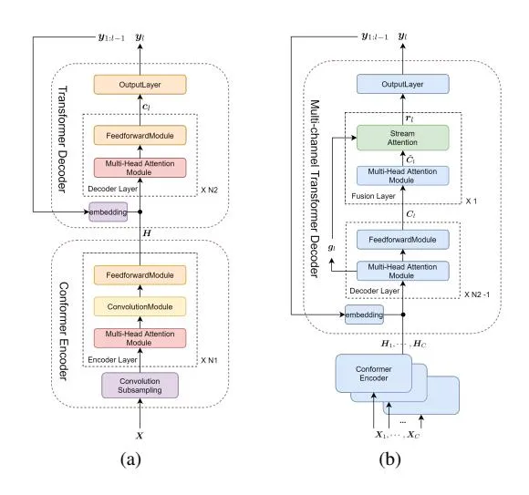
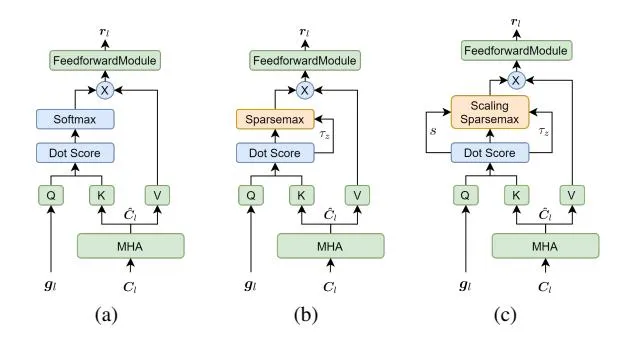
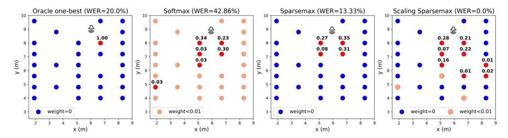

## Scaling sparsemax based channel selection for speech recognition with ad-hoc microphone arrays

_Junqi Chen, Xiao-Lei Zhang_

CIAIC, School of Marine Science and Technology, Northwestern Polytechnical University, China

jqchen@mail.nwpu.edu.cn, xiaolei.zhang@nwpu.edu.cn

## Abstract

Recently, speech recognition with ad-hoc microphone arrays has received much attention. It is known that channel selection is an important problem of ad-hoc microphone arrays, however, this topic seems far from explored in speech recognition yet, particularly with a large-scale ad-hoc microphone array. To address this problem, we propose a _Scaling Sparsemax_ algorithm for the channel selection problem of the speech recognition with large-scale ad-hoc microphone arrays. Specifically, we first replace the conventional Softmax operator in the stream attention mechanism of a multichannel end-to-end speech recognition system with Sparsemax, which conducts channel selection by forcing the channel weights of noisy channels to zero. Because Sparsemax punishes the weights of many channels to zero harshly, we propose Scaling Sparsemax which punishes the channels mildly by setting the weights of very noisy channels to zero only. Experimental results with ad-hoc microphone arrays of over 30 channels under the conformer speech recognition architecture show that the proposed Scaling Sparsemax yields a word error rate of over 30% lower than Softmax on simulation data sets, and over 20% lower on semi-real data sets, in test scenarios with both matched and mismatched channel numbers. Index Terms: distant speech recognition, ad-hoc microphone arrays, channel selection, attention, scaling sparsemax

## 1. Introduction

Distant speech recognition is a challenging problem [\[1\]](#page-4-0). Microphone array based multichannel speech recognition is an important way to improve the performance [\[2–](#page-4-1)[4\]](#page-4-2). However, because speech quality degrades significantly when the distance between the speaker and microphone array enlarges, the performance of automatic speech recognition (ASR) is upperbounded physically no matter how many microphones are added to the array [\[5\]](#page-4-3). An ad-hoc microphone array is a solution to the above difficulty [\[6\]](#page-4-4). It consists of a set of microphone nodes randomly placed in an acoustic environment, where each node contains a single-channel microphone or a microphone array. It can significantly reduce the probability of the occurrence of far-field environments by grouping the channels around the speaker automatically into a local array [\[7\]](#page-4-5) via _channel reweighting and selection_. Existing channel selection criteria for the ASR with ad-hoc microphone arrays can be divided into two kinds: (i) signal-level-based criteria, such as signalto-noise-ratio (SNR), and (ii) recognition-level-based criteria, such as word-error-rate (WER).

The first kind of channel selection methods conducts channel selection according to the estimated speech quality of the channels [\[8](#page-4-6)[–11\]](#page-4-7), such as SNR, distance, orientation, envelope variance and room impulse response, by independent estimators from speech recognition systems. After channel selection, they fuse the selected channels into a single channel by adaptive beamforming, or pick the one-best channel directly for ASR. Although the speech quality based metrics have a strong relationship with the ASR performance in most cases, optimizing the speech quality do not yield the optimal ASR performance.

The second kind aims to conduct channel selection and channel fusion for optimizing the ASR performance directly [\[8,](#page-4-6) [9,](#page-4-8) [12,](#page-4-9) [13\]](#page-4-10). Early methods [\[8,](#page-4-6) [9\]](#page-4-8) chose the channels with the highest likelihood of the output after the decoding of ASR. Because encoder-decoder structures with attention mechanisms are the new frontier of ASR, the channel selection task has been conducted in the ASR system. [\[12\]](#page-4-9) designed a multi-channel encoder structure with a hierarchical attention mechanism, where the output of each channel is first aligned with the first-level attention of the hierarchical attention, followed by the secondlevel attention called _stream attention_ to reweight and fuse the output of all channels. [\[13\]](#page-4-10) further improved the hierarchical attention by a two-stage method, which makes all channels share the same encoder in the first stage and then fine-tunes the stream attention in the second stage. It is generalizable to any number of channels. However, the above methods only consider the channel reweighting problem with few ad-hoc microphone nodes, e.g. no more than 10 microphone nodes, leaving the channel selection problem unexplored. When the environment is large and complicated, and when the number of nodes becomes large as well, it may not be good to take all channels into consideration given that some channels may be too noisy to be helpful.

To address the aforementioned problem, this paper proposes two channel selection methods in a conformer-based ASR system for optimizing the ASR performance directly. The contribution of the paper is as follows:

- The core idea is to replace the Softmax operator in the stream attention with two new operators, named _Sparsemax_ and _Scaling Sparsemax_ respectively, which can force the channel weights of the noisy channels that do not contribute to the performance improvement to zero.
- Besides, we propose a stream attention based conformer [\[14\]](#page-4-11) ASR system with ad-hoc arrays, which is beyond the bidirectional long short-term memory system [\[13\]](#page-4-10)
- At last, different from [\[13\]](#page-4-10) which takes all channels into the training of the shared single-channel ASR in the first stage, we first train a single-channel ASR with clean speech data, and then train the Sparsemax and Scaling Sparsemax based stream attention with multi-channel noisy speech data. This training strategy is motivated by the following two phenomena: Given a large ad-hoc microphone array, (i) when we take some very noisy channels into training, the ASR system may not be trained successfully; (ii) the data of all channels is very large.

Experimental results with ad-hoc microphone arrays of as many

as 30 nodes demonstrate the effectiveness of the proposed methods in both simulated and semi-real data.

# 2. Conformer-based ASR with ad-hoc microphone arrays

Fig. 1 shows the architecture of the proposed single-channel and multichannel conformer-based ASR systems, where we omitted residual connections and position embedding modules for clarity. The single-channel system is the first-stage training of the ASR system with ad-hoc arrays, while the multichannel system is the second-stage training.

#### 2.1. Single channel conformer-based ASR system

Fig. 1(a) shows the single-channel system. It is trained with clean speech. Specifically, given the input acoustic feature of an utterance $\boldsymbol{X} \in \mathbb{R}^{T \times D_x}$ and its target output $\boldsymbol{O} \in \mathbb{R}^{L \times D_v}$ , where T and $D_x$ is the length and dimension of $\boldsymbol{X}$ respectively, and $D_v$ is the vocabulary size. First, $\boldsymbol{X}$ is processed by a convolutional downsampling layer which results in $\tilde{\boldsymbol{X}} \in \mathbb{R}^{\tilde{T} \times D_x}$ . Then, $\tilde{\boldsymbol{X}}$ passes through an encoder $\mathrm{Enc}(\cdot)$ and a decoder $\mathrm{Dec}(\cdot)$ :

$$\boldsymbol{H} = \operatorname{Enc}(\tilde{\boldsymbol{X}})$$
(1)

$$c_l = Dec(\boldsymbol{H}, \boldsymbol{y}_{1:l-1})$$
(2)

which produces a context vector $c_l \in \mathbb{R}^{D_h}$ at each decoding time step l given the decoding output of the previous time steps $y_{1:l-1} \in \mathbb{R}^{l-1 \times D_v}$ , where $H \in \mathbb{R}^{\tilde{T} \times D_h}$ is a high level representation extracted from the encoder. Finally, $c_l$ is transformed to an output vector $y_l$ by a linear transform. The objective function of the conformer is to maximize:

$$\mathcal{L} = \sum_{l=1}^{L} \log(\boldsymbol{y}_{l}^{T} \boldsymbol{o}_{l})$$
(3)

where $o_l$ is the l-th time step of O.

Multi-head attention (MHA) mechanism is used in both the encoder and the decoder, which is the key difference between our conformer architecture and the model in [13]. Each scaled dot-product attention head is defined as:

Attention
$$(Q_i, K_i, V_i) = \text{Softmax}\left(\frac{Q_i K_i^T}{\sqrt{D_k}}\right) V_i$$
(4)

where $Q_i \in \mathbb{R}^{T_1 \times D_k}$ , $K_i$ , $V_i \in \mathbb{R}^{T_2 \times D_k}$ are called the query matrix, key matrix and value matrix, respectively, n is the number of the heads, $D_k = D_h/n$ is the dimension of the feature vector for each head. Then, MHA is defined as:

$$MHA(\mathbf{Q}, \mathbf{K}, \mathbf{V}) = Concat(\mathbf{U}_1, \cdots, \mathbf{U}_n) \mathbf{W}^O$$
(5)

where $\operatorname{Concat}(\cdot)$ is the concatenation operator of matrices,

$$U_i = Attention(Q_i, K_i, V_i)$$
(6)

and $\mathbf{W}^O \in \mathbb{R}^{D_h \times D_h}$ is a learnable projection matrix.

#### 2.2. Multichannel conformer-based ASR system

Fig. 1(b) shows the multichannel system. In the figure, (i) the modules marked in blue are pre-trained by the single-channel ASR system, and shared by all channels with their parameters fixed during the training of the multichannel ASR system; (ii)

<span id="page-1-1"></span><span id="page-1-0"></span>

<span id="page-1-2"></span>Figure 1: Conformer-based ASR systems. (a) Single-channel model. (b) Multichannel model.

the module marked in green is the stream attention, which is trained in the second stage with the noisy data from all channels.

The architecture of the multichannel system is described as follows. Given the input acoustic feature of an utterance from the k-th channel $\boldsymbol{X}_k \in \mathbb{R}^{T \times D_x}, \ k = 1, \cdots, C$ where C represents the total number of channels, we extract high level representations $\boldsymbol{H}_k$ from each channels:

$$\boldsymbol{H}_k = \operatorname{Enc}(\tilde{\boldsymbol{X}}_k), \ k = 1, \cdots, C$$
(7)

Then, we concatenate the context vectors of all channels:

$$C_l = \operatorname{Concat}(c_{l,1}, \cdots, c_{l,C})$$
(8)

where

$$\boldsymbol{c}_{l,k} = \operatorname{Dec}(\boldsymbol{H}_k, \boldsymbol{y}_{1:l-1}) \tag{9}$$

At the same time, we extract a _guide vector_ $\mathbf{g}_l \in \mathbb{R}^{D_h}$ from the output of the decoder at all previous time steps by:

<span id="page-1-4"></span>
$$g_l = MHA(y_{l-1}^T W^{Y_1}, y_{1:l-1} W^{Y_2}, y_{1:l-1} W^{Y_3})$$
(10)

where $W^{Y_1}, W^{Y_2}, W^{Y_3} \in \mathbb{R}^{D_v \times D_h}$ denote learnable projection matrices. The guide vector $g_l \in \mathbb{R}^{D_h}$ is used as the input of the stream attention which will be introduced in Section 3.

#### 3. Variants of stream attention

<span id="page-1-3"></span>This section first describes the stream attention framework, and then present the proposed Sparsemax and Scaling Sparsemax respectively.

#### 3.1. Description of stream attention

As shown in the fusion layer in Fig. 1(b), the stream attention takes the output of a MHA layer as its input. The MHA extracts high-level context vector by:

$$\hat{\boldsymbol{c}}_{l,k} = \text{MHA}(\boldsymbol{c}_{l,k}^T \boldsymbol{W}^C, \boldsymbol{H}_k \boldsymbol{W}^{H_1}, \boldsymbol{H}_k \boldsymbol{W}^{H_2})$$
(11)

where $\bm{W}^C, \bm{W}^{H_1}, \bm{W}^{H_2} \in \mathbb{R}^{D_h \times D_h}$ denote learnable projection matrices.

Then, the stream attention calculates

$$r_l = \text{StreamAttention}(Q, K, V)$$
(12)

<span id="page-2-0"></span>

<span id="page-2-1"></span>Figure 2: The structure of three stream attention architectures. (a) Softmax. (b) Sparsemax. (c) Scaling Sparsemax.

with $Q = g_l^T W^G$ , $K = \hat{C}_l W^{\hat{C}_1}$ and $V = \hat{C}_l W^{\hat{C}_2}$ , where $g_l$ is the guide vector defined in (10),

$$\hat{\boldsymbol{C}}_l = \operatorname{Concat}\left(\hat{\boldsymbol{c}}_{l,1}, \cdots, \hat{\boldsymbol{c}}_{l,C}\right),$$

and $W^G, W^{\hat{C}_1}, W^{\hat{C}_2} \in \mathbb{R}^{D_h \times D_h}$ are learnable projection matrices. Finally, we get the output vector $y_l$ of the decoder through an output layer from $r_l$ .

Fig. 2(a) shows the architecture of the Softmax-based stream attention that has been used in [13].

#### <span id="page-2-2"></span>3.2. Stream attention with Sparsemax

The common Softmax has a limitation for ad-hoc microphone arrays that its output $\operatorname{Softmax}_i(z) \neq 0$ for any z and i, which can not be used for channel selection. To address this problem, we propose Sparsemax stream attention as shown in Fig. 2(b), where the Sparsemax [15] is defined as:

$$\operatorname{Sparsemax}(\boldsymbol{z}) = \underset{\boldsymbol{p} \in \Delta^{K-1}}{\operatorname{arg\,min}} \|\boldsymbol{p} - \boldsymbol{z}\|^2$$
(13)

where $\Delta^{K-1} = \left\{ \boldsymbol{p} \in \mathbb{R}^K \mid \sum_{i=1}^K p_i = 1, p_i \geq 0 \right\}$ represents a (K-1)-dimensional simplex. Sparsemax will return the Euclidean projection of the input vector $\boldsymbol{z}$ onto the simplex, which is a sparse vector. Its solution has the following closed-form:

$$Sparsemax_{i}(z) = max(z_{i} - \tau(z), 0)$$
(14)

where $\tau: \mathbb{R}^K \to \mathbb{R}$ is a function to find a soft threshold, which will be described in detail in the next section.

#### 3.3. Stream attention with Scaling Sparsemax

From section 3.2, we see that the output of Sparsemax is related to the input vector and the dimension of the simplex. However, in our task, the values of the input vector vary in a large range caused by the random locations of the microphones. The dimension of the simplex is related to the number of the channels which is also a variable. Therefore, Sparsemax may not generalize well in some cases.

To address this problem, we propose Scaling Sparsemax as shown in Fig. 2(c). It rescales Sparsemax by a trainable scaling factor s which is obtained by:

$$s = 1 + \text{ReLU}(\text{Linear}([\|\boldsymbol{z}\|, C]^T))$$
(15)

where $\|z\|$ is the L2 norm of the input vector, and Linear(·) is a $1 \times 2$ -dimensional learnable linear transform.

Algorithm 1 describes the Scaling Sparsemax operator. When s=1, Scaling Sparsemax becomes equivalent to Sparsemax.

#### **Algorithm 1:** Scaling Sparsemax

```
Input: \boldsymbol{z}, s

Sort \boldsymbol{z} as z_{(1)} \geq \cdots \geq z_{(K)}

Initialize k \leftarrow K

while k > 0 do
\begin{array}{c} \text{if } z_{(k)} \geq (\sum_{i=1}^k z_{(i)} - s)/k \text{ then} \\ \boldsymbol{\tau}(\boldsymbol{z}) \coloneqq (\sum_{i=1}^k z_{(i)} - s)/k \\ \boldsymbol{\Box} \text{ Break} \\ \boldsymbol{k} \leftarrow k - 1 \\ \end{array}
Output: \boldsymbol{p} where p_i = \max(z_i - \tau(\boldsymbol{z}), 0)/s
```

## 4. Experiments

#### <span id="page-2-3"></span>4.1. Experimental setup

Our experiments use three data sets, which are the Librispeech ASR corpus [16], Librispeech simulated with ad-hoc microphone arrays (Libri-adhoc-simu), and Librispeech played back in real-world scenarios with 40 distributed microphone receivers (Libri-adhoc40) [17]. Each node of the ad-hoc microphone arrays of Libri-adhoc-simu and Libri-adhoc40 has only one microphone. Therefore, a channel refers to a node in the remaining of the paper. Librispeech contains more than 1000 hours of read English speech from 2484 speakers. In our experiments, we selected 960 hours of data to train single channel ASR systems, and selected 10 hours of data for development.

Libri-adhoc-simu uses 100 hours 'train-clean-100' subset of the Librispeech data as the training data. It uses 'dev-clean' and 'dev-other' subsets as development data, which contain 10 hours of data in total. It takes 'test-clean' and 'test-other' subsets as two separate test sets, which contain 5 hours of test data respectively. For each utterance, we simulated a room. The length and width of the room were selected randomly from a range of [5, 25] meters. The height was selected randomly from [2.7, 4] meters. Multiple microphones and one speaker source were placed randomly in the room. We constrained the distance between the source and the walls to be greater than 0.2 meters, and the distance between the source and the microphones to be at least 0.3 meters. We used an image-source model<sup>1</sup> to simulate a reverberant environment and selected T60 from a range of [0.2, 0.4] second. A diffuse noise generator<sup>2</sup> was used to simulate uncorrelated diffuse noise. The noise source for training and development is a large-scale noise library containing over 20000 noise segments [18], and the noise source for test is the noise segments from CHiME-3 dataset [19] and NOISEX-92 corpus [20]. We randomly generated 16 channels for training and development, and 16 and 30 channels respectively for test.

Libri-adhoc40 was collected by playing back the 'train-clean-100', 'dev-clean', and 'test-clean' corpora of Librispeech in a large room [17]. The recording environment is a real office room with one loudspeaker and 40 microphones. It has strong reverberation with little additive noise. The positions of the loudspeaker and microphones are different in the training and test set, where the loudspeaker was placed in 9, 4, and 4 positions in the training, development, and test sets respectively. The distances between the loudspeaker and microphones are in a range of [0.8, 7.4] meters. We randomly selected 20 channels for each training and development utterances, and 20 and 30 channels for each test utterance which corresponds to two test scenarios.

<span id="page-2-4"></span><sup>&</sup>lt;sup>1</sup>https://github.com/ehabets/RIR-Generator

<span id="page-2-5"></span><sup>&</sup>lt;sup>2</sup>https://github.com/ehabets/ANF-Generator

<span id="page-3-3"></span>

Figure 3: _Visualization of the channel selection results on the utterance ID '3570-5694-0013' of Libri-adhoc40, where each dot represents a microphone, and the number aligned with the dot represents the average weight of the channel over time._

<span id="page-3-0"></span>Table 1: _Descriptions of the acoustic feature and the model structure._

| Feature              | Type: fbank<br># dimensions (Dx): 80<br>Data augmentation: SpecAugment [21] |     |     |
| -------------------- | --------------------------------------------------------------------------- | --- | --- |
| Conformer structure  | # number of blocks: N1 = 12, N2 = 6<br>Vocabulary size (Dv): 5000           |     |     |
| Multi-head attention | # heads: 8<br># dimensions (Dh): 512                                        |     |     |
| Stream attention     | # heads: 1<br># dimensions (Dh): 512                                        |     |     |

<span id="page-3-1"></span>Table 2: _Comparison results on Libri-adhoc-simu (in WER (%)). The term "ch" is short for channels in test._

|                             | test-clean |       | test-other |       |
| --------------------------- | ---------- | ----- | ---------- | ----- |
| Method                      | 16-ch      | 30-ch | 16-ch      | 30-ch |
| Oracle one-best             | 14.3       | 10.6  | 30.1       | 24.5  |
| Softmax                     | 15.4       | 11.8  | 33.7       | 28.9  |
| Sparsemax (proposed)        | 11.5       | 8.3   | 27.5       | 22.9  |
| ScalingSparsemax (proposed) | 10.7       | 7.8   | 26.5       | 21.4  |

The feature and model structure are described in Table [1.](#page-3-0) In the training phase, we first trained the single channel conformer-based ASR model with the clean Librispeech data. When the model was trained, the parameters were fixed and sent to the multichannel conformer-based ASR model. Finally, we trained the stream attention with the multichannel noisy data. In the testing phase, we used greedy decoding without language model. WER was used as the evaluation metric.

We compared the proposed Sparsemax and Scaling Sparsemax with the Softmax stream attention. Moreover, we constructed an _oracle one-best_ baseline, which picks the channel that is physically closest to the sound source as the input of the single channel conformer-based ASR model. Note that the keyword "oracle" means that the distances between the speaker and the microphones are known beforehand.

### 4.2. Results

Table [2](#page-3-1) lists the performance of the comparison methods on Libri-adhoc-simu. From the table, we see that (i) all three stream attention methods perform good in both test scenarios. Particularly, the generalization performance in the mismatched 30-channel test environment is even better than the performance in the matched 16-channel environment. It also demonstrates the advantage of adding channels to ad-hoc microphone arrays.

<span id="page-3-2"></span>Table 3: _Comparison results on the Libri-adhoc40 semi-real data (in WER (%))._

| Method                      | 20-ch | 30-ch |
| --------------------------- | ----- | ----- |
| Oracle one-best             | 28.2  | 22.5  |
| Softmax                     | 29.7  | 25.4  |
| Sparsemax (proposed)        | 33.7  | 30.3  |
| ScalingSparsemax (proposed) | 23.3  | 19.3  |

(ii) Both Sparsemax and Scaling Sparsemax achieves significant performance improvement over Softmax. For example, Scaling Sparsemax stream attention achieves a relative WER reduction of 33.90% over Softmax on the 'test-clean' set and 26.0% on the 'test-other' set of the 30-channel test scenario.

Table [3](#page-3-2) shows the results on the Libri-adhoc40 semi-real data. From the table, one can see that the proposed Scaling Sparsemax performs well. It achieves a relative WER reduction of 17.4% over the "oracle one best baseline" on the 20 channel test scenario, and 14.2% on the mismatched 30-channel test scenario.

Fig. [3](#page-3-3) shows a visualization of the channel selection effect on an utterance of Libri-adhoc40. From the figure, we see that (i) Softmax only considers channel reweighting without channel selection; (ii) Although Sparsemax conducts channel selection, its channel selection method punishes the weights of the channels too heavy. (iii) Scaling Sparsemax only sets the weights of very noisy channels to zero, which results in the best performance.

## 5. Conclusions

In this paper, we propose two channel selection methods in the conformer-based ASR system for optimizing the ASR performance with ad-hoc microphone arrays directly. Specifically, we replace the Softmax operator in the stream attention with Sparsemax to make it capable of channel selection. Because Sparsemax punishes the weights of channels severely, we propose Scaling Sparsemax to punish the weights mildly, which only sets the weights of very noisy channel to zero. We evaluate our model on a simulation data set with background noise and a semi-real data set with high reverberation. Experimental results show that the proposed Scaling Sparsemax stream attention not only outperforms the Softmax steam attention but also the oracle one-best, in both simulated data and a semi-real corpus. The results also demonstrate the importance of channel selection to speech recognition with large-scale ad-hoc microphone arrays.

## 6. References

- <span id="page-4-0"></span>[1] R. Haeb-Umbach, J. Heymann, L. Drude, S. Watanabe, M. Delcroix, and T. Nakatani, "Far-field automatic speech recognition," _Proceedings of the IEEE_, 2020.
- <span id="page-4-1"></span>[2] J. Heymann, L. Drude, and R. Haeb-Umbach, "Neural network based spectral mask estimation for acoustic beamforming," in _2016 IEEE International Conference on Acoustics, Speech and Signal Processing (ICASSP)_. IEEE, 2016, pp. 196–200.
- [3] X. Xiao, S. Watanabe, H. Erdogan, L. Lu, J. Hershey, M. L. Seltzer, G. Chen, Y. Zhang, M. Mandel, and D. Yu, "Deep beamforming networks for multi-channel speech recognition," in _2016 IEEE International Conference on Acoustics, Speech and Signal Processing (ICASSP)_. IEEE, 2016, pp. 5745–5749.
- <span id="page-4-2"></span>[4] T. N. Sainath, R. J. Weiss, K. W. Wilson, B. Li, A. Narayanan, E. Variani, M. Bacchiani, I. Shafran, A. Senior, K. Chin _et al._, "Multichannel signal processing with deep neural networks for automatic speech recognition," _IEEE/ACM Transactions on Audio, Speech, and Language Processing_, vol. 25, no. 5, pp. 965– 979, 2017.
- <span id="page-4-3"></span>[5] J. Heymann, M. Bacchiani, and T. N. Sainath, "Performance of mask based statistical beamforming in a smart home scenario," in _2018 IEEE International Conference on Acoustics, Speech and Signal Processing (ICASSP)_. IEEE, 2018, pp. 6722–6726.
- <span id="page-4-4"></span>[6] V. C. Raykar, I. V. Kozintsev, and R. Lienhart, "Position calibration of microphones and loudspeakers in distributed computing platforms," _IEEE transactions on Speech and Audio Processing_, vol. 13, no. 1, pp. 70–83, 2004.
- <span id="page-4-5"></span>[7] X.-L. Zhang, "Deep ad-hoc beamforming," _arXiv preprint arXiv:1811.01233_, 2018.
- <span id="page-4-6"></span>[8] M. Cossalter, P. Sundararajan, and I. Lane, "Ad-hoc meeting transcription on clusters of mobile devices," in _Twelfth Annual Conference of the International Speech Communication Association_, 2011.
- <span id="page-4-8"></span>[9] M. Wolf and C. Nadeu, "Channel selection measures for multimicrophone speech recognition," _Speech Communication_, vol. 57, pp. 170–180, 2014.
- [10] C. Boeddeker, J. Heitkaemper, J. Schmalenstroeer, L. Drude, J. Heymann, and R. Haeb-Umbach, "Front-end processing for the chime-5 dinner party scenario," in _CHiME5 Workshop, Hyderabad, India_, 2018.
- <span id="page-4-7"></span>[11] S. Watanabe, M. Mandel, J. Barker, and E. Vincent, "Chime-6 challenge: Tackling multispeaker speech recognition for unsegmented recordings," _arXiv preprint arXiv:2004.09249_, 2020.
- <span id="page-4-9"></span>[12] R. Li, X. Wang, S. H. Mallidi, S. Watanabe, T. Hori, and H. Hermansky, "Multi-stream end-to-end speech recognition," _IEEE/ACM Transactions on Audio, Speech, and Language Processing_, vol. 28, pp. 646–655, 2019.
- <span id="page-4-10"></span>[13] R. Li, G. Sell, X. Wang, S. Watanabe, and H. Hermansky, "A practical two-stage training strategy for multi-stream end-toend speech recognition," in _ICASSP 2020-2020 IEEE International Conference on Acoustics, Speech and Signal Processing (ICASSP)_. IEEE, 2020, pp. 7014–7018.
- <span id="page-4-11"></span>[14] A. Gulati, J. Qin, C.-C. Chiu, N. Parmar, Y. Zhang, J. Yu, W. Han, S. Wang, Z. Zhang, Y. Wu _et al._, "Conformer: Convolutionaugmented transformer for speech recognition," _arXiv preprint arXiv:2005.08100_, 2020.
- <span id="page-4-12"></span>[15] A. Martins and R. Astudillo, "From softmax to sparsemax: A sparse model of attention and multi-label classification," in _International Conference on Machine Learning_. PMLR, 2016, pp. 1614–1623.
- <span id="page-4-13"></span>[16] V. Panayotov, G. Chen, D. Povey, and S. Khudanpur, "Librispeech: an asr corpus based on public domain audio books," in _2015 IEEE international conference on acoustics, speech and signal processing (ICASSP)_. IEEE, 2015, pp. 5206–5210.
- <span id="page-4-14"></span>[17] S. Guan, S. Liu, J. Chen, W. Zhu, S. Li, X. Tan, Z. Yang, M. Xu, Y. Chen, J. Wang, and X.-L. Zhang, "Libri-adhoc40: A dataset collected from synchronized ad-hoc microphone arrays," _arXiv preprint arXiv:2103.15118_, 2021.

- <span id="page-4-15"></span>[18] X. Tan and X.-L. Zhang, "Speech enhancement aided end-to-end multi-task learning for voice activity detection," _arXiv preprint arXiv:2010.12484_, 2020.
- <span id="page-4-16"></span>[19] J. Barker, R. Marxer, E. Vincent, and S. Watanabe, "The third 'chime'speech separation and recognition challenge: Dataset, task and baselines," in _2015 IEEE Workshop on Automatic Speech Recognition and Understanding (ASRU)_. IEEE, 2015, pp. 504– 511.
- <span id="page-4-17"></span>[20] A. Varga and H. J. Steeneken, "Assessment for automatic speech recognition: Ii. noisex-92: A database and an experiment to study the effect of additive noise on speech recognition systems," _Speech communication_, vol. 12, no. 3, pp. 247–251, 1993.
- <span id="page-4-18"></span>[21] D. S. Park, W. Chan, Y. Zhang, C.-C. Chiu, B. Zoph, E. D. Cubuk, and Q. V. Le, "Specaugment: A simple data augmentation method for automatic speech recognition," _arXiv preprint arXiv:1904.08779_, 2019.
