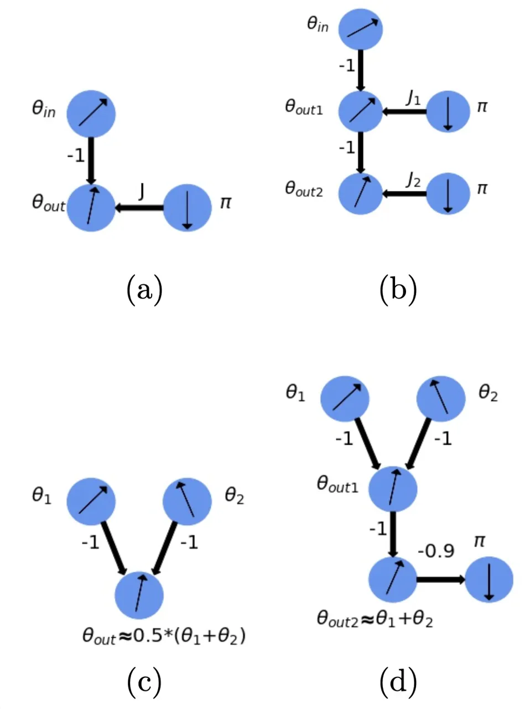
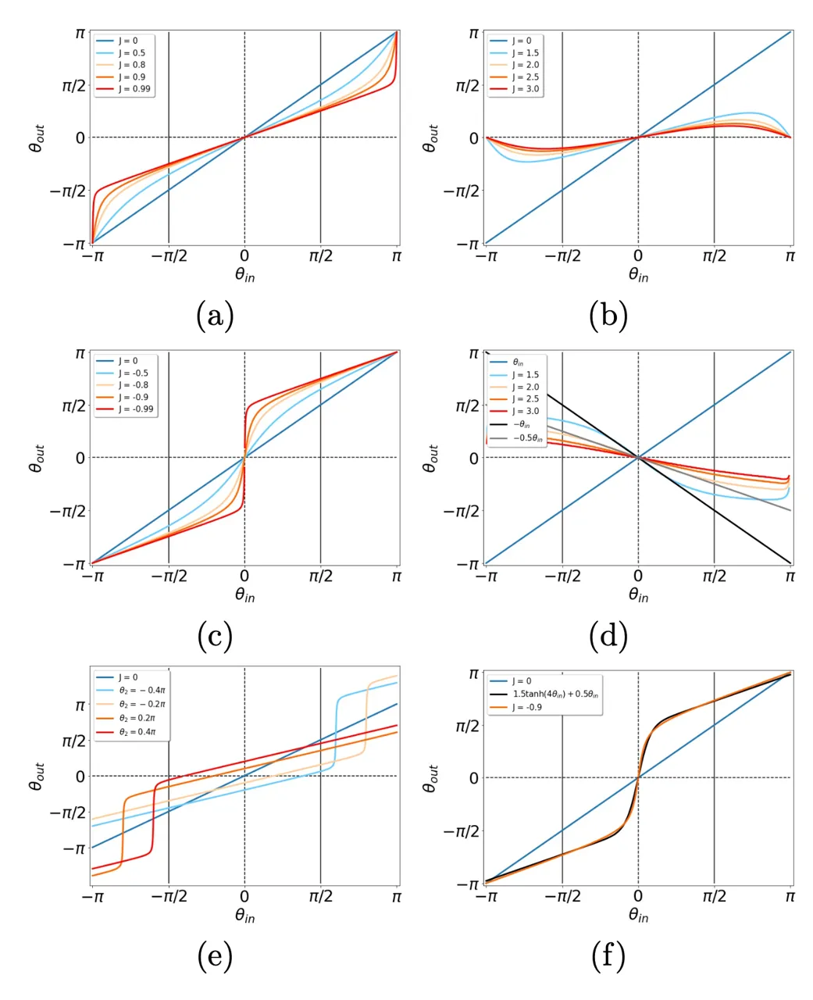
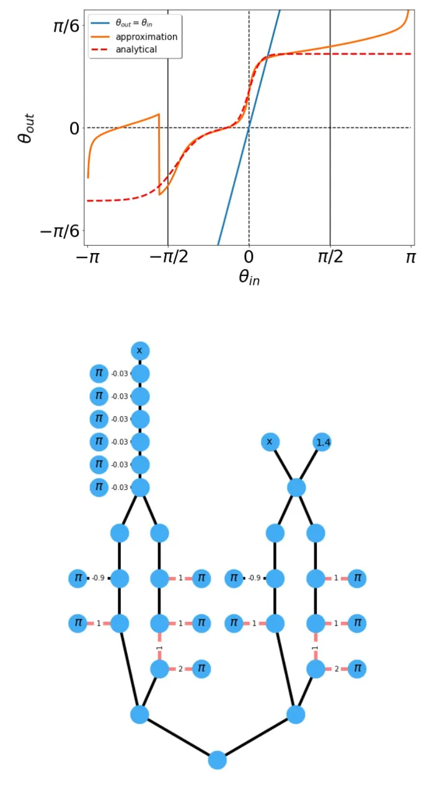
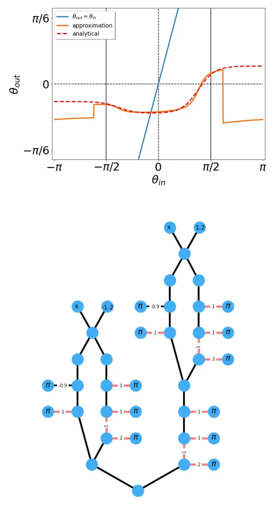
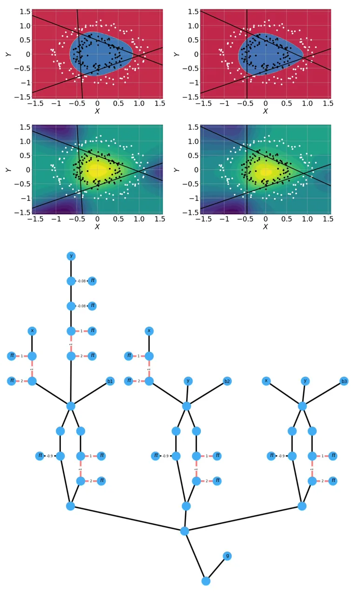
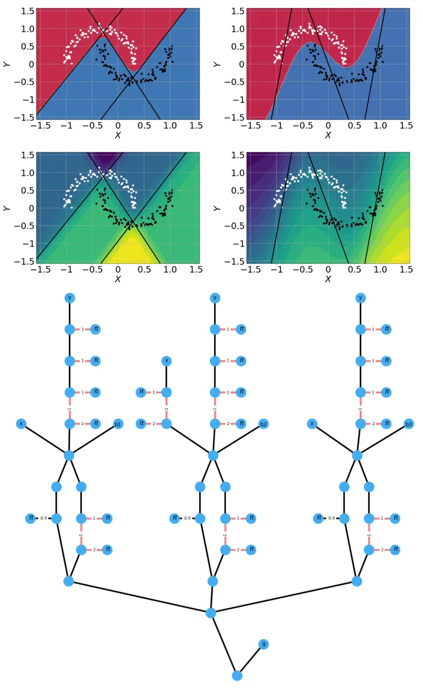
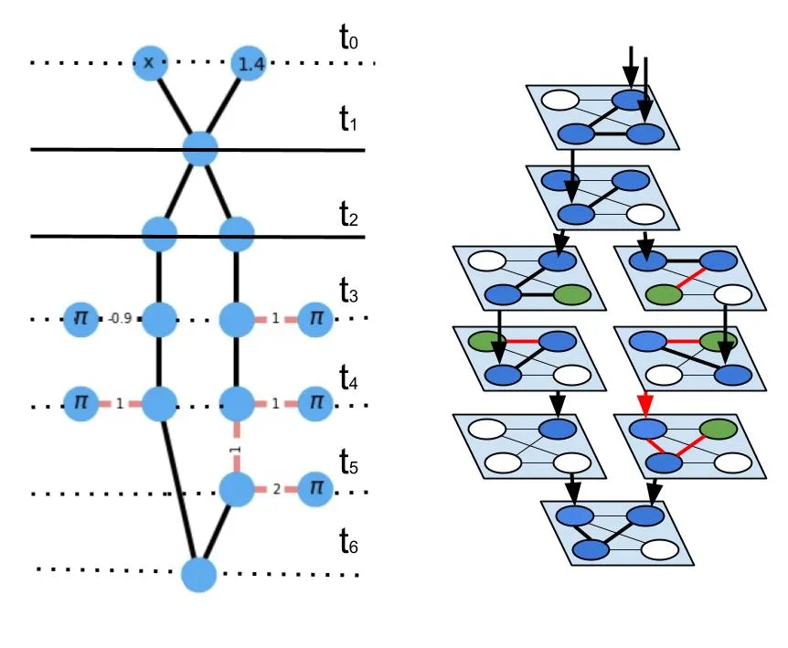
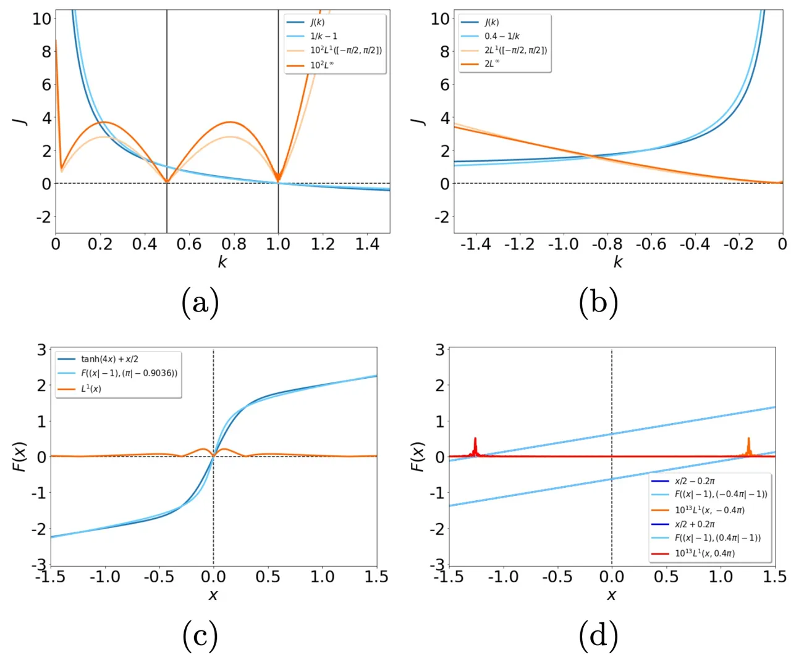

# XY Neural Networks

Nikita Stroev¹ and Natalia G. Berloff^(1,2) correspondence address:
<N.G.Berloff@damtp.cam.ac.uk> Affiliation: ¹Skolkovo Institute of
Science and Technology, Bolshoy Boulevard 30, bld.1, Moscow, 121205,
Russian Federation Affiliation: ²Department of Applied Mathematics and
Theoretical Physics, University of Cambridge, Cambridge CB3 0WA, United
Kingdom

August 24, 2026

###### Abstract

The classical XY model is a lattice model of statistical mechanics
notable for its universality in the rich hierarchy of the optical, laser
and condensed matter systems. We show how to build complex structures
for machine learning based on the XY model’s nonlinear blocks. The final
target is to reproduce the deep learning architectures, which can
perform complicated tasks usually attributed to such architectures:
speech recognition, visual processing, or other complex classification
types with high quality. We developed the robust and transparent
approach for the construction of such models, which has universal
applicability (i.e. does not strongly connect to any particular physical
system), allows many possible extensions while at the same time
preserving the simplicity of the methodology.

## I Introduction

The growth of modern computers suffers from many limitations, among
which is Moore’s law \[1, 2\], an empirical observation about the
physical volume-induced limitation on the number of transistors in
integrated circuits, increased energy consumption connected with the
growth of the performance, intrinsic issues arising from the
architecture design like the so-called von Neumann bottleneck \[3\],
etc. The latter refers to the internal data transfer process built
according to the von Neumann architecture and usually denotes the idea
of computer system throughput limitation due to the characteristic of
bandwidth for data coming in and out of the processor. Von Neumann
bottleneck problem was addressed in various ways \[4, 5\] including
managing multiple processes in parallel, different memory bus design, or
even considering conceptual ”non-von Neumann” systems \[6, 7\].

The inspirations for such information-processing architectures comes
from different sources, artificial or naturally occurring. This concept
is usually referred to as neuromorphic computation \[8, 9\], which
competes with state-of-the-art performance in many specialized tasks
like speech and image recognition, machine translation and others.
Additionally, it has the property of distributed memory input and
computation compared to the linear, and conventional computational
paradigm \[10\]. The artificial neural networks (NNs) demonstrated many
advantages compared to classical computing \[11\]. NN approach offers a
solution to the von Neumann bottleneck but gives an alternative view of
solving a particular task and the entire idea of computation. The
associative memory model is the critical paradigm in the NN theory and
is intrinsically connected with NN architectures.

An alternative approach to the particular computational task is to
encode it into the NN coefficients and solve the specific cost function
minimization instead of performing the predefined sequence of
computations (e.g. logical gates). The nodes’ final configuration
through a nonlinear evolution of the system corresponds to the initial
problem’s solution. One of the familiar and famous models of the NNs is
Hopfield networks \[12\] which serve as content-addressable or
associative memory systems with binary threshold nodes. Its mathematical
description is similar to the random, frustrated Ising spin glass
\[13\], for which finding the ground state is known to be an NP-hard
problem \[14\]. It reveals an interplay between the condensed matter and
computer science fields while offering various physical realizations in
optics, lasers and beyond.

The Ising Hamiltonian can be treated as a degenerate XY Hamiltonian. The
classical XY model, sometimes also called classical rotator or simply
O(2) model, is a subject of extensive theoretical and numerical research
and appears to be one of the basic blocks in the rich hierarchy of the
condensed matter systems \[15, 16, 17, 18, 19\]. It has an essential
property of universality, which allows one to describe a set of
mathematical models that share a single scale-invariant limit under
renormalization group flow with the consequent similar behaviour \[20\].
Thus, the model’s properties are not influenced by whether the system is
quantum or classical, continuous or on a lattice, and its microscopic
details. These types of models are usually used to describe the
properties of magnetic materials or the superfluid state of matter
\[20\]. Moreover, they can be artificially reproduced through
intrinsically different systems with the latest advances in experimental
manipulation techniques \[21, 22, 23, 24\].

Reproducing the Ising, XY, or NN architecture model using a particular
setup allows one to utilize a particular physical system’s benefits.
Extending this problem to the physical domain on the hardware level, we
can additionally solve other computing problems by decreasing the energy
consumption or volume inefficiency or even increasing the processing
speed. The NN implementation has been previously discussed in the
optical settings \[25, 26\], all-optical realisation of reservoir
computing \[27\] or using silicon photonic integrated circuits \[28\]
and other coupled classical oscillator systems \[29\]. Exciton-polariton
condensates are one of such systems (together with many others, for
instance, plasmon-polaritons \[30, 31\]) that led to a variety of
applications such as a two-fluid polariton switch \[32\], all-optical
exciton-polariton router \[33\], polariton condensate transistor switch
\[34\] and polariton transistor \[35\], which can also be realized at
room-temperatures \[36\], spin-switches \[37\] and the XY-Ising
simulators \[38, 39, 40\]. The coupling between different condensates
can be engineered with high precision while the phases of the condensate
wavefunctions arrange themselves to minimize the XY Hamiltonian.

There has been recent progress in developing the direct hardware for the
artificial NNs, emphasising optical and polaritonic devices. Among them,
there is the concept of reservoir computing in the Ginzburg-Landau
lattices, applicable to the description of a broad class of systems,
including exciton-polariton lattices \[41\], and the consequent
experimental realization with the increases in the recognition
efficiency and high signal processing rates \[42\]. The implementation
of the backpropagation mechanism through neurons in an all-optical
training manner in the field of optical NNs through the approximation
mechanism with the pump-probe passive elements resulted in the
equivalent state-of-the-art performance \[43\]. The near-term
experimental platform for realizing an associative memory based on
spinful bosons coupled to a degenerate multimode optical cavity enjoyed
advanced performance due to the system tuning. It led to specific
dynamics of neurons in comparison with the conventional one \[44\].

This paper shows how to perform the NN computation by establishing the
correspondence between the XY model’s nonlinear clusters that minimize
the corresponding XY Hamiltonian and the basic mathematical operations,
therefore, reproducing neural network transformations. Moreover, we
solve an additional set of problems using the properties offered
explicitly by the exciton-polariton systems. The ultra-fast
characteristic timescale for condensation (of the order of picoseconds)
allows one to decrease the computational time significantly. The
intrinsic parallelism, based on working with multiple operational nodes,
can enhance the previous benefits compared to the FPGA or tensor
processing units. The nonlinear behaviour can be used to perform the
approximate nonlinear operations. This task is particularly
computationally inefficient on the conventional computing platforms
where a local approximation in evaluation is commonly used. Since there
are many trivial ways of utilizing the correspondence between the Ising
model and the Hopfield NN in terms of the discrete analogue variables,
instead, we use the continuous degrees of freedom of the XY model. By
moving to continuous variables, we address the volume efficiency problem
since converting the deep NNs to the quadratic binary logic architecture
meets significant overhead in the number of variables while increasing
the range of the coupling coefficients. The former may be out-of-reach
for the actual physical platforms, while the latter increases the
computational errors.

With the motivation to transfer the deep learning (DL) architecture into
the optical or condensed matter platform, we show how to build complex
structures based on the XY model’s nonlinear blocks that naturally
behave in a nonlinear way in the process of reaching the equilibrium.
The corresponding spin Hamiltonian is quite general because it can be
engineered with many condensed matter systems acting as analogue
simulators \[45, 46, 38\].

The key points of our paper are:

- •
  We show how to realize the basic numerical operations using some
  small-size XY networks, which minimize the XY Hamiltonian clusters’
  energy.
- •
  We obtain the complete set of operations sufficient to realize
  different combinations of the mathematical operations and to map the
  deep NN architectures into XY models.
- •
  We demonstrate that this approach can be applied to the existing
  special-purpose hardware capable of reproducing the XY models.
- •
  We present the general methodology based on the simple nonlinear
  systems, which can be extended to other spin Hamiltonians, i.e. with
  different interactions or models with additional degrees of freedom
  and involving quantum effects.

This paper is organized as follows. Section II is devoted to describing
our models’ basic blocks and introducing notations used. Section III
contains the demonstration of our approach’s effectiveness in
approximating simple functions. Section IV extends this approach to the
small NN architectures. Section V considers the extensions to the deep
architectures with a particular emphasis on various nonlinear functions
implementations. Subsection V.1 is dedicated to the particular
exciton-polariton condensed matter system as a potential platform for
implementing our approach. Conclusions and future directions are given
in the final Section VI. Supplementary information provides some
technical details about the NN parameters, approximations, and
corresponding optimization tasks.

## II Basic XY equilibrium blocks

This section is devoted to describing the basic blocks of the XY NN with
a particular emphasis on the DL architecture. DL is usually defined as a
part of the ML methods based on the artificial NN with representation
learning and proven to be effective in many scientific domains \[47, 11,
48, 49\]. It appears to be applicable in many areas ranging from applied
fields such as chemistry and material science to fundamental ones like
particle physics and cosmology \[50\].

The DL is typically referred to as a black box \[51, 52\]. When it comes
to DL’s application, one usually asks questions about adapting the DL
architectures to the new problems, how to interpret the results and how
to quantify the outcome errors reliably. Leaving these open problems
behind, we formulate a more applied task. To build DL architectures, we
want to transfer the pretrained parameters into a realization of a
nonlinear computation. One of the mathematical core ideas in machine
learning (ML) architectures is the ability to build hyperplanes on each
neuron output, which taken together allows one to approximate the input
data efficiently and adjust it to the output in the case of supervised
learning (for example, in the classification tasks \[53\]). This
procedure can be paraphrased as the feature engineering that before the
modern DL approaches and the available computational resources was
performed in a manual way \[54\].

Building hardware that performs the hyperplane transformation with a
specific type of a nonlinear activation function with a given precision
allows one to separate input data points and present building block
operations for more complex tasks. Studying the hierarchical structures
with such blocks leads to constructing more complex architectures
capable of performing more sophisticated tasks.

Decomposing the nonlinear expressions common in the ML such as
$`\tanh(w_{0}x_{0}+w_{1}x_{1}+…+w_{n}x_{n}+b),`$ produces a set of
mathematical operations, which we need to approximate with our system.
These are nonlinear operation $`\tanh`$, which is conventionally called
an activation function, the multiplication of the input variables
$`x_{i}`$ by the constant (after training) coefficients $`w_{i}`$ (also
called weights of a NN) and the summation operation (with the additional
constant $`b`$, called bias).

The activation function is an essential aspect of the deep NNs, bringing
nonlinearity into the learning process. The nonlinearity allows modern
NNs to create complex mappings between the inputs and outputs, vital for
learning and approximating complex data with high dimensionality.
Moreover, the nonlinear activation functions afford backpropagation due
to the smooth derivative of those functions. They normalize each
neuron’s output, allowing one to stack multiple layers of neurons to
create a deep NN. The functional form of the nonlinear function is zero
centred with the saturation effect, which leads to a certain response
for the inputs that take strongly negative, neutral, or strongly
positive values, not to mention the information-entropic foundation of
its derivative form and other interesting properties \[55, 56\]. We will
see that approximating this operation is straightforward with the XY
networks.

Firstly, we introduce the list of simple blocks corresponding to the set
of operations necessary to realize the nonlinear activation function,
which can be obtained by manipulating the small clusters of spins with
underlying U(1) symmetry. These clusters minimize the XY Hamiltonian:

```math
H=\sum_{i=1}^{N}\sum^{N}_{j=1}J_{ij}\cos(\theta_{i}-\theta_{j}), \tag{1}
```

where $`i`$ and $`j`$ goes over $`N`$ elements in the system, $`J_{ij}`$
is the interaction strength between $`i^{th}`$ and $`j^{th}`$ spins
represented by the classical phases $`\theta_{i}\in[-\pi,\pi]`$. If we
take several spins as inputs $`{\theta_{i}}`$ in such a system and
consider the others as outputs $`{\theta_{k}}`$, then we can treat the
whole system as a nonlinear function which returns
$`\underset{\theta_{k}}{\arg\min}H(\{\theta_{i}\},\{\theta_{k}\})`$
values due to the system equilibration into the steady-state. In some
cases the ground state is unique, other cases can produce multiple
equilibrium states.

It is useful to consider the analytical solution to such kind of task,
describing the function with one output and several input variables. We
consider the system with $`N`$ spins: $`\theta_{i},i=1,..,N-1`$ are
input spins and $`\theta_{N}`$ is the output spin coupled with the input
spins by the strength coefficients $`J_{i}\equiv J_{iN}`$. The system
Hamiltonian can be written as
$`H=\sum^{N-1}_{i}J_{i}\cos(\theta_{i}-\theta_{N})`$. By expanding $`H`$
as
$`\sum^{N-1}_{i}J_{i}\cos(\theta_{i}-\theta_{N})=\sum^{N-1}_{i}J_{i}\cos\theta_{i}\cos\theta_{N}+\sum^{N-1}_{i}J_{i}\sin\theta_{i}\sin\theta_{N}`$
we can solve for the minimizer $`\theta_{N}`$:

```math
\theta_{N}\equiv F((\theta_{1}|J_{1}),(\theta_{2}|J_{2}),...,(\theta_{N-1}|J_{N-1}))=
```

```math
=-\operatorname{sign}B\left(\frac{\pi}{2}+\arcsin\frac{A}{\sqrt{A^{2}+B^{2}}}\right), \tag{2}
```

where $`A=\sum^{N-1}_{i}J_{i}\cos\theta_{i}`$ and
$`B=\sum^{N-1}_{i}J_{i}\sin\theta_{i}`$. Alternatively, this formula can
be rewritten through the complex analog of the order parameter
$`C=\sum^{N-1}_{i}J_{i}e^{i\theta_{i}}=A+iB`$ in the following way:
$`\theta_{N}=F(\{\theta_{i}|J_{i}\})=-\operatorname{sign}(\operatorname{Im}C)\left(\pi-\operatorname{Arg}C\right)`$.
We present several basic blocks in Fig. 1 and the outcomes of the
functions responses in Fig. 2.

We will use the notation introduced in Eq. (2) to describe both the
activation function and the graph cluster of spins below. We will use
the recurrent notation where the output of the first block serves as the
input to the next one, for example
$`F(F((\theta_{1}|J_{1}),(\theta_{2}|J_{2}))|J_{3}),(\theta_{4}|J_{4}))`$.

To describe the iterative implementation of many ($`k`$) identical
blocks, where the input is defined in terms of the output of the
previous same block, we rewrite the recurrent formula for one argument
as:
$`(F_{1}\circ F_{1}\circ...\circ F_{1})(\theta_{in})\equiv F_{1}(F_{1}(...F_{1}(\theta_{in})))\equiv F^{k}_{1}(\theta_{in})`$,
where $`F_{1}(\theta_{in})=F((\theta_{in}|J_{1}),(\theta_{2}|J_{2}))`$
is a certain block with the predefined parameters. We separate all
possible blocks of spins into several groups and consider them below in
more detail.



Figure 1: Several examples of basic blocks and their combinations used
in the XY NN architectures. (a) The block performing the function
$`F((\theta_{in}|-1),(\pi|J))`$ with one input spin and one
reference/control spin with imposed $`\pi`$ value, all coupled with the
output by the ferromagnetic $`-1`$ and $`J`$ ($`J=1`$ is used on the
picture). Depending on $`J`$ we can realise the operations that
approximate the multiplication by the constant $`k`$ so that
$`\theta_{out}\approx 1.5\tanh{4\theta_{in}}+0.5\theta_{in}`$ with
$`J=-0.9`$. (b) Two blocks representing
$`F(F((\theta_{1}|-1),(\pi|J_{1}))|-1),(\pi|J_{2}))`$. (c) The block
$`F((\theta_{1}|-1),(\theta_{2}|-1))`$ for the the half sum of two
variables $`\theta_{1}`$ and $`\theta_{2}`$. (d) Two blocks performing
the function $`F(F((\theta_{1}|-1),(\theta_{2}|-1))|-1),(\pi|-0.9))`$.
Some of the response functions for these blocks are presented in Fig.2.

The phase $`\theta_{i}`$ are in $`[-\pi,\pi]`$, however, for an
efficient approximation of the operations (summation, multiplication and
nonlinearity) we need to limit the domain to $`[-\pi/2,\pi/2]`$ which we
refer to as the working domain. Additionally, we need to guarantee that
the values of the working spins (which are not fixed and are influenced
by the system input, thus serving as analogue variables) are located
within the limits of the working domain. This will be implemented below.
Next, we consider the implementation of the elementary operations.

- Multiplication by the constant value $`k>0`$. Connecting the input
  spin with the output spin by the “ferromagnetic” coupling $`J=-1`$ will
  lead to the input spin’s replication. In this way, we can transmit the
  spin value from one block to another. Changing the value of the output
  spin can be achieved in many ways. The addition of another spin with a
  different value and coupling it to the output spin with a constant
  coupling $`J`$ is one such possibility (for example, with imposed
  $`\pi`$ value, which we will refer to as a reference/control spin). If
  $`J`$ is in $`[0,1)`$ (relative to $`-1`$ coupling between
  $`\theta_{in}`$ and $`\theta_{out}`$), then the reference spin
  influences the output spin value with the effective “repulsion” and
  thus, depending on the relative coupling strength, decreases the output
  spin value (see Fig. 2(a,b) and the corresponding cluster configuration
  on Fig. 1(a)). The resulting relation between the input and output spin
  values can be a good approximation to the multiplication by certain
  values lying in the $`[0,1]`$ range. The block corresponding to the
  implementation of $`F((\theta_{in}|-1),(\pi|1))`$ has a peculiarity in
  case of $`\theta_{in}=0`$, which allows the output to take any value due
  to the degeneracy of the ground state. To overcome this degeneracy, we
  choose $`J=0.99`$.

For $`k>1`$ we can use a ferromagnetic coupling $`J<0`$ (see Fig. 2(c)
and the corresponding cluster configuration on Fig. 1(a)). However, the
positive values of $`J`$ are more reliable for the implementation since
the output functions have small approximation errors (see Supplementary
information for the exact values of this error and further
clarification). We can replace the multiplication by a large factor by
the multiplications by several smaller factors to reduce the final
accumulated error. We can guarantee the uniqueness of the output since
the clusters are small, and the output is defined by Eq. (2), which
gives the unique solution.



Figure 2: Several examples of input-output relations for the basic
blocks and their combinations used in the XY NN architectures. (a) The
parametrised family of $`F((\theta_{in}|-1),(\pi|J))`$ functions, that
corresponds to the basic blocks. Depending on $`J`$ coupling strength
parameter we can realise the multiplication by arbitrary $`k`$. (b) The
graphs of $`F((\theta_{in}|-1),(\pi|J))`$ functions for various values
of $`J`$ illustrating the the multiplication by small values of $`k`$.
(c) The graphs of $`F((\theta_{in}|-1),(\pi|J))`$ functions for smaller
values of $`J<0`$. (d) The graphs of
$`F^{3}_{3}(F_{2}(F^{2}_{1}(\theta_{in})|J))`$ functions, where
$`F_{1}(\theta_{in})=F((\theta_{in}|-1),(\pi|0.9)),F_{2}(\theta_{in}|J)=F((\theta_{in}|1),(\pi|J)),F_{3}(\theta_{in})=F((\theta_{in}|-1),(\pi|-0.2))`$,
showing different negative outputs. (e) The graphs of
$`F((\theta_{1}|-1),(\theta_{2}|-1))`$, implementing the block shown on
Fig. 1(c), which approximates half sum of input variables. (d) The
graphs of $`1.5\tanh(4\theta_{in})+0.5\theta_{in}`$ and
$`F((\theta_{in}|-1),(\pi|-0.9))`$.

- Nonlinear activation function.

The function $`F((\theta_{in}|-1),(\pi|-0.9))`$ is similar to the
hyperbolic $`\tanh`$ function (see Fig. 2(c) and the Supplementary
information for the exact difference). There are two ways of using such
a transformation as an activation function.

1\) We can use the similarity between the values of the
$`F((\theta_{in}|-1),(\pi|-0.9))`$ and the function
$`1.5\tanh(4\theta_{in})+0.5\theta_{in}`$ (see Fig. 2(f)). In general,
many nonlinear functions can be used in NNs. Usually, a minor
modification in the functional form of the nonlinear activation function
does not change the network’s overall functionality, with the additional
training procedures of NNs in some architectures. We can train the NN
initially with the $`1.5\tanh(4\theta_{in})+0.5\theta_{in}`$ function so
that in the final transfer, it will not be necessary to adjust the spin
system to approximate the given function.

2\) We can use the similarity with the approximate hyperbolic tangent
function within the XY spin cluster. In other words, to execute
$`\tanh(\theta_{in})`$, we have to perform
$`(F((0.25\theta_{in}|-1),(\pi|-0.9))-0.5\theta_{in})/1.5`$ function
using the spin block operations. This option will be used below.

- Multiplication by the constant value $`k=-1`$. The main difficulty of
  this operation is in finding the set of parameters for the spin block
  where $`\frac{\partial F}{\partial\theta_{in}}<0`$ holds.
  $`F((\theta_{in}|1),(\pi|J))`$ is a good example of such a block. To
  perform the multiplication by $`k=-1`$, we need to embed the whole
  working domain into the region where the presented inequality is valid
  and return these values with the multiplication by $`k>0`$ factor. One
  final realization can be represented as
  $`F^{3}_{3}(F_{2}(F^{2}_{1}(\theta_{in})))`$ function, where
  $`F_{1}(\theta_{in})=F((\theta_{in}|-1),(\pi|0.9)),F_{2}(\theta_{in})=F((\theta_{in}|1),(\pi|J)),F_{3}(\theta_{in})=F((\theta_{in}|-1),(\pi|-0.2))`$.

- Summation. The function $`F((\theta_{1}|-1),(\theta_{2}|-1))`$ gives a
  good approximation to the half sum $`(\theta_{1}+\theta_{2})/2`$. This
  block is presented in Fig. 1(c) and the cross-sections of the surface
  defined by the function of two variables
  $`F((\theta_{1}|-1),(\theta_{2}|-1))`$ are plotted in Fig. 2(e). The
  plots show that the spin system realizes the half sum of two spin values
  with a minimum discrepancy compared to the target function on a working
  domain. One can multiply the final result by two using previously
  described multiplication to achieve an ordinary summation. In general,
  such a type of summation can be extended on multiple spins $`N>2`$, in a
  similar way of connecting them to the output spin, with the final value
  of $`(\theta_{1}+..+\theta_{N})/N`$.

Summarizing, we presented a method of approximating the set of
mathematical operations, necessary for performing the
$`\tanh(w_{0}x_{0}+w_{1}x_{1}+…+w_{n}x_{n}+b)`$ function, using the XY
blocks described by Eq. 2. The output spin value of each block is formed
when a global equilibrium is reached in the physical system with the
speed that depends on particular system and its parameters. We kept the
universality of the model, which allows one to implement this approach
using various XY systems. We did not use any assumptions about the
nature of the classical spins, their couplings, or the manipulation
techniques, however, the forward propagation of information requires
directional couplings. As the blocks corresponding to elementary
operations are added one after another, the new output spins and new
reference spins should not change the values of the output spins from
the previous block. The directional couplings that affect the output
spins of the next block but not the output spins of the previous block
satisfy this requirement. Many systems can achieve directional
couplings. For instance, in optical systems the couplings are
constructed by redirecting the light with either free- space optics or
optical fibres to a spatial light modulator (SLM). At the SLM, the
signal from each node is multiplexed and redirected to other nodes with
the desired directional coupling strengths \[57\].

## III One-dimensional function approximations

This section illustrates the efficiency of the proposed approximation
method on one-dimensional functions of intermediate complexity by
considering two examples of mathematical functions and their
decomposition into the basis of nonlinear operations.

For illustration, we choose two nontrivial functions (one is monotonic
and another is non-monotonic). The use of the methodology for more
complex functions in higher dimensions is straightforward. In the next
section, we will show the method efficiency for two-dimensional
data-scientific toy problems.

We consider two functions

```math
{\cal F}_{1}=0.125F_{t}(1.2x)+0.125F_{t}(0.5(x+1.4)), \tag{3}
```

and

```math
{\cal F}_{2}=0.125F_{t}(0.5(x-1.2))-0.03125F_{t}(0.5(x+1.2)), \tag{4}
```

where $`F_{t}(x)=1.5\tanh(4x)`$. Note, that arbitrary functions can be
obtained using a linear superposition of scaled and translated basic
functions $`F_{t}(x)`$.



Figure 3: Top: The demonstration of the approximation quality, obtained
by using the nonlinear XY spin clusters. The analytical monotonic
function (red dashed line) is given by Eq.(3), the orange line is the
approximation, the blue line is $`\theta_{out}=\theta_{in}`$. Bottom:
The graph structure, representing the basic mathematical operation in
the Eq.(3), given by the blocks, discussed in Section II. The input
variables are mapped into the top spins, after which the cluster is
equilibrated before performing the next operation. The blue empty nodes
are working spins that change according to the variables at higher
block. The blue nodes with the fixed $`\pi`$-value are reference/control
spins. The black edges without the notation have the fixed relative
strength $`-1`$, while for others the coupling is written on the edges
explicitely. The red colour of the edge represents the positive relative
coupling strength $`J`$. The bottom spin gives the value of the coded
function.



Figure 4: Top: The demonstration of the approximation quality, obtained
by using the nonlinear XY spin clusters. The analytical non-monotonic
function (red dashed line) is given by Eq.(4), the orange line is the
approximation, the blue line is the linear identity relation. Bottom:
The graph structure, representing the essential mathematical operation
in Eq.(4), given by the blocks, discussed in Section II. The notation
used for describing the graph parameters is the same as in Fig. 3.

The comparison of the XY blocks approximations and the target functions
are given in Fig. 3 and Fig. 4 demonstrating a a good agreement in the
working domain. We also plot the explicit structures of the
corresponding XY spin clusters showing a small overhead on the number of
spins used per operation.

## IV Neural Networks benchmarks

In this section, we test the XY NN architectures and check their
effectiveness using typical benchmarks. For simple architectures, the
classification of predefined data points perfectly suits this goal. We
consider standard two-dimensional datasets, which conventionally
referred to as ‘moons’ and ‘circles’ and can be generated with
Scikit-learn tools \[58\]. An additional useful property of such tasks
is that they are easy for manual feature engineering.

First, we train a simple NN. The parameters for the training setup are
given in Supplementary Information section. The final performance
demonstrates perfect accuracy in both datasets. The architecture
consists of two neurons’ input layer, one hidden layer with three
neurons for each feature and $`\tanh`$ activation function. The output
layer consists of two neurons, which are transformed with
$`\operatorname{Softmax}`$ function. The corresponding weights for both
cases are given in Supplementary Information section. Fig. 5 and Fig. 6
show the decision boundaries with the given pretrained architectures and
the landscape of one of the final neuron visualizations together with
the data points.

Since we are focused on transferring the described architectures into
the XY spin cluster system, we consider the basic architecture
adjustment on the example of one feature. Suppose we have the expression
$`\tanh(w_{1}x+w_{2}y+b)`$. To repeat the chosen strategy $`2)`$ of
approximating the nonlinear activation function, we rewrite the
coefficients $`w_{1},w_{2}`$ and $`b`$ as, say,
$`w_{i}\rightarrow(N/K)[(K/N)w_{i}],`$ where $`K`$ is a parameter chosen
to increase the accuracy of each computation. We approximate the square
brackets’ operations using the building blocks from the Section II. The
factor $`N=3`$ will be cancelled by the value $`1/N`$ during the
summation of $`N`$ spins, while the factor $`K=4`$ in the denominator
will be taken into account during the operation of the function
$`F((\theta_{in}|-1),(\pi|-0.9))`$, which is close to the
$`\tanh 4\theta_{in}`$. The resulting procedure achieves good
performance seen in Fig. 5, while the details are provided further in
Supplementary information section.



Figure 5: Top row: Decision boundaries of the simple (2,3,2) NN on the
left and approximated ones for the XY NN on the right on toy 2-D circle
data set. Black lines represent the bounds for automatically found
features in the middle layer of classical NN, and the approximated
features are shown on the right picture. Middle row: The isosurface for
the one particular chosen feature for typical NN and its corresponding
matched XY NN last variable isosurface. The parameters of both NN and XY
NN architectures can be found in the Supplementary Information. Bottom:
The corresponding graph structure.

The final $`\operatorname{Softmax}`$ function in the original NN serves
as the comparison function of two features to achieve the final decision
boundary’s smooth landscape. We can omit this function and replace it
with a simpler expression $`x-y`$. To achieve the binary decision
boundaries, one can exploit the block performing
$`F((\theta_{in}|-1),(\pi|-0.9))`$ several times to place the final spin
value either close to $`\pi/2`$ or $`-\pi/2`$. In this way, we adjusted
architecture that performs the same functions as the described simple NN
on a toy model. The final decision boundary of the XY NN approximation
can be seen in Fig. 5, which is very close to the boundary of the
standard trained NN architecture.

The case of the ”moons” dataset is a bit different. While the smooth
functions are easy to approximate with the nonlinear XY blocks, it is
quite complicated to reproduce ”sharp” patterns with the high value of
the function derivative. For this purpose, we adjust the NN coefficients
to achieve good decision boundaries. The difference between the NN and
its approximation and consequent results is shown in Fig. 6. Adjusted
parameters of NN are given in the Supplementary Information section.
Figures 5 and 6 show the XY blocks of the spin architectures. The
presented methodology allows us to upscale the XY blocks with even more
complex ML tasks.



Figure 6: Decision boundaries of the simple (2,3,2) NN on the left and
approximated ones for the XY NN on the right on toy 2-D moons data set.
Black lines represent the bounds for automatically found features in the
middle layer of classical NN, the approximated features adjusted for
this specific task are located in the right picture. Middle row: The
isosurface for the one particular chosen feature for typical NN and its
corresponding matched XY NN last variable isosurface. The parameters of
both NN and XY NN architectures can be found in the Supplementary
Information. We can state that the XY model can give a good
approximation of the classical NN architectures with not ideally smooth
representations, but requires small adjustments of their parameters, due
to difficulties with representing sharp geometric figures (which in
general can be multidimensional). Bottom: The corresponding graph
structure.

## V Transfering Deep Learning architecture

Deep NNs are surprisingly efficient at solving practical tasks \[59, 11,
47\]. The widely accepted opinion is that the key to this efficiency
lies in their depth \[60, 61, 62\]. We can transfer the architecture’s
depth into our XY NN model without any significant loss of accuracy.

So far, we showed how to transfer the predefined architecture into the
XY model. This section discusses the transition of more complex deep
architectures, which are considered conventional across different ML
fields. To extend the method, we choose two conventional image
recognition task models (the architecture details are given in the
Supplementary Information section).

The focus of the architecture adjustment will be on operations, which
were not previously discussed. The list of such operations are
$`\operatorname{Conv2d}`$, $`\operatorname{ReLu}`$ activation function,
$`\operatorname{Maxpool2d}`$ and $`\operatorname{SoftMax}`$ \[47, 63,
64\]. The $`\operatorname{Conv2d}`$ is a simple convolution operation
and does not present a significant difficulty, since it factorizes into
the operations previously discussed. $`\operatorname{ReLu}`$ activation
function can be replaced with its analog $`\operatorname{LeakyReLu}`$
\[65\]. Using its similarity with the analytical expression
$`1.5(1+\tanh{0.8(\theta_{in}-1.5)})`$ allows one to obtain the
following set of transformations through
$`z=F(F((\theta_{in}|-1),(-1.5|-1))|-1),(\pi|1.5))`$. Performing the
summation of the three terms $`1.5`$, $`F((\theta_{in}|-1),(\pi|-0.9))`$
and $`-0.5\theta_{in}`$ gives us a good approximation for
$`\operatorname{LeakyReLu}`$.

$`\operatorname{Maxpool2d}`$ relies on $`\operatorname{max}(x,y)`$
realisation. Therefore, it is convenient to use two similar
architectures of spin value transmission, which are symmetrical with
respect to variables $`x`$ and $`y`$. The first one consists of $`x-y`$
operation, $`\operatorname{ReLu}`$ approximation ( which is essentially
$`\operatorname{max}(0,x-y)`$ function), and summation with the $`y`$
variable, while the second architecture interchanges $`x`$ and $`y`$ and
consists of $`y-x`$, $`\operatorname{ReLu}`$ and $`+x`$ operations.
Summing the results of each architecture will give us the required value
of $`\operatorname{max}(x,y)`$.

The $`\operatorname{SoftMax}`$ $`e^{z_{i}}/\sum^{K}_{j=1}e^{z_{j}}`$
with the input variables $`z_{i}`$ can be approximated using several
assumptions. Diminishing the exponential embeddings, the problem breaks
down into approximating the $`\frac{x}{x+y}`$ function for $`x>0`$ and
$`y>0`$. Approximating $`\frac{1}{1+0.1y/x}\approx 0.9\tanh(4y/x)`$, one
can use the block $`F((\theta_{in}|-1),(\pi|-0.9))`$ to represent
$`\tanh`$ function, while the scaling factor $`0.1`$ can be controlled
by an alternative architecture that depends on $`y`$.

|                                                           |
| --------------------------------------------------------- |
|  |

Figure 7: The picture’s left side demonstrates the graph representation
of the $`F_{t}(0.5(x+1.4))`$ operation defined in the text. The final
spin values are established through $`6`$ time units, and the measure
equals the local characteristic equilibration time of the XY spin
cluster. The right side shows the alternative architecture, which
performs each operation at the same cluster while saving the local
output spin value and transferring it the next time through the
self-locking mechanism. The colour correspondence is the same as in XY
graphs: blue nodes are the working spins, and green are
reference/control spins with $`\pi`$-values.

### V.1 Exciton-polariton setting

In this subsection, we discuss implementing the proposed technique using
a system of exciton-polariton condensates. As we discussed in the
Introduction, it is possible to reproduce XY Hamiltonian in the context
of exciton-polaritons \[38, 39\], which are hybrid light-matter
quasiparticles that are formed in the strong coupling regime in
semiconductor microcavities \[66\]. Each condensate is produced by the
pumping sources’ spatial modulation and can be treated with the reduced
parameters for each unit representing the density and phase degrees of
freedom, serving as the analogue variables for the minimization problem.
The exciton-polariton condensate is a gain-dissipative, non-equilibrium
system due to the finite quasiparticle lifetimes. Polaritons decay
emitting photons. Such emission carries all necessary information of the
corresponding system state and can serve as the readout mechanism.
Redirecting photons from one condensate to another using an SLM allows
to couple the condensates in a lattice directionally \[57\].

The system of condensates maximizes the total occupation of condensates
by arranging their relative phases so as to minimise the XY Hamiltonian
\[38\]. The exciton-polariton platform allows one to manipulate several
parameters, such as coupling sterngths between the condensates to tune
them to the particular mathematical operation, or to fix the phase of
the condensate (through the combination of resonant and non-resonant
pumping, see \[67\]), and thus creating reference/control spins. Each
input spin of the whole system can be controlled via two fixed couplings
with the two reference/control spins of different values, see, for
example, one of the blocks from Fig. 2. Fixing the coupling coefficients
between other spatially located elements is required to perform the
necessary operation and establish the XY network. It can be further
upscaled to approximate a particular ML architecture, with the final
output spin being the readout target.

One additional note is that the same system can be exploited differently
by introducing the spin self-locking mechanism. It consists of saving
the spin value in the system without coupling connections with the
external elements. This mechanism can be achieved by coupling the local
output with another element(s) with high negative coupling strength and
consequent decoupling it from the previous units. The self-locking
allows one to save the local output and use it for the consequent
operations, without significant overhead on elements coming from the
previously established operations. We demonstrate the difference in
Fig. 7. The initial universal methodology requires all elements, which
the XY graph contains. The presented alternative, requiring a
self-locking mechanism, operates with fewer spins by performing each
action at the same cluster. Hence, it is volume efficient, which is
noticeable in the scaling of elements per operation. Fig. 7 shows the
same operation with $`16`$ spins (without external nodes) and $`8`$
total spins with the self-locking mechanism.

## VI Conclusions and future directions

In this paper, we introduced the robust and transparent approach for
approximating the standard feedforward NN architectures utilizing the
set of nonlinear functions arising from the classical XY spin
Hamiltonian behaviour and discussed the possible extensions to other
architectures. The number of additional spins required per operation
scales linearly. The best-case scenario has two spin elements per
multiplication and nonlinear operation (not taking into account the
multiplication by a negative factor), making the general framework
rather practical. Some operation approximations used in this work allow
additional improvements to reduce the cumulative error between the
initial architecture and its nonlinear approximation (see Supplementary
information).

The entire spectrum of the benefits dramatically depends on a particular
type of optical or condensed matter platform. The presented approach has
universal applicability, and at the same time, has a certain degree of
flexibility. It preserves basic blocks’ simplicity, and overall
structure works with the intermediate complexity architectures capable
of solving toy model data scientific tasks. The upscaling to reproduce
DL architectures was discussed.

Our work’s side product is a correspondence that allows us to adjust
every hardware aiming at finding the ground state of the XY model into
the ML task. It becomes possible to build DL hardware from scratch and
readjust the existing special-purpose hardware to solve the XY model’s
minimisation task.

Finally, we would like to mention the alternative of using a hybrid
architecture. Instead of transferring the operations used in the
conventional NN model, we can introduce the nonlinear blocks coming from
the presented XY model into the working functional given by a particular
ML library. For example, we can change the activation function into the
one that comes from the system operation and therefore is easily
reproducible by that system. This would result in the architecture and
the transfer process that do not require additional adjustments from the
hardware perspective.

The question about the implementation of the backpropagation mechanism,
i.e. computing of the gradient of the NN weights in a supervised manner,
usually with the gradient descent method, is still under consideration
because we limited the scope of the work with the transfer of the
predefined, pretrained architecture.

Several possible extensions of our work are possible such as extending
to k-local Hamiltonians or to other models with additional degrees of
freedom and controls, simplifying different mathematical operations and
approximations of the basic functions using many-body clusters in a
particular model, increasing the presented approach’s functionality (for
instance, adding the backpropagation mechanism).

## Supplementary information.

Here we present the parameters of the NNs used in this work and details
of the training and approximations for the XY graphs. We also present
two DL architectures mentioned in the main text emphasising their
nonlinear operations. Finally, we discuss the calculations and
estimations of the approximation quality.

For training simple classical $`(2,3,2)`$ feedforward NN architectures
on ”moons” and ”circle” datasets we used the Pytorch library \[68\] and
Adam optimizer \[69\] with batch size $`32`$ and learning rate $`0.01`$
value. The expected learning procedure passed without the problems on
datasets consisting of $`200`$ points generated with the small noise of
magnitude $`0.1`$. The final performance gives perfect expected accuracy
in both cases.

For the ”circles” dataset, the NN parameters are presented in Table 1.

|             |             |             |
| ----------- | ----------- | ----------- |
| $`w_{11}`$  | $`w_{12}`$  | $`b_{1}`$   |
| $`-1.3465`$ | $`-2.4191`$ | $`1.1582`$  |
| $`-3.5880`$ | $`-0.1474`$ | $`-1.5228`$ |
| $`-1.3565`$ | $`2.6776`$  | $`1.5239`$  |

|              |              |              |              |
| ------------ | ------------ | ------------ | ------------ |
| $`w_{21}`$   | $`w_{22}`$   | $`w_{23}`$   | $`b_{2}`$    |
| $`-17.8809`$ | $`16.4797`$  | $`-18.2794`$ | $`23.6661`$  |
| $`17.3684`$  | $`-17.0227`$ | $`18.4634`$  | $`-23.3256`$ |

Table 1: NN (2,3,2) parameters used for the toy dataset ’circles.’

The first row of mathematical approximations gives us similar
coefficients. We can rewrite in the same manner the NN parameters with
minor adjustments for demonstrative purposes (see the main text for the
detailed analysis of possible assumptions and the improvements such as
the multiplication by the scaling coefficients).

|            |            |           |
| ---------- | ---------- | --------- |
| $`w_{11}`$ | $`w_{12}`$ | $`b_{1}`$ |
| $`-0.5`$   | $`-0.75`$  | $`0.35`$  |
| $`1.0`$    | $`0.0`$    | $`0.45`$  |
| $`-0.5`$   | $`1.0`$    | $`0.6`$   |

|            |            |            |           |
| ---------- | ---------- | ---------- | --------- |
| $`w_{21}`$ | $`w_{22}`$ | $`w_{23}`$ | $`b_{2}`$ |
| $`1.0`$    | $`1.0`$    | $`1.0`$    | $`-0.31`$ |

Table 2: XY NN (2,3,1) parameters used to approximate the standard NN
for the toy dataset ’circles’.

The presented approximation architecture given in Table 2 was adjusted
for better representation of one final feature, which is general enough
to mark the decision boundaries for this particular task, while getting
rid of the unnecessary parameters. Another approximation stage leads us
to the final architecture, which is shown in Fig. 5. Let $`f_{i}`$
denote the $`i`$-th feature and
$`R(x)=F((F_{1}(x)|-1),(F_{3}(F_{2}(x))|-1))`$, where
$`F_{1}(x)=F((x|-1),(\pi|-0.9)),F_{2}(x)=F((x|-1),(\pi|1)),F_{3}(x)=F((x|1),(\pi|2))`$
represents the approximation of the activation function with the reduced
accuracy, then:  
$`x_{11}=F((F((x_{1}|-1),(\pi|0.99))|1),(\pi|2))`$  
$`x_{12}=F((F((x_{11}|-1),(\pi|0.99))|1),(\pi|2))`$  
$`y_{11}=F((F((y_{1}|-1),(\pi|0.99))|1),(\pi|2))`$  
$`y_{12}=F((F((y_{11}|-1),(\pi|-0.08))|-1),(\pi|-0.08))`$  
$`f_{1}=F((x_{12}|-1),(y_{12}|-1),(b_{1}=0.35|-1))`$  
$`f_{11}=R(f_{1});`$  
$`x_{21}=F((F((x_{2}|-1),(\pi|0.99))|1),(\pi|2))`$  
$`f_{2}=F((x_{21}|-1),(y_{2}|-1),(b_{2}=0.6|-1))`$  
$`f_{22}=R(f_{2});`$  
$`f_{3}=F((x_{3}|-1),(y_{3}|0),(b_{3}=0.45|-1))`$  
$`f_{33}=R(f_{3});`$  
$`G_{0}=F((f_{11}|-1),(f_{22}|-1),(f_{33}|-1))`$  
$`G=F((G_{0}|-1),(g=-0.1033|-1))`$

This structure is represented in Fig. 5.

The NN parameters for the ”moons” dataset are presented in 3 Table.

|             |             |             |
| ----------- | ----------- | ----------- |
| $`w_{11}`$  | $`w_{12}`$  | $`b_{1}`$   |
| $`6.2888`$  | $`-3.2930`$ | $`-3.0992`$ |
| $`-3.5880`$ | $`-4.2940`$ | $`5.9965`$  |
| $`-6.1958`$ | $`-2.7684`$ | $`0.6882`$  |

|             |             |             |             |
| ----------- | ----------- | ----------- | ----------- |
| $`w_{21}`$  | $`w_{22}`$  | $`w_{23}`$  | $`b_{2}`$   |
| $`-6.1143`$ | $`-6.8860`$ | $`-6.8151`$ | $`-0.0621`$ |
| $`6.6825`$  | $`6.2848`$  | $`6.8381`$  | $`-0.0325`$ |

Table 3: NN (2,3,2) parameters used for the toy dataset ’moons.’

First row of the approximations parameters is given in Table 3 .

|            |            |           |
| ---------- | ---------- | --------- |
| $`w_{11}`$ | $`w_{12}`$ | $`b_{1}`$ |
| $`1.0`$    | $`-0.125`$ | $`-0.9`$  |
| $`1.0`$    | $`-0.125`$ | $`0.9`$   |
| $`-0.5`$   | $`-0.125`$ | $`0`$     |

|            |            |            |           |
| ---------- | ---------- | ---------- | --------- |
| $`w_{21}`$ | $`w_{22}`$ | $`w_{23}`$ | $`b_{2}`$ |
| $`1.0`$    | $`1.0`$    | $`1.0`$    | $`0.065`$ |

Table 4: XY NN (2,3,1) parameters used to approximate the standard NN
for the toy dataset ’moons.’

The presented architecture was adjusted for better representation of one
final feature. For the case of ”moons,” the additional adjustment has
been added since the presented XY architecture has lower expressivity
for the case of sharp boundaries. Another approximation stage leads us
to the final architecture, which can be found in Fig. 6:  
$`y_{11}=F((F((y_{1}|-1),(\pi|0.99))|-1),(\pi|0.99))`$  
$`y_{12}=F((F((y_{11}|-1),(\pi|0.99))|1),(\pi|2))`$  
$`f_{1}=F((x_{1}|-1),(y_{12}|-1),(b_{1}=-0.95|-1))`$  
$`f_{11}=R(f_{1});`$  
$`y_{21}=F((F((y_{2}|-1),(\pi|0.99))|-1),(\pi|0.99))`$  
$`y_{22}=F((F((y_{21}|-1),(\pi|0.99))|1),(\pi|2))`$  
$`f_{2}=F((x_{1}|-1),(y_{22}|-1),(b_{1}=0.9|-1))`$  
$`f_{22}=R(f_{2});`$  
$`x_{31}=F((F((x_{3}|-1),(\pi|0.99))|1),(\pi|2))`$  
$`y_{31}=F((F((y_{3}|-1),(\pi|0.99))|-1),(\pi|0.99))`$  
$`y_{32}=F((F((y_{31}|-1),(\pi|0.99))|1),(\pi|2))`$  
$`f_{3}=F((x_{31}|-1),(y_{32}|-1),(b_{1}=0|-1))`$  
$`f_{33}=R(f_{3});`$  
$`G_{0}=F((f_{11}|-1),(f_{22}|-1),(f_{33}|-1))`$  
$`G=F((G_{0}|-1),(g=0.0216|-1))`$

The presented structure follows the graph structure given in Fig. 6.

The presented DL architectures are defined with the Pytorch library’s
help in the following Table 5.

|                             |
| --------------------------- |
| NN layer                    |
| 5 $`\times`$ 5 Conv2d(3,6)  |
| 2 $`\times`$ 2 MaxPool2d    |
| 5 $`\times`$ 5 Conv2d(6,16) |
| Linear (400,120)            |
| Linear (120,84)             |
| Linear (84,10)              |

|                              |
| ---------------------------- |
| NN layer                     |
| 5 $`\times`$ 5 Conv2d(1,10)  |
| 2 $`\times`$ 2 MaxPool2d     |
| ReLu                         |
| Dropout(0.5)                 |
| 5 $`\times`$ 5 Conv2d(10,20) |
| 2 $`\times`$ 2 MaxPool2d     |
| ReLu                         |
| Flatten                      |
| Linear (320,50)              |
| ReLu                         |
| Linear (50,10)               |
| Softmax                      |

Table 5: Examples of the simple DL architectures used to represent
nonlinear/unique functions. (a) NN for simple 10 classes digit
recognition. (b) NN for CIFAR10 dataset classification.

In Table 5, we present the details of two DL architectures that were
discussed in the main text emphasizing their nonlinear operations.

Finally, we show that the initial task of approximating a particular set
of mathematical operations by the parametrized family of nonlinear
functions can be done more rigorously with a potential for the
accumulated error estimation through the layers of NN.

The discrepancy between the target function and its approximation can be
estimated with the $`L^{1}([-\pi/2,\pi/2])`$ norm on the working domain:

```math
\displaystyle L^{1} \displaystyle= \displaystyle\int_{-\pi/2}^{\pi/2}|-\operatorname{sign}B(x,\{J_{i}\}) \tag{5}
```

```math
\displaystyle\biggl(\frac{\pi}{2}+\arcsin\frac{A(x,\{J_{i}\})}{\sqrt{A(x,\{J_{i}\})^{2}+B(x,\{J_{i}\})^{2}}}\biggr)
```

```math
\displaystyle- \displaystyle f(x)_{\rm target}|dx.
```

Starting with the multiplication operation, one can calculate Eq. (5)
with $`f(x,k)_{target}=kx`$ and obtain the expression (depending on the
$`(J,k)`$ parameters) for one block of spins. Further minimisation of
Eq. (5) leads to the expression for $`J(k).`$ Evaluating Eq.(5)
analytically can be done in simpler way by replacing the expression
involving $`\operatorname{arcsin}`$ function the one with
$`\operatorname{arcctg}`$, so that initial integral (in terms of the
argument of the complex parameter
$`C=\sum^{N-1}_{i}J_{i}e^{i\theta_{i}}`$) contains the following
expression for one input and one control/reference spin:

```math
I=\int_{-\pi/2}^{\pi/2}\operatorname{arcctg}\frac{B((x_{|}-1),(\pi|J))}{A((x_{|}-1),(\pi|J))}dx=\int_{-\pi/2}^{\pi/2}\operatorname{arcctg}\frac{\sin(x)}{J+\cos(x)}dx. \tag{6}
```

We evaluate this to

```math
\displaystyle I=x\operatorname{arcctg}\frac{\sin(x)}{J+\cos(x)}+\frac{1}{4}(x^{2}+2i\operatorname{sign}(J^{2}-1)\times
```

```math
\displaystyle\times(i[\operatorname{Li}_{2}(\frac{D(1-E)}{1+E})+\operatorname{Li}_{2}(\frac{D^{*}(1-E)}{1+E})]+
```

```math
\displaystyle+2x\operatorname{arctanh}(E^{-1})-G\operatorname{arctanh}(E)+
```

```math
\displaystyle+[G-2i\operatorname{arctanh}(E)]\log\frac{2J(1+E)}{I_{1}(tg(x/2)-i)}+
```

```math
\displaystyle+[G+2i\operatorname{arctanh}(E)]\log\frac{2J(1+E)}{I_{2}(tg(x/2)+i)}+
```

```math
\displaystyle+\log He^{-ix/2}(2i\operatorname{arctanh}(E)-2i\operatorname{arctanh}(E^{-1})+G)+
```

```math
\displaystyle+\log He^{ix/2}(2i\operatorname{arctanh}(E^{-1})-2i\operatorname{arctanh}(E)+G)))\bigg|_{-\pi/2}^{\pi/2},
```

with variables $`D(J)=(J^{2}+1+|J^{2}-1|)/2J`$,
$`E(x,J)=\frac{i|J^{2}-1|}{(J+1)^{2}}\operatorname{tg}x/2`$,
$`C(J)=\operatorname{arccos}(-\frac{J^{2}+1}{2J})`$,
$`H(J)=\frac{i|J^{2}-1|}{2\sqrt{J}\sqrt{J^{2}+2J\cos{x}+1}}`$,$`I_{1}(J)=2i(J-1),\operatorname{if}J^{2}>1;2iJ(1-J),\operatorname{otherwise}`$,
$`I_{2}(J)=2iJ(J-1),\operatorname{if}J^{2}>1;2J(J-1),\operatorname{otherwise}`$
and
$`\operatorname{arcctg},\operatorname{arctanh},\operatorname{arccos}`$
denoting the inverse for tangent, hyperbolic tangent, cosine functions
respectively with
$`\operatorname{Li}_{s}(x)=\sum_{k=1}^{\infty}x^{k}/k^{s}`$ being the
polylogarithm function and $`*`$ denoting the complex conjugate
operation. One can simplify the given formula by the contraction of the
complex pair terms:

```math
\displaystyle I=x\operatorname{arcctg}\frac{\sin(x)}{J+\cos(x)}+\frac{1}{4}(x^{2}+2i\operatorname{sign}(J^{2}-1)\times
```

```math
\displaystyle\times(i[\sum_{k=1}^{\infty}\frac{2\cos(k\phi)}{k^{2}}]+2G\log H+(2x-G)\operatorname{arctanh}(E)+
```

```math
\displaystyle+G\log\frac{J(1+E)^{2}}{E^{2}(J+1)^{2}-(J-1)^{2}}-2i\operatorname{sign}(J^{2}-1)\times
```

```math
\displaystyle\times\operatorname{arctanh}(E)\log\frac{J(E(J+1)-(1-J))}{E(J+1)-(J-1)}))\bigg|_{-\pi/2}^{\pi/2}, \tag{8}
```

where we added a new variable $`\phi=\operatorname{Arg(D(1-E)/(1+E)}`$.

To shorten the description of the dependence of the coupling strength
$`J`$ on the multiplication factor $`k`$ and avoid overcomplicated
analytical expressions, we present the plot of its approximation, which
alternatively can be calculated numerically and can be approximated by
an expression $`1/k-1`$ with a good accuracy. Additionally, we
calculated $`L^{1}([-\pi/2,\pi/2])`$ according to Eq.  (5) for each
value of $`k`$. Another good measure of the approximation quality is
$`L^{\infty}`$, which is the maximal discrepancy between the functions
$`F((x|-1),(\pi|J))`$ and $`f(x)_{target}`$, which has a similar
behaviour as the original norm. Fig. (8) (a) shows all the plots
corresponding to the multiplication by a positive factor $`k>0`$ with
the special points of the minimal error at $`k=1,0.5`$ and $`k=0`$.
These graphs explain why the lesser factors are more reliable for the
multiplication, and why multiplying by a larger factors without
factorization leads to worse performance.



Figure 8: Top: (a) Function $`J(k)`$ that minimizes Eq. (5) with
$`F((x|-1),(\pi|J))`$, $`f(x)_{target}=kx`$ and a positive factor $`k`$
(blue line), its approximation (white blue line) and the fitted formula
$`\approx 1/k-1`$. The supporting plots depict $`10^{2}L^{1}`$ (light
orange line) and $`10^{2}L^{\infty}`$ (orange) for each value of $`k`$.
Vertical black lines denote the points with the minimal accumulated
error. (b) Function $`J(k)`$ that minimises Eq. (5) with
$`F((x|1),(\pi|J))`$, $`f(x)_{target}=kx`$ and a negative factor $`k`$
(blue line), its approximation (white blue line) and the fitted formula
$`\approx 0.4-1/k`$. The supporting plots depict $`2L^{1}`$ (light
orange line) and $`2L^{\infty}`$ (orange) for each value of $`k`$.
Bottom: (c) Function $`\tanh{4x}+x/2`$ (blue line) and its approximation
with the function $`F((x|-1),(\pi|-0.9036))`$ (light blue line) with the
optimised parameter $`J`$. The supporting orange plot represents the
error at each point on $`x`$-axis. (d) The half-sums for $`x`$ and two
variables $`y=-0.2\pi,0.2\pi`$ (blue lines), which coincide with their
approximations $`F((x|-1),(y|-1))`$ (white blue) giving insignificant
approximating error $`10^{13}L^{1}`$ (red and orange lines).

The same task of multiplication, but by a negative factor $`k<0`$ is
illustrated in Fig. (8)(b). The $`J(k)`$ function can be approximated
with a reasonable accuracy by an expression $`0.4-1/k`$. Since the
general error has a much higher factor $`\approx 10^{2}`$ for the
negative values, one has to accompany this block with an additional
linear embeddings to achieve a good approximation. The nonlinear
function $`3/2\tanh{4x}+x/2`$ and its approximation with the optimised
function $`F((x|-1),(\pi|-0.9036))`$ is depicted in the Fig. (8)(c). The
lowest accuracy is observed near the origin.

The final example of the half-sum approximation is illustrated in
Fig. (8)(d). The surprisingly good agreement (with an error of
$`10^{-13}`$ of the magnitude) between the initial function and its XY
representation $`F((x|-1),(y|-1))`$ can be explained with the help of
the Taylor expansion of Eq.(2) near zeros. It gives the linear
coefficient of $`1/2`$ accurate to the fourth order of approximation.
With all the presented information, one can estimate the maximal
discrepancy between an arbitrary NN and its transferred XY analog, which
will be a good measure of the approximation quality and final adequacy
of the transfer.

## References

- \[1\] G. E. Moore et al., “Cramming more components onto integrated
  circuits,” 1965.
- \[2\] G. E. Moore, M. Hill, N. Jouppi, and G. Sohi, “Readings in
  computer architecture,” San Francisco, CA, USA: Morgan Kaufmann
  Publishers Inc, pp. 56–59, 2000.
- \[3\] J. Von Neumann, “First draft of a report on the edvac,” IEEE
  Annals of the History of Computing, vol. 15, no. 4, pp. 27–75, 1993.
- \[4\] J. Edwards and S. O’Keefe, “Eager recirculating memory to
  alleviate the von neumann bottleneck,” in 2016 IEEE Symposium Series
  on Computational Intelligence (SSCI), pp. 1–5, IEEE, 2016.
- \[5\] M. Naylor and C. Runciman, “The reduceron: Widening the von
  neumann bottleneck for graph reduction using an fpga,” in Symposium on
  Implementation and Application of Functional Languages, pp. 129–146,
  Springer, 2007.
- \[6\] C. S. Lent, K. W. Henderson, S. A. Kandel, S. A. Corcelli, G. L.
  Snider, A. O. Orlov, P. M. Kogge, M. T. Niemier, R. C. Brown, J. A.
  Christie, et al., “Molecular cellular networks: A non von neumann
  architecture for molecular electronics,” in 2016 IEEE International
  Conference on Rebooting Computing (ICRC), pp. 1–7, IEEE, 2016.
- \[7\] D. Shin and H.-J. Yoo, “The heterogeneous deep neural network
  processor with a non-von neumann architecture,” Proceedings of the
  IEEE, 2019.
- \[8\] C. D. Schuman, T. E. Potok, R. M. Patton, J. D. Birdwell, M. E.
  Dean, G. S. Rose, and J. S. Plank, “A survey of neuromorphic computing
  and neural networks in hardware,” arXiv preprint
  arXiv:1705.06963, 2017.
- \[9\] S. Furber, “Large-scale neuromorphic computing systems,” Journal
  of neural engineering, vol. 13, no. 5, p. 051001, 2016.
- \[10\] H. Sompolinsky, “Statistical mechanics of neural networks,”
  Physics Today, vol. 41, no. 21, pp. 70–80, 1988.
- \[11\] Y. LeCun, Y. Bengio, and G. Hinton, “Deep learning,” nature,
  vol. 521, no. 7553, pp. 436–444, 2015.
- \[12\] J. J. Hopfield and D. W. Tank, “Computing with neural circuits:
  A model,” Science, vol. 233, no. 4764, pp. 625–633, 1986.
- \[13\] D. L. Stein and C. M. Newman, Spin glasses and complexity,
  vol. 4. Princeton University Press, 2013.
- \[14\] F. Barahona, “On the computational complexity of ising spin
  glass models,” Journal of Physics A: Mathematical and General,
  vol. 15, no. 10, p. 3241, 1982.
- \[15\] P. M. Chaikin, T. C. Lubensky, and T. A. Witten, Principles of
  condensed matter physics, vol. 10. Cambridge university press
  Cambridge, 1995.
- \[16\] J. Kosterlitz, “The critical properties of the two-dimensional
  xy model,” Journal of Physics C: Solid State Physics, vol. 7, no. 6,
  p. 1046, 1974.
- \[17\] R. Gupta, J. DeLapp, G. G. Batrouni, G. C. Fox, C. F. Baillie,
  and J. Apostolakis, “Phase transition in the 2 d xy model,” Physical
  review letters, vol. 61, no. 17, p. 1996, 1988.
- \[18\] P. Gawiec and D. Grempel, “Numerical study of the ground-state
  properties of a frustrated xy model,” Physical Review B, vol. 44,
  no. 6, p. 2613, 1991.
- \[19\] J. Kosterlitz and N. Akino, “Numerical study of spin and chiral
  order in a two-dimensional xy spin glass,” Physical review letters,
  vol. 82, no. 20, p. 4094, 1999.
- \[20\] B. V. Svistunov, E. S. Babaev, and N. V. Prokof’ev, Superfluid
  states of matter. Crc Press, 2015.
- \[21\] I. Buluta and F. Nori, “Quantum simulators,” Science, vol. 326,
  no. 5949, pp. 108–111, 2009.
- \[22\] A. Aspuru-Guzik and P. Walther, “Photonic quantum simulators,”
  Nature physics, vol. 8, no. 4, pp. 285–291, 2012.
- \[23\] M. Kjaergaard, M. E. Schwartz, J. Braumüller, P. Krantz,
  J. I.-J. Wang, S. Gustavsson, and W. D. Oliver, “Superconducting
  qubits: Current state of play,” Annual Review of Condensed Matter
  Physics, vol. 11, pp. 369–395, 2020.
- \[24\] P. Hauke, F. M. Cucchietti, L. Tagliacozzo, I. Deutsch, and
  M. Lewenstein, “Can one trust quantum simulators?,” Reports on
  Progress in Physics, vol. 75, no. 8, p. 082401, 2012.
- \[25\] G. Montemezzani, G. Zhou, and D. Z. Anderson, “Self-organized
  learning of purely temporal information in a photorefractive optical
  resonator,” Optics letters, vol. 19, no. 23, pp. 2012–2014, 1994.
- \[26\] D. Psaltis, D. Brady, X.-G. Gu, and S. Lin, “Holography in
  artificial neural networks,” in Landmark Papers On Photorefractive
  Nonlinear Optics, pp. 541–546, World Scientific, 1995.
- \[27\] F. Duport, B. Schneider, A. Smerieri, M. Haelterman, and
  S. Massar, “All-optical reservoir computing,” Optics express, vol. 20,
  no. 20, pp. 22783–22795, 2012.
- \[28\] Y. Shen, N. C. Harris, S. Skirlo, M. Prabhu, T. Baehr-Jones,
  M. Hochberg, X. Sun, S. Zhao, H. Larochelle, D. Englund, et al., “Deep
  learning with coherent nanophotonic circuits,” Nature Photonics,
  vol. 11, no. 7, p. 441, 2017.
- \[29\] G. Csaba and W. Porod, “Coupled oscillators for computing: A
  review and perspective,” Applied Physics Reviews, vol. 7, no. 1,
  p. 011302, 2020.
- \[30\] R. Frank, “Coherent control of floquet-mode dressed plasmon
  polaritons,” Physical Review B, vol. 85, no. 19, p. 195463, 2012.
- \[31\] R. Frank, “Non-equilibrium polaritonics-non-linear effects and
  optical switching,” Annalen der Physik, vol. 525, no. 1-2,
  pp. 66–73, 2013.
- \[32\] M. De Giorgi, D. Ballarini, E. Cancellieri, F. Marchetti,
  M. Szymanska, C. Tejedor, R. Cingolani, E. Giacobino, A. Bramati,
  G. Gigli, et al., “Control and ultrafast dynamics of a two-fluid
  polariton switch,” Physical review letters, vol. 109, no. 26,
  p. 266407, 2012.
- \[33\] F. Marsault, H. S. Nguyen, D. Tanese, A. Lemaître, E. Galopin,
  I. Sagnes, A. Amo, and J. Bloch, “Realization of an all optical
  exciton-polariton router,” Applied Physics Letters, vol. 107, no. 20,
  p. 201115, 2015.
- \[34\] T. Gao, P. Eldridge, T. C. H. Liew, S. Tsintzos,
  G. Stavrinidis, G. Deligeorgis, Z. Hatzopoulos, and P. Savvidis,
  “Polariton condensate transistor switch,” Physical Review B, vol. 85,
  no. 23, p. 235102, 2012.
- \[35\] D. Ballarini, M. De Giorgi, E. Cancellieri, R. Houdré,
  E. Giacobino, R. Cingolani, A. Bramati, G. Gigli, and D. Sanvitto,
  “All-optical polariton transistor,” Nature communications, vol. 4,
  p. 1778, 2013.
- \[36\] A. V. Zasedatelev, A. V. Baranikov, D. Urbonas, F. Scafirimuto,
  U. Scherf, T. Stöferle, R. F. Mahrt, and P. G. Lagoudakis, “A
  room-temperature organic polariton transistor,” Nature Photonics,
  vol. 13, no. 6, p. 378, 2019.
- \[37\] A. Amo, T. Liew, C. Adrados, R. Houdré, E. Giacobino,
  A. Kavokin, and A. Bramati, “Exciton–polariton spin switches,” Nature
  Photonics, vol. 4, no. 6, p. 361, 2010.
- \[38\] N. G. Berloff, M. Silva, K. Kalinin, A. Askitopoulos, J. D.
  Töpfer, P. Cilibrizzi, W. Langbein, and P. G. Lagoudakis, “Realizing
  the classical xy hamiltonian in polariton simulators,” Nature
  materials, vol. 16, no. 11, p. 1120, 2017.
- \[39\] P. G. Lagoudakis and N. G. Berloff, “A polariton graph
  simulator,” New Journal of Physics, vol. 19, no. 12, p. 125008, 2017.
- \[40\] K. P. Kalinin and N. G. Berloff, “Simulating ising and n-state
  planar potts models and external fields with nonequilibrium
  condensates,” Physical review letters, vol. 121, no. 23,
  p. 235302, 2018.
- \[41\] A. Opala, S. Ghosh, T. C. Liew, and M. Matuszewski,
  “Neuromorphic computing in ginzburg-landau polariton-lattice systems,”
  Physical Review Applied, vol. 11, no. 6, p. 064029, 2019.
- \[42\] D. Ballarini, A. Gianfrate, R. Panico, A. Opala, S. Ghosh,
  L. Dominici, V. Ardizzone, M. De Giorgi, G. Lerario, G. Gigli, et al.,
  “Polaritonic neuromorphic computing outperforms linear classifiers,”
  Nano Letters, vol. 20, no. 5, pp. 3506–3512, 2020.
- \[43\] X. Guo, T. D. Barrett, Z. M. Wang, and A. Lvovsky, “End-to-end
  optical backpropagation for training neural networks,” arXiv preprint
  arXiv:1912.12256, 2019.
- \[44\] B. P. Marsh, Y. Guo, R. M. Kroeze, S. Gopalakrishnan,
  S. Ganguli, J. Keeling, and B. L. Lev, “Enhancing associative memory
  recall and storage capacity using confocal cavity qed,” arXiv preprint
  arXiv:2009.01227, 2020.
- \[45\] A. N. Pargellis, S. Green, and B. Yurke, “Planar xy-model
  dynamics in a nematic liquid crystal system,” Physical Review E,
  vol. 49, no. 5, p. 4250, 1994.
- \[46\] J. Struck, M. Weinberg, C. Ölschläger, P. Windpassinger,
  J. Simonet, K. Sengstock, R. Höppner, P. Hauke, A. Eckardt,
  M. Lewenstein, et al., “Engineering ising-xy spin-models in a
  triangular lattice using tunable artificial gauge fields,” Nature
  Physics, vol. 9, no. 11, pp. 738–743, 2013.
- \[47\] I. Goodfellow, Y. Bengio, A. Courville, and Y. Bengio, Deep
  learning, vol. 1. MIT press Cambridge, 2016.
- \[48\] C. Szegedy, W. Liu, Y. Jia, P. Sermanet, S. Reed, D. Anguelov,
  D. Erhan, V. Vanhoucke, and A. Rabinovich, “Going deeper with
  convolutions,” in Proceedings of the IEEE conference on computer
  vision and pattern recognition, pp. 1–9, 2015.
- \[49\] K. He, X. Zhang, S. Ren, and J. Sun, “Deep residual learning
  for image recognition,” in Proceedings of the IEEE conference on
  computer vision and pattern recognition, pp. 770–778, 2016.
- \[50\] G. Carleo, I. Cirac, K. Cranmer, L. Daudet, M. Schuld,
  N. Tishby, L. Vogt-Maranto, and L. Zdeborová, “Machine learning and
  the physical sciences,” Reviews of Modern Physics, vol. 91, no. 4,
  p. 045002, 2019.
- \[51\] L. Zdeborová, “Understanding deep learning is also a job for
  physicists,” Nature Physics, pp. 1–3, 2020.
- \[52\] L. Deng and D. Yu, “Deep learning: methods and applications,”
  Foundations and trends in signal processing, vol. 7, no. 3–4,
  pp. 197–387, 2014.
- \[53\] S. B. Kotsiantis, I. Zaharakis, and P. Pintelas, “Supervised
  machine learning: A review of classification techniques,” Emerging
  artificial intelligence applications in computer engineering,
  vol. 160, no. 1, pp. 3–24, 2007.
- \[54\] C. R. Turner, A. Fuggetta, L. Lavazza, and A. L. Wolf, “A
  conceptual basis for feature engineering,” Journal of Systems and
  Software, vol. 49, no. 1, pp. 3–15, 1999.
- \[55\] J. G. Taylor and M. D. Plumbley, “Information theory and neural
  networks,” in North-Holland Mathematical Library, vol. 51,
  pp. 307–340, Elsevier, 1993.
- \[56\] C. Fyfe, “Artificial neural networks and information theory,”
  Department of Computing and Information System, The university of
  Paisley, 2000.
- \[57\] K. P. Kalinin, A. Amo, J. Bloch, and N. G. Berloff,
  “Polaritonic xy-ising machine,” Nanophotonics, vol. 9, no. 13,
  pp. 4127–4138, 2020.
- \[58\] F. Pedregosa, G. Varoquaux, A. Gramfort, V. Michel, B. Thirion,
  O. Grisel, M. Blondel, P. Prettenhofer, R. Weiss, V. Dubourg, et al.,
  “Scikit-learn: Machine learning in python,” the Journal of machine
  Learning research, vol. 12, pp. 2825–2830, 2011.
- \[59\] C. Sun, A. Shrivastava, S. Singh, and A. Gupta, “Revisiting
  unreasonable effectiveness of data in deep learning era,” in
  Proceedings of the IEEE international conference on computer vision,
  pp. 843–852, 2017.
- \[60\] K. Kawaguchi, J. Huang, and L. P. Kaelbling, “Effect of depth
  and width on local minima in deep learning,” Neural computation,
  vol. 31, no. 7, pp. 1462–1498, 2019.
- \[61\] M. Raghu, B. Poole, J. Kleinberg, S. Ganguli, and
  J. Sohl-Dickstein, “On the expressive power of deep neural networks,”
  in international conference on machine learning, pp. 2847–2854,
  PMLR, 2017.
- \[62\] R. Eldan and O. Shamir, “The power of depth for feedforward
  neural networks,” in Conference on learning theory, pp. 907–940, 2016.
- \[63\] X. Glorot, A. Bordes, and Y. Bengio, “Deep sparse rectifier
  neural networks,” in Proceedings of the fourteenth international
  conference on artificial intelligence and statistics, pp. 315–323,
  JMLR Workshop and Conference Proceedings, 2011.
- \[64\] V. Nair and G. E. Hinton, “Rectified linear units improve
  restricted boltzmann machines,” in Icml, 2010.
- \[65\] A. L. Maas, A. Y. Hannun, and A. Y. Ng, “Rectifier
  nonlinearities improve neural network acoustic models,” in Proc. icml,
  vol. 30, p. 3, Citeseer, 2013.
- \[66\] C. Weisbuch, M. Nishioka, A. Ishikawa, and Y. Arakawa,
  “Observation of the coupled exciton-photon mode splitting in a
  semiconductor quantum microcavity,” Physical Review Letters, vol. 69,
  no. 23, p. 3314, 1992.
- \[67\] H. Ohadi, Y. d. V.-I. Redondo, A. Dreismann, Y. Rubo,
  F. Pinsker, S. Tsintzos, Z. Hatzopoulos, P. Savvidis, and J. Baumberg,
  “Tunable magnetic alignment between trapped exciton-polariton
  condensates,” Physical Review Letters, vol. 116, no. 10,
  p. 106403, 2016.
- \[68\] A. Paszke, S. Gross, S. Chintala, G. Chanan, E. Yang,
  Z. DeVito, Z. Lin, A. Desmaison, L. Antiga, and A. Lerer, “Automatic
  differentiation in pytorch,” 2017.
- \[69\] D. P. Kingma and J. Ba, “Adam: A method for stochastic
  optimization,” arXiv preprint arXiv:1412.6980, 2014.
