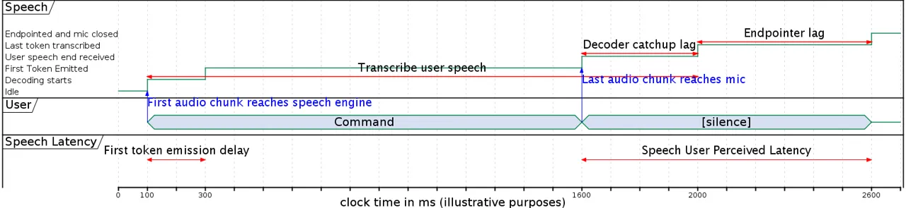

# Dissecting User-Perceived Latency of On-Device E2E Speech Recognition

Yuan Shangguan    Rohit Prabhavalkar    Hang Su    Jay Mahadeokar   
Yangyang Shi    Jiatong Zhou    Chunyang Wu    Duc Le    Ozlem Kalinli
   Christian Fuegen    Michael L. Seltzer

###### Abstract

As speech-enabled devices such as smartphones and smart speakers become
increasingly ubiquitous, there is growing interest in building automatic
speech recognition (ASR) systems that can run directly on-device;
end-to-end (E2E) speech recognition models such as recurrent neural
network transducers and their variants have recently emerged as prime
candidates for this task. Apart from being accurate and compact, such
systems need to decode speech with low user-perceived latency (UPL),
producing words as soon as they are spoken. This work examines the
impact of various techniques – model architectures, training criteria,
decoding hyperparameters, and endpointer parameters – on UPL. Our
analyses suggest that measures of model size (parameters, input chunk
sizes), or measures of computation (e.g., FLOPS, RTF) that reflect the
model’s ability to process input frames are not always strongly
correlated with observed UPL. Thus, conventional algorithmic latency
measurements might be inadequate in accurately capturing latency
observed when models are deployed on embedded devices. Instead, we find
that factors affecting token emission latency, and endpointing behavior
have a larger impact on UPL. We achieve the best trade-off between
latency and word error rate when performing ASR jointly with
endpointing, while utilizing the recently proposed alignment
regularization mechanism.

^(†)^(†)address: Facebook AI, USA^(†)^(†)email:
{yuansg,prabhavalkar}@fb.com

Index Terms: speech recognition, latency, on-device, end-to-end,
streaming

## 1 Introduction

Automatic speech recognition (ASR) technologies are becoming
increasingly ubiquitous in today’s technological products; from
smartphones to digital assistants on smart speakers, speech has emerged
as a prominent input modality \[SchalkwykBeefermanBeaufaysEtAl10,
Sarikaya17\]. Some ASR applications (e.g., video captioning, spoken term
detection, etc.) admit the use of _offline_ recognition where speech can
be processed at a later time, through multi-pass systems with
bi-directional processing. However, an important use case – particularly
in the context of digital voice-command assistants, and the focus of
this paper – is the development of ASR systems that can process speech
in a _streaming_ fashion by producing output hypotheses as speech is
input to the system. Since ASR systems are typically the first stage of
a more complex language understanding
pipeline \[DeMoriBechetHakkani-TurEtAl08\], it crucial that streaming
ASR systems operate with low latency – i.e., producing words as soon as
possible after they are spoken – in order to ensure that the overall
system is responsive to the user’s requests.

The demand for low-latency user experiences has driven the speech
community to investigate various algorithmic techniques and model
architectures. Recently, end-to-end ASR systems such as connectionist
temporal classification (CTC) \[GravesFernandezGomezEtAl06\], and
sequence transducers \[graves2012sequence, RaoSakPrabhavalkar17\] have
emerged as prime candidates for this task since they are compact,
accurate, and can be deployed efficiently on embedded
devices \[HeSainathPrabhavalkarEtAl19, shangguan2019optimizing,
li2019improving\]. The responsiveness of such systems can be measured in
terms of two metrics (see Section 2 for formal definitions): _first
token emission delay_ – the time between the start of the user’s speech
and the first output produced by the system; and _user-perceived
latency_ (UPL) – the time between the end of the user’s speech and when
the ASR system finalizes its hypothesis \[sainath2020streaming\].
Improving these metrics is a multi-faceted problem, and is influenced by
all layers of the speech recognition stack: e.g., front-end processing
to produce speech frames; model architectures; the endpointer used for
end-of-speech detection to close the microphone \[shannon2017improved,
chang2019joint\]; decoder hyperparameters (e.g., beam size), etc.

Although improving latency is an important research goal, the
complexities involved in its measurement have resulted in various
definitions and measurement techniques in previous work, which are hard
to compare across systems. Many previous work focus primarily on
_algorithmic latency_ (e.g.,  \[inaguma2020minimum, li2020high,
shi2020emformer, wang2020low\] _inter alia_) – the minimum theoretical
amount of time required to process the incoming audio chunk before
producing an output (i.e., the time span that the audio chunk
represents, along with any required look-ahead frames). However, such
definitions underestimate the true UPL, since they do not account for
interactions with other system components such as the endpointer and the
decoder. For the same reason, systems that solely measure latency in
terms of the number of floating point operations (FLOPS) in a particular
component of the model (e.g., the encoder in \[macoskeybifocal\]), do
not capture the observed UPL accurately. Many research work measure
endpointer (EP) latency \[mahadeokar2020alignment, yu2020fastemit,
sainath2020streaming\] – the difference between when the user stops
speaking and when a decision is made to close the microphone, which
correlates well with our notion of UPL. For systems which utilize the
ASR result as a part of the endpointing process, or which decide to
close the microphone as part of the ASR process \[chang2019joint\], EP
latency is directly influenced by the underlying ASR model. As a final
note, some previous work provide a more nuanced view of the latency by
measuring it at the sub-utterance level: e.g., model emission delays at
the level of frames \[wang2020low\], output
tokens \[mahadeokar2020alignment\], words \[wang2020low\], or phrases
(segments) \[shangguan2020analyzing, yu2020fastemit\] by comparing the
models’ emission times against ground truth locations in the audio
(typically obtained using forced alignments).

In this work, we provide a detailed analysis of the impacts of ASR
modeling techniques on UPL by considering two state-of-the-art E2E ASR
systems – the recurrent neural network transducer
(RNN-T) \[graves2012sequence, graves2013speech\] with
LSTM \[hochreiter1997long\] encoders; and the recently proposed
efficient memory transformer (Emformer) \[shi2020emformer\]. Unlike many
previous work, we measure latency in terms of _the actual runtimes on
embedded devices under controlled conditions_ in order to glean insights
that translate directly into measurable improvements in practical
applications. Our analyses suggest that measures of model size
(parameters, input chunk sizes), or measures of computations
(e.g.,FLOPS, real time factor (RTF)) that reflect the model’s ability to
process input frames are not always strongly correlated with observed
UPL. Thus, conventional algorithmic latency measurements might be
inadequate in accurately capturing latency observed when models are
deployed on embedded devices. Instead, we find that factors affecting
token emission latency, and endpointing behavior have a much greater
impact on UPL. We show that modifications to the training loss that
improves the speed of the ASR model’s token emission result in faster
UPL. We then consider the impact of different kinds of endpointer
strategies on UPL by comparing endpointing based on a fixed amount of
acoustic silence \[mahadeokar2020alignment\]; a neural
endpointer \[shannon2017improved\]; and, an integrated E2E endpointer
that predicts an end of utterance token as part of the ASR
process \[chang2019joint, li2020towards\]. Taken together, our results
indicate that UPL is dominated by the interactions of two major impact
factors: the end-pointer design, and the model’s loss function design
that promotes faster token emission.

## 2 Measuring Latency Metrics

Figure 1: Illustration of timeline and latency metrics of a streaming
on-device ASR system.

In this work, we compare ASR systems in terms of their actual runtime
behavior when running on an embedded device. As can be seen in Figure 1,
we measure two speech latency metrics: _first token emission delay_ and
_user perceived latency_. The first of these – _first token emission
delay_ (200ms, in this example) – is measured as the time between when
the user actually begins speaking (i.e., ignoring any initial silence)
and the time when the ASR system actually emits an output token (i.e.,
non-blank outputs for the transducers in this work). The system
continues to transcribe incoming speech frames, until a decision is made
to close the microphone using an endpointer (either as a standalone
system, or jointly trained with the ASR model). We then measure the
second metric – _user perceived latency_ (UPL) – as the time between
when the user finishes speaking and the decision is made to close the
microphone (1000ms, in this example).

The UPL is thus a function of both the decoder and the endpointer used
to detect the end of the speech. It consists of two factors: _endpointer
lag_ (600ms, in this example) – the time required by the endpointer to
determine that the user is done speaking; and, *decoder catchup lag*
(400ms, in this example) – time taken to process any remaining frames
received after the user has finished speaking, till the model emits the
last non-blank token. Changing endpointer hyperparameters to operate
more aggressively reduces the endpointer lag, at the cost of potentially
cutting off users before they are done speaking. Thus, we must tune the
endpointer hyperparameters to achieve an acceptable balance between
these two desiderata. The decoder lag, however, is primarily a function
of the model’s speed to process audio frames and its token emission
timing characteristics: e.g., the look-ahead context frames required by
the model; the time required to process speech frames relative to the
rate at which frames arrive at the device; the intrinsic delay in
outputting tokens relative to when they are spoken; etc. Decoder lag can
be reduced by changing model architectures to reduce computation, as
well as modifying the loss function to encourage the model to output
tokens more promptly \[li2020towards\]. Unlike in previous
work \[pratap2020scaling, mahadeokar2020alignment\] _inter alia_, we
examine emission delay of the first token, and the time required to
finalize the ASR result without considering per-token emission delays.

### 2.1 ASR Models

In this work, we study the relationship between ASR accuracy (in terms
of word error rate (WER)) and latency metrics in the framework of
sequence transducer models \[graves2012sequence, graves2013speech,
ZhangLuSakEtAl20\]. In this framework, a model consists of an _encoder_
that transforms the input speech frames into a higher-level
representation; a _predictor_ that models the sequence of previously
predicted output tokens; and a _joiner_ that combines the information
from the encoder and the predictor to produce a distribution over output
tokens. As a result of their compact size and ease of deployment, the
sequence transducer framework has been used widely for accurate
on-device ASR \[HeSainathPrabhavalkarEtAl19, sainath2020streaming,
shangguan2020analyzing, shangguan2019optimizing\]. In this work,
following \[mahadeokar2020alignment\], we process the input speech into
80-dimensional log Mel-filterbank features, computed using a 25ms window
with a 10ms frame shift. All models output a distribution over 4096
tokens (including the special ‘blank’ token) from a pre-trained
sentence-piece model \[kudo2018sentencepiece\].

We conduct our experiments with an recurrent neural network transducer
(RNN-T) model that uses unidirectional long short term memory (LSTM)
cells \[hochreiter1997long, sak2014long\] in the encoder. More
specifically, the LSTM cells employ a projection layer to restrict
weight matrix sizes, along with layer normalization \[ba2016layer\] to
improve stability during training. We also compare the RNN-T model with
the recently proposed efficient memory transformer
(Emformer) \[shi2020emformer\] which uses transformers with an augmented
memory that captures information from previous parts of the utterance.
The Emformer \[shi2020emformer\], can be configured by specifying the
number of attention heads ($`|H|`$), which compute attention over keys,
values, and queries of dimension ($`|W|`$), and the size of the input
audio chunks ($`|C|`$). We refer the reader to \[shi2020emformer\] for
more details on the Emformer.

In both the RNN-T and the Emformer model, we use time-reduction
layers \[alvarez2016efficient\] between encoder layers to concatenate
and project features and cell activation values from the consecutive
frames in the previous layer, before feeding them to the next layer. We
refer to this technique as _model striding_ in this work; thus, a model
with two time-reduction layers of size 2 and 3, would correspond to an
overall stride of 6.

### 2.2 Factors Impacting Latency Metrics

We categorize the factors contributing to latency below. Although
explained in the context of the sequence transducer framework, these
factors also apply to other model frameworks.

#### 2.2.1 Model Design

The model structure and the training loss function impact token emission
delays, thus decoder catchup lag and UPL.

1.  1.  Cell architecture is the building block of each model layer. Besides
        LSTMs, Emformers and their variants, common cell architectures in
        ASR also include convolutional neural networks
        (CNNs) \[abdel2014convolutional, gulati2020conformer\] and
        transformers \[chan2015listen, wu2020streaming\].
2.  2.  Model layer configuration is the design of models in terms of layer
        width, number of layers. On-device ASR models are typically
        evaluated after quantization \[shangguan2019optimizing\], as is the
        case in this work, which improves latency; factors such as
        sparsity \[shangguan2019optimizing\], however, are not explored in
        this work.
3.  3.  Model stride and chunk size determine the number of contextual audio
        frames needed for the model to compute one forward pass. Some models
        need past and look-ahead contextual audio information during their
        forward passes. In Emformers, for example, the amount of memory
        carried over from the previous layer and the number of audio frames
        per step constitute the chunk size $`|C|`$ of the model. Model
        strides (defined in Section 2.1) also have a large impact: larger
        model strides and chunk sizes lead to longer algorithmic latency
        because the ASR model needs to wait to accumulate enough audio
        frames at each step of the computation.
4.  4.  Loss function design impacts the UPL if it is modeled as part of the
        loss function. Some work rely on token-alignment, and apply early-
        or late-penalties to token emissions that differ from ground truth
        emission times \[mahadeokar2020alignment, li2020towards\]; others
        modify the model training loss to encourage faster token
        emission \[yu2020fastemit\]. In this paper, we compare FastEmit
        RNN-T loss \[yu2020fastemit\] with Alignment Restricted RNN-T loss
        (ArRNN-T) \[mahadeokar2020alignment\], and the original RNN-T
        loss \[graves2012sequence\], to determine the impact of these losses
        on latency metrics.

#### 2.2.2 Endpointer

The endpointer model runs in parallel with the decoder and detects the
end-of-query in order to close the microphone. In our paper, we
benchmark three endpointers.

1.  1.  Static endpointer (StaticEP) determines the end-of-query by tracking
        the trailing silence from the last emitted non-blank token of the
        ASR model. We denote staticEP N(s) as a static endpointer that
        closes the mic after N(s) of trailing silence.
2.  2.  Neural endpointer (NEP) takes in acoustic features and predicts
        end-of-speech using a light-weight LSTM model
        \[shannon2017improved\]. This neural endpointer is trained to
        predict binary outputs at each frame. We smooth the output using a
        small sliding window to improve robustness. The smoothed output is
        then compared against a threshold to make an endpoint decision – the
        lower the threshold, the more aggressive the neural endpointer.
3.  3.  E2E endpointer (E2E-EP) utilizes the ASR model to predict
        end-of-speech ($`\langle\text{eos}\rangle`$) label
        directly \[chang2019joint, li2020towards, yu2020fastemit\]. In the
        RNN-T training phase, an end-of-speech label is added to the end of
        each utterance’s reference; during decoding, an endpoint is detected
        if the $`\langle\text{eos}\rangle`$ label is predicted in the best
        hypothesis with confidence exceeding a certain threshold.

### 2.3 Other Factors

Inference in the neural transducer framework is performed using an
approximate beam search \[graves2012sequence, jain2020rnnt\]. Parameters
such as beam size (i.e., the maximum number of hypotheses, i.e. model
states, that are expanded at every step of decoding), affect the overall
computation and thus, UPL. However, in practice, most of the model
computation is dominated by processing in the encoder, and the decoder
beam size has a relatively small impact on UPL for reasonable beam sizes
(e.g., $`\leq`$15). Some ASR systems include additional models, e.g.,
second pass rescoring that rescores the first-pass ASR
outputs \[li2020towards, sainath2020streaming\], or on-the-fly biasing
with language models \[Le2021deepshallow, kim2020improved,
HeSainathPrabhavalkarEtAl19\] that improves WER via fusion. Furthermore,
ASR models often run on a multi-core, multi-threaded computational
environment, possibly with dedicated neural network accelerators such as
GPUs or TPUs to improve latency. Latency changes due to second-pass
models and the computational environment are outside of the scope of
this paper; we focus on first-pass, single-core CPU-based model
evaluation on Android devices.

## 3 Experiments

### 3.1 Voice Command Data

We analyze the factors that affect the UPL on models trained and
evaluated with an in-house Voice Command dataset. Recognizing voice
commands is one of the most popular and latency-demanding use cases of
on-device ASR. Users expect fast responses from the ASR models when they
ask to turn on the lights. We use the same voice command dataset
described in \[mahadeokar2020alignment\]. It comes from two sources: a
12.5k-hour human-transcribed speech collected via mobile devices by 20k
crowd-sourced workers; and, a 1k-hour smart speaker voice commands
collection from the production traffic. In both of the data sources,
personally identifiable information (PII) is removed, and the sound is
morphed, speed perturbed \[ko2015audio\] at 0.9x and 1.1x the original
speech. We further modify the data with simulated reverberation and
background noise, which is collected from publicly available videos.

Our WER evaluation data consists of 10k hand-transcribed utterances
collected from volunteer participants in a Smart Speaker’s in-house
pilot program. These utterances are also anonymized, with PII removed.
We randomly select a subset of 100 utterances from the evaluation
dataset which are used to compute the latency benchmarks described in
Section 2 on high-end Android devices; metrics are reported as the
averages of two independent runs. These benchmark utterances contain
human-transcribed endpoints, indicating the audio time stamp of the last
token. We append 2 seconds of silence to the end of all utterances, to
more accurately measure ASR endpointing behavior.

### 3.2 Results and Discussions

We first examine the impact of algorithmic model design on the UPL.
Table 3.2 shows results of 4 models trained with RNN-T loss, and
evaluated with the same endpointer set up – a StaticEP with 0.9s silence
allowed after the last emitted token. Both Emformer- and LSTM-based
RNN-Ts here are stride 8 models. The predictor of the RNN-Ts are built
with LSTM cells. We calculate the FLOPS of the models assuming
$`|`$audio frames$`|/|`$wpm tokens$`|`$=8. The model sizes are reported
after int8 quantization: $`1\text{MB}\approx 1\text{M}`$ parameters from
the model.

Table 1: Comparing UPL and model architecture. The predictors are
constructed with LSTM cells. Encoder and predictor layers are denoted as
(number of layers) x (number of cells per layer). P50: median
percentile.
