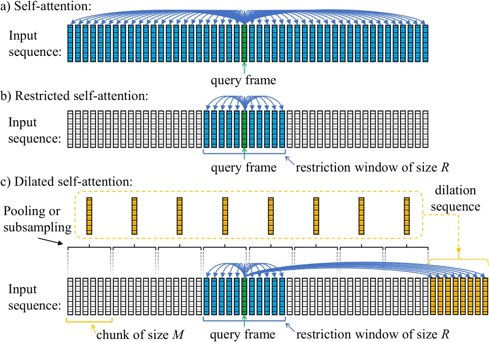

\bstctlcite

IEEEexample:BSTcontrol

# Capturing Multi-Resolution Context by Dilated Self-Attention

Niko Moritz    Takaaki Hori    Jonathan Le Roux

###### Abstract

Self-attention has become an important and widely used neural network
component that helped to establish new state-of-the-art results for
various applications, such as machine translation and automatic speech
recognition (ASR). However, the computational complexity of
self-attention grows quadratically with the input sequence length. This
can be particularly problematic for applications such as ASR, where an
input sequence generated from an utterance can be relatively long. In
this work, we propose a combination of restricted self-attention and a
dilation mechanism, which we refer to as dilated self-attention. The
restricted self-attention allows attention to neighboring frames of the
query at a high resolution, and the dilation mechanism summarizes
distant information to allow attending to it with a lower resolution.
Different methods for summarizing distant frames are studied, such as
subsampling, mean-pooling, and attention-based pooling. ASR results
demonstrate substantial improvements compared to restricted
self-attention alone, achieving similar results compared to
full-sequence based self-attention with a fraction of the computational
costs.

^(†)^(†)address: Mitsubishi Electric Research Laboratories (MERL),
Cambridge, MA, USA

Index Terms: dilated self-attention, transformer, automatic speech
recognition, computational complexity

## 1 Introduction

The attention mechanism has become a central component in many neural
network architectures for machine translation, speech processing,
language modeling, and computer vision \[1, 2, 3, 4, 5\]. It is
frequently used as a relay between encoder and decoder neural networks
or as a substitute for recurrent neural networks (RNNs) and
convolutional neural networks (CNNs) \[6, 7\]. Recently, the transformer
architecture \[8\], which utilizes attention throughout all model
components, has set new state-of-the-art results for many different
machine learning applications, including many speech and audio
processing tasks \[9, 10, 11, 12\]. As attention-based architectures
have been successfully applied for various domains, the number of model
parameters have tended to increase to further improve results using
deeper and wider architectures \[13, 14\]. However, in particular at
inference time, computational costs must be kept small to enable
scalability of a model for cloud-based services that serve many users
simultaneously or to allow local computation on mobile devices.

The attention mechanism is a method to query information from an input
sequence, which can also be regarded as reading from a memory \[1\]. In
self-attention, each frame of an input sequence is used once as a query
to read information from itself \[6, 8\]. In automatic speech
recognition (ASR), neighboring frames of such a query frame may belong
to the same phone, syllable, or word, where detailed information is
required to recognize their coherency. On the other hand, distant
information is relevant to recognize the context of sounds and words in
an utterance and to adapt to speaker or recording characteristics, which
typically requires less fine-grained information. This line of arguments
is also applicable to other tasks, e.g., to machine translation or
language modeling, where close-by words are more likely to have a
dependent relationship, while only a few distant words or word groups
are relevant to trace the semantic context and syntax of a sentence
\[15\].

This hypothesis is investigated in this work by combining restricted (or
time-restricted) self-attention with a dilation mechanism, whereby a
high self-attention resolution for neighboring frames and a lower
self-attention resolution for distant information are achieved. The
proposed method, named dilated self-attention in analogy to dilated
convolution \[16\], alleviates the quadratic computational cost growth
of self-attention with the input sequence length. Various frame rate
reduction methods are studied for the dilation mechanism, including
subsampling as well as pooling methods that extract or compress the
relevant information within a chunk of frames. We compare mean-pooling
to a newly proposed attention-based pooling approach in this work. In
such a setup, the computational cost of the restricted self-attention
grows only linearly with the input sequence length, and the
computational costs for attending to a dilation sequence are smaller by
a factor $`M`$ compared to standard self-attention, where $`M`$ denotes
the subsampling or the chunk size of the pooling operation. Thus, the
overall complexity of dilated self-attention is significantly reduced,
while the full context of an input sequence is still captured with
different resolutions.

ASR results are reported for two different data sets using a
transformer-based end-to-end ASR system. It is shown that dilated
self-attention can reduce self-attention costs by several orders with
almost no performance degradation for offline and streaming ASR
applications. In addition, dilated self-attention demonstrates clear
advances in terms of word error rates (WERs) over restricted
self-attention alone. An attention-based pooling method is proposed that
uses learned query vectors to compute the weighted average of each chunk
by attention, where optionally a post-processing stage can be applied,
e.g., to merge outputs of multiple attention heads. Among the tested
pooling methods, attention-based pooling with post-processing is shown
to achieve the highest robustness.

## 2 System Architecture

In this work, a joint connectionist temporal classification (CTC) and
transformer-based end-to-end ASR system is used, which combines the
advantages of both model types for training and decoding \[17, 10\]
achieving state-of-the-art ASR results \[18\] and enabling streaming
recognition of encoder-decoder based ASR systems \[11, 19\].

The transformer model leverages two different attention types:
encoder-decoder attention and self-attention \[8\]. Encoder-decoder
attention uses a decoder state as a query for attending to an input
sequence, the encoder output. In self-attention, the queries are
computed from the same input sequence, which results in an output
sequence of the same length. Both attention types of the transformer
model are based on the scaled dot-product attention mechanism,

```math
\text{Attention}(Q,K,V)=\text{Softmax}\left(\dfrac{QK^{\mathsf{T}}}{\sqrt{d_{k}}}\right)V, \tag{1}
```

where $`Q\in\mathbb{R}^{n_{q}\times d_{q}}`$,
$`K\in\mathbb{R}^{n_{k}\times d_{k}}`$, and
$`V\in\mathbb{R}^{n_{v}\times d_{v}}`$ are the queries, keys, and
values, where the $`d_{*}`$ denote dimensions and the $`n_{*}`$ denote
sequence lengths, $`d_{q}=d_{k}`$, and $`n_{k}=n_{v}`$ \[8\]. Instead of
using a single attention head, multiple attention heads are used with

```math
\displaystyle\text{MHA}(\hat{Q},\hat{K},\hat{V}) \displaystyle=\text{Concat}_{\text{f}}(\text{Head}_{1},\dots,\text{Head}_{d_{h}})W^{\text{H}} \tag{2}
```

```math
\displaystyle\text{and }\text{Head}_{i} \displaystyle=\text{Attention}(\hat{Q}W_{i}^{Q},\hat{K}W_{i}^{K},\hat{V}W_{i}^{V}), \tag{3}
```

where $`\hat{Q}`$, $`\hat{K}`$, and $`\hat{V}`$ are inputs to the
multi-head attention (MHA) layer, $`\text{Head}_{i}`$ represents the
output of the $`i`$-th attention head for a total number of $`d_{h}`$
heads, $`W_{i}^{Q}\in\mathbb{R}^{d_{\mathrm{model}}\times d_{q}}`$,
$`W_{i}^{K}\in\mathbb{R}^{d_{\mathrm{model}}\times d_{k}}`$,
$`W_{i}^{V}\in\mathbb{R}^{d_{\mathrm{model}}\times d_{v}}`$ as well as
$`W^{H}\in\mathbb{R}^{d_{h}d_{v}\times d_{\mathrm{model}}}`$ are
trainable weight matrices with typically
$`d_{k}=d_{v}=d_{\mathrm{model}}/d_{h}`$, and
$`\text{Concat}_{\text{f}}`$ denotes concatenation along the feature
dimension of size $`d_{v}`$.

The transformer encoder architecture consists of a two-layer CNN module
EncCNN and a stack of self-attention based layers EncSA:

```math
\displaystyle X_{0} \displaystyle=\textsc{EncCNN}(X)+\textsc{PE}, \tag{4}
```

```math
\displaystyle X_{E} \displaystyle=\textsc{EncSA}(X_{0}), \tag{5}
```

where PE are sinusoidal positional encodings \[8\] and $`X`$ denotes a
sequence of acoustic input features, which are 80-dimensional log-mel
spectral energies plus 3 extra features for pitch information \[20\].
Both CNN layers of EncCNN use a stride of size $`2`$, a kernel size of
$`3\times 3`$, and a ReLU activation function, which reduces the output
frame rate by a factor of 4. The EncSA module of (5) consists of $`E`$
layers, where the $`e`$-th layer, for $`e=1,\dots,E`$, is a composite of
a multi-head self-attention layer

```math
X^{\prime}_{e}=X_{e-1}+\text{MHA}_{e}(X_{e-1},X_{e-1},X_{e-1}), \tag{6}
```

and two feed-forward neural networks of inner dimension
$`d_{\mathrm{ff}}`$ and outer dimension $`d_{\mathrm{model}}`$ that are
separated by a ReLU activation function as follows:

```math
\displaystyle X_{e} \displaystyle=X^{\prime}_{e}+\text{FF}_{e}(X^{\prime}_{e}), \tag{7}
```

```math
\displaystyle\text{with }\text{FF}_{e}(X^{\prime}_{e}) \displaystyle=\text{ReLU}(X^{\prime}_{e}W_{e,1}^{\mathrm{ff}}+b_{e,1}^{\mathrm{ff}})W_{e,2}^{\mathrm{ff}}+b_{e,2}^{\mathrm{ff}}, \tag{8}
```

where
$`W_{e,1}^{\mathrm{ff}}\in\mathbb{R}^{d_{\mathrm{model}}\times d_{\mathrm{ff}}}`$,
$`W_{e,2}^{\mathrm{ff}}\in\mathbb{R}^{d_{\mathrm{ff}}\times d_{\mathrm{model}}}`$,
$`b_{e,1}^{\mathrm{ff}}\in\mathbb{R}^{d_{\mathrm{ff}}}`$, and
$`b_{e,2}^{\mathrm{ff}}\in\mathbb{R}^{d_{\mathrm{model}}}`$ are
trainable weight matrices and bias vectors.

The transformer objective function is defined as

```math
p_{\text{att}}(Y|X_{E})=\prod_{l=1}^{L}p(y_{l}|\bm{y}_{1:l-1},X_{E}) \tag{9}
```

with label sequence $`Y=(y_{1},\dots,y_{L})`$, label subsequence
$`\bm{y}_{1:l-1}=(y_{1},\dots,y_{l-1})`$, and the encoder output
sequence
$`X_{E}=\allowbreak(\bm{x}_{1}^{E},\dots\allowbreak,\bm{x}_{N}^{E})`$.
The term $`p(y_{l}|\bm{y}_{1:l-1},X_{E})`$ represents the transformer
decoder model, which consists of a stack of $`D`$ layers each applying
two MHA layers, one performing self-attention using $`\bm{y}_{1:l-1}`$
as an input and one for encoder-decoder attention, followed by a
feed-forward neural network similar to (8). Finally, the posterior
probabilities are estimated by applying a fully-connected neural network
to the last decoder layer and a softmax distribution over that output.

The transformer model is trained jointly with the CTC objective function
$`p_{\text{ctc}}`$ \[21, 18\] using the multi-objective loss function

```math
\mathcal{L}=-\gamma\log p_{\text{ctc}}-(1-\gamma)\log p_{\text{att}}, \tag{10}
```

where hyperparameter $`\gamma`$ controls the weighting between the two
objective functions $`p_{\text{ctc}}`$ and $`p_{\text{att}}`$.



Figure 1: Full-sequence based self-attention is shown in a), where each
bar of the input sequence represents an input frame or vector. A current
query frame is highlighted in green color and blue arrows represent
allowed attention connections. Restricted self-attention is depicted in
b), where frames within the restriction window are highlighted in blue
color. Dilated self-attention is shown in c), where a dilation sequence
(in yellow) is generated for the keys and values by a pooling or
subsampling mechanism and appended to keys and values of the restricted
sequence prior to self-attention.

## 3 Dilated Self-Attention

Self-attention, restricted self-attention, and dilated self-attention
are illustrated in Fig. 1. For restricted self-attention, the past and
future context (blue frames) relative to a current query vector (green
frame) is limited by using a fixed number of look-back and look-ahead
frames. For dilated self-attention, restricted self-attention is
combined with a dilation mechanism, which is shown in Fig. 1c. The
dilation mechanism subsamples or summarizes the keys/values and appends
the generated dilation sequence, which is of lower frame rate than the
input sequence, to the restricted keys/values for the restricted
self-attention process.

### 3.1 Dilation Mechanisms

The dilation mechanism at the $`e`$-th encoder layer first splits the
keys $`K_{i}=X_{e-1}W^{K}_{i}=(\bm{k}^{i}_{1},\dots,\bm{k}^{i}_{N})`$
and values
$`V_{i}=X_{e-1}W^{V}_{i}=(\bm{v}^{i}_{1},\dots,\bm{v}^{i}_{N})`$ each of
length $`N`$, cf. (3), into $`L=\lceil\frac{N}{M}\rceil`$
non-overlapping key chunks $`C^{K}_{i,l}`$ and value chunks
$`C^{V}_{i,l}`$ each of length $`M`$, such that

```math
\displaystyle C^{V}_{i,l} \displaystyle=(\bm{v}^{i}_{M(l-1)+1},\dots,\bm{v}^{i}_{M(l-1)+M}), \tag{11}
```

```math
\displaystyle C^{K}_{i,l} \displaystyle=(\bm{k}^{i}_{M(l-1)+1},\dots,\bm{k}^{i}_{M(l-1)+M}), \tag{12}
```

for $`l=1,\dots,L`$, where the last chunks, $`C_{i,L}^{V}`$ and
$`C_{i,L}^{K}`$, are zero-padded if they have fewer than $`M`$ frames.
Next, subsampling or pooling techniques are applied to each chunk, to
generate dilation sequences $`\Delta_{i}^{K}`$ and $`\Delta_{i}^{V}`$
that are appended to the restricted keys and values, respectively, by
modifying (3) as follows:

```math
\displaystyle\text{Head}_{i,n,e} \displaystyle=\text{Attention}(\bm{x}_{n}^{e-1}W_{i}^{Q},\bar{K}_{i,n,e},\bar{V}_{i,n,e}) \tag{13}
```

```math
\displaystyle\text{with }\bar{K}_{i,n,e} \displaystyle=\text{Concat}_{\text{t}}(\bm{k}^{i}_{n-\nu_{\text{lb}}:n+\nu_{\text{la}}},\Delta_{i}^{K}), \tag{14}
```

```math
\displaystyle\text{and }\bar{V}_{i,n,e} \displaystyle=\text{Concat}_{\text{t}}(\bm{v}^{i}_{n-\nu_{\text{lb}}:n+\nu_{\text{la}}},\Delta_{i}^{V}), \tag{15}
```

for $`n=1,\dots,N`$, where $`\nu_{\text{lb}}`$ and $`\nu_{\text{la}}`$
denote the number of look-back and look-ahead frames for the
time-restriction, which corresponds to a window size of
$`R=\nu_{\text{lb}}+\nu_{\text{la}}+1`$, and
$`\text{Concat}_{\text{t}}`$ denotes concatenation along the time
dimension (frames).

The subsampling-based dilation mechanism selects the first frame of each
chunk to form the dilation sequences
$`\Delta_{i}^{K}=(\bm{k}^{i}_{1},\allowbreak\dots,\bm{k}^{i}_{M(l-1)+1},\allowbreak\dots,\allowbreak\bm{k}^{i}_{M(L-1)+1})`$
and
$`\Delta_{i}^{V}=(\bm{v}^{i}_{1},\allowbreak\dots,\bm{v}^{i}_{M(l-1)+1},\allowbreak\dots,\allowbreak\bm{v}^{i}_{M(L-1)+1})`$.
Alternatively to subsampling, pooling methods can be applied to
summarize the frames of each chunk. In this work, we compare three
different pooling mechanisms: 1) mean-pooling (MP), 2) attention-based
pooling (AP), and 3) attention-based pooling with post-processing
(AP+PP).

For the mean-pooling (MP) based dilation mechanism, frames in each chunk
are averaged to the mean vectors

```math
\displaystyle\bm{\mu}^{[V,K]}_{i,l} \displaystyle=\frac{1}{M}\sum_{m}C^{[V,K]}_{i,l}[m], \tag{16}
```

for $`l=1,\dots,L`$, where the notation ^(\[V,K\]) denotes the
processing of either the values or the keys. We will continue to use
this notation for the following equations. The sequence of mean vectors
is used to form the dilation sequences
$`\Delta_{i}^{[V,K]}=(\bm{\mu}^{[V,K]}_{i,1},\dots,\bm{\mu}^{[V,K]}_{i,L})`$.

In attention-based pooling (AP), we train embedding vectors to query
summary information from the key and value chunks by using the attention
mechanism as follows:

```math
\displaystyle\bm{g}^{[V,K]}_{i,l} \displaystyle=\frac{1}{B}\sum_{b=1}^{B}\bm{a}^{[V,K]}_{i,b,l}, \tag{17}
```

```math
\displaystyle\bm{a}^{[V,K]}_{i,b,l} \displaystyle=\text{Attention}(\bar{\bm{q}}^{K}_{b},C^{K}_{i,l},C^{[V,K]}_{i,l}), \tag{18}
```

```math
\displaystyle\bar{\bm{q}}^{K}_{b} \displaystyle=\text{Embed}^{K}(b), \tag{19}
```

for $`l=1,\dots,L`$, where $`\bar{\bm{q}}^{K}_{b}`$ represents a query,
$`\text{Embed}^{K}(b)`$ maps the attention head numbers $`b=1,\dots,B`$
to trainable vectors of dimension $`d_{\text{k}}`$, and $`B`$ denotes
the total number of attention heads. The attention outputs
$`\bm{a}^{[V,K]}_{i,b,l}`$ are averaged along $`b=1,\dots,B`$ to form
the dilation sequences
$`\Delta_{i}^{[V,K]}=(\bm{g}^{[V,K]}_{i,1},\dots,\bm{g}^{[V,K]}_{i,L})`$.

Post-processing (PP) can be applied to $`\bm{a}^{[V,K]}_{i,l}`$ to
further process the AP output and to effectively join the output of
multiple attention heads using a two-layer feed-forward neural network
of inner dimension $`d_{\text{in}}`$ and outer dimension
$`d_{\text{[v,k]}}`$:

```math
\displaystyle\bm{p}^{[V,K]}_{i,l} \displaystyle=FF^{[V,K]}(\bm{a}^{[V,K]}_{i,l})+\bm{g}^{[V,K]}_{i,l}, \tag{20}
```

```math
\displaystyle FF^{[V,K]}\!(\bm{a}^{[V,K]}_{i,l})\! \displaystyle=\text{ReLU}(\bar{\bm{a}}^{[V,K]}_{i,l}W_{1}^{[V,K]}\!\!+\!\bm{b}_{1}^{[V,K]})W_{2}^{[V,K]}\!\!+\!\bm{b}_{2}^{[V,K]}\!, \tag{21}
```

```math
\displaystyle\bar{\bm{a}}^{[V,K]}_{i,l} \displaystyle=\text{Concat}_{\text{f}}(\bm{a}^{[V,K]}_{i,1,l},\dots,\bm{a}^{[V,K]}_{i,B,l}), \tag{22}
```

where
$`W_{1}^{[V,K]}\in\mathbb{R}^{d_{\text{[v,k]}}B\times d_{\text{in}}}`$,
$`W_{2}^{[V,K]}\in\mathbb{R}^{d_{\text{in}}\times d_{\text{[v,k]}}}`$,
$`\bm{b}_{1}^{[V,K]}\in\mathbb{R}^{d_{\text{in}}}`$, and
$`\bm{b}_{2}^{[V,K]}\in\mathbb{R}^{d_{\text{[v,k]}}}`$ are trainable
weight matrices and bias vectors and $`\text{Concat}_{\text{f}}`$
denotes concatenation of the vectors $`\bm{a}^{[V,K]}_{i,b,l}`$ for
$`b=1,\dots,B`$ along the feature dimension. The PP results
$`\bm{p}_{i,l}^{[V,K]}`$ are then used to form the dilation sequences
$`\Delta_{i}^{[V,K]}=(\bm{p}^{[V,K]}_{i,1},\dots,\bm{p}^{[V,K]}_{i,L})`$.

### 3.2 Computational complexity estimation

The computational complexity estimation in this work is based on the
number of floating-point multiplications of vector and matrix products,
which is described here by the $`\mathcal{M}`$ notation. For simplicity,
we ignore in the estimation scalar multiplications as well as additions,
since including these operations does not significantly change the
relative complexities when comparing the different methods. The
complexity of the full-sequence based self-attention process is
$`\mathcal{M}(N^{2}d_{\text{model}})`$, where $`N`$ denotes the length
of an input sequence and $`d_{\text{model}}`$ the attention model
dimension, cf. Section 2. The complexity for restricted self-attention
is $`\mathcal{M}(NRd_{\text{model}})`$, where $`R`$ is the size of the
restriction window, which is constant and typically significantly
smaller than $`N`$. The computational complexity of dilated
self-attention is
$`\mathcal{M}(N(R+\lceil\frac{N}{M}\rceil)d_{\text{model}})+\xi`$, which
includes the attention costs for restricted self-attention with the
appended dilation sequence plus $`\xi`$, the complexity of the dilation
mechanism.

The complexity $`\xi`$ of the AP mechanism amounts to
$`\mathcal{M}(Nd_{\text{model}}B)`$ for the dot-product attention of the
learned queries $`\bm{\bar{q}}`$ and the key chunks $`C_{l}^{K}`$, where
the computed attention weights are reused to summarize the value chunks
$`C_{l}^{V}`$ as well. The complexity of PP amounts to
$`\mathcal{M}(2(B+1)d_{\text{model}}d_{\text{in}}\lceil\frac{N}{M}\rceil)`$
for post-processing the attention results of the key and value chunks as
described in (20). In order to reduce the computational complexity for
the following experiments, the feed-forward neural network of the
post-processing stage uses a bottleneck of inner dimension
$`d_{\text{in}}=16`$.

### 3.3 Related Work

The closest prior art to this work is Transformer-XL \[22\] and the
recently proposed self-attention with augmented memory \[23\]. However,
both are different in various ways, e.g., Transformer-XL incorporates
history information at each layer only from the previous chunk and from
a lower layer. Self-attention with augmented memory uses mean-pooling on
chunks of the input sequence to form a summarization query for computing
attention weights over the current chunk plus the summarization outputs
from previous chunks. This is a recursive operation, which cannot be
easily parallelized, unlike our proposed solution. Moreover, we use
learned embedding vectors for the summarization queries instead of
mean-pooling, whereby the characteristics of the relevant frames are
learned and which also allows us to use multiple queries per chunk.

## 4 Experiments

### 4.1 Datasets

The LibriSpeech corpus and the Wall Street Journal (WSJ) corpus are used
in this work \[24, 25\]. LibriSpeech is a corpus of read English audio
books with about 960 hours of training data, 10.7 hours of development
data, and 10.5 hours of test data. The development and test data sets
are both split into approximately two halves named “clean” and “other”,
based on the quality of the recorded speech utterances as assessed using
an ASR system \[24\]. WSJ is a data set of read English newspapers with
approximately 81 hours of training data, 1.1 hours of development data,
and 0.7 hours of test data \[25\]. The average duration of a LibriSpeech
utterance amounts to 12.3 seconds, the median duration to 13.8 seconds,
and the maximum duration to 29.7 seconds. For the WSJ corpus, the
average duration of an utterance is 7.8 seconds, the median duration is
7.7 seconds, and the maximum duration 24.4 seconds.

### 4.2 Settings

For LibriSpeech-based experiments, the transformer model parameters are
$`d_{\mathrm{model}}=512`$, $`d_{\mathrm{ff}}=2048`$, $`d_{h}=8`$,
$`E=12`$, and $`D=6`$. They are the same for WSJ except
$`d_{\mathrm{model}}=256`$ and $`d_{h}=4`$. The Adam optimizer with
$`\beta_{1}=0.9`$, $`\beta_{2}=0.98`$, $`\epsilon=10^{-9}`$ and learning
rate scheduling similar to \[8\] is applied for training using 25000
warmup steps. The learning rate factor and the maximum number of
training epochs are set to 5.0 and 120 for LibriSpeech, and to 10.0 and
100 for WSJ. Output tokens for the LibriSpeech model consist of 5000
subwords obtained by the SentencePiece method \[26\]. For WSJ, the
number of output tokens amounts to 50, the number of characters in WSJ.
Weight factor $`\gamma`$, which is used to balance the CTC and
transformer model objectives during training, is set to 0.3. Layer
normalization is applied before and dropout with a rate of 10% after
each MHA and FF layer. In addition, label smoothing with a penalty of
0.1 is used and SpecAugment is applied for the LibriSpeech-based ASR
experiments \[27\]. An RNN-based language model (LM) is employed via
shallow fusion for each data sets: a word-based LM of 65k words is
applied for WSJ \[28\] and a subword-based LM is applied for LibriSpeech
\[20\]. The LM weight, CTC weight, and beam size for joint CTC-attention
decoding are set to 0.6, 0.4, and 30 for LibriSpeech and to 1.0, 0.3,
and 10 for WSJ.

### 4.3 Results

|                     |                    |        |       |                 |           |      |
| ------------------- | ------------------ | ------ | ----- | --------------- | --------- | ---- |
| self-attention type | dilation mechanism |        |       |                 | WER \[%\] |      |
|                     |                    | $`R`$  | $`M`$ | $`\mathcal{M}`$ | dev       | test |
| full-sequence       | \-                 | \-     | \-    | 9.8M            | 7.7       | 4.7  |
| restricted          | \-                 | $`35`$ | \-    | 1.8M            | 8.7       | 5.9  |
| restricted          | \-                 | $`21`$ | \-    | 1.1M            | 8.7       | 5.6  |
| restricted          | \-                 | $`15`$ | \-    | 0.8M            | 8.6       | 5.8  |
| restricted          | \-                 | $`13`$ | \-    | 0.7M            | 9.0       | 5.7  |
| restricted          | \-                 | $`11`$ | \-    | 0.6M            | 8.9       | 6.2  |
| dilated             | subsampling        | $`15`$ | 10    | 1.8M            | 8.0       | 5.2  |
| dilated             | MP                 | $`15`$ | 10    | 1.8M            | 7.9       | 5.4  |
| dilated             | AP-1               | $`15`$ | 11    | 1.8M            | 7.7       | 4.9  |
| dilated             | AP-2               | $`15`$ | 12    | 1.8M            | 7.7       | 4.9  |
| dilated             | AP-1+PP            | $`21`$ | 20    | 1.8M            | 7.7       | 4.9  |
| dilated             | AP-2+PP            | $`21`$ | 27    | 1.8M            | 7.6       | 5.1  |
| dilated             | subsampling        | $`11`$ | 20    | 1.1M            | 8.1       | 5.3  |
| dilated             | MP                 | $`11`$ | 20    | 1.1M            | 7.7       | 5.2  |
| dilated             | AP-1               | $`11`$ | 22    | 1.1M            | 7.6       | 5.1  |
| dilated             | AP-2               | $`11`$ | 28    | 1.1M            | 7.7       | 5.1  |
| dilated             | AP-1+PP            | $`9`$  | 24    | 1.1M            | 8.2       | 5.2  |
| dilated             | AP-2+PP            | $`9`$  | 33    | 1.1M            | 7.6       | 4.9  |

Table 1: WSJ-based ASR results for self-attention, restricted
self-attention, and dilated self-attention. $`R`$ denotes the symmetric
restriction window size and $`M`$ the chunk size in number of frames.
$`\mathcal{M}`$ denotes the number of multiplications for self-attention
with $`N=195`$ (average input length) and $`d_{\text{model}}=256`$.
Numbers after a hyphen denote the number of attention heads for AP.

|                                                           |                    |                        |                        |                 |       |       |       |       |
| --------------------------------------------------------- | ------------------ | ---------------------- | ---------------------- | --------------- | ----- | ----- | ----- | ----- |
| self-attention type                                       | dilation mechanism |                        |                        |                 | dev   |       | test  |       |
|                                                           |                    | $`R`$                  | $`M`$                  | $`\mathcal{M}`$ | clean | other | clean | other |
| full-sequence                                             | \-                 | \-                     | \-                     | 52M             | 2.3   | 5.7   | 2.6   | 6.0   |
| restricted                                                | \-                 | 41                     | \-                     | 6.5M            | 2.5   | 6.5   | 2.7   | 6.6   |
| restricted                                                | \-                 | 25                     | \-                     | 4.0M            | 2.4   | 6.5   | 2.6   | 7.0   |
| restricted                                                | \-                 | 13                     | \-                     | 2.1M            | 2.5   | 7.0   | 2.7   | 7.2   |
| dilated                                                   | subsampling        | 25                     | 20                     | 6.5M            | 2.3   | 6.1   | 2.6   | 6.2   |
| dilated                                                   | MP                 | 25                     | 20                     | 6.5M            | 2.3   | 6.1   | 2.6   | 6.2   |
| dilated                                                   | AP-1               | 25                     | 20                     | 6.7M            | 2.3   | 5.8   | 2.5   | 6.1   |
| dilated                                                   | AP-2               | 25                     | 20                     | 6.8M            | 2.3   | 6.1   | 2.5   | 6.1   |
| dilated                                                   | AP-1+PP            | 25                     | 20                     | 7.2M            | 2.3   | 5.9   | 2.5   | 6.1   |
| dilated                                                   | AP-2+PP            | 25                     | 20                     | 7.6M            | 2.2   | 5.8   | 2.4   | 5.9   |
| dilated                                                   | AP-2+PP            | 17                     | 19                     | 6.6M            | 2.2   | 5.8   | 2.5   | 6.0   |
| dilated                                                   | subsampling        | 13                     | 40                     | 3.3M            | 2.4   | 6.5   | 2.6   | 6.7   |
| dilated                                                   | MP                 | 13                     | 40                     | 3.3M            | 2.5   | 6.6   | 2.6   | 6.6   |
| dilated                                                   | AP-1               | 11                     | 34                     | 3.5M            | 2.4   | 6.0   | 2.5   | 6.3   |
| dilated                                                   | AP-2+PP            | 11                     | 50                     | 3.5M            | 2.2   | 5.9   | 2.5   | 6.2   |
| Triggered Attention-based Streaming End-to-End ASR \[11\] |                    |                        |                        |                 |       |       |       |       |
| self-attention type                                       | dilation mechanism |                        |                        |                 | dev   |       | test  |       |
|                                                           |                    | $`\bm{v}_{\text{lb}}`$ | $`\bm{v}_{\text{la}}`$ | $`M`$           | clean | other | clean | other |
| restricted                                                | \-                 | $`\infty`$             | 1                      | \-              | 2.8   | 7.5   | 3.1   | 8.1   |
| dilated                                                   | AP-2+PP            | 9                      | 1                      | 15              | 2.9   | 7.9   | 3.0   | 8.1   |

Table 2: LibriSpeech-based WER \[%\] for self-attention, restricted
self-attention, and dilated self-attention with results for streaming
end-to-end ASR at the bottom \[11\]. The computational complexity
estimate $`\mathcal{M}`$ is based on using $`d_{\text{model}}=512`$ and
$`N=310`$, which is the average encoder sequence length of a LibriSpeech
utterance.

Table 1 shows the WSJ-based ASR results for full-sequence based
self-attention, restricted self-attention, and dilated self-attention.
Different settings for restricted and dilated self-attention are
compared. In addition, subsampling, mean-pooling (MP), and
attention-based pooling (AP) with and without post-processing (PP) are
investigated, where the number of attention heads $`B`$ is shown by
AP-$`B`$. The corresponding computational costs are given as an example
for a WSJ utterance of average length (7.8 sec.), which corresponds to a
sequence length of 195 frames for a frame rate of 40 ms. It can be
noticed that restricted self-attention considerably increases WERs by
more than $`1\%`$ for all tested restriction window sizes. Dilated
self-attention can compensate to a large extent this loss in accuracy,
achieving consistently better WERs compared to restricted
self-attention. The overall best performing dilation mechanism is AP,
achieving similar results compared to full-sequence based self-attention
with more than $`88\%`$ fewer computational operations.

LibriSpeech ASR results are shown in Table 2. Simply using restricted
self-attention increases WERs on test-other by $`0.6\%`$ ($`R`$=41),
$`1.0\%`$ ($`R`$=25), and $`1.2\%`$ ($`R`$=13). Dilated self-attention
almost completely equalizes the disadvantages of restricted
self-attention, where the AP-2+PP setup shows the best ASR results. For
example, for $`R`$=25 and $`M`$=20, the AP-2+PP system achieves a WER of
$`2.4\%`$ and $`5.9\%`$ for test-clean and test-other, which is even
slightly lower compared to WERs of full-sequence based self-attention
with only $`15\%`$ of the computational costs for self-attention.

Finally, the AP-2+PP approach is applied to a triggered attention (TA)
based streaming end-to-end ASR system \[11\], where a TA look-ahead of
12 frames and an encoder look-ahead of 1 frame are used, which results
in an algorithmic delay of $`480`$ ms for the TA-based decoder plus
$`480`$ ms for the encoder. In this setup, the dilation mechanism only
processes past encoder frames, i.e., input frames up to the query frame.
Results demonstrate that dilated self-attention, where the dilation
mechanism is applied to past frames only, achieves about similar ASR
results compared to using the full past for self-attention, while the
computational complexity is substantially reduced. For example, for
computing the next self-attention output with 4 or 8 seconds of past
audio input, the computational complexity of self-attention is reduced
by a factor 7.2 or 11.8 if no new dilation output is computed and by a
factor 1.25 or 2.4 when a new full chunk is processed for extending the
dilation sequences $`\Delta_{i}^{[V,K]}`$, which is computed every
$`M`$=15 frames.

## 5 Conclusions

We proposed a dilation mechanism to reduce the computational complexity
of self-attention by enabling attention to an input sequence with
different levels of resolution. Subsampling, mean-pooling, and
attention-based pooling techniques are investigated for summarizing and
capturing long-context information in self-attention and to reduce the
frame rate of distant information relative to a query. Dilated
self-attention is non-recursive, which allows it to be parallelized for
efficient implementation, and it has demonstrated substantial
improvements compared to restricted self-attention with attention-based
pooling leading to the best ASR results. Dilated self-attention has
reached WERs of $`2.4\%`$ and $`5.9\%`$ for the test-clean and
test-other conditions of LibriSpeech, which is even slightly lower than
the standard self-attention mode with only $`15\%`$ of the computational
costs for self-attention. In addition, dilated self-attention has been
applied to a triggered attention-based ASR system, where it has
demonstrated to be effective for streaming ASR as well.

## References

- \[1\] J. Chorowski, D. Bahdanau, D. Serdyuk, K. Cho, and Y. Bengio,
  “Attention-based models for speech recognition,” in _Proc. Advances in
  Neural Information Processing Systems (NIPS)_, Dec. 2015, pp. 577–585.
- \[2\] D. Bahdanau, K. Cho, and Y. Bengio, “Neural machine translation
  by jointly learning to align and translate,” _arXiv preprint
  arXiv:abs/1409.0473_, 2014.
- \[3\] N. Parmar, P. Ramachandran, A. Vaswani, I. Bello, A. Levskaya,
  and J. Shlens, “Stand-alone self-attention in vision models,” in
  _Proc. Advances in Neural Information Processing Systems (NeurIPS)_,
  Dec. 2019, pp. 68–80.
- \[4\] H. Zhao, J. Jia, and V. Koltun, “Exploring self-attention for
  image recognition,” in _Proc. Computer Vision and Pattern Recognition
  (CVPR)_, Jun. 2020.
- \[5\] K. Irie, A. Zeyer, R. Schlüter, and H. Ney, “Language modeling
  with deep transformers,” in _Proc. ISCA Interspeech_, Sep. 2019, pp.
  3905–3909.
- \[6\] A. P. Parikh, O. Tackstrom, D. Das, and J. Uszkoreit, “A
  decomposable attention model for natural language inference,” in
  _Proc. Conference on Empirical Methods in Natural Language Processing
  (EMNLP)_, Nov. 2016.
- \[7\] D. Povey, H. Hadian, P. Ghahremani, K. Li, and S. Khudanpur, “A
  time-restricted self-attention layer for ASR,” in _Proc. IEEE
  International Conference on Acoustics, Speech and Signal Processing
  (ICASSP)_, 2018, pp. 5874–5878.
- \[8\] A. Vaswani, N. Shazeer, N. Parmar, J. Uszkoreit, L. Jones, A. N.
  Gomez, L. Kaiser, and I. Polosukhin, “Attention is all you need,” in
  _Proc. Advances in Neural Information Processing Systems (NIPS)_, Dec.
  2017, pp. 6000–6010.
- \[9\] L. Dong, S. Xu, and B. Xu, “Speech-transformer: A no-recurrence
  sequence-to-sequence model for speech recognition,” in _Proc. IEEE
  International Conference on Acoustics, Speech and Signal Processing
  (ICASSP)_, Apr. 2018, pp. 5884–5888.
- \[10\] S. Karita, N. Chen, T. Hayashi, T. Hori, H. Inaguma, Z. Jiang,
  M. Someki, N. E. Y. Soplin, R. Yamamoto, X. Wang, S. Watanabe,
  T. Yoshimura, and W. Zhang, “A comparative study on transformer vs RNN
  in speech applications,” in _Proc. IEEE Workshop on Automatic Speech
  Recognition and Understanding (ASRU)_, Dec. 2019.
- \[11\] N. Moritz, T. Hori, and J. Le Roux, “Streaming automatic speech
  recognition with the transformer model,” in _Proc. IEEE International
  Conference on Acoustics, Speech and Signal Processing (ICASSP)_, May
  2020, pp. 6074–6078.
- \[12\] N. Moritz, T. Hori, and J. Le Roux, “All-in-one transformer:
  Unifying speech recognition, audio tagging, and event detection,” in
  _Proc. ISCA Interspeech_, Oct. 2020.
- \[13\] M. Shoeybi, M. Patwary, R. Puri, P. LeGresley, J. Casper, and
  B. Catanzaro, “Megatron-LM: Training multi-billion parameter language
  models using model parallelism,” _arXiv preprint
  arXiv:1909.08053_, 2019.
- \[14\] J. Devlin, M.-W. Chang, K. Lee, and K. Toutanova, “BERT:
  Pre-training of deep bidirectional transformers for language
  understanding,” _arXiv preprint arXiv:abs/1810.04805_, 2019.
- \[15\] U. Khandelwal, H. He, P. Qi, and D. Jurafsky, “Sharp nearby,
  fuzzy far away: How neural language models use context,” in _Proc.
  Annual Meeting of the Association for Computational Linguistics
  (ACL)_, Jul. 2018, pp. 284–294.
- \[16\] F. Yu and V. Koltun, “Multi-scale context aggregation by
  dilated convolutions,” in _Proc. International Conference on Learning
  Representations (ICLR)_, May 2016.
- \[17\] S. Watanabe, T. Hori, S. Kim, J. R. Hershey, and T. Hayashi,
  “Hybrid CTC/attention architecture for end-to-end speech recognition,”
  _J. Sel. Topics Signal Processing_, vol. 11, no. 8, pp.
  1240–1253, 2017.
- \[18\] S. Karita, N. Yalta, S. Watanabe, M. Delcroix, A. Ogawa, and
  T. Nakatani, “Improving transformer-based end-to-end speech
  recognition with connectionist temporal classification and language
  model integration,” in _Proc. ISCA Interspeech_, Sep. 2019, pp.
  1408–1412.
- \[19\] N. Moritz, T. Hori, and J. Le Roux, “Streaming end-to-end
  speech recognition with joint CTC-attention based models,” in _Proc.
  IEEE Workshop on Automatic Speech Recognition and Understanding
  (ASRU)_, Dec. 2019, pp. 936–943.
- \[20\] T. Hori, S. Watanabe, Y. Zhang, and W. Chan, “Advances in joint
  CTC-attention based end-to-end speech recognition with a deep CNN
  encoder and RNN-LM,” in _Proc. ISCA Interspeech_, Aug. 2017, pp.
  949–953.
- \[21\] A. Graves, S. Fernández, F. J. Gomez, and J. Schmidhuber,
  “Connectionist temporal classification: Labelling unsegmented sequence
  data with recurrent neural networks,” in _Proc. International
  Conference on Machine Learning (ICML)_, vol. 148, Jun. 2006, pp.
  369–376.
- \[22\] Z. Dai, Z. Yang, Y. Yang, J. G. Carbonell, Q. V. Le, and
  R. Salakhutdinov, “Transformer-XL: Attentive language models beyond a
  fixed-length context,” _arXiv preprint arXiv:1901.02860_, 2019.
- \[23\] C. Wu, Y. Wang, Y. Shi, C.-F. Yeh, and F. Zhang, “Streaming
  transformer-based acoustic models using self-attention with augmented
  memory,” in _Proc. ISCA Interspeech_, Oct. 2020.
- \[24\] V. Panayotov, G. Chen, D. Povey, and S. Khudanpur,
  “LibriSpeech: An ASR corpus based on public domain audio books,” in
  _Proc. IEEE International Conference on Acoustics, Speech and Signal
  Processing (ICASSP)_, Apr. 2015, pp. 5206–5210.
- \[25\] “CSR-II (WSJ1) complete,” vol. LDC94S13A. Philadelphia:
  Linguistic Data Consortium, 1994.
- \[26\] T. Kudo and J. Richardson, “SentencePiece: A simple and
  language independent subword tokenizer and detokenizer for neural text
  processing,” _arXiv preprint arXiv:abs/1808.06226_, 2018.
- \[27\] D. S. Park, W. Chan, Y. Zhang, C.-C. Chiu, B. Zoph, E. D.
  Cubuk, and Q. V. Le, “SpecAugment: A simple data augmentation method
  for automatic speech recognition,” _arXiv preprint
  arXiv:abs/1904.08779_, 2019.
- \[28\] T. Hori, J. Cho, and S. Watanabe, “End-to-end speech
  recognition with word-based RNN language models,” in _Proc. IEEE
  Spoken Language Technology Workshop (SLT)_, Dec. 2018, pp. 389–396.
