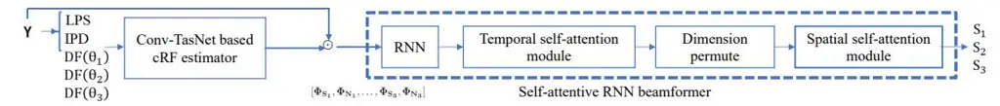
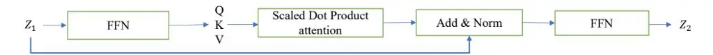
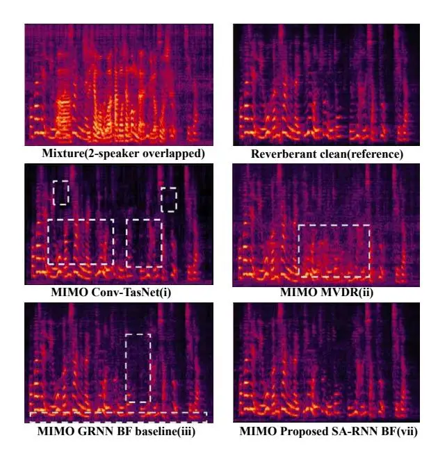

# MIMO Self-attentive RNN Beamformer for Multi-speaker Speech Separation

Xiyun $Li^{1,2,3,*}$ , Yong $Xu^3$ , Meng $Yu^3$ , Shi-Xiong Zhang3, Jiaming $Xu^{1,2}$ , Bo $Xu^{1,2}$ , Dong $Yu^3$

1Institute of Automation, Chinese Academy of Sciences (CASIA), Beijing, China 2School of Future Technology, University of Chinese Academy of Sciences, Beijing, China 3Tencent AI Lab, Bellevue, USA

{lucayongxu,raymondmyu,auszhang,dyu}@tencent.com, {lixiyun2020,jiaming.xu,xubo}@ia.ac.cn

# **Abstract**

Recently, our proposed recurrent neural network (RNN) based all deep learning minimum variance distortionless response (ADL-MVDR) beamformer method yielded superior performance over the conventional MVDR by replacing the matrix inversion and eigenvalue decomposition with two RNNs. In this work, we present a self-attentive RNN beamformer to further improve our previous RNN-based beamformer by leveraging on the powerful modeling capability of self-attention. Temporal-spatial self-attention module is proposed to better learn the beamforming weights from the speech and noise spatial covariance matrices. The temporal self-attention module could help RNN to learn global statistics of covariance matrices. The spatial self-attention module is designed to attend on the cross-channel correlation in the covariance matrices. Furthermore, a multi-channel input with multi-speaker directional features and multi-speaker speech separation outputs (MIMO) model is developed to improve the inference efficiency. The evaluations demonstrate that our proposed MIMO self-attentive RNN beamformer improves both the automatic speech recognition (ASR) accuracy and the perceptual estimation of speech quality (PESQ) against prior arts.

**Index Terms**: Speech separation, MIMO, MVDR, Self-attentive RNN beamformer, spatial self-attention

# 1. Introduction

Minimum variance distortionless response (MVDR) is a widely used beamformer for the automatic speech recognition (ASR) [1]. Recently, the mask-based MVDR [1, 2, 3, 4, 5, 6] achieved better ASR accuracy than purely "black box" neural network-based approaches [7, 8, 9, 10, 11] due to less non-linear distortion. However, the residual noise level of the MVDR separated speech is still high [12]. Furthermore, the matrix inversion involved in the traditional MVDR solution always has the numerical instability problem [13, 14, 15, 16]. Although some techniques, e.g., diagonal loading [13], could be used to alleviate this issue, it has not been fully solved.

The RNN was once demonstrated to be able to implement the matrix inversion and eigenvalue decomposition [17, 18, 19, 20]. Based on this, we recently proposed the ADL-MVDR [21, 22] beamforming method, where two RNNs are used to replace the matrix inversion and principal component analysis (PCA) operations of the original MVDR algorithm. Compared to the conventional MVDR, better residual noise reduction and ASR accuracy are obtained. Unlike the ADL-MVDR, a more generalized RNN-based beamformer (GRNN-BF) [23] was later proposed to learn the frame-level beamforming weights from the estimated speech and noise covariance ma-

trices directly. The GRNN-BF can converge to a better beamforming solution without following any format of traditional beamformers (e.g., MVDR).

On the other hand, the self-attention [24, 25] is a popular method to learn the global dependencies for the speech separation task [26, 27, 28, 29, 30, 31, 32]. However, in those works, the self-attention is used for predicting the separation mask while we aim to learn the beamforming filter from the covariance matrices in this paper. Two types of self-attention modules with different purposes are proposed to better learn the cross-channel spatial correlations and improve the temporal modeling capability of the RNN-based beamformer [23, 21].

In this work, a MIMO self-attentive RNN beamformer is proposed to learn the frame-level beamforming weights for all speakers from all the speech and noise covariance matrices directly. There are three main contributions. First, we propose a temporal-spatial self-attention module to learn the beamforming weights. The spatial self-attention can learn the crosschannel correlations from the covariance matrices. The temporal self-attention is designed to consolidate the RNNs to capture the long-term statistics of covariance matrices. Second, the temporal self-attention, the spatial self-attention, and the RNN are demonstrated to be complementary to each other. Better performance is achieved by comparing with the RNN-based beamformer baseline [23, 21]. Finally, unlike our previous target speech separation [21, 23, 6], our proposed model here is a MIMO model to enable the inference computation efficiency. It means that multi-speaker speech separation outputs could be obtained simultaneously by feeding with multiple speakerdependent directional features.

The rest of the paper is organized as follows. In Sec. 2, we describe our proposed MIMO self-attentive RNN beamformer with complex-valued ratio filter (cRF). The cRF estimator and the experimental setup are given in Sec. 3. The results are presented in Sec. 4. We conclude the paper in Sec. 5.

# 2. MIMO self-attentive RNN beamformer

#### 2.1. Problem definition

Given the M-channel mixture signal $\mathbf{y} = [\mathbf{y}_1, ..., \mathbf{y}_M]$ , the corresponding signal model in the short-time Fourier transform (STFT) domain is defined as,

$$\mathbf{Y}(t,f) = \sum_{i=1}^{C} \mathbf{S}_i(t,f) + \mathbf{U}(t,f)$$
(1)

$$\mathbf{N}_{i}(t,f) = \sum_{j \neq i}^{C} \mathbf{S}_{j}(t,f) + \mathbf{U}(t,f)$$
(2)

where $S_i$ and U represent the _i_-th speaker's reverberated speech and background noise, respectively. $N_i$ is the corresponding

\*This work was done when Xiyun Li was an intern in Tencent.

Figure 1: The system framework consists of a complex-valued ratio filter (cRF) estimator and the proposed self-attentive RNN beamformer. Different from the original Conv-TasNet [10], the encoder of our cRF estimator is a fixed STFT layer [33]. The estimated speech and noise cRFs could be used to calculate the covariance matrices. The input of the self-attentive RNN beamformer is concatenation of all speakers' speech and noise covariance matrices. The temporal self-attention module calculates the attention matrix among frames, while the spatial self-attention calculates the attention matrix among microphone channels.

Figure 2: The structure of self-attention module. Note that the temporal self-attention and the spatial self-attention attend on the time dimension and the spatial channel dimension, respectively.

interfering noise (the sum of other speakers' interfering speech and the background noise) of the i-th speaker. C is the total number of overlapped speakers in the utterance. t and f are the time frame index and the frequency bin index, respectively.

Our task aims at separating all of the speakers' speech $S_i$ simultaneously. Different from our previous works [23, 21] which focus only on separating the target speaker's speech. here we need to separate all speakers' speech simultaneously. The input includes the log-power spectra (LPS), the interaural phase difference (IPD), and multiple speakers' direction of arrival (DOA) $\theta$ . Then the speaker-dependent directional feature $(DF(\theta))$ [34], could be calculated based on the DOAs. With the speaker-dependent DOA information, the model could easily figure out the order of the separation outputs and avoid the speaker permutation problem [8, 35]. As shown in Fig. 1, the whole system consists of two parts, a complex-valued ratio filter (cRF) [36, 21] estimator and the proposed self-attentive RNN beamformer. The details of the cRF estimator, which can estimate the speech and noise, will be described in Sec. 3. The proposed self-attentive RNN beamformer, which can learn the beamforming weights from the covariance matrices directly, will be introduced first here.

### 2.2. Generalized RNN-beamformer baseline

Our recent work [23] proposed a generalized RNN-based beamformer (GRNN-BF) method. The GRNN-BF used the complex-valued ratio filter (cRF) [36] to calculate the target speech and noise covariance matrices. The cRF is just an extended version of complex-valued ratio mask (cRM) [37] by using the neighboring context information. Then a RNN model was applied to learn the frame-level beamforming weights directly from the covariance matrices. As shown in Fig. 1, the cRF estimator first predicts the target speech and noise cRFs. Then the estimated i-th speaker's speech $\hat{\mathbf{S}}_i(t,f)$ is,

$$\hat{\mathbf{S}}_{i}(t, f) = \sum_{\tau_{1} = -L}^{\tau_{1} = L} \sum_{\tau_{2} = -L}^{\tau_{2} = L} \text{cRF}_{\mathbf{S}_{i}} (t + \tau_{1}, f + \tau_{2}) * \mathbf{Y} (t + \tau_{1}, f + \tau_{2})$$
(3)

where L defines the neighboring context size across the frequency bins and the time frames. The corresponding i-th speaker's noise $\hat{\mathbf{N}}_i(t,f)$ with the corresponding noise $\mathrm{cRF}_{\mathbf{N}_i}(t,f)$ could be estimated in the same way. The frame-

wise i-th speaker's speech covariance is calculated as,

$$\mathbf{\Phi}_{\mathbf{S}_{i}}(t, f) = \frac{\hat{\mathbf{S}}_{i}(t, f)\hat{\mathbf{S}}_{i}^{\mathrm{H}}(t, f)}{\sum_{t=1}^{T} c\mathrm{RM}_{\mathbf{S}_{i}}^{\mathrm{H}}(t, f) c\mathrm{RM}_{\mathbf{S}_{i}}(t, f)} \tag{4}$$

where $cRM_{\mathbf{S}_i}(t,f)$ stands for the center mask of the $cRF_{\mathbf{S}_i}(t,f)$ . Then RNNs are used to directly learn the frame-level beamforming weights from the frame-wise covariance matrices [23], which can be formulated as

$$\mathbf{I}_{i}(t,f) = [\mathbf{\Phi}_{\mathbf{S}_{i}}(t,f), \mathbf{\Phi}_{\mathbf{N}_{i}}(t,f)]$$
(5)

$$\mathbf{w}_1(t, f), ..., \mathbf{w}_C(t, f) = \text{RNN}([\mathbf{I}_1(t, f), ..., \mathbf{I}_C(t, f)])$$
(6

where $\mathbf{I}_{i}(t, f)$ stands for the concatenation of _i_-th speaker's speech and noise covariance matrices, $\mathbf{w}_{i}(t, f) \in \mathbb{C}^{M}$ denotes the i-th speaker's beamforming weights.

# 2.3. Proposed MIMO self-attentive RNN beamformer

Fig. 1 shows the detailed architecture of our MIMO self-attentive RNN beamforming system. The model consists of a cRF estimator and the proposed self-attentive RNN beamformer. Similar to GRNN-BF [23], the cRFs first help to estimate the speech and noise covariance matrices (as shown in Eq. (4)). Then the self-attentive RNN beamformer could predict the frame-level beamforming weights from the covariance matrices. Several types of self-attention modules, namely temporal self-attentive module, and spatial self-attentive module, temporal-spatial self-attentive module are proposed to further improve the RNN-based beamformer [23] to learn a better beamforming filter in this work.

#### 2.3.1. Temporal self-attentive module

Self-attention [24], with the powerful modeling capability, is widely used in the speech enhancement and speech separation tasks [26, 27, 38, 28, 31]. We first propose a temporal self-attention module to improve the temporal modeling capability of RNNs. As shown in Fig. 2, the input $\mathbf{Z}_1$ to the self-attention module is processed by three linear transform layers on the feature dim followed by the PReLU activation, which is denoted as the feed-forward network (FFN). The outputs of the FFN are represented as $\mathbf{Q}$ , $\mathbf{K}$ , $\mathbf{V}$ . Then a self-attention function is applied to exploit cross-frame correlation, followed by a residual path and a layer normalization. The temporal self-attention cal-

culates the attention matrix among frames,

$$Attention(\mathbf{Q}, \mathbf{K}, \mathbf{V}) = \operatorname{softmax}\left(\frac{\mathbf{Q}\mathbf{K}^{\top}}{\sqrt{d_k}}\right)\mathbf{V} \tag{7}$$

where $d_k$ stands for the hidden layer dimension of K. Finally, the output of the self-attention function is fed into another FFN to get the transformed output $\mathbf{Z}_2$ . Different from other works [26, 27, 38, 28, 30] which apply self-attention layers to predict the separation mask, we use a self-attention module to estimate the beamforming weights.

#### 2.3.2. Spatial self-attentive module

To better learn cross-channel correlations from the covariance matrices, we also propose a spatial self-attention module. Instead of acting on the time dimension as the temporal self-attention did, the spatial self-attention module attends on the spatial channel dimension to learn the cross-channel information. As shown in Fig. 1, a dimension permute operation is applied before the spatial self-attention module is conducted.

Different from [38] where a similar spatial self-attention module is applied on the amplitude spectrogram to learn the separation mask, our proposed self-attention module learns on the complex-valued frequency domain for predicting the beamforming filter. In the amplitude of the frequency domain, the phase information of different microphone channels is lost and the self-attention can not effectively utilize the spatial correlations. However, our proposed spatial self-attention module could fully learn the spatial correlation from the complex-valued speech and noise covariance matrices.

### 2.3.3. MIMO temporal-spatial self-attentive RNN beamformer

With the temporal self-attention module and the spatial self-attention module, we can combine them into the proposed temporal-spatial self-attentive RNN beamformer to model both cross-frame information and cross-channel correlations (as shown in Fig. 1). Similar to the GRNN-BF baseline (see Sec. (2.2)), the input to the self-attentive RNN beamformer (SA-RNN) is also the concatenated speech and noise covariance matrices of all speakers. Then the multiple speakers' beamforming weights $\mathbf{w}_i(t,f) \in \mathbb{C}^M$ and the separated i-th speaker's speech $\mathbf{S}_i$ could be predicted as,

$$\mathbf{w}_1(t,f),...,\mathbf{w}_C(t,f) = \text{SA-RNN}\left(\left[\mathbf{I}_1(t,f),...,\mathbf{I}_C(t,f)\right]\right) \tag{8}$$

$$\mathbf{S}_{\mathbf{i}}(t,f) = \mathbf{w}_{i}(t,f)^{\mathbf{H}}\mathbf{Y}(t,f), i = 1,\dots, C$$
(9)

Note that this work focuses on speech separation and de-noising without de-reverberation. The scale-invariant signal-to-noise ratio (Si-SNR) [10] loss between the estimated speech and the reverberated clean speech is calculated and used to train the model in an end-to-end mode. Each speaker's Si-SNR loss is averaged if that speaker exists in the utterance.

# 3. Experimental Setup and Dataset

#### 3.1. System overview

As shown in Fig. 1, the system consists of a cRF estimator and the proposed self-attentive RNN beamformer. The cRF [36] estimator is developed based on the Conv-TasNet [10] with the fixed STFT encoder [33, 39]. The inputs to the cRF estimator include the 15-channel microphone mixture and all speakers' DOA information. Specifically, the LPS of the 1st chan-

nel $\mathbf{Y}^{(0)}$ , IPD pairs [39] and multiple speakers' directional features $DF(\theta)$ are concatenated into the cRF estimator. The location guided DF( $\theta$ ) [34] calculates the cosine similarity between the _i_-th speaker's steering vector $v(\theta_i)$ and IPDs [34]. With DF( $\theta$ ) features, our model can extract the target speaker's speech from the specific DOA and it can avoid the speaker permutation problem [8]. As for the simulated data, the groundtruth DOA is known. For the real-world scenario, our actual hardware including a 15-microphone non-uniform linear array aligned with a 180° wide-angle camera (see our demo at https://lixiyun98.github.io/SA-RNN/). Then the DOA could be roughly estimated through the location of the speaker's face [39]. The predicted speech and noise cRFs are used to calculate the covariance matrices. Finally, the proposed MIMO self-attentive RNN beamformer could learn the beamforming weights for multiple speakers from covariance matrices.

# 3.2. Dataset and experimental setup

The methods are evaluated on the mandarin audio-visual corpus [39, 33], which is collected from YouTube [22] with about 200 hours over 1500 speakers. The multi-channel multi-talker simulated dataset contains 153800, 500, and 1053 multi-channel mixtures for training, validation, and testing. There are up to three overlapped speakers in one utterance. The multi-channel signals are generated by convolving speech with room impulse responses (RIRs) simulated by image-source method [40]. The virtual acoustic room size is ranging from 4m-4m-2.5m to 10m-8m-6m. The reverberation time T60 is sampled in a range of 0.05s to 0.7s. The signal-to-interference ratio (SIR) is ranging from -6 to 6 dB. Also, noise with 18-30 dB SNR is added to all the multi-channel mixtures [39].

In our experiment, the sampling rate for audio is 16 kHz. 512-point of STFT is used to extract audio features along with 32ms Hann window with 50% overlap. Similar to the ADL-MVDR [21] and GRNN-BF [23], the size of cRF [21, 36] is empirically set to $3\times3$ . The network is trained in a chunk-wise mode with chunk size of 4 seconds and batch size of 8, using Adam optimizer with early stopping. Pytorch 1.1.0 is used. The initial learning rate is set to 1e-4. Gradient norm is clipped with max norm 10. In terms of the self-attentive RNN beamformer module, the network consists of a 2800-size fully connected layer (FC) followed by a uni-directional gated recurrent unit (GRU) layer with PRelu activation function. The hidden size is set to 500 for the GRU layer. The hidden size for the output linear FC layer is 90.

A commercial general-purpose mandarin speech recognition API [41] is used to test the ASR performance. The PESQ, Si-SNR [10] and ASR word error rate (WER) results are shown in Table 1. Some real-world recording demos can be found at https://lixiyun98.github.io/SA-RNN/.

# 4. Results and Discussions

In Table 1, we present the averaged speech separation performance of multiple target speakers. There might be one to three overlapped speakers in one utterance. The detailed Si-SNRs of _i_-th speaker are also presented. The order of the speaker is defined by the order of the speakers' DOAs. The SPK3 case means that there must be three overlapped speakers in one utterance and the result of SPK3 represents the performance of the third speaker in three overlapped speakers, which is the most difficult scenario for overlapped speech separation.

SA-RNN beamformer vs. MVDR: The MIMO MVDR

Table 1: _PESQ, Si-SNR and WER results of several MIMO baselines and the proposed MIMO self-attentive RNN Beamformer system._

| Systems/Metrics                                       | Si-SNR (dB) |       |       | Si-SNR | WER (%) | PESQ |
| ----------------------------------------------------- | ----------- | ----- | ----- | ------ | ------- | ---- |
|                                                       | SPK1        | SPK2  | SPK3  | Ave    | Ave     | Ave  |
| Reverberant Clean (reference)                         | ∞           | ∞     | ∞     | ∞      | 7.28%   | 4.50 |
| Mixture (interfering speech + noise)                  | 21.85       | 0.91  | -0.52 | 2.47   | 80.46%  | 1.76 |
| MIMO Conv-TasNet with STFT [33] (i)                   | 25.24       | 11.14 | 7.93  | 11.25  | 24.21%  | 3.00 |
| MIMO MVDR [6] (ii)                                    | 20.19       | 9.85  | 6.38  | 9.47   | 17.17%  | 3.03 |
| MIMO Generalized RNN (GRNN) beamformer [23] (iii)     | 27.32       | 14.36 | 11.12 | 14.34  | 12.18%  | 3.46 |
| Prop. MIMO RNN + temporal SA beamformer (iv)          | 27.96       | 15.51 | 12.15 | 15.39  | 11.26%  | 3.7  |
| Prop. MIMO RNN + spatial SA beamformer (v)            | 28.21       | 15.78 | 12.6  | 15.74  | 10.66%  | 3.73 |
| Prop. MIMO temporal-spatial SA beamformer (vi)        | 27.61       | 15.34 | 12.03 | 15.22  | 11.08%  | 3.66 |
| Prop. MIMO RNN + temporal-spatial SA beamformer (vii) | 28.53       | 16.65 | 13.25 | 16.46  | 10.13%  | 3.78 |

Figure 3: _Sample spectrograms of different systems. The non-linear distortion and residual noise are highlighted in the dashed white box._

[\[6\]](#page-4-5) baseline (ii) also uses the cRF estimator to calculate the covariance matrices but replaces the beamforming module in Fig. [1](#page-1-0) with the conventional MVDR solution [\[6\]](#page-4-5). The proposed temporal-spatial self-attentive RNN (SA-RNN) beamformer (vii) outperforms the MVDR [\[6\]](#page-4-5) (ii) by a large margin in terms of WER, PESQ, and Si-SNR score. Significant improvements across objective metrics are observed (i.e., WER: 10.13% vs. 17.17%, PESQ: 3.78 vs. 3.03, Si-SNR: 16.46 dB vs. 9.47dB). Especially, under the extreme condition where three speakers are overlapped, our proposed system (vii) improves the Si-SNR of SPK3 from 6.38 dB to 13.25 dB. This can also be observed in Fig. [3,](#page-3-2) where lots of residual noise could be seen from the separated spectrogram of MVDR. This is because the MVDR has limited noise reduction capability [\[12\]](#page-4-11).

SA-RNN beamformer vs. GRNN beamformer: The MIMO generalized RNN beamformer (GRNN-BF) (iii) is described in Sec. [2.2.](#page-1-3) The proposed SA-RNN beamformer (vii) achieves better performance in all metrics (e.g., Si-SNR: 16.46 dB vs. 14.34 dB, PESQ: 3.78 vs. 3.46, WER: 10.13% vs. 12.18%) than the GRNN-BF baseline [\[23\]](#page-4-22) (iii). A relative 16.8% WER reduction is achieved. It indicates that the temporal-spatial self-attention could improve the RNN to learn a better beamforming solution from the covariance matrices by fully using the cross-frame and cross-channel correlations. Compared to the separated sample spectrogram of the GRNN-BF in Fig. [3,](#page-3-2) the proposed SA-RNN beamformer (vii) could reduce more residual noise.

SA-RNN beamformer vs. Conv-TasNet: The MIMO Conv-TasNet (i) with a fixed STFT encoder [\[33\]](#page-4-32) is a variant of the original Conv-TasNet [\[10\]](#page-4-9). It is the cRF estimator without the beamforming module as shown in Fig. [1.](#page-1-0) The input to the Conv-TasNet is the same multi-channel information with other systems. The proposed SA-RNN beamformer (vii) achieves higher PESQ (3.78 vs 3.00), higher Si-SNR (16.46 dB vs. 11.25 dB) and lower WER (10.13% vs 24.21%) compared to MIMO Conv-TasNet with STFT [\[33\]](#page-4-32) (i) baseline. For the MIMO Conv-TasNet with STFT (i), we can find that it performs the worst in the WER metric (i.e., 24.21%) among all systems due to a large amount of non-linear distortion. The non-linear distortion in the separated speech is not ASR friendly. This non-linear distortion problem always exists in purely "black box" neural network based methods [\[42,](#page-4-41) [6\]](#page-4-5). The difference between the Conv-TasNet (i) and the SA-RNN beamformer (vii) is also shown on the sample spectrograms in Fig. [3.](#page-3-2)

Several types of SA-RNN beamformers: Different types of proposed SA-RNN beamformers are investigated for the ablation study. Both of the RNN with temporal only selfattention (iv) and spatial only self-attention (v) work better than the GRNN-BF baseline (iii) without self-attention. The RNN with spatial only self-attention (v) is better than the RNN with temporal only self-attention (iv), e.g., WER: 10.66% vs. 11.26%. However, the temporal-spatial self-attention (vi) without a RNN works worse than the best SA-RNN system (vii), e.g., WER: 10.13% vs. 11.08%. These comparison results suggest that the RNN, temporal self-attention, and spatial selfattention are complementary to each other. Best performance could be achieved by combining them to jointly learn the beamforming weights.

# 5. Conclusions

In this work, we proposed a MIMO self-attentive RNN beamformer, including a temporal self-attention module and a spatial self-attention module. Better beamforming weights are learned and higher inference efficiency could be achieved with the introduced self-attention and MIMO schemes. Compared to the prior art method, GRNN-BF [\[23\]](#page-4-22), a relative 16.8% WER reduction and a relative 14.8% Si-SNR improvement could be achieved. In future work, we will further introduce multi-head attention based Transformer [\[24\]](#page-4-23) into our model.

# 6. References

- [1] J. Heymann, L. Drude, and R. Haeb-Umbach, "Neural network based spectral mask estimation for acoustic beamforming," in _ICASSP_, 2016.
- [2] C. Boeddeker, H. Erdogan, T. Yoshioka, and R. Haeb-Umbach, "Exploring practical aspects of neural mask-based beamforming for far-field speech recognition," in _ICASSP_, 2018.
- [3] X. Xiao, S. Zhao, D. L. Jones, E. S. Chng, and H. Li, "On timefrequency mask estimation for MVDR beamforming with application in robust speech recognition," in _ICASSP_, 2017.
- [4] H. Erdogan, J. R. Hershey, and et al., "Improved MVDR beamforming using single-channel mask prediction networks." in _Interspeech_, 2016.
- [5] J. Heymann, L. Drude, and et al., "Beamnet: End-to-end training of a beamformer-supported multi-channel ASR system," in _ICASSP_, 2017.
- [6] Y. Xu, M. Yu, S.-X. Zhang, L. Chen, C. Weng, J. Liu, and D. Yu, "Neural spatio-temporal beamformer for target speech separation," in _Interspeech_, 2020.
- [7] J. R. Hershey, Z. Chen, J. Le Roux, and S. Watanabe, "Deep clustering: Discriminative embeddings for segmentation and separation," in _ICASSP_, 2016.
- [8] D. Yu, M. Kolbæk, Z.-H. Tan, and J. Jensen, "Permutation invariant training of deep models for speaker-independent multi-talker speech separation," in _ICASSP_, 2017.
- [9] Z. Chen, Y. Luo, and N. Mesgarani, "Deep attractor network for single-microphone speaker separation," in _ICASSP_, 2017.
- [10] Y. Luo and N. Mesgarani, "Conv-tasnet: Surpassing ideal time– frequency magnitude masking for speech separation," _IEEE/ACM transactions on audio, speech, and language processing_, vol. 27, no. 8, pp. 1256–1266, 2019.
- [11] Y. Luo, Z. Chen, and T. Yoshioka, "Dual-path rnn: efficient long sequence modeling for time-domain single-channel speech separation," in _ICASSP_, 2020.
- [12] E. A. Habets and J. Benesty, "A two-stage beamforming approach for noise reduction and dereverberation," _IEEE Transactions on Audio, Speech, and Language Processing_, vol. 21, no. 5, pp. 945– 958, 2013.
- [13] W. Zhang, C. Boeddeker, S. Watanabe, and et al., "End-to-end dereverberation, beamforming, and speech recognition with improved numerical stability and advanced frontend," _arXiv preprint arXiv:2102.11525_, 2021.
- [14] C. Y. Lim, C.-H. Chen, and W.-Y. Wu, "Numerical instability of calculating inverse of spatial covariance matrices," _Statistics & Probability Letters_, vol. 129, pp. 182–188, 2017.
- [15] S. Zhao and D. L. Jones, "A fast-converging adaptive frequencydomain MVDR beamformer for speech enhancement," in _Interspeech_, 2012.
- [16] S. Chakrabarty and E. A. Habets, "On the numerical instability of an LCMV beamformer for a uniform linear array," _IEEE Signal Processing Letters_, vol. 23, no. 2, pp. 272–276, 2015.
- [17] Y. Zhang and S. S. Ge, "Design and analysis of a general recurrent neural network model for time-varying matrix inversion," _IEEE Transactions on Neural Networks_, vol. 16, no. 6, pp. 1477–1490, 2005.
- [18] J. Wang, "A recurrent neural network for real-time matrix inversion," _Applied Mathematics and Computation_, vol. 55, no. 1, pp. 89–100, 1993.
- [19] L. Liu, H. Shao, and et al., "Recurrent neural network model for computing largest and smallest generalized eigenvalue," _Neurocomputing_, vol. 71, no. 16-18, pp. 3589–3594, 2008.
- [20] X. Wang, M. Che, and et al., "Recurrent neural network for computation of generalized eigenvalue problem with real diagonalizable matrix pair and its applications," _Neurocomputing_, vol. 216, pp. 230–241, 2016.

- [21] Z. Zhang, Y. Xu, M. Yu, S.-X. Zhang, L. Chen, and D. Yu, "ADL-MVDR: All deep learning MVDR beamformer for target speech separation," in _ICASSP_, 2021.
- [22] Z. Zhang, Y. Xu, M. Yu, S.-X. Zhang, L. Chen, D. S. Williamson, and D. Yu, "Multi-channel multi-frame ADL-MVDR for target speech separation," _arXiv preprint arXiv:2012.13442_, 2020.
- [23] Y. Xu, Z. Zhang, M. Yu, S.-X. Zhang, and D. Yu, "Generalized spatio-temporal RNN beamformer for target speech separation," _arXiv preprint arXiv:2101.01280_, 2021.
- [24] A. Vaswani, N. Shazeer, N. Parmar, J. Uszkoreit, L. Jones, A. N. Gomez, L. Kaiser, and I. Polosukhin, "Attention is all you need," _arXiv preprint arXiv:1706.03762_, 2017.
- [25] P. Shaw, J. Uszkoreit, and A. Vaswani, "Self-attention with relative position representations," _arXiv preprint arXiv:1803.02155_, 2018.
- [26] Y. Koizumi, K. Yaiabe, M. Delcroix, Y. Maxuxama, and D. Takeuchi, "Speech enhancement using self-adaptation and multi-head self-attention," in _ICASSP_, 2020.
- [27] C. Subakan, M. Ravanelli, S. Cornell, M. Bronzi, and J. Zhong, "Attention is all you need in speech separation," _arXiv preprint arXiv:2010.13154_, 2020.
- [28] S. Chen, Y. Wu, Z. Chen, J. Li, C. Wang, S. Liu, and M. Zhou, "Continuous speech separation with conformer," _arXiv preprint arXiv:2008.05773_, 2020.
- [29] J. Chen, Q. Mao, and D. Liu, "Dual-path transformer network: Direct context-aware modeling for end-to-end monaural speech separation," _arXiv preprint arXiv:2007.13975_, 2020.
- [30] S. Chen, Y. Wu, Z. Chen, T. Yoshioka, S. Liu, and J. Li, "Don't shoot butterfly with rifles: Multi-channel continuous speech separation with early exit transformer," _arXiv preprint arXiv:2010.12180_, 2020.
- [31] K. Tan, B. Xu, A. Kumar, E. Nachmani, and Y. Adi, "Sagrnn: Self-attentive gated rnn for binaural speaker separation with interaural cue preservation," _IEEE Signal Processing Letters_, 2020.
- [32] B. Tolooshams, R. Giri, A. H. Song, and et al, "Channel-attention dense u-net for multichannel speech enhancement," in _ICASSP_, 2020.
- [33] R. Gu, S.-X. Zhang, Y. Xu, L. Chen, Y. Zou, and D. Yu, "Multimodal multi-channel target speech separation," _IEEE Journal of Selected Topics in Signal Processing_, vol. 14, no. 3, pp. 530–541, 2020.
- [34] Z. Chen, X. Xiao, T. Yoshioka, H. Erdogan, J. Li, and Y. Gong, "Multi-channel overlapped speech recognition with location guided speech extraction network," in _2018 IEEE SLT_, 2018.
- [35] Y. Qian, X. Chang, and D. Yu, "Single-channel multi-talker speech recognition with permutation invariant training," _Speech Communication_, vol. 104, pp. 1–11, 2018.
- [36] W. Mack and E. A. Habets, "Deep filtering: Signal extraction and reconstruction using complex time-frequency filters," _IEEE Signal Processing Letters_, vol. 27, pp. 61–65, 2019.
- [37] D. S. Williamson, Y. Wang, and D. Wang, "Complex ratio masking for monaural speech separation," _IEEE/ACM transactions on audio, speech, and language processing_, vol. 24, no. 3, pp. 483– 492, 2015.
- [38] D. Wang, T. Yoshioka, Z. Chen, X. Wang, T. Zhou, and Z. Meng, "Continuous speech separation with ad hoc microphone arrays," _arXiv preprint arXiv:2103.02378_, 2021.
- [39] K. Tan, Y. Xu, S.-X. Zhang, M. Yu, and D. Yu, "Audio-visual speech separation and dereverberation with a two-stage multimodal network," _IEEE Journal of Selected Topics in Signal Processing_, 2020.
- [40] E. A. Habets, "Room impulse response generator," _Technische Universiteit Eindhoven, Tech. Rep_, vol. 2, no. 2.4, 2006.
- [41] "Tencent ASR," [https://ai.qq.com/product/aaiasr.shtml.](https://ai.qq.com/product/aaiasr.shtml)
- [42] J. Du, Q. Wang, and et al., "Robust speech recognition with speech enhanced deep neural networks," in _Interspeech_, 2014.
