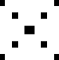
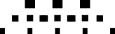
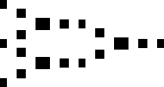

# Fine-grained Generalization Analysis of Structured Output Prediction

To appear in IJCAI 2021

Waleed Mustafa Affiliation: TU Kaiserslautern
Email: <mustafa@cs.uni-kl.de>    Yunwen Lei Affiliation:  University of
Birmingham Email: <y.lei@bham.ac.uk>    Antoine Ledent Affiliation: TU
Kaiserslautern Email: <%7Bledent>    Marius Kloft Affiliation: TU
Kaiserslautern Email: <kloft%7D@cs.uni-kl.de>

###### Abstract

In machine learning we often encounter structured output prediction
problems (SOPPs), i.e. problems where the output space admits a rich
internal structure. Application domains where SOPPs naturally occur
include natural language processing, speech recognition, and computer
vision. Typical SOPPs have an extremely large label set, which grows
exponentially as a function of the size of the output. Existing
generalization analysis implies generalization bounds with at least a
square-root dependency on the cardinality $`d`$ of the label set, which
can be vacuous in practice. In this paper, we significantly improve the
state of the art by developing novel high-probability bounds with a
logarithmic dependency on $`d`$. Moreover, we leverage the lens of
algorithmic stability to develop generalization bounds in expectation
without any dependency on $`d`$. Our results therefore build a solid
theoretical foundation for learning in large-scale SOPPs. Furthermore,
we extend our results to learning with weakly dependent data.

## 1 Introduction

Structured output prediction (SOP) refers to a broad class of machine
learning problems with a rich structure in the output space. For
instance, the output may be a sequence of tags in part-of-speech (POS)
tagging, a sentence in machine translation, or a grid of segmentation
labels in image segmentation.

A distinguishing property of these tasks is that the loss function
admits a decomposition along the output structures. For instance, if the
output is a sequence of partial labels, the loss function could be the
Hamming distance. The output structure makes those problems
substantially different, both algorithmically and theoretically, from
well-studied machine-learning methods such as binary classification.
Algorithms specifically targeted at SOPPs have been put forward
in Lafferty et al. (2001); Ciliberto et al. (2016); Taskar et al.
(2003); Tsochantaridis et al. (2005); Vinyals et al. (2015); Lucchi et
al. (2013); Chen et al. (2017), to mention but a few.

Whilst the subject of SOP is well explored from a practical point of
view, existing theoretical analyses have several limitations. For
instance, the results in Taskar et al. (2003); Collins (2001) apply only
to specific factor graphs and bound errors measured only by the Hamming
loss, while other losses such as edit distance and BLUE scores are more
natural in many applications. McAllester (2007) introduced guarantees
that apply to general losses but only to randomized linear algorithms
and admit only a square-root dependence on the size of substructures. In
Cortes et al. (2016), the authors introduced general bounds that apply
to general factor graphs and general losses from the viewpoint of
function class capacity. However, the associated bounds exhibit a
square-root dependence on the number $`d`$ of categories a subset of
substructures can take, which can become vacuous when applied to extreme
multi-class contexts Lei et al. (2019) or models that assume a large
dependence between the substructures.

In this paper, we aim to advance the state of the art in the theoretical
foundation of SOP by developing generalization bounds applicable to
large-scale problems with millions of labels. Our contributions are as
follows.

1\. We apply the celebrated technique of Rademacher complexity to
develop high-probability generalization bounds with a _log_ dependency
on the size of the label set. This substantially improves the existing
state of the art, which comes with at least a square-root dependency. We
achieve this improvement by using covering numbers measured by the
$`\ell_{\infty}`$-norm, which can exploit the Lipschitz continuity of
loss functions with respect to (w.r.t.) the $`\ell_{\infty}`$-norm. For
comparison, the existing complexity analysis uses the Lipschitz
continuity w.r.t. the $`\ell_{2}`$-norm Cortes et al. (2016), which does
not match the regularity of loss functions in structured output
prediction and thus leads to suboptimal bounds.

2\. We leverage the framework of algorithmic stability to further remove
the log dependency for generalization bounds in expectation. We consider
two popular methods for structured output prediction: stochastic
gradient descent (SGD) and regularized risk minimization (RRM). We adapt
the existing stability analysis in a way to exploit the Lipschitz
continuity w.r.t. the $`\ell_{\infty}`$-norm of loss functions in SOP.

3\. We extend our discussion to learning with weakly dependent training
examples, which are widespread in SOPPs. For example, in natural
language processing (NLP), a data set can come in the form of sets of
documents, while learning is performed at the sentence level. While
assuming that the sentences are independent is inaccurate, it is
reasonable to assume that the dependency between sentences decreases
when their distance in a document increases.

The remaining parts of the paper are structured as follows. We discuss
some related work in Section 2 and present the problem formulation in
Section 3. We present our main results on generalization bounds in
Section 4, which are extended to learning with dependent examples in
Section 5. We conclude the paper in Section 6.

## 2 Related Work

We first review some work on structured output prediction. Many
algorithms have been developed to solve structured output prediction
problems. Early techniques considered generative probabilistic models
(e.g., hidden Markov models Rabiner and Juang (1986)). Motivated by the
success of support vector machines (SVM), large-margin models for
structured data were proposed in Taskar et al. (2003); Tsochantaridis et
al. (2005). To reduce the model complexity, conditional random fields
(CRFs) Lafferty et al. (2001) model the conditional distribution of the
structured outputs rather than modeling the joint probability of the
input and output. A key property of these models is that their
prediction step can be viewed as maximising a scoring function. Such a
scoring function enjoys a decomposition over the substructure so that
the maximisation can be done efficiently. CRFs were combined with
convolutional neural networks (CNNs) in Chen et al. (2017) to approach
semantic segmentation problems, achieving better performance than CNNs
alone.

In Collins (2001); Taskar et al. (2003), the authors showed a
generalization bound for their proposed models. However, they considered
restricted models and losses (Hamming loss). A PAC-Bayesian bound is
proved in McAllester (2007) for Bayesian prediction algorithms. In
Cortes et al. (2016) the authors introduced a more general
generalization bound that applies to general losses and models. Their
bound scales as the square root of the number of classes. This can lead
to vacuous bounds when the number of classes per substructure and their
dependence on each other continue to increase.

Ciliberto et al. (2016) introduced the implicit embedding approach to
structured output prediction where the label is encoded into a vector in
some Hilbert space via an encoding function. A decoding function is also
defined so that prediction is performed by composing a regression
function and the decoding function, thus establishing a connection
between structured output prediction and regression. They provided
generalization bounds of the order of $`O(m^{-\frac{1}{4}})`$, where
$`m`$ is the number of samples, which can be a problem for large $`m`$.
Recently, Ciliberto et al. (2019) introduced the setting of localized
structured output prediction, where they assume a form of weak
dependence between substructures. Their model utilizes such assumption
by treating each part of the structure as an independent sample. They
prove bounds of the order $`O((ml)^{-\frac{1}{4}})`$ for their method,
where $`l`$ is the number of substructures, under weakly dependent
samples.

We now review the related work for multi-class classification (MCC),
which is a specific case of structured output prediction. Various
capacity measures of function classes were used to study generalization
bounds of MCC, including Rademacher complexities Lei et al. (2015);
Maurer (2016); Li et al. (2018); Maximov et al. (2018); Musayeva et al.
(19), covering numbers Zhang (2004); Lei et al. (2019); Ledent et al.
(2019) and the fat-shattering dimension Guermeur (2017). While initial
analyses implied generalization bounds with at least a linear dependency
on the number of classes Koltchinskii and Panchenko (2002), the
couplings among class components were exploited recently to get a
dependency that can be as mild as square-root Cortes et al. (2016); Li
et al. (2018) or even logarithmic Lei et al. (2019); Wu et al. (2021).

## 3 Problem Formulation

SOP refers to machine learning problems with an internal structure in
the outputs (and potentially also in the inputs). For example in
sequence-to-sequence prediction, both the input and output are
sequences. In syntax analysis, the inputs are sequences of words and the
output is a parse tree.

Let $`\mathcal{X}`$ be an input space (e.g., sentences in a given
language) and $`\mathcal{Y}`$ be an output space (e.g., POS tags for the
input sentences). In structured output prediction, the output space can
often be decomposed into a number of substructures. Take POS tags as an
example, where each word tag represents a substructure and the sequence
of tags constitutes the structured output. Formally we define
$`\mathcal{Y}=\mathcal{Y}_{1}\times\cdots\times\mathcal{Y}_{l}`$, where
$`\mathcal{Y}_{k}`$ is the set of possible classes a substructure $`k`$
can take. For a point $`(x,y)\in\mathcal{X}\times\mathcal{Y}`$, let
$`y^{k}`$ denote the $`k`$-th element in $`y`$ (i.e.,
$`y=(y^{1},\ldots,y^{l})`$).

We aim to learn a scoring function
$`h:\mathcal{X}\times\mathcal{Y}\rightarrow\mathbb{R}`$ based on which
we can perform the prediction as
$`\hat{y}(x)=\arg\max_{y\in\mathcal{Y}}h(x,y)`$. The score function in
structured output prediction can be described via a factor graph
$`G=(V,F,E)`$, where $`V=[l]:=\{1,\ldots,l\}`$ is the set of variable
nodes, $`F`$ is a set of factor nodes, and $`E`$ is a set of undirected
edges between a variable node and a factor node. Let $`\mathcal{N}(f)`$
be the set of nodes connected to the factor $`f`$ by an edge and
$`\mathcal{Y}_{f}=\Pi_{k\in\mathcal{N}(f)}\mathcal{Y}_{k}`$. For
brevity, we assume that $`|\mathcal{Y}_{f}|=d`$ for all $`f`$, where
$`|\mathcal{Y}_{f}|`$ denotes the cardinality of $`\mathcal{Y}_{f}`$.
Now we define the scoring function $`h(x,y)`$ for $`x\in\mathcal{X}`$
and $`y\in\mathcal{Y}`$ as

```math
h(x,y)=\sum_{f\in F}h_{f}(x,y_{f}),
```

where $`y_{f}:=\{y^{j}:j\in\mathcal{N}(f)\}`$ and
$`h_{f}:\mathcal{X}\times\mathcal{Y}_{f}\rightarrow\mathbb{R}`$.
Figure 1 gives an example of factor graphs and scoring functions.



(a)



(b)



(c)

Figure 1: Examples of factor graphs. Panel (a) represents a factor graph
with only one factor node. Note that $`\mathcal{N}(f_{1})=\{1,2,3,4\}`$
and
$`\mathcal{Y}_{f_{1}}=\mathcal{Y}_{1}\times\mathcal{Y}_{2}\times\mathcal{Y}_{3}\times\mathcal{Y}_{4}`$.
If $`\mathcal{Y}_{i}=\{1,2,3\}`$ for all $`i`$, then
$`|\mathcal{Y}_{f_{1}}|=3^{4}`$. The corresponding scoring function is
$`h(x,y)=h_{f_{1}}(x,y^{1},y^{2},y^{3},y^{4})`$. Panel (b) depicts an
example of factor graph that assumes a sequence-like structure. The
scoring function in this case is
$`h(x,y)=h_{f_{1}}(x,y^{1},y^{2},y^{3})+h_{f_{2}}(x,y^{2},y^{3},y^{4})+h_{f_{3}}(x,y^{3},y^{4},y^{5})`$.
Panel (c) depicts an example of tree-like factor graph.

Let $`S=\{(x_{i},y_{i})\}_{i=1}^{m}`$ be a training set with
$`(x_{i},y_{i})\in\mathcal{X}\times\mathcal{Y}`$ being independently
drawn from a distribution $`\mathcal{D}`$ over
$`\mathcal{X}\times\mathcal{Y}`$. We use a loss function
$`L:\mathcal{Y}\times\mathcal{Y}\rightarrow\mathbb{R}_{+}`$ to measure
the performance of prediction models, based on which we can define the
margin loss Cortes et al. (2016) as
$`L_{\rho}:\mathcal{X}\times\mathcal{Y}\times\mathcal{H}\rightarrow\mathbb{R}`$:

```math
L_{\rho}(x,y,h)=\Phi^{*}(\max_{y^{\prime}\neq y}\{L(y^{\prime},y)-\frac{1}{\rho}[h(x,y)-h(x,y^{\prime})]\}), \tag{1}
```

where $`\Phi^{*}(r)=\min(M,\max(0,r))`$,
$`M=\max_{y,y^{\prime}}L(y,y^{\prime})`$ and
$`\mathcal{H}\subset\{h:\mathcal{X}\times\mathcal{Y}\rightarrow\mathbb{R}\}`$
is some hypothesis class. Note that
$`L_{\rho}(x,y,h)\geq L(\hat{y}(x),y)`$. Therefore, the obtained bounds
for $`L_{\rho}`$ will also hold for $`L`$. We then define the population
risk $`R(h)`$ and empirical risk $`R_{S}(h)`$ to quantify the
performance of a model $`h`$ on testing and training examples,
respectively as:

```math
R(h)=\mathbb{E}_{\mathcal{D}}[L_{\rho}(x,y,h)],\quad R_{S}(h)=\frac{1}{m}\sum_{i=1}^{m}L_{\rho}(x_{i},y_{i},h).
```

Let $`\Psi`$ be a feature function which maps an input-output example
$`(x,y)\in\mathcal{X}\times\mathcal{Y}`$ to $`\mathbb{R}^{D}`$, where
$`D`$ is the dimension of feature space. In structured output
prediction, the feature extractor takes a composite form according to
the factor graph $`G`$, that is,
$`\Psi(x,y)=\sum_{f\in F}\Psi_{f}(x,y_{f})`$, where
$`\Phi_{f}:\mathcal{X}\times\mathcal{Y}_{f}\rightarrow\mathbb{R}`$. We
consider a linear scoring function
$`h^{w}(x,y)=\left<w,\Psi(x,y)\right>`$ indexed by a
$`w\in\mathbb{R}^{D}`$. Then the hypothesis space becomes

```math
\mathcal{H}_{p}=\big\{(x,y)\mapsto\left<w,\Psi(x,y)\right>:\|w\|_{p}\leq\Lambda,(x,y)\in\mathcal{X}\times\mathcal{Y}\big\}, \tag{2}
```

where $`\|w\|_{p}=(\sum_{i=1}^{D}|w_{i}|^{d})^{\frac{1}{p}}`$ is the
$`\ell_{p}`$-norm of $`w=(w_{1},\ldots,w_{D})`$. We also define the
class of loss functions

```math
F_{p,\Lambda,\rho}:=\big\{(x,y)\mapsto L_{\rho}(x,y,h^{w}):h^{w}\in\mathcal{H}_{p}\big\}. \tag{3}
```

## 4 Main Results

In this section, we present our main results on generalization bounds
for structured output prediction. We consider two types of
generalization bounds: complexity-based bounds and stability-based
bounds. Our aim is to develop bounds with a very mild dependency on the
size of the label set, thus laying a solid foundation for structured
output prediction, where the size of label set $`\mathcal{Y}`$ is often
extremely large in practice. A key discovery to both our stability-based
and complexity-based analysis is to note the Lipschitz continuity of
loss functions w.r.t. infinity-norm $`\|\cdot\|_{\infty}`$.

###### Definition 1 (Lipschitz continuity).

We say that a loss function $`L(x,y,h)`$ is
$`(\tau,\ell_{\infty})`$-Lipschitz in the last argument if, for any
$`h,\tilde{h}\in\mathcal{H}`$ and all
$`(x,y)\in\mathcal{X}\times\mathcal{Y}`$, we have:

```math
|L(x,y,h)-L(x,y,\tilde{h})|\leq\tau\max_{y^{\prime}\in\mathcal{Y}}|h(x,y^{\prime})-\tilde{h}(x,y^{\prime})|.
```

The existing analysis Cortes et al. (2016) uses the
$`(\tau_{2},\ell_{2})`$ Lipschitz continuity of loss functions:

```math
|L(x,y,h)-L(x,y,\tilde{h})|\leq\tau_{2}\Big(\sum_{y^{\prime}\in\mathcal{Y}}|h(x,y^{\prime})-\tilde{h}(x,y^{\prime})|^{2}\Big)^{1/2}.
```

Note that the Lipschitz continuity w.r.t. $`\ell_{\infty}`$-norm is much
stronger than that w.r.t. $`\ell_{2}`$-norm. Indeed, if $`L`$ is
$`(\tau,\ell_{\infty})`$-Lipschitz then it is also $`(\tau,\ell_{2})`$
Lipschitz since $`\|\cdot\|_{\infty}\leq\|\cdot\|_{2}`$. As a
comparison, a $`(\tau_{2},\ell_{2})`$-Lipschitz function can be
$`(\tau_{2}\sqrt{|\mathcal{Y}|},\ell_{\infty})`$-Lipschitz due to the
norm relationship
$`\|\cdot\|_{2}\leq\sqrt{|\mathcal{Y}|}\|\cdot\|_{\infty}`$ (the
equality can hold in some cases).

In Lemma 1 we build the $`\ell_{\infty}`$-Lipschitz continuity of
$`L_{\rho}`$ for structured output prediction. A remarkable property is
that the involved Lipschitz constant is independent of
$`|\mathcal{Y}|`$. This shows that the loss function in structured
output prediction is well behaved in the sense of Lipschitz continuity.
However, the existing analysis based on the
$`(\tau_{2},\ell_{2})`$-Lipschitz continuity fails to exploit this
strong regularity, and therefore only implies suboptimal bounds with at
least a square-root dependency on the size of the label set. The proof
of Lemma 1 below is given in the appendix.

###### Lemma 1.

The loss function $`L_{\rho}`$ is
$`(\frac{2}{\rho},\ell_{\infty})`$-Lipschitz with respect to the scoring
function $`h`$ for all $`x\in\mathcal{X}`$ and $`y\in\mathcal{Y}`$.

### 4.1 Complexity-based Generalization Bounds

We develop generalization bounds with high probability here. Our basic
tool to this aim is the Rademacher complexity.

###### Definition 2.

The empirical Rademacher complexity of a function class $`\mathcal{H}`$
of real-valued functions is defined as:

```math
\mathfrak{R}_{S}(\mathcal{H})=\mathbb{E}_{\sigma}[\sup_{f\in\mathcal{H}}\frac{1}{n}\sum_{i=1}^{n}\sigma_{i}f(x_{i})], \tag{4}
```

where $`\{\sigma_{i}\}`$ are random variables with equal probability of
being either $`+1`$ or $`-1`$.

###### Theorem 1.

Let $`\rho>0`$ be. Then the Rademacher complexity of the loss class
$`F_{p,\Lambda,\rho}`$ is bounded as follows:

```math
\mathfrak{R}(F_{p,\Lambda,\rho})\leq\frac{4}{m}+\frac{144\sqrt{q-1}\Psi^{*}\Lambda|F|}{\rho\sqrt{m}}\tilde{L}, \tag{5}
```

where
$`\tilde{L}=\sqrt{\log(2md|F|[8\Psi^{*}\Lambda m|F|/\rho+3]+1)}\log(m)`$,
$`\Psi^{*}=\sup_{f\in F,y\in\mathcal{Y}_{f},x\in\mathcal{X}}\|\Psi_{f}(x,y)\|_{q}`$,
and $`q=p/(p-1)`$.

The proof strategy is to to relate the complexity of the loss class
$`F_{p,\Lambda,\rho}`$ to a complexity of a scalar linear function class
on an extended set of size $`m|F|d`$, thus moving contribution of $`d`$
to the complexity from the output dimension to the size of training set.
We then utilize standard bounds Zhang (2002) that admit log dependency
on the size of training set. The detailed proof is given in the
appendix.

###### Remark 1.

We now compare our results with related work. In Cortes et al. (2016),
the authors bounded the Rademacher complexity of $`F_{p,\Lambda,\rho}`$
by a factor graph Rademacher complexity. Specifically for the loss class
(3) they proved
$`\mathfrak{R}(F_{p,\Lambda,\rho})\leq\frac{2\sqrt{2}}{\rho}\hat{\mathfrak{R}}^{G}_{S}(\mathcal{H}_{p}),`$
where $`\hat{\mathfrak{R}}^{G}_{S}(\mathcal{H}_{p})`$ is defined as

```math
\frac{1}{m}\mathbb{E}_{{\bf\epsilon}}\Big[\sup_{h\in\mathcal{H}}\sum_{i\in[m],f\in F,y\in\mathcal{Y}_{f}}\sqrt{|F|}\epsilon_{i,f,y}\left<w,\Psi_{f}(x_{i},y)\right>\Big].
```

Here
$`\epsilon=(\epsilon_{i,f,y})_{i\in[m],f\in F,y\in\mathcal{Y}_{f}}`$ and
each $`\epsilon_{i,f,y}`$ is an independent Rademacher variable.
Combining the result from Theorem 2 in Cortes et al. (2016), we get the
following bound for learning with $`\ell_{2}`$-regularization:
$`\mathfrak{R}(F_{2,\Lambda,\rho})\leq O\Big(\frac{\Lambda\Psi^{*}|F|\sqrt{d}}{\rho\sqrt{m}}\Big)`$.
Note the bound exhibit a square-root dependence on the number of classes
per factor $`d=|\mathcal{Y}_{f}|`$. Thus it is vacuous for typical
SOPPs, where the number of class labels grows exponentially w.r.t. the
size of the output. For comparison, our bounds enjoy a log dependency on
$`d`$ and therefore still imply meaningful generalization bounds in this
setting.

As a direct corollary, we use the connection between generalization and
Rademacher complexity to get Theorem 2.

###### Theorem 2 (Generalization Bounds).

For any $`\rho>0`$, $`\delta\in(0,1)`$, and $`h\in\mathcal{H}_{p}`$,
with probability at least $`1-\delta`$ over the draw of training data
$`S`$, the following bound holds:

```math
R(h)\leq R_{S}(h)+\frac{8}{m}+\frac{288\sqrt{q-1}\Psi^{*}\Lambda|F|}{\rho\sqrt{m}}\tilde{L}+M\sqrt{\frac{\log{\frac{1}{\delta}}}{2m}}.
```

### 4.2 Stability-based Generalization Bounds

In this section, we present generalization bounds in expectation for
structured output prediction by leveraging the lens of algorithmic
stability. Algorithmic stability is a fundamental concept in statistical
learning theory, which measures the sensitiveness of output models when
the training dataset of an algorithm $`A`$ is slightly perturbed. For
any algorithm $`A`$, we use $`A(S)`$ to denote the model produced by
running $`A`$ over the training examples $`S`$.

###### Definition 3 (Uniform Stability).

A stochastic algorithm $`A`$ is $`\epsilon`$-uniformly stable if, for
all training datasets $`S,\widetilde{S}\in\mathcal{Z}^{n}`$ that differ
by at most one example, we have

```math
\sup_{x,y}\mathbb{E}_{A}\big[L_{\rho}(x,y,A(S))-L_{\rho}(x,y,A(\widetilde{S}))\big]\leq\epsilon. \tag{6}
```

Algorithmic stability naturally implies quantitative generalization
bounds, as shown in the following lemma Shalev-Shwartz et al. (2010).

###### Lemma 2 (Generalization via uniform stability).

Let $`A`$ be $`\epsilon`$-uniformly stable. Then
$`\big|\mathbb{E}_{S,A}\big[R(A(S))-R_{S}(A(S))\big]\big|\leq\epsilon.`$

We will apply algorithmic stability to study two representative
algorithms for SOP: regularization and stochastic gradient descent. For
brevity, we use the abbreviation
$`R(w)=R(h^{w}),R_{S}(w)=R_{S}(h^{w})`$, etc. We also write
$`w^{*}=\arg\inf_{w}R(w)`$ for the minimizer of the population risk.

Regularized Risk Minimization. RRM is a popular scheme to overcome
overfitting in machine learning. The basic idea is to add a regularizer
to the empirical risk and build a regularized empirical risk
$`R_{S}^{\lambda}`$. Then we minimize the resulting objective function
to obtain a model $`w_{S}`$ as follows:

```math
w_{S}=\arg\min_{w}\big[R_{S}^{\lambda}(h^{w}):=R_{S}(h^{w})+\frac{\lambda}{2}\|w\|_{2}^{2}\big]. \tag{7}
```

Here we omit the dependency of $`w_{S}`$ on the regularization parameter
for brevity. In the following lemma to be proved in the appendix, we
show that the above regularization algorithm is uniformly stable. Let
$`\kappa:=\sup_{x,y}\|\Psi(x,y)\|_{2}`$.

###### Lemma 3.

Let $`A`$ be defined as (7), i.e., $`A(S)=w_{S}`$. Then $`A`$ is
$`\frac{16\kappa^{2}}{m\rho^{2}\lambda}`$-uniformly stable.

This lemma is a variant of the stability bound in Bousquet and Elisseeff
(2002), which, however, requires the loss function to be admissible. We
adapt their technique to the setting of structured output prediction and
a key step in our analysis is again the Lipschitz continuity of the loss
function w.r.t. the $`\ell_{\infty}`$ norm. A use of the classical
Lipschitz continuity w.r.t. $`\ell_{2}`$ norm would incur a bound with
at least a square-root dependency on $`d`$. For comparison, the
consideration of Lipschitz continuity w.r.t. the $`\ell_{\infty}`$ norm
allows us to get stability bounds independent of the size of the label
set.

We can combine the Lipschitz continuity of loss functions, the stability
of regularization schemes established in Lemma 3 and Lemma 2 together to
get the following generalization bounds for structured output
prediction. Let

```math
w^{\lambda}=\arg\inf_{w}\big[R^{\lambda}(w):=R(h^{w})+\frac{\lambda}{2}\|w\|_{2}^{2}\big]
```

be the minimizer of the regularized risk. We have the following result,
whose proof is given in the appendix.

###### Theorem 3.

Let $`w_{S}`$ be defined in (7). Then

```math
\mathbb{E}\big[R^{\lambda}(w_{S})-R^{\lambda}(w^{\lambda})\big]\leq\frac{16\kappa^{2}}{m\rho^{2}\lambda}. \tag{8}
```

Furthermore, if we choose
$`\lambda=\frac{4\sqrt{2}\kappa}{\sqrt{m}\rho\|w^{*}\|_{2}}`$, then

```math
\mathbb{E}\big[R(w_{S})\big]-R(w^{*})\leq\frac{4\sqrt{2}\kappa\|w^{*}\|_{2}}{\sqrt{m}\rho}. \tag{9}
```

Stochastic Gradient Descent. We now turn to the performance of SGD for
structured output prediction. SGD is a popular optimization algorithm
with wide applications in learning in a big data setting. Let
$`w^{(1)}`$ be the initial point and $`\{\eta_{t}\}`$ be a sequence of
positive step sizes. At the $`t`$-th iteration, we first randomly select
an index $`i_{t}`$ according to the uniform distribution over $`[m]`$,
which is used to build a stochastic gradient
$`L_{\rho}^{\prime}(x_{i_{t}},y_{i_{t}},h^{w^{(t)}})`$
($`L_{\rho}^{\prime}(x_{i_{t}},y_{i_{t}},h^{w^{(t)}})`$ denotes a
subgradient of $`L_{\rho}(x_{i_{t}},y_{i_{t}},h^{w})`$ at
$`w=w^{(t)}`$). Then we update the model along the negative direction of
the stochastic gradient

```math
w^{(t+1)}=w^{(t)}-\eta_{t}L_{\rho}^{\prime}(x_{i_{t}},y_{i_{t}},h^{w^{(t)}}). \tag{10}
```

This scheme of selecting a single example to build a stochastic gradient
allows SGD to get sample-size independent iteration complexity, and is
especially appealing if $`m`$ is large. Since we consider a linear
scoring function $`h^{w}`$, the loss function $`L_{\rho}`$ is convex
w.r.t. $`w`$. In the following lemma to be proved in the appendix, we
build the uniform stability of SGD for structured output prediction.
Note here we do not require the loss function to be smooth Lei and Ying
(2020).

###### Lemma 4.

Let $`S=\{z_{1},\ldots,z_{m}\}`$ and
$`S^{\prime}=\{z_{1}^{\prime},\ldots,z_{m}^{\prime}\}`$ be two datasets
that differ only by a single example. Let $`\{w^{(t)}\}`$ and
$`\hat{w}^{(t)}`$ be two sequences produced by SGD based on $`S`$ and
$`S^{\prime}`$, respectively. Then

```math
\mathbb{E}_{A}\big[\|w^{(t+1)}-\hat{w}^{(t+1)}\|_{2}^{2}\big]\leq 16e(1+t/m^{2})\kappa^{2}\rho^{-2}\sum_{j=1}^{t}\eta_{j}^{2}.
```

According to Lemma 4, we know that the algorithm becomes more and more
unstable as we run more and more iterations. We can use this stability
bound to derive generalization bounds of SGD for structured output
prediction. The proof is given in the appendix.

###### Theorem 4.

Let $`\!\{w^{(t)}\}`$ be produced by (10) with $`\eta_{t}\!=\!\eta`$.
Then

```math
\mathbb{E}\big[R(\bar{w}^{(T)})\big]-R(w^{*})\leq O\Big((\sqrt{T}+T/m)\kappa^{2}\eta+\frac{1\!+\!T\kappa^{2}\eta^{2}}{T\eta}\Big), \tag{11}
```

where $`\bar{w}^{(T)}=\frac{1}{T}\sum_{t=1}^{T}w^{(t)}`$ is an average
of iterates.

The upper bound (11) involves two terms. The first term $`\sqrt{T}+T/m`$
comes from controlling the generalization error
$`R(\bar{w}^{(T)})-R_{S}(\bar{w}^{(T)})`$, while the second term
$`\frac{1+T\eta^{2}}{T\eta}`$ comes from controlling the optimization
error $`R_{S}(\bar{w}^{(T)})-R_{S}(w^{*})`$. It is clear the
optimization error decreases w.r.t. $`T`$, while the generalization
error grows in the learning process. Therefore, we need to trade-off
these two terms by early-stoping SGD as done by the following corollary.
We write $`B\asymp\widetilde{B}`$ if there are absolute constants
$`c_{1}`$ and $`c_{2}`$ such that
$`c_{1}B\leq\widetilde{B}\leq c_{2}B`$.

###### Corollary 1.

Let $`\{w^{(t)}\}`$ be the sequence produced by (10) with
$`\eta_{t}=\eta`$. If we choose $`T\asymp m^{2}`$ and
$`\eta\asymp T^{-\frac{3}{4}}/\kappa`$, then

```math
\mathbb{E}\big[R(\bar{w}^{(T)})\big]-R(w^{*})\leq O(\kappa m^{-\frac{1}{2}}).
```

###### Remark 2.

According to Theorem 3 and Corollary 1, we know that both the
regularization method and SGD are able to achieve the generalization
bound $`O(1/\sqrt{m})`$, which is minimax optimal. While RRM requires
the objective function to be strongly convex, SGD only requires the
objective function to be convex. Remarkably, these generalization bounds
do not admit any dependency on the size of the label set, and provide a
convincing explanation on why SOP often works well even if the problem
has more class labels than training examples. To our best knowledge,
these are the first label-size free generalization bounds. As compared
to Theorem 2 on high-probability bounds, our generalization bounds here
are stated in expectation. It should be noted that our bounds in
expectation require the loss functions to be convex, while the
high-probability analysis also applies to nonconvex cases.

### 4.3 Applications

In this section we discuss applications of our bounds and compare them
to those of Cortes et al. (2016).

###### Example 1.

Consider pair-wise Markov networks with fixed number of substructures
$`l`$ Taskar et al. (2003). Specifically, we have
$`\mathcal{Y}=\mathcal{Y}_{1}\times\ldots\times\mathcal{Y}_{l}`$ and
$`\mathcal{Y}_{k}\in[c]`$ for $`k\in[l]`$. Further, we have
sequence-like connections, i.e., there is an arrangement of output nodes
such that if a factor $`f\in F`$ is connected to two nodes then they are
neighbors in that arrangement. Therefore we have $`|F|=l-1`$ and
$`d=c^{2}`$. We further assume an unnormalized hamming loss
$`L(y,y^{\prime})=\sum_{k=1}^{l}\mathbb{I}_{y_{k}\neq y^{\prime}_{k}}`$
so that we normalize later in the bound to get rid of the dependence on
$`l=|F|+1`$. For regularized learning with these Markov networks, the
Rademacher complexity of loss function classes was bounded in Cortes et
al. (2016)

```math
\mathfrak{R}(F_{2,\Lambda,\rho})\leq O(\frac{\Lambda\Psi^{*}c}{\rho\sqrt{m}}).
```

As a comparison, our Rademacher complexity bound in Theorem 1 reduces to
an upper bound on $`\mathfrak{R}(F_{2,\Lambda,\rho})`$ that has the form

```math
O\left(\frac{\Lambda\Psi^{*}\log m\sqrt{\log(2mc^{2}l[8\Psi^{*}\Lambda m/\rho\!+\!3]\!+\!1)}}{\rho\sqrt{m}}\right).
```

Therefore, our bound significantly outperforms their bound by dropping
their linear dependency on $`c`$ to a logarithmic dependency. If we
further extend the model so that each factor $`f`$ is connected to $`v`$
nodes instead of 2, their bound grows, as a function of $`v`$, as
$`O(c^{v/2})`$ while ours increase only $`O(\sqrt{v})`$. Furthermore,
according to Theorems 3, 4, we can get generalization bounds
$`O(\kappa/\sqrt{m})`$ in expectation for both RRM and SGD, where the
log dependency is further removed.

###### Example 2.

As the second example we consider multi-class classification. In this
case we have no substructures and therefore
$`|F|=1,\mathcal{Y}_{1}=\mathcal{Y}`$ where $`\mathcal{Y}=[c]`$,
$`d=c`$. In Cortes et al. (2016), the Rademacher complexity for
multi-class learning with $`\ell_{2}`$ regularization was shown to
satisfy

```math
\mathfrak{R}(F_{2,\Lambda,\rho})\leq O\left(\frac{\Psi^{*}\Lambda\sqrt{c}}{\rho\sqrt{m}}\right).
```

Our analysis instead shows $`\mathfrak{R}(F_{2,\Lambda,\rho})`$ is
bounded by

```math
O\left(\frac{\Psi^{*}\Lambda\sqrt{\log(2mc[8\Psi^{*}\Lambda m/\rho\!+\!3]\!+\!1)}\log m}{\rho\sqrt{m}}\right).
```

It is clear that we drop the square root dependency in $`c`$ in Cortes
et al. (2016) to a log dependence. Analogous to Example 1, the log
dependency can be further removed if we consider generalization bounds
in expectation, as shown in Theorems 3 and 4.

###### Example 3.

In this example we explore the possibility of combining SOP models above
with a learned feature extraction function $`\Psi`$ as was practically
explored in Chen et al. (2017); Hinton et al. (2012). Consider the case
where $`\Psi`$ is a CNN that takes $`x`$ as input and outputs different
$`D`$-dimensional vector $`\Psi_{f}(x,y_{f})`$ for each factor $`f`$ and
label $`y_{f}`$. Chaining the covers, one can bound the Rademacher
complexity of the combined class as follows:

```math
\widetilde{O}\left(\frac{\sqrt{q-1}\Psi^{*}\Lambda|F|}{\rho\sqrt{m}}\right)+\widetilde{O}\left(\sqrt{\frac{\bar{D}}{m}}\log(\tilde{G})\right),
```

where the notation $`\widetilde{O}`$ hides logarithmic factors,
$`\bar{D}`$ is the number of network parameters and $`\tilde{G}`$ is a
product of norms of network weight matrices. The details of the bound
and its derivation of this bound are given in the appendix.

## 5 Learning Weakly Dependent Sequences

In the above bounds we assumed that the examples are sampled
independently from each other. However, this assumption is often
violated in practice. For example, consider the problem of POS tagging.
We are usually given a dataset of documents each of which contains a
sequence of sentences. There are two natural assumptions. (1) We may
assume that each document is a long sequence of dependent words. This
assumption is too pessimistic. The considered sample size becomes too
small, and the prediction complexity increases while, as sentences get
further apart, the dependence between them decreases, and thus the
effective sample size increases. (2) We may assume that each sentence is
independent of the others within and across documents. This assumption
on the other hand is too optimistic. Sentences following each other in
the same document indeed have some degree of dependence. We formalize
this dependence in a hierarchical manner, thus providing a trade-off
between these two assumptions. Namely, we assume that the documents are
independent of each other while sentences within a document are only
weakly dependent. We note that the term document here does not
necessarily mean an actual text document but rather any sequence of
examples (e.g., for a dataset of videos, one video is a document as it
is a sequence of images).

We now formalize the idea above. We are given a training set of
independent documents $`\{D_{i}\}_{i=1}^{m}`$. Each document $`D_{i}`$
is a sequence of weakly dependent examples
$`D_{i}=(z^{j}_{i})_{j=1}^{J}`$. Since the structured output prediction
framework in the above section subsumed the usual classification
paradigm, we assume that the sequence elements classes follows it. That
is, $`z^{i}_{j}\in\mathcal{X}\times\mathcal{Y}=:\mathcal{Z}`$, where
$`\mathcal{X}`$ and $`\mathcal{Y}`$ defined as above.

Now we define precisely how the examples within each document $`D_{i}`$
are weakly dependent. We assume that each example within a given
document is sampled from a $`\beta`$-mixing process, defined below, at
times $`1,2,\ldots,J`$.

###### Definition 4 (Stationary $`\beta`$-mixing Stochastic Process).

Let $`(z^{k})_{k=-\infty}^{\infty}`$ be a stationary stochastic process
and $`\sigma_{L}=\sigma((z^{k})_{k=1}^{L})`$ and
$`\sigma_{L+a}=\sigma((z^{k})_{k=L+a}^{\infty})`$ be the sigma algebras
generated by the random variables $`Z_{1}^{L}=(z^{1},\ldots,z^{L})`$ and
$`z_{L+a}^{\infty}=(z^{L+a},\ldots,Z^{\infty})`$. Define the
$`\beta`$-mixing coefficient
$`\beta(a):=\sup_{L\geq 1}\mathbb{E}\left[\sup_{B\in\sigma_{L+a}}|P(B|\sigma_{L})-P(B)|\right].`$

The process is called $`\beta`$-mixing if
$`\lim_{a\rightarrow\infty}\beta(a)=0`$. It is called exponentially
mixing if $`\beta(a)\leq\beta_{0}\exp{(-\beta_{1}a^{r})}`$ or
algebraically mixing if $`\beta(a)\leq\beta_{0}/a^{r}`$, for positive
$`\beta_{0}`$, $`\beta_{1}`$ and $`r`$.

Some examples of exponentially mixing process include a class of
Autoregressive Moving Average (ARMA) Mokkadem (1988) and a class of
Markov process Rosenblatt (2012).

Now let $`\mathcal{H}`$ be a structured output prediction function class
as defined in the previous section (see (2)). For $`h\in\mathcal{H}`$,
let $`L_{h}:\mathcal{Z}\rightarrow[0,M]`$ be a loss function over
elements of the sequence $`z^{k}`$. An example for such a loss is given
in equation (1). Again we are interested in high probability bounds on
the difference between two quantities: the empirical risk
$`\hat{R}_{S}(h)`$ and the true risk $`R(h)`$, which are defined as

```math
R_{S}(h)=\frac{1}{mJ}\sum_{i=1}^{m}\sum_{j=1}^{J}L_{h}(z^{j}_{i}),\quad R(h)=\mathbb{E}_{S}[R_{S}(h)].
```

Theorem 5 summarizes the main results of this section.

###### Theorem 5.

Let $`F_{p,\Lambda,\rho}`$ be the loss class defined in (3) and let
$`S`$ be a set of independent and identically distributed documents
$`D_{i}`$, $`i=1,\ldots,m`$, where each document is a sequence of
examples $`(z_{i}^{j})`$ $`j=1,\ldots,J`$ drawn from a $`\beta`$-mixing
process. For any integer $`a>0`$ such that $`J`$ is a multiple of
$`2a`$. Let $`\delta>2m(\frac{J}{2a}-1)\beta(a)`$, then with probability
at least $`1-\delta`$, the following inequality holds uniformly over all
$`h\in\mathcal{H}_{p}`$

```math
\begin{split}R(h)\leq&\hat{R}_{S}(h)+O\left(\frac{\sqrt{2a(q-1)}\Psi^{*}\Lambda|F|}{\rho\sqrt{mJ}}\tilde{L}\right)\\
&+\frac{M\sqrt{a}\sqrt{\log\left(\frac{2}{\delta-2m(\frac{J}{2a}-1)\beta(a)}\right)}}{\sqrt{mJ}},\end{split} \tag{12}
```

where
$`\tilde{L}=\sqrt{\log(2mJd|F|[8\Psi^{*}\Lambda mJ/\rho+3]+1)}\log(mJ)`$.

###### Remark 3.

Note that the bound unsurprisingly depends on the same main quantities
as the bound in Theorem 2. To better interpret it consider the following
two extreme cases. (1) The elements inside each document are independent
of each other. Note that in this case $`\beta(a)=0`$, for all $`a`$,
hence $`a`$ can be chosen to be $`1`$ and the bound boils down to the
bound in Theorem 2. (2) The elements inside each document are strongly
dependent. Thus, $`\beta(a)\approx 1`$ for all $`a`$ and therefore
selecting $`a=\frac{J}{2}`$ leads to the bound in Theorem 2 with only
$`m`$ training examples. We further note that $`\beta(a)\rightarrow 0`$
as $`a\rightarrow\infty`$, therefore, for any process admitting a fast
decaying $`\beta(a)`$ the term $`2m(\frac{J}{2a}-1)\beta(a)`$ approaches
$`0`$ fast for moderate $`a`$.

## 6 Conclusion

In this paper, we advance the state of the art in the generalization
analysis of structured output prediction. We consider two types of
generalization bounds: complexity-based and stability-based bounds. Our
complexity-based approach produces bounds with high probability that
admit a log dependency on the size of the label set. The stability-based
approach further removes this log dependency for generalization bounds
in expectation. This significantly improves the existing bounds, which
have at least a square root dependency. We also extend our discussion to
the setting of learning with weakly dependent training examples.

A very interesting question is to investigate whether the log dependency
in the high probability analysis is an artefact of our analysis or is
really essential. Another question is to extend our generalization
bounds in expectation to learning with nonconvex functions.

## Acknowledgments

MK, AL and WM acknowledge support by the German Research Foundation
(DFG) award KL 2698/2-1 and by the German Federal Ministry of Science
and Education (BMBF) awards 01IS18051A, 031B0770E, and 01MK20014U. YL
acknowledges support by NSFC under Grant No. 61806091.

## References

- Bartlett et al. \[2017\] Peter L Bartlett, Dylan J Foster, and Matus J
  Telgarsky. Spectrally-normalized margin bounds for neural networks. In
  NeurIPS, 2017.
- Bottou et al. \[2018\] Léon Bottou, Frank E Curtis, and Jorge Nocedal.
  Optimization methods for large-scale machine learning. SIAM Review,
  60(2):223–311, 2018.
- Bousquet and Elisseeff \[2002\] Olivier Bousquet and André Elisseeff.
  Stability and generalization. JMLR, 2:499–526, 2002.
- Chen et al. \[2017\] Liang-Chieh Chen, George Papandreou, Iasonas
  Kokkinos, Kevin Murphy, and Alan L Yuille. Deeplab: Semantic image
  segmentation with deep convolutional nets, atrous convolution, and
  fully connected CRFs. TPAMI, 40(4):834–848, 2017.
- Ciliberto et al. \[2016\] Carlo Ciliberto, Alessandro Rudi, and
  Lorenzo Rosasco. A consistent regularization approach for structured
  prediction. In NeurIPS, 2016.
- Ciliberto et al. \[2019\] Carlo Ciliberto, Francis Bach, and
  Alessandro Rudi. Localized structured prediction. In NeurIPS, 2019.
- Collins \[2001\] Michael Collins. Parameter estimation for statistical
  parsing models: Theory and practice of. In IWPT, pages 4–15, 2001.
- Cortes et al. \[2016\] Corinna Cortes, Vitaly Kuznetsov, Mehryar
  Mohri, and Scott Yang. Structured prediction theory based on factor
  graph complexity. In NeurIPS, 2016.
- Guermeur \[2017\] Yann Guermeur. Lp-norm sauer–shelah lemma for margin
  multi-category classifiers. Journal of Computer and System Sciences,
  89:450–473, 2017.
- Hinton et al. \[2012\] Geoffrey Hinton, Li Deng, Dong Yu, George E
  Dahl, Abdel-rahman Mohamed, Navdeep Jaitly, Andrew Senior, Vincent
  Vanhoucke, Patrick Nguyen, Tara N Sainath, et al. Deep neural networks
  for acoustic modeling in speech recognition: The shared views of four
  research groups. IEEE Signal processing magazine, 29(6):82–97, 2012.
- Koltchinskii and Panchenko \[2002\] Vladimir Koltchinskii and Dmitry
  Panchenko. Empirical margin distributions and bounding the
  generalization error of combined classifiers. Annals of Statistics,
  pages 1–50, 2002.
- Lafferty et al. \[2001\] John D Lafferty, Andrew McCallum, and
  Fernando CN Pereira. Conditional random fields: Probabilistic models
  for segmenting and labeling sequence data. In ICML, pages
  282–289, 2001.
- Ledent et al. \[2019\] Antoine Ledent, Waleed Mustafa, Yunwen Lei, and
  Marius Kloft. Norm-based generalisation bounds for multi-class
  convolutional neural networks. CoRR, abs/1905.12430, 2019.
- Lei and Ying \[2020\] Yunwen Lei and Yiming Ying. Fine-grained
  analysis of stability and generalization for stochastic gradient
  descent. In ICML, 2020.
- Lei et al. \[2015\] Yunwen Lei, Urun Dogan, Alexander Binder, and
  Marius Kloft. Multi-class svms: From tighter data-dependent
  generalization bounds to novel algorithms. In NeurIPS, 2015.
- Lei et al. \[2019\] Yunwen Lei, Ürün Dogan, Ding-Xuan Zhou, and Marius
  Kloft. Data-dependent generalization bounds for multi-class
  classification. IEEE Transactions on Information Theory,
  65(5):2995–3021, 2019.
- Li et al. \[2018\] Jian Li, Yong Liu, Rong Yin, Hua Zhang, Lizhong
  Ding, and Weiping Wang. Multi-class learning: from theory to
  algorithm. In NeurIPS, 2018.
- Long and Sedghi \[2020\] Philip M. Long and Hanie Sedghi. Size-free
  generalization bounds for convolutional neural networks. In
  ICLR, 2020.
- Lucchi et al. \[2013\] Aurelien Lucchi, Y. Li, and P. Fua. Learning
  for structured prediction using approximate subgradient descent with
  working sets. In CVPR, 2013.
- Maurer \[2016\] Andreas Maurer. A vector-contraction inequality for
  rademacher complexities. In ALT, 2016.
- Maximov et al. \[2018\] Yury Maximov, Massih-Reza Amini, and Zaid
  Harchaoui. Rademacher complexity bounds for a penalized multi-class
  semi-supervised algorithm. JAIR, 61:761–786, 2018.
- McAllester \[2007\] David McAllester. Generalization bounds and
  consistency. Predicting structured data, pages 247–261, 2007.
- Meir \[2000\] Ron Meir. Nonparametric time series prediction through
  adaptive model selection. Machine learning, 39(1):5–34, 2000.
- Mohri and Rostamizadeh \[2008\] Mehryar Mohri and Afshin Rostamizadeh.
  Rademacher complexity bounds for non-iid processes. NeurIPS, 21, 2008.
- Mohri et al. \[2018\] Mehryar Mohri, Afshin Rostamizadeh, and Ameet
  Talwalkar. Foundations of machine learning. MIT press, 2018.
- Mokkadem \[1988\] Abdelkader Mokkadem. Mixing properties of arma
  processes. Stochastic Processes and Their Applications,
  29(2):309–315, 1988.
- Musayeva et al. \[19\] Khadija Musayeva, Fabien Lauer, and Yann
  Guermeur. Rademacher complexity and generalization performance of
  multi-category margin classifiers. Neurocomputing, 342:6–15, 19.
- Neyshabur et al. \[2015\] Behnam Neyshabur, Ryota Tomioka, and Nathan
  Srebro. Norm-based capacity control in neural networks. In Peter
  GrÃŒnwald, Elad Hazan, and Satyen Kale, editors, COLT, volume 40 of
  Proceedings of Machine Learning Research, Paris, France, 03–06
  Jul 2015. PMLR.
- Rabiner and Juang \[1986\] Lawrence Rabiner and B Juang. An
  introduction to hidden markov models. IEEE ASSP Magazine,
  3(1):4–16, 1986.
- Rosenblatt \[2012\] Murray Rosenblatt. Markov Processes, Structure and
  Asymptotic Behavior: Structure and Asymptotic Behavior, volume 184.
  Springer Science & Business Media, 2012.
- Shalev-Shwartz et al. \[2010\] Shai Shalev-Shwartz, Ohad Shamir,
  Nathan Srebro, and Karthik Sridharan. Learnability, stability and
  uniform convergence. JMLR, 11:2635–2670, 2010.
- Taskar et al. \[2003\] Ben Taskar, Carlos Guestrin, and Daphne Koller.
  Max-margin markov networks. NeurIPS, 16, 2003.
- Tsochantaridis et al. \[2005\] Ioannis Tsochantaridis, Thorsten
  Joachims, Thomas Hofmann, and Yasemin Altun. Large margin methods for
  structured and interdependent output variables. JMLR,
  6:1453–1484, 2005.
- Vinyals et al. \[2015\] Oriol Vinyals, Alexander Toshev, Samy Bengio,
  and Dumitru Erhan. Show and tell: A neural image caption generator. In
  CVPR, 2015.
- Wu et al. \[2021\] Liang Wu, Antoine Ledent, Yunwen Lei, and Marius
  Kloft. Fine-grained generalization analysis of vector-valued learning.
  In AAAI, 2021.
- Yu \[1994\] Bin Yu. Rates of convergence for empirical processes of
  stationary mixing sequences. The Annals of Probability, pages
  94–116, 1994.
- Zhang \[2002\] Tong Zhang. Covering number bounds of certain
  regularized linear function classes. JMLR, 2, 2002.
- Zhang \[2004\] Tong Zhang. Statistical analysis of some multi-category
  large margin classification methods. JMLR, 5:1225–1251, 2004.

Supplementary Material for “Fine-grained Generalization Analysis of
Structured Output Prediction”

## Appendix A Proof of Lemma 1

In this section, we present the proof of Lemma 1.

###### Proof of Lemma 1.

Let $`h,\tilde{h}\in\mathcal{H}`$ be arbitrary scoring functions. Given
arbitrary $`(x,y)\in\mathcal{X}\times\mathcal{Y}`$,

```math
\displaystyle|L_{\rho}(x,y,h)-L_{\rho}(x,y,\tilde{h})|
```

```math
\displaystyle\leq\Big|(\max_{y^{\prime}\neq y}L(y^{\prime},y)-\frac{1}{\rho}[h(x,y)-h(x,y^{\prime})])-(\max_{y^{\prime}\neq y}L(y^{\prime},y)-\frac{1}{\rho}[\tilde{h}(x,y)-\tilde{h}(x,y^{\prime})])\Big|
```

```math
\displaystyle\leq\max_{y^{\prime}\neq y}\left|-\frac{1}{\rho}[h(x,y)-h(x,y^{\prime})]+\frac{1}{\rho}[\tilde{h}(x,y)-\tilde{h}(x,y^{\prime})]\right|
```

```math
\displaystyle\leq\frac{1}{\rho}\left[\max_{y^{\prime}\neq y}|h(x,y^{\prime})-\tilde{h}(x,y^{\prime})|+|h(x,y)-\tilde{h}(x,y)|\right]
```

```math
\displaystyle\leq\frac{1}{\rho}\left[\max_{y\in\mathcal{Y}}|h(x,y)-\tilde{h}(x,y)|+\max_{y\in\mathcal{Y}}|h(x,y)-\tilde{h}(x,y)|\right]
```

```math
\displaystyle\leq\frac{2}{\rho}\max_{y\in\mathcal{Y}}|h(x,y)-\tilde{h}(x,y)|.
```

This establishes the Lipschitz continuity. ∎

## Appendix B Proofs on Generalization Bounds with High Probability

In this section we sketch the proof of Theorem 1. A key step is to
control the complexity of the loss function class (3), which is highly
nonlinear and therefore is challenging to deal with. Our basic idea is
to relate this complexity to a complexity of a _linear_ function class,
which is easier to deal with. Indeed, define the following extended
function class based on the training sample $`\widetilde{S}`$

```math
\widetilde{\mathcal{H}}_{p,\Lambda}:=\{v\mapsto\left<w,v\right>:w\in\mathbb{R}^{D},\|w\|_{p}\leq\Lambda,v\in\widetilde{S}\},
```

where $`\widetilde{S}`$ is defined by

```math
\widetilde{S}:=\{\Psi_{f}(x,y):x\in S_{|\mathcal{X}},y\in\mathcal{Y}_{f},f\in F\}.
```

The basic idea in constructing $`\widetilde{S}`$ is as follows. For each
input $`x`$ in the original training set and each feature function
$`\Psi_{f}(.,.)`$, we construct $`|\mathcal{Y}_{f}|`$ training examples
as $`\Psi_{f}(x,y^{\prime})`$, for all $`y^{\prime}\in\mathcal{Y}_{f}`$.
Therefore, the cardinality of $`\widetilde{S}`$ is $`md|F|`$. A
remarkable discovery is that the complexity of the highly nonlinear loss
function class $`F_{p,\Lambda,\rho}`$ on a dataset of size $`m`$ can be
upper bounded by that of the much simpler linear function class
$`\widetilde{\mathcal{H}}_{p,\Lambda}`$ on a dataset of size $`md|F|`$,
via the tool of $`\ell_{\infty}`$ covering numbers.

###### Definition 5.

Let $`\mathcal{H}`$ be a class of real-valued functions defined over a
space $`Z`$ and $`S:=\{z_{1},\ldots,z_{m}\}\subset Z`$. For any
$`\epsilon>0`$, the empirical $`\ell_{\infty}`$-covering number denoted
by $`\mathcal{N}_{\infty}(\epsilon,\mathcal{H},S)`$ with respect to
$`S`$ is defined as the minimum cardinality $`N`$ of collection of
vectors $`v^{1},\ldots,v^{N}\in\mathbb{R}^{m}`$, which we refer to as a
cover, such that

```math
\sup_{h\in\mathcal{H}}\min_{j=1,\ldots,N}\max_{i=1,\ldots,m}|h(z_{i})-v_{i}^{j}|\leq\epsilon.
```

We now formally start building the connection between the complexity of
$`F_{p,\Lambda,\rho}`$ and that of
$`\widetilde{\mathcal{H}}_{p,\Lambda}`$.

###### Theorem B.1.

Given the notation above, the following holds

```math
\log\mathcal{N}_{\infty}(\epsilon,F_{p,\Lambda,\rho},S)\leq\log\mathcal{N}_{\infty}\Big(\frac{\rho}{2|F|}\epsilon,\widetilde{\mathcal{H}}_{p,\Lambda},\widetilde{S}\Big). \tag{B.1}
```

This result shows that one can use the covering numbers of the class
$`\widetilde{\mathcal{H}}_{\rho,\Lambda}`$ to control the covering
numbers of $`F_{p,\Lambda\rho}`$. The advantage of this result is that
we now only need to control a covering number of a scalar real-valued
function class as opposed to a multi-class-multi-factored class. This
reduces the complexity of the problem significantly as controlling
covering numbers of scalar function classes is a well-studied problem.
In particular, we refer to a covering number bound of linear function
classes Zhang \[2002\]. Note considering a large dataset only comes at a
slight penalty since the covering number bound in the following lemma
enjoys only a log dependency on the cardinality of dataset.

###### Lemma 5 (Zhang \[2002\]).

Let $`\mathcal{L}`$ be a class of linear functions on a set of size
$`n`$. That is,
$`\mathcal{L}=\{\left<w,x\right>,x,w\in\mathbb{R}^{N}\}`$. If
$`\|x\|_{q}\leq b`$ and $`\|w\|_{p}\leq a`$, where $`2\leq q<\infty`$
and $`1/p+1/q=1`$, then $`\forall\epsilon>0`$,

```math
\log\mathcal{N}_{\infty}(\epsilon,\mathcal{L},n)\leq 36(q-1)\frac{a^{2}b^{2}}{\epsilon^{2}}\log[2\lceil 4ab/\epsilon+2\rceil n+1],
```

where $`\mathcal{N}_{\infty}(\epsilon,\mathcal{L},n)`$ is the worst case
covering number of the class $`\mathcal{L}`$ on a dataset of size $`n`$.

The result controls the covering numbers by norms of the data and
weights. As a direct corollary of Lemma 5 and Theorem B.1, we derive the
following bound on the covering numbers of loss function classes.

###### Corollary 2.

Given the notation above, the following holds

```math
\log\mathcal{N}_{\infty}(\epsilon,F_{p,\Lambda,\rho},S)\leq C\frac{{(\Psi^{*})}^{2}\Lambda^{2}|F|^{2}}{\epsilon^{2}\rho^{2}}L_{\log},
```

where $`C=144(q-1)`$,
$`L_{\log}=\log[2\lceil 8\Psi^{*}\Lambda|F|/\epsilon\rho+2\rceil md|F|+1]`$.

Now that we established bounds on the log of covering numbers, we use
these bounds to give bounds on the Rademacher complexity of
$`F_{p,\Lambda,\rho}`$. To that extent, we use Dudley’s theorem to
obtain a bound on the Rademacher complexities given bonds on the log
covering numbers and thus establishing Theorem 1. The scoring function
$`h(x,y)`$ can be viewed as the probability for the class $`y`$ given an
input $`x`$. In our analysis we would like to treat the function
$`h(x,.)`$ as a real-valued vector. That is the vector of class
probabilities for each $`y\in\mathcal{Y}^{k}`$ This is possible since
the set of classes $`\mathcal{Y}^{k}`$ is finite. Formally for any
general function
$`f:\mathcal{X}\times\mathcal{Y}_{0}\rightarrow\mathbb{R}`$ (here, we
assume a general finite output space $`\mathcal{Y}_{0}`$), where
$`\mathcal{Y}_{0}=\{c_{1},\dots,c_{K}\}`$ is some finite set with size
$`K`$, we denote the vector
$`(f(x,c_{1}),\ldots,f(x,c_{K}))\in\mathbb{R}^{K}`$ by
$`[f(x,\mathcal{Y}_{0})]`$. Therefore, we have
$`[f(x,\mathcal{Y}_{0})]_{k}=f(x,c_{k})`$. In what follows we always use
the notation $`f(x,c_{k})`$ instead of $`[f(x,\mathcal{Y}_{0})]_{k}`$.
Note that for any $`c\in\mathcal{Y}_{0}`$, there is a corresponding
$`k_{c}\in[K]`$ such that $`c=c_{k_{c}}`$ and therefore we have
$`f(x,c)=[f(x,\mathcal{Y}_{0})]_{k_{c}}`$ where $`k_{c}`$ is the
corresponding index of $`c`$.

###### Proof of Theorem B.1.

We start by proving (B.1). The idea is to start with an
$`(\epsilon,\ell_{\infty})`$-cover for
$`\widetilde{\mathcal{H}}_{p,\Lambda,\rho}`$ and use it to construct a
$`(\frac{\rho}{|F|}\epsilon,\ell_{\infty})`$-cover for
$`F_{p,\Lambda,\rho}`$ with the same size. To that extent, let

```math
C:=\{{\bf r}^{j}=(r_{1,1,1}^{j},\ldots,r_{m,d,l}^{j}):j=[N]\}\subset\mathbb{R}^{mdl},
```

be an $`(\epsilon,\ell_{\infty})`$-cover for
$`\widetilde{\mathcal{H}}_{p,\Lambda}`$, where $`N`$ is the cardinality
of the cover. Now we use $`C`$ to construct a cover for
$`F^{1}_{p,\Lambda,\rho}`$. To simplify notation, denote by
$`{\bf r}^{j}_{i,.,f}`$ the vector
$`({\bf r}^{j}_{i,1,f},\ldots,{\bf r}_{i,d,f})\in\mathbb{R}^{d}`$.
Further let $`\Psi_{f}(x,.)`$ denote the matrix
$`(\Psi_{f}(x,y_{1})^{T},\ldots,\Psi_{f}(x,y_{d})^{T})\in\mathbb{R}^{d\times D}`$,
where $`y_{1},\ldots,y_{d}`$ are the elements of $`\mathcal{Y}_{f}`$ and
define the corresponding dot product as
$`\left<w,\sum_{f\in F}\Psi_{f}(x,.)\right>:=\left(\left<w,\sum_{f\in F}\Psi_{f}(x,y_{1})\right>,\ldots,\left<w,\sum_{f\in F}\Psi_{f}(x,y_{d})\right>\right)\in\mathbb{R}^{d}`$.

Now we claim that the set

```math
\left\{\left(L_{\rho}(x_{1},y_{1},\sum_{f\in F}{\bf r}_{1,.,f}^{j}),\ldots,L_{\rho}(x_{m},y_{m}\sum_{f\in F}{\bf r}_{m,.,f}^{j})\right):j\in[N]\right\}\in\mathbb{R}^{m}
```

is an $`(\frac{\rho}{|F|},\ell_{\infty})`$- cover to the set

```math
\left\{\left(L_{\rho}\left(x_{1},y_{1},\left<w,\sum_{f\in F}\Psi_{f}(x_{1},.)\right>\right),\ldots,L_{\rho}\left(x_{m},y_{m},\left<w,\sum_{f\in F}\Psi_{f}(x_{m},.)\right>\right)\right):w\in\|w\|_{p}\leq\Lambda\right\}.
```

Indeed by the construction of $`C`$, we have for any
$`w\in\mathbb{R}^{D}`$ such that $`\|w\|_{p}\leq\Lambda`$, there exists
$`j(w)`$ such that

```math
\max_{i\in[m]}\max_{j\in[d]}\max_{f\in F}|{\bf r}^{j(w)}_{i,j,f}-\left<w,\Psi_{f}(x_{i},y_{j})\right>|\leq\epsilon. \tag{B.2}
```

Therefore,

```math
\begin{split}\max_{i\in[m]}\bigg|L_{\rho}\bigg(x_{i},y_{i},\left<w,\sum_{f\in F}\Psi_{f}(x_{i},.)\right>\bigg)-&L_{\rho}(x_{i},y_{i},\sum_{f\in F}{\bf r}_{i,.,f}^{j(w)})\bigg|\\
&\leq\frac{2}{\rho}\max_{i\in[m]}\left\|\sum_{f\in F}\left<w,\Psi_{f}(x_{i},.)\right>-\sum_{f\in F}{\bf r}^{j(w)}_{i,.,f}\right\|_{\infty}\\
&=\frac{2}{\rho}\max_{i\in[m]}\max_{j\in[d]}|\sum_{f\in F}(\left<w,\Psi_{f}(x_{i},y_{j})\right>-r_{i,j,f}^{j(w)})|\\
&\leq\frac{2|F|}{\rho}\max_{i\in[m]}\max_{j\in[d]}\max_{f\in F}|\left<w,\Psi_{f}(x_{i},y_{j})\right>-r^{j(w)}_{i,j,f}|\\
&\leq\frac{2|F|}{\rho}\epsilon,\end{split}
```

where the first inequality is from $`\ell_{\infty}`$-Lipschitzness of
$`L_{\rho}`$ and the second inequality is from triangule inequality. The
last inequality is from the choice of $`j(w)`$ to satisfy (B.2).
Therefore we can conclude that

```math
\log\mathcal{N}_{\infty}(\epsilon,F_{p,\Lambda,\rho},S)\leq\log\mathcal{N}_{\infty}(\frac{\rho}{2|F|}\epsilon,\widetilde{\mathcal{H}}_{p,\Lambda},\widetilde{S}).
```

∎

Before we prove Theorem 1, we first state the classical result of
Dudley’s entropy integral. The result is classic. Proofs can be found in
Bartlett et al. \[2017\].

###### Theorem B.2.

Let $`\mathcal{F}`$ be a real-valued function class taking values in
$`[0,1]`$, and assume that $`0\in\mathcal{F}`$. Let $`S`$ be a finite
sample of size $`m`$. We have the following relationship between the
empirical Rademacher complexity $`\mathfrak{R}(\mathcal{F})`$ and the
covering number $`\mathcal{N}_{\infty}(\epsilon,\mathcal{F},S)`$.

```math
\displaystyle\mathfrak{R}(\mathcal{F})\leq\inf_{\alpha>0}\left(4\alpha+\frac{12}{\sqrt{n}}\int_{\alpha}^{1}\sqrt{\log\mathcal{N}_{\infty}(\epsilon,\mathcal{F},S)}\right).
```

###### Proof of Theorem 1.

The proof is a straight forward application of the Dudley’s entropy
integral to the upper bounds obtained in Corollary 2. To simplify
notation let $`B=\frac{12\sqrt{(q-1)}\Psi^{*}\Lambda|F|}{\rho}`$, and
$`A=16\Psi^{*}\Lambda md|F|^{2}/\rho`$, and $`D=6md|F|+1`$

```math
\begin{split}\mathfrak{R}(F_{p,\Lambda,\rho})&\leq\frac{4}{m}+\frac{12}{\sqrt{m}}\int_{\frac{1}{m}}^{1}\sqrt{\log\mathcal{N}_{\infty}(\epsilon,F^{1}_{\rho,\Lambda},S)}d\epsilon\\
&\leq\frac{4}{m}+\frac{12B}{\sqrt{m}}\int_{\frac{1}{m}}^{1}\frac{\sqrt{\log{(\frac{A}{\epsilon}+D)}}}{\epsilon}d\epsilon\\
&\leq\frac{4}{m}+\frac{12B}{\sqrt{m}}\sqrt{\log(Am+D)}\log{m}\end{split}
```

Where the first inequality is the Dudley’s entropy integral. The second
inequality follows from substituting the upper bounds obtained in
Corollary 2. The last inequality follows by noticing that
$`\log{\frac{A}{\epsilon}}\leq\log{Am}`$ for $`\epsilon\in[1/m,1]`$ and
therefore can be taken outside of the integral, meaning it suffices to
evaluate $`\int_{\frac{1}{m}}^{1}\frac{1}{\epsilon}d\epsilon`$.

We then substitute the values of $`B`$, $`A`$, and $`D`$ to get:

```math
\begin{split}\mathfrak{R}(F_{p,\Lambda,\rho})&\leq\frac{4}{m}+\frac{144\sqrt{q-1}\Psi^{*}\Lambda|F|}{\rho\sqrt{m}}\sqrt{\log(16\Psi^{*}\Lambda m^{2}d|F|^{2}/\rho+6md|F|+1)}\log m\\
&=\frac{4}{m}+\frac{144\sqrt{q-1}\Psi^{*}\Lambda|F|}{\rho\sqrt{m}}\sqrt{\log(2md|F|[8\Psi^{*}\Lambda m|F|/\rho+3]+1)}\log m.\end{split}
```

∎

## Appendix C Proofs on Generalization Bounds in Expectation

### C.1 Regularized Risk Minimization

We say a function $`g`$ is $`\lambda`$-strongly convex if

```math
g(w)\geq g(w^{\prime})+\langle w-w^{\prime},g^{\prime}(w^{\prime})\rangle+\frac{\lambda}{2}\|w-w^{\prime}\|_{2}^{2},
```

where $`g^{\prime}(w^{\prime})`$ is a subgradient of $`g`$ at
$`w=w^{\prime}`$.

###### Proof of Lemma 3.

Let $`S=\{z_{1},\ldots,z_{m}\}`$ and
$`S^{\prime}=\{z_{1}^{\prime},\ldots,z_{m}^{\prime}\}`$ be two datasets
that differ only by a single example. Without loss of generality, we
assume $`z_{i}=z_{i}^{\prime}`$ for $`i\in[m-1]`$. Since $`R_{S}`$ is
convex (note $`L_{\rho}`$ is convex since we consider linear models here
and a maximum of convex functions is again convex) we know that
$`R_{S}^{\lambda}`$ is $`\lambda`$-strongly convex. It then follows that

```math
R^{\lambda}_{S^{\prime}}(w_{S})-R^{\lambda}_{S^{\prime}}(w_{S^{\prime}})\geq\frac{\lambda}{2}\|w_{S}-w_{S^{\prime}}\|_{2}^{2}.
```

Furthermore, it follows from the definition of $`w_{S}`$ and the
$`(2/\rho,\ell_{\infty})`$-Lipschitz continuity of $`L_{\rho}`$ that

```math
\displaystyle R^{\lambda}_{S^{\prime}}(w_{S})-R^{\lambda}_{S^{\prime}}(w_{S^{\prime}}) \displaystyle=R^{\lambda}_{S}(w_{S})-R^{\lambda}_{S}(w_{S^{\prime}})+\frac{L_{\rho}(x_{n}^{\prime},y_{n}^{\prime},h^{w_{S}})-L_{\rho}(x_{n},y_{n},h^{w_{S}})}{m}+\frac{L_{\rho}(x_{n},y_{n},h^{w_{S^{\prime}}})-L_{\rho}(x_{n}^{\prime},y_{n}^{\prime},h^{w_{S^{\prime}}})}{m}
```

```math
\displaystyle\leq\frac{2}{m\rho}\max_{y\in\mathcal{Y}}\Big(|h^{w_{S}}(x_{n},y)-h^{w_{S^{\prime}}}(x_{n},y)|+|h^{w_{S}}(x^{\prime}_{n},y)-h^{w_{S^{\prime}}}(x^{\prime}_{n},y)|\Big)
```

```math
\displaystyle=\frac{2}{m\rho}\max_{y\in\mathcal{Y}}\Big(|\langle w_{S}-w_{S^{\prime}},\Psi(x_{n},y)\rangle|+|\langle w_{S}-w_{S^{\prime}},\Psi(x_{n}^{\prime},y)\rangle|\Big)
```

```math
\displaystyle\leq\frac{2}{m\rho}\max_{y\in\mathcal{Y}}\|w_{S}-w_{S^{\prime}}\|_{2}\|\Psi(x_{n},y)+\Psi(x_{n}^{\prime},y)\|_{2}\Big)\leq\frac{4\kappa}{m\rho}\|w_{S}-w_{S^{\prime}}\|_{2},
```

where we have used the assumption
$`\max_{x,y}\|\Psi(x,y)\|_{2}\leq\kappa`$. We can combine the above two
inequalities to show

```math
\|w_{S}-w_{S^{\prime}}\|_{2}\leq\frac{8\kappa}{m\rho\lambda}.
```

By using the $`(2/\rho,\ell_{\infty})`$-Lipschitz continuity again, we
get

```math
\displaystyle\sup_{x,y}\big|L_{\rho}(x,y,h^{w_{S}})-L_{\rho}(x,y,h^{w_{S}^{\prime}})\big| \displaystyle\leq\frac{2}{\rho}\sup_{x,y}\big|h^{w_{S}}(x,y)-h^{w_{S^{\prime}}}(x,y)\big|
```

```math
\displaystyle=\frac{2}{\rho}\sup_{x,y}\big|\langle w_{S}-w_{S^{\prime}},\Psi(x,y)\rangle\big|\leq\frac{2\kappa}{\rho}\|w_{S}-w_{S^{\prime}}\|_{2}\leq\frac{16\kappa^{2}}{m\rho^{2}\lambda}.
```

∎

###### Proof of Theorem 3.

According to Lemma 2 and Lemma 3, we know

```math
\mathbb{E}\big[R^{\lambda}(w_{S})-R^{\lambda}_{S}(w_{S})\big]=\mathbb{E}\big[R(w_{S})-R_{S}(w_{S})\big]\leq\frac{16\kappa^{2}}{m\rho^{2}\lambda}. \tag{C.1}
```

By the definition of $`w_{S}`$ we know
$`R_{S}^{\lambda}(w_{S})\leq R_{S}^{\lambda}(w^{\lambda})`$. Note
$`w^{\lambda}`$ is independent of the sample, and we know
$`\mathbb{E}\big[R_{S}^{\lambda}(w^{\lambda})\big]=R^{\lambda}(w^{\lambda})`$.
It then follows that

```math
\displaystyle\mathbb{E}\big[R^{\lambda}(w_{S})-R^{\lambda}(w^{\lambda})\big] \displaystyle=\mathbb{E}\big[R^{\lambda}(w_{S})-R_{S}^{\lambda}(w_{S})\big]+\mathbb{E}\big[R_{S}^{\lambda}(w_{S})-R_{S}^{\lambda}(w^{\lambda})\big]+\mathbb{E}\big[R_{S}^{\lambda}(w^{\lambda})-R^{\lambda}(w^{\lambda})\big]
```

```math
\displaystyle\leq\mathbb{E}\big[R^{\lambda}(w_{S})-R_{S}^{\lambda}(w_{S})\big].
```

We can combine the above inequality and (C.1) together and get (8). This
proves the first inequality. By the definition of $`w^{\lambda}`$ we
know $`R^{\lambda}(w^{\lambda})\leq R^{\lambda}(w^{*})`$. We can plug
this inequality back into (8) and get

```math
\mathbb{E}\big[R^{\lambda}(w_{S})\big]-R(w^{*})\leq\frac{\lambda}{2}\|w^{*}\|_{2}^{2}+\frac{16\kappa^{2}}{m\rho^{2}\lambda}.
```

If we choose
$`\lambda=\frac{4\sqrt{2}\kappa}{\sqrt{m}\rho\|w^{*}\|_{2}}`$, then we
get

```math
\mathbb{E}\big[R^{\lambda}(w_{S})\big]-R(w^{*})\leq\frac{4\sqrt{2}\kappa\|w^{*}\|_{2}}{\sqrt{m}\rho}.
```

The proof is complete. ∎

### C.2 Stochastic Gradient Descent

###### Proof of Lemma 4.

According to Lemma 1, for any $`w,w^{\prime}`$ there holds

```math
\displaystyle|L_{\rho}(x,y,h^{w})-L_{\rho}(x,y,h^{w^{\prime}})| \displaystyle\leq\frac{2}{\rho}\max_{y\in\mathcal{Y}}|\langle w-w^{\prime},\Phi(x,y)\rangle|\leq\frac{2\kappa}{\rho}\|w-w^{\prime}\|_{2}.
```

It then follows that

```math
\|L^{\prime}_{\rho}(x,y,h^{w})\|_{2}\leq\frac{2\kappa}{\rho}. \tag{C.2}
```

Without loss of generality, we assume $`z_{i}=z_{i}^{\prime}`$ for
$`i\in[m-1]`$. We now analyse how $`\|w^{(t)}-\hat{w}^{(t)}\|_{2}`$
changes along the iterations. Consider two cases at the $`t`$-th
iteration. If $`i_{t}\neq m`$, then

```math
\displaystyle\|w^{(t+1)}-\hat{w}^{(t+1)}\|_{2}^{2}=\big\|w^{(t)}-\eta_{t}L_{\rho}^{\prime}(x_{i_{t}},y_{i_{t}},h^{w^{(t)}})-\hat{w}^{(t)}+\eta_{t}L_{\rho}^{\prime}(x_{i_{t}},y_{i_{t}},h^{\hat{w}^{(t)}})\big\|
```

```math
\displaystyle=\|w^{(t)}-\hat{w}^{(t)}\|_{2}^{2}+\eta_{t}^{2}\|L_{\rho}^{\prime}(x_{i_{t}},y_{i_{t}},h^{w^{(t)}})-L_{\rho}^{\prime}(x_{i_{t}},y_{i_{t}},h^{\hat{w}^{(t)}})\|_{2}^{2}-2\eta_{t}\langle w^{(t)}-\hat{w}^{(t)},L_{\rho}^{\prime}(x_{i_{t}},y_{i_{t}},h^{w^{(t)}})-L_{\rho}^{\prime}(x_{i_{t}},y_{i_{t}},h^{\hat{w}^{(t)}})\rangle.
```

The convexity of $`L_{\rho}`$ implies that

```math
\langle w^{(t)}-\hat{w}^{(t)},L_{\rho}^{\prime}(x_{i_{t}},y_{i_{t}},h^{w^{(t)}})-L_{\rho}^{\prime}(x_{i_{t}},y_{i_{t}},h^{\hat{w}^{(t)}})\rangle\geq 0.
```

Together with (C.2), this implies

```math
\|w^{(t+1)}-\hat{w}^{(t+1)}\|_{2}^{2}\leq\|w^{(t)}-\hat{w}^{(t)}\|_{2}^{2}+16\eta_{t}^{2}\kappa^{2}\rho^{-2}. \tag{C.3}
```

If $`i_{t}=m`$, then

```math
\|w^{(t+1)}-\hat{w}^{(t+1)}\|_{2}\leq\|w^{(t)}-\hat{w}^{(t)}\|_{2}+\eta_{t}\|L_{\rho}^{\prime}(x_{m},y_{m},h^{w^{(t)}})-L_{\rho}^{\prime}(x^{\prime}_{m},y^{\prime}_{m},h^{\hat{w}^{(t)}})\|_{2}.
```

It then follows from C.2 and the elementary inequality
$`(a+b)^{2}\leq(1+r)a^{2}+(1+1/r)b^{2}`$ that

```math
\|w^{(t+1)}-\hat{w}^{(t+1)}\|_{2}^{2}\leq(1+r)\|w^{(t)}-\hat{w}^{(t)}\|_{2}^{2}+(1+1/r)8\eta_{t}^{2}\kappa^{2}\rho^{-2}.
```

Since with probability $`1-1/m`$ we have $`i_{t}\neq m`$ and with
probability $`1/m`$ we have $`i_{t}=m`$, we can combine the above two
cases to show

```math
\mathbb{E}_{i_{t}}\big[\|w^{(t+1)}-\hat{w}^{(t+1)}\|_{2}^{2}\big]\leq(1+r/m)\|w^{(t)}-\hat{w}^{(t)}\|_{2}^{2}+(1+1/(rm))8\eta_{t}^{2}\kappa^{2}\rho^{-2}.
```

We can apply the above inequality recursively and get

```math
\mathbb{E}_{A}\big[\|w^{(t+1)}-\hat{w}^{(t+1)}\|_{2}^{2}\big]\leq 16(1+1/(rm))\kappa^{2}\rho^{-2}\sum_{j=1}^{t}\eta_{j}^{2}(1+r/m)^{t-j}
```

If we choose $`r=m/t`$ we know that for any $`j\leq t`$,

```math
(1+r/m)^{t-j}\leq(1+1/t)^{t}\leq e.
```

and therefore

```math
\mathbb{E}_{A}\big[\|w^{(t+1)}-\hat{w}^{(t+1)}\|_{2}^{2}\big]\leq 16e(1+t/m^{2})\kappa^{2}\rho^{-2}\sum_{j=1}^{t}\eta_{j}^{2}.
```

The proof is complete. ∎

###### Proof of Theorem 4.

According to Lemma 4 we know

```math
\mathbb{E}_{A}\big[\|w^{(t+1)}-\hat{w}^{(t+1)}\|_{2}\big]\leq\sqrt{16e}(1+\sqrt{t}/m)\kappa\rho^{-1}\sqrt{t}\eta.
```

It then follows from the convexity of the $`\ell_{2}`$ norm that

```math
\mathbb{E}_{A}\big[\|\bar{w}^{(T)}-\bar{\hat{w}}^{(T)}\|_{2}\big]\leq 7(1+\sqrt{T}/m)\kappa\rho^{-1}\sqrt{T}\eta.
```

This together with Lemma 1 shows the following uniform stability bounds

```math
\sup_{z}\mathbb{E}_{A}\big[\big|L_{\rho}(x,y,h^{\bar{w}^{(T)}})-L_{\rho}(x,y,h^{\bar{\hat{w}}^{(T)}})\big|\big]\leq 14(1+\sqrt{T}/m)\kappa^{2}\rho^{-2}\sqrt{T}\eta.
```

It then follows from Lemma 2 that

```math
\mathbb{E}\big[R(\bar{w}^{(T)})-R_{S}(\bar{w}^{(T)})\big]\leq O\big(\kappa^{2}(\sqrt{T}+T/m)\eta\big).
```

Furthermore, standard convergence rate analysis of SGD shows that Bottou
et al. \[2018\]

```math
\mathbb{E}_{A}\big[R_{S}(\bar{w}^{(T)})-R_{S}(w^{*})\big]\leq O\Big(\frac{1+T\kappa^{2}\eta^{2}}{T\eta}\Big).
```

It then follows that

```math
\displaystyle\mathbb{E}\big[R(\bar{w}^{(T)})-R(w^{*})\big] \displaystyle=\mathbb{E}\big[R(\bar{w}^{(T)})-R_{S}(\bar{w}^{(T)})\big]+\mathbb{E}\big[R_{S}(\bar{w}^{(T)})-R_{S}(w^{*})\big]+\mathbb{E}\big[R_{S}(w^{*})-R(w^{*})\big]
```

```math
\displaystyle\leq O\big((\sqrt{T}+T/m)\eta\kappa^{2}\big)+O\Big(\frac{1+T\kappa^{2}\eta^{2}}{T\eta}\Big).
```

The proof is complete. ∎

## Appendix D Proofs on Learning with Weakly Dependent Examples

In this section we prove our results on Weakly Dependent Examples. We
follow the standard analysis that was introduced in Yu \[1994\] and
followed by Mohri and Rostamizadeh \[2008\]; Meir \[2000\]. Recall that
the goal is to bound the following probabilit:

```math
\mathbb{P}\left\{\sup_{h\in\mathcal{H}}\left(R(h)-\hat{R}_{S}(h)\right)>\epsilon\right\}. \tag{D.1}
```

Standard uniform convergence results can not be employed here since
$`z_{i}^{k}`$ and $`z_{i}^{k^{\prime}}`$ are not independent for
$`k\neq k^{\prime}`$ and all $`i\in[m]`$. Uniform convergence results
for mixing sequence have been studied in the literature, e.g., Meir
\[2000\]; Mohri and Rostamizadeh \[2008\]). Bounds in the aforementioned
works are proved via the so called independent blocks technique. The
main difference here is that in our settings we have a hierarchical
dependence. At the high level, we have independence between documents,
while at the low level, we have weak dependence between the sequence of
examples within each of the documents. This is unlike previous work
which considered only learning with one level of weakly dependent data.
Our work can also be extended to the case when we have a higher
hierarchy where different levels are weakly dependent with different
levels of weak dependence.

Most of the following is based on the standard analysis of independent
blocks technique for mixing sequences that was introduced in Yu \[1994\]
and later employed by Mohri and Rostamizadeh \[2008\]; Meir \[2000\].

For simplicity, assume that $`J=2\mu a`$ for positive integers $`\mu`$
and $`a`$. Let $`H_{j}=\{i:2(j-1)a+1\leq i\leq(2j-1)a\}`$ and
$`T_{j}=\{i:(2j-1)a+1\leq i\leq 2ja\}`$. Further let
$`Z_{i}^{H_{j}}=(z^{k}_{i})_{k\in H_{j}}`$ and similarly
$`Z_{i}^{T_{j}}=(z^{k}_{i})_{k\in T_{j}}`$, for $`j\in[\mu]`$. We then
define the even dataset $`S^{0}`$

```math
S^{0}=\{(Z_{i}^{H_{j}})_{j\in[\mu]}\}_{i=1}^{m}, \tag{D.2}
```

and the odd dataset $`S^{1}`$

```math
S^{1}=\{(Z_{i}^{T_{j}})_{j\in[\mu]}\}_{i=1}^{m}. \tag{D.3}
```

That is we divide each document into $`2\mu`$ blocks each containing
$`a`$-consecutive elements. The even dataset $`S^{0}`$ is formed as
follows: for each document in the data set $`S`$, include only blocks
that have even index while the odd dataset is formed similarly.
Therefore, any document in $`S^{0}`$ has blocks that are sampled $`a`$
time steps apart.

Let $`L^{a}_{h}(Z^{H_{j}})=\frac{1}{a}\sum_{k\in H_{j}}L_{h}(z^{k})`$
and similarly
$`L^{a}_{h}(Z^{T_{j}})=\frac{1}{a}\sum_{k\in T_{j}}L_{h}(z^{k})`$. The
first step is to bound the probability (D.1) by another probability that
depends only on the even dataset $`S^{0}`$. In this way we can work with
sequences of blocks that are $`a`$ steps apart from each other and
therefore the dependence between those blocks becomes weaker. The next
lemma is a standard lemma Yu \[1994\]. It relates the probability of
estimation error on the full set of sequences to that on the even set of
sequences.

###### Lemma 6.

With the notaion above, we have

```math
\mathbb{P}\left\{\sup_{h\in\mathcal{H}}\left(R(h)-\hat{R}_{S}(h)\right)>\epsilon\right\}\leq 2\mathbb{P}\left\{\sup_{h\in\mathcal{H}}\left(R(h)-\hat{R}_{S^{0}}(h)\right)>\epsilon\right\}. \tag{D.4}
```

###### Proof.

According to basic properties of probabilities, we have

```math
\begin{split}&\mathbb{P}\left\{\sup_{h\in\mathcal{H}}\left(R(h)-\hat{R}_{S}(h)\right)>\epsilon\right\}\\
=&\mathbb{P}\left\{\sup_{h\in\mathcal{H}}\left(\frac{R(h)-\hat{R}_{S^{0}}(h)}{2}+\frac{R(h)-\hat{R}_{S^{1}}(h)}{2}\right)>\epsilon\right\}\\
\leq&\mathbb{P}\left\{\sup_{h\in\mathcal{H}}\left(R(h)-\hat{R}_{S^{0}}(h)\right)+\sup_{h\in\mathcal{H}}\left(R(h)-\hat{R}_{S^{1}}(h)\right)>2\epsilon\right\}\\
\leq&\mathbb{P}\left\{\sup_{h\in\mathcal{H}}\left(R(h)-\hat{R}_{S^{0}}(h)\right)>\epsilon\right\}+\mathbb{P}\left\{\sup_{h\in\mathcal{H}}\left(R(h)-\hat{R}_{S^{1}}(h)\right)>\epsilon\right\}\\
=&2\mathbb{P}\left\{\sup_{h\in\mathcal{H}}\left(R(h)-\hat{R}_{S^{0}}(h)\right)>\epsilon\right\}.\end{split}
```

Here the first inequality is due to the convexity of the $`\sup`$, the
second is combination of the union bound and the fact that for the sum
to exceed $`2\epsilon`$, at least one of the summands has to exceed
$`\epsilon`$, and the last inequality is due to stationarity of the
process generating the documents. ∎

Now that we have reduced the problem to the study of the even blocks,
the remaining problem is that those blocks are still weakly dependent.
Thus, the next step is to reduce the problem further to one with
independent blocks so that we can apply standard techniques for
independent data. The main idea is to replace the blocks in $`S^{0}`$
with another set of blocks each of which has the same marginal
distribution but are independent of each other. Specifically, for
$`j\in[\mu]`$ and $`i\in[m]`$, we introduce the random variable
$`\tilde{Z}_{i}^{H_{j}}=(\tilde{z}^{k}_{i})_{i\in m,k\in H_{j}}`$ to
have the same distribution as $`Z_{i}^{H_{j}}`$ and such that the set of
random variables $`\{\tilde{Z}_{i}^{H_{j}}\}_{i\in[m],j\in[\mu]}`$ are
independent and similarly we construct
$`\{\tilde{Z}^{T_{j}}_{i}\}_{i\in[m],j\in[\mu]}`$. In what follows we
use $`\widetilde{S}`$, $`\widetilde{S}^{0}`$, $`\widetilde{S}^{1}`$ to
denote the datasets with independent blocks. The goal then is to
establish a connection between (D.4) and a similar quantity that depends
only on the independent blocks.

A key result introduced in Yu \[1994\] relates the means of the original
data to that of the independent counterpart. The original result was
introduced in the case of only one sequence. We present here a slightly
modified lemma that accounts for a set of independent documents. The
proof is provided at the end of this section.

###### Lemma 7.

Let $`f`$ be a measurable function of the set of even blocks $`S^{0}`$
that is bounded by $`M`$, then we have,

```math
|\mathbb{E}_{S^{0}}[h]-\mathbb{E}_{\tilde{S^{0}}}[h]|\leq m(\mu-1)M\beta(a) \tag{D.5}
```

The next direct corollary controls the probability on the weakly
dependent blocks to that of independent blocks.

###### Corollary 3.

With the notation above, we have

```math
\begin{split}&\mathbb{P}\left\{\sup_{h\in\mathcal{H}}\left(R(h)-\hat{R}_{S^{0}}(h)\right)>\epsilon\right\}\leq\tilde{\mathbb{P}}\left\{\sup_{h\in\mathcal{H}}\left(R(h)-\hat{R}_{\widetilde{S}^{0}}(h)\right)>\epsilon\right\}+m(\mu-1)\beta(a),\end{split} \tag{D.6}
```

where $`\tilde{\mathbb{P}}`$ denote the probability measure on
independent data.

###### Proof.

We can apply Lemma 7 with $`f`$ being
$`\mathbb{I}\left\{\sup_{h\in\mathcal{H}}\left(R(h)-\hat{R}_{S^{0}}\right)>\epsilon\right\}`$
to get the inequality. ∎

We note also that
$`\mathbb{E}_{\widetilde{S}^{0}}[\hat{R}_{\widetilde{S}^{0}}]=R(h)`$ due
to the linearity of expectation and the fact that the blocks in
$`\widetilde{S}^{0}`$ have the same distributions as blocks of
$`S^{0}`$. We further note that
$`\hat{R}_{\widetilde{S}^{0}}(h)=\frac{1}{m\mu}\sum_{i\in[m],j\in[\mu]}L^{a}_{h}(\tilde{Z}^{H_{j}}_{i})`$.
The first term in the right hand side of (D.6) can be bounded via
standard uniform convergence techniques, because we have the probability
over independent blocks, by considering the class
$`(L^{a}_{h}\circ\mathcal{H})=\{\frac{1}{a}\sum_{k=1}^{a}L_{h}(.):h\in\mathcal{H}\}`$
(see for example Mohri et al. \[2018\]; Mohri and Rostamizadeh
\[2008\]). Therefore, we can apply standard analysis to get for any
$`\epsilon^{\prime}>0`$,

```math
\tilde{\mathbb{P}}\left\{\sup_{h\in\mathcal{H}}\left(R(h)-\hat{R}_{\widetilde{S}^{0}}(h)\right)-2\mathbb{E}_{\widetilde{S}^{0}}[\mathfrak{R}_{\tilde{S^{0}}}((L^{a}_{h}\circ\mathcal{H}))]>\epsilon^{\prime}\right\}\\
\leq 2\exp\left(\frac{-2\mu m\epsilon^{\prime 2}}{M^{2}}\right).
```

For the left hand side of the last inequality to match the right hand
side of (D.6), we set
$`\epsilon^{\prime}=\epsilon-2\mathbb{E}_{\widetilde{S}^{0}}[\mathfrak{R}_{\tilde{S^{0}}}((L^{a}_{h}\circ\mathcal{H}))]`$,
thus,

```math
\tilde{\mathbb{P}}\left\{\sup_{h\in\mathcal{H}}\left(R(h)-\hat{R}_{\widetilde{S}^{0}}(h)\right)>\epsilon\right\}\leq 2\exp\left(\frac{-2\mu m\epsilon^{\prime 2}}{M^{2}}\right) \tag{D.7}
```

###### Theorem D.1.

Let $`\delta>2m(\mu-1)\beta(a)`$ with probability at least $`1-\delta`$,
for all $`h\in\mathcal{H}`$, we have

```math
\begin{split}R(h)\leq\hat{R}_{S}(h)+2\mathbb{E}_{\widetilde{S}^{0}}[\mathfrak{R}_{\tilde{S^{0}}}((L^{a}_{h}\circ\mathcal{H}))]+\frac{M\sqrt{\log\left(\frac{2}{\delta-2m(\mu-1)\beta(a)}\right)}}{\sqrt{2\mu m}}.\end{split} \tag{D.8}
```

###### Proof.

We combine inequalities (D.7), (D.6), and (D.4), and get

```math
\begin{split}&\mathbb{P}\left\{\sup_{h\in\mathcal{H}}\left(R(h)-\hat{R}_{S}(h)\right)>\epsilon\right\}\leq 2\exp\left(\frac{-2\mu m\epsilon^{\prime 2}}{M^{2}}\right)+2m(\mu-1)\beta(a).\end{split} \tag{D.9}
```

Therefore, for $`\delta>2m(\mu-1)\beta(a)`$ with probability at least
$`1-\delta`$, for all $`h\in\mathcal{H}`$, we get

```math
\begin{split}R(h)\leq\hat{R}_{S}(h)+2\mathbb{E}_{\widetilde{S}^{0}}[\mathfrak{R}_{\tilde{S^{0}}}((L^{a}_{h}\circ\mathcal{H}))]+\frac{M\sqrt{\log\left(\frac{2}{\delta-2m(\mu-1)\beta(a)}\right)}}{\sqrt{2\mu m}}.\end{split} \tag{D.10}
```

∎

We now aim to control the second term in (D.8) by the worst-case
$`\ell_{\infty}`$-covering number of the dataset. To that end, we first
show that the covering number of the class
$`(L_{h}^{a}\circ\mathcal{H})`$ on the dataset $`\widetilde{S}^{0}`$ is
indeed upper bounded by the covering number of the class
$`(L_{h}\circ\mathcal{H})`$ on the set $`\widetilde{S}`$. This is
summerized in the following lemma.

###### Lemma 8.

Given the notation above the following inequality holds

```math
\mathcal{N}_{\infty}(\epsilon,(L^{a}_{h}\circ\mathcal{H}),\widetilde{S}^{0})\leq\mathcal{N}_{\infty}(\epsilon,(L_{h}\circ\mathcal{H}),\widetilde{S}).
```

###### Proof.

First we show that the covering number defined on $`\widetilde{S}`$
indeed upper bounds the covering number defined on $`\widetilde{S}^{0}`$
. To see this, let
$`C:=\{{\bf r}^{j}=(r^{j}_{1,1},\ldots,r^{j}_{m,l}):j\in[N]\}\in\mathbb{R}^{ml}`$
be an $`\ell_{\infty}`$ cover for the class $`(L_{h}\circ\mathcal{H})`$
on the dataset $`\widetilde{S}`$, therefore, for each
$`h\in\mathcal{H}`$, there is a $`j^{(h)}\in[N]`$ such that,

```math
\max_{k\in[l],i\in[m]}|L_{h}(\tilde{z}_{i}^{k})-r^{j(h)}_{i,k}|\leq\epsilon.
```

Hence,

```math
\begin{split}\max_{i\in mk\in\mu}|L_{h}^{a}(\tilde{Z}^{H_{j}}_{i})-\frac{1}{a}\sum_{t\in H_{j}}r_{i,t}^{j(h)}|&=\max_{i\in m,k\in\mu}|\frac{1}{a}\sum_{t\in H_{j}}L_{h}(\tilde{z}^{t}_{i})-\frac{1}{a}\sum_{t\in H_{j}}r_{i,t}^{j(h)}|\\
&\leq\max_{i\in m,k\in\mu,t\in H_{j}}|L_{h}(\tilde{z}^{t}_{i})-r^{j(h)}_{i,t}|\\
&\leq\max_{i\in m,t\in[J]}|L_{h}(\tilde{z}^{t}_{i})-r^{j(h)}_{i,t}|=\epsilon.\end{split}
```

It then follows that

```math
\mathcal{N}_{\infty}(\epsilon,(L^{a}_{h}\circ\mathcal{H}),\widetilde{S}^{0})\leq\mathcal{N}_{\infty}(\epsilon,(L_{h}\circ\mathcal{H}),\widetilde{S}).
```

∎

Furthermore, let
$`\mathcal{N}_{\infty}(\epsilon,(L_{h}\circ\mathcal{H}),mJ)=\sup_{\widetilde{S}\in\mathcal{Z}^{mJ}}\mathcal{N}_{\infty}(\epsilon,(L_{h}\circ\mathcal{H}),\widetilde{S})`$
be the worst case covering number on a dataset of size $`mJ`$.

Now we are ready to give the proof of Theorem 5.

###### Proof of Theorem 5.

By Dudley’s entropy integral we have

```math
\begin{split}\mathfrak{R}_{\widetilde{S}^{0}}((L_{h}\circ\mathcal{H}))&\leq\frac{4}{m\mu}+\frac{12}{\sqrt{m\mu}}\int_{\epsilon}^{1}\sqrt{\log\mathcal{N}_{\infty}(\epsilon,(L^{a}_{h}\circ\mathcal{H}),\widetilde{S}^{0})}d\epsilon\\
&\leq\frac{4}{m\mu}+\frac{12}{\sqrt{m\mu}}\int_{\epsilon}^{1}\sqrt{\log\mathcal{N}_{\infty}(\epsilon,(L_{h}\circ\mathcal{H}),\widetilde{S})}d\epsilon\\
&\leq\frac{4}{m\mu}+\frac{12}{\sqrt{m\mu}}\int_{\epsilon}^{1}\sqrt{\log\mathcal{N}_{\infty}(\epsilon,(L_{h}\circ\mathcal{H}),mJ)}d\epsilon,\end{split}
```

where the second inequality is from lemma 8 and the third inequality is
by definition of worst case covering number.

Now substituting in (D.8), we get the following bound, for
$`\delta>2m(\mu-1)\beta(a)`$ with probability at least $`1-\delta`$, for
all $`h\in\mathcal{H}`$

```math
R(h)\leq\hat{R}_{S}(h)+\frac{8}{m\mu}+\frac{24}{\sqrt{m\mu}}\int_{\epsilon}^{1}\sqrt{\log(\mathcal{N}_{\infty}(\epsilon,(L_{h}\circ\mathcal{H}),mJ))}d\epsilon+\frac{M\sqrt{\log\left(\frac{2}{\delta-2m(\mu-1)\beta(a)}\right)}}{\sqrt{2\mu m}}. \tag{D.11}
```

Recall that $`\mu=\frac{J}{2a}`$, the bound can be written as

```math
R(h)\leq\hat{R}_{S}(h)+\frac{16a}{mJ}+\frac{24\sqrt{2a}}{\sqrt{mJ}}\int_{\epsilon}^{1}\sqrt{\log(\mathcal{N}_{\infty}(\epsilon,(L_{h}\circ\mathcal{H}),mJ))}d\epsilon+\frac{M\sqrt{a}\sqrt{\log\left(\frac{2}{\delta-2m(\frac{J}{2a}-1)\beta(a)}\right)}}{\sqrt{Jm}}. \tag{D.12}
```

Now we would like to apply this theory to models that decompose as a
factor graphs as above. Thus, for the loss class $`F_{p,\Lambda,\rho}`$,
we have the following bound:

```math
R(h)\leq\hat{R}_{S}(h)+\frac{32a}{mJ}+\frac{288\sqrt{2a(q-1)}\Psi^{*}\Lambda|F|}{\rho\sqrt{mJ}}\sqrt{\log(2mJd|F|[8\Psi^{*}\Lambda mJ/\rho+3]+1)}\log mJ+\frac{M\sqrt{a}\sqrt{\log\left(\frac{2}{\delta-2m(\frac{J}{2a}-1)\beta(a)}\right)}}{\sqrt{Jm}}.
```

∎

Now we give the proof of lemma 7. Before we prove it, we begin by
defining some basic quantities and stating a useful basic lemma. Let
$`Q`$ be a measure defined on the a product space
$`(\Omega_{1}\times\Omega_{2},\Sigma_{1}\times\Sigma_{2})`$, where
$`(\Omega_{k},\Sigma_{k})`$ for $`k\in[2]`$ are two measurable spaces.
Let $`Q_{k}`$ be the marginal distribution of $`Q`$ on
$`(\Omega_{k},\Sigma_{k})`$. We define the following quantity:

```math
\beta(\Sigma_{1},\Sigma_{2},Q)=\mathbb{E}\sup_{B\in\Sigma_{2}}|Q(B|\Sigma_{1})-Q_{2}(B)|.
```

The following lemma provides the basic building block for our proof. It
controls the difference of expectation with respect to $`Q`$ and
$`Q_{1}\times Q_{2}`$ of bounded functions by their
$`\beta`$-coefficient.

###### Lemma 9.

Yu \[1994\] Let $`h:\Omega_{1}\times\Omega_{2}\rightarrow\mathbb{R}`$ be
bounded by $`M`$ and measurable. Let $`P`$ be the product measure
$`Q_{1}\times Q_{2}`$. Then, the following holds

```math
|E_{Q}[h]-E_{p}[h]|\leq M\beta(\Sigma_{1},\Sigma_{2},Q)
```

The following is a modification of Corollary 2.7 in Yu \[1994\]. Here,
we give a fine grained analysis, that is useful if the sequence of
random variables has different mixing coefficients that change over
time.

###### Corollary 4.

Let $`m\geq 1`$ and $`h:\Pi_{i=1}^{m}\Omega_{i}\rightarrow\mathbb{R}`$
be a $`(\Pi_{i=1}^{m}\Omega_{i},\Pi_{i=1}^{m}\Sigma_{i})`$-measurable
function that is bounded by $`M`$. Denote by $`Q`$ a probability measure
defined on the product space
$`(\Pi_{i=1}^{m}\Omega_{i},\Pi_{i=1}^{m}\Sigma_{i})`$. Further let
$`Q_{i}`$ be the marginal probability measure of $`Q`$ defined on
$`(\Omega_{i},\Sigma_{i})`$ and $`Q^{i}`$ be the marginal probability
measure of $`Q`$ on
$`(\Pi_{j=1}^{i}\Omega_{j},\Pi_{j=1}^{i}\Sigma_{j})`$, define

```math
\beta_{i}(Q)=\beta(\Pi_{j=1}^{i}\Sigma_{j},\Sigma_{i+1},Q^{i+1}).
```

Let $`P=\Pi_{i=1}^{m}Q_{i}`$. Then

```math
|\mathbb{E}_{P}[h]-\mathbb{E}_{Q}[h]|\leq M\sum_{i=1}^{m-1}\beta_{i}(Q)
```

###### Proof.

The proof is by induction.

- •
  The base case $`m=2`$ is by Lemma 9.
- •
  Step: assume that the statement holds for $`m-1`$, and let
  $`\hat{P}=\Pi_{i=1}^{m-1}Q_{i}`$. Then

  ```math
  \begin{split}|\mathbb{E}_{P}[h]-\mathbb{E}_{Q}[h]|&=|\mathbb{E}_{Q_{m}}\mathbb{E}_{\hat{P}}[h]-\mathbb{E}_{Q_{m}}\mathbb{E}_{Q^{m-1}}[h]+\mathbb{E}_{Q_{m}}\mathbb{E}_{Q^{m-1}}[h]-\mathbb{E}_{Q}[h]|\\
  &\leq|\mathbb{E}_{Q_{m}}\mathbb{E}_{\hat{P}}[h]-\mathbb{E}_{Q_{m}}\mathbb{E}_{Q^{m-1}}[h]|+|\mathbb{E}_{Q_{m}}\mathbb{E}_{Q^{m-1}}[h]-\mathbb{E}_{Q}[h]|\\
  &\leq\mathbb{E}_{Q_{m}}|\mathbb{E}_{\hat{P}}[h]-\mathbb{E}_{Q^{m-1}}[h]|+|\mathbb{E}_{Q_{m}}\mathbb{E}_{Q^{m-1}}[h]-\mathbb{E}_{Q}[h]|\\
  &\leq M\sum_{i=1}^{m-2}\beta_{i}(Q)+M\beta_{m-1}=M\sum_{i=1}^{m-1}\beta_{i}(Q),\end{split}
  ```

  where in the first equality we introduce the expectation with respect
  to $`Q_{m}\times Q^{m-1}`$, the first inequality is by the triangule
  inequality, the second inequality is by Jensen’s inequality while in
  the last inequality, the first term follows from the induction
  hypothesis and the second is by Lemma 9.

∎

Note that if set $`\beta(Q)=\max_{i\in[m-1]}\beta_{i}(Q)`$, we get the
same result as in corollary 2.7 in Yu \[1994\]. Our corollary can be
useful when $`\beta_{i}`$ is different for each $`i`$.

Now we are ready to prove lemma 7.

###### Proof of Lemma 7.

The statement directly follows from the last corollary. Recall that
$`S^{0}`$ is a set of $`m`$ sequence of blocks each with length $`a`$,
that it can be arranged as the sequence,
$`S^{0}=(Z_{1}^{H_{1}},\ldots,Z_{m}^{H_{j}})`$. Let
$`\Omega_{i}=\mathcal{Z}^{a}`$, and $`\Sigma_{i}=\sigma(Z_{k}^{H_{l}})`$
for $`i\in[\mu m]`$, where $`\sigma(Z)`$ denotes the sigma algebra
generated by the random variable $`Z`$ and $`k=\lfloor i/\mu\rfloor`$
and $`l=(i\mod\mu)`$. Now we note that $`\beta_{i}(Q)=0`$, whenever
$`i`$ is divisible by $`\mu`$ and $`\beta_{i}(Q)=\beta(a)`$ otherwise.
Hence the following holds

```math
|\mathbb{E}_{S^{0}}[h]-\mathbb{E}_{\tilde{S^{0}}}[h]|\leq m(\mu-1)M\beta(a). \tag{D.13}
```

∎

## Appendix E Features Extracted From Neural Networks

In this section, we sketch how one can combine the strategies presented
in this paper with other bounds to obtain generalization guarantees for
structured output prediction when the features are obtained via Deep
Neural Networks.

Let $`\mathcal{F}`$ be a class of functions from $`\mathcal{X}`$ to a
space $`Z`$ endowed with the norm $`\|.\|_{z}`$ and let $`\mathcal{H}`$
be the class of linear functions $`\theta`$ from $`Z`$ to $`\mathbb{R}`$
such that $`\|\theta\|_{*}\leq\Lambda`$ where $`\|.\|_{*}`$ denotes the
dual norm to $`\|.\|_{z}`$. For a sample set
$`S=\{x_{1},\ldots,x_{m}\}\subset\mathcal{X}`$ denote by
$`\mathcal{N}_{z,\infty}(\epsilon,\mathcal{F},S)`$ be the covering
number of $`\mathcal{F}`$ with $`\ell_{\infty}`$ and $`\|.\|_{z}`$
norms, i.e., the smallest $`N`$ such that we have cover
$`\{f^{1},\ldots,f^{N}\}\subset\mathcal{F}`$ such that
$`\forall f\in\mathcal{F}`$ there exists $`j\leq N`$ such that for all
$`i\leq n`$:

```math
\|f(x_{i})-f^{j}(x_{i})\|_{z}\leq\epsilon.
```

The maximum of this quantity over any choice of $`S`$ will be denoted
$`\mathcal{N}_{z,\infty}(\epsilon,\mathcal{F},m)`$.

The following lemma relies on classic concatenation techniques Bartlett
et al. \[2017\].

###### Lemma 10.

Suppose that $`\mathcal{F}`$ is such that $`\|f(x)\|_{z}\leq\kappa`$ for
any $`x\in\mathcal{X}`$, then

```math
\displaystyle\mathcal{N}_{\infty}(\epsilon,\mathcal{H}\circ\mathcal{F},m)\leq\mathcal{N}_{z,\infty}(\frac{\epsilon}{2\Lambda},\mathcal{F},m)\times\mathcal{N}_{\infty}(\epsilon/2,\mathcal{H},\kappa,m), \tag{E.1}
```

where $`\mathcal{N}_{\infty}(\epsilon/2,\mathcal{H},\kappa,m)`$ denotes
the maximum value of
$`\mathcal{N}_{\infty}(\epsilon/2,\mathcal{H},\widetilde{S})`$ over all
$`\widetilde{S}\subset Z`$ with $`|\widetilde{S}|=m`$ and
$`|s|_{z}\leq\kappa\quad\forall s\in\widetilde{S}`$.

###### Proof.

Let $`N_{1}=\mathcal{N}_{z,\infty}(\epsilon/2\Lambda,\mathcal{F},m)`$
and $`N_{2}=\mathcal{N}_{\infty}(\epsilon/2,\mathcal{H},m)`$.

Let $`S=\{x_{1},\ldots,x_{m}\}\subset\mathcal{X}`$ be any sample set.
Let $`\{f^{1},\ldots,f^{N_{1}}\}`$ be the corresponding $`(z,\infty)`$
cover. For each $`j\leq N_{1}`$, we can define the “training set”
$`S_{j}:=\{f^{j}(x_{1}),\ldots f^{j}(x_{m})\}`$ and the corresponding
$`\ell_{\infty}`$ cover $`C_{j}=\{h^{j}_{1},\ldots,h^{j}_{N_{2}}\}`$ of
$`\mathcal{H}`$ with granularity $`\epsilon/2`$. Let
$`D_{j}=C_{j}\circ f^{j}:=\{h^{j}_{1}\circ f^{j},\ldots,h^{j}_{N_{2}}\circ f^{j}\}`$.
We will show that the cover
$`\cup_{j=1}^{N_{1}}D_{j}=\{h^{j}_{k}\circ f^{j}:j\leq N_{1},k\leq N_{2}\}`$
is an $`\epsilon`$ cover of $`\mathcal{H}\circ\mathcal{F}`$ with respect
to the $`\ell_{\infty}`$, which implies the stated result. To see this,
observe that for any $`h\circ f\in\mathcal{H}\circ\mathcal{F},`$ we can
choose $`j\leq N_{1}`$ such that
$`\|f^{j}(x_{i})-f(x_{i})\|_{z}\leq\epsilon/2\Lambda`$ for all
$`i\leq n`$. We can now also choose an element $`h^{j}_{k}`$
($`k\leq N_{2}`$) from the cover $`C_{j}`$ such that for all
$`i\leq n,|h(f^{j}(x_{i}))-h^{k}(f^{j}(x_{i}))|\leq\epsilon/2`$. We now
have that for any $`i\leq n`$,

```math
\displaystyle|(h\circ f)(x_{i})-(h^{k}\circ f^{j})(x_{i})| \displaystyle\leq|(h\circ f)(x_{i})-(h\circ f^{j})(x_{i})|+|(h\circ f^{j})(x_{i})-(h^{k}\circ f^{j})(x_{i})|
```

```math
\displaystyle=|\langle h,f(x_{i})-f^{j}(x_{i})\rangle|+|h((f^{j})(x_{i}))-h^{k}(f^{j})(x_{i}))|
```

```math
\displaystyle\leq\|h\|_{*}\frac{\epsilon}{2\Lambda}+\epsilon/2\leq\Lambda\frac{\epsilon}{2\Lambda}+\epsilon/2=\epsilon,
```

as expected. At the last line, we have used the duality between the
norms $`\|.\|_{z}`$ and $`\|.\|_{*}`$.

∎

Back in our structured output prediction setting, let us consider the
situation where the features $`\Psi_{f}(x,y)`$ are obtained from a
neural network or another parametric method: the features
$`\Psi_{f}(x,y_{f})`$ can be read from the $`(f,y_{f},.)`$ components of
the three-way tensor $`\Psi^{W}(x)`$, where $`W`$ denotes a parameter
set chosen from a set $`\mathcal{W}\subset\mathbb{R}^{\bar{D}}`$. We
will write $`\mathcal{F}`$ for the function class
$`\mathcal{F}=\{\Psi^{W}:W\in\mathcal{W}\}`$. For instance, $`W`$ can be
a vectorization of the weights of the neural network.

Define the augmented dataset

```math
\bar{S}:=\{(x,f,y_{f}):x\in S_{|\mathcal{X}},f\in F,y\in\mathcal{Y}_{f}\}.
```

Define the function classes

```math
\displaystyle\bar{\mathcal{H}}:=\{(x,f,y_{f})\mapsto\left<w,\Psi_{f}(x,y_{f})\right>:w\in\mathbb{R}^{D},\|w\|_{p}\leq\Lambda,(x,f,y_{f})\in\bar{S}\} \tag{E.2}
```

and

```math
\bar{\mathcal{F}}_{p,\Lambda,\rho}=\{(x,y)\mapsto L_{\rho}(x,y,h):\|w\|_{p}\leq\Lambda,W\in\mathcal{W},(x,y)\in\mathcal{X}\times\mathcal{Y}\}. \tag{E.3}
```

Similarly to Theorem B.1, it is easy to show that:

```math
\log\mathcal{N}_{\infty}(\epsilon,\bar{F}_{p,\Lambda,\rho},S))\leq\log\mathcal{N}_{\infty}\Big(\frac{\rho}{2|F|}\epsilon,\bar{\mathcal{H}}_{p,\Lambda},\bar{S}\Big). \tag{E.4}
```

Thus, assuming we have a way of obtaining bounds for the covering number
of the function class corresponding to $`\mathcal{W}`$, we can use
Lemma 10 in combination with the other techniques in this paper to
obtain a generalisation bound valid for all choices of $`W`$ and all
choices of $`w\in\mathbb{R}^{D}`$.

For instance, suppose that $`\mathcal{W}`$ is a $`\bar{D}`$-dimensional
ball of radius $`1`$ with respect to some norm $`\|\|_{w}`$, and the
Lipschitz constant of the map from $`\mathbb{R}^{\bar{D}}`$ to
$`(\mathbb{R}^{D})^{\mathcal{X}\times F\times\mathcal{Y}_{f}}`$ which
maps $`W_{f}`$ to $`\Psi_{.}^{W}(.,.)`$ is $`\bar{B}`$-Lipschitz with
respect to the norms $`\|.\|_{w}`$ and $`\|.\|_{q,\infty}`$ (we choose
$`\|.\|_{z}=\|.\|_{q}`$). This means that for any
$`W_{1},W_{2}\in\mathcal{W}`$ and for any $`x_{1}\in\mathcal{X}`$,
$`f\in F`$ and $`y_{1}\in\mathcal{Y}_{f}`$,
$`\|\Psi^{W_{1}}_{f}(x_{1},y_{1})-\Psi^{W_{2}}_{f}(x_{2},y_{2})\|_{q}\leq\bar{B}\|W_{1}-W_{2}\|_{w}`$.
When this property holds, we say that the corresponding function class
is $`(\bar{D},\bar{L})`$-parametrised w.r.t. the relevant norm
$`\|.\|_{q}`$. We write
$`\Psi^{*}=\sup_{f\in F,y\in\mathcal{Y}_{f},x\in\mathcal{X},W\in\mathcal{W}}\|\Psi^{W}_{f}(x,y)\|_{q}`$.

Our assumption on the Lipschitz constant $`\bar{B}`$ implies that for
any $`\epsilon`$, an $`\epsilon`$-cover of $`\mathcal{W}`$ gives rise to
an $`\epsilon\bar{B}`$-cover of $`\mathcal{F}`$ with respect to the
$`\|\|_{q,\infty}`$ norm (in this case, the same cover works for any
training set). Such a cover of the ball $`\mathcal{W}`$ can easily be
obtained from classic results such as Lemma A.8 in Long and Sedghi
\[2020\]:

###### Lemma 11.

Let $`d`$ be a positive integer, $`\|.\|`$ be a norm, $`\rho`$ be the
metric induced by it, and $`\kappa,\epsilon>0`$. A ball of radius
$`\kappa`$ in $`\mathbb{R}^{d}`$ w.r.t. $`\rho`$ can be covered by
$`(\frac{3\kappa}{\epsilon})^{d}`$ balls of radius $`\epsilon`$.

The following is then immediate:

###### Lemma 12.

Let $`\mathcal{F}`$ be a function class with outputs in a space $`Z`$
endowed with the norm $`\|.\|_{z}`$. Suppose that $`\mathcal{F}`$ is
$`(\bar{D},\bar{B})`$-parametrized with respect to the norm
$`\|\|_{z}`$. Then, for any training set $`S=\{x_{1},\ldots,x_{m}\}`$,
we have the following bound on the covering number of $`\mathcal{F}`$:

```math
\log\mathcal{N}_{z,\infty}(\epsilon,\mathcal{F},S)\leq\bar{D}\log(3\bar{B}/\epsilon).
```

Note that the Lipschitz constant $`\bar{B}`$ only shows up in log terms,
which means that any reasonable control on $`\bar{B}`$ is enough to
yield satisfying generalisation bounds, and the dominant term in the
first term of equation (E.6) will be be $`\bar{D}`$, except in
pathological cases.

In Long and Sedghi \[2020\], the Lipschitz constant $`\bar{B}`$ of
convolutional neural networks was bounded in terms of the norms of the
weight matrices. Adapting their results (section 3.1) and combining with
Lemma 11 above, we obtain

###### Lemma 13.

Consider a neural network architecture with $`\bar{D}`$ parameters and
$`D_{1}`$ outputs where the output layer is equipped with the
$`L_{\infty}`$ norm. We suppose that the $`L^{2}`$ norms of the inputs
are bounded by $`\chi`$, and consider for each $`\beta,\nu>0`$ the class
$`\mathcal{F}`$ of networks with $`\ell`$ layers whose weights satisfy
the following conditions: (1) the spectral norms of each layers are
bounded by $`1+\nu`$, and (2) the sum of the spectral norms of the
differences between the weight matrices and their initialised values is
less than $`\beta`$. For any $`\epsilon`$ and any training set
$`S=\{x_{1},\ldots,x_{m}\}`$, we have

```math
\displaystyle\log\mathcal{N}_{\infty}(\epsilon,\mathcal{F},S)\leq\bar{D}\log(3N/\epsilon), \tag{E.5}
```

where $`N=\chi\beta(1+\nu+\beta/\ell)^{\ell}`$.

In our structured output prediction setting, we now precisely define
$`\mathcal{W}`$ to be the set of weights satisfying the conditions (1)
and (2) above. After noting that the $`\|.\|_{\infty}`$ and
$`\|.\|_{q}`$ norms on the feature space $`Z`$ are within a factor of
$`D`$ of each other and applying our Lemma 10, we have the following
bound on the covering number of $`\bar{\mathcal{F}}_{p,\Lambda,\rho}`$:

```math
\displaystyle\log(\mathcal{N}_{\infty}(\epsilon,\bar{\mathcal{F}}_{p},\bar{S}))\leq\bar{D}\log[12N\Lambda D/\epsilon\rho]+576\frac{\sqrt{q-1}(\Psi^{*})^{2}\Lambda^{2}|F|^{2}}{\epsilon^{2}\rho^{2}}\log[2\lceil 16\Psi^{*}\Lambda|F|/\epsilon\rho+2\rceil md|F|+1]. \tag{E.6}
```

Plugging this back into E.6 and applying Dudley’s entropy theorem
similarly to the proof of Theorems 1 and 2, it is straightforward to
obtain

```math
R(h)\leq R_{S}(h)+\widetilde{O}(\frac{\sqrt{q-1}\Psi^{*}\Lambda|F|}{\rho\sqrt{m}})+\widetilde{O}(\sqrt{\frac{\bar{D}}{m}}\log^{\frac{1}{2}}(N\Lambda|F|D/\rho))+O(\sqrt{\frac{\log{\frac{1}{\delta}}}{m}}),
```

where the notation $`\widetilde{O}`$ hides logarithmic factors, and as
above, $`N=\chi\beta(1+\nu+\beta/\ell)^{\ell}`$ with
$`\chi=\sup_{x\in\mathcal{X}}\|x\|_{2}`$, the spectral norms of each
layers are bounded by $`1+\nu`$, $`\ell`$ is the number of layers, and
the sum of the spectral norms of the differences between the weight
matrices and their initialised values is less than $`\beta`$.

Remark: Whilst the above bounds rely on the parameter-counting strategy
from Long and Sedghi \[2020\] to bound the complexity of the
feature-extracting network, other approaches to that sub problem are
perfectly compatible with our framework.

For instance, norm-based bounds on the feature-extracting network,
relying on results from from Bartlett et al. \[2017\]; Neyshabur et al.
\[2015\] etc. (for fully connected networks) or from Ledent et al.
\[2019\] (for CNNs) can also be plugged into our proof, yielding results
with the properties as above in terms of the (lack of) dependence on the
number of factors but with various norms of the weights of
feature-extracting network replacing the parameter-count term
$`\bar{D}`$.
