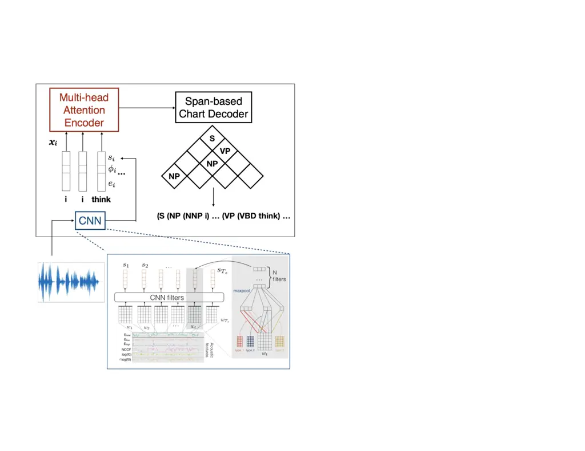

# Assessing the Use of Prosody in Constituency Parsing of Imperfect Transcripts

Trang Tran    Mari Ostendorf

###### Abstract

This work explores constituency parsing on automatically recognized
transcripts of conversational speech. The neural parser is based on a
sentence encoder that leverages word vectors contextualized with
prosodic features, jointly learning prosodic feature extraction with
parsing. We assess the utility of the prosody in parsing on imperfect
transcripts, i.e. transcripts with automatic speech recognition (ASR)
errors, by applying the parser in an N-best reranking framework. In
experiments on Switchboard, we obtain 13-15% of the oracle N-best gain
relative to parsing the 1-best ASR output, with insignificant impact on
word recognition error rate. Prosody provides a significant part of the
gain, and analyses suggest that it leads to more grammatical utterances
via recovering function words.

^(†)^(†)address: ¹University of Southern California, Institute for
Creative Technologies  
²University of Washington, Electrical and Computer
Engineering^(†)^(†)email: ttran@ict.usc.edu, ostendor@uw.edu

Index Terms: constituency parsing, spoken language, prosody

## 1 Introduction

Constituency parsing is well studied on written text, including
multilingual texts \[1\], but work on parsing conversational speech is
more limited, and parsers trained on written text do not work well on
conversational speech. Early work in parsing conversational speech
addressed challenges not present in written text, e.g. the lack of
punctuation and the presence of disfluencies \[2, 3\]. Later studies
successfully incorporated prosodic features into parsing \[4, 5, 6, 7\],
but the modest gains were outstripped by advances in neural
architectures and contextualized word representations \[8\].
Additionally, most work used a prosody representation learned from
human-annotated prosodic features, e.g. ToBI \[9\], which are expensive
and require expert knowledge. Recent work with neural parsers \[10, 11\]
showed that automatically learned prosody representations can still be
beneficial. However, these studies were done on human transcripts, an
unrealistic assumption for spoken language systems.

A number of studies have leveraged parsing language models in an effort
to improve automatic speech recognition (ASR), but research aimed at
improving the parse of the output has been limited. One study \[12\]
explored joint parsing and word recognition by re-ranking ASR hypotheses
based on parse features, showing a reduction in word error rate (WER).
Another study \[13\] explored parsing in the context of domain
adaptation and ASR name error detection. The authors showed that using
output parse features improved re-scoring word confusion networks and
benefited the detection of ASR errors and out-of-vocabulary regions.
Recent work by \[14\] studied joint parsing with disfluency detection on
ASR transcripts, but they looked at dependency parsing and the method
required extending the label set with speech-specific dependency type
labels to handle mismatched words. All these studies only parsed
transcript texts; prosodic features were not used.

The work presented here fills a gap by assessing the use of prosody in
parsing ASR transcripts, where there is a question of whether ASR errors
will lead to noisy acoustic-prosodic features. We use a state-of-the-art
neural parser combined with N-best hypothesis re-ranking, and confirm
that prosody still provides a benefit in parsing conversational speech
in experiments on the Switchboard corpus \[15\]. In addition, we provide
qualitative analyses of where the approach provides the most gains and
its effects on WER. The approach leverages a simple integration of
prosodic and lexical word vectors in a transformer encoder, which is a
framework used in many language processing systems and thus is
applicable to other tasks.

## 2 Dataset and Metrics

The dataset in our work is Switchboard (SWBD) \[15\], a collection of
spontaneous telephone speech between strangers prompted to talk about a
specific set of topics. SWBD has been widely used for both parsing and
ASR, and to our knowledge, is the only large dataset of conversational
English that has a corresponding parse treebank. We also assume known
sentence boundaries, as in most prior work. For training and tuning the
parser, we use the transcripts from standard parsing data splits for
train, development, and test sets (932, 144, 50 conversations), as in
previous work on parsing SWBD, e.g. \[2, 11\]. For the re-ranking module
(details in Section 3.3), we split the parsing development set into
training and development _subsets_ with 75%-25% ratio, in which the
sentences were randomly selected. This is because we are focusing on the
effects of ASR errors on a pipelined system with a trained parser (with
or without prosody), and we would not have parse hypotheses from the
training data (since the parser has already seen these sentences). The
test set is the same as in parsing.

Constituency parsing for written text is commonly evaluated using
EVALB,¹¹ 1 https://nlp.cs.nyu.edu/evalb i.e. reporting F1 score on
predicted constituent tuples $`(l,a,b)`$, where $`l`$ denotes the
constituent label, and $`a`$ and $`b`$ denote the starting and ending
indices of the constituent. However, this measure only works when the
predicted parse and the reference parse have the same words. For
evaluating parses on ASR transcripts, we use SParseval \[16\], a scoring
program similar to EVALB but with mechanisms to account for ASR
errors.²² 2 Our code is made publicly available at
https://github.com/trangham283/asr_preps For bracket F1, SParseval
requires an alignment between word sequences of the gold and predicted
parses. We obtain this alignment with Gestalt pattern matching.
SParseval also has the option to compute dependency F1, which does not
require the word alignment, as this measure is based on head-percolated
tuples of $`(h,d,r)`$ where $`h`$ is the head word, $`d`$ is the
dependent, and $`r`$ is the relation between $`h`$ and $`d`$. We present
F1 scores for both bracket (“brk”) and dependency (“dep”) F1. The “dep”
F1 scores are lower than the “brk” scores, because errors in word
sequences directly contribute to lower recall.

## 3 System Components

### 3.1 Automatic Speech Recognizer

We use an off-the-shelf ASR system, ASPiRE \[17\], which was trained on
Fisher conversational speech data \[18\], available in Kaldi’s \[19\]
model suite. Briefly, the ASPiRE system was trained using a lattice-free
maximum mutual information (LF-MMI) criterion, with computation
efficiencies enabled by a phone-level language model and outputs at 1/3
the standard frame rate (one frame every 30 ms). The ASPiRE system has a
reported word error rate (WER) of 15.6% on the Hub5 ‘00 evaluation set.

ASR is run on Treebank sentence units, where the segmentation times are
based on word times in the hand-corrected Mississippi State (MS-State)
transcripts \[20\], using an alignment of Treebank words to the MS
transcript words. For each sentence, we retain a set of (up to) 10 best
ASR hypotheses. Shorter sentences often had fewer hypotheses; 62% of the
sentences have 9 or fewer hypotheses, 24% have fewer than 5. Word-level
time alignments are a by-product of the ASR system.

### 3.2 Parser

Our parser is composed of a multi-head self-attention (i.e. transformer
\[21\]) encoder and a span-based chart decoder proposed by \[22\],
extended to integrate prosodic features as in \[11\]. The parser takes
as input a sequence of $`T`$ word-level features:
$`x_{1},\cdots,x_{T}`$. For each word $`i`$ in a sentence, the encoder
maps input $`x_{i}`$ to a query vector $`q_{i}`$, a key vector
$`k_{i}`$, and a value vector $`v_{i}`$, which are used to compute the
labeled span scores $`p(l,a,b)`$. The chart decoder then learns to
output the parse tree with the highest scores summed over all possible
labeled spans.

The input vectors $`x_{i}=[e_{i};\phi_{i};s_{i}]`$ are composed of word
embeddings $`e_{i}`$, pause- and duration-based features $`\phi_{i}`$,
and learned energy/pitch (E/f0) features $`s_{i}`$, which taken together
represent a prosodically contextualized word vector. The word embeddings
$`e_{i}`$ are pretrained BERT embeddings \[23\], which have been shown
to perform well on a variety of NLP tasks, and also to benefit parsing
conversational speech transcripts despite the mismatch with written text
\[8, 11\]. Pause- and duration-based features $`\phi_{i}`$ are composed
of pause durations before and after each word; word durations are
normalized by the mean duration of the word type in the training corpus.

The acoustic-prosodic features $`s_{i}`$ are learned via a convolutional
neural network (CNN) from energy (E) and pitch (f0) contours as
described in \[10\]. Briefly, the frame-level energy and pitch features
are extracted using Kaldi \[19\] and normalized for each speaker side of
the whole SWBD conversations. The frames corresponding to each word are
then extracted based on word-level time alignments. Each sequence of
f0/E frames corresponding to a time-aligned word (and potentially its
surrounding context) is convolved with $`N`$ filters of $`m`$ sizes (a
total of $`mN`$ filters). The motivation for the multiple filter sizes
is to enable the computation of features that capture information on
different time scales. For each filter, we perform a 1-D convolution
over the f0/E features with a stride of 1. Each filter output is
max-pooled, resulting in $`mN`$-dimensional speech features $`s_{i}`$
for word $`i`$. These prosody representations are jointly learned with
the parsing objective.

Both parsers (with and without prosody features $`\phi_{i},s_{i}`$) are
trained on parses associated with hand transcribed speech, and
hyperparameters are based on optimizing bracket F1 (from EVALB). Figure
1 provides an overview of the parser and the CNN module.³³ 3 We used the
implementation provided at
https://github.com/trangham283/prosody_nlp/tree/master/code/self_attn_speech_parser

Figure 1: Parser model overview, including: a CNN module for extracting
prosodic features, a transformer encoder, and the chart decoder parser.
Word-level input features include: word embeddings $`e_{i}`$,
pause/duration features $`\phi_{i}`$, and acoustic-prosodic features
$`s_{i}`$ learned by a CNN module.

### 3.3 Ranker

Given a set of ASR hypotheses for an utterance, we parse each hypothesis
and train a ranker to select the hypothesis with the best F1 score. This
process is formulated as a binary classification problem, e.g. as
reviewed in \[24\]. Specifically, for each set of hypotheses, two
sentences $`a,b`$ form a paired sample with features
$`F_{ab}=[f_{1a}-f_{1b},\cdots,f_{Na}-f_{Nb}]`$, where $`f_{ix}`$ is the
$`i`$-th feature of a sentence $`x\in\{a,b\}`$. These features include
utterance length, number of disfluent nodes, parser output score, ASR
output score, parse tree depth, total number of constituents in the
predicted parse, and counts of several specific types of constituents
such as edited (disfluent nodes), np, vp, etc. The prosodic cues are not
used directly in ranking; they are implicitly included in the parser
score. The corresponding label $`Y_{ab}=1`$ for the sentence pair if the
F1 scores satisfy $`{F1}(a)>{F1}(b)`$; $`Y_{ab}=0`$ otherwise. In
constructing the training (sub)set, we select the pairs with the highest
F1 score difference and 10 other random pairs. The ranker is the
classifier $`C(\cdot)`$ that learns to predict $`Y_{ab}=C(F_{ab})`$. For
each type of F1 score, i.e. $`{F1}(\cdot)\in`$ {labeled, unlabeled}
$`\times`$ {dependency, bracket}, we trained a separate
classifier/ranker to optimize for that score.

At test time, two ranking methods were used: point-wise and pair-wise.
For point-wise ranking, each hypothesis sentence $`a`$ is considered
individually to produce the probability score $`P(a)=C(X_{a})`$
(equivalent to a pairing of sentence $`a`$ with a sentence of all
feature values 0). The best hypothesis is chosen by
$`\hat{a}=argmax_{a}P(a)`$. For the pair-wise ranking method, two
hypotheses are selected at a time, where the hypothesis for the next
round of comparison is chosen based on its higher score. We report the
results from the better ranking method in each setting.

We experimented with several types of binary classifiers: logistic
regression (LR), support vector machine classifier (SVC), and decision
tree (DT). Hyperparameters of each classifier were tuned on the
development (sub)set F1 scores. While more complex ranking approaches
exist (e.g. see \[24\]), our feature set is small and the goal here is
to demonstrate a benefit from prosody when considering multiple
hypotheses. More complex ranking algorithms and/or the use of lattice
ASR output are left for future work.

## 4 Experiments and Results

### 4.1 Ranking configuration

The first set of experiments aimed at determining the best ranker and
ranking features on the development set. Table 4.1 shows labeled
dependency (“dep”) and bracket (“brk”) F1 scores on the development set,
comparing different feature sets, parsing with only transcripts vs.
transcript+prosody, and ranking classifiers. In almost all settings, the
simple LR ranker outperforms SVC and DT (not shown, but results were
similar to SVC), achieving the best dependency and bracket F1 scores of
0.520 and 0.713, respectively.

| \toprule            | Ranker                     | LR    |       | SVC   |       |
| ------------------- | -------------------------- | ----- | ----- | ----- | ----- |
|                     | feature set                | dep   | brk   | dep   | brk   |
| \midrule transcript | core set                   | 0.514 | 0.701 | 0.513 | 0.699 |
|                     | \+ depth                   | 0.513 | 0.699 | 0.513 | 0.697 |
|                     | \+ $`N_{c}`$               | 0.513 | 0.700 | 0.512 | 0.698 |
|                     | \+ depth + $`N_{c}`$       | 0.512 | 0.698 | 0.513 | 0.649 |
|                     | \+ depth + $`N_{c}`$ + \*P | 0.518 | 0.707 | 0.511 | 0.693 |
| \midrule +prosody   | core set                   | 0.517 | 0.705 | 0.515 | 0.703 |
|                     | \+ depth                   | 0.515 | 0.703 | 0.515 | 0.703 |
|                     | \+ $`N_{c}`$               | 0.516 | 0.706 | 0.515 | 0.703 |
|                     | \+ depth + $`N_{c}`$       | 0.513 | 0.706 | 0.515 | 0.704 |
|                     | \+ depth + $`N_{c}`$ + \*P | 0.520 | 0.713 | 0.512 | 0.697 |
| \bottomrule         |                            |       |       |       |       |

Within the LR results, the best performing feature set consists of parse
score (raw and normalized by length), ASR score (raw and normalized by
length), sentence length, total number of constituents in the predicted
parse, parse tree depth, and the number of certain types of constituents
in the predicted parse: edited, intj, pp, vp, and np. The parser trained
with prosody features slightly outperforms the text-based one: 0.713 vs.
0.707 for bracket F1, and 0.520 vs. 0.518 for dependency F1. For the
remaining results, we focus on this configuration: LR ranker with the
full feature set.

### 4.2 ASR hypotheses vs. 1-best and the use of prosody

Table 2 presents results comparing the baseline (1-best hypothesis) with
the best ranking strategy (LR ranker and full parse feature set), and
results from ranking based on the parse score alone. Using only the
parse score is worse than using the 1-best ASR hypothesis, but
re-ranking using parse features improves performance for both
transcript-only (“trans.”) and transcript+prosody (“+pros.”) parsers, in
all types of evaluations (labeled and unlabeled, dependency and bracket
F1). Prosody contributes 30-40% of the gain for the best case labeled F1
scores. For the bracket dependencies using reranking, the differences
relative to the baseline and the difference when adding prosody are all
statistically significant at $`p<0.05`$ using the bootstrap test \[25\].
F1 scores for parsing on hand transcripts (“gold,” i.e. best-case) range
from 0.91-0.94, so there is still a large gap. Note that the gap in
bracket F1 is smaller because the parser was tuned on the EVALB (bracket
F1) objective, as is standard in parsing studies.

|                 |              |           |       |         |       |
| --------------- | ------------ | --------- | ----- | ------- | ----- |
| \toprule        | selection by | unlabeled |       | labeled |       |
|                 | sentence’s   | dep       | brk   | dep     | brk   |
| \midrule        | 1-best ASR   | 0.624     | 0.723 | 0.513   | 0.699 |
| \midrule trans. | parse score  | 0.588     | 0.698 | 0.499   | 0.664 |
|                 | best ranker  | 0.627     | 0.736 | 0.518   | 0.707 |
| \cmidrule2-6    | gold         | 0.930     | 0.933 | 0.905   | 0.924 |
| \midrule +pros. | parse score  | 0.594     | 0.706 | 0.502   | 0.670 |
|                 | best ranker  | 0.629     | 0.740 | 0.520   | 0.713 |
| \cmidrule2-6    | gold         | 0.933     | 0.938 | 0.909   | 0.928 |
| \bottomrule     |              |           |       |         |       |

Table 2: F1 scores on the development set across different sentence
selection settings.

The results on the test set (Table 3) confirm the findings that
re-ranking benefits are greater for bracket scores and that parsers that
use prosody consistently give better performance than those without
prosody. In contrast to results on the dev set, the benefit from prosody
on the test set is greater for labeled dependencies than for labeled
brackets, and for dependencies it provides more than 70% of the gain.
The combination of re-ranking and prosody obtains 2-3% relative
improvement in F1 for the labeled cases, which corresponds to 13-15% of
the oracle possible gain with the N-best setting used here.

|                    |           |       |         |       |
| ------------------ | --------- | ----- | ------- | ----- |
| \toprule           | unlabeled |       | labeled |       |
|                    | dep       | brk   | dep     | brk   |
| \midrule1-best ASR | 0.612     | 0.700 | 0.491   | 0.676 |
| transcript         | 0.619     | 0.714 | 0.494   | 0.687 |
| +prosody           | 0.622     | 0.715 | 0.504   | 0.690 |
| \midruleoracle F1  | 0.704     | 0.807 | 0.576   | 0.783 |
| gold               | 0.934     | 0.933 | 0.909   | 0.926 |
| \bottomrule        |           |       |         |       |

Table 3: Test set F1 scores compared between different systems.
“transcript” and “+prosody” denote results after re-ranking outputs of
the parser without and with prosody. “oracle F1” denotes results
achieved by selecting best sentence-level F1 score in the set of
hypotheses and “gold” denotes results on hand transcripts with the best
parser (including prosody).

SParseval by default does not include edited (disfluent) nodes in
scoring. This could be a disadvantage for our parser as it was trained
to explicitly detect edited nodes, so we also compute a modified
SParseval score that considers edited nodes. Scores are generally lower
when edited nodes are included, but findings are similar except that the
labeled dependency score benefits more from prosody.

Direct comparison with previous work is difficult. Work by \[13\] use a
different dataset; \[14\] use a different metric from SParseval; and
\[12\] use parse scoring based on the whole turn instead of sentence
units. Further, each of these works used a different ASR system to
generate automatic transcripts, different ranking algorithms, and
potentially different time alignments. With this caveat, the closest
point of comparison is \[12\], which reports results on Switchboard
using an ASR system reporting 24.1% 1-best WER (16.2% N-best oracle WER,
N=50) on the test set. Using reference sentence segmentations (similar
to our scenario), they reported an unlabeled dependency F1 score of
0.734 with the oracle result of 0.823. The higher scores (despite the
higher WER compared to our system) probably reflect differences in a
scoring implementation that incorporates sentence segmentation.

### 4.3 Effects on WER

Table 4 shows the test set WER with different parse ranking objectives
using the best (transcript+prosody) parser. Excluding the oracle F1
case, the differences compared to the 1-best ASR hypothesis are not
significant.

|                    |           |      |         |      |
| ------------------ | --------- | ---- | ------- | ---- |
| \toprule           | unlabeled |      | labeled |      |
| \cmidrule2-5 score | dep       | brk  | dep     | brk  |
| \midruletranscript | 0.20      | 0.19 | 0.20    | 0.19 |
| +prosody           | 0.20      | 0.20 | 0.19    | 0.19 |
| oracle F1          | 0.16      | 0.17 | 0.17    | 0.16 |
| \bottomrule        |           |      |         |      |

Table 4: WER on the SWBD test set for different parse ranking
objectives. WER=0.19 for the 1-best baseline.

For further analysis, we compare hypotheses selected by the best
parser/re-ranker and the 1-best hypothesis. The best system overall
results in a slightly higher WER, but gives small F1 improvements in
sentences where all 10 hypotheses are available, which tend to be
longer. This result could be because most of the sentences are short
(mean = 1.8–3 tokens) for those not producing all 10 hypotheses; only
longer sentences (mean = 12.7 tokens) have full 10 hypotheses.

In sentences where the prosody parser/re-ranker outperformed the 1-best
hypothesis, 35% of these are associated with better WER, and 23% with
worse WER. In both cases, the majority of words involved are function
words: 82% when WER improved, 77% when WER degraded.

Some anecdotal (but common) examples are shown below; bold text denotes
words corrected by the prosody parser that were otherwise wrong (strike
out text) or missed in the 1-best hypothesis or the transcript-only
(with re-ranking) parser. The better parser appears to favor
grammatically correct sentences.

- •
  i mean that ’s better than george bush you who came out and said no
- •
  do you like rap music
- •
  it ’s bigger than just the benefits
- •
  learn i learned not necessarily be the center of attention

Finally, we considered whether human transcription error \[10, 26\]
could be a confounding factor. The Switchboard parses are based on
sentence transcriptions that were later corrected, and 27% of the test
sentence have at least one transcription error, in which case the gold
parse is less reliable. Analysis in \[10\] indicates that prosody
appeared to hurt performance in the subset with errors, hypothesizing
that errors in the reference parse might explain this.

Indeed, as Table 5 shows, the bracket F1 score in sentences without
transcription errors are higher both for the parser/re-ranker (0.707 vs.
0.660) and the 1-best hypothesis system (0.693 vs. 0.648). Similarly,
the WER is lower in sentences without transcription errors both for the
parser/re-ranker (0.181 vs. 0.237) and the 1-best hypotheses (0.169 vs.
0.235). Within 5854 test sentences, 1616 have at least one transcription
error based on the MS-State corrections.

| \toprule           | bracket F1 |        | WER    |        |
| ------------------ | ---------- | ------ | ------ | ------ |
| Sentences:         | 1-best     | ranker | 1-best | ranker |
| \midrulewith error | 0.648      | 0.660  | 0.235  | 0.237  |
| without error      | 0.693      | 0.707  | 0.169  | 0.181  |
| \bottomrule        |            |        |        |        |

Table 5: F1 score and WER comparing sentences with and without
transcription errors in the SWBD test set.

## 5 Conclusion

We present a study on parsing ASR transcripts with a neural parser that
incorporates prosodic information. Our simple re-ranking framework using
standard parse tree features and ASR scores obtains 13-15% of the oracle
N-best gain relative to parsing the 1-best ASR output with no
significant impact on WER. Further gains may be obtained with simple
extensions such as a larger N, different ranking algorithms, and
integrated parsing and sentence segmentation. The results also
demonstrate how a pipelined system is impacted by ASR errors. In all
settings, parsing using prosodic features outperforms parsing with only
text (transcript) information. When parsing improvement is observed,
words involved in the hypothesis selection change are mostly function
words (around 80%).

The parsing task is used here as a general means of exploring the impact
of realistic inputs (ASR) in speech understanding. Although many
language processing systems today do not explicitly use parsers, parsing
continues to be an active area of research, in part because it is useful
for interpretability studies \[27, 28\]. In addition, it serves as a
good proxy for assessing contextualized word representations for a range
of language understanding tasks \[29, 30\]. The work here introduces a
method for incorporating prosody into contextualization of word vectors,
jointly learning the prosodic representations in a transformer-based
encoder, within a relatively standard encoder-decoder framework. As
such, the method can easily be transferred to other spoken language
processing tasks.

## 6 Acknowledgements

We thank the reviewers for their helpful feedback. This work was funded
in part by the NSF, grant IIS-1617176. Any opinions or recommendations
expressed in this material are those of the authors and do not
necessarily reflect the views of the NSF.

## References

- \[1\] N. Kitaev, S. Cao, and D. Klein, “Multilingual constituency
  parsing with self-attention and pre-training,” in _Proc. ACL_, Jul.
  2019, pp. 3499–3505.
- \[2\] E. Charniak and M. Johnson, “Edit Detection and Parsing for
  Transcribed Speech,” in _Proc. NAACL_, 2001.
- \[3\] M. Johnson and E. Charniak, “A TAG-based Noisy Channel Model of
  Speech Repairs,” in _Proc. ACL_, 2004.
- \[4\] J. G. Kahn, M. Lease, E. Charniak, M. Johnson, and M. Ostendorf,
  “Effective Use of Prosody in Parsing Conversational Speech,” in _Proc.
  HLT/EMNLP_, 2005.
- \[5\] J. Hale, I. Shafran, L. Yung, B. Dorr, M. Harper,
  A. Krasnyanskaya, M. Lease, Y. Liu, B. Roark, M. Snover, and
  R. Stewart, “PCFGs with Syntactic and Prosodic Indicators of Speech
  Repairs,” in _Proc. COLING-ACL_, 2006.
- \[6\] M. Dreyer and I. Shafran, “Exploiting prosody for PCFGs with
  latent annotations,” in _Proc. Interspeech_, 2007.
- \[7\] Z. Huang and M. Harper, “Appropriately Handled Prosodic Breaks
  Help PCFG Parsing,” in _Proc. NAACL_, 2010.
- \[8\] P. Jamshid Lou, Y. Wang, and M. Johnson, “Neural constituency
  parsing of speech transcripts,” in _Proc. NAACL_. Minneapolis,
  Minnesota: Association for Computational Linguistics, Jun. 2019, pp.
  2756–2765. \[Online\]. Available:
  https://www.aclweb.org/anthology/N19-1282
- \[9\] K. Silverman, M. Beckman, J. Pitrelli, M. Ostendorf,
  C. Wightman, P. Price, J. Pierrehumbert, and J. Hirschberg, “Tobi: A
  Standard for Labeling English Prosody,” in _Proc. ICSLP_, 1992.
- \[10\] T. Tran, S. Toshniwal, M. Bansal, K. Gimpel, K. Livescu, and
  M. Ostendorf, “Parsing speech: a neural approach to integrating
  lexical and acoustic-prosodic information,” in _Proc. NAACL_, Jun.
  2018, pp. 69–81.
- \[11\] T. Tran, J. Yuan, Y. Liu, and M. Ostendorf, “On the Role of
  Style in Parsing Speech with Neural Models,” in _Proc. Interspeech_,
  2019, pp. 4190–4194.
- \[12\] J. G. Kahn and M. Ostendorf, “Joint reranking of parsing and
  word recognition with automatic segmentation,” _Computer Speech &
  Language_, vol. 26, no. 1, pp. 1–51, 2012.
- \[13\] A. Marin and M. Ostendorf, “Domain adaptation for parsing in
  automatic speech recognition,” in _Proc. ICASSP_, 2014, pp. 6379–6383.
- \[14\] M. Yoshikawa, H. Shindo, and Y. Matsumoto, “Joint
  Transition-based Dependency Parsing and Disfluency Detection for
  Automatic Speech Recognition Texts,” in _Proc. EMNLP_, 2016.
- \[15\] J. J. Godfrey and E. Holliman, _Switchboard-1 Release 2_,
  Linguistic Data Consortium, 1993.
- \[16\] B. Roark, M. Harper, E. Charniak, B. Dorr, M. Johnson, J. G.
  Kahn, Y. Liu, M. Ostendorf, J. Hale, A. Krasnyanskaya, M. Lease,
  I. Shafran, M. Snover, R. Stewart, and L. Yung, “SParseval: Evaluation
  metrics for parsing speech,” in _Proc. LREC_, 2006.
- \[17\] D. Povey, V. Peddinti, D. Galvez, P. Ghahremani, V. Manohar,
  X. Na, Y. Wang, and S. Khudanpur, “Purely sequence-trained neural
  networks for asr based on lattice-free mmi,” in _Proc.
  Interspeech_, 2016.
- \[18\] C. Cieri, D. Graff, O. Kimball, D. Miller, and K. Walker,
  “Fisher english training speech part 1 transcripts, ldc2004t19,” 2004.
- \[19\] D. Povey, A. Ghoshal, G. Boulianne, L. Burget, O. Glembek,
  N. Goel, M. Hannemann, P. Motlíček, Y. Qian, P. Schwarz, J. Silovský,
  G. Stemmer, and K. Veselý, “The Kaldi Speech Recognition Toolkit,” in
  _Proc. ASRU_, 2011.
- \[20\] N. Deshmukh, A. Gleeson, J. Picone, A. Ganapathiraju, and
  J. Hamaker, “Resegmentation of SWITCHBOARD,” in _Proc. ICSLP_, 1998.
- \[21\] A. Vaswani, N. Shazeer, N. Parmar, J. Uszkoreit, L. Jones,
  A. N. Gomez, L. Kaiser, and I. Polosukhin, “Attention is all you
  need,” in _Proc. NIPS_, I. Guyon, U. V. Luxburg, S. Bengio,
  H. Wallach, R. Fergus, S. Vishwanathan, and R. Garnett, Eds., 2017,
  pp. 5998–6008.
- \[22\] N. Kitaev and D. Klein, “Constituency parsing with a
  self-attentive encoder,” in _Proc. ACL_, 2018, pp. 2676–2686.
- \[23\] J. Devlin, M.-W. Chang, K. Lee, and K. Toutanova, “BERT:
  Pre-training of deep bidirectional transformers for language
  understanding,” in _Proc. NAACL_, 2019, pp. 4171–4186.
- \[24\] C. Burges, “From ranknet to lambdarank to lambdamart: An
  overview,” MSR, Tech. Rep., 2010.
- \[25\] B. Efron and R. J. Tibshirani, _An Introduction to the
  Bootstrap_. Chapman & Hall/CRC, 1993.
- \[26\] V. Zayats, T. Tran, R. Wright, C. Mansfield, and M. Ostendorf,
  “Disfluencies and Human Speech Transcription Errors,” in _Proc.
  Interspeech_, 2019, pp. 3088–3092.
- \[27\] T. Blevins, O. Levy, and L. Zettlemoyer, “Deep RNNs encode soft
  hierarchical syntax,” in _Proc. ACL_, 2018, pp. 14–19.
- \[28\] N. F. Liu, M. Gardner, Y. Belinkov, M. E. Peters, and N. A.
  Smith, “Linguistic knowledge and transferability of contextual
  representations,” in _Proc. NAACL_, 2019, pp. 1073–1094.
- \[29\] A. Miaschi, D. Brunato, F. Dell’Orletta, and G. Venturi,
  “Linguistic profiling of a neural language model,” in _Proc. COLING_,
  2020, pp. 745–756.
- \[30\] F. M. Zanzotto, A. Santilli, L. Ranaldi, D. Onorati,
  P. Tommasino, and F. Fallucchi, “KERMIT: Complementing transformer
  architectures with encoders of explicit syntactic interpretations,” in
  _Proc. EMNLP_, 2020, pp. 256–267.

Table 1: Labeled dependency (“dep”) and bracket (“brk”) F1 scores on the
development set. ‘core set’ denotes the feature set including: parser
output score, ASR hypothesis score, sentence length, and number of
edited (disfluent) nodes. ‘depth’ denotes parse tree depth; ‘$`N_{c}`$’
denotes the total constituent count in the predicted parse; ‘\*P’
denotes the counts of several constituent types (pp, np, vp, intj) in
the predicted parse.
