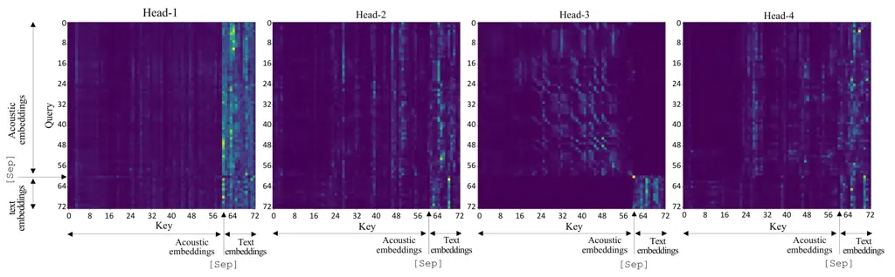

# Cross-Modal Transformer-Based Neural Correction Models for Automatic Speech Recognition

Tomohiro Tanaka, Ryo Masumura, Mana Ihori, Akihiko Takashima, Takafumi
Moriya, Takanori Ashihara, Shota Orihashi, Naoki Makishima

###### Abstract

We propose a cross-modal transformer-based neural correction models that
refines the output of an automatic speech recognition (ASR) system so as
to exclude ASR errors. Generally, neural correction models are composed
of encoder-decoder networks, which can directly model
sequence-to-sequence mapping problems. The most successful method is to
use both input speech and its ASR output text as the input contexts for
the encoder-decoder networks. However, the conventional method cannot
take into account the relationships between these two different modal
inputs because the input contexts are separately encoded for each modal.
To effectively leverage the correlated information between the two
different modal inputs, our proposed models encode two different
contexts jointly on the basis of cross-modal self-attention using a
transformer. We expect that cross-modal self-attention can effectively
capture the relationships between two different modals for refining ASR
hypotheses. We also introduce a shallow fusion technique to efficiently
integrate the first-pass ASR model and our proposed neural correction
model. Experiments on Japanese natural language ASR tasks demonstrated
that our proposed models achieve better ASR performance than
conventional neural correction models.

^(†)^(†)address: NTT Media Intelligence Laboratories, NTT Corporation,
Japan^(†)^(†)email: tomohiro.tanaka.ht@hco.ntt.co.jp

Index Terms: automatic speech recognition, neural correction models,
Transformer, shallow fusion, self-attention

## 1 Introduction

Neural networks have dramatically improved the performance of automatic
speech recognition (ASR) systems. In particular, end-to-end ASR systems
that directly convert an input speech utterance into an output text
(e.g., characters, subwords, words) have attracted significant
attention. Recent studies have investigated various end-to-end ASR
methods including connectionist temporal classification \[1, 2, 3\],
recurrent neural network transducers \[4, 5\], and attention-based
encoder-decoder models with recurrent neural networks\[6, 7, 8\] or
transformers \[9, 10\]. Though these end-to-end ASR methods have made
great progress, their performance is insufficient when executing
one-pass decoding using a single ASR model.

Various post-processing methods have been proposed to compensate for
this insufficiency. One existing methods is to use neural language
models with fusion techniques \[11, 12, 13\] or rescoring hypotheses (or
lattices) from first-pass ASR \[14, 15, 16\]. Furthermore, methods that
directly map ASR hypotheses to its reference text by using neural
correction models have been investigated. One type of the neural
correction models is text-to-text conversion-based models that convert
the ASR hypothesis into the correct sentence \[17, 18, 19, 20\].
Besides, the neural correction model in \[21\] leverages both input
speech and its ASR hypotheses as the input contexts for the
encoder-decoder networks. The model separately encodes the speech and
hypothesis embeddings and individually attends to each encoded
information with attention mechanisms \[22, 23\]. However, this method
cannot explicitly take into account where to correct the input ASR
hypothesis because an encoder cannot mutually detect the positions of
input in the other encoder.

We propose cross-modal transformer-based neural correction models that
jointly encode speech and the ASR hypothesis to take their relationships
into consideration. Our proposed models use the self-attention in the
transformer \[10\] to take into account the cross-modal relationships
between the speech and ASR hypothesis. In our proposed models, two
different modals are jointly encoded using cross-modal self-attention.
We assume that the cross-modal self-attention enables the models to
effectively learn the relationship between speech and hypothesis. In
contrast, a conventional neural correction model \[21\] separately
encodes the speech and ASR hypothesis. In short, the advantage of our
proposed models is that different modal inputs are effectively encoded
while considering each other. Our proposed models are assumed to
explicitly take into account where to correct the input ASR hypothesis
by capturing the relationship between it and the speech. Finally, the
decoder network computes the generative probabilities of tokens using
the context vectors and generates the refined result by beam-search
decoding. Hu et al. used only the decoder of their neural correction
model during beam-search decoding to generate refined results \[21\]. In
contrast, we introduce shallow fusion \[11, 12\] to integrate first-pass
ASR and neural correction models. This enables us to complementarily use
information from both decoders in ASR and neural correction models. To
the best of our knowledge, this is the first study that introduces
cross-modal processing and shallow fusion into neural correction models
for ASR.

We verify the effectiveness of our models with Japanese ASR tasks. We
prepare separate attention-based models to compare with our models.

## 2 Related Work

Neural correction models are closely related to neural language models.
In particular, encoder-decoder-based neural language models conditioned
by speech information \[24, 25, 26\] and hypotheses from ASR \[27\] are
similar to neural correction models. These language models were often
applied so as to rescore ASR hypotheses, i.e., n-bests. In contrast,
neural correction models directly generate a sentence from ASR
hypotheses and speech.

Our proposed models are related to studies that use self-attention to
joinly encode cross-modal input features \[28, 29, 30\]. These studies
proposed cross-modal attention of visual and linguistic features with
transformer-based neural networks. In this paper, we focus on speech and
text information for neural correction models for ASR and use
self-attention to take into account the relationships between them.

## 3 End-to-End ASR

An end-to-end ASR system directly converts acoustic features of input
speech into a token sequence. In this study, we use auto-regressive
encoder-decoder models that predict the probability of a token given the
previous predicted tokens. Given speech
$`\bm{X}=\{\bm{x}_{1},\cdots,\bm{x}_{I}\}`$, the encoder-decoder
estimates the generative probability of a token sequence
$`\bm{W}=\{w_{1},\cdots,w_{T}\}`$, where $`I`$ is the number of the
acoustic features in the input speech and $`T`$ is the number of the
tokens in the token sequence. The generative probability of a token
sequence is defined as

```math
\displaystyle P(\bm{W}|\bm{X};\bm{\Lambda})=\prod_{t=1}^{T}P(w_{t}|w_{1:t-1},\bm{X};\bm{\Lambda}), \tag{1}
```

where $`\bm{\Lambda}`$ represents the trainable parameters.

The model parameters $`\bm{\Lambda}`$ in an end-to-end ASR system are
updated to maximize the generative probability in the decoder when give
an input speech. Thus, the model parameters are optimized by minimizing
the cross entropy loss function:

```math
\mathcal{L}(\bm{\Lambda})=-\sum_{(\bm{W}^{\prime},\bm{X}^{\prime})\in\mathcal{D}}\log P(\bm{W}^{\prime}|\bm{X}^{\prime};\bm{\Lambda}), \tag{2}
```

where $`\mathcal{D}`$ is the training set.

## 4 Transformer-Based Neural Correction Models for ASR

An ASR system generates a hypothesis from an input speech. Neural
correction models then generate a refined result from the hypothesis and
input speech. We use a transformer encoder-decoder for neural correction
models. Given the acoustic feature sequence
$`\bm{X}=\{\bm{x}_{1},\cdots,\bm{x}_{I}\}`$ and the ASR output generated
by the ASR system $`F(\cdot)`$, neural correction models estimate the
generative probability of $`\bm{W}=\{w_{1},\cdots,w_{T}\}`$ as

```math
\displaystyle P(\bm{W}|\bm{X};\bm{\Theta},\bm{\Lambda})= \displaystyle\prod_{t=1}^{T}P(w_{t}|w_{1:t-1},\bm{X},F(\bm{X};\bm{\Lambda});\bm{\Theta}) \tag{3}
```

```math
\displaystyle= \displaystyle\prod_{t=1}^{T}P(w_{t}|w_{1:t-1},\bm{X},\bm{C};\bm{\Theta}), \tag{4}
```

where $`\bm{C}=\{c_{1},\cdots,c_{J}\}`$ is the ASR hypothesis from the
ASR system and $`\bm{\Theta}`$ represents the model parameters in the
neural correction model.

### 4.1 Proposed Method

Figure 1: Network structure of proposed cross-modal transformer-based
neural correction model.

Figure 1 illustrates the network structure of our proposed models that
involves encoding speech and the ASR hypothesis with a cross-modal
transformer. Our proposed models consist of embedding networks for
speech and hypothesis.

Speech Embedding: The acoustic features are embedded into continuous
representations as

```math
\displaystyle\overline{\bm{x}}_{i} \displaystyle=\mathtt{SpeechEmbedding}(\bm{x}_{i},{\theta}_{x}), \tag{5}
```

```math
\displaystyle\bm{s}_{i} \displaystyle=\mathtt{PosEncoding}(\overline{\bm{x}}_{i}), \tag{6}
```

where $`\mathtt{SpeechEmbedding}(\cdot)`$ is a neural network that
converts acoustic features into continuous vectors,
$`\mathtt{PosEncoding}(\cdot)`$ is a function that adds a continuous
vector in which position information is embedded and $`{\theta}_{x}`$ is
the trainable parameter.

Text Embedding: Each token $`c_{j}`$ in a hypothesis
$`\bm{C}=\{c_{1},\cdots,c_{J}\}`$ is encoded to one-hot representation
and embedded into continuous representation as

```math
\displaystyle\overline{\bm{c}}_{j} \displaystyle=\mathtt{TextEmbedding}(c_{j};{\theta}_{d}), \tag{7}
```

```math
\displaystyle\bm{d}_{j} \displaystyle=\mathtt{PosEncoding}(\overline{\bm{c}}_{j}), \tag{8}
```

where $`\mathtt{TextEmbedding}(\cdot)`$ is a function that converts a
token into a continuous representation, and $`{\theta}_{d}`$ is a
trainable parameter.

Cross-Modal Encoder: The two embedded vectors are concatenated into a
single sequence $`\bm{e}`$ as

```math
\displaystyle\bm{e}=\{\bm{s}_{1},\ldots,\bm{s}_{I},\bm{s}_{\rm sep},\bm{d}_{1},\ldots,\bm{d}_{J}\}, \tag{9}
```

where $`\bm{s}_{\rm sep}`$ is a continuous representation of a separator
token $`{\tt[sep]}`$. We define the output of the $`m`$-th transformer
encoder block as $`\bm{f}^{m}`$ and the input of the first block is
defined as $`\bm{f}^{0}=\bm{e}`$. The computational process in the
$`m`$-th block of the transformer encoder is defined as

```math
\displaystyle\bm{f}^{m} \displaystyle=\mathtt{CrossModalEncoder}(\bm{f}^{m-1};{\theta}_{f}), \tag{10}
```

where $`\mathtt{CrossModalEncoder}(\cdot)`$ is a transformer encoder
including a scaled dot-product multi-head self-attention layer and a
position-wise feed-forward network and $`{\theta}_{f}`$ is a trainable
parameter.

Text Decoder: The output of the final block $`\bm{f}^{M}`$ in the
cross-modal encoder is fed into the transformer decoder. When the output
of the $`t`$-th time step for the $`n`$-th transformer block in the
decoder is $`\bm{q}_{t}^{n-1}`$, the transformer decoder constructs a
hidden representation with the context vector $`\bm{U}_{t}^{n}`$ from
the encoder as

```math
\displaystyle\bm{U}_{t}^{n} \displaystyle=\mathtt{SrcTgtAttention}(\bm{f}^{M},\bm{q}_{t-1}^{n-1};{\theta}_{U}), \tag{11}
```

```math
\displaystyle\bm{q}_{t}^{n} \displaystyle=\mathtt{TransformerDecoder}(\bm{q}_{1:t-1}^{n-1},\bm{U}_{t}^{n};{\theta}_{q}), \tag{12}
```

where $`\mathtt{TransformerDecoder}(\cdot)`$ is a transformer decoder
including a scaled dot-product multi-head masked self-attention layer
and a position-wise feed-forward network,
$`\mathtt{SrcTgtAttention}(\cdot)`$ is a scaled dot product multi-head
source-target attention layer, $`M`$ is the number of blocks in the
transformer encoder, and $`{\theta}_{h}`$ is the trainable parameter.
The input of the first block is token embedding, which is calculated as

```math
\displaystyle\overline{\bm{w}}_{t} \displaystyle=\mathtt{TextEmbedding}(w_{t};{\theta}_{w}), \tag{13}
```

```math
\displaystyle\bm{q}^{0}_{t} \displaystyle=\mathtt{PosEncoding}(\overline{\bm{w}}_{t}), \tag{14}
```

where $`{\theta}_{w}`$ is the trainable parameter. The network estimates
the probabilities of a distribution of the output tokens as

```math
\displaystyle P(w_{t}|w_{1:t-1},\bm{X},\bm{C};\bm{\Theta})=\mathtt{Softmax}(\bm{q}_{1:t-1}^{N};{\theta}_{o}), \tag{15}
```

where $`\mathtt{Softmax}(\cdot)`$ represents the softmax function with
linear transformation, $`N`$ is the number of blocks in the transformer
decoder, and $`{\theta}_{o}`$ is the trainable parameter. Finally, beam
search decoding is conducted while calculating the probability
distribution. The model parameters can be summarized as
$`\bm{\Theta}=\{\theta_{x},\theta_{d},\theta_{f},\theta_{U},\theta_{q},\theta_{w},\theta_{o}\}`$.

### 4.2 Conventional Method

Figure 2: Network structure of conventional separate attention-based
neural correction model.

Figure 2 illustrates the network structure of a conventional neural
correction model that separately encodes speech and hypothesis by each
encoder. The input speech and hypothesis are converted into continuous
representations $`\bm{s}_{i}`$ and $`\bm{d}_{j}`$ in the same manner as
in Eqs. (5–6) and (7–8). The embeddings $`\bm{s}_{1:I}`$ and
$`\bm{d}_{1:J}`$ are input into the speech and text encoders.

We define the output of the $`l`$-th speech encoder block and $`m`$-th
text encoder block as $`\bm{f}^{l}`$ and $`\bm{g}^{m}`$ respectively. In
this case, the inputs of the first blocks are defined as
$`\bm{f}^{0}=\bm{s}_{1:I}`$ and $`\bm{g}^{0}=\bm{d}_{1:J}`$. The
computational process in the $`l`$-th block of the transformer speech
encoder and $`m`$-th block of the transformer text encoder are defined
as

```math
\displaystyle\bm{f}^{l} \displaystyle=\mathtt{SpeechEncoder}(\bm{f}^{l-1};{\theta}_{f}), \tag{16}
```

```math
\displaystyle\bm{g}^{m} \displaystyle=\mathtt{TextEncoder}(\bm{g}^{m-1};{\theta}_{g}), \tag{17}
```

where $`\mathtt{SpeechEncoder}(\cdot)`$ and
$`\mathtt{TextEncoder}(\cdot)`$ are transformer encoders including a
scaled dot product multi-head self-attention layer and a position-wise
feed-forward network and $`{\theta}_{f}`$ and $`{\theta}_{g}`$ are the
trainable parameters. The final outputs of the two encoders are attended
to by source-target attention mechanisms and concatenated as

```math
\displaystyle\overline{\bm{U}}_{t}^{n} \displaystyle=\mathtt{SrcTgtAttention}(\bm{f}^{L},\bm{q}_{t-1}^{n-1};{\theta}_{\overline{U}}), \tag{18}
```

```math
\displaystyle\overline{\overline{\bm{U}}}_{t}^{n} \displaystyle=\mathtt{SrcTgtAttention}(\bm{g}^{M},\bm{q}_{t-1}^{n-1};{\theta}_{\overline{\overline{U}}}), \tag{19}
```

```math
\displaystyle\bm{U}_{t}^{n} \displaystyle=[{\overline{\bm{U}}_{t}^{n}}^{T},{\overline{\overline{\bm{U}}}_{t}^{n}}^{T}]^{T}, \tag{20}
```

where $`L`$ is the number of blocks in the transformer of the speech
encoder, and $`M`$ is the number of blocks in the transformer of the
text encoder. The decoder and the probability calculation are the same
as those in the proposed model (Eq.(12–15)). The model parameters can be
summarized as
$`\bm{\Theta}=\{\theta_{x},\theta_{d},\theta_{f},\theta_{g},\theta_{\overline{U}},\theta_{\overline{\overline{U}}},\theta_{q},\theta_{w},\theta_{o}\}`$.

### 4.3 Shallow Fusion of ASR and Neural Correction Model

Shallow fusion \[11, 12\] is a technique to incorporate an external
model by log-linear interpolation at inference time. We use this
technique to merge the first-pass ASR model and neural correction model.
We use the following criterion during beam search decoding:

```math
\displaystyle\hat{\bm{W}}=\mathop{\rm arg~max}\limits_{\bm{W}}(1-\alpha) \displaystyle\log P(\bm{W}|\bm{X};\bm{\Lambda})+
```

```math
\displaystyle\alpha\log P(\bm{W}|\bm{X};\bm{\Lambda},\bm{\Theta}), \tag{21}
```

where $`\alpha`$ is the weight of the neural correction model.

### 4.4 Training

In the training step, the parameters $`\bm{\Theta}`$ for a neural
correction model are updated to maximize the conditional generative
probability in the decoder when given an input speech and the ASR
hypothesis as a context from the encoder. Thus, these parameters are
optimized by minimizing the cross entropy loss function:

```math
\mathcal{L}(\bm{\Theta})=-\sum_{(\bm{W}^{\prime},\bm{X}^{\prime},\bm{C}^{\prime})\in\mathcal{D}^{\prime}}\log P(\bm{W}^{\prime}|\bm{X}^{\prime},\bm{C}^{\prime};\bm{\Theta}), \tag{22}
```

where $`\mathcal{D}^{\prime}`$ is the training set. Our proposed and
conventional models can be trained with the same criterion. Note that
these neural correction models can be trained from the same training
data as ASR since the $`\bm{C}`$ is obtained from function $`F(\cdot)`$
in Eq. (4).

## 5 Experiments

### 5.1 Setups

We used two corpora: the corpus of spontaneous Japanese (CSJ) \[31\] and
our home-made corpus of natural two-person dialogue corpus (NTDC), which
consists of about 24 hours of speech and its transcriptions. We split
NTDC into 22 hours for the training set, 1 hour for development set, and
1 hour for the evaluation set. CSJ, which has about 545 hours of speech,
was used for training data. We used three standard evaluation sets for
CSJ (CSJ1, CSJ2, and CSJ3).

We used a transformer-based encoder-decoder ASR model as the baseline
(Baseline). The encoder and decoder each had six transformer blocks. The
token embedding dimension, hidden state dimension, non-linear layer
dimension, and the number of heads were 256, 256, 2048, and 4,
respectively. The acoustic features were transformed by two layers of 2D
convolutional neural network. In our proposed cross-modal
transformer-based neural correction model (Cross-Modal), the speech
embedding also constructed using a two-layer 2D CNN. The text embeddings
were 256-dimensional continuous representations. The transformer encoder
and decoder had six blocks each. The hidden state dimension, non-linear
layer dimension, and the number of heads are 256, 2048, and 4,
respectively. The conventional model was the neural correction model
with separate attention (Separate), which had an encoder for speech and
one for text. The conventional neural correction model had two encoders
for speech and text respectively. The encoders for speech and text each
had six transformer blocks respectively. The other configurations of the
transformer had the same values as those of Cross-Modal. We applied
shallow fusion (SF) to both models for comparison.

|             |               |              |              |              |               |
| ----------- | ------------- | ------------ | ------------ | ------------ | ------------- |
| Model       | NTDC          | CSJ1         | CSJ2         | CSJ3         | All           |
| Baseline    | 20.3          | 10.1         | 6.5          | 9.4          | 10.5          |
| Separate    | 20.4          | 10.0         | 6.5          | 8.9          | 10.4          |
|    +SF      | 20.4          | 9.9          | $`\bm{6.4}`$ | 8.9          | 10.3          |
| Cross-Modal | 20.3          | 10.0         | $`\bm{6.4}`$ | 9.1          | 10.4          |
|    +SF      | $`\bm{20.2}`$ | $`\bm{9.4}`$ | $`\bm{6.4}`$ | $`\bm{8.4}`$ | $`\bm{10.0}`$ |

Table 1: CERs (%) on evaluation sets of each data set. SF denotes
shallow fusion of baseline and neural correction model.



Figure 4: Sample of self-attention weights in cross-modal transformer.
Number of images is equal to the number of heads in the transformer
encoder. $`{\tt[sep]}`$ is a separator token.

The acoustic features was a 40-dimensional log Mel-filterbank with delta
and acceleration coefficients. We applied SpecAugument\[32\] during
training of all models. The vocabulary size was 3285 characters made
from CSJ and NTDC. In the cross-modal transformer-based model, we added
the special token $`{\tt[sep]}`$ to the vocabulary. We used Adam
optimizer with Noam learning rate scheduler with 25000 warmup steps.
When decoding by beam search, the beam size was set to 20.

### 5.2 Results

Table 1 shows the character error rate (CER) performance when using the
baseline system and two correction-based systems with and without
shallow fusion. Cross-modal transformer-based model and separate
attention-based model showed similar performance when shallow fusion was
not performed. When using shallow fusion, the cross-modal
transformer-based model outperformed the separate attention-based model.
These results indicated that cross-modal transformer effectively learned
the relationship between the speech and hypothesis. We found that
shallow fusion efficiently integrated ASR and cross-modal
transformer-based model.

Figure 3 shows the relationship between the weights of neural correction
models and CER in shallow fusion. Cross-modal transformer-based model
showed better performance over a wider range than the separate
attention-based model. Cross-modal transformer-based and separate
attention-based model with shallow fusion showed better performance than
baseline for all weights. This indicates that shallow fusion can
efficiently integrate ASR and neural correction models.

Figure 4 gives an example of the self-attention weights between key and
query values in the first block for the cross-modal transformer-based
model. Each image shows the weights of each head in the self-attention
in the transformer encoder. The network detected the boundaries and
extracted the features of both speech and ASR-hypothesis embeddings. It
is assumed that head-1 extracted ASR-hypothesis information to determine
the correspondence with the ASR hypothesis and output text, head-2 and
head-4 extracted both speech and ASR-hypothesis information to determine
the correspondence with the two embeddings, and head-3 extracted speech
information to determine the correspondence with speech and output text.
All the images in Figure 4 show that the cross-modal transformer
functioned as expected.

## 6 Conclusions

Figure 3: CERs on all evaluation sets in different weights of neural
correction model with shallow fusion.

We proposed cross-modal transformer-based neural correction models,
which jointly encode speech and hypothesis. The key strength of our
proposed models is effectively capturing the relationships between two
different modals for refining ASR hypotheses. From experiments involving
CERs, our model with shallow fusion showed the best performance of all
the models in our experiments.

## References

- \[1\] A. Graves and N. Jaitly, “Towards end-to-end speech recognition
  with recurrent neural networks,” _Proc. International Conference on
  Machine Learning, (ICML)_, pp. 1764–1772, 2014.
- \[2\] A. Y. Hannun, C. Case, J. Casper, B. Catanzaro, G. Diamos,
  E. Elsen, R. Prenger, S. Satheesh, S. Sengupta, A. Coates, and A. Y.
  Ng, “Deep speech: Scaling up end-to-end speech recognition,” _arXiv:
  1412.5567_, 2014.
- \[3\] Y. Miao, M. Gowayyed, and F. Metze, “EESEN: end-to-end speech
  recognition using deep RNN models and wfst-based decoding,” _Proc.
  Workshop on Automatic Speech Recognition and Understanding (ASRU)_,
  pp. 167–174, 2015.
- \[4\] A. Graves, A. Mohamed, and G. E. Hinton, “Speech recognition
  with deep recurrent neural networks,” _In Proc. of International
  Conference on Acoustics, Speech and Signal Processing (ICASSP)_, pp.
  6645–6649, 2013.
- \[5\] K. Rao, H. Sak, and R. Prabhavalkar, “Exploring architectures,
  data and units for streaming end-to-end speech recognition with
  rnn-transducer,” _Proc of Automatic Speech Recognition and
  Understanding Workshop (ASRU)_, pp. 193–199, 2017.
- \[6\] J. Chorowski, D. Bahdanau, D. Serdyuk, K. Cho, and Y. Bengio,
  “Attention-based models for speech recognition,” _In Proc. Annual
  Conference on Neural Information Processing Systems (NIPS)_, pp.
  577–585, 2015.
- \[7\] D. Bahdanau, J. Chorowski, D. Serdyuk, P. Brakel, and Y. Bengio,
  “End-to-end attention-based large vocabulary speech recognition,”
  _Proc. International Conference on Acoustics, Speech and Signal
  Processing (ICASSP)_, pp. 4945–4949, 2016.
- \[8\] A. Zeyer, K. Irie, R. Schlüter, and H. Ney, “Improved training
  of end-to-end attention models for speech recognition,” _Proc. of
  Annual Conference of the International Speech Communication
  Association (INTERSPEECH)_, pp. 7–11, 2018.
- \[9\] L. Dong, S. Xu, and B. Xu, “Speech-transformer: A no-recurrence
  sequence-to-sequence model for speech recognition,” _Proc. of
  International Conference on Acoustics, Speech and Signal Processing
  (ICASSP)_, pp. 5884–5888, 2018.
- \[10\] A. Vaswani, N. Shazeer, N. Parmar, J. Uszkoreit, L. Jones,
  A. N. Gomez, L. Kaiser, and I. Polosukhin, “Attention is all you
  need,” _Annual Conference on Neural Information Processing Systems
  (NeurIPS)_, pp. 5998–6008, 2017.
- \[11\] Ç. Gülçehre, O. Firat, K. Xu, K. Cho, L. Barrault, H. Lin,
  F. Bougares, H. Schwenk, and Y. Bengio, “On using monolingual corpora
  in neural machine translation,” _CoRR_, vol. abs/1503.03535, 2015.
- \[12\] J. Chorowski and N. Jaitly, “Towards better decoding and
  language model integration in sequence to sequence models,” _In Proc.
  of International Speech Communication Association (INTERSPEECH)_, pp.
  523–527, 2017.
- \[13\] A. Sriram, H. Jun, S. Satheesh, and A. Coates, “Cold fusion:
  Training seq2seq models together with language models,” _Proc. of the
  Conference of the International Speech Communication Association
  (INTERSPEECH)_, pp. 387–391, 2018.
- \[14\] T. Mikolov, M. Karafiát, L. Burget, J. Cernocký, and
  S. Khudanpur, “Recurrent neural network based language model,” _Proc.
  Annual Conference of the International Speech Communication
  Association (INTERSPEECH)_, pp. 1045–1048, 2010.
- \[15\] M. Sundermeyer, R. Schlüter, and H. Ney, “LSTM neural networks
  for language modeling,” _Proc. Annual Conference of the International
  Speech Communication Association (INTERSPEECH)_, pp. 194–197, 2012.
- \[16\] K. Irie, A. Zeyer, R. Schlüter, and H. Ney, “Language modeling
  with deep transformers,” _Proc. of International Speech Communication
  Association (INTERSPEECH)_, pp. 3905–3909, 2019.
- \[17\] S. Zhang, M. Lei, and Z. Yan, “Investigation of transformer
  based spelling correction model for ctc-based end-to-end mandarin
  speech recognition,” _Proc. of the Conference of the International
  Speech Communication Association (INTERSPEECH)_, pp. 2180–2184, 2019.
- \[18\] J. Guo, T. N. Sainath, and R. J. Weiss, “A spelling correction
  model for end-to-end speech recognition,” _Proc. of the International
  Conference on Acoustics, Speech and Signal Processing (ICASSP)_, pp.
  5651–5655, 2019.
- \[19\] H. Zhang, R. Sproat, A. H. Ng, F. Stahlberg, X. Peng,
  K. Gorman, and B. Roark, “Neural models of text normalization for
  speech applications,” _Comput. Linguistics_, vol. 45, no. 2, pp.
  293–337, 2019.
- \[20\] S. Zhang, M. Lei, and Z. Yan, “Investigation of transformer
  based spelling correction model for ctc-based end-to-end mandarin
  speech recognition,” _Proc. the Conference of the International Speech
  Communication Association (INTERSPEECH)_, pp. 2180–2184, 2019.
- \[21\] K. Hu, T. N. Sainath, R. Pang, and R. Prabhavalkar,
  “Deliberation model based two-pass end-to-end speech recognition,”
  _Proc. of International Conference on Acoustics, Speech and Signal
  Processing (ICASSP)_, pp. 7799–7803, 2020.
- \[22\] D. Bahdanau, K. Cho, and Y. Bengio, “Neural machine translation
  by jointly learning to align and translate,” _arXiv:1409.0473_, 2014.
- \[23\] I. Sutskever, O. Vinyals, and Q. V. Le, “Sequence to sequence
  learning with neural networks,” _In Proc. Annual Conference on Neural
  Information Processing Systems (NIPS)_, pp. 3104–3112, 2014.
- \[24\] T. Tanaka, R. Masumura, T. Moriya, and Y. Aono, “Neural
  speech-to-text language models for rescoring hypotheses of DNN-HMM
  hybrid automatic speech recognition systems,” _Asia-Pacific Signal and
  Information Processing Association Annual Summit and Conference
  (APSIPA-ASC)_, pp. 196–200, 2018.
- \[25\] T. Tanaka, R. Masumura, T. Moriya, T. Oba, and Y. Aono, “A
  joint end-to-end and DNN-HMM hybrid automatic speech recognition
  system with transferring sharable knowledge,” _Proc. of the Conference
  of the International Speech Communication Association (INTERSPEECH)_,
  pp. 2210–2214, 2019.
- \[26\] A. Gandhe and A. Rastrow, “Audio-attention discriminative
  language model for ASR rescoring,” _Proc. of the International
  Conference on Acoustics, Speech and Signal Processing (ICASSP)_, pp.
  7944–7948, 2020.
- \[27\] T. Tanaka, R. Masumura, H. Masataki, and Y. Aono, “Neural error
  corrective language models for automatic speech recognition,” _Proc.
  of the International Speech Communication Association INTESPEECH_, pp.
  401–405, 2018.
- \[28\] C. Sun, A. Myers, C. Vondrick, K. Murphy, and C. Schmid,
  “Videobert: A joint model for video and language representation
  learning,” _Proc. of International Conference on Computer Vision
  (ICCV)_, pp. 7463–7472, 2019.
- \[29\] L. Ye, M. Rochan, Z. Liu, and Y. Wang, “Cross-modal
  self-attention network for referring image segmentation,” _Proc. of
  Conference on Computer Vision and Pattern Recognition (CVPR)_, pp.
  10 502–10 511, 2019.
- \[30\] A. V. Thapliyal and R. Soricut, “Cross-modal language
  generation using pivot stabilization for web-scale language coverage,”
  _Proc. of the Annual Meeting of the Association for Computational
  Linguistics (ACL)_, pp. 160–170, 2020.
- \[31\] S. Furui, K. Maekawa, and H. Isahara, “A Japanese national
  project on spontaneous speech corpus and processing technology,” _In
  Proc. ASR2000 - Automatic Speech Recognition: Challenges for the new
  Millenium_, pp. 244–248, 2000.
- \[32\] D. S. Park, W. Chan, Y. Zhang, C. Chiu, B. Zoph, E. D. Cubuk,
  and Q. V. Le, “Specaugment: A simple data augmentation method for
  automatic speech recognition,” _In Proc. of Conference of the
  International Speech Communication Association (INTERSPEECH)_, pp.
  2613–2617, 2019.
