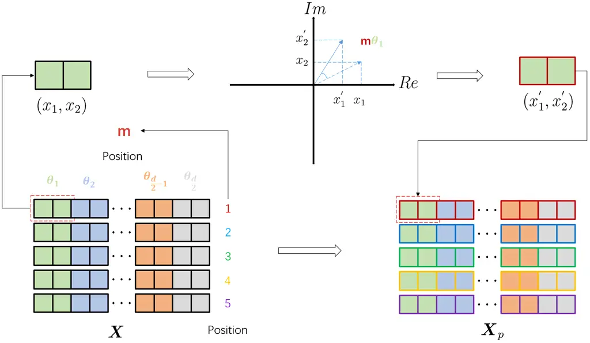
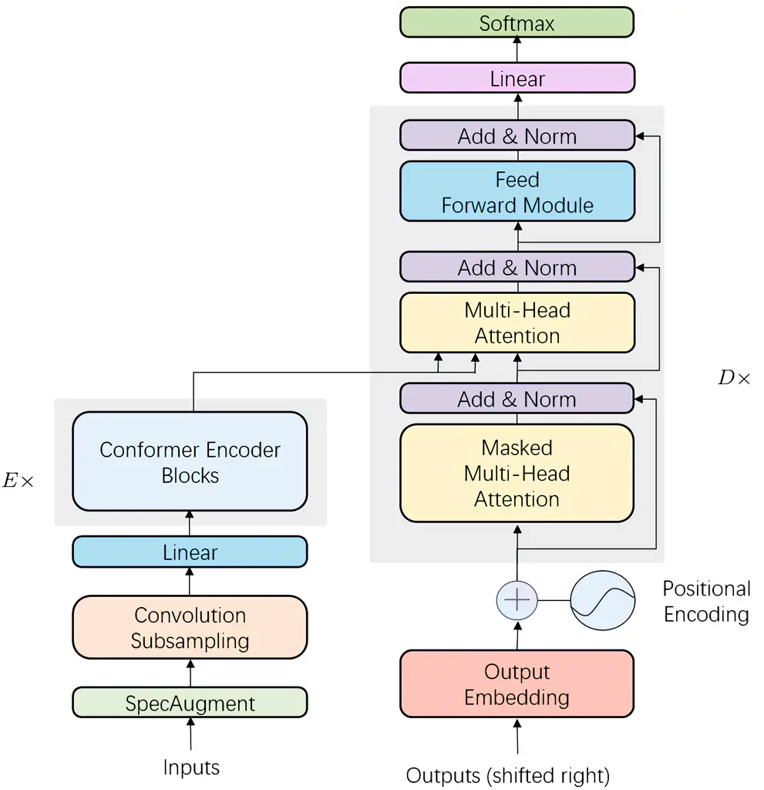
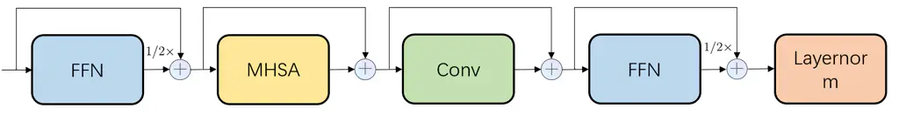

# Conformer-based End-to-end Speech Recognition With Rotary Position Embedding

\authorblockNShengqiang Li, Menglong Xu, Xiao-Lei Zhang
\authorblockACIAIC, School of Marine Science and Technology,
Northwestern Polytechnical University, China  
E-mail: {shengqiangli,mlxu}@mail.nwpu.edu.cn, xiaolei.zhang@nwpu.edu.cn

###### Abstract

Transformer-based end-to-end speech recognition models have received
considerable attention in recent years due to their high training speed
and ability to model a long-range global context. Position embedding in
the transformer architecture is indispensable because it provides
supervision for dependency modeling between elements at different
positions in the input sequence. To make use of the time order of the
input sequence, many works inject some information about the relative or
absolute position of the element into the input sequence. In this work,
we investigate various position embedding methods in the
convolution-augmented transformer (conformer) and adopt a novel
implementation named rotary position embedding (RoPE). RoPE encodes
absolute positional information into the input sequence by a rotation
matrix, and then naturally incorporates explicit relative position
information into a self-attention module. To evaluate the effectiveness
of the RoPE method, we conducted experiments on AISHELL-1 and
LibriSpeech corpora. Results show that the conformer enhanced with RoPE
achieves superior performance in the speech recognition task.
Specifically, our model achieves a relative word error rate reduction of
$`8.70\%`$ and $`7.27\%`$ over the conformer on ‘test-clean’ and
‘test-other’ sets of the LibriSpeech corpus respectively.

## 1 Introduction

The sequential order of an input sequence plays a vital role in many
sequence learning tasks, particularly in speech recognition. Recurrent
neural networks (RNNs) based models can learn the sequential order by
recursively computing their hidden states along the time dimension.
Convolutional neural networks (CNNs) based models can implicitly learn
the position information of an input sequence by a padding operator
\[1\]. In recent years, transformer-based models have shown great
superiority in various sequence learning tasks, such as machine
translation \[2\], language modeling \[3\] and speech recognition \[4\].
The transformer-based models utilize a self-attention mechanism to model
the dependency among different elements in the input sequence, which
provides more efficient parallel computing than RNNs and can model
longer context-dependency among elements than CNNs.

The transformer-based models dispense with recurrence, and instead rely
solely on a self-attention mechanism to draw global dependencies among
elements in the input sequence. However, the self-attention mechanism
cannot model the sequential order inherently \[5\]. There are various
works injecting some information about the relative or absolute position
of the elements of the input sequence into the transformer-based models.

One line of works focuses on absolute position embedding methods. The
position embedding is added to the input embeddings usually. The
original work \[2\] injected absolute position information to the input
embeddings via a trigonometric position embedding. Specifically, the
absolute position of each element in the input sequence is encoded into
a vector, whose dimension is equal to the dimension of the input
embeddings. Another work \[6\] added absolute position information via
the learned positional embedding instead of the pre-defined function,
the learned position embedding can achieve competitive performance with
the trigonometric position embedding. However, it cannot be extrapolated
to a sequence length longer than the maximum sequence length of training
utterances.

The other line of works focuses on relative position embedding, which
typically inject relative position information into the attention
calculation. Originally proposed by \[7\], the relative position
embedding method replaced absolute positions by taking into account the
distance between sequence elements. It demonstrates significant
improvement in two machine translation tasks. The method has also been
generalized to language modeling \[8\], which helps the language model
capture very long dependency between paragraphs. Some works also
utilized relative position embedding to acoustic modeling in the speech
recognition task \[9, 10\], which help the self-attention module deals
with different input lengths better than the absolute position embedding
methods.

In addition to these approaches, \[11\] proposed to model the position
information in a complex space. \[12\] proposed to model the dependency
of position embedding from the perspective of Neural ordinary
differential equations \[13\]. \[14\] proposed to encode relative
position by multiplying the context representations with a rotation
matrix.

In this paper, we investigated various position embedding methods in the
convolution-augmented transformer (conformer) for speech recognition.
Motivated by \[14\], we adopt a novel implementation named rotary
position embedding (RoPE). RoPE formulates the relative position
naturally by an inner product of the input vectors of the self-attention
module in the conformer, right after the absolution position information
being encoded through the rotation matrix. Experiments were conducted on
AISHELL-1 and LibriSpeech corpora. Results show that the conformer
enhanced with the RoPE performs superior over the original conformer. It
achieves a character error rate of $`4.69\%`$ on the test set of
AISHELL-1 dataset, and a word error rate of of $`2.1\%`$ and $`5.1\%`$
on the ‘test-clean’ and ‘test-other’ sets of LibriSpeech dataset
respectively.

The remainder of this paper is organized as follows. Section 3 describes
the RoPE method and the architecture of our model. Section 4 presents
experiments. Conclusion is given in Section 5.

## 2 Related Work

The core module of transformer-based models is the self-attention
module, assuming that $`\boldsymbol{X}\in\mathbb{R}^{T\times d}`$
denotes the input sequence, where $`T`$ is the sequence length, $`d`$ is
the dimension, the self-attention module first incorporates the position
information to the input sequence and transforms them into queries,
keys, values vectors respectively:

```math
\displaystyle\boldsymbol{q}_{m} \displaystyle=\operatorname{f}_{q}\left(\boldsymbol{x}_{m},m\right) \tag{1}
```

```math
\displaystyle\boldsymbol{k}_{n} \displaystyle=\operatorname{f}_{k}\left(\boldsymbol{x}_{n},n\right)
```

```math
\displaystyle\boldsymbol{v}_{n} \displaystyle=\operatorname{f}_{v}\left(\boldsymbol{x}_{n},n\right)
```

where $`\boldsymbol{q}_{m},\boldsymbol{k}_{n},\boldsymbol{v}_{n}`$
incorporate $`m`$-th and $`n`$-th position information via the function
$`\operatorname{f}_{q}(\cdot),\operatorname{f}_{k}(\cdot),\operatorname{f}_{v}(\cdot)`$
respectively. The attention weights calculated using the query and key
vectors, and the output is the weighted sum of the value vector:

```math
\displaystyle a_{m,n} \displaystyle=\operatorname{softmax}\left(\frac{\boldsymbol{q}_{m}\boldsymbol{k}_{n}^{\top}}{\sqrt{d}}\right) \tag{2}
```

```math
\displaystyle\mathbf{o}_{m} \displaystyle=\sum_{n=1}^{T}a_{m,n}\boldsymbol{v}_{n}
```

### 2.1 Absolute position embedding

Assuming that $`\boldsymbol{x}_{m}\in\mathbb{R}^{d}`$ is the $`m`$-th
element in the input sequence. The implementation of absolute position
embedding can be formulated as:

```math
\displaystyle\operatorname{f}_{q}\left(\boldsymbol{x}_{m},m\right) \displaystyle=\left(\boldsymbol{x}_{m}+\boldsymbol{p}_{m}\right)\boldsymbol{W}_{q} \tag{3}
```

```math
\displaystyle\operatorname{f}_{k}\left(\boldsymbol{x}_{m},n\right) \displaystyle=\left(\boldsymbol{x}_{m}+\boldsymbol{p}_{m}\right)\boldsymbol{W}_{k}
```

```math
\displaystyle\operatorname{f}_{v}\left(\boldsymbol{x}_{m},n\right) \displaystyle=\left(\boldsymbol{x}_{m}+\boldsymbol{p}_{m}\right)\boldsymbol{W}_{v}
```

where
$`\boldsymbol{W}_{q},\boldsymbol{W}_{k},\boldsymbol{W}_{v}\in\mathbb{R}^{d\times d_{m}}`$
is the weight matrix of the linear projection layer of query, key and
value vectors respectively, $`d_{m}`$ is the hidden size of the
attention module, $`\boldsymbol{p}_{m}\in\mathbb{R}^{d}`$ is a vector
depending of the position information of $`\boldsymbol{x}_{m}`$. In
\[15, 16\],
$`\boldsymbol{p}_{m}\in\left\{\boldsymbol{p}_{j}\right\}_{j=1}^{T}`$ is
a set of trainable vectors. Ref. \[2\] has proposed to generate
$`\boldsymbol{p}_{m}`$ using the sinusoidal function:

```math
\begin{array}[]{ll}p_{m,2j}&=\sin\left(m/10000^{2j/d}\right)\\
p_{m,2j+1}&=\cos\left(m/10000^{2j/d}\right)\end{array} \tag{4}
```

where $`m`$ is the position and $`j`$ is the dimension.

### 2.2 Relative position embedding

In \[8\], the relative distance between elements in the input sequence
was taken into account. Specifically, keeping the form of (3), the term
$`\boldsymbol{q}_{m}\boldsymbol{k}_{n}^{\top}`$ can be decomposed to:

```math
\displaystyle\boldsymbol{q}_{m}\boldsymbol{k}_{n}^{\top} \displaystyle=\operatorname{f}_{q}(\boldsymbol{x}_{m},m)\operatorname{f}_{k}^{\top}(\boldsymbol{x}_{n},n) \tag{5}
```

```math
\displaystyle=\boldsymbol{x}_{m}\boldsymbol{W}_{q}\boldsymbol{W}_{k}^{\top}\boldsymbol{x}_{n}^{\top}+\boldsymbol{x}_{m}\boldsymbol{W}_{q}\boldsymbol{W}_{k}^{\top}\boldsymbol{p}_{n}^{\top}
```

```math
\displaystyle+\boldsymbol{p}_{m}\boldsymbol{W}_{q}\boldsymbol{W}_{k}^{\top}\boldsymbol{x}_{n}^{\top}+\boldsymbol{p}_{m}\boldsymbol{W}_{q}\boldsymbol{W}_{k}^{\top}\boldsymbol{p}_{n}^{\top}
```

In \[8\], (5) was modified to:

```math
\displaystyle\boldsymbol{q}_{m}\boldsymbol{k}_{n}^{\top} \displaystyle=\boldsymbol{x}_{m}\boldsymbol{W}_{q}\boldsymbol{W}_{k,E}^{\top}\boldsymbol{x}_{n}^{\top}+\boldsymbol{x}_{m}\boldsymbol{W}_{q}\boldsymbol{W}_{k,R}^{\top}\boldsymbol{R}_{m-n}^{\top} \tag{6}
```

```math
\displaystyle+\boldsymbol{u}\boldsymbol{W}_{k}^{\top}\boldsymbol{x}_{n}^{\top}+\boldsymbol{v}\boldsymbol{W}_{k}^{\top}\boldsymbol{R}_{m-n}^{\top}
```

where $`\boldsymbol{u},\boldsymbol{v}`$ are trainable parameters, and
$`\boldsymbol{R}_{m-n}`$ is the relative position embedding. Comparing
the (6) and (5), we can see that there are three main changes:

- •
  Firstly, the absolute position embedding $`\boldsymbol{p}_{m}`$ for
  computing key representation is replaced with relative counterpart
  $`\boldsymbol{R}_{m-n}`$.
- •
  Secondly, the query $`\boldsymbol{p}_{m}\boldsymbol{W}_{q}`$ is
  replaced by two trainable parameters
  $`\boldsymbol{u},\boldsymbol{v}`$.
- •
  Finally, the weight matrix of the linear projection layer of key
  vector is separated to two matrices
  $`\boldsymbol{W}_{k,E},\boldsymbol{W}_{k,R}`$ for producing the
  content-based key vector and location-based key vector respectively.

## 3 Method

In this section, we describe the rotary position embedding (RoPE) and
illustrate how we apply it to the self-attention module in
transformer-based models.

### 3.1 Formulation

Considering the dot-product attention does not preserve absolute
positional information, so that if we encode the position information
via absolute position embeddings, we will lose a significant amount of
information. On the other hand, the dot-product attention does preserve
relative position, so if we can encode the positional information into
the input sequence in a way that only leverages relative positional
information, that will be preserved by the attention function.

To incorporate relative position information, we hope the inner product
encodes position information in the relative form only:

```math
\left\langle\operatorname{f}_{q}\left(\boldsymbol{x}_{m},m\right),\operatorname{f}_{k}\left(\boldsymbol{x}_{n},n\right)\right\rangle=\operatorname{g}\left(\boldsymbol{x}_{m},\boldsymbol{x}_{n},m-n\right) \tag{7}
```

where the inner product of $`\boldsymbol{q}_{m}`$ and
$`\boldsymbol{k}_{n}`$ is formulated by a function
$`\operatorname{g}(\cdot)`$, which takes only $`\boldsymbol{x}_{m}`$,
$`\boldsymbol{x}_{n}`$ and their relative position $`m-n`$ as input
variables. Actually, finding such an encoding mechanism is equivalent to
solving the function $`\operatorname{f}_{q}(\cdot)`$ and
$`\operatorname{f}_{k}(\cdot)`$ that conform (7).

### 3.2 Rotary position embedding

We start with a simple case with dimension $`d=2`$, the RoPE provides a
solution to (7):

```math
\displaystyle\operatorname{f}_{q}\left(\boldsymbol{x}_{m},m\right) \displaystyle=\left(\boldsymbol{x}_{m}\boldsymbol{W}_{q}\right)e^{im\theta} \tag{8}
```

```math
\displaystyle\operatorname{f}_{k}\left(\boldsymbol{x}_{n},n\right) \displaystyle=\left(\boldsymbol{x}_{n}\boldsymbol{W}_{k}\right)e^{in\theta}
```

```math
\displaystyle\operatorname{g}\left(\boldsymbol{x}_{m},\boldsymbol{x}_{n},m-n\right) \displaystyle=\operatorname{Re}\left[\left(\boldsymbol{x}_{m}\boldsymbol{W}_{q}\right)\left(\boldsymbol{x}_{n}\boldsymbol{W}_{k}\right)^{*}e^{i(m-n)\theta}\right]
```

where $`\operatorname{Re}[\cdot]`$ denotes the real part of a complex
number and $`\left(\boldsymbol{x}_{n}\boldsymbol{W}_{k}\right)^{*}`$
represents the conjugate complex number of
$`\left(\boldsymbol{x}_{n}\boldsymbol{W}_{k}\right)`$,
$`\theta\in\mathbb{R}`$ is a non-zero constant.

Considering the merit of the linearity of the inner product, we can
generalize the solution to any dimension when $`d`$ is even, we divide
the $`d`$-dimension space to $`d/2`$ sub-spaces and combine them:

```math
\displaystyle\operatorname{f}_{q}(\boldsymbol{x}_{m},m) \displaystyle=\boldsymbol{R}_{\Theta,m}^{d}\boldsymbol{x}_{m}\boldsymbol{W}_{q} \tag{9}
```

```math
\displaystyle\operatorname{f}_{k}(\boldsymbol{x}_{n},n) \displaystyle=\boldsymbol{R}_{\Theta,n}^{d}\boldsymbol{x}_{n}\boldsymbol{W}_{k}
```

where

```math
\boldsymbol{R}_{\Theta,m}^{d}=\left(\begin{array}[]{cccc}\boldsymbol{M}_{1}&&&\\
&\boldsymbol{M}_{2}&&\\
&&\ddots&\\
&&&\boldsymbol{M}_{d/2}\end{array}\right) \tag{10}
```

```math
\Theta=\left\{\theta_{i}=10000^{-2(i-1)/d},i\in[1,2,\ldots,d/2]\right\} \tag{11}
```

```math
\boldsymbol{M}_{i}=\left(\begin{array}[]{cc}\cos m\theta_{i}&-\sin m\theta_{i}\\
\sin m\theta_{i}&\cos m\theta_{i}\end{array}\right) \tag{12}
```

The illustration of rotary position embedding is shown in Figure 1.



Figure 1: Illustration of rotary position embedding (RoPE).
$`\boldsymbol{X}`$ is the input sequence without position embedding and
$`\boldsymbol{X}_{p}`$ is the sequence encoded with position
information.

### 3.3 Enhanced conformer with RoPE

In this work, we adopt conformer \[9\] as the speech recognition model,
which is a state-of-the-art transformer-based model. The architecture of
the conformer is given in Figure 2. The audio encoder of conformer first
processed the input with a convolution subsampling module and then with
$`E`$ conformer encoder blocks. Each conformer encoder block contains
two feed-forward (FFN) modules sandwiching the multi-head self-attention
(MHSA) module and the convolution (Conv) module, as shown in Figure 3.
Because the decoder of conformer is identical with transformer \[2\], we
will not describe the decoder anymore.



Figure 2: The architecture of conformer.



Figure 3: The architecture of conformer encoder blocks.

In contrast to the additive position embedding method used by other
works \[2\], we adopt the multiplicative position embedding method in
the encoder. Moreover, we do not add the position embedding at the
beginning of the encoder, but rather, we add the position embedding to
the query and key vectors at each self-attention layer. The position
embedding in the decoder is absolute position embedding, which is
identical with the one in transformer \[2\].

## 4 Experiments

### 4.1 Datasets

Our experiments were conducted on a Mandarin speech corpus AISHELL-1
\[17\] and an English speech corpus LibriSpeech \[18\]. The former has
170 hours labeled speech, while the latter consists of 970 hours labeled
speech and an additional 800M word token text-only corpus for building
language model.

### 4.2 Setup

We used 80-channel log-mel filterbank coefficients (Fbank) features
computed on a 25ms window with a 10ms shift. The features for each
speaker were rescaled to have zero mean and unit variance. The token
vocabulary of AISHELL-1 contains 4231 characters. We used a 5000 token
vocabulary based on the byte pair encoding algorithm \[19\] for
LibriSpeech. Moreover, the vocabularies of AISHELL-1 and LibriSpeech
have a padding symbol ’$`\langle PAD\rangle`$’ , an unknown symbol
’$`\langle UNK\rangle`$’, and an end-of-sentence symbol
’$`\langle EOS\rangle`$’.

Our model contains 12 encoder blocks and 6 decoder blocks. There are 4
heads in both the self-attention and the encoder-decoder attention. The
2D-CNN frontend utilizes two $`3\times 3`$ convolution layers with 256
channels. The rectified linear units were used as the activation. The
stride was set to 2. The hidden dimension of the attention layer is 256.
The hidden dimension and output dimension of the feed-forward layer are
256 and 2048 respectively. We used the Adam optimizer and a transformer
learning rate schedule \[2\] with 30000 warm-up steps and a peak
learning rate of 0.0005. We used SpecAugment \[20\] for data
augmentation. We set the CTC weight to 0.3 for the joint training with
the attention model. In the test stage, we set CTC weight to 0.6 for the
joint decoding. We used a transformer-based language model to refine the
results.

To evaluate the effectiveness of our model, we compare our model with 9
representative speech recognition models, which are TDNN-Chain (kaldi)
\[21\], LAS \[20\], SA-Transducer \[22\], Speech-Transformer \[23\],
LDSA \[24\], GSA-Transformer \[25\], Conformer \[26\], Dynamic
convolution (DC) \[27\] and Self-attention dynamic convolution 2D
(SA-DC2D) \[27\]. There are 4 state-of-the-art transformer-based models
in the comparison methods. Speech-Transformer uses the transformer
architecture for both acoustic modeling and language modeling. LDSA uses
a local dense synthesizer attention module in the transformer encoder as
an alternative of the self-attention module. GSA-Transformer replaces
the self-attention module with a gaussion-based attention module.
Conformer combines the transformer architecture with a convolution
module.

### 4.3 Main results

Table 1 lists the comparison result on LibriSpeech dataset. From the
table, we can see that the proposed conformer enhanced with RoPE
achieves the best performance among these methods. Our model achieves a
WER of $`2.1\%`$ and $`5.1\%`$ on the on ‘test-clean’ and ‘test-other’
sets respectively, which gets a relative WER reduction of $`8.70\%`$ and
$`7.27\%`$ over the conformer.

Table 2 lists the comparison result on AISHELL-1 dataset. From the
table, we see that the proposed model achieves a CER of $`4.34\%`$ on
the development set and $`4.69\%`$ on the test set respectively, which
gets a relative CER reduction of $`4.00\%`$ and $`3.90\%`$ on the
development set and test set over the conformer. Moreover, the proposed
model significantly outperforms the other comparison methods.

| Model            | WER(%) |       |       |       |
| ---------------- | ------ | ----- | ----- | ----- |
|                  | Dev    |       | Test  |       |
|                  | Clean  | Other | Clean | Other |
| LAS \[20\]       | \-     | \-    | 2.5   | 5.8   |
| DC \[27\]        | 3.5    | 10.5  | 3.6   | 10.8  |
| SA-DC2D \[27\]   | 3.5    | 9.6   | 3.9   | 9.6   |
| Conformer \[26\] | 2.1    | 5.5   | 2.3   | 5.5   |
| Conformer (RoPE) | 1.9    | 5.0   | 2.1   | 5.1   |

Table 1: Comparison results on LibriSpeech.

| Model                     | CER(%)  |          |
| ------------------------- | ------- | -------- |
|                           | Dev set | Test set |
| TDNN-Chain (kaldi) \[21\] | \-      | 7.45     |
| SA-Transducer \[22\]      | 8.30    | 9.30     |
| Speech-Transformer \[23\] | 6.57    | 7.37     |
| LDSA \[24\]               | 5.79    | 6.49     |
| GSA-Transformer \[25\]    | 5.41    | 5.94     |
| Conformer \[26\]          | 4.52    | 4.88     |
| Conformer (RoPE)          | 4.34    | 4.69     |

Table 2: Comparison results on AISHELL-1.

### 4.4 Comparison of different position embedding methods

We also compare the rotary position embedding with other position
embedding in the conformer architecture, i.e. absolute position
embedding and relative position embedding. Table 3 lists the result on
LibriSpeech dataset and Table 4 lists the result on AISHELL-1. From
Table 3 and Table 4, we can see that the relative position embedding
performs better than the absolute position embedding, and the rotary
position embedding achieves the best performance among these position
embedding methods on both LibriSpeech and AISHELL-1 dataset.

| Model            | WER(%) |       |       |       |
| ---------------- | ------ | ----- | ----- | ----- |
|                  | Dev    |       | Test  |       |
|                  | Clean  | Other | Clean | Other |
| Conformer (APE)  | 2.1    | 5.5   | 2.3   | 5.5   |
| Conformer (RPE)  | 2.0    | 5.2   | 2.2   | 5.5   |
| Conformer (RoPE) | 1.9    | 5.0   | 2.1   | 5.1   |

Table 3: Comparison between position embedding methods on the
LibriSpeech dataset. APE denotes absolute position embedding, RPE
denotes relative position embedding respectively.

| Model            | CER(%)  |          |
| ---------------- | ------- | -------- |
|                  | Dev set | Test set |
| Conformer (APE)  | 4.52    | 4.88     |
| Conformer (RPE)  | 4.49    | 4.82     |
| Conformer (RoPE) | 4.34    | 4.69     |

Table 4: Comparison between position embedding methods on the AISHELL-1
dataset.

## 5 Conclusions

Transformer-based models have received great popularity in the speech
recognition task. Position embedding of the input sequence plays a
significant role in transformer-based models. In this paper, we propose
to apply the rotary position embedding into the conformer. The rotary
position embedding incorporates explicit relative position information
in the self-attention module to enhance the performance of the conformer
architecture. Our experimental results on the AISHELL-1 and LibriSpeech
corpora demonstrate that the enhanced conformer with rotary position
embedding performs superior over the vanilla conformer and several
representative models.

## References

- \[1\] M. A. Islam, S. Jia, and N. D. Bruce, “How much position
  information do convolutional neural networks encode?” _arXiv preprint
  arXiv:2001.08248_, 2020.
- \[2\] A. Vaswani, N. Shazeer, N. Parmar, J. Uszkoreit, L. Jones, A. N.
  Gomez, Ł. Kaiser, and I. Polosukhin, “Attention is all you need,” in
  _Advances in neural information processing systems_, 2017, pp.
  5998–6008.
- \[3\] A. Radford, J. Wu, R. Child, D. Luan, D. Amodei, and
  I. Sutskever, “Language models are unsupervised multitask learners,”
  _OpenAI blog_, vol. 1, no. 8, p. 9, 2019.
- \[4\] L. Dong, S. Xu, and B. Xu, “Speech-transformer: a no-recurrence
  sequence-to-sequence model for speech recognition,” in _2018 IEEE
  International Conference on Acoustics, Speech and Signal Processing
  (ICASSP)_. IEEE, 2018, pp. 5884–5888.
- \[5\] C. Yun, S. Bhojanapalli, A. S. Rawat, S. J. Reddi, and S. Kumar,
  “Are transformers universal approximators of sequence-to-sequence
  functions?” _arXiv preprint arXiv:1912.10077_, 2019.
- \[6\] J. Gehring, M. Auli, D. Grangier, D. Yarats, and Y. N. Dauphin,
  “Convolutional sequence to sequence learning,” in _International
  Conference on Machine Learning_. PMLR, 2017, pp. 1243–1252.
- \[7\] P. Shaw, J. Uszkoreit, and A. Vaswani, “Self-attention with
  relative position representations,” _arXiv preprint
  arXiv:1803.02155_, 2018.
- \[8\] Z. Dai, Z. Yang, Y. Yang, J. Carbonell, Q. V. Le, and
  R. Salakhutdinov, “Transformer-xl: Attentive language models beyond a
  fixed-length context,” _arXiv preprint arXiv:1901.02860_, 2019.
- \[9\] A. Gulati, J. Qin, C.-C. Chiu, N. Parmar, Y. Zhang, J. Yu,
  W. Han, S. Wang, Z. Zhang, Y. Wu _et al._, “Conformer:
  Convolution-augmented transformer for speech recognition,” _arXiv
  preprint arXiv:2005.08100_, 2020.
- \[10\] N.-Q. Pham, T.-L. Ha, T.-N. Nguyen, T.-S. Nguyen, E. Salesky,
  S. Stueker, J. Niehues, and A. Waibel, “Relative positional encoding
  for speech recognition and direct translation,” _arXiv preprint
  arXiv:2005.09940_, 2020.
- \[11\] B. Wang, D. Zhao, C. Lioma, Q. Li, P. Zhang, and J. G.
  Simonsen, “Encoding word order in complex embeddings,” _arXiv preprint
  arXiv:1912.12333_, 2019.
- \[12\] X. Liu, H.-F. Yu, I. Dhillon, and C.-J. Hsieh, “Learning to
  encode position for transformer with continuous dynamical model,” in
  _International Conference on Machine Learning_. PMLR, 2020, pp.
  6327–6335.
- \[13\] R. T. Chen, Y. Rubanova, J. Bettencourt, and D. Duvenaud,
  “Neural ordinary differential equations,” _arXiv preprint
  arXiv:1806.07366_, 2018.
- \[14\] J. Su, Y. Lu, S. Pan, B. Wen, and Y. Liu, “Roformer: Enhanced
  transformer with rotary position embedding,” _arXiv preprint
  arXiv:2104.09864_, 2021.
- \[15\] Z. Lan, M. Chen, S. Goodman, K. Gimpel, P. Sharma, and
  R. Soricut, “Albert: A lite bert for self-supervised learning of
  language representations,” _arXiv preprint arXiv:1909.11942_, 2019.
- \[16\] K. Clark, M.-T. Luong, Q. V. Le, and C. D. Manning, “Electra:
  Pre-training text encoders as discriminators rather than generators,”
  _arXiv preprint arXiv:2003.10555_, 2020.
- \[17\] H. Bu, J. Du, X. Na, B. Wu, and H. Zheng, “Aishell-1: An
  open-source mandarin speech corpus and a speech recognition baseline,”
  in _2017 20th Conference of the Oriental Chapter of the International
  Coordinating Committee on Speech Databases and Speech I/O Systems and
  Assessment (O-COCOSDA)_. IEEE, 2017, pp. 1–5.
- \[18\] V. Panayotov, G. Chen, D. Povey, and S. Khudanpur,
  “Librispeech: an asr corpus based on public domain audio books,” in
  _2015 IEEE international conference on acoustics, speech and signal
  processing (ICASSP)_. IEEE, 2015, pp. 5206–5210.
- \[19\] R. Sennrich, B. Haddow, and A. Birch, “Neural machine
  translation of rare words with subword units,” _arXiv preprint
  arXiv:1508.07909_, 2015.
- \[20\] D. S. Park, W. Chan, Y. Zhang, C.-C. Chiu, B. Zoph, E. D.
  Cubuk, and Q. V. Le, “Specaugment: A simple data augmentation method
  for automatic speech recognition,” _Proc. Interspeech 2019_, pp.
  2613–2617, 2019.
- \[21\] D. Povey, V. Peddinti, D. Galvez, P. Ghahremani, V. Manohar,
  X. Na, Y. Wang, and S. Khudanpur, “Purely sequence-trained neural
  networks for asr based on lattice-free mmi.” in _Interspeech_, 2016,
  pp. 2751–2755.
- \[22\] Z. Tian, J. Yi, J. Tao, Y. Bai, and Z. Wen, “Self-attention
  transducers for end-to-end speech recognition,” _arXiv preprint
  arXiv:1909.13037_, 2019.
- \[23\] Z. Tian, J. Yi, J. Tao, Y. Bai, S. Zhang, and Z. Wen,
  “Spike-triggered non-autoregressive transformer for end-to-end speech
  recognition,” _arXiv preprint arXiv:2005.07903_, 2020.
- \[24\] M. Xu, S. Li, and X.-L. Zhang, “Transformer-based end-to-end
  speech recognition with local dense synthesizer attention,” _arXiv
  preprint arXiv:2010.12155_, 2020.
- \[25\] C. Liang, M. Xu, and X.-L. Zhang, “Transformer-based end-to-end
  speech recognition with residual gaussian-based self-attention,”
  _arXiv preprint arXiv:2103.15722_, 2021.
- \[26\] P. Guo, F. Boyer, X. Chang, T. Hayashi, Y. Higuchi, H. Inaguma,
  N. Kamo, C. Li, D. Garcia-Romero, J. Shi _et al._, “Recent
  developments on espnet toolkit boosted by conformer,” _arXiv preprint
  arXiv:2010.13956_, 2020.
- \[27\] Y. Fujita, A. S. Subramanian, M. Omachi, and S. Watanabe,
  “Attention-based asr with lightweight and dynamic convolutions,” in
  _ICASSP 2020-2020 IEEE International Conference on Acoustics, Speech
  and Signal Processing (ICASSP)_. IEEE, 2020, pp. 7034–7038.
