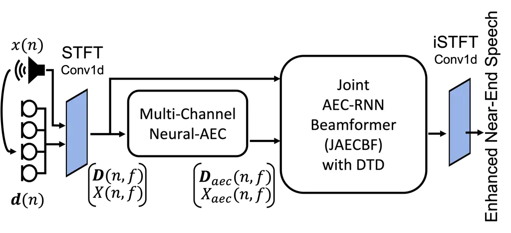
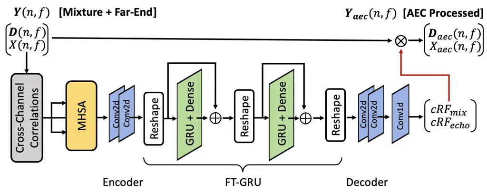
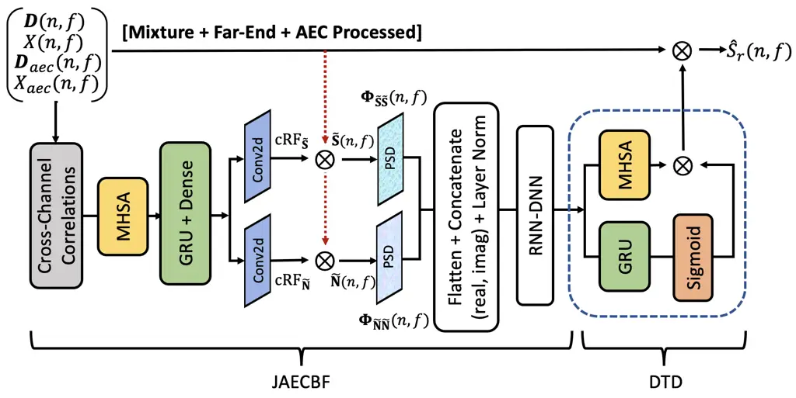
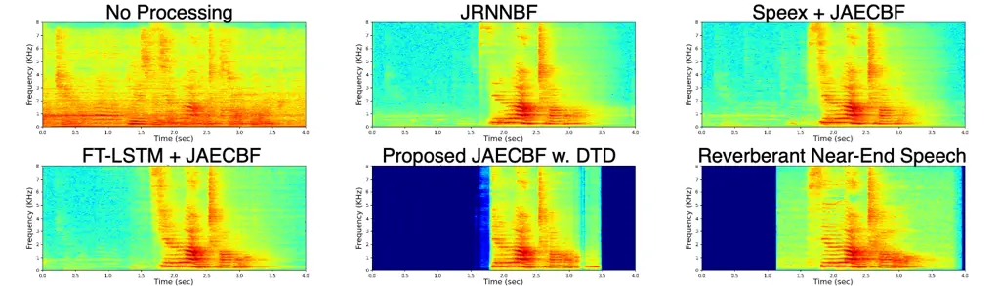

# Joint Neural AEC and Beamforming with Double-Talk Detection

Vinay Kothapally^(∗) ^(†)^(†)thanks: This work was done while V.
Kothapally was an intern at Tencent.    Yong Xu^(†)    Meng Yu^(†)   
Shi-Xiong Zhang^(†)    Dong Yu^(†)

###### Abstract

Acoustic echo cancellation (AEC) in full-duplex communication systems
eliminates acoustic feedback. However, nonlinear distortions induced by
audio devices, background noise, reverberation, and double-talk reduce
the efficiency of conventional AEC systems. Several hybrid AEC models
were proposed to address this, which use deep learning models to
suppress residual echo from standard adaptive filtering. This paper
proposes deep learning-based joint AEC and beamforming model (JAECBF)
building on our previous self-attentive recurrent neural network (RNN)
beamformer. The proposed network consists of two modules: (i)
multi-channel neural-AEC, and (ii) joint AEC-RNN beamformer with a
double-talk detection (DTD) that computes time-frequency (T-F)
beamforming weights. We train the proposed model in an end-to-end
approach to eliminate background noise and echoes from far-end audio
devices, which include nonlinear distortions. From experimental
evaluations, we find the proposed network outperforms other
multi-channel AEC and denoising systems in terms of speech recognition
rate and overall speech quality.

^(†)^(†)address: ^(∗)Center for Robust Speech Systems (CRSS), The
University of Texas at Dallas, TX, USA  
^(†)Tencent AI Lab, Bellevue, WA, USA^(†)^(†)email:
^(∗)vinay.kothapally@utdallas.edu, ^(†){lucayongxu, raymondmyu,
auszhang, dyu}@tencent.com

Index Terms: Neural AEC, Neural beamforming, Speech enhancement, Deep
neural networks

## 1 Introduction

With an increasing demand for hands-free communication between speakers
in two distant locations (far-end and near-end), effective communication
necessitates high-quality audio transmission \[1, 2\]. On the other
hand, far-end speakers receive modified versions of their speech as
feedback (far-end echo) due to acoustic coupling between the loudspeaker
and the microphone locations at the near-end speaker, resulting in
reduced speech intelligibility \[3, 4\]. To improve the overall
communication quality, an AEC system aims to remove far-end speech
captured by the microphone at the near-end while preserving speech from
the near-end speaker before transmission. Many AEC systems based on
digital signal processing (DSP) have used linear and nonlinear adaptive
filters to address this issue for more than two decades \[5, 6, 7, 8, 9,
10, 11, 12\]. Nonetheless, in practical scenarios involving nonlinear
distortions from loudspeakers, the presence of reverberation and
background noise at the near-end, and double-talk conditions, their
performance in suppressing only far-end speech was insufficient.

Recent advances in deep learning have shown the potential to improve the
performance of many speech processing systems. As a result, hybrid
systems combining traditional adaptive filters and DNNs \[13, 14, 15,
16, 17\] have been proposed to address nonlinear distortions from
loudspeakers by suppressing residual far-end speech from the adaptive
filter output. For example, Speex and WebRTC \[18, 19\] have been
combined with RNNs in \[20\]. Furthermore, multi-task networks were used
to design AEC systems with the secondary task of detecting double-talk
scenarios in order to avoid suppressing near-end speech in double-talk
scenarios \[21, 22, 23\]. Later, advanced networks such as
complex-valued DNNs \[24, 25, 26\], Long Short Term Memory networks
(LSTM), and multi-head self-attention \[21, 27\] were used to develop
AEC systems to also compensate for the time lag between far-end speech
and microphone captured signal alongside handling nonlinear distortions
and double-talk. Early attempts at AEC for multi-channel speech systems
included using single-channel AEC on individual microphones, followed by
traditional beamforming techniques \[28, 29\]. Later, end-to-end
DNN-based approaches were proposed for multi-microphone AEC systems
\[30, 31\].

This paper proposes a novel deep learning-based framework for joint AEC
and beamforming. Our main contributions towards the proposed model are
summarized as follows: (i) In contrast to DNN-based "black-box"
approaches, we include explicit modules for AEC and beamforming, (ii)
cross-channel correlation between the echo and multi-channel signals are
considered in our neural AEC and beamforming modules to find a better
solution for joint AEC and beamforming, (iii) we extend our recently
proposed generalized RNN beamformer (GRNNBF) to a spatio-temporal joint
AEC-RNN beamformer (JAECBF) capable of learning a better beamforming
solution using microphone array signals and processed signals from
multi-channel neural-AEC, and (iv) we propose a double-talk detection
(DTD) module based on the multi-head attention \[32\], to leverage DTD
predictions to suppress far-end residuals.

## 2 Problem Definition

We consider the problem of enhancing near-end speech captured by
$`M`$-microphones in presence of reverberation, far-end echoes from the
loudspeaker, and background noise. Let $`s(t)`$ and $`x(t)`$ represent
the clean speech from near-end and far-end speakers respectively. The
signals captured by an $`M`$-channel microphone array, $`\mathbf{d}(t)`$
(termed as “mixture") at time ‘$`t`$’ can be represented as,

```math
\displaystyle\mathbf{d}(t) \displaystyle=\mathbf{s}_{r}(t)+\mathbf{\tilde{x}}_{r}(t)+\mathbf{v}(t)\quad\in\mathbb{R}^{M\times 1} \tag{1}
```

where, $`\mathbf{s}_{r}(t)=\mathbf{h}_{s}(t)\ast s(t)`$ and
$`\mathbf{\tilde{x}}_{r}(t)=\mathbf{h}_{x}(t)\ast f_{\text{NL}}(x(t))`$
are the received reverberant copies of near-end and audio device emitted
nonlinearly distorted far-end speech components, $`f_{\text{NL}}`$ is a
function that mimics nonlinearities introduced by the audio device,
$`\mathbf{h}_{s}(t)`$ and $`\mathbf{h}_{x}(t)`$ are $`M`$-channel room
impulse responses (RIRs) from near-end speaker and the loudspeaker
locations to the microphone array, ‘$`\ast`$’ denotes the convolution,
and $`\mathbf{v}(t)`$ represents the background noise.

This study presents a deep learning-based joint AEC and beamforming
model $`({\boldsymbol{\Psi}})`$ as a supervised speech enhancement
system. The proposed model aims to suppress far-end echo with nonlinear
distortions and background noise while preserving near-end speech using
a mixture and clean far-end signals. As stated in Eq.(2), the proposed
network is limited to estimating reverberant near-end speech,
$`\hat{s}_{r}(t)`$ but not the anechoic near-end speech, $`\hat{s}(t)`$.

```math
\displaystyle\hat{s}_{r}(t)=\boldsymbol{\Psi}(\mathbf{y}(t))=\boldsymbol{\Psi}([\mathbf{d}(t),\;x(t)]^{T}) \tag{2}
```

## 3 Proposed Method

The overall architecture of the proposed network is depicted in Figure 1
which comprises of two modules: (i) a multi-channel neural-AEC (see
sec.3.1), and (ii) a spatio-temporal joint AEC-RNN beamformer with
double-talk detection (DTD) module trained using cross-correlations as
input features (see sec.3.2). We jointly train these modules in an
end-to-end approach. As stated in Eq.(2), the proposed model is provided
with stacked $`M`$-channel mixture and single-channel far-end signals
$`\mathbf{y}(t){\in}\mathbb{R}^{(M{+}1)\times T}`$, where ‘$`T`$’
represents the number of samples. The audio samples are first
transformed to frequency domain, $`\mathbf{Y}(n,f)`$ using
one-dimensional convolution layers that employ a short-time fourier
transform (STFT) operation. Here, ‘$`n`$’$`{\in}[0,N)`$, and
‘$`f`$’$`{\in}[0,F)`$ represents frame index and frequency bin. To this
end, we use $`\mathbf{Y}(n,f)`$ to compute TF-bin wise
cross-correlations between the mixture and far-end signals
‘$`\mathrm{R}_{\mathbf{Y}\mathbf{Y}}`$’, to server as input features to
our multi-channel neural-AEC. The frame-wise cross-correlations are
calculated as:

```math
\displaystyle\mathrm{R}_{\mathbf{Y}\mathbf{Y}}(n,f)=\big(\mathbf{Y}(n,f)\mathbf{Y}^{H}(n,f)\big) \tag{3}
```

These input features include phase delays between far-end signals and
mixture in addition to inter-microphone phase delays that are crucial
for engineering a robust multi-channel neural-AEC. To maximize the
learning potential, multi-head self-attention (MHSA) \[32\] over time is
employed on input features to dynamically emphasize on relevant
correlations.



Figure 1: Overview of the proposed joint AEC and beamformer.

### 3.1 Multi-channel Neural-AEC

We design our multi-channel neural-AEC module using a deep convolutional
recurrent neural network (DCRNN) \[33\] with two encoders, two decoders,
and a frequency-time gated recurrent units (FT-GRU) with residual
connections that estimates complex-valued ratio filters (cRF) \[34\] for
mixture and far-end signals, respectively. Figure 2, presents the
architectural details of the multi-channel neural-AEC module. The
encoders within the module extract spatial-temporal information
$`U_{\mathrm{enc}}`$ from the input features using two-dimensional
convolutional layers, which are subsequently fed to FT-GRU.



Figure 2: Network architecture of multi-channel neural-AEC.

Similar to \[35, 36\], we design a frequency-time recurrent network
(FT-GRU) by integrating two gated recurrent units (GRU), fully connected
(FC) networks, and residual connections. The first GRU network scans all
frequency bins to summarize spectral information from encoded features,
$`U_{\mathrm{enc}}`$. Later, we restructure the output layer’s
activations and input them into the second GRU network, which analyses
correlations over time to produce $`U_{\mathrm{out}}`$, see Eq.(4).

```math
\begin{split}\textrm{FT-GRU}\Bigg\{\end{split}\>\begin{split}&Z{=}\big(U_{in}{+}\mathrm{FC}\big(\mathrm{GRU}\big(U_{\mathrm{enc}}[:,f,n]\big)\big)\big)^{\mathrm{Tr}}\\
\vskip-20.00003pt&U_{\mathrm{out}}{=}\big(Z{+}\mathrm{FC}\big(\mathrm{GRU}\big(Z[:,n,f]\big)\big)\big)^{\mathrm{Tr}}\end{split} \tag{4}
```

Here $`(\cdot)^{\mathrm{Tr}}`$ represents transpose operation performed
on time and frequency dimensions, and ‘$`Z`$’ is the intermediate output
from the first GRU network. The decoders within the module estimate two
$`((2K{+}1){\times}(2L{+}1))`$-dimensional complex-valued ratio filters
($`\mathrm{cRF_{mix}},\mathrm{cRF_{echo}}`$) which are used to process
mixture and far-end signals, respectively. As demonstrated in Eq.(5), we
employ $`\mathrm{cRF_{mix}}`$ on multi-channel mixture signals
$`\mathbf{D}(n,f)`$ to produce far-end echo suppressed mixture signals,
$`\mathbf{D}_{\mathrm{aec}}(n,f)`$. Similar computations are carried on
single-channel far-end signal $`X(n,f)`$ using $`\mathrm{cRF_{echo}}`$
to produce $`X_{\mathrm{aec}}(n,f)`$ that is time-aligned with the
enhanced mixture signals.

```math
\begin{aligned} \mathbf{D}_{\mathrm{aec}}(n,f)=\sum_{\tau_{1}\in[-K,K],\tau_{2}\in[-L,L]}\mathrm{cRF_{mix}}(n,f,\tau_{1},\tau_{2})\ast\mathbf{D}(n{+}\tau_{1},f{+}\tau_{2})\end{aligned} \tag{5}
```

```math
\displaystyle\mathbf{\widetilde{Y}}(n,f)=[\mathbf{Y}(n,f),\>\mathbf{D}_{\mathrm{aec}}(n,f),\>X_{\mathrm{aec}}(n,f)]^{T} \tag{6}
```

Later, the processed mixture and far-end signals are stacked
channel-wise with the original signals (termed as “stacked inputs”),
$`\mathbf{\widetilde{Y}}(n,f)`$, and fed to our beamforming module.

### 3.2 Joint AEC-RNN Beamforer (JAECBF) with DTD

The proposed joint AEC-RNN beamformer with double-talk detection
(JAECBF) is an extension to our previous work generalized
spatio-temporal RNN beamformer (GRNNBF) \[37\]. Unlike conventional
AEC-beamforming strategies that perform spatial filtering on
AEC-processed signals, our JAECBF is designed to learn TF-bin wise
beamforming weights to optimally combine the mixture, far-end, and
AEC-processed signals to extract near-end speech signal. Figure 3,
presents the architectural overview of our proposed JAECBF with
double-talk-detection. Similar to our multi-channel neural-AEC module,
we compute frame-wise cross-channel correlations
‘$`\mathrm{R}_{\mathbf{\widetilde{Y}}\mathbf{\widetilde{Y}}}`$’ using
the stacked inputs $`\mathbf{\widetilde{Y}}(n,f)`$ to server as input
features to the beamforming module. Our beamformer module benefits from
the correlations of time-aligned far-end and echo-suppressed mixture
signals with the original mixture signals, in addition to the
inter-microphone correlations. We use multi-head self-attention (MHSA)
over time on cross-channel correlations features to dynamically
emphasize on relevant correlations.



Figure 3: Network architecture of the proposed Joint AEC-RNN Beamformer
(JAECBF) with DTD.

These dynamic features from the stacked inputs are then passed through
to series of GRU, fully-connected, and one-dimensional convolution
layers to estimate two $`((2K{+}1){\times}(2L{+}1))`$-dimensional
complex ratio filters
($`\mathrm{cRF_{\mathbf{\widetilde{S}}}},\mathrm{cRF_{\mathbf{\widetilde{N}}}}`$)
which are used to compute multi-channel target speech and noise signals.
As demonstrated in Eq.(7), we employ
$`\mathrm{cRF_{\mathbf{\widetilde{S}}}}`$ on stacked input signals
$`\mathbf{\widetilde{Y}}(n,f)`$ to produce multi-channel target speech
signal, $`\mathbf{\widetilde{S}}(n,f)`$. Similar computations are
carried on stacked input signals using
$`\mathrm{cRF_{\mathbf{\widetilde{N}}}}`$ to produce multi-channel noise
signals, $`\mathbf{\widetilde{N}}(n,f)`$. Next, we compute frame-wise
speech covariance matrix
$`\mathbf{\Phi_{\widetilde{S}\widetilde{S}}}(n,f)`$ from multi-channel
speech signals. Similar computations are carried out to compute noise
covariance matrix $`\mathbf{\Phi_{\widetilde{N}\widetilde{N}}}(n,f)`$.
Similar to our prior work \[37\], we use layer normalization with
learnable affine transforms to replace the the conventional mask
normalization, see Eq.(8).

```math
\displaystyle\mathbf{\widetilde{S}}(n,f)=\sum_{\tau_{1}\in[-K,K],\tau_{2}\in[-L,L]}\mathrm{cRF}_{\mathbf{\widetilde{S}}}(n,f,\tau_{1},\tau_{2})\>\ast\>\mathbf{\widetilde{Y}}(n{+}\tau_{1},f{+}\tau_{2}) \tag{7}
```

```math
\displaystyle\mathbf{\Phi_{\widetilde{S}\widetilde{S}}}(n,f)=\mathrm{LayerNorm}\big(\mathbf{\widetilde{S}}(n,f)\mathbf{\widetilde{S}}(n,f)^{H}\big) \tag{8}
```

The real and imaginary parts of frame-wise speech and noise covariance
matrices. Since $`\mathbf{\widetilde{Y}}`$ includes the echo reference
and the multi-channel signals,
$`\mathbf{\Phi_{\widetilde{S}\widetilde{S}}}`$ and
$`\mathbf{\Phi_{\widetilde{N}\widetilde{N}}}`$ jointly models the
cross-correlation among the echo and the multi-channel signals which are
concatenated and fed to a unified RNN-DNN
($`\scalebox{1.2}{$\mathcal{F}$}_{\textrm{RD}}`$) to predict beamforming
weights for stacked inputs.

```math
\begin{aligned} \mathrm{\textbf{W}}_{\mathrm{JAECBF}}(n,f)=\scalebox{1.2}{$\mathcal{F}$}_{\textrm{RD}}\big(\big[\mathbf{\Phi_{\widetilde{S}\widetilde{S}}}(0{:}n,f),\mathbf{\Phi_{\widetilde{N}\widetilde{N}}}(0{:}n,f)\big]\big)\end{aligned} \tag{9}
```

We further adapt JAECBF for AEC applications by adding a double talk
detection (DTD) module. The DTD module uses multi-head self attention
(MHSA) to compute the global temporal correlations within the TF-bin
wise beamforming weights. In addition, it employs a GRU network coupled
with sigmoid activation ($`\sigma`$) which predicts double-talk
scenarios. These probabilities are used to scale the JAECBF-estimated
beamforming weights accordingly to suppress far-end echoes and
coexisting background noise in near-end inactive speech frames.

```math
\displaystyle\mathrm{\textbf{W}}_{\mathrm{JAECBF{-}DTD}}=\sigma(\textrm{GRU}(w))\cdot\textrm{MHSA}(w,w,w) \tag{10}
```

where $`w`$ represents the complex-valued beamforming weights
$`\mathrm{\textbf{W}}_{\mathrm{JAECBF}}(n,f)`$. We compute the enhanced
near-end speech $`\hat{S}_{r}(n,f)`$ using the proposed beamformer
weights, original mixture, far-end, and AEC processed signals.

```math
\displaystyle\hat{S}_{r}(n,f) \displaystyle=(\mathrm{\textbf{W}}_{\mathrm{JAECBF-DTD}}(n,f)\big)^{H}\mathbf{\widetilde{Y}}(n,f) \tag{11}
```

Finally, $`\hat{S}_{r}(n,f)`$ is transformed to time domain audio
samples, $`\hat{s}_{r}(t)`$ using one-dimensional convolution layers
that employ the inverse short-time fourier transform (iSTFT) operation.

## 4 Dataset and Experimental Setup

### 4.1 Dataset

We simulate multi-channel reverberant and noisy dataset using AISHELL-2
\[38\] and AEC-Challenge \[39\] corpus. We generate a total of 10k
multi-channel RIRs with random room characteristics using image-source
method. Each multi-channel RIR is a set consisting of RIRs from near-end
speaker, loud-speaker, and background noise locations to 8-channel
linear microphone array measuring 26 cm in length. The reverberation
time (RT₆₀) ranges between \[0,0.6s\] across room configurations. We
randomly select RIRs to simulate multi-channel AEC dataset. We use clean
and nonlinear distorted versions of far-end speech from AEC-Challenge
\[39\]. The nonlinear distortions include, but are not limited to: (i)
clipping the maximum amplitude, (ii) using a sigmoidal function \[40\],
and (iii) applying learned distortion functions. In addition, we include
diffused noise with SNRs ranging from \[0,40\] dB and signal to echo
ratio (SER) from \[-10,10\] dB. A total of 90K, 7.5K, and 2K utterances
are generated for the ‘Train’, ‘Dev’, and ‘Test’ datasets.

### 4.2 Experimental Setup

A 512-point STFT is employed with 32 ms Hann window and 16 ms step size
to extract complex spectra for mixture and far-end signals. All systems
in the study are trained on 4-second chunks with the Adam optimizer and
a batch size of 12 to maximize the time-domain scale-invariant
source-to-noise ratio (Si-SNR) \[41\] and minimize the frequency-domain
mean square error (MSE), both of which are equally weighted. Initial
learning rate is set to 1e-4 with a gradient norm clipped with max norm 10. All systems are designed to have $`\sim`$8.5M parameters and trained
over 30 epochs. The estimated cRFs size in the proposed systems is
empirically set to (3x1). In this study, we compare our proposed method
to four baseline systems which include: (i) SpeexDSP \[18\], a purely
signal processing-based AEC, (ii) FT-LSTM \[35\], an AEC adapted for
multi-channel, (iii) GRNNBF \[37\], a robust NN-based beamformer, (iv)
hybrid models that combine AEC with various beamformers. The readers can
find the script for our proposed method and samples of enhanced audio
files at
[https://vkothapally.github.io/JAECBF](https://vkothapally.github.io/JAECBF).

|                                                                      |                     |                     |                      |                    |                     |                       |
| -------------------------------------------------------------------- | ------------------- | ------------------- | -------------------- | ------------------ | ------------------- | --------------------- |
| Systems/Metrics                                                      | PESQ ($`\uparrow`$) | STOI ($`\uparrow`$) | SISNR ($`\uparrow`$) | SDR ($`\uparrow`$) | ERLE ($`\uparrow`$) | WER% ($`\downarrow`$) |
| Reverberant clean reference                                          | 4.500               | 1.000               | $`\infty`$           | $`\infty`$         | $`\infty`$          | 2.190                 |
| Mixture (No Processing)                                              | 1.708               | 0.593               | -4.275               | -3.806             | 0.00                | 77.120                |
| SpeexDSP \[18\]                                                      | 1.935               | 0.637               | -1.519               | -0.590             | 3.652               | 44.994                |
| FT-LSTM \[35\]                                                       | 2.997               | 0.839               | 10.535               | 11.568             | 33.055              | 15.859                |
| GRNNBF \[37\]                                                        | 2.765               | 0.798               | 9.530                | 10.589             | 34.940              | 23.805                |
| JRNNBF (GRNNBF w. Far-End)                                           | 2.872               | 0.822               | 10.268               | 11.233             | 34.395              | 17.393                |
| SpeexDSP + JAECBF (SP + DL)                                          | 2.811               | 0.810               | 7.212                | 10.849             | 34.100              | 20.465                |
| FT-LSTM + MVDR (DL + SP)                                             | 2.853               | 0.826               | 7.688                | 9.791              | 34.869              | 13.525                |
| FT-LSTM + JAECBF (DL + DL)                                           | 3.046               | 0.847               | 11.081               | 11.999             | 37.420              | 14.028                |
| Proposed JAECBF w. DTD                                               | 3.117               | 0.858               | 11.280               | 12.178             | 36.620              | 11.392                |
| ^(∗)SP: Signal Processing algorithm      ^(∗)DL: Deep Learning model |                     |                     |                      |                    |                     |                       |

Table 1: Experimental results for different joint AEC and spatial
filtering networks across objective evaluation metrics.



Figure 4: Overview of the proposed joint AEC and beamformer trained
using time-domain Si-SNR and frequency domain L2-losses.

## 5 Results and Discussions

We compare the performance of proposed system to other systems using
perceptual quality metrics such as PESQ and STOI, as well as objective
metrics such as Si-SNR, signal-to-distortion ratio (SDR), and echo
return loss enhancement (ERLE) on the ‘Test’ set in Table.1.
Furthermore, a general-purpose mandarin speech recognition Tencent API
\[42\] is used to test the ASR performance by computing word error rate
(WER).

\[“GRNNBF vs. JRNNBF”\]: GRNNBF learns beamforming weights from mixture
and far-end signals to perform spatial filtering using only mixture
signals. JRNNBF is an adaptation of GRNNBF, which learns beamforming
weights for mixture and far-end signals. As a result, we see that the
proposed JRNNBF improves the performance of GRNNBF. For example, an
average PESQ of 2.76 vs. 2.87; WER: 23.80 vs. 17.93. Likewise, we also
see 3%, 8%, and 6% relative improvements in STOI, Si-SNR, and SDR
respectively. These finding suggest that by estimating beamformer
weights for far-end signals in addition to mixture, the network learns a
better beamforming solution. As a result, we propose JAECBF, which
extends JRNNBF to perform spatial filtering using mixture, far-end, and
multi-channel AEC processed signals.

\[“Hyrbid vs. NN-based” Joint AEC beamformer\]: To address joint AEC and
beamforming, we design different combinations of signal processing and
deep learning approaches for AEC and beamforming. First, we build the
following two hybrid systems: (i) signal processing (SP)-based SpeexDSP
\[18\] with our proposed JAECBF, and (ii) deep learning (DL)-based
FL-LSTM with SP-based minimum variance distortionless response (MVDR)
\[43\]. We compare the performance of these hybrid systems with a
NN-based system constructed using FT-LSTM in conjunction with our
JAECBF.

From Table-1, we observe that though SpeexDSP has a marginal impact on
general speech quality but has a significant effect on the performance
of speech recognition systems, i.e., an average PESQ improvement of 1.70
to 1.93 and a corresponding WER improvement of 77.12 to 44.99.
Nonetheless, the hybrid system outperforms SpeexDSP in terms of
performance. The performance benefits were not significantly greater
than those obtained with our proposed JAECBF beamformer. We hypothesize
that the linear adaptive filters in SpeexDSP do not converge because of
substantial non-linear distortions in training samples. This increases
the range of uncertainty in nonlinear distortions, subsequently lowering
the learning ability of JAECBF. The performance degradation can also be
observed in Figure 4. Likewise, while multi-channel adapted FT-LSTM
performs well on its own, it does not perform well when combined with
traditional MVDR on speech quality metrics. A probable reason for this
is that traditional MVDR prioritizes a distortionless response over
suppression to preserve the near-end speech. This can be observed from
the improvements achieved in WER: 13.25 vs 20.46 and SiSNR:7.68 vs 10.53
over the hybrid system. However, the adapted FT-LSTM when combined with
our proposed JAECBF outperforms both hybrid models. For example, an
average PESQ of 3.05 vs. {2.81,2.85}; SiSNR: 11.08 vs. {7.21,7.68} and
ERLE: 37.42 vs {34.1,34.87} over hybrid models with the exception on WER
which is still in a comparable range. The findings suggest that our
proposed JAECBF optimizes well with NN-based AEC systems by including
AEC processed signals within alongside mixture and far-end signals.

\[“Proposed JAECBF w. DTD vs FT-LSTM + JAECBF”\]: Our proposed joint AEC
and beamforming system differs from the “FT-LSTM + JAECBF” in the
following ways: (i) we replace conventional LPS and IPD input features
with cross-channel correlations from Eq.(3), (ii) we use proposed DTD
module to scale the estimated beamformer weights to further suppress the
far-end echo and background noise in near-end inactive speech regions
via double-talk predictions. The proposed system achieves better
performance than “FT-LSTM + JAECBF” in terms of quality and speech
recognition i.e., PESQ: 3.12 vs 3.04, WER: 11.39 vs 14.03. Likewise, we
see {1.7,1.4}% relative improvements in SiSNR and SNR respectively.
Figure 4 also shows that the proposed system can enhance the spectrogram
with less residual echo compared to other systems. Although“FT-LSTM +
JAECBF" achieves a bit higher ERLE than the proposed, 37.42 vs 36.62, we
can conclude that the major contribution to this improvement comes from
our proposed JAECBF when compared to "FT-LSTM", 37.42 vs 33.05.

## 6 Conclusion

To conclude, we present an all-deep learning strategy for joint AEC and
beamforming with the following major contributions. First, we propose
using cross-correlation coupled with multi-head self-attention to learn
significant features for AEC. Second, we propose JAECBF, an extension of
our previous work GRNNBF, which performs beamforming using mixture,
far-end, and AEC processed signals. Finally, we propose DTD module that
predicts double-talk using RNN and scales the beamforming weights to
compensate for double-talk scenarios. Among systems evaluated, the
proposed system achieves the highest objective scores and the lowest
WER. Although the proposed system performs well in terms of recognition
and echo suppression, we believe addressing dereverberation alongside
AEC and beamforming can further improve performance.

## References

- \[1\] Q. Wang and et al., “A frequency-domain nonlinear echo
  processing algorithm for high quality hands-free voice communication
  devices,” _Multimedia Tools and Applications_, vol. 80, no. 7, pp.
  10 777–10 796, 2021.
- \[2\] G. Enzner and et al., “Acoustic echo control,” in _Academic
  press library in signal processing_, 2014, vol. 4, pp. 807–877.
- \[3\] J. Benesty and et al., “Advances in network and acoustic echo
  cancellation,” 2001.
- \[4\] E. et al., _Acoustic echo and noise control: a practical
  approach_. John Wiley & Sons, 2005, vol. 40.
- \[5\] C. Paleologu and et al., “An overview on optimized nlms
  algorithms for acoustic echo cancellation,” _EURASIP Journal on
  Advances in Signal Processing_, vol. 2015, no. 1, pp. 1–19, 2015.
- \[6\] E. Ferrara, “Fast implementations of lms adaptive filters,”
  _IEEE Transactions on Acoustics, Speech, and Signal Processing_,
  vol. 28, no. 4, pp. 474–475, 1980.
- \[7\] Y. Park and et al., “Frequency domain acoustic echo suppression
  based on soft decision,” _IEEE Signal Processing Letters_, vol. 16,
  no. 1, pp. 53–56, 2008.
- \[8\] G. Clark and et al., “Block implementation of adaptive digital
  filters,” _IEEE Transactions on Circuits and Systems_, vol. 28, no. 6,
  pp. 584–592, 1981.
- \[9\] J. Soo and et al., “Multidelay block frequency domain adaptive
  filter,” _IEEE Transactions on Acoustics, Speech, and Signal
  Processing_, vol. 38, no. 2, pp. 373–376, 1990.
- \[10\] A. Schwarz and et al., “Spectral feature-based nonlinear
  residual echo suppression,” in _WASPAA_, 2013, pp. 1–4.
- \[11\] Z. Wang, Y. Na, Z. Liu, B. Tian, and Q. Fu, “Weighted recursive
  least square filter and neural network based residual echo suppression
  for the aec-challenge,” in _ICASSP 2021-2021 IEEE International
  Conference on Acoustics, Speech and Signal Processing (ICASSP)_. IEEE,
  2021, pp. 141–145.
- \[12\] S. Malik, J. Wung, J. Atkins, and D. Naik, “Double-talk robust
  multichannel acoustic echo cancellation using least-squares mimo
  adaptive filtering: Transversal, array, and lattice forms,” _IEEE
  Transactions on Signal Processing_, vol. 68, pp. 4887–4902, 2020.
- \[13\] J. M. Valin and et al., “Low-complexity, real-time joint neural
  echo control and speech enhancement based on percepnet,” in _ICASSP_,
  2021, pp. 7133–7137.
- \[14\] I. Amir and et al., “Nonlinear Acoustic Echo Cancellation with
  Deep Learning,” in _Interspeech_, 2021.
- \[15\] Z. Wang and et al., “Weighted recursive least square filter and
  neural network based residual echo suppression for the aec-challenge,”
  in _ICASSP_, 2021, pp. 141–145.
- \[16\] M. M. Halimeh, T. Haubner, A. Briegleb, A. Schmidt, and
  W. Kellermann, “Combining adaptive filtering and complex-valued deep
  postfiltering for acoustic echo cancellation,” in _ICASSP 2021 - 2021
  IEEE International Conference on Acoustics, Speech and Signal
  Processing (ICASSP)_, 2021, pp. 121–125.
- \[17\] T. Haubner, M. M. Halimeh, A. Brendel, and W. Kellermann, “A
  synergistic kalman-and deep postfiltering approach to acoustic echo
  cancellation,” in _2021 29th European Signal Processing Conference
  (EUSIPCO)_. IEEE, 2021, pp. 990–994.
- \[18\] J. Valin, “Speex: A free codec for free speech,” _ArXiv_, vol.
  abs/1602.08668, 2016.
- \[19\] P. Srivastava and et al., “Performance evaluation of speex
  audio codec for wireless communication networks,” in _International
  Conference on Wireless and Optical Communications Networks_, 2011, pp.
  1–5.
- \[20\] L. Ma and et al., “Acoustic echo cancellation by combining
  adaptive digital filter and recurrent neural network,” _arXiv preprint
  arXiv:2005.09237_, 2020.
- \[21\] ——, “Echofilter: End-to-end neural network for acoustic echo
  cancellation,” _arXiv preprint arXiv:2105.14666_, 2021.
- \[22\] X. Zhou and et al., “Residual acoustic echo suppression based
  on efficient multi-task convolutional neural network,” _arXiv preprint
  arXiv:2009.13931_, 2020.
- \[23\] C. Zhang and et al., “A robust and cascaded acoustic echo
  cancellation based on deep learning.” in _Interspeech_, 2020, pp.
  3940–3944.
- \[24\] M. M. Halimeh and et al., “Combining adaptive filtering and
  complex-valued deep postfiltering for acoustic echo cancellation,” in
  _ICASSP_, 2021, pp. 121–125.
- \[25\] R. Peng and et al., “Acoustic Echo Cancellation Using Deep
  Complex Neural Network with Nonlinear Magnitude Compression and Phase
  Information,” in _Interspeech_, 2021, pp. 4768–4772.
- \[26\] N. L. Westhausen and B. T. Meyer, “Acoustic echo cancellation
  with the dual-signal transformation lstm network,” in _ICASSP 2021 -
  2021 IEEE International Conference on Acoustics, Speech and Signal
  Processing (ICASSP)_, 2021, pp. 7138–7142.
- \[27\] L. Ma and et al., “Multi-scale attention neural network for
  acoustic echo cancellation,” _arXiv preprint arXiv:2106.00010_, 2021.
- \[28\] W. Kellermann, “Strategies for combining acoustic echo
  cancellation and adaptive beamforming microphone arrays,” in _ICASSP_,
  vol. 1, 1997, pp. 219–222 vol.1.
- \[29\] W. Herbordt and et al., “Joint optimization of lcmv beamforming
  and acoustic echo cancellation,” in _EUSIPCO_, 2004, pp. 2003–2006.
- \[30\] H. Zhang and et al., “A Deep Learning Approach to Multi-Channel
  and Multi-Microphone Acoustic Echo Cancellation,” in _Interspeech_,
  2021, pp. 1139–1143.
- \[31\] T. Haubner and W. Kellermann, “Deep learning-based joint
  control of acoustic echo cancellation, beamforming and postfiltering,”
  _arXiv preprint arXiv:2203.01793_, 2022.
- \[32\] A. Vaswani, N. Shazeer, and et al., “Attention is all you
  need,” in _Advances in neural information processing systems_, 2017,
  pp. 5998–6008.
- \[33\] K. Tan and D. Wang, “A convolutional recurrent neural network
  for real-time speech enhancement.” in _Interspeech_, 2018, pp.
  3229–3233.
- \[34\] W. Mack and et al., “Deep filtering: Signal extraction and
  reconstruction using complex time-frequency filters,” _IEEE Signal
  Processing Letters_, vol. 27, pp. 61–65, 2019.
- \[35\] S. Zhang and et al., “F-T-LSTM Based Complex Network for Joint
  Acoustic Echo Cancellation and Speech Enhancement,” in _Interspeech_,
  2021, pp. 4758–4762.
- \[36\] J. Li and et al., “LSTM time and frequency recurrence for
  automatic speech recognition,” in _2015 IEEE Workshop on ASRU_, 2015,
  pp. 187–191.
- \[37\] Y. Xu and et al., “Generalized spatio-temporal rnn beamformer
  for target speech separation,” _Interspeech_, 2021.
- \[38\] J. Du, X. Na, X. Liu, and H. Bu, “Aishell-2: Transforming
  mandarin asr research into industrial scale,” _arXiv preprint
  arXiv:1808.10583_, 2018.
- \[39\] K. Sridhar, R. Cutler, and et al., “ICASSP 2021 acoustic echo
  cancellation challenge: Datasets, testing framework, and results,” in
  _ICASSP_, 2021, pp. 151–155.
- \[40\] J. Thiemann, N. Ito, and et al., “The diverse environments
  multi-channel acoustic noise database (demand): A database of
  multichannel environmental noise recordings,” in _Proceedings of
  Meetings on Acoustics ICA_, 2013.
- \[41\] Y. Luo and N. Mesgarani, “Conv-tasnet: Surpassing ideal
  time–frequency magnitude masking for speech separation,” _IEEE/ACM
  TASLP_, vol. 27, no. 8, pp. 1256–1266, 2019.
- \[42\] “Tencent ASR,”
  _[https://ai.qq.com/product/aaiasr.shtml](https://ai.qq.com/product/aaiasr.shtml)_.
- \[43\] H. Erdogan, J. R. Hershey, and et al., “Improved MVDR
  beamforming using single-channel mask prediction networks.” in
  _Interspeech_, 2016, pp. 1981–1985.
