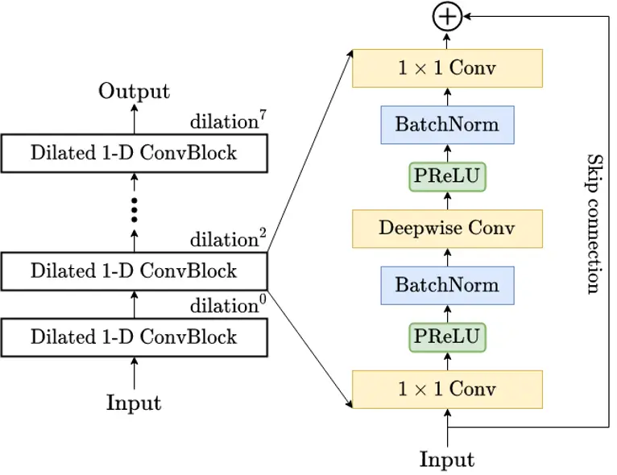
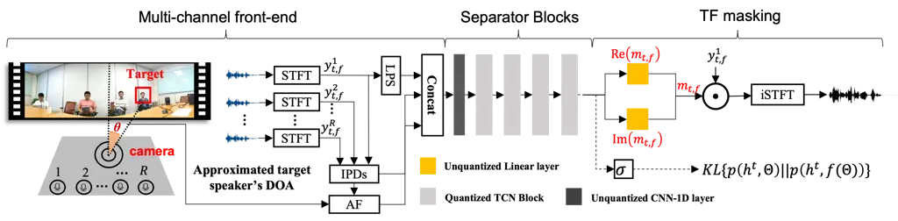
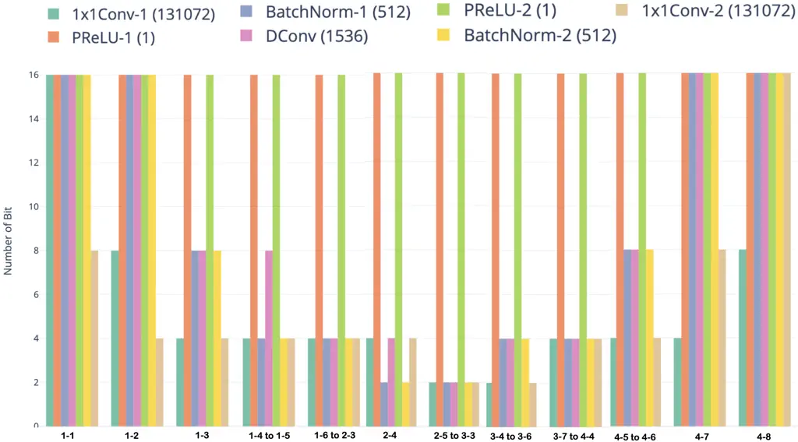

# Mixed Precision DNN Quantization for Overlapped Speech Separation and recognition

Junhao Xu\*    Jianwei Yu\* ^(†)^(†)thanks: \* Equal Contribution. This
work is partly done when Jianwei Yu is an intern in Tencent AI lab   
Xunying Liu    Helen Meng

###### Abstract

Recognition of overlapped speech has been a highly challenging task to
date. State-of-the-art multi-channel speech separation system are
becoming increasingly complex and expensive for practical applications.
To this end, low-bit neural network quantization provides a powerful
solution to dramatically reduce their model size. However, current
quantization methods are based on uniform precision and fail to account
for the varying performance sensitivity at different model components to
quantization errors. In this paper, novel mixed precision DNN
quantization methods are proposed by applying locally variable
bit-widths to individual TCN components of a TF masking based
multi-channel speech separation system. The optimal local precision
settings are automatically learned using three techniques. The first two
approaches utilize quantization sensitivity metrics based on either the
mean square error (MSE) loss function curvature, or the KL-divergence
measured between full precision and quantized separation models. The
third approach is based on mixed precision neural architecture search.
Experiments conducted on the LRS3-TED corpus simulated overlapped speech
data suggest that the proposed mixed precision quantization techniques
consistently outperform the uniform precision baseline speech separation
systems of comparable bit-widths in terms of SI-SNR and PESQ scores as
well as word error rate (WER) reductions up to 2.88% absolute (8%
relative).

###### Index Terms: 

Neural Network Quantization, Mixed Precision, Speech Separation, Speech
Recognition

^(†)^(†)address: ¹The Chinese University of Hong Kong; ²Tencent AI lab

## 1 Introduction

Despite the rapid progress of automatic speech recognition (ASR) in the
past few decades, accurate recognition of overlapped speech remains a
highly challenging task to date. To this end, microphone arrays and the
required multi-channel signal integration technologies represented by TF
masking \[1, 2\], delay and sum \[3, 4\] and minimum variance
distortionless response (MVDR) \[5, 6\] play a key role in
state-of-the-art overlapped speech separation and recognition systems.
With the wider application of deep learning based speech technologies,
these speech separation methods have evolved and been integrated into a
variety of DNN based designs based on, for example, convolutional
time-domain audio separation networks (Conv-TasNets) \[7\], dual path
recurrent neural networks and transformers  \[8, 9\] . State-of-the-art
speech separation performance require increasingly complex neural
architecture designs. For example, the audio-only and audio-visual
speech separation systems introduced in \[10\] contain 9.6 and 22
million parameters in total respectively. However, this not only lead to
a large increase in their overall memory footprint and computational
cost when operating on the cloud, but also creates difficulty when
deployed on edge devices to enhance privacy and reduce latency.

To this end, one efficient and powerful solution is to use low-bit deep
neural network (DNN) quantization techniques \[11, 12, 13, 14\], which
has drawn increasing interest in the machine learning and speech
technology community in recent years. By replacing floating point
weights with low precision values, the resulting quantization methods
can significantly reduce the model size and inference time without
modifying the model architectures. Traditional DNN quantization
approaches \[15, 16, 17\] are predominantly based on uniform precision,
where a manually defined identical bit-width is applied to all weight
parameters during quantization. This fails to account for the varying
performance sensitivity at different parts of the system to quantization
errors. In practice, this often leads to large performance degradation
against full precision models.

In order to address the above issue, novel mixed precision DNN
quantization methods are proposed in this paper to address this problem
by applying locally variable bit-widths settings to individual TCN
components of a TF masking based multi-channel speech separation
system \[18\]. These methods are becoming well supported by the recent
development of mixed precision DNN acceleration hardware that allow
multiple locally set precision settings to be used \[19\]. The resulting
flexibility can provide a better trade-off between compression ratio and
accuracy performance target. The optimal local precision settings are
automatically learned using three techniques. The first two approaches
utilize quantization sensitivity metrics based on either the mean square
error (MSE) loss function curvature that can be approximated efficiently
via matrix free techniques, or the KL-divergence measured between full
precision and quantized separation models. The third approach is based
on mixed precision neural architecture search.

Experiments conducted on the Lip Reading Sentences based on TED videos
(LRS3-TED) corpus \[20\] simulated overlapped speech data suggest that
the proposed mixed precision quantization techniques consistently
outperform the uniform precision baseline speech separation systems of
comparable quantization bit-widths. Consistent performance improvements
in terms of both SI-SNR and PESQ based speech enhancement metrics and
speech recognition word error rate (WER) up to 2.88% absolute (8%
relative) were obtained. The 8-bit KL mixed precision quantized system
achieved a “lossless” quantization over the full precision 32-bit
baseline while incurring no statistically significant WER increase.

The main contributions of this paper are summarized as follows. First,
this paper is the first work to apply mixed precision quantization
methods to speech separation tasks. In contrast, previous researches on
low-bit quantization within the speech community largely focused on the
back-end recognition system \[17, 21\] and language models \[22, 23\].
In addition, prior researches on light weight speech enhancement
approaches were based on neural structural sparsity compression \[24\]
rather than the proposed mixed precision low-bit quantization methods.
Second, the proposed 8-bit KL mixed precision quantized speech
separation system achieved a “lossless” quantization over the full
precision 32-bit baseline in terms of speech recognition accuracy.

The rest of this paper is organized as follows. The multi-channel speech
separation system is reviewed in section 2. Uniform precision neural
network quantization methods are introduced in section 3. Section 4
presents mixed precision quantization methods. Experiments and results
are shown in section 5. Finally, conclusions and future work are
discussed in section 6.

## 2 TF masking based Multi-channel Speech Separation

This section introduces the TF masking based multi-channel speech
separation framework used in this paper.

### 2.1 Audio inputs

As is illustrated in Figure 2, three types of audio features including
the complex spectrum, the inter-microphone phase differences (IPDs)
\[25\] and location-guided angle feature (AF) \[26, 27\] are adopted as
the audio inputs. The complex spectrum of all the microphone array
channels are first computed through short-time Fourier transform (STFT).

IPDs features were used to capture the relative phase difference between
different microphone channels and provide additional spatial cues for TF
masking based multi-channel speech separation. These can be computed as
follows:

```math
{\rm IPD}^{(m,n)}_{t,f}=\angle({y^{m}_{t,f}}/{y^{n}_{t,f}}) \tag{1}
```

where $`y^{m}_{t,f}`$ and $`y^{n}_{t,f}`$ denote the STFT’s TF bins of
mixed speech at time $`t`$ and frequency bin $`f`$ on $`m`$-th and
$`n`$-th microphone channels, respectively. The operator
$`\angle(\cdot)`$ outputs the angle between them.

Angle features that are based on the approximated direction of arrival
(DOA) were also incorporated to provide further spatial filtering
constraint. In this work, the approximate DOA of a target speaker,
$`\theta`$, is obtained by tracking the speaker’s face from a 180-degree
wide-angle camera, as is shown in the left hand side of Figure 2. This
allows the array steering vector corresponding to the target speaker to
be expressed as follows:

```math
\displaystyle{\bf{G}}(f)=\left[e^{-j\phi_{1}\cos(\theta)},e^{-j\phi_{r}\cos(\theta)},...,e^{-j\phi_{R}\cos(\theta)}\right] \tag{2}
```

where $`\phi_{r}=2\pi fd_{1r}/c`$ and $`d_{1r}`$ is the distance between
the first (reference) and $`r`$th microphone ($`d_{11}=0`$). $`c`$ is
the sound velocity. Based on the computed steering vector, the
location-guided AF feature introduced in \[26, 10\] are also adopted to
provide further discriminative information for the target speaker as
follows:

```math
\displaystyle\text{AF}(t,f)=\sum_{\{(m,n)\}}\frac{\big\langle\text{vec}\big(\frac{G_{n}(f)}{G_{m}(f)}\big),\text{vec}\big(\frac{y^{m}_{t,f}}{y^{n}_{t,f}}\big)\big\rangle}{\big\|\text{vec}\big(\frac{G_{n}(f)}{G_{m}(f)}\big)\big\|\cdot\big\|\text{vec}\big(\frac{y^{m}_{t,f}}{y^{n}_{t,f}}\big)\big\|} \tag{3}
```

where $`\|\cdot\|`$ denotes the vector norm,
$`\langle\cdot,\cdot\rangle`$ represents the inner product and
$`\{(m,n)\}`$ denotes the selected microphone pairs.
$`\text{vec}(\cdot)`$ transforms the complex value into a 2-D vector,
where the real and imaginary parts are regarded as the two vector
components.

### 2.2 Conv-Tasnet block

Following previous researches on audio-visual multi-channel speech
separation \[7, 18\], the temporal convolutional network (TCN)
architecture, which uses a long reception field to capture more
sufficient contextual information, is adopted in our separation
front-ends. As shown in Figure 1, each TCN block is stacked by 8 Dilated
1-D ConvBlock with exponentially increased dilation factors
$`2^{0},2^{1},....,2^{7}`$. As shown in Figure 2, the log-power spectrum
(LPS) features of the reference microphone channel were initially
concatenated with the IPDs and AF features before being fed into a stack
of several TCN blocks to estimate the complex TF mask.



Figure 1: _An example temporal convolutional network (TCN). Each dilated
1-D ConvBlock consists of a 1$`\times`$1 convolutional layer, a
depth-wise separable convolution layer (D–Conv) \[28\], with
PReLU \[29\] activation and normalization added between convolution
layers, and skip connections added between dilated 1-D ConvBlocks._

### 2.3 TF masking based speech separation

Previous researches suggest that the complex ratio masks (CRMs)
outperform both the binary masks (BMs) and real-value ratio masks (RMs)
on speech separation \[30, 31\] and enhancement \[32\] tasks. For this
reason, the complex ideal ratio mask (cIRM) $`m_{t,f}`$ of the target
speech is estimated in the separation module. The estimated target
speech complex spectrum is obtained as:

```math
x_{t,f}=m_{t,f}y_{t,f}^{r} \tag{4}
```

where $`m_{t,f}\in\mathbb{C}`$ is the cIRM of the target speaker,
$`y_{t,f}^{r}`$ is the reference channel complex spectrum of mixed
speech (without loss of generality, the first channel is selected as the
reference channel throughout this paper). Given the estimated complex
spectrum, the time-domain separated speech can be computed by the
inverse short-time Fourier transform (iSTFT) and the SI-SNR cost
function is used to optimize the separation neural networks.



Figure 2: _Illustration of the proposed quantized audio-visual
multi-channel speech separation networks, where $`y^{r}_{t,f}`$ is the
complex spectrum of each channel. For the channel integration approach
TF masking, $`m_{t,f}`$ denotes the complex mask of the target speaker
and $`{\rm Re}{(m_{t,f})}`$ and $`{\rm Im}(m_{t,f})`$ are the real and
imaginary part. The quantized TCN blocks are marked light grey in the
figure._

## 3 Neural Network Quantization

For a standard $`n`$-bit quantization problem of neural networks, we
consider a full precision weight parameter $`\Theta`$ and find its
closest discrete approximation from the following quantization table
$`Q\in\{0,\pm 1,\pm 2,\dots,\pm(2^{n-1}-1)\}`$ as

```math
f(\Theta)=\arg\min\limits_{Q}|\Theta-Q| \tag{5}
```

while one bit is reserved to denote the sign. With further
simplification, low bit quantization, for example, binarization
$`\{1,-1\}`$ \[33, 13\] and ternary $`\{-1,0,1\}`$ \[34\], can be
produced.

When applying quantization to all weight matrices in the model, we can
use a more general format in equation (5) to represent the quantization
for each parameter. Let $`\Theta^{(l)}_{i}`$ be the $`i^{th}`$ parameter
within any of the $`l^{th}`$ weight cluster, for example, all weight
parameters of the same Conv-Tasnet layer,

```math
\begin{split}f(\Theta^{(l)}_{i})=\arg\min\limits_{Q_{i}^{(l)}}|\Theta^{(l)}_{i}-Q_{i}^{(l)}|\vskip-10.00002pt\end{split} \tag{6}
```

The locally shared $`l^{th}`$ quantization table is given by

```math
{Q}_{i}^{(l)}\in\{0,\pm\alpha^{(l)},\dots,\pm\alpha^{(l)}(2^{n_{l}-1}-1)\} \tag{7}
```

where $`\alpha^{(l)}`$ is a full precision scaling factor used to adjust
the dynamic range of all the unquantized weights in the cluster. It is
shared locally among weight parameters clusters. A special case, when
the local quantization table in equation (7) is shared across all the
layers, leads to the traditional uniform precision quantization
approach. The only remaining factor affecting the system performance is
the bit length $`n_{l}`$ which is also globally set to be $`1,2,4,8,16`$
etc.

|     |           |               |                  |          |       |              |             |             |             |        |       |       |        |                                  |          |             |
| --- | --------- | ------------- | ---------------- | -------- | ----- | ------------ | ----------- | ----------- | ----------- | ------ | ----- | ----- | ------ | -------------------------------- | -------- | ----------- |
| Sys | quant.    | param.        | prec.            | quant.   | \#bit | SI-SNR(PESQ) |             |             |             | WER(%) |       |       |        |                                  | model    | eval. time  |
|     | prec.     | estim.        | set              | method   |       | 0-15         | 15-45       | 45-90       | 90-180      | 0-15   | 15-45 | 45-90 | 90-180 | avg.                             | size(MB) | (sec./hour) |
| 1   | baseline  |               |                  |          | 32    | 7.13(2.65)   | 10.22(3.01) | 10.94(3.10) | 10.83(3.10) | 40.55  | 26.37 | 23.85 | 23.82  | 28.65                            | 35.2     | 67.79       |
| 2   |           |               | -                |          | 2     | 5.22(2.38)   | 7.89(2.64)  | 8.67(2.71)  | 8.57(2.70)  | 49.95  | 37.17 | 33.25 | 33.71  | 38.52                            | 4.6      | 37.22       |
| 3   | _uniform_ |               |                  | _manual_ | 4     | 6.43(2.52)   | 9.05(2.80)  | 9.86(2.88)  | 9.62(2.86)  | 44.88  | 32.16 | 29.49 | 29.86  | 34.10                            | 6.6      | 36.54       |
| 4   | _prec._   |               |                  | _define_ | 8     | 7.10(2.62)   | 9.94(2.94)  | 10.65(3.02) | 10.46(3.01) | 41.16  | 28.09 | 25.16 | 25.58  | 30.00$`\star`$                   | 10.7     | 36.98       |
| 5   |           |               |                  |          | 16    | 7.11(2.64)   | 10.22(3.01) | 10.91(3.09) | 10.81(3.09) | 40.81  | 26.00 | 23.95 | 23.87  | 28.66$`{\star}`$                 | 18.9     | 54.74       |
| 6   |           | Post-training | $`\{2,4,8,16\}`$ | Hes      | 4     | 6.66(2.56)   | 9.60(2.89)  | 10.29(2.96) | 10.09(2.95) | 42.91  | 28.90 | 26.47 | 27.17  | 31.36$`{{\ddagger}}`$            | 6.7      | 44.28       |
| 7   |           | Offline       |                  |          | 8     | 7.21(2.65)   | 10.15(3.00) | 10.85(3.08) | 10.76(3.09) | 40.31  | 26.50 | 24.71 | 24.23  | 28.94$`{\star}`$$`{{\ddagger}}`$ | 10.8     | 48.99       |
| 8   | _mixed_   | Quant \[17\]  |                  | KL       | 4     | 6.89(2.59)   | 9.61(2.89)  | 10.35(2.97) | 10.17(2.96) | 42.01  | 29.49 | 26.42 | 26.95  | 31.22$`{{\ddagger}}`$            | 6.7      | 43.61       |
| 9   | _prec._   |               |                  |          | 8     | 7.20(2.65)   | 10.20(3.00) | 10.87(3.08) | 10.75(3.08) | 40.28  | 26.62 | 23.97 | 23.17  | 28.51                            | 10.8     | 47.85       |
| 10  |           |               |                  | NAS      | 4     | 6.54(2.54)   | 9.22(2.83)  | 9.95(2.92)  | 9.86(2.90)  | 44.46  | 31.00 | 27.89 | 28.26  | 32.90$`{{\dagger}}`$             | 6.7      | 44.47       |
| 11  |           |               |                  |          | 8     | 7.08(2.61)   | 10.13(2.99) | 10.82(3.07) | 10.73(3.08) | 41.11  | 26.63 | 24.29 | 24.52  | 29.14$`{\star}`$$`{{\ddagger}}`$ | 10.8     | 49.10       |

Table 1: _Performance of the baseline full precision, uniform precision
quantized and mixed preciison quantized TF-masking based speech
separation systems with local precision settings automatically learned
from HES/KL/NAS introduced in section 4 on LRS3-TED corpus. WERs
measured both on average and across subsets of test data with varying
between speaker angles from 0-15 to 90-180 degrees. $`{\star}`$,
$`{{\dagger}}`$ and $`{{\ddagger}}`$ denote no statistically significant
WER difference obtained over baseline systems (sys.1,3,4). Evaluation
time in seconds per hour of speech._

## 4 Mixed Precision Quantization

This section presents three approaches to automatically learn the
optimal local precision settings for the quantization of our TF-masking
based multi-channel speech separation system.

### 4.1 KL Divergence Based Mixed Precision Quantization

In order to minimize the distance between the distribution embodied by
the original full precision system and that of the quantized model,
Kullback-Leibler (KL) divergence between full precision and quantized
NNs is used to measure the resulting performance sensitivity. Taking a
$`L`$-layer NN for example, for any quantization $`f(\cdot)`$ being
applied to the full precision parameters $`{\bf\Theta}`$, the KL
divergence based quantization sensitivity measure is computed over the
input spectrum of $`T`$ frame length as,

```math
\displaystyle\Omega^{\rm{KL}} \displaystyle=\sum_{i=1}^{L}\Omega^{\rm{KL}}_{i}=\sum_{i=1}^{L}D_{\rm{KL}}(P(\bm{\Theta_{i}})||P(f_{n_{i}}(\bm{\Theta_{i}}))) \tag{8}
```

```math
\displaystyle=\sum_{i=1}^{L}\sum_{t=1}^{T}P(\sigma(\bm{h}^{t}),{\bf\Theta}_{i})\ln{\frac{P(\sigma(\bm{h}^{t}),{\bf\Theta}_{i})}{P(\sigma(\bm{h}^{t}),f_{n_{i}}({\bf\Theta}_{i})}}
```

where $`{\bf\Theta}_{i}`$ denote the full precision parameters of the
$`i^{th}`$ layer, and $`f_{n_{i}}({\bf\Theta}_{i})`$ is $`n_{i}`$-bit
quantized parameters given a particular local precision bit width
$`n_{i}`$ and $`{\bm{h}}^{t}`$ is the TCN separator output vector
computed at frame $`t`$. When computing the KL metric in Eqn. (8),
$`{\bm{h}}^{t}`$ is fed into a Sigmoid gate (Figure 2, middle right)
first to produce normalised, probability like outputs between 0 and 1.
Given a target model size constraint (e.g. average 4-bit precision), the
KL metric for each precision setting of each layer is computed and
minimized to select the optimal local bit-width while satisfying the
constraint¹¹ 1 A minimum 2-bit precision is also enforced for all layers
during this layer by layer quantization precision optimization to filter
out invalid settings..

### 4.2 Curvature Based Mixed Precision Quantization

The second approach minimizes the performance sensitivity to
quantization by examining the local training data SI-SNR separation
error loss function curvature. Under mild assumptions such that the
parameters of a DNN is twice differentiable and while converging to a
local optimum, it is shown in  \[19, 35\] that the separation
performance sensitivity to quantization, when using a given precision
setting, can be expressed as the squared quantization error further
weighted by the parameter Hessian matrix trace. For any quantization
$`f(\cdot)`$ being applied to the parameters $`\bm{\Theta}`$ of the
L-layer Conv-Tasnet separation model, the total performance sensitivity
is given by the sum of Hessian trace weighted squared quantization
error, to be minimized under a target model size constraint.

```math
\Omega^{\rm{Hes}}=\sum_{i=1}^{L}\Omega^{\rm{Hes}}_{i}=\sum_{i=1}^{L}Tr(\bm{H}_{i})\cdot||f(\bm{\Theta}_{i})-\bm{\Theta}_{i}||_{2}^{2} \tag{9}
```

An efficient stochastic linear algebra approach based on the Huchinson’s
Algorithm \[36\] is used to approximate the Hessian trace,

```math
Tr(\bm{H})\approx\frac{1}{m}\sum_{i=1}^{m}\bm{z}_{i}^{\top}\bm{H}\bm{z}_{i} \tag{10}
```

where the expensive matrix multiplication between $`\bm{H}`$ and
$`\bm{z}_{i}`$ can be avoided, and efficiently computed using
Hessian-free approaches \[35\]. $`\bm{z}_{i}`$ is a random vector
sampled from a Gaussian Distribution $`\mathcal{N}(\bf{0},\bf{1})`$.

### 4.3 Architecture Search Based Mixed Precision Quantization

The third solution to automatically learn the optimal local quantization
precision settings is to use mixed precision based neural architecture
search (NAS) \[37, 38\] approaches. The super-network is constructed by
first separately training the speech separation system using uniform
precision, e.g. 2-bit, 4-bit, 8-bit and 16-bit, before connecting these
uniform precision quantized models at each layer.

In order to avoid the trivial selection of the longest, most generous
quantization bit width, these precision selection weights learning can
be further constrained by a model complexity penalty term with respect
to the number of bits retained after quantization, in order to obtain a
target average quantization precision, for example, 4-bit,

```math
\Omega^{\rm{NAS}}=\mathcal{L}_{SI-SNR}(\bm{\Theta})+\beta\sum_{(n,l)}a_{n}^{l}\cdot\sqrt{n}\vskip-5.0pt \tag{11}
```

where $`\mathcal{L}_{SI-SNR}(\bm{\Theta})`$ is the scale-invariant
signal to noise ratio (_SI-SNR_) objective function. $`a^{l}_{n}`$
denotes the architecture weights using $`n`$-bit quantization for the
$`l`$-th cluster of weight parameters. $`\beta`$ is a scaling factor
empirically set as $`0.5`$ in all experiments of this paper.

## 5 Experiments

LRS3 Corpus and overlapped speech simulation: We adopt the Lip Reading
Sentences based on TED videos (LRS3-TED), which contain both the talking
faces and subtitles of what is said in this paper. The original LRS3-TED
corpus is divided into three subsets: _Pre-train_, _Train-val_ and
_Test_ set. We keep the _Train-val_ subset and randomly select the same
portion of each speaker as the _Pre-train_ subset to make up for a
$`100h`$ corpus in total for training. Details of the simulation process
is similar to \[18\]. A 15-channel symmetric linear array with noneven
inter-channel spacing is used in the simulation process. Reverberation
is also added in the simulated data by convolving the single channel
signals with the Room Impulse Responses (RIRs) generated by the
image-source method. The room size is randomly selected ranging from
$`4\times 4\times 2.5\ m^{3}`$ to $`10\times 8\times 6\ m^{3}`$
(length$`\times`$width$`\times`$height) and the reverberation time T60
is sampled from a range of 0.05 to 0.7s. The average overlapping ratio
of the simulated utterances is around 85% and SIR is around 0dB. The
simulated data is divided into three subsets for training (141h),
validation (2h) and evaluation (0.85h).

Implementation details: Details of the IPD, AF features and
hyper-parameter settings of the LF-MMI CLDNN based audio-visual
recognition back-end can be found in \[18, 39\]. Note that the
recognition back-end is trained on clean speech data. For each TCN block
of the separation front-end, the number of channels in the 1x1
Conv-layer is set to 256 for every Dilated 1-D ConvBlock. For all the
D-Conv layers, the kernel size is set to 3 with 512 channels. The
implementation used to evaluate the mixed precision quantization methods
of this paper is based on the existing low-bit quantized precisions that
are already natively supported by the NVidia Tesla V100 GPU. These
include the use of the Boolean and masking operators to implement 1-bit
quantization, and the INT8 data type used to implement 2, 4 and 8-bit
quantization. In case of 2-bit and 4-bit quantization, extra padded bits
of zero were also included. Statistical significance test was conducted
at level $`\alpha=0.05`$ based on matched pairs sentence segment word
error (MAPSSWE) for recognition performance analysis.

Experiment results: Table 1 presents the SI-SNR, PESQ performance and
word error rates (WERs) of the baseline full precision, uniform and
mixed precision quantization TF-masking based multi-channel speech
separation systems on the LRS3-TED corpus simulated overlapped speech
data. There are several trends can be found. First, given the same
quantization precision, for example, 4-bit, all the mixed precision
quantized models proposed in Section 4, curvature based HES (sys.6), KL
(sys.8) and mixed precision NAS (sys.10) outperform the 4-bit uniform
quantized model (sys.3). The 4-bit and 8-bit HES (sys.6, 7), and KL
(sys.8, 9) quantized systems consistently outperform the uniform
precision baseline of comparable bit-widths in terms of SI-SNR and PESQ
scores, as well as WER reductions up to 2.88% absolute (sys.8 vs. sys.3,
8% relative). Second, among all the mixed precision quantization
methods, the best WER performance for 8-bit quantization is also
obtained using KL (sys.9), producing a compression ratio of 3.3 over the
baseline full precision model (sys.1) and no WER increase, while uniform
precision quantization requires 16-bit (sys.5) to give a similar WER.

The local precision settings of the 4-bit KL mixed precision quantized
system (sys.4, Table 1) is shown in Figure 3, where the first and last
two TCN layers generally require longer precision than those of the
intermediate layers.



Figure 3: _Local \#bits used in avg. 4-bit KL mixed precision quantized
separation TCN blocks (Figure 2, centre right in black, also as sys.8 in
Table 1). TCN layer indexing $`m`$-$`n`$ denotes $`m^{th}`$ TCN block’s
$`n^{th}`$ dilated 1-D ConvBlock, whose 7 sublayers in Figure 1 shown in
different colours together with number of parameters in brackets.
”$`m`$-$`n`$ to $`p`$-$`q`$” denote consecutively positioned layers
using same \#bits._

## 6 Conclusions

This paper presents novel mixed precision quantization methods for
TF-masking based overlapped speech separation systems. Local precision
settings are automatically learned to provide better trade-off between
speech separation model compression ratio and performance loss.
Experiments conducted on the LRS3-TED corpus suggest mixed precision
quantization consistently outperform uniform precision quantization
using comparable bit-widths. Future researches focus on improving
hardware implementation and integration with back-end speech recognition
systems.

## 7 Acknowledgement

This research is supported by Hong Kong RGC GRF grant No. 14200218,
14200220, 14200021, TRS T45-407/19N, and Innovation & Technology Fund
grant No. ITS/254/19.

## References

- \[1\] Fahimeh Bahmaninezhad et al., “A comprehensive study of speech
  separation: spectrogram vs waveform separation,” Interspeech, 2019.
- \[2\] Lianwu Chen et al., “Multi-band pit and model integration for
  improved multi-channel speech separation,” in ICASSP. IEEE, 2019, pp.
  705–709.
- \[3\] Van Veen et al., “Beamforming: A versatile approach to spatial
  filtering,” IEEE assp magazine, vol. 5, no. 2, pp. 4–24, 1988.
- \[4\] Xavier Anguera et al., “Acoustic beamforming for speaker
  diarization of meetings,” TASLP, vol. 15, no. 7, pp. 2011–2022, 2007.
- \[5\] Dimitris A Pados et al., “An iterative algorithm for the
  computation of the mvdr filter,” IEEE Transactions on Signal
  Processing, vol. 49, no. 2, pp. 290–300, 2001.
- \[6\] Mehrez Souden et al., “On optimal frequency-domain multichannel
  linear filtering for noise reduction,” TASLP, vol. 18, no. 2, pp.
  260–276, 2009.
- \[7\] Yi Luo et al., “Conv-tasnet: Surpassing ideal time–frequency
  magnitude masking for speech separation,” TASLP, vol. 27, no. 8, pp.
  1256–1266, 2019.
- \[8\] Yi Luo et al., “Dual-path rnn: efficient long sequence modeling
  for time-domain single-channel speech separation,” in ICASSP. IEEE,
  2020, pp. 46–50.
- \[9\] Chenda Li et al., “Dual-path modeling for long recording speech
  separation in meetings,” ICASSP, 2021.
- \[10\] Rongzhi Gu et al., “Multi-modal multi-channel target speech
  separation,” IEEE Journal of Selected Topics in Signal Processing,
  vol. 14, no. 3, pp. 530–541, 2020.
- \[11\] Kai Yu et al., “Neural network language model compression with
  product quantization and soft binarization,” TASLP, vol. 28, pp.
  2438–2449, 2020.
- \[12\] Yan-min Qian and Xu Xiang, “Binary neural networks for speech
  recognition,” Frontiers of Information Technology & Electronic
  Engineering, vol. 20, no. 5, pp. 701–715, 2019.
- \[13\] Cong Leng et al., “Extremely low bit neural network: Squeeze
  the last bit out with admm,” in AAAI, 2018, vol. 32.
- \[14\] Rao Ma et al., “Highly efficient neural network language model
  compression using soft binarization training,” in ASRU. IEEE, 2019,
  pp. 62–69.
- \[15\] Matthieu Courbariaux et al., “Binaryconnect: training deep
  neural networks with binary weights during propagations,” in NIPS,
  2015, pp. 3123–3131.
- \[16\] Junhao Xu et al., “Low-bit quantization of recurrent neural
  network language models using alternating direction methods of
  multipliers,” in ICASSP. IEEE, 2020, pp. 7939–7943.
- \[17\] Andrea Fasoli et al., “4-Bit Quantization of LSTM-Based Speech
  Recognition Models,” in Interspeech, 2021, pp. 2586–2590.
- \[18\] Jianwei Yu et al., “Audio-visual multi-channel integration and
  recognition of overlapped speech,” TASLP, 2021.
- \[19\] Zhen Dong et al., “Hawq-v2: Hessian aware trace-weighted
  quantization of neural networks,” NeurIPS, 2019.
- \[20\] Triantafyllos Afouras et al., “Deep audio-visual speech
  recognition,” TPAMI, 2018.
- \[21\] Hieu Duy Nguyen et al., “Quantization aware training with
  absolute-cosine regularization for automatic speech recognition.,” in
  Interspeech, 2020, pp. 3366–3370.
- \[22\] Junhao Xu et al., “Mixed precision quantization of transformer
  language models for speech recognition,” in ICASSP. IEEE, 2021, pp.
  7383–7387.
- \[23\] Xuan Liu et al., “Binarized lstm language model,” in
  Proceedings of the Conference of the North American Chapter of the
  Association for Computational Linguistics: Human Language
  Technologies, Volume 1 (Long Papers), 2018, pp. 2113–2121.
- \[24\] Ke Tan and DeLiang Wang, “Towards model compression for deep
  learning based speech enhancement,” TASLP, vol. 29, pp.
  1785–1794, 2021.
- \[25\] Takuya Yoshioka et al., “Recognizing overlapped speech in
  meetings: A multichannel separation approach using neural networks,”
  arXiv preprint arXiv:1810.03655, 2018.
- \[26\] Zhuo Chen et al., “Multi-channel overlapped speech recognition
  with location guided speech extraction network,” in 2018 IEEE Spoken
  Language Technology Workshop (SLT). IEEE, 2018, pp. 558–565.
- \[27\] Rongzhi Gu et al., “End-to-end multi-channel speech
  separation,” arXiv preprint arXiv:1905.06286, 2019.
- \[28\] François Chollet, “Xception: Deep learning with depthwise
  separable convolutions,” in CVPR, 2017, pp. 1251–1258.
- \[29\] Kaiming He et al., “Delving deep into rectifiers: Surpassing
  human-level performance on imagenet classification,” in ICCV, 2015,
  pp. 1026–1034.
- \[30\] Yong Xu et al., “Joint training of complex ratio mask based
  beamformer and acoustic model for noise robust asr,” in ICASSP. IEEE,
  2019, pp. 6745–6749.
- \[31\] Donald S Williamson et al., “Complex ratio masking for monaural
  speech separation,” TASLP, vol. 24, no. 3, pp. 483–492, 2015.
- \[32\] Yanxin Hu et al., “Dccrn: Deep complex convolution recurrent
  network for phase-aware speech enhancement,” arXiv preprint
  arXiv:2008.00264, 2020.
- \[33\] Mohammad Rastegari et al., “Xnor-net: Imagenet classification
  using binary convolutional neural networks,” in ECCV. Springer, 2016,
  pp. 525–542.
- \[34\] Fengfu Li et al., “Ternary weight networks,” arXiv preprint
  arXiv:1605.04711, 2016.
- \[35\] Zhen Dong et al., “Hawq: Hessian aware quantization of neural
  networks with mixed-precision,” in ICCV, 2019, pp. 293–302.
- \[36\] Haim Avron and Sivan Toledo, “Randomized algorithms for
  estimating the trace of an implicit symmetric positive semi-definite
  matrix,” JACM, vol. 58, no. 2, pp. 1–34, 2011.
- \[37\] Thomas Elsken et al., “Neural architecture search: A survey.,”
  J. Mach. Learn. Res., vol. 20, no. 55, pp. 1–21, 2019.
- \[38\] Shoukang Hu et al., “Dsnas: Direct neural architecture search
  without parameter retraining,” in CVPR, June 2020.
- \[39\] Yiwen Shao et al., “Pychain: A fully parallelized pytorch
  implementation of lf-mmi for end-to-end asr,” Interspeech, 2020.
