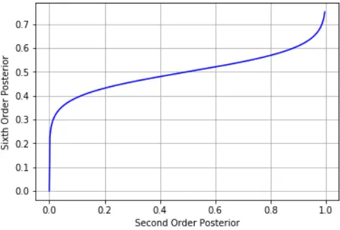
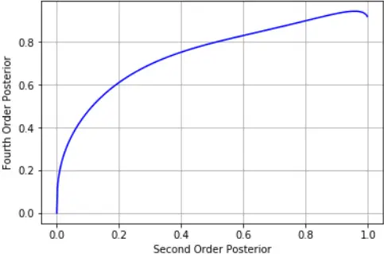

## A HIGHER ORDER MINKOWSKI LOSS FOR IMPROVED PREDICTION ABILITY OF ACOUSTIC MODEL IN ASR

Vishwanath Pratap Singh1 , Shakti P. Rath2 , and Abhishek Pandey1

1Samsung R&amp;D Institute India - Bangalore 2Reverie Language Technologies, India

vp.singh@samsung.com, shakti.rath@reverieinc.com, and abhi3.pandey@samsung.com

## Abstract

Conventional automatic speech recognition (ASR) system uses second-order minkowski loss during inference time which is suboptimal as it incorporates only first order statistics in posterior estimation [2]. In this paper we have proposed higher order minkowski loss (4th Order and 6th Order) during inference time, without any changes during training time. The main contribution of the paper is to show that higher order loss uses higher order statistics in posterior estimation, which improves the prediction ability of acoustic model in ASR system. We have shown mathematically that posterior probability obtained due to higher order loss is function of second order posterior and thus the method can be incorporated in standard ASR system in an easy manner. It is to be noted that all changes are proposed during test(inference) time, we do not make any change in any training pipeline. Multiple baseline systems namely, TDNN1, TDNN2, DNN and LSTM are developed to verify the improvement incurred due to higher order minkowski loss. All experiments are conducted on LibriSpeech dataset and performance metrics are word error rate (WER) on "dev-clean", "test-clean", "dev-other" and "test-other" datasets.

Index Terms: minkowski loss, long short-term memory, deep neural network, automatic speech recognition

## 1. Introduction

In conventional acoustic modeling, in the inference time, the optimum classes are obtained by passing the input features through the network, which predicts the class-conditional (posterior) probabilities of the probability density function (pdf) classes given the input features. Afterwards Viterbi decoding is applied on the class-conditional probabilities to get the ASR output [1]. Use of the class-conditional probabilities during inference time intuitively make sense. In section 2, through sound theoretical development, we substantiate the intuition to show that class-conditional probabilities are indeed obtained if 2nd order Minkowski loss (i.e., mean-square loss) is used as the optimum expected loss. As pointed out in [2] and explained in section 2, the 2nd order Minkowski loss prediction model uses only 1st order statistics to predict the class-conditionals and ignores all higher order statistics, which is suboptimal.

Higher Order Statistics provide supplementary information to the estimation. These statistics are very useful in problems where either non-Gaussianity, nonminimum phase, colored noise, or nonlinearities are important and must be accounted for. Adding higher order statistics makes the estimation robust [19]. Impact of higher-order loss approximation for deep neural networks interpretation is studied for image classification task [3]. It is found that higher order approximation helps when classes are more and the prediction probability is not close to one, which makes it's application suitable for acoustic model in ASR system where output classes are thousands of context dependent states.

In this work we show that higher-order Minkowski loss (e.g.4th /6th order expected loss) leads to better prediction ability of the acoustic model in ASR system, which makes use of both 1st order as well as higher-order statistics. Specifically, the class-conditionals are modified to generate more optimum class-predictions. Afterwards, Viterbi decoding is applied to the modified class-conditionals. We emphasize that all changes are proposed during test(inference) time, we do not make any change in any training pipeline. It is observed that modifying the 2nd order loss with higher -order minkowski loss to incorporate higher order statistics in prediction indeed improves the prediction ability of Acoustic Model in ASR, which leads to significant reduction in word error rate. We emphasize that there is no change in the acoustic model training pipeline. The changes are made only in the decoding/inference time. The same Acoustic model is decode with 2nd order minkowski loss and higher order minkowski loss and results are compared. Following the norms accepted in ASR community, in this paper we show the results on 960 hours of Librispeech dataset for Large Vocabulary Continuous Speech Recognition (LVCSR) Task. The extended work on bigger dataset is deferred to fututre work .

TDNN-HMM [6], DNN-HMM [4, 5] and LSTM-HMM [16] decoded with second order minkowski loss is used as a baseline. In a TDNN, different layers or sets of layers can act on different time scales. As such, it can be seen as a type of convolutional neural network (CNN) operating over the time dimension. In a TDNNmodel, the first few layers look at smaller time scales and produce more abstract higher level features. The later layers take larger time windows over these abstract features as input. During training and inference, the sequence of input features are repeatedly shifted in time and fed to the model, producing another sequence as output. This architecture reduces the amount of computation required, as compared with a fully connected network [6, 7]. On the other hand long-short term model (LSTM) was proposed as an alternative to conventional RNN [15] for speech recognition. It helps to solve the issues faced by RNN by replacing the recurrent neurons in RNN with memory cells [16]. In order to reduce the computational complexity of the network, the Long Short-TermMemory Projected (LSTMP) architecture is proposed by Sak et al. [17].

This paper is organised as follows. In Section 2, we present limitation of 2nd order minkowski loss. Section 3 and Section 4, explains higher order minkowski loss and their advantage over 2nd order minkowski loss. Section 5 explains the issues with application of 3rd and 5th order minkowski loss. Data set and experimental setup are explained in Section 6 and Section 7, respectively. Conclusion with future works are provided in Section 8.

## 2. Review of Second Order Minkowski Loss

The inference (decoding) stage in conventional ASR system consists of choosing a specific estimate y(x) of the value of target (t) for each input x. Suppose that in doing so, we incur a loss L(y(x), t). Then average or expected loss, as worked out in [2], is given by:

$$E [ L ] = \sum _ { t = 1 } ^ { N } \int L ( y ( x ) , t ) p ( x , t ) d x \quad ( 1 )$$

Where, N is number of context dependent classes in acoustic model and p(x, t) is join probability over input x and target t and E[L] is expected loss. In case of second order minkowski loss L(y(x), t) is defined as {y(x) - t}2 . Thus eq. 1 becomes:

$$E [ L ] = \sum _ { t = 1 } ^ { N } \int \{ y ( x ) - t \} ^ { 2 } p ( x , t ) d x \quad ( 2 )$$

Our goal is to choose y(x) so as to minimize E[L]. Minimizing eq. 2 using differential method:

$$\frac { \delta E [ L ] } { \delta y ( x ) } = 2 \sum _ { t = 1 } ^ { N } \{ y ( x ) - t \} p ( x , t ) = 0 \quad ( 3 ) \quad o r t h s c r { D }$$

Solving for y(x), and using the sum and product rules of probability, we obtain:

$$y ( x ) = \frac { \sum _ { t = 1 } ^ { N } t p ( x , t ) } { p ( x ) } = \sum _ { t = 1 } ^ { N } t p ( t | | x ) = E _ { t } [ t | | x ] \quad ( 4 ) \quad \frac { 1 } { t }$$

and if targets are discrete such as probability density function (pdf) classed in acoustic model then,

$$E _ { t } [ t | | x ] = \mu _ { i }$$

Thus, the 2nd order Minkowski loss prediction model uses only 1st order statistics to predict the posteriors and ignores all higher order statistics in estimation, which is suboptimal.

## 3. Fourth Order Minkowski Loss

Expected Loss for fourth order minkowski can be obtained by substituting loss function L(y(x), t) in eq. 1 with {y(x) - t}4 and can be defined as:

$$E [ L ] = \sum _ { t = 1 } ^ { N } \int \{ y ( x ) - t \} ^ { 4 } p ( x , t ) d x \quad ( 6 ) \quad \begin{matrix} T \\ F \end{matrix}$$

Expected loss defined in eq. 6 can be minimized by finding root of:

$$\frac { \delta E [ L ] } { \delta y ( x ) } = 4 \sum _ { t = 1 } ^ { N } \{ y ( x ) - t \} ^ { 3 } p ( x , t ) & & ( 7 )$$

After expanding the cubic term and representing y(x) as y we obtain:

$$\frac { \delta E [ L ] } { \delta y ( x ) } = 4 \sum _ { t = 1 } ^ { N } ( y ^ { 3 } - 3 t y ^ { 2 } + 3 t ^ { 2 } y - t ^ { 3 } ) p ( x , t ) \quad ( 8 )$$

since t is target which takes the binary value, i.e., tϵ{0, 1} we obtain:

$$\sum _ { t = 1 } ^ { N } t p ( t | | x ) = \sum _ { t = 1 } ^ { N } t ^ { n } p ( t | | x ) = E _ { t } [ t | | x ] = \mu \quad ( 9 )$$

Table 1: Improvement using 4th Order Minkowski Loss and 6th Order Minkowski Loss over TDNN-HMM baseline (TDNN) trained on 960 hours combined "train-clean" and "trainothers" dataset

| Test Case   | LM           | TDNN  | 4th Order | 6th Order |
| ----------- | ------------ | ----- | --------- | --------- |
| dev-clean   | 3-gram small | 7.26  | 6.91      | 6.83      |
| test-clean  | 3-gram small | 7.58  | 7.22      | 7.13      |
| dev-others  | 3-gram small | 17.06 | 15.89     | 15.74     |
| test-others | 3-gram small | 17.57 | 16.49     | 16.34     |
| dev-clean   | 3-grammedium | 6.42  | 6.16      | 6.11      |
| test-clean  | 3-grammedium | 6.78  | 6.44      | 6.32      |
| dev-others  | 3-grammedium | 15.71 | 14.98     | 14.76     |
| test-others | 3-grammedium | 16.15 | 16.32     | 16.24     |
| dev-clean   | 3-gram large | 5.04  | 4.78      | 4.71      |
| test-clean  | 3-gram large | 5.64  | 5.39      | 5.28      |
| dev-others  | 3-gram large | 13.22 | 12.61     | 12.55     |
| test-others | 3-gram large | 13.64 | 12.96     | 12.84     |

Table 2: Improvement using 4th Order Minkowski Loss and 6th Order Minkowski Loss over DNN-HMM baseline (DNN) trained on 960 hours combined "train-clean" and "trainothers" dataset

| Test Case   | LM           | DNN   | 4th Order | 6th Order |
| ----------- | ------------ | ----- | --------- | --------- |
| dev-clean   | 3-gram small | 7.61  | 7.08      | 6.97      |
| test-clean  | 3-gram small | 7.93  | 7.42      | 7.26      |
| dev-others  | 3-gram small | 17.89 | 16.76     | 16.55     |
| test-others | 3-gram small | 18.45 | 17.34     | 17.19     |
| dev-clean   | 3-grammedium | 6.72  | 6.34      | 6.26      |
| test-clean  | 3-grammedium | 7.04  | 6.70      | 6.54      |
| dev-others  | 3-grammedium | 16.48 | 15.61     | 15.44     |
| test-others | 3-grammedium | 16.95 | 16.03     | 15.98     |
| dev-clean   | 3-gram large | 5.17  | 4.88      | 4.79      |
| test-clean  | 3-gram large | 5.88  | 5.56      | 5.51      |
| dev-others  | 3-gram large | 13.88 | 13.17     | 13.06     |
| test-others | 3-gram large | 14.25 | 13.43     | 13.38     |

After integrating the eq. 8 over discrete target and ignoring the constant multiplication term,

$$\frac { \delta E [ L ] } { \delta y ( x ) } = y ^ { 3 } - 3 \mu y ^ { 2 } + 3 \mu y - \mu \quad ( 1 0 )$$

The root of the function obtained in eq. 10 is the modified posterior µ4th i , which is the function of actual posterior µi. Correspondence between posterior obtained after 2nd order minkowski loss µi and posteriors obtained after 4th order minkowski loss µ4th i is shown in figure 1.

## 4. Sixth Order Minkowski Loss

Expected Loss for sixth order minkowski can be obtained by substituting loss function L(y(x), t) in eq. 1 with {y(x) - t}6 and can be defined as:

$$E [ L ] = \sum _ { t = 1 } ^ { N } \int \{ y ( x ) - t \} ^ { 6 } p ( x , t ) d x \quad ( 1 1 )$$

Expected loss defined in eq. 6 can be minimized by finding root of:

$$\frac { \delta E [ L ] } { \delta y ( x ) } = 6 \sum _ { t = 1 } ^ { N } \{ y ( x ) - t \} ^ { 5 } p ( x , t ) \quad ( 1 2 )$$

Figure 2: Correspondence between 2nd Order and 6th Order Posteriors.

| Test Case   | LM           | LSTMP | 4th Order | 6th Order |
| ----------- | ------------ | ----- | --------- | --------- |
| dev-clean   | 3-gram small | 6.18  | 5.83      | 6.67      |
| test-clean  | 3-gram small | 6.43  | 5.93      | 5.72      |
| dev-others  | 3-gram small | 15.56 | 14.52     | 14.13     |
| test-others | 3-gram small | 16.07 | 15.01     | 14.72     |
| dev-clean   | 3-grammedium | 5.47  | 5.03      | 4.87      |
| test-clean  | 3-grammedium | 5.58  | 5.14      | 5.01      |
| dev-others  | 3-grammedium | 14.61 | 13.72     | 13.37     |
| test-others | 3-grammedium | 15.01 | 14.11     | 13.78     |
| dev-clean   | 3-gram large | 4.11  | 3.79      | 3.65      |
| test-clean  | 3-gram large | 4.52  | 4.18      | 4.07      |
| dev-others  | 3-gram large | 12.03 | 11.29     | 11.03     |
| test-others | 3-gram large | 12.35 | 11.49     | 11.21     |

Table 3: Improvement using 4th Order Minkowski Loss and 6th Order Minkowski Loss over LSTM-HMM baseline (LSTMP) trained on 960 hours combined "train-clean" and "trainothers" dataset

Figure 1: Correspondence between 2nd Order and 4th Order Posteriors.

After integrating the eq. 12 over discrete target, as illustrated in Section 2 and Section 3, we obtain:

$$\frac { \delta \mathbf E [ L ] } { \delta y ( x ) } = y ^ { 5 } - 5 \mu y ^ { 4 } + 1 0 \mu y ^ { 3 } - 1 0 \mu y ^ { 2 } + 5 \mu y - \mu \quad ( 1 3 ) \quad \begin{matrix} \text {house} \\ \text {vide} \end{matrix}$$

The root of the function obtained in eq. 10 is the modified posterior µ6th i which is the function of actual posterior µi. Roots of the function obtained in eq. 13 are obtained using newtons method [8]. Correspondence between posterior obtained after 2nd order minkowski loss µi and posteriors obtaianed 6th order minkowski loss µ6th i , is shown in figure 2.

## 5. Issues with Third Order and Fifth Order Minkowski Loss

Expected loss for 3rd Order and 5th Order minkoski loss can be defined by modifying the eq.1 and given by:

$$E [ L ] = \sum _ { t = 1 } ^ { N } \int \{ y ( x ) - t \} ^ { 3 } p ( x , t ) d x \quad ( 1 4 ) \quad \begin{matrix} [ \cdot ] \\ \vdots \\ \end{matrix}$$

$$E [ L ] = \sum _ { t = 1 } ^ { N } \int \{ y ( x ) - t \} ^ { 5 } p ( x , t ) d x \quad ( 1 5 )$$

As illustrated in section 3 and section 4 the differentiation of 3rd Order and 5th Order loss can be obtained and given by eq. 16 and eq. 17, respectively:

$$\frac { \delta \mathbf E [ L ] } { \delta y ( x ) } = y ^ { 2 } - \mu y + \mu$$

$$\frac { \delta \mathbf E [ L ] } { \delta y ( x ) } = y ^ { 4 } - 4 \mu y ^ { 3 } + 6 \mu y ^ { 2 } - 4 \mu y + \mu \quad ( 1 7 )$$

when we analyzed the roots of eq. 16 and eq. 17 they turned out to be complex numbers (i.e., a + ib) thus can't be used as a probability which is always real and between 0 to 1. Hence, these 3rd and 5th order minkowski loss can't be used during inference time.

## 6. Data Description

LibriSpeech data set is used to train and evaluate the proposed methods. LibriSpeech training dataset consist of about 960 hours of read audio books. The training set of corpus is divided into two subsets, approximately 460 hours "train-clean" and 500 hours "train-others", respectively [9]. Speed perturbation [14] of the training data to obtain 3 copies of the training data corresponding to speed perturbations of 0.9, 1.0 and 1.1 were created. The dev and test sets were split into simple ("clean") and harder ("other"). Test sets "test-clean" and "testothers" contains 5.4 and 5.1 hours of data, respectively. Similarly, dev sets "dev-clean" and "dev-others" contains 5.4 and 5.3 hours of data, respectively.

## 7. Experimental Analysis and Results

All experiments are conducted using the Kaldi toolkit [10]. Librispeech data set, as explained in 6, is used to train and validate all experiments. The GMM-HMM was trained on Mel frequency cepstral coefficients (MFCC) using LDA+MLLT [11, 12] transformation. A GMM-HMM system was trained in the LDA+STC space. There were 3952 senones in total. Afterwards discriminative training was applied using boosted MMI

[20]. All the models are initialized using layerwise discriminative pre-training, followed by cross-entropy (CE) [13] finetuning. AWFST-based decoder [1] has been used. All experiments are conducted using either DNN, TDNN or LSTM based acoustic model to evaluate the performance of our proposed methods. Truncated back propagation through time (BPTT) [18] with fixed truncation length of 20 is used for network training. The performance metrics are word error rate(WER). Three different language model are used for decoding the proposed acoustic model. In the results shown in ??, 3-gram samll language model(LM) is the pruned LM, which is used for lattice generation. 3-gram medium is slightly less pruned 3-gram LM and the 3-gram large LM is the full, non-pruned 3-gram LM. The relation between 2nd order posterior, 4th order posterior and 6th order posterior is shown in figure 1 and figure 2, respectively. It is observed that, slope is sharp for small posteriors which indicates higher order statistics is more significant when the posteriors are weak while there is linear relation between 2nd order posteriors and Higher order posteriors which indicates the minimal role of higher order statistics in case of strong posteriors. It is also observed that adding 3rd Order Statistics (4th order loss) gives significant improvement and adding higher order statistics up to 5th order (6th Order Loss) giver little improvement on top of 6th Order Loss which Indicates that 3rd Order statistics itself captures the most of the non-linearity and skewness.

## 7.1. TDNN-HMMBaseline

Time-Delay Neural Network (TDNN) [6] is used as the second baseline Acoustic Model. The use of TDNN is motivated by the fact that it performs at par with recurrent neural network based acoustic models [6, 7] while still being able to be trained in parallel due to the absence of recurrent connections. They are successful in learning short-term and long-term dependencies in the input signal using only short-term acoustic features. The configuration is, splices together frames t - 2 through t + 2 at the input layer (which we could write as context {-2, -1, 0, 1, 2} ; and then at 7 hidden layers we splice frames at offsets {1, 1} , {3, 2} , {5, 3} , {7, 4} , {9, 5} , {11, 7} and {13, 9}. Finally, there is an output layer with cross entropy loss across 3953 context-dependent phone states. TDNN-HMM baseline is trained on 960 hours of Librispeech data set/ For brevity we will refer to this architectures as TDNN and 1.

## 7.2. DNN-HMMBaseline

The second baseline system is a a feed-forward 7 layers DNNHMM network. The input to DNN-HMM comprised 143 dimensional features generated by mean-normalized MFCCs with context expansion of ±5, followed by LDA normalization. The number of hidden units per layer is 1024. Single DNN-HMM baselines trained on 960 hours of complete Librispeech data set is used in this experiment. For brevity we will refer to this architecture as DNN1. Results are presented in table 2.

## 7.3. LSTM-HMMBaseline

The third baseline system is a 5 layers LSTM with projection (LSTMP) network [17]. Each layers contained 1024 memory cells and a recurrent projection layer of size 256. The input to model comprised 65 dimensional features, obtained by splicing the mean-normalized MFCCs using a context of ±3, further normalized by LDA transformation without dimensionality reduction. 40 frames are used as left context to predict the output label for the current frame. Output HMM state label is delayed by 5 time steps to see the information from future frames while predicting for thes current frame [17]. Results are presented in table 3.

## 7.4. Improvement using Fourth Order Minkowski Loss

Posteriors of above 3 baselines, as explained in section 7.1, 7.2 and 7.3 are modified using the 4th order minkowski loss 3 and passed to veterbi decoder. Proposed method is evaluated on 4 test namely "test-clean", "test-others", "dev-clean" and "devothers". Results are presented in table 1, 2 and 3. It is observed that adding higher order statistics indeed improves the accuracy. The best performance using 4th order minkowski loss gives relative reduction word error rate as follows, 6.8%(On "dev-clean" dataset using large 3-gram arpa) on top of TDNN1 baseline, 6.7%(On "dev-other" dataset using 3-gram small arpa ) on top of TDNN2 baseline, 7.1% (On "dev-clean" data set using 3gram small arpa) on top of DNN baseline and 7.9% (On "dev"clean dataset using 3-gram large arpa) on top of LSTM-HMM baseline.

## 7.5. Improvement using Sixth Order Minkowski Loss

Motivated by the performance of the 4th order minkowski loss which uses up to third order statistics in posterior estimation, we experimented with 6th order minkowski loss which uses upto 5th order statistics. Results are presented in table ?? , table 1 and table 2. 6th Order minkowski loss gives further reduction in word error rate which amounts to, 7.5%(On "dev-other" dataset using 3-gram small arpa) on top of TDNN1 baseline, 8.1%(On "dev-other" dataset using 3-gram small) on top of TDNN2 baseline, 7.9%(On "test-clean" dataset using 3-gram large) on top of DNN baseline and 9.8% (On "dev-"clean dataset using 3-gram large arpa) on top of LSTM-HMM baseline, relative reduction is WER. It is to be noted here that the 6th Order minkowski loss giver little improvement on top of 4th order minkowski loss which indicates that adding higher order statistics further doesn't help much in prediction ability of acoustic model in ASR.

## 8. Conclusions

In this paper we explore the advantage of higher order minkowski losss over 2nd minkowski loss in ASR for large vocabulary continuous speech recognition task during inference time. We show that the higher order minkoski loss uses the higher order statistics in posterior estimation which improves the prediction ability of acoustic model in ASR system, which results into significant reduction in word error rate. The experiments are conducted with TDNN, DNN and LSTM and results are obtained with combination of weak and strong language model, we observe the consistent improvement across all combinations. We have shown mathematically that posterior probability obtained due to higher order loss is function of second order posterior and thus the acoustic model output can be modified to obtain higher order posterior in an easy manner. Moreover, there is no change in acoustic model training pipeline.

## 9. References

- [1] M. Mohri, F. Pereira, and M. Riley, "Weighted finite-state transducers in speech recognition," Computer Speech and Language, vol. 20, no. 1, pp. 69-88, 2002.
- [2] C. M. Bishop, "Pattern Recognition and Machine Learning," Springer, 2006.
- [3] Sahil Singla, Eric Wallace, Shi Feng, Soheil Feizi, "Understanding Impacts of High-Order Loss Approximations and Features in Deep Learning Interpretation," 36th International Conference on Machine Learning (ICML), 2019.
- [4] G . E . Dahl, D . Yu, L . Deng, and A . Acero, "Contextdependent pre-trained deep neural networks for large-vocabulary speech recognition," IEEE Transactions on Acoustics, Speech and Language Processing, vol. 20, no. 1, pp. 30-42, 2012.
- [5] G . Hinton, L . Deng, D . Yu, G . E . Dahl, A . Mohamed, N . Jaitly, A . Senior, V . Vanhoucke, P . Nguyen, T . N . Sainath, and et al., "Deep neural networks for acoustic modeling in speech recognition: The shared views of four research groups," IEEE Signal Processing Magazine, vol. 29, no. 6, pp. 82-97, 2012.
- [6] V. Peddinti, D. Povey, and S. Khudanpur, "A time delay neural network architecture for efficient modeling of long temporal contexts," in Proceedings of INTERSPEECH, 2015.
- [7] Peddinti, Aditya Vijay, Daniel Povey, Khudanpur and Sanjeev, "A time delay neural network architecture for efficient modeling of long temporal contexts," in Proceedings of INTERSPEECH), 2015.
- [8] J. LIPSON, "Newton's method: A great algebraic algorithm," Proceedings of ACM Symposium on Symbolic and Algebraic Computations, Yorktown Heights, N.Y., pp. 260-270, 1976.
- [9] V. Panayotov, G. Chen, D. Povey and S. Khudanpur, "Librispeech: An ASR corpus based on public domain audio books," IEEE International Conference on Acoustics, Speech and Signal Processing (ICASSP),Brisbane, QLD, 2015.
- [10] D. Povey, A. Ghoshal, et al.,"The Kaldi Speech Recognition Toolkit," Proc. of IEEE ASRU, 2011.
- [11] R. Gopinath, "Maximum likelihood modeling with Gaussian distributions for classification," in Proc. IEEE ICASSP, 1998, vol. 2, pp. 661-664.
- [12] M. J. F. Gales, "Semi-tied covariance matrices for hidden Markov models," sIEEE Trans. Speech and Audio Proc., vol. 7, no. 3, pp. 272-281 , May 1999.
- [13] K. Vesely, A. Ghoshal, L. Burget, and D. Povey, "Sequence- ' discriminative training of deep neural networks," in Proceedings of Interspeech, 2013, pp. 2345-2349.
- [14] T. Ko, V. Peddinti, D. Povey, and S. Khudanpur, "Audio augmentation for speech recognition," in Proceedings of Interspeech, 2015.
- [15] Y . Bengio, P . Simard, and P . Frasconi, "Learning long-term dependencies with gradient descent is difficult," IEEE transactions on neural networks, vol. 5, no. 2, pp. 157-166, 1994.
- [16] S . Hochreiter, and J . Schmidhuber, "Long short-term memory," Neural Computation, vol. 9, pp. 1735-1780, 1997.
- [17] H . Sak, A . W . Senior, and F . Beaufays, "Long short-termmemory recurrent neural network architectures for large scale acoustic modeling," Interspeech, pp. 338--342, 2014.
- [18] J. Williams, and J. Peng, "An efficient gradient-based algorithm for on-line training of recurrent network trajectories ," Neural computation, vol. 2, no. 4, pp. 490-501, 1990.
- [19] J. M. Mendel, "Tutorial on higher-order statistics in signal processing and system theory: theoretical results and some applications," in Proceedings of the IEEE , vol. 79, no. 3, pp. 278-305, March 1991, doi: 10.1109/5.75086.
- [20] D. Povey, D. Kanevsky, and et al., "Boosted MMI for model and feature-space discriminative training," in Proc. of IEEE ICASSP, 2008.
