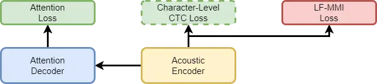
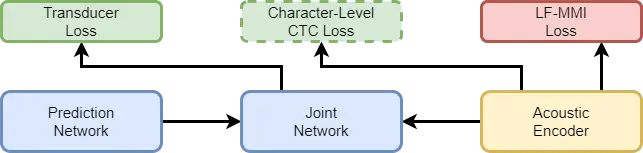
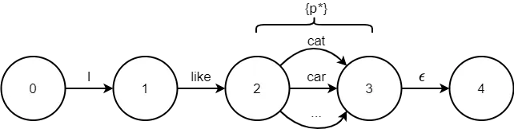
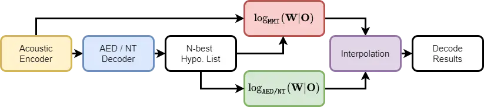

# Consistent training and decoding for End-to-End Speech Recognition using Lattice-Free MMI

Jinchuan Tian ^(†)^(†)thanks: This work is done when Jinchuan Tian is an
intern in Tencent AI lab.    Jianwei Yu ^(†)^(†)thanks: Paper submitted
to ICASSP 2022.    Chao Weng    Shi-Xiong Zhang    Dan Su    Dong Yu   
Yuexian Zou ^(†)^(†)thanks: \* Corresponding author.

###### Abstract

Recently, End-to-End (E2E) frameworks have achieved remarkable results
on various Automatic Speech Recognition (ASR) tasks. However,
Lattice-Free Maximum Mutual Information (LF-MMI), as one of the
discriminative training criteria that show superior performance in
hybrid ASR systems, is rarely adopted in E2E ASR frameworks. In this
work, we propose a novel approach to integrate LF-MMI criterion into E2E
ASR frameworks in both training and decoding stages. The proposed
approach shows its effectiveness on two of the most widely used E2E
frameworks including Attention-Based Encoder-Decoders (AEDs) and Neural
Transducers (NTs). Experiments suggest that the introduction of the
LF-MMI criterion consistently leads to significant performance
improvements on various datasets and different E2E ASR frameworks. The
best of our models achieves competitive CER of 4.1% / 4.4% on Aishell-1
dev/test set; we also achieve significant error reduction on Aishell-2
and Librispeech datasets over strong baselines. Code available¹¹ 1
https://github.com/jctian98/e2e_lfmmi.

###### Index Terms: 

End-to-End Speech Recognition, Discriminative Criteria, Maximum Mutual
Information

^(†)^(†)address: ¹ADSPLAB, School of ECE, Peking University, Shenzhen,
China  
²Tencent AI Lab

## 1 Introduction

In the past few years, the performance of Automatic Speech Recognition
(ASR) systems is greatly advanced due to the prosperity of End-to-End
(E2E) frameworks\[1\]. Currently, Attention-Based Encoder-Decoders
(AEDs)\[2, 3\] and Neural Transducers (NTs)\[4\] are two branches of the
most popular frameworks in E2E ASR. In general practice, training
criteria like Cross-Entropy (CE), Connectionist Temporal Classification
(CTC)\[5\] and Transducer Loss\[4\] are adopted in AEDs and NTs.
However, all of the three criteria try to directly maximize the
posterior of the transcription given acoustic features but ignore other
competitive hypotheses.

Recently, motivated by the success of discriminative training criteria
(e.g., MPE\[6, 7\], sMBR\[6, 7, 8\] and MMI\[6, 7, 9, 10\]) in hybrid
ASR systems, there are several attempts to incorporate them into E2E
frameworks. In \[11, 12, 13, 14\], the word-level Minimum Bayesian Risk
(MBR) criterion is applied to AEDs\[11, 12\] and NTs\[13, 14\] during
system training and achieves competitive recognition performance. In
addition, MMI and MBR criteria \[15, 16\] that are dedicated in
discriminating hypotheses from different speakers are also adopted in
speaker-attributed ASR systems. However, there are still some
deficiencies in current approaches. First, MBR-based methods\[11, 12,
13, 14\] work in a two-stage style: they require a trained model for
initialization and on-the-fly decoding to generate hypotheses for
discrimination, which results in complex working pipeline, low training
efficiency and exceeded memory consumption. Also, current methods for
E2E ASR systems only use discriminative training criterion in the
training process, which results in a mismatch between training and
decoding.

In this work, we propose to integrate LF-MMI into E2E ASR systems,
specifically AEDs and NTs. Unlike the methods aforementioned, the
proposed method works in a one-stage style and adopts the LF-MMI
criterion consistently in both system training and decoding. In the
proposed method, the E2E ASR systems are optimized by both LF-MMI and
other non-discriminative objective functions in training. During
decoding, evidence provided by LF-MMI is consistently used in either
beam search or rescoring. In terms of beam search, MMI Prefix Score is
proposed to evaluate partial hypotheses of AEDs while MMI Alignment
Score is adopted to assess the hypotheses proposed by NTs. In terms of
rescoring, the N-best hypothesis list generated without LF-MMI is
further rescored according to the LF-MMI scores. To verify the
effectiveness of our method, experiments are conducted on both Mandarin
(Aishell-1, Aishell-2) and English (Librispeech) datasets. Our
experiments suggest that adding LF-MMI as an additional criterion in
training can improve the recognition performance. Moreover, decoding
with LF-MMI scores will further improve the performance of these
systems. Among various attempts, the best of our models achieves CER of
4.1% and 4.4% on Aishell-1 dev/test set. To the best of our knowledge,
this is the state-of-the-art result of NT systems on Aishell-1. We also
achieve 0.5% and 0.3% character / word error rate (CER/WER) reduction
absolutely on Aishell-2 test-ios set and Librispeech test-other set
respectively.

To conclude, we propose a novel approach to integrate discriminative
LF-MMI criterion into E2E ASR systems not only in system training but
also in the decoding process. Specifically, three decoding algorithms
are proposed to incorporate LF-MMI scores into both first-pass decoding
and second-pass rescoring for AED and NT frameworks. To the best of our
knowledge, this paper is among the first works to apply LF-MMI criterion
to E2E ASR systems that maintains the consistency between training and
decoding. In contrast, previous works \[11, 12, 13, 14\] only consider
discriminative criteria in training.

## 2 LF-MMI training

In ASR, the MMI criterion is used to discriminate the correct hypothesis
from all hypotheses by maximizing the ratio as follows:

```math
\displaystyle\log P_{\tt{MMI}}(\mathbf{W}|\mathbf{O}) \displaystyle=\log\frac{P(\mathbf{O}|\mathbf{W})P(\mathbf{W})}{\sum_{\mathbf{\bar{W}}}P(\mathbf{O}|\mathbf{\bar{W}})P(\mathbf{\bar{W}})} \tag{1}
```

where $`\mathbf{O}`$, $`\mathbf{W}`$ and $`\bar{\mathbf{W}}`$ represent
the acoustic feature sequence, transcription and any possible hypothesis
respectively. However, directly enumerating $`\bar{\textbf{W}}`$ is
almost impossible in practice. Thus, Lattice-Free MMI\[9, 10\] is
proposed to approximate the numerator and denominator in Eq.1 by
forward-backward algorithm on two Finite-State Acceptors (FSAs). The
log-posterior of $`\mathbf{W}`$ is then converted into the ratio of
likelihood given the graphs and $`\mathbf{O}`$ as follow:

```math
\displaystyle\log P_{\tt{LF-MMI}}(\mathbf{W}|\mathbf{O})\approx\log\frac{P(\mathbf{O}|\mathbb{G}_{num})}{P(\mathbf{O}|\mathbb{G}_{den})} \tag{2}
```

where $`\mathbb{G}_{num}`$ and $`\mathbb{G}_{den}`$ denotes the FSA
numerator graph and denominator graph respectively. Unlike the
lattice-based method, the denominator graph in LF-MMI is built from a
phone-level language model and is identical to all utterances, which
avoids the pre-decoding process before training and could be used from
scratch. The mono-phone modeling units are adopted in this work, as a
large number of modeling units (e.g. Chinese characters, English BPEs)
makes the denominator graph computationally expensive and
memory-consuming.

### 2.1 LF-MMI Training in E2E Systems

As shown in Fig.1, the LF-MMI criterion is used as an auxiliary
criterion to optimize the acoustic encoder in both AED and NT
frameworks. The global training objective to minimize is formulated as:

```math
\mathbf{J}=\left\{\begin{aligned} &(1-\beta)\cdot\mathbf{J}_{\tt{ATT}}+\beta\cdot\mathbf{J}_{\tt{CTC}}\\
&\mathbf{J}_{\tt{NT}}\\
\end{aligned}\right\}-\alpha\cdot\log P_{\tt{MMI}}(\mathbf{W}|\mathbf{O}) \tag{3}
```

where $`\mathbf{J}_{\tt{ATT}}`$, $`\mathbf{J}_{\tt{CTC}}`$ and
$`\mathbf{J}_{\tt{NT}}`$ denote the Attention loss, CTC loss and
Transducer loss respectively. Empirically, the weight of LF-MMI
criterion $`\alpha`$ is set to 0.3 and 0.5 for AEDs and NTs
respectively. As regularization is necessary for LF-MMI\[9\],
Character-Level CTC is found as an ideal regularization and is
optionally adopted with the same weight as LF-MMI criterion during
training.



((a)) Attention-Based Encoder-Decoder (AED)



((b)) Neural Transducer (NT)

Figure 1: Diagram about how LF-MMI criterion is integrated into AEDs and
NTs during training. Character-Level CTC Loss is optional. All losses
are optimized as a weighted sum.

## 3 LF-MMI Decoding

To tightly integrate the training and decoding process, we also
integrate the LF-MMI criterion in the decoding process. In this section,
MMI Prefix Score ($`S^{\tt{pref}}_{\tt{MMI}}`$) and MMI Alignment Score
($`S^{\tt{ali}}_{\tt{MMI}}`$) are proposed to integrate LF-MMI scores
into beam search of AEDs and NTs respectively. To apply our method to
spelling languages like English, A look-ahead strategy is subsequently
provided. In addition, we also propose a rescoring method using LF-MMI.

### 3.1 Beam Search for AEDs

Assume $`\mathbf{H}(\mathbf{W}_{1}^{u})`$ is the set of all possible
hypotheses that start with a partial hypothesis
$`\mathbf{W}_{1}^{u}=[<sos>,w_{1},...,w_{u}]`$. The goal of decoding for
AED systems is to find the most probable hypothesis $`\hat{\mathbf{W}}`$
in $`\mathbf{H}([<sos>])`$ given the acoustic feature sequence
$`\mathbf{O}=[o_{1},...,o_{T}]`$ and $`\mathbf{W}_{1}^{u}=[<sos>]`$.

```math
\hat{\mathbf{W}}=\mathop{\arg\max}_{\mathbf{W}\in\mathbf{H}([<sos>])}P(\mathbf{W}|\mathbf{O}) \tag{4}
```

Normally, this maximize-a-posterior process is approximated by the beam
search. Assume $`\mathbf{\Omega}_{u}`$ is the set of active partial
hypotheses with length $`u`$. Then $`\mathbf{\Omega}_{u}`$ is
recursively generated by expanding each partial hypothesis in
$`\mathbf{\Omega}_{u-1}`$ and pruning those expanded partial hypotheses
with lower scores. This iterative process would terminate once the
stopping condition is met. Typically, we set
$`\mathbf{\Omega}_{0}=\{[<sos>]\}`$ while all hypotheses in any
$`\mathbf{\Omega}_{u}`$ that end with $`<eos>`$ would be moved to a
finished hypothesis set $`\mathbf{\Omega}_{F}`$ for final decision. The
computation of partial scores is the basis of beam search. Partial score
$`\alpha(\mathbf{W}_{1}^{u},\mathbf{O})`$ of a partial hypothesis
$`\mathbf{W}_{1}^{u}`$ is recursively computed as:

```math
\alpha(\mathbf{W}_{1}^{u},\mathbf{O})=\alpha(\mathbf{W}_{1}^{u-1},\mathbf{O})+\log p(w_{u}|\mathbf{W}_{1}^{u-1},\mathbf{O}) \tag{5}
```

where $`\log p(w_{u}|\mathbf{W}_{1}^{u-1},\mathbf{O})`$ is the weighted
sum of different log probabilities possibly delivered by the attention
decoder, the acoustic encoder and the language models. In this work, log
probability distribution provided by LF-MMI, namely
$`\log p_{\tt{MMI}}(w_{u}|\mathbf{W}_{1}^{u-1},\mathbf{O})`$, is
additionally considered as a component of
$`\log p(w_{u}|\mathbf{W}_{1}^{u-1},\mathbf{O})`$.
$`\log p_{\tt{MMI}}(w_{u}|\mathbf{W}_{1}^{u-1},\mathbf{O})`$ can be
derived from the first-order difference of $`S^{\tt{pref}}_{\tt{MMI}}`$:

```math
\log p_{\tt{MMI}}(w_{u}|\mathbf{W}_{1}^{u-1},\mathbf{O})=S^{\tt{pref}}_{\tt{MMI}}(\mathbf{W}_{1}^{u},\mathbf{O})-S^{\tt{pref}}_{\tt{MMI}}(\mathbf{W}_{1}^{u-1},\mathbf{O}) \tag{6}
```

where $`S^{\tt{pref}}_{\tt{MMI}}`$ is defined as the summed probability
of all hypotheses that start with $`\mathbf{W}_{1}^{u}`$. As shown in
Eq.7, for any hypothesis
$`\mathbf{W}\in\mathbf{H}(\mathbf{W}_{1}^{u})`$, we assume the partial
hypothesis $`\mathbf{W}_{1}^{u}`$ is pronounced in first $`t`$ frames
$`\mathbf{O}_{1}^{t}`$ while the complementary part of
$`\mathbf{W}_{1}^{u}`$, namely $`\mathbf{W}_{u+1}^{U}`$, is pronounced
in the remained $`T-t`$ frames $`\mathbf{O}_{t+1}^{T}`$. Additionally,
as $`\mathbf{O}`$ and $`\mathbf{W}`$ are known, $`\mathbf{W}_{u+1}^{U}`$
is independent to $`\mathbf{W}_{1}^{u}`$ while $`\mathbf{O}_{t+1}^{T}`$
is independent to $`\mathbf{O}_{1}^{t}`$. Since each $`t\in[1,T]`$ could
be valid and events with different $`t`$ are exclusive, probabilities
are accumulated along t-axis, and the summed probability over the set
$`\mathbf{H}(\mathbf{W}_{1}^{u})`$ is discarded (it is equal to 1).
Finally, each element
$`P_{\tt{MMI}}(\mathbf{W}_{1}^{u}|\mathbf{O}_{1}^{t})`$ is approximated
by Eq.2, where $`\mathbb{G}_{num}(\mathbf{W}_{1}^{u})`$ is the numerator
graph built from $`\mathbf{W}_{1}^{u}`$.

```math
\displaystyle S^{\tt{pref}}_{\tt{MMI}} \displaystyle(\mathbf{W}_{1}^{u},\mathbf{O})=\log\sum_{\mathbf{W}\in\mathbf{H}(\mathbf{W}_{1}^{u})}P_{\tt{MMI}}(\mathbf{W}|\mathbf{O}) \tag{7}
```

```math
\displaystyle\approx \displaystyle\log\sum_{t=1}^{T}\sum_{\mathbf{W}\in\mathbf{H}(\mathbf{W}_{1}^{u})}P_{\tt{MMI}}(\mathbf{W}_{1}^{u}|\mathbf{O}_{1}^{t})P_{\tt{MMI}}(\mathbf{W}_{u+1}^{U}|\mathbf{O}_{t+1}^{T})
```

```math
\displaystyle= \displaystyle\log\sum_{t=1}^{T}P_{\tt{MMI}}(\mathbf{W}_{1}^{u}|\mathbf{O}_{1}^{t})\sum_{\mathbf{W}\in\mathbf{H}(\mathbf{W}_{1}^{u})}P_{\tt{MMI}}(\mathbf{W}_{u+1}^{U}|\mathbf{O}_{t+1}^{T})
```

```math
\displaystyle= \displaystyle\log\sum_{t=1}^{T}P_{\tt{MMI}}(\mathbf{W}_{1}^{u}|\mathbf{O}_{1}^{t})\approx\log\sum_{t=1}^{T}\frac{P(\mathbf{O}_{1}^{t}|\mathbb{G}_{num}(\mathbf{W}_{1}^{u}))}{P(\mathbf{O}_{1}^{t}|\mathbb{G}_{den})}
```

In Eq.7, the accumulation of probability along the t-axis seems
computationally expensive. However, several properties of it could be
considered to greatly alleviate this problem. First, unlike in the
training stage, only the forward part of the forward-backward algorithm
is needed to calculate all terms in Eq.7. Second, the computation on the
denominator graph is independent to the partial hypothesis
$`\mathbf{W}_{1}^{u}`$, which could be done before the searching process
and reused for any partial hypothesis proposed during beam search.

### 3.2 Beam Search for NTs

For NTs, $`S^{\tt{ali}}_{\tt{MMI}}`$ is proposed to cooperate with the
decoding algorithm ALSD\[17\]. Note tuple
$`{(\textbf{W}_{1}^{u},\delta_{t}(\textbf{W}_{1}^{u}),g_{u})}`$ as a
hypothesis where $`\textbf{W}_{1}^{u}`$ is the output sequence
(including no blank) with length $`u`$,
$`\delta_{t}(\textbf{W}_{1}^{u})`$ is the hypothesis score and $`g_{u}`$
is the decoding state of prediction network. The subscript $`t`$ in
$`\delta_{t}(\textbf{W}_{1}^{u})`$ means the hypothesis is aligned to
first $`t`$ frames $`\textbf{O}_{1}^{t}`$.

As hypotheses in NT decoding suggest explicit alignments, they can be
evaluated by keeping
$`S^{\tt{ali}}_{\tt{MMI}}(\textbf{W}_{1}^{u},\textbf{O}_{1}^{t})=\log P_{\tt{MMI}}(\textbf{W}_{1}^{u}|\textbf{O}_{1}^{t})`$
as a component of $`\delta_{t}(\textbf{W}_{1}^{u})`$ with a predefined
weight $`\beta`$. Thus, once a new hypothesis is proposed (a new token
or blank is added), its score is computed recursively using Eq.8 and
Eq.9. Similar to $`S^{\tt{pref}}_{\tt{MMI}}`$, we implement
$`S^{\tt{ali}}_{\tt{MMI}}`$ by Eq.2 and emphasize the possibility to
reuse the denominator scores during decoding. Note $`S_{\tt{NT}}^{blk}`$
and $`S_{\tt{NT}}^{w_{u+1}}`$ are the posteriors of blank and token
$`w_{u+1}`$ output by NT respectively.

```math
\displaystyle\delta_{t+1}(\textbf{W}_{1}^{u})= \displaystyle\delta_{t}(\textbf{W}_{1}^{u})+S_{\tt{NT}}^{blk}(t,u) \tag{8}
```

```math
\displaystyle+\beta*(S^{\tt{ali}}_{\tt{MMI}}(\textbf{W}_{1}^{u},\textbf{O}_{1}^{t+1})-S^{\tt{ali}}_{\tt{MMI}}(\textbf{W}_{1}^{u},\textbf{O}_{1}^{t}))
```

```math
\displaystyle\delta_{t}(\textbf{W}_{1}^{u+1})= \displaystyle\delta_{t}(\textbf{W}_{1}^{u})+S_{\tt{NT}}^{w_{u+1}}(t,u) \tag{9}
```

```math
\displaystyle+\beta*(S^{\tt{ali}}_{\tt{MMI}}(\textbf{W}_{1}^{u+1},\textbf{O}_{1}^{t})-S^{\tt{ali}}_{\tt{MMI}}(\textbf{W}_{1}^{u},\textbf{O}_{1}^{t}))
```

In each step when all proposed hypotheses are evaluated, scores of
hypotheses that have identical $`\textbf{W}_{1}^{u}`$ but different
alignment paths should be merged. But $`S^{\tt{ali}}_{\tt{MMI}}`$ should
not participate in this process, since $`S^{\tt{ali}}_{\tt{MMI}}`$
directly assesses the validness of the aligned sequence pair
$`(\textbf{W}_{1}^{u},\textbf{O}_{1}^{t})`$ and is the summed posterior
of all alignment paths.

### 3.3 Look-ahead Decoding Strategy

A presumption of $`S^{\tt{pref}}_{\tt{MMI}}`$ and
$`S^{\tt{ali}}_{\tt{MMI}}`$ is that the numerator graph could be
composed for any partial hypothesis $`\textbf{W}_{1}^{u}`$. This is
correct for languages like Mandarin since every proposed character from
the neural decoder is also in the lexicon. However, it is incorrect for
spelling languages like English, as a prefix of an English word is not
always in the lexicon. E.g., speec, as a prefix of word speech, is not
in the lexicon and the numerator graph cannot be compiled for it easily.

Inspired by \[18\], we tackle this problem by computing a look-ahead
score. For any partial hypothesis, we split it into two parts: word
context $`c`$, which is the sequence of complete words in the front of
the partial hypothesis, and prefix $`p`$, which is a prefix of a word at
the end of the hypothesis. We denote each partial hypothesis as
$`\mathbf{W}_{1}^{u}=c\oplus p`$. Thus, any log posterior
$`\log P_{\tt{MMI}}(\textbf{W}_{1}^{u}|\textbf{O}_{1}^{t})`$ of this
partial hypothesis is formulated as below:

```math
\log P_{\tt{MMI}}(\textbf{W}_{1}^{u}|\textbf{O}_{1}^{t})=\log\sum_{w\in\left\{p*\right\}}P_{\tt{MMI}}(c\oplus w|\mathbf{O}_{1}^{t}) \tag{10}
```

where $`\left\{p*\right\}`$ indicates the set of all words in the
lexicon that start with $`p`$. A special case is that the partial
hypothesis consists of all complete words: $`S^{\tt{pref}}_{\tt{MMI}}`$
and $`S^{\tt{ali}}_{\tt{MMI}}`$ are computed like $`p`$ is the last
complete word and $`|\left\{p*\right\}|=1`$.

It seems that the summation in Eq. 10 leads to heavy computation.
However, all possible words $`w\in\{p*\}`$ could be converted into
parallel arcs in a word FSA before compiling the numerator graph. E.g.,
a partial hypothesis ’I like ca’ could be converted into a word FSA like
in Fig 2, where the word context is arranged linearly while elements in
$`\left\{p*\right\}`$ are converted into parallel arcs in the tail. This
FSA is then composed with phone language model and HMM topology\[10\] to
derive the numerator graph for the forward computation.



Figure 2: Word FSA of partial hypothesis ’I like ca’. Word context
$`c=`$’I like’ (arc 0$`\rightarrow`$1, 1$`\rightarrow`$2) Prefix
$`p=`$’ca’ (arcs 2$`\rightarrow`$3). set $`\left\{p*\right\}`$ contains
all words start with $`p`$ in the lexicon

### 3.4 MMI Rescoring

We further propose a unified rescoring method called MMI Rescoring for
both AEDs and NTs that are optimized with the LF-MMI criterion. Compared
with using $`S^{\tt{pref}}_{\tt{MMI}}`$ and $`S^{\tt{ali}}_{\tt{MMI}}`$
in beam search, rescoring method is more computationally efficient.

Assume the AED or NT system has been optimized by LF-MMI criterion
before decoding. As illustrated in Fig.3, the N-best hypothesis list is
firstly generated by beam search without LF-MMI criterion. Along this
process, the log posterior of each hypothesis W, namely
$`\log P_{\tt{AED/NT}}(\mathbf{W}|\mathbf{O})`$, is also calculated.
Next, another log posterior for each hypothesis in the N-best hypothesis
list, $`\log P_{\tt{MMI}}(\mathbf{W}|\mathbf{O})`$, is computed
according to the LF-MMI criterion. Finally, the interpolation of the two
log posteriors are calculated as follows:

```math
\displaystyle\log P(\mathbf{W}|\mathbf{O})= \displaystyle\lambda\cdot\log P_{\tt{AED/NT}}(\mathbf{W}|\mathbf{O}) \tag{11}
```

```math
\displaystyle+(1-\lambda)\cdot\log P_{\tt{MMI}}(\mathbf{W}|\mathbf{O})
```

where $`\lambda`$ is the weight of MMI Rescoring. As LF-MMI criterion is
applied to the acoustic encoder, MMI Rescoring could better emphasize
the validness of hypotheses from the perspective of acoustics.



Figure 3: Diagram for MMI Rescoring. Interpolation from original
posteriors and MMI posteriors are used for the final decision.

Moreover, since the denominator score $`P(\mathbf{O}|\mathbb{G}_{den})`$
is independent to the hypotheses, it could be considered as a constant
for different hypotheses of a given utterance. Thus, only the numerator
score needs to be calculated during MMI Rescoring:

```math
\log P_{\tt{MMI}}(\mathbf{W}|\mathbf{O})=\log P(\mathbf{O}|\mathbb{G}_{num})-const \tag{12}
```

## 4 Experimental Results

### 4.1 Experimental Setup

Datasets. We evaluate our method on Aishell-1 (178 hours, Mandarin),
Aishell-2 (1000 hours, Mandarin) and Librispeech (960 hours, English)
datasets. The modeling units for Mandarin and English are Chinese
characters and BPE subwords respectively.

Models and Optimization. We adopt similar model architectures for
experiments on all datasets. For AEDs, a Conformer encoder and a
Transformer decoder (46M parameters) are used; while NTs consist of a
Conformer encoder, an LSTM prediction network and an MLP joint network
(89M parameters). All models are optimized by Noam\[19\] optimizer using
8 GPUs. We also adopt SpecAugment\[20\] during training and average 10
checkpoints before evaluation. All experiments are implemented by
Espnet\[21\] and mainly follow the official settings²² 2
https://github.com/espnet/espnet/blob/master/egs/aishell/asr1/conf.

Criteria. We emphasize that our LF-MMI criterion adopts phone-level
information so it is not fully End-to-End. All lexicons are from
standard Kaldi recipes. The order of the phone language model used in
the compilation of numerator and denominator graphs is 2. The HMM
topology in our LF-MMI is the same as the CTC HMM topology in \[10\].
Besides, we implement phone-level CTC with the same HMM topology and
lexicon for comparison. Both LF-MMI and phone-level CTC are implemented
with k2³³ 3 https://github.com/k2-fsa/k2. We also implement MBR training
for NTs\[13\] with its original settings.

Decoding. The beam size in all experiments is 10. Weights of MMI Prefix
Score, MMI Alignment Score and MMI Rescoring are 0.3, 0.2, and 0.2
respectively.

### 4.2 Experimental Results

We firstly present our results on Aishell-1 to provide a deep insight
into our method. The effectiveness of the proposed method is further
verified on two larger corpus (Aishell-2 and Librispeech).

#### 4.2.1 Results of Aishell-1

|                                         |                                                                                                                                                                              |       |           |      |
| --------------------------------------- | ---------------------------------------------------------------------------------------------------------------------------------------------------------------------------- | ----- | --------- | ---- |
| No.                                     | System                                                                                                                                                                       | Phone | Aishell-1 |      |
|                                         |                                                                                                                                                                              | Info. | dev       | test |
| Literature                              |                                                                                                                                                                              |       |           |      |
|                                         | Atten. \[22\]                                                                                                                                                                | ✗     | 7.5       | 9.3  |
|                                         | Atten. + Char. CTC \[21\]                                                                                                                                                    | ✗     | 4.7       | 5.2  |
|                                         | Transd. \[21\]                                                                                                                                                               | ✗     | 4.3       | 4.8  |
|                                         | Non-Autoregressive Transformer\[23\]                                                                                                                                         | ✗     | 5.6       | 6.3  |
|                                         | Chain (snowfall)                                                                                                                                                             | ✓     | -         | 6.3  |
| Attention-Based Encoder-Decoders (AEDs) |                                                                                                                                                                              |       |           |      |
| 1                                       | Atten. + Char. CTC\[3\]                                                                                                                                                      | ✗     | 4.7       | 5.2  |
| 2                                       | Atten. + LF-MMI Training⁴⁴ 4 Like \[3\], decoding with only attention decoder cannot determine the ends of sentences accurately and results in unacceptable deletion errors. | ✓     | -         | -    |
| 3                                       | + MMI Prefix Score Decoding                                                                                                                                                  | ✓     | 4.6       | 5.2  |
| 4                                       | Atten. + Char. CTC + Ph. CTC Training                                                                                                                                        | ✓     | 4.6       | 5.1  |
| 5                                       | Atten. + Char. CTC + LF-MMI Training                                                                                                                                         | ✓     | 4.5       | 5.0  |
| 6                                       | + MMI Prefix Score Decoding                                                                                                                                                  | ✓     | 4.5       | 5.0  |
| 7                                       | + MMI Rescoring                                                                                                                                                              | ✓     | 4.5       | 4.9  |
| Neural Transducers (NTs)                |                                                                                                                                                                              |       |           |      |
| 8                                       | Transd.                                                                                                                                                                      | ✗     | 4.4       | 4.8  |
| 9                                       | Transd. + Ph. CTC Training                                                                                                                                                   | ✓     | 4.8       | 5.2  |
| 10                                      | Transd. + MBR Training\[13\]                                                                                                                                                 | ✗     | 4.7       | 5.1  |
| 11                                      | Transd. + LF-MMI Training                                                                                                                                                    | ✓     | 4.4       | 4.9  |
| 12                                      | + MMI Alignment Score Decoding                                                                                                                                               | ✓     | 4.3       | 4.7  |
| 13                                      | + MMI Rescoring                                                                                                                                                              | ✓     | 4.3       | 4.8  |
| 14                                      | Transd. + Char. CTC                                                                                                                                                          | ✗     | 4.9       | 5.0  |
| 15                                      | Transd. + Char. CTC + Ph. CTC Training                                                                                                                                       | ✓     | 4.6       | 5.0  |
| 16                                      | Transd. + Char. CTC + MBR Training\[13\]                                                                                                                                     | ✗     | 4.7       | 5.2  |
| 17                                      | Transd. + Char. CTC + LF-MMI Training                                                                                                                                        | ✓     | 4.3       | 4.6  |
| 18                                      | + MMI Alignment Score Decoding                                                                                                                                               | ✓     | 4.2       | 4.5  |
| 19                                      |    + 4-gram Language Model Decoding                                                                                                                                          | ✓     | 4.1       | 4.4  |
| 20                                      | + MMI Rescoring                                                                                                                                                              | ✓     | 4.2       | 4.5  |
| 21                                      |    + 4-gram Language Model Decoding                                                                                                                                          | ✓     | 4.1       | 4.5  |

Table 1: Experimental results on Aishell-1 dataset (CER%)

Table 1 shows the experimental results of the proposed method on
Aishell-1 corpus. Several trends can be observed. First, we adopt
standard attention + character-level CTC and neural transducer as the
baselines of AEDs (exp.1) and NTs (exp.8). Second, we claim that taking
LF-MMI as an auxiliary criterion in training is beneficial if
character-level CTC is used for regularization. Training with LF-MMI but
without character-level CTC does not lead to a noticeable benefit
(exp.2,3,11). However, with character-level CTC regularization, our
training strategy pushes the baselines from 5.2% to 5.0% for AED (exp.5)
and from 4.8% for 4.6% for NT (exp.17). Third, given the models trained
with LF-MMI criterion (exp.5, 17), decoding with LF-MMI evidence in
either beam search or rescoring can further improve the performance
(exp.7, 18, 20), which emphasizes the necessity of the consistency
between training and decoding. Fourth, with a 4-gram character-level
language model trained from the transcriptions, our model achieves the
CER of 4.1% and 4.4% (exp.19, 21). To the best of knowledge, this is the
state-of-the-art result of NT systems on Aishell-1. Fifth, with
identical HMM topology and lexicon, models trained with phone-level CTC
(exp.4, 9, 15) are consistently worse than their LF-MMI counterparts
(exp.5, 11, 17) or even show degradation compared with baselines
(exp.9), which verifies that the effectiveness of our training strategy
should be attributed to discriminative training rather than extra
phone-level information. Finally, we also compare our method (exp.11, 17) with the character-level MBR criterion in NTs (exp.10, 16) but find
that the MBR criterion does not achieve improvement. One possible
explanation is that: the majority of the hypotheses proposed by the
trained transducers are correct (the training corpus is well-fitted),
which means the Bayesian Risk is equal to 0 and error signals provided
by MBR are absent in most updates. In comparison, our method eschews the
on-the-fly decoding process and provides error signals in every training
step.

#### 4.2.2 Results of Aishell-2 and Librispeech

Due to the space limitation, we only report the NT results on Aishell-2
and AED results on Librispeech in table 2 and table 3 respectively.  
Aishell-2. As shown in table 2, the trends of NT framework on Aishell-2
are similar to those of Aishell-1: (1) character-level CTC is still
necessary for regularization (exp.2 vs. exp.5); (2) LF-MMI criterion is
beneficial in training: up to 0.5% absolute CER reduction is observed on
test-ios set (exp.1 vs. exp.5); (3) our decoding methods also achieve
considerable improvement especially on test-mic set (exp.5 vs. exp.6,
7).  
Librispeech. As in table 3, our method is still beneficial during
training. Adding LF-MMI as an auxiliary training criterion advances the
WER of dev-clean and test-other datasets by 9.5% and 5.6% relatively
while keeps other results unchanged (exp.1 vs. exp.4). In the decoding
stage, however, degradation is observed in exp.3 and exp.6. We find that
the MMI Prefix Score can hardly differentiate the repetitive tokens due
to the time-axis probability accumulation in Eq.7, for which many
deletion errors are observed in long and repetitive utterances. Since
utterances in the two Mandarin datasets are comparatively shorter than
those in Librispeech, this is rarely observed in those experiments. We
leave this problem for future work.

|     |                                       |                   |         |     |
| --- | ------------------------------------- | ----------------- | ------- | --- |
| No. | System                                | Aishell-2-1000hrs |         |     |
|     |                                       | ios               | android | mic |
| 1   | Transd.                               | 5.9               | 6.7     | 6.5 |
| 2   | Transd. + LF-MMI Training             | 5.8               | 7.0     | 6.5 |
| 3   | + MMI Alignment Score Decoding        | 5.7               | 7.0     | 6.5 |
| 4   | + MMI Rescoring                       | 5.7               | 6.9     | 6.5 |
| 5   | Transd. + Char. CTC + LF-MMI Training | 5.4               | 6.6     | 6.5 |
| 6   | + MMI Alignment Score Decoding        | 5.4               | 6.5     | 6.3 |
| 7   | + MMI Rescoring                       | 5.4               | 6.6     | 6.4 |

Table 2: Neural Transducer results on Aishell-2 dataset (CER%)

| No. | System                                    | Librispeech-960hrs |     |     |     |
| --- | ----------------------------------------- | ------------------ | --- | --- | --- |
|     |                                           | d-c                | d-o | t-c | t-o |
| 1   | Atten. + Char. CTC\[3\]                   | 2.1                | 5.0 | 2.2 | 5.3 |
| 2   | Atten. + LF-MMI Training⁴⁴footnotemark: 4 | -                  | -   | -   | -   |
| 3   | + MMI Prefix Score Decoding               | 2.2                | 5.4 | 2.6 | 5.4 |
| 4   | Atten. + Char. CTC + LF-MMI Training      | 1.9                | 5.0 | 2.2 | 5.0 |
| 5   | + MMI Prefix Score Decoding               | 2.1                | 5.4 | 2.6 | 5.5 |
| 6   | + MMI Rescoring                           | 1.9                | 5.0 | 2.2 | 5.1 |

Table 3: Attention-Based Encoder-Decoders results on Librispeech dataset
(WER%)

## 5 Conclusion

This work is among the first works that integrate the LF-MMI criterion
into End-to-End ASR frameworks. Unlike previous works, the proposed
method consistently use LF-MMI criterion in both system training and
decoding stages. In addition, the proposed method is compatible with
both Attention-Based Encoder-Decoders and Neural Transducers.
Experimental results suggest that our method achieves superior
performance on three widely used ASR datasets.

This paper was partially supported by the Shenzhen Science & Technology
Fundamental Research Programs (No: JCYJ20180507182908274 &
JSGG20191129105421211) and GXWD20201231165807007-20200814115301001.

## References

- \[1\] Dong Wang, Xiaodong Wang, and Shaohe Lv, “An overview of
  end-to-end automatic speech recognition,” Symmetry, vol. 11, no. 8,
  pp. 1018, 2019.
- \[2\] William Chan, Navdeep Jaitly, Quoc Le, and Oriol Vinyals,
  “Listen, attend and spell: A neural network for large vocabulary
  conversational speech recognition,” in 2016 IEEE International
  Conference on Acoustics, Speech and Signal Processing (ICASSP), 2016,
  pp. 4960–4964.
- \[3\] Shinji Watanabe, Takaaki Hori, Suyoun Kim, John R Hershey, and
  Tomoki Hayashi, “Hybrid ctc/attention architecture for end-to-end
  speech recognition,” IEEE Journal of Selected Topics in Signal
  Processing, vol. 11, no. 8, pp. 1240–1253, 2017.
- \[4\] Alex Graves, “Sequence transduction with recurrent neural
  networks,” arXiv preprint arXiv:1211.3711, 2012.
- \[5\] Alex Graves, Santiago Fernández, Faustino Gomez, and Jürgen
  Schmidhuber, “Connectionist temporal classification: labelling
  unsegmented sequence data with recurrent neural networks,” in
  Proceedings of the 23rd international conference on Machine learning,
  2006, pp. 369–376.
- \[6\] Karel Veselỳ, Arnab Ghoshal, Lukás Burget, and Daniel Povey,
  “Sequence-discriminative training of deep neural networks.,” in
  Interspeech, 2013, vol. 2013, pp. 2345–2349.
- \[7\] Daniel Povey, Discriminative training for large vocabulary
  speech recognition, Ph.D. thesis, University of Cambridge, 2005.
- \[8\] Brian Kingsbury, “Lattice-based optimization of sequence
  classification criteria for neural-network acoustic modeling,” in 2009
  IEEE International Conference on Acoustics, Speech and Signal
  Processing, 2009, pp. 3761–3764.
- \[9\] Daniel Povey, Vijayaditya Peddinti, Daniel Galvez, Pegah
  Ghahremani, Vimal Manohar, Xingyu Na, Yiming Wang, and Sanjeev
  Khudanpur, “Purely sequence-trained neural networks for asr based on
  lattice-free mmi,” in Interspeech 2016, 2016, pp. 2751–2755.
- \[10\] Hossein Hadian, Hossein Sameti, Daniel Povey, and Sanjeev
  Khudanpur, “End-to-end speech recognition using lattice-free mmi,” in
  Proc. Interspeech 2018, 2018, pp. 12–16.
- \[11\] Rohit Prabhavalkar, Tara N. Sainath, Yonghui Wu, Patrick
  Nguyen, Zhifeng Chen, Chung-Cheng Chiu, and Anjuli Kannan, “Minimum
  word error rate training for attention-based sequence-to-sequence
  models,” in 2018 IEEE International Conference on Acoustics, Speech
  and Signal Processing (ICASSP), 2018, pp. 4839–4843.
- \[12\] Chao Weng, Jia Cui, Guangsen Wang, Jun Wang, Chengzhu Yu, Dan
  Su, and Dong Yu, “Improving attention based sequence-to-sequence
  models for end-to-end english conversational speech recognition.,” in
  Interspeech, 2018, pp. 761–765.
- \[13\] Chao Weng, Chengzhu Yu, Jia Cui, Chunlei Zhang, and Dong Yu,
  “Minimum bayes risk training of rnn-transducer for end-to-end speech
  recognition,” in Proc. Interspeech 2020, 2019.
- \[14\] Jinxi Guo, Gautam Tiwari, Jasha Droppo, Maarten Van Segbroeck,
  Che-Wei Huang, and Stolcke, “Efficient minimum word error rate
  training of rnn-transducer for end-to-end speech recognition,” in
  Proc. Interspeech 2020, 2020.
- \[15\] Naoyuki Kanda, Yashesh Gaur, Xiaofei Wang, Zhong Meng, Zhuo
  Chen, Tianyan Zhou, and Takuya Yoshioka, “Joint speaker counting,
  speech recognition, and speaker identification for overlapped speech
  of any number of speakers,” in Proc. Interspeech 2020, 2020.
- \[16\] Naoyuki Kanda, Zhong Meng, Liang Lu, Yashesh Gaur, Xiaofei
  Wang, Zhuo Chen, and Takuya Yoshioka, “Minimum bayes risk training for
  end-to-end speaker-attributed asr,” in ICASSP 2021 - 2021 IEEE
  International Conference on Acoustics, Speech and Signal Processing
  (ICASSP), 2021, pp. 6503–6507.
- \[17\] George Saon, Zoltán Tüske, and Kartik Audhkhasi,
  “Alignment-length synchronous decoding for rnn transducer,” in ICASSP
  2020 - 2020 IEEE International Conference on Acoustics, Speech and
  Signal Processing (ICASSP), 2020, pp. 7804–7808.
- \[18\] Takaaki Hori, Jaejin Cho, and Shinji Watanabe, “End-to-end
  speech recognition with word-based rnn language models,” in 2018 IEEE
  Spoken Language Technology Workshop (SLT). IEEE, 2018, pp. 389–396.
- \[19\] Ashish Vaswani, Noam Shazeer, Niki Parmar, Jakob Uszkoreit,
  Llion Jones, Aidan N Gomez, Lukasz Kaiser, and Illia Polosukhin,
  “Attention is all you need,” in Advances in neural information
  processing systems, 2017, pp. 5998–6008.
- \[20\] Daniel S. Park, William Chan, Yu Zhang, Chung-Cheng Chiu,
  Barret Zoph, Ekin D. Cubuk, and Quoc V. Le, “Specaugment: A simple
  data augmentation method for automatic speech recognition,”
  Interspeech 2019, Sep 2019.
- \[21\] Shinji Watanabe, Takaaki Hori, Shigeki Karita, Tomoki Hayashi,
  Jiro Nishitoba, Yuya Unno, Nelson Enrique Yalta Soplin, Jahn Heymann,
  Matthew Wiesner, Nanxin Chen, Adithya Renduchintala, and Tsubasa
  Ochiai, “ESPnet: End-to-end speech processing toolkit,” in Proceedings
  of Interspeech, 2018, pp. 2207–2211.
- \[22\] Baiji Liu, Songjun Cao, Sining Sun, Weibin Zhang, and Long Ma,
  “Multi-head monotonic chunkwise attention for online speech
  recognition,” arXiv preprint arXiv:2005.00205, 2020.
- \[23\] Xingchen Song, Zhiyong Wu, Yiheng Huang, Chao Weng, Dan Su, and
  Helen Meng, “Non-autoregressive transformer asr with ctc-enhanced
  decoder input,” in ICASSP 2021-2021 IEEE International Conference on
  Acoustics, Speech and Signal Processing (ICASSP). IEEE, 2021, pp.
  5894–5898.
