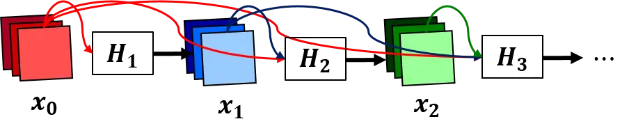
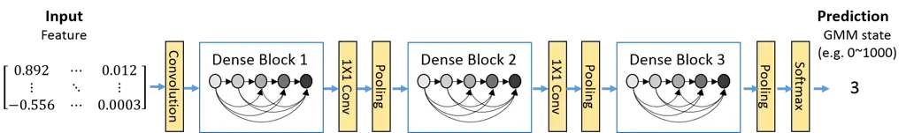
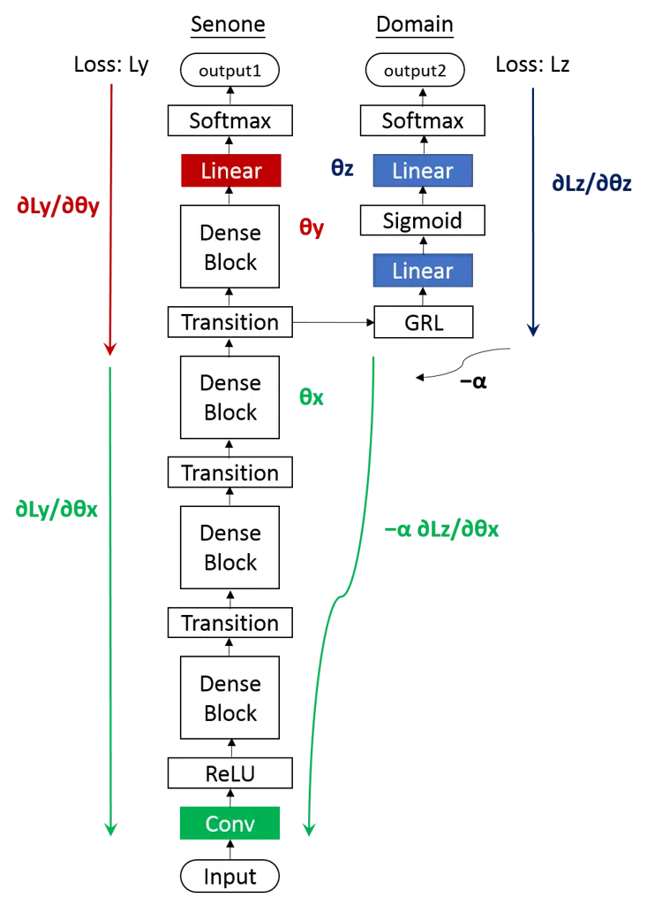
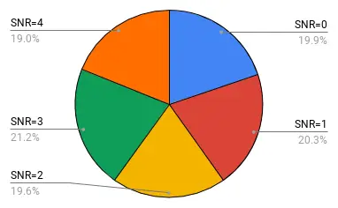
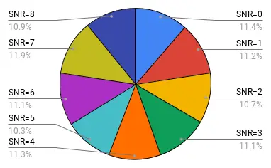
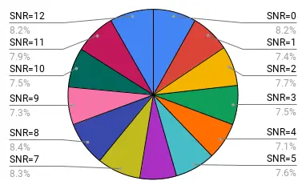
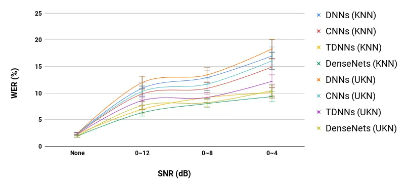

# Investigation of Densely Connected Convolutional Networks with Domain Adversarial Learning for Noise Robust Speech Recognition

Chia Yu Li    Ngoc Thang Vu

###### Abstract

We investigate densely connected convolutional networkss (DenseNetss)
and their extension with domain adversarial training for noise robust
speech recognition. DenseNetss are very deep, compact convolutional
neural networks which have demonstrated incredible improvements over the
state-of-the-art results in computer vision. Our experimental results
reveal that DenseNetss are more robust against noise than other neural
network based models such as deep feed forward neural networks and
convolutional neural networks. Moreover, domain adversarial learning can
further improve the robustness of DenseNets against both, known and
unknown noise conditions.

## 1 Introduction

In the last years, automatic speech recognition (ASR) performance has
been significantly improved through the use of neural networks with deep
structures \[1, 2, 3\]. Various neural network architectures have been
developed to improve ASR performance. They are variations of time delay
neural networkss (TDNNss) \[4\], convolutional neural networkss (CNNss)
\[5\] recurrent neural networkss (RNNss) \[6\], and their combinations
\[7\]. Among them, very deep CNNss demonstrate impressive performance
\[8, 9, 10\] especially in noisy conditions \[8\].

Recently in the computer vision research community, densely connected
convolutional networks (DenseNets) have obtained significant
improvements over the state-of-the-art networks on four highly
competitive object recognition benchmark tasks \[11\]. The idea is to
introduce shorter connections between layers close to the input and
those close to the output which alleviate the vanishing-gradient
problem. Furthermore, DenseNetss require fewer parameters than
traditional CNNss with the same deep structure \[11\]. In \[12\], we
showed that DenseNetss can be used for acoustic modeling achieving
impressive performance.

In this paper, we explore noise robustness of DenseNetss and their
extension with domain adversarial learning. This method was originally
proposed by Ganin et al. \[13\] for unsupervised domain adaptation in
natural language processing and was then applied to deep feed forward
neural networks (DNNs) for noise robust speech recognition \[14, 15\].
However to the best of our knowledge, domain adversarial learning has
never been examined with a complex network like DenseNetss before. Our
experimental results on noisy data demonstrate that DenseNetss can
effectively improve the noise robustness of the system outperforming
other neural based models. Using domain adversarial learning can further
improve their robustness against both, known and unknown noise
conditions.

## 2 Methods

### 2.1 DenseNetss Acoustic Models

In this subsection, we first describe DenseNetss and review the method
how to use DenseNetss for acoustic modeling \[12\]. The key idea of
DenseNetss is the introduction of shorter connections between layers
close to the input and those close to the output which alleviate the
vanishing-gradient problem. For acoustic modeling, DenseNetss take the
unadapted features 40-dimensional log Mel filterbank as input and
predict the context dependent HMM states (senones) \[12\].

Given an input $`x_{0}`$ and a CNN with $`N`$ layers, where each layer
$`n`$ is equipped with a nonlinear transformation $`H_{n}(\cdot)`$ which
is the composition of three consecutive operations: batch normalization,
followed by a ReLU and a $`3\times 3`$ convolution, DenseNetss introduce
direct connections from any layer to all subsequent layers. The output
of $`n^{th}`$ layer is:

```math
x_{n}=H_{n}([x_{0},x_{1},x_{2},...,x_{n-1}]) \tag{1}
```

where $`[x_{0},x_{1},x_{2},...,x_{n-1}]`$ refers to the concatenation of
the feature maps yielded in all the previous layers. Fig. 1 illustrates
the dense connectivity structure, in which each layer takes all
preceding feature-maps as input. This structure is called dense block.



Figure 1: A 3-layer dense block, in which each layer takes all preceding
feature-maps as input

DenseNetss consist of multiple dense blocks, connected in series and
separated by transition layers. Each transition layer consists of a
$`1\times 1`$ convolution layer and a $`2\times 2`$ average pooling
layer. Fig. 2 illustrates how these dense blocks and transition layers
are composed in DenseNetss. Note that pooling is only performed outside
of dense blocks.



Figure 2: A DenseNet architecture with three dense blocks connected via
transition layers

Furthermore, DenseNetss reduce the number of feature-maps by
$`1\times 1`$ convolution layer in the transition layer to improve model
compactness. For example, if a dense block has $`y`$ feature-maps, the
transition layer generates $`\lfloor\theta y\rfloor`$ output
feature-maps, where $`\theta`$ is the compression factor and the range
is $`0<`$ $`\theta`$ $`\leq 1`$. The growth rate of DenseNetss is the
number of channels in their convolution layers. By equation (1), the
$`n^{th}`$ layer within a dense block has $`k\times(n-1)+k_{0}`$ input
feature-maps, where $`k_{0}`$ is the number of input channels and $`k`$
(the model’s growth rate) is the number of channels for subsequent
convolution layers. DenseNetss have better performance when $`k`$ is a
small integer, e.g. $`k=12`$ \[11\].

### 2.2 Domain Adversarial Learning

In this subsection, we introduce the extension of DenseNetss with domain
adversarial learning \[13\]. In this context, noisy conditions act as
domain information.

The overall architecture of the domain adversarial learning of
DenseNetss is shown in Fig 3. It consists three sub-networks: the
sub-network ($`y`$) is for senone classification, the sub-network
($`z`$) is for domain classification and the share-network ($`x`$) is
the share part of the two tasks. The shared-network ($`x`$) can be seen
as a feature extractor to convert an input vector to its latent
representation. Each output sub-network acts as a classifier to
calculate posterior probabilities of classes given the this latent
representation \[14, 15\]. In the domain adversarial learning, the
representation is learned adversarially to the domain classification and
friendly to the senone classification, so that domain-dependent
information to the senone classifier is removed from the representation.



Figure 3: An architecture of DenseNets with domain adversarial learning
which consists of there sub-networks: features extractor sub-network
(x), senone classification sub-network (y) and domain classification
sub-network (z)

Let $`\theta_{x},\theta_{y},\theta_{z}`$ denote the parameters of the
share-network (x), sub-network (y) and sub-network (z), respectively.
The cross-entropy loss functions for the senone classifier and domain
classifier are defined as

```math
\mathcal{L}_{y}(\theta_{x},\theta_{y})=-\sum_{i}logP(y_{i}|x_{i};\theta_{x},\theta_{y}) \tag{2}
```

```math
\mathcal{L}_{z}(\theta_{x},\theta_{z})=-\sum_{i}logP(z_{i}|x_{i};\theta_{x},\theta_{z}) \tag{3}
```

The parameters are updated as

```math
\theta_{y}\leftarrow\theta_{y}-\epsilon\dfrac{\partial\mathcal{L}_{y}}{\partial\theta_{y}} \tag{4}
```

```math
\theta_{z}\leftarrow\theta_{z}-\epsilon\dfrac{\partial\mathcal{L}_{z}}{\partial\theta_{z}} \tag{5}
```

```math
\theta_{x}\leftarrow\theta_{x}-\epsilon(\dfrac{\partial\mathcal{L}_{y}}{\partial\theta_{x}}-\lambda\dfrac{\partial\mathcal{L}_{z}}{\partial\theta_{x}}) \tag{6}
```

where $`\lambda`$ is the gradient reversal coefficient which is a
positive scalar parameter to adjust the strength of the regularization.

The first layer of the sub-network ($`z`$) is the gradient reversal
layer (GRL) as proposed in \[14\]. In the forward propagation phase, the
GRL just passes the input to the output as follows:

```math
\xi_{out}\leftarrow\xi_{in} \tag{7}
```

where $`\xi_{in}`$ and $`\xi_{out}`$ represent input and output vectors
of the layer, respectively. In the backward propagation phase, the GRL
reverses the gradient by multipling it with $`\lambda`$ as follows:

```math
\dfrac{\partial\mathcal{L}}{\partial\xi^{in}}\leftarrow-\lambda\dfrac{\partial\mathcal{L}}{\partial\xi^{out}} \tag{8}
```

Hence the shared-network (x) is trained adversarially to the sub-network
(y) for the domain classification. When the training is finished, the
output of the entire network (x, y) for the senone classification is
used for decoding.

## 3 Setup

Two experiments are conducted in this paper. The goal for the first
experiment is to explore DenseNetss’ robustness at different levels of
noise. We compare the baseline models, which are deep neural networkss
(DNNss), CNNss and TDNNss, and DenseNetss on noise corrupted DARPA
1000-words English language Resource Managemens (RMs). The second
experiment examines the effectiveness of domain adversarial learning, in
which we compare the performance of DenseNetss, DenseNets-AD and the
best baseline model TDNNss on noise corrupted RMs and Aurora 4 Tasks
(Aurora4s).

### 3.1 Resources

#### Data

The noise corrupted RMs is made by artificially adding different types
of noise at different values of SNR ¹¹ 1 Signal-to-Noise ratio (SNR) is
defined as the ratio of the power of a signal to the power of noise
($`\frac{P_{signal}}{P_{noise}}`$) to RMs \[16\] using the large-scale
open-source acoustic simulator developed in \[17\]. It contains 1,993
noisy conditions: 1,500 are used for training and 493 for testing. We
created three noise corrupted data sets with different SNRs: Data-1 (SNR
from 0 to 4), Data-2 (SNR from 0 to 8) and Data-3 (SNR from 0 to 12).
Figure 4 shows the data distribution of Data-1, Data-2 and Data-3. For
example, 19.9% utterances in Data-1 are adding noise (randomly chosen)
at SNR=0, 20.3% of them are at SNR=1, 19.6% of them are at SNR=2, 21.2%
of them are at SNR=3 and 19% of them are at SNR=4. Two noise corrupted
test sets are used in this paper. In the "known-noise test set" (KNN),
the noise is randomly picked from 1,500 training noise and added to the
utterance at the same range of SNR used in the training set. On the
contrary in the "unknown-noise test set" (UKN), the noise is selected
from 493 testing noises and added to the utterance.







Figure 4: The data composition of Data-1, Data-2 and Data-3 from left to
right.

The Aurora 4 task, which is a medium vocabulary task speech recognition
task, is based on the Wall Street Journal (WSJ0) dataset \[18\]. It
contains 16 kHz speech data in the presence of six additive noises (car,
crowd of people, restaurant, street, airport and train station) with
linear convolutional channel distortions. The multi-condition training
set with 7138 utterances from 83 speakers includes a combination of
clean utterance and utterance corrupted by one of six different noises
at 10-20 dB SNR. 3,569 utterances are from the primary Sennheiser
micro-phone and 3,569 utterances are from the secondary microphone. The
test data is made using the same types of noise and microphones, and
these can be classified into five test-conditions: clean, noisy, clean
with channel distortion, noisy with channel distortion, and all of them
which will be referred to as A, B, C, D and Average respectively.

#### Baseline systems

The baseline models in our experiments are DNNss, CNNss and TDNNss.
DNNss take the 40-dimensional log Mel filterbank features as input and
contain six hidden layers with sigmoid activation functions and one
fully-connected output layer with a softmax activation. Each hidden
layer has 1024 units. CNNss are composed of two convolution layers and
max-pooling layers, and four affine layers with sigmoid activation
function. Each affine layer contains 1024 units and is trained using
40-dimensional log Mel filterbank features with the first and the second
time derivatives. Both DNNss and CNNss use the same context window of
five and batch size of 256. The best TDNNss in Kaldi use in addtion
iVector for speaker adapted systems. They contain five weight layers
with different context specifications (subsampling). Furthermore, the
TDNNss recipe applies data augmentation technique which does speed
perturbation of the training data in order to emulate vocal tract length
perturbations and speaking rate perturbation. All the ASR systems are
built up with the Kaldi speech recognition toolkit \[19\]. The acoustic
models except TDNNs are implemented with PDNN (A Python Deep learning
toolkit) \[20\], Theano \[21\], Lasagne \[22\] and DenseNetss source
code \[11\].

#### Hyperparameters for DenseNetss and DenseNets-AD

The architecture of DenseNetss in this paper is the same as the best
model in the previous work \[12\]: the first layer is $`3\times 3`$
convolution which is followed by 4 dense blocks. Each block contains 14
$`3\times 3`$ convolutional layers. Each dense block except the last one
is followed by a transition which consists of $`1\times 1`$ convolution
and $`2\times 2`$ average pooling. The depth is 65, the growth rate is
12 and the compression ratio is 0.5. All the convolutional layer use
kernel size $`3X3`$. The architecture of DenseNets-AD is mentioned in
figure 3 except the shared layer is only the first convolutional layer
and the following layers are training for senone (phoneme) recognition
task. The gradient reversal coefficient $`\lambda`$ is 0.5. The input
features for both models is 40-dimensional log Mel filterbank features
with the first and the second time derivatives.



Figure 5: The WERs of TDNN, DenseNets and DenseNets-AD on noisy test
sets at different SNR ranges; DNNs(KNN) means the WER of DNNs on
known-noise test set (KNN) and DNNs(UKN) means the WER of DNNs on
unknown-noise test set (UKN).

## 4 Results and Discussion

Figure 5 shows the WERs of all the baseline models and DenseNetss on
noise corrupted RMs test set at different ranges of SNR. Note that all
the models are examined on the noise corrupted test set at the same
range of SNR as the training. For example, the model are trained on the
noise corrupted training set at the SNR range from 0 to 4 and tested on
the noise corrupted test set at the same SNR range. The experimental
results in figure 5 show that the WERs of DNNss and CNNss increase when
the SNR decreases. However, TDNNss and DenseNetss are relatively stable
when reducing SNR. Overall, DenseNetss outperform the baseline models on
all the test sets.

| SNR  | System       | KNN   | UKN   |
| ---- | ------------ | ----- | ----- |
|      | TDNNs        | 6.93  | 8.59  |
| 0-12 | DenseNets    | 6.30  | 7.64  |
|      | DenseNets-AD | 6.11  | 6.97  |
|      | TDNNs        | 9.16  | 9.18  |
| 0-8  | DenseNets-AD | 8.02  | 8.20  |
|      | DenseNets-AD | 7.84  | 7.95  |
|      | TDNNs        | 10.07 | 12.21 |
| 0-4  | DenseNets    | 9.33  | 10.48 |
|      | DenseNets-AD | 8.64  | 9.68  |

Table 1: The WERs of TDNN, DenseNets and DenseNets-AD on KNN and UKN
test sets. Where KNN means known-noise test set and UKN means
uknow-noise test set.

| System       | A    | B    | C     | D     | Average |
| ------------ | ---- | ---- | ----- | ----- | ------- |
| TDNNs        | 3.47 | 7.44 | 10.14 | 21.91 | 13.57   |
| DenseNets    | 3.57 | 7.29 | 7.12  | 16.56 | 11.53   |
| DenseNets-AD | 3.58 | 6.58 | 6.76  | 16.42 | 10.21   |

Table 2: WERs of TDNNs, DenseNets and DenseNets-AD on Aurora4 test set
with A, B, C, D conditions. (A: clean and Sennheiser mic, B: Sennheiser
mic and noise added, C: clean and 2nd mic, D: 2nd mic and noise added)

Table 1 and Table 2 show the comparison between TDNNss, DenseNetss and
densely connected convolutional networks with domain adversarial
learnings (DenseNets-Dals) on the noise corrupted RMs and Aurora4s. As
expected, the WERs of three models increase when the SNR decreases.
However, DenseNets-Dals achieves best performance on both KNN and UKN
test sets at all three SNR ranges. One of the reason is that TDNNs and
DenseNetss recognize noise as speech when the noise becomes severe.
Table 3 shows one example of TDNNs and DenseNetss failing to distinguish
the noise and speech while DenseNets-AD was unaffected.

|              |                                                       |
| ------------ | ----------------------------------------------------- |
| Reference    | LIST FULL LOCATION DATA FOR TRACK FFF088              |
| TDNNs        | LIST FULL LOCATION DATA FOR TRACK FFF088 TO EIGHT     |
| DenseNets    | LIST FULL LOCATION DATA FOR TRACK FFF088 IN THE EIGHT |
| DenseNets-AD | LIST FULL LOCATION DATA FOR TRACK FFF088              |

Table 3: The references and the ASR outputs from TDNNs, DenseNets and
DenseNets-Dals of an utterance when adding dumpster truck noise at SNR=1

## 5 Conclusions

This paper investigates noise robustness of DenseNetss and their
extension with domain adversarial learning. Our experimental results
demonstrate that DenseNetss are more robust against noise than other
types of neural networks. Furthermore, we show that applying domain
adversarial learning improves the performance of DenseNetss and model
generalization.

## References

- \[1\] Hinton, G., L. Deng, D. Yu, G. Dahl, A. Mohamed, N. Jaitly, A.
  Senior, V. Vanhoucke, P. Nguyen, T. Sainath, und B. Kingsbury: _Deep
  neural networks for acoustic modeling in speech recognition_. In _IEEE
  Signal Process. Mag._, Bd. 29(6), S. 82–97. 2012.
- \[2\] Seide, F., G. Li, und D. Yu: _Conversational speech
  transcription using context-dependent deep neural networks_. In _Proc.
  of the Interspeech_. 2011.
- \[3\] Dahl, G. E., D. Yu, L. Deng, und A. Acero: _Context-dependent
  pre-trained deep neural networks for large-vocabulary speech
  recognition_. _IEEE Transactions on audio, speech, and language
  processing_, 2012.
- \[4\] Waibel, A., T. Hanazawa, G. Hinton, K. Shikano, und K. J. Lang:
  _Phoneme recognition using time-delay neural networks_. In _Readings
  in speech recognition_. 1990.
- \[5\] Abdel-Hamid, O., A.-r. Mohamed, H. Jiang, und G. Penn: _Applying
  convolutional neural networks concepts to hybrid nn-hmm model for
  speech recognition_. In _Proc. of ICASSP_. 2012.
- \[6\] Graves, A., A.-r. Mohamed, und G. Hinton: _Speech recognition
  with deep recurrent neural networks_. In _Proc. of the ICASSP_. 2013.
- \[7\] LeCun, Y. und Y. Bengio: _Convolutional networks for images,
  speech, and time series_. In _The Handbook of Brain Theory and Neural
  Networks_. 1995.
- \[8\] Qian, Y. und P. C. Woodland: _Very deep convolutional neural
  networks for robust speech recognition_. In _Proc. of the IEEE
  SLT_. 2016.
- \[9\] Yu, D., W. Xiong, J. Droppo, A. Stolcke, G. Ye, J. Li, und G.
  Zweig: _Deep convolutional neural networks with layer-wise context
  expansion and attention_. In _Proc. of Interspeech_. 2016.
- \[10\] Xiong, W., L. Wu, F. Alleva, J. Droppo, X. Huang, und A.
  Stolcke: _The microsoft 2017 conversational speech recognition
  system_. In _2018 IEEE International Conference on Acoustics, Speech
  and Signal Processing (ICASSP)_, S. 5934–5938. IEEE, 2018.
- \[11\] Huang, G., Z. Liu, L. Van Der Maaten, und K. Q. Weinberger:
  _Densely connected convolutional networks_. In _IEEE Conference on
  Computer Vision and Pattern Recognition (CVPR)_. 2017.
- \[12\] Li, C.-Y. und N. T. Vu: _Densely connected convolutional
  networks for speech recognition_. In _Proc. of the 13th ITG conference
  on Speech Communication_. 2018.
- \[13\] Ganin, Y., E. Ustinova, H. Ajakan, P. Germain, H.
  Larochelle, F. Laviolette, M. Marchand, und V. Lempitsky:
  _Domain-adversarial training of neural networks_. _The Journal of
  Machine Learning Research_, 2016.
- \[14\] Shinohara, Y.: _Adversarial multi-task learning of deep neural
  networks for robust speech recognition_. In _Proc. of the
  Interspeech_. 2016.
- \[15\] Denisov, P., N. T. Vu, und M. Ferras: _Unsupervised domain
  adaptation by adversarial learning for robust speech recognition_. In
  _Proc. of the 13th ITG conference on Speech Communication_. 2018.
- \[16\] Price, P., W. M. Fisher, J. Bernstein, und D. S. Pallett: _The
  DARPA 1000-word resource management database for continuous speech
  recognition_. In _Proc. of the ICASSP_. 1988.
- \[17\] Ferras, M., S. Madikeri, P. Motlicek, S. Dey, und H. Bourlard:
  _A large-scale open-source acoustic simulator for speaker
  recognition_. _IEEE Signal Processing Letters_, 2016.
- \[18\] Parihar, N., J. Picone, D. Pearce, und H.-G. Hirsch:
  _Performance analysis of the aurora large vocabulary baseline system_.
  In _Proc. of the 12th European Signal Processing Conference_. 2004.
- \[19\] Povey, D., A. Ghoshal, G. Boulianne, L. Burget, O. Glembek, N.
  Goel, M. Hannemann, P. Motlicek, Y. Qian, P. Schwarz et al.: _The
  kaldi speech recognition toolkit_. In _Proc. of the IEEE ASRU_. 2011.
- \[20\] Miao, Y.: _Kaldi+pdnn: Building dnn-based ASR systems with
  kaldi and PDNN_. In _arXiv e-prints:1401.6984_. 2014.
- \[21\] Theano Development Team: _Theano: A Python framework for fast
  computation of mathematical expressions_. In _arXiv
  e-prints:1605.02688_. 2016.
- \[22\] Dieleman, S. und et al.: _Lasagne: First release_. 2015.
